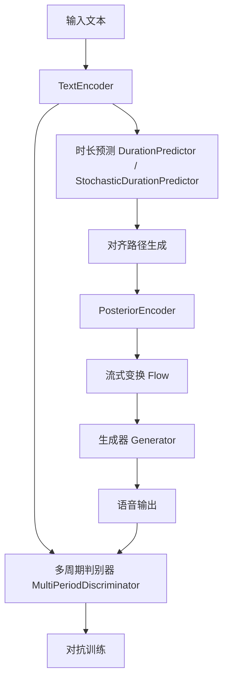
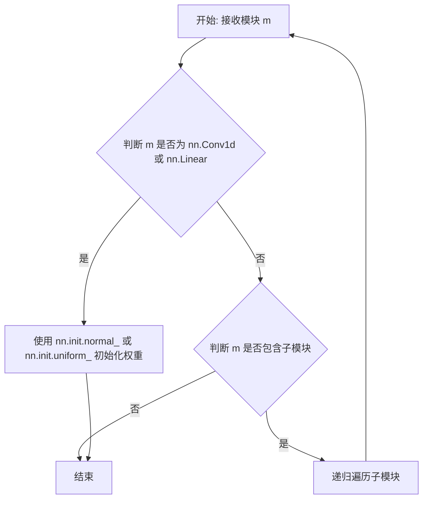
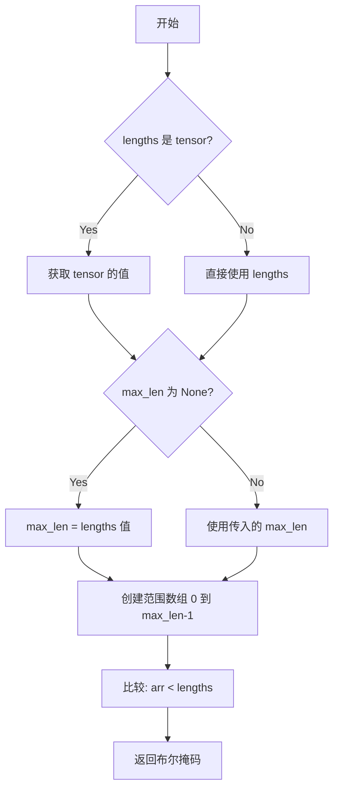
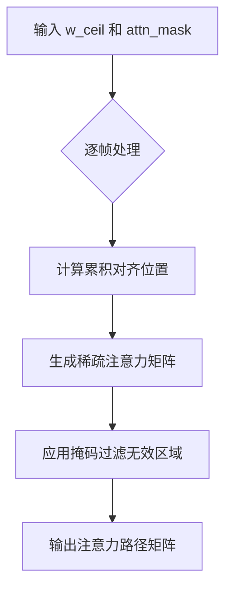
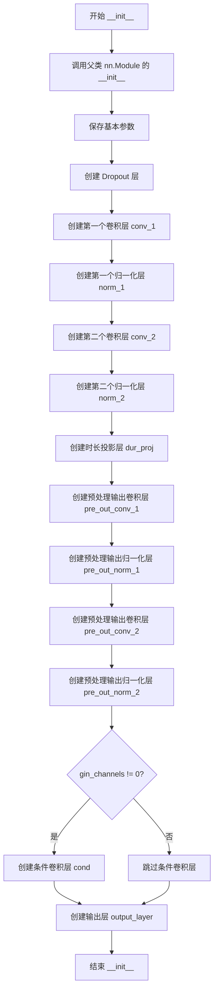
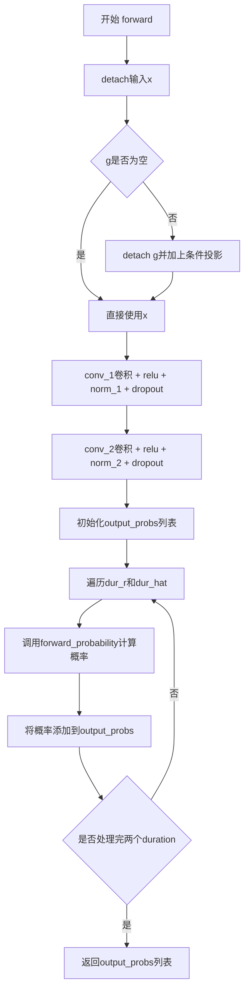
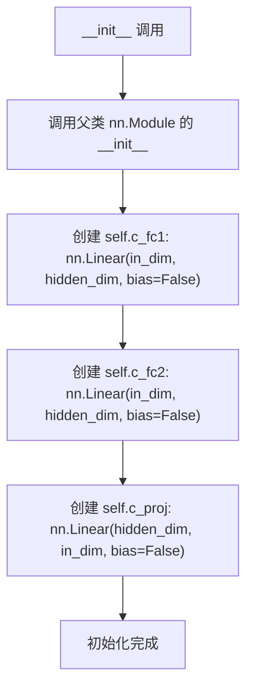
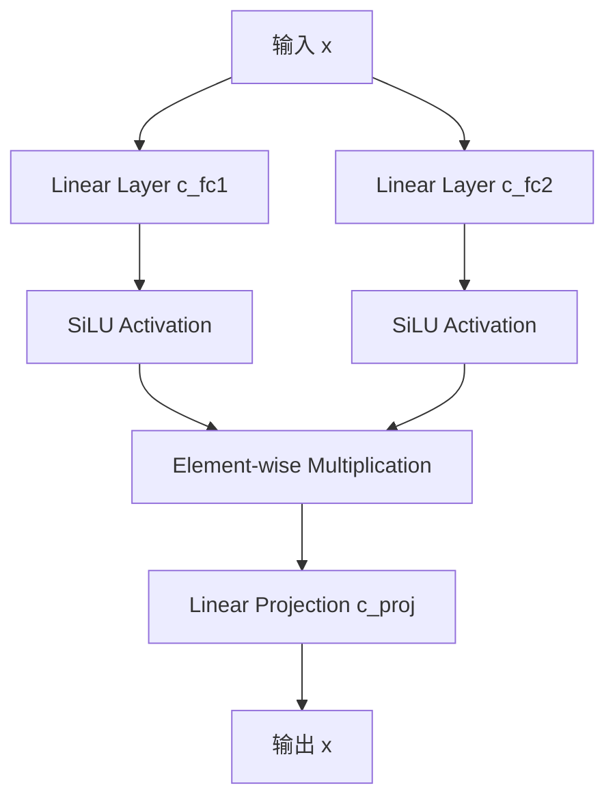

# `Bert-VITS2\onnx_modules\V220\models_onnx.py` 详细设计文档

这是一个VITS (Variational Inference with adversarial learning for end-to-end Text-to-Speech) 文本到语音合成模型的核心实现，包含文本编码、时长预测、流式变换、声码器生成和对抗训练等完整模块。

## 整体流程



## 类结构

```
torch.nn.Module (基类)
├── DurationDiscriminator (时长判别器)
├── TransformerCouplingBlock (Transformer耦合块)
├── StochasticDurationPredictor (随机时长预测器)
├── DurationPredictor (时长预测器)
├── Bottleneck (瓶颈层)
├── Block (Transformer块)
├── MLP (多层感知机)
├── TextEncoder (文本编码器)
├── ResidualCouplingBlock (残差耦合块)
├── PosteriorEncoder (后验编码器)
├── Generator (声码器生成器)
├── DiscriminatorP (周期判别器)
├── DiscriminatorS (规模判别器)
├── MultiPeriodDiscriminator (多周期判别器)
├── ReferenceEncoder (参考编码器)
└── SynthesizerTrn (主合成器)
```

## 全局变量及字段


### `symbols`
    
文本符号列表，从text模块导入

类型：`list`
    


### `num_tones`
    
音调数量，从text模块导入

类型：`int`
    


### `num_languages`
    
语言数量，从text模块导入

类型：`int`
    


### `LRELU_SLOPE`
    
LeakyReLU激活函数的斜率值

类型：`float`
    


### `DurationDiscriminator.in_channels`
    
输入特征通道数

类型：`int`
    


### `DurationDiscriminator.filter_channels`
    
卷积滤波器通道数

类型：`int`
    


### `DurationDiscriminator.kernel_size`
    
卷积核大小

类型：`int`
    


### `DurationDiscriminator.p_dropout`
    
Dropout概率

类型：`float`
    


### `DurationDiscriminator.gin_channels`
    
说话人嵌入通道数

类型：`int`
    


### `DurationDiscriminator.drop`
    
Dropout层

类型：`nn.Dropout`
    


### `DurationDiscriminator.conv_1`
    
第一个卷积层

类型：`nn.Conv1d`
    


### `DurationDiscriminator.norm_1`
    
第一个LayerNorm归一化层

类型：`modules.LayerNorm`
    


### `DurationDiscriminator.conv_2`
    
第二个卷积层

类型：`nn.Conv1d`
    


### `DurationDiscriminator.norm_2`
    
第二个LayerNorm归一化层

类型：`modules.LayerNorm`
    


### `DurationDiscriminator.dur_proj`
    
持续时间投影层

类型：`nn.Conv1d`
    


### `DurationDiscriminator.pre_out_conv_1`
    
预输出第一个卷积层

类型：`nn.Conv1d`
    


### `DurationDiscriminator.pre_out_norm_1`
    
预输出第一个LayerNorm层

类型：`modules.LayerNorm`
    


### `DurationDiscriminator.pre_out_conv_2`
    
预输出第二个卷积层

类型：`nn.Conv1d`
    


### `DurationDiscriminator.pre_out_norm_2`
    
预输出第二个LayerNorm层

类型：`modules.LayerNorm`
    


### `DurationDiscriminator.cond`
    
条件投影层，用于说话人嵌入

类型：`nn.Conv1d`
    


### `DurationDiscriminator.output_layer`
    
输出层，包含线性层和Sigmoid激活

类型：`nn.Sequential`
    


### `TransformerCouplingBlock.channels`
    
输入输出通道数

类型：`int`
    


### `TransformerCouplingBlock.hidden_channels`
    
隐藏层通道数

类型：`int`
    


### `TransformerCouplingBlock.kernel_size`
    
卷积核大小

类型：`int`
    


### `TransformerCouplingBlock.n_layers`
    
Transformer层数

类型：`int`
    


### `TransformerCouplingBlock.n_flows`
    
流模型数量

类型：`int`
    


### `TransformerCouplingBlock.gin_channels`
    
说话人嵌入通道数

类型：`int`
    


### `TransformerCouplingBlock.flows`
    
流模型模块列表

类型：`nn.ModuleList`
    


### `TransformerCouplingBlock.wn`
    
共享参数的FFT模块

类型：`attentions_onnx.FFT`
    


### `StochasticDurationPredictor.in_channels`
    
输入通道数

类型：`int`
    


### `StochasticDurationPredictor.filter_channels`
    
滤波器通道数

类型：`int`
    


### `StochasticDurationPredictor.kernel_size`
    
卷积核大小

类型：`int`
    


### `StochasticDurationPredictor.p_dropout`
    
Dropout概率

类型：`float`
    


### `StochasticDurationPredictor.n_flows`
    
流模型数量

类型：`int`
    


### `StochasticDurationPredictor.gin_channels`
    
说话人嵌入通道数

类型：`int`
    


### `StochasticDurationPredictor.log_flow`
    
对数流模块

类型：`modules.Log`
    


### `StochasticDurationPredictor.flows`
    
流模型模块列表

类型：`nn.ModuleList`
    


### `StochasticDurationPredictor.post_pre`
    
后处理预投影层

类型：`nn.Conv1d`
    


### `StochasticDurationPredictor.post_proj`
    
后处理投影层

类型：`nn.Conv1d`
    


### `StochasticDurationPredictor.post_convs`
    
后处理DDS卷积层

类型：`modules.DDSConv`
    


### `StochasticDurationPredictor.post_flows`
    
后处理流模块列表

类型：`nn.ModuleList`
    


### `StochasticDurationPredictor.pre`
    
预处理投影层

类型：`nn.Conv1d`
    


### `StochasticDurationPredictor.proj`
    
主投影层

类型：`nn.Conv1d`
    


### `StochasticDurationPredictor.convs`
    
主DDS卷积层

类型：`modules.DDSConv`
    


### `StochasticDurationPredictor.cond`
    
条件卷积层

类型：`nn.Conv1d`
    


### `DurationPredictor.in_channels`
    
输入通道数

类型：`int`
    


### `DurationPredictor.filter_channels`
    
滤波器通道数

类型：`int`
    


### `DurationPredictor.kernel_size`
    
卷积核大小

类型：`int`
    


### `DurationPredictor.p_dropout`
    
Dropout概率

类型：`float`
    


### `DurationPredictor.gin_channels`
    
说话人嵌入通道数

类型：`int`
    


### `DurationPredictor.drop`
    
Dropout层

类型：`nn.Dropout`
    


### `DurationPredictor.conv_1`
    
第一个卷积层

类型：`nn.Conv1d`
    


### `DurationPredictor.norm_1`
    
第一个LayerNorm层

类型：`modules.LayerNorm`
    


### `DurationPredictor.conv_2`
    
第二个卷积层

类型：`nn.Conv1d`
    


### `DurationPredictor.norm_2`
    
第二个LayerNorm层

类型：`modules.LayerNorm`
    


### `DurationPredictor.proj`
    
输出投影层

类型：`nn.Conv1d`
    


### `DurationPredictor.cond`
    
条件卷积层

类型：`nn.Conv1d`
    


### `Block.norm`
    
LayerNorm归一化层

类型：`nn.LayerNorm`
    


### `Block.mlp`
    
MLP模块

类型：`MLP`
    


### `MLP.c_fc1`
    
第一个全连接层

类型：`nn.Linear`
    


### `MLP.c_fc2`
    
第二个全连接层

类型：`nn.Linear`
    


### `MLP.c_proj`
    
投影全连接层

类型：`nn.Linear`
    


### `TextEncoder.n_vocab`
    
词汇表大小

类型：`int`
    


### `TextEncoder.out_channels`
    
输出通道数

类型：`int`
    


### `TextEncoder.hidden_channels`
    
隐藏层通道数

类型：`int`
    


### `TextEncoder.filter_channels`
    
滤波器通道数

类型：`int`
    


### `TextEncoder.n_heads`
    
注意力头数

类型：`int`
    


### `TextEncoder.n_layers`
    
编码器层数

类型：`int`
    


### `TextEncoder.kernel_size`
    
卷积核大小

类型：`int`
    


### `TextEncoder.p_dropout`
    
Dropout概率

类型：`float`
    


### `TextEncoder.gin_channels`
    
说话人嵌入通道数

类型：`int`
    


### `TextEncoder.emb`
    
文本嵌入层

类型：`nn.Embedding`
    


### `TextEncoder.tone_emb`
    
音调嵌入层

类型：`nn.Embedding`
    


### `TextEncoder.language_emb`
    
语言嵌入层

类型：`nn.Embedding`
    


### `TextEncoder.bert_proj`
    
BERT投影层

类型：`nn.Conv1d`
    


### `TextEncoder.ja_bert_proj`
    
日语BERT投影层

类型：`nn.Conv1d`
    


### `TextEncoder.en_bert_proj`
    
英语BERT投影层

类型：`nn.Conv1d`
    


### `TextEncoder.n_speakers`
    
说话人数量

类型：`int`
    


### `TextEncoder.in_feature_net`
    
情感特征输入网络

类型：`nn.Sequential`
    


### `TextEncoder.emo_vq`
    
情感向量量化器

类型：`VectorQuantize`
    


### `TextEncoder.out_feature_net`
    
情感特征输出网络

类型：`nn.Linear`
    


### `TextEncoder.encoder`
    
文本编码器

类型：`attentions_onnx.Encoder`
    


### `TextEncoder.proj`
    
输出投影层

类型：`nn.Conv1d`
    


### `ResidualCouplingBlock.channels`
    
通道数

类型：`int`
    


### `ResidualCouplingBlock.hidden_channels`
    
隐藏层通道数

类型：`int`
    


### `ResidualCouplingBlock.kernel_size`
    
卷积核大小

类型：`int`
    


### `ResidualCouplingBlock.dilation_rate`
    
膨胀率

类型：`int`
    


### `ResidualCouplingBlock.n_layers`
    
层数

类型：`int`
    


### `ResidualCouplingBlock.n_flows`
    
流模型数量

类型：`int`
    


### `ResidualCouplingBlock.gin_channels`
    
说话人嵌入通道数

类型：`int`
    


### `ResidualCouplingBlock.flows`
    
流模型模块列表

类型：`nn.ModuleList`
    


### `PosteriorEncoder.in_channels`
    
输入通道数

类型：`int`
    


### `PosteriorEncoder.out_channels`
    
输出通道数

类型：`int`
    


### `PosteriorEncoder.hidden_channels`
    
隐藏层通道数

类型：`int`
    


### `PosteriorEncoder.kernel_size`
    
卷积核大小

类型：`int`
    


### `PosteriorEncoder.dilation_rate`
    
膨胀率

类型：`int`
    


### `PosteriorEncoder.n_layers`
    
层数

类型：`int`
    


### `PosteriorEncoder.gin_channels`
    
说话人嵌入通道数

类型：`int`
    


### `PosteriorEncoder.pre`
    
预处理卷积层

类型：`nn.Conv1d`
    


### `PosteriorEncoder.enc`
    
WaveNet编码器

类型：`modules.WN`
    


### `PosteriorEncoder.proj`
    
输出投影层

类型：`nn.Conv1d`
    


### `Generator.num_kernels`
    
残差块卷积核数量

类型：`int`
    


### `Generator.num_upsamples`
    
上采样层数量

类型：`int`
    


### `Generator.conv_pre`
    
前置卷积层

类型：`Conv1d`
    


### `Generator.ups`
    
上采样模块列表

类型：`nn.ModuleList`
    


### `Generator.resblocks`
    
残差块模块列表

类型：`nn.ModuleList`
    


### `Generator.conv_post`
    
后置卷积层

类型：`Conv1d`
    


### `Generator.cond`
    
条件卷积层

类型：`nn.Conv1d`
    


### `DiscriminatorP.period`
    
周期值

类型：`int`
    


### `DiscriminatorP.use_spectral_norm`
    
是否使用谱归一化

类型：`bool`
    


### `DiscriminatorP.convs`
    
卷积层列表

类型：`nn.ModuleList`
    


### `DiscriminatorP.conv_post`
    
后置卷积层

类型：`nn.Conv2d`
    


### `DiscriminatorS.convs`
    
卷积层列表

类型：`nn.ModuleList`
    


### `DiscriminatorS.conv_post`
    
后置卷积层

类型：`nn.Conv1d`
    


### `MultiPeriodDiscriminator.discriminators`
    
判别器模块列表

类型：`nn.ModuleList`
    


### `ReferenceEncoder.spec_channels`
    
频谱通道数

类型：`int`
    


### `ReferenceEncoder.convs`
    
卷积层列表

类型：`nn.ModuleList`
    


### `ReferenceEncoder.gru`
    
GRU循环层

类型：`nn.GRU`
    


### `ReferenceEncoder.proj`
    
输出投影层

类型：`nn.Linear`
    


### `SynthesizerTrn.n_vocab`
    
词汇表大小

类型：`int`
    


### `SynthesizerTrn.spec_channels`
    
频谱通道数

类型：`int`
    


### `SynthesizerTrn.inter_channels`
    
中间通道数

类型：`int`
    


### `SynthesizerTrn.hidden_channels`
    
隐藏层通道数

类型：`int`
    


### `SynthesizerTrn.filter_channels`
    
滤波器通道数

类型：`int`
    


### `SynthesizerTrn.n_heads`
    
注意力头数

类型：`int`
    


### `SynthesizerTrn.n_layers`
    
编码器层数

类型：`int`
    


### `SynthesizerTrn.kernel_size`
    
卷积核大小

类型：`int`
    


### `SynthesizerTrn.p_dropout`
    
Dropout概率

类型：`float`
    


### `SynthesizerTrn.resblock`
    
残差块类型

类型：`str`
    


### `SynthesizerTrn.resblock_kernel_sizes`
    
残差块卷积核大小列表

类型：`list`
    


### `SynthesizerTrn.resblock_dilation_sizes`
    
残差块膨胀大小列表

类型：`list`
    


### `SynthesizerTrn.upsample_rates`
    
上采样率列表

类型：`list`
    


### `SynthesizerTrn.upsample_initial_channel`
    
上采样初始通道数

类型：`int`
    


### `SynthesizerTrn.upsample_kernel_sizes`
    
上采样卷积核大小列表

类型：`list`
    


### `SynthesizerTrn.segment_size`
    
音频片段大小

类型：`int`
    


### `SynthesizerTrn.n_speakers`
    
说话人数量

类型：`int`
    


### `SynthesizerTrn.gin_channels`
    
说话人嵌入通道数

类型：`int`
    


### `SynthesizerTrn.n_layers_trans_flow`
    
Transformer流层数

类型：`int`
    


### `SynthesizerTrn.use_spk_conditioned_encoder`
    
是否使用说话人条件编码器

类型：`bool`
    


### `SynthesizerTrn.use_sdp`
    
是否使用随机持续时间预测器

类型：`bool`
    


### `SynthesizerTrn.use_noise_scaled_mas`
    
是否使用噪声缩放MAS

类型：`bool`
    


### `SynthesizerTrn.mas_noise_scale_initial`
    
MAS噪声缩放初始值

类型：`float`
    


### `SynthesizerTrn.noise_scale_delta`
    
噪声缩放增量

类型：`float`
    


### `SynthesizerTrn.current_mas_noise_scale`
    
当前MAS噪声缩放值

类型：`float`
    


### `SynthesizerTrn.enc_gin_channels`
    
编码器说话人嵌入通道数

类型：`int`
    


### `SynthesizerTrn.enc_p`
    
文本编码器

类型：`TextEncoder`
    


### `SynthesizerTrn.dec`
    
生成器

类型：`Generator`
    


### `SynthesizerTrn.enc_q`
    
后验编码器

类型：`PosteriorEncoder`
    


### `SynthesizerTrn.flow`
    
流模型

类型：`TransformerCouplingBlock/ResidualCouplingBlock`
    


### `SynthesizerTrn.sdp`
    
随机持续时间预测器

类型：`StochasticDurationPredictor`
    


### `SynthesizerTrn.dp`
    
持续时间预测器

类型：`DurationPredictor`
    


### `SynthesizerTrn.emb_g`
    
说话人嵌入层

类型：`nn.Embedding`
    


### `SynthesizerTrn.ref_enc`
    
参考编码器

类型：`ReferenceEncoder`
    
    

## 全局函数及方法


### `init_weights`

该函数是 `commons` 模块中的权重初始化工具函数，用于递归初始化神经网络模型中各层的权重参数，通常采用正态分布或均匀分布进行随机初始化，以确保模型训练的稳定性和收敛速度。

参数：

- `m`：`torch.nn.Module`，需要初始化权重的神经网络模块（如卷积层、线性层等）

返回值：`None`，该函数直接修改传入模块的权重，不返回任何值。

#### 流程图



#### 带注释源码

```
# 注意: 以下源码是基于 commons 模块的常见实现模式推断的，
# 实际的 init_weights 实现可能略有不同。

def init_weights(m):
    """
    递归初始化神经网络模块的权重参数
    
    参数:
        m: torch.nn.Module - 需要初始化权重的模块
    """
    # 判断是否为卷积层或线性层
    if isinstance(m, nn.Conv1d) or isinstance(m, nn.Linear):
        # 使用正态分布初始化权重
        # 均值为 0.0，标准差为隐藏维度的倒数平方根
        # 这是一种常见的稳定初始化方法
        nn.init.normal_(m.weight, 0.0, ???)  # 标准差参数需根据具体实现确定
        
        # 如果存在偏置项，初始化为 0
        if m.bias is not None:
            nn.init.zeros_(m.bias)
    
    # 如果模块包含子模块，递归初始化
    elif isinstance(m, nn.Module):
        for child in m.children():
            init_weights(child)
```


### `commons.get_padding`

计算卷积层的填充大小，确保输出特征图与输入具有相同的维度。

参数：

- `kernel_size`：`int`，卷积核的大小
- `dilation`：`int`，卷积膨胀率（默认为1）

返回值：`int`，填充大小

#### 流程图

```mermaid
flowchart TD
    A[开始] --> B[输入 kernel_size, dilation]
    B --> C[计算 padding = (kernel_size - 1) \* (dilation - 1) // 2 + kernel_size // 2]
    C --> D[返回 padding]
    D --> E[结束]
```

#### 带注释源码

```
def get_padding(kernel_size, dilation=1):
    """
    计算卷积填充大小，使输出与输入保持相同维度
    
    参数:
        kernel_size: 卷积核大小
        dilation: 膨胀率，默认为1
    
    返回:
        填充大小
    """
    return int((kernel_size - 1) * (dilation - 1) / 2) + kernel_size // 2
```


### `commons.sequence_mask`

生成一个布尔掩码，用于指示序列中有效位置（用于处理变长序列）。

参数：

- `lengths`：`torch.Tensor` 或 `int`，序列的实际长度
- `max_len`：`int` 或 `None`，掩码的最大长度。如果为 `None`，则使用 `lengths` 的值

返回值：`torch.Tensor`，形状为 `(max_len,)` 的布尔掩码，其中前 `lengths` 个元素为 `True`，其余为 `False`

#### 流程图



#### 带注释源码

```python
def sequence_mask(lengths, max_len=None):
    """
    生成一个布尔掩码，用于指示序列中有效位置。
    
    参数:
        lengths: 序列的实际长度，可以是 tensor 或 int
        max_len: 掩码的最大长度，默认为 None，此时使用 lengths 的值
    
    返回:
        布尔掩码张量，形状为 (max_len,)
    """
    if max_len is None:
        # 如果未指定最大长度，则使用序列长度作为最大值
        max_len = lengths if isinstance(lengths, int) else lengths.max().item()
    
    # 生成从 0 到 max_len-1 的范围数组
    # 然后与 lengths 比较，生成布尔掩码
    # 例如: lengths=3, max_len=5 -> [True, True, True, False, False]
    range = torch.arange(max_len, dtype=torch.long, device=lengths.device) if isinstance(lengths, torch.Tensor) else torch.arange(max_len, dtype=torch.long)
    
    # 扩展 lengths 维度以便广播比较
    if isinstance(lengths, torch.Tensor):
        lengths_expanded = lengths.unsqueeze(-1) if lengths.dim() > 0 else lengths
    else:
        lengths_expanded = lengths
    
    return range < lengths_expanded
```


### `commons.generate_path`

该函数用于根据预测的持续时间（duration）生成注意力路径矩阵（attention path matrix）。在 VITS 等神经语音合成模型中，它将文本序列的每个字符映射到音频序列的帧，是构建对齐关系的核心组件。

参数：

-  `w_ceil`：`torch.Tensor`，上采样后的持续时间预测值（取整后的权重矩阵），形状为 [batch, 1, time_steps]
-  `attn_mask`：`torch.Tensor`，注意力掩码矩阵，用于控制有效位置，形状为 [batch, 1, input_len, output_len]

返回值：`torch.Tensor`，生成的注意力路径矩阵，形状为 [batch, 1, input_len, output_len]，表示每个输入 token 对应输出帧的注意力权重分布。

#### 流程图



#### 带注释源码

```python
# 使用示例（来自 SynthesizerTrn.export_onnx 方法）
# w_ceil: 上采样后的持续时间（取整）
w_ceil = torch.ceil(w)
# attn_mask: 输入序列掩码 × 输出序列掩码
attn_mask = torch.unsqueeze(x_mask, 2) * torch.unsqueeze(y_mask, -1)
# 生成注意力路径矩阵
attn = commons.generate_path(w_ceil, attn_mask)

# 生成的 attn 用于后续的 matmul 操作，将文本侧特征映射到音频侧特征
m_p = torch.matmul(attn.squeeze(1), m_p.transpose(1, 2)).transpose(1, 2)
logs_p = torch.matmul(attn.squeeze(1), logs_p.transpose(1, 2)).transpose(1, 2)
```

> **注意**：由于 `generate_path` 函数的完整实现代码未在提供的代码片段中给出，以上信息基于其在 `SynthesizerTrn` 类中的调用方式推断得出。该函数通常通过持续时间预测器输出的 logw 转换为实际的帧级别对齐路径。


### `DurationDiscriminator.__init__`

该方法是VITS2模型中用于判别语音时长的判别器类的初始化方法，负责构建判别器的网络结构，包括卷积层、归一化层、时长投影层、预处理输出层和输出层，并支持说话人条件信息的嵌入。

参数：

- `in_channels`：`int`，输入特征的通道数
- `filter_channels`：`int`，卷积层中滤波器（特征）的通道数
- `kernel_size`：`int`，卷积核的大小
- `p_dropout`：`float`，Dropout的概率，用于防止过拟合
- `gin_channels`：`int`（默认值=0），说话人嵌入（speaker embedding）通道数，如果为0则不使用说话人条件

返回值：`None`，该方法为初始化方法，不返回任何值，仅初始化对象的属性

#### 流程图



#### 带注释源码

```python
def __init__(
    self, in_channels, filter_channels, kernel_size, p_dropout, gin_channels=0
):
    """
    初始化 DurationDiscriminator 判别器
    
    参数:
        in_channels: 输入特征的通道数
        filter_channels: 卷积层中滤波器通道数
        kernel_size: 卷积核大小
        p_dropout: Dropout 概率
        gin_channels: 说话人嵌入通道数，默认为0表示不使用
    """
    # 调用父类 nn.Module 的初始化方法
    super().__init__()

    # 保存传入的基本参数作为实例属性
    self.in_channels = in_channels          # 输入通道数
    self.filter_channels = filter_channels  # 滤波器通道数
    self.kernel_size = kernel_size          # 卷积核大小
    self.p_dropout = p_dropout              # Dropout 概率
    self.gin_channels = gin_channels        # 说话人嵌入通道数

    # 创建 Dropout 层，用于防止过拟合
    self.drop = nn.Dropout(p_dropout)
    
    # 第一个卷积层：从 in_channels 转换到 filter_channels
    # padding=kernel_size//2 确保输出与输入长度相同（当 stride=1 时）
    self.conv_1 = nn.Conv1d(
        in_channels, filter_channels, kernel_size, padding=kernel_size // 2
    )
    # 第一个归一化层，对 filter_channels 维进行 LayerNorm
    self.norm_1 = modules.LayerNorm(filter_channels)
    
    # 第二个卷积层：保持 filter_channels 通道数不变
    self.conv_2 = nn.Conv1d(
        filter_channels, filter_channels, kernel_size, padding=kernel_size // 2
    )
    # 第二个归一化层
    self.norm_2 = modules.LayerNorm(filter_channels)
    
    # 时长投影层：将时长信息（1通道）映射到 filter_channels 维度
    self.dur_proj = nn.Conv1d(1, filter_channels, 1)

    # 预处理输出卷积层：将 2*filter_channels（拼接后的维度）映射到 filter_channels
    self.pre_out_conv_1 = nn.Conv1d(
        2 * filter_channels, filter_channels, kernel_size, padding=kernel_size // 2
    )
    # 预处理输出归一化层
    self.pre_out_norm_1 = modules.LayerNorm(filter_channels)
    
    # 预处理输出卷积层 2：保持 filter_channels 通道数
    self.pre_out_conv_2 = nn.Conv1d(
        filter_channels, filter_channels, kernel_size, padding=kernel_size // 2
    )
    # 预处理输出归一化层 2
    self.pre_out_norm_2 = modules.LayerNorm(filter_channels)

    # 如果使用了说话人嵌入（gin_channels > 0），创建条件卷积层
    # 将说话人嵌入从 gin_channels 映射到 in_channels
    if gin_channels != 0:
        self.cond = nn.Conv1d(gin_channels, in_channels, 1)

    # 输出层：先通过线性层将 filter_channels 映射到 1，再通过 Sigmoid 激活
    # 输出为 0-1 之间的概率值，表示时长判别结果
    self.output_layer = nn.Sequential(nn.Linear(filter_channels, 1), nn.Sigmoid())
```


### `DurationDiscriminator.forward_probability`

该方法计算持续时间预测的概率值，通过将输入特征与持续时间信息拼接后，经过卷积神经网络处理，最终输出一个介于0到1之间的概率值，用于判别持续时间的合理性。

参数：

-  `x`：`torch.Tensor`，输入特征，通常是经过前面卷积层处理的隐藏状态，形状为 `[batch, channels, time]`
-  `x_mask`：`torch.Tensor`，时间步掩码，用于标识有效的时间步，形状为 `[batch, 1, time]`
-  `dur`：`torch.Tensor`，持续时间信息，通常是预测的或真实的持续时间，形状为 `[batch, 1, time]`
-  `g`：`torch.Tensor` 或 `None`，可选的说话人条件嵌入，用于条件化生成，形状为 `[batch, gin_channels, 1]`

返回值：`torch.Tensor`，输出概率值，形状为 `[batch, time, 1]`，值域在 [0, 1] 之间，表示持续时间预测的概率

#### 流程图

```mermaid
flowchart TD
    A[输入: x, x_mask, dur] --> B[dur_proj: dur投影到filter_channels维度]
    B --> C[concat: 在通道维度拼接x和dur]
    C --> D[pre_out_conv_1: 第一次卷积]
    D --> E[relu: 激活函数]
    E --> F[pre_out_norm_1: 第一次LayerNorm]
    F --> G[drop: Dropout]
    G --> H[pre_out_conv_2: 第二次卷积]
    H --> I[relu: 激活函数]
    I --> J[pre_out_norm_2: 第二次LayerNorm]
    J --> K[drop: Dropout]
    K --> L[mask: 应用x_mask掩码]
    L --> M[transpose: 维度从[B,C,T]转置为[B,T,C]]
    M --> N[output_layer: 线性层 + Sigmoid]
    N --> O[输出: output_prob]
```

#### 带注释源码

```python
def forward_probability(self, x, x_mask, dur, g=None):
    """
    计算持续时间预测的概率值
    
    参数:
        x: 输入特征 [batch, channels, time]
        x_mask: 时间步掩码 [batch, 1, time]
        dur: 持续时间信息 [batch, 1, time]
        g: 可选的说话人嵌入 [batch, gin_channels, 1]
    
    返回:
        output_prob: 概率值 [batch, time, 1]
    """
    # 步骤1: 将持续时间投影到filter_channels维度
    # dur_proj是一个1x1卷积，将持续时间从1维扩展到filter_channels维
    dur = self.dur_proj(dur)  # [batch, filter_channels, time]
    
    # 步骤2: 在通道维度拼接输入特征和持续时间
    # 拼接后的通道数变为 in_channels + filter_channels
    x = torch.cat([x, dur], dim=1)  # [batch, in_channels + filter_channels, time]
    
    # 步骤3: 第一次卷积块处理
    x = self.pre_out_conv_1(x * x_mask)  # 卷积: [batch, filter_channels, time]
    x = torch.relu(x)                     # ReLU激活
    x = self.pre_out_norm_1(x)            # LayerNorm
    x = self.drop(x)                      # Dropout
    
    # 步骤4: 第二次卷积块处理
    x = self.pre_out_conv_2(x * x_mask)  # 卷积: [batch, filter_channels, time]
    x = torch.relu(x)                     # ReLU激活
    x = self.pre_out_norm_2(x)            # LayerNorm
    x = self.drop(x)                      # Dropout
    
    # 步骤5: 应用掩码并转置维度
    x = x * x_mask                        # 确保无效位置为0
    x = x.transpose(1, 2)                # 转置: [batch, time, filter_channels]
    
    # 步骤6: 输出层 - 线性变换 + Sigmoid激活
    # output_layer是一个Sequential，包含Linear和Sigmoid
    # 将filter_channels维映射到1维，并转换为概率值
    output_prob = self.output_layer(x)   # [batch, time, 1], 值域[0,1]
    
    return output_prob
```


### `DurationDiscriminator.forward`

该方法是一个判别器的前向传播过程，用于判断输入的持续时间（duration）是真实的还是预测的。在训练过程中，它接收编码器的输出特征、特征掩码、真实持续时间和预测持续时间作为输入，通过一系列卷积层和条件投影来提取特征，最后分别对真实和预测的持续时间进行概率输出，以支持GAN训练中的对抗性学习。

参数：

- `self`：`DurationDiscriminator`，类的实例本身
- `x`：`torch.Tensor`，输入特征，来自编码器的输出，形状为 [batch, channels, time]
- `x_mask`：`torch.Tensor`，输入特征的掩码，用于标识有效时间步，形状为 [batch, 1, time]
- `dur_r`：`torch.Tensor`，真实的持续时间，形状为 [batch, 1, time]
- `dur_hat`：`torch.Tensor`，预测的持续时间（来自生成器），形状为 [batch, 1, time]
- `g`：`torch.Tensor`，说话人嵌入向量（可选），用于条件输入，形状为 [batch, gin_channels, 1]

返回值：`List[torch.Tensor]`，包含两个概率值的列表，第一个是对真实持续时间的概率判断，第二个是对预测持续时间的概率判断，每个概率值的形状为 [batch, time, 1]

#### 流程图



#### 带注释源码

```python
def forward(self, x, x_mask, dur_r, dur_hat, g=None):
    """
    DurationDiscriminator的前向传播方法
    
    参数:
        x: 输入特征张量，形状为[batch, in_channels, time]
        x_mask: 输入特征的掩码，形状为[batch, 1, time]
        dur_r: 真实的持续时间，形状为[batch, 1, time]
        dur_hat: 预测的持续时间，形状为[batch, 1, time]
        g: 说话人嵌入（可选），形状为[batch, gin_channels, 1]
    
    返回:
        包含两个概率值的列表：[output_prob_real, output_prob_predicted]
    """
    
    # 分离输入x的计算图，防止梯度回传到encoder
    x = torch.detach(x)
    
    # 如果提供了说话人嵌入g，则将其detach并通过条件投影层加到x上
    if g is not None:
        g = torch.detach(g)  # 分离g的计算图
        x = x + self.cond(g)  # 通过条件投影层融合说话人信息
    
    # 第一次卷积块：卷积 -> ReLU激活 -> LayerNorm -> Dropout
    x = self.conv_1(x * x_mask)  # 卷积，将in_channels映射到filter_channels
    x = torch.relu(x)  # ReLU激活
    x = self.norm_1(x)  # LayerNorm归一化
    x = self.drop(x)  # Dropout正则化
    
    # 第二次卷积块：卷积 -> ReLU激活 -> LayerNorm -> Dropout
    x = self.conv_2(x * x_mask)  # 卷积，保持filter_channels维度
    x = torch.relu(x)  # ReLU激活
    x = self.norm_2(x)  # LayerNorm归一化
    x = self.drop(x)  # Dropout正则化
    
    # 初始化输出概率列表
    output_probs = []
    
    # 分别对真实持续时间dur_r和预测持续时间dur_hat进行概率计算
    for dur in [dur_r, dur_hat]:
        # 调用内部方法forward_probability计算每个duration的概率
        output_prob = self.forward_probability(x, x_mask, dur, g)
        output_probs.append(output_prob)  # 添加到概率列表
    
    # 返回包含两个概率的列表：[真实duration的概率, 预测duration的概率]
    return output_probs
```


### `TransformerCouplingBlock.__init__`

该方法是 VITS2 文本转语音模型中 Transformer 耦合块（Transformer Coupling Block）的初始化函数，用于构建基于 Transformer 的归一化流（Flow）模型，通过交替使用 Transformer 耦合层和翻转层来实现音频潜在变量的双向变换，支持参数共享以减少内存占用。

参数：

- `channels`：`int`，输入/输出通道数，决定数据的维度
- `hidden_channels`：`int`，隐藏层通道数，用于 Transformer 注意力机制
- `filter_channels`：`int`，滤波器通道数，用于前馈网络
- `n_heads`：`int`，多头注意力机制的头数
- `n_layers`：`int`，Transformer 层的数量
- `kernel_size`：`int`，卷积核大小，用于位置编码
- `p_dropout`：`float`，Dropout 概率，用于正则化
- `n_flows`：`int`，流模型的数量，默认为 4
- `gin_channels`：`int`，说话人嵌入的通道数，默认为 0（无条件）
- `share_parameter`：`bool`，是否在所有流层间共享权重参数，默认为 False

返回值：无（`__init__` 方法返回 `None`）

#### 流程图

```mermaid
flowchart TD
    A[开始 __init__] --> B[调用 super().__init__ 初始化 nn.Module]
    B --> C[设置实例属性: channels, hidden_channels, kernel_size, n_layers, n_flows, gin_channels]
    C --> D[初始化 flows 为空 nn.ModuleList]
    D --> E{share_parameter 为 True?}
    E -->|是| F[创建共享的 attentions_onnx.FFT 权重网络 wn]
    E -->|否| G[wn 设置为 None]
    F --> H[循环创建 n_flows 个流层]
    G --> H
    H --> I[在循环中: 添加 TransformerCouplingLayer 到 flows]
    I --> J[在循环中: 添加 Flip 层到 flows]
    J --> K[结束]
```

#### 带注释源码

```python
def __init__(
    self,
    channels,              # int: 输入/输出通道数
    hidden_channels,       # int: 隐藏层通道数
    filter_channels,       # int: 滤波器通道数
    n_heads,               # int: 注意力头数
    n_layers,              # int: Transformer 层数
    kernel_size,           # int: 卷积核大小
    p_dropout,             # float: Dropout 概率
    n_flows=4,             # int: 流数量，默认 4
    gin_channels=0,        # int: 说话人条件通道，默认 0
    share_parameter=False, # bool: 是否共享参数，默认 False
):
    """
    初始化 TransformerCouplingBlock 归一化流模型
    
    参数:
        channels: 输入输出通道数
        hidden_channels: 隐藏层维度
        filter_channels: 滤波器通道数
        n_heads: 注意力头数
        n_layers: Transformer 层数
        kernel_size: 卷积核大小
        p_dropout: Dropout 概率
        n_flows: 流层数量
        gin_channels: 说话人嵌入通道数
        share_parameter: 是否共享 FFT 权重
    """
    super().__init__()  # 调用父类 nn.Module 初始化
    
    # 保存配置参数到实例属性
    self.channels = channels
    self.hidden_channels = hidden_channels
    self.kernel_size = kernel_size
    self.n_layers = n_layers
    self.n_flows = n_flows
    self.gin_channels = gin_channels
    
    # 初始化流模块列表
    self.flows = nn.ModuleList()
    
    # 条件参数共享: 创建共享的 FFT 权重网络
    # 当 share_parameter=True 时，所有 TransformerCouplingLayer 共享同一个 FFT 网络
    self.wn = (
        attentions_onnx.FFT(
            hidden_channels,
            filter_channels,
            n_heads,
            n_layers,
            kernel_size,
            p_dropout,
            isflow=True,  # 标记为流模型使用
            gin_channels=self.gin_channels,
        )
        if share_parameter
        else None
    )
    
    # 构建 n_flows 个归一化流
    # 每个流包含一个 TransformerCouplingLayer 和一个 Flip 层
    for i in range(n_flows):
        # 添加 Transformer 耦合层: 实现仿射耦合变换
        self.flows.append(
            modules.TransformerCouplingLayer(
                channels,
                hidden_channels,
                kernel_size,
                n_layers,
                n_heads,
                p_dropout,
                filter_channels,
                mean_only=True,  # 仅预测均值，logstd 设为 0
                wn_sharing_parameter=self.wn,  # 共享权重网络
                gin_channels=self.gin_channels,
            )
        )
        # 添加翻转层: 用于交替变换输入通道的顺序
        self.flows.append(modules.Flip())
```


### `TransformerCouplingBlock.forward`

该方法实现了Transformer耦合块的前向传播，用于在变分自编码器流模型中对潜在变量进行变换。当`reverse=False`时，按顺序应用所有流层进行前向变换；当`reverse=True`时（默认），按反向顺序应用流层进行逆向变换，常用于从潜在变量生成目标数据。

参数：

-  `x`：`torch.Tensor`，输入张量，形状为 [batch, channels, time]，需要经过流变换的特征
-  `x_mask`：`torch.Tensor`，时间维度的掩码，用于处理变长序列，防止填充部分参与计算
-  `g`：可选的 `torch.Tensor`，全局条件输入，通常为说话人嵌入或其他条件信息，默认为 None
-  `reverse`：`bool`，控制流动方向，True 表示逆向变换（从潜在空间到数据空间），False 表示正向变换，默认为 True

返回值：`torch.Tensor`，经过流变换后的输出张量，形状与输入 x 相同

#### 流程图

```mermaid
flowchart TD
    A[开始 forward] --> B{reverse 参数}
    B -->|False| C[正序遍历 self.flows]
    B -->|True| D[逆序遍历 self.flows]
    
    C --> E[flow = flows[i]]
    E --> F[调用 flow.forward<br/>x, _ = flow(x, x_mask, g=g, reverse=reverse)]
    F --> G{还有更多 flow?}
    G -->|是| E
    G -->|否| H[返回变换后的 x]
    
    D --> I[flow = reversed_flows[i]]
    I --> J[调用 flow.forward<br/>x = flow(x, x_mask, g=g, reverse=reverse)]
    J --> K{还有更多 flow?}
    K -->|是| I
    K -->|否| H
    
    H --> L[结束 forward]
```

#### 带注释源码

```python
def forward(self, x, x_mask, g=None, reverse=True):
    """
    Transformer耦合块的前向传播方法
    
    参数:
        x: 输入张量 [batch, channels, time]，需要变换的特征
        x_mask: 时间掩码 [batch, 1, time]，标识有效时间步
        g: 全局条件 [batch, gin_channels, 1]，可选的条件信息（如说话人ID）
        reverse: 布尔值，True为逆向变换（采样），False为正向变换（训练）
    
    返回:
        x: 变换后的张量 [batch, channels, time]
    """
    # 当 reverse=False 时，执行正向流变换
    # 按原始顺序遍历所有流层
    if not reverse:
        for flow in self.flows:
            # 每个流层接收输入、掩码和条件，执行一次变换
            # 返回变换后的 x 和日志行列式（此处用 _ 忽略）
            x, _ = flow(x, x_mask, g=g, reverse=reverse)
    else:
        # 当 reverse=True 时，执行逆向流变换（从潜在空间重建数据）
        # 按反向顺序遍历流层，这与正向变换顺序相反
        for flow in reversed(self.flows):
            # 逆向流只返回变换后的 x，不返回日志行列式
            x = flow(x, x_mask, g=g, reverse=reverse)
    
    # 返回经过所有流层变换后的最终结果
    return x
```


### `StochasticDurationPredictor.__init__`

用于初始化随机持续时间预测器的构造函数，配置模型的网络结构、卷积层、流模型和可学习参数。

参数：

- `in_channels`：`int`，输入特征通道数
- `filter_channels`：`int`，卷积层滤波器通道数
- `kernel_size`：`int`，卷积核大小
- `p_dropout`：`float`，Dropout 概率
- `n_flows`：`int`，流模型数量（默认值为 4）
- `gin_channels`：`int`，说话人条件编码的通道数（默认值为 0）

返回值：`None`，该方法为构造函数，不返回任何值

#### 流程图

```mermaid
flowchart TD
    A[开始 __init__] --> B[调用 super().__init__]
    B --> C[设置 filter_channels = in_channels]
    C --> D[初始化实例属性: in_channels, filter_channels, kernel_size, p_dropout, n_flows, gin_channels]
    D --> E[创建 log_flow: modules.Log]
    E --> F[初始化主_flows列表: 添加ElementwiseAffine和n_flows组ConvFlow+Flip]
    F --> G[创建后处理层: post_pre, post_proj, post_convs卷积]
    G --> H[初始化后处理_post_flows列表: ElementwiseAffine和4组ConvFlow+Flip]
    H --> I[创建主路径卷积: pre, proj, convs]
    I --> J{gin_channels != 0?}
    J -->|是| K[添加条件卷积层 cond]
    J -->|否| L[结束]
    K --> L
```

#### 带注释源码

```python
def __init__(
    self,
    in_channels,
    filter_channels,
    kernel_size,
    p_dropout,
    n_flows=4,
    gin_channels=0,
):
    """
    初始化随机持续时间预测器
    
    参数:
        in_channels: 输入特征通道数
        filter_channels: 滤波器通道数
        kernel_size: 卷积核大小
        p_dropout: Dropout概率
        n_flows: 流模型数量
        gin_channels: 说话人条件编码通道数
    """
    super().__init__()  # 调用父类nn.Module的初始化方法
    
    # 注释: filter_channels被设置为与in_channels相同,
    # 代码注释说明这应该在未来版本中移除
    filter_channels = in_channels  # it needs to be removed from future version.
    
    # 存储模型配置参数
    self.in_channels = in_channels
    self.filter_channels = filter_channels
    self.kernel_size = kernel_size
    self.p_dropout = p_dropout
    self.n_flows = n_flows
    self.gin_channels = gin_channels

    # 创建对数流模块,用于概率分布建模
    self.log_flow = modules.Log()
    
    # 主流(Normalizing Flow)模块列表
    self.flows = nn.ModuleList()
    # 初始添加仿射变换层
    self.flows.append(modules.ElementwiseAffine(2))
    # 添加n_flows组流模型: ConvFlow + Flip
    for i in range(n_flows):
        self.flows.append(
            modules.ConvFlow(2, filter_channels, kernel_size, n_layers=3)
        )
        self.flows.append(modules.Flip())

    # 后处理卷积层
    self.post_pre = nn.Conv1d(1, filter_channels, 1)      # 输入投影
    self.post_proj = nn.Conv1d(filter_channels, filter_channels, 1)  # 输出投影
    # DDSConv: 深度可分离膨胀卷积,用于更高效的上下文建模
    self.post_convs = modules.DDSConv(
        filter_channels, kernel_size, n_layers=3, p_dropout=p_dropout
    )
    
    # 后处理流模块列表
    self.post_flows = nn.ModuleList()
    self.post_flows.append(modules.ElementwiseAffine(2))
    # 添加4组后处理流模型
    for i in range(4):
        self.post_flows.append(
            modules.ConvFlow(2, filter_channels, kernel_size, n_layers=3)
        )
        self.post_flows.append(modules.Flip())

    # 主路径卷积层
    self.pre = nn.Conv1d(in_channels, filter_channels, 1)   # 输入投影
    self.proj = nn.Conv1d(filter_channels, filter_channels, 1)  # 输出投影
    # 主路径的DDSConv卷积块
    self.convs = modules.DDSConv(
        filter_channels, kernel_size, n_layers=3, p_dropout=p_dropout
    )
    
    # 条件编码卷积层(可选)
    # 当gin_channels > 0时添加,用于融合说话人嵌入信息
    if gin_channels != 0:
        self.cond = nn.Conv1d(gin_channels, filter_channels, 1)
```


### `StochasticDurationPredictor.forward`

该方法是 VITS2 模型中随机时长预测器的核心前向传播函数，基于标准化流（Normalizing Flows）来建模音素时长的概率分布。它接收文本编码特征、掩码和噪声向量，通过条件流变换后输出对数时长权重。

参数：

- `x`：`torch.Tensor`，输入的文本编码特征，形状为 [batch, channels, time]，通常来自文本编码器的输出
- `x_mask`：`torch.Tensor`，时间维度的掩码，用于标识有效时间步，形状为 [batch, 1, time]，值为 0/1
- `z`：`torch.Tensor`，噪声输入向量，形状为 [batch, 2, time]，作为标准化流的初始潜在变量
- `g`：`torch.Tensor`（可选），说话人嵌入或全局条件向量，形状为 [batch, gin_channels, 1]，用于条件化流变换

返回值：`torch.Tensor`，预测的对数时长权重 `logw`，形状为 [batch, 1, time]

#### 流程图

```mermaid
flowchart TD
    A[输入 x, x_mask, z, g] --> B[detach x 避免梯度回传]
    B --> C[self.pre 投影到 filter_channels]
    C --> D{是否有说话人条件 g?}
    D -->|是| E[detach g 并通过 cond 投影后加到 x]
    D -->|否| F[直接使用 x]
    E --> G
    F --> G[self.convs 卷积变换]
    G --> H[self.proj 投影并乘以 x_mask]
    H --> I[反转 flows 列表并移除无用流]
    I --> J[遍历 flows 进行逆变换]
    J --> K[flow(z, x_mask, g=x, reverse=True)]
    K --> L[将 z 分割为 z0, z1]
    L --> M[取 z0 作为 logw]
    M --> N[输出 logw]
```

#### 带注释源码

```python
def forward(self, x, x_mask, z, g=None):
    """
    随机时长预测器的前向传播
    
    参数:
        x: 输入特征 [B, C, T]
        x_mask: 时间掩码 [B, 1, T]
        z: 潜在噪声向量 [B, 2, T]
        g: 全局条件（说话人嵌入）[B, gin_channels, 1]，可选
    """
    # 步骤1: 分离输入x的梯度，防止对上游编码器产生梯度影响
    x = torch.detach(x)
    
    # 步骤2: 将输入投影到隐藏维度
    x = self.pre(x)  # [B, filter_channels, T]
    
    # 步骤3: 如果存在说话人条件，则将其添加到输入特征
    if g is not None:
        g = torch.detach(g)  # 同样分离条件的梯度
        x = x + self.cond(g)  # 条件卷积投影后相加
    
    # 步骤4: 通过DDSConv（Dilated Dilation Convolution）进行特征变换
    # 这是一种带有膨胀卷积的深层结构，用于捕捉长距离依赖
    x = self.convs(x, x_mask)  # [B, filter_channels, T]
    
    # 步骤5: 最终投影并应用掩码
    x = self.proj(x) * x_mask  # [B, filter_channels, T]
    
    # 步骤6: 准备流变换链
    # 反转流列表以实现逆变换
    flows = list(reversed(self.flows))
    # 移除一个无用的流（代码注释中的优化点）
    flows = flows[:-2] + [flows[-1]]
    
    # 步骤7: 遍历所有流变换
    # 使用逆变换（reverse=True）将噪声 z 映射到目标分布
    # 这里的 x 作为条件输入（g=x）
    for flow in flows:
        z = flow(z, x_mask, g=x, reverse=True)
    
    # 步骤8: 分割变换后的潜在变量
    # z 被分成两部分，分别对应时长对数的均值和变化
    z0, z1 = torch.split(z, [1, 1], 1)
    
    # 步骤9: 取第一个分量作为对数时长权重
    logw = z0
    
    return logw
```


### `DurationPredictor.__init__`

这是 VITS2 语音合成模型中的时长预测器初始化方法，负责构建一个用于预测音素时长的神经网络模块。

参数：

- `self`：隐式参数，DurationPredictor 实例本身
- `in_channels`：`int`，输入特征的通道数
- `filter_channels`：`int`，卷积层内部滤波器的通道数
- `kernel_size`：`int`，卷积核的大小
- `p_dropout`：`float`，Dropout 层的概率
- `gin_channels`：`int`，说话人条件的输入通道数（默认为0，表示无说话人条件）

返回值：`None`，该方法仅初始化对象属性，不返回任何值

#### 流程图

```mermaid
flowchart TD
    A[开始 __init__] --> B[调用 super().__init__ 初始化 nn.Module]
    B --> C[保存 in_channels 到 self.in_channels]
    C --> D[保存 filter_channels 到 self.filter_channels]
    D --> E[保存 kernel_size 到 self.kernel_size]
    E --> F[保存 p_dropout 到 self.p_dropout]
    F --> G[保存 gin_channels 到 self.gin_channels]
    G --> H[创建 Dropout 层 self.drop]
    H --> I[创建第一个卷积层 self.conv_1]
    I --> J[创建第一个 LayerNorm 层 self.norm_1]
    J --> K[创建第二个卷积层 self.conv_2]
    K --> L[创建第二个 LayerNorm 层 self.norm_2]
    L --> M[创建输出投影层 self.proj]
    M --> N{gin_channels > 0?}
    N -->|是| O[创建条件卷积层 self.cond]
    N -->|否| P[结束]
    O --> P
```

#### 带注释源码

```python
def __init__(
    self, in_channels, filter_channels, kernel_size, p_dropout, gin_channels=0
):
    """
    初始化 DurationPredictor 模型
    
    参数:
        in_channels: 输入特征的通道数
        filter_channels: 卷积层内部滤波器的通道数
        kernel_size: 卷积核的大小
        p_dropout: Dropout 概率
        gin_channels: 说话人嵌入的通道数，默认为0表示不使用
    """
    # 调用父类 nn.Module 的初始化方法
    super().__init__()

    # 保存模型配置参数
    self.in_channels = in_channels
    self.filter_channels = filter_channels
    self.kernel_size = kernel_size
    self.p_dropout = p_dropout
    self.gin_channels = gin_channels

    # 创建 Dropout 层，用于正则化
    self.drop = nn.Dropout(p_dropout)
    
    # 第一个卷积层：将输入通道映射到滤波器通道
    # 使用 padding=kernel_size//2 保持时间维度不变
    self.conv_1 = nn.Conv1d(
        in_channels, filter_channels, kernel_size, padding=kernel_size // 2
    )
    # 第一个 LayerNorm 层，对滤波器通道进行归一化
    self.norm_1 = modules.LayerNorm(filter_channels)
    
    # 第二个卷积层：保持通道数不变，进一步提取特征
    self.conv_2 = nn.Conv1d(
        filter_channels, filter_channels, kernel_size, padding=kernel_size // 2
    )
    # 第二个 LayerNorm 层
    self.norm_2 = modules.LayerNorm(filter_channels)
    
    # 输出投影层：将特征通道映射到1，输出每个时间步的时长对数
    self.proj = nn.Conv1d(filter_channels, 1, 1)

    # 如果提供了说话人嵌入通道数，创建条件卷积层
    # 将说话人嵌入投影到输入通道维度，用于条件控制
    if gin_channels != 0:
        self.cond = nn.Conv1d(gin_channels, in_channels, 1)
```


### `DurationPredictor.forward`

该方法是VITS2语音合成模型中DurationPredictor模块的前向传播函数，用于根据文本编码特征预测每个音素的持续时间（duration）。它通过卷积神经网络对输入特征进行逐层处理，并可选地加入说话人嵌入条件，最终输出预测的持续时间对数（logarithm of duration）。

参数：

- `x`：`torch.Tensor`，输入的文本编码特征，形状为 [batch, in_channels, time_steps]，通常来自文本编码器的输出
- `x_mask`：`torch.Tensor`，时间步掩码，形状为 [batch, 1, time_steps]，用于标记有效时间步以处理变长序列
- `g`：`torch.Tensor` 或 `None`，说话人嵌入条件，形状为 [batch, gin_channels, 1]，用于条件化预测过程，可选

返回值：`torch.Tensor`，预测的持续时间对数（log duration），形状为 [batch, 1, time_steps]，需要经过exp运算转换为实际持续时间

#### 流程图

```mermaid
flowchart TD
    A[输入 x, x_mask, g] --> B{检查是否有说话人条件 g}
    B -->|g is not None| C[分离x和g的梯度]
    C --> D[通过条件投影层 cond]
    D --> E[x = x + cond(g)]
    B -->|g is None| F[跳过条件投影]
    E --> G[卷积层1: conv_1]
    F --> G
    G --> H[ReLU激活]
    H --> I[LayerNorm归一化]
    I --> J[Dropout正则化]
    J --> K[卷积层2: conv_2]
    K --> L[ReLU激活]
    L --> M[LayerNorm归一化]
    M --> N[Dropout正则化]
    N --> O[投影层: proj]
    O --> P[输出 = x * x_mask]
    P --> Q[返回预测的log duration]
```

#### 带注释源码

```python
def forward(self, x, x_mask, g=None):
    """
    DurationPredictor的前向传播函数
    
    参数:
        x: 输入特征张量 [batch, in_channels, time_steps]
        x_mask: 时间步掩码 [batch, 1, time_steps]
        g: 可选的说话人嵌入条件 [batch, gin_channels, 1]
    
    返回:
        预测的持续时间对数 [batch, 1, time_steps]
    """
    
    # 分离输入张量的梯度，防止梯度回流到之前的编码器部分
    x = torch.detach(x)
    
    # 如果提供了说话人条件嵌入g，则将其添加到输入特征中
    if g is not None:
        # 同样分离条件嵌入的梯度
        g = torch.detach(g)
        # 通过条件投影层将说话人信息融入特征
        # cond层: gin_channels -> in_channels
        x = x + self.cond(g)
    
    # 第一次卷积块
    # 卷积: in_channels -> filter_channels
    x = self.conv_1(x * x_mask)  # 使用x_mask对输入进行掩码处理
    x = torch.relu(x)            # ReLU激活函数
    x = self.norm_1(x)           # LayerNorm归一化
    x = self.drop(x)             # Dropout正则化
    
    # 第二次卷积块
    # 卷积: filter_channels -> filter_channels
    x = self.conv_2(x * x_mask)
    x = torch.relu(x)
    x = self.norm_2(x)
    x = self.drop(x)
    
    # 最终投影层，将特征映射到1维（预测持续时间）
    # 卷积: filter_channels -> 1
    x = self.proj(x * x_mask)
    
    # 返回预测的持续时间，并应用x_mask确保掩码位置为0
    return x * x_mask
```


### `Bottleneck.__init__`

该方法初始化 Bottleneck 模块，它是一个继承自 `nn.Sequential` 的简单神经网络模块，由两个线性层（无偏置）组成，用于实现特征的瓶颈映射（bottleneck mapping）。

参数：

- `self`：`nn.Module`，PyTorch 模块的实例方法隐含参数
- `in_dim`：`int`，输入特征的维度
- `hidden_dim`：`int`，隐藏层特征的维度

返回值：`None`，`__init__` 方法不返回任何值

#### 流程图

```mermaid
flowchart TD
    A[开始 __init__] --> B[创建 c_fc1 线性层: nn.Linear(in_dim, hidden_dim, bias=False)]
    B --> C[创建 c_fc2 线性层: nn.Linear(in_dim, hidden_dim, bias=False)]
    C --> D[调用父类 nn.Sequential 的 __init__: super().__init__(*[c_fc1, c_fc2])]
    D --> E[结束 __init__]
```

#### 带注释源码

```
def __init__(self, in_dim, hidden_dim):
    # 第一个全连接层，将输入维度 in_dim 映射到隐藏维度 hidden_dim
    # bias=False 表示该层不包含偏置项
    c_fc1 = nn.Linear(in_dim, hidden_dim, bias=False)
    
    # 第二个全连接层，同样将输入维度 in_dim 映射到隐藏维度 hidden_dim
    # bias=False 表示该层不包含偏置项
    # 注意：这两个线性层是并行处理的，在后续的 Block 或 MLP 类中会通过相乘等方式使用
    c_fc2 = nn.Linear(in_dim, hidden_dim, bias=False)
    
    # 调用父类 nn.Sequential 的初始化方法
    # 将两个线性层作为子模块添加到序列中
    # nn.Sequential 会按照添加顺序依次执行前向传播
    super().__init__(*[c_fc1, c_fc2])
```


### `Block.__init__`

该方法定义了一个Transformer架构中的基础Block模块，继承自PyTorch的nn.Module，在初始化时创建LayerNorm层和MLP子模块，用于对输入特征进行归一化和非线性变换。

参数：

- `in_dim`：`int`，输入特征的维度
- `hidden_dim`：`int`，MLP隐藏层的维度

返回值：`None`，构造函数无返回值

#### 流程图

```mermaid
flowchart TD
    A[开始 Block.__init__] --> B[调用 super().__init__ 初始化父类]
    B --> C[创建 LayerNorm 层: self.norm = nn.LayerNorm(in_dim)]
    C --> D[创建 MLP 层: self.mlp = MLP(in_dim, hidden_dim)]
    D --> E[结束]
```

#### 带注释源码

```python
class Block(nn.Module):
    def __init__(self, in_dim, hidden_dim) -> None:
        """
        初始化Block模块
        
        参数:
            in_dim: 输入特征的维度
            hidden_dim: MLP隐藏层的维度
        """
        # 调用父类nn.Module的初始化方法,注册所有子模块
        super().__init__()
        
        # 创建LayerNorm层,用于对输入进行层归一化
        # 可以稳定训练过程,加速收敛
        self.norm = nn.LayerNorm(in_dim)
        
        # 创建MLP子模块,包含两个线性变换和一个激活函数
        # 第一个线性变换扩展维度,第二个投影回原始维度
        self.mlp = MLP(in_dim, hidden_dim)
```


### Block.forward

执行一个 Block 的前向传播，包括对输入进行层归一化（LayerNorm），然后通过 MLP（多层感知机）进行变换，最后将 MLP 的输出与原始输入相加（残差连接）并返回结果。

参数：

- `x`：`torch.Tensor`，输入张量

返回值：`torch.Tensor`，经过残差连接处理后的输出张量

#### 流程图

```mermaid
graph LR
    A[输入 x] --> B[LayerNorm: self.norm(x)]
    B --> C[MLP: self.mlp(...)]
    C --> D[残差连接: x + MLP(norm(x))]
    D --> E[输出]
```

#### 带注释源码

```python
class Block(nn.Module):
    def __init__(self, in_dim, hidden_dim) -> None:
        super().__init__()
        # 初始化 LayerNorm 层，用于对输入进行归一化处理
        self.norm = nn.LayerNorm(in_dim)
        # 初始化 MLP（多层感知机）模块，用于特征变换
        self.mlp = MLP(in_dim, hidden_dim)

    def forward(self, x: torch.Tensor) -> torch.Tensor:
        """
        前向传播方法，执行残差连接操作。
        
        参数:
            x: 输入张量，形状为 [batch_size, seq_len, in_dim]
        
        返回:
            经过残差连接后的张量，形状与输入相同
        """
        # 对输入 x 应用 LayerNorm，然后通过 MLP，最后加上原始输入（残差连接）
        x = x + self.mlp(self.norm(x))
        return x
```


### `MLP.__init__`

该方法是 `MLP` 类的构造函数，用于初始化一个多层感知机（MLP）模块，包含三个线性变换层：两个输入到隐藏维度的线性层（用于计算门控）和一个从隐藏维度映射回输入维度的输出投影层。

参数：

- `in_dim`：`int`，输入特征的维度
- `hidden_dim`：`int`，隐藏层的维度

返回值：`None`，构造函数无返回值

#### 流程图



#### 带注释源码

```python
def __init__(self, in_dim, hidden_dim):
    """
    MLP 类的构造函数，初始化多层感知机模块
    
    参数:
        in_dim (int): 输入特征的维度
        hidden_dim (int): 隐藏层的维度
    """
    # 调用父类 nn.Module 的构造函数，进行必要的初始化
    super().__init__()
    
    # 第一个全连接层：输入维度 -> 隐藏维度（无偏置）
    # 用于计算 Gated Linear Unit (GLU) 的第一个门
    self.c_fc1 = nn.Linear(in_dim, hidden_dim, bias=False)
    
    # 第二个全连接层：输入维度 -> 隐藏维度（无偏置）
    # 用于计算 GLU 的第二个门
    self.c_fc2 = nn.Linear(in_dim, hidden_dim, bias=False)
    
    # 输出投影层：隐藏维度 -> 输入维度（无偏置）
    # 将隐藏层的输出映射回输入维度
    self.c_proj = nn.Linear(hidden_dim, in_dim, bias=False)
```


### `MLP.forward`

该方法实现了多层感知机（MLP）的前向传播，采用 Gated Linear Unit (GLU) 风格的非线性激活，通过两个线性层分别计算门控信号和输入特征，使用 SiLU 激活函数进行逐元素相乘实现门控机制，最后通过投影层输出特征。

参数：

- `x`：`torch.Tensor`，输入张量，形状为 `(batch_size, ..., in_dim)`，其中 `in_dim` 是输入特征的维度

返回值：`torch.Tensor`，输出张量，形状与输入形状相同 `(batch_size, ..., in_dim)`，经过 MLP 变换后的特征表示

#### 流程图



#### 带注释源码

```python
def forward(self, x: torch.Tensor):
    """
    MLP 前向传播实现
    
    采用 Gated Linear Unit (GLU) 机制：
    - c_fc1 和 c_fc2 分别生成门控信号和基础特征
    - 使用 SiLU (Sigmoid Linear Unit) 激活函数
    - 逐元素相乘实现门控效果
    - 最后通过 c_proj 投影层将隐藏维度映射回输入维度
    
    参数:
        x: 输入张量，形状为 (batch_size, ..., in_dim)
    
    返回:
        输出张量，形状与输入相同 (batch_size, ..., in_dim)
    """
    # 第一个线性层：in_dim -> hidden_dim，不带偏置
    # 应用 SiLU 激活函数：silu(x) = x * sigmoid(x)
    x = F.silu(self.c_fc1(x)) * self.c_fc2(x)
    
    # 第二个线性层：hidden_dim -> in_dim，不带偏置
    # 将隐藏维度投影回原始输入维度
    x = self.c_proj(x)
    
    return x
```

#### 关键信息

| 组件 | 类型 | 说明 |
|------|------|------|
| `c_fc1` | `nn.Linear` | 第一个全连接层，将输入维度映射到隐藏维度，无偏置 |
| `c_fc2` | `nn.Linear` | 第二个全连接层，与 c_fc1 相同，用于生成门控信号，无偏置 |
| `c_proj` | `nn.Linear` | 投影层，将隐藏维度映射回输入维度，无偏置 |
| `F.silu` | `Callable` | SiLU 激活函数，即 x * sigmoid(x)，用于非线性变换 |

#### 技术特点

1. **无偏置设计**：所有 Linear 层均设置 `bias=False`，减少参数量
2. **门控机制**：使用 GLU 风格的架构，通过两个线性层和逐元素乘法实现类似 LSTM 的门控效果
3. **GELU 近似**：SiLU 是 GELU 激活函数的一种近似实现，在 Transformer 架构中常用
4. **残差连接**：该 MLP 通常作为 Transformer 块的子组件，配合残差连接使用（见 `Block` 类）


### TextEncoder.__init__

该方法是 VITS2 文本编码器的初始化方法，负责构建文本编码器模型的所有组件，包括词嵌入、音调嵌入、语言嵌入、多语言 BERT 特征投影、情感特征处理（包含特征网络和向量量化器）以及 Transformer 编码器层。

参数：

- `n_vocab`：`int`，词汇表大小，表示输入文本的词符数量上限
- `out_channels`：`int`，输出通道数，用于决定先验分布均值和方差的维度
- `hidden_channels`：`int`，隐藏层通道数，嵌入向量和编码器内部表示的维度
- `filter_channels`：`int`，滤波器通道数，Transformer 注意力层中前馈网络的隐藏维度
- `n_heads`：`int`，注意力头数量，用于 Transformer 多头自注意力机制
- `n_layers`：`int`，编码器层数，Transformer 编码器的堆叠层数
- `kernel_size`：`int`，卷积核大小，用于编码器中的卷积层
- `p_dropout`：`float`，Dropout 概率，用于正则化防止过拟合
- `n_speakers`：`int`，说话者数量，用于创建说话者嵌入表
- `gin_channels`：`int`（默认值 0），说话者嵌入的通道数，用于条件输入

返回值：`None`，该方法为初始化方法，不返回任何值，仅初始化对象属性

#### 流程图

```mermaid
flowchart TD
    A[开始 TextEncoder.__init__] --> B[调用 super().__init__ 初始化 nn.Module]
    B --> C[保存配置参数<br/>n_vocab, out_channels, hidden_channels,<br/>filter_channels, n_heads, n_layers,<br/>kernel_size, p_dropout, gin_channels]
    C --> D[创建词符嵌入层 self.emb<br/>nn.Embeddinglensymbols, hidden_channels]
    D --> E[初始化词符嵌入权重<br/>正态分布, 均值0, 标准差hidden_channels^-0.5]
    E --> F[创建音调嵌入层 self.tone_emb<br/>nn.Embeddingnum_tones, hidden_channels]
    F --> G[初始化音调嵌入权重<br/>正态分布, 均值0, 标准差hidden_channels^-0.5]
    G --> H[创建语言嵌入层 self.language_emb<br/>nn.Embeddingnum_languages, hidden_channels]
    H --> I[初始化语言嵌入权重<br/>正态分布, 均值0, 标准差hidden_channels^-0.5]
    I --> J[创建多语言BERT投影层<br/>bert_proj, ja_bert_proj, en_bert_proj<br/>Conv1d 1024 -> hidden_channels]
    J --> K[创建输入特征网络 in_feature_net<br/>Linear 512->1028, GELU, LayerNorm,<br/>Block堆叠, Linear 1028->512]
    K --> L[创建情感向量量化器 emo_vq<br/>VectorQuantize dim=512,<br/>codebook_size=64, heads=32]
    L --> M[创建输出特征网络 out_feature_net<br/>Linear 512 -> hidden_channels]
    M --> N[创建Transformer编码器<br/>attentions_onnx.Encoder<br/>hidden_channels, filter_channels,<br/>n_heads, n_layers, kernel_size, p_dropout]
    N --> O[创建输出投影层 proj<br/>Conv1d hidden_channels -> out_channels*2]
    O --> P[结束初始化]
```

#### 带注释源码

```python
def __init__(
    self,
    n_vocab,               # int: 词汇表大小，文本中不同词符的最大数量
    out_channels,          # int: 输出通道数，决定先验分布的均值和方差维度
    hidden_channels,       # int: 隐藏层维度，嵌入向量和模型内部表示的维度
    filter_channels,       # int: 滤波器通道数，Transformer前馈网络的隐藏维度
    n_heads,               # int: 注意力头数量，多头自注意力的并行头数
    n_layers,              # int: 编码器层数，Transformer编码器堆叠层数
    kernel_size,           # int: 卷积核大小，编码器卷积层的卷积核尺寸
    p_dropout,             # float: Dropout概率，防止过拟合的正则化参数
    n_speakers,            # int: 说话者数量，用于创建说话者嵌入表
    gin_channels=0,        # int: 说话者条件信息的通道数，默认0表示无条件
):
    super().__init__()  # 调用父类nn.Module的初始化方法

    # 保存配置参数到实例属性，供前向传播使用
    self.n_vocab = n_vocab
    self.out_channels = out_channels
    self.hidden_channels = hidden_channels
    self.filter_channels = filter_channels
    self.n_heads = n_heads
    self.n_layers = n_layers
    self.kernel_size = kernel_size
    self.p_dropout = p_dropout
    self.gin_channels = gin_channels

    # 词符嵌入层：将离散词符ID映射为密集向量
    # 从text.symbols导入的符号表，长度即为词汇表大小
    self.emb = nn.Embedding(len(symbols), hidden_channels)
    # 初始化嵌入权重为正态分布，标准差为hidden_channels^-0.5
    nn.init.normal_(self.emb.weight, 0.0, hidden_channels**-0.5)

    # 音调嵌入层：编码文本的音调信息（如声调语言）
    self.tone_emb = nn.Embedding(num_tones, hidden_channels)
    nn.init.normal_(self.tone_emb.weight, 0.0, hidden_channels**-0.5)

    # 语言嵌入层：编码文本的语言信息（支持多语言）
    self.language_emb = nn.Embedding(num_languages, hidden_channels)
    nn.init.normal_(self.language_emb.weight, 0.0, hidden_channels**-0.5)

    # 多语言BERT特征投影层：将预训练BERT的768/1024维输出投影到hidden_channels
    # bert_proj: 通用BERT特征投影
    self.bert_proj = nn.Conv1d(1024, hidden_channels, 1)
    # ja_bert_proj: 日语BERT特征投影
    self.ja_bert_proj = nn.Conv1d(1024, hidden_channels, 1)
    # en_bert_proj: 英语BERT特征投影
    self.en_bert_proj = nn.Conv1d(1024, hidden_channels, 1)

    # 输入特征网络：处理原始情感特征（512维）
    # 采用类似于Transformer的Block结构进行特征提取
    self.in_feature_net = nn.Sequential(
        # 输入假设为已归一化的512维情感embedding
        nn.Linear(512, 1028, bias=False),  # 扩展维度增加表达能力
        nn.GELU(),                          # GELU激活函数
        nn.LayerNorm(1028),                 # 层归一化
        *[Block(1028, 512) for _ in range(1)],  # 一个Block结构（自注意力+MLP）
        nn.Linear(1028, 512, bias=False),   # 投影回512维
    )

    # 情感向量量化器：对情感特征进行离散化
    # 使用VectorQuantize将连续情感表示映射到离散码本
    self.emo_vq = VectorQuantize(
        dim=512,                     # 输入维度
        codebook_size=64,            # 码本大小（离散类别数）
        codebook_dim=32,             # 码本向量维度
        commitment_weight=0.1,      # 码本承诺损失权重
        decay=0.85,                 # 指数移动平均衰减率
        heads=32,                   # 多头量化头数
        kmeans_iters=20,            # K-means迭代次数
        separate_codebook_per_head=True,  # 每个头独立码本
        stochastic_sample_codes=True,     # 训练时随机采样
        threshold_ema_dead_code=2,         # 死码阈值
    )

    # 输出特征网络：将量化后的情感特征投影到hidden_channels
    self.out_feature_net = nn.Linear(512, hidden_channels)

    # Transformer编码器：核心文本编码结构
    # 使用多头自注意力捕获文本序列的上下文关系
    self.encoder = attentions_onnx.Encoder(
        hidden_channels,
        filter_channels,
        n_heads,
        n_layers,
        kernel_size,
        p_dropout,
        gin_channels=self.gin_channels,  # 说话者条件信息
    )

    # 输出投影层：将编码器输出映射到双倍通道（均值+方差）
    # 用于后续先验分布的参数化
    self.proj = nn.Conv1d(hidden_channels, out_channels * 2, 1)
```


### `TextEncoder.forward`

该方法是 VITS2 文本编码器的核心前向传播函数，负责将文本序列（音素、语调、语言）、BERT 语义特征和情感特征融合编码，输出用于后续时长预测和声学特征生成的隐藏状态以及均值/对数方差统计量。

参数：

- `x`：`torch.LongTensor`，输入的音素索引序列，形状为 [batch, time]
- `x_lengths`：`torch.LongTensor`，输入序列的实际长度（可选，用于掩码，当前实现中未使用）
- `tone`：`torch.LongTensor`，语调特征序列，形状为 [batch, time]
- `language`：`torch.LongTensor`，语言特征序列，形状为 [batch, time]
- `bert`：`torch.Tensor`，BERT 特征嵌入，形状为 [batch, time, 1024]
- `ja_bert`：`torch.Tensor`，日语 BERT 特征嵌入，形状为 [batch, time, 1024]
- `en_bert`：`torch.Tensor`，英语 BERT 特征嵌入，形状为 [batch, time, 1024]
- `emo`：`torch.Tensor`，情感特征向量，形状为 [batch, 512]
- `g`：`torch.Tensor`，说话人嵌入向量（可选），形状为 [batch, gin_channels, 1]

返回值：`tuple`，包含四个元素：

- `x`：`torch.Tensor`，编码器隐藏状态，形状为 [batch, hidden_channels, time]
- `m`：`torch.Tensor`，均值分布参数，形状为 [batch, out_channels, time]
- `logs`：`torch.Tensor`，对数方差分布参数，形状为 [batch, out_channels, time]
- `x_mask`：`torch.Tensor`，时间维度的掩码，形状为 [1, batch, time]

#### 流程图

```mermaid
flowchart TD
    A[输入: x, tone, language, bert, ja_bert, en_bert, emo] --> B[创建x_mask掩码]
    B --> C[BERT特征投影: bert_proj / ja_bert_proj / en_bert_proj]
    C --> D[情感特征处理: in_feature_net -> emo_vq -> out_feature_net]
    D --> E[文本嵌入融合: emb + tone_emb + language_emb + bert_embs + emo_emb]
    E --> F[缩放: × sqrt(hidden_channels)]
    F --> G[维度变换: [b,t,h] -> [b,h,t]]
    G --> H[Encoder编码: encoder(x × x_mask, x_mask, g)]
    H --> I[投影: proj(x) × x_mask]
    I --> J[分割统计量: split(m, logs)]
    J --> K[输出: x, m, logs, x_mask]
```

#### 带注释源码

```python
def forward(
    self, x, x_lengths, tone, language, bert, ja_bert, en_bert, emo, g=None
):
    """
    TextEncoder的前向传播方法
    
    参数:
        x: 音素索引序列 [batch, time]
        x_lengths: 序列长度（当前未使用）
        tone: 语调特征 [batch, time]
        language: 语言特征 [batch, time]
        bert: BERT特征 [batch, time, 1024]
        ja_bert: 日语BERT特征 [batch, time, 1024]
        en_bert: 英语BERT特征 [batch, time, 1024]
        emo: 情感特征 [batch, 512]
        g: 说话人嵌入 [batch, gin_channels, 1] 或 None
    
    返回:
        x: 编码器隐藏状态 [batch, hidden_channels, time]
        m: 均值 [batch, out_channels, time]
        logs: 对数方差 [batch, out_channels, time]
        x_mask: 掩码 [1, batch, time]
    """
    
    # 步骤1: 创建与输入形状相同的掩码 [1, batch, time]
    # 使用ones_like初始化，后续由encoder的x_mask替换或保持为全1
    x_mask = torch.ones_like(x).unsqueeze(0)
    
    # 步骤2: 处理BERT语义特征
    # 将[b,t,1024] -> [1,t,1024] -> [1,1024,t] -> [1,h,t] -> [b,h,t]
    bert_emb = self.bert_proj(bert.transpose(0, 1).unsqueeze(0)).transpose(1, 2)
    ja_bert_emb = self.ja_bert_proj(ja_bert.transpose(0, 1).unsqueeze(0)).transpose(
        1, 2
    )
    en_bert_emb = self.en_bert_proj(en_bert.transpose(0, 1).unsqueeze(0)).transpose(
        1, 2
    )
    
    # 步骤3: 处理情感特征
    # 输入[b,512] -> [b,512,1]转置为[512,b] -> in_feature_net处理
    # -> VectorQuantize量化 -> out_feature_net投影
    emo_emb = self.in_feature_net(emo.transpose(0, 1))  # [b, h]
    emo_emb, _, _ = self.emo_vq(emo_emb.unsqueeze(1))   # 量化
    emo_emb = self.out_feature_net(emo_emb)             # [b, h]
    
    # 步骤4: 文本嵌入融合
    # 基础文本嵌入 + 语调嵌入 + 语言嵌入 + 多语言BERT + 情感嵌入
    x = (
        self.emb(x)            # 音素嵌入 [b,t,h]
        + self.tone_emb(tone)  # 语调嵌入 [b,t,h]
        + self.language_emb(language)  # 语言嵌入 [b,t,h]
        + bert_emb             # BERT嵌入 [b,t,h]
        + ja_bert_emb          # 日语BERT [b,t,h]
        + en_bert_emb          # 英语BERT [b,t,h]
        + emo_emb              # 情感嵌入 [b,t,h]
    ) * math.sqrt(
        self.hidden_channels
    )  # 缩放因子补偿嵌入维度的归一化
    
    # 步骤5: 维度变换 [b,t,h] -> [b,h,t] 适配卷积 encoder
    x = torch.transpose(x, 1, -1)
    x_mask = x_mask.to(x.dtype)  # 确保dtype一致
    
    # 步骤6: Transformer Encoder编码
    # 输入: [b,h,t] * [1,b,t] 掩码, 可选的说话人条件g
    x = self.encoder(x * x_mask, x_mask, g=g)
    
    # 步骤7: 投影得到统计量
    stats = self.proj(x) * x_mask  # [b, out_channels*2, t]
    
    # 步骤8: 分割为均值和对数方差
    m, logs = torch.split(stats, self.out_channels, dim=1)
    
    return x, m, logs, x_mask
```


### `ResidualCouplingBlock.__init__`

该方法是 VITS（Variational Inference with adversarial learning for end-to-end Text-to-Speech）模型中残差耦合块的初始化函数，用于构建基于流的生成模型的核心组件，负责处理潜在变量的双向变换（正反向）。

参数：

- `channels`：`int`，输入/输出特征的通道维度
- `hidden_channels`：`int`，隐藏层的通道维度
- `kernel_size`：`int`，卷积核的大小
- `dilation_rate`：`int`，卷积的膨胀率，用于指数膨胀卷积
- `n_layers`：`int`，残差耦合层的层数
- `n_flows`：`int`，流网络的数量（默认为 4）
- `gin_channels`：`int`，说话人嵌入条件的通道维度（默认为 0，表示无条件）

返回值：`None`，`__init__` 方法不返回值，仅初始化对象属性

#### 流程图

```mermaid
flowchart TD
    A[开始 __init__] --> B[调用 super().__init__ 初始化 nn.Module]
    B --> C[保存输入参数到实例属性]
    C --> D[创建 nn.ModuleList 用于存储流层]
    E[循环 i 从 0 到 n_flows-1] --> F[创建 ResidualCouplingLayer]
    F --> G[添加到 flows ModuleList]
    G --> H[创建 Flip 层并添加到 flows]
    H --> I[是否还有更多流?]
    I -->|是| E
    I -->|否| J[结束 __init__]
```

#### 带注释源码

```python
def __init__(
    self,
    channels,           # int: 输入输出通道数
    hidden_channels,   # int: 隐藏层通道数
    kernel_size,       # int: 卷积核大小
    dilation_rate,     # int: 膨胀率
    n_layers,          # int: 残差耦合层层数
    n_flows=4,          # int: 流网络数量，默认4
    gin_channels=0,    # int: 说话人条件通道，默认0表示无条件
):
    """
    初始化残差耦合块
    
    参数:
        channels: 输入输出通道维度
        hidden_channels: 隐藏层维度
        kernel_size: 卷积核大小
        dilation_rate: 膨胀率
        n_layers: 耦合层层数
        n_flows: 流数量
        gin_channels: 条件输入通道
    """
    super().__init__()  # 调用父类 nn.Module 初始化
    
    # 保存配置参数到实例属性
    self.channels = channels
    self.hidden_channels = hidden_channels
    self.kernel_size = kernel_size
    self.dilation_rate = dilation_rate
    self.n_layers = n_layers
    self.n_flows = n_flows
    self.gin_channels = gin_channels

    # 创建 ModuleList 存储流层
    self.flows = nn.ModuleList()
    
    # 循环创建 n_flows 个流
    for i in range(n_flows):
        # 添加残差耦合层（学习均值和方差变换）
        self.flows.append(
            modules.ResidualCouplingLayer(
                channels,
                hidden_channels,
                kernel_size,
                dilation_rate,
                n_layers,
                gin_channels=gin_channels,
                mean_only=True,  # 只预测均值，方差为1
            )
        )
        # 添加翻转层（用于交替变换方向）
        self.flows.append(modules.Flip())
```


### `ResidualCouplingBlock.forward`

该方法是 VITS2 语音合成模型中残差耦合块的正向传播函数，通过堆叠多个残差耦合层和翻转层实现双向流式变换，支持前向（归一化）和逆向（生成）两种模式。

参数：

- `x`：`torch.Tensor`，输入张量，形状为 [batch, channels, time]，表示待处理的音频特征或潜在表示
- `x_mask`：`torch.Tensor`，时间步掩码，形状为 [batch, 1, time]，用于屏蔽填充区域以避免填充值干扰计算
- `g`：`torch.Tensor` 或 `None`，说话人条件向量，形状为 [batch, gin_channels, 1]，用于条件化生成特定说话人的语音，可选
- `reverse`：`bool`，布尔标志，指定流变换的方向。当为 `True` 时执行逆向变换（生成模式），当为 `False` 时执行前向变换（归一化模式），默认为 `True`

返回值：`torch.Tensor`，变换后的输出张量，形状为 [batch, channels, time]，根据 reverse 参数返回归一化或生成后的潜在表示

#### 流程图

```mermaid
flowchart TD
    A[输入 x, x_mask, g, reverse] --> B{reverse == True?}
    B -->|Yes| C[使用 reversed(self.flows) 逆序迭代]
    B -->|No| D[使用 self.flows 正序迭代]
    C --> E[对每个 flow 执行: x = flow(x, x_mask, g=g, reverse=True)]
    D --> F[对每个 flow 执行: x, _ = flow(x, x_mask, g=g, reverse=False)]
    E --> G[返回变换后的 x]
    F --> G
```

#### 带注释源码

```python
def forward(self, x, x_mask, g=None, reverse=True):
    """
    ResidualCouplingBlock 的前向传播方法
    
    参数:
        x: 输入张量 [batch, channels, time]，待处理的特征
        x_mask: 掩码张量 [batch, 1, time]，用于屏蔽填充区域
        g: 条件向量 [batch, gin_channels, 1]，说话人嵌入，可选
        reverse: 布尔值，True 为逆向（生成），False 为前向（归一化）
    
    返回:
        x: 变换后的张量 [batch, channels, time]
    """
    # 前向模式（非逆向）：将数据通过流网络进行归一化变换
    if not reverse:
        # 遍历所有流层（正向顺序）
        for flow in self.flows:
            # 执行流变换，返回变换后的 x 和对数行列式（此处忽略）
            x, _ = flow(x, x_mask, g=g, reverse=reverse)
    else:
        # 逆向模式：执行生成/采样过程
        # 使用 reversed() 反转流层顺序，以实现完美的逆变换
        for flow in reversed(self.flows):
            # 执行逆向流变换
            x = flow(x, x_mask, g=g, reverse=reverse)
    
    # 返回变换后的特征表示
    return x
```


### PosteriorEncoder.__init__

该方法是VITS2语音合成模型中PosteriorEncoder类的初始化方法，负责构建后验编码器的网络结构，包括输入投影卷积、WaveNet残差块以及用于输出均值和log方差的投影层。

参数：

- `self`：隐式参数，PosteriorEncoder实例本身
- `in_channels`：`int`，输入特征通道数（例如频谱图通道数）
- `out_channels`：`int`，输出潜在变量的通道数
- `hidden_channels`：`int`，隐藏层通道数，用于卷积操作的中间维度
- `kernel_size`：`int`，WaveNet卷积核大小
- `dilation_rate`：`int`，WaveNet膨胀率，控制卷积感受野
- `n_layers`：`int`，WaveNet层数
- `gin_channels`：`int`，全局输入通道数（可选，默认为0），用于说话人嵌入等条件信息

返回值：无（`None`），该方法为初始化方法，不返回任何值

#### 流程图

```mermaid
graph TD
    A[开始 __init__] --> B[调用 super().__init__ 初始化nn.Module]
    B --> C[保存配置参数<br/>in_channels, out_channels, hidden_channels<br/>kernel_size, dilation_rate, n_layers, gin_channels]
    C --> D[创建self.pre卷积层<br/>nn.Conv1d(in_channels -> hidden_channels)]
    D --> E[创建self.enc WaveNet模块<br/>modules.WN with 残差块]
    E --> F[创建self.proj卷积层<br/>nn.Conv1d(hidden_channels -> out_channels*2)]
    F --> G[结束 __init__]
    
    style A fill:#f9f,color:#000
    style G fill:#9f9,color:#000
```

#### 带注释源码

```python
def __init__(
    self,
    in_channels,      # int: 输入特征通道数（如梅尔频谱图通道）
    out_channels,     # int: 输出潜在变量z的通道数
    hidden_channels, # int: 隐藏层通道数，用于卷积中间层
    kernel_size,      # int: 卷积核大小，控制时间感受野
    dilation_rate,    # int: 膨胀率，用于指数膨胀感受野
    n_layers,         # int: WaveNet层数
    gin_channels=0,   # int: 说话人嵌入等条件信息的通道数（可选）
):
    """
    初始化PosteriorEncoder后验编码器
    
    该编码器将输入频谱图编码为潜在变量z，用于后续Flow变换和声码器生成
    """
    super().__init__()  # 调用nn.Module的初始化方法
    
    # 保存网络配置参数为实例属性
    self.in_channels = in_channels
    self.out_channels = out_channels
    self.hidden_channels = hidden_channels
    self.kernel_size = kernel_size
    self.dilation_rate = dilation_rate
    self.n_layers = n_layers
    self.gin_channels = gin_channels

    # 输入投影层：将输入通道映射到隐藏通道
    # [batch, in_channels, time] -> [batch, hidden_channels, time]
    self.pre = nn.Conv1d(in_channels, hidden_channels, 1)
    
    # WaveNet残差块：用于提取时序特征
    # 包含多个膨胀卷积层，gin_channels用于条件信息（如说话人ID）
    self.enc = modules.WN(
        hidden_channels,
        kernel_size,
        dilation_rate,
        n_layers,
        gin_channels=gin_channels,
    )
    
    # 输出投影层：将隐藏特征映射到均值和log方差
    # 输出通道数为out_channels*2，用于分别输出均值m和logs
    # [batch, hidden_channels, time] -> [batch, out_channels*2, time]
    self.proj = nn.Conv1d(hidden_channels, out_channels * 2, 1)
```


### `PosteriorEncoder.forward`

该方法实现后验编码器的前向传播，将输入的频谱特征转换为潜在表示，包含生成mask、卷积编码、均值方差计算以及重参数化采样过程。

参数：

- `x`：`torch.Tensor`，输入的频谱特征，形状为 [batch, in_channels, time_steps]
- `x_lengths`：`torch.Tensor`，输入序列的实际长度，用于生成mask
- `g`：`torch.Tensor` 或 `None`，说话人条件嵌入，形状为 [batch, gin_channels, 1]，可选参数

返回值：`Tuple[torch.Tensor, torch.Tensor, torch.Tensor, torch.Tensor]`，返回一个包含四个元素的元组：
- `z`：`torch.Tensor`，重参数化采样后的潜在变量
- `m`：`torch.Tensor`，均值向量
- `logs`：`torch.Tensor`，对数标准差向量
- `x_mask`：`torch.Tensor`，时间维度的掩码

#### 流程图

```mermaid
flowchart TD
    A[输入 x, x_lengths, g] --> B[生成序列掩码 x_mask]
    B --> C[卷积降维: self.pre]
    C --> D[应用掩码: x * x_mask]
    D --> E[WN编码器: self.enc]
    E --> F[投影到均值方差: self.proj]
    F --> G[应用掩码: stats * x_mask]
    G --> H[分割stats为m和logs]
    H --> I[重参数化采样: z = m + randn * exp(logs)]
    I --> J[应用掩码: z * x_mask]
    J --> K[输出 z, m, logs, x_mask]
```

#### 带注释源码

```python
def forward(self, x, x_lengths, g=None):
    """
    后验编码器的前向传播
    
    参数:
        x: 输入张量 [batch, in_channels, time_steps]
        x_lengths: 输入序列长度 [batch]
        g: 说话人嵌入，可选 [batch, gin_channels, 1]
    
    返回:
        z: 采样后的潜在变量
        m: 均值
        logs: 对数标准差
        x_mask: 时间掩码
    """
    # 生成序列掩码，使用commons.sequence_mask创建与输入长度对应的mask
    # torch.unsqueeze增加维度，to(x.dtype)确保数据类型一致
    x_mask = torch.unsqueeze(commons.sequence_mask(x_lengths, x.size(2)), 1).to(
        x.dtype
    )
    
    # 初始卷积降维：将输入通道映射到隐藏通道
    x = self.pre(x) * x_mask
    
    # WN（WaveNet）编码器进行特征提取，接受mask和条件嵌入g
    x = self.enc(x, x_mask, g=g)
    
    # 投影层：将隐藏通道映射到输出通道的2倍（均值+方差）
    stats = self.proj(x) * x_mask
    
    # 沿着通道维度分割stats，得到均值m和对数标准差logs
    m, logs = torch.split(stats, self.out_channels, dim=1)
    
    # 重参数化采样技巧：从标准正态分布采样，乘以exp(logs)得到标准差，加上均值m
    # torch.randn_like(m)生成与m形状相同的标准正态分布随机数
    z = (m + torch.randn_like(m) * torch.exp(logs)) * x_mask
    
    # 返回采样结果、均值、对数标准差和掩码
    return z, m, logs, x_mask
```


### Generator.__init__

该方法是VITS（Variational Inference with adversarial learning for end-to-end Text-to-Speech）语音合成模型中Generator声码器的初始化方法，负责构建以ConvTranspose1d和ResBlock为核心的神经声码器架构，包括上采样卷积层、多个残差块以及条件输入处理模块。

参数：

- `initial_channel`：`int`，输入特征的通道数
- `resblock`：`str`，残差块类型，"1"使用ResBlock1，否则使用ResBlock2
- `resblock_kernel_sizes`：`list[int]`，残差块卷积核大小列表
- `resblock_dilation_sizes`：`list[list[int]]`，残差块膨胀系数列表
- `upsample_rates`：`list[int]`，上采样倍率列表
- `upsample_initial_channel`：`int`，上采样初始通道数
- `upsample_kernel_sizes`：`list[int]`，上采样卷积核大小列表
- `gin_channels`：`int`，说话人条件嵌入的通道数，默认为0

返回值：`None`，构造函数无返回值，仅初始化模型结构

#### 流程图

```mermaid
flowchart TD
    A[开始 __init__] --> B[调用父类初始化 super]
    --> C[计算并保存 num_kernels 和 num_upsamples]
    --> D[创建 conv_pre 初始卷积层]
    --> E{resblock == '1'?}
    -->|是| F[使用 ResBlock1]
    --> G[创建上采样层 ModuleList]
    E -->|否| H[使用 ResBlock2]
    --> G
    G --> I[创建残差块 ModuleList]
    --> J[创建 conv_post 输出卷积层]
    --> K[对ups应用权重初始化]
    --> L{gin_channels > 0?}
    -->|是| M[创建条件卷积层 cond]
    --> N[结束 __init__]
    L -->|否| N
```

#### 带注释源码

```
def __init__(
    self,
    initial_channel,           # 输入特征的通道数
    resblock,                  # 残差块类型字符串，"1"或其他
    resblock_kernel_sizes,     # 残差块卷积核大小列表
    resblock_dilation_sizes,   # 残差块膨胀系数列表
    upsample_rates,            # 上采样倍率列表
    upsample_initial_channel, # 上采样初始通道数
    upsample_kernel_sizes,     # 上采样卷积核大小列表
    gin_channels=0,            # 说话人条件嵌入通道数，默认为0
):
    # 调用父类torch.nn.Module的初始化方法
    super(Generator, self).__init__()
    
    # 计算残差块数量：resblock_kernel_sizes的长度
    self.num_kernels = len(resblock_kernel_sizes)
    # 计算上采样阶段数量：upsample_rates的长度
    self.num_upsamples = len(upsample_rates)
    
    # 创建初始卷积层：将输入特征通道数转换为上采样初始通道数
    # 使用7x7卷积，步长1，padding=3保持长度不变
    self.conv_pre = Conv1d(
        initial_channel, upsample_initial_channel, 7, 1, padding=3
    )
    
    # 根据resblock参数选择残差块类型
    resblock = modules.ResBlock1 if resblock == "1" else modules.ResBlock2

    # 创建上采样层ModuleList
    # 遍历上采样率和对应卷积核大小
    self.ups = nn.ModuleList()
    for i, (u, k) in enumerate(zip(upsample_rates, upsample_kernel_sizes)):
        # 逐级减半通道数：2^i 到 2^(i+1)
        self.ups.append(
            weight_norm(
                ConvTranspose1d(
                    upsample_initial_channel // (2**i),
                    upsample_initial_channel // (2 ** (i + 1)),
                    k,                      # 卷积核大小
                    u,                      # 上采样倍率
                    padding=(k - u) // 2,  # 计算padding保持长度关系
                )
            )
        )

    # 创建残差块ModuleList
    # 每个上采样层后接num_kernels个残差块
    self.resblocks = nn.ModuleList()
    for i in range(len(self.ups)):
        # 计算当前通道数
        ch = upsample_initial_channel // (2 ** (i + 1))
        # 为每个残差块类型和膨胀系数组合创建实例
        for j, (k, d) in enumerate(
            zip(resblock_kernel_sizes, resblock_dilation_sizes)
        ):
            self.resblocks.append(resblock(ch, k, d))

    # 创建输出卷积层：将最终通道数转换为单通道波形
    self.conv_post = Conv1d(ch, 1, 7, 1, padding=3, bias=False)
    
    # 对所有上采样层应用权重初始化
    self.ups.apply(init_weights)

    # 如果提供了说话人条件嵌入通道，创建条件卷积层
    if gin_channels != 0:
        self.cond = nn.Conv1d(gin_channels, upsample_initial_channel, 1)
```


### `Generator.forward`

该方法是 VITS 语音合成模型的声码器（Generator）核心前向传播过程，将潜在表示（latent representation）上采样转换为音频波形。

参数：

- `x`：`torch.Tensor`，输入的潜在表示，形状为 [batch, channels, time]
- `g`：`Optional[torch.Tensor]` 或 `torch.Tensor`，说话人嵌入（speaker embedding）条件信息，用于调节生成过程，形状为 [batch, gin_channels, 1]，默认为 None

返回值：`torch.Tensor`，生成的音频波形，形状为 [batch, 1, time']

#### 流程图

```mermaid
flowchart TD
    A[输入 x 和条件 g] --> B[conv_pre 初始卷积]
    B --> C{条件 g 是否存在?}
    C -->|是| D[添加条件嵌入 cond(g)]
    C -->|否| E[继续下一步]
    D --> E
    E --> F[上采样循环 i: 0 到 num_upsamples-1]
    F --> G[LeakyReLU 激活]
    G --> H[ups[i] 上采样卷积]
    H --> I[残差块循环 j: 0 到 num_kernels-1]
    I --> J{第几个残差块?}
    J -->|第一个| K[resblocks[i*num_kernels+j] 计算 xs]
    J -->|后续| L[累加结果 xs += ...]
    K --> M[num_kernels 平均]
    L --> M
    M --> N{还有更多上采样层?}
    N -->|是| F
    N -->|否| O[LeakyReLU 激活]
    O --> P[conv_post 最终卷积]
    P --> Q[tanh 激活]
    Q --> R[输出音频波形]
```

#### 带注释源码

```python
def forward(self, x, g=None):
    """
    前向传播：将潜在表示上采样生成音频波形
    
    参数:
        x: 输入潜在表示 [batch, channels, time]
        g: 说话人条件嵌入 [batch, gin_channels, 1]，可选
    
    返回:
        生成的音频波形 [batch, 1, time']
    """
    # 步骤1: 初始卷积预处理
    # 将初始通道数转换为上采样初始通道数
    x = self.conv_pre(x)  # Conv1d: [b, c, t] -> [b, upsample_initial_channel, t]
    
    # 步骤2: 条件嵌入（如果提供说话人嵌入）
    if g is not None:
        #  将说话人嵌入添加到当前特征
        x = x + self.cond(g)  # cond: [b, gin_channels, 1] -> [b, upsample_initial_channel, 1]
    
    # 步骤3: 上采样循环
    # 遍历每个上采样层
    for i in range(self.num_upsamples):
        # 应用 LeakyReLU 激活（使用模块定义的斜率）
        x = F.leaky_relu(x, modules.LRELU_SLOPE)
        
        # 执行第 i 个上采样卷积
        # upsample_rates[i] 指定该层的上采样率
        x = self.ups[i](x)
        
        # 步骤4: 残差块处理
        # 初始化 xs 为 None
        xs = None
        for j in range(self.num_kernels):
            if xs is None:
                # 第一个残差块的结果
                xs = self.resblocks[i * self.num_kernels + j](x)
            else:
                # 后续残差块累加（多核残差连接）
                xs += self.resblocks[i * self.num_kernels + j](x)
        
        # 对所有残差块结果取平均（多核平均）
        x = xs / self.num_kernels
    
    # 步骤5: 最终处理
    # 最终 LeakyReLU 激活
    x = F.leaky_relu(x)
    
    # 最终卷积，将通道数转换为 1（单声道输出）
    x = self.conv_post(x)
    
    # tanh 激活函数，将输出归一化到 [-1, 1]
    x = torch.tanh(x)
    
    # 返回生成的音频波形
    return x
```


### `Generator.remove_weight_norm`

该方法用于从Generator模型的权重中移除权重归一化（Weight Normalization），通常在模型推理阶段或需要固定权重时调用。它会遍历所有上采样层和残差块层，逐一调用PyTorch的`remove_weight_norm`函数来恢复原始权重。

参数：

- 该方法无显式参数（隐式参数 `self` 表示Generator实例本身）

返回值：`None`，该方法直接修改模型权重，不返回任何值

#### 流程图

```mermaid
flowchart TD
    A([开始 remove_weight_norm]) --> B[打印 "Removing weight norm..."]
    B --> C{遍历 self.ups 中的每一层}
    C -->|是| D[调用 remove_weight_norm 移除该层的权重归一化]
    D --> C
    C -->|否| E{遍历 self.resblocks 中的每一层}
    E -->|是| F[调用 layer.remove_weight_norm 移除该层的权重归一化]
    F --> E
    E -->|否| G([结束])
```

#### 带注释源码

```python
def remove_weight_norm(self):
    """
    移除Generator模型中所有层的权重归一化
    
    权重归一化通常在训练时用于稳定训练过程，
    在推理阶段可以移除以获得更快的推理速度或进行模型导出
    """
    # 打印日志，表示开始移除权重归一化操作
    print("Removing weight norm...")
    
    # 遍历所有上采样层（upsample layers）
    # self.ups 是一个 nn.ModuleList，包含多个 ConvTranspose1d 上采样卷积层
    # 这些层在初始化时通过 weight_norm 包装
    for layer in self.ups:
        # 对每个上采样层调用 PyTorch 的 remove_weight_norm 函数
        # 该函数会移除权重归一化，恢复原始的卷积权重
        remove_weight_norm(layer)
    
    # 遍历所有残差块（residual blocks）
    # self.resblocks 是一个 nn.ModuleList，包含多个 ResBlock1 或 ResBlock2 实例
    # 每个残差块内部也使用了 weight_norm 进行包装
    for layer in self.resblocks:
        # 调用残差块自身的 remove_weight_norm 方法
        # 该方法会递归移除块内所有层的权重归一化
        layer.remove_weight_norm()
```


### `DiscriminatorP.__init__`

该方法是 `DiscriminatorP` 类的构造函数，用于初始化一个基于周期（Period）的音频判别器。该判别器是 VITS（Ventricle-Informed Text-to-Speech）模型中多周期判别器（Multi-Period Discriminator）的重要组成部分，通过将 1D 音频信号reshape为 2D 表示（时间×周期），利用 2D 卷积提取多尺度特征，从而更好地判别真实与生成音频的声学质量。

参数：

- `period`：`int`，判别器的周期参数，决定将音频信号分割成多少个时间步长进行 2D 表示（例如 period=2 表示将音频按 2 为周期展开为 [batch, channels, time//2, 2] 的形状）
- `kernel_size`：`int`（默认值=5），2D 卷积核的大小，用于在时间维度和周期维度上进行特征提取
- `stride`：`int`（默认值=3），2D 卷积的步长，控制特征图的空间降采样比例
- `use_spectral_norm`：`bool`（默认值=False），是否使用谱归一化（Spectral Normalization）替代权重归一化，以增强判别器的训练稳定性

返回值：`None`，该方法为构造函数，不返回任何值，仅初始化对象属性和子模块

#### 流程图

```mermaid
flowchart TD
    A[开始 __init__] --> B[调用父类 nn.Module 初始化]
    B --> C[保存 period 参数]
    C --> D[保存 use_spectral_norm 参数]
    D --> E{use_spectral_norm?}
    E -->|True| F[使用 spectral_norm]
    E -->|False| G[使用 weight_norm]
    F --> H[构建 Conv2d 模块列表: 1→32→128→512→1024→1024]
    G --> H
    H --> I[添加最终输出卷积层: 1024→1]
    I --> J[结束 __init__]
```

#### 带注释源码

```python
class DiscriminatorP(torch.nn.Module):
    """周期判别器，用于多周期判别器中按特定周期处理音频特征"""

    def __init__(self, period, kernel_size=5, stride=3, use_spectral_norm=False):
        """
        初始化周期判别器

        Args:
            period: int, 周期值，用于将1D音频reshape为2D (time//period, period)
            kernel_size: int, 卷积核大小，默认5
            stride: int, 步长，默认3
            use_spectral_norm: bool, 是否使用谱归一化，默认False
        """
        # 调用父类 nn.Module 的初始化方法
        super(DiscriminatorP, self).__init__()

        # 保存周期参数，用于 forward 时确定 reshape 方式
        self.period = period
        # 保存是否使用谱归一化的标志
        self.use_spectral_norm = use_spectral_norm

        # 根据 use_spectral_norm 选择归一化方法
        # 谱归一化可稳定 GAN 训练，权重归一化则训练速度较快
        norm_f = weight_norm if use_spectral_norm is False else spectral_norm

        # 构建多层 2D 卷积模块列表，用于逐层提取音频特征
        self.convs = nn.ModuleList(
            [
                # 第一层: 1 -> 32 channels，将单通道输入转为多通道特征
                norm_f(
                    Conv2d(
                        1,                              # 输入通道数（单通道梅尔谱）
                        32,                             # 输出通道数
                        (kernel_size, 1),               # 卷积核: 时间维度×周期维度
                        (stride, 1),                    # 步长: 时间维度降采样
                        padding=(get_padding(kernel_size, 1), 0),  # 保持时间维度长度
                    )
                ),
                # 第二层: 32 -> 128 channels
                norm_f(
                    Conv2d(
                        32,
                        128,
                        (kernel_size, 1),
                        (stride, 1),
                        padding=(get_padding(kernel_size, 1), 0),
                    )
                ),
                # 第三层: 128 -> 512 channels
                norm_f(
                    Conv2d(
                        128,
                        512,
                        (kernel_size, 1),
                        (stride, 1),
                        padding=(get_padding(kernel_size, 1), 0),
                    )
                ),
                # 第四层: 512 -> 1024 channels
                norm_f(
                    Conv2d(
                        512,
                        1024,
                        (kernel_size, 1),
                        (stride, 1),
                        padding=(get_padding(kernel_size, 1), 0),
                    )
                ),
                # 第五层: 1024 -> 1024 channels，步长为1保持分辨率
                norm_f(
                    Conv2d(
                        1024,
                        1024,
                        (kernel_size, 1),
                        1,                              # 步长为1，不再降采样
                        padding=(get_padding(kernel_size, 1), 0),
                    )
                ),
            ]
        )

        # 最终输出层: 1024 -> 1，将特征映射为判别分数
        self.conv_post = norm_f(Conv2d(1024, 1, (3, 1), 1, padding=(1, 0)))
```


### `DiscriminatorP.forward`

该方法是VITS语音合成模型中多周期判别器（Multi-Period Discriminator）的核心前向传播函数，负责将一维音频特征转换为二维特征图并通过多层卷积提取判别特征，用于区分真实音频和生成音频。

参数：

- `x`：`torch.Tensor`，输入的一维音频特征张量，形状为 `[batch, channels, time]`

返回值：`Tuple[torch.Tensor, List[torch.Tensor]]`，包含两个元素：

- 第一个元素是展平后的卷积输出，形状为 `[batch, -1]`，用于最终判别分数计算
- 第二个元素是各层卷积输出的特征图列表 `List[torch.Tensor]`，用于特征匹配损失计算

#### 流程图

```mermaid
flowchart TD
    A[输入 x: 1D音频特征] --> B{时间步长能否被period整除?}
    B -->|否| C[计算需要填充的长度 n_pad]
    B -->|是| D[跳过填充]
    C --> E[F.pad 反射填充]
    E --> D
    D --> F[reshape: [b, c, t//period, period]]
    F --> G[遍历卷积层列表 self.convs]
    G --> H[应用卷积层]
    H --> I[Leaky ReLU激活]
    I --> J[保存特征图到fmap]
    J --> G
    G --> K[最终卷积层 self.conv_post]
    K --> L[保存最终特征图]
    L --> M[flatten展平输出]
    M --> N[返回 output, fmap]
```

#### 带注释源码

```python
def forward(self, x):
    """
    DiscriminatorP的前向传播
    
    参数:
        x: 输入张量，形状为 [batch, channels, time_steps]
           例如 [B, 1, T] 表示B个样本，1个通道，T个时间步
    
    返回:
        tuple: (output, fmap)
            output: 展平后的输出，用于判别器输出分数
            fmap: 特征图列表，用于特征匹配损失
    """
    fmap = []  # 用于存储每一层的特征图

    # 1. 将1D特征转换为2D特征图
    # 获取输入的形状信息
    b, c, t = x.shape  # batch, channels, time
    
    # 2. 处理时间维度不匹配问题
    # 如果时间步长不能被period整除，需要填充
    if t % self.period != 0:  # pad first
        # 计算需要填充的样本数
        n_pad = self.period - (t % self.period)
        # 使用反射填充保持边界连续性
        x = F.pad(x, (0, n_pad), "reflect")
        t = t + n_pad  # 更新实际时间步长
    
    # 3. 维度变换：将 [B, C, T] 转换为 [B, C, T//period, period]
    # 这种变换将一维序列分割成多个子序列块
    x = x.view(b, c, t // self.period, self.period)

    # 4. 遍历卷积层进行特征提取
    for layer in self.convs:
        x = layer(x)  # 应用卷积
        x = F.leaky_relu(x, modules.LRELU_SLOPE)  # Leaky ReLU激活
        fmap.append(x)  # 保存特征图
    
    # 5. 最终输出层
    x = self.conv_post(x)
    fmap.append(x)  # 保存最终特征图
    
    # 6. 展平输出用于判别器得分计算
    # 从 [B, 1, H, W] 展平为 [B, -1]
    x = torch.flatten(x, 1, -1)

    return x, fmap
```


### `DiscriminatorS.__init__`

该方法是 VITS（Variational Inference with adversarial learning for end-to-end Text-to-Speech）模型中单周期判别器的初始化函数，负责构建用于音频波形真伪判别的卷积神经网络结构。

参数：

- `use_spectral_norm`：`bool`，可选参数，默认为 `False`。指定卷积层使用权重归一化（weight_norm）还是谱归一化（spectral_norm），用于训练稳定性控制。

返回值：`None`，构造函数无返回值。

#### 流程图

```mermaid
graph TD
    A[开始 __init__] --> B{use_spectral_norm?}
    B -->|True| C[norm_f = spectral_norm]
    B -->|False| D[norm_f = weight_norm]
    C --> E[创建 self.convs ModuleList]
    D --> E
    E --> F[添加6个卷积层到 self.convs]
    F --> G[创建 self.conv_post 卷积层]
    G --> H[结束 __init__]
    
    F --> F1[Conv1d: 1→16, 15, padding=7]
    F --> F2[Conv1d: 16→64, 41, groups=4, padding=20]
    F --> F3[Conv1d: 64→256, 41, groups=16, padding=20]
    F --> F4[Conv1d: 256→1024, 41, groups=64, padding=20]
    F --> F5[Conv1d: 1024→1024, 41, groups=256, padding=20]
    F --> F6[Conv1d: 1024→1024, 5, padding=2]
```

#### 带注释源码

```python
def __init__(self, use_spectral_norm=False):
    """
    初始化单周期判别器 DiscriminatorS
    
    参数:
        use_spectral_norm (bool): 是否使用谱归一化，默认为 False
    """
    # 调用父类 nn.Module 的初始化方法
    super(DiscriminatorS, self).__init__()
    
    # 根据 use_spectral_norm 选择归一化方法：
    # - False: 使用 weight_norm (权重归一化)
    # - True: 使用 spectral_norm (谱归一化)，常用于 GAN 判别器的稳定训练
    norm_f = weight_norm if use_spectral_norm is False else spectral_norm
    
    # 构建判别器的卷积层列表 (6个卷积层)
    # 采用逐步扩大通道数的金字塔结构：1 -> 16 -> 64 -> 256 -> 1024 -> 1024
    # 使用分组卷积 (groups 参数) 减少计算量并增强特征提取能力
    self.convs = nn.ModuleList(
        [
            # 第1层: 将单通道音频转换为16通道，使用较大的感受野 (kernel=15)
            norm_f(Conv1d(1, 16, 15, 1, padding=7)),
            # 第2层: 分组卷积 (groups=4)，通道 16->64，步长4降低时序分辨率
            norm_f(Conv1d(16, 64, 41, 4, groups=4, padding=20)),
            # 第3层: 分组卷积 (groups=16)，通道 64->256
            norm_f(Conv1d(64, 256, 41, 4, groups=16, padding=20)),
            # 第4层: 分组卷积 (groups=64)，通道 256->1024
            norm_f(Conv1d(256, 1024, 41, 4, groups=64, padding=20)),
            # 第5层: 分组卷积 (groups=256)，通道保持1024
            norm_f(Conv1d(1024, 1024, 41, 4, groups=256, padding=20)),
            # 第6层: 标准卷积，不使用分组，通道保持1024
            norm_f(Conv1d(1024, 1024, 5, 1, padding=2)),
        ]
    )
    
    # 输出层: 将1024通道压缩为1通道，输出判别分数
    self.conv_post = norm_f(Conv1d(1024, 1, 3, 1, padding=1))
```


### `DiscriminatorS.forward`

这是 VITS（Variational Inference with adversarial learning for text-to-speech）模型中 **Scale Discriminator (S判别器)** 的前向传播方法。它负责对输入的原始音频波形进行判别，通过一系列卷积层提取特征，并输出用于计算对抗损失（Adversarial Loss）的预测分数以及用于特征匹配损失（Feature Matching Loss）的中间特征图。

参数：

-  `x`：`torch.Tensor`，输入的音频波形张量，形状通常为 `(batch_size, 1, num_samples)`（通道数为1，代表单声道）。

返回值：

-  `x`：`torch.Tensor`，经过展平处理后的判别器输出分数，形状为 `(batch_size, feature_dim)`，用于计算判别器的真假损失。
-  `fmap`：`List[torch.Tensor]`，包含每一层卷积输出特征图的列表，用于计算生成器的特征匹配损失（Feature Matching Loss），以增强生成音频的真实感。

#### 流程图

```mermaid
graph TD
    A[输入 x: (B, 1, T) 波形] --> B[初始化 fmap = []]
    B --> C{遍历 self.convs}
    C -->|当前层 layer| D[Conv1d: x = layer(x)]
    D --> E[LeakyReLU: x = F.leaky_relu(x)]
    E --> F[fmap.append(x)]
    F --> C
    C -->|遍历结束| G[Conv1d Post: x = self.conv_post(x)]
    G --> H[fmap.append(x)]
    H --> I[Flatten: x = torch.flatten(x, 1, -1)]
    I --> J[返回 (x, fmap)]
```

#### 带注释源码

```python
def forward(self, x):
    """
    Scale 判别器的前向传播。

    参数:
        x (torch.Tensor): 输入的音频波形，形状为 (batch, 1, time_steps)。

    返回:
        tuple: 包含:
            - x (torch.Tensor): 展平后的判别器输出。
            - fmap (list): 中间层的特征图列表。
    """
    fmap = []  # 用于存储每层卷积后的特征图，用于特征匹配损失

    # 1. 通过一系列卷积层提取音频特征
    # 这里的卷积使用了较大的步长(4)和分组卷积，用于捕获不同尺度的音频模式
    for layer in self.convs:
        x = layer(x)  # 应用卷积: (B, 1, T) -> (B, C, T')
        x = F.leaky_relu(x, modules.LRELU_SLOPE)  # 应用 Leaky ReLU 激活，增加非线性
        fmap.append(x)  # 保存当前层的输出特征

    # 2. 通过最后的卷积层生成最终的输出向量
    x = self.conv_post(x)
    fmap.append(x)  # 保存最后一层的特征图

    # 3. 展平张量
    # 将形状 (B, C, 1) 转换为 (B, C)，便于计算损失
    x = torch.flatten(x, 1, -1)

    return x, fmap
```


### `MultiPeriodDiscriminator.__init__`

该方法是 `MultiPeriodDiscriminator` 类的初始化方法，用于构建一个多周期判别器。它创建一个包含一个序列判别器（`DiscriminatorS`）和多个周期判别器（`DiscriminatorP`）的判别器集合，用于在 VITS 等语音合成模型中区分真实音频和生成音频。

参数：

- `use_spectral_norm`：`bool`，默认为 `False`，控制是否在判别器中使用谱归一化（Spectral Normalization）

返回值：`None`，构造函数不返回任何值

#### 流程图

```mermaid
flowchart TD
    A[开始 __init__] --> B[调用父类 nn.Module 的初始化方法]
    B --> C[定义 periods 列表: [2, 3, 5, 7, 11]]
    C --> D[创建 DiscriminatorS 判别器<br/>use_spectral_norm=use_spectral_norm]
    D --> E[为每个 period 创建 DiscriminatorP 判别器]
    E --> F[将所有判别器添加到 nn.ModuleList]
    F --> G[结束 __init__]
    
    style A fill:#f9f,stroke:#333
    style G fill:#9f9,stroke:#333
```

#### 带注释源码

```python
def __init__(self, use_spectral_norm=False):
    """
    初始化多周期判别器
    
    参数:
        use_spectral_norm: bool, 是否使用谱归一化，默认为 False
    """
    # 调用父类 nn.Module 的初始化方法
    super(MultiPeriodDiscriminator, self).__init__()
    
    # 定义判别器的周期列表，每个周期对应一个 DiscriminatorP
    # 这些周期数是精心选择的，用于捕获不同尺度的音频特征
    periods = [2, 3, 5, 7, 11]
    
    # 初始化判别器列表，首先添加序列判别器 DiscriminatorS
    # DiscriminatorS 用于捕获连续的音频特征
    discs = [DiscriminatorS(use_spectral_norm=use_spectral_norm)]
    
    # 为每个周期创建一个对应的 DiscriminatorP
    # DiscriminatorP 是基于周期分割的判别器，用于捕获周期性的音频特征
    # i 表示当前的周期值 (2, 3, 5, 7, 11)
    discs = discs + [
        DiscriminatorP(i, use_spectral_norm=use_spectral_norm) for i in periods
    ]
    
    # 将所有判别器封装为 nn.ModuleList
    # ModuleList 会将所有判别器的参数加入到整个模型中，便于统一管理
    self.discriminators = nn.ModuleList(discs)
```


### `MultiPeriodDiscriminator.forward`

该方法是 VITS2 语音合成模型中多周期判别器的核心前向传播函数，通过并行使用多个周期判别器（1个切片判别器DiscriminatorS和5个周期判别器DiscriminatorP）分别对真实音频和生成音频进行判别，计算每个判别器的输出和特征图，用于计算GAN对抗损失。

参数：

- `y`：`torch.Tensor`，真实音频波形，形状为 [batch, channels, time]
- `y_hat`：`torch.Tensor`，生成（合成）音频波形，形状为 [batch, channels, time]

返回值：`Tuple[List[torch.Tensor], List[torch.Tensor], List[List[torch.Tensor]], List[List[torch.Tensor]]]`，返回四个列表：

- `y_d_rs`：真实音频在各判别器上的输出分数列表
- `y_d_gs`：生成音频在各判别器上的输出分数列表
- `fmap_rs`：真实音频在各判别器中间层的特征图列表
- `fmap_gs`：生成音频在各判别器中间层的特征图列表

#### 流程图

```mermaid
flowchart TD
    A[开始 forward] --> B[初始化空列表 y_d_rs, y_d_gs, fmap_rs, fmap_gs]
    B --> C[遍历 self.discriminators 中的每个判别器 d]
    C --> D[调用 d 判别器处理真实音频 y]
    D --> E[调用 d 判别器处理生成音频 y_hat]
    E --> F[将 y_d_r 加入 y_d_rs, fmap_r 加入 fmap_rs]
    F --> G[将 y_d_g 加入 y_d_gs, fmap_g 加入 fmap_gs]
    G --> H{是否还有更多判别器?}
    H -->|是| C
    H -->|否| I[返回 y_d_rs, y_d_gs, fmap_rs, fmap_gs]
```

#### 带注释源码

```python
def forward(self, y, y_hat):
    """
    多周期判别器的前向传播
    
    参数:
        y: 真实音频波形 [batch, channels, time]
        y_hat: 生成音频波形 [batch, channels, time]
    
    返回:
        包含真实/生成音频的判别输出和特征图的元组
    """
    # 存储真实音频的判别输出
    y_d_rs = []
    # 存储生成音频的判别输出
    y_d_gs = []
    # 存储真实音频的特征图
    fmap_rs = []
    # 存储生成音频的特征图
    fmap_gs = []
    
    # 遍历所有判别器（1个DiscriminatorS + 5个DiscriminatorP）
    for i, d in enumerate(self.discriminators):
        # 使用第i个判别器对真实音频进行判别，返回得分和特征图
        y_d_r, fmap_r = d(y)
        # 使用第i个判别器对生成音频进行判别，返回得分和特征图
        y_d_g, fmap_g = d(y_hat)
        # 收集真实音频的判别结果
        y_d_rs.append(y_d_r)
        # 收集生成音频的判别结果
        y_d_gs.append(y_d_g)
        # 收集真实音频的特征图
        fmap_rs.append(fmap_r)
        # 收集生成音频的特征图
        fmap_gs.append(fmap_g)
    
    # 返回真实/生成音频的判别输出和特征图，用于计算GAN损失
    return y_d_rs, y_d_gs, fmap_rs, fmap_gs
```


### `ReferenceEncoder.__init__`

该方法是 `ReferenceEncoder` 类的初始化方法，负责构建用于从梅尔频谱图（mel-spectrogram）中提取参考语音特征的参考编码器。该编码器包含一系列2D卷积层用于特征提取，一个GRU层用于序列建模，以及一个线性投影层用于输出指定维度的说话人嵌入向量。

参数：

- `self`：隐式参数，表示类的实例本身
- `spec_channels`：`int`，梅尔频谱图的频率维度数（即n_mels）
- `gin_channels`：`int`，默认为0，输出嵌入向量的目标维度（即说话人嵌入的维度）

返回值：无（`__init__` 方法没有返回值）

#### 流程图

```mermaid
flowchart TD
    A[开始 __init__] --> B[调用父类 nn.Module 的初始化]
    C[保存 spec_channels 到实例属性]
    D[定义 ref_enc_filters = [32, 32, 64, 64, 128, 128]]
    E[计算卷积层数量 K = len(ref_enc_filters)]
    F[构建 filters 列表: [1] + ref_enc_filters]
    G[创建 K 个 2D 卷积层, 应用 weight_norm]
    H[将卷积层保存为 nn.ModuleList]
    I[计算输出通道数 out_channels]
    J[初始化 GRU 层]
    K[初始化线性投影层 proj]
    L[结束 __init__]
```

#### 带注释源码

```python
def __init__(self, spec_channels, gin_channels=0):
    """
    初始化 ReferenceEncoder

    参数:
        spec_channels: 梅尔频谱图的频率维度数 (即 n_mels)
        gin_channels: 输出嵌入向量的目标维度 (默认 0)
    """
    # 调用父类 nn.Module 的构造函数
    super().__init__()
    
    # 保存梅尔频谱图的通道数到实例属性
    self.spec_channels = spec_channels
    
    # 定义卷积层的滤波器数量列表
    # 6 层卷积: [32, 32, 64, 64, 128, 128]
    ref_enc_filters = [32, 32, 64, 64, 128, 128]
    
    # 计算卷积层的数量
    K = len(ref_enc_filters)
    
    # 构建输入通道列表: [1] + [32, 32, 64, 64, 128, 128]
    # 初始输入为单通道 (灰度图形式的梅尔频谱)
    filters = [1] + ref_enc_filters
    
    # 创建 K 个 2D 卷积层构成的列表
    # 每个卷积: kernel_size=3, stride=2, padding=1 (相当于下采样 2x)
    convs = [
        weight_norm(
            nn.Conv2d(
                in_channels=filters[i],      # 第 i 层的输入通道数
                out_channels=filters[i + 1], # 第 i 层的输出通道数
                kernel_size=(3, 3),          # 3x3 卷积核
                stride=(2, 2),               # 2x2 步长 (空间下采样)
                padding=(1, 1),              # 1 像素填充 (保持尺寸)
            )
        )
        for i in range(K)  # 遍历 K 层
    ]
    
    # 将卷积层列表转换为 nn.ModuleList
    # ModuleList 会将所有卷积层注册为模型的子模块
    self.convs = nn.ModuleList(convs)
    
    # (可选) 注释掉的层归一化列表
    # self.wns = nn.ModuleList([weight_norm(num_features=ref_enc_filters[i]) for i in range(K)])
    
    # 计算经过 K 次卷积后的输出通道数
    # 使用公式: L = (L - kernel_size + 2*pad) // stride + 1
    out_channels = self.calculate_channels(spec_channels, 3, 2, 1, K)
    
    # 初始化 GRU (门控循环单元)
    # input_size: GRU 输入特征维度 = 最后一层卷积的滤波器数 * 输出通道数
    # hidden_size: 隐藏状态维度 = 256 // 2 = 128
    # batch_first: True 表示输入输出格式为 (batch, seq, features)
    self.gru = nn.GRU(
        input_size=ref_enc_filters[-1] * out_channels,  # 128 * out_channels
        hidden_size=256 // 2,  # 128
        batch_first=True,
    )
    
    # 初始化线性投影层
    # 将 GRU 的输出 (128 维) 投影到目标说话人嵌入维度 gin_channels
    self.proj = nn.Linear(128, gin_channels)
```


### `ReferenceEncoder.forward`

该方法实现了一个参考编码器，用于从mel频谱图中提取说话人特征表示。它通过多层卷积进行特征提取，然后使用GRU网络进行序列建模，最后通过线性投影输出固定维度的说话人嵌入向量。

参数：

- `inputs`：`torch.Tensor`，输入的mel频谱图，形状为 `[N, Ty/r, n_mels*r]`，其中N为批次大小，Ty/r为时间步数，n_mels*r为mel频谱维度
- `mask`：`torch.Tensor` 或 `None`，可选的mask参数，目前代码中未使用

返回值：`torch.Tensor`，形状为 `[N, gin_channels]` 的说话人嵌入向量

#### 流程图

```mermaid
graph TD
    A[输入 inputs: N, Ty/r, n_mels*r] --> B[维度变换: view to N, 1, Ty, n_freqs]
    B --> C[卷积层遍历]
    C --> D[Conv2d + ReLU]
    D --> E{还有更多卷积层?}
    E -->|是| C
    E -->|否| F[维度变换: transpose to N, Ty//2^K, 128, n_mels//2^K]
    F --> G[维度变换: view to N, Ty//2^K, 128*n_mels//2^K]
    G --> H[GRU处理]
    H --> I[GRU输出: 1, N, 128]
    I --> J[proj线性投影]
    J --> K[输出: N, gin_channels]
```

#### 带注释源码

```
def forward(self, inputs, mask=None):
    # 获取批次大小
    N = inputs.size(0)
    
    # 将输入reshape为 [N, 1, Ty, n_freqs] 的4D张量
    # inputs 原始形状: [N, Ty/r, n_mels*r]
    out = inputs.view(N, 1, -1, self.spec_channels)  # [N, 1, Ty, n_freqs]
    
    # 遍历所有卷积层进行特征提取
    for conv in self.convs:
        out = conv(out)      # Conv2d 操作
        # out = wn(out)       # 原代码被注释的weight_norm操作
        out = F.relu(out)    # 激活函数
    
    # 此时的形状: [N, 128, Ty//2^K, n_mels//2^K]
    # 这里的128是ref_enc_filters[-1]，K是卷积层层数
    
    # 调整维度顺序: [N, 128, Ty//2^K, n_mels//2^K] -> [N, Ty//2^K, 128, n_mels//2^K]
    out = out.transpose(1, 2)  # [N, Ty//2^K, 128, n_mels//2^K]
    
    # 获取时间维度
    T = out.size(1)
    N = out.size(0)
    
    # 展平后两个维度: 将 [N, T, 128, F] 转为 [N, T, 128*F]
    out = out.contiguous().view(N, T, -1)  # [N, Ty//2^K, 128*n_mels//2^K]
    
    # 优化GRU参数排列以提高效率
    self.gru.flatten_parameters()
    
    # GRU forward: 输入 [N, T, input_size], 输出 [1, N, 128]
    # input_size = ref_enc_filters[-1] * out_channels
    memory, out = self.gru(out)  # out --- [1, N, 128]
    
    # 投影到目标维度 gin_channels: [N, 128] -> [N, gin_channels]
    return self.proj(out.squeeze(0))
```


### `ReferenceEncoder.calculate_channels`

该方法用于计算卷积操作后输出的通道数（实际上是长度维度），通过迭代应用卷积输出尺寸公式 `L_out = (L_in - kernel_size + 2*pad) // stride + 1` 来计算多层卷积后的总输出长度，常用于ReferenceEncoder中确定GRU输入维度。

参数：

- `self`：`ReferenceEncoder`类实例，调用该方法的类本身
- `L`：`int`，输入特征的长度/尺寸，原始频谱通道数
- `kernel_size`：`int`，卷积核的大小，用于计算输出尺寸
- `stride`：`int`，卷积的步长，控制输出尺寸的缩放比例
- `pad`：`int`，卷积的填充大小，用于维持或调整输出尺寸
- `n_convs`：`int`，卷积层的数量，指定需要计算多少层卷积后的输出

返回值：`int`，经过`n_convs`层卷积操作后的输出长度/尺寸

#### 流程图

```mermaid
flowchart TD
    A[开始 calculate_channels] --> B{当前层 i < n_convs?}
    B -->|Yes| C[计算单层输出: L = (L - kernel_size + 2\*pad) // stride + 1]
    C --> D[i = i + 1]
    D --> B
    B -->|No| E[返回最终的 L 值]
```

#### 带注释源码

```python
def calculate_channels(self, L, kernel_size, stride, pad, n_convs):
    """
    计算经过多次卷积后输出的通道数/长度
    
    参数:
        L: 输入长度
        kernel_size: 卷积核大小
        stride: 步长
        pad: 填充
        n_convs: 卷积层数
    
    返回:
        经过所有卷积层后的输出长度
    """
    # 遍历每一层卷积，迭代计算输出尺寸
    # 使用卷积输出尺寸公式: L_out = (L_in - kernel_size + 2*pad) // stride + 1
    for i in range(n_convs):
        L = (L - kernel_size + 2 * pad) // stride + 1
    # 返回最终计算得到的输出长度，用于确定后续GRU输入维度
    return L
```


### `SynthesizerTrn.__init__`

这是VITS（Variational Inference with adversarial learning for end-to-end Text-to-Speech）模型的训练合成器初始化方法，负责构建完整的TTS模型架构，包括文本编码器、时长预测器、流模型、声码器等核心组件。

参数：

- `n_vocab`：`int`，词汇表大小，表示文本嵌入的字符/音素数量
- `spec_channels`：`int`，频谱通道数，用于梅尔频谱表示的维度
- `segment_size`：`int`，训练时使用的音频段大小，用于分块训练
- `inter_channels`：`int`，中间表示的通道数，连接编码器和解码器
- `hidden_channels`：`int`，隐藏层通道数， Transformer和卷积层的维度
- `filter_channels`：`int`，滤波器通道数，用于注意力机制和卷积层
- `n_heads`：`int`，注意力头数量，用于多头自注意力机制
- `n_layers`：`int`，编码器Transformer层数
- `kernel_size`：`int`，卷积核大小，用于卷积层和Flow层
- `p_dropout`：`float`，Dropout概率，用于正则化
- `resblock`：`str`，残差块类型（"1"或"2"），决定使用哪种残差块实现
- `resblock_kernel_sizes`：`list`，残差块核大小列表
- `resblock_dilation_sizes`：`list`，残差块膨胀系数列表
- `upsample_rates`：`list`，上采样率列表，用于声码器的上采样
- `upsample_initial_channel`：`int`，上采样初始通道数
- `upsample_kernel_sizes`：`list`，上采样卷积核大小列表
- `n_speakers`：`int`，说话者数量（默认256），用于多说话者模型
- `gin_channels`：`int`，说话者嵌入的通道数（默认256）
- `use_sdp`：`bool`，是否使用随机时长预测器（默认True）
- `n_flow_layer`：`int`，流模型层数（默认4）
- `n_layers_trans_flow`：`int`，Transformer Flow层数（默认4）
- `flow_share_parameter`：`bool`，是否在流模型中共享参数
- `use_transformer_flow`：`bool`，是否使用Transformer Flow（默认True）
- `**kwargs`：其他可选参数，包括use_spk_conditioned_encoder、use_noise_scaled_mas等

返回值：`None`，该方法为构造函数，不返回任何值

#### 流程图

```mermaid
flowchart TD
    A[开始 SynthesizerTrn.__init__] --> B[调用父类nn.Module的__init__]
    B --> C[保存模型配置参数]
    C --> D{gin_channels > 0 且 use_spk_conditioned_encoder?}
    D -->|是| E[设置enc_gin_channels = gin_channels]
    D -->|否| F[不设置enc_gin_channels]
    E --> G[初始化TextEncoder enc_p]
    F --> G
    G --> H[初始化Generator dec]
    H --> I[初始化PosteriorEncoder enc_q]
    I --> J{use_transformer_flow?}
    J -->|是| K[初始化TransformerCouplingBlock flow]
    J -->|否| L[初始化ResidualCouplingBlock flow]
    K --> M[初始化StochasticDurationPredictor sdp]
    L --> M
    M --> N[初始化DurationPredictor dp]
    N --> O{n_speakers >= 1?}
    O -->|是| P[初始化说话者嵌入层emb_g]
    O -->|否| Q[初始化ReferenceEncoder ref_enc]
    P --> R[结束初始化]
    Q --> R
```

#### 带注释源码

```python
def __init__(
    self,
    n_vocab,              # 词汇表大小
    spec_channels,        # 频谱通道数（梅尔维度）
    segment_size,         # 训练片段大小
    inter_channels,       # 中间通道数
    hidden_channels,      # 隐藏通道数
    filter_channels,      # 滤波器通道数
    n_heads,              # 注意力头数
    n_layers,             # 层数
    kernel_size,          # 卷积核大小
    p_dropout,            # Dropout概率
    resblock,             # 残差块类型
    resblock_kernel_sizes,# 残差块核大小列表
    resblock_dilation_sizes,# 残差块膨胀系数列表
    upsample_rates,       # 上采样率列表
    upsample_initial_channel,# 上采样初始通道数
    upsample_kernel_sizes,# 上采样核大小列表
    n_speakers=256,       # 说话者数量
    gin_channels=256,     # 说话者嵌入通道数
    use_sdp=True,         # 使用随机时长预测器
    n_flow_layer=4,       # 流模型层数
    n_layers_trans_flow=4,# Transformer Flow层数
    flow_share_parameter=False,# 流模型参数共享
    use_transformer_flow=True,# 使用Transformer Flow
    **kwargs,             # 其他可选参数
):
    super().__init__()   # 初始化父类nn.Module
    
    # ==================== 保存配置参数 ====================
    self.n_vocab = n_vocab
    self.spec_channels = spec_channels
    self.inter_channels = inter_channels
    self.hidden_channels = hidden_channels
    self.filter_channels = filter_channels
    self.n_heads = n_heads
    self.n_layers = n_layers
    self.kernel_size = kernel_size
    self.p_dropout = p_dropout
    self.resblock = resblock
    self.resblock_kernel_sizes = resblock_kernel_sizes
    self.resblock_dilation_sizes = resblock_dilation_sizes
    self.upsample_rates = upsample_rates
    self.upsample_initial_channel = upsample_initial_channel
    self.upsample_kernel_sizes = upsample_kernel_sizes
    self.segment_size = segment_size
    self.n_speakers = n_speakers
    self.gin_channels = gin_channels
    self.n_layers_trans_flow = n_layers_trans_flow
    
    # ==================== 处理可选参数 ====================
    # 是否使用说话者条件编码器
    self.use_spk_conditioned_encoder = kwargs.get("use_spk_conditioned_encoder", True)
    # 是否使用噪声缩放的MAS（Monotonic Alignment Search）
    self.use_noise_scaled_mas = kwargs.get("use_noise_scaled_mas", False)
    # MAS噪声初始缩放因子
    self.mas_noise_scale_initial = kwargs.get("mas_noise_scale_initial", 0.01)
    # 噪声缩放增量
    self.noise_scale_delta = kwargs.get("noise_scale_delta", 2e-6)
    # 当前MAS噪声缩放值
    self.current_mas_noise_scale = self.mas_noise_scale_initial
    
    # ==================== 设置编码器条件输入通道 ====================
    if self.use_spk_conditioned_encoder and gin_channels > 0:
        self.enc_gin_channels = gin_channels  # 文本编码器的条件输入通道
    
    # ==================== 初始化文本编码器 ====================
    self.enc_p = TextEncoder(
        n_vocab,
        inter_channels,
        hidden_channels,
        filter_channels,
        n_heads,
        n_layers,
        kernel_size,
        p_dropout,
        self.n_speakers,
        gin_channels=self.enc_gin_channels,
    )
    
    # ==================== 初始化声码器Generator ====================
    self.dec = Generator(
        inter_channels,
        resblock,
        resblock_kernel_sizes,
        resblock_dilation_sizes,
        upsample_rates,
        upsample_initial_channel,
        upsample_kernel_sizes,
        gin_channels=gin_channels,
    )
    
    # ==================== 初始化后验编码器 ====================
    self.enc_q = PosteriorEncoder(
        spec_channels,      # 输入梅尔频谱通道数
        inter_channels,      # 输出潜在空间维度
        hidden_channels,     # 隐藏层维度
        5,                   # 卷积核大小
        1,                   # 膨胀率
        16,                  # 层数
        gin_channels=gin_channels,
    )
    
    # ==================== 初始化流模型 ====================
    if use_transformer_flow:
        # 使用Transformer耦合块（VITS2改进）
        self.flow = TransformerCouplingBlock(
            inter_channels,
            hidden_channels,
            filter_channels,
            n_heads,
            n_layers_trans_flow,
            5,               # kernel_size
            p_dropout,
            n_flow_layer,
            gin_channels=gin_channels,
            share_parameter=flow_share_parameter,
        )
    else:
        # 使用残差耦合块（原始VITS）
        self.flow = ResidualCouplingBlock(
            inter_channels,
            hidden_channels,
            5,               # kernel_size
            1,               # dilation_rate
            n_flow_layer,
            gin_channels=gin_channels,
        )
    
    # ==================== 初始化时长预测器 ====================
    # 随机时长预测器（Stochastic Duration Predictor）
    self.sdp = StochasticDurationPredictor(
        hidden_channels, 192, 3, 0.5, 4, gin_channels=gin_channels
    )
    # 确定性时长预测器（Duration Predictor）
    self.dp = DurationPredictor(
        hidden_channels, 256, 3, 0.5, gin_channels=gin_channels
    )
    
    # ==================== 初始化说话者嵌入或参考编码器 ====================
    if n_speakers >= 1:
        # 使用可学习的说话者嵌入
        self.emb_g = nn.Embedding(n_speakers, gin_channels)
    else:
        # 使用参考编码器（用于零采样场景）
        self.ref_enc = ReferenceEncoder(spec_channels, gin_channels)
```


### `SynthesizerTrn.export_onnx`

该函数是VITS（Variational Inference with adversarial learning for end-to-end Text-to-Speech）合成器的ONNX模型导出方法，负责将文本编码器、时长预测器、流模型和声码器等组件分别导出为ONNX格式文件，以便在非PyTorch环境中进行推理。

参数：

- `path`：`str`，导出ONNX文件的路径前缀
- `max_len`：`int | None`，生成音频的最大长度，默认为None
- `sdp_ratio`：`float`，随机时长预测器（SDP）与确定性时长预测器（DP）的混合比例，默认为0
- `y`：`Tensor | None`，参考音频的Mel频谱图，用于参考编码器（当n_speakers≤0时使用）

返回值：`None`，该函数无返回值，主要通过`torch.onnx.export`将模型权重写入指定路径的ONNX文件

#### 流程图

```mermaid
flowchart TD
    A[开始 export_onnx] --> B[设置噪声参数<br/>noise_scale=0.667<br/>length_scale=1<br/>noise_scale_w=0.8]
    
    B --> C[创建输入张量<br/>x: 文本序列<br/>tone: 音调<br/>language: 语言<br/>bert: BERT特征<br/>emo: 情感嵌入]
    
    C --> D{判断: n_speakers > 0?}
    
    D -->|是| E[使用说话人嵌入<br/>g = emb_g(sid)]
    D -->|否| F[使用参考编码器<br/>g = ref_enc(y)]
    
    E --> G[导出 emb_g ONNX]
    F --> G
    
    G --> H[导出 enc_p ONNX<br/>TextEncoder]
    
    H --> I[调用 enc_p 获取输出<br/>x, m_p, logs_p, x_mask]
    
    I --> J[创建随机输入 zinput]
    
    J --> K[导出 sdp ONNX<br/>StochasticDurationPredictor]
    K --> L[导出 dp ONNX<br/>DurationPredictor]
    
    L --> M[计算混合时长对数 logw<br/>logw = sdp_output * sdp_ratio + dp_output * (1 - sdp_ratio)]
    
    M --> N[计算音频长度 y_lengths<br/>w = exp(logw) * x_mask * length_scale<br/>w_ceil = ceil(w)<br/>y_lengths = sum(w_ceil)]
    
    N --> O[生成注意力矩阵 attn<br/>attn = generate_path(w_ceil, mask)]
    
    O --> P[计算展宽后的均值和方差<br/>m_p = attn @ m_p<br/>logs_p = attn @ logs_p]
    
    P --> Q[采样潜在变量 z_p<br/>z_p = m_p + randn * exp(logs_p) * noise_scale]
    
    Q --> R[导出 flow ONNX<br/>TransformerCouplingBlock]
    
    R --> S[逆变换获取 z<br/>z = flow(z_p, reverse=True)]
    
    S --> T[截取长度 z_in = z[:, :, :max_len]]
    
    T --> U[导出 dec ONNX<br/>Generator Vocoder]
    
    U --> V[生成最终音频 o<br/>o = dec(z_in, g)]
    
    V --> Z[结束]
```

#### 带注释源码

```python
def export_onnx(
    self,
    path,              # str: 导出路径前缀
    max_len=None,      # int|None: 最大生成长度
    sdp_ratio=0,       # float: SDP混合比例
    y=None,            # Tensor|None: 参考音频mel谱
):
    """
    将VITS模型的各个组件导出为ONNX格式
    
    导出流程:
    1. 说话人嵌入层 (emb_g 或 ref_enc)
    2. 文本编码器 (enc_p)
    3. 时长预测器 (sdp, dp)
    4. 流模型 (flow)
    5. 声码器 (dec)
    """
    
    # ============ 1. 初始化推理参数 ============
    noise_scale = 0.667      # 潜在变量采样噪声尺度
    length_scale = 1.0      # 长度调节因子
    noise_scale_w = 0.8    # 时长预测噪声尺度
    
    # ============ 2. 构建文本输入 ============
    # 硬编码的示例文本序列 [0, 97, 0, 8, ...]
    x = (
        torch.LongTensor([
            0, 97, 0, 8, 0, 78, 0, 8, 0, 76, 0, 37, 0, 40, 0, 97, 
            0, 8, 0, 23, 0, 8, 0, 74, 0, 26, 0, 104, 0
        ])
        .unsqueeze(0)       # 添加batch维度 [1, 29]
        .cpu()
    )
    
    # 其他输入全部置零（占位符）
    tone = torch.zeros_like(x).cpu()           # 音调序列
    language = torch.zeros_like(x).cpu()        # 语言序列
    x_lengths = torch.LongTensor([x.shape[1]]).cpu()  # 文本长度
    
    # 说话人ID
    sid = torch.LongTensor([0]).cpu()
    
    # BERT文本特征 [seq_len, 1024]
    bert = torch.randn(size=(x.shape[1], 1024)).cpu()
    ja_bert = torch.randn(size=(x.shape[1], 1024)).cpu()  # 日语BERT
    en_bert = torch.randn(size=(x.shape[1], 1024)).cpu() # 英语BERT
    
    # ============ 3. 处理说话人条件 ============
    if self.n_speakers > 0:
        # 有多个说话人，使用嵌入层
        g = self.emb_g(sid).unsqueeze(-1)  # [b, h, 1]
        
        # 导出说话人嵌入层ONNX
        torch.onnx.export(
            self.emb_g,
            (sid),
            f"onnx/{path}/{path}_emb.onnx",
            input_names=["sid"],
            output_names=["g"],
            verbose=True,
        )
    else:
        # 单说话人，使用参考编码器
        g = self.ref_enc(y.transpose(1, 2)).unsqueeze(-1)
    
    # 情感嵌入 [512, 1]
    emo = torch.randn(512, 1)
    
    # ============ 4. 导出文本编码器 ============
    torch.onnx.export(
        self.enc_p,
        (x, x_lengths, tone, language, bert, ja_bert, en_bert, emo, g),
        f"onnx/{path}/{path}_enc_p.onnx",
        input_names=["x", "x_lengths", "t", "language", "bert_0", "bert_1", "bert_2", "emo", "g"],
        output_names=["xout", "m_p", "logs_p", "x_mask"],
        dynamic_axes={
            "x": [0, 1], "t": [0, 1], "language": [0, 1],
            "bert_0": [0], "bert_1": [0], "bert_2": [0],
            "xout": [0, 2], "m_p": [0, 2], "logs_p": [0, 2], "x_mask": [0, 2],
        },
        verbose=True,
        opset_version=16,
    )
    
    # 实际推理获取编码器输出
    x, m_p, logs_p, x_mask = self.enc_p(
        x, x_lengths, tone, language, bert, ja_bert, en_bert, emo, g
    )
    
    # ============ 5. 导出时长预测器 ============
    # 随机时长预测器输入
    zinput = (
        torch.randn(x.size(0), 2, x.size(2))
        .to(device=x.device, dtype=x.dtype)
        * noise_scale_w
    )
    
    # 导出SDP (Stochastic Duration Predictor)
    torch.onnx.export(
        self.sdp,
        (x, x_mask, zinput, g),
        f"onnx/{path}/{path}_sdp.onnx",
        input_names=["x", "x_mask", "zin", "g"],
        output_names=["logw"],
        dynamic_axes={"x": [0, 2], "x_mask": [0, 2], "zin": [0, 2], "logw": [0, 2]},
        verbose=True,
    )
    
    # 导出DP (Duration Predictor)
    torch.onnx.export(
        self.dp,
        (x, x_mask, g),
        f"onnx/{path}/{path}_dp.onnx",
        input_names=["x", "x_mask", "g"],
        output_names=["logw"],
        dynamic_axes={"x": [0, 2], "x_mask": [0, 2], "logw": [0, 2]},
        verbose=True,
    )
    
    # 混合两个时长预测器输出
    logw = self.sdp(x, x_mask, zinput, g=g) * sdp_ratio + \
           self.dp(x, x_mask, g=g) * (1 - sdp_ratio)
    
    # ============ 6. 计算音频时长和注意力掩码 ============
    w = torch.exp(logw) * x_mask * length_scale  # 指数化得到时长
    w_ceil = torch.ceil(w)                       # 向上取整
    
    # 计算目标音频长度
    y_lengths = torch.clamp_min(torch.sum(w_ceil, [1, 2]), 1).long()
    y_mask = torch.unsqueeze(commons.sequence_mask(y_lengths, None), 1).to(x_mask.dtype)
    
    # 生成注意力路径矩阵
    attn_mask = torch.unsqueeze(x_mask, 2) * torch.unsqueeze(y_mask, -1)
    attn = commons.generate_path(w_ceil, attn_mask)
    
    # ============ 7. 展宽文本侧参数到音频侧 ============
    # 矩阵乘法: [b, t', t] @ [b, t, d] -> [b, d, t']
    m_p = torch.matmul(attn.squeeze(1), m_p.transpose(1, 2)).transpose(1, 2)
    logs_p = torch.matmul(attn.squeeze(1), logs_p.transpose(1, 2)).transpose(1, 2)
    
    # 从展宽后的分布中采样
    z_p = m_p + torch.randn_like(m_p) * torch.exp(logs_p) * noise_scale
    
    # ============ 8. 导出流模型 (Flow) ============
    torch.onnx.export(
        self.flow,
        (z_p, y_mask, g),
        f"onnx/{path}/{path}_flow.onnx",
        input_names=["z_p", "y_mask", "g"],
        output_names=["z"],
        dynamic_axes={"z_p": [0, 2], "y_mask": [0, 2], "z": [0, 2]},
        verbose=True,
    )
    
    # 逆变换
    z = self.flow(z_p, y_mask, g=g, reverse=True)
    z_in = (z * y_mask)[:, :, :max_len]  # 截断到最大长度
    
    # ============ 9. 导出声码器 (Decoder) ============
    torch.onnx.export(
        self.dec,
        (z_in, g),
        f"onnx/{path}/{path}_dec.onnx",
        input_names=["z_in", "g"],
        output_names=["o"],
        dynamic_axes={"z_in": [0, 2], "o": [0, 2]},
        verbose=True,
    )
    
    # 最终音频合成
    o = self.dec((z * y_mask)[:, :, :max_len], g=g)
    
    # 函数无返回值，模型已导出至ONNX文件
```

## 关键组件


### DurationDiscriminator

用于VITS2的音素持续时间判别器，通过卷积层和条件投影对真实持续时间和预测持续时间进行判别，以对抗训练方式提升持续时间预测的准确性。

### TransformerCouplingBlock

基于Transformer的Normalizing Flow耦合块，使用FFT注意力机制实现双向变换，支持前向和逆向flow变换，用于音频潜在表征的概率密度变换。

### StochasticDurationPredictor

随机持续时间预测器，结合flow-based模型和卷积结构预测音素持续时间的概率分布，支持speaker条件输入，实现更自然的时长建模。

### DurationPredictor

确定性持续时间预测器，使用卷积神经网络直接预测音素持续时间，支持speaker条件嵌入，用于快速推理场景。

### TextEncoder

多模态文本编码器，整合词嵌入、音调嵌入、语言嵌入、中文/日文/英文BERT特征及情感向量量化特征，通过Transformer编码器输出音频潜在统计量。

### PosteriorEncoder

后验编码器，基于WaveNet风格的WN模块将频谱特征映射到潜在空间，输出均值和对数方差用于采样潜在变量，支持speaker条件。

### ResidualCouplingBlock

残差耦合块，使用多个ResidualCouplingLayer和交替翻转操作实现双向flow变换，将后验分布变换为先验分布，支持条件信息注入。

### Generator

声码器生成器，采用转置卷积上采样结合多个ResBlock进行波形重建，支持speaker条件输入，可移除权重归一化用于推理加速。

### MultiPeriodDiscriminator

多周期判别器组，由1个尺度判别器和5个不同周期(2,3,5,7,11)的周期判别器组成，从多个角度判别生成音频与真实音频的差异。

### ReferenceEncoder

参考编码器，使用2D卷积堆叠和GRU从梅尔频谱提取说话人参考向量，用于无监督speaker建模。

### SynthesizerTrn

主合成器模块，协调TextEncoder、PosteriorEncoder、Flow、DurationPredictor和Generator完成端到端TTS合成，支持ONNX导出和可配置的flow策略切换。

### VectorQuantize (emo_vq)

情感向量量化模块，使用32个头和64大小的码本对512维情感特征进行离散化， commitment_weight=0.1实现软约束。


## 问题及建议


### 已知问题

-   **类命名冲突与未使用代码**：`Bottleneck`类被定义但未被使用，且内部逻辑与`MLP`类重复；`Block`类中引用的`MLP`未正确定义导入，导致潜在的运行时错误。
-   **硬编码超参数**：多处超参数被硬编码，如`TextEncoder`中`bert_proj`、`ja_bert_proj`、`en_bert_proj`的输入维度固定为1024，`VectorQuantize`的参数（如`codebook_size=64`、`heads=32`）直接写死在代码中。
-   **注释掉的死代码**：存在大量被注释的代码块（如`emo_proj`、`emo_quantizer`、`self.wns`等），既不执行也不删除，增加维护负担。
-   **重复的模块定义**：`TextEncoder`中三个BERT投影层（`bert_proj`、`ja_bert_proj`、`en_bert_proj`）结构完全相同，仅变量名不同，可合并为共享模块。
-   **`export_onnx`方法过于复杂**：该方法包含大量硬编码的测试数据（随机张量），且直接写入文件系统，不适合作为模型内部方法，应提取为独立的导出工具。
-   **魔法数字和字符串**：`MultiPeriodDiscriminator`中的`periods = [2, 3, 5, 7, 11]`、判别器卷积层参数等作为魔法数字散布代码中，缺乏配置统一管理。
-   **条件分支冗余**：`use_transformer_flow`通过if-else创建不同的Flow模块，但两者接口需保证一致性，当前实现可能导致后续调用行为不一致。
-   **梯度分离操作不规范**：`forward`方法中多处使用`torch.detach()`切断梯度，但未显式注释其目的，影响模型可解释性。

### 优化建议

-   **重构模块层次**：将`Bottleneck`改为`MLP`或直接移除，修正`Block`类中`MLP`的引用路径；统一Embedding层的创建方式，使用`nn.ModuleList`或循环创建替代重复代码。
-   **配置外部化**：提取所有硬编码超参数至统一的配置类或YAML/JSON配置文件，包括Flow层数、注意力头数、VQ参数、判别器周期等。
-   **清理死代码**：删除所有注释掉的代码块，或使用`# TODO`标记明确后续功能，避免代码膨胀。
-   **解耦导出逻辑**：将`export_onnx`方法移至独立的`Exporter`类，测试数据通过参数注入而非硬编码，提升方法的内聚性和可测试性。
-   **抽象条件逻辑**：对`use_transformer_flow`等布尔标志，通过策略模式（Strategy Pattern）或工厂方法创建Flow模块，避免在主模型中暴露实现细节。
-   **添加梯度注释**：在`torch.detach()`调用处添加注释说明为何需要阻断梯度（如分离条件信息），提升代码可读性。
-   **统一错误处理**：在文件开头增加对必要模块（如`modules`、`attentions_onnx`、`commons`）的导入校验，缺失时给出明确错误提示。

## 其它


### 设计目标与约束

本代码实现了一个端到端的文本到语音（TTS）深度学习模型VITS（Variational Inference with adversarial learning for end-to-end Text-to-Speech），其核心设计目标包括：1）实现高质量的语音合成，支持多语言和多说话人；2）采用变分推断与对抗学习相结合的训练方式，提升模型的生成质量；3）支持ONNX导出，便于生产环境部署。设计约束包括：模型需要支持可变长度的文本输入和语音输出；必须兼容PyTorch框架；推理时需要控制计算延迟以满足实时性需求。

### 错误处理与异常设计

代码中的错误处理主要体现在以下几个方面：1）序列掩码生成（commons.sequence_mask）用于处理变长输入，当输入长度小于等于0时返回最小长度为1的掩码；2）模型各组件的forward方法中，假设输入已经过预处理，未进行显式的输入校验；3）ONNX导出过程中使用torch.onnx.export，需要确保所有操作都支持ONNX算子；4）Generator类提供了remove_weight_norm方法用于推理时移除权重归一化。潜在改进：在各模块的forward方法入口增加输入形状校验，添加异常捕获机制以提供更友好的错误信息。

### 数据流与状态机

模型的数据流遵循以下主要路径：文本输入→TextEncoder进行文本编码（包含embedding层、Transformer编码器）→DurationPredictor/StochasticDurationPredictor预测时长→生成对齐矩阵attn→PosteriorEncoder编码声谱→Flow模块（TransformerCouplingBlock或ResidualCouplingBlock）进行分布变换→Generator声码器生成最终语音。在训练过程中，判别器（MultiPeriodDiscriminator）参与对抗训练。状态机方面，SynthesizerTrn在推理模式下通过export_onnx方法导出各组件为ONNX模型，各组件独立进行前向传播无复杂状态管理。

### 外部依赖与接口契约

代码依赖以下外部库和模块：1）PyTorch核心库（torch, nn, F）；2）commons模块（提供init_weights, get_padding, sequence_mask, generate_path等工具函数）；3）modules模块（提供LayerNorm, DDSConv, WN, ResBlock1, ResBlock2, TransformerCouplingLayer, Flip等组件）；4）attentions_onnx模块（提供FFT, Encoder等注意力机制实现）；5）vector_quantize_pytorch包中的VectorQuantize类用于情感嵌入的量化；6）数学库math。接口契约方面：所有Encoder/Decoder组件接受(x, x_mask, g=None)格式输入，其中x为特征张量，x_mask为掩码张量，g为说话人嵌入条件；Generator输出为[-1,1]范围的音频波形；各组件的forward方法返回类型需与调用方期望一致。

### 配置与超参数说明

关键超参数包括：1）hidden_channels=192为默认隐藏层维度；2）filter_channels=768为注意力机制过滤维度；3）n_heads=2为多头注意力头数；4）n_layers=6为Transformer编码器层数；5）kernel_size=3为卷积核大小；6）p_dropout=0.1为Dropout概率；7）n_flows=4为流模型层数；8）upsample_rates=[8,8,2,2]和upsample_kernel_sizes=[16,16,4,4]控制声码器上采样；9）resblock_kernel_sizes=[3,7,11]和resblock_dilation_sizes=[[1,3,5],[1,3,5],[1,3,5]]定义残差块结构。这些超参数通过SynthesizerTrn的__init__方法传入，控制模型的整体结构和容量。

### 训练与推理流程

训练流程：1）TextEncoder接收文本序列x、长度x_lengths、tone、language、bert、ja_bert、en_bert、emo和说话人嵌入g，输出编码特征x、均值m_p、对数标准差logs_p和掩码x_mask；2）DurationPredictor预测时长logw，结合StochasticDurationPredictor的输出按sdp_ratio混合；3）利用generate_path生成对齐矩阵attn，将文本级特征映射到音素级；4）PosteriorEncoder对真实声谱进行编码得到z_p；5）Flow模块对z_p进行变换得到z；6）Generator将z解码为音频；7）MultiPeriodDiscriminator对生成音频和真实音频进行判别，参与对抗训练。推理流程：使用export_onnx导出的各组件依次执行，最后通过Generator生成音频。

### 模型版本与兼容性

代码标记为vits2版本（DurationDiscriminator类注释），表明是VITS模型的改进版本。模型支持：1）两种Flow实现（TransformerCouplingBlock和ResidualCouplingBlock），通过use_transformer_flow参数切换；2）说话人条件编码（use_spk_conditioned_encoder）；3）噪声缩放的时长预测（use_noise_scaled_mas）。ONNX导出支持opset_version=16，需注意不同PyTorch版本对ONNX算子的支持差异。代码中包含一些注释掉的代码块（如emo_quantizer相关），表明功能可能未完全启用或处于实验阶段。

### 性能考虑与优化空间

性能关键点：1）TextEncoder中的多个embedding层和BERT投影层计算密集，可考虑量化或缓存；2）Generator的上采样过程计算量大，使用weight_norm需要在推理时移除以提升推理速度；3）VectorQuantize的kmeans_iters=20在训练时开销较大；4）MultiPeriodDiscriminator包含5个不同周期的判别器，推理时不需要。优化方向：1）使用TorchScript或TensorRT加速；2）对于多说话人场景，可预先计算并缓存说话人嵌入；3）Flow模块在推理时使用reverse=True，可预先规划计算图；4）考虑使用梯度 checkpointing 减少训练显存占用。

### 测试策略建议

测试应覆盖：1）单元测试：验证各模块输出的形状是否符合预期，如TextEncoder输出维度、DurationPredictor输出形状；2）数值测试：对比PyTorch模型和ONNX模型的输出差异，确保导出正确；3）边界测试：处理空输入、单字符输入、最长序列输入等极端情况；4）集成测试：完整推理流程验证，从文本输入到音频输出的端到端测试；5）性能测试：测量推理延迟和内存占用，验证是否满足实时性要求。

### 部署注意事项

部署时需注意：1）Generator在推理前必须调用remove_weight_norm移除权重归一化；2）ONNX导出时动态轴需要正确设置以支持变长输入；3）需要同时导出所有组件（emb_g、enc_p、sdp、dp、flow、dec）的ONNX模型并在部署时依次调用；4）需要外部提供text、tone、language、bert、ja_bert、en_bert、emo等预处理好的输入特征；5）模型对输入的数值范围有要求（如Generator输出需通过torch.tanh限制在[-1,1]），部署时需保持一致；6）多说话人模式下需要维护说话人ID到嵌入的映射表。

    