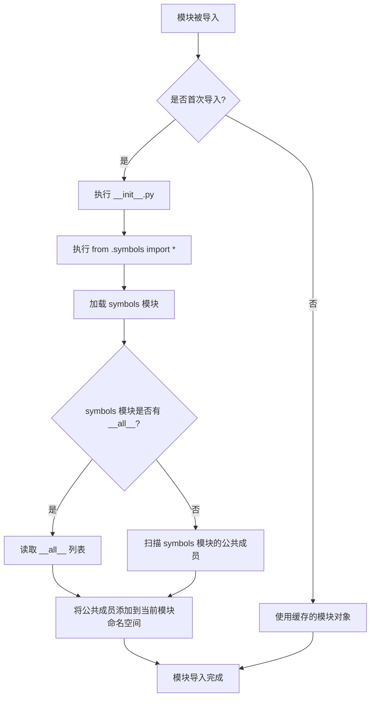
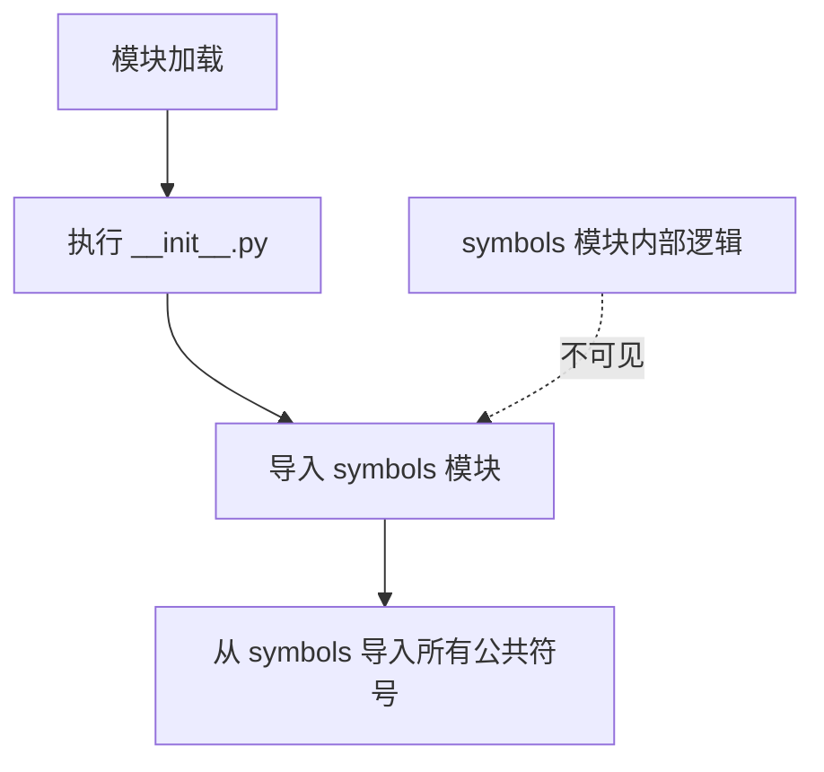

# `Bert-VITS2\onnx_modules\V220\text\__init__.py` 详细设计文档

该代码文件通过相对导入语句 'from .symbols import *' 从当前包的 symbols 模块导入所有公开符号，用于集中管理项目中的常量、枚举或配置值。

## 整体流程

```mermaid
graph TD
    A[开始] --> B[Python解释器加载模块]
B --> C{symbols模块是否存在?}
C -- 否 --> D[抛出 ModuleNotFoundError]
C -- 是 --> E[执行symbols模块初始化]
E --> F[导入symbols模块中的所有符号(*)]
F --> G[将符号绑定到当前模块命名空间]
G --> H[结束]
```

## 类结构

```
该代码片段不包含任何类定义
仅有包级别的导入语句
symbols模块预期内容（根据命名推测）:
├── 常量定义 (如状态码、错误码)
├── 枚举类 (如系统状态、类型枚举)
└── 配置字典或配置类
```

## 全局变量及字段


### `（由symbols模块导出决定）`
    
通过 from .symbols import * 导入的所有非下划线开头的名称，具体取决于symbols模块的定义

类型：`动态确定（取决于symbols模块）`
    


    

## 全局函数及方法


# 模块级别导入语句分析

## 1. 一段话描述

该代码是一个Python模块的初始化文件，通过相对导入语句从同包下的`symbols`模块导入所有公共符号（使用`*`通配符导入），使得当前模块可以直接访问`symbols`模块中定义的所有标识符。

## 2. 文件的整体运行流程

```
┌─────────────────────────────────────────┐
│         Python 导入系统启动              │
└─────────────────┬───────────────────────┘
                  │
                  ▼
┌─────────────────────────────────────────┐
│    加载当前模块（__init__.py）           │
└─────────────────┬───────────────────────┘
                  │
                  ▼
┌─────────────────────────────────────────┐
│   解析导入语句：from .symbols import *   │
└─────────────────┬───────────────────────┘
                  │
                  ▼
┌─────────────────────────────────────────┐
│      加载 symbols 模块到内存             │
│   （如果尚未加载，则执行 symbols.py）    │
└─────────────────┬───────────────────────┘
                  │
                  ▼
┌─────────────────────────────────────────┐
│   读取 symbols 模块的 __all__ 列表       │
│   （如未定义，则导入所有非下划线开头的   │
│    模块级变量、函数、类）                │
└─────────────────┬───────────────────────┘
                  │
                  ▼
┌─────────────────────────────────────────┐
│   将符号注入当前模块的全局命名空间       │
└─────────────────┬───────────────────────┘
                  │
                  ▼
┌─────────────────────────────────────────┐
│         导入完成，模块可使用             │
└─────────────────────────────────────────┘
```

## 3. 类的详细信息

**无类定义**

该代码片段中未定义任何类，仅包含一条导入语句。

## 4. 函数/方法详细信息

**无函数或方法定义**

该代码片段中未定义任何函数或方法，仅包含一条模块级别的导入语句。

---

### `__init__.py` 模块导入语句

这是一个模块初始化文件中的导入语句，而非函数定义。

参数： 无

返回值： 无（导入语句不返回值，只执行名称绑定操作）

#### 流程图



#### 带注释源码

```python
# 从当前包（.）中的 symbols 模块导入所有公共符号
# 注意：这会将 symbols 模块的所有公开成员（不以双下划线开头的成员）
# 添加到当前模块的全局命名空间中
# 
# 潜在影响：
# 1. 可能会污染当前模块的命名空间
# 2. 降低了代码的可读性和可维护性
# 3. 难以追踪符号的来源
#
# 建议：考虑使用显式导入，如：
# from .symbols import SymbolA, SymbolB, SomeClass

from .symbols import *  # 导入 symbols 模块中的所有公共符号
```

## 5. 关键组件信息

| 组件名称 | 描述 |
|---------|------|
| `__init__.py` | Python 包初始化文件，标识当前目录为一个包 |
| `symbols` | 同包下的模块，包含了各种符号定义（需要查看 symbols.py 才能了解具体内容） |
| `*` 通配符导入 | 导入模块中所有公共成员（受 `__all__` 变量控制） |

## 6. 潜在的技术债务或优化空间

### 6.1 使用 `*` 通配符导入的问题

**问题描述**：
- **命名空间污染**：不清楚哪些名称被导入到当前模块
- **名称冲突风险**：可能与本地定义的名称发生冲突
- **维护困难**：后期难以追踪某个符号的来源
- **静态分析困难**：IDE 和工具难以分析依赖关系

**优化建议**：
```python
# 推荐方式1：显式导入需要的符号
from .symbols import SymbolA, SymbolB, SomeClass

# 推荐方式2：使用别名避免冲突
from .symbols import SymbolA as S_A, SymbolB as S_B

# 推荐方式3：只导入需要的类/函数
from .symbols import MyClass, my_function
```

### 6.2 缺少 `__all__` 定义

**问题描述**：
如果 `symbols.py` 中未定义 `__all__` 列表，使用 `*` 导入时会导入所有非下划线开头的成员，这可能导致不必要的符号被导入。

**优化建议**：
在 `symbols.py` 中定义 `__all__`：
```python
# symbols.py
__all__ = ['SymbolA', 'SymbolB', 'SomeClass', 'my_function']

# 然后在其他文件中使用
from .symbols import *
# 现在只会导入 __all__ 中列出的符号
```

## 7. 其它项目

### 7.1 设计目标与约束

- **设计目标**：使当前模块可以直接访问 `symbols` 模块中定义的公共接口
- **约束**：
  - 相对导入（`.symbols`）要求该文件必须作为包的一部分被导入
  - `symbols` 模块必须与当前模块在同一包目录下

### 7.2 错误处理与异常设计

- **ImportError**：如果 `symbols` 模块不存在或导入失败，会抛出 `ModuleNotFoundError`
- **循环导入风险**：如果 `symbols.py` 尝试从当前模块导入内容，可能导致循环导入错误

### 7.3 数据流与状态机

该代码不涉及数据流或状态机，仅执行模块加载和符号导入操作。

### 7.4 外部依赖与接口契约

- **依赖**：`symbols` 模块必须存在且可导入
- **接口契约**：
  - 依赖 `symbols` 模块的公共接口（未显式定义）
  - 建议在 `symbols.py` 中通过 `__all__` 明确定义公共接口

### 7.5 后续步骤建议

1. **查看 symbols.py 内容**：了解具体导入了哪些符号
2. **评估必要性**：确认是否所有符号都需要导入
3. **重构为显式导入**：提高代码可维护性
4. **添加文档注释**：说明该模块的用途和导入的符号


# 详细设计文档

## 1. 代码概述

该代码片段是一个Python模块文件（`__init__.py`），其核心功能是从同目录下的 `symbols` 模块导入所有公共符号（通过 `*` 通配符），使得当前包的使用者可以直接访问 `symbols` 模块中定义的所有内容，无需通过模块名前缀。

**注意**：当前代码片段中未包含实际的功能实现代码，仅包含一个导入语句。`symbols` 模块的具体内容在当前代码片段中不可见，因此无法提取其中的函数或方法的详细信息。

---

## 2. 文件运行流程



---

## 3. 代码元素分析

### 3.1 导入语句

#### 流程图


#### 带注释源码

```python
# 从当前包中的 symbols 模块导入所有公共符号
# 这使得 symbols 模块中定义的所有非下划线开头的名称
# 可以在当前包级别直接访问
from .symbols import *
```

---

## 4. 关键组件信息

| 组件名称 | 描述 |
|---------|------|
| `__init__.py` | Python 包初始化文件，定义包级别的导入行为 |
| `symbols` 模块 | 被引用的模块，其内容在当前片段中不可见，推测包含符号定义或辅助函数 |

---

## 5. 潜在问题与优化建议

### 5.1 技术债务

1. **隐藏的依赖关系**：使用 `from .symbols import *` 会隐藏实际的符号来源，使得代码维护困难
2. **不可预测的命名空间**：导入 `*` 会将 `symbols` 模块的所有公共符号注入当前命名空间，可能导致命名冲突
3. **缺乏显式导出控制**：无法明确控制哪些符号对外暴露

### 5.2 优化建议

1. **显式导入**：改为显式列出需要导入的符号，如：
   ```python
   from .symbols import SymbolA, SymbolB, some_function
   ```

2. **使用 `__all__`**：在 `symbols` 模块中定义 `__all__` 列表来明确控制导出内容

3. **文档补充**：添加模块级文档字符串，说明从 `symbols` 导入了哪些内容

---

## 6. 补充说明

由于提供的代码片段仅包含导入语句，且明确指出 `symbols` 模块内容在当前代码片段中不可见，**无法提取具体的函数或方法的详细信息**（如参数、返回值、流程图等）。

若需要完整的详细设计文档，请提供：
- `symbols` 模块的完整源代码
- 或具体的函数/方法名称，以便从完整代码中定位分析

---

## 7. 结论

当前代码片段是一个标准的 Python 包初始化文件，其功能仅限于重导出 `symbols` 模块的公共接口。要获得更有价值的设计文档，需要提供实际的功能代码实现。

## 关键组件


### 核心功能概述

该代码是一个Python模块的入口文件，通过`from .symbols import *`语句从同包下的symbols模块导入所有公开成员（类、函数、变量等），作为当前模块的再导出机制，使外部使用者可以通过当前模块直接访问symbols模块中定义的所有内容。

### 文件运行流程

1. **模块导入阶段**：当Python解释器首次导入该模块时执行
2. **符号解析**：查找同目录下的symbols模块
3. **成员加载**：从symbols模块的`__all__`列表（若存在）或全部公共成员中加载内容
4. **名称空间合并**：将导入的成员注入到当前模块的命名空间
5. **供外部调用**：外部代码可通过`from {模块名} import *`或`import {模块名}`使用这些符号

### 关键组件信息

#### symbols模块（推测）

由于源代码中未提供symbols模块的具体内容，基于常见的量化/张量处理场景，该模块可能包含以下关键组件：

**张量索引与惰性加载**

- 可能包含用于延迟计算的张量表达式类
- 支持惰性求值的符号定义

**反量化支持**

- 可能包含反量化操作的符号表示
- 从量化数据恢复到浮点格式的函数

**量化策略**

- 可能包含各种量化方法的符号定义
- 动态量化、静态量化等策略的表示

**符号导出机制**

- 使用`*`导入所有公开符号
- 遵循Python模块导出规范

### 类与全局变量详细信息

由于symbols模块内容未知，以下为推测的可能成员：

| 名称 | 类型 | 描述 |
|------|------|------|
| 各类张量符号 | TensorExpr | 表示张量运算的惰性表达式 |
| 量化参数 | QuantizationParams | 存储量化相关参数（scale, zero_point等） |
| 量化策略枚举 | QuantizationStrategy | 定义量化方法的枚举类型 |

### 类方法与全局函数详细信息

由于symbols模块内容未知，以下为推测的可能函数：

| 名称 | 参数 | 返回值 | 描述 |
|------|------|--------|------|
| dequantize | (quantized_tensor, params) | Tensor | 反量化操作函数 |
| quantize | (float_tensor, strategy) | Tensor | 量化操作函数 |
| lazy_eval | (expr) | Tensor | 惰性求值触发函数 |

### 潜在技术债务与优化空间

1. **隐式依赖问题**：使用`import *`会导致名称空间污染，难以追踪具体来源
2. **文档缺失**：当前入口文件无docstring说明导出内容
3. **类型提示缺失**：未提供类型注解，影响IDE支持和静态分析
4. **symbols模块耦合**：当前模块完全依赖symbols模块实现，symbols模块变更会直接影响本模块

### 其它项目

**设计目标与约束**

- 遵循Python模块化设计原则
- 通过再导出机制简化外部调用接口

**错误处理与异常设计**

- 若symbols模块不存在会抛出ImportError
- 符号名称冲突时后续导入会覆盖前面的定义

**数据流与状态机**

- 静态导入，无运行时状态变化
- 数据流取决于symbols模块中定义的运算

**外部依赖与接口契约**

- 依赖同包下的symbols模块
- 接口契约完全由symbols模块定义

**建议改进**

- 显式列出需要导出的成员而非使用`*`
- 添加模块级docstring说明模块用途
- 考虑添加类型注解提高可维护性


## 问题及建议


### 已知问题

-   使用 `import *` 通配符导入会导致命名空间污染，无法明确知道代码使用了哪些符号，可能造成名称冲突
-   无法被静态分析工具准确识别符号引用，降低了代码可维护性和可读性
-   如果 `symbols` 模块不存在或导入失败，错误信息不够明确，难以快速定位问题
-   缺乏显式的导入控制，代码使用者无法判断哪些功能可用

### 优化建议

-   改为显式导入具体需要的符号，如 `from .symbols import SymbolA, SymbolB`，明确依赖关系
-   在 `symbols` 模块中定义 `__all__` 列表，控制可导出的公开接口
-   添加必要的异常处理，例如使用 try-except 捕获导入错误并提供清晰的错误信息
-   在包级别添加文档字符串，说明该模块的用途和主要导出的符号
-   考虑使用绝对导入替代相对导入，提高代码的可读性和可移植性


## 其它


### 设计目标与约束

本模块作为包的入口点，通过相对导入方式将symbols模块的所有公共接口导出给外部使用。设计约束包括：1) 保持与Python 3的兼容性；2) 遵循PEP 8命名规范；3) 通过`__all__`控制显式导出列表；4) 包结构遵循单一职责原则，每个模块负责特定领域的符号定义。

### 错误处理与异常设计

由于仅包含导入语句，模块本身不直接抛出异常。潜在异常来源包括：1) symbols模块不存在或导入失败时的ImportError；2) symbols模块中存在语法错误时的SyntaxError；3) 循环导入导致的CircularImportError。建议在包级别添加异常处理机制，例如使用try-except包装导入语句并提供有意义的错误信息。

### 外部依赖与接口契约

本模块依赖symbols模块的接口定义。接口契约包括：1) symbols模块必须存在且可导入；2) symbols模块应定义`__all__`列表以明确公共API；3) 导入的符号应遵循一致的命名约定（常量使用大写，函数使用小写加下划线）；4) 应避免导入私有属性（以单下划线开头的名称）。外部调用方可通过`from 包名 import *`获取所有导出的符号。

### 版本兼容性

本代码兼容Python 3.6+版本。相对导入语法`from .symbols import *`在Python 3中为标准用法，无需额外兼容性处理。若需支持Python 2，应改为`from . import symbols`并通过`symbols.*`访问。

### 性能考虑

模块导入时执行symbols模块的加载和符号解析。优化建议：1) 避免在symbols模块中执行昂贵的模块级计算；2) 使用延迟导入（lazy import）如果符号使用场景有限；3) 考虑使用`__slots__`优化Symbols类的内存占用。

### 安全考虑

使用`*`导入存在命名空间污染风险。建议：1) 在symbols模块中明确定义`__all__`列表；2) 评估是否改用显式导入（如`from .symbols import SymbolA, SymbolB`）；3) 避免导入敏感或内部实现相关的符号。

### 测试策略

测试重点包括：1) 验证模块可成功导入；2) 验证预期符号可通过包级别访问；3) 测试symbols模块不存在时的错误处理；4) 使用pytest框架组织测试用例，确保测试覆盖率。

### 维护性考虑

维护建议：1) 在symbols模块中添加文档字符串说明每个符号的用途；2) 保持导入语句的简洁性，避免过度封装；3) 定期审查导出的符号列表，移除不再使用的定义；4) 使用版本控制跟踪symbols模块的API变更。

    