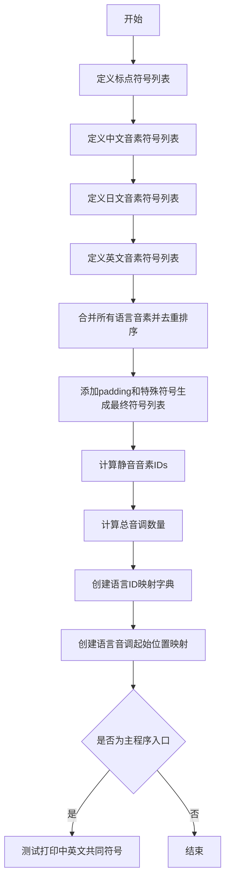

# `Bert-VITS2\onnx_modules\V220\text\symbols.py` 详细设计文档

该代码文件定义了多语言语音合成系统所需的音素符号集合，包括中文、日文和英文的音素符号，以及语言ID映射和音调起始位置映射，用于语音合成或语音识别系统中的音素处理。

## 整体流程



## 类结构

```
该文件为扁平化结构，无类层次
所有内容为全局变量定义
```

## 全局变量及字段


### `punctuation`
    
标点符号列表，包含常见的标点符号如感叹号、问号、省略号等

类型：`list[str]`
    


### `pu_symbols`
    
标点符号加上特殊符号（静音SP和未知UNK）的完整列表

类型：`list[str]`
    


### `pad`
    
用于序列填充的符号，值为下划线"_"

类型：`str`
    


### `zh_symbols`
    
汉语拼音音素符号列表，包含声母、韵母和特殊标记

类型：`list[str]`
    


### `num_zh_tones`
    
汉语声调数量，值为6（包括轻声）

类型：`int`
    


### `ja_symbols`
    
日语音素符号列表，包含假名对应的音素表示

类型：`list[str]`
    


### `num_ja_tones`
    
日语音调数量，值为2（重音和轻音）

类型：`int`
    


### `en_symbols`
    
英语音素符号列表，包含CMU音素库的音素表示

类型：`list[str]`
    


### `num_en_tones`
    
英语声调数量，值为4

类型：`int`
    


### `normal_symbols`
    
所有语言符号的去重并排序后的集合

类型：`list[str]`
    


### `symbols`
    
完整符号表，包含填充符、常规符号和标点符号

类型：`list[str]`
    


### `sil_phonemes_ids`
    
静音和未知音素在符号表中的索引列表

类型：`list[int]`
    


### `num_tones`
    
所有语言的总声调数量，值为12

类型：`int`
    


### `language_id_map`
    
语言标识符到ID的映射，ZH=0, JP=1, EN=2

类型：`dict[str, int]`
    


### `num_languages`
    
支持的语言数量，值为3

类型：`int`
    


### `language_tone_start_map`
    
各语言声调索引起始位置的映射

类型：`dict[str, int]`
    


    

## 全局函数及方法


## 关键组件


### 标点与特殊符号定义

定义了各种标点符号和特殊符号，包括常见标点符号（! ? … , . ' -）以及特殊占位符SP（空格）和UNK（未知）。

### 中文音素符号集

定义了中文（普通话）的音素符号集合，涵盖声母、韵母及声调变体，共58个音素符号，包含E、En、a、ai、an等。

### 日文音素符号集

定义了日语音素符号集合，包含清音、浊音、半浊音及长音符号，共40个符号，包含N、a、a:、b、by等。

### 英文音素符号集

定义了英语的音素符号集合，基于ARPAbet音标系统，共39个符号，包含aa、ae、ah、ao等。

### 统一符号表构建

将中文、日文、英文音素符号合并去重后，加上padding符号和标点特殊符号，构建统一的符号表，共100余个符号。

### 语言ID映射

定义语言标识符到数字ID的映射：ZH(中文)=0, JP(日文)=1, EN(英文)=2。

### 语言音调起始映射

定义每种语言的音调编号起始位置，ZH从0开始，JP从6开始，EN从8开始，用于多语言语音合成中的音调处理。

### 静音音素ID列表

包含标点符号在统一符号表中的索引位置，用于语音合成时插入静音段。


## 问题及建议


### 已知问题

- **硬编码问题**：所有音素符号和语言代码均以硬编码方式直接写在代码中，缺乏从配置文件或数据库动态加载的机制，导致扩展困难
- **魔法数字缺乏解释**：`num_zh_tones = 6`、`num_ja_tones = 2`、`num_en_tones = 4` 等数值未提供注释说明其来源或业务含义
- **命名不一致**：语言标识使用 "ZH"/"JP"/"EN"，但注释中使用 "chinese"/"japanese"/"english"；语言前缀混用下划线（zh/ja/en）和驼峰命名（ZH/JP/EN），增加理解成本
- **代码组织松散**：所有逻辑和数据定义堆积在同一文件中，缺乏模块化封装，未按照类或函数进行合理组织
- **main 函数功能偏离**：主函数中用于调试的交集计算逻辑（`a & b`）与整体模块定位不符，应移除或移至独立测试文件
- **缺失类型注解**：变量和函数均未添加类型注解，降低了代码的可读性和 IDE 辅助支持
- **数据验证缺失**：未对 `language_id_map` 和 `language_tone_start_map` 的一致性进行校验，若新增语言容易产生映射错误
- **重复符号处理风险**：使用 `sorted(set(...))` 对多集合去重，虽在当前场景下结果确定，但隐含顺序依赖性

### 优化建议

- **提取配置数据**：将符号列表、语言参数等数据迁移至 JSON/YAML 配置文件，实现数据与逻辑分离，便于非开发人员维护
- **添加类型注解**：为所有全局变量和函数参数添加明确的类型声明，提升代码可读性和静态分析能力
- **重构为模块化结构**：创建 `PhonemeSymbols` 类或 `SymbolManager` 类，将符号管理逻辑封装，提供统一的查询接口
- **统一命名规范**：采用一致的命名风格，如统一使用小写下划线（zh/jp/en）或统一大写下划线（ZH/JP/EN）作为语言标识前缀
- **添加数据验证函数**：在模块初始化时校验 `language_tone_start_map` 的正确性，确保语言tone范围连续无重叠
- **补充文档注释**：为每个符号列表、配置常量添加 docstring 或行内注释，说明其用途、数据来源和更新维护方式
- **拆分测试代码**：将 main 函数中的调试逻辑移至独立的测试模块或 `if __name__ == "__main__"` 代码块中，明确区分入口逻辑和测试逻辑

## 其它


### 设计目标与约束

本代码模块作为多语言语音合成系统的音素符号表定义模块，核心目标是统一定义中文、日语、英语三种语言的音素符号集合，并建立语言ID与音调（tone）的映射关系。设计约束包括：1）所有符号必须唯一且可序列化；2）符号表按字母顺序排序以保证一致性；3）保留特殊符号位（pad、UNK、SP）用于语音处理填充和未知字符处理；4）语言tone起始索引需要连续且不冲突。

### 错误处理与异常设计

由于本模块为纯数据定义模块，不涉及运行时错误处理。但需保证数据定义的正确性：1）符号列表中不应存在重复元素，使用set去重；2）language_id_map的键必须与language_tone_start_map的键保持一致；3）各语言音素数量必须为正整数。若数据定义存在错误，应在模块加载时（if __name__ == "__main__"）通过测试代码发现。

### 外部依赖与接口契约

本模块无外部依赖，仅使用Python内置的set、sorted函数。接口契约如下：symbols列表索引从0开始，索引0为填充符pad；sil_phonemes_ids返回标点符号在symbols中的索引列表；language_id_map返回语言字符串到ID的映射；language_tone_start_map返回各语言tone索引的起始偏移量。任何使用本模块的代码应通过symbols列表索引访问音素，而非直接使用字符串比较。

### 配置说明

主要配置项包括：punctuation定义标点符号列表；pu_symbols定义所有标点与特殊符号；zh_symbols/ja_symbols/en_symbols分别定义三种语言的音素；language_id_map定义语言标识符到ID的映射；language_tone_start_map定义各语言tone索引的起始位置。所有配置以Python列表或字典形式定义，支持运行时修改（修改后需重新计算sil_phonemes_ids和num_tones）。

### 符号表维护策略

当需要添加新语言时，应：1）在对应语言符号列表中添加新音素；2）更新num_xx_tones变量；3）在language_id_map中添加语言映射；4）在language_tone_start_map中计算新的tone起始索引；5）确保normal_symbols和symbols列表重新生成。当需要添加新符号时，应同步更新pu_symbols或对应语言的符号列表，并确保symbols列表重新排序。

### 版本兼容性说明

本模块遵循语义化版本约定。当前版本为1.0.0（推断）。兼容性注意事项：1）symbols列表顺序受sorted()影响，新版本Python的排序行为可能影响索引稳定性，建议在生产环境固定Python版本；2）新增语言或符号可能改变索引值，上游系统应使用符号名称而非索引进行映射；3）language_tone_start_map的值依赖于各语言tone数量，更新时需同步检查上游系统的tone处理逻辑。


    