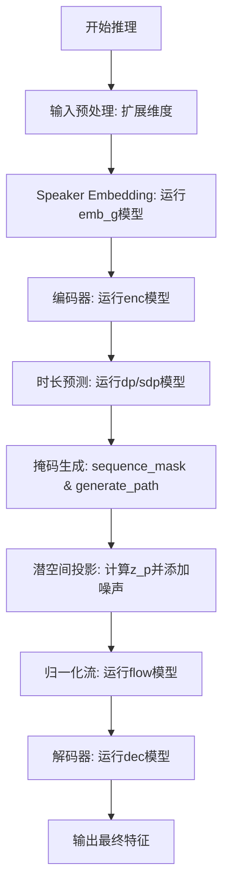
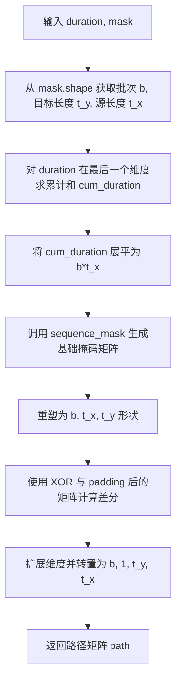
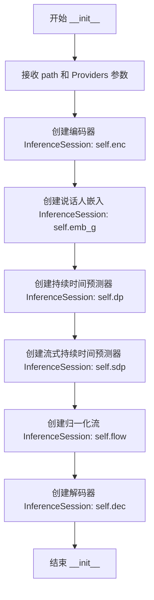

# `Bert-VITS2\onnx_modules\V220_OnnxInference\__init__.py` 详细设计文档

这是一个基于ONNX Runtime的文本到语音(TTS)推理流程，通过加载编码器(enc)、嵌入(emb_g)、时长预测器(dp/sdp)、流模型(flow)和解码器(dec)等多个ONNX模型，对输入的文本、韵律、声学和情感特征进行联合推理，最终生成语音特征向量。

## 整体流程



## 类结构

```
Global
├── convert_pad_shape (函数)
├── sequence_mask (函数)
├── generate_path (函数)
└── OnnxInferenceSession (类)
    ├── __init__ (构造函数)
    └── __call__ (主推理方法)
```

## 全局变量及字段


### `convert_pad_shape`
    
将填充形状从嵌套列表格式转换为扁平列表格式，用于处理ONNX模型的填充参数

类型：`function`
    


### `sequence_mask`
    
生成序列掩码，用于根据序列长度创建布尔掩码矩阵，支持变长序列处理

类型：`function`
    


### `generate_path`
    
根据持续时间生成对齐路径，用于计算注意力权重和位置映射

类型：`function`
    


### `OnnxInferenceSession`
    
基于ONNX Runtime的语音合成推理会话类，封装了 encoder、embedding、duration predictor、stochastic duration predictor、flow 和 decoder 六个模型的推理流程

类型：`class`
    


### `np`
    
NumPy 库，提供高效的数组操作和数学计算功能

类型：`module`
    


### `ort`
    
ONNX Runtime 库，用于高效运行 ONNX 格式的机器学习模型

类型：`module`
    


### `OnnxInferenceSession.enc`
    
encoder 模型，负责将输入序列编码为隐藏表示

类型：`onnxruntime.InferenceSession`
    


### `OnnxInferenceSession.emb_g`
    
speaker embedding 模型，负责提取说话人特征嵌入

类型：`onnxruntime.InferenceSession`
    


### `OnnxInferenceSession.dp`
    
duration predictor 模型，负责预测音素持续时间

类型：`onnxruntime.InferenceSession`
    


### `OnnxInferenceSession.sdp`
    
stochastic duration predictor 模型，负责随机预测音素持续时间

类型：`onnxruntime.InferenceSession`
    


### `OnnxInferenceSession.flow`
    
normalizing flow 模型，负责潜在变量的变换和分布建模

类型：`onnxruntime.InferenceSession`
    


### `OnnxInferenceSession.dec`
    
decoder 模型，负责将潜在表示解码为最终的语音输出

类型：`onnxruntime.InferenceSession`
    
    

## 全局函数及方法


### `convert_pad_shape`

该函数用于将嵌套的填充形状列表进行反向并展平处理，常见于深度学习框架中处理卷积或池化操作的填充参数，将多维填充配置转换为一维列表形式。

参数：

- `pad_shape`：`list`，嵌套列表，表示需要转换的填充形状（例如 `[[1, 2], [3, 4]]`）

返回值：`list`，展平后的一维列表（例如输入 `[[1, 2], [3, 4]]` 返回 `[3, 4, 1, 2]`）

#### 流程图

```mermaid
flowchart TD
    A[开始] --> B[输入 pad_shape 嵌套列表]
    B --> C[反转列表: layer = pad_shape[::-1]]
    C --> D[展平嵌套列表: item for sublist in layer for item in sublist]
    D --> E[返回展平后的列表]
    E --> F[结束]
```

#### 带注释源码

```python
def convert_pad_shape(pad_shape):
    """
    将嵌套的填充形状列表反向并展平为一维列表
    
    参数:
        pad_shape: 嵌套列表形式的填充形状，例如 [[1, 2], [3, 4]]
    
    返回:
        展平并反转后的列表，例如输入 [[1, 2], [3, 4]] 返回 [3, 4, 1, 2]
    """
    # 步骤1: 反转列表顺序（将最后一项移到最前）
    # 例如: [[1, 2], [3, 4]] -> [[3, 4], [1, 2]]
    layer = pad_shape[::-1]
    
    # 步骤2: 展平嵌套列表为单个一维列表
    # 使用列表推导式将子列表中的每个元素提取出来
    # 例如: [[3, 4], [1, 2]] -> [3, 4, 1, 2]
    pad_shape = [item for sublist in layer for item in sublist]
    
    # 返回处理后的结果
    return pad_shape
```


### `sequence_mask`

该函数用于生成序列掩码（Sequence Mask），通过比较序列长度数组与位置索引数组，生成一个布尔掩码矩阵，用于标识有效序列位置，常用于变长序列处理和注意力机制中。

参数：

- `length`：`numpy.ndarray`，一维数组，表示批次中每个序列的实际长度
- `max_length`：`int` 或 `None`，可选参数，表示掩码的最大长度；若为 `None`，则自动取 `length` 数组中的最大值

返回值：`numpy.ndarray`，二维布尔数组，形状为 `(1, max_length)` 或 `(batch_size, max_length)`，其中 `True` 表示该位置在序列长度范围内

#### 流程图

```mermaid
flowchart TD
    A[开始 sequence_mask] --> B{max_length is None?}
    B -->|是| C[max_length = length.max()]
    B -->|否| D[使用传入的 max_length]
    C --> E[x = np.arange max_length]
    D --> E
    E --> F[x 扩展维度变为 1×max_length]
    G[length 扩展维度变为 batch×1] --> F
    F --> H[广播比较: expand_dims x < expand_dims length]
    H --> I[返回布尔掩码矩阵]
```

#### 带注释源码

```python
def sequence_mask(length, max_length=None):
    """
    生成序列掩码，用于标识有效序列位置
    
    参数:
        length: numpy.ndarray, 一维数组，表示序列长度，如 [5, 3, 7]
        max_length: int 或 None，最大序列长度，默认 None 则自动计算
    
    返回值:
        numpy.ndarray: 二维布尔数组，如 length=[5,3], max_length=5 时
                       返回 [[True, True, True, False, False],
                            [True, True, True, False, False]]
    """
    # 如果未指定最大长度，则使用 length 数组中的最大值
    if max_length is None:
        max_length = length.max()
    
    # 创建从 0 到 max_length-1 的整数数组，dtype 与 length 保持一致
    # 例如 max_length=5 时，x = [0, 1, 2, 3, 4]
    x = np.arange(max_length, dtype=length.dtype)
    
    # 扩展 x 的维度从 (max_length,) 变为 (1, max_length)
    # 扩展 length 的维度从 (batch,) 变为 (batch, 1)
    # 通过广播机制比较，生成布尔掩码
    # 例如: x=[0,1,2,3,4], length=[5,3]
    # 扩展后: x=[[0,1,2,3,4]], length=[[5],[3]]
    # 比较结果: [[False,False,True,True,True], [True,True,True,False,False]]
    return np.expand_dims(x, 0) < np.expand_dims(length, 1)
```


### `generate_path`

该函数用于根据音频时长向量（duration）和注意力掩码（mask）生成对齐路径矩阵（alignment path），广泛用于语音合成（TTS）系统中，将源序列（phoneme/speaker）中的每个时间步映射到目标序列（mel-spectrogram）的对应时间步，实现单调对齐。

参数：

- `duration`：`numpy.ndarray`，形状为 `[b, 1, t_x]`，表示每个源时间步的持续长度（duration），b 为批次大小，t_x 为源序列长度
- `mask`：`numpy.ndarray`，形状为 `[b, 1, t_y, t_x]`，表示注意力掩码矩阵，t_y 为目标序列长度

返回值：`numpy.ndarray`，形状为 `[b, 1, t_y, t_x]`，返回生成的对齐路径矩阵，用于后续注意力机制的路径约束

#### 流程图



#### 带注释源码

```python
def generate_path(duration, mask):
    """
    根据持续时间（duration）和掩码（mask）生成单调对齐路径矩阵
    
    参数:
        duration: [b, 1, t_x] - 每个源时间步的持续长度
        mask: [b, 1, t_y, t_x] - 注意力掩码矩阵
    
    返回:
        path: [b, 1, t_y, t_x] - 对齐路径矩阵
    """
    # 从 mask 的形状中提取维度信息：
    # b = 批次大小, t_y = 目标序列长度, t_x = 源序列长度
    b, _, t_y, t_x = mask.shape
    
    # 对 duration 在最后一个维度（t_x 方向）进行累计求和
    # 累积和表示每个源时间步的结束位置（相对目标序列）
    # 例如: duration = [1, 1, 2] -> cumsum = [1, 2, 4]
    cum_duration = np.cumsum(duration, -1)
    
    # 将累计和展平为 (b * t_x)，便于后续批量计算 sequence_mask
    cum_duration_flat = cum_duration.reshape(b * t_x)
    
    # 生成序列掩码：
    # 对于每个展平后的累积结束位置，生成一个长度为 t_y 的布尔掩码
    # 位置 x < cum_duration_flat[i] 时为 True，否则为 False
    # 结果形状: (b * t_x, t_y)
    path = sequence_mask(cum_duration_flat, t_y)
    
    # 重新塑造成 (b, t_x, t_y) 形状
    path = path.reshape(b, t_x, t_y)
    
    # 计算路径差分（核心步骤）：
    # 使用 XOR 操作找出每个时间步的起始位置
    # np.pad 在第二个维度（t_x）前面填充一个 0，形成 (b, t_x+1, t_y) 的张量
    # 去掉最后一个元素后形成 (b, t_x, t_y)，与原 path 进行 XOR
    # 这样只有从 0 变为 1 的位置（段首）为 True，表示该源时间步的起始点
    path = path ^ np.pad(path, ((0, 0), (1, 0), (0, 0)))[:, :-1]
    
    # 扩展维度并转置：
    # 扩展一个通道维度 (b, 1, t_x, t_y)，然后转置为 (b, 1, t_y, t_x)
    # 最终形状: (b, 1, t_y, t_x)，与 mask 形状一致
    path = np.expand_dims(path, 1).transpose(0, 1, 3, 2)
    
    return path
```


### `OnnxInferenceSession.__init__`

该方法是 `OnnxInferenceSession` 类的构造函数，负责初始化 ONNX Runtime 推理会话，加载多个用于语音合成（VITS模型）的 ONNX 模型文件，包括编码器(enc)、说话人嵌入(emb_g)、持续时间预测器(dp)、流式持续时间预测器(sdp)、归一化流(flow)和解码器(dec)，并配置指定的执行提供者。

参数：

- `path`：`dict`，包含多个 ONNX 模型文件路径的字典，必须包含 "enc"（编码器）、"emb_g"（说话人嵌入）、"dp"（持续时间预测器）、"sdp"（流式持续时间预测器）、"flow"（归一化流）、"dec"（解码器）这些键
- `Providers`：`list`，可选参数，默认值为 `["CPUExecutionProvider"]`，指定 ONNX Runtime 使用的执行提供者列表

返回值：`None`，构造函数不返回任何值

#### 流程图



#### 带注释源码

```python
def __init__(self, path, Providers=["CPUExecutionProvider"]):
    """
    初始化 ONNX 推理会话，加载多个语音合成模型
    
    参数:
        path: 包含模型文件路径的字典，应包含以下键:
            - "enc": 编码器模型路径
            - "emb_g": 说话人嵌入模型路径
            - "dp": 持续时间预测器模型路径
            - "sdp": 流式持续时间预测器模型路径
            - "flow": 归一化流模型路径
            - "dec": 解码器模型路径
        Providers: ONNX Runtime 执行提供者列表，默认使用 CPU 执行提供者
    """
    # 加载编码器模型，用于将输入序列编码为隐藏表示
    self.enc = ort.InferenceSession(path["enc"], providers=Providers)
    
    # 加载说话人嵌入模型，用于获取说话人身份嵌入向量
    self.emb_g = ort.InferenceSession(path["emb_g"], providers=Providers)
    
    # 加载持续时间预测器模型，用于预测音素持续时间
    self.dp = ort.InferenceSession(path["dp"], providers=Providers)
    
    # 加载流式持续时间预测器模型，用于基于流的持续时间预测
    self.sdp = ort.InferenceSession(path["sdp"], providers=Providers)
    
    # 加载归一化流模型，用于潜在表示的变换
    self.flow = ort.InferenceSession(path["flow"], providers=Providers)
    
    # 加载解码器模型，用于将潜在表示解码为最终音频
    self.dec = ort.InferenceSession(path["dec"], providers=Providers)
```


### `OnnxInferenceSession.__call__`

该方法是 `OnnxInferenceSession` 类的核心推理方法，负责执行完整的文本到语音（Text-to-Speech, TTS）推理流程。它接收文本序列、音调、语言、BERT 嵌入、情感嵌入和说话者 ID 作为输入，通过多个 ONNX 模型（编码器、时长预测器、流模型、解码器）逐步处理，最终返回生成的语音波形数据。

参数：

- `seq`：`numpy.ndarray`，输入的音素序列或文本索引序列，形状为 `[batch, seq_len]` 或 `[seq_len]`
- `tone`：`numpy.ndarray`，音调信息序列，形状为 `[batch, seq_len]` 或 `[seq_len]`
- `language`：`numpy.ndarray`，语言标识序列，形状为 `[batch, seq_len]` 或 `[seq_len]`
- `bert_zh`：`numpy.ndarray`，中文 BERT 嵌入，形状为 `[batch, seq_len, bert_dim]`
- `bert_jp`：`numpy.ndarray`，日文 BERT 嵌入，形状为 `[batch, seq_len, bert_dim]`
- `bert_en`：`numpy.ndarray`，英文 BERT 嵌入，形状为 `[batch, seq_len, bert_dim]`
- `emo`：`numpy.ndarray`，情感嵌入，形状为 `[batch, seq_len, emo_dim]`
- `sid`：`numpy.ndarray`，说话者 ID，用于获取说话者嵌入
- `seed`：`int`，随机种子，用于生成噪声（默认 114514）
- `seq_noise_scale`：`float`，序列噪声缩放因子，控制对数方差的噪声强度（默认 0.8）
- `sdp_noise_scale`：`float`，随机时长预测器的噪声缩放因子（默认 0.6）
- `length_scale`：`float`，输出长度缩放因子，用于调整生成语音的长度（默认 1.0）
- `sdp_ratio`：`float`，随机时长预测器与确定性时长预测器的混合比例，0.0 表示完全使用确定性预测器（默认 0.0）

返回值：`numpy.ndarray`，生成的语音波形数据，类型为 `np.float32`，形状为 `[batch, waveform_length]` 或 `[waveform_length]`

#### 流程图

```mermaid
flowchart TD
    A[输入: seq, tone, language, bert_*, emo, sid] --> B{检查并扩展维度}
    B --> C[emb_g: 获取说话者嵌入 g]
    C --> D[enc: 编码器 forward]
    D --> E[x, m_p, logs_p, x_mask]
    E --> F[随机噪声生成 zinput]
    F --> G[sdp: 随机时长预测]
    G --> H[dp: 确定性时长预测]
    H --> I[混合 logw = sdp_ratio * sdp + (1-sdp_ratio) * dp]
    I --> J[计算 w = exp(logw) * x_mask * length_scale]
    J --> K[w_ceil = ceil(w), y_lengths]
    K --> L[生成 attention mask: attn_mask]
    L --> M[generate_path: 生成对齐路径 attn]
    M --> N[应用 attn 变换: m_p, logs_p]
    N --> O[添加噪声: z_p = m_p + noise * exp(logs_p) * seq_noise_scale]
    O --> P[flow: 流模型变换]
    P --> Q[z = flow.run]
    Q --> R[dec: 解码器生成波形]
    R --> S[返回最终语音波形]
```

#### 带注释源码

```python
def __call__(
    self,
    seq,
    tone,
    language,
    bert_zh,
    bert_jp,
    bert_en,
    emo,
    sid,
    seed=114514,
    seq_noise_scale=0.8,
    sdp_noise_scale=0.6,
    length_scale=1.0,
    sdp_ratio=0.0,
):
    """
    执行完整的 TTS 推理流程
    
    参数:
        seq: 输入序列 (音素/文本索引)
        tone: 音调信息
        language: 语言标识
        bert_zh/jp/en: 多语言 BERT 嵌入
        emo: 情感嵌入
        sid: 说话者 ID
        seed: 随机种子
        seq_noise_scale: 序列噪声缩放
        sdp_noise_scale: 随机时长预测器噪声
        length_scale: 长度缩放
        sdp_ratio: sdp/dp 混合比例
    """
    
    # 1. 输入维度预处理：如果输入是 1D，则扩展为 2D (batch=1)
    if seq.ndim == 1:
        seq = np.expand_dims(seq, 0)
    if tone.ndim == 1:
        tone = np.expand_dims(tone, 0)
    if language.ndim == 1:
        language = np.expand_dims(language, 0)
    
    # 断言确保输入是 2D
    assert (seq.ndim == 2, tone.ndim == 2, language.ndim == 2)
    
    # 2. 说话者嵌入获取: emb_g 模型
    g = self.emb_g.run(
        None,
        {
            "sid": sid.astype(np.int64),
        },
    )[0]
    g = np.expand_dims(g, -1)  # 形状: [batch, embed_dim, 1]
    
    # 3. 编码器 forward: enc 模型
    enc_rtn = self.enc.run(
        None,
        {
            "x": seq.astype(np.int64),
            "t": tone.astype(np.int64),
            "language": language.astype(np.int64),
            "bert_0": bert_zh.astype(np.float32),
            "bert_1": bert_jp.astype(np.float32),
            "bert_2": bert_en.astype(np.float32),
            "emo": emo.astype(np.float32),
            "g": g.astype(np.float32),
        },
    )
    # 解包编码器输出
    x, m_p, logs_p, x_mask = enc_rtn[0], enc_rtn[1], enc_rtn[2], enc_rtn[3]
    
    # 4. 时长预测: 结合随机 (sdp) 和确定性 (dp) 预测器
    np.random.seed(seed)
    # 生成随机输入用于 sdp
    zinput = np.random.randn(x.shape[0], 2, x.shape[2]) * sdp_noise_scale
    
    # 分别运行 sdp 和 dp，获取时长对数 logw
    logw = self.sdp.run(
        None, {"x": x, "x_mask": x_mask, "zin": zinput.astype(np.float32), "g": g}
    )[0] * (sdp_ratio) + self.dp.run(None, {"x": x, "x_mask": x_mask, "g": g})[
        0
    ] * (
        1 - sdp_ratio
    )
    
    # 5. 计算对齐路径和注意力掩码
    w = np.exp(logw) * x_mask * length_scale  # 指数化并应用掩码和长度缩放
    w_ceil = np.ceil(w)  # 上取整得到离散时长
    y_lengths = np.clip(np.sum(w_ceil, (1, 2)), a_min=1.0, a_max=100000).astype(
        np.int64
    )  # 计算输出序列长度
    y_mask = np.expand_dims(sequence_mask(y_lengths, None), 1)  # 输出序列掩码
    attn_mask = np.expand_dims(x_mask, 2) * np.expand_dims(y_mask, -1)  # 注意力掩码
    
    # 生成对齐路径 attention matrix
    attn = generate_path(w_ceil, attn_mask)
    
    # 6. 应用对齐路径变换 m_p 和 logs_p
    # 将源序列表示对齐到目标序列长度
    m_p = np.matmul(attn.squeeze(1), m_p.transpose(0, 2, 1)).transpose(
        0, 2, 1
    )  # [b, t', t], [b, t, d] -> [b, d, t']
    logs_p = np.matmul(attn.squeeze(1), logs_p.transpose(0, 2, 1)).transpose(
        0, 2, 1
    )  # 同上
    
    # 7. 添加噪声生成潜在变量 z_p
    z_p = (
        m_p
        + np.random.randn(m_p.shape[0], m_p.shape[1], m_p.shape[2])
        * np.exp(logs_p)
        * seq_noise_scale
    )
    
    # 8. 流模型变换: flow 模型
    z = self.flow.run(
        None,
        {
            "z_p": z_p.astype(np.float32),
            "y_mask": y_mask.astype(np.float32),
            "g": g,
        },
    )[0]
    
    # 9. 解码器生成波形: dec 模型
    return self.dec.run(None, {"z_in": z.astype(np.float32), "g": g})[0]
```

## 关键组件


### 核心功能概述
该代码实现了一个基于ONNX Runtime的神经网络语音合成推理框架，通过将文本序列（包含音素、音调、语言特征、BERT嵌入和情感嵌入）逐步经过编码器、时长预测、流模型和解码器处理，最终生成音频波形数据。

### 文件整体运行流程
1. 初始化阶段：创建OnnxInferenceSession实例，加载6个ONNX模型（enc编码器、emb_g说话人嵌入、dp时长预测器、sdp流式时长预测器、flow归一化流、dec解码器）
2. 推理阶段：
   - 扩展输入维度以支持批量处理
   - 运行说话人嵌入模型获取全局条件
   - 运行编码器处理文本序列得到隐表示
   - 运行时长预测器计算音素时长
   - 生成注意力对齐路径
   - 通过矩阵运算将时长信息应用于隐表示
   - 添加噪声后运行归一化流
   - 最终运行解码器生成音频波形

### 类详细信息

#### OnnxInferenceSession类
**类字段：**
- enc: InferenceSession类型，编码器模型
- emb_g: InferenceSession类型，说话人嵌入模型
- dp: InferenceSession类型，时长预测器模型
- sdp: InferenceSession类型，流式时长预测器模型
- flow: InferenceSession类型，归一化流模型
- dec: InferenceSession类型，解码器模型

**类方法：**
- __init__(path, Providers): 初始化方法，加载多个ONNX模型文件
  - 参数path: dict类型，包含各模型文件路径的字典
  - 参数Providers: list类型，推理执行提供者列表
  - 返回值: None
  - 流程图：加载enc→加载emb_g→加载dp→加载sdp→加载flow→加载dec

- __call__(seq, tone, language, bert_zh, bert_jp, bert_en, emo, sid, seed, seq_noise_scale, sdp_noise_scale, length_scale, sdp_ratio): 核心推理方法
  - 参数seq: ndarray类型，文本序列
  - 参数tone: ndarray类型，音调序列
  - 参数language: ndarray类型，语言序列
  - 参数bert_zh: ndarray类型，中文BERT嵌入
  - 参数bert_jp: ndarray类型，日文BERT嵌入
  - 参数bert_en: ndarray类型，英文BERT嵌入
  - 参数emo: ndarray类型，情感嵌入
  - 参数sid: ndarray类型，说话人ID
  - 参数seed: int类型，随机种子
  - 参数seq_noise_scale: float类型，序列噪声尺度
  - 参数sdp_noise_scale: float类型，SDP噪声尺度
  - 参数length_scale: float类型，时长缩放因子
  - 参数sdp_ratio: float类型，SDP与DP混合比例
  - 返回值: ndarray类型，生成的音频波形
  - 流程图：维度扩展→说话人嵌入→编码器→时长预测→路径生成→注意力对齐→流模型→解码器→返回波形
  - 带注释源码：
    ```python
    def __call__(self, seq, tone, language, bert_zh, bert_jp, bert_en, emo, sid,
                 seed=114514, seq_noise_scale=0.8, sdp_noise_scale=0.6,
                 length_scale=1.0, sdp_ratio=0.0):
        # 维度扩展：支持单样本推理
        if seq.ndim == 1:
            seq = np.expand_dims(seq, 0)
        if tone.ndim == 1:
            tone = np.expand_dims(tone, 0)
        if language.ndim == 1:
            language = np.expand_dims(language, 0)
        assert (seq.ndim == 2, tone.ndim == 2, language.ndim == 2)
        
        # 获取说话人嵌入作为全局条件
        g = self.emb_g.run(None, {"sid": sid.astype(np.int64)})[0]
        g = np.expand_dims(g, -1)
        
        # 编码器前向传播
        enc_rtn = self.enc.run(None, {
            "x": seq.astype(np.int64),
            "t": tone.astype(np.int64),
            "language": language.astype(np.int64),
            "bert_0": bert_zh.astype(np.float32),
            "bert_1": bert_jp.astype(np.float32),
            "bert_2": bert_en.astype(np.float32),
            "emo": emo.astype(np.float32),
            "g": g.astype(np.float32),
        })
        x, m_p, logs_p, x_mask = enc_rtn[0], enc_rtn[1], enc_rtn[2], enc_rtn[3]
        
        # 时长预测：混合SDP和DP结果
        np.random.seed(seed)
        zinput = np.random.randn(x.shape[0], 2, x.shape[2]) * sdp_noise_scale
        logw = self.sdp.run(None, {"x": x, "x_mask": x_mask, "zin": zinput.astype(np.float32), "g": g})[0] * sdp_ratio + \
               self.dp.run(None, {"x": x, "x_mask": x_mask, "g": g})[0] * (1 - sdp_ratio)
        
        # 计算输出长度
        w = np.exp(logw) * x_mask * length_scale
        w_ceil = np.ceil(w)
        y_lengths = np.clip(np.sum(w_ceil, (1, 2)), a_min=1.0, a_max=100000).astype(np.int64)
        y_mask = np.expand_dims(sequence_mask(y_lengths, None), 1)
        attn_mask = np.expand_dims(x_mask, 2) * np.expand_dims(y_mask, -1)
        
        # 生成对齐路径并应用时长
        attn = generate_path(w_ceil, attn_mask)
        m_p = np.matmul(attn.squeeze(1), m_p.transpose(0, 2, 1)).transpose(0, 2, 1)
        logs_p = np.matmul(attn.squeeze(1), logs_p.transpose(0, 2, 1)).transpose(0, 2, 1)
        
        # 添加噪声
        z_p = m_p + np.random.randn(m_p.shape[0], m_p.shape[1], m_p.shape[2]) * np.exp(logs_p) * seq_noise_scale
        
        # 流模型处理
        z = self.flow.run(None, {"z_p": z_p.astype(np.float32), "y_mask": y_mask.astype(np.float32), "g": g})[0]
        
        # 解码器生成波形
        return self.dec.run(None, {"z_in": z.astype(np.float32), "g": g})[0]
    ```

### 全局函数详细信息

#### convert_pad_shape函数
- 参数pad_shape: list类型，输入的填充形状
- 返回值: list类型，转换后的填充形状
- 描述：将填充形状从[b,t_x,t_y]格式转换为ONNX pad算子需要的[b,t_y,t_x]格式

#### sequence_mask函数
- 参数length: ndarray类型，长度数组
- 参数max_length: int或None类型，最大长度
- 返回值: ndarray类型，布尔掩码矩阵
- 描述：生成序列掩码，用于标识有效时间步

#### generate_path函数
- 参数duration: ndarray类型，[b,1,t_x]形状的时长张量
- 参数mask: ndarray类型，[b,1,t_y,t_x]形状的掩码张量
- 返回值: ndarray类型，[b,t_x,t_y]形状的对齐路径
- 描述：根据时长信息生成单调对齐路径，实现音素到帧的对齐
- 带注释源码：
    ```python
    def generate_path(duration, mask):
        b, _, t_y, t_x = mask.shape
        cum_duration = np.cumsum(duration, -1)  # 累积时长
        
        # 展平处理以生成完整掩码
        cum_duration_flat = cum_duration.reshape(b * t_x)
        path = sequence_mask(cum_duration_flat, t_y)  # [b*t_x, t_y]
        path = path.reshape(b, t_x, t_y)  # 恢复形状
        path = path ^ np.pad(path, ((0, 0), (1, 0), (0, 0)))[:, :-1]  # XOR得到区间掩码
        path = np.expand_dims(path, 1).transpose(0, 1, 3, 2)  # [b,1,t_x,t_y] -> [b,1,t_y,t_x]
        return path
    ```

### 关键组件信息

### 张量索引与惰性加载
代码通过numpy数组操作实现张量索引，generate_path函数中使用累积和与掩码生成对齐路径，sequence_mask用于惰性生成有效位置掩码，避免了预计算完整对齐矩阵

### 反量化支持
多处使用astype方法进行类型转换：将int64转换为模型输入格式，将float32用于ONNX推理，确保数据类型一致性和计算精度

### 量化策略
模型使用float32精度进行推理，代码中通过astype(np.float32)明确指定精度，未使用INT8量化，可能影响推理速度但保证数值精度

### 潜在技术债务与优化空间

### 输入验证不足
代码仅进行维度扩展和简单的ndim检查，缺少对输入值范围、数据类型边界、序列长度限制的严格验证，可能导致运行时错误或模型崩溃

### 硬编码参数
噪声尺度(seq_noise_scale=0.8, sdp_noise_scale=0.6)、时长缩放(length_scale=1.0)等参数在方法签名中硬编码，缺乏配置化设计

### 随机数管理
使用numpy.random.seed管理随机状态存在线程安全问题，且在同一方法中混合使用numpy和ONNX Runtime的随机数生成，路径不够清晰

### 内存优化空间
中间张量(x, m_p, logs_p, z_p, z)未显式释放，大批量推理时可能导致内存占用过高；可考虑使用inplace操作减少内存分配

### 其它项目

### 设计目标与约束
- 目标：实现高效的神经网络语音合成推理
- 约束：依赖ONNX Runtime，支持CPU推理
- 模型架构：典型的VITS(Variational Inference with adversarial learning for end-to-end Text-to-Speech)结构

### 错误处理与异常设计
- 缺少异常捕获机制
- assert语句仅用于维度验证，错误信息不明确
- 模型加载失败时无回退策略

### 数据流与状态机
- 数据流：文本序列→编码器→时长预测→对齐→流模型→解码器→波形
- 无显式状态管理，状态通过ONNX Runtime会话隐式保持
- 批量处理时各样本独立处理，无状态共享

### 外部依赖与接口契约
- 依赖：numpy、onnxruntime
- 输入契约：seq/tone/language为int64序列，bert_zh/jp/en/emo为float32嵌入，sid为int64说话人ID
- 输出契约：float32波形数据，形状为[b,1,t]


## 问题及建议


### 已知问题

-   **硬编码的魔法数字**：代码中存在多个硬编码的数值（如`seed=114514`、`seq_noise_scale=0.8`、`sdp_noise_scale=0.6`、`y_lengths`的最大值`100000`等），缺乏配置化管理，降低了代码的可维护性和可调优性。
-   **缺少输入验证与错误处理**：在模型加载和推理过程中没有异常捕获机制，当ONNX模型文件不存在、路径错误或推理失败时，程序会直接崩溃，缺少友好的错误提示。
-   **随机数生成未利用ONNX特性**：使用`np.random.randn`生成随机噪声，绕过了ONNX Runtime的图优化能力，可能导致推理效率低于预期。
-   **冗余的类型转换**：多处重复使用`.astype(np.int64)`、`.astype(np.float32)`进行类型转换，既增加计算开销又降低代码可读性。
-   **部分输入参数未做维度校验**：仅对`seq`、`tone`、`language`做了维度检查并自动扩展，但对`bert_zh`、`bert_jp`、`bert_en`、`emo`等输入未进行维度验证，可能导致运行时错误。
-   **模型路径缺乏校验**：构造函数接收`path`字典但未验证必需键是否存在，加载时可能产生隐式错误。
-   **中间变量内存占用**：多个中间变量（如`path`、`attn`、`z_p`等）直接创建，可能存在内存优化空间，尤其在长序列推理时。
-   **变量命名不够规范**：使用缩写如`enc_rtn`、`g`、`sdp`、`dp`等，缺乏可读性，增加了后续维护成本。
-   **未实现模型缓存或复用**：每次调用`__call__`都会重新创建随机数生成器和执行推理，没有对重复调用的优化。

### 优化建议

-   **重构为配置驱动设计**：将硬编码的超参数抽取为配置类或配置文件，统一管理噪声比例、长度缩放等参数。
-   **添加输入校验与异常处理**：在`__init__`和`__call__`方法中加入参数校验和try-except块，捕获并处理文件不存在、类型错误、维度不匹配等异常情况。
-   **利用ONNX Runtime的随机张量接口**：考虑通过ONNX Runtime的原生接口生成随机张量，以充分利用图优化。
-   **统一类型转换策略**：在入口处对输入进行一次性类型检查和转换，或在模型输入端利用ONNX Runtime的自动类型转换能力。
-   **完善输入维度处理**：对所有张量输入添加统一的维度校验和自动扩展逻辑，确保符合模型要求。
-   **添加模型路径校验**：在加载模型前检查文件是否存在，必要时抛出明确的错误信息。
-   **优化内存使用**：对于大batch或长序列场景，考虑使用inplace操作或分块处理减少内存占用。
-   **改进命名规范**：将缩写变量名改为更语义化的名称，如`enc_rtn`改为`encoder_output`，`g`改为`speaker_embedding`等。
-   **添加推理缓存机制**：对于相同的输入（如相同的`sid`和seed），可考虑缓存推理结果或中间结果以提高效率。
-   **增加日志和性能监控**：添加适当的日志记录，便于调试和问题排查，同时可监控推理耗时以指导进一步优化。

## 其它


### 设计目标与约束
- **目标**：实现基于 ONNX 的多语言文本到语音（TTS）推理，支持中文、日文、英文以及说话人（sid）和情感（emo）嵌入，提供可调的噪声尺度、时长比例等参数，以生成不同风格的语音。
- **约束**：仅使用 CPU（默认 `CPUExecutionProvider`），模型以 ONNX 格式提供，输入必须满足特定的数据类型（int64、float32）和形状要求，输出为单精度浮点波形。
- **运行环境**：Python 3.8+，NumPy ≥ 1.19，ONNXRuntime ≥ 1.11。

### 错误处理与异常设计
- **输入校验**：对 `seq、tone、language` 等关键输入进行维度检查，若非二维（batch, time）则抛出 `ValueError` 并给出具体维度信息。  
- **类型检查**：确保 `seq、tone、language` 为 `int64`，`bert_*、emo` 为 `float32`，`sid` 为 `int64`；若类型不匹配，抛出 `TypeError` 并提示期望类型。  
- **ONNX 运行时异常**：捕获 `onnxruntime.errors.SessionRunError`、`onnxruntime.exceptions.Fail` 等异常，记录模型名称与错误信息后重新抛出自定义 `RuntimeError`。  
- **随机数种子**：使用 `np.random.seed` 仅在当前调用内部设置，需注意线程不安全，建议使用 `np.random.Generator` 或自行管理随机状态，以避免对全局随机状态产生影响。

### 数据流与状态机
- **整体数据流**  
  1. **全局嵌入**：`emb_g` 模型取 `sid` 生成说话人向量 `g`（形状 `[b,1,1]`）。  
  2. **编码器**：`enc` 模型接受 `seq、tone、language、bert_zh/jp/en、emo、g` 输出编码特征 `x`、均值 `m_p`、方差 `logs_p` 与掩码 `x_mask`。  
  3. **时长预测**  
     - 随机噪声 `zinput` 与 `sdp` 模型得到随机时长 `logw_sdp`。  
     - `dp` 模型得到确定性时长 `logw_dp`。  
     - 根据 `sdp_ratio` 加权求和得到最终 `logw`，随后 `w = np.exp(logw) * x_mask * length_scale`。  
  4. **对齐路径**：使用 `generate_path(w_ceil, attn_mask)` 生成对齐矩阵 `attn`。  
  5. **时长扩展**：通过 `attn` 对 `m_p、logs_p` 进行时间维度扩展并加入噪声得到 `z_p`。  
  6. **流模型 (Flow)**：`flow` 模型把 `z_p` 映射为潜在变量 `z`。  
  7. **解码器**：`dec` 模型把 `z` 解码为最终波形并返回。  

- **状态机描述**  
  - **Idle**：模型加载完成，等待调用。  
  - **Prepare**：展开输入维度、转换 dtype、设置随机种子。  
  - **Encode**：运行编码器得到中间表示。  
  - **PredictDuration**：运行时长预测器并计算对齐路径。  
  - **Transform**：对齐后加入噪声并通过 Flow。  
  - **Decode**：运行解码器得到波形，返回结果。

### 外部依赖与接口契约
- **依赖库**  
  - `numpy`（数值计算）≥ 1.19  
  - `onnxruntime`（ONNX 推理）≥ 1.11  

- **模型文件**  
  - 字典 `path` 必须包含键 `enc、emb_g、dp、sdp、flow、dec`，每个键对应一个有效的 ONNX 模型路径。  

- **输入约定**  
  - `seq、tone、language`：`int64`，形状 `[batch, time]`，batch 维可省略（自动扩展）。  
  - `bert_zh、bert_jp、bert_en、emo`：`float32`，形状 `[batch, time, feature_dim]`。  
  - `sid`：`int64`，形状 `[batch]` 或标量。  
  - `seed、seq_noise_scale、sdp_noise_scale、length_scale、sdp_ratio`：可选参数，提供默认值的数值类型。  

- **输出约定**  
  - 返回 `np.ndarray`，形状 `[batch, 1, waveform_length]`，数据类型 `float32`。  

### 安全性与合规性
- **输入验证**：所有外部输入必须先进行形状和类型检查，避免因维度不匹配导致 ONNX 运行时崩溃。  
- **模型来源**：仅加载受信任的 ONNX 模型，防止模型文件被篡改。  
- **随机数**：使用固定的 `seed` 参数可实现结果重现，但在多线程环境下需自行管理随机状态，以免产生竞态条件。  

### 性能指标
- **推理速度**：在单核 CPU 上，针对典型文本长度（约 100 帧）时，整体推理时间预计在 1–3 秒之间（取决于模型大小）。  
- **内存占用**：加载六个 ONNX 模型约占用 200–500 MB RAM，运行时额外使用约 100 MB 用于中间张量。  
- **可优化方向**  
  - 通过 `onnxruntime.SessionOptions` 开启图优化（如 `graph_optimization_level`）。  
  - 使用 `intra_op_num_threads` 与 `inter_op_num_threads` 提升并行度。  
  - 对模型进行量化（INT8）以降低内存与计算量。  

### 测试策略
- **单元测试**：对 `convert_pad_shape、sequence_mask、generate_path` 构造已知输入，验证输出形状与数值正确性。  
- **集成测试**：使用真实 ONNX 模型（或占位模型）调用 `OnnxInferenceSession`，检查输入输出形状、类型以及异常抛出。  
- **回归测试**：固定 `seed` 参数，保存参考输出，后续 CI 比对是否出现漂移。  

### 部署与运维
- **打包**：可将代码封装为 Python 包（`setup.py` 或 `pyproject.toml`），并把 ONNX 模型目录作为资源文件一起发布。  
- **容器化**：提供 `Dockerfile`，基于 `python:3.9-slim` 安装 `numpy`、`onnxruntime`，并挂载模型路径。  
- **API 示例**：可配合 `FastAPI` 暴露 `/tts` 接口，接受 JSON 编码的输入并返回波形文件。  

### 日志与监控
- 使用标准库 `logging`，在关键节点（模型加载、输入校验、运行时长、异常）记录日志级别 `INFO`、`WARNING`、`ERROR`。  
- 建议在每次推理结束后输出 `input shape`、`output shape`、`duration (ms)`，便于后期性能分析与监控。  

### 版本与兼容性
- **Python**：3.8、3.9、3.10、3.11  
- **NumPy**：1.19.x – 1.24.x（建议使用 1.23+ 以避免已知的广播行为变更）  
- **ONNXRuntime**：1.11 – 1.15（需与导出的 ONNX 模型算子集版本匹配）  
- **ONNX 模型**：建议使用 opset 13 或以上，以确保兼容性。  

### 可扩展性与未来改进
- **GPU 支持**：通过在 `Providers` 中加入 `CUDAExecutionProvider` 实现 GPU 加速。  
- **批量推理**：改造 `__call__` 以支持动态 batch 维度的批处理，提高吞吐。  
- **多语言/多说话人**：扩展 `emb_g` 为多语言嵌入，或使用说话人向量库（如 speaker‑embedding）。  
- **实时流式合成**：引入分块（chunk）推理，实现流式输出，降低首帧延迟。  
- **模型量化**：对 ONNX 模型进行 INT8 量化，进一步降低资源占用。  


    