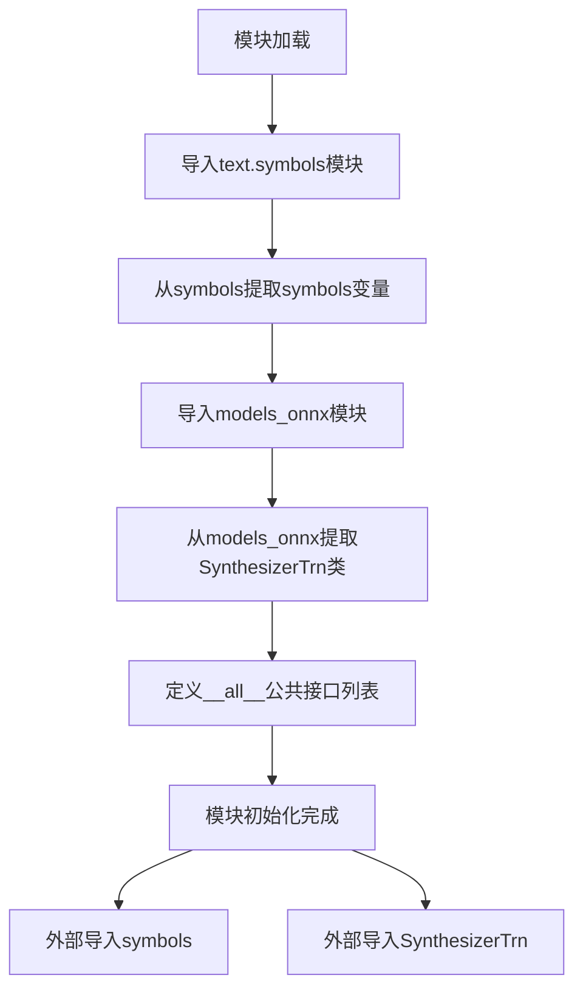

# `Bert-VITS2\onnx_modules\V220_novq_dev\__init__.py` 详细设计文档

这是一个VITS语音合成项目的模块初始化文件，主要负责导入并暴露文本符号表(symbols)和ONNX语音合成模型(SynthesizerTrn)两个核心公共接口，为上层应用提供统一的模块访问入口。

## 整体流程



## 类结构

```
VITS-TTS-Project (项目根)
└── __init__.py (模块入口)
    ├── text.symbols (符号表模块)
    │   └── symbols (全局变量: 音素/字符符号集)
    └── models_onnx (ONNX模型模块)
        └── SynthesizerTrn (语音合成器类)
```

## 全局变量及字段


### `symbols`
    
文本转语音系统中使用的符号集合，通常为音素或字符元组，定义了模型可处理的文本单元

类型：`tuple`
    


    

## 全局函数及方法


## 关键组件


### symbols

从text.symbols模块导入的符号集合，通常用于文本到语音合成系统中的音素或文本符号定义，是合成器需要的基础字符映射表。

### SynthesizerTrn

从models_onnx模块导入的ONNX推理模型类，负责基于Transformer架构的神经网络语音合成推理，可能包含张量索引处理、惰性加载优化、反量化支持及量化策略等核心功能。


## 问题及建议


### 已知问题

-   **缺少模块文档字符串**：该 `__init__.py` 文件没有包含模块级文档字符串，无法快速了解该包的用途和功能
-   **无版本信息**：缺少 `__version__` 变量，项目发布时难以追踪版本
-   **导入无错误处理**：直接导入 `symbols` 和 `SynthesizerTrn`，如果依赖模块不存在或路径错误，会直接抛出 ImportError，缺乏友好的错误提示
-   **无类型注解**：作为公共 API 导出点，缺少类型注解不利于静态分析和 IDE 智能提示
-   **未验证导入成功性**：导入后未检查 `symbols` 和 `SynthesizerTrn` 是否真正可用，可能导致运行时隐性错误

### 优化建议

-   添加模块级文档字符串，说明该包为 VITS 语音合成模型的 ONNX 实现模块，并简要描述其核心功能
-   添加 `__version__` 变量以支持版本追踪，如 `__version__ = "1.0.0"`
-   引入 try-except 块包装导入语句，提供更友好的错误信息或降级方案，例如：  
  ```python  
  try:  
      from .text.symbols import symbols  
  except ImportError as e:  
      raise ImportError(f"Failed to import symbols: {e}") from e  
  ```
-   为导入的符号添加类型注解或在 `__all__` 中使用 `TYPE_CHECKING` 进行类型提示  
-   考虑添加延迟导入（lazy import）以优化包加载性能，特别是在 symbols 或 SynthesizerTrn 体积较大的情况下  
-   添加 `__author__` 和 `__license__` 等元信息字段，便于项目管理和分发  


## 其它


### 设计目标与约束

本模块作为VITS（Variational Inference with adversarial learning for end-to-end Text-to-Speech）ONNX版本的公共接口模块，负责暴露核心符号定义和模型合成器类给外部调用。设计目标包括：1）提供统一的模块导出入口；2）解耦文本处理符号与模型实现；3）支持ONNX runtime推理部署。约束条件包括：仅支持Python 3.7+环境，需配合torch、numpy、onnxruntime等依赖使用，模型输入输出维度需与symbols定义保持一致。

### 错误处理与异常设计

当前模块本身不涉及复杂逻辑，错误处理主要依赖于上游模块。对于ImportError，建议在调用处进行try-except捕获，提示用户检查是否正确安装vits-onnx及其依赖。对于Symbol定义缺失或模型类加载失败，应向上抛出异常，由调用方决定处理策略。建议在项目级统一制定异常基类，如VITSOnnxError，以统一错误码和错误消息格式。

### 数据流与状态机

本模块作为数据流的入口点，主要数据流包括：外部调用方→导入symbols（文本符号映射）→SynthesizerTrn类（模型推理）→ONNX runtime执行→返回音频数据。由于模块本身无状态机设计，状态管理由SynthesizerTrn类内部实现（模型加载状态、推理状态等）。建议在SynthesizerTrn类中明确定义状态转换逻辑，如UNLOADED→LOADED→INFERENCING→READY等状态。

### 外部依赖与接口契约

本模块的外部依赖包括：1）text.symbols模块：提供symbols符号集定义，接口契约为返回符号列表或符号映射对象；2）models_onnx模块：提供SynthesizerTrn类，接口契约为遵循特定__init__和inference方法签名；3）运行时依赖：onnxruntime、torch、numpy等。接口契约建议：symbols应为list或dict类型，SynthesizerTrn应实现load_model()、inference()、unload_model()等标准方法，返回音频数据应为numpy.ndarray类型。

### 版本兼容性信息

当前模块版本基于VITS ONNX项目早期版本设计，需与text.symbols和models_onnx模块版本保持同步。建议在项目中引入版本号管理机制，如__version__变量，并在文档中明确标注兼容的各子模块版本范围。当symbols定义或模型架构发生重大变更时，需同步更新__all__导出列表和本模块版本号。

### 使用示例与调用方指南

建议提供基础使用示例：from vits_onnx import symbols, SynthesizerTrn；synthesizer = SynthesizerTrn("model.onnx")；audio = synthesizer.inference("Hello world")。同时应在文档中说明典型部署流程：1）准备ONNX模型文件；2）确认symbols定义与训练时一致；3）实例化SynthesizerTrn并调用推理接口；4）处理返回的音频数据（采样率转换、格式转换等）。

    