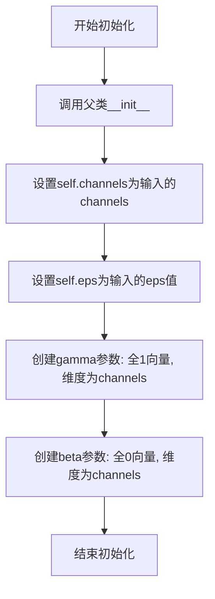
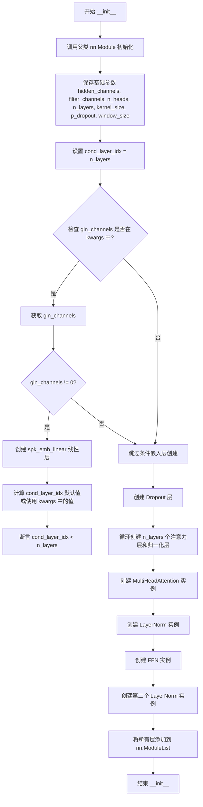
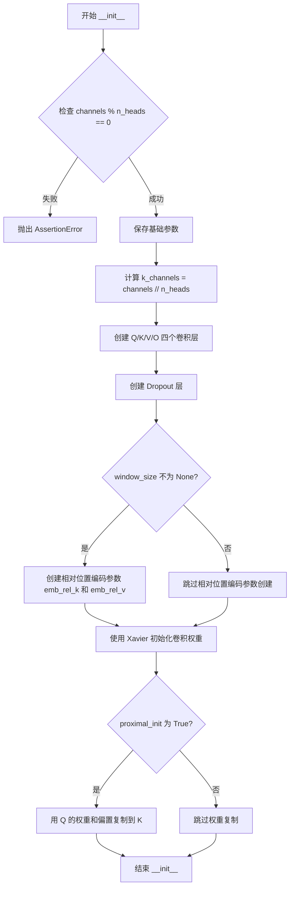
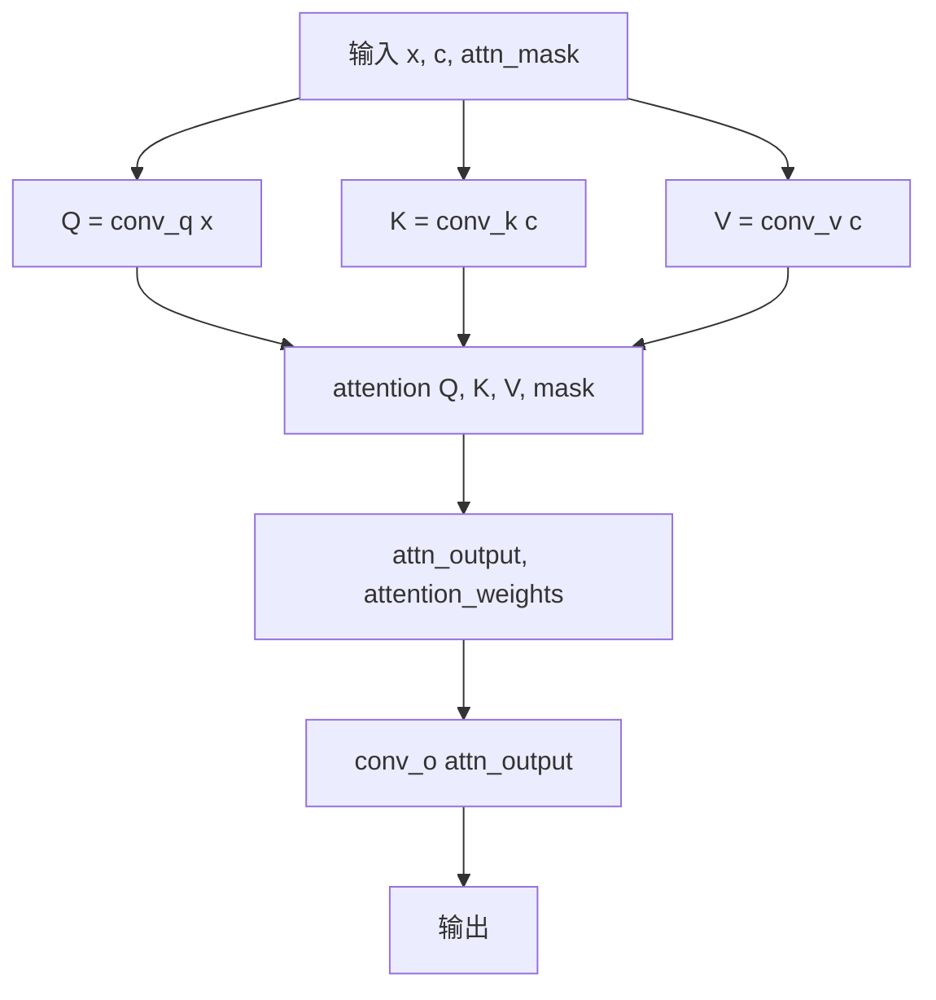
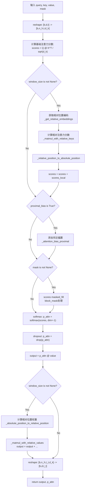
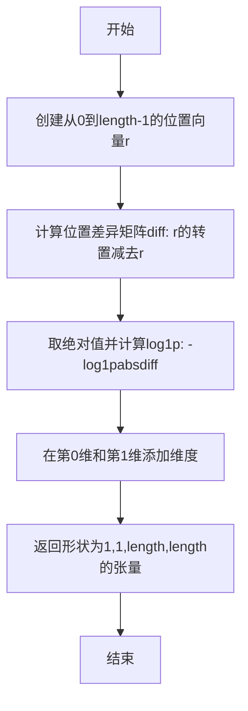
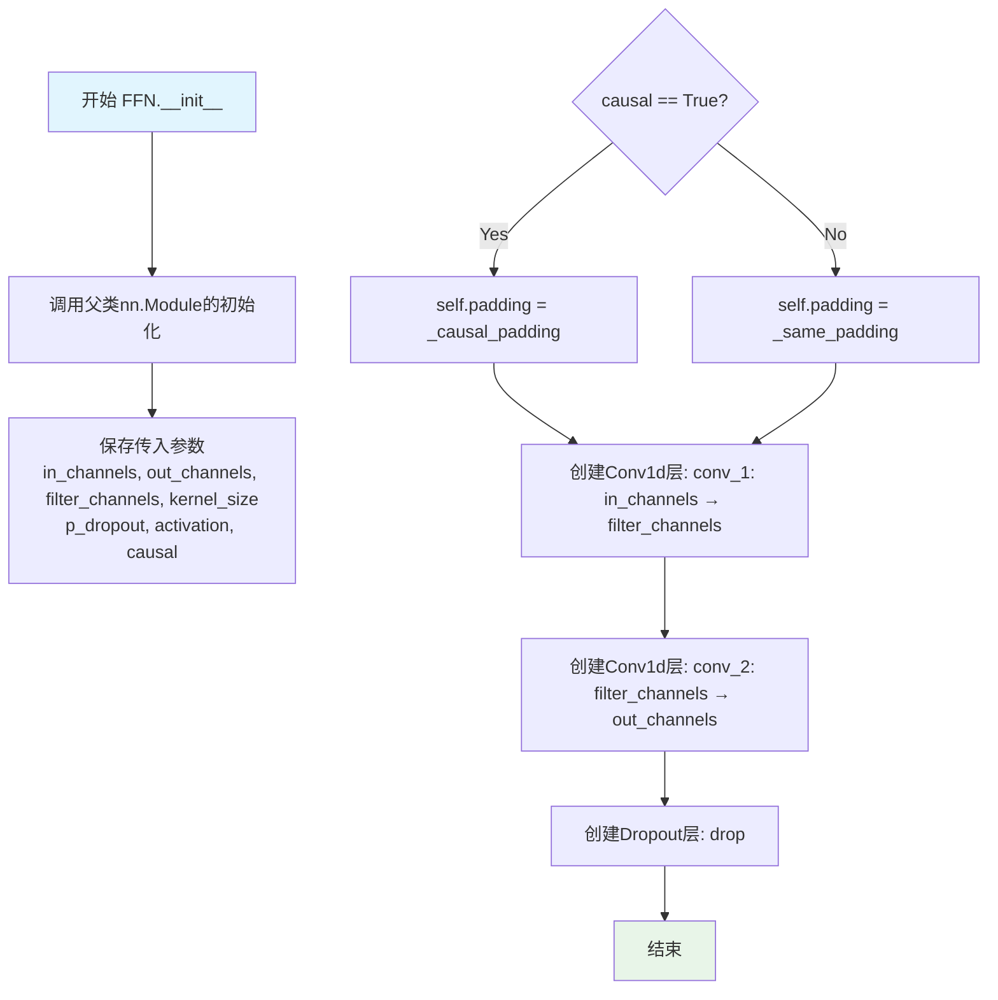

# `Bert-VITS2\onnx_modules\V220_novq_dev\attentions_onnx.py` 详细设计文档

这是一个基于Transformer架构的神经网络编码器模块，实现了多头自注意力机制和前馈网络，用于处理序列到序列的音频/语音特征变换，支持说话人嵌入条件化、相对位置编码和因果卷积填充等高级特性。

## 整体流程

```mermaid
graph TD
    A[输入: x, x_mask, g(可选)] --> B[创建注意力掩码 attn_mask]
    B --> C{应用说话人嵌入}
    C -- 是且i==cond_layer_idx --> D[线性变换g并加到x]
    C -- 否 --> E[跳过嵌入添加]
    D --> E
    E --> F[遍历每一层Transformer块]
    F --> G[MultiHeadAttention: 自注意力计算]
    G --> H[残差连接和LayerNorm]
    H --> I[FFN: 前馈网络计算]
    I --> J[残差连接和LayerNorm]
    J --> K{是否还有下一层?}
    K -- 是 --> F
    K -- 否 --> L[输出: 编码后的x]
    subgraph MultiHeadAttention内部
        G1[QKV投影] --> G2[计算注意力分数]
        G2 --> G3[相对位置编码(可选)]
        G3 --> G4[邻近偏置(可选)]
        G4 --> G5[Softmax和dropout]
        G5 --> G6[加权值输出]
    end
```

## 类结构

```
nn.Module (PyTorch基类)
├── LayerNorm
├── Encoder
│   └── MultiHeadAttention
│   └── FFN
└── (全局函数)
    └── fused_add_tanh_sigmoid_multiply
```

## 全局变量及字段


### `math`
    
Python数学库，用于数学运算如开方

类型：`module`
    


### `torch`
    
PyTorch深度学习框架

类型：`module`
    


### `nn`
    
torch.nn神经网络模块

类型：`module`
    


### `F`
    
torch.nn.functional函数式API

类型：`module`
    


### `commons`
    
导入的通用工具模块

类型：`module`
    


### `logger`
    
模块级日志记录器

类型：`logging.Logger`
    


### `LayerNorm.channels`
    
输入通道数

类型：`int`
    


### `LayerNorm.eps`
    
数值稳定性epsilon

类型：`float`
    


### `LayerNorm.gamma`
    
可学习缩放系数

类型：`nn.Parameter`
    


### `LayerNorm.beta`
    
可学习偏移系数

类型：`nn.Parameter`
    


### `Encoder.hidden_channels`
    
隐藏层通道数

类型：`int`
    


### `Encoder.filter_channels`
    
滤波器通道数

类型：`int`
    


### `Encoder.n_heads`
    
注意力头数

类型：`int`
    


### `Encoder.n_layers`
    
编码器层数

类型：`int`
    


### `Encoder.kernel_size`
    
卷积核大小

类型：`int`
    


### `Encoder.p_dropout`
    
dropout概率

类型：`float`
    


### `Encoder.window_size`
    
相对注意力窗口大小

类型：`int`
    


### `Encoder.cond_layer_idx`
    
条件嵌入层索引

类型：`int`
    


### `Encoder.gin_channels`
    
说话人特征通道数(可选)

类型：`int`
    


### `Encoder.spk_emb_linear`
    
说话人嵌入线性层(可选)

类型：`nn.Linear`
    


### `Encoder.drop`
    
Dropout层

类型：`nn.Dropout`
    


### `Encoder.attn_layers`
    
注意力层列表

类型：`nn.ModuleList`
    


### `Encoder.norm_layers_1`
    
第一归一化层列表

类型：`nn.ModuleList`
    


### `Encoder.ffn_layers`
    
前馈网络层列表

类型：`nn.ModuleList`
    


### `Encoder.norm_layers_2`
    
第二归一化层列表

类型：`nn.ModuleList`
    


### `MultiHeadAttention.channels`
    
输入通道数

类型：`int`
    


### `MultiHeadAttention.out_channels`
    
输出通道数

类型：`int`
    


### `MultiHeadAttention.n_heads`
    
注意力头数

类型：`int`
    


### `MultiHeadAttention.p_dropout`
    
dropout概率

类型：`float`
    


### `MultiHeadAttention.window_size`
    
相对位置编码窗口大小

类型：`int或None`
    


### `MultiHeadAttention.heads_share`
    
头之间是否共享相对位置

类型：`bool`
    


### `MultiHeadAttention.block_length`
    
局部注意力块长度

类型：`int或None`
    


### `MultiHeadAttention.proximal_bias`
    
是否使用邻近偏置

类型：`bool`
    


### `MultiHeadAttention.proximal_init`
    
是否用Q权重初始化K

类型：`bool`
    


### `MultiHeadAttention.attn`
    
注意力权重缓存

类型：`torch.Tensor或None`
    


### `MultiHeadAttention.k_channels`
    
每个头的key通道数

类型：`int`
    


### `MultiHeadAttention.conv_q`
    
Query投影卷积

类型：`nn.Conv1d`
    


### `MultiHeadAttention.conv_k`
    
Key投影卷积

类型：`nn.Conv1d`
    


### `MultiHeadAttention.conv_v`
    
Value投影卷积

类型：`nn.Conv1d`
    


### `MultiHeadAttention.conv_o`
    
输出投影卷积

类型：`nn.Conv1d`
    


### `MultiHeadAttention.drop`
    
Dropout层

类型：`nn.Dropout`
    


### `MultiHeadAttention.emb_rel_k`
    
相对位置key嵌入(可选)

类型：`nn.Parameter`
    


### `MultiHeadAttention.emb_rel_v`
    
相对位置value嵌入(可选)

类型：`nn.Parameter`
    


### `FFN.in_channels`
    
输入通道数

类型：`int`
    


### `FFN.out_channels`
    
输出通道数

类型：`int`
    


### `FFN.filter_channels`
    
隐藏层滤波器通道数

类型：`int`
    


### `FFN.kernel_size`
    
卷积核大小

类型：`int`
    


### `FFN.p_dropout`
    
dropout概率

类型：`float`
    


### `FFN.activation`
    
激活函数类型

类型：`str或None`
    


### `FFN.causal`
    
是否使用因果卷积

类型：`bool`
    


### `FFN.padding`
    
填充函数(因果或same)

类型：`callable`
    


### `FFN.conv_1`
    
第一个卷积层

类型：`nn.Conv1d`
    


### `FFN.conv_2`
    
第二个卷积层

类型：`nn.Conv1d`
    


### `FFN.drop`
    
Dropout层

类型：`nn.Dropout`
    
    

## 全局函数及方法


### `fused_add_tanh_sigmoid_multiply`

融合的tanh-sigmoid激活函数，通过将输入张量的通道维度分割为两部分，分别应用tanh和sigmoid激活后再相乘，实现WaveNet模型中门控激活的高效计算。

参数：

- `input_a`：`torch.Tensor`，第一个输入张量，通常为上一层输出
- `input_b`：`torch.Tensor`，第二个输入张量，通常为残差连接或条件输入
- `n_channels`：`torch.Tensor`（或类似可索引对象），通道数配置，通过`n_channels[0]`提取整数，用于分割通道维度

返回值：`torch.Tensor`，返回tanh激活与sigmoid激活相乘后的结果张量，形状与输入张量相同

#### 流程图

```mermaid
flowchart TD
    A[input_a, input_b, n_channels] --> B[提取n_channels_int = n_channels[0]]
    B --> C[计算in_act = input_a + input_b]
    C --> D[分割通道: in_act[:, :n_channels_int, :]]
    C --> E[分割通道: in_act[:, n_channels_int:, :]]
    D --> F[t_act = torch.tanh前部分]
    E --> G[s_act = torch.sigmoid后部分]
    F --> H[acts = t_act * s_act]
    G --> H
    H --> I[返回acts]
```

#### 带注释源码

```
@torch.jit_script
def fused_add_tanh_sigmoid_multiply(input_a, input_b, n_channels):
    """
    融合的tanh-sigmoid乘法运算，用于WaveNet门控激活
    
    参数:
        input_a: 第一个输入张量，形状为 [B, C, T]
        input_b: 第二个输入张量，形状为 [B, C, T]
        n_channels: 通道数配置，通常为列表或张量 [C]
    
    返回:
        融合激活后的输出张量，形状为 [B, C, T]
    """
    # 从n_channels张量中提取整数通道数
    n_channels_int = n_channels[0]
    
    # 将两个输入张量按元素相加（残差连接/门控输入）
    in_act = input_a + input_b
    
    # 对前n_channels_int个通道应用tanh激活
    t_act = torch.tanh(in_act[:, :n_channels_int, :])
    
    # 对后n_channels_int个通道应用sigmoid激活
    s_act = torch.sigmoid(in_act[:, n_channels_int:, :])
    
    # 将tanh激活和sigmoid激活相乘（门控机制）
    acts = t_act * s_act
    
    return acts
```


### `LayerNorm.__init__`

初始化LayerNorm层，设置通道数和维护可学习的缩放(gamma)和偏移(beta)参数，用于后续的层归一化操作。

参数：

-  `self`：`LayerNorm`，LayerNorm实例本身
-  `channels`：`int`，输入数据的通道数，决定gamma和beta参数的维度
-  `eps`：`float`，默认为1e-5，用于防止除零的小值，传递给F.layer_norm

返回值：`None`，无返回值

#### 流程图



#### 带注释源码

```python
def __init__(self, channels, eps=1e-5):
    # 调用nn.Module的初始化方法，建立PyTorch模块的基本结构
    super().__init__()
    # 保存通道数，用于后续layer_norm的normalized_shape参数
    self.channels = channels
    # 保存epsilon值，用于数值稳定性，防止除零错误
    self.eps = eps

    # 创建可学习的缩放参数gamma，初始化为全1向量
    # 用于在layer_norm后对输出进行缩放
    self.gamma = nn.Parameter(torch.ones(channels))
    # 创建可学习的偏移参数beta，初始化为全0向量
    # 用于在layer_norm后对输出进行平移
    self.beta = nn.Parameter(torch.zeros(channels))
```


### `LayerNorm.forward`

该方法实现了层归一化（Layer Normalization）功能，通过对输入张量的最后一个维度进行归一化处理，并使用可学习的缩放参数（gamma）和偏移参数（beta）进行线性变换。为了适配PyTorch的`F.layer_norm`函数对输入形状的要求（期望特征维度在最后），方法在计算前转置输入张量，计算后再转置回原始形状。

参数：

- `self`：`LayerNorm`，LayerNorm类的实例，包含通道数、epsilon值以及可学习的gamma和beta参数
- `x`：`torch.Tensor`，输入张量，形状为`(batch, channels, ...)`或任意最后维度为`channels`的张量

返回值：`torch.Tensor`，返回归一化后的张量，形状与输入张量`x`相同

#### 流程图

```mermaid
flowchart TD
    A[开始forward方法] --> B[输入张量x]
    B --> C[transpose: 交换维度1和最后一维]
    C --> D[调用F.layer_norm]
    D --> E[传入参数: 形状self.channels, self.gamma, self.beta, self.eps]
    E --> F[transpose: 再次交换维度1和最后一维]
    F --> G[返回归一化后的张量]
    
    subgraph "F.layer_norm内部"
        D1[计算均值] --> D2[计算方差]
        D2 --> D3[标准化: (x - mean) / sqrt(var + eps)]
        D3 --> D4[应用gamma缩放]
        D4 --> D5[加上beta偏移]
    end
```

#### 带注释源码

```python
def forward(self, x):
    # 将输入张量x的维度进行转置
    # 原始形状假设为 (batch, channels, time) 或 (batch, channels, ...)
    # 转置后变为 (batch, ..., channels)，使channels维度成为最后一维
    # 这样符合F.layer_norm对输入形状的要求：归一化的维度必须在最后
    x = x.transpose(1, -1)
    
    # 调用PyTorch的layer_norm函数进行归一化
    # 参数说明：
    # - x: 转置后的输入张量
    # - (self.channels,): 要归一化的维度大小，即最后一个维度的大小
    # - self.gamma: 可学习的缩放参数（gamma），用于对归一化后的值进行线性变换，初始值为1
    # - self.beta: 可学习的偏移参数（beta），用于对归一化后的值进行平移，初始值为0
    # - self.eps: 防止除零的小常数，默认值为1e-5
    x = F.layer_norm(x, (self.channels,), self.gamma, self.beta, self.eps)
    
    # 再次转置，将维度顺序恢复为原始顺序
    # 即从 (batch, ..., channels) 转置回 (batch, channels, ...)
    return x.transpose(1, -1)
```


### `Encoder.__init__`

该方法是 `Encoder` 类的构造函数，负责初始化一个基于 Transformer 架构的音频/文本编码器模块，包含隐藏通道配置、多头注意力层、前馈网络层、条件嵌入层（可选）等核心组件的构建与参数注册。

参数：

- `hidden_channels`：`int`，隐藏层的通道数，决定特征表示的维度
- `filter_channels`：`int`，前馈网络中滤波器的通道数，用于扩展特征维度
- `n_heads`：`int`，多头注意力的头数，决定并行注意力的数量
- `n_layers`：`int`，编码器的层数，即 Transformer 块的堆叠数量
- `kernel_size`：`int`，卷积核大小，默认为 1，用于前馈网络中的卷积操作
- `p_dropout`：`float`，Dropout 概率，默认为 0.0，用于正则化防止过拟合
- `window_size`：`int`，窗口大小，默认为 4，用于相对位置编码的局部注意力范围
- `isflow`：`bool`，是否为 Flow 模型，默认为 True（代码中当前未使用，保留扩展性）
- `**kwargs`：`dict`，可选关键字参数，包含 `gin_channels`（说话人嵌入维度）和 `cond_layer_idx`（条件注入层索引）等

返回值：`None`，该方法为构造函数，无返回值，直接初始化对象属性

#### 流程图



#### 带注释源码

```python
def __init__(
    self,
    hidden_channels,      # int: 隐藏通道数，定义特征的维度
    filter_channels,     # int: 滤波器通道数，用于前馈网络
    n_heads,              # int: 多头注意力的头数
    n_layers,             # int: 编码器的层数
    kernel_size=1,        # int: 卷积核大小，默认1
    p_dropout=0.0,        # float: Dropout概率，默认0.0
    window_size=4,        # int: 窗口大小，用于相对位置编码
    isflow=True,          # bool: 是否为flow模型（当前未使用）
    **kwargs              # dict: 其他可选参数，如gin_channels, cond_layer_idx
):
    # 调用父类 nn.Module 的初始化方法，注册到 PyTorch 模块系统中
    super().__init__()
    
    # 保存基础配置参数到实例属性
    self.hidden_channels = hidden_channels
    self.filter_channels = filter_channels
    self.n_heads = n_heads
    self.n_layers = n_layers
    self.kernel_size = kernel_size
    self.p_dropout = p_dropout
    self.window_size = window_size
    
    # isflow 参数保留用于扩展，当前代码中已注释掉条件层逻辑
    # if isflow:
    #     cond_layer = torch.nn.Conv1d(256, 2*hidden_channels*n_layers, 1)
    #     self.cond_pre = torch.nn.Conv1d(hidden_channels, 2*hidden_channels, 1)
    #     self.cond_layer = weight_norm(cond_layer, name='weight')
    #     self.gin_channels = 256
    
    # 设置条件层索引默认为总层数（即不注入条件）
    self.cond_layer_idx = self.n_layers
    
    # 检查是否传入了说话人嵌入通道数
    if "gin_channels" in kwargs:
        self.gin_channels = kwargs["gin_channels"]  # 说话人嵌入的维度
        
        # 如果说话人通道数不为0，则创建条件嵌入层
        if self.gin_channels != 0:
            # 创建线性层：将说话人嵌入映射到隐藏通道维度
            self.spk_emb_linear = nn.Linear(self.gin_channels, self.hidden_channels)
            
            # 确定条件注入的层索引（默认为第2层，即第3个block）
            # VITS2 论文建议在第3个block注入条件信息
            self.cond_layer_idx = (
                kwargs["cond_layer_idx"] if "cond_layer_idx" in kwargs else 2
            )
            
            # 记录调试日志
            logging.debug(self.gin_channels, self.cond_layer_idx)
            
            # 断言：条件层索引必须小于总层数
            assert (
                self.cond_layer_idx < self.n_layers
            ), "cond_layer_idx should be less than n_layers"
    
    # 创建 Dropout 层，用于注意力层和前馈网络层
    self.drop = nn.Dropout(p_dropout)
    
    # 初始化多个 nn.ModuleList 以存储可训练的子层
    self.attn_layers = nn.ModuleList()      # 多头注意力层列表
    self.norm_layers_1 = nn.ModuleList()    # 注意力前的归一化层列表
    self.ffn_layers = nn.ModuleList()       # 前馈网络层列表
    self.norm_layers_2 = nn.ModuleList()    # 前馈网络后的归一化层列表
    
    # 循环创建 n_layers 个 Transformer 块
    for i in range(self.n_layers):
        # 创建多头注意力层
        self.attn_layers.append(
            MultiHeadAttention(
                hidden_channels,      # 输入通道数
                hidden_channels,      # 输出通道数
                n_heads,               # 注意力头数
                p_dropout=p_dropout,   # Dropout 概率
                window_size=window_size,  # 窗口大小
            )
        )
        
        # 创建注意力前的层归一化层
        self.norm_layers_1.append(LayerNorm(hidden_channels))
        
        # 创建前馈网络层（包含卷积和激活函数）
        self.ffn_layers.append(
            FFN(
                hidden_channels,       # 输入通道数
                hidden_channels,       # 输出通道数
                filter_channels,       # 滤波器通道数
                kernel_size,           # 卷积核大小
                p_dropout=p_dropout,   # Dropout 概率
            )
        )
        
        # 创建前馈网络后的层归一化层
        self.norm_layers_2.append(LayerNorm(hidden_channels))
```


### `Encoder.forward`

该方法是VITS模型中Encoder（编码器）的前向传播函数，负责将输入的音频特征序列通过多层自注意力机制和前馈神经网络进行编码，支持可选的说话人嵌入条件注入，最终输出编码后的隐藏特征序列。

参数：

- `self`：Encoder类实例本身
- `x`：`torch.Tensor`，输入的音频特征张量，形状为[batch, hidden_channels, time]，其中hidden_channels是隐藏层通道数，time是时间步长
- `x_mask`：`torch.Tensor`，用于掩码的可疑区域标记张量，形状为[batch, time]，值为0或1，1表示有效位置
- `g`：`torch.Tensor`，可选的说话人嵌入向量，形状为[batch, gin_channels, 1]，用于条件生成，当为None时不进行条件注入

返回值：`torch.Tensor`，编码后的隐藏特征序列，形状为[batch, hidden_channels, time]，与输入x的形状相同

#### 流程图

```mermaid
flowchart TD
    A[开始 forward] --> B[创建注意力掩码 attn_mask]
    B --> C[输入x乘以掩码 x_mask]
    C --> D{遍历每一层 i in range{n_layers}}
    D --> E{i == cond_layer_idx 且 g 不为 None?}
    E -->|是| F[说话人嵌入线性变换]
    F --> G[转置g并与x相加]
    G --> H[重新应用掩码]
    E -->|否| I[自注意力计算]
    H --> I
    I --> J[Dropout]
    J --> K[残差连接和LayerNorm]
    K --> L[前馈网络FFN计算]
    L --> M[Dropout]
    M --> N[残差连接和LayerNorm]
    N --> O{是否还有下一层?}
    O -->|是| E
    O -->|否| P[最终输出乘以掩码]
    P --> Q[返回编码后的x]
```

#### 带注释源码

```python
def forward(self, x, x_mask, g=None):
    """
    Encoder的前向传播方法
    
    参数:
        x: 输入特征张量 [batch, hidden_channels, time]
        x_mask: 掩码张量 [batch, time]，用于标记有效时间步
        g: 可选的说话人嵌入 [batch, gin_channels, 1]
    
    返回:
        编码后的特征张量 [batch, hidden_channels, time]
    """
    # 创建注意力掩码：通过将x_mask在第2维和最后1维展开并相乘
    # 得到形状为[batch, time, time]的注意力掩码矩阵
    attn_mask = x_mask.unsqueeze(2) * x_mask.unsqueeze(-1)
    
    # 初始阶段：将输入乘以掩码，将无效位置置零
    x = x * x_mask
    
    # 遍历Encoder的每一层
    for i in range(self.n_layers):
        # 条件注入逻辑：当到达指定层且提供了说话人嵌入时
        if i == self.cond_layer_idx and g is not None:
            # 对说话人嵌入进行线性变换：从gin_channels映射到hidden_channels
            g = self.spk_emb_linear(g.transpose(1, 2))  # [batch, 1, gin_channels] -> [batch, 1, hidden_channels]
            g = g.transpose(1, 2)  # 转置回[batch, hidden_channels, 1]
            x = x + g  # 将说话人嵌入加到当前特征上
            x = x * x_mask  # 重新应用掩码
        
        # 自注意力层
        # MultiHeadAttention接受查询、键、值三个输入，这里都是x
        y = self.attn_layers[i](x, x, attn_mask)
        y = self.drop(y)  # Dropout正则化
        # 残差连接后接LayerNorm
        x = self.norm_layers_1[i](x + y)
        
        # 前馈网络层
        y = self.ffn_layers[i](x, x_mask)
        y = self.drop(y)  # Dropout正则化
        # 残差连接后接LayerNorm
        x = self.norm_layers_2[i](x + y)
    
    # 最终输出阶段：再次应用掩码确保输出有效性
    x = x * x_mask
    return x
```


### `MultiHeadAttention.__init__`

该方法是 `MultiHeadAttention` 类的初始化方法，用于构建一个多头注意力机制模块，支持相对位置编码、局部注意力掩码和近端偏置等高级特性，常用于 Transformer 模型中的自注意力计算。

参数：

- `self`：隐式参数，`MultiHeadAttention` 类实例本身
- `channels`：`int`，输入特征通道数，必须能被 `n_heads` 整除
- `out_channels`：`int`，输出特征通道数
- `n_heads`：`int`，注意力头的数量
- `p_dropout`：`float`，dropout 概率，默认为 0.0，用于防止过拟合
- `window_size`：`int` 或 `None`，相对位置编码的窗口大小，设为 `None` 时禁用相对位置编码
- `heads_share`：`bool`，默认为 `True`，表示多头之间是否共享相对位置嵌入
- `block_length`：`int` 或 `None`，用于局部注意力，限制每个位置只能关注指定范围内的其他位置
- `proximal_bias`：`bool`，默认为 `False`，是否启用近端偏置，使注意力更倾向于接近的位置
- `proximal_init`：`bool`，默认为 `False`，是否用查询权重初始化键权重（用于近端偏置场景）

返回值：无（`None`），构造函数仅初始化对象属性

#### 流程图



#### 带注释源码

```python
def __init__(
    self,
    channels,                # 输入通道数
    out_channels,            # 输出通道数
    n_heads,                 # 注意力头数
    p_dropout=0.0,           # Dropout 概率
    window_size=None,       # 相对位置编码窗口大小
    heads_share=True,       # 多头是否共享相对位置嵌入
    block_length=None,       # 局部注意力块长度
    proximal_bias=False,    # 是否启用近端偏置
    proximal_init=False,    # 是否用 Q 权重初始化 K 权重
):
    super().__init__()
    # 确保通道数可以被头数整除，这是多头注意力机制的基本要求
    assert channels % n_heads == 0

    # ==================== 保存配置参数 ====================
    self.channels = channels                  # 输入通道数
    self.out_channels = out_channels          # 输出通道数
    self.n_heads = n_heads                     # 注意力头数
    self.p_dropout = p_dropout                 # Dropout 概率
    self.window_size = window_size             # 相对位置编码窗口大小
    self.heads_share = heads_share             # 多头是否共享相对位置嵌入
    self.block_length = block_length           # 局部注意力块长度
    self.proximal_bias = proximal_bias         # 是否启用近端偏置
    self.proximal_init = proximal_init         # 是否用 Q 权重初始化 K 权重
    self.attn = None                           # 存储注意力权重（用于可视化或调试）

    # ==================== 计算内部维度 ====================
    # 每个头的通道数，通过将总通道数除以头数得到
    self.k_channels = channels // n_heads

    # ==================== 创建 Q/K/V/O 四个一维卷积层 ====================
    # 这些卷积层用于将输入特征线性变换到 Q、K、V 空间
    # Q: Query 用于计算与 K 的相似度
    # K: Key 用于与 Q 计算注意力权重
    # V: Value 用于根据注意力权重加权求和
    # O: Output 将多头注意力结果映射回输出空间
    self.conv_q = nn.Conv1d(channels, channels, 1)    # 查询卷积
    self.conv_k = nn.Conv1d(channels, channels, 1)    # 键值卷积
    self.conv_v = nn.Conv1d(channels, channels, 1)    # 值卷积
    self.conv_o = nn.Conv1d(channels, out_channels, 1)  # 输出投影卷积
    self.drop = nn.Dropout(p_dropout)                 # Dropout 层

    # ==================== 相对位置编码参数（可选） ====================
    # 当 window_size 不为 None 时启用，用于支持相对位置编码的注意力机制
    if window_size is not None:
        # 如果 heads_share 为 True，则所有头共享一套相对位置嵌入
        # 否则每个头有独立的相对位置嵌入
        n_heads_rel = 1 if heads_share else n_heads
        
        # 计算初始化标准差，使嵌入的方差保持在合理范围
        rel_stddev = self.k_channels**-0.5
        
        # 创建相对位置键嵌入: [n_heads_rel, 2*window_size+1, k_channels]
        # 范围从 -window_size 到 +window_size
        self.emb_rel_k = nn.Parameter(
            torch.randn(n_heads_rel, window_size * 2 + 1, self.k_channels)
            * rel_stddev
        )
        # 创建相对位置值嵌入
        self.emb_rel_v = nn.Parameter(
            torch.randn(n_heads_rel, window_size * 2 + 1, self.k_channels)
            * rel_stddev
        )

    # ==================== 权重初始化 ====================
    # 使用 Xavier 均匀初始化卷积层权重
    nn.init.xavier_uniform_(self.conv_q.weight)
    nn.init.xavier_uniform_(self.conv_k.weight)
    nn.init.xavier_uniform_(self.conv_v.weight)
    
    # 如果启用 proximal_init，将 K 的权重和偏置复制为与 Q 相同
    # 这是一种常见的初始化技巧，用于自回归模型中鼓励模型关注邻近位置
    if proximal_init:
        with torch.no_grad():
            self.conv_k.weight.copy_(self.conv_q.weight)
            self.conv_k.bias.copy_(self.conv_q.bias)
```


### `MultiHeadAttention.forward`

该方法实现了多头注意力机制的前向传播，通过将输入 x 和上下文 c 分别转换为查询（Q）、键（K）、值（V），计算注意力权重后得到输出。

参数：

- `self`：`MultiHeadAttention`，MultiHeadAttention 类的实例，隐含参数
- `x`：`torch.Tensor`，形状为 [batch, channels, time]，输入序列，用于生成查询向量
- `c`：`torch.Tensor`，形状为 [batch, channels, time]，上下文序列，用于生成键和值向量
- `attn_mask`：`torch.Tensor`，可选，形状为 [batch, time, time] 或 [batch, 1, time, time]，注意力掩码，用于屏蔽无效位置

返回值：`torch.Tensor`，形状为 [batch, out_channels, time]，经过多头注意力机制处理后的输出

#### 流程图



#### 带注释源码

```python
def forward(self, x, c, attn_mask=None):
    """
    多头注意力前向传播
    
    参数:
        x: 输入张量 [batch, channels, time]
        c: 上下文张量 [batch, channels, time]
        attn_mask: 可选的注意力掩码
    
    返回:
        输出张量 [batch, out_channels, time]
    """
    # 步骤1: 通过卷积层生成查询向量
    # 使用 conv_q 将输入 x 投影到查询空间
    q = self.conv_q(x)
    
    # 步骤2: 通过卷积层生成键向量
    # 使用 conv_k 将上下文 c 投影到键空间
    k = self.conv_k(c)
    
    # 步骤3: 通过卷积层生成值向量
    # 使用 conv_v 将上下文 c 投影到值空间
    v = self.conv_v(c)

    # 步骤4: 计算注意力输出和注意力权重
    # 调用 attention 方法执行核心注意力计算
    x, self.attn = self.attention(q, k, v, mask=attn_mask)

    # 步骤5: 通过输出卷积层得到最终输出
    # 使用 conv_o 将注意力输出投影到目标维度
    x = self.conv_o(x)
    return x
```


### `MultiHeadAttention.attention`

该方法实现了多头注意力机制的核心计算逻辑，接收query、key、value张量并计算注意力输出，支持相对位置编码、邻近偏置和局部掩码等高级特性。

参数：

- `query`：`torch.Tensor`，查询张量，形状为 [batch, channels, time]，来自卷积层 conv_q 的输出
- `key`：`torch.Tensor`，键张量，形状为 [batch, channels, time]，来自卷积层 conv_k 的输出
- `value`：`torch.Tensor`，值张量，形状为 [batch, channels, time]，来自卷积层 conv_v 的输出
- `mask`：`torch.Tensor` 或 `None`，可选的注意力掩码，用于屏蔽某些位置的攻击，形状需与注意力分数匹配

返回值：`Tuple[torch.Tensor, torch.Tensor]`，返回一个元组，包含：
- `output`：torch.Tensor，计算得到的注意力输出，形状为 [batch, channels, time]
- `p_attn`：torch.Tensor，注意力权重矩阵（softmax后的概率），形状为 [batch, n_heads, query_time, key_time]

#### 流程图



#### 带注释源码

```python
def attention(self, query, key, value, mask=None):
    """
    多头注意力机制的核心计算
    
    参数:
        query: 查询张量 [batch, channels, time]
        key: 键张量 [batch, channels, time]
        value: 值张量 [batch, channels, time]
        mask: 可选的注意力掩码
    
    返回:
        output: 注意力输出 [batch, channels, time]
        p_attn: 注意力权重 [batch, n_heads, query_time, key_time]
    """
    # === 步骤1: 形状变换 ===
    # 获取batch大小b、通道数d、key的时间步t_s和query的时间步t_t
    # reshape [b, d, t] -> [b, n_h, t, d_k]
    # 将通道维度分割为多个头，每个头的维度为 k_channels
    b, d, t_s, t_t = (*key.size(), query.size(2))
    query = query.view(b, self.n_heads, self.k_channels, t_t).transpose(2, 3)
    key = key.view(b, self.n_heads, self.k_channels, t_s).transpose(2, 3)
    value = value.view(b, self.n_heads, self.k_channels, t_s).transpose(2, 3)

    # === 步骤2: 计算基础注意力分数 ===
    # Q @ K^T / sqrt(d_k)，除以sqrt(d_k)用于缩放防止梯度消失
    scores = torch.matmul(query / math.sqrt(self.k_channels), key.transpose(-2, -1))
    
    # === 步骤3: 相对位置编码 (如果启用) ===
    # 相对位置编码允许模型感知token之间的相对距离
    if self.window_size is not None:
        assert (
            t_s == t_t
        ), "Relative attention is only available for self-attention."
        # 获取相对位置键嵌入
        key_relative_embeddings = self._get_relative_embeddings(self.emb_rel_k, t_s)
        # 计算query与相对位置键的乘积
        rel_logits = self._matmul_with_relative_keys(
            query / math.sqrt(self.k_channels), key_relative_embeddings
        )
        # 将相对位置logits转换为绝对位置
        scores_local = self._relative_position_to_absolute_position(rel_logits)
        # 累加相对位置注意力分数
        scores = scores + scores_local
    
    # === 步骤4: 邻近偏置 (如果启用) ===
    # 邻近偏置鼓励模型更多关注相近位置的token
    if self.proximal_bias:
        assert t_s == t_t, "Proximal bias is only available for self-attention."
        scores = scores + self._attention_bias_proximal(t_s).to(
            device=scores.device, dtype=scores.dtype
        )
    
    # === 步骤5: 应用掩码 ===
    if mask is not None:
        # 将mask为0的位置设为很小的负数，使softmax后接近0
        scores = scores.masked_fill(mask == 0, -1e4)
        # 局部注意力：限制每个位置只能关注特定范围内的token
        if self.block_length is not None:
            assert (
                t_s == t_t
            ), "Local attention is only available for self-attention."
            # 创建上三角掩码，保留对角线附近的block_length个元素
            block_mask = (
                torch.ones_like(scores)
                .triu(-self.block_length)
                .tril(self.block_length)
            )
            scores = scores.masked_fill(block_mask == 0, -1e4)
    
    # === 步骤6: Softmax归一化 ===
    # 计算注意力概率分布
    p_attn = F.softmax(scores, dim=-1)  # [b, n_h, t_t, t_s]
    # 应用dropout防止过拟合
    p_attn = self.drop(p_attn)
    
    # === 步骤7: 计算输出 ===
    # 注意力权重与value相乘得到输出
    output = torch.matmul(p_attn, value)
    
    # === 步骤8: 相对位置值编码 (如果启用) ===
    if self.window_size is not None:
        # 将注意力权重转换为相对位置形式
        relative_weights = self._absolute_position_to_relative_position(p_attn)
        # 获取相对位置值嵌入
        value_relative_embeddings = self._get_relative_embeddings(
            self.emb_rel_v, t_s
        )
        # 加上相对位置值的贡献
        output = output + self._matmul_with_relative_values(
            relative_weights, value_relative_embeddings
        )
    
    # === 步骤9: 恢复原始形状 ===
    # [b, n_h, t_t, d_k] -> [b, d, t_t]
    # 先转置再reshape回到原始通道维度顺序
    output = (
        output.transpose(2, 3).contiguous().view(b, d, t_t)
    )
    return output, p_attn
```


### `MultiHeadAttention._matmul_with_relative_values`

该方法执行相对位置编码的矩阵乘法运算，将相对注意力权重与相对值嵌入进行乘法运算，以实现相对位置编码的注意力机制。

参数：

- `self`：`MultiHeadAttention`，MultiHeadAttention 类的实例，包含了注意力机制的参数和配置
- `x`：`torch.Tensor`，形状为 `[b, h, l, m]`，其中 b 是批量大小，h 是注意力头数，l 是序列长度，m 是相对位置范围（2*window_size+1）
- `y`：`torch.Tensor`，形状为 `[h or 1, m, d]`，其中 h 是注意力头数（或为 1 表示共享），m 是相对位置范围，d 是每个头的键维度

返回值：`torch.Tensor`，形状为 `[b, h, l, d]`，表示相对值编码后的注意力输出

#### 流程图

```mermaid
flowchart TD
    A[开始 _matmul_with_relative_values] --> B[输入 x: 相对注意力权重<br/>形状 [b, h, l, m]]
    B --> C[输入 y: 相对值嵌入<br/>形状 [h or 1, m, d]]
    C --> D[对 y 执行 unsqueeze(0)<br/>在第0维增加批次维度]
    D --> E[形状变为 [1, h, m, d]]
    E --> F[执行 torch.matmul(x, y)<br/>矩阵乘法]
    F --> G[输出 ret: [b, h, l, d]]
    G --> H[返回结果]
```

#### 带注释源码

```python
def _matmul_with_relative_values(self, x, y):
    """
    执行相对值嵌入的矩阵乘法
    
    参数:
        x: 相对注意力权重，形状 [b, h, l, m]
            - b: 批量大小 (batch size)
            - h: 注意力头数 (number of heads)
            - l: 序列长度 (sequence length)
            - m: 相对位置范围 (2*window_size+1)
        y: 相对值嵌入，形状 [h or 1, m, d]
            - h: 注意力头数（或为1表示头间共享）
            - m: 相对位置范围
            - d: 键/值维度 (k_channels)
    
    返回:
        ret: 相对值编码后的输出，形状 [b, h, l, d]
    """
    # 使用 unsqueeze(0) 在第0维增加一个批次维度
    # 将 y 从 [h, m, d] 扩展为 [1, h, m, d]
    # 这样可以在批次维度上广播，与 x [b, h, l, m] 进行矩阵乘法
    ret = torch.matmul(x, y.unsqueeze(0))
    
    # 矩阵乘法结果:
    # x: [b, h, l, m] @ y.unsqueeze(0): [1, h, m, d]
    # 由于广播机制，实际计算为 [b, h, l, m] @ [b, h, m, d] -> [b, h, l, d]
    return ret
```


### `MultiHeadAttention._matmul_with_relative_keys`

该方法用于计算相对位置键（relative keys）的矩阵乘法，将查询张量与相对位置嵌入进行乘法运算，生成相对位置注意力分数（rel_logits），用于Transformer中的相对位置编码机制。

参数：

- `self`：`MultiHeadAttention`，隐式的类实例引用
- `x`：`torch.Tensor`，形状为 `[b, h, l, d]`，经过缩放的查询张量（query），其中 b 为批次大小，h 为头数，l 为序列长度，d 为每个头的维度
- `y`：`torch.Tensor`，形状为 `[h or 1, m, d]`，相对位置键嵌入（relative key embeddings），其中 m 为相对位置范围（通常为 2*window_size+1）

返回值：`torch.Tensor`，形状为 `[b, h, l, m]`，相对位置注意力分数矩阵，用于后续与绝对注意力分数相加

#### 流程图

```mermaid
flowchart TD
    A[输入: x: [b, h, l, d]<br/>y: [h or 1, m, d]] --> B{检查y的维度数量}
    B -->|y维度为3| C[对y进行unsqueeze(0)<br/>形状变为[1, h, m, d]]
    C --> D[对y进行transpose(-2, -1)<br/>形状变为[1, h, d, m]]
    B -->|y维度>3| E[直接transpose]
    D --> F[执行torch.matmul<br/>x @ ytranspose]
    F --> G[输出: [b, h, l, m]]
```

#### 带注释源码

```python
def _matmul_with_relative_keys(self, x, y):
    """
    计算相对位置键的矩阵乘法
    
    参数:
        x: [b, h, l, d]  - 查询张量（query），经过缩放
        y: [h or 1, m, d] - 相对位置键嵌入（relative key embeddings）
    
    返回:
        ret: [b, h, l, m] - 相对位置注意力分数
    """
    # 对y张量在第0维添加一个批次维度
    # 将形状从 [h, m, d] 扩展为 [1, h, m, d]
    # 这里的unsqueeze(0)是为了支持广播机制，使单个批次可以共享相同的相对位置嵌入
    y_unsqueezed = y.unsqueeze(0)
    
    # 对y进行转置，将最后两个维度交换
    # 形状从 [1, h, m, d] 变为 [1, h, d, m]
    # 这样才能与x [b, h, l, d]进行矩阵乘法
    y_transposed = y_unsqueezed.transpose(-2, -1)
    
    # 执行矩阵乘法
    # x: [b, h, l, d] @ y_transposed: [1, h, d, m]
    # 由于y_transposed第0维为1，会广播到b
    # 结果形状: [b, h, l, m]
    # 这是计算query与relative_keys之间的相似度
    ret = torch.matmul(x, y_transposed)
    
    # 返回相对位置注意力分数
    # 形状为 [b, h, l, m]，表示每个位置对每个相对位置的注意力权重
    return ret
```


### `MultiHeadAttention._get_relative_embeddings`

该方法用于根据当前序列长度动态获取相对位置嵌入（Relative Position Embeddings）。它在相对位置注意力机制中负责切片或填充预定义的相对位置嵌入矩阵，以确保嵌入维度与实际序列长度匹配，支持可变长度的自注意力计算。

参数：

- `self`：`MultiHeadAttention`，MultiHeadAttention 类实例，包含窗口大小 `window_size` 等配置属性
- `relative_embeddings`：`torch.Tensor`，形状为 `[n_heads_rel, 2*window_size+1, k_channels]` 的预定义相对位置嵌入张量，其中 `n_heads_rel` 是相对注意力头数量，`k_channels` 是每个头的通道数
- `length`：`int`，当前输入序列的长度，用于确定需要提取的相对位置嵌入范围

返回值：`torch.Tensor`，形状为 `[n_heads_rel, 2*length-1, k_channels]` 的实际使用的相对位置嵌入张量

#### 流程图

```mermaid
flowchart TD
    A[开始 _get_relative_embeddings] --> B[计算 max_relative_position = 2 * window_size + 1]
    B --> C[计算 pad_length = max(length - (window_size + 1), 0)]
    C --> D[计算 slice_start_position = max((window_size + 1) - length, 0)]
    D --> E[计算 slice_end_position = slice_start_position + 2 * length - 1]
    E --> F{pad_length > 0?}
    F -->|是| G[使用 F.pad 填充 relative_embeddings]
    F -->|否| H[直接使用 relative_embeddings]
    G --> I[得到 padded_relative_embeddings]
    H --> I
    I --> J[切片: padded_relative_embeddings[:, slice_start_position:slice_end_position]]
    J --> K[返回 used_relative_embeddings]
```

#### 带注释源码

```python
def _get_relative_embeddings(self, relative_embeddings, length):
    """
    根据序列长度获取对应的相对位置嵌入
    
    Args:
        relative_embeddings: 预定义的相对位置嵌入，形状为 [n_heads_rel, 2*window_size+1, k_channels]
        length: 当前序列长度
    
    Returns:
        实际使用的相对位置嵌入，形状为 [n_heads_rel, 2*length-1, k_channels]
    """
    # 预定义嵌入支持的最大相对位置范围（正负window_size + 自身位置）
    max_relative_position = 2 * self.window_size + 1
    
    # 计算需要填充的长度
    # 当序列长度超过window_size+1时，需要填充以扩展嵌入矩阵
    pad_length = max(length - (self.window_size + 1), 0)
    
    # 计算切片起始位置
    # 当序列长度小于window_size+1时，需要从嵌入中跳过前面的位置
    slice_start_position = max((self.window_size + 1) - length, 0)
    
    # 计算切片结束位置
    # 切片范围应该是 2*length - 1 个相对位置（从 -length+1 到 length-1）
    slice_end_position = slice_start_position + 2 * length - 1
    
    # 如果需要填充，则在嵌入矩阵的第二维（相对位置维度）两端填充相同值
    if pad_length > 0:
        padded_relative_embeddings = F.pad(
            relative_embeddings,
            commons.convert_pad_shape([[0, 0], [pad_length, pad_length], [0, 0]]),
        )
    else:
        padded_relative_embeddings = relative_embeddings
    
    # 从填充后的嵌入中切片出需要使用的范围
    used_relative_embeddings = padded_relative_embeddings[
        :, slice_start_position:slice_end_position
    ]
    
    return used_relative_embeddings
```


### `MultiHeadAttention._relative_position_to_absolute_position`

该方法用于在相对位置编码的自注意力机制中，将相对位置logits转换为绝对位置表示。它通过填充、重塑和切片操作，将形状为`[batch, heads, length, 2*length-1]`的张量转换为`[batch, heads, length, length]`，使模型能够正确计算相对位置对attention得分的影响。

参数：

- `self`：类的实例本身，包含`window_size`等配置信息
- `x`：`torch.Tensor`，形状为`[batch, heads, length, 2*length-1]`，表示相对位置的attention logits

返回值：`torch.Tensor`，形状为`[batch, heads, length, length]`，转换后的绝对位置attention logits

#### 流程图

```mermaid
flowchart TD
    A[开始: 输入 x 形状<br/>[batch, heads, length, 2*length-1]] --> B[获取张量维度信息<br/>batch, heads, length, _]
    B --> C[在最后一个维度右侧<br/>填充1列零]
    C --> D[重塑为2D张量<br/>[batch, heads, length * 2 * length]]
    D --> E[在序列长度维度<br/>填充 length-1 个零]
    E --> F[重塑回4D张量<br/>[batch, heads, length+1, 2*length-1]]
    F --> G[切片获取有效区域<br/>取 :length 和 length-1: 位置]
    G --> H[结束: 输出张量<br/>[batch, heads, length, length]]
    
    C -->|维度变化| C1[padding后形状<br/>[batch, heads, length, 2*length]]
    D -->|维度变化| D1[view后形状<br/>[batch, heads, length*2*length]]
    E -->|维度变化| E1[padding后形状<br/>[batch, heads, length*2*length + length-1]]
    F -->|维度变化| F1[view后形状<br/>[batch, heads, length+1, 2*length-1]]
```

#### 带注释源码

```python
def _relative_position_to_absolute_position(self, x):
    """
    将相对位置编码的logits转换为绝对位置编码格式
    
    输入: 
        x: [batch, heads, length, 2*length-1] - 相对位置的attention scores
    输出: 
        ret: [batch, heads, length, length] - 绝对位置的attention scores
    
    转换原理:
        相对位置索引范围 [-length+1, length-1]，共 2*length-1 个位置
        需要转换为绝对位置索引 [0, length-1] x [0, length-1] 的矩阵
    """
    # 获取输入张量的维度信息
    batch, heads, length, _ = x.size()  # _: 表示2*length-1
    
    # Step 1: 在最后一个维度(相对位置维度)的右侧填充1列零
    # 目的: 从 [length, 2*length-1] 扩展到 [length, 2*length]
    # 这样可以方便后续的位移操作
    # padding格式: [[左,右], [上,下], ...] 这里的[0,1]表示最后维度右边加1列0
    x = F.pad(x, commons.convert_pad_shape([[0, 0], [0, 0], [0, 0], [0, 1]]))
    
    # Step 2: 将张量重塑为2D平面 [batch*heads, length*2*length]
    # 便于进行后续的填充和重排操作
    x_flat = x.view([batch, heads, length * 2 * length])
    
    # Step 3: 在序列长度维度填充 length-1 个零
    # 这是为了将形状从 length*2*length 扩展到 (length+1)*2*length - 1 = length*2*length + length - 1
    # 填充后形状: [batch, heads, length*2*length + length-1]
    x_flat = F.pad(
        x_flat, commons.convert_pad_shape([[0, 0], [0, 0], [0, length - 1]])
    )
    
    # Step 4: 重塑回4D张量 [batch, heads, length+1, 2*length-1]
    # 并进行切片:
    #   - :length: 取前length行(去掉最后一行)
    #   - length-1: 从第length-1列开始取到末尾
    # 这实际上是从对角线位置开始提取矩阵，实现相对位置到绝对位置的映射
    x_final = x_flat.view([batch, heads, length + 1, 2 * length - 1])[
        :, :, :length, length - 1:
    ]
    
    # 返回转换后的张量，形状为 [batch, heads, length, length]
    return x_final
```


### `MultiHeadAttention._absolute_position_to_relative_position(self, x)`

该方法将自注意力机制中的绝对位置注意力权重矩阵转换为相对位置编码形式的注意力权重，这是相对位置编码（Relative Position Encoding）的核心操作之一，用于在Transformer架构中引入相对位置信息。

参数：

- `self`：`MultiHeadAttention`类的实例本身，无需显式传递
- `x`：`torch.Tensor`，形状为`[b, h, l, l]`，其中b是batch size，h是注意力头数，l是序列长度，表示绝对位置注意力权重矩阵

返回值：`torch.Tensor`，形状为`[b, h, l, 2*l-1]`，表示相对位置注意力权重矩阵，涵盖从`-l+1`到`l-1`的相对位置范围

#### 流程图

```mermaid
flowchart TD
    A[输入 x: 形状 b, h, l, l] --> B[获取 batch, heads, length 维度]
    B --> C[在最后一个维度末尾填充 length-1 个零]
    C --> D[reshape 为 flat: batch, heads, length² + length×(length-1)]
    D --> E[在第三个维度开头填充 length 个零]
    E --> F[reshape 为: batch, heads, length, 2×length]
    F --> G[切片去除第一个位置得到最终结果]
    G --> H[输出: 形状 b, h, l, 2×l-1]
```

#### 带注释源码

```python
def _absolute_position_to_relative_position(self, x):
    """
    将绝对位置注意力权重转换为相对位置注意力权重
    
    参数:
        x: 输入张量，形状为 [batch, heads, length, length]
           表示绝对位置下的注意力权重矩阵
    
    返回值:
        返回张量，形状为 [batch, heads, length, 2*length-1]
           表示相对位置下的注意力权重矩阵
    """
    # 获取输入张量的维度信息
    batch, heads, length, _ = x.size()
    
    # 步骤1: 在最后一个维度（列维度）的末尾填充 length-1 个零
    # 这样将形状从 [b, h, l, l] 扩展为 [b, h, l, l + (l-1)] = [b, h, l, 2l-1]
    # 填充是为了后续reshape时能够正确处理相对位置的偏移
    x = F.pad(
        x, commons.convert_pad_shape([[0, 0], [0, 0], [0, 0], [0, length - 1]])
    )
    
    # 步骤2: 将填充后的张量展平为二维
    # 形状从 [b, h, l, 2l-1] 变为 [b, h, l² + l(l-1)]
    x_flat = x.view([batch, heads, length**2 + length * (length - 1)])
    
    # 步骤3: 在第三个维度（序列位置维度）的开头填充 length 个零
    # 这个填充操作是为了在reshape后能够通过切片操作正确提取相对位置编码
    # 填充后形状变为 [b, h, l² + l(l-1) + l] = [b, h, l(l+1) + l(l-1)] = [b, h, 2l²]
    x_flat = F.pad(x_flat, commons.convert_pad_shape([[0, 0], [0, 0], [length, 0]]))
    
    # 步骤4: reshape 为 [b, h, l, 2l]
    # 然后切片去除第一个位置，得到最终的相对位置编码 [b, h, l, 2l-1]
    x_final = x_flat.view([batch, heads, length, 2 * length])[:, :, :, 1:]
    
    return x_final
```


### `MultiHeadAttention._attention_bias_proximal`

该方法用于生成自注意力机制中的"接近偏置"（proximal bias），通过计算位置距离的对数衰减来鼓励模型关注相近的位置，从而增强局部注意力的能力。

参数：

- `self`：`MultiHeadAttention`，调用此方法的类实例本身
- `length`：`int`，整数标量，表示序列的长度

返回值：`torch.Tensor`，形状为 `[1, 1, length, length]` 的三维张量，表示位置之间的接近程度偏置

#### 流程图



#### 带注释源码

```python
def _attention_bias_proximal(self, length):
    """Bias for self-attention to encourage attention to close positions.
    Args:
      length: an integer scalar.
    Returns:
      a Tensor with shape [1, 1, length, length]
    """
    # 创建一个从0到length-1的一维张量，表示位置索引
    r = torch.arange(length, dtype=torch.float32)
    
    # 计算位置差异矩阵：r的转置（行向量）减去r（列向量）
    # 得到一个length x length的矩阵，diff[i][j] = i - j
    diff = torch.unsqueeze(r, 0) - torch.unsqueeze(r, 1)
    
    # 取绝对值得到距离，然后计算-log(1 + |diff|)
    # 这会产生一个衰减效应：距离越远，偏置值越负（注意力越弱）
    # 使用log1p可以避免log(0)的问题，使在距离为0时结果为0
    # 最后在第0维和第1维添加两个维度，以匹配注意力分数的形状 [batch, heads, query_len, key_len]
    return torch.unsqueeze(torch.unsqueeze(-torch.log1p(torch.abs(diff)), 0), 0)
```


### `FFN.__init__`

FFN（Feed-Forward Network）类的初始化方法，用于构建一个双层卷积的前馈神经网络模块，支持因果卷积和可配置的dropout策略。

参数：

- `in_channels`：`int`，输入特征的通道数
- `out_channels`：`int`，输出特征的通道数
- `filter_channels`：`int`，中间层（滤波器）的通道数，通常大于输入/输出通道数以提供更大的模型容量
- `kernel_size`：`int`，卷积核的大小
- `p_dropout`：`float`，dropout概率，默认为0.0
- `activation`：`str` 或 `None`，激活函数类型，支持"gelu"或其他（默认使用ReLU）
- `causal`：`bool`，是否使用因果卷积模式，默认为False

返回值：`None`，构造函数不返回任何值

#### 流程图



#### 带注释源码

```python
def __init__(
    self,
    in_channels,      # int: 输入通道数
    out_channels,     # int: 输出通道数
    filter_channels,  # int: 滤波器/隐藏层通道数
    kernel_size,      # int: 卷积核大小
    p_dropout=0.0,    # float: dropout概率，默认为0.0
    activation=None,  # str|None: 激活函数类型，"gelu"或其他
    causal=False,     # bool: 是否使用因果卷积，默认False
):
    """
    初始化FFN模块
    
    参数:
        in_channels: 输入特征的通道数
        out_channels: 输出特征的通道数
        filter_channels: 中间层维度，提供模型容量
        kernel_size: 卷积核大小
        p_dropout: dropout比例
        activation: 激活函数类型，"gelu"使用GELU近似，否则使用ReLU
        causal: 是否使用因果卷积（用于自回归生成）
    """
    super().__init__()  # 调用nn.Module的初始化方法
    
    # 保存配置参数到实例属性
    self.in_channels = in_channels
    self.out_channels = out_channels
    self.filter_channels = filter_channels
    self.kernel_size = kernel_size
    self.p_dropout = p_dropout
    self.activation = activation
    self.causal = causal
    
    # 根据causal参数选择padding方法
    # 因果卷积：只在左侧padding，确保不依赖未来信息
    # 正常卷积：两侧对称padding，保持序列长度
    if causal:
        self.padding = self._causal_padding
    else:
        self.padding = self._same_padding
    
    # 创建两个卷积层：
    # 第一个卷积：将输入映射到更高维的filter_channels空间
    self.conv_1 = nn.Conv1d(in_channels, filter_channels, kernel_size)
    # 第二个卷积：将filter_channels空间映射回输出通道
    self.conv_2 = nn.Conv1d(filter_channels, out_channels, kernel_size)
    
    # Dropout层，用于正则化
    self.drop = nn.Dropout(p_dropout)
```


### FFN.forward

该方法是前馈神经网络（Feed-Forward Network）的核心前向传播逻辑，通过两层卷积结构对输入进行非线性变换，并在卷积前后应用掩码以确保输出与输入序列长度对齐，支持 GELU 和 ReLU 两种激活函数以及因果卷积（causal convolution）模式。

参数：

- `x`：`torch.Tensor`，输入张量，形状为 `(batch, channels, time)`，代表经过注意力机制处理的特征序列
- `x_mask`：`torch.Tensor`，输入掩码，形状为 `(batch, time)`，用于标识有效时间步，值为 0 的位置将在输出中被置零

返回值：`torch.Tensor`，经过前馈网络处理的输出张量，形状为 `(batch, out_channels, time)`

#### 流程图

```mermaid
flowchart TD
    A[输入 x, x_mask] --> B[应用掩码: x * x_mask]
    B --> C[卷积层1: conv_1]
    C --> D{activation == 'gelu'?}
    D -->|Yes| E[GELU激活: x * sigmoid<br/>1.702 * x]
    D -->|No| F[ReLU激活: relu(x)]
    E --> G[Dropout层]
    F --> G
    G --> H[卷积层2: conv_2]
    H --> I[应用掩码: x * x_mask]
    I --> J[输出]
```

#### 带注释源码

```python
def forward(self, x, x_mask):
    """
    FFN 前馈网络的前向传播
    
    参数:
        x: 输入张量, 形状为 (batch, channels, time)
        x_mask: 输入掩码, 形状为 (batch, time), 用于掩码无效时间步
    
    返回:
        经过FFN处理的输出张量, 形状为 (batch, out_channels, time)
    """
    # 第一步: 应用输入掩码, 将无效时间步置零
    # x_mask 形状为 (batch, time), 需要广播到 (batch, channels, time)
    x = self.conv_1(self.padding(x * x_mask))
    
    # 第二步: 应用激活函数
    if self.activation == "gelu":
        # GELU 激活的近似实现: x * sigmoid(1.702 * x)
        # 这是一种高效的 GELU 近似方法
        x = x * torch.sigmoid(1.702 * x)
    else:
        # 默认使用 ReLU 激活函数
        x = torch.relu(x)
    
    # 第三步: Dropout 正则化, 防止过拟合
    x = self.drop(x)
    
    # 第四步: 第二个卷积层, 将 filter_channels 映射回 out_channels
    x = self.conv_2(self.padding(x * x_mask))
    
    # 第五步: 再次应用掩码, 确保输出与输入时间步对齐
    # 这里的掩码确保无效时间步的输出为 0
    return x * x_mask
```


### `FFN._causal_padding`

该方法为 FFN（前馈网络）类实现因果卷积填充，通过在输入张量的左侧添加适当的填充（pad_l = kernel_size - 1，右侧 pad_r = 0），确保卷积操作不会泄露未来时间步的信息，符合因果（causal）卷积的定义，常用于自回归模型如 WaveNet、VITS 等。

参数：

- `self`：隐式参数，FFN 类的实例本身
- `x`：`torch.Tensor`，需要进行因果填充的输入张量，形状通常为 [batch, channels, time]

返回值：`torch.Tensor`，返回填充后的张量，形状为 [batch, channels, time + kernel_size - 1]

#### 流程图

```mermaid
flowchart TD
    A[开始 _causal_padding] --> B{self.kernel_size == 1?}
    B -->|Yes| C[直接返回 x]
    B -->|No| D[计算 pad_l = self.kernel_size - 1]
    D --> E[pad_r = 0]
    E --> F[构建 padding 列表: [[0,0], [0,0], [pad_l, pad_r]]]
    F --> G[调用 F.pad 进行填充]
    G --> C
    C --> H[结束]
```

#### 带注释源码

```python
def _causal_padding(self, x):
    """
    为卷积实现因果（causal）填充，确保输出不依赖于未来时间步的输入。
    适用于自回归模型如 WaveNet、VITS 等。
    
    Args:
        x (torch.Tensor): 输入张量，形状为 [batch, channels, length]
    
    Returns:
        torch.Tensor: 填充后的张量
    """
    # 如果卷积核大小为 1，无需填充（1x1 卷积不改变序列长度）
    if self.kernel_size == 1:
        return x
    
    # 计算左侧填充量：kernel_size - 1
    # 右侧填充量为 0，确保卷积输出不包含未来信息
    pad_l = self.kernel_size - 1
    pad_r = 0
    
    # 构建填充维度列表，格式符合 commons.convert_pad_shape 要求
    # 维度顺序: [batch维度, channel维度, 时间维度]
    padding = [[0, 0], [0, 0], [pad_l, pad_r]]
    
    # 使用 PyTorch 的 F.pad 进行填充
    x = F.pad(x, commons.convert_pad_shape(padding))
    
    return x
```


### `FFN._same_padding`

对输入张量进行"相同填充"（Same Padding），使卷积操作后特征图的空间维度保持不变。

参数：

- `self`：`FFN` 类实例，调用该方法的 FFN 网络层对象
- `x`：`torch.Tensor`，需要进行填充的输入张量，通常为三维张量 `[batch, channels, time]`

返回值：`torch.Tensor`，完成"相同填充"后的张量，形状与输入相同

#### 流程图

```mermaid
flowchart TD
    A[开始 _same_padding] --> B{kernel_size == 1?}
    B -->|是| C[直接返回输入 x]
    B -->|否| D[计算左侧填充 pad_l = (kernel_size - 1) // 2]
    D --> E[计算右侧填充 pad_r = kernel_size // 2]
    E --> F[构建填充维度 padding = [[0,0], [0,0], [pad_l, pad_r]]]
    F --> G[调用 F.pad 进行填充]
    G --> H[返回填充后的张量]
    C --> H
    H[结束]
```

#### 带注释源码

```python
def _same_padding(self, x):
    """
    对输入张量进行"相同填充"（Same Padding）。
    
    相同填充确保卷积操作后输出特征图的时间维度与输入相同。
    对于奇数 kernel_size，左右两侧填充量相等；对于偶数 kernel_size，
    右侧比左侧多填充一个像素。
    
    Args:
        x: 输入张量，形状为 [batch, channels, time]
    
    Returns:
        填充后的张量，形状与输入相同
    """
    # 如果卷积核大小为1，则不需要填充（1x1卷积不改变空间维度）
    if self.kernel_size == 1:
        return x
    
    # 计算左侧填充量：对于 kernel_size=3，pad_l = (3-1)//2 = 1
    pad_l = (self.kernel_size - 1) // 2
    
    # 计算右侧填充量：对于 kernel_size=3，pad_r = 3//2 = 1
    # 对于 kernel_size=4，pad_l = 1, pad_r = 2
    pad_r = self.kernel_size // 2
    
    # 构建填充维度列表，格式符合 F.pad 要求
    # 维度顺序: [batch维度, channel维度, 时间维度]
    padding = [[0, 0], [0, 0], [pad_l, pad_r]]
    
    # 使用 PyTorch 的 F.pad 进行填充
    # commons.convert_pad_shape 将列表转换为 F.pad 所需的元组格式
    x = F.pad(x, commons.convert_pad_shape(padding))
    
    return x
```

## 关键组件


### LayerNorm

层归一化模块，对输入进行通道级别的归一化处理，支持可学习的gamma和beta参数，用于稳定训练和加速收敛。

### fused_add_tanh_sigmoid_multiply

融合的tanh-sigmoid激活函数，用于流模型(Flow-based Model)中，将输入激活值同时进行tanh和sigmoid变换后相乘，减少内存访问开销提升计算效率。

### Encoder

编码器主模块，核心组件，包含多层多头自注意力机制和前馈网络，支持说话人嵌入条件注入，通过条件层索引控制注入位置，实现基于流的语音合成或转换任务。

### MultiHeadAttention

多头注意力模块，支持相对位置编码(Relative Position Encoding)和局部块注意力(Block Attention)，通过可学习的相对位置嵌入增强位置感知能力，支持因果注意力mask和邻近偏置(Proximal Bias)机制，优化长序列建模效率。

### FFN

前馈神经网络模块，采用卷积结构实现，支持因果和非因果两种padding模式，激活函数可选ReLU或GELU，用于增强模型的特征变换能力和非线性表达能力。

### 关键组件信息

- **MultiHeadAttention.attention**: 核心注意力计算逻辑，支持相对位置编码和局部mask
- **MultiHeadAttention._get_relative_embeddings**: 相对位置嵌入的动态提取，处理变长序列
- **MultiHeadAttention._relative_position_to_absolute_position**: 相对位置到绝对位置的转换算法
- **Encoder.cond_layer_idx**: 条件注入层索引，控制说话人信息注入位置
- **FFN._causal_padding / _same_padding**: 因果和非因果padding策略

### 设计目标与约束

- 支持流模型(Flow-based)的编码器架构
- 支持说话人嵌入条件注入，用于多说话人场景
- 注意力机制支持相对位置编码和局部注意力
- 前馈网络支持因果/非因果模式切换

### 错误处理与异常设计

- 条件层索引合法性检查：`assert self.cond_layer_idx < self.n_layers`
- 相对位置编码维度一致性检查
- 窗口注意力仅支持自注意力场景(t_s == t_t)

### 潜在技术债务

- 注释掉的条件层代码片段(if isflow部分)未清理
- 相对位置编码计算存在较多张量reshape和pad操作，可优化
- 缺少对gin_channels为0时的明确处理逻辑
- 未使用torch.jit.script优化Encoderforward方法


## 问题及建议


### 已知问题

-   **LayerNorm实现低效**：在LayerNorm类的forward方法中使用了两次transpose操作进行维度调整，这会导致不必要的内存复制和计算开销。PyTorch的native LayerNorm可以直接处理channels维度。
-   **fused_add_tanh_sigmoid_multiply接口设计不合理**：函数接收`n_channels`为tensor列表`n_channels[0]`，这种设计不直观且增加了不必要的张量操作开销，应直接接收整数类型参数。
-   **Encoder中条件分支重复计算**：在forward方法的循环内部每次迭代都检查`if i == self.cond_layer_idx and g is not None`，当层数较多时造成冗余判断，应将条件分支移到循环外部或使用更优雅的模块组合方式。
-   **FFN激活函数硬编码**：在FFN的forward方法中，gelu激活使用手动实现的近似公式`x * torch.sigmoid(1.702 * x)`，而非使用PyTorch原生的`F.gelu`，代码可读性和性能都非最优。
-   **MultiHeadAttention中注意力偏置计算设备依赖**：`_attention_bias_proximal`方法创建的tensor未明确指定device和dtype，可能导致在不同设备上运行时出现类型不匹配或设备错误。
-   **相对位置编码实现复杂且可能有bug**：`_get_relative_embeddings`方法中的padding和切片逻辑较为晦涩，且未充分验证边界情况的正确性。
-   **模块缺少类型注解**：所有类和方法的参数、返回值都缺少Python类型注解，不利于静态分析和IDE支持。
-   **MultiHeadAttention的attention方法状态存储**：`self.attn`被直接赋值保存上一次计算的注意力权重，这种有状态的设计在模型并行或多个输入序列时可能导致状态混淆。

### 优化建议

-   **使用nn.LayerNorm替代自定义实现**：移除LayerNorm类中手动进行维度调整的transpose操作，直接使用`nn.LayerNorm(channels, eps=self.eps)`，或确保输入张量维度已经是`(batch, time, channels)`格式。
-   **简化fused_add_tanh_sigmoid_multiply接口**：将函数签名改为`fused_add_tanh_sigmoid_multiply(input_a, input_b, n_channels: int)`，直接使用整数参数。
-   **优化Encoder的条件嵌入逻辑**：将speaker embedding的添加逻辑重构为在循环前或循环后单独处理，或在ModuleList外单独创建一个条件注意力层。
-   **使用原生激活函数**：将FFN中的`x * torch.sigmoid(1.702 * x)`替换为`F.gelu(x)`。
-   **统一设备管理**：在`_attention_bias_proximal`等辅助方法中添加设备参数接收，或在调用处确保设备一致性。
-   **添加完整的类型注解**：为所有类方法、函数参数和返回值添加Python类型注解，提升代码可维护性。
-   **移除有状态变量**：将`self.attn`改为在forward方法中作为局部变量返回，而非存储为实例属性，避免潜在的状态混淆问题。
-   **添加单元测试**：针对边界条件如不同window_size、block_length、序列长度等进行测试验证。

## 其它


### 设计目标与约束

本模块为VITS2/Glow-TTS等语音合成模型的Encoder部分，负责将输入的音频特征或文本嵌入编码为高维隐藏表示。设计目标包括：(1) 支持自回归流式编码；(2) 引入说话人嵌入条件机制以实现多说话人合成；(3) 通过相对位置编码增强长序列建模能力。约束条件为：hidden_channels需能被n_heads整除；gin_channels若不为0则必须提供对应的说话人嵌入；window_size仅在自注意力时有效。

### 错误处理与异常设计

本模块的错误处理主要包括：(1) 参数合法性校验：Encoder初始化时断言cond_layer_idx小于n_layers，防止条件注入层索引越界；MultiHeadAttention要求channels能被n_heads整除。(2) 形状不匹配检查：相对位置编码要求查询和键序列长度相同(t_s == t_t)，否则抛出AssertionError；Proximal bias同样要求序列长度匹配。(3) 运行时警告：gin_channels非零但未提供spk_emb_linear时的潜在逻辑错误未做显式检查。异常传播机制采用Python原生异常，上游调用可通过捕获AssertionError和RuntimeError进行错误恢复。

### 数据流与状态机

数据流遵循以下路径：输入x [B, C, T] → 乘以x_mask进行masking → 依次通过n_layers个Block (每个Block包含: MultiHeadAttention + AddNorm + FFN + AddNorm) → 输出编码后的隐藏表示。对于条件注入，当层索引达到cond_layer_idx且提供说话人嵌入g时，嵌入经线性变换后通过加法融合到主路径。注意力掩码attn_mask通过x_mask的外积生成，确保padding位置不参与注意力计算。状态机方面，模型无显式状态机，但MultiHeadAttention内部维护self.attn用于保存上一次计算的注意力权重供可视化或分析使用。

### 外部依赖与接口契约

本模块依赖以下外部包：(1) torch>=1.9.0：张量运算和神经网络基础；(2) torch.nn.functional：层归一化F.layer_norm和激活函数；(3) commons模块：提供convert_pad_shape工具函数用于padding形状转换。接口契约包括：Encoder.forward(x, x_mask, g=None)接受[B, hidden_channels, T]的输入张量、二进制掩码[B, 1, T]和可选的说话人嵌入[B, gin_channels]；MultiHeadAttention.forward(x, c, attn_mask=None)接受查询和上下文张量；FFN.forward(x, x_mask)要求输入和mask维度匹配。所有卷积层输入输出均为[B, C, T]格式。

### 性能考虑与优化空间

本模块的性能关键点包括：(1) fused_add_tanh_sigmoid_multiply通过@torch.jit.script装饰器实现JIT编译融合，减少内核启动开销；(2) MultiHeadAttention中query/key/value的reshape和transpose操作会产生额外显存拷贝，可优化为in-place操作；(3) 相对位置编码的_get_relative_embeddings方法包含条件分支和padding逻辑，可通过预计算固定长度模板优化；(4) Encoder中每层都创建新的attn_mask张量，可考虑缓存机制。当前未启用FP16混合精度训练支持，FFN中gelu激活使用近似实现而非原生F.gelu。

### 配置参数说明

核心配置参数包括：hidden_channels（隐藏维度，默认256）、filter_channels（FFN中间层维度）、n_heads（注意力头数）、n_layers（编码器层数）、kernel_size（卷积核大小，默认1）、p_dropout（Dropout概率）、window_size（相对注意力窗口大小）、gin_channels（说话人嵌入维度，0表示无条件）、cond_layer_idx（条件注入层索引）。参数间存在隐式约束：gin_channels非零时必须设置cond_layer_idx且小于n_layers；window_size设置时自动启用相对位置编码；kernel_size为1时FFN和Conv自动跳过padding。

### 测试策略建议

建议补充的测试用例包括：(1) 单元测试：验证LayerNorm在channel维度的归一化效果；测试fused_add_tanh_sigmoid_multiply输出范围和梯度流通；(2) 集成测试：使用随机输入验证Encoder输出的形状正确性；测试说话人嵌入条件注入时g=None和g!=0两种模式的输出差异；(3) 边界测试：极端序列长度(如T=1和T=4096)下的数值稳定性；n_layers=1时的单层编码器功能；(4) 性能基准：测量不同hidden_channels和n_layers组合下的推理延迟和显存占用。

### 版本兼容性与依赖管理

本代码兼容PyTorch 1.9.0及以上版本，依赖的F.layer_norm接口在PyTorch 1.9+稳定支持。torch.jit.script装饰器要求输入函数为纯Python函数且无动态类型分支。commons模块的convert_pad_shape函数需返回list格式的padding参数。代码中使用的F.pad支持任意维度padding，兼容新旧PyTorch版本。若需在PyTorch 1.9以下版本运行，需将F.layer_norm替换为手动实现的LayerNorm。

    