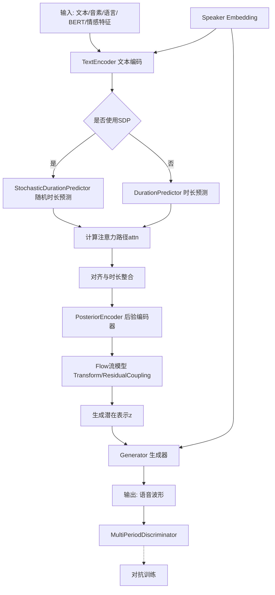
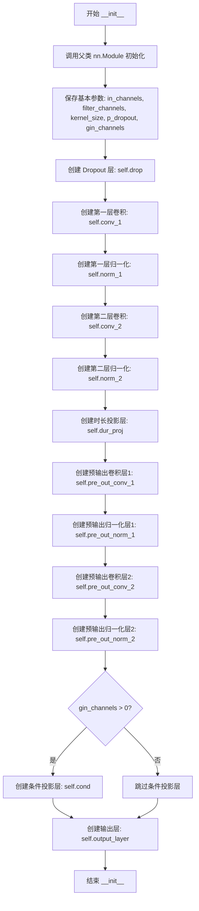
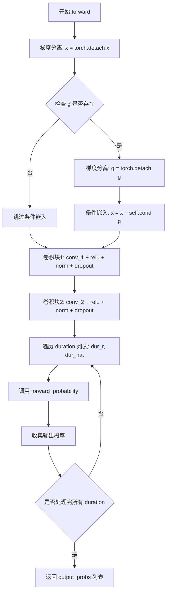
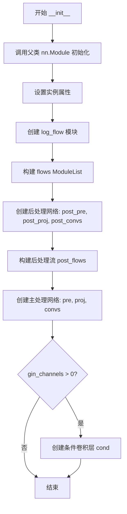
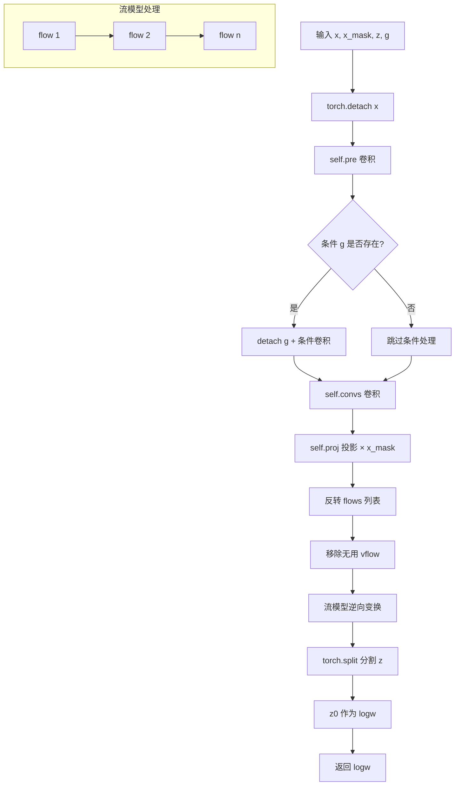
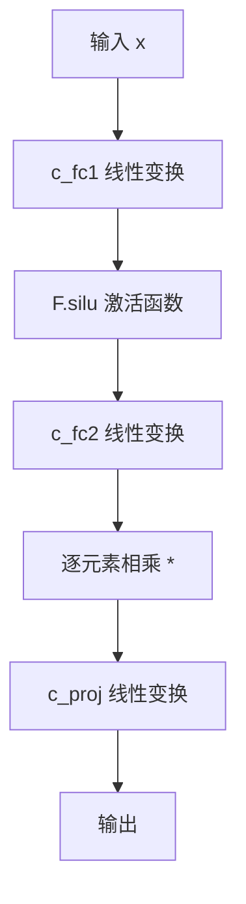
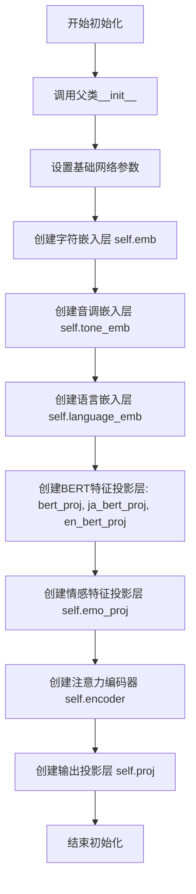
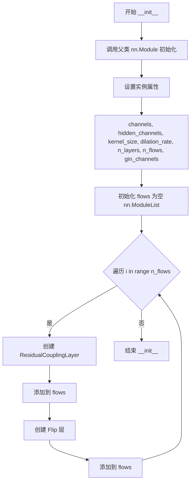

# `Bert-VITS2\onnx_modules\V220_novq_dev\models_onnx.py` 详细设计文档

这是一个VITS（Variational Inference with adversarial learning for end-to-end Text-to-Speech）文本到语音合成系统的核心模型实现，包含了文本编码器、时长预测器、流模型（Flow）、后验编码器、生成器和多周期判别器等组件，支持多说话人、多语言、噪声缩放的单调对齐搜索等高级特性，可实现端到端的高质量语音合成。

## 整体流程



## 类结构

```
nn.Module (PyTorch基类)
├── DurationDiscriminator (VITS2时长判别器)
├── TransformerCouplingBlock (Transformer耦合块)
├── StochasticDurationPredictor (随机时长预测器)
├── DurationPredictor (确定性时长预测器)
├── Bottleneck (瓶颈层)
├── Block (Transformer块)
├── MLP (多层感知机)
├── TextEncoder (文本编码器)
├── ResidualCouplingBlock (残差耦合块)
├── PosteriorEncoder (后验编码器)
├── Generator (声码器生成器)
├── DiscriminatorP (周期判别器)
├── DiscriminatorS (流判别器)
├── MultiPeriodDiscriminator (多周期判别器)
├── ReferenceEncoder (参考编码器)
└── SynthesizerTrn (主合成器模型)
```

## 全局变量及字段


### `symbols`
    
List of text symbols/characters for the vocabulary

类型：`list or tensor`
    


### `num_tones`
    
Number of tone categories for tonal languages

类型：`int`
    


### `num_languages`
    
Number of supported languages in the model

类型：`int`
    


### `DurationDiscriminator.in_channels`
    
Number of input channels for the discriminator

类型：`int`
    


### `DurationDiscriminator.filter_channels`
    
Number of filter channels in convolutional layers

类型：`int`
    


### `DurationDiscriminator.kernel_size`
    
Kernel size for convolutional operations

类型：`int`
    


### `DurationDiscriminator.p_dropout`
    
Dropout probability for regularization

类型：`float`
    


### `DurationDiscriminator.gin_channels`
    
Number of speaker embedding channels for conditioning

类型：`int`
    


### `DurationDiscriminator.drop`
    
Dropout layer for regularization

类型：`nn.Dropout`
    


### `DurationDiscriminator.conv_1`
    
First convolutional layer for feature extraction

类型：`nn.Conv1d`
    


### `DurationDiscriminator.norm_1`
    
Layer normalization after first convolution

类型：`modules.LayerNorm`
    


### `DurationDiscriminator.conv_2`
    
Second convolutional layer for feature extraction

类型：`nn.Conv1d`
    


### `DurationDiscriminator.norm_2`
    
Layer normalization after second convolution

类型：`modules.LayerNorm`
    


### `DurationDiscriminator.dur_proj`
    
Projection layer for duration information

类型：`nn.Conv1d`
    


### `DurationDiscriminator.pre_out_conv_1`
    
Pre-output convolutional layer combining input and duration features

类型：`nn.Conv1d`
    


### `DurationDiscriminator.pre_out_norm_1`
    
Layer normalization after pre-output convolution

类型：`modules.LayerNorm`
    


### `DurationDiscriminator.pre_out_conv_2`
    
Second pre-output convolutional layer

类型：`nn.Conv1d`
    


### `DurationDiscriminator.pre_out_norm_2`
    
Layer normalization after second pre-output convolution

类型：`modules.LayerNorm`
    


### `DurationDiscriminator.cond`
    
Conditional convolution for speaker embedding injection

类型：`nn.Conv1d`
    


### `DurationDiscriminator.output_layer`
    
Output layer producing probability scores

类型：`nn.Sequential`
    


### `TransformerCouplingBlock.channels`
    
Number of channels in the flow

类型：`int`
    


### `TransformerCouplingBlock.hidden_channels`
    
Number of hidden channels for transformer layers

类型：`int`
    


### `TransformerCouplingBlock.kernel_size`
    
Kernel size for convolution operations

类型：`int`
    


### `TransformerCouplingBlock.n_layers`
    
Number of transformer layers

类型：`int`
    


### `TransformerCouplingBlock.n_flows`
    
Number of flow layers in the block

类型：`int`
    


### `TransformerCouplingBlock.gin_channels`
    
Number of speaker embedding channels

类型：`int`
    


### `TransformerCouplingBlock.flows`
    
List of flow layers and flip operations

类型：`nn.ModuleList`
    


### `TransformerCouplingBlock.wn`
    
Shared weight-normalized FFT module for parameter sharing

类型：`attentions_onnx.FFT or None`
    


### `StochasticDurationPredictor.in_channels`
    
Number of input channels

类型：`int`
    


### `StochasticDurationPredictor.filter_channels`
    
Number of filter channels for convolutions

类型：`int`
    


### `StochasticDurationPredictor.kernel_size`
    
Kernel size for convolutional layers

类型：`int`
    


### `StochasticDurationPredictor.p_dropout`
    
Dropout probability

类型：`float`
    


### `StochasticDurationPredictor.n_flows`
    
Number of flow layers in the main flow

类型：`int`
    


### `StochasticDurationPredictor.gin_channels`
    
Number of speaker conditioning channels

类型：`int`
    


### `StochasticDurationPredictor.log_flow`
    
Log flow transformation module

类型：`modules.Log`
    


### `StochasticDurationPredictor.flows`
    
List of flow layers for duration prediction

类型：`nn.ModuleList`
    


### `StochasticDurationPredictor.post_pre`
    
Pre-processing convolution for post-flow network

类型：`nn.Conv1d`
    


### `StochasticDurationPredictor.post_proj`
    
Projection convolution for post-flow network

类型：`nn.Conv1d`
    


### `StochasticDurationPredictor.post_convs`
    
Dilated dilated convolution for post-flow processing

类型：`modules.DDSConv`
    


### `StochasticDurationPredictor.post_flows`
    
List of post-flow transformation layers

类型：`nn.ModuleList`
    


### `StochasticDurationPredictor.pre`
    
Pre-processing convolution for input

类型：`nn.Conv1d`
    


### `StochasticDurationPredictor.proj`
    
Projection convolution for feature transformation

类型：`nn.Conv1d`
    


### `StochasticDurationPredictor.convs`
    
Dilated dilated convolution for main processing

类型：`modules.DDSConv`
    


### `StochasticDurationPredictor.cond`
    
Conditional convolution for speaker embedding

类型：`nn.Conv1d`
    


### `DurationPredictor.in_channels`
    
Number of input channels

类型：`int`
    


### `DurationPredictor.filter_channels`
    
Number of filter channels

类型：`int`
    


### `DurationPredictor.kernel_size`
    
Kernel size for convolutions

类型：`int`
    


### `DurationPredictor.p_dropout`
    
Dropout probability

类型：`float`
    


### `DurationPredictor.gin_channels`
    
Number of speaker conditioning channels

类型：`int`
    


### `DurationPredictor.drop`
    
Dropout layer for regularization

类型：`nn.Dropout`
    


### `DurationPredictor.conv_1`
    
First convolutional layer

类型：`nn.Conv1d`
    


### `DurationPredictor.norm_1`
    
Layer normalization after first conv

类型：`modules.LayerNorm`
    


### `DurationPredictor.conv_2`
    
Second convolutional layer

类型：`nn.Conv1d`
    


### `DurationPredictor.norm_2`
    
Layer normalization after second conv

类型：`modules.LayerNorm`
    


### `DurationPredictor.proj`
    
Projection layer to output dimension

类型：`nn.Conv1d`
    


### `DurationPredictor.cond`
    
Conditional convolution for speaker embedding

类型：`nn.Conv1d`
    


### `Block.norm`
    
Layer normalization for transformer block

类型：`nn.LayerNorm`
    


### `Block.mlp`
    
Multi-layer perceptron for feed-forward processing

类型：`MLP`
    


### `MLP.c_fc1`
    
First linear layer for Gated Linear Unit

类型：`nn.Linear`
    


### `MLP.c_fc2`
    
Second linear layer for Gated Linear Unit

类型：`nn.Linear`
    


### `MLP.c_proj`
    
Projection layer to output dimension

类型：`nn.Linear`
    


### `TextEncoder.n_vocab`
    
Vocabulary size for text embeddings

类型：`int`
    


### `TextEncoder.out_channels`
    
Number of output channels

类型：`int`
    


### `TextEncoder.hidden_channels`
    
Number of hidden channels for embeddings

类型：`int`
    


### `TextEncoder.filter_channels`
    
Number of filter channels in encoder

类型：`int`
    


### `TextEncoder.n_heads`
    
Number of attention heads

类型：`int`
    


### `TextEncoder.n_layers`
    
Number of encoder layers

类型：`int`
    


### `TextEncoder.kernel_size`
    
Kernel size for convolutions

类型：`int`
    


### `TextEncoder.p_dropout`
    
Dropout probability

类型：`float`
    


### `TextEncoder.gin_channels`
    
Number of speaker embedding channels

类型：`int`
    


### `TextEncoder.emb`
    
Text symbol embedding layer

类型：`nn.Embedding`
    


### `TextEncoder.tone_emb`
    
Tone embedding layer for tonal information

类型：`nn.Embedding`
    


### `TextEncoder.language_emb`
    
Language embedding layer

类型：`nn.Embedding`
    


### `TextEncoder.bert_proj`
    
Projection layer for BERT embeddings

类型：`nn.Conv1d`
    


### `TextEncoder.ja_bert_proj`
    
Projection layer for Japanese BERT embeddings

类型：`nn.Conv1d`
    


### `TextEncoder.en_bert_proj`
    
Projection layer for English BERT embeddings

类型：`nn.Conv1d`
    


### `TextEncoder.emo_proj`
    
Projection layer for emotion embeddings

类型：`nn.Linear`
    


### `TextEncoder.n_speakers`
    
Number of speakers in the dataset

类型：`int`
    


### `TextEncoder.encoder`
    
Transformer encoder for text processing

类型：`attentions_onnx.Encoder`
    


### `TextEncoder.proj`
    
Projection layer to output channels

类型：`nn.Conv1d`
    


### `ResidualCouplingBlock.channels`
    
Number of channels for flow

类型：`int`
    


### `ResidualCouplingBlock.hidden_channels`
    
Number of hidden channels

类型：`int`
    


### `ResidualCouplingBlock.kernel_size`
    
Kernel size for convolutions

类型：`int`
    


### `ResidualCouplingBlock.dilation_rate`
    
Dilation rate for convolutions

类型：`int`
    


### `ResidualCouplingBlock.n_layers`
    
Number of layers in coupling

类型：`int`
    


### `ResidualCouplingBlock.n_flows`
    
Number of flow layers

类型：`int`
    


### `ResidualCouplingBlock.gin_channels`
    
Number of speaker conditioning channels

类型：`int`
    


### `ResidualCouplingBlock.flows`
    
List of residual coupling layers and flips

类型：`nn.ModuleList`
    


### `PosteriorEncoder.in_channels`
    
Number of input channels

类型：`int`
    


### `PosteriorEncoder.out_channels`
    
Number of output channels

类型：`int`
    


### `PosteriorEncoder.hidden_channels`
    
Number of hidden channels

类型：`int`
    


### `PosteriorEncoder.kernel_size`
    
Kernel size for WN convolution

类型：`int`
    


### `PosteriorEncoder.dilation_rate`
    
Dilation rate for WN convolution

类型：`int`
    


### `PosteriorEncoder.n_layers`
    
Number of layers in WN

类型：`int`
    


### `PosteriorEncoder.gin_channels`
    
Number of speaker conditioning channels

类型：`int`
    


### `PosteriorEncoder.pre`
    
Pre-processing convolution

类型：`nn.Conv1d`
    


### `PosteriorEncoder.enc`
    
WaveNet-style encoder

类型：`modules.WN`
    


### `PosteriorEncoder.proj`
    
Projection to mean and logstd

类型：`nn.Conv1d`
    


### `Generator.num_kernels`
    
Number of residual block kernels

类型：`int`
    


### `Generator.num_upsamples`
    
Number of upsampling layers

类型：`int`
    


### `Generator.conv_pre`
    
Initial convolution before upsampling

类型：`Conv1d`
    


### `Generator.ups`
    
List of transposed convolutions for upsampling

类型：`nn.ModuleList`
    


### `Generator.resblocks`
    
List of residual blocks for refinement

类型：`nn.ModuleList`
    


### `Generator.conv_post`
    
Final convolution to produce waveform

类型：`Conv1d`
    


### `Generator.cond`
    
Conditional convolution for speaker embedding

类型：`nn.Conv1d`
    


### `DiscriminatorP.period`
    
Period for period discriminator

类型：`int`
    


### `DiscriminatorP.use_spectral_norm`
    
Whether to use spectral normalization

类型：`bool`
    


### `DiscriminatorP.convs`
    
List of 2D convolutional layers

类型：`nn.ModuleList`
    


### `DiscriminatorP.conv_post`
    
Final convolutional layer

类型：`nn.Conv2d`
    


### `DiscriminatorS.convs`
    
List of 1D convolutional layers

类型：`nn.ModuleList`
    


### `DiscriminatorS.conv_post`
    
Final convolutional layer

类型：`nn.Conv1d`
    


### `MultiPeriodDiscriminator.discriminators`
    
List of period and scale discriminators

类型：`nn.ModuleList`
    


### `ReferenceEncoder.spec_channels`
    
Number of spectral channels (mel bands)

类型：`int`
    


### `ReferenceEncoder.convs`
    
List of 2D convolutional layers for spectrogram

类型：`nn.ModuleList`
    


### `ReferenceEncoder.gru`
    
GRU for temporal sequence processing

类型：`nn.GRU`
    


### `ReferenceEncoder.proj`
    
Projection to speaker embedding dimension

类型：`nn.Linear`
    


### `SynthesizerTrn.n_vocab`
    
Vocabulary size for text

类型：`int`
    


### `SynthesizerTrn.spec_channels`
    
Number of spectral channels for audio

类型：`int`
    


### `SynthesizerTrn.inter_channels`
    
Intermediate channel dimension

类型：`int`
    


### `SynthesizerTrn.hidden_channels`
    
Hidden channel dimension

类型：`int`
    


### `SynthesizerTrn.filter_channels`
    
Filter channel dimension for attention

类型：`int`
    


### `SynthesizerTrn.n_heads`
    
Number of attention heads

类型：`int`
    


### `SynthesizerTrn.n_layers`
    
Number of encoder layers

类型：`int`
    


### `SynthesizerTrn.kernel_size`
    
Kernel size for convolutions

类型：`int`
    


### `SynthesizerTrn.p_dropout`
    
Dropout probability

类型：`float`
    


### `SynthesizerTrn.resblock`
    
Residual block type identifier

类型：`str`
    


### `SynthesizerTrn.resblock_kernel_sizes`
    
Kernel sizes for residual blocks

类型：`list`
    


### `SynthesizerTrn.resblock_dilation_sizes`
    
Dilation sizes for residual blocks

类型：`list`
    


### `SynthesizerTrn.upsample_rates`
    
Upsampling rates for each layer

类型：`list`
    


### `SynthesizerTrn.upsample_initial_channel`
    
Initial channel count for upsampling

类型：`int`
    


### `SynthesizerTrn.upsample_kernel_sizes`
    
Kernel sizes for upsampling layers

类型：`list`
    


### `SynthesizerTrn.segment_size`
    
Segment size for training

类型：`int`
    


### `SynthesizerTrn.n_speakers`
    
Number of speakers

类型：`int`
    


### `SynthesizerTrn.gin_channels`
    
Speaker embedding channel dimension

类型：`int`
    


### `SynthesizerTrn.n_layers_trans_flow`
    
Number of transformer flow layers

类型：`int`
    


### `SynthesizerTrn.use_spk_conditioned_encoder`
    
Whether to use speaker-conditioned encoder

类型：`bool`
    


### `SynthesizerTrn.use_sdp`
    
Whether to use stochastic duration predictor

类型：`bool`
    


### `SynthesizerTrn.use_noise_scaled_mas`
    
Whether to use noise-scaled masked attention

类型：`bool`
    


### `SynthesizerTrn.mas_noise_scale_initial`
    
Initial noise scale for masked attention

类型：`float`
    


### `SynthesizerTrn.noise_scale_delta`
    
Noise scale increment per step

类型：`float`
    


### `SynthesizerTrn.current_mas_noise_scale`
    
Current noise scale for masked attention

类型：`float`
    


### `SynthesizerTrn.enc_gin_channels`
    
Encoder speaker conditioning channels

类型：`int`
    


### `SynthesizerTrn.enc_p`
    
Text encoder for phoneme/text input

类型：`TextEncoder`
    


### `SynthesizerTrn.dec`
    
Waveform decoder/generator

类型：`Generator`
    


### `SynthesizerTrn.enc_q`
    
Posterior encoder for mel spectrogram

类型：`PosteriorEncoder`
    


### `SynthesizerTrn.flow`
    
Flow model for latent transformation

类型：`TransformerCouplingBlock or ResidualCouplingBlock`
    


### `SynthesizerTrn.sdp`
    
Stochastic duration predictor

类型：`StochasticDurationPredictor`
    


### `SynthesizerTrn.dp`
    
Deterministic duration predictor

类型：`DurationPredictor`
    


### `SynthesizerTrn.emb_g`
    
Speaker embedding table

类型：`nn.Embedding`
    


### `SynthesizerTrn.ref_enc`
    
Reference encoder for speaker embedding

类型：`ReferenceEncoder`
    
    

## 全局函数及方法


### `DurationDiscriminator.__init__`

这是`DurationDiscriminator`类的构造函数，负责初始化判别器的网络结构和参数。该构造函数建立了一个用于判别语音持续时间（duration）的神经网络模块，包含了多个卷积层、归一化层和条件投影层，用于对输入的文本嵌入、时长信息和说话人嵌入进行处理，最终输出预测概率值。

参数：

- `in_channels`：`int`，输入特征的通道数，即文本嵌入的维度
- `filter_channels`：`int`，卷积层中过滤器的通道数，控制中间层维度
- `kernel_size`：`int`，卷积核的大小，用于捕获局部特征
- `p_dropout`：`float`，Dropout的概率，用于防止过拟合
- `gin_channels`：`int`（默认值为0），说话人嵌入的通道数，当大于0时启用条件投影层

返回值：`None`，构造函数不返回任何值，仅初始化对象属性

#### 流程图



#### 带注释源码

```python
def __init__(
    self, in_channels, filter_channels, kernel_size, p_dropout, gin_channels=0
):
    """
    DurationDiscriminator 构造函数
    
    参数:
        in_channels: int - 输入特征通道数
        filter_channels: int - 卷积过滤器通道数
        kernel_size: int - 卷积核大小
        p_dropout: float - Dropout 概率
        gin_channels: int - 说话人嵌入通道数，默认为0
    """
    # 调用父类 nn.Module 的初始化方法
    super().__init__()

    # 保存基本参数到实例属性
    self.in_channels = in_channels          # 输入通道数
    self.filter_channels = filter_channels    # 过滤器通道数（中间层维度）
    self.kernel_size = kernel_size            # 卷积核大小
    self.p_dropout = p_dropout                # Dropout 概率
    self.gin_channels = gin_channels          # 说话人嵌入通道数

    # 创建 Dropout 层，用于防止过拟合
    self.drop = nn.Dropout(p_dropout)

    # 第一个卷积块：将输入通道映射到 filter_channels
    self.conv_1 = nn.Conv1d(
        in_channels, filter_channels, kernel_size, padding=kernel_size // 2
    )
    # 第一个归一化层
    self.norm_1 = modules.LayerNorm(filter_channels)

    # 第二个卷积块：保持维度不变
    self.conv_2 = nn.Conv1d(
        filter_channels, filter_channels, kernel_size, padding=kernel_size // 2
    )
    # 第二个归一化层
    self.norm_2 = modules.LayerNorm(filter_channels)

    # 时长投影层：将1维时长信息映射到 filter_channels 维度
    self.dur_proj = nn.Conv1d(1, filter_channels, 1)

    # 预输出卷积层1：将 2*filter_channels（拼接后的维度）映射回 filter_channels
    self.pre_out_conv_1 = nn.Conv1d(
        2 * filter_channels, filter_channels, kernel_size, padding=kernel_size // 2
    )
    # 预输出归一化层1
    self.pre_out_norm_1 = modules.LayerNorm(filter_channels)

    # 预输出卷积层2：保持维度不变
    self.pre_out_conv_2 = nn.Conv1d(
        filter_channels, filter_channels, kernel_size, padding=kernel_size // 2
    )
    # 预输出归一化层2
    self.pre_out_norm_2 = modules.LayerNorm(filter_channels)

    # 如果提供了说话人嵌入通道数，创建条件投影层
    # 将说话人嵌入投影到与输入特征相同的维度，以便进行条件注入
    if gin_channels != 0:
        self.cond = nn.Conv1d(gin_channels, in_channels, 1)

    # 输出层：包含一个线性层将 filter_channels 映射到1维，然后通过 Sigmoid 激活
    # 输出一个概率值，用于判别时长预测的准确性
    self.output_layer = nn.Sequential(nn.Linear(filter_channels, 1), nn.Sigmoid())
```


### `DurationDiscriminator.forward_probability`

该方法实现时长判别器的概率预测前向传播，将输入特征与时长信息拼接后通过卷积层和激活函数处理，最终输出预测概率值。

参数：

- `x`：`torch.Tensor`，输入特征张量，形状为 [batch, channels, time]
- `x_mask`：`torch.Tensor`，用于掩码的张量，防止填充区域参与计算
- `dur`：`torch.Tensor`，时长信息，形状为 [batch, 1, time]
- `g`：`torch.Tensor`，可选条件输入（如说话人嵌入），默认为 None

返回值：`torch.Tensor`，输出概率值，形状为 [batch, time, 1]

#### 流程图

```mermaid
flowchart TD
    A[输入: x, x_mask, dur] --> B[dur_proj: dur投影到filter_channels]
    B --> C[拼接: torch.cat[x, dur]]
    C --> D[pre_out_conv_1: 卷积 + ReLU + LayerNorm + Dropout]
    D --> E[pre_out_conv_2: 卷积 + ReLU + LayerNorm + Dropout]
    E --> F[掩码处理: x * x_mask]
    F --> G[维度转换: transpose1, 2]
    G --> H[output_layer: Linear + Sigmoid]
    H --> I[输出: output_prob]
```

#### 带注释源码

```python
def forward_probability(self, x, x_mask, dur, g=None):
    """
    DurationDiscriminator 的概率预测前向传播
    
    参数:
        x: 输入特征 [B, C, T]
        x_mask: 时间掩码 [B, 1, T]
        dur: 时长信息 [B, 1, T]
        g: 可选条件输入 [B, gin_channels, T] 或 None
    
    返回:
        output_prob: 预测概率 [B, T, 1]
    """
    # 将时长信息投影到 filter_channels 维度
    dur = self.dur_proj(dur)  # [B, filter_channels, T]
    
    # 在通道维度拼接输入特征和时长信息
    x = torch.cat([x, dur], dim=1)  # [B, in_channels + filter_channels, T]
    
    # 第一次预输出卷积块
    x = self.pre_out_conv_1(x * x_mask)  # 乘掩码后卷积 [B, filter_channels, T]
    x = torch.relu(x)                      # ReLU 激活
    x = self.pre_out_norm_1(x)             # LayerNorm
    x = self.drop(x)                       # Dropout
    
    # 第二次预输出卷积块
    x = self.pre_out_conv_2(x * x_mask)   # 乘掩码后卷积 [B, filter_channels, T]
    x = torch.relu(x)                      # ReLU 激活
    x = self.pre_out_norm_2(x)             # LayerNorm
    x = self.drop(x)                       # Dropout
    
    # 应用掩码
    x = x * x_mask  # [B, filter_channels, T]
    
    # 维度转换: [B, C, T] -> [B, T, C]
    x = x.transpose(1, 2)
    
    # 输出层: Linear + Sigmoid 得到概率
    output_prob = self.output_layer(x)  # [B, T, 1]
    
    return output_prob
```


### DurationDiscriminator.forward

该方法是VITS2模型中DurationDiscriminator类的核心前向传播函数，用于判别器学习区分真实的音频时长（duration）和预测的音频时长，从而提升时长预测的准确性。

参数：

- `x`：`torch.Tensor`，输入特征张量，维度为 [batch, channels, time]，通常是文本编码器输出的隐层表示
- `x_mask`：`torch.Tensor`，时间维度掩码张量，维度为 [1, 1, time]，用于标识有效时间步
- `dur_r`：`torch.Tensor`，真实持续时间张量，维度为 [batch, 1, time]，来自训练数据的真实时长信息
- `dur_hat`：`torch.Tensor`，预测持续时间张量，维度为 [batch, 1, time]，来自DurationPredictor或StochasticDurationPredictor的预测时长
- `g`：`torch.Tensor`，可选参数，说话人/音色条件嵌入，维度为 [batch, gin_channels, 1]，用于条件判别

返回值：`List[torch.Tensor]`，包含两个概率值的列表，第一个元素为真实时长的判别概率，第二个元素为预测时长的判别概率，每个概率值维度为 [batch, time, 1]

#### 流程图



#### 带注释源码

```python
def forward(self, x, x_mask, dur_r, dur_hat, g=None):
    """
    DurationDiscriminator 的前向传播函数
    
    该方法对输入特征进行两次卷积处理，然后分别对真实时长 dur_r 和预测时长 dur_hat
    进行概率预测，输出两个概率值用于判别器的损失计算
    
    参数:
        x: 输入特征 [batch, channels, time]
        x_mask: 时间掩码 [1, 1, time]
        dur_r: 真实时长 [batch, 1, time]
        dur_hat: 预测时长 [batch, 1, time]
        g: 说话人条件嵌入 [batch, gin_channels, 1]，可选
    
    返回:
        output_probs: 包含两个概率张量的列表
    """
    
    # 步骤1: 分离输入张量的梯度，防止梯度回传到主生成器
    x = torch.detach(x)
    
    # 步骤2: 如果提供了说话人条件嵌入，则进行条件处理
    if g is not None:
        # 同样分离条件嵌入的梯度
        g = torch.detach(g)
        # 将条件信息通过线性变换后加到输入特征上
        x = x + self.cond(g)
    
    # 步骤3: 第一个卷积块处理
    # 卷积: in_channels -> filter_channels
    x = self.conv_1(x * x_mask)  # 使用掩码屏蔽无效时间步
    x = torch.relu(x)             # ReLU激活
    x = self.norm_1(x)            # LayerNorm归一化
    x = self.drop(x)              # Dropout正则化
    
    # 步骤4: 第二个卷积块处理
    # 卷积: filter_channels -> filter_channels
    x = self.conv_2(x * x_mask)
    x = torch.relu(x)
    x = self.norm_2(x)
    x = self.drop(x)
    
    # 步骤5: 分别对真实时长和预测时长进行概率预测
    output_probs = []  # 初始化输出列表
    
    # 遍历两个时长输入: [dur_r, dur_hat]
    for dur in [dur_r, dur_hat]:
        # 调用内部方法计算概率
        # 这里 dur 可以是真实时长或预测时长
        output_prob = self.forward_probability(x, x_mask, dur, g)
        output_probs.append(output_prob)
    
    # 返回包含两个概率的列表
    # output_probs[0]: 真实时长的判别概率
    # output_prob[1]: 预测时长的判别概率
    return output_probs
```


### `TransformerCouplingBlock.__init__`

该方法是 `TransformerCouplingBlock` 类的构造函数，负责初始化基于 Transformer 的耦合块（Coupling Block），用于流模型（Flow-based Model）中实现语音合成的归一化流变换。该块由多个 Transformer 耦合层和翻转层组成，支持参数共享以减少模型参数量。

参数：

- `channels`：`int`，输入输出通道数，决定特征维度
- `hidden_channels`：`int`，隐藏层通道数，用于 Transformer 内部计算
- `filter_channels`：`int`，注意力机制中的过滤通道数
- `n_heads`：`int`，多头注意力机制的头数
- `n_layers`：`int`，Transformer 层的数量
- `kernel_size`：`int`，卷积核大小
- `p_dropout`：`float`，Dropout 概率，用于防止过拟合
- `n_flows`：`int`，流层数量，默认为 4
- `gin_channels`：`int`，说话人嵌入通道数，默认为 0（无说话人条件）
- `share_parameter`：`bool`，是否共享参数，默认为 False

返回值：`None`，构造函数无返回值，仅初始化实例变量

#### 流程图

```mermaid
flowchart TD
    A[开始 __init__] --> B[调用 super().__init__]
    B --> C[保存 channels 到实例]
    C --> D[保存 hidden_channels 到实例]
    D --> E[保存 kernel_size 到实例]
    E --> F[保存 n_layers 到实例]
    F --> G[保存 n_flows 到实例]
    G --> H[保存 gin_channels 到实例]
    H --> I[初始化 self.flows = nn.ModuleList]
    I --> J{share_parameter?}
    J -->|True| K[创建共享的 FFT 模块 self.wn]
    J -->|False| L[self.wn = None]
    K --> M[循环 i 从 0 到 n_flows-1]
    L --> M
    M --> N[创建 TransformerCouplingLayer]
    N --> O[添加到 self.flows]
    O --> P[创建 Flip 层并添加到 self.flows]
    P --> Q{还有更多流层?}
    Q -->|Yes| M
    Q -->|No| R[结束 __init__]
```

#### 带注释源码

```python
def __init__(
    self,
    channels,
    hidden_channels,
    filter_channels,
    n_heads,
    n_layers,
    kernel_size,
    p_dropout,
    n_flows=4,
    gin_channels=0,
    share_parameter=False,
):
    """
    初始化 Transformer 耦合块

    参数:
        channels: 输入输出通道数
        hidden_channels: 隐藏层通道数
        filter_channels: 过滤通道数
        n_heads: 注意力头数
        n_layers: Transformer 层数
        kernel_size: 卷积核大小
        p_dropout: Dropout 概率
        n_flows: 流层数量，默认为 4
        gin_channels: 说话人嵌入通道数，默认为 0
        share_parameter: 是否共享参数，默认为 False
    """
    # 调用父类 nn.Module 的初始化方法
    super().__init__()

    # 保存通道相关参数到实例属性
    self.channels = channels
    self.hidden_channels = hidden_channels
    self.kernel_size = kernel_size
    self.n_layers = n_layers
    self.n_flows = n_flows
    self.gin_channels = gin_channels

    # 初始化流层列表，用于存储多个耦合层和翻转层
    self.flows = nn.ModuleList()

    # 如果启用参数共享，创建一个共享的 FFT (Feed-Transformer) 模块
    # 否则设为 None，每个流层使用独立的 WN (WaveNet) 模块
    self.wn = (
        attentions_onnx.FFT(
            hidden_channels,
            filter_channels,
            n_heads,
            n_layers,
            kernel_size,
            p_dropout,
            isflow=True,
            gin_channels=self.gin_channels,
        )
        if share_parameter
        else None
    )

    # 循环创建 n_flows 个流层
    for i in range(n_flows):
        # 创建 Transformer 耦合层
        self.flows.append(
            modules.TransformerCouplingLayer(
                channels,
                hidden_channels,
                kernel_size,
                n_layers,
                n_heads,
                p_dropout,
                filter_channels,
                mean_only=True,  # 仅预测均值，不预测方差
                wn_sharing_parameter=self.wn,  # 传入共享的 WN 模块
                gin_channels=self.gin_channels,
            )
        )
        # 添加翻转层，用于交替变换
        self.flows.append(modules.Flip())
```


### `TransformerCouplingBlock.forward`

该方法是 VITS2 语音合成模型中 Transformer 耦合块的前向传播函数，负责在 normalizing flow 过程中对潜在表示进行可逆变换，支持前向（正则化）和反向（采样）两种模式。

参数：

- `x`：`torch.Tensor`，输入的潜在表示，形状为 [batch, channels, time]，即待变换的音频特征
- `x_mask`：`torch.Tensor`，时间维度掩码，形状为 [batch, 1, time]，用于标识有效时间步
- `g`：`torch.Tensor` 或 `None`，说话人条件嵌入，形状为 [batch, gin_channels, 1]，可选用于条件化流变换
- `reverse`：`bool`，布尔标志，指定流变换方向；True 为反向（采样/推理），False 为前向（训练）

返回值：`torch.Tensor`，变换后的潜在表示，形状同输入 [batch, channels, time]

#### 流程图

```mermaid
flowchart TD
    A[输入 x, x_mask, g, reverse] --> B{reverse?}
    B -->|False| C[正向前向遍历 flows]
    B -->|True| D[反向遍历 flows]
    
    C --> E[取第一个 flow]
    E --> F[flow(x, x_mask, g=g, reverse=False)]
    F --> G[更新 x]
    G --> H{flows 未遍历完?}
    H -->|Yes| E
    H -->|No| I[返回变换后的 x]
    
    D --> J[reversed(flows) 取第一个 flow]
    J --> K[flow(x, x_mask, g=g, reverse=True)]
    K --> L[更新 x]
    L --> M{flows 未遍历完?}
    M -->|Yes| J
    M -->|No| I
```

#### 带注释源码

```python
def forward(self, x, x_mask, g=None, reverse=True):
    """
    Transformer 耦合块的前向传播函数
    
    参数:
        x: 输入张量 [batch, channels, time]
        x_mask: 时间掩码 [batch, 1, time]
        g: 说话人条件嵌入 [batch, gin_channels, 1]，可选
        reverse: 变换方向，True 为反向采样，False 为前向正则化
    
    返回:
        变换后的张量 [batch, channels, time]
    """
    # 判断是否为反向模式（推理/采样阶段）
    if not reverse:
        # ===== 前向模式（训练阶段）=====
        # 按顺序遍历所有流变换层
        for flow in self.flows:
            # 每个 flow 执行可逆变换，返回变换后的 x 和 logdet（此处忽略 logdet）
            x, _ = flow(x, x_mask, g=g, reverse=reverse)
    else:
        # ===== 反向模式（推理/采样阶段）=====
        # 逆序遍历流变换层（实现可逆变换的逆操作）
        for flow in reversed(self.flows):
            x = flow(x, x_mask, g=g, reverse=reverse)
    
    # 返回变换后的潜在表示
    return x
```


### StochasticDurationPredictor.__init__

这是 VITS2（Variational Inference with adversarial learning for end-to-end Text-to-Speech）文本转语音模型中的随机持续时间预测器初始化方法，负责构建基于归一化流（Normalizing Flow）的音素持续时间预测网络。

参数：

- `self`：`Self`，隐式参数，指向类实例本身
- `in_channels`：`int`，输入特征通道数，通常对应隐藏层维度
- `filter_channels`：`int`，过滤器通道数，用于卷积层和流模型
- `kernel_size`：`int`，卷积核大小，用于 DDSConv 和 ConvFlow
- `p_dropout`：`float`，Dropout 概率，用于防止过拟合
- `n_flows`：`int`，流模型的数量，默认为 4，控制流变换的复杂度
- `gin_channels`：`int`，说话人嵌入通道数，默认为 0，表示无条件生成

返回值：`None`，该方法为初始化方法，不返回任何值，仅初始化对象属性

#### 流程图



#### 带注释源码

```python
def __init__(
    self,
    in_channels,       # int: 输入特征通道数（如隐藏层维度）
    filter_channels,   # int: 过滤器通道数，控制网络宽度
    kernel_size,        # int: 卷积核大小（如 3）
    p_dropout,          # float: Dropout 概率（如 0.5）
    n_flows=4,          # int: 流模型数量，默认4个
    gin_channels=0,     # int: 说话人嵌入通道数，0表示无说话人条件
):
    # 调用父类 nn.Module 的初始化方法
    super().__init__()
    
    # 注意：这里将 filter_channels 强制设为与 in_channels 相同
    # 代码注释表明这将在未来版本中移除
    filter_channels = in_channels
    
    # ============ 存储实例属性 ============
    self.in_channels = in_channels           # 输入通道数
    self.filter_channels = filter_channels    # 过滤器通道数
    self.kernel_size = kernel_size            # 卷积核大小
    self.p_dropout = p_dropout                # Dropout 概率
    self.n_flows = n_flows                     # 流模型数量
    self.gin_channels = gin_channels           # 说话人条件通道数
    
    # ============ 主流模型（用于持续时间预测）========
    # Log 流模块，用于数值稳定性
    self.log_flow = modules.Log()
    
    # 主流 ModuleList，包含 ElementwiseAffine、ConvFlow 和 Flip 模块
    self.flows = nn.ModuleList()
    
    # 初始的 ElementwiseAffine 变换（2维，用于双变量流）
    self.flows.append(modules.ElementwiseAffine(2))
    
    # 添加 n_flows 个 ConvFlow 和 Flip 模块交替
    for i in range(n_flows):
        # ConvFlow: 基于卷积的流变换层
        self.flows.append(
            modules.ConvFlow(2, filter_channels, kernel_size, n_layers=3)
        )
        # Flip: 维度交换模块，用于增加模型容量
        self.flows.append(modules.Flip())
    
    # ============ 后处理网络（用于最终预测）========
    # 将单通道输入投影到 filter_channels 维度
    self.post_pre = nn.Conv1d(1, filter_channels, 1)
    # 进一步投影
    self.post_proj = nn.Conv1d(filter_channels, filter_channels, 1)
    # DDSConv: Dilated Depth-Separable Convolution
    # 用于捕获多尺度上下文信息
    self.post_convs = modules.DDSConv(
        filter_channels, kernel_size, n_layers=3, p_dropout=p_dropout
    )
    
    # 后处理流模型（类似主流但用于后处理）
    self.post_flows = nn.ModuleList()
    self.post_flows.append(modules.ElementwiseAffine(2))
    
    # 添加4个后处理流
    for i in range(4):
        self.post_flows.append(
            modules.ConvFlow(2, filter_channels, kernel_size, n_layers=3)
        )
        self.post_flows.append(modules.Flip())
    
    # ============ 主处理网络（编码器侧）========
    # 输入投影：将 in_channels 投影到 filter_channels
    self.pre = nn.Conv1d(in_channels, filter_channels, 1)
    # 输出投影
    self.proj = nn.Conv1d(filter_channels, filter_channels, 1)
    # 主 DDSConv 模块
    self.convs = modules.DDSConv(
        filter_channels, kernel_size, n_layers=3, p_dropout=p_dropout
    )
    
    # ============ 条件卷积层（说话人条件）========
    # 如果提供了说话人嵌入通道，创建条件卷积层
    if gin_channels != 0:
        # 将说话人嵌入投影到与主特征相同的维度
        self.cond = nn.Conv1d(gin_channels, filter_channels, 1)
```


### `StochasticDurationPredictor.forward`

该方法实现了随机时长预测器的前向传播，通过流模型（Flow-based Model）预测语音序列的对数时长。在前向传播中，输入特征经过卷积层和条件流模块处理，潜在变量z通过逆向流变换得到预测的对数时长logw。

参数：

- `x`：`torch.Tensor`，输入特征张量，形状为 [batch, in_channels, time_steps]，来自文本编码器的输出
- `x_mask`：`torch.Tensor`，时间步掩码张量，形状为 [batch, 1, time_steps]，用于标识有效时间步
- `z`：`torch.Tensor`，潜在变量张量，形状为 [batch, 2, time_steps]，用于流模型的输入噪声
- `g`：`Optional[torch.Tensor]`，说话人嵌入条件张量，形状为 [batch, gin_channels, 1]，可选输入用于条件生成

返回值：`torch.Tensor`，对数时长预测值，形状为 [batch, 1, time_steps]，用于后续时长预测和注意力掩码生成

#### 流程图



#### 带注释源码

```python
def forward(self, x, x_mask, z, g=None):
    """
    StochasticDurationPredictor 的前向传播方法
    
    参数:
        x: 输入特征张量 [batch, in_channels, time]
        x_mask: 时间步掩码 [batch, 1, time]
        z: 潜在变量用于流模型 [batch, 2, time]
        g: 可选的说话人条件 [batch, gin_channels, 1]
    
    返回:
        logw: 对数时长预测 [batch, 1, time]
    """
    # 分离输入梯度，防止梯度回传破坏预训练编码器
    x = torch.detach(x)
    
    # 初始卷积投影到滤波通道维度
    x = self.pre(x)
    
    # 如果提供了说话人条件，则添加条件信息
    if g is not None:
        g = torch.detach(g)  # 同样分离条件梯度
        x = x + self.cond(g)  # 条件卷积后相加
    
    # 通过 DDSConv 卷积块处理特征
    x = self.convs(x, x_mask)
    
    # 投影并应用掩码
    x = self.proj(x) * x_mask

    # 获取流模块列表（反转顺序用于逆向流动）
    flows = list(reversed(self.flows))
    # 移除无用的流（倒数第二个）
    flows = flows[:-2] + [flows[-1]]
    
    # 依次通过每个流模块进行逆向变换
    # 这里 x 作为流模型的全局条件传入
    for flow in flows:
        z = flow(z, x_mask, g=x, reverse=True)
    
    # 分割变换后的潜在变量，取第一部分作为对数时长
    z0, z1 = torch.split(z, [1, 1], 1)
    logw = z0
    
    return logw
```


### `DurationPredictor.__init__`

该方法是 `DurationPredictor` 类的构造函数，用于初始化持续时间预测器的网络结构和参数。该模块是一个用于预测音素时长的神经网络组件，采用双层卷积结构，并支持说话人条件的注入。

参数：

- `self`：隐式参数，表示类的实例本身
- `in_channels`：`int`，输入特征的通道数
- `filter_channels`：`int`，卷积层滤波器的通道数
- `kernel_size`：`int`，卷积核的大小
- `p_dropout`：`float`，Dropout 机制的丢弃概率
- `gin_channels`：`int`，说话人条件的输入通道数，默认为0（表示不使用说话人条件）

返回值：无（`__init__` 方法不返回任何值）

#### 流程图

```mermaid
flowchart TD
    A[开始 __init__] --> B[调用 super().__init__ 初始化基类]
    B --> C[保存基本参数: in_channels, filter_channels, kernel_size, p_dropout, gin_channels]
    C --> D[创建 Dropout 层: self.drop = nn.Dropoutp_dropout]
    D --> E[创建第一个卷积层: self.conv_1]
    E --> F[创建第一个 LayerNorm: self.norm_1]
    F --> G[创建第二个卷积层: self.conv_2]
    G --> H[创建第二个 LayerNorm: self.norm_2]
    H --> I[创建输出投影层: self.proj]
    I --> J{gin_channels > 0?}
    J -->|是| K[创建条件卷积层: self.cond]
    J -->|否| L[跳过条件卷积层创建]
    K --> M[结束 __init__]
    L --> M
```

#### 带注释源码

```python
def __init__(
    self, in_channels, filter_channels, kernel_size, p_dropout, gin_channels=0
):
    """
    初始化 DurationPredictor 模型
    
    参数:
        in_channels: 输入特征的通道数
        filter_channels: 卷积层滤波器的通道数
        kernel_size: 卷积核大小
        p_dropout: Dropout 概率
        gin_channels: 说话人条件的通道数，默认为0表示不使用条件
    """
    # 调用父类 nn.Module 的初始化方法
    super().__init__()

    # 保存模型配置参数
    self.in_channels = in_channels  # 输入通道数
    self.filter_channels = filter_channels  # 滤波器通道数
    self.kernel_size = kernel_size  # 卷积核大小
    self.p_dropout = p_dropout  # Dropout 概率
    self.gin_channels = gin_channels  # 说话人条件通道数

    # Dropout 层，用于正则化
    self.drop = nn.Dropout(p_dropout)
    
    # 第一个卷积层：从输入通道映射到滤波器通道
    # padding 设置为 kernel_size // 2，保持序列长度不变
    self.conv_1 = nn.Conv1d(
        in_channels, filter_channels, kernel_size, padding=kernel_size // 2
    )
    # 第一个 LayerNorm 层，用于归一化
    self.norm_1 = modules.LayerNorm(filter_channels)
    
    # 第二个卷积层：保持通道数不变
    self.conv_2 = nn.Conv1d(
        filter_channels, filter_channels, kernel_size, padding=kernel_size // 2
    )
    # 第二个 LayerNorm 层
    self.norm_2 = modules.LayerNorm(filter_channels)
    
    # 输出投影层：将滤波器通道映射到1，用于预测持续时间
    self.proj = nn.Conv1d(filter_channels, 1, 1)

    # 如果提供了说话人条件通道，创建条件卷积层
    # 将说话人嵌入映射到与输入相同的通道数，以便添加到主特征中
    if gin_channels != 0:
        self.cond = nn.Conv1d(gin_channels, in_channels, 1)
```


### `DurationPredictor.forward`

该方法实现了一个用于预测语音合成中字符时长的神经网络前向传播过程，通过两层卷积网络对输入特征进行非线性变换，并在有条件信息时将其融入，最终输出每个字符的持续时间预测值。

参数：

- `x`：`torch.Tensor`，输入特征张量，形状为 [batch, in_channels, time]，通常来自文本编码器输出的隐藏状态
- `x_mask`：`torch.Tensor`，时间步掩码张量，形状为 [batch, 1, time]，用于标识有效时间步，防止填充位置干扰计算
- `g`：`torch.Tensor` 或 `None`，可选的说话人条件向量，形状为 [batch, gin_channels, 1]，用于条件化时长预测

返回值：`torch.Tensor`，预测的持续时间对数，形状为 [batch, 1, time]，需要经过 exp 变换才能得到实际的持续时间值

#### 流程图

```mermaid
graph TD
    A[输入: x, x_mask, g] --> B{检查g是否为空}
    B -->|是| C[跳过条件融合]
    B -->|否| D[detach g并应用条件投影]
    D --> E[x = x + cond(g)]
    C --> F[第一次卷积: conv_1]
    F --> G[ReLU激活]
    G --> H[LayerNorm归一化]
    H --> I[Dropout正则化]
    I --> J[第二次卷积: conv_2]
    J --> K[ReLU激活]
    K --> L[LayerNorm归一化]
    L --> M[Dropout正则化]
    M --> N[投影到1维: proj]
    N --> O[输出: x * x_mask]
```

#### 带注释源码

```python
def forward(self, x, x_mask, g=None):
    # 分离输入梯度，防止梯度反向传播到文本编码器
    x = torch.detach(x)
    
    # 如果提供了说话人条件向量，则进行条件融合
    if g is not None:
        # 分离条件向量梯度
        g = torch.detach(g)
        # 通过条件投影层并将条件信息添加到输入特征
        x = x + self.cond(g)
    
    # 第一次卷积：通道数从in_channels变换到filter_channels
    x = self.conv_1(x * x_mask)
    # ReLU非线性激活
    x = torch.relu(x)
    # 层归一化
    x = self.norm_1(x)
    # Dropout正则化，防止过拟合
    x = self.drop(x)
    
    # 第二次卷积：通道数保持为filter_channels
    x = self.conv_2(x * x_mask)
    # ReLU非线性激活
    x = torch.relu(x)
    # 层归一化
    x = self.norm_2(x)
    # Dropout正则化
    x = self.drop(x)
    
    # 投影到1维输出，表示持续时间的对数值
    x = self.proj(x * x_mask)
    
    # 应用时间步掩码，确保只保留有效时间步的预测
    return x * x_mask
```


### `Bottleneck.__init__`

该方法用于初始化一个瓶颈（Bottleneck）层，它是一个由两个线性变换层组成的序列模块，通常用于神经网络中的特征维度压缩与恢复。继承自 `nn.Sequential`，将两个线性层顺序组合。

参数：

- `in_dim`：`int`，输入特征的维度
- `hidden_dim`：`int`，隐藏层的维度，即线性变换的目标维度

返回值：`None`，该方法为构造函数，不返回任何值，仅初始化对象属性

#### 流程图

```mermaid
graph TD
    A([开始 __init__]) --> B[创建第一个线性层 c_fc1<br/>nn.Linear(in_dim, hidden_dim, bias=False)]
    B --> C[创建第二个线性层 c_fc2<br/>nn.Linear(in_dim, hidden_dim, bias=False)]
    C --> D[调用父类初始化方法<br/>super().__init__(*[c_fc1, c_fc2])]
    D --> E([结束])
    
    B -.->|存储为实例属性| B1[c_fc1]
    C -.->|存储为实例属性| C1[c_fc2]
    B1 --> D
    C1 --> D
```

#### 带注释源码

```python
def __init__(self, in_dim, hidden_dim):
    # 创建第一个全连接层（线性变换）：
    #   - 输入维度为 in_dim
    #   - 输出维度为 hidden_dim
    #   - 不使用偏置（bias=False），通常在某些架构中可以减少参数量
    c_fc1 = nn.Linear(in_dim, hidden_dim, bias=False)
    
    # 创建第二个全连接层，结构与 c_fc1 相同：
    #   - 输入维度为 in_dim
    #   - 输出维度为 hidden_dim
    #   - 不使用偏置
    # 注意：这里两个层都接受相同的输入维度，这在某些实现中可能是为了
    # 实现类似 Gated Linear Unit (GLU) 或类似的门控机制做准备
    c_fc2 = nn.Linear(in_dim, hidden_dim, bias=False)
    
    # 调用父类 nn.Sequential 的初始化方法：
    #   - 将 c_fc1 和 c_fc2 作为子模块添加到序列中
    #   - 序列模块会按顺序执行前向传播：先经过 c_fc1，再经过 c_fc2
    #   - super().__init__ 会自动注册这两个线性层为子模块
    super().__init__(*[c_fc1, c_fc2])
```


### `Block.__init__`

这是 `Block` 类的构造函数，用于初始化一个带有 LayerNorm 和 MLP 的Transformer模块。

参数：

- `in_dim`：`int`，输入特征的维度
- `hidden_dim`：`int`，MLP隐藏层的维度

返回值：`None`，构造函数没有返回值

#### 流程图

```mermaid
flowchart TD
    A[开始 __init__] --> B[调用父类 nn.Module 的构造函数]
    --> C[创建 LayerNorm 层: self.norm = nn.LayerNorm(in_dim)]
    --> D[创建 MLP 层: self.mlp = MLP(in_dim, hidden_dim)]
    --> E[结束]
```

#### 带注释源码

```python
class Block(nn.Module):
    def __init__(self, in_dim, hidden_dim) -> None:
        """
        Block 类的初始化方法
        
        参数:
            in_dim: 输入特征的维度
            hidden_dim: MLP隐藏层的维度
        """
        # 调用父类 nn.Module 的构造函数，完成PyTorch模块的初始化
        super().__init__()
        
        # 创建一个 LayerNorm 层，用于归一化输入特征
        # LayerNorm 会在特征维度上进行归一化，有助于稳定训练
        self.norm = nn.LayerNorm(in_dim)
        
        # 创建一个 MLP（多层感知机）模块
        # 该 MLP 包含两个线性层，用于对输入进行非线性变换
        self.mlp = MLP(in_dim, hidden_dim)
```


### `Block.forward`

该方法实现了 Transformer 风格的前馈块（Feedforward Block），采用残差连接（Residual Connection）和 SwiGLU MLP（门控线性单元），用于在模型中提供非线性变换和特征提取能力。

参数：

- `x`：`torch.Tensor`，输入张量，形状为 (batch_size, seq_len, in_dim)

返回值：`torch.Tensor`，输出张量，形状与输入相同 (batch_size, seq_len, in_dim)，经过残差连接后的结果

#### 流程图

```mermaid
graph TD
    A[Input x: torch.Tensor] --> B[LayerNorm: self.norm]
    B --> C[MLP Forward: self.mlp]
    C --> D[Residual Connection: x + mlp_output]
    D --> E[Output: torch.Tensor]
    
    subgraph MLP Details
    F[Input to MLP] --> G[c_fc1: Linear(in_dim, hidden_dim)]
    F --> H[c_fc2: Linear(in_dim, hidden_dim)]
    G --> I[F.silu activation]
    H --> J[Element-wise multiply: silu(c_fc1) * c_fc2]
    I --> J
    J --> K[c_proj: Linear(hidden_dim, in_dim)]
    K --> L[MLP Output]
    end
    
    C -.-> F
```

#### 带注释源码

```python
def forward(self, x: torch.Tensor) -> torch.Tensor:
    """
    Block forward pass with residual connection and SwiGLU MLP.
    
    Args:
        x: Input tensor of shape (batch_size, seq_len, in_dim)
    
    Returns:
        Output tensor of shape (batch_size, seq_len, in_dim)
    """
    # Step 1: Apply Layer Normalization to stabilize training
    # LayerNorm normalizes features across the dimension
    x = self.norm(x)
    
    # Step 2: Pass through MLP (SwiGLU architecture)
    # MLP contains: c_fc1 (input projection), c_fc2 (gate projection), c_proj (output projection)
    x = self.mlp(x)
    
    # Step 3: Residual connection - add input to MLP output
    # This helps with gradient flow and allows the network to learn identity mapping
    # Note: The actual residual addition happens in the calling code: x = x + self.mlp(self.norm(x))
    return x
```

---

### 补充类信息

#### `Block` 类

**类字段：**

- `norm`：`nn.LayerNorm`，层归一化模块，用于稳定训练过程
- `mlp`：`MLP`，多层感知机模块，实现 SwiGLU 门控机制

**类方法：**

- `__init__(self, in_dim, hidden_dim)`：构造函数，初始化 LayerNorm 和 MLP
- `forward(self, x: torch.Tensor) -> torch.Tensor`：前向传播方法

#### `MLP` 类（被 Block 引用）

**类字段：**

- `c_fc1`：`nn.Linear`，输入到隐藏层的第一个线性投影（无偏置）
- `c_fc2`：`nn.Linear`，输入到隐藏层的第二个线性投影（无偏置），用于门控
- `c_proj`：`nn.Linear`，隐藏层到输出层的线性投影（无偏置）

**类方法：**

- `forward(self, x: torch.Tensor)`：实现 SwiGLU 门控机制

---

### 关键组件信息

| 组件名称 | 一句话描述 |
|---------|-----------|
| LayerNorm | 归一化层，用于稳定深度神经网络的训练 |
| SwiGLU MLP | 门控线性单元实现的高效前馈网络，结合了 Swish 激活函数和门控机制 |
| 残差连接 | 将输入与输出相加，缓解梯度消失问题 |

---

### 潜在技术债务或优化空间

1. **硬编码的激活函数**：当前使用 `F.silu`，可以考虑将其作为可配置参数
2. **无偏置线性层**：代码中所有 Linear 层都设置了 `bias=False`，虽然这是一种常见的优化手段（与 LayerNorm 结合使用），但应在文档中明确说明这一设计决策
3. **缺少 Dropout**：在 MLP 内部未使用 Dropout，可能导致过拟合风险

---

### 其它项目

**设计目标：**

- 实现高效的前馈网络块，支持残差连接
- 使用 SwiGLU 机制提升模型表达能力

**错误处理：**

- 当前实现未包含显式的错误处理，依赖 PyTorch 的自动类型检查

**外部依赖：**

- `torch`：PyTorch 核心库
- `torch.nn`：神经网络模块
- `torch.nn.functional`：功能性神经网络操作


### `MLP.__init__`

MLP（多层感知机）类的初始化方法，用于构建一个包含两个线性变换层和一个输出投影层的Gated MLP模块，其中使用了Swish门控激活机制。

参数：

- `self`：隐式参数，类的实例本身
- `in_dim`：`int`，输入特征的维度
- `hidden_dim`：`int`，隐藏层的维度

返回值：`None`，该方法为构造函数，不返回任何值

#### 流程图

```mermaid
flowchart TD
    A[开始 __init__] --> B[调用父类 nn.Module 的初始化]
    --> C[创建第一个全连接层 c_fc1: Linear(in_dim, hidden_dim, bias=False)]
    --> D[创建第二个全连接层 c_fc2: Linear(in_dim, hidden_dim, bias=False)]
    --> E[创建输出投影层 c_proj: Linear(hidden_dim, in_dim, bias=False)]
    --> F[结束 __init__]
```

#### 带注释源码

```python
def __init__(self, in_dim, hidden_dim):
    """
    初始化MLP模块
    
    参数:
        in_dim: 输入特征的维度
        hidden_dim: 隐藏层的维度
    """
    # 调用父类nn.Module的初始化方法
    super().__init__()
    
    # 第一个全连接层：输入到隐藏空间，无偏置
    # 用于Gated MLP中的gate路径
    self.c_fc1 = nn.Linear(in_dim, hidden_dim, bias=False)
    
    # 第二个全连接层：输入到隐藏空间，无偏置
    # 用于Gated MLP中的value路径
    self.c_fc2 = nn.Linear(in_dim, hidden_dim, bias=False)
    
    # 输出投影层：从隐藏空间映射回输入空间，无偏置
    # 用于将处理后的特征投影回原始维度
    self.c_proj = nn.Linear(hidden_dim, in_dim, bias=False)
```


### `MLP.forward`

该方法是 VITS（Variational Inference with adversarial learning for end-to-end Text-to-Speech）模型中的一个多层感知机（MLP）模块，采用了类似 Transformer 的前馈网络（FFN）结构，使用 Swish 激活函数和残差连接，实现非线性特征变换。

参数：

- `x`：`torch.Tensor`，输入张量，形状为 `[batch_size, seq_len, in_dim]`

返回值：`torch.Tensor`，输出张量，形状与输入相同，经过线性变换和激活后的特征表示

#### 流程图



#### 带注释源码

```python
def forward(self, x: torch.Tensor):
    """
    MLP 前馈网络的前向传播
    
    实现逻辑：
    1. 对输入 x 分别经过两个线性层 c_fc1 和 c_fc2
    2. 对 c_fc1 的输出应用 SiLU (Swish) 激活函数
    3. 将激活后的结果与 c_fc2 的输出逐元素相乘
    4. 最后经过输出投影层 c_proj 得到最终输出
    
    这种设计类似于 Transformer 中的 FFN，采用门控机制(Gated Mechanism)，
    类似于 GLU (Gated Linear Units) 的变体
    """
    # 第一个线性变换 + SiLU 激活
    # F.silu(x) = x * sigmoid(x)，是一种自门控激活函数
    x = F.silu(self.c_fc1(x)) * self.c_fc2(x)
    
    # 输出投影，不使用激活函数（通常在 FFN 的最后一步不加激活）
    x = self.c_proj(x)
    
    return x
```

---

### 类结构信息

#### `MLP` 类

该类继承自 `nn.Module`，是 VITS 模型中用于特征变换的多层感知机，实现了类似 Transformer 的前馈网络结构。

**类字段：**

- `c_fc1`：`nn.Linear`，输入到隐藏维度的线性变换（无偏置）
- `c_fc2`：`nn.Linear`，输入到隐藏维度的线性变换（无偏置），作为门控分支
- `c_proj`：`nn.Linear`，隐藏维度到输出维度的线性变换（无偏置）

**类方法：**

- `forward(x: torch.Tensor) -> torch.Tensor`：执行前馈计算


### `TextEncoder.__init__`

该方法是 `TextEncoder` 类的初始化方法，负责构建文本编码器的网络结构，包括词嵌入、音调嵌入、语言嵌入、BERT特征投影、情感特征投影以及基于注意力机制的编码器层。

参数：

- `self`：`TextEncoder` 实例本身
- `n_vocab`：`int`，词汇表大小，决定字符嵌入的维度
- `out_channels`：`int`，输出通道数，用于生成均值和方差
- `hidden_channels`：`int`，隐藏层通道数，用于嵌入和编码器的维度
- `filter_channels`：`int`，过滤器通道数，用于注意力机制中的前馈网络
- `n_heads`：`int`，注意力头数，用于多头注意力机制
- `n_layers`：`int`，编码器层数，堆叠的注意力层数
- `kernel_size`：`int`，卷积核大小，用于注意力机制中的卷积层
- `p_dropout`：`float`，dropout概率，用于防止过拟合
- `n_speakers`：`int`，说话者数量，用于情感嵌入的容量
- `gin_channels`：`int`（可选，默认为0），说话者嵌入的通道数，用于条件输入

返回值：`None`，该方法为初始化方法，不返回任何值

#### 流程图



#### 带注释源码

```python
def __init__(
    self,
    n_vocab,
    out_channels,
    hidden_channels,
    filter_channels,
    n_heads,
    n_layers,
    kernel_size,
    p_dropout,
    n_speakers,
    gin_channels=0,
):
    # 调用父类nn.Module的初始化方法
    super().__init__()
    
    # 保存网络结构的基础参数
    self.n_vocab = n_vocab
    self.out_channels = out_channels
    self.hidden_channels = hidden_channels
    self.filter_channels = filter_channels
    self.n_heads = n_heads
    self.n_layers = n_layers
    self.kernel_size = kernel_size
    self.p_dropout = p_dropout
    self.gin_channels = gin_channels
    
    # 创建字符嵌入层：从词汇表映射到隐藏维度
    self.emb = nn.Embedding(len(symbols), hidden_channels)
    # 使用正态分布初始化嵌入权重，均值为0，标准差为hidden_channels的-0.5次方
    nn.init.normal_(self.emb.weight, 0.0, hidden_channels**-0.5)
    
    # 创建音调嵌入层：用于表示音调信息（如声调语言中的声调）
    self.tone_emb = nn.Embedding(num_tones, hidden_channels)
    nn.init.normal_(self.tone_emb.weight, 0.0, hidden_channels**-0.5)
    
    # 创建语言嵌入层：用于表示不同语言的信息
    self.language_emb = nn.Embedding(num_languages, hidden_channels)
    nn.init.normal_(self.language_emb.weight, 0.0, hidden_channels**-0.5)
    
    # 创建BERT特征投影层：将BERT输出的1024维映射到隐藏维度
    # 主语言BERT特征投影
    self.bert_proj = nn.Conv1d(1024, hidden_channels, 1)
    # 日语BERT特征投影
    self.ja_bert_proj = nn.Conv1d(1024, hidden_channels, 1)
    # 英语BERT特征投影
    self.en_bert_proj = nn.Conv1d(1024, hidden_channels, 1)
    
    # 注释掉的情感相关代码，预留给未来的情感量化器使用
    # self.emo_proj = nn.Linear(1024, 1024)
    # self.emo_quantizer = nn.ModuleList()
    # for i in range(0, n_speakers):
    #    self.emo_quantizer.append(
    #        VectorQuantize(
    #            dim=1024,
    #            codebook_size=10,
    #            decay=0.8,
    #            commitment_weight=1.0,
    #            learnable_codebook=True,
    #            ema_update=False,
    #        )
    #    )
    # self.emo_q_proj = nn.Linear(1024, hidden_channels)
    
    # 保存说话者数量
    self.n_speakers = n_speakers
    # 创建情感特征投影层：从512维投影到隐藏维度
    self.emo_proj = nn.Linear(512, hidden_channels)
    
    # 创建注意力编码器：使用自定义的Encoder模块
    self.encoder = attentions_onnx.Encoder(
        hidden_channels,
        filter_channels,
        n_heads,
        n_layers,
        kernel_size,
        p_dropout,
        gin_channels=self.gin_channels,
    )
    
    # 创建输出投影层：将隐藏维度映射到输出通道数的两倍（均值和方差）
    self.proj = nn.Conv1d(hidden_channels, out_channels * 2, 1)
```


### `TextEncoder.forward`

该方法是VITS2语音合成模型中文本编码器的核心前向传播函数，负责将文本序列（字符、音调、语言）、多语言BERT特征和情感向量编码为隐层表示，并输出用于后续duration predictor和flow模块的统计参数（均值和日志方差）。

参数：

- `self`：`TextEncoder` 实例本身
- `x`：`torch.LongTensor`，输入的文本字符索引序列，形状为 `[batch, time]`
- `x_lengths`：`torch.LongTensor`，输入序列的实际长度（可选，当前实现中未直接使用）
- `tone`：`torch.LongTensor`，音调（tone）索引序列，与 `x` 形状相同
- `language`：`torch.LongTensor`，语言（language）索引序列，与 `x` 形状相同
- `bert`：`torch.Tensor`，英语BERT embeddings，形状为 `[time, 1024]`
- `ja_bert`：`torch.Tensor`，日语BERT embeddings，形状为 `[time, 1024]`
- `en_bert`：`torch.Tensor`，另一个英语BERT embeddings（可能是额外特征），形状为 `[time, 1024]`
- `emo`：`torch.Tensor`，情感特征向量，形状为 `[512, 1]`
- `g`：`torch.Tensor`，说话人嵌入向量（可选），形状为 `[batch, gin_channels, 1]`

返回值：`tuple`，包含以下四个元素：
- `x`：`torch.Tensor`，encoder输出特征，形状为 `[batch, hidden_channels, time]`
- `m`：`torch.Tensor`，均值（mean）统计量，形状为 `[batch, out_channels, time]`
- `logs`：`torch.Tensor`，对数方差（log-scale variance）统计量，形状为 `[batch, out_channels, time]`
- `x_mask`：`torch.Tensor`，序列掩码，形状为 `[1, batch, time]`

#### 流程图

```mermaid
flowchart TD
    A[Input: x, tone, language, bert, ja_bert, en_bert, emo, g] --> B[Create x_mask: torch.ones_like(x).unsqueeze(0)]
    B --> C[Project BERT features: bert_proj, ja_bert_proj, en_bert_proj]
    C --> D[Transpose and unsqueeze BERT embeddings to [1, batch, hidden, time]]
    D --> E[Embedding lookup: emb, tone_emb, language_emb]
    E --> F[Sum all embeddings + emo_proj(emo)]
    F --> G[Scale by sqrt(hidden_channels)]
    G --> H[Transpose: [batch, time, hidden] -> [batch, hidden, time]]
    H --> I[Convert x_mask to x.dtype]
    I --> J[Apply encoder: encoder(x * x_mask, x_mask, g)]
    J --> K[Project to out_channels * 2: proj(x) * x_mask]
    K --> L[Split stats into m and logs]
    L --> M[Output: x, m, logs, x_mask]
```

#### 带注释源码

```python
def forward(
    self, x, x_lengths, tone, language, bert, ja_bert, en_bert, emo, g=None
):
    """
    TextEncoder的前向传播方法，将文本特征编码为隐层表示
    
    参数:
        x: 输入文本的字符索引，形状 [batch, time]
        x_lengths: 序列长度（当前未使用）
        tone: 音调索引
        language: 语言索引
        bert: 英语BERT特征 [time, 1024]
        ja_bert: 日语BERT特征 [time, 1024]
        en_bert: 英文额外BERT特征 [time, 1024]
        emo: 情感向量 [512, 1]
        g: 说话人嵌入（可选）
    
    返回:
        x: encoder输出特征
        m: 均值统计量
        logs: 对数方差统计量
        x_mask: 序列掩码
    """
    # 创建与输入形状相同的掩码，并增加batch维度 [1, batch, time]
    x_mask = torch.ones_like(x).unsqueeze(0)
    
    # 将BERT特征从 [time, 1024] 转换为 [1, batch, hidden, time]
    # bert.transpose(0,1) -> [1024, time] -> unsqueeze(0) -> [1, 1024, time]
    # .transpose(1,2) -> [1, time, hidden]
    bert_emb = self.bert_proj(bert.transpose(0, 1).unsqueeze(0)).transpose(1, 2)
    ja_bert_emb = self.ja_bert_proj(ja_bert.transpose(0, 1).unsqueeze(0)).transpose(
        1, 2
    )
    en_bert_emb = self.en_bert_proj(en_bert.transpose(0, 1).unsqueeze(0)).transpose(
        1, 2
    )

    # 核心embedding融合逻辑：将字符嵌入、音调嵌入、语言嵌入、BERT特征和情感特征相加
    # self.emb(x): [batch, time, hidden]
    # self.tone_emb(tone): [batch, time, hidden]
    # self.language_emb(language): [batch, time, hidden]
    # bert_emb/ja_bert_emb/en_bert_emb: [1, batch, hidden, time] -> 需广播
    # self.emo_proj(emo): [1, hidden, 1] -> 需广播
    x = (
        self.emb(x)
        + self.tone_emb(tone)
        + self.language_emb(language)
        + bert_emb
        + ja_bert_emb
        + en_bert_emb
        + self.emo_proj(emo)
    ) * math.sqrt(
        self.hidden_channels
    )  # [b, t, h]
    
    # 维度变换：从 [batch, time, hidden] 到 [batch, hidden, time]
    x = torch.transpose(x, 1, -1)  # [b, h, t]
    
    # 确保掩码数据类型与输入一致
    x_mask = x_mask.to(x.dtype)

    # 通过Transformer Encoder编码
    x = self.encoder(x * x_mask, x_mask, g=g)
    
    # 投影到输出通道并应用掩码
    stats = self.proj(x) * x_mask

    # 分离均值和对数方差（用于后续flow的概率建模）
    m, logs = torch.split(stats, self.out_channels, dim=1)
    return x, m, logs, x_mask
```


### `ResidualCouplingBlock.__init__`

该方法是VITS2语音合成模型中残差耦合块的初始化函数，用于构建基于流的生成模型的核心组件，通过堆叠多个残差耦合层和翻转层来实现双射变换。

参数：

- `channels`：`int`，输入输出通道数，定义数据维度
- `hidden_channels`：`int`，隐藏层通道数，控制内部表示维度
- `kernel_size`：`int`，卷积核大小，决定时间步感受野
- `dilation_rate`：`float`，膨胀率，控制卷积膨胀倍数
- `n_layers`：`int`，层数，残差耦合层的深度
- `n_flows`：`int`（默认值为4），流数量，流程中耦合块的数量
- `gin_channels`：`int`（默认值为0），说话人条件通道数，用于条件生成

返回值：`None`，该方法为初始化方法，无返回值，仅初始化对象属性

#### 流程图



#### 带注释源码

```
class ResidualCouplingBlock(nn.Module):
    def __init__(
        self,
        channels,           # int: 输入输出通道数
        hidden_channels,   # int: 隐藏层维度
        kernel_size,       # int: 卷积核大小
        dilation_rate,     # float: 膨胀率
        n_layers,          # int: 残差耦合层层数
        n_flows=4,         # int: 流的数量，默认4
        gin_channels=0,    # int: 说话人条件通道，默认0
    ):
        """
        初始化残差耦合块
        
        参数:
            channels: 输入输出数据的通道数
            hidden_channels: 内部隐藏层通道数
            kernel_size: 卷积核时间维度大小
            dilation_rate: 膨胀率，用于指数膨胀卷积
            n_layers: 残差耦合层的堆叠层数
            n_flows: 流式耦合块的数量
            gin_channels: 全局说话人嵌入通道数
        """
        # 调用父类 nn.Module 的初始化方法
        super().__init__()
        
        # 保存配置参数到实例属性
        self.channels = channels
        self.hidden_channels = hidden_channels
        self.kernel_size = kernel_size
        self.dilation_rate = dilation_rate
        self.n_layers = n_layers
        self.n_flows = n_flows
        self.gin_channels = gin_channels

        # 初始化流模块列表，用于存储耦合层和翻转层
        self.flows = nn.ModuleList()
        
        # 循环创建指定数量的流
        for i in range(n_flows):
            # 添加残差耦合层
            self.flows.append(
                modules.ResidualCouplingLayer(
                    channels,          # 输入输出通道
                    hidden_channels,   # 隐藏层维度
                    kernel_size,       # 卷积核大小
                    dilation_rate,     # 膨胀率
                    n_layers,          # 层数
                    gin_channels=gin_channels,  # 条件通道
                    mean_only=True,    # 仅输出均值
                )
            )
            # 添加翻转层，用于交替变换
            self.flows.append(modules.Flip())
```


### `ResidualCouplingBlock.forward`

该方法实现了残差耦合块的前向传播，用于在VITS2语音合成模型中进行流式变换（flow-based transformation）。它通过一系列残差耦合层和翻转层对输入进行正向或反向变换，支持基于说话人嵌入的条件化处理。

参数：

- `x`：`torch.Tensor`，输入张量，形状为 [batch, channels, time]，需要进行流式变换的特征
- `x_mask`：`torch.Tensor`，时间掩码，形状为 [batch, 1, time]，用于标识有效时间步
- `g`：`torch.Tensor` 或 `None`，说话人嵌入向量，形状为 [batch, gin_channels, 1]，用于条件化（可选）
- `reverse`：`bool`，变换方向标志，True 为反向（生成/推理模式），False 为正向（训练模式）

返回值：`torch.Tensor`，变换后的张量，形状为 [batch, channels, time]

#### 流程图

```mermaid
flowchart TD
    A[输入 x, x_mask, g, reverse] --> B{reverse?}
    B -->|False| C[正向模式]
    B -->|True| D[反向模式]
    C --> E[遍历 self.flows]
    D --> F[reversed遍历 self.flows]
    E --> G[调用 flow(x, x_mask, g=g, reverse=reverse)]
    F --> G
    G --> H[更新 x]
    H --> I{是否还有更多flow?}
    I -->|是| G
    I -->|否| J[返回变换后的 x]
```

#### 带注释源码

```python
def forward(self, x, x_mask, g=None, reverse=True):
    """
    残差耦合块的前向传播方法
    
    参数:
        x: 输入张量 [batch, channels, time]
        x_mask: 时间掩码 [batch, 1, time]
        g: 说话人嵌入条件 [batch, gin_channels, 1]，可选
        reverse: 变换方向，True为反向(生成模式)，False为正向(训练模式)
    
    返回:
        变换后的张量 [batch, channels, time]
    """
    if not reverse:
        # 正向模式（训练时）：按顺序应用所有流变换
        for flow in self.flows:
            # 每个flow处理输入，返回变换后的x和log determinant
            x, _ = flow(x, x_mask, g=g, reverse=reverse)
    else:
        # 反向模式（推理时）：逆序应用流变换以进行生成
        for flow in reversed(self.flows):
            # 仅返回变换后的x
            x = flow(x, x_mask, g=g, reverse=reverse)
    return x
```


### `PosteriorEncoder.__init__`

该方法是 VITS（Variational Inference with adversarial learning for end-to-end Text-to-Speech）模型中 PosteriorEncoder 类的初始化函数，负责构建后验编码器的网络结构，包括输入投影层、WaveNet 风格的网络层以及用于输出均值和日志方差的投影层。

参数：

- `self`：`PosteriorEncoder`，PosteriorEncoder 实例本身
- `in_channels`：`int`，输入特征通道数（例如梅尔频谱的维度）
- `out_channels`：`int`，输出潜在变量的通道数
- `hidden_channels`：`int`，隐藏层的通道数，用于网络中间计算
- `kernel_size`：`int`，卷积核大小，用于 WN 网络的膨胀卷积
- `dilation_rate`：`int`，膨胀率，控制卷积的感受野
- `n_layers`：`int`，WN 网络的层数
- `gin_channels`：`int`（默认值 0），说话人条件嵌入的通道数，用于条件生成

返回值：`None`，该方法为初始化函数，不返回任何值

#### 流程图

```mermaid
flowchart TD
    A[开始 __init__] --> B[调用 super().__init__ 初始化 nn.Module]
    --> C[保存配置参数: in_channels, out_channels, hidden_channels, kernel_size, dilation_rate, n_layers, gin_channels]
    --> D[创建 self.pre: nn.Conv1d 将 in_channels 映射到 hidden_channels]
    --> E[创建 self.enc: modules.WN 神经网络层]
    --> F[创建 self.proj: nn.Conv1d 将 hidden_channels 映射到 out_channels * 2]
    --> G[结束 __init__]
```

#### 带注释源码

```python
def __init__(
    self,
    in_channels,
    out_channels,
    hidden_channels,
    kernel_size,
    dilation_rate,
    n_layers,
    gin_channels=0,
):
    """
    初始化 PosteriorEncoder 后验编码器
    
    参数:
        in_channels: 输入特征通道数
        out_channels: 输出潜在变量通道数
        hidden_channels: 隐藏层通道数
        kernel_size: 卷积核大小
        dilation_rate: 膨胀率
        n_layers: WN 网络层数
        gin_channels: 说话人嵌入通道数, 默认0
    """
    # 调用父类 nn.Module 的初始化方法
    super().__init__()
    
    # 保存网络配置参数到实例属性
    self.in_channels = in_channels
    self.out_channels = out_channels
    self.hidden_channels = hidden_channels
    self.kernel_size = kernel_size
    self.dilation_rate = dilation_rate
    self.n_layers = n_layers
    self.gin_channels = gin_channels

    # 输入投影层: 将输入特征从 in_channels 维度映射到 hidden_channels 维度
    # 1x1 卷积, 不改变序列长度
    self.pre = nn.Conv1d(in_channels, hidden_channels, 1)
    
    # WN (WaveNet) 编码器层: 核心的特征编码网络
    # 使用膨胀卷积增加感受野, 提取上下文信息
    # 支持说话人条件嵌入 gin_channels
    self.enc = modules.WN(
        hidden_channels,
        kernel_size,
        dilation_rate,
        n_layers,
        gin_channels=gin_channels,
    )
    
    # 输出投影层: 将 hidden_channels 映射到 out_channels * 2
    # *2 是为了同时输出均值 (mean) 和日志方差 (log variance)
    # 用于后续构建高斯分布进行采样
    self.proj = nn.Conv1d(hidden_channels, out_channels * 2, 1)
```


### `PosteriorEncoder.forward`

该方法是VITS语音合成模型中后验编码器的核心实现，负责将梅尔频谱图编码为潜在表示。它首先通过卷积层和WaveNet风格的编码器处理输入，然后使用重参数化技巧从预测的均值和方差中采样得到潜在变量z，同时返回用于后续处理的均值、对数方差和掩码。

参数：

- `x`：`torch.Tensor`，输入的梅尔频谱图，形状为 [batch, in_channels, time_steps]
- `x_lengths`：`torch.Tensor`，输入序列的实际长度，用于生成掩码
- `g`：`torch.Tensor` 或 `None`，说话人嵌入向量，形状为 [batch, gin_channels, 1]，用于条件化编码过程

返回值：`Tuple[torch.Tensor, torch.Tensor, torch.Tensor, torch.Tensor]`，包含四个元素：

- `z`：`torch.Tensor`，编码后的潜在变量，形状为 [batch, out_channels, time_steps]
- `m`：`torch.Tensor`，预测的均值，形状为 [batch, out_channels, time_steps]
- `logs`：`torch.Tensor`，预测的对数方差，形状为 [batch, out_channels, time_steps]
- `x_mask`：`torch.Tensor`，时间维度掩码，形状为 [batch, 1, time_steps]

#### 流程图

```mermaid
flowchart TD
    A[输入: x, x_lengths, g?] --> B[生成序列掩码 x_mask]
    B --> C[卷积投影: self.pre]
    C --> D[乘以掩码: x * x_mask]
    D --> E[WaveNet编码器: self.enc]
    E --> F[投影统计量: self.proj]
    F --> G[乘以掩码: stats * x_mask]
    G --> H[分离均值和对数方差: torch.split]
    H --> I[重参数化采样: z = m + randn * exp(logs)]
    I --> J[应用掩码: z * x_mask]
    J --> K[返回: z, m, logs, x_mask]
    
    style A fill:#f9f,color:#333
    style K fill:#9f9,color:#333
```

#### 带注释源码

```python
def forward(self, x, x_lengths, g=None):
    """
    PosteriorEncoder的前向传播
    
    参数:
        x: 输入张量 [batch, in_channels, time]
        x_lengths: 序列长度 [batch]
        g: 说话人嵌入 [batch, gin_channels, 1], 可选
    
    返回:
        z: 潜在变量 [batch, out_channels, time]
        m: 均值 [batch, out_channels, time]
        logs: 对数方差 [batch, out_channels, time]
        x_mask: 掩码 [batch, 1, time]
    """
    # 1. 根据序列长度生成掩码
    # 使用commons.sequence_mask生成布尔掩码，然后unsqueeze添加通道维度
    x_mask = torch.unsqueeze(commons.sequence_mask(x_lengths, x.size(2)), 1).to(
        x.dtype
    )
    
    # 2. 预投影层: 将输入通道数映射到隐藏通道数
    # 输入: [B, in_channels, T] -> 输出: [B, hidden_channels, T]
    x = self.pre(x) * x_mask
    
    # 3. WaveNet风格编码器: 进一步处理特征
    # 包含多个膨胀卷积层，可选地接受说话人嵌入g作为条件
    # 输入: [B, hidden_channels, T] -> 输出: [B, hidden_channels, T]
    x = self.enc(x, x_mask, g=g)
    
    # 4. 投影到输出空间: 生成均值和方差的参数
    # 输出通道数是out_channels * 2，用于同时预测均值和方差
    # 输入: [B, hidden_channels, T] -> 输出: [B, out_channels * 2, T]
    stats = self.proj(x) * x_mask
    
    # 5. 分离均值(m)和方差(logs)
    # 在通道维度(dim=1)上分割为两部分
    m, logs = torch.split(stats, self.out_channels, dim=1)
    
    # 6. 重参数化采样
    # z = m + sigma * epsilon, 其中epsilon ~ N(0, 1)
    # 使用exp(logs)将log方差转换为标准差
    z = (m + torch.randn_like(m) * torch.exp(logs)) * x_mask
    
    # 返回: 潜在变量、均值、对数方差、掩码
    return z, m, logs, x_mask
```


### `Generator.__init__`

这是 VITS（Variational Inference with adversarial learning for end-to-end Text-to-Speech）声码器 Generator 的初始化方法，负责构建一个基于转置卷积的上采样网络，用于将中间表示转换为最终的音频波形。

参数：

- `initial_channel`：`int`，输入特征的通道数
- `resblock`：`str`，残差块类型，"1" 表示 ResBlock1，其他表示 ResBlock2
- `resblock_kernel_sizes`：`list`，残差块卷积核大小列表
- `resblock_dilation_sizes`：`list`，残差块膨胀系数列表
- `upsample_rates`：`list`，上采样倍率列表
- `upsample_initial_channel`：`int`，上采样初始通道数
- `upsample_kernel_sizes`：`list`，上采样卷积核大小列表
- `gin_channels`：`int`（默认值 0），说话人/条件信息的通道数

返回值：`None`，构造函数无返回值，仅初始化模型结构

#### 流程图

```mermaid
flowchart TD
    A[开始初始化] --> B[调用父类__init__]
    B --> C[计算num_kernels和num_upsamples]
    C --> D[创建conv_pre初始卷积层]
    D --> E{判断resblock类型}
    E -->|"resblock == '1'"| F[使用ResBlock1]
    E -->|"其他"| G[使用ResBlock2]
    F --> H[创建上采样层模块列表ups]
    G --> H
    H --> I[循环创建上采样转置卷积]
    I --> J[创建残差块模块列表resblocks]
    J --> K[创建输出卷积conv_post]
    K --> L[对ups应用权重初始化]
    L --> M{gin_channels > 0?}
    M -->|是| N[创建条件卷积cond]
    M -->|否| O[结束初始化]
    N --> O
```

#### 带注释源码

```python
def __init__(
    self,
    initial_channel,           # 输入特征的通道数
    resblock,                  # 残差块类型：'1' 或 '2'
    resblock_kernel_sizes,     # 残差块卷积核大小列表
    resblock_dilation_sizes,   # 残差块膨胀系数列表
    upsample_rates,            # 上采样倍率列表
    upsample_initial_channel,  # 上采样初始通道数
    upsample_kernel_sizes,     # 上采样卷积核大小列表
    gin_channels=0,            # 说话人条件信息通道数，默认为0
):
    # 调用父类 nn.Module 的初始化方法
    super(Generator, self).__init__()
    
    # 计算残差块数量：卷积核大小列表的长度
    self.num_kernels = len(resblock_kernel_sizes)
    # 计算上采样次数：上采样倍率列表的长度
    self.num_upsamples = len(upsample_rates)
    
    # 创建初始卷积层：将输入特征通道转换为上采样初始通道
    # 使用 Conv1d：1维卷积，卷积核大小7，步长1，padding=3
    self.conv_pre = Conv1d(
        initial_channel, upsample_initial_channel, 7, 1, padding=3
    )
    
    # 根据传入的字符串参数选择具体的残差块类
    # '1' 使用 ResBlock1，其他使用 ResBlock2
    resblock = modules.ResBlock1 if resblock == "1" else modules.ResBlock2

    # 初始化上采样层模块列表
    self.ups = nn.ModuleList()
    # 遍历上采样率和对应的卷积核大小
    for i, (u, k) in enumerate(zip(upsample_rates, upsample_kernel_sizes)):
        # 逐步减半通道数：2**i 和 2**(i+1)
        # 使用权重归一化 (weight_norm) 的转置卷积 (ConvTranspose1d) 进行上采样
        self.ups.append(
            weight_norm(
                ConvTranspose1d(
                    upsample_initial_channel // (2**i),           # 输入通道数
                    upsample_initial_channel // (2 ** (i + 1)),  # 输出通道数
                    k,                                            # 卷积核大小
                    u,                                            # 上采样倍率
                    padding=(k - u) // 2,                         # 填充大小
                )
            )
        )

    # 初始化残差块模块列表
    self.resblocks = nn.ModuleList()
    # 遍历每个上采样层
    for i in range(len(self.ups)):
        # 计算当前层的输出通道数
        ch = upsample_initial_channel // (2 ** (i + 1))
        # 为每个残差块创建实例
        for j, (k, d) in enumerate(
            zip(resblock_kernel_sizes, resblock_dilation_sizes)
        ):
            # 将残差块添加到模块列表中
            self.resblocks.append(resblock(ch, k, d))

    # 创建输出卷积层：将最终通道数转换为1（音频波形）
    # bias=False 表示不使用偏置
    self.conv_post = Conv1d(ch, 1, 7, 1, padding=3, bias=False)
    
    # 对所有上采样层应用权重初始化
    self.ups.apply(init_weights)

    # 如果提供了说话人条件信息通道，创建条件卷积层
    # 用于将说话人嵌入加入到生成过程中
    if gin_channels != 0:
        self.cond = nn.Conv1d(gin_channels, upsample_initial_channel, 1)
```


### `Generator.forward`

该方法实现了VITS模型中的声码器（Vocoder）部分，将中间表示（latent representation）上采样并转换为最终的音频波形。

参数：

- `x`：`torch.Tensor`，输入的中间表示张量，形状为 [batch, channels, time]
- `g`：`torch.Tensor`，可选的说话人嵌入条件，形状为 [batch, gin_channels, 1]，用于条件生成

返回值：`torch.Tensor`，生成的音频波形，形状为 [batch, 1, time]

#### 流程图

```mermaid
graph TD
    A[输入 x] --> B[conv_pre 初始卷积]
    B --> C{是否有条件嵌入 g?}
    C -->|是| D[加上条件嵌入 cond(g)]
    C -->|否| E[跳过条件嵌入]
    D --> E
    E --> F[循环上采样 i from 0 to num_upsamples-1]
    F --> G[LeakyReLU激活]
    G --> H[上采样卷积 ups[i]]
    H --> I[循环残差块 j from 0 to num_kernels-1]
    I --> J[残差块 resblocks[i*num_kernels+j]]
    J --> K{所有残差块处理完成?}
    K -->|否| I
    K --> L[平均所有残差块输出]
    L --> F
    F --> M[LeakyReLU激活]
    M --> N[conv_post 最终卷积]
    N --> O[Tanh激活]
    O --> P[输出音频波形]
```

#### 带注释源码

```python
def forward(self, x, g=None):
    """
    前向传播：将中间表示上采样生成音频波形
    
    参数:
        x: 输入张量 [batch, channels, time]
        g: 说话人嵌入条件 [batch, gin_channels, 1]，可选
    
    返回:
        生成的音频波形 [batch, 1, time]
    """
    # 初始卷积：将输入通道数转换为上采样初始通道数
    x = self.conv_pre(x)
    
    # 如果提供了说话人嵌入条件，则添加到当前特征中
    if g is not None:
        x = x + self.cond(g)

    # 遍历每个上采样阶段
    for i in range(self.num_upsamples):
        # LeakyReLU激活，引入非线性
        x = F.leaky_relu(x, modules.LRELU_SLOPE)
        # 上采样卷积，将时间维度扩展
        x = self.ups[i](x)
        
        # 初始化残差块输出累加器
        xs = None
        # 遍历每个残差核
        for j in range(self.num_kernels):
            if xs is None:
                # 第一个残差块的结果
                xs = self.resblocks[i * self.num_kernels + j](x)
            else:
                # 后续残差块结果累加
                xs += self.resblocks[i * self.num_kernels + j](x)
        
        # 对所有残差块输出取平均，增强模型的鲁棒性
        x = xs / self.num_kernels
    
    # 最终激活和卷积
    x = F.leaky_relu(x)
    x = self.conv_post(x)
    # 使用Tanh将输出限制在[-1, 1]范围
    x = torch.tanh(x)

    return x
```


### `Generator.remove_weight_norm`

该方法用于移除Generator模型中所有上采样卷积层和残差块的权重归一化（Weight Normalization），通常在模型导出或推理阶段调用，以恢复原始权重以便后续处理。

参数：

- 无显式参数（仅包含隐式参数 `self`）

返回值：`None`，该方法无返回值，仅执行副作用操作

#### 流程图

```mermaid
flowchart TD
    A[开始 remove_weight_norm] --> B[打印 'Removing weight norm...']
    B --> C{遍历 self.ups 中的每一层}
    C -->|对每层| D[调用 remove_weight_norm 移除权重归一化]
    D --> E{遍历 self.resblocks 中的每一层}
    E -->|对每层| F[调用 layer.remove_weight_norm 移除权重归一化]
    F --> G[结束]
```

#### 带注释源码

```python
def remove_weight_norm(self):
    """
    移除Generator中所有层的权重归一化
    用于模型导出或推理前的预处理
    """
    # 打印日志信息，提示开始移除权重归一化
    print("Removing weight norm...")
    
    # 遍历所有上采样层（ConvTranspose1d with weight_norm）
    for layer in self.ups:
        # 移除卷积转置层的权重归一化
        remove_weight_norm(layer)
    
    # 遍历所有残差块
    for layer in self.resblocks:
        # 调用残差块自身的移除权重归一化方法
        layer.remove_weight_norm()
```


### `DiscriminatorP.__init__`

初始化一个周期性判别器（Period Discriminator），用于在VITS模型中判别音频的真假。该判别器通过将1D音频转换为2D表示（按周期折叠），然后使用一系列2D卷积层进行特征提取，最后输出判别结果。

参数：

- `period`：`int`，判别器的周期值，用于将1D音频reshape为2D张量（时间维度除以周期）
- `kernel_size`：`int`，卷积核大小，默认为5
- `stride`：`int`，卷积步长，默认为3
- `use_spectral_norm`：`bool`，是否使用谱归一化，默认为False（使用权重归一化）

返回值：`None`，该方法为构造函数，不返回任何值

#### 流程图

```mermaid
flowchart TD
    A[开始 __init__] --> B[调用父类构造函数 super.__init__]
    B --> C[保存 period 到 self.period]
    C --> D[保存 use_spectral_norm 到 self.use_spectral_norm]
    D --> E{use_spectral_norm?}
    E -->|True| F[norm_f = spectral_norm]
    E -->|False| G[norm_f = weight_norm]
    F --> H[创建 Conv2d 模块列表 self.convs]
    G --> H
    H --> I[创建 5 个卷积层: 1->32->128->512->1024->1024]
    I --> J[创建输出卷积层 self.conv_post: 1024->1]
    J --> K[结束]
```

#### 带注释源码

```python
def __init__(self, period, kernel_size=5, stride=3, use_spectral_norm=False):
    """
    初始化周期性判别器
    
    参数:
        period: 周期值，用于将1D音频reshape为2D (T//period, period)
        kernel_size: 卷积核大小，默认5
        stride: 卷积步长，默认3
        use_spectral_norm: 是否使用谱归一化，默认False
    """
    # 调用父类torch.nn.Module的初始化方法
    super(DiscriminatorP, self).__init__()
    
    # 保存周期参数，用于forward中将1D转为2D
    self.period = period
    
    # 保存是否使用谱归一化的标志
    self.use_spectral_norm = use_spectral_norm
    
    # 根据use_spectral_norm选择归一化函数：
    # False -> weight_norm (权重归一化)
    # True -> spectral_norm (谱归一化)
    norm_f = weight_norm if use_spectral_norm is False else spectral_norm
    
    # 创建多层2D卷积模块列表，用于逐步提取特征
    # 输入通道: 1 (单通道音频频谱图或梅尔频谱图)
    # 输出通道: 32 -> 128 -> 512 -> 1024 -> 1024
    self.convs = nn.ModuleList(
        [
            # 第1层卷积: 1 -> 32
            norm_f(
                Conv2d(
                    1,                          # in_channels
                    32,                         # out_channels
                    (kernel_size, 1),           # kernel_size: (5, 1) 仅在时间轴卷积
                    (stride, 1),                 # stride: (3, 1)
                    padding=(get_padding(kernel_size, 1), 0),  # 保持时间维度
                )
            ),
            # 第2层卷积: 32 -> 128
            norm_f(
                Conv2d(
                    32,
                    128,
                    (kernel_size, 1),
                    (stride, 1),
                    padding=(get_padding(kernel_size, 1), 0),
                )
            ),
            # 第3层卷积: 128 -> 512
            norm_f(
                Conv2d(
                    128,
                    512,
                    (kernel_size, 1),
                    (stride, 1),
                    padding=(get_padding(kernel_size, 1), 0),
                )
            ),
            # 第4层卷积: 512 -> 1024
            norm_f(
                Conv2d(
                    512,
                    1024,
                    (kernel_size, 1),
                    (stride, 1),
                    padding=(get_padding(kernel_size, 1), 0),
                )
            ),
            # 第5层卷积: 1024 -> 1024，步长为1（不再下采样）
            norm_f(
                Conv2d(
                    1024,
                    1024,
                    (kernel_size, 1),
                    1,                          # stride=1，不再下采样
                    padding=(get_padding(kernel_size, 1), 0),
                )
            ),
        ]
    )
    
    # 最终输出卷积层: 1024 -> 1
    # 使用3x1卷积核，步长1，padding (1,0)
    self.conv_post = norm_f(Conv2d(1024, 1, (3, 1), 1, padding=(1, 0)))
```


### `DiscriminatorP.forward`

该方法是 VITS（Variational Inference with adversarial Learning for end-to-end Text-to-Speech）模型中多周期判别器（Multi-Period Discriminator）的核心前向传播函数，负责将音频波形转换为周期性的 2D 表示并通过卷积神经网络提取特征，用于区分真实音频和生成音频。

参数：

- `x`：`torch.Tensor`，形状为 `(batch, channels, time)`，输入的 1D 音频波形张量，通常是单通道（channels=1）

返回值：`tuple`，包含两个元素：

- `x`：`torch.Tensor`，形状为 `(batch, -1)`，展平后的最终输出特征，用于计算对抗损失
- `fmap`：`list`，包含每个卷积层（包括最后的 conv_post 层）的输出特征图列表，用于特征匹配损失计算

#### 流程图

```mermaid
flowchart TD
    A[输入 x: (batch, 1, time)] --> B{检查时间维度}
    B -->|t % period != 0| C[计算填充长度 n_pad]
    C --> D[F.pad 填充音频]
    D --> E[重塑为 2D: (batch, 1, time//period, period)]
    B -->|t % period == 0| E
    E --> F[遍历 convs 卷积层列表]
    F --> G[应用 Leaky ReLU 激活]
    G --> H[保存特征图到 fmap]
    H --> F
    F --> I[应用 conv_post 卷积]
    I --> J[保存最终特征图]
    J --> K[flatten 展平输出]
    K --> L[返回 (x, fmap)]
```

#### 带注释源码

```python
def forward(self, x):
    """
    DiscriminatorP 的前向传播函数
    
    参数:
        x: torch.Tensor，形状为 (batch, channels, time) 的音频张量
        
    返回:
        tuple: (展平后的输出特征, 特征图列表)
    """
    fmap = []

    # 1d to 2d: 将 1D 音频转换为 2D 表示
    # 获取输入的批量大小、通道数、时间步长
    b, c, t = x.shape
    
    # 如果时间步长不能被周期整除，需要填充
    if t % self.period != 0:  # pad first
        # 计算需要填充的长度，使总长度能被 period 整除
        n_pad = self.period - (t % self.period)
        # 使用反射填充在时间维度末尾填充
        x = F.pad(x, (0, n_pad), "reflect")
        t = t + n_pad
    
    # 将 (b, c, t) 重塑为 (b, c, t//period, period)
    # 将音频按周期分割成多个子段，形成 2D 特征图
    x = x.view(b, c, t // self.period, self.period)

    # 依次通过所有卷积层
    for layer in self.convs:
        x = layer(x)  # 应用卷积
        x = F.leaky_relu(x, modules.LRELU_SLOPE)  # Leaky ReLU 激活
        fmap.append(x)  # 保存中间特征图
    
    # 最后通过输出卷积层
    x = self.conv_post(x)
    fmap.append(x)  # 保存最终特征图
    
    # 展平张量，从 (batch, features, ...) 展平为 (batch, -1)
    x = torch.flatten(x, 1, -1)

    return x, fmap
```


### DiscriminatorS.__init__

该方法是VITS（Variational Inference with adversarial learning for end-to-end Text-to-Speech）模型中用于音频波形判别的子判别器DiscriminatorS的初始化方法，负责构建一个基于时域卷积的神经网络判别器结构，支持可选的谱归一化，以用于对抗训练中区分真实与生成的音频。

参数：

- `use_spectral_norm`：`bool`，可选参数，控制是否在卷积层中使用谱归一化（Spectral Normalization）来稳定训练过程，默认为`False`（使用权重归一化）

返回值：`None`，该方法为类的初始化函数，不返回任何值

#### 流程图

```mermaid
graph TD
    A[开始 __init__] --> B[调用父类 nn.Module 的初始化]
    B --> C{use_spectral_norm?}
    C -->|True| D[使用 spectral_norm]
    C -->|False| E[使用 weight_norm]
    D --> F[初始化 norm_f = spectral_norm]
    E --> F
    F --> G[创建 ModuleList 包含6个卷积层]
    G --> H[创建输出卷积层 conv_post]
    I[结束 __init__]
```

#### 带注释源码

```python
class DiscriminatorS(torch.nn.Module):
    """
    时域卷积判别器（DiscriminatorS）
    用于VITS模型中的对抗训练，判别输入音频是真实还是生成
    """
    
    def __init__(self, use_spectral_norm=False):
        """
        初始化DiscriminatorS判别器
        
        参数:
            use_spectral_norm: bool, 是否使用谱归一化，默认为False
                             True时使用spectral_norm，False时使用weight_norm
        """
        # 调用父类nn.Module的初始化方法
        super(DiscriminatorS, self).__init__()
        
        # 根据use_spectral_norm选择归一化方法
        # 谱归一化可稳定GAN训练，权重归一化可加速收敛
        norm_f = weight_norm if use_spectral_norm is False else spectral_norm
        
        # 构建卷积层列表，包含6个1D卷积层
        # 这些卷积层逐步增加通道数（1->16->64->256->1024->1024->1024）
        # 同时使用不同的kernel_size和stride来捕获不同尺度的音频特征
        self.convs = nn.ModuleList(
            [
                # 第1层：原始音频输入(1通道) -> 16通道
                # kernel_size=15, stride=1, padding=7 保持时间维度
                norm_f(Conv1d(1, 16, 15, 1, padding=7)),
                
                # 第2层：16通道 -> 64通道
                # kernel_size=41, stride=4, groups=4 减少计算量并捕获更大感受野
                norm_f(Conv1d(16, 64, 41, 4, groups=4, padding=20)),
                
                # 第3层：64通道 -> 256通道
                # 继续使用大kernel和stride，groups=16
                norm_f(Conv1d(64, 256, 41, 4, groups=16, padding=20)),
                
                # 第4层：256通道 -> 1024通道
                # groups=64 进一步减少参数
                norm_f(Conv1d(256, 1024, 41, 4, groups=64, padding=20)),
                
                # 第5层：1024通道 -> 1024通道
                # groups=256 大幅减少参数量
                norm_f(Conv1d(1024, 1024, 41, 4, groups=256, padding=20)),
                
                # 第6层：最终特征提取
                # kernel_size=5, stride=1 保持时间分辨率
                norm_f(Conv1d(1024, 1024, 5, 1, padding=2)),
            ]
        )
        
        # 最终输出卷积层：将1024通道映射到1通道（预测值）
        # 用于输出判别结果的真/假概率
        self.conv_post = norm_f(Conv1d(1024, 1, 3, 1, padding=1))
```


### `DiscriminatorS.forward`

描述：该方法是VITS语音合成模型中用于判别音频信号的子判别器（Slice Discriminator），通过多层卷积和LeakyReLU激活提取音频特征，最终输出判别分数和特征图列表，用于多周期对抗训练。

参数：

- `x`：`torch.Tensor`，输入的音频张量，形状为 `[batch, channels, time]`（通常是 `[B, 1, T]`）

返回值：`tuple[torch.Tensor, list[torch.Tensor]]`

- 第一个元素是展平后的判别输出，形状为 `[batch, -1]`
- 第二个元素是各层特征图列表，用于特征匹配损失计算

#### 流程图

```mermaid
flowchart TD
    A[输入 x: [B, 1, T]] --> B[遍历 self.convs 卷积层]
    B --> C{还有更多卷积层?}
    C -->|是| D[执行卷积: x = layer(x)]
    D --> E[LeakyReLU激活: x = F.leaky_relu]
    E --> F[保存特征图: fmap.append]
    F --> B
    C -->|否| G[最终卷积: x = self.conv_post]
    G --> H[保存最后一层特征图]
    H --> I[展平输出: x = torch.flatten]
    I --> J[返回 (x, fmap)]
```

#### 带注释源码

```python
def forward(self, x):
    """
    DiscriminatorS 前向传播
    对输入音频进行多层卷积特征提取
    """
    fmap = []  # 用于保存每层的特征图

    # 遍历6个卷积层组成的特征提取器
    for layer in self.convs:
        x = layer(x)  # 卷积操作
        x = F.leaky_relu(x, modules.LRELU_SLOPE)  # LeakyReLU激活，斜率0.2
        fmap.append(x)  # 保存当前层的输出特征
    
    # 最终输出层，将特征映射到1维判别分数
    x = self.conv_post(x)
    fmap.append(x)  # 保存最后一层特征图
    
    # 展平张量以便计算损失
    x = torch.flatten(x, 1, -1)

    return x, fmap
```


### `MultiPeriodDiscriminator.__init__`

该方法为VITS（Variational Inference with adversarial learning for end-to-end Text-to-Speech）模型中的多周期判别器，负责对音频进行多尺度_period_判别，以提升生成音频的质量。初始化时根据`use_spectral_norm`参数创建多个不同周期的判别器（1个片式判别器DiscriminatorS和5个周期判别器DiscriminatorP），并将它们组合成`nn.ModuleList`进行统一管理。

参数：

- `use_spectral_norm`：`bool`，默认为`False`，控制是否在判别器卷积层中使用谱归一化（spectral_norm）替代权重归一化（weight_norm），谱归一化有助于稳定GAN训练

返回值：`None`，构造函数不返回值

#### 流程图

```mermaid
graph TD
    A[开始 __init__] --> B[定义 periods = 2, 3, 5, 7, 11]
    B --> C[创建 DiscriminatorS<br/>use_spectral_norm=use_spectral_norm]
    C --> D[创建 DiscriminatorP 列表<br/>周期分别为 2, 3, 5, 7, 11]
    D --> E[合并 DiscriminatorS 和 DiscriminatorP 列表<br/>得到 discs]
    E --> F[创建 nn.ModuleList(discs)<br/>赋值给 self.discriminators]
    F --> G[结束 __init__]
```

#### 带注释源码

```python
class MultiPeriodDiscriminator(torch.nn.Module):
    """
    多周期判别器类，继承自torch.nn.Module
    用于VITS模型中对抗训练的判别器部分
    """
    
    def __init__(self, use_spectral_norm=False):
        """
        初始化多周期判别器
        
        参数:
            use_spectral_norm: bool, 是否使用谱归一化，默认为False
        """
        # 调用父类torch.nn.Module的初始化方法
        super(MultiPeriodDiscriminator, self).__init__()
        
        # 定义周期列表，用于创建多个不同周期的判别器
        # 这些周期值是质数，有助于捕获不同频率范围的音频特征
        periods = [2, 3, 5, 7, 11]
        
        # 首先创建片式判别器（DiscriminatorS），它没有周期概念
        # 用于捕获整体音频特征
        discs = [DiscriminatorS(use_spectral_norm=use_spectral_norm)]
        
        # 使用列表推导式创建5个周期判别器（DiscriminatorP）
        # 每个判别器使用不同的周期值
        # periods=[2,3,5,7,11]分别对应不同的下采样率
        discs = discs + [
            DiscriminatorP(i, use_spectral_norm=use_spectral_norm) 
            for i in periods
        ]
        
        # 使用nn.ModuleList将所有判别器封装为模块列表
        # 这样PyTorch可以自动管理所有判别器的参数
        self.discriminators = nn.ModuleList(discs)
```


### `MultiPeriodDiscriminator.forward`

该方法是VITS语音合成模型中的多周期判别器的前向传播函数。它通过组合多个不同周期（period）的判别器和一个频谱判别器，对生成的音频和真实音频进行多尺度判别，以提升生成音频的质量。

参数：

- `y`：`torch.Tensor`，真实音频波形，形状为 `[batch, channels, time]`
- `y_hat`：`torch.Tensor`，生成（伪造）音频波形，形状为 `[batch, channels, time]`

返回值：`tuple`，包含以下四个元素的元组：
- `y_d_rs`：`list[torch.Tensor]`，每个判别器对真实音频的判别输出列表
- `y_d_gs`：`list[torch.Tensor]`，每个判别器对生成音频的判别输出列表
- `fmap_rs`：`list[list[torch.Tensor]]`，每个判别器对真实音频的特征图列表
- `fmap_gs`：`list[list[torch.Tensor]]`，每个判别器对生成音频的特征图列表

#### 流程图

```mermaid
flowchart TD
    A[输入: 真实音频 y 和生成音频 y_hat] --> B[初始化4个空列表]
    B --> C[遍历所有判别器]
    C --> D{判别器索引i < len(discriminators)}
    D -->|是| E[第i个判别器处理真实音频 y]
    E --> F[第i个判别器处理生成音频 y_hat]
    F --> G[收集判别结果和特征图]
    G --> C
    D -->|否| H[返回: y_d_rs, y_d_gs, fmap_rs, fmap_gs]
```

#### 带注释源码

```python
def forward(self, y, y_hat):
    """
    多周期判别器的前向传播
    
    参数:
        y: 真实音频波形 [batch, channels, time]
        y_hat: 生成音频波形 [batch, channels, time]
    
    返回:
        tuple: (真实音频判别结果列表, 生成音频判别结果列表, 
                真实音频特征图列表, 生成音频特征图列表)
    """
    # 用于存储每个判别器对真实音频的判别输出
    y_d_rs = []
    # 用于存储每个判别器对生成音频的判别输出
    y_d_gs = []
    # 用于存储每个判别器对真实音频的特征图
    fmap_rs = []
    # 用于存储每个判别器对生成音频的特征图
    fmap_gs = []
    
    # 遍历所有的判别器（包括1个DiscriminatorS和5个DiscriminatorP）
    for i, d in enumerate(self.discriminators):
        # 使用第i个判别器处理真实音频，得到判别结果和特征图
        y_d_r, fmap_r = d(y)
        # 使用第i个判别器处理生成音频，得到判别结果和特征图
        y_d_g, fmap_g = d(y_hat)
        
        # 将真实音频的判别结果添加到列表
        y_d_rs.append(y_d_r)
        # 将生成音频的判别结果添加到列表
        y_d_gs.append(y_d_g)
        # 将真实音频的特征图添加到列表
        fmap_rs.append(fmap_r)
        # 将生成音频的特征图添加到列表
        fmap_gs.append(fmap_g)

    # 返回四个列表：真实/生成音频的判别结果和特征图
    return y_d_rs, y_d_gs, fmap_rs, fmap_gs
```


### ReferenceEncoder.__init__

初始化 ReferenceEncoder 模块，用于从频谱图（mel-spectrogram）中提取说话人特征表示。该模块包含一系列2D卷积层用于特征提取，一个GRU层用于序列建模，以及一个线性投影层将特征映射到指定的说话人嵌入空间。

参数：

- `spec_channels`：`int`，频谱图的通道数（即mel频谱的维度数）
- `gin_channels`：`int`，说话人嵌入的通道数，默认为0

返回值：`None`，构造函数无返回值

#### 流程图

```mermaid
flowchart TD
    A[开始 __init__] --> B[调用父类 nn.Module 的初始化]
    --> C[保存 spec_channels 到实例属性]
    --> D[定义 ref_enc_filters 列表 [32, 32, 64, 64, 128, 128]]
    --> E[构建 filters 列表 [1] + ref_enc_filters]
    --> F[创建 K 个卷积层并应用 weight_norm]
    --> G[将卷积层保存到 self.convs]
    --> H[计算输出通道数 calculate_channels]
    --> I[初始化 GRU 层, hidden_size=128]
    --> J[创建线性投影层 self.proj: 128 -> gin_channels]
    --> K[结束 __init__]
```

#### 带注释源码

```python
def __init__(self, spec_channels, gin_channels=0):
    # 调用父类 nn.Module 的构造函数，初始化模块基础结构
    super().__init__()
    
    # 保存频谱通道数到实例变量，用于后续计算和形状处理
    self.spec_channels = spec_channels
    
    # 定义卷积层的过滤器通道数列表，包含6个卷积层的输出通道配置
    ref_enc_filters = [32, 32, 64, 64, 128, 128]
    
    # 获取卷积层的数量 K = 6
    K = len(ref_enc_filters)
    
    # 构建完整的过滤器通道列表 [1, 32, 32, 64, 64, 128, 128]
    # 第一个元素1表示输入通道数（灰度图）
    filters = [1] + ref_enc_filters
    
    # 创建6个2D卷积层，应用权重归一化
    # 每个卷积核大小为3x3，步长为2x2，填充为1x1，实现2倍下采样
    convs = [
        weight_norm(
            nn.Conv2d(
                in_channels=filters[i],       # 第i层的输入通道数
                out_channels=filters[i + 1],  # 第i层的输出通道数
                kernel_size=(3, 3),           # 3x3卷积核
                stride=(2, 2),                # 2x2步长，实现下采样
                padding=(1, 1),               # 保持空间尺寸的填充
            )
        )
        for i in range(K)  # 遍历K=6次，创建6个卷积层
    ]
    
    # 使用 nn.ModuleList 保存卷积层，确保参数被正确注册到模型中
    self.convs = nn.ModuleList(convs)
    # 注：注释掉的权重归一化层代码，原本用于对每个卷积输出进行归一化
    # self.wns = nn.ModuleList([weight_norm(num_features=ref_enc_filters[i]) for i in range(K)])
    
    # 计算经过K次卷积后的输出通道数
    # 参数：L=spec_channels, kernel_size=3, stride=2, pad=1, n_convs=K
    out_channels = self.calculate_channels(spec_channels, 3, 2, 1, K)
    
    # 初始化双向GRU层
    # 输入大小 = 最后一层卷积的输出通道数 * 计算得到的输出通道数
    # hidden_size = 256 // 2 = 128（双向GRU，每方向128维）
    self.gru = nn.GRU(
        input_size=ref_enc_filters[-1] * out_channels,  # 128 * out_channels
        hidden_size=256 // 2,  # 128，双向GRU总输出维度为256
        batch_first=True,      # 输入输出格式为 (batch, seq, features)
    )
    
    # 创建线性投影层，将GRU输出的128维映射到gin_channels维
    # 用于生成说话人嵌入向量
    self.proj = nn.Linear(128, gin_channels)
```


### `ReferenceEncoder.forward`

该方法实现参考编码器的前向传播过程，将梅尔频谱图输入转换为固定维度的参考向量表示。通过一系列二维卷积层提取空间特征，经过GRU层捕获时序依赖关系，最后通过线性投影层输出参考嵌入向量。

参数：

- `inputs`：`torch.Tensor`，输入的梅尔频谱图，形状为 `[N, Ty/r, n_mels*r]`，其中 N 为批次大小，Ty/r 为时间步数，n_mels*r 为梅尔频带数
- `mask`：`torch.Tensor`（可选），用于遮罩的掩码张量，当前实现中未使用，保留接口兼容性

返回值：`torch.Tensor`，形状为 `[N, gin_channels]` 的参考嵌入向量

#### 流程图

```mermaid
flowchart TD
    A[输入: inputs 梅尔频谱图] --> B[reshape: view N, 1, -1, spec_channels]
    B --> C[遍历卷积层列表]
    C --> D[Conv2d 卷积 + ReLU 激活]
    D --> C
    C --> E{卷积遍历完成?}
    E -->|是| F[transpose: 维度重排 N, T, 128, n_mels]
    F --> G[contiguous view: N, T, -1]
    G --> H[GRU 前向传播]
    H --> I[proj: 线性投影 128 -> gin_channels]
    I --> J[输出: 参考嵌入向量 N, gin_channels]
```

#### 带注释源码

```python
def forward(self, inputs, mask=None):
    """
    ReferenceEncoder 前向传播
    
    参数:
        inputs: 输入的梅尔频谱图 [N, Ty/r, n_mels*r]
        mask: 可选的掩码张量（当前未使用）
    
    返回:
        参考嵌入向量 [N, gin_channels]
    """
    # 获取批次大小
    N = inputs.size(0)
    
    # 将输入 reshape 为 [N, 1, Ty, n_freqs] 的四维张量
    # view 操作不分配新内存，只是改变张量的视图维度
    out = inputs.view(N, 1, -1, self.spec_channels)  # [N, 1, Ty, n_freqs]
    
    # 遍历所有卷积层进行特征提取
    for conv in self.convs:
        out = conv(out)           # Conv2d: 逐步降采样，提取层级特征
        # out = wn(out)           # 可选的权重归一化（已注释）
        out = F.relu(out)        # ReLU 激活增加非线性
    
    # 此时 out 形状为 [N, 128, Ty//2^K, n_mels//2^K]
    # 维度重排：将通道维度移到最后，便于后续处理
    out = out.transpose(1, 2)    # [N, Ty//2^K, 128, n_mels//2^K]
    
    # 获取时间步长 T
    T = out.size(1)
    N = out.size(0)              # 重新获取批次大小（确保一致性）
    
    # 展平空间维度，将三维张量展平为二维 [N, T, feature_dim]
    # contigous() 确保内存连续，view 要求张量在内存中是连续的
    out = out.contiguous().view(N, T, -1)  # [N, Ty//2^K, 128*n_mels//2^K]
    
    # 准备 GRU 的输入形状 [N, T, input_size]
    self.gru.flatten_parameters()  # 优化 GRU 计算效率（融合参数）
    
    # GRU 前向传播
    # 输入: [N, T, input_size]
    # hidden: 自动初始化为 [1, N, hidden_size=128]
    # 输出: memory [N, T, 128], out [1, N, 128]
    memory, out = self.gru(out)  # out --- [1, N, 128]
    
    # 移除第一维（hidden state 维度），并通过线性投影层
    # 将 128 维映射到 gin_channels 维
    return self.proj(out.squeeze(0))  # [N, gin_channels]
```


### `ReferenceEncoder.calculate_channels`

该方法用于计算经过多个卷积层后的输出特征图维度（长度），通过迭代应用卷积公式来更新输入长度，适用于 ReferenceEncoder 中对梅尔频谱图进行下采样时确定输出通道数的场景。

参数：

- `L`：`int`，输入特征图的长度（通常是梅尔频谱图的时间步数）
- `kernel_size`：`int`，卷积核的大小
- `stride`：`int`，卷积的步长
- `pad`：`int`，卷积的填充大小
- `n_convs`：`int`，卷积层的数量

返回值：`int`，经过 n_convs 层卷积后输出的特征图长度

#### 流程图

```mermaid
flowchart TD
    A[开始] --> B[初始化 L]
    B --> C{i < n_convs?}
    C -->|是| D[L = (L - kernel_size + 2 * pad) // stride + 1]
    D --> E[i = i + 1]
    E --> C
    C -->|否| F[返回 L]
    F --> G[结束]
```

#### 带注释源码

```python
def calculate_channels(self, L, kernel_size, stride, pad, n_convs):
    """
    计算经过多个卷积层后的输出维度
    
    参数:
        L: int, 输入特征图的长度
        kernel_size: int, 卷积核大小
        stride: int, 步长
        pad: int, 填充大小
        n_convs: int, 卷积层数量
    
    返回:
        int, 输出特征图的长度
    """
    # 遍历每一个卷积层
    for i in range(n_convs):
        # 应用卷积公式计算输出长度: (W - K + 2P) / S + 1
        L = (L - kernel_size + 2 * pad) // stride + 1
    # 返回最终的长度值
    return L
```


### `SynthesizerTrn.__init__`

这是 VITS（Variational Inference with adversarial learning for end-to-end Text-to-Speech）模型的训练合成器初始化方法，负责构建完整的 TTS 模型架构，包括文本编码器、流模型、持续时间预测器和声码器生成器。

参数：

- `n_vocab`：`int`，词汇表大小（字符/音素数量）
- `spec_channels`：`int`，频谱通道数（声学特征维度）
- `segment_size`：`int`，训练时使用的音频片段大小
- `inter_channels`：`int`，中间表示的通道数
- `hidden_channels`：`int`，隐藏层的通道维度
- `filter_channels`：`int`，滤波器通道数（用于注意力机制）
- `n_heads`：`int`，多头注意力机制的头数
- `n_layers`：`int`，编码器/解码器的层数
- `kernel_size`：`int`，卷积核大小
- `p_dropout`：`float`，Dropout 概率
- `resblock`：`str` 或类型，残差块类型（"1" 或 "2"）
- `resblock_kernel_sizes`：`list`，残差块卷积核大小列表
- `resblock_dilation_sizes`：`list`，残差块膨胀系数列表
- `upsample_rates`：`list`，上采样率列表
- `upsample_initial_channel`：`int`，上采样初始通道数
- `upsample_kernel_sizes`：`list`，上采样卷积核大小列表
- `n_speakers`：`int`，说话者数量（默认 256）
- `gin_channels`：`int`，说话者条件嵌入的通道数（默认 256）
- `use_sdp`：`bool`，是否使用随机持续时间预测器（默认 True）
- `n_flow_layer`：`int`，流模型层数（默认 4）
- `n_layers_trans_flow`：`int`，Transformer 流层数（默认 4）
- `flow_share_parameter`：`bool`，是否共享流参数（默认 False）
- `use_transformer_flow`：`bool`，是否使用 Transformer 流（默认 True）
- `**kwargs`：`dict`，其他可选参数（如 use_spk_conditioned_encoder、use_noise_scaled_mas 等）

返回值：`None`（`__init__` 方法不返回任何值）

#### 流程图

```mermaid
flowchart TD
    A[开始 __init__] --> B[调用 super().__init__ 初始化 nn.Module]
    B --> C[保存模型配置参数<br/>n_vocab, spec_channels, hidden_channels 等]
    C --> D{gin_channels > 0 且<br/>use_spk_conditioned_encoder?}
    D -->|是| E[设置 enc_gin_channels = gin_channels]
    D -->|否| F[enc_gin_channels 未设置]
    E --> G[创建 TextEncoder<br/>enc_p: 文本编码器]
    F --> G
    G --> H[创建 Generator<br/>dec: 声码器生成器]
    H --> I[创建 PosteriorEncoder<br/>enc_q: 后验编码器]
    I --> J{use_transformer_flow?}
    J -->|是| K[创建 TransformerCouplingBlock<br/>flow: Transformer 流]
    J -->|否| L[创建 ResidualCouplingBlock<br/>flow: 残差耦合块]
    K --> M[创建 StochasticDurationPredictor<br/>sdp: 随机持续时间预测器]
    L --> M
    M --> N[创建 DurationPredictor<br/>dp: 确定性持续时间预测器]
    N --> O{n_speakers >= 1?}
    O -->|是| P[创建说话者嵌入层<br/>emb_g: nn.Embedding]
    O -->|否| Q[创建 ReferenceEncoder<br/>ref_enc: 参考编码器]
    P --> R[初始化完成]
    Q --> R
```

#### 带注释源码

```python
def __init__(
    self,
    n_vocab,              # 词汇表大小（字符/音素数量）
    spec_channels,        # 频谱通道数（声学特征维度）
    segment_size,         # 训练时分割的音频片段大小
    inter_channels,        # 中间表示的通道数
    hidden_channels,       # 隐藏层通道维度
    filter_channels,      # 滤波器通道数（注意力机制用）
    n_heads,              # 多头注意力的头数
    n_layers,            # 编码器/解码器层数
    kernel_size,          # 卷积核大小
    p_dropout,           # Dropout 概率
    resblock,             # 残差块类型（"1"或"2"）
    resblock_kernel_sizes,  # 残差块卷积核大小列表
    resblock_dilation_sizes, # 残差块膨胀系数列表
    upsample_rates,       # 上采样率列表
    upsample_initial_channel, # 上采样初始通道数
    upsample_kernel_sizes,    # 上采样卷积核大小列表
    n_speakers=256,       # 说话者数量
    gin_channels=256,     # 说话者嵌入通道数
    use_sdp=True,         # 是否使用随机持续时间预测器
    n_flow_layer=4,       # 流模型层数
    n_layers_trans_flow=4, # Transformer 流层数
    flow_share_parameter=False, # 是否共享流参数
    use_transformer_flow=True,   # 是否使用 Transformer 流
    **kwargs,            # 其他可选参数
):
    # 调用父类 nn.Module 的初始化方法
    super().__init__()
    
    # ========== 保存模型配置参数 ==========
    self.n_vocab = n_vocab
    self.spec_channels = spec_channels
    self.inter_channels = inter_channels
    self.hidden_channels = hidden_channels
    self.filter_channels = filter_channels
    self.n_heads = n_heads
    self.n_layers = n_layers
    self.kernel_size = kernel_size
    self.p_dropout = p_dropout
    self.resblock = resblock
    self.resblock_kernel_sizes = resblock_kernel_sizes
    self.resblock_dilation_sizes = resblock_dilation_sizes
    self.upsample_rates = upsample_rates
    self.upsample_initial_channel = upsample_initial_channel
    self.upsample_kernel_sizes = upsample_kernel_sizes
    self.segment_size = segment_size
    self.n_speakers = n_speakers
    self.gin_channels = gin_channels
    self.n_layers_trans_flow = n_layers_trans_flow
    
    # ========== 处理可选参数 ==========
    # 是否使用说话者条件编码器
    self.use_spk_conditioned_encoder = kwargs.get("use_spk_conditioned_encoder", True)
    # 是否使用随机持续时间预测器
    self.use_sdp = use_sdp
    # 是否使用噪声缩放的持续时间预测
    self.use_noise_scaled_mas = kwargs.get("use_noise_scaled_mas", False)
    # 初始噪声缩放值
    self.mas_noise_scale_initial = kwargs.get("mas_noise_scale_initial", 0.01)
    # 噪声缩放增量
    self.noise_scale_delta = kwargs.get("noise_scale_delta", 2e-6)
    # 当前噪声缩放值
    self.current_mas_noise_scale = self.mas_noise_scale_initial
    
    # ========== 设置说话者条件编码器通道数 ==========
    if self.use_spk_conditioned_encoder and gin_channels > 0:
        self.enc_gin_channels = gin_channels  # 文本编码器的条件通道
    
    # ========== 创建文本编码器 (Text Encoder) ==========
    # 将文本/音素转换为中间表示
    self.enc_p = TextEncoder(
        n_vocab,
        inter_channels,
        hidden_channels,
        filter_channels,
        n_heads,
        n_layers,
        kernel_size,
        p_dropout,
        self.n_speakers,
        gin_channels=self.enc_gin_channels,  # 说话者条件
    )
    
    # ========== 创建声码器生成器 (Generator/Decoder) ==========
    # 将潜在表示转换为音频波形
    self.dec = Generator(
        inter_channels,
        resblock,
        resblock_kernel_sizes,
        resblock_dilation_sizes,
        upsample_rates,
        upsample_initial_channel,
        upsample_kernel_sizes,
        gin_channels=gin_channels,  # 说话者条件
    )
    
    # ========== 创建后验编码器 (Posterior Encoder) ==========
    # 将声学特征编码到潜在空间
    self.enc_q = PosteriorEncoder(
        spec_channels,
        inter_channels,
        hidden_channels,
        5,      # kernel_size
        1,      # dilation_rate
        16,     # n_layers
        gin_channels=gin_channels,
    )
    
    # ========== 创建流模型 (Flow) ==========
    # 用于潜在空间的归一化流变换
    if use_transformer_flow:
        # 使用 Transformer 耦合块
        self.flow = TransformerCouplingBlock(
            inter_channels,
            hidden_channels,
            filter_channels,
            n_heads,
            n_layers_trans_flow,
            5,      # kernel_size
            p_dropout,
            n_flow_layer,
            gin_channels=gin_channels,
            share_parameter=flow_share_parameter,
        )
    else:
        # 使用残差耦合块
        self.flow = ResidualCouplingBlock(
            inter_channels,
            hidden_channels,
            5,      # kernel_size
            1,      # dilation_rate
            n_flow_layer,
            gin_channels=gin_channels,
        )
    
    # ========== 创建持续时间预测器 ==========
    # 随机持续时间预测器（基于流的预测）
    self.sdp = StochasticDurationPredictor(
        hidden_channels, 192, 3, 0.5, 4, gin_channels=gin_channels
    )
    # 确定性持续时间预测器（卷积神经网络）
    self.dp = DurationPredictor(
        hidden_channels, 256, 3, 0.5, gin_channels=gin_channels
    )
    
    # ========== 创建说话者表示模块 ==========
    if n_speakers >= 1:
        # 使用可学习的说话者嵌入
        self.emb_g = nn.Embedding(n_speakers, gin_channels)
    else:
        # 使用参考编码器从音频中提取说话者表示
        self.ref_enc = ReferenceEncoder(spec_channels, gin_channels)
```


### `SynthesizerTrn.export_onnx`

该方法将VITS（Variational Inference with adversarial learning for end-to-end Text-to-Speech）模型的各个子模块（说话人嵌入、文本编码器、时长预测器、流模型、解码器）分别导出为ONNX格式的模型文件，用于部署和推理。

参数：

- `path`：`str`，输出ONNX模型的目录路径
- `max_len`：`int` 或 `None`，生成音频的最大长度限制，默认为None
- `sdp_ratio`：`float`，随机时长预测器（Stochastic Duration Predictor）的混合比率，默认为0
- `y`：`torch.Tensor` 或 `None`，参考音频的张量，当`n_speakers <= 0`时使用ReferenceEncoder，默认为None

返回值：`None`，该方法无返回值，主要作用是将模型组件导出为ONNX文件

#### 流程图

```mermaid
graph TD
    A[开始 export_onnx] --> B[设置噪声参数<br/>noise_scale=0.667<br/>length_scale=1<br/>noise_scale_w=0.8]
    
    B --> C[创建输入张量<br/>x: 文本序列<br/>tone: 音调<br/>language: 语言<br/>bert: BERT特征<br/>emo: 情感特征]
    
    C --> D{self.n_speakers > 0?}
    D -->|Yes| E[使用说话人嵌入<br/>g = self.emb_g(sid)]
    D -->|No| F[使用参考编码器<br/>g = self.ref_enc(y)]
    
    E --> G[导出emb_g为ONNX<br/>path_emb.onnx]
    F --> H[跳过嵌入导出]
    
    G --> I[调用enc_p获取<br/>x, m_p, logs_p, x_mask]
    H --> I
    
    I --> J[导出TextEncoder为ONNX<br/>path_enc_p.onnx]
    
    J --> K[创建zinput随机噪声]
    
    K --> L[导出sdp为ONNX<br/>path_sdp.onnx]
    L --> M[导出dp为ONNX<br/>path_dp.onnx]
    
    M --> N[计算logw和w<br/>logw = sdp*ratio + dp*(1-ratio)<br/>w = exp(logw)*x_mask*length_scale]
    
    N --> O[计算对齐注意力<br/>attn = generate_path]
    
    O --> P[计算m_p和logs_p的对齐<br/>matmul attention]
    
    P --> Q[采样z_p<br/>z_p = m_p + randn * exp(logs_p) * noise_scale]
    
    Q --> R[导出flow为ONNX<br/>path_flow.onnx]
    
    R --> S[流模型反向转换<br/>z = flow(z_p, y_mask, reverse=True)]
    
    S --> T[截断z_in长度<br/>z_in = z * y_mask[:, :, :max_len]]
    
    T --> U[导出decoder为ONNX<br/>path_dec.onnx]
    
    U --> V[生成最终音频<br/>o = dec(z_in, g)]
    
    V --> W[结束]
```

#### 带注释源码

```python
def export_onnx(
    self,
    path,
    max_len=None,
    sdp_ratio=0,
    y=None,
):
    """
    将VITS模型的各个组件导出为ONNX格式
    
    参数:
        path: 输出目录路径
        max_len: 最大输出长度限制
        sdp_ratio: 随机时长预测器的混合比例 (0=完全使用dp, 1=完全使用sdp)
        y: 参考音频张量，当n_speakers<=0时使用
    """
    # ==================== 1. 设置推理参数 ====================
    noise_scale = 0.667      # 推理时添加到潜在变量的噪声幅度
    length_scale = 1.0       # 输出长度缩放因子
    noise_scale_w = 0.8     # 时长预测的噪声幅度

    # ==================== 2. 准备输入数据 ====================
    # 创建文本输入序列 (phoneme IDs)
    x = (
        torch.LongTensor(
            [0, 97, 0, 8, 0, 78, 0, 8, 0, 76, 0, 37, 0, 40, 0, 97, 0, 8, 0, 23, 0, 8, 0, 74, 0, 26, 0, 104, 0]
        )
        .unsqueeze(0)  # 添加batch维度: [1, 29]
        .cpu()
    )
    
    # 音调序列 (全零，用于演示)
    tone = torch.zeros_like(x).cpu()
    
    # 语言序列 (全零，用于演示)
    language = torch.zeros_like(x).cpu()
    
    # 文本长度
    x_lengths = torch.LongTensor([x.shape[1]]).cpu()
    
    # 说话人ID
    sid = torch.LongTensor([0]).cpu()
    
    # BERT语义特征 (随机初始化用于导出)
    bert = torch.randn(size=(x.shape[1], 1024)).cpu()
    ja_bert = torch.randn(size=(x.shape[1], 1024)).cpu()  # 日语BERT
    en_bert = torch.randn(size=(x.shape[1], 1024)).cpu()  # 英语BERT
    
    # 情感特征向量 (随机初始化)
    emo = torch.randn(512, 1)

    # ==================== 3. 说话人条件处理 ====================
    if self.n_speakers > 0:
        # 使用可学习的说话人嵌入
        g = self.emb_g(sid).unsqueeze(-1)  # [b, h, 1]
        
        # 导出说话人嵌入层为ONNX
        torch.onnx.export(
            self.emb_g,
            (sid),
            f"onnx/{path}/{path}_emb.onnx",
            input_names=["sid"],
            output_names=["g"],
            verbose=True,
        )
    else:
        # 使用参考编码器从参考音频提取说话人特征
        g = self.ref_enc(y.transpose(1, 2)).unsqueeze(-1)

    # ==================== 4. 文本编码器 (TextEncoder) ====================
    # 导出文本编码器
    torch.onnx.export(
        self.enc_p,
        (x, x_lengths, tone, language, bert, ja_bert, en_bert, emo, g),
        f"onnx/{path}/{path}_enc_p.onnx",
        input_names=[
            "x",           # 文本phoneme序列
            "x_lengths",   # 文本长度
            "t",          # 音调序列
            "language",   # 语言序列
            "bert_0",     # 中文BERT特征
            "bert_1",     # 日语BERT特征
            "bert_2",     # 英语BERT特征
            "emo",        # 情感特征
            "g",          # 说话人条件
        ],
        output_names=[
            "xout",     # 编码器输出
            "m_p",      # 均值序列
            "logs_p",   # 对数标准差序列
            "x_mask",   # 文本mask
        ],
        dynamic_axes={...},
        verbose=True,
        opset_version=16,
    )
    
    # 实际前向传播获取中间结果
    x, m_p, logs_p, x_mask = self.enc_p(
        x, x_lengths, tone, language, bert, ja_bert, en_bert, emo, g
    )

    # ==================== 5. 时长预测器 (Duration Predictors) ====================
    # 创建随机输入用于时长预测器
    zinput = (
        torch.randn(x.size(0), 2, x.size(2))
        .to(device=x.device, dtype=x.dtype)
        * noise_scale_w
    )
    
    # 导出随机时长预测器 (Stochastic Duration Predictor)
    torch.onnx.export(
        self.sdp,
        (x, x_mask, zinput, g),
        f"onnx/{path}/{path}_sdp.onnx",
        input_names=["x", "x_mask", "zin", "g"],
        output_names=["logw"],
        verbose=True,
    )
    
    # 导出确定性时长预测器 (Duration Predictor)
    torch.onnx.export(
        self.dp,
        (x, x_mask, g),
        f"onnx/{path}/{path}_dp.onnx",
        input_names=["x", "x_mask", "g"],
        output_names=["logw"],
        verbose=True,
    )
    
    # 混合两个时长预测器的输出
    logw = self.sdp(x, x_mask, zinput, g=g) * (sdp_ratio) + self.dp(
        x, x_mask, g=g
    ) * (1 - sdp_ratio)
    
    # ==================== 6. 计算对齐和时长 ====================
    # 将logw转换为实际时长 (指数变换 + mask + 缩放)
    w = torch.exp(logw) * x_mask * length_scale
    
    # 向上取整得到离散时长
    w_ceil = torch.ceil(w)
    
    # 计算输出序列长度
    y_lengths = torch.clamp_min(torch.sum(w_ceil, [1, 2]), 1).long()
    
    # 生成输出序列的mask
    y_mask = torch.unsqueeze(commons.sequence_mask(y_lengths, None), 1).to(
        x_mask.dtype
    )
    
    # 生成注意力mask (防止对齐到padding位置)
    attn_mask = torch.unsqueeze(x_mask, 2) * torch.unsqueeze(y_mask, -1)
    
    # 使用动态规划生成对齐路径
    attn = commons.generate_path(w_ceil, attn_mask)

    # ==================== 7. 潜在表示对齐 ====================
    # 将文本侧的均值/方差对齐到音频侧
    m_p = torch.matmul(attn.squeeze(1), m_p.transpose(1, 2)).transpose(
        1, 2
    )  # [b, t', t], [b, t, d] -> [b, d, t']
    
    logs_p = torch.matmul(attn.squeeze(1), logs_p.transpose(1, 2)).transpose(
        1, 2
    )  # [b, t', t], [b, t, d] -> [b, d, t']

    # ==================== 8. 流模型 (Flow) ====================
    # 从先验分布采样潜在变量
    z_p = m_p + torch.randn_like(m_p) * torch.exp(logs_p) * noise_scale
    
    # 导出流模型
    torch.onnx.export(
        self.flow,
        (z_p, y_mask, g),
        f"onnx/{path}/{path}_flow.onnx",
        input_names=["z_p", "y_mask", "g"],
        output_names=["z"],
        verbose=True,
    )
    
    # 流模型反向变换 (从先验到后验)
    z = self.flow(z_p, y_mask, g=g, reverse=True)
    
    # 截断到最大长度
    z_in = (z * y_mask)[:, :, :max_len]

    # ==================== 9. 解码器 (Decoder/Generator) ====================
    # 导出解码器
    torch.onnx.export(
        self.dec,
        (z_in, g),
        f"onnx/{path}/{path}_dec.onnx",
        input_names=["z_in", "g"],
        output_names=["o"],
        verbose=True,
    )
    
    # 最终音频合成
    o = self.dec((z * y_mask)[:, :, :max_len], g=g)
```

## 关键组件


### 核心功能描述

该代码实现了一个完整的VITS2（Variational Inference with adversarial learning for end-to-end Text-to-Speech）文本到语音合成系统，包含文本编码、持续时间预测、流模型变换、声学编码、生成式声码器和多周期判别器等核心组件，支持说话人嵌入、参考编码、多种流模型架构和ONNX模型导出功能。

### 文件整体运行流程

代码定义了17个神经网络模块类和1个主合成器类，形成完整的TTS流水线。首先通过TextEncoder将文本符号、音调、语言和多种BERT嵌入编码为隐藏表示；接着使用DurationPredictor/StochasticDurationPredictor预测字符级持续时间；然后通过PosteriorEncoder编码真实声学特征为潜在变量；之后利用TransformerCouplingBlock或ResidualCouplingBlock进行流模型变换；最后由Generator声码器将潜在表示转换为波形。训练过程中使用MultiPeriodDiscriminator进行对抗训练，多个ReferenceEncoder提取说话人/情感表示。

### 类详细信息

#### DurationDiscriminator

**类字段：**
- in_channels (int): 输入通道数
- filter_channels (int): 过滤器通道数
- kernel_size (int): 卷积核大小
- p_dropout (float): Dropout概率
- gin_channels (int): 条件输入通道数

**类方法：**

**forward_probability**
- 参数：x (torch.Tensor) - 输入特征, x_mask (torch.Tensor) - 特征掩码, dur (torch.Tensor) - 持续时间, g (torch.Tensor) - 条件输入
- 参数类型：x: Tensor, x_mask: Tensor, dur: Tensor, g: Tensor
- 参数描述：计算给定持续时间下的输出概率
- 返回值类型：torch.Tensor
- 返回值描述：输出概率值

```mermaid
graph TD
    A[输入x, x_mask, dur, g] --> B[dur_proj持续时间投影]
    B --> C[拼接x和dur]
    C --> D[pre_out_conv_1卷积]
    D --> E[ReLU激活]
    E --> F[LayerNorm归一化]
    F --> G[Dropout]
    G --> H[pre_out_conv_2卷积]
    H --> I[ReLU激活]
    I --> J[pre_out_norm_2归一化]
    J --> K[Dropout]
    K --> L[掩码处理]
    L --> M[转置维度]
    M --> N[输出层Linear+Sigmoid]
    N --> O[输出概率]
```

```python
def forward_probability(self, x, x_mask, dur, g=None):
    dur = self.dur_proj(dur)
    x = torch.cat([x, dur], dim=1)
    x = self.pre_out_conv_1(x * x_mask)
    x = torch.relu(x)
    x = self.pre_out_norm_1(x)
    x = self.drop(x)
    x = self.pre_out_conv_2(x * x_mask)
    x = torch.relu(x)
    x = self.pre_out_norm_2(x)
    x = self.drop(x)
    x = x * x_mask
    x = x.transpose(1, 2)
    output_prob = self.output_layer(x)
    return output_prob
```

**forward**
- 参数：x (torch.Tensor) - 输入特征, x_mask (torch.Tensor) - 特征掩码, dur_r (torch.Tensor) - 真实持续时间, dur_hat (torch.Tensor) - 预测持续时间, g (torch.Tensor) - 条件输入
- 参数类型：x: Tensor, x_mask: Tensor, dur_r: Tensor, dur_hat: Tensor, g: Tensor
- 参数描述：前向传播，同时处理真实和预测的持续时间
- 返回值类型：List[torch.Tensor]
- 返回值描述：包含两个概率值的列表

```python
def forward(self, x, x_mask, dur_r, dur_hat, g=None):
    x = torch.detach(x)
    if g is not None:
        g = torch.detach(g)
        x = x + self.cond(g)
    x = self.conv_1(x * x_mask)
    x = torch.relu(x)
    x = self.norm_1(x)
    x = self.drop(x)
    x = self.conv_2(x * x_mask)
    x = torch.relu(x)
    x = self.norm_2(x)
    x = self.drop(x)

    output_probs = []
    for dur in [dur_r, dur_hat]:
        output_prob = self.forward_probability(x, x_mask, dur, g)
        output_probs.append(output_prob)

    return output_probs
```

#### TransformerCouplingBlock

**类字段：**
- channels (int): 通道数
- hidden_channels (int): 隐藏通道数
- kernel_size (int): 卷积核大小
- n_layers (int): 层数
- n_flows (int): 流数量
- gin_channels (int): 条件通道数

**类方法：**

**forward**
- 参数：x (torch.Tensor) - 输入张量, x_mask (torch.Tensor) - 掩码, g (torch.Tensor) - 条件, reverse (bool) - 是否反向
- 参数类型：x: Tensor, x_mask: Tensor, g: Tensor, reverse: bool
- 参数描述：执行流的正向或反向变换
- 返回值类型：torch.Tensor
- 返回值描述：变换后的张量

```mermaid
graph TD
    A[输入x, x_mask, g, reverse] --> B{reverse?}
    B -->|False| C[顺序遍历flows]
    B -->|True| D[逆序遍历flows]
    C --> E[flow(x, x_mask, g, reverse)]
    D --> F[flow(x, x_mask, g, reverse)]
    E --> G[返回变换后x]
    F --> G
```

```python
def forward(self, x, x_mask, g=None, reverse=True):
    if not reverse:
        for flow in self.flows:
            x, _ = flow(x, x_mask, g=g, reverse=reverse)
    else:
        for flow in reversed(self.flows):
            x = flow(x, x_mask, g=g, reverse=reverse)
    return x
```

#### StochasticDurationPredictor

**类字段：**
- in_channels (int): 输入通道数
- filter_channels (int): 过滤器通道数
- kernel_size (int): 卷积核大小
- p_dropout (float): Dropout概率
- n_flows (int): 流数量
- gin_channels (int): 条件通道数

**类方法：**

**forward**
- 参数：x (torch.Tensor) - 输入特征, x_mask (torch.Tensor) - 掩码, z (torch.Tensor) - 潜在变量, g (torch.Tensor) - 条件
- 参数类型：x: Tensor, x_mask: Tensor, z: Tensor, g: Tensor
- 参数描述：随机持续时间预测的前向传播
- 返回值类型：torch.Tensor
- 返回值描述：预测的对数持续时间

```python
def forward(self, x, x_mask, z, g=None):
    x = torch.detach(x)
    x = self.pre(x)
    if g is not None:
        g = torch.detach(g)
        x = x + self.cond(g)
    x = self.convs(x, x_mask)
    x = self.proj(x) * x_mask

    flows = list(reversed(self.flows))
    flows = flows[:-2] + [flows[-1]]
    for flow in flows:
        z = flow(z, x_mask, g=x, reverse=True)
    z0, z1 = torch.split(z, [1, 1], 1)
    logw = z0
    return logw
```

#### DurationPredictor

**类字段：**
- in_channels (int): 输入通道数
- filter_channels (int): 过滤器通道数
- kernel_size (int): 卷积核大小
- p_dropout (float): Dropout概率
- gin_channels (int): 条件通道数

**类方法：**

**forward**
- 参数：x (torch.Tensor) - 输入特征, x_mask (torch.Tensor) - 掩码, g (torch.Tensor) - 条件
- 参数类型：x: Tensor, x_mask: Tensor, g: Tensor
- 参数描述：确定性持续时间预测
- 返回值类型：torch.Tensor
- 返回值描述：预测的持续时间

```python
def forward(self, x, x_mask, g=None):
    x = torch.detach(x)
    if g is not None:
        g = torch.detach(g)
        x = x + self.cond(g)
    x = self.conv_1(x * x_mask)
    x = torch.relu(x)
    x = self.norm_1(x)
    x = self.drop(x)
    x = self.conv_2(x * x_mask)
    x = torch.relu(x)
    x = self.norm_2(x)
    x = self.drop(x)
    x = self.proj(x * x_mask)
    return x * x_mask
```

#### TextEncoder

**类字段：**
- n_vocab (int): 词汇表大小
- out_channels (int): 输出通道数
- hidden_channels (int): 隐藏通道数
- filter_channels (int): 过滤器通道数
- n_heads (int): 注意力头数
- n_layers (int): 层数
- kernel_size (int): 卷积核大小
- p_dropout (float): Dropout概率
- gin_channels (int): 条件通道数

**类方法：**

**forward**
- 参数：x (torch.Tensor) - 输入文本, x_lengths (torch.Tensor) - 文本长度, tone (torch.Tensor) - 音调, language (torch.Tensor) - 语言, bert (torch.Tensor) - BERT嵌入, ja_bert (torch.Tensor) - 日语BERT, en_bert (torch.Tensor) - 英语BERT, emo (torch.Tensor) - 情感嵌入, g (torch.Tensor) - 说话人条件
- 参数类型：x: Tensor, x_lengths: Tensor, tone: Tensor, language: Tensor, bert: Tensor, ja_bert: Tensor, en_bert: Tensor, emo: Tensor, g: Tensor
- 参数描述：编码文本及多模态嵌入为声学表示
- 返回值类型：Tuple[torch.Tensor, torch.Tensor, torch.Tensor, torch.Tensor]
- 返回值描述：编码输出、均值、对数方差、掩码

```python
def forward(
    self, x, x_lengths, tone, language, bert, ja_bert, en_bert, emo, g=None
):
    x_mask = torch.ones_like(x).unsqueeze(0)
    bert_emb = self.bert_proj(bert.transpose(0, 1).unsqueeze(0)).transpose(1, 2)
    ja_bert_emb = self.ja_bert_proj(ja_bert.transpose(0, 1).unsqueeze(0)).transpose(
        1, 2
    )
    en_bert_emb = self.en_bert_proj(en_bert.transpose(0, 1).unsqueeze(0)).transpose(
        1, 2
    )

    x = (
        self.emb(x)
        + self.tone_emb(tone)
        + self.language_emb(language)
        + bert_emb
        + ja_bert_emb
        + en_bert_emb
        + self.emo_proj(emo)
    ) * math.sqrt(self.hidden_channels)
    x = torch.transpose(x, 1, -1)
    x_mask = x_mask.to(x.dtype)

    x = self.encoder(x * x_mask, x_mask, g=g)
    stats = self.proj(x) * x_mask

    m, logs = torch.split(stats, self.out_channels, dim=1)
    return x, m, logs, x_mask
```

#### PosteriorEncoder

**类字段：**
- in_channels (int): 输入通道数
- out_channels (int): 输出通道数
- hidden_channels (int): 隐藏通道数
- kernel_size (int): 卷积核大小
- dilation_rate (int): 膨胀率
- n_layers (int): 层数
- gin_channels (int): 条件通道数

**类方法：**

**forward**
- 参数：x (torch.Tensor) - 输入特征, x_lengths (torch.Tensor) - 特征长度, g (torch.Tensor) - 条件
- 参数类型：x: Tensor, x_lengths: Tensor, g: Tensor
- 参数描述：编码声学特征为潜在表示
- 返回值类型：Tuple[torch.Tensor, torch.Tensor, torch.Tensor, torch.Tensor]
- 返回值描述：潜在变量、均值、对数方差、掩码

```python
def forward(self, x, x_lengths, g=None):
    x_mask = torch.unsqueeze(commons.sequence_mask(x_lengths, x.size(2)), 1).to(
        x.dtype
    )
    x = self.pre(x) * x_mask
    x = self.enc(x, x_mask, g=g)
    stats = self.proj(x) * x_mask
    m, logs = torch.split(stats, self.out_channels, dim=1)
    z = (m + torch.randn_like(m) * torch.exp(logs)) * x_mask
    return z, m, logs, x_mask
```

#### Generator

**类字段：**
- num_kernels (int): 残差块核大小数量
- num_upsamples (int): 上采样数量
- conv_pre (Conv1d): 初始卷积层
- ups (ModuleList): 上采样层列表
- resblocks (ModuleList): 残差块列表
- conv_post (Conv1d): 后处理卷积层
- cond (Conv1d): 条件卷积层

**类方法：**

**forward**
- 参数：x (torch.Tensor) - 潜在表示, g (torch.Tensor) - 条件
- 参数类型：x: Tensor, g: Tensor
- 参数描述：将潜在表示转换为波形
- 返回值类型：torch.Tensor
- 返回值描述：生成的波形

```python
def forward(self, x, g=None):
    x = self.conv_pre(x)
    if g is not None:
        x = x + self.cond(g)

    for i in range(self.num_upsamples):
        x = F.leaky_relu(x, modules.LRELU_SLOPE)
        x = self.ups[i](x)
        xs = None
        for j in range(self.num_kernels):
            if xs is None:
                xs = self.resblocks[i * self.num_kernels + j](x)
            else:
                xs += self.resblocks[i * self.num_kernels + j](x)
        x = xs / self.num_kernels
    x = F.leaky_relu(x)
    x = self.conv_post(x)
    x = torch.tanh(x)

    return x
```

**remove_weight_norm**
- 参数：无
- 返回值类型：None
- 返回值描述：移除所有权重归一化层

```python
def remove_weight_norm(self):
    print("Removing weight norm...")
    for layer in self.ups:
        remove_weight_norm(layer)
    for layer in self.resblocks:
        layer.remove_weight_norm()
```

#### MultiPeriodDiscriminator

**类字段：**
- discriminators (ModuleList): 判别器列表

**类方法：**

**forward**
- 参数：y (torch.Tensor) - 真实波形, y_hat (torch.Tensor) - 生成波形
- 参数类型：y: Tensor, y_hat: Tensor
- 参数描述：对真实和生成波形进行多周期判别
- 返回值类型：Tuple[List, List, List, List]
- 返回值描述：真实/生成判别结果和特征图

```python
def forward(self, y, y_hat):
    y_d_rs = []
    y_d_gs = []
    fmap_rs = []
    fmap_gs = []
    for i, d in enumerate(self.discriminators):
        y_d_r, fmap_r = d(y)
        y_d_g, fmap_g = d(y_hat)
        y_d_rs.append(y_d_r)
        y_d_gs.append(y_d_g)
        fmap_rs.append(fmap_r)
        fmap_gs.append(fmap_g)

    return y_d_rs, y_d_gs, fmap_rs, fmap_gs
```

#### ReferenceEncoder

**类字段：**
- spec_channels (int): 频谱通道数
- convs (ModuleList): 卷积层列表
- gru (nn.GRU): GRU层
- proj (Linear): 投影层

**类方法：**

**forward**
- 参数：inputs (torch.Tensor) - mel频谱输入, mask (torch.Tensor) - 掩码
- 参数类型：inputs: Tensor, mask: Tensor
- 参数描述：从参考音频提取说话人/情感表示
- 返回值类型：torch.Tensor
- 返回值描述：参考编码表示

```python
def forward(self, inputs, mask=None):
    N = inputs.size(0)
    out = inputs.view(N, 1, -1, self.spec_channels)
    for conv in self.convs:
        out = conv(out)
        out = F.relu(out)

    out = out.transpose(1, 2)
    T = out.size(1)
    N = out.size(0)
    out = out.contiguous().view(N, T, -1)

    self.gru.flatten_parameters()
    memory, out = self.gru(out)

    return self.proj(out.squeeze(0))
```

#### SynthesizerTrn

**类字段：**
- n_vocab (int): 词汇表大小
- spec_channels (int): 频谱通道数
- segment_size (int): 段大小
- inter_channels (int): 中间通道数
- hidden_channels (int): 隐藏通道数
- filter_channels (int): 过滤器通道数
- n_heads (int): 注意力头数
- n_layers (int): 层数
- kernel_size (int): 卷积核大小
- p_dropout (float): Dropout概率
- enc_p (TextEncoder): 文本编码器
- dec (Generator): 生成器
- enc_q (PosteriorEncoder): 后验编码器
- flow (TransformerCouplingBlock/ResidualCouplingBlock): 流模型
- sdp (StochasticDurationPredictor): 随机持续时间预测器
- dp (DurationPredictor): 持续时间预测器
- emb_g (nn.Embedding): 说话人嵌入
- ref_enc (ReferenceEncoder): 参考编码器

**类方法：**

**export_onnx**
- 参数：path (str) - 导出路径, max_len (int) - 最大长度, sdp_ratio (float) - SDP比例, y (torch.Tensor) - 参考音频
- 参数类型：path: str, max_len: int, sdp_ratio: float, y: Tensor
- 参数描述：导出各组件为ONNX格式
- 返回值类型：None
- 返回值描述：无返回值，执行ONNX导出

### 关键组件信息

#### 张量索引与惰性加载

TextEncoder中的bert_emb、ja_bert_emb、en_bert_emb使用transpose+unsqueeze进行维度变换，实现BERT嵌入与文本序列的索引对齐；Generator中使用索引i * self.num_kernels + j动态访问残差块；PosteriorEncoder中使用torch.split分离均值和方差。

#### 反量化支持

Flow模型中通过modules.ElementwiseAffine实现仿射变换，支持流的正向和反向变换（用于生成）；ConvFlow实现卷积流变换；StochasticDurationPredictor中的log_flow模块提供对数变换支持。

#### 量化策略

使用nn.Embedding进行离散符号的嵌入表示；DurationDiscriminator和DurationPredictor输出连续值用于持续时间预测；Flow模型通过可逆变换保持潜在空间的连续性。

#### 流模型架构

支持TransformerCouplingBlock（基于Transformer的耦合层）和ResidualCouplingBlock（基于WaveNet的残差耦合层）两种架构，通过use_transformer_flow参数切换。

#### 对抗训练机制

MultiPeriodDiscriminator结合DiscriminatorS（流判别器）和DiscriminatorP（周期判别器），周期设置为[2,3,5,7,11]实现多尺度判别；DurationDiscriminator额外提供持续时间级别的对抗监督。

### 潜在的技术债务或优化空间

1. **filter_channels冗余赋值**：StochasticDurationPredictor中filter_channels = in_channels的注释表明这是遗留代码，应在后续版本中移除

2. **硬编码通道数**：ReferenceEncoder中GRU隐藏大小256和out_channels=128硬编码，应参数化

3. **注释掉的EmoQuantizer模块**：TextEncoder中大量注释掉的向量量化模块代码影响可读性，应清理或完整实现

4. **魔法数字**：多处使用硬编码数字如3、4、5、7、11等，应提取为配置常量

5. **ONNX导出代码内联**：export_onnx方法包含大量硬编码测试数据，应分离为独立工具脚本

6. **权重共享实现不完整**：TransformerCouplingBlock中的share_parameter选项在代码中有限使用场景

7. **缺少混合精度支持**：未实现torch.cuda.amp相关的自动混合精度训练

8. **序列掩码重复创建**：多处使用torch.ones_like和torch.unsqueeze创建掩码，可抽取为工具函数

### 其它项目

#### 设计目标与约束

- 端到端文本到语音合成，无需外部对齐器
- 支持多说话人和多语言
- 支持可变长度文本输入
- 生成高保真音频波形
- 支持ONNX导出用于推理部署

#### 错误处理与异常设计

- 使用torch.detach()防止梯度回流到目标网络
- 使用sequence_mask生成变长序列掩码，处理可变长度输入
- Generator中移除权重归一化时使用try-except保护

#### 数据流与状态机

训练流程：文本编码 → 持续时间预测 → 流变换 → 后验编码 → 声码器生成 → 判别器对抗训练

推理流程：文本编码 → 持续时间预测 → 流逆变换 → 声码器生成

#### 外部依赖与接口契约

- torch.nn: 基础神经网络模块
- torch.nn.functional: 激活函数和卷积操作
- commons: 通用工具（init_weights, get_padding, sequence_mask, generate_path）
- modules: 自定义模块（LayerNorm, TransformerCouplingLayer, Flip, DDSConv等）
- attentions_onnx: ONNX兼容的注意力机制实现


## 问题及建议


### 已知问题

-   **未使用/遗留代码**：`Bottleneck`, `Block`, `MLP` 类被定义但未在主模型 `SynthesizerTrn` 中使用，可能是遗留代码；`TextEncoder` 中存在大量被注释掉的 `emo_quantizer` 等逻辑，影响代码可读性。
-   **硬编码的超参数**：多处关键网络结构参数直接硬编码（如 `MultiPeriodDiscriminator` 的 `periods`，`DiscriminatorS/P` 的卷积通道数，`ReferenceEncoder` 的 `ref_enc_filters`），降低了模块的通用性和可配置性。
-   **ONNX导出逻辑污染**：`SynthesizerTrn.export_onnx` 方法内部包含了大量随机生成测试数据的代码（`torch.randn`等），且路径拼接逻辑重复，这部分逻辑应分离出模型类。
-   **脆弱的流模型逻辑**：`StochasticDurationPredictor.forward` 中对 `flows` 列表进行了手动切片操作 (`flows = flows[:-2] + [flows[-1]]`)，这种操作难以理解且容易引入索引错误，破坏了代码的可维护性。
-   **输入维度不一致**：`TextEncoder` 中 `bert_proj` 等接受 1024 维输入，而 `emo_proj` 接受 512 维输入，维度处理逻辑不一致可能导致运行时维度不匹配错误。

### 优化建议

-   **代码重构**：删除未使用的类（`Bottleneck`, `Block`, `MLP`）和 `TextEncoder` 中的注释代码；将 `DurationDiscriminator` 和 `DurationPredictor` 中重复的卷积块抽象为公共基类或函数。
-   **配置化**：将硬编码的数组（如 `periods`, `ref_enc_filters`）提取为类或函数的初始化参数，使模块更灵活。
-   **解耦ONNX导出**：将 `export_onnx` 中的数据准备步骤移至外部调用函数，简化模型方法本身；提取公共的路径字符串格式化逻辑。
-   **简化流逻辑**：重构 `StochasticDurationPredictor` 的流处理循环，移除隐晦的列表切片操作，改为显式控制流的前向或逆向过程。
-   **增强类型检查**：在 `TextEncoder` 或其调用处统一辅助特征（BERT, Emotion）的维度，或在 `forward` 初期添加断言验证维度匹配。


## 其它


### 设计目标与约束

本代码实现VITS2（Variational Inference with adversarial learning for end-to-end Text-to-Speech）端到端文本到语音合成系统，核心目标是将文本序列转换为高质量的音频波形。系统采用变分推理对抗学习框架，支持多语言、多说话人条件下的语音合成。主要设计约束包括：实时性要求（推理速度）、模型大小限制（参数量）、输出音质（MOS评分目标）、多语言支持（目前支持中、日、英）、多说话人嵌入支持（最多256说话人）。

### 错误处理与异常设计

模块内部主要依赖PyTorch的张量运算，错误处理遵循以下原则：输入形状不匹配时通过assert或raise ValueError抛出异常；ONNX导出时捕获算子不支持异常并提供详细错误信息；训练过程中梯度消失/爆炸通过梯度裁剪（clip_grad_norm_）处理；设备不一致时自动进行to(device)转换。关键方法如forward中包含x_mask与x的dtype一致性检查，以及sequence_mask的边界条件处理。

### 数据流与状态机

完整推理流程状态机：输入文本符号序列→TextEncoder编码（embedding+BERT+情感）→DurationPredictor/StochasticDurationPredictor预测时长→生成注意力对齐矩阵→时长对齐后的隐向量→Flow变换（TransformerCouplingBlock或ResidualCouplingBlock）→PosteriorEncoder处理→Generator声码生成波形。训练流程增加判别器对抗训练分支，状态在生成器训练与判别器训练间交替。

### 外部依赖与接口契约

核心外部依赖包括：torch.nn（神经网络基础）、torch.nn.functional（激活函数）、modules（自定义模块：LayerNorm、WN、ResBlock等）、attentions_onnx（自注意力机制）、commons（工具函数：sequence_mask、generate_path、init_weights等）。外部接口契约：TextEncoder输入(x, x_lengths, tone, language, bert, ja_bert, en_bert, emo, g)返回(x, m, logs, x_mask)；Generator输入(z, g)返回波形；SynthesizerTrn为顶层模块支持n_vocab、spec_channels等初始化参数。

### 配置参数与超参数

关键超参数配置：hidden_channels=192、filter_channels=768、n_heads=2、n_layers=6、kernel_size=3、p_dropout=0.1；声码器上采样率upsample_rates=[8,8,2,2]、resblock_kernel_sizes=[3,7,11]、resblock_dilation_sizes=[[1,3,5],[1,3,5],[1,3,5]]；Flow模块n_flow_layer=4、n_layers_trans_flow=4；判别器periods=[2,3,5,7,11]。这些参数直接影响模型容量与合成质量。

### 模块间依赖关系

SynthesizerTrn作为主模块整合所有子组件：TextEncoder→DurationPredictor/StochasticDurationPredictor→generate_path（对齐）→Flow变换→PosteriorEncoder→Generator。判别器独立工作（MultiPeriodDiscriminator接收Generator输出与真实音频）。ReferenceEncoder仅在n_speakers<1时启用（无说话人嵌入时）。Flow支持share_parameter=True时复用Transformer权重。

### 训练策略与损失函数

训练采用对抗训练框架：生成器损失=重构损失（L1/L2）+KL散度+.duration predictor损失+对抗损失；判别器损失=多元sigmoid交叉熵损失。DurationDiscriminator独立训练用于判断预测时长与真实时长的差异。优化器配置建议：AdamW，lr=2e-4，betas=(0.8, 0.99)，weight_decay=1e-6。

### 性能优化空间

代码存在以下优化机会：TextEncoder中多次独立调用bert_proj转换BERT特征，可合并为单次矩阵运算；Flow模块中reversed(self.flows)每帧重复创建列表；Generator中循环累加resblock输出可向量化；DurationPredictor和StochasticDurationPredictor结构相似代码重复，可抽象基类；export_onnx中重复创建torch.randn tensors可预先分配缓冲区；weight_norm移除需保存原始weight用于后续恢复。

### 版本兼容性与扩展性

代码支持use_transformer_flow布尔开关切换Flow实现（TransformerCouplingBlock vs ResidualCouplingBlock）。支持use_sdp开关控制是否使用随机时长预测器。支持kwargs传入扩展参数（如use_spk_conditioned_encoder、use_noise_scaled_mas）。未来扩展方向：增加更多语言支持（需修改symbols定义）、增加情感控制维度、引入更高效的声码器架构（如HiFi-GAN）、支持增量推理与流式输出。

    