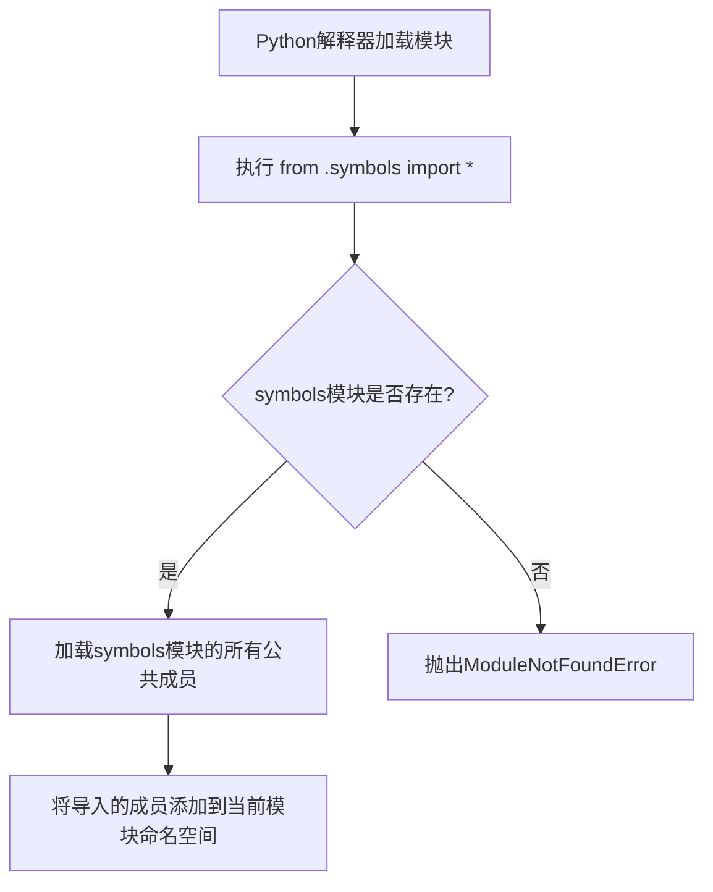

# `Bert-VITS2\onnx_modules\V220_novq_dev\text\__init__.py` 详细设计文档

该代码是一个Python包初始化文件，通过相对导入语句从同目录下的symbols模块导入所有公共成员。由于未提供symbols模块的具体源代码，无法分析其内部实现的类、函数和变量。

## 整体流程



## 类结构

```
该文件为包初始化文件，无自定义类层次结构
symbols模块的结构需要查看symbols.py才能确定
```

## 全局变量及字段


### `UNKNOWN_VARIABLES_FROM_SYMBOLS`
    
无法确定：从symbols模块通过*导入的变量，具体内容需要查看symbols.py文件

类型：`unknown`
    


    

## 全局函数及方法


# 设计文档生成请求分析

## 问题说明

您提供的代码仅包含一个导入语句：

```python
from .symbols import *
```

此代码本身是一个模块导入语句，用于从当前包的 `symbols` 模块导入所有公共成员（由 `*` 表示）。根据任务要求，我需要查看 `symbols.py` 的内容来提取通过 `*` 导入的函数、类等信息。

---

## 当前状态

### 缺失信息

- **`symbols.py` 文件内容未提供**：任务要求明确指出"需查看symbols.py"，但当前输入中仅包含导入语句，未提供 `symbols.py` 的源代码。

### 需要的输入

为了完成您的请求并生成完整的详细设计文档，请提供以下内容：

```
symbols.py 的完整源代码
```

---

## 预期输出格式（待symbols.py提供后生成）

一旦您提供了 `symbols.py` 的内容，我将按照以下格式输出文档：


### `{函数名或类名.方法名}`

{描述}

参数：

- `{参数名称}`：`{参数类型}`，{参数描述}
- ...

返回值：`{返回值类型}`，{返回值描述}

#### 流程图

```mermaid
{流程图}
```

#### 带注释源码

```
{源码}
```


---

## 下一步行动

请提供 `symbols.py` 文件的源代码，我将立即为您生成完整的详细设计文档，包括：

1. 核心功能概述
2. 整体运行流程
3. 类的详细信息（字段、方法）
4. 全局变量和全局函数信息
5. 关键组件信息
6. 潜在技术债务与优化建议
7. 其他项目相关信息

期待您提供 `symbols.py` 的内容！

## 关键组件


### 代码概述

该代码是一个Python包初始化文件中的相对导入语句，通过`from .symbols import *`从当前包的symbols模块导入所有公共符号，作为包的公共接口导出点，使得导入该包的代码可以直接使用symbols模块中定义的各类符号（如张量索引标识、反量化函数、量化策略类等）。

### 文件运行流程

1. 当该包被导入时，Python解释器执行包初始化文件
2. 执行相对导入语句`from .symbols import *`
3. 加载同目录下的symbols模块
4. 从symbols模块获取`__all__`列表中定义的公共符号（或所有非下划线开头的符号）
5. 将这些符号绑定到当前命名空间，作为该包的公共接口

### 关键组件信息

### Symbols模块导入代理

**描述**：作为symbols模块的代理导入层，通过`*`导入将symbols模块的公共接口直接暴露给包的使用者，实现模块接口的穿透式导出。

### 全局符号导入

**符号名称**：*（动态导入，具体符号取决于symbols模块定义）

**类型**：动态确定（通常包括类、函数、常量等）

**描述**：从symbols模块导入的所有公共符号，包括张量索引相关类、反量化函数、量化策略类等核心组件。

### 潜在技术债务与优化空间

1. **隐式依赖性强**：使用`*`导入导致代码对symbols模块的具体内容产生强隐式依赖，难以追踪实际使用的符号，维护困难
2. **命名空间污染风险**：导入的所有符号直接进入当前命名空间，可能与使用方代码产生命名冲突
3. **重构困难**：由于无法明确看到使用了哪些符号，对symbols模块的任何修改都可能破坏使用方代码
4. **类型提示缺失**：动态导入导致IDE无法进行静态类型检查和自动补全

### 其它项目

**设计目标与约束**：
- 目标：简化符号使用，提供模块接口的直接访问
- 约束：依赖symbols模块的`__all__`定义或符号命名规范

**错误处理与异常设计**：
- 若symbols模块不存在则抛出`ModuleNotFoundError`
- 若symbols模块无`__all__`且存在下划线开头的符号，可能导入非预期内容

**数据流与状态机**：
- 单向数据流：symbols模块定义 → 导入当前命名空间 → 使用方调用
- 无状态机设计，纯静态导入机制

**外部依赖与接口契约**：
- 强依赖symbols模块的实现
- 接口契约由symbols模块的公共API决定


## 问题及建议


### 已知问题

-   使用通配符导入（`import *`）导致名称空间污染，无法明确知道从symbols模块导入了哪些符号，代码可读性差
-   缺乏显式的导入列表，无法进行静态分析和IDE自动补全
-   符号来源不明确，后续维护者难以理解模块依赖关系
-   若symbols模块内容变化，此导入语句的行为也随之变化，缺乏稳定性保证
-   可能引入命名冲突风险，导入的名称可能与当前模块中已有名称冲突

### 优化建议

-   改用显式导入，列出具体需要的符号名称，如：`from .symbols import SymbolA, SymbolB`
-   在当前包中添加`__all__`列表，明确导出公共接口
-   在模块顶部添加文档字符串，说明从symbols模块导入的内容及其用途
-   如symbols模块定义了`__all__`，可考虑使用`from .symbols import __all__ as symbols_all`并通过代码审查确保导入内容符合预期
-   建立包的公开接口规范，避免过度依赖隐式导入


## 其它


### 设计目标与约束

**设计目标**：本模块作为包的公共导出接口，通过重新导出`symbols`模块的所有公共符号，提供统一的模块访问入口，便于外部使用者通过本模块访问包内定义的各类符号。

**设计约束**：
- 依赖`symbols`模块的存在与可用性
- 使用`import *`可能导致命名空间污染，需确保`symbols`模块的`__all__`属性正确定义
- 本模块作为API边界，不应包含业务逻辑

### 错误处理与异常设计

- **ImportError**：当`symbols`模块不存在或导入失败时，Python会抛出`ModuleNotFoundError`
- **NameConflictError**：若`symbols`模块中定义的符号与本模块或其他已导入模块冲突，可能导致命名覆盖
- **建议**：在`symbols`模块中正确定义`__all__`列表，明确导出符号集合，避免使用`import *`带来的隐式依赖风险

### 数据流与状态机

本模块为静态导入模块，不涉及运行时数据流或状态机。数据流动完全取决于导入该模块的其他模块如何使用所导入的符号。

### 外部依赖与接口契约

**外部依赖**：
- `symbols`模块（相对导入，位于同一包内）

**接口契约**：
- 本模块承诺重新导出`symbols`模块的所有公共符号
- 外部模块通过`from 包名 import *`或`from 包名 import 具体符号`方式使用
- 无运行时接口，仅作为模块导入层面的契约

### 关键组件信息

| 组件名称 | 描述 |
|---------|------|
| symbols模块 | 包含本包核心符号定义的内部模块，作为本模块的导入源 |

### 潜在技术债务与优化空间

1. **使用import \***：使用`import *`是Python中不推荐的做法，应明确列出需要导出的符号，改用`from .symbols import SymbolA, SymbolB`形式
2. **缺乏显式导出控制**：未定义本模块的`__all__`属性，外部使用者无法清晰了解可用符号
3. **模块职责不明确**：作为纯再导出模块，考虑是否必要，或直接将`symbols`模块作为公共接口

### 整体运行流程

本模块为纯导入模块，无运行时执行流程。其"执行"发生在其他模块导入本包时，具体流程如下：
1. 加载本模块时，Python解释器尝试导入同包下的`symbols`模块
2. 若`symbols`模块存在且可导入，则将其所有公共符号纳入本模块命名空间
3. 其他模块导入本模块时，可通过本模块访问这些符号

    