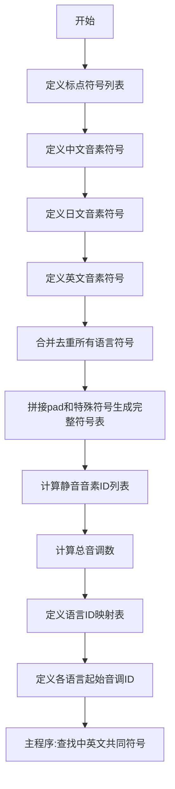

# `Bert-VITS2\onnx_modules\V220_novq_dev\text\symbols.py` 详细设计文档

这是一个用于多语言文本转语音(TTS)系统的音素符号配置文件,定义了中文、日文和英文的音素符号集、标点符号、语言ID映射以及音调信息,为语音合成提供基础词汇表支持。

## 整体流程



## 类结构

```
无类层次结构(纯配置文件)
```

## 全局变量及字段


### `punctuation`
    
标点符号列表，包含常见的文本标点符号如感叹号、问号、逗号等

类型：`List[str]`
    


### `pu_symbols`
    
标点符号和特殊符号列表，包含标点符号加上SP（空格）和UNK（未知）两个特殊标记

类型：`List[str]`
    


### `pad`
    
填充符号，用于序列填充的占位符，通常为下划线"_"

类型：`str`
    


### `zh_symbols`
    
中文音素符号列表，包含汉语拼音的声母、韵母及声调等音素

类型：`List[str]`
    


### `num_zh_tones`
    
中文声调数量，值为6（5个声调加1个轻声）

类型：`int`
    


### `ja_symbols`
    
日语音素符号列表，包含日语的假名发音对应的音素

类型：`List[str]`
    


### `num_ja_tones`
    
日语音调数量，值为2（重音和 flat 两种）

类型：`int`
    


### `en_symbols`
    
英语音素符号列表，采用ARPAbet音标系统的音素表示

类型：`List[str]`
    


### `num_en_tones`
    
英语声调数量，值为4

类型：`int`
    


### `normal_symbols`
    
规范化后的音素符号列表，对所有语言符号去重并排序

类型：`List[str]`
    


### `symbols`
    
完整的符号列表，包含填充符、规范化音素和特殊音素

类型：`List[str]`
    


### `sil_phonemes_ids`
    
静音音素的索引列表，存储标点符号和特殊符号在symbols列表中的位置

类型：`List[int]`
    


### `num_tones`
    
所有语言的总声调数量，为中文、日文、英文声调数之和

类型：`int`
    


### `language_id_map`
    
语言代码到语言ID的映射字典，ZH=0, JP=1, EN=2

类型：`Dict[str, int]`
    


### `num_languages`
    
支持的语言数量，为language_id_map中的键值对数量

类型：`int`
    


### `language_tone_start_map`
    
每种语言的起始声调索引映射，用于多语言语音合成的声调范围划分

类型：`Dict[str, int]`
    


    

## 全局函数及方法


## 关键组件


### 标点符号与填充符定义

定义标点符号列表和填充符，用于语音合成中的文本处理和序列填充。

### 中文音素符号集

包含中文（普通话）音素的完整列表及相关音调数量配置，涵盖声母、韵母及特殊标记。

### 日语音素符号集

包含日语音素的完整列表及相关音调数量配置，涵盖清音、浊音、半浊音及长音标记。

### 英语音素符号集

包含英语音素的完整列表及相关音调数量配置，采用ARPABET音标体系。

### 符号集合并与索引机制

将中、日、英三种语言的音素符号合并去重，生成统一的符号表，并建立索引映射关系。

### 静音音素标识

定义标点符号对应的音素ID列表，用于在语音合成中处理标点停顿。

### 语言与音调映射配置

建立语言标识到ID的映射、语言ID计数器，以及各语言音调起始位置的偏移量映射。


## 问题及建议


### 已知问题

- **硬编码语言配置**：语言相关配置（language_id_map、language_tone_start_map、num_languages）散落在多处，添加新语言时需要手动修改多处代码，容易遗漏
- **Magic Numbers**：音调数量（num_zh_tones=6, num_ja_tones=2, num_en_tones=4）缺乏注释说明来源和含义
- **符号重复定义风险**：三个语言的符号列表存在重叠元素（如"a", "i", "n"等），虽然使用set去重，但这种隐式合并可能导致意外的符号冲突
- **缺乏数据验证**：符号列表、起始音调映射等关键数据没有校验逻辑，无法检测配置错误
- **模块化不足**：所有配置集中在单个文件，缺乏语言配置的数据结构定义，难以扩展和维护
- **测试逻辑不完整**：if __name__ == "__main__" 中的测试仅验证符号交集，功能验证不足

### 优化建议

- **抽取配置数据**：将语言符号、音调数量等配置抽取为独立的数据结构（如字典或配置文件），便于扩展新语言
- **添加数据验证**：在模块加载时校验符号唯一性、语言配置完整性、起始音调映射连续性等
- **增加类型注解**：为全局变量添加类型注解，提高代码可读性和IDE支持
- **重构为类/模块**：考虑将配置封装为类或独立模块，提供统一的访问接口和扩展方法
- **补充文档注释**：为各符号列表、音调数量等添加注释说明数据来源和用途

## 其它


### 一段话描述

该代码是一个多语言语音合成/识别系统的音素符号定义模块，定义了中文、日语和英语的音素符号集合、标点符号集合并进行整合，同时建立了语言ID映射和音调起始位置映射，为语音处理提供了统一的基础符号表。

### 文件的整体运行流程

该脚本为配置性质的文件，主要在导入时执行以下流程：
1. 首先定义标点符号列表和特殊符号（pad、SP、UNK）
2. 分别定义中文、日语、英语的音素符号列表及其对应的音调数量
3. 合并所有语言的音素符号并进行去重排序，形成统一的符号表
4. 计算各语言的silence音素ID列表
5. 汇总总音调数量
6. 建立语言ID映射字典（ZH=0, JP=1, EN=2）
7. 建立语言音调起始位置映射字典
8. 若作为主程序运行，则演示了中英文符号集合的交集计算

### 全局变量详细信息

| 变量名称 | 类型 | 描述 |
|---------|------|------|
| punctuation | list | 标点符号列表，包含"!", "?", "…", ",", ".", "'", "-" |
| pu_symbols | list | punctuation + ["SP", "UNK"]，包含标点、加空格符和未知符 |
| pad | str | 填充符号，值为"_" |
| zh_symbols | list | 中文音素符号列表，包含所有中文拼音音素 |
| num_zh_tones | int | 中文音调数量，值为6 |
| ja_symbols | list | 日语音素符号列表，包含所有日语音素 |
| num_ja_tones | int | 日语音调数量，值为2 |
| en_symbols | list | 英语音素符号列表，包含所有英语音素（ARPABET） |
| num_en_tones | int | 英语音调数量，值为4 |
| normal_symbols | list | 合并去重排序后的所有语言音素符号 |
| symbols | list | 完整的符号表，包含pad + normal_symbols + pu_symbols |
| sil_phonemes_ids | list | 所有silence/标点符号在symbols中的索引ID列表 |
| num_tones | int | 总音调数量，值为12（6+2+4） |
| language_id_map | dict | 语言标识到ID的映射，ZH=0, JP=1, EN=2 |
| num_languages | int | 支持的语言数量，值为3 |
| language_tone_start_map | dict | 各语言音调起始位置映射，ZH从0开始，JP从6开始，EN从8开始 |

### 全局函数详细信息

#### main函数（测试用）

| 项目 | 详情 |
|------|------|
| 函数名称 | main（隐式，通过if __name__ == "__main__"调用） |
| 参数名称 | 无 |
| 参数类型 | 无 |
| 参数描述 | 无参数 |
| 返回值类型 | 无返回值（仅打印输出） |
| 返回值描述 | 无返回值 |
| mermaid流程图 | ```mermaid flowchart TD A[开始] --> B[定义集合a=zh_symbols] B --> C[定义集合b=en_symbols] C --> D[计算交集a&b] D --> E[排序输出] E --> F[结束]``` |
| 带注释源码 | ```python if __name__ == "__main__": # 当脚本作为主程序运行时执行 a = set(zh_symbols) # 将中文符号列表转换为集合 b = set(en_symbols) # 将英文符号列表转换为集合 print(sorted(a & b)) # 计算交集并排序打印输出``` |

### 关键组件信息

| 组件名称 | 一句话描述 |
|---------|-----------|
| 符号表系统（symbols） | 统一的音素符号索引表，为语音处理提供符号到ID的映射 |
| 语言映射系统（language_id_map） | 将语言标识映射为数字ID，便于系统处理多语言 |
| 音调映射系统（language_tone_start_map） | 定义各语言音调范围的起始位置，支持多语言音调处理 |
| Silence音素系统（sil_phonemes_ids） | 定义所有静音/标点符号的ID，用于语音边界处理 |

### 潜在的技术债务或优化空间

1. **符号定义硬编码**：所有音素符号以列表形式硬编码在代码中，建议迁移至配置文件或数据库
2. **缺乏符号验证机制**：未提供符号有效性验证函数，无法检测重复或非法符号
3. **无序列化支持**：symbols列表未提供持久化功能（如JSON/Pickle导出），每次需重新生成
4. **语言扩展性不足**：新增语言需要手动修改多处代码（symbols、num_tones、language_id_map等），缺乏灵活性
5. **测试覆盖不足**：仅有一个简单的main函数演示交集计算，缺乏单元测试
6. **文档缺失**：代码无Docstring注释，难以理解各符号列表的具体含义和用途
7. **magic number**：num_zh_tones=6、num_ja_tones=2、num_en_tones=4等数值未解释来源

### 设计目标与约束

**设计目标**：
- 为多语言语音合成系统提供统一的音素符号基础表
- 支持中文、日语、英语三种语言的音素处理
- 建立语言ID和音调范围的标准化映射

**设计约束**：
- 符号表必须包含pad符号用于填充
- 符号表必须包含UNK符号处理未知情况
- 语言ID必须从0开始连续编号
- 各语言音调范围必须连续且不重叠

### 错误处理与异常设计

1. **符号重复问题**：使用set()去重，但如果存在重复符号会导致silent failure，建议添加警告
2. **索引越界风险**：symbols.index()在符号不存在时会抛出ValueError，建议预先验证
3. **主程序演示**：仅作为演示用途，无生产级错误处理

### 数据流与状态机

**数据流**：
- 输入：各语言音素符号列表（zh_symbols、ja_symbols、en_symbols）
- 处理：集合合并、去重、排序、索引计算
- 输出：统一符号表symbols、语言映射、音调映射

**状态机**：无复杂状态机，该文件为纯配置性质

### 外部依赖与接口契约

**外部依赖**：无第三方库依赖，仅使用Python标准库（set、sorted等）

**接口契约**：
- symbols列表索引从0开始，0号索引为pad填充符
- language_id_map的key为字符串语言代码（"ZH"/"JP"/"EN"），value为整数ID
- language_tone_start_map的value为各语言首个子音调在总音调序列中的位置
- sil_phonemes_ids列表包含所有非语言音素（标点和特殊符号）的索引

### 配置与常量定义

| 常量分类 | 常量名称 | 值 | 说明 |
|---------|---------|-----|------|
| 语言标识 | ZH | "ZH" | 中文语言代码 |
| 语言标识 | JP | "JP" | 日语语言代码 |
| 语言标识 | EN | "EN" | 英语语言代码 |
| 填充符 | pad | "_" | 用于序列填充的符号 |
| 特殊符 | SP | "SP" | 空格音素 |
| 特殊符 | UNK | "UNK" | 未知符号 |
| 音调配置 | num_zh_tones | 6 | 中文6个音调（5个声调+轻声） |
| 音调配置 | num_ja_tones | 2 | 日语2个音调（高低） |
| 音调配置 | num_en_tones | 4 | 英语4个音调 |
| 音调配置 | num_tones | 12 | 总音调数 |

### 使用示例与参考

```python
# 获取某个符号的ID
symbol_id = symbols.index("a")  # 获取"a"音素在符号表中的索引

# 根据语言获取音调范围
lang = "ZH"
tone_start = language_tone_start_map[lang]
tone_end = tone_start + num_zh_tones  # 0到6

# 判断是否为静音/标点符号
is_silence = symbols.index("SP") in sil_phonemes_ids
```

    