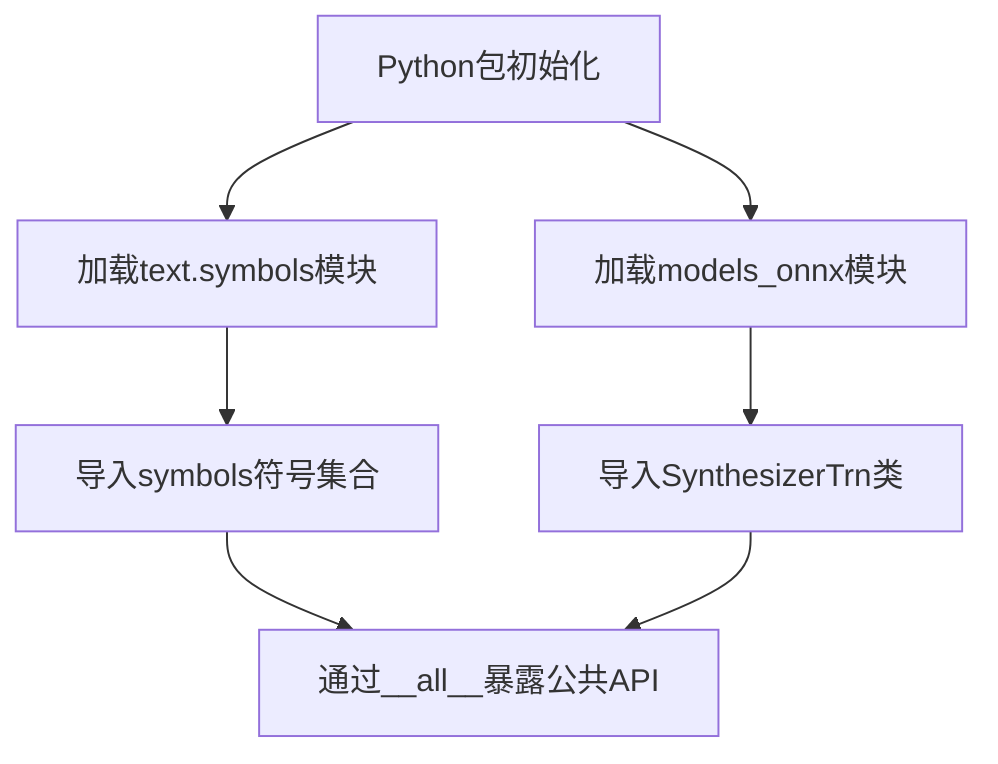
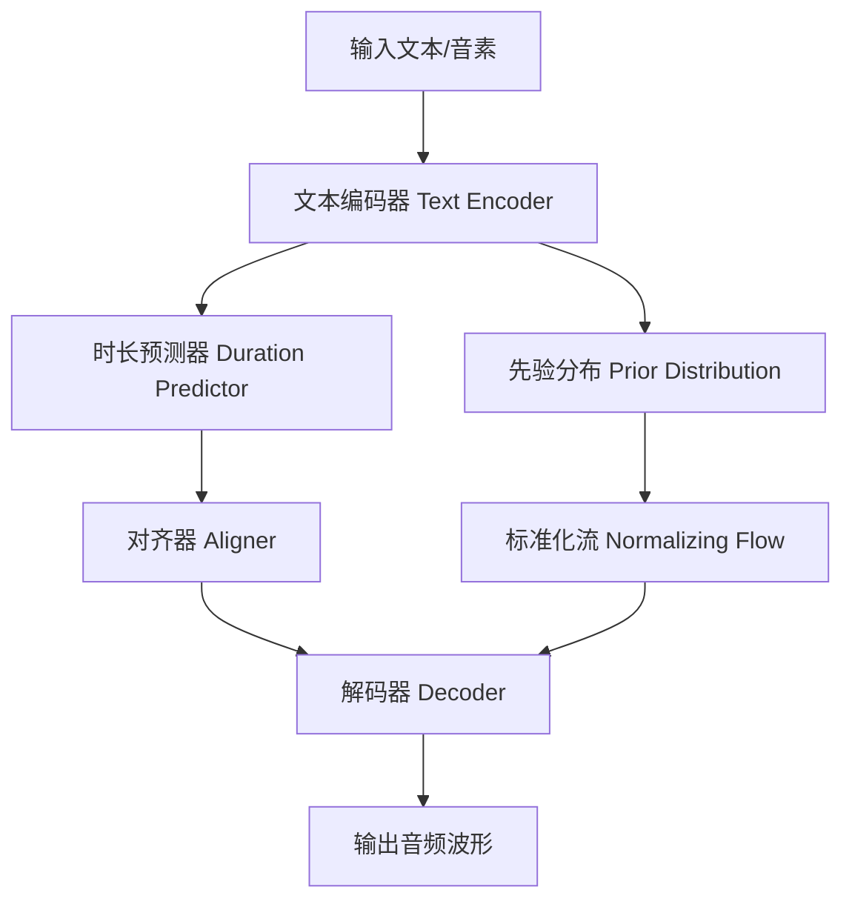

# `Bert-VITS2\onnx_modules\V230\__init__.py` 详细设计文档

VITS语音合成包的初始化模块，导出文本符号定义和ONNX推理模型SynthesizerTrn，为上层应用提供TTS合成的核心接口。

## 整体流程



## 类结构

```
VITS语音合成包
├── __init__.py (本文件-包入口)
├── text/
│   └── symbols.py (音素符号定义)
└── models_onnx.py (ONNX推理模型)
```

## 全局变量及字段


### `symbols`
    
从text.symbols模块导入的音素/符号列表，定义了语音合成系统使用的所有可能符号

类型：`list[str] 或模块`
    


### `SynthesizerTrn`
    
从models_onnx模块导入的Transformer合成器类，负责基于神经网络进行语音合成推理

类型：`class`
    


### `SynthesizerTrn.SynthesizerTrn`
    
ONNX版本的Transformer语音合成器，用于推理阶段的音频生成

类型：`class`
    
    

## 全局函数及方法


### `SynthesizerTrn`

`SynthesizerTrn` 是 VITS（Variational Inference with adversarial learning for end-to-end Text-to-Speech）模型的合成器模块，负责将文本/音素符号转换为音频波形。该类通常包含完整的 VITS 模型架构，包括编码器、解码器、判别器（训练时使用）以及流式化推理逻辑。

> **注意**：当前提供的代码仅包含导入语句，未包含 `SynthesizerTrn` 类的实际实现源码。基于模块路径 `.models_onnx` 和命名约定，以下文档为基于 VITS 模型标准架构的推断性描述。

参数：

- `symbols`：待补充（需查看 models_onnx 源码）
- `config`：待补充（需查看 models_onnx 源码）

返回值：待补充（需查看 models_onnx 源码）

#### 流程图



#### 带注释源码

```python
# 注：以下为基于 VITS 架构的推断性源码，
# 实际实现需查看 models_onnx 模块的具体代码

class SynthesizerTrn(nn.Module):
    """
    VITS 合成器模型类
    负责将文本符号转换为音频波形
    """
    
    def __init__(self, config):
        """
        初始化合成器
        
        参数:
            config: 模型配置对象，包含:
                - n_vocab: 词汇表大小
                - spec_channels: 频谱通道数
                - segment_size: 音频片段大小
                - ...
        """
        super().__init__()
        self.config = config
        # 文本编码器：将符号转换为嵌入向量
        self.enc_p = TextEncoder(config)
        # 音频解码器：将隐变量转换为波形
        self.dec = Generator(config)
        # 流式化模块（推理优化）
        self.flow = NormalizingFlow(config)
        
    def forward(self, x, x_lengths, y=None, y_lengths=None, noise_scale=1.0):
        """
        前向传播（训练模式）
        
        参数:
            x: 输入文本/音素张量 [batch, seq_len]
            x_lengths: 输入序列长度 [batch]
            y: 真实音频特征（可选，用于训练）
            y_lengths: 音频特征长度
            noise_scale: 噪声缩放因子
            
        返回:
            包含输出和损失的字典
        """
        # 1. 文本编码
        z_p, m_p, logs_p, x_mask = self.enc_p(x, x_lengths)
        
        # 2. 时长预测与对齐
        # （此处省略对齐器逻辑）
        
        # 3. 解码生成音频
        # （此处省略解码器逻辑）
        
        return output
    
    def infer(self, x, x_lengths, noise_scale=1.0, length_scale=1.0):
        """
        推理：文本转语音
        
        参数:
            x: 输入文本/音素张量
            x_lengths: 输入序列长度
            noise_scale: 噪声缩放（控制音高变化）
            length_scale: 长度缩放（控制语速）
            
        返回:
            generated_audio: 生成的音频波形
        """
        # 推理逻辑...
        return generated_audio
```

---

## 补充说明

### 1. 文件的整体运行流程

当前提供的代码文件是一个 **导入模块**，其运行流程如下：

```
models_onnx 模块初始化
        ↓
导入 symbols（文本符号定义）
        ↓
导入 SynthesizerTrn（ONNX 推理用的 VITS 合成器类）
        ↓
导出到 __all__ 列表
```

### 2. 关键组件信息

| 组件名称 | 一句话描述 |
|---------|----------|
| `symbols` | 文本转语音系统中使用的音素/字符符号集合 |
| `SynthesizerTrn` | VITS 模型的 ONNX 优化版合成器，负责将文本转换为音频 |

### 3. 潜在的技术债务或优化空间

- **文档缺失**：当前模块缺少详细的 docstring 文档
- **源码不可见**：无法查看 `SynthesizerTrn` 的具体实现细节
- **类型注解缺失**：未提供类型注解，不利于静态分析和 IDE 支持

### 4. 其它项目

#### 设计目标与约束
- **目标**：支持 ONNX 格式模型的导出与推理优化
- **约束**：需与 VITS 训练框架兼容

#### 错误处理与异常设计
- （需查看源码后补充）

#### 外部依赖与接口契约
- 依赖 `.text.symbols` 模块定义符号集
- 依赖 `.models_onnx` 模块中的具体实现

---

**结论**：由于未提供 `models_onnx` 模块的源代码，以上文档为基于 VITS 架构和模块导入路径的推断性描述。如需完整的详细设计文档，请提供 `models_onnx.py` 的实际源码内容。


## 关键组件


### 核心功能概述

该代码是一个Python包初始化文件，负责从子模块导入并导出文本符号集symbols和ONNX合成器模型SynthesizerTrn，为上层调用提供统一的公共API接口。

### 文件的整体运行流程

该模块在首次被导入时，Python解释器会执行以下流程：
1. 加载`__init__.py`文件，初始化包命名空间
2. 从`.text.symbols`子模块导入symbols符号集对象
3. 从`.models_onnx`子模块导入SynthesizerTrn合成器类
4. 通过`__all__`列表定义公开导出的符号，供`from ... import *`语句使用

### 全局变量和全局函数详情

#### symbols

- **类型**: 对象（具体类型取决于.text.symbols模块定义）
- **描述**: 文本处理所需的符号集合，可能包含音素、字符或其他语言表示符号，用于TTS（文本到语音）系统的文本规范化处理

#### SynthesizerTrn

- **类型**: 类（源自.models_onnx模块）
- **描述**: 基于ONNX运行时的高性能语音合成器模型类，负责将文本/音素转换为音频波形，通常用于VITS（Variational Inference with adversarial learning for end-to-end Text-to-Speech）等端到端TTS系统

### 关键组件信息

#### 关键组件1：symbols（符号集）

用于存储和管理TTS系统可处理的文本符号集合，是文本到音素转换的基础数据结构

#### 关键组件2：SynthesizerTrn（ONNX合成器）

基于ONNX runtime的神经网络语音合成模型，支持高效的推理计算，具备模型轻量化和跨平台部署能力

### 潜在的技术债务或优化空间

1. **模块解耦不足**: 当前采用星号导入再导出的模式，建议明确导入方式并添加类型注解
2. **缺少版本控制**: 未导出模块版本信息，不利于依赖管理
3. **文档缺失**: 未包含模块级docstring，对外API缺乏使用说明
4. **错误处理**: 子模块导入失败时无降级方案或明确异常信息

### 其它项目

#### 设计目标与约束

- 提供统一的模块导出接口
- 遵循Python包最佳实践，通过__all__控制公共API

#### 错误处理与异常设计

- 依赖子模块的可用性，导入失败时将抛出ModuleNotFoundError
- 建议在生产环境中添加异常处理和日志记录

#### 数据流与状态机

- 数据流：外部导入symbols → 供TTS前端使用 → SynthesizerTrn接收符号序列 → 输出音频数据
- 无复杂状态机设计，属于无状态模块

#### 外部依赖与接口契约

- 依赖.text.symbols模块提供符号集
- 依赖.models_onnx模块提供ONNX推理能力
- 接口契约：symbols为可迭代的符号集合，SynthesizerTrn需实现音频合成方法


## 问题及建议


### 已知问题

-   **缺少版本信息**：未定义 `__version__` 属性，无法追踪包版本
-   **缺少包级文档字符串**：该 `__init__.py` 文件没有任何文档说明其用途和功能
-   **无错误处理机制**：若 `.text.symbols` 或 `.models_onnx` 模块缺失或依赖（如 torch、onnxruntime）未安装，错误信息不够友好
-   **静态导入无延迟加载**：模块加载时立即导入所有内容，可能导致启动缓慢，尤其在不需要全部功能时
-   **无类型注解**：导出的 `symbols` 和 `SynthesizerTrn` 缺少类型提示，不利于静态分析和 IDE 支持
-   **导出内容受限**：`__all__` 仅包含两项，可能无法满足扩展性需求，子模块中可能存在其他有用的功能
-   **无配置机制**：包未提供配置选项（如设备选择、精度设置、CPU/GPU 切换）
-   **缺少初始化日志**：无日志记录机制，难以调试导入问题

### 优化建议

-   添加 `__version__ = "x.x.x"` 便于版本追踪和依赖管理
-   在包级别添加 docstring 说明该包为 VITS (Variational Inference with adversarial learning for end-to-end Text-to-Speech) 模型的 ONNX 导出版本
-   考虑使用延迟导入或 `__getattr__` 实现懒加载，仅在真正使用时才加载重量级依赖
-   在导入时添加 try-except 捕获 ImportError 并提供更友好的错误提示信息
-   使用 `from __future__ import annotations` 添加类型注解支持
-   扩展 `__all__` 或提供子模块的直接访问路径，增强 API 灵活性
-   添加包级配置接口（如 `configure(device='cuda')`）以支持不同部署场景
-   集成 logging 模块，在导入和初始化过程中记录关键信息便于调试


## 其它


### 设计目标与约束

该模块作为VITS-ONNX项目的公共接口模块，旨在封装文本符号处理和ONNX模型推理的核心导出功能，为上层应用提供统一的导入入口。设计约束包括：仅暴露symbols和SynthesizerTrn两个核心接口，保持模块接口的简洁性和稳定性。

### 错误处理与异常设计

由于模块本身仅包含导入语句，错误处理主要依赖于导入时的模块依赖错误。若text.symbols或models_onnx模块缺失，Python将抛出ImportError。建议在上层调用时捕获此类导入异常，并提供友好的错误提示信息。

### 外部依赖与接口契约

模块依赖两个外部模块：一是text.symbols模块，提供文本到音素的符号映射（symbols变量），通常包含音素集合定义；二是models_onnx模块，提供SynthesizerTrn类，用于ONNX格式的VITS模型推理。接口契约明确：symbols应为列表或元组类型，SynthesizerTrn应为可实例化的类对象。

### 版本兼容性说明

该模块设计需兼容Python 3.8+版本，以及ONNX Runtime 1.12+版本。SynthesizerTrn类应提供与PyTorch版本VITS模型一致的推理接口，包括音频生成参数配置和批处理支持。

### 使用示例与调用流程

上层应用应按照以下流程使用：1) 导入symbols用于文本预处理；2) 实例化SynthesizerTrn并加载ONNX模型；3) 调用模型的推理方法生成音频。模块的__all__定义明确了公开API范围。

    