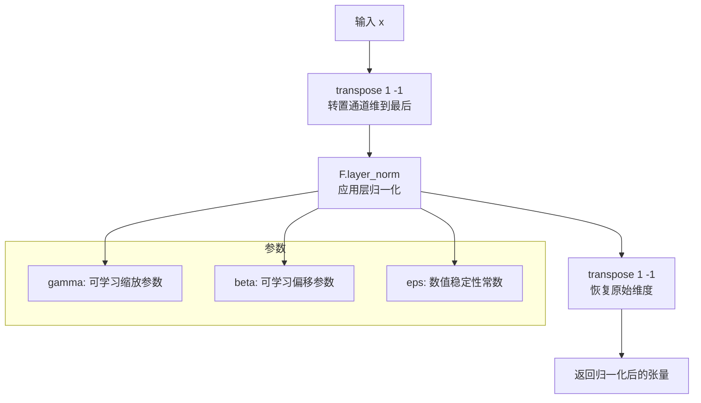
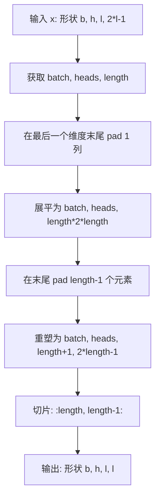
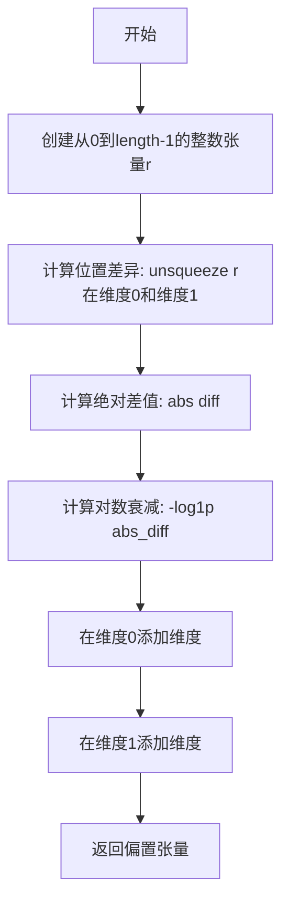
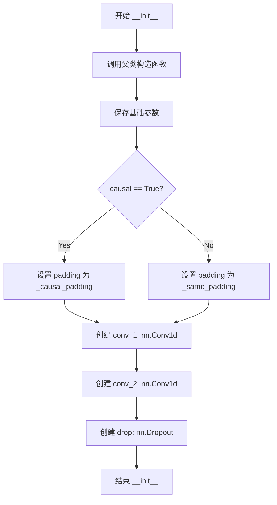
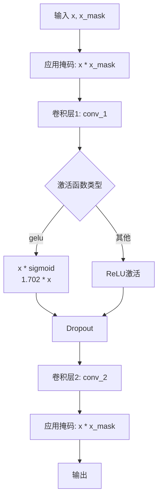

```mermaid
flowchart TD
    A[开始: _matmul_with_relative_keys] --> B[接收输入 x: b×h×l×d]
    B --> C[接收输入 y: h×m×d 或 1×m×d]
    C --> D[对 y 进行操作: y.unsqueeze&#40;0&#41;]
    D --> E[y 变为 1×h×m×d 或 1×1×m×d]
    E --> F[转置 y 的最后两个维度: transpose&#40;-2, -1&#41;]
    F --> G[y 变为 1×h×d×m]
    G --> H[执行矩阵乘法: torch.matmul&#40;x, y&#41;]
    H --> I[结果形状: b×h×l×m]
    I --> J[返回结果张量]
```

# `Bert-VITS2\onnx_modules\V230\attentions_onnx.py` 详细设计文档

这是一个用于TTS（文本到语音）模型的Transformer编码器模块，实现了自回归Transformer架构，包含多头注意力机制、前馈网络和相对位置编码，支持说话人嵌入条件化。

## 整体流程

```mermaid
graph TD
A[输入: x, x_mask, g] --> B[创建注意力掩码 attn_mask]
B --> C{x *= x_mask}
C --> D[循环 i from 0 to n_layers]
D --> E{判断条件: i == cond_layer_idx 且 g 不为空}
E -- 是 --> F[说话人嵌入线性变换并添加到x]
E -- 否 --> G[多头注意力层]
F --> G
G --> H[残差连接和LayerNorm]
H --> I[前馈网络FFN]
I --> J[残差连接和LayerNorm]
J --> K{x *= x_mask]
K --> L[返回编码后的x]
L --> M[多头注意力内部流程]
M --> N[计算Q/K/V向量]
N --> O[计算注意力分数]
O --> P{是否使用相对位置编码}
P -- 是 --> Q[添加相对位置偏置]
P -- 否 --> R{是否使用proximal bias}
R -- 是 --> S[添加 proximal bias]
R -- 否 --> T[应用掩码]
Q --> T
T --> U[Softmax归一化]
U --> V[计算输出并添加相对位置值]
V --> W[返回输出和注意力权重]
```

## 类结构

```
LayerNorm (层归一化)
fused_add_tanh_sigmoid_multiply (融合激活函数)
Encoder (编码器主类)
├── MultiHeadAttention (多头注意力)
│   └── _get_relative_embeddings (相对位置嵌入)
│   └── _matmul_with_relative_keys (相对键矩阵乘法)
│   └── _matmul_with_relative_values (相对值矩阵乘法)
│   └── _relative_position_to_absolute_position (相对转绝对位置)
│   └── _absolute_position_to_relative_position (绝对转相对位置)
│   └── _attention_bias_proximal (近端注意力偏置)
└── FFN (前馈神经网络)
    └── _causal_padding (因果填充)
    └── _same_padding (相同填充)
```

## 全局变量及字段


### `logger`
    
模块级日志记录器

类型：`logging.Logger`
    


### `LayerNorm.channels`
    
输入通道数

类型：`int`
    


### `LayerNorm.eps`
    
数值稳定性参数

类型：`float`
    


### `LayerNorm.gamma`
    
可学习缩放参数

类型：`nn.Parameter`
    


### `LayerNorm.beta`
    
可学习偏移参数

类型：`nn.Parameter`
    


### `Encoder.hidden_channels`
    
隐藏层维度

类型：`int`
    


### `Encoder.filter_channels`
    
前馈网络过滤器维度

类型：`int`
    


### `Encoder.n_heads`
    
注意力头数

类型：`int`
    


### `Encoder.n_layers`
    
编码器层数

类型：`int`
    


### `Encoder.kernel_size`
    
卷积核大小

类型：`int`
    


### `Encoder.p_dropout`
    
Dropout概率

类型：`float`
    


### `Encoder.window_size`
    
注意力窗口大小

类型：`int`
    


### `Encoder.cond_layer_idx`
    
条件注入层索引

类型：`int`
    


### `Encoder.gin_channels`
    
说话人嵌入通道数(可选)

类型：`int`
    


### `Encoder.spk_emb_linear`
    
说话人嵌入线性层(可选)

类型：`nn.Linear`
    


### `Encoder.drop`
    
Dropout层

类型：`nn.Dropout`
    


### `Encoder.attn_layers`
    
多头注意力层列表

类型：`nn.ModuleList`
    


### `Encoder.norm_layers_1`
    
归一化层列表1

类型：`nn.ModuleList`
    


### `Encoder.ffn_layers`
    
前馈网络层列表

类型：`nn.ModuleList`
    


### `Encoder.norm_layers_2`
    
归一化层列表2

类型：`nn.ModuleList`
    


### `MultiHeadAttention.channels`
    
输入通道数

类型：`int`
    


### `MultiHeadAttention.out_channels`
    
输出通道数

类型：`int`
    


### `MultiHeadAttention.n_heads`
    
注意力头数

类型：`int`
    


### `MultiHeadAttention.p_dropout`
    
Dropout概率

类型：`float`
    


### `MultiHeadAttention.window_size`
    
相对注意力窗口大小

类型：`int`
    


### `MultiHeadAttention.heads_share`
    
头是否共享相对位置嵌入

类型：`bool`
    


### `MultiHeadAttention.block_length`
    
局部注意力块长度

类型：`int`
    


### `MultiHeadAttention.proximal_bias`
    
是否使用近端偏置

类型：`bool`
    


### `MultiHeadAttention.proximal_init`
    
是否用Q权重初始化K

类型：`bool`
    


### `MultiHeadAttention.attn`
    
存储注意力权重

类型：`Tensor`
    


### `MultiHeadAttention.k_channels`
    
每个头的键维度

类型：`int`
    


### `MultiHeadAttention.conv_q`
    
查询投影卷积

类型：`nn.Conv1d`
    


### `MultiHeadAttention.conv_k`
    
键投影卷积

类型：`nn.Conv1d`
    


### `MultiHeadAttention.conv_v`
    
值投影卷积

类型：`nn.Conv1d`
    


### `MultiHeadAttention.conv_o`
    
输出投影卷积

类型：`nn.Conv1d`
    


### `MultiHeadAttention.drop`
    
Dropout层

类型：`nn.Dropout`
    


### `MultiHeadAttention.emb_rel_k`
    
键相对位置嵌入(可选)

类型：`nn.Parameter`
    


### `MultiHeadAttention.emb_rel_v`
    
值相对位置嵌入(可选)

类型：`nn.Parameter`
    


### `FFN.in_channels`
    
输入通道数

类型：`int`
    


### `FFN.out_channels`
    
输出通道数

类型：`int`
    


### `FFN.filter_channels`
    
隐藏层维度

类型：`int`
    


### `FFN.kernel_size`
    
卷积核大小

类型：`int`
    


### `FFN.p_dropout`
    
Dropout概率

类型：`float`
    


### `FFN.activation`
    
激活函数类型

类型：`str`
    


### `FFN.causal`
    
是否因果卷积

类型：`bool`
    


### `FFN.padding`
    
填充函数

类型：`callable`
    


### `FFN.conv_1`
    
第一个卷积层

类型：`nn.Conv1d`
    


### `FFN.conv_2`
    
第二个卷积层

类型：`nn.Conv1d`
    


### `FFN.drop`
    
Dropout层

类型：`nn.Dropout`
    
    

## 全局函数及方法


### `fused_add_tanh_sigmoid_multiply`

该函数是一个融合的tanh-sigmoid激活函数，专门用于WaveNet风格的门控激活机制。它通过将两个输入相加，对结果按通道维度分割，分别应用tanh和sigmoid激活，然后相乘得到最终的输出，这种融合实现能够减少内存访问开销并提高计算效率。

参数：

- `input_a`：`torch.Tensor`，第一个输入张量，通常为上一层的前向传播输出
- `input_b`：`torch.Tensor`，第二个输入张量，通常为残差连接或条件输入
- `n_channels`：`torch.Tensor`（长度为1的Tensor），通道数，用于分割输入张量

返回值：`torch.Tensor`，经过tanh-sigmoid门控激活后的输出张量，形状与输入相同

#### 流程图

```mermaid
flowchart TD
    A[input_a, input_b, n_channels] --> B[n_channels_int = n_channels[0]]
    B --> C[in_act = input_a + input_b]
    C --> D[通道分割: in_act[:, :n_channels_int, :]]
    C --> E[通道分割: in_act[:, n_channels_int:, :]]
    D --> F[t_act = torch.tanh]
    E --> G[s_act = torch.sigmoid]
    F --> H[acts = t_act * s_act]
    G --> H
    H --> I[返回 acts]
```

#### 带注释源码

```
@torch.jit.script
def fused_add_tanh_sigmoid_multiply(input_a, input_b, n_channels):
    """
    融合的tanh-sigmoid门控激活函数
    
    该函数实现了WaveNet中使用的门控激活机制:
    f(x) = tanh(W_f * x) * sigmoid(W_g * x)
    
    通过torch.jit.script装饰器编译为TorchScript,
    可以融合多个操作减少内核启动开销和内存访问。
    
    参数:
        input_a: 第一个输入张量, 形状为 [batch, channels, time]
        input_b: 第二个输入张量, 形状为 [batch, channels, time]
        n_channels: 通道数, 用Tensor包装以支持TorchScript跟踪
    
    返回:
        激活后的输出张量, 形状为 [batch, channels, time]
    """
    # 从Tensor中提取整数通道数
    n_channels_int = n_channels[0]
    
    # 将两个输入张量按元素相加
    in_act = input_a + input_b
    
    # 对前半部分通道应用tanh激活
    t_act = torch.tanh(in_act[:, :n_channels_int, :])
    
    # 对后半部分通道应用sigmoid激活
    s_act = torch.sigmoid(in_act[:, n_channels_int:, :])
    
    # 门控机制: 将tanh输出与sigmoid输出相乘
    acts = t_act * s_act
    
    return acts
```

---

#### 关键组件信息

| 组件名称 | 一句话描述 |
|---------|-----------|
| `@torch.jit.script` | TorchScript装饰器，将函数编译为可优化的中间表示，提升执行效率 |
| `torch.tanh` | 双曲正切激活函数，将输出压缩到[-1, 1]区间 |
| `torch.sigmoid` | Sigmoid激活函数，将输出压缩到[0, 1]区间，作为门控开关 |

#### 潜在的技术债务或优化空间

1. **n_channels参数设计**：使用长度为1的Tensor传递通道数不够直观，可考虑使用整数类型或重新设计API
2. **通道分割假设**：函数假设输入通道数正好是n_channels的两倍，缺乏对不匹配输入的验证
3. **数值精度**：在极端值情况下，tanh和sigmoid可能产生数值不稳定，可考虑使用torch.nn.functional.hardshrink等替代方案
4. **文档缺失**：缺少对WaveNet门控机制的详细说明和数学公式

#### 其它项目

**设计目标与约束：**
- 目标：通过操作融合提升WaveNet模型的推理速度
- 约束：输入通道数必须为n_channels的两倍（前半部分给tanh，后半部分给sigmoid）

**错误处理与异常设计：**
- 缺乏显式的输入验证，若通道数不匹配会导致运行时错误或返回错误形状的张量

**外部依赖与接口契约：**
- 依赖PyTorch库，需确保torch版本兼容
- 作为TorchScript函数，可被其他TorchScript模块或Python代码调用
- 输入输出均为3D张量 [batch, channels, time]


### `LayerNorm.__init__`

该方法是LayerNorm类的构造函数，用于初始化层归一化模块，设置通道数、epsilon值以及可学习的缩放参数gamma和偏置参数beta。

参数：

- `channels`：`int`，表示特征维度数量，即需要归一化的通道数
- `eps`：`float`，默认为1e-5，用于防止除零的常数，添加到方差中保证数值稳定性

返回值：`None`，构造函数不返回任何值

#### 流程图

```mermaid
flowchart TD
    A[开始 __init__] --> B[调用父类初始化 super().__init__]
    B --> C[保存 channels 到实例属性]
    C --> D[保存 eps 到实例属性]
    D --> E[创建可学习参数 gamma: 全1向量]
    E --> F[创建可学习参数 beta: 全0向量]
    F --> G[结束 __init__]
```

#### 带注释源码

```python
def __init__(self, channels, eps=1e-5):
    """
    LayerNorm 层的初始化方法
    
    参数:
        channels: int - 输入特征的通道数
        eps: float - 数值稳定性常数，默认为1e-5
    """
    # 调用 nn.Module 的父类构造函数，完成模块的基本初始化
    super().__init__()
    
    # 保存通道数到实例属性，供后续 forward 方法使用
    self.channels = channels
    
    # 保存 epsilon 值，用于 layer_norm 计算时防止除零
    self.eps = eps

    # 创建可学习的缩放参数 (gamma)，形状为 [channels]
    # 初始化为全1向量，用于对归一化后的值进行缩放
    self.gamma = nn.Parameter(torch.ones(channels))
    
    # 创建可学习的偏置参数 (beta)，形状为 [channels]
    # 初始化为全0向量，用于对归一化后的值进行平移
    self.beta = nn.Parameter(torch.zeros(channels))
```


### `LayerNorm.forward`

对输入张量进行层归一化（Layer Normalization），通过转置操作使通道维成为最后维，应用 PyTorch 的 `F.layer_norm`，然后恢复原始维度顺序。

参数：

- `x`：`torch.Tensor`，输入张量，形状为 (batch, channels, time) 或类似的多维张量

返回值：`torch.Tensor`，经过层归一化后的张量，形状与输入相同

#### 流程图



#### 带注释源码

```python
def forward(self, x):
    """
    前向传播：对输入张量进行层归一化
    
    Args:
        x: 输入张量，形状为 (batch, channels, *)，通常为 (batch, channels, time)
    
    Returns:
        经过层归一化后的张量，形状与输入相同
    """
    # Step 1: 将通道维从位置1转置到最后位置
    # 这是因为 F.layer_norm 期望归一化的维度是最后几个维度
    # 变换: (batch, channels, time) -> (batch, time, channels)
    x = x.transpose(1, -1)
    
    # Step 2: 应用 PyTorch 内置的层归一化
    # 参数:
    #   - x: 转置后的张量，形状 (batch, time, channels)
    #   - (self.channels,): 归一化的维度，即最后的通道维
    #   - self.gamma: 可学习的缩放参数 (scale)，初始化为全1
    #   - self.beta: 可学习的偏移参数 (bias)，初始化为全0
    #   - self.eps: 防止除零的微小常数，默认 1e-5
    x = F.layer_norm(x, (self.channels,), self.gamma, self.beta, self.eps)
    
    # Step 3: 再次转置，将通道维恢复到位置1
    # 恢复: (batch, time, channels) -> (batch, channels, time)
    return x.transpose(1, -1)
```


### Encoder.__init__

这是Encoder类的初始化方法，用于构建一个基于自注意力机制和前馈神经网络的编码器模块，支持条件输入（speaker embedding）和相对位置编码。该方法接收隐藏通道数、滤波器通道数、注意力头数、层数等核心超参数，并可选地接收说话人嵌入通道数用于条件生成。

参数：

- `hidden_channels`：`int`，隐藏层通道数，决定模型内部表示的维度
- `filter_channels`：`int`，前馈神经网络中滤波器通道数，控制FFN中间层的维度
- `n_heads`：`int`，多头注意力机制的头数，用于并行计算多个注意力表示
- `n_layers`：`int`，Encoder堆叠的层数，决定模型的深度
- `kernel_size`：`int`，卷积核大小，默认为1，用于FFN中的卷积操作
- `p_dropout`：`float`，Dropout概率，默认为0.0，用于正则化防止过拟合
- `window_size`：`int`，窗口大小，默认为4，用于相对位置编码限制注意力范围
- `isflow`：`bool`，是否为流模型标志，默认为True（代码中当前未使用，保留接口）
- `**kwargs`：`dict`，可选关键字参数，可包含`gin_channels`（说话人嵌入通道数）和`cond_layer_idx`（条件层索引）

返回值：`None`，初始化方法不返回任何值，仅设置实例属性

#### 流程图

```mermaid
flowchart TD
    A[开始 __init__] --> B[调用 super().__init__]
    B --> C[保存基础超参数<br/>hidden_channels, filter_channels, n_heads, n_layers, kernel_size, p_dropout, window_size]
    C --> D[设置 cond_layer_idx = n_layers]
    D --> E{gin_channels in kwargs?}
    E -->|Yes| F[获取 gin_channels]
    F --> G{gin_channels != 0?}
    G -->|Yes| H[创建 spk_emb_linear 层]
    H --> I[计算 cond_layer_idx<br/>默认2或自定义]
    I --> J[验证 cond_layer_idx < n_layers]
    G -->|No| K[跳过条件层设置]
    E -->|No| L[跳过条件层设置]
    L --> M[创建 nn.Dropout 层]
    M --> N[循环创建 n_layers 个模块]
    N --> O[创建 MultiHeadAttention]
    O --> P[创建 LayerNorm]
    P --> Q[创建 FFN]
    Q --> R{还有更多层?}
    R -->|Yes| O
    R -->|No| S[结束 __init__]
    
    style A fill:#f9f,color:#333
    style S fill:#9f9,color:#333
    style J fill:#ff9,color:#333
```

#### 带注释源码

```python
def __init__(
    self,
    hidden_channels,      # int: 隐藏通道数，模型内部表示维度
    filter_channels,      # int: 滤波器通道数，FFN中间层维度
    n_heads,               # int: 注意力头数
    n_layers,              # int: 堆叠层数
    kernel_size=1,         # int: 卷积核大小，默认1
    p_dropout=0.0,         # float: Dropout概率，默认0.0
    window_size=4,         # int: 相对位置编码窗口大小，默认4
    isflow=True,           # bool: 流模型标志，当前未使用
    **kwargs               # dict: 额外参数，可包含gin_channels和cond_layer_idx
):
    """
    Encoder初始化方法
    
    构建一个基于Transformer架构的编码器，包含：
    - 多头自注意力层 (MultiHeadAttention)
    - 前馈神经网络层 (FFN)
    - 层归一化 (LayerNorm)
    - 可选的条件输入支持 (speaker embedding)
    """
    # 调用父类nn.Module的初始化
    super().__init__()
    
    # 保存核心超参数到实例属性
    self.hidden_channels = hidden_channels    # 隐藏通道维度
    self.filter_channels = filter_channels    # FFN滤波器维度
    self.n_heads = n_heads                     # 注意力头数
    self.n_layers = n_layers                   # 总层数
    self.kernel_size = kernel_size             # 卷积核大小
    self.p_dropout = p_dropout                 # Dropout概率
    self.window_size = window_size             # 相对注意力窗口大小
    
    # 条件层索引默认为总层数（即不应用条件）
    self.cond_layer_idx = self.n_layers
    
    # 检查是否传入说话人嵌入通道数参数
    if "gin_channels" in kwargs:
        self.gin_channels = kwargs["gin_channels"]
        # 仅当gin_channels非零时创建条件嵌入层
        if self.gin_channels != 0:
            # 创建线性变换层：将说话人嵌入映射到隐藏空间
            self.spk_emb_linear = nn.Linear(self.gin_channels, self.hidden_channels)
            # VITS2默认在第3个block（索引2）添加条件，可通过参数自定义
            self.cond_layer_idx = (
                kwargs["cond_layer_idx"] if "cond_layer_idx" in kwargs else 2
            )
            # 记录调试日志
            logging.debug(self.gin_channels, self.cond_layer_idx)
            # 条件层索引必须在总层数范围内
            assert (
                self.cond_layer_idx < self.n_layers
            ), "cond_layer_idx should be less than n_layers"
    
    # 创建Dropout层用于正则化
    self.drop = nn.Dropout(p_dropout)
    
    # 初始化模块列表容器
    self.attn_layers = nn.ModuleList()      # 多头注意力层列表
    self.norm_layers_1 = nn.ModuleList()    # 注意力后归一化层列表
    self.ffn_layers = nn.ModuleList()       # 前馈网络层列表
    self.norm_layers_2 = nn.ModuleList()    # FFN后归一化层列表
    
    # 循环创建指定数量的层
    for i in range(self.n_layers):
        # 创建多头注意力层
        self.attn_layers.append(
            MultiHeadAttention(
                hidden_channels,           # 输入输出通道数
                hidden_channels,           # 输出通道数
                n_heads,                    # 注意力头数
                p_dropout=p_dropout,        # Dropout概率
                window_size=window_size,   # 相对位置窗口大小
            )
        )
        # 创建注意力后的层归一化
        self.norm_layers_1.append(LayerNorm(hidden_channels))
        
        # 创建前馈神经网络层
        self.ffn_layers.append(
            FFN(
                hidden_channels,            # 输入通道数
                hidden_channels,           # 输出通道数
                filter_channels,           # 滤波器通道数
                kernel_size,               # 卷积核大小
                p_dropout=p_dropout,       # Dropout概率
            )
        )
        # 创建FFN后的层归一化
        self.norm_layers_2.append(LayerNorm(hidden_channels))
```


### `Encoder.forward(x, x_mask, g=None)`

该方法是 VITS 模型中 Encoder 类的前向传播函数，负责将输入的音频特征通过多层自注意力（Multi-Head Attention）和前馈网络（FFN）进行编码，并在指定层级注入说话人嵌入（speaker embedding）以实现多说话人合成。

参数：

- `x`：`torch.Tensor`，输入张量，形状为 [batch, hidden_channels, time]，代表经过预处理后的音频特征序列
- `x_mask`：`torch.Tensor`，时间掩码，形状为 [batch, time]，用于标识有效时间步，0 表示填充位置
- `g`：`torch.Tensor` 或 `None`，可选的说话人嵌入，形状为 [batch, gin_channels, 1]，用于条件化特定说话人的音色特征

返回值：`torch.Tensor`，编码后的输出特征，形状为 [batch, hidden_channels, time]，包含经过多层变换后的序列表示

#### 流程图

```mermaid
flowchart TD
    A[输入 x, x_mask, g] --> B[创建注意力掩码: attn_mask = x_mask.unsqueeze 2 * x_mask.unsqueeze -1]
    B --> C[输入掩码处理: x = x * x_mask]
    C --> D{i = 0 to n_layers - 1}
    D --> E{i == cond_layer_idx and g is not None?}
    E -->|Yes| F[说话人嵌入投影: g = spk_emb_linear g.transpose 1,2]
    F --> G[g转置: g.transpose 1,2]
    G --> H[嵌入注入: x = x + g]
    H --> I[掩码处理: x = x * x_mask]
    E -->|No| J[跳过嵌入注入]
    I --> K[多头注意力: y = attn_layers[i] x, x, attn_mask]
    J --> K
    K --> L[Dropout: y = drop y]
    L --> M[残差归一化: x = norm_layers_1[i] x + y]
    M --> N[前馈网络: y = ffn_layers[i] x, x_mask]
    N --> O[Dropout: y = drop y]
    O --> P[残差归一化: x = norm_layers_2[i] x + y]
    P --> Q{下一层?}
    Q -->|Yes| D
    Q -->|No| R[输出掩码处理: x = x * x_mask]
    R --> S[返回编码结果]
```

#### 带注释源码

```python
def forward(self, x, x_mask, g=None):
    """
    Encoder的前向传播方法
    
    参数:
        x: 输入特征 [batch, hidden_channels, time]
        x_mask: 时间掩码 [batch, time]
        g: 可选的说话人嵌入 [batch, gin_channels, 1] 或 None
    
    返回:
        编码后的特征 [batch, hidden_channels, time]
    """
    # 计算注意力掩码: 将x_mask扩展到二维矩阵形式
    # 用于在注意力计算时遮盖填充位置
    # 形状: [batch, time, time]
    attn_mask = x_mask.unsqueeze(2) * x_mask.unsqueeze(-1)
    
    # 对输入进行掩码处理，将填充位置置零
    x = x * x_mask
    
    # 遍历每一层编码器
    for i in range(self.n_layers):
        # 判断是否需要注入说话人嵌入
        # 条件: 到达条件层索引 且 提供了说话人嵌入
        if i == self.cond_layer_idx and g is not None:
            # 说话人嵌入投影: [batch, gin_channels, 1] -> [batch, hidden_channels, 1]
            g = self.spk_emb_linear(g.transpose(1, 2))
            # 转置回来: [batch, 1, hidden_channels]
            g = g.transpose(1, 2)
            # 将说话人嵌入加到当前特征上 (残差连接)
            x = x + g
            # 再次掩码处理
            x = x * x_mask
        
        # 多头自注意力层
        # 输入: 查询、键、值都是x本身
        y = self.attn_layers[i](x, x, attn_mask)
        # Dropout正则化
        y = self.drop(y)
        # 残差连接 + LayerNorm
        x = self.norm_layers_1[i](x + y)
        
        # 前馈网络层 (FFN)
        y = self.ffn_layers[i](x, x_mask)
        # Dropout正则化
        y = self.drop(y)
        # 残差连接 + LayerNorm
        x = self.norm_layers_2[i](x + y)
    
    # 最终掩码处理，确保输出中填充位置为零
    x = x * x_mask
    
    # 返回编码后的特征
    return x
```


### `MultiHeadAttention.__init__`

`MultiHeadAttention.__init__` 是多头注意力机制的核心初始化方法，负责创建查询、键、值投影层、输出层、Dropout层以及相对位置编码参数（当启用局部注意力时）。该方法支持可学习的相对位置编码、邻近偏置和权重初始化策略，以适配不同的注意力机制变体。

参数：

- `channels`：`int`，输入特征的通道数，必须能被 `n_heads` 整除
- `out_channels`：`int`，输出特征的通道数
- `n_heads`：`int`，注意力头的数量
- `p_dropout`：`float`，Dropout 概率，默认为 0.0
- `window_size`：`int | None`，局部注意力的窗口大小，默认为 None（全局注意力）
- `heads_share`：`bool`，是否在所有注意力头之间共享相对位置编码，默认为 True
- `block_length`：`int | None`，局部块注意力的大小，默认为 None
- `proximal_bias`：`bool`，是否启用邻近偏置以鼓励注意力聚焦相邻位置，默认为 False
- `proximal_init`：`bool`，是否将键投影的权重初始化为与查询投影相同，默认为 False

返回值：`None`，该方法为初始化方法，不返回任何值

#### 流程图

```mermaid
flowchart TD
    A[开始 __init__] --> B{检查 channels % n_heads == 0}
    B -->|失败| C[抛出 AssertionError]
    B -->|成功| D[保存类属性: channels, out_channels, n_heads, p_dropout, window_size, heads_share, block_length, proximal_bias, proximal_init]
    E[计算 k_channels = channels // n_heads] --> F[创建 conv_q: nn.Conv1d(channels, channels, 1)]
    F --> G[创建 conv_k: nn.Conv1d(channels, channels, 1)]
    G --> H[创建 conv_v: nn.Conv1d(channels, channels, 1)]
    H --> I[创建 conv_o: nn.Conv1d(channels, out_channels, 1)]
    I --> J[创建 drop: nn.Dropout(p_dropout)]
    J --> K{window_size is not None?}
    K -->|是| L[计算 n_heads_rel = 1 if heads_share else n_heads]
    L --> M[计算 rel_stddev = k_channels^-0.5]
    M --> N[创建 emb_rel_k: nn.Parameter 形状为 n_heads_rel × (2×window_size+1) × k_channels]
    N --> O[创建 emb_rel_v: nn.Parameter 形状为 n_heads_rel × (2×window_size+1) × k_channels]
    O --> P[使用 Xavier Uniform 初始化 conv_q, conv_k, conv_v 权重]
    K -->|否| P
    P --> Q{proximal_init == True?}
    Q -->|是| R[将 conv_k 权重和偏置复制为 conv_q 的权重和偏置]
    Q -->|否| S[结束 __init__]
    R --> S
```

#### 带注释源码

```python
def __init__(
    self,
    channels,               # 输入通道数，必须能被 n_heads 整除
    out_channels,           # 输出通道数
    n_heads,                # 注意力头数量
    p_dropout=0.0,          # Dropout 概率
    window_size=None,       # 局部注意力窗口大小，None 表示全局注意力
    heads_share=True,       # 是否在头间共享相对位置编码
    block_length=None,      # 局部块注意力长度
    proximal_bias=False,    # 是否启用邻近偏置
    proximal_init=False,    # 是否用查询权重初始化键投影
):
    super().__init__()  # 调用父类 nn.Module 的初始化方法
    
    # 断言确保 channels 能被 n_heads 整除，以便均匀分配到各头
    assert channels % n_heads == 0

    # ====== 保存配置参数 ======
    self.channels = channels              # 输入通道数
    self.out_channels = out_channels       # 输出通道数
    self.n_heads = n_heads                 # 注意力头数量
    self.p_dropout = p_dropout             # Dropout 概率
    self.window_size = window_size         # 窗口大小
    self.heads_share = heads_share         # 头间共享标志
    self.block_length = block_length       # 块长度
    self.proximal_bias = proximal_bias     # 邻近偏置标志
    self.proximal_init = proximal_init     # 邻近初始化标志
    self.attn = None                       # 用于存储注意力权重（可选用途）

    # ====== 计算每个头的通道数 ======
    self.k_channels = channels // n_heads  # 每个头的通道维度

    # ====== 创建 QKV 投影层 ======
    # nn.Conv1d(in_channels, out_channels, kernel_size=1) 实现线性投影
    self.conv_q = nn.Conv1d(channels, channels, 1)  # 查询投影
    self.conv_k = nn.Conv1d(channels, channels, 1)  # 键投影
    self.conv_v = nn.Conv1d(channels, channels, 1)  # 值投影
    self.conv_o = nn.Conv1d(channels, out_channels, 1)  # 输出投影

    # ====== 创建 Dropout 层 ======
    self.drop = nn.Dropout(p_dropout)

    # ====== 相对位置编码（仅当启用局部注意力时）======
    if window_size is not None:
        # 计算相对头数：如果 heads_share 为 True，则所有头共享一套编码
        n_heads_rel = 1 if heads_share else n_heads
        # 计算相对位置编码的标准差（按 k_channels 的平方根倒数缩放）
        rel_stddev = self.k_channels**-0.5
        
        # 创建可学习的相对位置键编码参数
        # 形状: [n_heads_rel, 2*window_size+1, k_channels]
        self.emb_rel_k = nn.Parameter(
            torch.randn(n_heads_rel, window_size * 2 + 1, self.k_channels)
            * rel_stddev
        )
        # 创建可学习的相对位置值编码参数
        self.emb_rel_v = nn.Parameter(
            torch.randn(n_heads_rel, window_size * 2 + 1, self.k_channels)
            * rel_stddev
        )

    # ====== 权重初始化 ======
    # 使用 Xavier Uniform 初始化所有投影层权重
    nn.init.xavier_uniform_(self.conv_q.weight)
    nn.init.xavier_uniform_(self.conv_k.weight)
    nn.init.xavier_uniform_(self.conv_v.weight)
    
    # ====== 邻近初始化（可选）======
    # 如果启用，将键投影的权重和偏置复制为查询投影的权重和偏置
    # 这是一种权重共享策略，有助于模型学习
    if proximal_init:
        with torch.no_grad():
            self.conv_k.weight.copy_(self.conv_q.weight)
            self.conv_k.bias.copy_(self.conv_q.bias)
```


### `MultiHeadAttention.forward`

该方法实现了多头注意力机制（Multi-Head Attention），接收查询输入x和上下文输入c，通过线性变换生成Q、K、V向量，计算注意力分数并结合相对位置编码和邻近偏置，最终输出经过多头注意力和输出投影后的特征张量。

参数：

- `x`：`torch.Tensor`，查询（Query）输入张量，形状为 [batch, channels, time]
- `c`：`torch.Tensor`，上下文/条件（Context）输入张量，形状为 [batch, channels, time]，用于生成键（Key）和值（Value）
- `attn_mask`：`torch.Tensor` 或 `None`，可选的注意力掩码，用于屏蔽某些位置的能量，形状为 [batch, time, time]

返回值：`torch.Tensor`，经过多头注意力机制处理后的输出张量，形状为 [batch, out_channels, time]

#### 流程图

```mermaid
flowchart TD
    A[输入 x, c, attn_mask] --> B[Q = conv_q(x) - 查询投影]
    A --> C[K = conv_k(c) - 键投影]
    A --> D[V = conv_v(c) - 值投影]
    B --> E[attention方法]
    C --> E
    D --> E
    E --> F[reshape: [b,d,t] → [b,n_h,t,d_k]]
    F --> G[计算注意力分数: Q × K^T / sqrt(d_k)]
    G --> H{是否有window_size?}
    H -->|Yes| I[计算相对位置编码]
    H -->|No| J{是否有proximal_bias?}
    I --> K[scores + local_scores]
    K --> J
    J -->|Yes| L[添加邻近偏置]
    J -->|No| M{是否有attn_mask?}
    L --> M
    M -->|Yes| N[masked_fill掩码处理]
    M -->|No| O[Softmax归一化]
    N --> O
    O --> P[Dropout]
    P --> Q[注意力权重 × V]
    Q --> R{是否有window_size?}
    R -->|Yes| S[相对位置值加权]
    R -->|No| T[reshape输出]
    S --> T
    T --> U[conv_o输出投影]
    U --> V[返回最终输出]
```

#### 带注释源码

```python
def forward(self, x, c, attn_mask=None):
    """
    多头注意力机制的前向传播
    
    参数:
        x: 查询张量 [batch, channels, time]
        c: 上下文张量 [batch, channels, time]
        attn_mask: 可选掩码 [batch, time, time]
    
    返回:
        输出张量 [batch, out_channels, time]
    """
    # 第一步：分别对输入x和上下文c进行线性投影
    # conv_q(x): 查询投影，将输入x映射到query空间
    q = self.conv_q(x)
    
    # conv_k(c): 键投影，将上下文c映射到key空间
    k = self.conv_k(c)
    
    # conv_v(c): 值投影，将上下文c映射到value空间
    v = self.conv_v(c)

    # 第二步：调用attention方法进行注意力计算
    # 同时返回输出和注意力权重矩阵self.attn（保存供外部使用）
    x, self.attn = self.attention(q, k, v, mask=attn_mask)

    # 第三步：最终输出投影
    # 将多头注意力的输出映射回目标输出维度
    x = self.conv_o(x)
    return x


def attention(self, query, key, value, mask=None):
    """
    注意力计算核心实现
    
    参数:
        query: 查询张量 [b, d, t_t]
        key: 键张量 [b, d, t_s]
        value: 值张量 [b, d, t_s]
        mask: 可选掩码
    
    返回:
        output: 注意力输出 [b, d, t_t]
        p_attn: 注意力权重 [b, n_h, t_t, t_s]
    """
    # 获取batch大小、维度、key的时间步、query的时间步
    b, d, t_s, t_t = (*key.size(), query.size(2))
    
    # 维度变换: [b, d, t] → [b, n_h, t, d_k]
    # 将channels维度分割成n_heads个头，每个头的维度为k_channels
    query = query.view(b, self.n_heads, self.k_channels, t_t).transpose(2, 3)
    key = key.view(b, self.n_heads, self.k_channels, t_s).transpose(2, 3)
    value = value.view(b, self.n_heads, self.k_channels, t_s).transpose(2, 3)

    # 计算注意力分数: [b, n_h, t_t, t_s]
    # 除以sqrt(d_k)用于缩放，防止梯度消失
    scores = torch.matmul(query / math.sqrt(self.k_channels), key.transpose(-2, -1))
    
    # 如果使用相对位置编码（window_size不为None）
    if self.window_size is not None:
        # 验证自注意力条件：序列长度必须相等
        assert (
            t_s == t_t
        ), "Relative attention is only available for self-attention."
        
        # 获取相对位置嵌入
        key_relative_embeddings = self._get_relative_embeddings(self.emb_rel_k, t_s)
        
        # 计算相对位置logits
        rel_logits = self._matmul_with_relative_keys(
            query / math.sqrt(self.k_channels), key_relative_embeddings
        )
        
        # 将相对位置logits转换为绝对位置
        scores_local = self._relative_position_to_absolute_position(rel_logits)
        
        # 合并全局和局部注意力分数
        scores = scores + scores_local
    
    # 如果使用邻近偏置（鼓励关注相近位置）
    if self.proximal_bias:
        assert t_s == t_t, "Proximal bias is only available for self-attention."
        scores = scores + self._attention_bias_proximal(t_s).to(
            device=scores.device, dtype=scores.dtype
        )
    
    # 应用注意力掩码
    if mask is not None:
        # 将mask为0的位置设为极小值，softmax后趋近于0
        scores = scores.masked_fill(mask == 0, -1e4)
        
        # 如果有block_length，添加局部注意力限制
        if self.block_length is not None:
            assert (
                t_s == t_t
            ), "Local attention is only available for self-attention."
            # 创建上三角掩码（保留对角线附近区域）
            block_mask = (
                torch.ones_like(scores)
                .triu(-self.block_length)
                .tril(self.block_length)
            )
            scores = scores.masked_fill(block_mask == 0, -1e4)
    
    # Softmax归一化得到注意力权重
    p_attn = F.softmax(scores, dim=-1)  # [b, n_h, t_t, t_s]
    
    # Dropout正则化
    p_attn = self.drop(p_attn)
    
    # 注意力权重加权值向量
    output = torch.matmul(p_attn, value)
    
    # 如果使用相对位置编码，添加相对位置值
    if self.window_size is not None:
        # 将注意力权重转换为相对位置形式
        relative_weights = self._absolute_position_to_relative_position(p_attn)
        value_relative_embeddings = self._get_relative_embeddings(
            self.emb_rel_v, t_s
        )
        output = output + self._matmul_with_relative_values(
            relative_weights, value_relative_embeddings
        )
    
    # 维度变换: [b, n_h, t_t, d_k] → [b, d, t_t]
    output = (
        output.transpose(2, 3).contiguous().view(b, d, t_t)
    )
    return output, p_attn
```


### `MultiHeadAttention.attention`

该方法实现了多头注意力机制（Multi-Head Attention），是Transformer架构的核心组件。通过将查询、键、值张量分割成多个头并行计算注意力，允许模型同时关注不同位置的不同表示子空间，并支持相对位置编码和局部注意力掩码等高级特性。

#### 参数

- `query`：`torch.Tensor`，查询张量，形状为 [batch, channels, time]，用于计算注意力分数
- `key`：`torch.Tensor`，键张量，形状为 [batch, channels, time]，与查询匹配生成注意力权重
- `value`：`torch.Tensor`，值张量，形状为 [batch, channels, time]，根据注意力权重加权求和生成输出
- `mask`：`torch.Tensor` 或 `None`，可选的注意力掩码，形状为 [batch, 1, time, time]，用于屏蔽无效位置

#### 返回值

- `output`：`torch.Tensor`，形状为 [batch, channels, time]，注意力加权后的输出
- `p_attn`：`torch.Tensor`，形状为 [batch, n_heads, time, time]，注意力权重矩阵

#### 流程图

```mermaid
flowchart TD
    A[输入 query, key, value, mask] --> B[重塑张量形状]
    B --> C[batch, channels, time] --> D[batch, n_heads, k_channels, time]
    D --> E[transpose得到 query, key, value]
    E --> F[计算注意力分数 scores = matmul(query/√k, key^T)]
    F --> G{self.window_size is not None?}
    G -->|Yes| H[获取相对位置嵌入]
    H --> I[计算相对位置logits]
    I --> J[将相对位置logits添加到scores]
    G -->|No| K{self.proximal_bias?}
    K -->|Yes| L[添加邻近偏置到scores]
    K -->|No| M{mask is not None?}
    M -->|Yes| N[使用mask填充scores为-1e4]
    M -->|No| O{self.block_length is not None?}
    O -->|Yes| P[应用局部块掩码]
    O -->|No| Q[计算softmax得到注意力权重 p_attn]
    Q --> R[应用dropout到p_attn]
    R --> S[计算输出 output = matmul(p_attn, value)]
    S --> T{self.window_size is not None?}
    T -->|Yes| U[计算相对位置权重]
    U --> V[获取值相对嵌入]
    V --> W[将相对值添加到output]
    T -->|No| X[transpose并view output]
    X --> Y[返回 output, p_attn]
```

#### 带注释源码

```python
def attention(self, query, key, value, mask=None):
    # 将key和query的尺寸重塑为多头形式
    # 输入形状: [batch, channels, time]
    # 输出形状: [batch, n_heads, k_channels, time] -> transpose -> [batch, n_heads, time, k_channels]
    b, d, t_s, t_t = (*key.size(), query.size(2))
    query = query.view(b, self.n_heads, self.k_channels, t_t).transpose(2, 3)
    key = key.view(b, self.n_heads, self.k_channels, t_s).transpose(2, 3)
    value = value.view(b, self.n_heads, self.k_channels, t_s).transpose(2, 3)

    # 计算注意力分数: query * key^T / sqrt(d_k)
    # 形状: [batch, n_heads, time_query, time_key]
    scores = torch.matmul(query / math.sqrt(self.k_channels), key.transpose(-2, -1))
    
    # 如果设置了window_size，应用相对位置编码（用于局部注意力）
    if self.window_size is not None:
        # 验证自注意力条件：查询和键的时间维度必须相同
        assert (
            t_s == t_t
        ), "Relative attention is only available for self-attention."
        # 获取相对位置嵌入
        key_relative_embeddings = self._get_relative_embeddings(self.emb_rel_k, t_s)
        # 计算相对位置logits
        rel_logits = self._matmul_with_relative_keys(
            query / math.sqrt(self.k_channels), key_relative_embeddings
        )
        # 将相对位置logits转换为绝对位置并添加到分数
        scores_local = self._relative_position_to_absolute_position(rel_logits)
        scores = scores + scores_local
    
    # 如果启用了proximal_bias，添加邻近偏置鼓励关注接近位置
    if self.proximal_bias:
        assert t_s == t_t, "Proximal bias is only available for self-attention."
        scores = scores + self._attention_bias_proximal(t_s).to(
            device=scores.device, dtype=scores.dtype
        )
    
    # 应用外部掩码（如padding掩码）
    if mask is not None:
        scores = scores.masked_fill(mask == 0, -1e4)
        # 如果设置了block_length，应用局部块掩码限制注意力范围
        if self.block_length is not None:
            assert (
                t_s == t_t
            ), "Local attention is only available for self-attention."
            block_mask = (
                torch.ones_like(scores)
                .triu(-self.block_length)
                .tril(self.block_length)
            )
            scores = scores.masked_fill(block_mask == 0, -1e4)
    
    # 计算注意力权重（softmax归一化）并应用dropout
    p_attn = F.softmax(scores, dim=-1)  # [b, n_h, t_t, t_s]
    p_attn = self.drop(p_attn)
    
    # 计算加权输出
    output = torch.matmul(p_attn, value)
    
    # 如果使用了相对位置编码，将相对值添加到输出
    if self.window_size is not None:
        relative_weights = self._absolute_position_to_relative_position(p_attn)
        value_relative_embeddings = self._get_relative_embeddings(
            self.emb_rel_v, t_s
        )
        output = output + self._matmul_with_relative_values(
            relative_weights, value_relative_embeddings
        )
    
    # 重塑输出形状从 [batch, n_heads, time, k_channels] 到 [batch, channels, time]
    output = (
        output.transpose(2, 3).contiguous().view(b, d, t_t)
    )  # [b, n_h, t_t, d_k] -> [b, d, t_t]
    return output, p_attn
```


### `MultiHeadAttention._matmul_with_relative_values`

该方法实现相对位置注意力机制中的值矩阵乘法运算，通过将相对注意力权重与相对值嵌入进行矩阵相乘，将相对位置信息融入到注意力输出中。

参数：

- `self`：隐式参数，类型为 `MultiHeadAttention`，表示当前多头注意力类的实例
- `x`：`torch.Tensor`，形状为 `[b, h, l, m]`，其中 b 为批量大小，h 为头数，l 为序列长度，m 为相对位置范围（2*window_size+1），表示相对注意力权重
- `y`：`torch.Tensor`，形状为 `[h or 1, m, d]`，其中 h 为头数（或1表示共享），m 为相对位置范围，d 为每个头的键通道数，表示相对值嵌入

返回值：`torch.Tensor`，形状为 `[b, h, l, d]`，将相对位置的值信息加权到注意力输出中

#### 流程图

```mermaid
flowchart TD
    A[开始 _matmul_with_relative_values] --> B[接收输入 x: 相对注意力权重]
    B --> C[接收输入 y: 相对值嵌入]
    C --> D{判断 y 的形状}
    D -->|y 形状为 [h, m, d]| E[在第0维添加维度: y.unsqueeze(0)]
    D -->|y 形状为 [1, m, d]| E
    E --> F[执行矩阵乘法: torch.matmul(x, y.unsqueeze(0))]
    F --> G[返回结果 ret: 形状 b, h, l, d]
```

#### 带注释源码

```python
def _matmul_with_relative_values(self, x, y):
    """
    执行相对值嵌入的矩阵乘法运算
    
    参数说明:
        x: 相对注意力权重，形状为 [b, h, l, m]
           - b: batch size (批量大小)
           - h: number of heads (注意力头数)
           - l: sequence length (序列长度)
           - m: relative position range (相对位置范围，通常为 2*window_size+1)
        
        y: 相对值嵌入，形状为 [h or 1, m, d]
           - h: number of heads 或 1 (当 heads_share=True 时)
           - m: relative position range (与 x 中的 m 对应)
           - d: key channels per head (每个头的键通道数，等于 k_channels)
    
    返回值:
        ret: 形状为 [b, h, l, d]
             - 将相对位置的值信息通过加权方式融入到输出中
    
    说明:
        该方法是相对位置注意力机制的核心组成部分:
        1. y.unsqueeze(0) 将 [h, m, d] 扩展为 [1, h, m, d]，以便广播到批量维度
        2. torch.matmul(x, y.unsqueeze(0)) 执行矩阵乘法:
           - x: [b, h, l, m]
           - y.unsqueeze(0): [1, h, m, d]
           - result: [b, h, l, d]
        3. 这个操作将相对位置的值嵌入与注意力权重相乘，得到包含相对位置信息的输出
    """
    # 使用 unsqueeze(0) 在第0维添加批量维度，使 y 可以广播到批量大小维度
    # 这样无论是每个头独立的嵌入 (h, m, d) 还是共享的嵌入 (1, m, d) 都能正确处理
    ret = torch.matmul(x, y.unsqueeze(0))
    
    # 返回结果，形状为 [b, h, l, d]
    return ret
```


### `MultiHeadAttention._matmul_with_relative_keys`

该方法用于计算查询张量与相对位置键嵌入之间的矩阵乘法，是相对位置注意力机制的核心操作。通过对相对位置键嵌入进行维度调整和矩阵乘法运算，得到相对位置评分。

参数：

- `x`：`torch.Tensor`，形状为 [b, h, l, d]，其中 b 是批次大小，h 是注意力头数，l 是序列长度，d 是键的维度（query 的维度）
- `y`：`torch.Tensor`，形状为 [h or 1, m, d]，其中 h 是注意力头数（或共享时为1），m 是相对位置的数量（2*window_size+1），d 是键的维度

返回值：`torch.Tensor`，形状为 [b, h, l, m]，表示查询与相对位置键的注意力分数

#### 流程图



#### 带注释源码

```python
def _matmul_with_relative_keys(self, x, y):
    """
    执行查询与相对位置键之间的矩阵乘法
    
    参数:
        x: [b, h, l, d] - 查询张量
            b: 批次大小
            h: 注意力头数
            l: 序列长度
            d: 键的维度
        y: [h or 1, m, d] - 相对位置键嵌入
            h: 注意力头数（如果heads_share为True，则为1）
            m: 相对位置数量（通常是2*window_size+1）
            d: 键的维度
    
    返回:
        ret: [b, h, l, m] - 相对位置注意力分数
            b: 批次大小
            h: 注意力头数
            l: 序列长度
            m: 相对位置数量
    """
    # 在第0维插入一个新的维度，将 y 从 [h, m, d] 或 [1, m, d] 扩展为 [1, h, m, d] 或 [1, 1, m, d]
    # 这样可以在批次维度上广播，同时保持头维度的对齐
    y_unsqueezed = y.unsqueeze(0)
    
    # 转置最后两个维度，将 y 从 [1, h, m, d] 变为 [1, h, d, m]
    # 转置后可以进行矩阵乘法: [b, h, l, d] × [1, h, d, m] -> [b, h, l, m]
    # PyTorch会自动处理广播：1会被扩展为b
    y_transposed = y_unsqueezed.transpose(-2, -1)
    
    # 执行批量矩阵乘法
    # x: [b, h, l, d]
    # y_transposed: [1, h, d, m] -> 广播为 [b, h, d, m]
    # 结果: [b, h, l, m]
    ret = torch.matmul(x, y_transposed)
    
    return ret
```


### `MultiHeadAttention._get_relative_embeddings`

该函数用于根据给定的序列长度（length）从预先定义好的相对位置嵌入表（relative_embeddings）中提取对应的嵌入向量。它通过计算偏移量和必要的填充（Padding）操作，确保无论目标长度如何，都能返回正确维度的相对位置嵌入，以供相对注意力机制（Relative Attention）计算逻辑使用。

参数：

- `relative_embeddings`：`torch.Tensor`，输入的相对位置嵌入表，通常是类初始化时创建的 `emb_rel_k` 或 `emb_rel_v` 参数，形状为 `[n_heads, 2*window_size+1, k_channels]`。
- `length`：`int`，目标序列的长度或窗口大小，用于确定需要提取的嵌入范围。

返回值：`torch.Tensor`，返回处理后的相对位置嵌入，形状为 `[n_heads, 2*length-1, k_channels]`。

#### 流程图

```mermaid
flowchart TD
    A[Start _get_relative_embeddings] --> B[Input: relative_embeddings, length]
    B --> C[Calculate max_relative_position = 2 * window_size + 1]
    C --> D[Calculate pad_length = max(length - (window_size + 1), 0)]
    D --> E[Calculate slice_start = max((window_size + 1) - length, 0)]
    E --> F[Calculate slice_end = slice_start + 2 * length - 1]
    F --> G{pad_length > 0?}
    G -- Yes --> H[Pad relative_embeddings on dim=1]
    H --> I[padded_relative_embeddings = F.pad(relative_embeddings, ...)]
    G -- No --> J[Use original embeddings]
    J --> K[padded_relative_embeddings = relative_embeddings]
    I --> L[Slice embeddings: padded_relative_embeddings[:, slice_start:slice_end]]
    K --> L
    L --> M[Return used_relative_embeddings]
```

#### 带注释源码

```python
def _get_relative_embeddings(self, relative_embeddings, length):
    """
    获取指定长度的相对位置嵌入。

    Args:
        relative_embeddings (torch.Tensor): 预定义的相对位置嵌入表，形状为 [n_heads, max_pos, k_channels]。
        length (int): 目标序列的长度。

    Returns:
        torch.Tensor: 对应长度的相对位置嵌入，形状为 [n_heads, 2*length-1, k_channels]。
    """
    # 获取最大相对位置范围，通常为 2 * window_size + 1
    max_relative_position = 2 * self.window_size + 1
    
    # 计算需要填充的长度。如果 length 大于 window_size + 1，则需要填充 embedding 表以获取足够的相对位置信息
    # 例如：length=10, window_size=4 -> pad_length = 10 - 5 = 5
    pad_length = max(length - (self.window_size + 1), 0)
    
    # 计算切片起始位置。如果 length 较小（例如小于 window_size），则从 embedding 表的中间位置开始截取
    # 例如：length=3, window_size=4 -> start = 6 - 3 = 3
    slice_start_position = max((self.window_size + 1) - length, 0)
    
    # 计算切片结束位置，确保切片后的长度为 2 * length - 1
    slice_end_position = slice_start_position + 2 * length - 1
    
    # 如果需要填充（pad_length > 0），则先对嵌入表进行填充
    if pad_length > 0:
        # 使用 F.pad 进行填充，填充维度为第1维（head 维之后的 position 维），两侧各填充 pad_length
        padded_relative_embeddings = F.pad(
            relative_embeddings,
            commons.convert_pad_shape([[0, 0], [pad_length, pad_length], [0, 0]]),
        )
    else:
        padded_relative_embeddings = relative_embeddings
        
    # 从填充后的嵌入中切片出需要的部分
    used_relative_embeddings = padded_relative_embeddings[
        :, slice_start_position:slice_end_position
    ]
    return used_relative_embeddings
```


### `MultiHeadAttention._relative_position_to_absolute_position`

该方法实现相对位置编码到绝对位置编码的转换，通过填充和维度重塑操作将相对位置注意力分数转换为标准绝对位置表示。

参数：

- `x`：`torch.Tensor`，形状为 `[b, h, l, 2*l-1]`，其中 b 为批量大小，h 为注意力头数，l 为序列长度，2*l-1 为相对位置范围

返回值：`torch.Tensor`，形状为 `[b, h, l, l]`，转换后的绝对位置注意力分数矩阵

#### 流程图



#### 带注释源码

```python
def _relative_position_to_absolute_position(self, x):
    """
    将相对位置编码转换为绝对位置编码
    x: [b, h, l, 2*l-1] - 输入的相对位置注意力分数
    ret: [b, h, l, l] - 输出的绝对位置注意力分数
    """
    # 获取输入张量的维度信息
    batch, heads, length, _ = x.size()
    
    # 步骤1: 在最后一个维度（相对位置维度）末尾添加一列padding
    # 这使得形状从 [b, h, l, 2*l-1] 变为 [b, h, l, 2*l]
    x = F.pad(x, commons.convert_pad_shape([[0, 0], [0, 0], [0, 0], [0, 1]]))

    # 步骤2: 展平张量以进行下一步处理
    # 从 [b, h, l, 2*l] 展平为 [b, h, l*2*l]
    x_flat = x.view([batch, heads, length * 2 * length])
    
    # 在末尾添加 length-1 个元素的 padding
    # 形状变为 [b, h, l*2*l + length-1]
    x_flat = F.pad(
        x_flat, commons.convert_pad_shape([[0, 0], [0, 0], [0, length - 1]])
    )

    # 步骤3: 重塑回二维结构并提取所需部分
    # 重塑为 [b, h, length+1, 2*length-1]
    x_final = x_flat.view([batch, heads, length + 1, 2 * length - 1])[
        :, :, :length, length - 1 :
    ]
    # 最终形状: [b, h, l, l]
    return x_final
```


### `MultiHeadAttention._absolute_position_to_relative_position`

该函数将自注意力机制中的绝对位置索引转换为相对位置索引，用于实现相对位置编码。通过对输入张量进行列填充、展平、重塑和切片操作，将形状为 `[b, h, l, l]` 的绝对位置注意力矩阵转换为形状为 `[b, h, l, 2*l-1]` 的相对位置表示。

参数：

- `self`：隐式参数，MultiHeadAttention 类的实例
- `x`：`torch.Tensor`，形状为 `[b, h, l, l]`，表示绝对位置注意力权重，其中 b 为批量大小，h 为多头注意力头数，l 为序列长度

返回值：`torch.Tensor`，形状为 `[b, h, l, 2*l-1]` 的相对位置注意力权重，表示从位置 i 到位置 j 的相对偏移量

#### 流程图

```mermaid
flowchart TD
    A[开始: 输入 x 形状 b×h×l×l] --> B[获取 batch, heads, length 维度]
    B --> C[列填充: 在第4维末尾填充 length-1 个零]
    C --> D[展平为 2D: 形状 batch×heads×length²+length×(length-1)]
    D --> E[行填充: 在第3维开头填充 length 个零]
    E --> F[重塑为 4D: 形状 batch×heads×length×2×length]
    F --> G[切片: 去除第4维第0个元素]
    H[输出: 形状 b×h×l×2×l-1] --> I[结束]
    G --> H
```

#### 带注释源码

```python
def _absolute_position_to_relative_position(self, x):
    """
    将绝对位置注意力权重转换为相对位置表示
    
    参数:
        x: 输入张量，形状 [batch, heads, length, length]
    返回:
        相对位置张量，形状 [batch, heads, length, 2*length-1]
    """
    # 解包输入张量的维度信息
    batch, heads, length, _ = x.size()
    
    # 步骤1: 列填充
    # 在第4维（列维度）的末尾填充 length-1 列零
    # 将形状从 [b, h, l, l] 扩展为 [b, h, l, l + (l-1)] = [b, h, l, 2l-1]
    x = F.pad(
        x, commons.convert_pad_shape([[0, 0], [0, 0], [0, 0], [0, length - 1]])
    )
    
    # 步骤2: 展平操作
    # 将4D张量展平为3D，形状变为 [batch, heads, length * (2*length - 1)]
    # 计算: l * (2*l-1) = 2*l² - l = l² + l*(l-1)
    x_flat = x.view([batch, heads, length**2 + length * (length - 1)])
    
    # 步骤3: 行填充（偏移操作）
    # 在第3维开头填充 length 个零，使元素产生偏移
    # 这一步是为了让重塑后的矩阵能够正确提取相对位置索引
    x_flat = F.pad(x_flat, commons.convert_pad_shape([[0, 0], [0, 0], [length, 0]]))
    
    # 步骤4: 重塑并切片
    # 重塑为 [batch, heads, length, 2*length]
    # 然后去掉第4维的第0个元素，最终形状为 [batch, heads, length, 2*length-1]
    x_final = x_flat.view([batch, heads, length, 2 * length])[:, :, :, 1:]
    
    return x_final
```


### `MultiHeadAttention._attention_bias_proximal`

该方法用于为自注意力机制生成一个位置近端偏置矩阵，通过计算位置索引之间的相对距离的对数衰减，鼓励模型更多地关注位置相近的 token，从而增强局部注意力的表达能力。

参数：

- `length`：`int`，表示序列长度，用于生成偏置矩阵的维度

返回值：`torch.Tensor`，形状为 [1, 1, length, length] 的注意力偏置矩阵

#### 流程图



#### 带注释源码

```
def _attention_bias_proximal(self, length):
    """Bias for self-attention to encourage attention to close positions.
    Args:
      length: an integer scalar.
    Returns:
      a Tensor with shape [1, 1, length, length]
    """
    # 创建从0到length-1的整数序列，用于表示位置索引
    # 例如: length=4时，r = [0, 1, 2, 3]
    r = torch.arange(length, dtype=torch.float32)
    
    # 使用unsqueeze在第0维和第1维分别添加维度，得到两个形状为[length, 1]和[1, length]的张量
    # 广播机制将产生一个[length, length]的矩阵，表示每对位置之间的差值
    # 例如: r.unsqueeze(0) = [[0,1,2,3]], r.unsqueeze(1) = [[0],[1],[2],[3]]
    # 差值矩阵: [[0-0, 0-1, 0-2, 0-3], [1-0, 1-1, 1-2, 1-3], ...]
    diff = torch.unsqueeze(r, 0) - torch.unsqueeze(r, 1)
    
    # 取绝对值后计算-log(1 + |diff|)
    # 当位置差为0时，bias=0（关注自己）
    # 当位置差增大时，bias趋向负无穷（减少关注）
    # 这种设计使注意力倾向于关注邻近位置
    # 使用log1p实现数值稳定的log(1+x)计算
    return torch.unsqueeze(torch.unsqueeze(-torch.log1p(torch.abs(diff)), 0), 0)
```


### `FFN.__init__`

该方法是 `FFN`（前馈网络）类的构造函数，用于初始化前馈神经网络的各层参数和配置。根据 `causal` 参数决定使用因果填充或相同填充，并创建两个一维卷积层以及 Dropout 层。

参数：

- `in_channels`：`int`，输入特征的通道数
- `out_channels`：`int`，输出特征的通道数
- `filter_channels`：`int`，隐藏层（滤波器）通道数
- `kernel_size`：`int`，卷积核的大小
- `p_dropout`：`float`，Dropout 概率，默认为 0.0
- `activation`：`str` 或 `None`，激活函数类型，默认为 None
- `causal`：`bool`，是否使用因果卷积，默认为 False

返回值：无（`__init__` 方法不返回任何值）

#### 流程图



#### 带注释源码

```python
def __init__(
    self,
    in_channels,      # int: 输入特征的通道数
    out_channels,     # int: 输出特征的通道数
    filter_channels,  # int: 隐藏层（滤波器）通道数
    kernel_size,      # int: 卷积核大小
    p_dropout=0.0,    # float: Dropout 概率，默认为 0.0
    activation=None,  # str or None: 激活函数类型，默认为 None
    causal=False,     # bool: 是否使用因果卷积，默认为 False
):
    """初始化 FFN 前馈网络层
    
    参数:
        in_channels: 输入张量的通道数
        out_channels: 输出张量的通道数
        filter_channels: 第一个卷积层输出的隐藏通道数
        kernel_size: 卷积核大小
        p_dropout: Dropout 概率
        activation: 激活函数类型，可选 'gelu' 或 None
        causal: 是否使用因果卷积（用于自回归模型）
    """
    super().__init__()  # 调用 nn.Module 的初始化方法
    
    # 保存基础配置参数
    self.in_channels = in_channels
    self.out_channels = out_channels
    self.filter_channels = filter_channels
    self.kernel_size = kernel_size
    self.p_dropout = p_dropout
    self.activation = activation
    self.causal = causal

    # 根据 causal 标志选择填充方法
    # 因果卷积：只填充左侧（过去时刻）
    # 常规卷积：两侧对称填充
    if causal:
        self.padding = self._causal_padding
    else:
        self.padding = self._same_padding

    # 第一个卷积层：in_channels -> filter_channels
    # 扩展通道维度到隐藏层维度
    self.conv_1 = nn.Conv1d(in_channels, filter_channels, kernel_size)
    
    # 第二个卷积层：filter_channels -> out_channels
    # 将隐藏层维度映射回输出维度
    self.conv_2 = nn.Conv1d(filter_channels, out_channels, kernel_size)
    
    # Dropout 层，用于正则化
    self.drop = nn.Dropout(p_dropout)
```


### FFN.forward(x, x_mask)

该方法是FFN（Feed-Forward Network）类的前向传播方法，实现了一个两层卷积的前馈神经网络结构，支持因果卷积和GELU/ReLU激活函数，用于对输入序列进行特征变换和维度映射。

参数：

- `x`：`torch.Tensor`，输入特征张量，形状为 [batch, channels, time]
- `x_mask`：`torch.Tensor`，输入掩码张量，形状为 [batch, time]，用于屏蔽无效位置

返回值：`torch.Tensor`，经过FFN处理后的输出张量，形状为 [batch, out_channels, time]

#### 流程图



#### 带注释源码

```python
def forward(self, x, x_mask):
    # 第一步：应用输入掩码，将无效位置置零
    # x: [batch, in_channels, time]
    # x_mask: [batch, time] -> [batch, 1, time]
    x = self.conv_1(self.padding(x * x_mask))
    
    # 第二步：根据配置选择激活函数
    if self.activation == "gelu":
        # GELU近似计算：x * sigmoid(1.702 * x)
        # 比标准GELU更快，适合推理
        x = x * torch.sigmoid(1.702 * x)
    else:
        # 默认使用ReLU激活函数
        x = torch.relu(x)
    
    # 第三步：应用Dropout防止过拟合
    x = self.drop(x)
    
    # 第四步：第二个卷积层进行维度映射
    x = self.conv_2(self.padding(x * x_mask))
    
    # 第五步：输出前再次应用掩码，确保无效位置为0
    return x * x_mask
```


### `FFN._causal_padding`

对输入张量进行因果（causal）填充，即在序列时间维度的左侧（开头）填充适当数量的零，确保输出在时间维度上不依赖于未来的输入信息，保持卷积的因果性。

参数：

- `self`：`FFN` 类实例，方法所属的对象
- `x`：`torch.Tensor`，输入张量，形状为 `[batch, channels, time]`

返回值：`torch.Tensor`，经过因果填充后的张量

#### 流程图

```mermaid
flowchart TD
    A[输入 x] --> B{kernel_size == 1?}
    B -->|是| C[直接返回 x]
    B -->|否| D[计算 pad_l = kernel_size - 1]
    D --> E[pad_r = 0]
    E --> F[构建 padding 列表: [[0,0], [0,0], [pad_l, pad_r]]]
    F --> G[调用 F.pad 进行填充]
    G --> H[返回填充后的 x]
```

#### 带注释源码

```python
def _causal_padding(self, x):
    """
    对输入进行因果填充（causal padding）。
    因果填充确保在时间序列中，输出不依赖于未来的时间步，
    模拟自回归模型的因果卷积结构。
    
    参数:
        x: 输入张量，形状为 [batch, channels, length]
    
    返回:
        填充后的张量
    """
    # 如果卷积核大小为1，不需要填充
    if self.kernel_size == 1:
        return x
    
    # 计算左侧填充量：kernel_size - 1
    # 右侧填充量为0，确保因果性（只在左侧/开头填充）
    pad_l = self.kernel_size - 1
    pad_r = 0
    
    # 构建填充维度：[batch维度, channel维度, 时间维度]
    # batch和channel维度不填充，时间维度左侧填充pad_l，右侧填充pad_r
    padding = [[0, 0], [0, 0], [pad_l, pad_r]]
    
    # 使用PyTorch的F.pad进行填充
    # commons.convert_pad_shape 将列表转换为pad函数需要的格式
    x = F.pad(x, commons.convert_pad_shape(padding))
    
    return x
```


### `FFN._same_padding`

该方法执行"Same"类型的填充操作，用于在卷积操作中保持输入特征图的空间维度不变。通过计算 kernel_size 的左侧和右侧填充大小，使得卷积后的输出与输入具有相同的空间维度。

参数：

- `self`：FFN 类的实例对象，隐含参数
- `x`：`torch.Tensor`，需要进行填充的输入张量，通常为三维张量 [batch, channels, time]

返回值：`torch.Tensor`，填充后的张量，形状与输入相同或根据卷积核大小调整

#### 流程图

```mermaid
flowchart TD
    A[开始 _same_padding] --> B{kernel_size == 1?}
    B -->|是| C[直接返回输入 x, 不填充]
    B -->|否| D[计算左侧填充 pad_l = (kernel_size - 1) // 2]
    D --> E[计算右侧填充 pad_r = kernel_size // 2]
    E --> F[构建填充配置 padding = [[0, 0], [0, 0], [pad_l, pad_r]]]
    F --> G[调用 F.pad 进行填充]
    G --> H[返回填充后的张量]
```

#### 带注释源码

```python
def _same_padding(self, x):
    """
    对输入张量进行 'Same' 填充，保持卷积前后时间维度不变
    
    参数:
        x: 输入张量，形状为 [batch, channels, time]
    
    返回:
        填充后的张量
    """
    # 当卷积核大小为1时，不需要填充（恒等映射）
    if self.kernel_size == 1:
        return x
    
    # 计算左侧填充大小：对于奇数 kernel_size，左侧填充 (kernel_size-1)//2
    # 例如 kernel_size=3 时，pad_l = (3-1)//2 = 1
    pad_l = (self.kernel_size - 1) // 2
    
    # 计算右侧填充大小：对于奇数 kernel_size，右侧填充 kernel_size//2
    # 例如 kernel_size=3 时，pad_r = 3//2 = 1
    pad_r = self.kernel_size // 2
    
    # 构建填充配置，格式为 [[dim0_left, dim0_right], [dim1_left, dim1_right], [dim2_left, dim2_right]]
    # 维度0和维度1不填充，只在时间维度（dim2）填充
    padding = [[0, 0], [0, 0], [pad_l, pad_r]]
    
    # 使用 PyTorch 的 F.pad 进行填充
    # commons.convert_pad_shape 将 padding 列表转换为 F.pad 所需的形状
    x = F.pad(x, commons.convert_pad_shape(padding))
    
    return x
```

## 关键组件


### LayerNorm

层归一化模块，对输入张量的通道维度进行归一化处理，用于Transformer架构中的残差连接前的归一化操作。

### fused_add_tanh_sigmoid_multiply

融合的Tanh-Sigmoid乘法激活函数，通过torch.jit.script优化，用于WaveNet风格的门控激活机制，同时执行加法、tanh激活、sigmoid激活和乘法操作以提升计算效率。

### Encoder

Transformer编码器主体，实现多层自注意力与前馈网络的堆叠，支持说话人嵌入（speaker embedding）条件注入，用于将输入特征编码为高维表示。

### MultiHeadAttention

多头注意力机制模块，支持相对位置编码（Relative Position Encoding）、局部块状注意力（Block Attention）和近端偏置（Proximal Bias），通过卷积层实现Q、K、V的线性变换，支持因果掩码和相对位置信息融合。

### FFN

前馈神经网络模块，采用卷积核实现，支持因果卷积和GELU激活函数，用于在自注意力层之后进行非线性变换和特征提取。

### 相对位置编码

通过emb_rel_k和emb_rel_v参数存储相对位置嵌入，实现_relative_position_to_absolute_position和_absolute_position_to_relative_position的坐标转换，使注意力机制能够感知token之间的相对距离。

### 局部块状注意力

通过block_length参数实现局部受限的注意力计算，使用triu/tril掩码限制每个token只能关注特定范围内的其他token，降低计算复杂度并引入局部性先验。

### 条件注入机制

支持通过gin_channels和cond_layer_idx参数在特定层注入说话人嵌入向量，实现说话人条件的可控语音合成。


## 问题及建议


### 已知问题

- **死代码残留**：Encoder类中存在大段被注释掉的代码（关于cond_layer的条件层），这些代码应被删除以保持代码整洁
- **日志使用错误**：logging.debug(self.gin_channels, self.cond_layer_idx) 使用了错误的参数传递方式，应使用格式化字符串或直接print
- **状态存储风险**：MultiHeadAttention将attention权重存储在self.attn实例属性中，这可能导致序列化问题，且不符合函数式编程最佳实践
- **函数实现与名称不符**：fused_add_tanh_sigmoid_multiply函数名暗示融合操作，但实际实现是分别计算tanh和sigmoid，未能实现真正的算子融合
- **输入验证缺失**：Encoder和MultiHeadAttention等核心类缺少对输入维度、类型的有效性检查
- **文档缺失**：关键类和方法缺少docstring，代码可读性和可维护性较差

### 优化建议

- 移除Encoder中被注释的代码块，或使用配置管理替代硬编码的条件逻辑
- 修正logging.debug调用为：logging.debug(f"{self.gin_channels}, {self.cond_layer_idx}")
- 将self.attn作为返回值而非实例变量存储，或考虑使用自定义nn.Module的缓冲区(register_buffer)
- 考虑使用torch.jit.script或CUDA算子实现真正的fused_add_tanh_sigmoid_multiply融合操作
- 在Encoder.forward和MultiHeadAttention.forward入口添加输入形状验证
- 为所有公共类和关键方法添加docstring，说明参数、返回值和功能
- 统一命名规范，如p_dropout可改为dropout_prob保持一致性
- 考虑将重复的padding逻辑抽取为共享工具函数
- 可使用torch.compile或优化版本的注意力实现提升推理性能


## 其它


### 设计目标与约束

该模块是VITS（Variational Inference with adversarial learning for end-to-end Text-to-Speech）等语音合成模型的核心编码器组件，设计目标是为语音合成任务提供高效的序列编码能力，支持说话人嵌入条件注入，适用于自回归/非自回归声学模型。约束条件包括：输入必须是三维张量[B, C, T]，通道数必须能被头数整除(window_size需配合相对位置编码)，gin_channels为0时禁用说话人嵌入。

### 错误处理与异常设计

代码中的错误处理主要包括assert断言检查：MultiHeadAttention初始化时验证channels % n_heads == 0确保通道数整除；Encoder中验证cond_layer_idx < n_layers确保条件层索引有效；forward方法中通过window_size相关逻辑验证t_s == t_t确保自注意力形状匹配。当输入张量维度不匹配或参数非法时，PyTorch框架会抛出RuntimeError，建议在调用前进行输入形状验证。

### 数据流与状态机

数据流路径：输入x[B, C, T]和x_mask[B, 1, T]进入Encoder.forward() → 逐层循环处理 → 每层先经过MultiHeadAttention子层（包含QKV投影、注意力计算、相对位置编码处理） → Dropout → LayerNorm残差连接 → FFN子层（卷积+激活+Dropout+卷积） → LayerNorm残差连接 → 输出x[B, C, T]。当提供说话人嵌入g时，在指定cond_layer_idx层通过spk_emb_linear注入条件。

### 外部依赖与接口契约

主要依赖：torch.nn、torch.nn.functional（F层归一化、softmax等）、math（数学运算）、commons模块（convert_pad_shape工具函数）。输出为torch.Tensor，形状为[B, hidden_channels, T]。调用约定：Encoder.forward(x, x_mask, g=None)其中x为输入特征，x_mask为掩码（用于变长序列），g为可选说话人嵌入[Batch, gin_channels]。

### 性能考虑与优化建议

fused_add_tanh_sigmoid_multiply使用@torch.jit.script装饰器实现JIT编译优化。MultiHeadAttention中attention方法内部进行了多次view和transpose操作，可考虑融合。FFN的卷积核支持causal模式（因果卷积）和same模式。相对位置编码的计算涉及较多pad和slice操作，可考虑预计算缓存。dropout在训练和推理时行为不同，需注意eval模式。

### 初始化与权重管理

所有可训练参数使用nn.Parameter或nn.ModuleList管理。LayerNorm的gamma初始化为全1，beta初始化为全0。MultiHeadAttention的卷积权重使用xavier_uniform_初始化，proximal_init=True时k卷积权重和偏置会复制自q卷积。相对位置编码emb_rel_k和emb_rel_v使用标准差为k_channels^-0.5的正态分布初始化。

### 版本历史与变更说明

代码中保留了gin_channels和cond_layer_idx的条件注入逻辑注释块（被注释的isflow相关代码）。cond_layer_idx默认值从注释看应为2（第3个block，0-indexed为2），这是参考VITS2的设计。

### 使用示例与调用方式

```python
# 初始化
encoder = Encoder(
    hidden_channels=192,
    filter_channels=768,
    n_heads=2,
    n_layers=6,
    kernel_size=3,
    p_dropout=0.1,
    window_size=4,
    gin_channels=256  # 说话人嵌入维度
)

# 前向传播
x = torch.randn(2, 192, 100)  # [B, C, T]
x_mask = torch.ones(2, 1, 100)  # [B, 1, T]
g = torch.randn(2, 256)  # [B, gin_channels]
output = encoder(x, x_mask, g)
```

### 安全性与边界条件

当window_size=None时跳过相对位置编码逻辑。当gin_channels=0时不创建spk_emb_linear。当kernel_size=1时FFN的padding方法直接返回输入不做填充。block_length不为None时应用局部注意力掩码。输入x_mask为全1时等效于不做掩码。极端序列长度时相对位置编码的pad_length计算需注意边界。

    