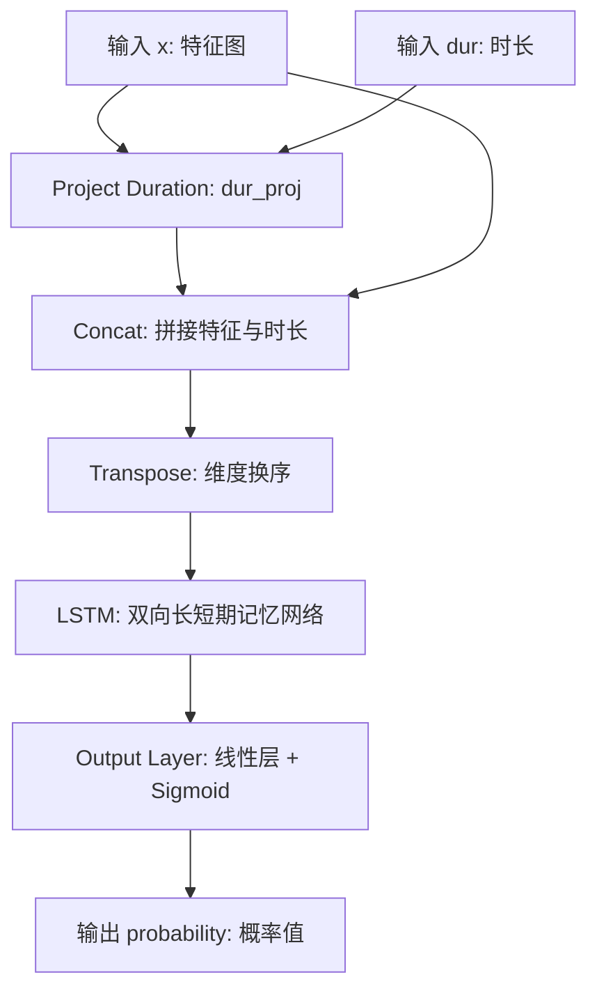
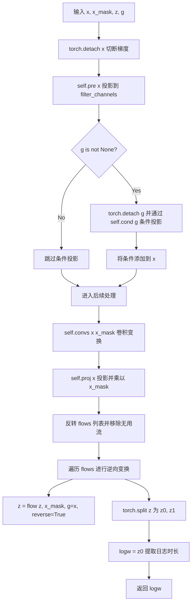
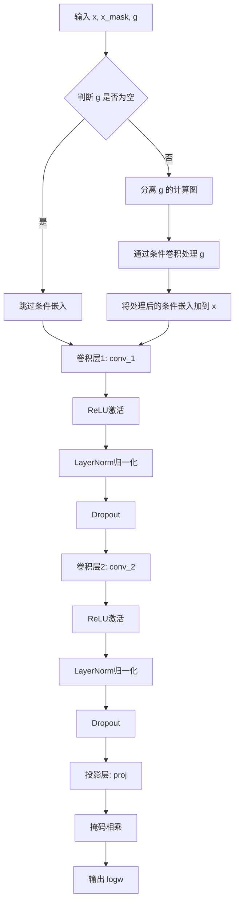
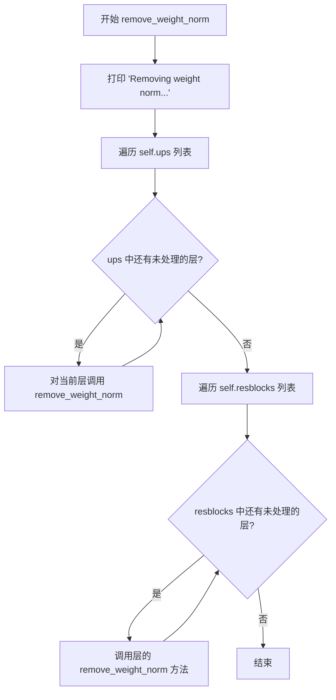
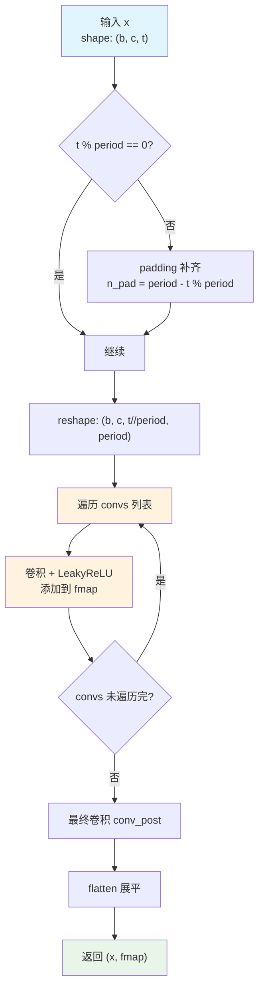
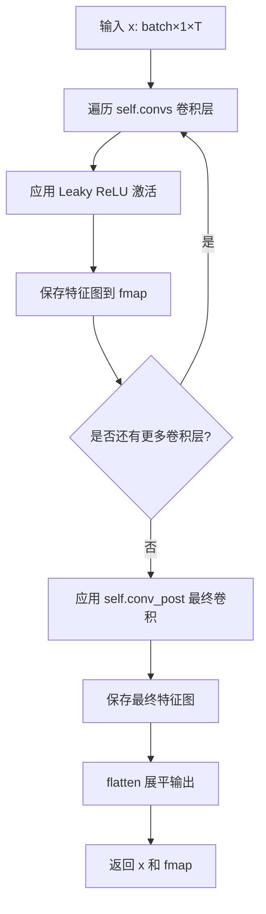
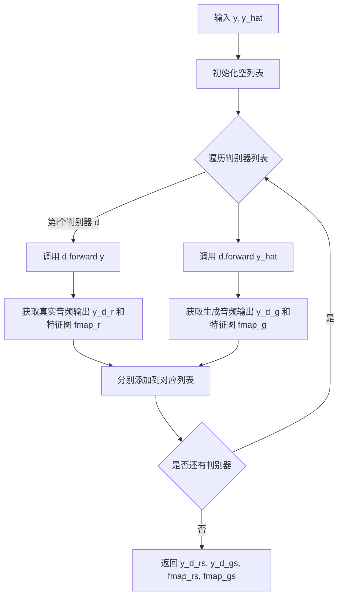

# `Bert-VITS2\onnx_modules\V230\models_onnx.py` 详细设计文档

该文件实现了VITS（Variational Inference with adversarial learning for end-to-end Text-to-Speech）文本转语音模型的核心神经网络架构。它集成了文本编码器、时长预测器、基于流的后验编码器、GAN判别器（包括多周期和多尺度判别器）以及用于声码化的生成器，构建了一个端到端的语音合成系统。

## 整体流程

```mermaid
graph TD
    subgraph Input [输入]
        Text[文本/音素 x]
        Sid[说话人ID sid]
        Bert[BERT embeddings]
    end
    Text --> Encoder[TextEncoder]
    Encoder --> DurPred[Duration Predictor / SDP]
    Encoder --> Stats[均值 m_p, 方差 logs_p]
    DurPred --> Align[长度对齐/注意力掩码]
    Stats --> Align
    Align --> Flow[Normalizing Flow (Transformer/Residual)]
    Flow --> LatentZ[潜在变量 z]
    LatentZ --> Decoder[Generator (Vocoder)]
    Decoder --> Waveform[音频波形 y_hat]
    subgraph Discriminators [判别器训练]
        Waveform --> MPD[MultiPeriodDiscriminator]
        Waveform --> MSD[MultiScaleDiscriminator / WavLM]
    end
```

## 类结构

```
torch.nn.Module (基类)
├── DurationDiscriminator (VITS2时长判别)
├── TransformerCouplingBlock (Transformer流层)
├── StochasticDurationPredictor (随机时长预测)
├── DurationPredictor (确定性时长预测)
├── Bottleneck (MLP瓶颈层)
├── Block (Transformer Block)
├── MLP (多层感知机)
├── TextEncoder (文本编码器)
├── ResidualCouplingBlock (残差耦合块)
├── PosteriorEncoder (后验编码器)
├── Generator (声码器生成器)
│   └── Conv1d, ConvTranspose1d, ResBlock
├── DiscriminatorP (周期判别器)
├── DiscriminatorS (尺度判别器)
├── MultiPeriodDiscriminator (多周期判别器)
├── WavLMDiscriminator (WavLM特征判别器)
├── ReferenceEncoder (参考编码器)
└── SynthesizerTrn (主合成模型集成类)
```

## 全局变量及字段


### `symbols`
    
文本符号表，包含所有可用的字符索引

类型：`list[int]`
    


### `num_tones`
    
声调符号数量，用于多音调语言处理

类型：`int`
    


### `num_languages`
    
支持的语言数量，用于多语言模型

类型：`int`
    


### `init_weights`
    
权重初始化函数，用于卷积层权重初始化

类型：`function`
    


### `get_padding`
    
计算卷积填充大小的辅助函数

类型：`function`
    


### `sequence_mask`
    
生成序列掩码的函数，用于变长序列处理

类型：`function`
    


### `generate_path`
    
生成注意力路径的函数，用于对齐时长和音频

类型：`function`
    


### `DurationDiscriminator.in_channels`
    
输入特征通道数

类型：`int`
    


### `DurationDiscriminator.filter_channels`
    
卷积滤波通道数

类型：`int`
    


### `DurationDiscriminator.kernel_size`
    
卷积核大小

类型：`int`
    


### `DurationDiscriminator.p_dropout`
    
Dropout概率

类型：`float`
    


### `DurationDiscriminator.gin_channels`
    
说话人条件通道数

类型：`int`
    


### `DurationDiscriminator.conv_1`
    
第一层一维卷积

类型：`nn.Conv1d`
    


### `DurationDiscriminator.conv_2`
    
第二层一维卷积

类型：`nn.Conv1d`
    


### `DurationDiscriminator.LSTM`
    
双向LSTM层用于时序建模

类型：`nn.LSTM`
    


### `DurationDiscriminator.output_layer`
    
输出概率层，包含Sigmoid激活

类型：`nn.Sequential`
    


### `TransformerCouplingBlock.channels`
    
输入输出通道数

类型：`int`
    


### `TransformerCouplingBlock.hidden_channels`
    
隐藏层通道数

类型：`int`
    


### `TransformerCouplingBlock.n_flows`
    
流层数量

类型：`int`
    


### `TransformerCouplingBlock.flows`
    
标准化流模块列表

类型：`nn.ModuleList`
    


### `StochasticDurationPredictor.in_channels`
    
输入通道数

类型：`int`
    


### `StochasticDurationPredictor.filter_channels`
    
滤波通道数

类型：`int`
    


### `StochasticDurationPredictor.kernel_size`
    
卷积核大小

类型：`int`
    


### `StochasticDurationPredictor.p_dropout`
    
Dropout概率

类型：`float`
    


### `StochasticDurationPredictor.flows`
    
流操作模块列表

类型：`nn.ModuleList`
    


### `StochasticDurationPredictor.convs`
    
DDSConv卷积模块

类型：`modules.DDSConv`
    


### `StochasticDurationPredictor.post_flows`
    
后处理流模块列表

类型：`nn.ModuleList`
    


### `DurationPredictor.in_channels`
    
输入通道数

类型：`int`
    


### `DurationPredictor.filter_channels`
    
滤波通道数

类型：`int`
    


### `DurationPredictor.kernel_size`
    
卷积核大小

类型：`int`
    


### `DurationPredictor.p_dropout`
    
Dropout概率

类型：`float`
    


### `DurationPredictor.conv_1`
    
第一层卷积

类型：`nn.Conv1d`
    


### `DurationPredictor.conv_2`
    
第二层卷积

类型：`nn.Conv1d`
    


### `DurationPredictor.norm_1`
    
第一层归一化

类型：`modules.LayerNorm`
    


### `DurationPredictor.norm_2`
    
第二层归一化

类型：`modules.LayerNorm`
    


### `DurationPredictor.proj`
    
输出投影层

类型：`nn.Conv1d`
    


### `TextEncoder.n_vocab`
    
词汇表大小

类型：`int`
    


### `TextEncoder.hidden_channels`
    
隐藏层通道数

类型：`int`
    


### `TextEncoder.emb`
    
文本符号嵌入层

类型：`nn.Embedding`
    


### `TextEncoder.tone_emb`
    
声调嵌入层

类型：`nn.Embedding`
    


### `TextEncoder.language_emb`
    
语言嵌入层

类型：`nn.Embedding`
    


### `TextEncoder.bert_proj`
    
BERT特征投影层

类型：`nn.Conv1d`
    


### `TextEncoder.ja_bert_proj`
    
日语BERT特征投影层

类型：`nn.Conv1d`
    


### `TextEncoder.en_bert_proj`
    
英语BERT特征投影层

类型：`nn.Conv1d`
    


### `TextEncoder.encoder`
    
Transformer编码器

类型：`attentions_onnx.Encoder`
    


### `TextEncoder.proj`
    
输出统计量投影层

类型：`nn.Conv1d`
    


### `PosteriorEncoder.in_channels`
    
输入通道数

类型：`int`
    


### `PosteriorEncoder.out_channels`
    
输出通道数

类型：`int`
    


### `PosteriorEncoder.hidden_channels`
    
隐藏层通道数

类型：`int`
    


### `PosteriorEncoder.pre`
    
输入投影卷积

类型：`nn.Conv1d`
    


### `PosteriorEncoder.enc`
    
WaveNet风格编码器

类型：`modules.WN`
    


### `PosteriorEncoder.proj`
    
输出统计量投影

类型：`nn.Conv1d`
    


### `Generator.num_kernels`
    
残差块数量

类型：`int`
    


### `Generator.num_upsamples`
    
上采样次数

类型：`int`
    


### `Generator.conv_pre`
    
初始卷积层

类型：`Conv1d`
    


### `Generator.ups`
    
上采样转置卷积列表

类型：`nn.ModuleList`
    


### `Generator.resblocks`
    
残差块列表

类型：`nn.ModuleList`
    


### `Generator.conv_post`
    
最终输出卷积

类型：`Conv1d`
    


### `DiscriminatorP.period`
    
周期数

类型：`int`
    


### `DiscriminatorP.convs`
    
2D卷积层列表

类型：`nn.ModuleList`
    


### `DiscriminatorP.conv_post`
    
输出卷积层

类型：`Conv2d`
    


### `DiscriminatorS.convs`
    
1D卷积层列表

类型：`nn.ModuleList`
    


### `DiscriminatorS.conv_post`
    
输出卷积层

类型：`Conv1d`
    


### `MultiPeriodDiscriminator.discriminators`
    
判别器模块列表

类型：`nn.ModuleList`
    


### `SynthesizerTrn.enc_p`
    
文本编码器

类型：`TextEncoder`
    


### `SynthesizerTrn.dec`
    
声学生成器

类型：`Generator`
    


### `SynthesizerTrn.enc_q`
    
后验编码器

类型：`PosteriorEncoder`
    


### `SynthesizerTrn.flow`
    
标准化流模块

类型：`TransformerCouplingBlock or ResidualCouplingBlock`
    


### `SynthesizerTrn.sdp`
    
随机时长预测器

类型：`StochasticDurationPredictor`
    


### `SynthesizerTrn.dp`
    
确定性时长预测器

类型：`DurationPredictor`
    


### `SynthesizerTrn.emb_g`
    
说话人嵌入层

类型：`nn.Embedding`
    


### `SynthesizerTrn.ref_enc`
    
参考编码器用于无条件生成

类型：`ReferenceEncoder`
    
    

## 全局函数及方法


### `DurationDiscriminator.forward_probability`

该方法是 VITS（VITS2）模型中 `DurationDiscriminator` 的核心组件，用于计算给定特征序列与时长序列之间的匹配概率。它通过将时长信息投影到与特征相同的空间，与特征进行拼接，随后利用双向 LSTM 捕获时序上下文，最终输出一个概率值（0到1之间），用于判断该时长是“真实”还是“伪造”。

参数：

- `x`：`torch.Tensor`，判别器的特征输入，形状为 `[batch, channels, time]`。通常来自判别器卷积层的输出。
- `dur`：`torch.Tensor`，待评估的时长张量，形状为 `[batch, 1, time]`。可以是真实的时长（`dur_r`）或预测的时长（`dur_hat`）。

返回值：`torch.Tensor`，概率分数张量，形状为 `[batch, time, 1]`。数值范围在 0 到 1 之间，表示时序中每个时间步长对应的概率。

#### 流程图



#### 带注释源码

```python
def forward_probability(self, x, dur):
    # 1. 时长投影 (Duration Projection)
    # 将输入的时长标量 (shape: [B, 1, T]) 通过卷积核大小为1的卷积层
    # 投影到与特征 x 相同的维度空间 (filter_channels)
    dur = self.dur_proj(dur)
    
    # 2. 特征融合 (Feature Fusion)
    # 将投影后的时长特征 dur 与主特征 x 在通道维度 (dim=1) 上拼接
    # 此时 x shape: [B, in_channels + filter_channels, T] -> [B, 2*filter_channels, T]
    x = torch.cat([x, dur], dim=1)
    
    # 3. 维度重排 (Transposition)
    # 将张量从 [B, C, T] 转换为 [B, T, C]，以符合 PyTorch LSTM 的输入要求 (Sequence first)
    x = x.transpose(1, 2)
    
    # 4. 时序建模 (Temporal Modeling)
    # 使用双向 LSTM 处理序列，捕获前后文信息
    # 输入: [B, T, 2*filter_channels], 输出: [B, T, 2*filter_channels]
    x, _ = self.LSTM(x)
    
    # 5. 概率输出 (Probability Output)
    # 通过全连接层将特征维度映射到 1维，并使用 Sigmoid 激活函数将输出限制在 (0,1) 区间
    # 输出 shape: [B, T, 1]
    output_prob = self.output_layer(x)
    return output_prob
```


### `DurationDiscriminator.forward`

该方法是 VITS2 模型中时长判别器的核心前向传播函数，通过卷积神经网络和双向 LSTM 对真实时长（dur_r）和预测时长（dur_hat）进行判别，输出两个概率值用于对抗训练中的 Generator 优化。

参数：

- `x`：`torch.Tensor`，输入特征张量，形状为 `[B, in_channels, T]`，来自文本编码器或 Speaker Encoder 的特征表示
- `x_mask`：`torch.Tensor`，输入掩码张量，形状为 `[1, T]` 或 `[B, 1, T]`，用于标记有效时间步
- `dur_r`：`torch.Tensor`，真实时长张量，形状为 `[B, 1, T]`，从 Ground Truth 计算得到
- `dur_hat`：`torch.Tensor`，预测时长张量，形状为 `[B, 1, T]`，来自 DurationPredictor 或 StochasticDurationPredictor 的输出
- `g`：`torch.Tensor`，可选条件输入，形状为 `[B, gin_channels, 1]`，说话人嵌入或其他条件向量

返回值：`List[torch.Tensor]`，包含两个概率张量的列表，每个元素的形状为 `[B, T, 1]`（LSTM 输出后未 flatten），分别对应真实时长和预测时长的判别概率

#### 流程图

```mermaid
flowchart TD
    A[输入 x, x_mask, dur_r, dur_hat, g] --> B{检查 g 是否存在}
    B -->|是| C[梯度分离 g: torch.detach]
    B -->|否| D[跳过条件处理]
    C --> E[条件卷积: x = x + self.cond(g)]
    D --> F[卷积块1: conv_1 + ReLU + LayerNorm + Dropout]
    E --> F
    F --> G[卷积块2: conv_2 + ReLU + LayerNorm + Dropout]
    G --> H[遍历 dur in [dur_r, dur_hat]]
    H --> I[调用 forward_probability]
    I --> J[拼接输出概率到列表]
    J --> K[返回 output_probs]
    
    subgraph forward_probability
        L[输入 x, dur] --> M[dur_proj: dur = self.dur_proj(dur)]
        M --> N[拼接: x = torch.cat[x, dur]]
        N --> O[转置: x = x.transpose1, 2]
        O --> P[LSTM: x, _ = self.LSTMx]
        P --> Q[输出概率: output_prob = self.output_layerx]
        Q --> R[返回 output_prob]
    end
    
    I --> R
```

#### 带注释源码

```python
def forward(self, x, x_mask, dur_r, dur_hat, g=None):
    # 1. 梯度分离：切断 x 的计算图，防止对主模型产生梯度影响
    #    这在对抗训练中很重要，判别器只用于判断时长真实性
    x = torch.detach(x)
    
    # 2. 条件处理：如果提供了说话人嵌入 g，则进行条件融合
    if g is not None:
        # 同样需要梯度分离，防止 g 的梯度回传
        g = torch.detach(g)
        # 条件卷积：将说话人信息通过 1x1 卷积融合到输入特征
        x = x + self.cond(g)
    
    # 3. 第一个卷积块：提取特征表示
    #    输入: [B, in_channels, T] * [1, 1, T] -> [B, in_channels, T]
    #    输出: [B, filter_channels, T]
    x = self.conv_1(x * x_mask)  # 乘以掩码将无效位置置零
    x = torch.relu(x)            # ReLU 激活
    x = self.norm_1(x)           # LayerNorm 在通道维度上归一化
    x = self.drop(x)             # Dropout 防止过拟合
    
    # 4. 第二个卷积块：进一步特征提取
    #    输入: [B, filter_channels, T]
    #    输出: [B, filter_channels, T]
    x = self.conv_2(x * x_mask)
    x = torch.relu(x)
    x = self.norm_2(x)
    x = self.drop(x)
    
    # 5. 时长判别：对真实时长和预测时长分别计算判别概率
    output_probs = []
    for dur in [dur_r, dur_hat]:
        # dur_r: 真实时长 (Ground Truth)
        # dur_hat: 预测时长 (来自 DurationPredictor)
        output_prob = self.forward_probability(x, dur)
        output_probs.append(output_prob)
    
    # 6. 返回包含两个概率的列表
    #    output_probs[0]: 真实时长的判别概率
    #    output_prob[1]: 预测时长的判别概率
    return output_probs


def forward_probability(self, x, dur):
    """
    辅助方法：计算给定特征和时长值的判别概率
    
    参数:
        x: 来自卷积块的特征，形状 [B, filter_channels, T]
        dur: 时长张量，形状 [B, 1, T]
    
    返回:
        output_prob: 概率值，形状 [B, T, 1]
    """
    # 1. 时长投影：将 1 通道扩展到 filter_channels 通道
    #    输入: [B, 1, T] -> 输出: [B, filter_channels, T]
    dur = self.dur_proj(dur)
    
    # 2. 特征与时长拼接：在通道维度上拼接
    #    输入: x [B, filter_channels, T], dur [B, filter_channels, T]
    #    输出: [B, 2*filter_channels, T]
    x = torch.cat([x, dur], dim=1)
    
    # 3. 维度变换：为 LSTM 准备序列格式
    #    输入: [B, 2*filter_channels, T] -> 输出: [B, T, 2*filter_channels]
    x = x.transpose(1, 2)
    
    # 4. 双向 LSTM 处理：捕获时序上下文信息
    #    输入: [B, T, 2*filter_channels]
    #    输出: [B, T, 2*filter_channels] (双向拼接后为 2*filter_channels)
    x, _ = self.LSTM(x)
    
    # 5. 输出概率：Sigmoid 激活函数输出 0-1 之间的概率值
    #    输入: [B, T, 2*filter_channels] -> 输出: [B, T, 1]
    output_prob = self.output_layer(x)
    
    return output_prob
```


### `TransformerCouplingBlock.forward`

该方法实现了标准化流（Normalizing Flow）的前向或逆向变换，通过依次遍历内部注册的流模块（`TransformerCouplingLayer` 和 `Flip` 层）对输入数据进行概率密度变换，支持在训练时进行前向流变换和推理时进行逆向采样。

参数：

-  `x`：`torch.Tensor`，输入的潜在表示张量，形状为 `[B, channels, T]`，其中 B 为批量大小，channels 为通道数，T 为时间步长
-  `x_mask`：`torch.Tensor`，用于掩盖填充位置的二进制掩码，形状为 `[1, 1, T]`，与输入 x 对应，用于标识有效时间步
-  `g`：`torch.Tensor` 或 `None`，说话人条件嵌入向量，形状为 `[B, gin_channels, 1]`，用于条件化流变换过程，可为空
-  `reverse`：`bool`，变换方向标志，`True` 表示逆向变换（推理/采样模式），`False` 表示前向变换（训练/密度估计模式）

返回值：`torch.Tensor`，变换后的潜在表示张量，形状与输入 `x` 相同 `[B, channels, T]`

#### 流程图

```mermaid
flowchart TD
    A[开始 forward] --> B{reverse == True?}
    B -- 是 --> C[reversed_flows = reversed(self.flows)]
    B -- 否 --> D[flows = self.flows]
    C --> E[迭代 reversed_flows]
    D --> F[迭代 flows]
    E --> G[flow(x, x_mask, g=g, reverse=reverse)]
    F --> G
    G --> H[更新 x]
    H --> I{还有更多 flow?}
    I -- 是 --> G
    I -- 否 --> J[返回 x]
```

#### 带注释源码

```python
def forward(self, x, x_mask, g=None, reverse=True):
    """
    执行标准化流的前向或逆向变换
    
    参数:
        x: 输入张量 [B, channels, T]
        x_mask: 掩码张量 [1, 1, T]
        g: 说话人条件嵌入 [B, gin_channels, 1] 或 None
        reverse: True 表示逆向变换（采样），False 表示前向变换（训练）
    
    返回:
        变换后的张量 [B, channels, T]
    """
    # 判断变换方向：reverse=True 为逆向（推理），reverse=False 为前向（训练）
    if not reverse:
        # 训练模式：按原始顺序遍历流模块，执行前向变换
        # 流模块列表结构：[CouplingLayer1, Flip, CouplingLayer2, Flip, ...]
        for flow in self.flows:
            # 执行单个流的变换，返回变换后的 x 和日志行列式（此处忽略）
            x, _ = flow(x, x_mask, g=g, reverse=reverse)
    else:
        # 推理/采样模式：按反向顺序遍历流模块，执行逆向变换
        # 逆向遍历确保先执行最后添加的变换层，模拟概率密度的逆推过程
        for flow in reversed(self.flows):
            # 执行逆向变换，只返回变换后的 x（无需日志行列式）
            x = flow(x, x_mask, g=g, reverse=reverse)
    # 返回变换后的潜在表示
    return x
```


### `StochasticDurationPredictor.forward`

该函数是 VITS2 语音合成模型中随机时长预测器的核心前向传播方法，通过流模型（Flow-based Model）对潜在变量 `z` 进行逆向变换，预测音素的日志时长权重 `logw`，实现时长分布的随机采样。

参数：

- `x`：`torch.Tensor`，输入特征张量，形状为 [batch, in_channels, time]，通常来自文本编码器的输出
- `x_mask`：`torch.Tensor`，时间维度掩码张量，形状为 [batch, 1, time]，用于标识有效时间步
- `z`：`torch.Tensor`，潜在变量张量，形状为 [batch, 2, time]，作为流模型的输入噪声
- `g`：`torch.Tensor` 或 `None`，说话人条件向量，形状为 [batch, gin_channels, 1]，可选

返回值：`torch.Tensor`，日志时长权重 `logw`，形状为 [batch, 1, time]

#### 流程图



#### 带注释源码

```python
def forward(self, x, x_mask, z, g=None):
    # 1. 切断输入 x 的梯度，防止反向传播破坏文本编码器
    x = torch.detach(x)
    
    # 2. 将输入投影到 filter_channels 维度
    x = self.pre(x)
    
    # 3. 如果存在说话人条件向量 g，则添加条件信息
    if g is not None:
        # 切断 g 的梯度
        g = torch.detach(g)
        # 将说话人条件添加到输入特征
        x = x + self.cond(g)
    
    # 4. 通过 DDSConv 进行卷积变换，捕获局部上下文
    x = self.convs(x, x_mask)
    
    # 5. 投影并应用掩码，过滤无效时间步
    x = self.proj(x) * x_mask

    # 6. 获取流模块列表并反转（用于逆向变换）
    # 移除末尾两个流（通常是无效的流）
    flows = list(reversed(self.flows))
    flows = flows[:-2] + [flows[-1]]  # remove a useless vflow
    
    # 7. 遍历所有流模块，进行逆向变换
    # 将 x 作为条件传递给每个流模块
    for flow in flows:
        z = flow(z, x_mask, g=x, reverse=True)
    
    # 8. 将变换后的 z 沿通道维度分割为两部分
    z0, z1 = torch.split(z, [1, 1], 1)
    
    # 9. 取第一个分割作为日志时长权重
    logw = z0
    
    # 10. 返回预测的日志时长
    return logw
```


### `DurationPredictor.forward`

该方法为VITS2语音合成模型中的时长预测器，执行单层卷积神经网络前向传播，接收文本编码特征、掩码和说话人嵌入，输出每个音素的预测时长对数。

参数：

- `x`：`torch.Tensor`，文本编码特征，形状为 `[batch, in_channels, time_steps]`
- `x_mask`：`torch.Tensor`，时间步掩码，用于遮蔽填充区域，形状为 `[1, 1, time_steps]`
- `g`：`torch.Tensor` 或 `None`，说话人嵌入向量，形状为 `[batch, gin_channels, 1]`，可选参数

返回值：`torch.Tensor`，预测的时长对数，形状为 `[batch, 1, time_steps]`

#### 流程图



#### 带注释源码

```python
def forward(self, x, x_mask, g=None):
    """
    DurationPredictor 的前向传播方法
    
    参数:
        x: 输入特征 [batch, in_channels, time_steps]
        x_mask: 时间步掩码 [1, 1, time_steps]
        g: 说话人嵌入，可选 [batch, gin_channels, 1]
    
    返回:
        预测时长对数 [batch, 1, time_steps]
    """
    # 分离输入x的计算图，防止梯度回传到此之前的编码器
    x = torch.detach(x)
    
    # 如果提供了说话人嵌入g，则将其添加到输入特征中
    if g is not None:
        # 分离条件嵌入的计算图，用于训练时的梯度阻断
        g = torch.detach(g)
        # 通过1x1卷积将说话人嵌入投影到与输入相同的通道数
        x = x + self.cond(g)
    
    # 第一个卷积块：卷积 -> 激活 -> 归一化 -> Dropout
    x = self.conv_1(x * x_mask)  # 卷积提取特征，与掩码相乘遮蔽填充区域
    x = torch.relu(x)            # ReLU激活增加非线性
    x = self.norm_1(x)           # LayerNorm归一化稳定训练
    x = self.drop(x)             # Dropout防止过拟合
    
    # 第二个卷积块：卷积 -> 激活 -> 归一化 -> Dropout
    x = self.conv_2(x * x_mask)  # 进一步提取特征
    x = torch.relu(x)
    x = self.norm_2(x)
    x = self.drop(x)
    
    # 投影到1维输出（时长预测）
    x = self.proj(x * x_mask)     # 将特征通道投影到1，输出预测值
    
    # 再次乘以掩码，确保填充区域为0
    return x * x_mask
```


### `TextEncoder.forward`

该方法将文本token序列（包括音调、语言和多种BERT嵌入）编码到潜在空间，返回编码后的序列表示、均值、对数方差以及对应的掩码，用于后续的语音合成流程。

参数：

- `x`：`torch.LongTensor`，输入的文本token ID序列，形状为 [batch, seq_len]
- `x_lengths`：`torch.LongTensor`，输入序列的实际长度，用于生成掩码
- `tone`：`torch.LongTensor`，音调特征序列，与x形状相同，提供韵律信息
- `language`：`torch.LongTensor`，语言特征序列，与x形状相同，提供语言信息
- `bert`：`torch.Tensor`，通用BERT嵌入，形状为 [seq_len, 1024]
- `ja_bert`：`torch.Tensor`，日语BERT嵌入，形状为 [seq_len, 1024]
- `en_bert`：`torch.Tensor`，英语BERT嵌入，形状为 [seq_len, 1024]
- `g`：`torch.Tensor` 或 `None`，全局条件向量（说话人嵌入），形状为 [batch, gin_channels, 1]，可选参数

返回值：

- `x`：`torch.Tensor`，编码器输出表示，形状为 [batch, hidden_channels, seq_len]
- `m`：`torch.Tensor`，均值（mean）输出，形状为 [batch, out_channels, seq_len]
- `logs`：`torch.Tensor`，对数方差（log variance）输出，形状为 [batch, out_channels, seq_len]
- `x_mask`：`torch.Tensor`，序列掩码，形状为 [1, batch, seq_len]

#### 流程图

```mermaid
flowchart TD
    A[输入: x, x_lengths, tone, language, bert, ja_bert, en_bert, g] --> B[生成初始掩码 x_mask]
    B --> C[BERT嵌入投影]
    C --> D[bert_emb: 1024 → hidden_channels]
    C --> E[ja_bert_emb: 1024 → hidden_channels]
    C --> F[en_bert_emb: 1024 → hidden_channels]
    D --> G[文本嵌入融合]
    E --> G
    F --> G
    G --> H[emb + tone_emb + language_emb + bert_emb + ja_bert_emb + en_bert_emb]
    H --> I[乘以 sqrt(hidden_channels) 进行缩放]
    I --> J[维度变换: batch × seq_len × hidden_channels → batch × hidden_channels × seq_len]
    J --> K[Encoder编码: encoder(x * x_mask, x_mask, g)]
    K --> L[投影: proj(x) * x_mask]
    L --> M[分割stats得到m和logs]
    M --> N[输出: x, m, logs, x_mask]
```

#### 带注释源码

```python
def forward(self, x, x_lengths, tone, language, bert, ja_bert, en_bert, g=None):
    """
    TextEncoder的前向传播方法，将文本序列编码为潜在空间表示
    
    参数:
        x: 输入的token ID序列 [batch, seq_len]
        x_lengths: 序列实际长度 [batch]
        tone: 音调特征 [batch, seq_len]
        language: 语言特征 [batch, seq_len]
        bert: 通用BERT嵌入 [seq_len, 1024]
        ja_bert: 日语BERT嵌入 [seq_len, 1024]
        en_bert: 英语BERT嵌入 [seq_len, 1024]
        g: 全局条件(说话人嵌入) [batch, gin_channels, 1], 可选
    
    返回:
        x: 编码器输出 [batch, hidden_channels, seq_len]
        m: 均值 [batch, out_channels, seq_len]
        logs: 对数方差 [batch, out_channels, seq_len]
        x_mask: 掩码 [1, batch, seq_len]
    """
    # 第一步：创建初始掩码，形状与x相同，在batch维度上增加一个维度
    # x_mask用于在变长序列中标记有效位置，1表示有效，0表示填充
    x_mask = torch.ones_like(x).unsqueeze(0)
    
    # 第二步：对BERT嵌入进行投影，将1024维映射到hidden_channels维
    # bert, ja_bert, en_bert的原始形状为[seq_len, 1024]，需要先转置再增加batch维度
    bert_emb = self.bert_proj(bert.transpose(0, 1).unsqueeze(0)).transpose(1, 2)
    # bert_emb形状: [1, hidden_channels, seq_len]
    
    ja_bert_emb = self.ja_bert_proj(ja_bert.transpose(0, 1).unsqueeze(0)).transpose(
        1, 2
    )
    # ja_bert_emb形状: [1, hidden_channels, seq_len]
    
    en_bert_emb = self.en_bert_proj(en_bert.transpose(0, 1).unsqueeze(0)).transpose(
        1, 2
    )
    # en_bert_emb形状: [1, hidden_channels, seq_len]
    
    # 第三步：融合所有嵌入表示
    # - self.emb(x): 文本token嵌入 [batch, seq_len, hidden_channels]
    # - self.tone_emb(tone): 音调嵌入 [batch, seq_len, hidden_channels]
    # - self.language_emb(language): 语言嵌入 [batch, seq_len, hidden_channels]
    # - bert_emb等: BERT嵌入，需要squeeze去掉batch维度后相加
    x = (
        self.emb(x)
        + self.tone_emb(tone)
        + self.language_emb(language)
        + bert_emb.squeeze(0)  # 移除batch维度以进行广播相加
        + ja_bert_emb.squeeze(0)
        + en_bert_emb.squeeze(0)
    ) * math.sqrt(
        self.hidden_channels
    )  # 乘以sqrt(hidden_channels)进行缩放，保持方差归一化
    
    # x形状: [batch, seq_len, hidden_channels]
    
    # 第四步：维度变换，将序列维度和通道维度交换
    # 变为 [batch, hidden_channels, seq_len]，符合Conv1d的输入格式
    x = torch.transpose(x, 1, -1)
    
    # 第五步：将掩码转换为与x相同的数据类型
    x_mask = x_mask.to(x.dtype)
    
    # 第六步：经过Transformer Encoder编码
    # x * x_mask 将填充位置置零，g是可选的说话人条件
    x = self.encoder(x * x_mask, x_mask, g=g)
    
    # 第七步：投影到输出通道并应用掩码
    # proj将hidden_channels映射到out_channels * 2（均值和方差）
    stats = self.proj(x) * x_mask
    
    # 第八步：沿通道维度分割，得到均值和方差
    # m: 均值, logs: 对数方差（使用log而非直接使用方差以保持数值稳定）
    m, logs = torch.split(stats, self.out_channels, dim=1)
    
    # 返回编码后的表示、均值、对数方差和掩码
    return x, m, logs, x_mask
```


### `PosteriorEncoder.forward`

该方法实现了后验编码器的前向传播，将梅尔频谱（mel-spectrogram）编码为潜在变量z，同时输出均值m和对数标准差logs，用于变分推断中的重参数化技巧。

参数：

- `x`：`torch.Tensor`，输入的梅尔频谱张量，形状为 [batch, in_channels, time_steps]
- `x_lengths`：`torch.Tensor`，输入序列的实际长度，用于生成掩码
- `g`：`torch.Tensor` 或 `None`，说话人嵌入向量（speaker embedding），用于条件生成，可选

返回值：`Tuple[torch.Tensor, torch.Tensor, torch.Tensor, torch.Tensor]`，返回一个包含四个元素的元组：

- `z`：`torch.Tensor`，编码后的潜在变量，形状为 [batch, out_channels, time_steps]
- `m`：`torch.Tensor`，均值向量，形状为 [batch, out_channels, time_steps]
- `logs`：`torch.Tensor`，对数标准差向量，形状为 [batch, out_channels, time_steps]
- `x_mask`：`torch.Tensor`，时间步掩码，形状为 [batch, 1, time_steps]

#### 流程图

```mermaid
flowchart TD
    A[输入 x, x_lengths, g] --> B[生成序列掩码 x_mask]
    B --> C[self.pre: 通道数变换]
    C --> D[应用 x_mask 掩码]
    D --> E[self.enc: WN 编码器处理]
    E --> F[self.proj: 投影到统计量]
    F --> G[应用 x_mask 掩码]
    G --> H[沿通道维度分割 stats]
    H --> I[均值 m, 对数标准差 logs]
    I --> J[重参数化采样: z = m + randn * exp(logs)]
    J --> K[应用 x_mask 掩码]
    K --> L[返回 z, m, logs, x_mask]
```

#### 带注释源码

```python
def forward(self, x, x_lengths, g=None):
    # 根据实际序列长度生成二进制掩码
    # commons.sequence_mask 返回 [time_steps] 的掩码
    # unsqueeze(1) 扩展为 [1, 1, time_steps] 便于后续广播
    x_mask = torch.unsqueeze(commons.sequence_mask(x_lengths, x.size(2)), 1).to(
        x.dtype
    )
    
    # 第一次卷积变换：将输入通道映射到隐藏通道
    x = self.pre(x) * x_mask
    
    # WN 编码器：包含多层膨胀卷积的条件神经网络
    x = self.enc(x, x_mask, g=g)
    
    # 投影层：将隐藏维度映射到输出维度的两倍（均值+对数标准差）
    stats = self.proj(x) * x_mask
    
    # 沿通道维度（dim=1）等分为两部分：均值 m 和对数标准差 logs
    m, logs = torch.split(stats, self.out_channels, dim=1)
    
    # 重参数化技巧：从 N(m, exp(logs)^2) 中采样
    # torch.randn_like(m) 生成与 m 形状相同的标准正态分布样本
    z = (m + torch.randn_like(m) * torch.exp(logs)) * x_mask
    
    # 返回：潜在变量 z、均值 m、对数标准差 logs、掩码 x_mask
    return z, m, logs, x_mask
```


### `Generator.forward(x, g)`

这是 VITS（Variational Inference with adversarial learning for end-to-end Text-to-Speech）声码器模型的核心上采样生成模块，负责将中间隐藏表示上采样至音频波形，通过转置卷积实现渐进式分辨率提升，并结合残差块进行细粒度音频细节重建。

参数：

- `x`：`torch.Tensor`，输入的张量，形状为 [batch, channels, time]，通常是从流模型输出的潜在表示
- `g`：`torch.Tensor`（可选），条件向量，形状为 [batch, gin_channels, 1]，用于说话人或其他条件信息的嵌入

返回值：`torch.Tensor`，生成的音频波形，形状为 [batch, 1, time']，其中 time' 是上采样后的时间步数

#### 流程图

```mermaid
graph TD
    A[输入 x: 潜在表示] --> B[conv_pre: 初始卷积]
    B --> C{是否有条件向量 g?}
    C -->|是| D[cond: 条件投影]
    C -->|否| E[跳过条件投影]
    D --> E
    E --> F[循环: num_upsamples 次]
    F --> G[leaky_relu 激活]
    G --> H[ups[i]: 转置卷积上采样]
    H --> I[嵌套循环: num_kernels 次]
    I --> J[resblocks: 残差块处理]
    J --> K[累加多个残差块输出]
    K --> L[取平均]
    L --> F
    F --> M[leaky_relu 激活]
    M --> N[conv_post: 最终卷积]
    N --> O[tanh 激活]
    O --> P[输出: 音频波形]
```

#### 带注释源码

```python
def forward(self, x, g=None):
    """
    上采样生成音频波形
    
    参数:
        x: 输入张量 [batch, channels, time]
        g: 条件向量 [batch, gin_channels, 1]，可选
    
    返回:
        生成的音频波形 [batch, 1, time']
    """
    # 步骤1: 初始卷积投影，将输入通道数转换为上采样初始通道数
    x = self.conv_pre(x)
    
    # 步骤2: 如果提供了条件向量 g，将其添加到输入中（条件注入）
    if g is not None:
        x = x + self.cond(g)
    
    # 步骤3: 渐进式上采样循环
    for i in range(self.num_upsamples):
        # LeakyReLU 激活函数，引入非线性同时避免梯度消失
        x = F.leaky_relu(x, modules.LRELU_SLOPE)
        
        # 转置卷积进行上采样，增加时间分辨率
        x = self.ups[i](x)
        
        # 步骤4: 多个残差块并行处理，结果取平均（Multi-Kernel 策略）
        xs = None
        for j in range(self.num_kernels):
            if xs is None:
                # 第一个残差块的结果
                xs = self.resblocks[i * self.num_kernels + j](x)
            else:
                # 累加后续残差块的结果
                xs += self.resblocks[i * self.num_kernels + j](x)
        
        # 多核平均：融合不同感受野的特征，提升生成质量
        x = xs / self.num_kernels
    
    # 步骤5: 最终处理
    x = F.leaky_relu(x)  # 最终激活
    x = self.conv_post(x)  # 投影到单通道（音频波形）
    x = torch.tanh(x)  # 归一化到 [-1, 1] 范围
    
    return x  # 返回生成的音频波形
```


### `Generator.remove_weight_norm`

该方法用于移除生成器（Generator）中权重归一化（Weight Normalization），以便在推理阶段提高运行效率并减少不必要的计算开销。

参数：该方法无显式参数（`self` 为隐式参数）。

返回值：`None`，无返回值，仅执行模型权重的原地修改。

#### 流程图



#### 带注释源码

```python
def remove_weight_norm(self):
    """
    移除权重归一化(Weight Normalization)以便推理。
    
    在训练阶段使用 weight_norm 可以帮助稳定训练过程，
    但在推理阶段移除 weight_norm 可以提高推理速度。
    该方法会遍历所有上采样层和残差块，移除其上的权重归一化。
    """
    # 打印日志信息，提示正在进行权重归一化移除操作
    print("Removing weight norm...")
    
    # 遍历上采样层列表 (self.ups)
    # self.ups 是 nn.ModuleList，包含多个 ConvTranspose1d 上采样卷积层
    # 这些层在初始化时通过 weight_norm 包装
    for layer in self.ups:
        # 调用 torch.nn.utils.remove_weight_norm 移除层的权重归一化
        # 该操作会修改 layer，将其从 weight_norm 包装中恢复到原始卷积层
        remove_weight_norm(layer)
    
    # 遍历残差块列表 (self.resblocks)
    # self.resblocks 是 nn.ModuleList，包含多个 ResidualBlock (ResBlock1 或 ResBlock2)
    # 每个残差块内部也包含权重归一化层
    for layer in self.resblocks:
        # 调用残差块自身的 remove_weight_norm 方法
        # 该方法定义在 ResBlock1 或 ResBlock2 类中
        layer.remove_weight_norm()
```


### `DiscriminatorP.forward(x)`

该方法是 VITS（Variational Inference with adversarial learning for end-to-end Text-to-Speech）模型中多周期判别器（Multi-Period Discriminator）的核心前向传播函数，负责将音频特征图转换为用于判别真假的特征向量，并输出中间层特征图以供对抗训练使用。

参数：

-  `x`：`torch.Tensor`，形状为 `(b, c, t)` 的 1D 音频特征张量，其中 b 为批量大小，c 为通道数，t 为时间步数

返回值：`(tuple)`，包含两个元素：

- 第一个元素：`torch.Tensor`，展平后的判别输出，形状为 `(b, -1)`
- 第二个元素：`list[torch.Tensor]`，各层卷积输出的特征图列表，用于特征匹配损失计算

#### 流程图



#### 带注释源码

```python
def forward(self, x):
    """
    DiscriminatorP 的前向传播
    将 1D 音频特征转换为 2D 表示（period 维度），
    通过多层卷积提取特征，最后输出用于判别真假的特征向量
    """
    fmap = []  # 用于存储每层的特征图，供特征匹配损失使用

    # === 1D to 2D 变换 ===
    # 获取输入形状
    b, c, t = x.shape  # batch, channels, time
    
    # 如果时间步不能被 period 整除，则在末尾 padding
    if t % self.period != 0:  # pad first
        n_pad = self.period - (t % self.period)  # 计算需要补齐的长度
        # 使用反射填充，保持边界连续性
        x = F.pad(x, (0, n_pad), "reflect")
        t = t + n_pad  # 更新时间步长度
    
    # 将 (b, c, t) reshape 为 (b, c, t//period, period)
    # 相当于将一维时间序列切分成多个 period 长度的片段
    x = x.view(b, c, t // self.period, self.period)

    # === 多层卷积特征提取 ===
    # 遍历 5 个卷积层，逐步提取更高级的特征
    for layer in self.convs:
        x = layer(x)           # 2D 卷积: (b, c, h, w) -> (b, c', h', w')
        x = F.leaky_relu(x, modules.LRELU_SLOPE)  # LeakyReLU 激活，斜率 0.2
        fmap.append(x)  # 保存中间特征图用于特征匹配
    
    # === 最终输出层 ===
    x = self.conv_post(x)  # 最终卷积输出单通道特征图
    fmap.append(x)  # 追加最后一层特征
    
    # === 展平输出 ===
    # 从 (b, 1, h, w) 展平为 (b, h*w)
    x = torch.flatten(x, 1, -1)

    return x, fmap
```


### `DiscriminatorS.forward`

该方法是 VITS 模型中用于判别音频样本的单尺度判别器的前向传播函数，通过多层卷积网络提取音频特征并输出判别结果和特征图，用于对抗训练。

参数：

- `x`：`torch.Tensor`，输入的音频张量，形状为 `(batch, 1, time_steps)`

返回值：

- `x`：`torch.Tensor`，展平后的判别输出，形状为 `(batch, -1)`
- `fmap`：`list`，包含每层卷积后的特征图列表，用于特征匹配损失计算

#### 流程图



#### 带注释源码

```
def forward(self, x):
    """
    单尺度判别器的前向传播
    
    参数:
        x: 输入音频张量, 形状为 [batch, 1, time_steps]
    
    返回:
        x: 展平后的判别输出
        fmap: 每层特征图列表
    """
    fmap = []  # 用于存储每层的特征图

    # 遍历所有卷积层
    for layer in self.convs:
        x = layer(x)  # 应用卷积
        x = F.leaky_relu(x, modules.LRELU_SLOPE)  # Leaky ReLU 激活
        fmap.append(x)  # 保存特征图
    
    # 最终输出层卷积
    x = self.conv_post(x)
    fmap.append(x)  # 保存最后一层特征图
    
    # 展平张量用于最终输出
    x = torch.flatten(x, 1, -1)

    return x, fmap
```


### `MultiPeriodDiscriminator.forward`

该方法实现了多周期判别器的前向传播，通过串联多个不同周期的判别器（1个切片判别器DiscriminatorS和5个周期判别器DiscriminatorP）对真实音频和生成音频进行判别，返回各判别器的输出和特征图，用于计算GAN对抗损失。

参数：

- `y`：`torch.Tensor`，真实音频张量，形状为 [batch, channels, time]
- `y_hat`：`torch.Tensor`，生成（预测）音频张量，形状为 [batch, channels, time]

返回值：`Tuple[List[torch.Tensor], List[torch.Tensor], List[List[torch.Tensor]], List[List[torch.Tensor]]]`，包含四个列表：
- `y_d_rs`：真实音频在各判别器上的输出
- `y_d_gs`：生成音频在各判别器上的输出
- `fmap_rs`：真实音频在各判别器中间层的特征图
- `fmap_gs`：生成音频在各判别器中间层的特征图

#### 流程图



#### 带注释源码

```
class MultiPeriodDiscriminator(torch.nn.Module):
    """多周期判别器，用于对不同周期的音频进行判别"""
    
    def __init__(self, use_spectral_norm=False):
        """
        初始化多周期判别器
        
        参数:
            use_spectral_norm: bool, 是否使用谱归一化，默认为False
        """
        super(MultiPeriodDiscriminator, self).__init__()
        # 定义周期列表，用于创建多个周期判别器
        periods = [2, 3, 5, 7, 11]
        
        # 创建切片判别器(DiscriminatorS)，处理整体音频
        discs = [DiscriminatorS(use_spectral_norm=use_spectral_norm)]
        
        # 为每个周期创建周期判别器(DiscriminatorP)
        discs = discs + [
            DiscriminatorP(i, use_spectral_norm=use_spectral_norm) for i in periods
        ]
        
        # 使用ModuleList管理所有判别器
        self.discriminators = nn.ModuleList(discs)

    def forward(self, y, y_hat):
        """
        前向传播，对真实音频和生成音频进行判别
        
        参数:
            y: torch.Tensor, 真实音频张量 [batch, channels, time]
            y_hat: torch.Tensor, 生成音频张量 [batch, channels, time]
        
        返回:
            tuple: (y_d_rs, y_d_gs, fmap_rs, fmap_gs)
                - y_d_rs: 真实音频在各判别器的输出列表
                - y_d_gs: 生成音频在各判别器的输出列表
                - fmap_rs: 真实音频在各判别器的特征图列表
                - fmap_gs: 生成音频在各判别器的特征图列表
        """
        # 初始化存储真实音频判别结果的列表
        y_d_rs = []
        # 初始化存储生成音频判别结果的列表
        y_d_gs = []
        # 初始化存储真实音频特征图的列表
        fmap_rs = []
        # 初始化存储生成音频特征图的列表
        fmap_gs = []
        
        # 遍历所有判别器
        for i, d in enumerate(self.discriminators):
            # 对真实音频进行判别，获取输出和特征图
            y_d_r, fmap_r = d(y)
            # 对生成音频进行判别，获取输出和特征图
            y_d_g, fmap_g = d(y_hat)
            
            # 添加真实音频的判别结果
            y_d_rs.append(y_d_r)
            # 添加生成音频的判别结果
            y_d_gs.append(y_d_g)
            # 添加真实音频的特征图
            fmap_rs.append(fmap_r)
            # 添加生成音频的特征图
            fmap_gs.append(fmap_g)

        # 返回四个列表：真实/生成音频的输出和特征图
        return y_d_rs, y_d_gs, fmap_rs, fmap_gs
```


### `SynthesizerTrn.export_onnx`

该方法用于将 VITS 语音合成模型的各个子模块（说话人嵌入、文本编码器、持续时间预测器、流模型、解码器）分别导出为 ONNX 格式文件，以便在非 PyTorch 环境（如 ONNX Runtime）中进行推理。方法内部会构建完整的推理图，并按顺序导出各组件的 ONNX 模型。

参数：

- `path`：`str`，导出 ONNX 模型文件的目录名称
- `max_len`：`int | None`，生成音频的最大长度限制，默认为 None
- `sdp_ratio`：`float`，随机持续时间预测器（StochasticDurationPredictor）的输出权重，取值范围 [0, 1]，默认为 0
- `y`：`Tensor | None`，参考音频张量，当模型使用参考编码器（而非说话人嵌入）时需要提供，默认为 None

返回值：`None`，方法不返回值，但会在 `onnx/{path}/` 目录下生成多个 ONNX 模型文件

#### 流程图

```mermaid
flowchart TD
    A[开始 export_onnx] --> B[初始化默认参数]
    B --> C[准备输入数据: x, tone, language, bert等]
    C --> D{是否有说话人嵌入?}
    D -->|是| E[计算说话人嵌入 g = emb_g(sid)]
    D -->|否| F[使用参考编码器计算 g = ref_enc(y)]
    E --> G[导出说话人嵌入 ONNX: path_emb.onnx]
    F --> G
    G --> H[执行文本编码器前向传播 enc_p]
    H --> I[导出文本编码器 ONNX: path_enc_p.onnx]
    I --> J[生成随机输入 zinput]
    J --> K[导出持续时间预测器 ONNX: path_sdp.onnx 和 path_dp.onnx]
    K --> L[计算持续时间 w 和注意力掩码 attn]
    L --> M[计算潜在表示 z_p]
    M --> N[导出流模型 ONNX: path_flow.onnx]
    N --> O[执行流模型前向传播 reverse=True]
    O --> P[截断 z_in = z * y_mask[:, :, :max_len]
    P --> Q[导出解码器 ONNX: path_dec.onnx]
    Q --> R[执行解码器前向生成音频 o]
    R --> S[结束]
```

#### 带注释源码

```python
def export_onnx(
    self,
    path,
    max_len=None,
    sdp_ratio=0,
    y=None,
):
    """
    导出 VITS 模型各组件为 ONNX 格式
    
    参数:
        path: 输出目录名称
        max_len: 最大输出长度限制
        sdp_ratio: SDP 预测权重比例
        y: 参考音频张量（用于参考编码器模式）
    """
    # 设置推理用噪声scale参数
    noise_scale = 0.667       # 潜在变量采样噪声比例
    length_scale = 1          # 音频长度缩放因子
    noise_scale_w = 0.8       # 持续时间预测噪声比例
    
    # 构建示例输入序列 (文本ID序列)
    x = (
        torch.LongTensor(
            [0, 97, 0, 8, 0, 78, 0, 8, 0, 76, 0, 37, 0, 40, 0, 97, 0, 8, 0, 23, 0, 8, 0, 74, 0, 26, 0, 104, 0]
        )
        .unsqueeze(0)
        .cpu()
    )
    # 初始化其他输入 (音调、语言、BERT嵌入等)
    tone = torch.zeros_like(x).cpu()
    language = torch.zeros_like(x).cpu()
    x_lengths = torch.LongTensor([x.shape[1]]).cpu()
    sid = torch.LongTensor([0]).cpu()  # 说话人ID
    bert = torch.randn(size=(x.shape[1], 1024)).cpu()      # BERT嵌入
    ja_bert = torch.randn(size=(x.shape[1], 1024)).cpu()    # 日语BERT嵌入
    en_bert = torch.randn(size=(x.shape[1], 1024)).cpu()    # 英语BERT嵌入

    # 根据模型配置选择条件嵌入方式
    if self.n_speakers > 0:
        # 使用说话人嵌入
        g = self.emb_g(sid).unsqueeze(-1)  # [b, h, 1]
        # 导出说话人嵌入层 ONNX
        torch.onnx.export(
            self.emb_g,
            (sid),
            f"onnx/{path}/{path}_emb.onnx",
            input_names=["sid"],
            output_names=["g"],
            verbose=True,
        )
    else:
        # 使用参考编码器
        g = self.ref_enc(y.transpose(1, 2)).unsqueeze(-1)

    # 导出文本编码器 (TextEncoder) ONNX
    torch.onnx.export(
        self.enc_p,
        (x, x_lengths, tone, language, bert, ja_bert, en_bert, g),
        f"onnx/{path}/{path}_enc_p.onnx",
        input_names=["x", "x_lengths", "t", "language", "bert_0", "bert_1", "bert_2", "g"],
        output_names=["xout", "m_p", "logs_p", "x_mask"],
        dynamic_axes={...},
        verbose=True,
        opset_version=16,
    )

    # 执行文本编码器前向传播
    x, m_p, logs_p, x_mask = self.enc_p(
        x, x_lengths, tone, language, bert, ja_bert, en_bert, g
    )

    # 准备流模型输入 (随机噪声)
    zinput = (
        torch.randn(x.size(0), 2, x.size(2)).to(device=x.device, dtype=x.dtype)
        * noise_scale_w
    )
    
    # 导出随机持续时间预测器 (SDP) ONNX
    torch.onnx.export(
        self.sdp,
        (x, x_mask, zinput, g),
        f"onnx/{path}/{path}_sdp.onnx",
        input_names=["x", "x_mask", "zin", "g"],
        output_names=["logw"],
        ...
    )
    
    # 导出确定性持续时间预测器 (DP) ONNX
    torch.onnx.export(
        self.dp,
        (x, x_mask, g),
        f"onnx/{path}/{path}_dp.onnx",
        input_names=["x", "x_mask", "g"],
        output_names=["logw"],
        ...
    )
    
    # 计算持续时间预测结果 (加权混合)
    logw = self.sdp(x, x_mask, zinput, g=g) * (sdp_ratio) + self.dp(
        x, x_mask, g=g
    ) * (1 - sdp_ratio)
    
    # 将对数持续时间转换为实际持续时间
    w = torch.exp(logw) * x_mask * length_scale
    w_ceil = torch.ceil(w)
    y_lengths = torch.clamp_min(torch.sum(w_ceil, [1, 2]), 1).long()
    
    # 生成注意力掩码
    y_mask = torch.unsqueeze(commons.sequence_mask(y_lengths, None), 1).to(
        x_mask.dtype
    )
    attn_mask = torch.unsqueeze(x_mask, 2) * torch.unsqueeze(y_mask, -1)
    attn = commons.generate_path(w_ceil, attn_mask)

    # 通过注意力机制调整mel频谱
    m_p = torch.matmul(attn.squeeze(1), m_p.transpose(1, 2)).transpose(1, 2)
    logs_p = torch.matmul(attn.squeeze(1), logs_p.transpose(1, 2)).transpose(1, 2)

    # 从调整后的分布中采样潜在变量
    z_p = m_p + torch.randn_like(m_p) * torch.exp(logs_p) * noise_scale
    
    # 导出归一化流模型 (Flow) ONNX
    torch.onnx.export(
        self.flow,
        (z_p, y_mask, g),
        f"onnx/{path}/{path}_flow.onnx",
        input_names=["z_p", "y_mask", "g"],
        output_names=["z"],
        ...
    )

    # 执行流模型逆向变换 (从先验分布采样)
    z = self.flow(z_p, y_mask, g=g, reverse=True)
    
    # 根据max_len截断潜在变量
    z_in = (z * y_mask)[:, :, :max_len]

    # 导出解码器 (Decoder/Generator) ONNX
    torch.onnx.export(
        self.dec,
        (z_in, g),
        f"onnx/{path}/{path}_dec.onnx",
        input_names=["z_in", "g"],
        output_names=["o"],
        ...
    )
    
    # 执行解码器生成最终音频波形
    o = self.dec((z * y_mask)[:, :, :max_len], g=g)
```

## 关键组件


### DurationDiscriminator

时长判别器，用于在训练过程中判别预测时长与真实时长的差异，通过对抗训练提升时长预测的准确性。

### TransformerCouplingBlock

基于Transformer的耦合块，使用注意力机制实现标准化流(Normalizing Flow)的变换，支持前向和逆向传播。

### StochasticDurationPredictor

随机时长预测器，基于流模型(Flow-based)预测时长分布，能够生成多样化的时长预测结果。

### DurationPredictor

确定性时长预测器，使用卷积神经网络直接预测每个音素的时长。

### TextEncoder

文本编码器，将音素、语调、语言特征以及BERT嵌入进行融合编码，输出隐藏状态的表示。

### PosteriorEncoder

后验编码器，将频谱特征编码为潜在变量z，使用WaveNet风格的神经网络结构。

### ResidualCouplingBlock

残差耦合块，基于残差网络实现的标准流变换层，用于潜在空间的变换。

### Generator

神经声码器生成器，采用转置卷积和残差块的级联结构，将潜在表示上采样为波形信号。

### DiscriminatorP / DiscriminatorS / MultiPeriodDiscriminator

多周期判别器组，采用不同周期和结构的判别器对生成波形进行真假判别，实现对抗训练。

### WavLMDiscriminator

WavLM特征判别器，用于判别WavLM特征的真实分布与生成分布。

### ReferenceEncoder

参考编码器，从参考音频的梅尔频谱中提取说话人风格特征。

### SynthesizerTrn

主合成器模型，整合文本编码、时长预测、流模型变换和声码生成的所有组件。

## 问题及建议


### 已知问题

-   **类定义错误**：`Bottleneck`类继承自`Sequential`但传入两个独立的`nn.Linear`层，这会导致实例化时出错，应改为包含激活函数和简化逻辑的MLP实现。
-   **未定义的依赖类**：`Block`类中引用了`MLP`类但该类在文件下方才定义，虽然Python中类定义顺序不影响运行，但代码可读性差，应重新组织或使用前向引用。
-   **硬编码的Magic Numbers**：`SynthesizerTrn`中`StochasticDurationPredictor`和`DurationPredictor`分别使用硬编码的`192`和`256`作为`filter_channels`，缺乏配置灵活性。
-   **功能冗余注释**：`StochasticDurationPredictor.__init__`中`filter_channels = in_channels`后的注释"It needs to be removed from future version"表明这是已知的遗留代码但未清理。
- **重复模块模式**：DurationDiscriminator和DurationPredictor结构高度相似（Conv1d->LayerNorm->Dropout->Conv1d->LayerNorm），存在代码重复，可抽象基类。
- **ONNX导出方法的测试数据**：`export_onnx`方法中包含大量硬编码的示例数据（如`x`、`bert`等），这些测试数据应分离到单独的测试模块而非嵌入主代码。
- **命名不一致**：部分变量使用简写（如`dur` vs `duration`，`logs` vs `log_std`），部分使用完整名称，影响代码一致性。

### 优化建议

-   **重构Bottleneck和Block类**：将`Bottleneck`改为正确的残差块实现，或删除该类（代码中未被使用），`Block`类应引用正确的MLP实现。
-   **消除Magic Numbers**：将`192`、`256`、`4`、`5`、`16`等硬编码数值提取为`__init__`参数或配置文件常量。
-   **移除过时注释代码**：清理`filter_channels = in_channels`及其注释，改为直接使用构造函数参数。
- **抽象公共模块**：创建`DurationModuleBase`基类，将Conv1d->LayerNorm->Dropout模式封装，减少约30行重复代码。
- **分离ONNX导出逻辑**：将`export_onnx`方法移至独立工具类或测试文件，主模型类只保留推理逻辑。
- **统一变量命名规范**：建立命名约定文档，逐步将`dur`改为`duration`，`logs`改为`log_std`等更清晰的命名。
- **添加类型注解和文档字符串**：为所有公开方法添加完整的参数类型注解和功能描述，提升代码可维护性。

## 其它


### 设计目标与约束

本代码实现VITS（Variational Inference with adversarial learning for end-to-end Text-to-Speech）文本到语音合成系统，核心目标是将文本转换为自然流畅的语音音频。设计约束包括：支持多语言（通过language_emb）、多音调（通过tone_emb）处理；使用对抗训练提升生成质量；采用变分推断和标准化流增强模型表达能力；模型需支持ONNX导出以便部署。

### 数据流与状态机

数据流从TextEncoder开始，接收字符序列x、音调tone、语言language、BERT特征等输入，输出编码后的表示x、均值m和方差logs。持续时间预测器（StochasticDurationPredictor和DurationPredictor）预测每个字符的持续时间，生成对齐矩阵attn。后验编码器（PosteriorEncoder）对mel频谱进行编码，生成潜在变量z。流模块（TransformerCouplingBlock或ResidualCouplingBlock）对潜在变量进行变换。生成器（Generator）将变换后的潜在变量上采样生成最终音频波形。判别器（MultiPeriodDiscriminator）评估生成音频与真实音频的差异。

### 外部依赖与接口契约

外部依赖包括：torch、torch.nn、torch.nn.functional用于张量操作；commons模块提供序列掩码、权重初始化等工具函数；modules模块提供LayerNorm、DDSConv、ConvFlow、ResidualCouplingLayer等自定义层；attentions_onnx模块提供Encoder和FFT操作；.text模块提供symbols、num_tones、num_languages等文本处理常量。接口契约：TextEncoder接收(n_vocab, out_channels, hidden_channels, filter_channels, n_heads, n_layers, kernel_size, p_dropout, gin_channels)参数；Generator接收(initial_channel, resblock, resblock_kernel_sizes, resblock_dilation_sizes, upsample_rates, upsample_initial_channel, upsample_kernel_sizes, gin_channels)参数。

### 错误处理与异常设计

代码中错误处理主要依赖PyTorch的自动求导机制和ONNX导出的验证。潜在问题：1) x_mask与x.device不一致时可能导致运行时错误；2) bert特征维度不匹配（固定1024）可能导致维度错误；3) 周期判别器中t % self.period != 0时进行padding处理；4) Generator的remove_weight_norm方法需要在推理前调用以移除权重归一化。

### 关键组件信息

1. **SynthesizerTrn**: 主模型类，整合编码器、持续时间预测器、流模块、解码器和判别器
2. **TextEncoder**: 将文本转换为声学特征，支持多语言和多音调嵌入
3. **Generator**: 基于卷积神经网络的声码器，将潜在表示上采样为波形
4. **MultiPeriodDiscriminator**: 多周期判别器组，用于对抗训练
5. **StochasticDurationPredictor**: 使用标准化流的随机持续时间预测器
6. **TransformerCouplingBlock**: 基于Transformer的标准化流块

### 潜在技术债务与优化空间

1. 代码中filter_channels = in_channels的注释表明存在待删除的遗留代码
2. StochasticDurationPredictor中flows列表处理存在hardcoded的切片逻辑（flows[:-2] + [flows[-1]]）
3. DurationDiscriminator和DurationPredictor有重复的卷积结构，可考虑代码复用
4. WavLMDiscriminator的slm_layers固定为13，缺少灵活性配置
5. export_onnx方法中包含大量硬编码的测试数据，应提取为独立测试模块
6. 部分类（如Bottleneck、Block、MLP）定义在文件中但未被直接使用，可能是为未来功能预留

### 模型配置参数说明

关键超参数：n_vocab（词汇表大小）、hidden_channels（隐藏层维度）、filter_channels（过滤器维度）、n_heads（注意力头数）、n_layers（层数）、kernel_size（卷积核大小）、p_dropout（Dropout概率）、upsample_rates（上采样率）、resblock（残差块类型，1或2）。这些参数通过SynthesizerTrn的__init__方法统一配置，传递给各子模块。

### 训练与推理流程

训练时：1) TextEncoder编码文本得到m_p、logs_p；2) 持续时间预测器预测logw；3) PosteriorEncoder编码mel频谱得到z；4) Flow模块变换z；5) Generator生成波形；6) 判别器评估波形质量并计算对抗损失。推理时：1) 文本编码；2) 持续时间预测与扩展；3) 流模块逆向变换；4) 声码器生成波形。支持sdp_ratio参数调节两种持续时间预测器的权重。


    