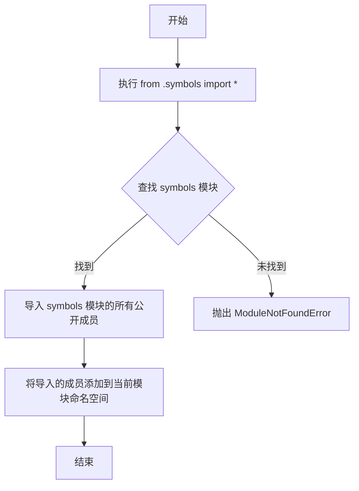

# `Bert-VITS2\onnx_modules\V230\text\__init__.py` 详细设计文档

该文件是一个简单的模块导入文件，通过 `from .symbols import *` 语句从同包下的 symbols 模块导入所有公开符号（变量、函数、类等），实现模块间的代码复用和重导出功能。

## 整体流程



## 类结构

```
无类定义（仅为导入语句）
注：实际类和函数定义在 symbols 模块中
```

## 全局变量及字段


    

## 全局函数及方法


## 关键组件


### 模块导入机制

从symbols模块通过相对导入方式导入所有公共接口，实现模块间的接口暴露与功能集成。


## 问题及建议


### 已知问题

-   使用 `from .symbols import *` 导致命名空间污染，所有符号被无差别导入，无法明确代码依赖关系
-   静态分析工具无法追踪通过 `*` 导入的变量来源，降低代码可维护性和可读性
-   存在隐式依赖问题，symbols 模块的任何变更（如重命名、删除符号）都可能破坏当前代码
-   导入性能问题，无法确定实际需要哪些符号，可能导入大量不必要的对象
-   代码审查困难，reviewer 无法直观判断该模块依赖了 symbols 模块的哪些功能

### 优化建议

-   替换为显式导入：明确指定需要使用的符号，如 `from .symbols import SymbolA, SymbolB`
-   或使用完全限定名：`import symbols` 并通过 `symbols.SymbolA` 方式访问
-   如 symbols 模块内容较多，考虑重构 symbols 模块，拆分职责到不同子模块
-   添加类型提示和文档注释，明确每个导入符号的用途


## 其它


### 设计目标与约束

本模块作为一个基础的符号导出模块，主要目标是封装symbols模块的所有公共接口，提供统一的导入入口，便于其他模块通过统一方式访问符号集合。设计约束包括：必须依赖symbols模块的存在，导入方式遵循Python相对导入规范，且symbols模块需提前定义必要的符号集合。

### 错误处理与异常设计

由于本模块仅包含导入语句，运行时错误主要来源于symbols模块不存在或导入失败。异常处理策略：若symbols模块缺失，Python将抛出ModuleNotFoundError；若symbols模块导入时出错，则传播原始异常。建议在调用方使用try-except捕获导入错误，确保程序健壮性。

### 数据流与状态机

本模块不涉及复杂的数据流或状态机。作为导入模块，其数据流属于静态导入过程：Python解释器加载模块时，根据from .symbols import *语句，将symbols模块的__all__属性定义的公共符号（或所有非下划线开头的全局符号）导入到当前模块命名空间，供其他模块通过import语句引用。

### 外部依赖与接口契约

外部依赖：symbols模块（.py文件），需存在于同一包目录下。接口契约：symbols模块应定义__all__列表以明确导出符号集合；若未定义__all__，则默认导出所有非下划线开头的全局变量、函数和类。调用方可通过from module import *或from module import specific_symbol方式使用。

### 模块初始化与加载顺序

本模块作为包（package）的__init__.py文件时，会在首次import该包时被加载。加载顺序：Python解释器首先执行from .symbols import *，将符号注入当前模块命名空间，然后完成包初始化。若symbols模块存在循环导入风险，需在symbols模块中采用延迟导入或重构依赖关系。

### 命名规范与代码风格

遵循PEP 8 Python代码规范，采用 lowercase_with_underscores 命名风格。导入语句保持简洁，使用相对导入（.symbols）表明模块归属关系。若symbols模块包含大量符号，建议在__all__中明确列出，避免导入不必要的名称污染命名空间。

### 测试策略与验证方法

由于模块功能单一，测试重点在于验证导入行为正确性。测试用例应包括：验证symbols模块存在性、验证import语句成功执行、验证所需符号可被正确访问、验证未定义__all__时的默认导出行为。建议使用pytest框架进行单元测试。

    