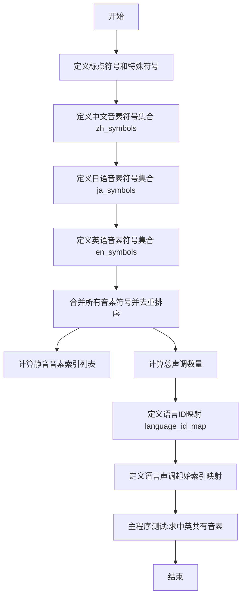

# `Bert-VITS2\onnx_modules\V230\text\symbols.py` 详细设计文档

这是一个多语言文本转语音(TTS)系统的音素符号定义模块,用于定义中文、日语和英语的音素符号表、标点符号、静音音素以及语言和声调的映射关系,为语音合成提供基础的符号集支持。

## 整体流程



## 类结构

```
该文件为纯模块文件,无类定义
所有内容为全局变量和常量定义
仅包含一个if __name__ == '__main__'入口脚本
```

## 全局变量及字段


### `punctuation`
    
基础标点符号列表，包含常见标点符号

类型：`list[str]`
    


### `pu_symbols`
    
完整标点符号和特殊符号列表，包含SP和UNK

类型：`list[str]`
    


### `pad`
    
填充符号字符串，用于序列padding

类型：`str`
    


### `zh_symbols`
    
中文音素符号列表，包含声母韵母等

类型：`list[str]`
    


### `ja_symbols`
    
日语音素符号列表，包含假名对应音素

类型：`list[str]`
    


### `en_symbols`
    
英语音素符号列表，采用CMU音素格式

类型：`list[str]`
    


### `normal_symbols`
    
合并去重排序后的正常音素符号集合

类型：`list[str]`
    


### `symbols`
    
完整音素符号表，含填充符、正常符号和标点符号

类型：`list[str]`
    


### `sil_phonemes_ids`
    
静音音素在符号表中的索引列表

类型：`list[int]`
    


### `num_zh_tones`
    
中文声调数量，包含轻声共6个

类型：`int`
    


### `num_ja_tones`
    
日语音调数量，共2个

类型：`int`
    


### `num_en_tones`
    
英语声调数量，共4个

类型：`int`
    


### `num_tones`
    
总声调数量，由三种语言声调相加得出

类型：`int`
    


### `language_id_map`
    
语言名称到ID的映射字典

类型：`dict[str, int]`
    


### `num_languages`
    
支持的语言数量，共3种

类型：`int`
    


### `language_tone_start_map`
    
各语言声调起始索引映射

类型：`dict[str, int]`
    


    

## 全局函数及方法


## 关键组件


### 标点符号定义模块

定义系统使用的标点符号集合，包括基础标点符号（感叹号、问号、省略号、逗号、句号、引连字符）和特殊符号（空格符"SP"和未知符"UNK"），以及用于填充的占位符"_"。该模块为后续音素处理提供基础符号集。

### 中文音素符号集

包含完整的汉语拼音音素符号列表，覆盖声母、韵母及复合韵母，共定义70个音素符号，音调数量为6。该符号集用于支持中文文本到音素的转换过程。

### 日文音素符号集

包含日语假名对应的音素符号列表，涵盖清音、浊音、半浊音等，共38个音素符号，音调数量为2。该符号集用于支持日语文本到音素的转换过程。

### 英文音素符号集

包含英语ARPAbet音标符号列表，覆盖元音和辅音，共38个音素符号，音调数量为4。该符号集用于支持英文文本到音素的转换过程。

### 符号整合模块

将中文、日文、英文三类音素符号集合并去重并排序，然后与标点符号集组合形成完整的统一符号表。首位置为填充符"_"，末尾追加标点符号集。该模块生成系统最终使用的完整符号映射表。

### 音调数量整合模块

将三种语言的音调数量相加，得到系统支持的总音调数量（6+2+4=12）。该模块为多语言音调处理提供统一的音调范围。

### 语言标识映射模块

建立语言名称到数字ID的映射关系：中文(ZH)=0、日文(JP)=1、英文(EN)=2。同时计算语言总数，用于后续语言识别和特征处理。

### 音调起始索引映射模块

计算每种语言在统一音调空间中的起始索引位置：中文从0开始，日文从6开始，英文从8开始。该模块确保不同语言的音调在统一表示中互不冲突。

### 标点符号索引提取模块

提取所有标点符号在统一符号表中的索引位置，生成sil_phonemes_ids列表。该模块用于识别和处理文本中的静音或停顿区域。


## 问题及建议


### 已知问题

- **硬编码的符号列表**：所有语言的音素符号都是硬编码在列表中，如果需要添加新语言或修改符号集，需要直接修改代码，缺乏灵活性
- **`__main__` 调试代码未清理**：文件末尾的 `if __name__ == "__main__"` 块中包含调试代码（打印中英文符号交集），属于开发时遗留代码，不应出现在生产代码中
- **`language_tone_start_map` 手动计算维护成本高**：该字典的值依赖于前面的 `num_xx_tones` 变量，人工维护容易出错，应改为动态计算
- **变量命名不一致**：中文使用全拼（`zh`），日文用缩写（`ja`），英文用全称（`en`），应统一命名规范
- **缺少类型注解**：所有变量都缺乏类型注解，不利于静态分析和 IDE 智能提示
- **符号去重逻辑可能导致意外结果**：`sorted(set(zh_symbols + ja_symbols + en_symbols))` 虽然去重并排序，但原始列表中存在大小写不同的重复符号（如 "a" 和 "A"），可能掩盖潜在的数据问题
- **无数据验证**：模块级别的代码在导入时执行，无任何输入验证或错误处理

### 优化建议

- 将符号配置抽取为外部配置文件（如 JSON 或 YAML），通过配置加载器动态读取
- 移除 `__main__` 块中的调试代码，或将其移至独立的测试文件
- 使用代码动态计算 `language_tone_start_map`，例如：`{"ZH": 0, "JP": num_zh_tones, "EN": num_zh_tones + num_ja_tones}` 可改为自动推导
- 统一变量命名风格，建议全部使用小写加下划线的蛇形命名（`zh_tones`, `ja_tones`, `en_tones`）
- 为关键变量添加类型注解，如 `symbols: List[str]`, `language_id_map: Dict[str, int]`
- 在模块初始化时添加数据验证函数，检查符号列表是否有空值、是否有语言未配置等情况
- 考虑使用 `Enum` 或 `dataclass` 封装语言相关配置，提高代码可读性和可维护性

## 其它


### 设计目标与约束

本模块旨在为多语言文本转语音（TTS）系统提供统一的音素符号表配置，支持中文（ZH）、日文（JP）和英文（EN）三种语言的音素映射。设计约束包括：符号表必须包含所有语言的完整音素集合，且不允许存在重复符号；语言ID和音调起始位置必须保持固定映射关系，确保索引计算的一致性；符号表顺序必须保持稳定，以维护符号ID的长期兼容性。

### 错误处理与异常设计

本模块为配置初始化模块，主要风险在于符号集合冲突和索引计算错误。当不同语言的符号存在交集时（如"a"同时存在于中英文），通过sorted set去重确保唯一性，但会在运行时打印交集符号供开发者确认。若symbols列表索引越界或language_id_map查询不到对应语言，应在模块加载时抛出KeyError或IndexError。由于无运行时动态输入，异常设计采用快速失败策略。

### 数据流与状态机

本模块为静态配置模块，数据流为单向流出模式。初始化流程：加载各语言原始符号列表 → 合并去重 → 添加padding和标点符号 → 生成symbols列表 → 预计算sil_phonemes_ids和language_tone_start_map → 供下游模块查询使用。无状态机设计，模块加载后进入只读状态。

### 外部依赖与接口契约

本模块无外部运行时依赖，仅作为配置中心供其他模块引用。接口契约包括：symbols列表索引从0开始，0号为padding符号"_"，后续依次为normal_symbols和pu_symbols；sil_phonemes_ids返回标点符号在symbols中的索引列表；language_tone_start_map返回各语言的首个音调ID偏移量；任何下游模块必须通过symbols.index()方法获取符号ID，不得硬编码。

### 性能要求与基准

本模块在模块导入时执行一次性计算，时间复杂度为O(n log n)（去重排序），空间复杂度为O(n)。对于当前约150个符号的规模，加载时间应低于10ms，内存占用低于1KB。性能基准：无运行时计算，所有查询操作均为O(1)字典查找或列表索引。

### 安全考虑

本模块不涉及用户输入、网络请求或文件读写，无直接安全风险。但需确保symbols列表不可被下游模块意外修改，建议在文档中标注为只读配置。若未来扩展为从外部文件加载符号表，需增加文件路径校验和符号合法性检查。

### 测试策略

测试用例应覆盖：符号表完整性验证（三种语言符号均包含）、去重一致性验证（无重复符号）、索引计算正确性验证（language_tone_start_map偏移量正确）、接口契约验证（sil_phonemes_ids返回有效索引）、以及与下游模块的集成测试。推荐使用pytest框架，测试数据可硬编码预期值进行断言对比。

### 版本兼容性

当前版本为v1.0，后续修改需保持向后兼容：不得改变已有符号的索引位置，仅可追加新符号；language_id_map的键值对不得修改；如需修改符号集合，需在版本更新日志中明确说明并提供迁移脚本。


    