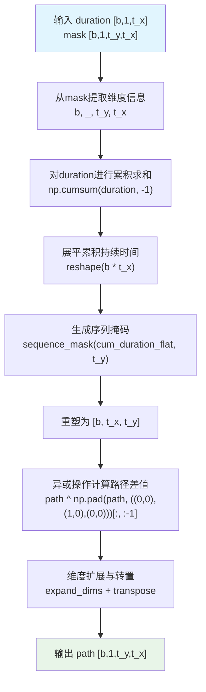
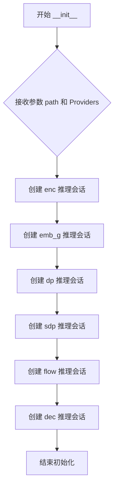
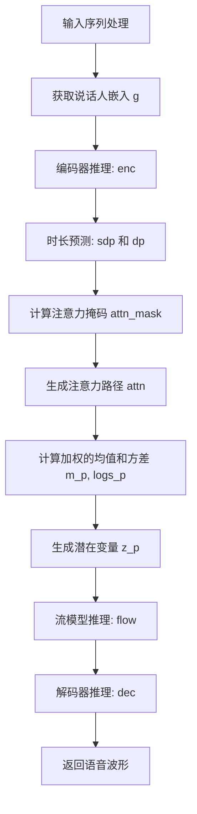

# `Bert-VITS2\onnx_modules\V230_OnnxInference\__init__.py` 详细设计文档

这是一个基于ONNX Runtime的文本转语音(TTS)推理引擎封装类，封装了VITS模型的编码器、时长预测器、流模型和解码器，支持端到端的文本、韵律特征到声谱的转换。

## 整体流程

```mermaid
graph TD
    A[输入: seq, tone, language, bert, sid] --> B[预处理: 维度扩展与类型转换]
    B --> C[emb_g: 获取说话人嵌入向量]
    C --> D[enc: 文本编码器 (x, m_p, logs_p, x_mask)]
    D --> E{dp/sdp: 时长预测}
    E --> F[generate_path: 根据时长生成对齐矩阵 (attn)]
    F --> G[特征对齐: 将m_p和logs_p对齐到目标长度]
    G --> H[z_p: 添加高斯噪声]
    H --> I[flow: 归一化流变换 (z_p -> z)]
    I --> J[dec: 神经声码器解码]
    J --> K[输出: 音频特征]
```

## 类结构

```
OnnxInferenceSession (TTS推理会话类)
```

## 全局变量及字段


### `OnnxInferenceSession.enc`
    
编码器(Encoder)的ONNX推理会话，用于处理音素序列、语调和语言特征

类型：`onnxruntime.InferenceSession`
    


### `OnnxInferenceSession.emb_g`
    
说话人嵌入(Speaker Embedding)的ONNX推理会话，用于生成说话人条件向量

类型：`onnxruntime.InferenceSession`
    


### `OnnxInferenceSession.dp`
    
持续时间预测器(Duration Predictor)的ONNX推理会话，用于预测每个音素的持续时间

类型：`onnxruntime.InferenceSession`
    


### `OnnxInferenceSession.sdp`
    
随机持续时间预测器(Stochastic Duration Predictor)的ONNX推理会话，用于生成更自然的持续时间分布

类型：`onnxruntime.InferenceSession`
    


### `OnnxInferenceSession.flow`
    
归一化流(Normalizing Flow)的ONNX推理会话，用于潜在变量的转换和分布建模

类型：`onnxruntime.InferenceSession`
    


### `OnnxInferenceSession.dec`
    
解码器(Decoder)的ONNX推理会话，用于将潜在表示转换为最终音频波形

类型：`onnxruntime.InferenceSession`
    
    

## 全局函数及方法


### `convert_pad_shape`

该函数用于将嵌套的填充形状列表进行反转并展平处理，将二维嵌套列表转换为一维列表，常用于处理卷积或池化操作中的 padding 形状参数。

参数：

- `pad_shape`：`list`，需要转换的填充形状，通常为嵌套列表形式（如 `[[1, 2], [3, 4]]`）

返回值：`list`，转换后的一维填充形状列表

#### 流程图

```mermaid
flowchart TD
    A[开始] --> B[输入: pad_shape 嵌套列表]
    B --> C[layer = pad_shape[::-1]]
    C --> D[反转列表顺序]
    D --> E[pad_shape = [item for sublist in layer for item in sublist]]
    E --> F[展平嵌套列表]
    F --> G[返回展平后的列表]
```

#### 带注释源码

```python
def convert_pad_shape(pad_shape):
    """
    将嵌套的填充形状列表反转并展平为一维列表
    
    参数:
        pad_shape: 嵌套列表，如 [[1, 2], [3, 4]]
        
    返回:
        展平后的列表，如 [3, 4, 1, 2]
    """
    # 步骤1: 将输入列表反转
    # 例如: [[1, 2], [3, 4]] -> [[3, 4], [1, 2]]
    layer = pad_shape[::-1]
    
    # 步骤2: 将嵌套列表展平为单个一维列表
    # 使用列表推导式遍历子列表中的每个元素
    # 例如: [[3, 4], [1, 2]] -> [3, 4, 1, 2]
    pad_shape = [item for sublist in layer for item in sublist]
    
    # 返回展平后的结果
    return pad_shape
```


### `sequence_mask`

该函数用于生成序列掩码（sequence mask），根据给定的序列长度数组生成一个布尔掩码矩阵，用于标识有效位置。通常用于变长序列处理，确保模型只关注有效的序列元素。

参数：

- `length`：`numpy.ndarray`，一维数组，表示每个序列的实际长度
- `max_length`：`int` 或 `None`，掩码的最大长度。如果为 `None`，则自动使用 `length` 数组中的最大值

返回值：`numpy.ndarray`，二维布尔数组，形状为 `(1, max_length)` 或 `(batch_size, max_length)` 的布尔掩码，其中 `True` 表示该位置在原始序列长度范围内

#### 流程图

```mermaid
flowchart TD
    A[开始 sequence_mask] --> B{检查 max_length 是否为 None}
    B -->|是| C[max_length = length.max()]
    B -->|否| D[使用传入的 max_length]
    C --> E[x = np.arange max_length]
    D --> E
    E --> F[expand_dims x to shape 1,max_length]
    F --> G[expand_dims length to shape batch_size,1]
    G --> H[比较: x_expanded < length_expanded]
    H --> I[返回布尔掩码]
```

#### 带注释源码

```python
def sequence_mask(length, max_length=None):
    """
    生成序列掩码，用于处理变长序列
    
    参数:
        length: numpy.ndarray, 一维数组，表示每个序列的实际长度
        max_length: int 或 None，掩码的最大长度，默认为 None
    
    返回:
        numpy.ndarray, 布尔掩码数组
    """
    # 如果未指定 max_length，则使用 length 数组中的最大值
    if max_length is None:
        max_length = length.max()
    
    # 创建从 0 到 max_length-1 的数组，数据类型与 length 相同
    # 形状: (max_length,)
    x = np.arange(max_length, dtype=length.dtype)
    
    # 扩展维度以便广播比较
    # x 形状: (1, max_length) -> [0, 1, 2, ..., max_length-1]
    # length 形状: (batch_size, 1) -> 每个样本的长度值
    # 比较结果: (batch_size, max_length) 的布尔矩阵
    return np.expand_dims(x, 0) < np.expand_dims(length, 1)
```


### `generate_path`

该函数根据输入的持续时间（duration）和掩码（mask）计算声学特征到音素序列的路径映射关系。通过对持续时间进行累积求和，生成从源时间步到目标时间步的对齐路径，广泛应用于语音合成中的时长建模和注意力机制。

参数：

- `duration`：`numpy.ndarray`，形状为 [b, 1, t_x]，表示批次中每个样本的持续时间序列，其中 b 为批次大小，t_x 为源时间步数
- `mask`：`numpy.ndarray`，形状为 [b, 1, t_y, t_x]，表示源序列与目标序列之间的掩码矩阵，t_y 为目标时间步数

返回值：`numpy.ndarray`，形状为 [b, 1, t_y, t_x]，返回计算得到的路径对齐矩阵，表示从源时间步到目标时间步的映射关系

#### 流程图



#### 带注释源码

```python
def generate_path(duration, mask):
    """
    根据持续时间和掩码生成路径对齐矩阵
    
    参数:
        duration: [b, 1, t_x] - 每个时间步的持续时间
        mask: [b, 1, t_y, t_x] - 源-目标掩码矩阵
    
    返回:
        path: [b, 1, t_y, t_x] - 路径对齐矩阵
    """
    
    # 从mask形状中提取批次大小和时空维度信息
    # b: 批次大小, t_y: 目标时间步数, t_x: 源时间步数
    b, _, t_y, t_x = mask.shape
    
    # 步骤1: 计算累积持续时间
    # 对最后一个维度(-1)进行累加，得到每个位置的总时长
    # cum_duration 形状: [b, 1, t_x]
    cum_duration = np.cumsum(duration, -1)
    
    # 步骤2: 展平累积持续时间以便批量处理
    # 转换为 [b * t_x] 以便后续统一计算序列掩码
    cum_duration_flat = cum_duration.reshape(b * t_x)
    
    # 步骤3: 生成序列掩码
    # 创建 [b*t_x, t_y] 的布尔掩码，判断每个位置是否在累积时长范围内
    path = sequence_mask(cum_duration_flat, t_y)
    
    # 步骤4: 重塑为批次形式
    # 恢复为 [b, t_x, t_y] 的三维张量
    path = path.reshape(b, t_x, t_y)
    
    # 步骤5: 异或操作计算路径差值
    # 通过与padding后的版本进行异或，计算相邻位置的差值
    # 这实际上是计算每个位置是否是一个新的时间段的开始
    # np.pad 在第二个维度(时间步)前面添加1个0，形成 [b, t_x+1, ty]
    # 然后取 [:-1] 去掉最后一个，得到 [b, t_x, t_y]
    path = path ^ np.pad(path, ((0, 0), (1, 0), (0, 0)))[:, :-1]
    
    # 步骤6: 维度调整以匹配输出格式
    # 在位置1添加新维度，然后转置使形状变为 [b, 1, t_y, t_x]
    path = np.expand_dims(path, 1).transpose(0, 1, 3, 2)
    
    return path
```


### `OnnxInferenceSession.__init__`

该方法是 `OnnxInferenceSession` 类的构造函数，负责初始化多个 ONNX Runtime 推理会话，分别用于加载编码器(enc)、说话人嵌入(emb_g)、持续时间预测(dp)、流式持续时间预测(sdp)、归一化流(flow)和解码器(dec)的 ONNX 模型文件。

参数：

- `path`：`dict`，字典类型，包含各模型文件的路径，键名为 "enc"、"emb_g"、"dp"、"sdp"、"flow"、"dec"，对应不同的 ONNX 模型
- `Providers`：`list`，可选参数，默认值为 `["CPUExecutionProvider"]`，指定 ONNX Runtime 的执行提供者列表

返回值：`None`，无返回值，用于对象初始化

#### 流程图



#### 带注释源码

```python
def __init__(self, path, Providers=["CPUExecutionProvider"]):
    """
    初始化 ONNX 推理会话，加载多个模型文件
    
    参数:
        path: 字典，包含各模型路径，键名为 enc/emb_g/dp/sdp/flow/dec
        Providers: 执行提供者列表，默认为 CPU 执行提供者
    """
    # 加载编码器模型，用于将输入序列编码为隐藏表示
    self.enc = ort.InferenceSession(path["enc"], providers=Providers)
    
    # 加载说话人嵌入查询表模型，用于获取说话人特征
    self.emb_g = ort.InferenceSession(path["emb_g"], providers=Providers)
    
    # 加载持续时间预测模型，预测每个音素的持续时间
    self.dp = ort.InferenceSession(path["dp"], providers=Providers)
    
    # 加载流式持续时间预测模型，用于流式推理场景
    self.sdp = ort.InferenceSession(path["sdp"], providers=Providers)
    
    # 加载归一化流模型，用于潜在变量变换
    self.flow = ort.InferenceSession(path["flow"], providers=Providers)
    
    # 加载解码器模型，将潜在表示转换为最终输出
    self.dec = ort.InferenceSession(path["dec"], providers=Providers)
```


### `OnnxInferenceSession.__call__`

该方法是ONNX推理会话的核心调用接口，接收文本序列、语调序列、语言序列、BERT嵌入向量、说话人ID及多个生成控制参数，依次通过说话人嵌入、编码器、时长预测、流模型和解码器生成语音波形。

参数：

-  `seq`：`numpy.ndarray`，输入的文本序列，形状为 `[batch, seq_len]` 或 `[seq_len]`
-  `tone`：`numpy.ndarray`，输入的语调序列，形状为 `[batch, seq_len]` 或 `[seq_len]`
-  `language`：`numpy.ndarray`，输入的语言序列，形状为 `[batch, seq_len]` 或 `[seq_len]`
-  `bert_zh`：`numpy.ndarray`，中文BERT嵌入，形状为 `[batch, seq_len, bert_dim]`
-  `bert_jp`：`numpy.ndarray`，日文BERT嵌入，形状为 `[batch, seq_len, bert_dim]`
-  `bert_en`：`numpy.ndarray`，英文BERT嵌入，形状为 `[batch, seq_len, bert_dim]`
-  `sid`：`numpy.ndarray`，说话人ID，形状为 `[batch]`
-  `seed`：`int`，随机种子，默认值为 `114514`
-  `seq_noise_scale`：`float`，序列噪声比例，默认值为 `0.8`
-  `sdp_noise_scale`：`float`，SDP（随机时长预测）噪声比例，默认值为 `0.6`
-  `length_scale`：`float`，输出长度缩放比例，默认值为 `1.0`
-  `sdp_ratio`：`float`，SDP在时长预测中的混合比例，默认值为 `0.0`

返回值：`numpy.ndarray`，生成的语音波形，形状为 `[batch, wave_len, 1]`

#### 流程图



#### 带注释源码

```python
def __call__(
    self,
    seq,
    tone,
    language,
    bert_zh,
    bert_jp,
    bert_en,
    sid,
    seed=114514,
    seq_noise_scale=0.8,
    sdp_noise_scale=0.6,
    length_scale=1.0,
    sdp_ratio=0.0,
):
    # 将一维输入扩展为二维（批量维度）
    if seq.ndim == 1:
        seq = np.expand_dims(seq, 0)
    if tone.ndim == 1:
        tone = np.expand_dims(tone, 0)
    if language.ndim == 1:
        language = np.expand_dims(language, 0)
    
    # 验证输入维度
    assert (seq.ndim == 2, tone.ndim == 2, language.ndim == 2)
    
    # 获取说话人嵌入
    g = self.emb_g.run(
        None,
        {
            "sid": sid.astype(np.int64),
        },
    )[0]
    # 扩展嵌入维度以匹配后续计算
    g = np.expand_dims(g, -1)
    
    # 编码器推理
    enc_rtn = self.enc.run(
        None,
        {
            "x": seq.astype(np.int64),
            "t": tone.astype(np.int64),
            "language": language.astype(np.int64),
            "bert_0": bert_zh.astype(np.float32),
            "bert_1": bert_jp.astype(np.float32),
            "bert_2": bert_en.astype(np.float32),
            "g": g.astype(np.float32),
        },
    )
    # 解包编码器输出
    x, m_p, logs_p, x_mask = enc_rtn[0], enc_rtn[1], enc_rtn[2], enc_rtn[3]
    
    # 设置随机种子并生成噪声输入
    np.random.seed(seed)
    zinput = np.random.randn(x.shape[0], 2, x.shape[2]) * sdp_noise_scale
    
    # 混合SDP和DP的时长对数预测
    logw = self.sdp.run(
        None, {"x": x, "x_mask": x_mask, "zin": zinput.astype(np.float32), "g": g}
    )[0] * (sdp_ratio) + self.dp.run(None, {"x": x, "x_mask": x_mask, "g": g})[
        0
    ] * (
        1 - sdp_ratio
    )
    
    # 计算时长并应用掩码和缩放
    w = np.exp(logw) * x_mask * length_scale
    w_ceil = np.ceil(w)
    
    # 计算输出序列长度
    y_lengths = np.clip(np.sum(w_ceil, (1, 2)), a_min=1.0, a_max=100000).astype(
        np.int64
    )
    y_mask = np.expand_dims(sequence_mask(y_lengths, None), 1)
    
    # 生成注意力掩码
    attn_mask = np.expand_dims(x_mask, 2) * np.expand_dims(y_mask, -1)
    
    # 生成注意力路径
    attn = generate_path(w_ceil, attn_mask)
    
    # 使用注意力路径对编码器输出进行加权
    m_p = np.matmul(attn.squeeze(1), m_p.transpose(0, 2, 1)).transpose(
        0, 2, 1
    )  # [b, t', t], [b, t, d] -> [b, d, t']
    logs_p = np.matmul(attn.squeeze(1), logs_p.transpose(0, 2, 1)).transpose(
        0, 2, 1
    )  # [b, t', t], [b, t, d] -> [b, d, t']
    
    # 生成潜在变量 z_p
    z_p = (
        m_p
        + np.random.randn(m_p.shape[0], m_p.shape[1], m_p.shape[2])
        * np.exp(logs_p)
        * seq_noise_scale
    )
    
    # 流模型推理
    z = self.flow.run(
        None,
        {
            "z_p": z_p.astype(np.float32),
            "y_mask": y_mask.astype(np.float32),
            "g": g,
        },
    )[0]
    
    # 解码器推理并返回语音波形
    return self.dec.run(None, {"z_in": z.astype(np.float32), "g": g})[0]
```


## 关键组件


### 张量索引与形状变换

代码中包含多个张量维度变换操作，包括`np.expand_dims`用于增加维度、`transpose`用于维度置换、`squeeze`用于压缩维度。`sequence_mask`函数生成用于注意力机制的掩码，`generate_path`函数根据持续时间生成注意力路径，实现从源序列到目标序列的对齐。

### 惰性加载与ONNX会话管理

`OnnxInferenceSession`类在初始化时一次性加载所有6个ONNX模型（enc, emb_g, dp, sdp, flow, dec），采用延迟执行策略，仅在调用`__call__`方法时才进行推理。这种设计避免了在推理过程中重复加载模型，但会占用较高的初始内存。

### 噪声注入与随机数生成

代码使用`np.random.randn`和`np.random.seed`进行噪声生成，包含`sdp_noise_scale`控制时长预测噪声、`seq_noise_scale`控制声学特征噪声。这两个噪声参数允许在推理时控制输出的多样性和确定性。

### BERT特征融合

模型接收三种语言的BERT特征（bert_zh中文、bert_jp日文、bert_en英文），在encoder阶段将这些特征与音素序列、语调、语言标识一起输入，实现多语言文本到语音的合成。

### 掩码机制与填充

使用`sequence_mask`生成时间维度的掩码，用于处理变长序列。通过`x_mask`和`y_mask`分别控制encoder和decoder的注意力范围，避免对padding位置的计算。

### 模型流水线编排

代码实现了完整的VITS式语音合成流水线：Encoder → Duration/SDP预测 → Flow变换 → Decoder。每个环节通过ONNX Runtime的`run`方法执行推理，环节之间通过NumPy进行数据传递和变换。

### 长度控制与时间尺度

通过`length_scale`参数控制输出语音长度，通过`sdp_ratio`控制时长预测器（SDP）和持续时间预测器（DP）的混合比例，实现灵活的语速和时长控制。

### 潜在技术债务与优化空间

1. **重复的模型加载**：多个`run`调用之间没有缓存中间结果，每次调用都会重新执行完整流水线
2. **硬编码的provider**：仅使用CPUExecutionProvider，未支持GPU加速
3. **缺乏批处理优化**：虽然代码支持batch维度，但未对批量推理进行优化
4. **数值类型转换频繁**：多次使用`.astype()`进行类型转换，可能影响性能
5. **无错误处理**：缺乏对ONNX模型加载失败、输入shape不匹配等情况的异常处理
6. **全局随机状态**：`np.random.seed`影响全局随机状态，可能与其他模块冲突


## 问题及建议


### 已知问题

- **硬编码魔数**: `seed=114514` 是一个难以理解的硬编码值，缺乏注释说明其含义或来源
- **缺乏输入验证**: 没有对输入参数的类型、形状、范围进行验证，可能导致运行时错误或难以调试的问题
- **冗余的类型转换**: 在每次推理中都进行 `.astype()` 转换（int64、float32），没有在输入端进行一次性验证和转换，影响性能
- **缺少错误处理**: 没有任何 try-except 块来捕获和处理 ONNX 运行时可能出现的异常（如模型加载失败、推理错误等）
- **资源未显式释放**: ONNX InferenceSession 对象没有显式的资源管理（虽然 Python 有 GC，但没有使用上下文管理器或显式关闭）
- **默认值风险**: `Providers=["CPUExecutionProvider"]` 作为可变默认参数，在 Python 中是常见陷阱（虽然此场景下可能是故意的）
- **魔数缺乏说明**: `y_lengths` 的 clip 范围 `a_max=100000` 没有任何注释解释其含义
- **未使用的返回值**: `enc_rtn` 解包了4个值但只使用了前3个（`x_mask` 未被使用），可能是遗留代码

### 优化建议

- 添加输入验证函数，验证 seq、tone、language 的形状一致性，以及 bert 输入的维度兼容性
- 在类初始化或首次调用时缓存或预计算可复用的转换（如全为 True 的 mask、零向量等）
- 使用上下文管理器 (`with` 语句) 或添加 `close()` 方法来显式管理 ONNX Session 资源
- 将硬编码的配置值（如 `114514`、clip 范围）提取为类常量或配置参数，并添加文档注释
- 添加可选的错误处理和日志记录机制，提升代码的可调试性
- 考虑将可变默认参数 `Providers` 改为 `None` 并在方法内默认值，避免 Python 可变默认参数陷阱
- 对于推理性能敏感场景，考虑添加 ONNX Session 的配置选项（如 graph optimization level、intra-op num threads 等）
- 清理未使用的变量（如 `x_mask`）或在必要时添加注释说明其潜在用途

## 其它


### 设计目标与约束

**设计目标**：实现一个基于ONNX Runtime的文本到语音（TTS）推理框架，通过多个独立的ONNX模型（encoder、embedding、duration predictor、flow、decoder）协同工作，将文本序列、韵律特征、语义特征（BERT）转换为语音波形。

**约束条件**：
- 依赖ONNX Runtime作为推理引擎
- 输入输出均使用NumPy数组
- 模型文件通过路径字典指定
- 仅支持CPU执行Provider（可扩展至GPU）

### 错误处理与异常设计

**输入验证**：
- `seq`、`tone`、`language`需为1D或2D数组，方法内部自动扩展为2D
- 断言检查确保`seq`、`tone`、`language`均为2D
- `sid`（speaker ID）需为整数类型

**运行时异常**：
- ONNX模型加载失败：抛出`ort.InferenceSession`初始化异常
- ONNX推理失败： propagate ONNX Runtime异常
- 数值溢出：`np.clip`限制`y_lengths`在[1, 100000]范围

**边界条件**：
- `length_scale`为0时可能导致无输出
- `sdp_ratio`控制duration预测器权重（0~1）

### 数据流与状态机

**主数据流**：
1. **Embedding阶段**：speaker ID → speaker embedding (g)
2. **Encoder阶段**：seq + tone + language + bert_zh/jp/en + g → hidden states (x), mean (m_p), log std (logs_p), mask (x_mask)
3. **Duration Prediction阶段**：x + x_mask + g → logw (log durations)，通过sdp和dp加权混合
4. **Alignment阶段**：duration → attention path (attn)
5. **Hidden States变换**：使用attn对m_p和logs_p进行对齐
6. **Noise注入**：z_p = m_p + noise * exp(logs_p)
7. **Flow变换**：z_p → z (归一化流)
8. **Decoder阶段**：z → waveform

**状态机**：无显式状态机，流程为单向线性Pipe

### 外部依赖与接口契约

**依赖项**：
- `numpy`：数值计算
- `onnxruntime`：ONNX模型推理

**输入接口**（`__call__`参数）：
| 参数名 | 类型 | 描述 |
|--------|------|------|
| seq | np.ndarray | 文本序列（int64） |
| tone | np.ndarray | 韵律序列（int64） |
| language | np.ndarray | 语言序列（int64） |
| bert_zh | np.ndarray | 中文BERT特征（float32） |
| bert_jp | np.ndarray | 日文BERT特征（float32） |
| bert_en | np.ndarray | 英文BERT特征（float32） |
| sid | np.ndarray | 说话人ID（int64） |
| seed | int | 随机种子 |
| seq_noise_scale | float | 序列噪声尺度 |
| sdp_noise_scale | float | SDP噪声尺度 |
| length_scale | float | 输出长度缩放 |
| sdp_ratio | float | SDP/DP混合比例 |

**输出接口**：
- 返回值：`np.ndarray`，形状为[b, 1, waveform_length]，float32类型

**ONNX模型接口**：
| 模型 | 输入键 | 输出键 |
|------|--------|--------|
| emb_g | sid | g |
| enc | x, t, language, bert_0/1/2, g | x, m_p, logs_p, x_mask |
| dp/sdp | x, x_mask, (zin), g | logw |
| flow | z_p, y_mask, g | z |
| dec | z_in, g | waveform |

### 配置与参数说明

**OnnxInferenceSession初始化**：
- `path`：字典，包含6个ONNX模型路径（enc, emb_g, dp, sdp, flow, dec）
- `Providers`：执行Provider列表，默认["CPUExecutionProvider"]

**推理参数**：
- `seed`：随机种子，影响zinput和z_p噪声生成
- `seq_noise_scale`：控制z_p噪声强度，默认0.8
- `sdp_noise_scale`：控制zinput噪声强度，默认0.6
- `length_scale`：控制输出语音长度，默认1.0
- `sdp_ratio`：控制duration预测器选择，0.0仅用dp，1.0仅用sdp

### 性能考虑与优化建议

**当前实现**：
- 使用NumPy进行大部分计算
- 多次调用ONNX Runtime的run方法

**优化建议**：
1. 批量推理：当前针对单批次优化，可合并多次推理减少开销
2. GPU加速：将Provider改为CUDAExecutionProvider
3. 内存复用：预分配中间张量避免重复创建
4. 图优化：使用onnx_graph_runner或TensorRT优化
5. 并行化：多模型间无数据依赖可考虑异步执行

### 安全性考虑

**输入安全**：
- 无用户输入直接执行路径
- 依赖模型文件完整性
- 数组类型断言防止类型错配

**资源限制**：
- `y_lengths`上限100000防止内存爆炸
- 建议在生产环境对输入长度做上限检查

### 版本兼容性

**依赖版本**：
- numpy：推荐>=1.19
- onnxruntime：推荐>=1.8
- Python：3.7+

**ONNX模型兼容性**：
- 模型需与onnxruntime版本兼容
- 建议使用相同版本onnxruntime导出和运行模型

### 使用示例

```python
# 初始化
path = {
    "enc": "encoder.onnx",
    "emb_g": "emb_g.onnx",
    "dp": "dp.onnx",
    "sdp": "sdp.onnx",
    "flow": "flow.onnx",
    "dec": "decoder.onnx"
}
session = OnnxInferenceSession(path)

# 推理调用（需准备各输入张量）
output = session(seq, tone, language, bert_zh, bert_jp, bert_en, sid)
```

### 关键假设

1. 输入的BERT特征已预先提取并按顺序对应文本序列
2. 模型期望特定的输入形状和数据类型
3. duration值足够大以覆盖目标序列长度
4. 说话人embedding已预先训练

    