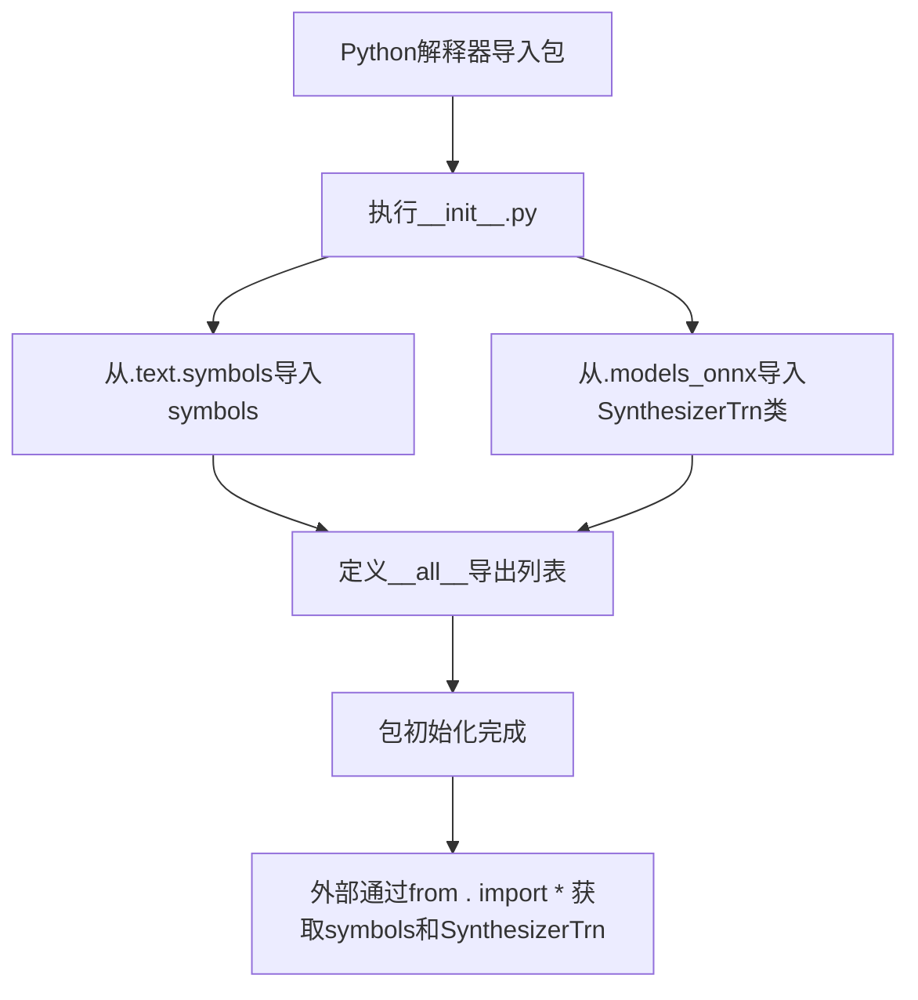

# `Bert-VITS2\onnx_modules\V240\__init__.py` 详细设计文档

这是VITS语音合成模型的Python包初始化文件，通过导入子模块text.symbols中的符号集symbols和models_onnx中的推理模型类SynthesizerTrn，对外提供统一的API接口，用于构建端到端的神经语音合成推理流水线。

## 整体流程



## 类结构

```
SynthesizerTrn (ONNX神经网络推理模型类)
```

## 全局变量及字段


### `symbols`
    
VITS语音合成模型的音素/字符符号表，定义了文本到语音转换支持的所有符号集合

类型：`list[str] | tuple`
    


### `SynthesizerTrn`
    
VITS模型的ONNX版本推理类，用于将文本/音素转换为语音波形

类型：`class`
    


### `__all__`
    
显式定义模块的公共接口，指定允许被from *导入的符号

类型：`list[str]`
    


    

## 全局函数及方法


## 关键组件


### 模块初始化

这是一个VITS（Variational Inference with adversarial learning for end-to-end Text-to-Speech）项目的包初始化文件，负责导出文本符号表和ONNX推理模型类。

### 文件整体运行流程

该模块作为包的入口点，在被导入时首先从`.text.symbols`子模块加载符号表定义，从`.models_onnx`子模块加载ONNX合成器模型类，然后通过`__all__`显式声明公共API接口，供外部模块导入使用。

### 类详细信息

#### SynthesizerTrn

- **类说明**: ONNX格式的VITS声学模型推理类，用于将文本/音素转换为梅尔频谱图或直接输出音频波形
- **来源模块**: .models_onnx

### 全局变量和导入项

#### symbols

- **类型**: 列表或元组
- **描述**: 文本到语音系统使用的音素符号表，定义可识别的语言单元（如音素、标点符号等）
- **来源模块**: .text.symbols

#### SynthesizerTrn

- **类型**: 类
- **描述**: VITS模型的ONNX推理封装类，支持基于Transformer架构的神经声学模型前向传播
- **来源模块**: .models_onnx

### 关键组件信息

#### 符号系统 (symbols)

负责定义TTS系统可处理的文本表示单元，包括语言特定的音素集、空白符、标点符号等，是文本规范化与声学模型之间的桥梁。

#### ONNX推理模型 (SynthesizerTrn)

基于ONNX运行时的高效推理实现，封装了VITS模型的声学建模逻辑，支持跨平台部署和量化优化。

### 潜在技术债务或优化空间

1. **模块依赖耦合**: 当前通过相对导入依赖内部模块，单元测试时难以mock
2. **导出API最小化**: 仅导出核心组件，可考虑增加配置类或辅助函数的导出
3. **文档缺失**: 缺少模块级docstring说明该包的用途和版本信息

### 其他项目

#### 设计目标

- 提供统一的模块导出接口
- 隐藏内部实现细节，仅暴露必要API

#### 错误处理

- 依赖子模块的导入错误会直接传播至导入点
- 建议在导入时添加try-except包装以提供友好的错误提示

#### 外部依赖

- 依赖.text.symbols模块提供的符号定义
- 依赖.models_onnx模块提供的ONNX推理实现


## 问题及建议


### 已知问题

-   **模块级文档字符串缺失**：该 `__init__.py` 文件缺少模块级别的文档字符串（docstring），无法快速了解该包的用途和功能
-   **导入依赖脆弱**：直接导入 `SynthesizerTrn` 和 `symbols`，若 `text.symbols` 或 `models_onnx` 模块不存在或导入失败，将导致整个包无法使用，缺乏错误处理机制
-   **ONNX 运行时依赖未明确**：`SynthesizerTrn` 依赖于 ONNX 运行时环境，但代码中未体现运行时可用性检查，可能导致在不支持 ONNX 的环境中部署失败
-   **公开接口不完整**：`__all__` 仅导出了 `symbols` 和 `SynthesizerTrn`，若该包有其他公共接口可能被遗漏
-   **缺少类型注解**：代码中没有任何类型提示（type hints），降低了代码的可读性和 IDE 支持
-   **版本信息缺失**：未提供模块版本号，不利于依赖管理和版本追踪
-   **symbols 用途不明确**：`symbols` 从 `text.symbols` 导入，其具体用途和结构在主入口文件中没有说明

### 优化建议

-   **添加模块文档字符串**：在文件开头添加描述性文档，说明该模块是 VITS（Voice Synthesis）模型的 ONNX 推理入口
-   **添加版本信息**：参照 PEP 396，添加 `__version__` 变量便于版本管理
-   **实现条件导入或错误处理**：使用 try-except 包装导入语句，提供有意义的错误信息或 graceful degradation
-   **补充类型注解**：为导入的符号和类添加类型提示，如 `symbols: list` 或 `SynthesizerTrn: type`
-   **完善 `__all__` 导出列表**：明确列出所有预期公开的接口，必要时添加注释说明各接口用途
-   **考虑添加 ONNX 运行时检查**：提供运行时环境检测功能，确保部署环境满足依赖要求
-   **重构导入结构**：若后续模块增多，可考虑使用子包结构（如 `from .models_onnx import SynthesizerTrn as VITS`）提高可读性


## 其它


### 一段话描述

该代码是VITS（Variational Inference with Text-to-Speech）语音合成项目的模块入口文件，负责导出核心的符号表（symbols）和ONNX模型推理类（SynthesizerTrn），作为项目对外的统一API接口。

### 文件的整体运行流程

1. 当其他模块通过`import`语句导入该包时，Python会执行`__init__.py`
2. 代码首先从`text.symbols`子模块导入`symbols`符号表数据
3. 然后从`models_onnx`子模块导入`SynthesizerTrn`推理类
4. 通过`__all__`定义公开的导出接口，控制`from xxx import *`时的可见内容
5. 其他模块即可通过`from . import symbols, SynthesizerTrn`使用这些组件

### 全局变量信息

| 名称 | 类型 | 描述 |
|------|------|------|
| symbols | list/ tuple | 音素符号表，包含文本到语音转换所需的所有语言符号（如音素、标点等） |

### 全局函数信息

该文件未定义任何函数，仅通过导入语句暴露子模块的功能。

### 类信息

| 类名 | 描述 |
|------|------|
| SynthesizerTrn | ONNX格式的VITSTransformer推理类，负责加载ONNX模型并进行文本到语音的推理生成 |

### 关键组件信息

| 组件名称 | 一句话描述 |
|----------|------------|
| text.symbols | 文本符号模块，定义语音合成使用的音素集合 |
| models_onnx | ONNX模型推理模块，包含高效的神经网络推理实现 |
| SynthesizerTrn | VITS Transformer的ONNX推理器，支持快速的端到端语音合成 |

### 潜在的技术债务或优化空间

1. **缺少版本管理**：未记录依赖版本号，建议添加`__version__`变量
2. **无错误处理**：导入语句缺少异常捕获，当子模块不存在时会产生模糊的错误信息
3. **文档缺失**：该入口文件缺少模块级docstring
4. **类型提示缺失**：未使用类型注解，建议添加`from __future__ import annotations`
5. **导出不完整**：部分内部组件可能需要导出但未包含在`__all__`中

### 设计目标与约束

- **设计目标**：提供统一的模块入口，封装底层实现细节，对外暴露简洁的API接口
- **约束条件**：必须与text.symbols和models_onnx子模块保持接口兼容，symbols必须为可迭代对象

### 错误处理与异常设计

- 导入失败时抛出`ModuleNotFoundError`或`ImportError`
- 建议增加异常处理以提供更友好的错误提示
- 可添加可选的延迟导入（lazy import）机制以提高启动速度

### 数据流与状态机

- **数据流**：text symbols → SynthesizerTrn → audio output
- 该模块作为数据流的入口点，不涉及复杂的状态管理
- SynthesizerTrn内部维护模型加载状态（未加载/已加载）

### 外部依赖与接口契约

- **依赖项**：Python 3.7+，ONNX Runtime
- **接口契约**：
  - `symbols`必须是可迭代的符号序列
  - `SynthesizerTrn`必须实现音频生成接口
- **兼容性**：需与VITS项目的text和models_onnx模块版本匹配

    