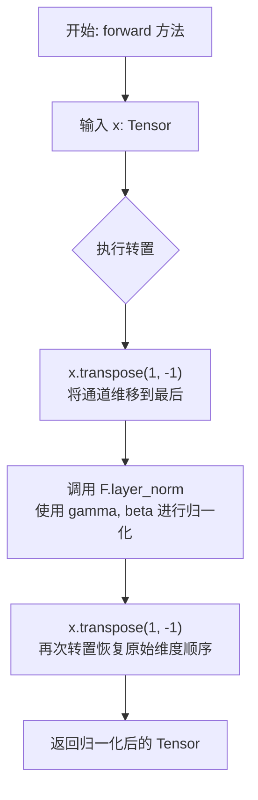
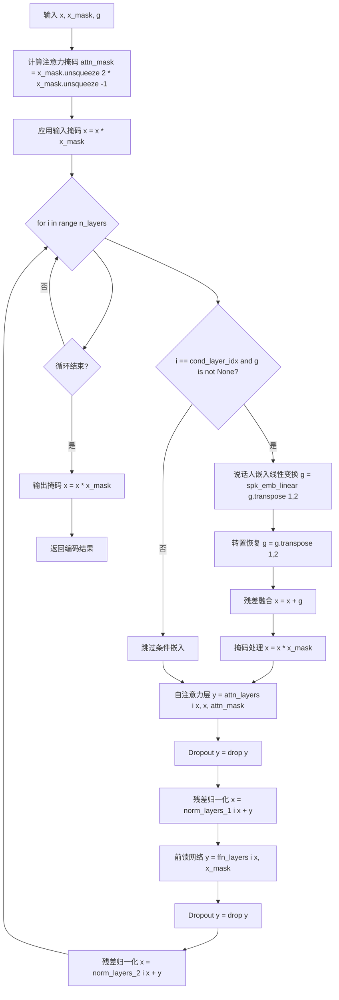
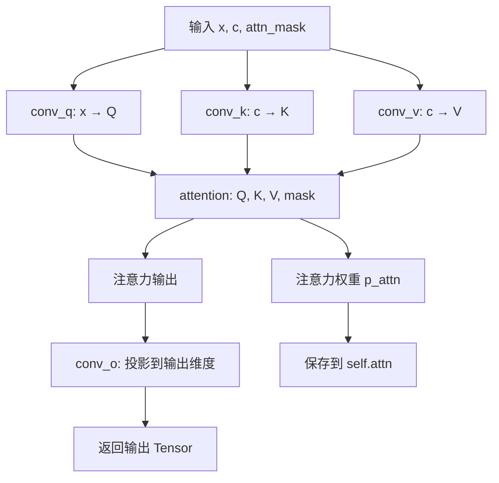
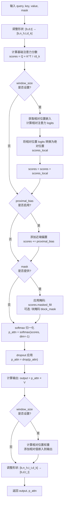

# `Bert-VITS2\onnx_modules\V240\attentions_onnx.py` 详细设计文档

该代码实现了一个基于Transformer架构的神经网络编码器（Encoder），主要用于语音合成（VITS）或语音处理模型中的声学特征提取。它包含了多头自注意力机制（MultiHeadAttention）、前馈网络（FFN）、层归一化（LayerNorm）以及说话人嵌入注入逻辑，支持相对位置编码以提升长序列建模能力。

## 整体流程

```mermaid
graph TD
    Input[输入: x, x_mask, g] --> Init[初始化 Encoder]
    Init --> MaskPrep[x = x * x_mask]
    MaskPrep --> Loop{i < n_layers}
    Loop -- 是 --> CondCheck{i == cond_layer_idx & g is not None}
    CondCheck -- 是 --> Inject[嵌入注入: x = x + spk_emb_linear(g)]
    CondCheck -- 否 --> Attn[自注意力层: y = attn_layers[i](x, x, attn_mask)]
    Inject --> Attn
    Attn --> AddNorm1[x = norm_layers_1[i](x + y)]
    AddNorm1 --> FFN[前馈层: y = ffn_layers[i](x, x_mask)]
    FFN --> AddNorm2[x = norm_layers_2[i](x + y)]
    AddNorm2 --> Loop
    Loop -- 否 --> FinalMask[x = x * x_mask]
    FinalMask --> Output[输出: x]
```

## 类结构

```
torch.nn.Module (基类)
├── LayerNorm (层归一化)
├── Encoder (编码器主类)
│   ├── MultiHeadAttention (多头注意力)
│   │   └── attention (注意力计算核心)
│   ├── FFN (前馈神经网络)
│   │   ├── _causal_padding (因果填充)
│   │   └── _same_padding (相同填充)
```

## 全局变量及字段


### `logger`
    
用于记录调试和错误信息的日志记录器

类型：`logging.Logger`
    


### `math`
    
Python 标准数学库，提供数学运算函数

类型：`module`
    


### `torch`
    
PyTorch 核心库，提供张量运算和神经网络功能

类型：`module`
    


### `nn`
    
PyTorch 神经网络模块，提供层和模型定义

类型：`module`
    


### `F`
    
PyTorch 函数库，提供各种函数式操作

类型：`module`
    


### `commons`
    
外部通用工具模块，包含形状转换等辅助函数

类型：`module`
    


### `LayerNorm.channels`
    
通道数，表示输入特征的维度

类型：`int`
    


### `LayerNorm.eps`
    
防止除零的 epsilon 值，用于数值稳定性

类型：`float`
    


### `LayerNorm.gamma`
    
缩放参数，用于层归一化的可学习缩放系数

类型：`nn.Parameter`
    


### `LayerNorm.beta`
    
偏移参数，用于层归一化的可学习偏移系数

类型：`nn.Parameter`
    


### `Encoder.hidden_channels`
    
隐藏层维度，表示模型内部表示的宽度

类型：`int`
    


### `Encoder.filter_channels`
    
FFN 过滤维度，用于前馈网络的中间层维度

类型：`int`
    


### `Encoder.n_heads`
    
注意力头数，决定多头注意力的并行数量

类型：`int`
    


### `Encoder.n_layers`
    
编码器层数，表示堆叠的层数

类型：`int`
    


### `Encoder.kernel_size`
    
卷积核大小，用于卷积操作的核尺寸

类型：`int`
    


### `Encoder.p_dropout`
    
dropout 概率，用于随机丢弃神经元以防止过拟合

类型：`float`
    


### `Encoder.window_size`
    
相对注意力窗口大小，用于相对位置编码的上下文范围

类型：`int`
    


### `Encoder.attn_layers`
    
注意力层列表，存储多头注意力模块

类型：`nn.ModuleList`
    


### `Encoder.norm_layers_1`
    
注意力后的归一化层列表，用于残差连接后的归一化

类型：`nn.ModuleList`
    


### `Encoder.ffn_layers`
    
FFN 层列表，存储前馈神经网络模块

类型：`nn.ModuleList`
    


### `Encoder.norm_layers_2`
    
FFN 后的归一化层列表，用于残差连接后的归一化

类型：`nn.ModuleList`
    


### `Encoder.spk_emb_linear`
    
说话人嵌入线性层，用于将说话人特征映射到隐藏空间

类型：`nn.Linear`
    


### `MultiHeadAttention.channels`
    
输入通道，表示输入特征的维度

类型：`int`
    


### `MultiHeadAttention.out_channels`
    
输出通道，表示输出特征的维度

类型：`int`
    


### `MultiHeadAttention.n_heads`
    
头数，表示多头注意力的并行数量

类型：`int`
    


### `MultiHeadAttention.k_channels`
    
每个头的维度，计算得到每个注意力头的向量维度

类型：`int`
    


### `MultiHeadAttention.conv_q`
    
查询卷积层，用于将输入投影为查询向量

类型：`nn.Conv1d`
    


### `MultiHeadAttention.conv_k`
    
键卷积层，用于将输入投影为键向量

类型：`nn.Conv1d`
    


### `MultiHeadAttention.conv_v`
    
值卷积层，用于将输入投影为值向量

类型：`nn.Conv1d`
    


### `MultiHeadAttention.conv_o`
    
输出卷积层，用于将注意力输出投影到目标维度

类型：`nn.Conv1d`
    


### `MultiHeadAttention.window_size`
    
相对位置编码窗口，用于限制相对注意力的范围

类型：`int`
    


### `MultiHeadAttention.emb_rel_k`
    
相对位置键嵌入，用于相对位置编码的键表示

类型：`nn.Parameter`
    


### `MultiHeadAttention.emb_rel_v`
    
相对位置值嵌入，用于相对位置编码的值表示

类型：`nn.Parameter`
    


### `FFN.in_channels`
    
输入通道，表示前馈网络的输入维度

类型：`int`
    


### `FFN.out_channels`
    
输出通道，表示前馈网络的输出维度

类型：`int`
    


### `FFN.filter_channels`
    
隐藏层维度，表示前馈网络中间层的维度

类型：`int`
    


### `FFN.kernel_size`
    
卷积核大小，用于卷积操作的核尺寸

类型：`int`
    


### `FFN.conv_1`
    
第一层卷积，用于从输入到隐藏层的映射

类型：`nn.Conv1d`
    


### `FFN.conv_2`
    
第二层卷积，用于从隐藏层到输出的映射

类型：`nn.Conv1d`
    


### `FFN.activation`
    
激活函数类型，指定使用的激活函数如 'gelu' 或 'relu'

类型：`str`
    
    

## 全局函数及方法


### `fused_add_tanh_sigmoid_multiply`

这是一个全局 `torch.jit.script` 装饰的融合函数，用于将加法、Tanh、Sigmoid 和乘法操作融合为一个单一的 CUDA 核函数，通常用于 WaveNet 模型中 Gates 的计算优化，以减少内存访问开销和提升计算效率。

参数：

- `input_a`：`Tensor`，输入张量 A，通常为 WaveNet 的输入激活
- `input_b`：`Tensor`，输入张量 B，通常为 WaveNet 的残差连接或条件输入
- `n_channels`：`List[int]`，通道数列表，用于分割 Tanh 和 Sigmoid 的输入通道，格式为 `[n_channels]`

返回值：`Tensor`，返回融合后的激活结果，形状为 `[batch, n_channels, time]`

#### 流程图

```mermaid
flowchart TD
    A[输入 input_a] --> D[加法操作]
    B[输入 input_b] --> D
    D --> E[in_act = input_a + input_b]
    E --> F{通道分割}
    F -->|前 n_channels 通道| G[t_act = torch.tanh<br/>in_act[:, :n_channels_int, :]]
    F -->|后 n_channels 通道| H[s_act = torch.sigmoid<br/>in_act[:, n_channels_int:, :]]
    G --> I[acts = t_act * s_act]
    H --> I
    I --> J[返回 acts]
```

#### 带注释源码

```python
@torch.jit.script
def fused_add_tanh_sigmoid_multiply(input_a: Tensor, input_b: Tensor, n_channels: List[int]) -> Tensor:
    """
    融合的加法、Tanh、Sigmoid 和乘法操作，用于 WaveNet 模型优化。
    
    该函数将以下操作融合为一个 CUDA 核函数：
    1. input_a + input_b (加法)
    2. torch.tanh(...) (Tanh 激活)
    3. torch.sigmoid(...) (Sigmoid 激活)
    4. t_act * s_act (逐元素乘法)
    
    这种融合可以减少内存带宽消耗并提升计算效率。
    
    参数:
        input_a: 输入张量 A，形状为 [batch, 2*n_channels, time]
        input_b: 输入张量 B，形状为 [batch, 2*n_channels, time]
        n_channels: 通道数列表，用于分割输入通道
    
    返回:
        融合后的激活张量，形状为 [batch, n_channels, time]
    """
    # 从列表中提取通道数整数
    n_channels_int = n_channels[0]
    
    # 步骤1: 将两个输入张量相加 (残差连接或条件输入)
    in_act = input_a + input_b
    
    # 步骤2: 对前半部分通道应用 Tanh 激活 (通常用于 input gate)
    t_act = torch.tanh(in_act[:, :n_channels_int, :])
    
    # 步骤3: 对后半部分通道应用 Sigmoid 激活 (通常用于 forget gate)
    s_act = torch.sigmoid(in_act[:, n_channels_int:, :])
    
    # 步骤4: 逐元素相乘得到最终输出 (门控机制)
    acts = t_act * s_act
    
    return acts
```

---

#### 技术债务与优化空间

1. **硬编码的通道分割方式**：函数假设输入通道数是 `2 * n_channels`，前 `n_channels` 用于 Tanh，后 `n_channels` 用于 Sigmoid。这种硬编码缺乏灵活性，建议将分割点作为参数传入。

2. **n_channels 参数设计不佳**：使用 `List[int]` 而非直接的 `int` 类型不够直观，增加了 JIT 优化的复杂性，且列表解引用 `n_channels[0]` 可能在某些边界情况下导致问题。

3. **缺乏类型注解的完整性**：虽然使用了 `@torch.jit.script`，但参数和返回值可以添加更精确的类型注解以提升可读性和优化效果。

4. **未充分利用的融合函数**：该函数虽然在 WaveNet 中常用，但当前代码库中的 `Encoder` 类并未直接使用此函数，可能存在遗留代码或优化潜力未被挖掘。


### `LayerNorm.forward`

该方法执行层归一化（Layer Normalization）操作，首先对输入张量的维度进行转置以适配 PyTorch 的 `F.layer_norm` 函数要求，执行归一化后再将维度转置回原始顺序，主要用于处理序列数据中通道（channel）维度的归一化。

参数：

- `x`：`torch.Tensor`，输入的张量，形状为 `(batch, channels, time)` 或类似的多维张量

返回值：`torch.Tensor`，返回经过层归一化并转置后的张量，形状与输入相同

#### 流程图



#### 带注释源码

```python
def forward(self, x):
    """
    执行层归一化并转置
    
    参数:
        x: 输入张量，形状为 (batch, channels, time) 或类似多维张量
        
    返回:
        经过层归一化并转置后的张量
    """
    # 第一次转置：将通道维从位置1移到最后一位
    # 原因：F.layer_norm 期望最后维度为特征维度
    x = x.transpose(1, -1)
    
    # 执行层归一化
    # 参数:
    #   - x: 转置后的输入
    #   - (self.channels,): 归一化的特征维度
    #   - self.gamma: 可学习的缩放参数（初始化为全1）
    #   - self.beta: 可学习的偏移参数（初始化为全0）
    #   - self.eps: 防止除零的小常数（默认1e-5）
    x = F.layer_norm(x, (self.channels,), self.gamma, self.beta, self.eps)
    
    # 第二次转置：将维度顺序恢复为原始顺序
    # 使输出与后续层（如卷积层）的维度期望一致
    return x.transpose(1, -1)
```

#### 关键技术细节

| 项目 | 描述 |
|------|------|
| **归一化维度** | 沿通道维度（channels）进行归一化 |
| **可学习参数** | `gamma`（缩放系数）和 `beta`（偏移系数） |
| **转置原因** | `F.layer_norm` 要求归一化维度为最后维度，需先转置处理后再转置回来 |
| **eps 参数** | 默认值 `1e-5`，用于数值稳定性，防止标准差为0时除零 |


### `Encoder.forward`

该方法是 VITS 语音合成模型中编码器的核心前向传播函数，通过多层自注意力（MultiHeadAttention）和前馈网络（FFN）结构对输入序列进行特征编码，并在指定层级支持通过说话人嵌入（speaker embedding）实现条件控制。

参数：

- `x`：`torch.Tensor`，输入的隐层特征序列，形状为 (batch, channels, time)
- `x_mask`：`torch.Tensor`，时间维度掩码，用于标识有效时间步，形状为 (batch, time)
- `g`：`torch.Tensor`（可选），说话人嵌入向量，形状为 (batch, gin_channels, 1)，用于条件控制

返回值：`torch.Tensor`，编码后的隐层特征序列，形状为 (batch, hidden_channels, time)

#### 流程图



#### 带注释源码

```python
def forward(self, x, x_mask, g=None):
    """
    编码器前向传播，支持条件嵌入
    
    参数:
        x: 输入隐层特征 (B, C, T)
        x_mask: 时间掩码 (B, T)
        g: 说话人嵌入向量，可选 (B, gin_channels, 1)
    
    返回:
        编码后的隐层特征 (B, hidden_channels, T)
    """
    # 计算自注意力掩码：两个维度相乘得到 (B, T, T) 的掩码矩阵
    # 确保 padding 位置不参与注意力计算
    attn_mask = x_mask.unsqueeze(2) * x_mask.unsqueeze(-1)
    
    # 对输入应用掩码，将 padding 位置置零
    x = x * x_mask
    
    # 遍历每一层编码器模块
    for i in range(self.n_layers):
        # 条件嵌入注入：当达到指定层级且提供说话人嵌入时
        if i == self.cond_layer_idx and g is not None:
            # 说话人嵌入线性变换到隐藏维度
            # (B, gin_channels, 1) -> (B, hidden_channels, 1)
            g = self.spk_emb_linear(g.transpose(1, 2))
            # 恢复通道维度位置
            g = g.transpose(1, 2)
            # 残差连接：融入说话人信息
            x = x + g
            # 再次应用掩码，确保条件嵌入不影响 padding 位置
            x = x * x_mask
        
        # 自注意力层：计算多头自注意力
        # 输入: x, x, attn_mask (query, key, mask)
        y = self.attn_layers[i](x, x, attn_mask)
        # Dropout 正则化
        y = self.drop(y)
        # 残差连接 + 层归一化
        x = self.norm_layers_1[i](x + y)
        
        # 前馈网络层：逐位置变换
        y = self.ffn_layers[i](x, x_mask)
        # Dropout 正则化
        y = self.drop(y)
        # 残差连接 + 层归一化
        x = self.norm_layers_2[i](x + y)
    
    # 最终输出掩码处理
    x = x * x_mask
    return x
```


### `MultiHeadAttention.forward`

该方法是Transformer架构中多头注意力机制的核心实现，通过三个卷积层将输入投影为Query、Key和Value向量，调用注意力计算函数得到加权的上下文表示，最后经输出卷积层生成最终特征。

参数：

- `x`：`Tensor`，输入张量，作为Query的来源
- `c`：`Tensor`，上下文张量，用于生成Key和Value
- `attn_mask`：`Tensor = None`，可选的注意力掩码，用于屏蔽特定位置的注意力权重

返回值：`Tensor`，经过注意力机制加权后的输出特征

#### 流程图



#### 带注释源码

```python
def forward(self, x, c, attn_mask=None):
    """
    多头注意力前向传播
    
    参数:
        x: 输入张量 [batch, channels, time]
        c: 上下文张量 [batch, channels, time]
        attn_mask: 注意力掩码 [batch, time, time]
    
    返回:
        输出张量 [batch, out_channels, time]
    """
    # 第一步：使用三个卷积层进行线性投影
    # 将输入通道维度投影到多头注意力的隐藏维度
    q = self.conv_q(x)  # Query: [batch, channels, time]
    k = self.conv_k(c)  # Key:   [batch, channels, time]
    v = self.conv_v(c)  # Value: [batch, channels, time]

    # 第二步：计算注意力
    # 返回注意力输出和注意力权重矩阵
    x, self.attn = self.attention(q, k, v, mask=attn_mask)

    # 第三步：输出投影
    # 将多头注意力的输出映射回目标通道数
    x = self.conv_o(x)
    return x
```


### `MultiHeadAttention.attention`

该方法实现了多头注意力的核心计算逻辑，接收查询、键、值张量以及可选的掩码，计算注意力分数并返回加权后的输出和注意力权重矩阵。支持相对位置编码、局部块注意力（block attention）和近端偏置（proximal bias）等高级特性。

参数：

- `query`：`torch.Tensor`，形状为 [batch, channels, time]，查询向量，由卷积层从输入 x 变换得到
- `key`：`torch.Tensor`，形状为 [batch, channels, time]，键向量，由卷积层从上下文 c 变换得到
- `value`：`torch.Tensor`，形状为 [batch, channels, time]，值向量，由卷积层从上下文 c 变换得到
- `mask`：`torch.Tensor`，可选，形状为 [batch, 1, time, time] 或 [batch, 1, time, time] 的掩码矩阵，用于屏蔽某些位置的注意力计算

返回值：

- `output`：`torch.Tensor`，形状为 [batch, channels, time]，注意力加权后的输出
- `p_attn`：`torch.Tensor`，形状为 [batch, n_heads, time, time]，注意力权重矩阵

#### 流程图



#### 带注释源码

```python
def attention(self, query, key, value, mask=None):
    """
    多头注意力核心计算
    
    参数:
        query: [b, d, t_t] 查询向量
        key: [b, d, t_s] 键向量
        value: [b, d, t_s] 值向量
        mask: 可选的注意力掩码
    
    返回:
        output: [b, d, t_t] 注意力输出
        p_attn: [b, n_h, t_t, t_s] 注意力权重
    """
    # ===== 步骤1: 形状变换 =====
    # 将 [batch, channels, time] 变换为 [batch, n_heads, time, k_channels]
    # b=batch, d=channels, t_s=key的时间步, t_t=query的时间步
    b, d, t_s, t_t = (*key.size(), query.size(2))
    
    # view + transpose 实现通道到头的维度划分
    # query: [b, n_h, k_c, t_t] -> [b, n_h, t_t, k_c]
    query = query.view(b, self.n_heads, self.k_channels, t_t).transpose(2, 3)
    # key: [b, n_h, k_c, t_s] -> [b, n_h, t_s, k_c]
    key = key.view(b, self.n_heads, self.k_channels, t_s).transpose(2, 3)
    # value: [b, n_h, k_c, t_s] -> [b, n_h, t_s, k_c]
    value = value.view(b, self.n_heads, self.k_channels, t_s).transpose(2, 3)

    # ===== 步骤2: 计算基础注意力分数 =====
    # QK^T / sqrt(d_k)，缩放点积注意力
    scores = torch.matmul(query / math.sqrt(self.k_channels), key.transpose(-2, -1))
    
    # ===== 步骤3: 相对位置编码 (可选) =====
    if self.window_size is not None:
        # 相对注意力仅支持自注意力 (t_s == t_t)
        assert t_s == t_t, "Relative attention is only available for self-attention."
        
        # 获取相对位置键嵌入
        key_relative_embeddings = self._get_relative_embeddings(self.emb_rel_k, t_s)
        
        # 计算查询与相对键的乘法
        rel_logits = self._matmul_with_relative_keys(
            query / math.sqrt(self.k_channels), key_relative_embeddings
        )
        
        # 转换相对位置logits到绝对位置
        scores_local = self._relative_position_to_absolute_position(rel_logits)
        
        # 累加相对位置注意力分数
        scores = scores + scores_local
    
    # ===== 步骤4: 近端偏置 (可选) =====
    # 鼓励模型关注相近位置
    if self.proximal_bias:
        assert t_s == t_t, "Proximal bias is only available for self-attention."
        scores = scores + self._attention_bias_proximal(t_s).to(
            device=scores.device, dtype=scores.dtype
        )
    
    # ===== 步骤5: 掩码处理 =====
    if mask is not None:
        # 将掩码为0的位置设为极负值，使其在softmax后接近0
        scores = scores.masked_fill(mask == 0, -1e4)
        
        # 局部块注意力：限制每个位置只能关注特定范围内的其他位置
        if self.block_length is not None:
            assert t_s == t_t, "Local attention is only available for self-attention."
            # 创建上三角掩码，保留对角线附近 block_length 范围内的值
            block_mask = (
                torch.ones_like(scores)
                .triu(-self.block_length)    # 上三角置0（保留下三角和部分上三角）
                .tril(self.block_length)     # 下三角置0（保留上三角和部分下三角）
            )
            scores = scores.masked_fill(block_mask == 0, -1e4)
    
    # ===== 步骤6: Softmax 归一化 =====
    # 计算注意力权重 p_attn: [b, n_h, t_t, t_s]
    p_attn = F.softmax(scores, dim=-1)
    
    # 应用dropout（训练时随机置零注意力权重，防止过拟合）
    p_attn = self.drop(p_attn)
    
    # ===== 步骤7: 加权求和 =====
    # output = p_attn × V
    output = torch.matmul(p_attn, value)
    
    # ===== 步骤8: 相对值编码 (可选) =====
    if self.window_size is not None:
        # 将注意力权重从绝对位置转换到相对位置表示
        relative_weights = self._absolute_position_to_relative_position(p_attn)
        
        # 获取相对值嵌入
        value_relative_embeddings = self._get_relative_embeddings(
            self.emb_rel_v, t_s
        )
        
        # 相对值加权求和并添加到输出
        output = output + self._matmul_with_relative_values(
            relative_weights, value_relative_embeddings
        )
    
    # ===== 步骤9: 形状恢复 =====
    # 从 [b, n_h, t_t, k_c] 变换回 [b, d, t_t]
    output = (
        output.transpose(2, 3).contiguous().view(b, d, t_t)
    )
    
    return output, p_attn
```


### `MultiHeadAttention._get_relative_embeddings`

该方法用于获取相对位置编码（Relative Position Embeddings），通过填充和切片操作从预定义的相对位置嵌入矩阵中提取与当前序列长度对应的嵌入向量，用于计算注意力机制中的相对位置偏置。

参数：

- `self`：类的实例本身，包含窗口大小等配置信息
- `relative_embeddings`：`torch.Parameter`，预定义的相对位置嵌入矩阵，形状为 [n_heads_rel, 2*window_size+1, k_channels]
- `length`：`int`，当前序列的长度，用于确定需要提取的嵌入范围

返回值：`torch.Tensor`，提取后的相对位置嵌入，形状为 [n_heads_rel, 2*length-1, k_channels]

#### 流程图

```mermaid
flowchart TD
    A[开始] --> B[计算最大相对位置范围: max_relative_position = 2 * window_size + 1]
    B --> C[计算需要填充的长度: pad_length = max(length - (window_size + 1), 0)]
    C --> D[计算切片起始位置: slice_start_position = max((window_size + 1) - length, 0)]
    D --> E[计算切片结束位置: slice_end_position = slice_start_position + 2 * length - 1]
    E --> F{pad_length > 0?}
    F -->|是| G[对relative_embeddings进行填充]
    F -->|否| H[使用原始relative_embeddings]
    G --> I[获取填充后的嵌入矩阵]
    H --> I
    I --> J[切片提取: used_relative_embeddings = padded_relative_embeddings[:, slice_start_position:slice_end_position]]
    J --> K[返回提取的相对位置嵌入]
```

#### 带注释源码

```python
def _get_relative_embeddings(self, relative_embeddings, length):
    """
    从预定义的相对位置嵌入中提取与当前序列长度对应的嵌入向量。
    
    该方法处理相对位置编码的边界情况：
    - 当序列长度小于等于window_size+1时，不需要填充
    - 当序列长度大于window_size+1时，需要在嵌入矩阵两端进行填充
    
    参数:
        relative_embeddings: 预定义的相对位置嵌入，形状为 [n_heads_rel, 2*window_size+1, k_channels]
        length: 当前序列长度
        
    返回:
        提取的相对位置嵌入，形状为 [n_heads_rel, 2*length-1, k_channels]
    """
    # 计算最大相对位置范围（用于索引验证）
    max_relative_position = 2 * self.window_size + 1
    
    # 计算需要填充的长度：如果序列长度大于window_size+1，则需要填充
    # 填充的目的是确保切片操作能够获取足够的嵌入向量
    pad_length = max(length - (self.window_size + 1), 0)
    
    # 计算切片起始位置：
    # 当序列长度小于window_size+1时，需要从嵌入矩阵的中间部分开始切片
    # 这样可以确保相对位置编码的正确对齐
    slice_start_position = max((self.window_size + 1) - length, 0)
    
    # 计算切片结束位置：起始位置 + 2*length - 1
    # 这是因为相对位置范围是从 -length+1 到 length-1，共2*length-1个位置
    slice_end_position = slice_start_position + 2 * length - 1
    
    # 根据是否需要填充选择处理方式
    if pad_length > 0:
        # 如果需要填充，在嵌入矩阵的第二个维度（相对位置维度）两端填充相同的值
        # 这样可以扩展嵌入矩阵以适应更长的序列
        padded_relative_embeddings = F.pad(
            relative_embeddings,
            commons.convert_pad_shape([[0, 0], [pad_length, pad_length], [0, 0]]),
        )
    else:
        # 如果不需要填充，直接使用原始嵌入矩阵
        padded_relative_embeddings = relative_embeddings
    
    # 从填充后的嵌入矩阵中切片提取需要的部分
    # 切片范围确保了相对位置编码与当前序列长度相匹配
    used_relative_embeddings = padded_relative_embeddings[
        :, slice_start_position:slice_end_position
    ]
    
    return used_relative_embeddings
```


### `MultiHeadAttention._matmul_with_relative_values` 和 `MultiHeadAttention._matmul_with_relative_keys`

这两个方法用于在多头注意力机制中计算相对位置编码的值（values）和键（keys）加权，是相对位置编码（Relative Position Encoding）计算的核心组成部分，用于在自注意力中加入位置信息。

#### 参数

- `self`：隐式参数，`MultiHeadAttention`类的实例本身
- `x`：Tensor，形状为`[b, h, l, d]`（对于`_matmul_with_relative_keys`）或`[b, h, l, m]`（对于`_matmul_with_relative_values`），表示查询（query）或注意力权重
- `y`：Tensor，形状为`[h or 1, m, d]`，表示相对位置的嵌入向量（embedding）

#### 返回值

- `ret`：
  - `_matmul_with_relative_values`：返回类型为`Tensor`，形状为`[b, h, l, d]`，表示相对位置值加权后的输出
  - `_matmul_with_relative_keys`：返回类型为`Tensor`，形状为`[b, h, l, m]`，表示相对位置键的注意力分数logits

#### 流程图

```mermaid
flowchart TD
    A[输入 x 和相对位置嵌入 y] --> B{判断方法类型}
    B -->|相对值计算| C[_matmul_with_relative_values]
    B -->|相对键计算| D[_matmul_with_relative_keys]
    
    C --> C1[对y进行unsqueeze(0)操作<br/>y: h, m, d -> 1, h, m, d]
    C --> C2[执行torch.matmul<br/>x: b,h,l,m × y: 1,h,m,d -> b,h,l,d]
    C2 --> C3[返回结果 ret]
    
    D --> D1[对y进行unsqueeze(0)和transpose(-2,-1)<br/>y: h,m,d -> 1,h,d,m]
    D --> D2[执行torch.matmul<br/>x: b,h,l,d × y: 1,h,d,m -> b,h,l,m]
    D2 --> D3[返回结果 ret]
```

#### 带注释源码

```python
def _matmul_with_relative_values(self, x, y):
    """
    相对位置值加权计算
    
    参数:
        x: [b, h, l, m] - 注意力权重，b=batch, h=heads, l=length, m=relative positions
        y: [h or 1, m, d] - 相对位置嵌入，d=key dimension
    返回:
        ret: [b, h, l, d] - 相对位置值加权后的输出
    """
    # 使用unsqueeze(0)在第0维添加批次维度，以适配广播机制
    # y从 [h, m, d] 扩展为 [1, h, m, d]
    # 然后与 x [b, h, l, m] 进行矩阵乘法
    # 结果形状: [b, h, l, d]
    ret = torch.matmul(x, y.unsqueeze(0))
    return ret


def _matmul_with_relative_keys(self, x, y):
    """
    相对位置键（Key）的注意力分数计算
    
    参数:
        x: [b, h, l, d] - 查询向量，b=batch, h=heads, l=length, d=key dimension
        y: [h or 1, m, d] - 相对位置嵌入
    返回:
        ret: [b, h, l, m] - 相对位置键的注意力分数logits
    """
    # 对y进行两操作：
    # 1. unsqueeze(0): [h, m, d] -> [1, h, m, d]
    # 2. transpose(-2, -1): [1, h, m, d] -> [1, h, d, m]
    # 然后与 x [b, h, l, d] 进行矩阵乘法
    # 结果形状: [b, h, l, m]
    ret = torch.matmul(x, y.unsqueeze(0).transpose(-2, -1))
    return ret
```

#### 关键组件信息

| 组件名称 | 一句话描述 |
|---------|-----------|
| `_matmul_with_relative_values` | 计算相对位置嵌入的值（value）加权输出 |
| `_matmul_with_relative_keys` | 计算相对位置嵌入的键（key）注意力分数 |

#### 潜在技术债务与优化空间

1. **广播机制依赖**：代码依赖于PyTorch的广播机制来处理`y`的维度扩展（从`[h, m, d]`到`[1, h, m, d]`），如果维度不匹配可能导致难以调试的错误
2. **内存效率**：在处理长序列时，`[b, h, l, m]`形状的张量可能占用大量内存，可考虑使用分块计算或混合精度
3. **硬编码的缩放因子**：在外部调用时使用`query / math.sqrt(self.k_channels)`进行缩放，这些缩放逻辑可以内聚到方法内部以提高封装性

#### 其它项目

**设计目标**：实现Transformer中的相对位置编码（Relative Position Encoding），使模型能够学习到序列中的相对位置信息，而非仅依赖绝对位置

**调用链**：
```
attention() 
  ├──> _matmul_with_relative_keys() -> _relative_position_to_absolute_position() 
  └──> _matmul_with_relative_values() <- _absolute_position_to_relative_position() 
```


### `FFN.forward`

该函数实现了一个基于一维卷积的前馈网络（Feed-Forward Network, FFN）模块。在 VITS（Variational Inference with adversarial learning for end-to-end Text-to-Speech）等模型中，它通常用于对注意力机制的输出进行进一步的非线性变换和特征提取。流程上，该模块接收带掩码的输入序列，先通过卷积扩展通道维度（Expansion），应用激活函数和 Dropout，再通过卷积收缩通道维度（Compression），并确保输出序列的掩码区域被清零。

参数：

-  `self`：类实例本身。
-  `x`：`torch.Tensor`，输入张量，形状通常为 `[Batch, Channels, Time]`。
-  `x_mask`：`torch.Tensor`，掩码张量，形状通常为 `[Batch, Time]` 或 `[Batch, 1, Time]`，用于标识有效序列（值为1）和填充部分（值为0）。

返回值：`torch.Tensor`，经过处理后的输出张量，形状与输入 `x` 相同 (`[Batch, Channels, Time]`)。

#### 流程图

```mermaid
graph TD
    A([输入 x, x_mask]) --> B[应用输入掩码<br>x * x_mask]
    B --> C{选择 Padding 模式}
    C -->|Causal| D[_causal_padding]
    C -->|Same| E[_same_padding]
    D --> F[卷积层 1: in_channels -> filter_channels]
    E --> F
    F --> G{激活函数类型}
    G -->|GELU| H[近似 GELU: x * sigmoid(1.702 * x)]
    G -->|ReLU| I[ReLU: torch.relu]
    H --> J[Dropout]
    I --> J
    J --> K[Padding]
    K --> L[卷积层 2: filter_channels -> out_channels]
    L --> M[应用输出掩码<br>x * x_mask]
    M --> N([返回 Tensor])
```

#### 带注释源码

```python
def forward(self, x, x_mask):
    """
    FFN 的前向传播过程。

    Args:
        x (torch.Tensor): 输入特征，形状为 [B, C, T]。
        x_mask (torch.Tensor): 掩码，用于将 padding 位置置零，形状为 [B, T] 或 [B, 1, T]。

    Returns:
        torch.Tensor: 输出特征，形状为 [B, C, T]。
    """
    # 1. 输入掩码处理：将 x 中对应 x_mask 为 0 的位置强制置零，防止卷积跨越 padding 边界
    x = self.conv_1(self.padding(x * x_mask))
    
    # 2. 激活函数：根据配置选择 GELU 或默认的 ReLU
    if self.activation == "gelu":
        # 使用近似算法实现的 GELU，公式近似于 x * P(X <= x)
        x = x * torch.sigmoid(1.702 * x)
    else:
        x = torch.relu(x)
    
    # 3. Dropout：随机丢弃部分神经元，防止过拟合
    x = self.drop(x)
    
    # 4. 第二次卷积：将特征从高维 filter_channels 映射回原始 out_channels
    # 注意：这里再次应用了 padding，以确保序列长度保持一致
    x = self.conv_2(self.padding(x * x_mask))
    
    # 5. 输出掩码处理：确保输出在 padding 位置同样为 0
    return x * x_mask
```


### `FFN._causal_padding(x)`

因果填充（Causal Padding）是卷积神经网络中的一种填充方式，用于确保输出时间步 t 仅依赖于输入时间步 ≤ t 的信息，从而满足因果性（causality）约束。在时间序列建模（如 WaveNet、VITS 等音频生成模型）中，为防止未来信息泄露到当前时刻的输出，需要对卷积进行左侧填充。

参数：

- `x`：`Tensor`，输入张量，形状为 [batch, channels, time]

返回值：`Tensor`，填充后的张量，形状为 [batch, channels, time + (kernel_size - 1)]

#### 流程图

```mermaid
flowchart TD
    A[输入 x] --> B{kernel_size == 1?}
    B -->|Yes| C[直接返回 x]
    B -->|No| D[计算左侧填充宽度: pad_l = kernel_size - 1]
    D --> E[设置右侧填充宽度: pad_r = 0]
    E --> F[构建填充维度: [[0, 0], [0, 0], [pad_l, pad_r]]]
    F --> G[调用 F.pad 进行填充]
    G --> C
    C --> H[返回填充后的张量]
```

#### 带注释源码

```python
def _causal_padding(self, x):
    """
    对输入张量进行因果填充（左侧填充）。
    因果填充确保输出时间步 t 仅依赖于输入时间步 ≤ t，
    防止未来信息泄露到当前时刻。
    
    Args:
        x: 输入张量，形状为 [batch, channels, time]
    
    Returns:
        填充后的张量，形状为 [batch, channels, time + (kernel_size - 1)]
    """
    # 如果卷积核大小为1，则不需要填充（1x1卷积不改变时间维度）
    if self.kernel_size == 1:
        return x
    
    # 计算左侧填充宽度：kernel_size - 1
    # 例如：kernel_size=3 时，左侧填充2个时间步，右侧填充0个时间步
    pad_l = self.kernel_size - 1
    
    # 右侧不填充，保证因果性
    pad_r = 0
    
    # 填充维度说明：
    # - 第一个 [0, 0]: batch 维度不填充
    # - 第二个 [0, 0]: channel 维度不填充
    # - 第三个 [pad_l, pad_r]: 时间维度左侧填充，右侧不填充
    padding = [[0, 0], [0, 0], [pad_l, pad_r]]
    
    # 使用 PyTorch 的 F.pad 进行填充
    # commons.convert_pad_shape 用于将 padding 列表转换为 F.pad 所需的格式
    x = F.pad(x, commons.convert_pad_shape(padding))
    
    return x
```


### `FFN._same_padding`

同位填充（Same Padding）方法，根据卷积核大小计算左右两侧的填充量，使卷积操作后输出与输入保持相同的空间维度。

参数：

- `x`：`Tensor`，输入张量，通常为三维张量 [batch, channels, time]

返回值：`Tensor`，完成同位填充后的张量，形状与输入相同

#### 流程图

```mermaid
flowchart TD
    A[开始] --> B{kernel_size == 1?}
    B -->|是| C[直接返回输入张量 x]
    B -->|否| D[计算左侧填充量 pad_l = (kernel_size - 1) // 2]
    D --> E[计算右侧填充量 pad_r = kernel_size // 2]
    E --> F[构建填充形状 [[0, 0], [0, 0], [pad_l, pad_r]]]
    F --> G[调用 F.pad 进行填充]
    G --> H[返回填充后的张量]
    C --> H
```

#### 带注释源码

```python
def _same_padding(self, x):
    """
    对输入张量进行同位填充（Same Padding）
    
    同位填充确保卷积操作后输出特征图的时间维度与输入保持相同，
    通过计算卷积核大小对应的左右填充量实现。
    
    参数:
        x: 输入张量，通常为 [batch, channels, time] 形状的三维张量
    
    返回值:
        完成同位填充后的张量
    """
    # 如果卷积核大小为1，不需要填充（1x1卷积不改变空间维度）
    if self.kernel_size == 1:
        return x
    
    # 计算左侧填充量：对于 kernel_size=3，pad_l = (3-1)//2 = 1
    pad_l = (self.kernel_size - 1) // 2
    
    # 计算右侧填充量：对于 kernel_size=3，pad_r = 3//2 = 1
    # 这样左右各填充1个时间步，总填充2个，保持输出维度不变
    pad_r = self.kernel_size // 2
    
    # 构建填充形状，适配 commons.convert_pad_shape 的格式要求
    # 格式: [[pad_batch_before, pad_batch_after], 
    #        [pad_channel_before, pad_channel_after],
    #        [pad_time_before, pad_time_after]]
    padding = [[0, 0], [0, 0], [pad_l, pad_r]]
    
    # 使用 PyTorch 的 F.pad 进行填充操作
    # 在时间维度（最后一个维度）左右两侧添加指定的填充值
    x = F.pad(x, commons.convert_pad_shape(padding))
    
    return x
```

## 关键组件


### LayerNorm

层归一化模块，对输入张量进行通道级别的归一化处理，支持可学习的缩放(gamma)和偏移(beta)参数。

### fused_add_tanh_sigmoid_multiply

融合的tanh-sigmoid激活函数，通过torch.jit.script优化，用于在单次计算中完成加法、tanh激活、sigmoid激活和乘法操作，提升计算效率。

### Encoder

Transformer风格的编码器核心类，支持多层自注意力(MultiHeadAttention)和前馈网络(FFN)堆叠，包含说话人嵌入(gin_channels)条件注入机制，支持相对位置编码的窗口注意力。

### MultiHeadAttention

多头自注意力机制实现，支持相对位置编码(relative position embeddings)、局部块注意力(block attention)、邻近偏置(proximal bias)等功能，通过卷积层实现Q/K/V投影，包含多种注意力掩码策略。

### FFN

前馈神经网络模块，支持因果卷积(causal)和相同填充(same padding)两种模式，激活函数可选relu或gelu，用于特征的非线性变换。

### 张量索引与形状变换

代码中大量使用transpose、view、reshape等操作进行张量维度变换，特别是注意力计算中[b, d, t]到[b, n_h, t, d_k]的形状重塑，以及相对位置编码的绝对/相对位置转换算法。

### 惰性加载与条件初始化

通过kwargs字典实现条件的参数初始化，如gin_channels、cond_layer_idx等参数仅在提供时才创建对应的网络层，支持运行时配置编码器结构。

### 相对位置编码

实现了相对位置嵌入的生成、绝对位置到相对位置的转换(_absolute_position_to_relative_position)以及相对位置到绝对位置的转换(_relative_position_to_absolute_position)，支持滑动窗口注意力机制。

### 说话人嵌入支持

Encoder类通过cond_layer_idx参数控制说话人嵌入注入的层位置，使用spk_emb_linear线性层将说话人特征映射到隐藏空间并与输入特征相加。


## 问题及建议


### 已知问题

- **硬编码的GELU近似实现**：FFN类中使用 `x = x * torch.sigmoid(1.702 * x)` 手动实现GELU，而非使用 `F.gelu()`，可读性差且精度可能不一致
- **注释掉的死代码**：Encoder类中存在大量注释掉的 `cond_layer` 相关代码（约10行），增加理解负担
- **fused_add_tanh_sigmoid_multiply 参数设计不合理**：函数签名中 `n_channels` 要求传入列表 `n_channels[0]`，这种设计容易导致误用
- **相对位置编码初始化方式简单**：使用 `torch.randn` 直接初始化，可能导致训练不稳定，应使用更好的初始化策略
- **attention方法中频繁的tensor变换**：多次调用 `.transpose()` 和 `.view()` 创建中间张量，未使用 `.reshape()`，代码可读性和性能有提升空间
- **Encoder中条件分支重复计算**：每层前向传播都检查 `if i == self.cond_layer_idx and g is not None`，效率较低

### 优化建议

- 使用 `F.gelu()` 替代手动GELU实现，或提供激活函数配置选项
- 删除注释掉的死代码块，或用 `TODO` / `FIXME` 标记待恢复功能
- 修改 `fused_add_tanh_sigmoid_multiply` 参数为整数类型 `n_channels: int`
- 使用 `nn.init.trunc_normal_` 或 Xavier 初始化相对位置编码参数
- 统一使用 `.reshape()` 替代部分 `.view()` 和 `.transpose()` 调用
- 考虑在Encoder初始化时预先计算条件层位置，避免运行时频繁判断

## 其它


### 设计目标与约束

本模块设计目标为实现一个基于Transformer架构的高效语音/音频编码器，支持自回归和非自回归模型的前向传播。核心约束包括：(1) 支持可变长度输入序列处理；(2) 兼容说话人嵌入条件注入；(3) 支持相对位置编码的局部注意力机制；(4) 模型需适配VITS2等语音合成框架的输入输出规格。计算约束方面，要求在GPU/CPU环境下均可运行，推理阶段需支持JIT编译优化。

### 错误处理与异常设计

输入验证异常：当x与x_mask的batch维度不匹配时抛出RuntimeError；hidden_channels不能被n_heads整除时在MultiHeadAttention.__init__中触发AssertionError；gin_channels配置与cond_layer_idx冲突时触发assert断言。维度异常：forward方法中若x_mask维度不足以覆盖x的序列长度，后续计算结果将不符合预期但不会抛出异常，设计上依赖调用方保证mask完整性。空值处理：g（说话人嵌入）为None时不执行条件注入逻辑，attn_mask为None时跳过mask应用直接执行标准注意力计算。

### 数据流与状态机

数据流主要分为两条路径：主路径x→MultiHeadAttention→LayerNorm→FFN→LayerNorm→输出，每层均受x_mask控制以屏蔽padding位置；条件路径g→spk_emb_linear线性变换→残差注入到指定层（cond_layer_idx）。状态转移方面，Encoder内部维护两类状态：(1) 训练状态self.training标志位影响dropout行为；(2) 推理状态attn_mask的稀疏程度决定计算密度。多头注意力模块维护self.attn缓存用于梯度反向传播但不用于自回归生成。

### 外部依赖与接口契约

核心依赖包括torch>=1.9.0（张量计算）、torch.nn（神经网络基类）、torch.nn.functional（层归一化、填充操作）、commons模块（convert_pad_shape工具函数）、math（数学运算）、logging（日志记录）。接口契约方面：Encoder.forward(x, x_mask, g=None)要求x维度为[batch, channels, time]，x_mask维度为[batch, time]且为二进制掩码（0表示padding），g维度为[batch, gin_channels]当条件注入启用时；MultiHeadAttention.forward(x, c, attn_mask=None)中x为query源、c为key/value源，支持cross-attention配置；FFN.forward(x, x_mask)中x_mask用于对padding位置进行零输出抑制。

### 性能特性与优化建议

计算复杂度分析：MultiHeadAttention空间复杂度O(n²h)其中n为序列长度、h为头数，时间复杂度O(n²d)其中d为隐层维度；FFN计算量主要来自两次卷积操作。JIT优化：fused_add_tanh_sigmoid_multiply已使用torch.jit.script装饰器加速，但Encoder整体未做JIT封装。内存优化：相对位置编码的emb_rel_k/v参数在window_size较大时占用显著显存，建议按需初始化。缓存优化：attn_weights（self.attn）可在推理时禁用以节省显存。

    