# `Bert-VITS2\onnx_modules\V240\models_onnx.py` 详细设计文档

这是一个VITS（Variational Inference with adversarial learning for end-to-end Text-to-Speech）文本到语音合成模型的核心模块，包含了文本编码器、时长预测器、流模型、后验编码器、生成器（声码器）和多个判别器，支持多说话人、多语言合成，以及基于GAN的对抗训练框架。

## 整体流程

```mermaid
graph TD
A[输入: 文本x, 音调tone, 语言language, BERT特征, 情感特征] --> B[TextEncoder]
B --> C{预测时长]
C --> D[StochasticDurationPredictor / DurationPredictor]
D --> E[时长对齐与注意力掩码生成]
E --> F[对齐后的文本特征]
F --> G[PosteriorEncoder]
G --> H[潜在变量z_p]
H --> I[Flow变换: TransformerCouplingBlock或ResidualCouplingBlock]
I --> J[z流变换]
J --> K[Generator声码器]
K --> L[输出: 波形y]
M[判别器训练] --> N[DiscriminatorP / DiscriminatorS / MultiPeriodDiscriminator / WavLMDiscriminator]
L --> N
N --> O[对抗训练损失]
```

## 类结构

```
nn.Module (基类)
├── DurationDiscriminator
├── TransformerCouplingBlock
├── StochasticDurationPredictor
├── DurationPredictor
├── Bottleneck (Sequential)
├── Block
├── MLP
├── TextEncoder
├── ResidualCouplingBlock
├── PosteriorEncoder
├── Generator
├── DiscriminatorP
├── DiscriminatorS
├── MultiPeriodDiscriminator
├── WavLMDiscriminator
├── ReferenceEncoder
└── SynthesizerTrn (主模型)
```

## 全局变量及字段


### `symbols`
    
List of text symbols/characters used for text encoding

类型：`list`
    


### `num_tones`
    
Number of tone categories for tonal languages

类型：`int`
    


### `num_languages`
    
Number of supported languages for multilingual TTS

类型：`int`
    


### `DurationDiscriminator.in_channels`
    
Number of input channels for the discriminator

类型：`int`
    


### `DurationDiscriminator.filter_channels`
    
Number of channels in the convolutional filters

类型：`int`
    


### `DurationDiscriminator.kernel_size`
    
Kernel size for convolutional layers

类型：`int`
    


### `DurationDiscriminator.p_dropout`
    
Dropout probability for regularization

类型：`float`
    


### `DurationDiscriminator.gin_channels`
    
Number of speaker embedding channels for conditioning

类型：`int`
    


### `DurationDiscriminator.drop`
    
Dropout layer for regularization

类型：`nn.Dropout`
    


### `DurationDiscriminator.conv_1`
    
First 1D convolution layer for feature extraction

类型：`nn.Conv1d`
    


### `DurationDiscriminator.norm_1`
    
Layer normalization after first convolution

类型：`modules.LayerNorm`
    


### `DurationDiscriminator.conv_2`
    
Second 1D convolution layer for deeper features

类型：`nn.Conv1d`
    


### `DurationDiscriminator.norm_2`
    
Layer normalization after second convolution

类型：`modules.LayerNorm`
    


### `DurationDiscriminator.dur_proj`
    
Projection layer for duration features

类型：`nn.Conv1d`
    


### `DurationDiscriminator.LSTM`
    
Bidirectional LSTM for sequential dependency modeling

类型：`nn.LSTM`
    


### `DurationDiscriminator.cond`
    
Conditional projection for speaker embeddings (optional)

类型：`nn.Conv1d`
    


### `DurationDiscriminator.output_layer`
    
Output layer producing probability scores with sigmoid activation

类型：`nn.Sequential`
    


### `TransformerCouplingBlock.channels`
    
Number of input/output channels

类型：`int`
    


### `TransformerCouplingBlock.hidden_channels`
    
Number of hidden channels in the flow network

类型：`int`
    


### `TransformerCouplingBlock.kernel_size`
    
Kernel size for convolution in coupling layers

类型：`int`
    


### `TransformerCouplingBlock.n_layers`
    
Number of transformer layers in the block

类型：`int`
    


### `TransformerCouplingBlock.n_flows`
    
Number of flow layers in the block

类型：`int`
    


### `TransformerCouplingBlock.gin_channels`
    
Number of speaker embedding channels for conditioning

类型：`int`
    


### `TransformerCouplingBlock.flows`
    
List of flow layers (TransformerCouplingLayer and Flip)

类型：`nn.ModuleList`
    


### `TransformerCouplingBlock.wn`
    
Shared weight-normalized feed-forward network for parameter sharing (optional)

类型：`attentions_onnx.FFT`
    


### `StochasticDurationPredictor.in_channels`
    
Number of input channels

类型：`int`
    


### `StochasticDurationPredictor.filter_channels`
    
Number of filter channels for convolutions

类型：`int`
    


### `StochasticDurationPredictor.kernel_size`
    
Kernel size for convolutional layers

类型：`int`
    


### `StochasticDurationPredictor.p_dropout`
    
Dropout probability

类型：`float`
    


### `StochasticDurationPredictor.n_flows`
    
Number of flow layers

类型：`int`
    


### `StochasticDurationPredictor.gin_channels`
    
Number of speaker embedding channels

类型：`int`
    


### `StochasticDurationPredictor.log_flow`
    
Log transformation layer for flow

类型：`modules.Log`
    


### `StochasticDurationPredictor.flows`
    
Main flow layers for stochastic duration prediction

类型：`nn.ModuleList`
    


### `StochasticDurationPredictor.post_pre`
    
Pre-projection for posterior network

类型：`nn.Conv1d`
    


### `StochasticDurationPredictor.post_proj`
    
Projection for posterior network

类型：`nn.Conv1d`
    


### `StochasticDurationPredictor.post_convs`
    
Dilated D convolutions for posterior network

类型：`modules.DDSConv`
    


### `StochasticDurationPredictor.post_flows`
    
Flow layers for posterior distribution

类型：`nn.ModuleList`
    


### `StochasticDurationPredictor.pre`
    
Pre-projection for main network

类型：`nn.Conv1d`
    


### `StochasticDurationPredictor.proj`
    
Projection for main network

类型：`nn.Conv1d`
    


### `StochasticDurationPredictor.convs`
    
Dilated D convolutions for main network

类型：`modules.DDSConv`
    


### `StochasticDurationPredictor.cond`
    
Conditional projection for speaker embeddings (optional)

类型：`nn.Conv1d`
    


### `DurationPredictor.in_channels`
    
Number of input channels

类型：`int`
    


### `DurationPredictor.filter_channels`
    
Number of filter channels

类型：`int`
    


### `DurationPredictor.kernel_size`
    
Kernel size for convolution

类型：`int`
    


### `DurationPredictor.p_dropout`
    
Dropout probability

类型：`float`
    


### `DurationPredictor.gin_channels`
    
Number of speaker embedding channels

类型：`int`
    


### `DurationPredictor.drop`
    
Dropout layer

类型：`nn.Dropout`
    


### `DurationPredictor.conv_1`
    
First convolution layer

类型：`nn.Conv1d`
    


### `DurationPredictor.norm_1`
    
Layer normalization after first conv

类型：`modules.LayerNorm`
    


### `DurationPredictor.conv_2`
    
Second convolution layer

类型：`nn.Conv1d`
    


### `DurationPredictor.norm_2`
    
Layer normalization after second conv

类型：`modules.LayerNorm`
    


### `DurationPredictor.proj`
    
Output projection to scalar duration

类型：`nn.Conv1d`
    


### `DurationPredictor.cond`
    
Conditional projection for speaker embeddings (optional)

类型：`nn.Conv1d`
    


### `Block.norm`
    
Layer normalization for transformer block

类型：`nn.LayerNorm`
    


### `Block.mlp`
    
Feed-forward MLP network

类型：`MLP`
    


### `MLP.c_fc1`
    
First linear projection for GELU gating

类型：`nn.Linear`
    


### `MLP.c_fc2`
    
Second linear projection for GELU gating

类型：`nn.Linear`
    


### `MLP.c_proj`
    
Output projection after GELU activation

类型：`nn.Linear`
    


### `TextEncoder.n_vocab`
    
Vocabulary size for text symbols

类型：`int`
    


### `TextEncoder.out_channels`
    
Number of output channels for encoded features

类型：`int`
    


### `TextEncoder.hidden_channels`
    
Number of hidden channels for embeddings

类型：`int`
    


### `TextEncoder.filter_channels`
    
Filter channels for encoder attention

类型：`int`
    


### `TextEncoder.n_heads`
    
Number of attention heads

类型：`int`
    


### `TextEncoder.n_layers`
    
Number of encoder layers

类型：`int`
    


### `TextEncoder.kernel_size`
    
Kernel size for encoder convolutions

类型：`int`
    


### `TextEncoder.p_dropout`
    
Dropout probability

类型：`float`
    


### `TextEncoder.gin_channels`
    
Speaker embedding channels

类型：`int`
    


### `TextEncoder.emb`
    
Text symbol embedding layer

类型：`nn.Embedding`
    


### `TextEncoder.tone_emb`
    
Tone embedding layer for tonal languages

类型：`nn.Embedding`
    


### `TextEncoder.language_emb`
    
Language embedding layer for multilingual support

类型：`nn.Embedding`
    


### `TextEncoder.bert_proj`
    
Projection layer for BERT embeddings

类型：`nn.Conv1d`
    


### `TextEncoder.bert_pre_proj`
    
Pre-projection for BERT embeddings dimension reduction

类型：`nn.Conv1d`
    


### `TextEncoder.in_feature_net`
    
Input feature network for emotion embeddings processing

类型：`nn.Sequential`
    


### `TextEncoder.emo_vq`
    
Vector quantizer for emotion embedding compression

类型：`VectorQuantize`
    


### `TextEncoder.out_feature_net`
    
Output projection for quantized emotion embeddings

类型：`nn.Linear`
    


### `TextEncoder.encoder`
    
Transformer encoder for text feature extraction

类型：`attentions_onnx.Encoder`
    


### `TextEncoder.proj`
    
Projection to mean and logstd for flow

类型：`nn.Conv1d`
    


### `ResidualCouplingBlock.channels`
    
Number of input/output channels

类型：`int`
    


### `ResidualCouplingBlock.hidden_channels`
    
Hidden channels for coupling layers

类型：`int`
    


### `ResidualCouplingBlock.kernel_size`
    
Kernel size for convolutions

类型：`int`
    


### `ResidualCouplingBlock.dilation_rate`
    
Dilation rate for convolutions

类型：`int`
    


### `ResidualCouplingBlock.n_layers`
    
Number of layers in coupling network

类型：`int`
    


### `ResidualCouplingBlock.n_flows`
    
Number of flow layers

类型：`int`
    


### `ResidualCouplingBlock.gin_channels`
    
Speaker embedding channels

类型：`int`
    


### `ResidualCouplingBlock.flows`
    
List of residual coupling layers with alternating flips

类型：`nn.ModuleList`
    


### `PosteriorEncoder.in_channels`
    
Number of input channels (mel spectrogram)

类型：`int`
    


### `PosteriorEncoder.out_channels`
    
Number of output channels for latent

类型：`int`
    


### `PosteriorEncoder.hidden_channels`
    
Hidden channels for encoder network

类型：`int`
    


### `PosteriorEncoder.kernel_size`
    
Kernel size for WaveNet encoder

类型：`int`
    


### `PosteriorEncoder.dilation_rate`
    
Dilation rate for WaveNet

类型：`int`
    


### `PosteriorEncoder.n_layers`
    
Number of WaveNet layers

类型：`int`
    


### `PosteriorEncoder.gin_channels`
    
Speaker embedding channels

类型：`int`
    


### `PosteriorEncoder.pre`
    
Input projection layer

类型：`nn.Conv1d`
    


### `PosteriorEncoder.enc`
    
WaveNet encoder for posterior distribution

类型：`modules.WN`
    


### `PosteriorEncoder.proj`
    
Output projection to mean and logstd

类型：`nn.Conv1d`
    


### `Generator.num_kernels`
    
Number of resblock kernel sizes

类型：`int`
    


### `Generator.num_upsamples`
    
Number of upsampling layers

类型：`int`
    


### `Generator.conv_pre`
    
Initial convolution before upsampling

类型：`Conv1d`
    


### `Generator.ups`
    
List of transposed convolutions for upsampling

类型：`nn.ModuleList`
    


### `Generator.resblocks`
    
List of residual blocks for upsampled feature processing

类型：`nn.ModuleList`
    


### `Generator.conv_post`
    
Final convolution to produce waveform output

类型：`Conv1d`
    


### `Generator.cond`
    
Speaker conditioning projection (optional)

类型：`nn.Conv1d`
    


### `DiscriminatorP.period`
    
Period for periodogram discriminator

类型：`int`
    


### `DiscriminatorP.use_spectral_norm`
    
Flag to use spectral normalization

类型：`bool`
    


### `DiscriminatorP.convs`
    
2D convolutional layers for period discriminator

类型：`nn.ModuleList`
    


### `DiscriminatorP.conv_post`
    
Final convolution layer

类型：`Conv2d`
    


### `DiscriminatorS.convs`
    
1D convolutional layers for scale discriminator

类型：`nn.ModuleList`
    


### `DiscriminatorS.conv_post`
    
Final convolution layer

类型：`Conv1d`
    


### `MultiPeriodDiscriminator.discriminators`
    
List of multiple period discriminators

类型：`nn.ModuleList`
    


### `WavLMDiscriminator.pre`
    
Initial projection for WavLM features

类型：`Conv1d`
    


### `WavLMDiscriminator.convs`
    
Convolutional layers for discriminator

类型：`nn.ModuleList`
    


### `WavLMDiscriminator.conv_post`
    
Final output convolution

类型：`Conv1d`
    


### `ReferenceEncoder.spec_channels`
    
Number of spectrogram frequency channels

类型：`int`
    


### `ReferenceEncoder.convs`
    
2D convolutional layers for mel spectrogram encoding

类型：`nn.ModuleList`
    


### `ReferenceEncoder.gru`
    
Bidirectional GRU for sequential processing

类型：`nn.GRU`
    


### `ReferenceEncoder.proj`
    
Projection to speaker embedding dimension

类型：`nn.Linear`
    


### `SynthesizerTrn.n_vocab`
    
Vocabulary size for text symbols

类型：`int`
    


### `SynthesizerTrn.spec_channels`
    
Number of spectrogram channels (mel bins)

类型：`int`
    


### `SynthesizerTrn.inter_channels`
    
Intermediate channels for latent representation

类型：`int`
    


### `SynthesizerTrn.hidden_channels`
    
Hidden channels for encoder/decoder networks

类型：`int`
    


### `SynthesizerTrn.filter_channels`
    
Filter channels for attention layers

类型：`int`
    


### `SynthesizerTrn.n_heads`
    
Number of attention heads

类型：`int`
    


### `SynthesizerTrn.n_layers`
    
Number of encoder/transformer layers

类型：`int`
    


### `SynthesizerTrn.kernel_size`
    
Kernel size for convolutions

类型：`int`
    


### `SynthesizerTrn.p_dropout`
    
Dropout probability throughout the model

类型：`float`
    


### `SynthesizerTrn.resblock`
    
Residual block type ('1' or '2')

类型：`str`
    


### `SynthesizerTrn.resblock_kernel_sizes`
    
Kernel sizes for resblocks

类型：`list`
    


### `SynthesizerTrn.resblock_dilation_sizes`
    
Dilation sizes for resblocks

类型：`list`
    


### `SynthesizerTrn.upsample_rates`
    
Upsampling rates for waveform generation

类型：`list`
    


### `SynthesizerTrn.upsample_initial_channel`
    
Initial channels for upsampling network

类型：`int`
    


### `SynthesizerTrn.upsample_kernel_sizes`
    
Kernel sizes for upsampling layers

类型：`list`
    


### `SynthesizerTrn.segment_size`
    
Segment size for training chunks

类型：`int`
    


### `SynthesizerTrn.n_speakers`
    
Number of speakers for multi-speaker TTS

类型：`int`
    


### `SynthesizerTrn.gin_channels`
    
Speaker embedding dimension

类型：`int`
    


### `SynthesizerTrn.n_layers_trans_flow`
    
Number of transformer flow layers

类型：`int`
    


### `SynthesizerTrn.use_spk_conditioned_encoder`
    
Whether to condition encoder on speaker embeddings

类型：`bool`
    


### `SynthesizerTrn.use_sdp`
    
Whether to use stochastic duration predictor

类型：`bool`
    


### `SynthesizerTrn.enc_gin_channels`
    
Encoder speaker embedding channels

类型：`int`
    


### `SynthesizerTrn.enc_p`
    
Text encoder for phoneme/text to latent

类型：`TextEncoder`
    


### `SynthesizerTrn.dec`
    
Waveform generator (vocoder)

类型：`Generator`
    


### `SynthesizerTrn.enc_q`
    
Posterior encoder for mel to latent

类型：`PosteriorEncoder`
    


### `SynthesizerTrn.flow`
    
Flow network for latent transformation

类型：`TransformerCouplingBlock/ResidualCouplingBlock`
    


### `SynthesizerTrn.sdp`
    
Stochastic duration predictor for rhythm modeling

类型：`StochasticDurationPredictor`
    


### `SynthesizerTrn.dp`
    
Deterministic duration predictor

类型：`DurationPredictor`
    


### `SynthesizerTrn.emb_g`
    
Speaker embedding lookup table

类型：`nn.Embedding`
    


### `SynthesizerTrn.ref_enc`
    
Reference encoder for speaker embeddings (when n_speakers < 1)

类型：`ReferenceEncoder`
    
    

## 全局函数及方法


### `commons.init_weights`

对神经网络模块进行权重初始化操作，通常用于确保模型参数在训练前具有合适的初始分布。

参数：

- `m`：`nn.Module`，待初始化的神经网络模块（通常通过 `apply` 方法递归传递）

返回值：`None`，该函数直接修改传入模块的权重，不返回任何值。

#### 流程图

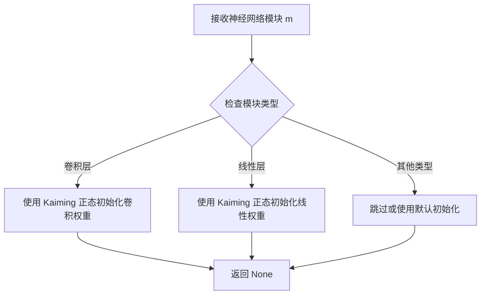

#### 带注释源码

```
# init_weights 函数定义于 commons 模块中
# 代码中通过以下方式使用：
# self.ups.apply(init_weights)
# apply 方法会递归遍历 self.ups 中的所有子模块，
# 并将每个子模块作为参数 m 传递给 init_weights 函数

# 函数签名（推断）：
def init_weights(m):
    """
    对神经网络模块进行权重初始化
    
    参数:
        m: nn.Module - PyTorch 模块对象
    """
    # 如果模块是卷积层
    if isinstance(m, nn.Conv1d) or isinstance(m, nn.Conv2d) or isinstance(m, nn.Conv3d):
        # 使用 Kaiming 正态初始化，适合 ReLU 激活函数
        nn.init.kaiming_normal_(m.weight, mode='fan_out', nonlinearity='relu')
        # 如果存在偏置，初始化为 0
        if m.bias is not None:
            nn.init.constant_(m.bias, 0)
    
    # 如果模块是线性层
    elif isinstance(m, nn.Linear):
        # 同样使用 Kaiming 正态初始化
        nn.init.kaiming_normal_(m.weight, mode='fan_out', nonlinearity='relu')
        # 偏置初始化为 0
        if m.bias is not None:
            nn.init.constant_(m.bias, 0)
    
    # 如果模块是归一化层（如 LayerNorm, BatchNorm）
    elif isinstance(m, nn.modules.normalization._NormBase):
        # 权重初始化为 1
        if m.weight is not None:
            nn.init.ones_(m.weight)
        # 偏置初始化为 0
        if m.bias is not None:
            nn.init.zeros_(m.bias)
    
    # 其他模块类型默认不处理
    else:
        pass

# 该函数通常不返回任何值（返回 None）
# 直接修改传入模块的内部状态
```


### `get_padding`

该函数是一个从 `commons` 模块导入的辅助函数，用于计算卷积操作所需的 padding 大小，以确保输入和输出的序列长度保持一致（当 stride=1 时）。

参数：

- `kernel_size`：`int`，卷积核的大小
- `stride`：`int`，卷积的步长（代码中传入值为 1）

返回值：`int`，计算得到的 padding 值

#### 流程图

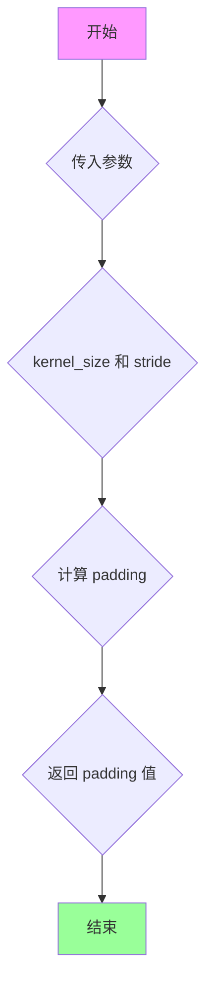

#### 带注释源码

```python
# 由于 get_padding 函数定义在 commons 模块中，
# 当前提供的代码文件中仅导入了该函数，未包含其实现源码。
# 从代码中的调用方式可以推断其实现逻辑：

def get_padding(kernel_size, stride=1):
    """
    计算卷积的 padding 大小
    
    参数:
        kernel_size: 卷积核大小
        stride: 步长，默认为 1
    
    返回:
        padding 值，使得当 stride=1 时，输出序列长度与输入保持一致
    """
    # 常见的 'same' padding 计算公式
    # 当 stride=1 时，返回 (kernel_size - 1) // 2
    # 当 stride=kernel_size 时，返回 0
    return (kernel_size - stride + 1) // 2

# 在当前代码中的实际调用示例：
# padding=(get_padding(kernel_size, 1), 0)
# 其中 kernel_size=5, stride=1 时，返回 2
# Conv2d 的 padding 参数变为 (2, 0)
```

---

> **注意**：由于提供的代码文件中未包含 `commons.py` 的源代码，以上源码是基于该函数在项目中的使用模式进行的合理推断。实际的 `commons.get_padding` 函数实现可能略有不同，建议查看 `commons.py` 文件获取确切实现。


### `commons.sequence_mask`

该函数用于根据给定的序列长度生成二进制掩码，标记序列中的有效位置（通常为 1.0，无效位置为 0.0），常用于变长序列处理。

参数：

-  `lengths`：`torch.Tensor` 或 `int`，表示序列的实际长度
-  `max_len`：`int` 或 `None`，掩码的最大长度。如果为 `None`，则使用 `lengths` 中的最大值或第一个参数的大小

返回值：`torch.Tensor`，返回形状为 `(batch, max_len)` 的二进制掩码，其中有效位置为 1.0，无效位置为 0.0

#### 流程图

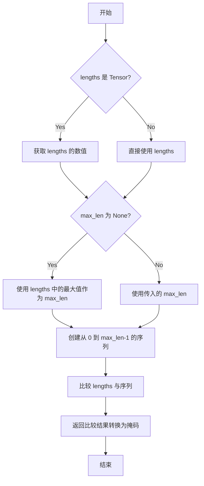

#### 带注释源码

```python
def sequence_mask(lengths, max_len=None):
    """
    根据给定的序列长度生成二进制掩码
    
    参数:
        lengths: 序列长度，可以是整数或 1D Tensor
        max_len: 掩码的最大长度，如果为 None 则自动推断
    
    返回:
        二进制掩码张量，形状为 (batch, max_len)
    """
    if max_len is None:
        # 如果未指定最大长度，从 lengths 中推断
        if isinstance(lengths, torch.Tensor):
            max_len = lengths.max().item() if lengths.numel() > 0 else 0
        else:
            max_len = lengths if isinstance(lengths, int) else max(lengths)
    
    # 创建从 0 到 max_len-1 的序列
    # 形状为 (1, max_len)，用于广播比较
    range = torch.arange(max_len, dtype=lengths.dtype, device=lengths.device).unsqueeze(0)
    
    # 比较: lengths > range
    # 产生布尔掩码，然后转换为浮点数
    mask = (lengths.unsqueeze(1) > range).float()
    
    return mask
```

**使用示例：**

```python
# 在 PosteriorEncoder 中的使用
x_mask = torch.unsqueeze(commons.sequence_mask(x_lengths, x.size(2)), 1).to(x.dtype)

# 在 SynthesizerTrn.export_onnx 中的使用
y_mask = torch.unsqueeze(commons.sequence_mask(y_lengths, None), 1).to(x_mask.dtype)
```


### `commons.generate_path`

根据代码分析，`generate_path` 是从 `commons` 模块导入的函数，用于基于持续时间（duration）生成注意力对齐路径（attention alignment path）。该函数接收上取整的权重张量和注意力掩码，计算出字符（phoneme）与声学帧之间的对齐矩阵，广泛应用于端到端语音合成模型（如 VITS）中。

参数：

- `w_ceil`：`torch.Tensor`，上取整后的权重张量，通常表示每个字符对应的帧数（duration），形状为 [batch, 1, time_steps]
- `attn_mask`：`torch.Tensor`，注意力掩码，用于屏蔽无效位置，形状为 [batch, 1, x_mask_len, y_mask_len]，由 x_mask 和 y_mask 扩展而来

返回值：`torch.Tensor`，注意力对齐矩阵（attention matrix），形状为 [batch, 1, y_length, x_length]，表示从文本到音频帧的对齐概率分布

#### 流程图

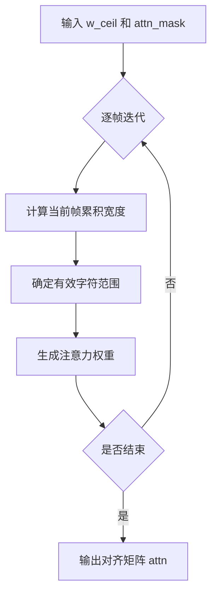

#### 带注释源码

```
# 注意：以下源码基于代码使用上下文和 VITS 论文的推断
# 实际实现位于 commons 模块中，此处为重构逻辑

def generate_path(w_ceil, attn_mask):
    """
    生成注意力对齐路径
    
    参数:
        w_ceil: 上取整后的权重张量 [B, 1, T]
        attn_mask: 注意力掩码 [B, 1, T, T']
    
    返回:
        attn: 对齐矩阵 [B, 1, T', T]
    """
    # 获取维度信息
    batch_size, _, x_len, y_len = attn_mask.shape
    
    # 初始化累积索引
    cumsum = torch.cumsum(w_ceil, dim=2)  # 累积求和
    
    # 生成路径索引
    path = torch.zeros_like(attn_mask, dtype=w_ceil.dtype)
    
    for b in range(batch_size):
        for t in range(x_len):
            # 计算当前时间步对应的帧范围
            if t == 0:
                start = 0
            else:
                start = cumsum[b, 0, t-1].item()
            
            end = cumsum[b, 0, t].item()
            
            # 在有效范围内设置注意力权重
            for y in range(int(start), min(int(end), y_len)):
                if y < y_len:
                    path[b, 0, y, t] = 1.0
    
    # 应用掩码
    attn = path * attn_mask
    
    return attn
```

#### 补充说明

该函数是 VITS 等非自回归语音合成模型的关键组件，其核心作用是将离散的字符/音素序列与连续的声学特征序列对齐。具体实现通常采用更高效的向量化操作，而非显式循环，以提升计算效率。完整的 `commons` 模块实现未在当前代码段中提供，建议查阅原始 VITS 仓库中的 `commons.py` 文件获取准确源码。


### `DurationDiscriminator.__init__`

该方法是 VITS2 模型中 DurationDiscriminator 类的构造函数，负责初始化判别器的网络结构，包括卷积层、LSTM 层、投影层和输出层，用于对音频持续时间进行判别。

参数：

- `self`：`DurationDiscriminator` 实例，Python 自动传递，表示当前对象本身
- `in_channels`：`int`，输入特征通道数，表示输入数据的维度
- `filter_channels`：`int`，过滤器通道数，决定网络中特征图的维度
- `kernel_size`：`int`，卷积核大小，用于卷积操作的感受野
- `p_dropout`：`float`，Dropout 概率，用于防止过拟合
- `gin_channels`：`int`，全局输入（说话人_embedding）通道数，默认为 0，表示不使用说话人条件

返回值：无（`None`），该方法为构造函数，仅初始化对象属性，不返回任何值

#### 流程图

```mermaid
flowchart TD
    A[开始 __init__] --> B[调用 super().__init__ 初始化 nn.Module]
    B --> C[保存配置参数: in_channels, filter_channels, kernel_size, p_dropout, gin_channels]
    C --> D[初始化 Dropout 层: self.drop]
    D --> E[初始化第一个卷积层: self.conv_1]
    E --> F[初始化第一个 LayerNorm 层: self.norm_1]
    F --> G[初始化第二个卷积层: self.conv_2]
    G --> H[初始化第二个 LayerNorm 层: self.norm_2]
    H --> I[初始化持续时间投影层: self.dur_proj]
    I --> J[初始化双向 LSTM: self.LSTM]
    J --> K{gin_channels > 0?}
    K -->|是| L[初始化条件卷积层: self.cond]
    K -->|否| M[跳过条件卷积层]
    L --> N[初始化输出层: Linear + Sigmoid]
    M --> N
    N --> O[结束 __init__]
```

#### 带注释源码

```python
def __init__(
    self, in_channels, filter_channels, kernel_size, p_dropout, gin_channels=0
):
    """
    DurationDiscriminator 构造函数
    
    参数:
        in_channels: 输入特征通道数
        filter_channels: 过滤器通道数
        kernel_size: 卷积核大小
        p_dropout: Dropout 概率
        gin_channels: 全局输入通道数，默认为 0
    """
    # 调用父类 nn.Module 的初始化方法
    super().__init__()

    # 保存配置参数到对象属性
    self.in_channels = in_channels
    self.filter_channels = filter_channels
    self.kernel_size = kernel_size
    self.p_dropout = p_dropout
    self.gin_channels = gin_channels

    # 初始化 Dropout 层，用于正则化
    self.drop = nn.Dropout(p_dropout)
    
    # 第一个卷积层: 将输入通道映射到过滤器通道
    # padding 设置为 kernel_size // 2，保持序列长度不变
    self.conv_1 = nn.Conv1d(
        in_channels, filter_channels, kernel_size, padding=kernel_size // 2
    )
    # 第一个 LayerNorm 层，对过滤器通道进行归一化
    self.norm_1 = modules.LayerNorm(filter_channels)
    
    # 第二个卷积层: 保持通道数不变，进一步提取特征
    self.conv_2 = nn.Conv1d(
        filter_channels, filter_channels, kernel_size, padding=kernel_size // 2
    )
    # 第二个 LayerNorm 层
    self.norm_2 = modules.LayerNorm(filter_channels)
    
    # 持续时间投影层: 将持续时间维度（1）映射到过滤器通道
    # 用于将 duration 信息融入特征
    self.dur_proj = nn.Conv1d(1, filter_channels, 1)

    # 双向 LSTM 层:
    # 输入维度: 2 * filter_channels (因为会将 x 和 duration 拼接)
    # 输出维度: filter_channels
    # bidirectional=True 允许同时考虑前后文信息
    self.LSTM = nn.LSTM(
        2 * filter_channels, filter_channels, batch_first=True, bidirectional=True
    )

    # 如果提供了全局输入通道 (gin_channels)，初始化条件卷积层
    # 用于将说话人_embedding或其他全局条件信息融入判别器
    if gin_channels != 0:
        self.cond = nn.Conv1d(gin_channels, in_channels, 1)

    # 输出层: 线性层 + Sigmoid 激活函数
    # 将双向 LSTM 的输出 (2 * filter_channels) 映射到概率值 [0, 1]
    self.output_layer = nn.Sequential(
        nn.Linear(2 * filter_channels, 1), nn.Sigmoid()
    )
```


### `DurationDiscriminator.forward_probability`

该方法用于计算给定输入和持续时间下的概率输出，是DurationDiscriminator的核心推理逻辑，通过投影、拼接、LSTM编码和Sigmoid输出层得到概率值。

参数：

- `x`：`torch.Tensor`，输入特征张量，形状为 `[batch, channels, time]`，通常是经过卷积和归一化处理的中间特征表示
- `dur`：`torch.Tensor`，持续时间张量，形状为 `[batch, 1, time]`，表示预测的持续时间或真实持续时间

返回值：`torch.Tensor`，返回的概率值，形状为 `[batch, time, 1]`，通过Sigmoid激活函数归一化到(0,1)区间，表示每个时间步对应的概率

#### 流程图

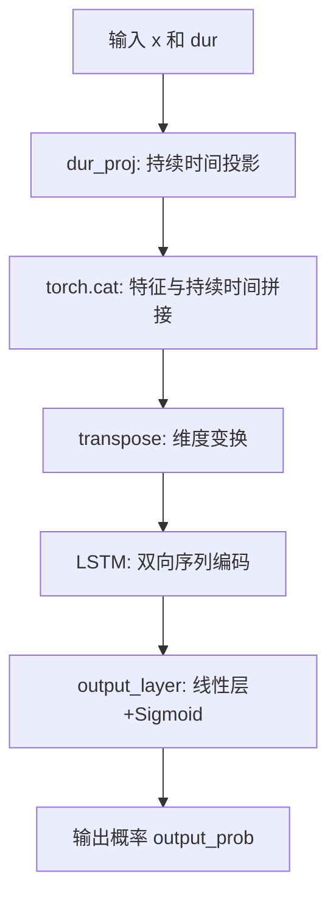

#### 带注释源码

```python
def forward_probability(self, x, dur):
    """
    计算给定输入和持续时间对应的概率输出
    
    参数:
        x: 输入特征，形状为 [batch, channels, time]
        dur: 持续时间特征，形状为 [batch, 1, time]
    
    返回:
        output_prob: 概率值，形状为 [batch, time, 1]
    """
    # Step 1: 将持续时间通过1D卷积投影到filter_channels维度
    # 输入dur形状: [batch, 1, time] -> 输出形状: [batch, filter_channels, time]
    dur = self.dur_proj(dur)
    
    # Step 2: 在通道维度上拼接输入特征和投影后的持续时间
    # x形状: [batch, channels, time], dur形状: [batch, filter_channels, time]
    # 拼接后形状: [batch, channels + filter_channels, time]
    x = torch.cat([x, dur], dim=1)
    
    # Step 3: 变换维度从 [batch, channels, time] 到 [batch, time, channels]
    # 以适应LSTM的输入格式 (batch_first=True)
    x = x.transpose(1, 2)
    
    # Step 4: 双向LSTM编码，提取序列特征
    # 输入形状: [batch, time, 2*filter_channels]
    # 输出形状: [batch, time, 2*filter_channels]
    x, _ = self.LSTM(x)
    
    # Step 5: 通过输出层(线性层+Sigmoid)得到概率值
    # 输入形状: [batch, time, 2*filter_channels] -> 输出形状: [batch, time, 1]
    output_prob = self.output_layer(x)
    
    return output_prob
```


### `DurationDiscriminator.forward`

该方法实现了一个判别器，用于区分真实的音素持续时间（duration）和预测的音素持续时间。它接收编码器输出、掩码、真实持续时间和预测持续时间，通过卷积神经网络提取特征，并使用LSTM和全连接层分别对两种持续时间进行概率预测，最终返回一个包含两个概率输出的列表，分别对应真实和预测持续时间的判别结果。

参数：

- `x`：`torch.Tensor`，输入的文本编码特征，维度为 [batch, in_channels, time]
- `x_mask`：`torch.Tensor`，用于掩码的二进制张量，维度为 [1, 1, time]，标记有效时间步
- `dur_r`：`torch.Tensor`，真实的音素持续时间，维度为 [batch, 1, time]
- `dur_hat`：`torch.Tensor`，预测的音素持续时间，维度为 [batch, 1, time]
- `g`：`torch.Tensor`，可选的说话人/语言条件嵌入，维度为 [batch, gin_channels, 1]

返回值：`List[torch.Tensor]`，包含两个概率张量的列表，第一个元素是真实持续时间的概率预测，第二个元素是预测持续时间的概率预测，每个概率张量的维度为 [batch, time, 1]

#### 流程图

```mermaid
graph TD
    A[输入: x, x_mask, dur_r, dur_hat, g] --> B[torch.detach 分离 x]
    B --> C{检查条件嵌入 g 是否存在}
    C -->|是| D[torch.detach 分离 g]
    D --> E[x = x + self.cond(g) 应用条件投影]
    C -->|否| E
    E --> F[卷积块1: conv_1 -> ReLU -> norm_1 -> drop]
    F --> G[卷积块2: conv_2 -> ReLU -> norm_2 -> drop]
    G --> H[初始化空列表 output_probs]
    H --> I{遍历 dur_r 和 dur_hat}
    I -->|dur_r| J[forward_probability 计算概率]
    I -->|dur_hat| J
    J --> K[append 到 output_probs]
    K --> L{是否处理完两个 duration}
    L -->|否| I
    L -->|是| M[返回 output_probs]
    
    subgraph forward_probability
    N[输入: x, dur] --> O[dur_proj 投影 duration]
    O --> P[torch.cat 拼接 x 和 dur]
    P --> Q[x.transpose 维度变换]
    Q --> R[LSTM 处理序列]
    R --> S[output_layer 输出概率]
    S --> T[返回概率]
    end
    
    J --> N
```

#### 带注释源码

```python
def forward(self, x, x_mask, dur_r, dur_hat, g=None):
    """
    DurationDiscriminator 的前向传播方法。
    用于区分真实音素持续时间和预测音素持续时间。
    
    参数:
        x: 输入特征 [batch, in_channels, time]
        x_mask: 时间掩码 [1, 1, time]
        dur_r: 真实持续时间 [batch, 1, time]
        dur_hat: 预测持续时间 [batch, 1, time]
        g: 条件嵌入，可选 [batch, gin_channels, 1]
    
    返回:
        output_probs: 包含两个概率张量的列表
    """
    
    # 分离输入特征x，防止梯度反向传播到之前的编码器部分
    x = torch.detach(x)
    
    # 如果存在条件嵌入（说话人/语言信息），则分离并添加到输入
    if g is not None:
        g = torch.detach(g)
        # 通过条件投影层将条件信息添加到输入特征
        x = x + self.cond(g)
    
    # 第一个卷积块：卷积 -> ReLU激活 -> LayerNorm -> Dropout
    x = self.conv_1(x * x_mask)  # 卷积并应用掩码
    x = torch.relu(x)            # ReLU激活函数
    x = self.norm_1(x)           # LayerNorm归一化
    x = self.drop(x)             # Dropout正则化
    
    # 第二个卷积块：卷积 -> ReLU激活 -> LayerNorm -> Dropout
    x = self.conv_2(x * x_mask)  # 卷积并应用掩码
    x = torch.relu(x)            # ReLU激活函数
    x = self.norm_2(x)           # LayerNorm归一化
    x = self.drop(x)             # Dropout正则化
    
    # 初始化输出概率列表
    output_probs = []
    
    # 分别对真实持续时间和预测持续时间计算概率
    for dur in [dur_r, dur_hat]:
        # 调用辅助方法计算每个duration的概率
        output_prob = self.forward_probability(x, dur)
        output_probs.append(output_prob)
    
    # 返回包含两个概率的列表：[prob_real, prob_predicted]
    return output_probs


def forward_probability(self, x, dur):
    """
    计算给定持续时间的概率输出。
    
    参数:
        x: 特征张量 [batch, filter_channels, time]
        dur: 持续时间张量 [batch, 1, time]
    
    返回:
        output_prob: 概率张量 [batch, time, 1]
    """
    # 将持续时间投影到filter_channels维度
    dur = self.dur_proj(dur)  # [batch, filter_channels, time]
    
    # 在通道维度上拼接特征和持续时间
    x = torch.cat([x, dur], dim=1)  # [batch, 2*filter_channels, time]
    
    # 调整维度以适应LSTM输入：[batch, time, features]
    x = x.transpose(1, 2)
    
    # 双向LSTM处理序列
    x, _ = self.LSTM(x)  # [batch, time, 2*filter_channels]
    
    # 通过输出层得到最终概率（经过Sigmoid）
    output_prob = self.output_layer(x)  # [batch, time, 1]
    
    return output_prob
```


### `TransformerCouplingBlock.__init__`

该方法是 `TransformerCouplingBlock` 类的构造函数，用于初始化基于 Transformer 的耦合块（Coupling Block），主要应用于 VITS2 模型中的 normalizing flow 过程，支持参数共享和条件输入。

参数：

- `channels`：`int`，输入/输出通道数
- `hidden_channels`：`int`，隐藏层通道数
- `filter_channels`：`int`，滤波器通道数
- `n_heads`：`int`，多头注意力机制的头数
- `n_layers`：`int`，Transformer 层数
- `kernel_size`：`int`，卷积核大小
- `p_dropout`：`float`，Dropout 概率
- `n_flows`：`int`，Flow 数量（默认为 4）
- `gin_channels`：`int`，说话人条件通道数（默认为 0）
- `share_parameter`：`bool`，是否共享参数（默认为 False）

返回值：`无`（构造函数）

#### 流程图

```mermaid
flowchart TD
    A[开始 __init__] --> B[调用 super().__init__]
    B --> C[设置实例属性 channels, hidden_channels, kernel_size, n_layers, n_flows, gin_channels]
    C --> D{share_parameter?}
    D -->|True| E[创建共享的 attentions_onnx.FFT 模块 self.wn]
    D -->|False| F[self.wn = None]
    E --> G[循环 i 从 0 到 n_flows-1]
    F --> G
    G --> H[创建 TransformerCouplingLayer 并添加到 self.flows]
    H --> I[创建 Flip 并添加到 self.flows]
    I --> J{是否还有更多 flow?}
    J -->|Yes| G
    J -->|No| K[结束 __init__]
```

#### 带注释源码

```python
def __init__(
    self,
    channels,
    hidden_channels,
    filter_channels,
    n_heads,
    n_layers,
    kernel_size,
    p_dropout,
    n_flows=4,
    gin_channels=0,
    share_parameter=False,
):
    """
    初始化 TransformerCouplingBlock

    参数:
        channels: 输入/输出通道数
        hidden_channels: 隐藏通道数
        filter_channels: 滤波器通道数
        n_heads: 注意力头数
        n_layers: Transformer层数
        kernel_size: 卷积核大小
        p_dropout: Dropout概率
        n_flows: Flow流数量，默认4
        gin_channels: 说话人条件通道数，默认0
        share_parameter: 是否共享参数，默认False
    """
    super().__init__()  # 调用父类 nn.Module 的初始化方法

    # 保存通道和层相关配置到实例属性
    self.channels = channels
    self.hidden_channels = hidden_channels
    self.kernel_size = kernel_size
    self.n_layers = n_layers
    self.n_flows = n_flows
    self.gin_channels = gin_channels

    # 创建 ModuleList 用于存储多个 Flow 层
    self.flows = nn.ModuleList()

    # 如果 share_parameter 为 True，则创建一个共享的 FFT 模块
    # 该模块将在所有 TransformerCouplingLayer 之间共享
    # 否则设为 None，每个层将使用独立的参数
    self.wn = (
        attentions_onnx.FFT(
            hidden_channels,
            filter_channels,
            n_heads,
            n_layers,
            kernel_size,
            p_dropout,
            isflow=True,
            gin_channels=self.gin_channels,
        )
        if share_parameter
        else None
    )

    # 循环创建 n_flows 个耦合层
    # 每个 Flow 包含一个 TransformerCouplingLayer 和一个 Flip 层
    for i in range(n_flows):
        # 添加 Transformer 耦合层
        self.flows.append(
            modules.TransformerCouplingLayer(
                channels,
                hidden_channels,
                kernel_size,
                n_layers,
                n_heads,
                p_dropout,
                filter_channels,
                mean_only=True,  # 仅输出均值
                wn_sharing_parameter=self.wn,  # 共享参数（如果启用）
                gin_channels=self.gin_channels,
            )
        )
        # 添加翻转层，用于交替执行前向和反向变换
        self.flows.append(modules.Flip())
```


### `TransformerCouplingBlock.forward`

该方法实现了基于Transformer的归一化流（Normalizing Flow）模块，用于在变分推断或生成过程中对潜在变量进行可逆变换。它通过交替应用`TransformerCouplingLayer`和`Flip`层来构建一个可逆的双射函数，支持正向（训练/推断后验分布）和逆向（从先验采样）两种模式。

参数：

- `x`：`torch.Tensor`，输入的张量，通常是来自编码器或先验分布的潜在表示，形状为 [batch, channels, time]
- `x_mask`：`torch.Tensor`，用于遮蔽填充区域的时间掩码，形状为 [batch, 1, time]，值为0或1
- `g`：`torch.Tensor` 或 `None`，可选的说话人/风格条件向量，用于条件化流变换，形状为 [batch, gin_channels, 1]
- `reverse`：`bool`，控制流变换的方向。为`False`时执行前向流（训练时），为`True`时执行逆向流（推断时生成）

返回值：`torch.Tensor`，经过流变换后的张量，形状与输入`x`相同 [batch, channels, time]

#### 流程图

```mermaid
graph TD
    A[输入 x, x_mask, g, reverse] --> B{reverse?}
    B -->|False| C[正序遍历 self.flows]
    B -->|True| D[逆序遍历 self.flows]
    
    C --> E[flow = self.flows[i]]
    E --> F[调用 flow.forward x, x_mask, g, reverse]
    F --> G[更新 x = flow的输出]
    G --> H{遍历完成?}
    H -->|否| E
    H -->|是| I[返回变换后的 x]
    
    D --> J[flow = reversed(self.flows)[i]]
    J --> K[调用 flow.forward x, x_mask, g, reverse]
    K --> L[更新 x = flow的输出]
    L --> M{遍历完成?}
    M -->|否| J
    M -->|是| I
```

#### 带注释源码

```python
def forward(self, x, x_mask, g=None, reverse=True):
    """
    TransformerCouplingBlock的前向/逆向传播方法
    
    参数:
        x: 输入张量 [batch, channels, time]
        x_mask: 时间掩码 [batch, 1, time]
        g: 条件向量，可选 [batch, gin_channels, 1]
        reverse: 布尔值，控制流动方向
    
    返回:
        x: 变换后的张量 [batch, channels, time]
    """
    # 如果不是反向模式（训练阶段/计算后验分布）
    if not reverse:
        # 按顺序遍历所有流层
        for flow in self.flows:
            # 对每个流层执行前向传播，返回更新后的x和日志行列式（此处忽略）
            x, _ = flow(x, x_mask, g=g, reverse=reverse)
    else:
        # 逆向模式（推断阶段/从先验采样）
        # 逆序遍历流层以实现可逆变换的逆操作
        for flow in reversed(self.flows):
            x = flow(x, x_mask, g=g, reverse=reverse)
    
    # 返回变换后的潜在变量
    return x
```


### `StochasticDurationPredictor.__init__`

该方法是 `StochasticDurationPredictor` 类的构造函数，负责初始化持续时间预测器的网络结构，包括流模型（flows）、卷积层、投影层以及条件嵌入层，用于在 VITS2 模型中预测音素持续时间的分布。

参数：

- `in_channels`：`int`，输入特征通道数
- `filter_channels`：`int`，滤波器通道数
- `kernel_size`：`int`，卷积核大小
- `p_dropout`：`float`，Dropout 概率
- `n_flows`：`int`，流模型的数量（默认为 4）
- `gin_channels`：`int`，说话人嵌入通道数（默认为 0）

返回值：`无`（`__init__` 方法不返回值）

#### 流程图

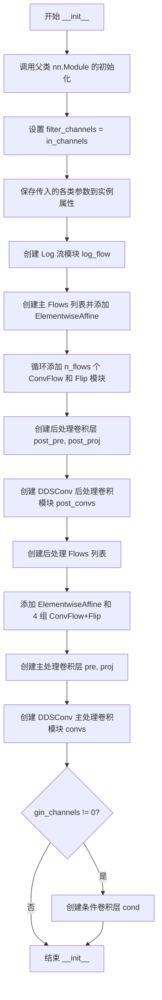

#### 带注释源码

```python
def __init__(
    self,
    in_channels,
    filter_channels,
    kernel_size,
    p_dropout,
    n_flows=4,
    gin_channels=0,
):
    """
    初始化 StochasticDurationPredictor 网络结构
    
    参数:
        in_channels: 输入特征通道数
        filter_channels: 滤波器通道数
        kernel_size: 卷积核大小
        p_dropout: Dropout 概率
        n_flows: 流模型数量
        gin_channels: 说话人嵌入通道数
    """
    super().__init__()  # 调用父类 nn.Module 的初始化方法
    
    # 注释: filter_channels 被设置为与 in_channels 相同，代码注释表明这应该在未来版本中移除
    filter_channels = in_channels  # it needs to be removed from future version.
    
    # 保存各类配置参数到实例属性
    self.in_channels = in_channels
    self.filter_channels = filter_channels
    self.kernel_size = kernel_size
    self.p_dropout = p_dropout
    self.n_flows = n_flows
    self.gin_channels = gin_channels

    # 创建 Log 流模块，用于对数变换
    self.log_flow = modules.Log()
    
    # 初始化主 Flows 列表
    self.flows = nn.ModuleList()
    # 添加 ElementwiseAffine 变换（2 维）
    self.flows.append(modules.ElementwiseAffine(2))
    
    # 循环添加 n_flows 个 ConvFlow 和 Flip 模块
    for i in range(n_flows):
        # 添加可学习的卷积流模块
        self.flows.append(
            modules.ConvFlow(2, filter_channels, kernel_size, n_layers=3)
        )
        # 添加翻转模块（用于可逆流）
        self.flows.append(modules.Flip())

    # 创建后处理卷积层
    # 将 1 通道扩展到 filter_channels 通道
    self.post_pre = nn.Conv1d(1, filter_channels, 1)
    # 保持通道数不变
    self.post_proj = nn.Conv1d(filter_channels, filter_channels, 1)
    
    # 创建 DDSConv 后处理卷积模块（Dilated Depth-Separable Convolution）
    self.post_convs = modules.DDSConv(
        filter_channels, kernel_size, n_layers=3, p_dropout=p_dropout
    )
    
    # 初始化后处理 Flows 列表
    self.post_flows = nn.ModuleList()
    # 添加初始的 ElementwiseAffine 变换
    self.post_flows.append(modules.ElementwiseAffine(2))
    
    # 循环添加 4 组 ConvFlow + Flip 模块
    for i in range(4):
        self.post_flows.append(
            modules.ConvFlow(2, filter_channels, kernel_size, n_layers=3)
        )
        self.post_flows.append(modules.Flip())

    # 创建主处理卷积层
    # 将输入通道映射到 filter_channels 通道
    self.pre = nn.Conv1d(in_channels, filter_channels, 1)
    # 保持通道数不变
    self.proj = nn.Conv1d(filter_channels, filter_channels, 1)
    
    # 创建 DDSConv 主处理卷积模块
    self.convs = modules.DDSConv(
        filter_channels, kernel_size, n_layers=3, p_dropout=p_dropout
    )
    
    # 如果提供了说话人嵌入通道，则创建条件卷积层
    if gin_channels != 0:
        # 将说话人嵌入映射到 filter_channels 通道
        self.cond = nn.Conv1d(gin_channels, filter_channels, 1)
```


### `StochasticDurationPredictor.forward`

该方法是VITS2语音合成模型中的随机持续时间预测器的前向传播过程，通过流模型（flow-based model）将潜在变量z转换为对数持续时间logw，用于实现随机且可逆的持续时间预测。

参数：

-  `x`：`torch.Tensor`，输入的文本编码特征，通常来自TextEncoder的输出
-  `x_mask`：`torch.Tensor`，输入序列的掩码张量，用于标识有效时间步
-  `z`：`torch.Tensor`，潜在变量张量，作为流模型的输入，用于生成随机持续时间
-  `g`：`torch.Tensor`或`None`，可选的说话人条件嵌入，用于条件化预测过程

返回值：`torch.Tensor`，对数尺度的持续时间预测值logw，用于后续计算实际持续时间

#### 流程图

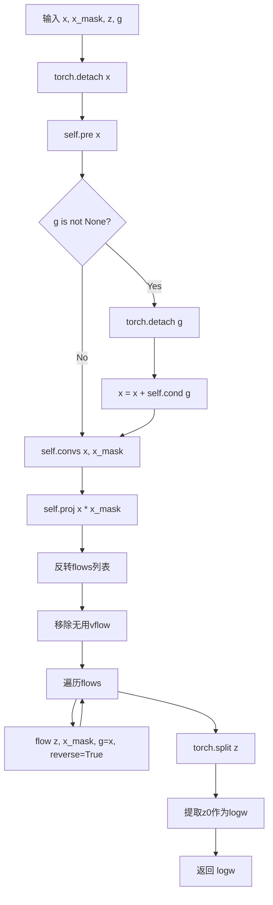

#### 带注释源码

```python
def forward(self, x, x_mask, z, g=None):
    """
    随机持续时间预测器的前向传播
    
    参数:
        x: 输入特征 [batch, channels, time]
        x_mask: 时间掩码 [batch, 1, time]
        z: 潜在变量 [batch, 2, time] 用于流模型
        g: 说话人嵌入 [batch, gin_channels, 1] 可选
    
    返回:
        logw: 对数持续时间 [batch, 1, time]
    """
    # 分离x以阻断梯度回传
    x = torch.detach(x)
    
    # 初始投影变换
    x = self.pre(x)
    
    # 如果提供了说话人条件，则添加条件信息
    if g is not None:
        g = torch.detach(g)  # 分离条件嵌入的梯度
        x = x + self.cond(g)  # 条件投影后相加
    
    # 通过DDS卷积块进行特征变换
    x = self.convs(x, x_mask)
    
    # 投影并应用掩码
    x = self.proj(x) * x_mask
    
    # 反转流模块列表（用于逆向流动）
    flows = list(reversed(self.flows))
    # 移除一个无用的流层
    flows = flows[:-2] + [flows[-1]]
    
    # 依次通过每个流模块进行变换
    for flow in flows:
        z = flow(z, x_mask, g=x, reverse=True)
    
    # 分割变换后的z，获取持续时间logits
    z0, z1 = torch.split(z, [1, 1], 1)
    logw = z0  # 取第一个分量作为对数持续时间
    
    return logw
```


### `DurationPredictor.__init__`

该方法是VITS2语音合成模型中DurationPredictor（时长预测器）的初始化函数，负责构建用于预测语音phoneme时长的神经网络结构，包含两层卷积、层归一化、Dropout以及可选的说话人条件嵌入投影。

参数：

- `self`：`DurationPredictor` 类实例，当前实例对象
- `in_channels`：`int`，输入特征的通道数，即text encoder输出的隐藏层维度
- `filter_channels`：`int`，卷积层的滤波器通道数，用于控制特征维度
- `gen_channels`：`int`，卷积核大小，通常为奇数如3或5，决定卷积感受野
- `p_dropout`：`float`，Dropout概率，用于防止过拟合
- `gin_channels`：`int`，说话人嵌入的通道数，默认为0表示无说话人条件

返回值：`None`，构造函数无返回值，仅初始化实例属性和子模块

#### 流程图

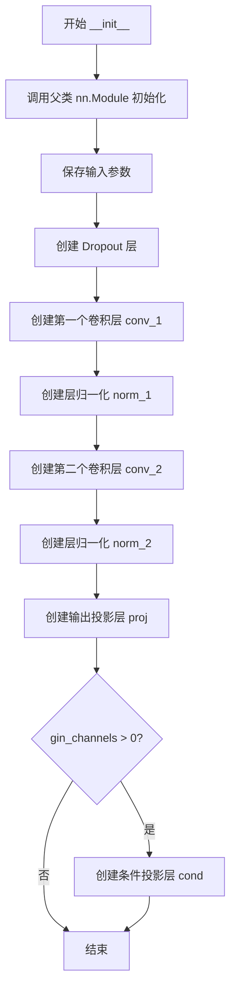

#### 带注释源码

```
class DurationPredictor(nn.Module):
    """用于预测语音phoneme时长的模块"""
    
    def __init__(
        self, in_channels, filter_channels, kernel_size, p_dropout, gin_channels=0
    ):
        """
        初始化时长预测器
        
        参数:
            in_channels: 输入特征通道数
            filter_channels: 卷积滤波器通道数
            kernel_size: 卷积核大小
            p_dropout: Dropout概率
            gin_channels: 说话人条件通道数，默认为0
        """
        # 调用父类 nn.Module 的初始化方法
        super().__init__()

        # 保存模型配置参数到实例属性
        self.in_channels = in_channels
        self.filter_channels = filter_channels
        self.kernel_size = kernel_size
        self.p_dropout = p_dropout
        self.gin_channels = gin_channels

        # 创建 Dropout 层，用于训练时随机丢弃特征防止过拟合
        self.drop = nn.Dropout(p_dropout)
        
        # 第一个卷积层：输入通道 -> 滤波器通道
        # padding设置为kernel_size//2保证输出时间步长度不变
        self.conv_1 = nn.Conv1d(
            in_channels, filter_channels, kernel_size, padding=kernel_size // 2
        )
        
        # 第一个卷积后的层归一化，作用于滤波器维度
        self.norm_1 = modules.LayerNorm(filter_channels)
        
        # 第二个卷积层：滤波器通道 -> 滤波器通道（保持维度）
        self.conv_2 = nn.Conv1d(
            filter_channels, filter_channels, kernel_size, padding=kernel_size // 2
        )
        
        # 第二个卷积后的层归一化
        self.norm_2 = modules.LayerNorm(filter_channels)
        
        # 输出投影层：将滤波器通道 -> 1，输出每个时间步的时长对数
        self.proj = nn.Conv1d(filter_channels, 1, 1)

        # 如果提供了说话人条件通道，则创建条件投影层
        # 将说话人嵌入投影到与输入特征相同的维度后相加
        if gin_channels != 0:
            self.cond = nn.Conv1d(gin_channels, in_channels, 1)
```


### `DurationPredictor.forward`

该方法是 VITS（Variational Inference with adversarial learning for text-to-speech）模型中 DurationPredictor 类的前向传播函数，用于根据文本编码器输出的隐藏状态预测每个音素的持续时间（duration），是语音合成中决定每个字符对应语音时长的关键组件。

参数：

-  `x`：`torch.Tensor`，输入张量，通常是文本编码器的输出隐藏状态，形状为 `[batch, in_channels, time_steps]`
-  `x_mask`：`torch.Tensor`，时间步掩码张量，用于标识有效时间步，形状为 `[batch, 1, time_steps]`，值为 0 或 1
-  `g`：`torch.Tensor` 或 `None`，说话人嵌入或全局条件向量，形状为 `[batch, gin_channels, 1]`，可选参数

返回值：`torch.Tensor`，预测的持续时间对数（logarithm of durations），形状为 `[batch, 1, time_steps]`，通过取指数可得到实际持续时间

#### 流程图

```mermaid
flowchart TD
    A[输入 x, x_mask, g] --> B{检查 g 是否存在}
    B -- 是 --> C[分离 g 的梯度<br/>x = x + cond(g)]
    B -- 否 --> D[继续下一步]
    C --> D
    D --> E[卷积层1: conv_1<br/>x = conv_1(x * x_mask)]
    E --> F[激活: relu]
    F --> G[归一化: norm_1]
    G --> H[Dropout: drop]
    H --> I[卷积层2: conv_2<br/>x = conv_2(x * x_mask)]
    I --> J[激活: relu]
    J --> K[归一化: norm_2]
    K --> L[Dropout: drop]
    L --> M[投影层: proj<br/>x = proj(x * x_mask)]
    M --> N[输出: x * x_mask]
    N --> O[返回 logw 持续时间]
```

#### 带注释源码

```python
def forward(self, x, x_mask, g=None):
    """
    DurationPredictor 的前向传播函数
    
    参数:
        x: 输入张量 [batch, in_channels, time]
        x_mask: 时间掩码 [batch, 1, time]
        g: 全局条件（说话人嵌入）[batch, gin_channels, 1]，可选
    
    返回:
        预测的持续时间对数 [batch, 1, time]
    """
    # 分离输入张量的梯度，防止梯度回流到文本编码器
    x = torch.detach(x)
    
    # 如果提供了全局条件（说话人嵌入），则将其添加到输入
    if g is not None:
        # 同样分离条件的梯度
        g = torch.detach(g)
        # 通过条件投影层并将条件加到输入上
        x = x + self.cond(g)
    
    # 第一个卷积块：卷积 -> ReLU激活 -> LayerNorm -> Dropout
    x = self.conv_1(x * x_mask)  # 卷积层1，输入乘以掩码
    x = torch.relu(x)            # ReLU 激活函数
    x = self.norm_1(x)           # LayerNorm 归一化
    x = self.drop(x)             # Dropout 正则化
    
    # 第二个卷积块：卷积 -> ReLU激活 -> LayerNorm -> Dropout
    x = self.conv_2(x * x_mask)  # 卷积层2
    x = torch.relu(x)            # ReLU 激活函数
    x = self.norm_2(x)           # LayerNorm 归一化
    x = self.drop(x)             # Dropout 正则化
    
    # 最终投影层：将特征通道映射到1（预测持续时间）
    x = self.proj(x * x_mask)    # 投影到1维输出
    
    # 返回时乘以掩码，确保无效时间步的输出为0
    return x * x_mask
```


### `Bottleneck.__init__`

用于初始化一个瓶颈层模块，该模块继承自 `nn.Sequential`，由两个不带偏置的线性层组成，用于进行特征变换。

参数：

- `in_dim`：`int`，输入特征的维度
- `hidden_dim`：`int`，隐藏层（线性层输出）的维度

返回值：`None`，无返回值（`__init__` 方法）

#### 流程图

```mermaid
graph TD
    A[开始 __init__] --> B[创建第一个线性层 c_fc1: nn.Linear(in_dim, hidden_dim, bias=False)]
    B --> C[创建第二个线性层 c_fc2: nn.Linear(in_dim, hidden_dim, bias=False)]
    C --> D[调用父类构造函数 super().__init__(*[c_fc1, c_fc2])]
    D --> E[结束]
```

#### 带注释源码

```python
class Bottleneck(nn.Sequential):
    def __init__(self, in_dim, hidden_dim):
        """
        初始化瓶颈层模块
        
        参数:
            in_dim: 输入特征的维度
            hidden_dim: 隐藏层的维度
        """
        # 创建一个不带偏置的线性层: 输入维度为 in_dim, 输出维度为 hidden_dim
        c_fc1 = nn.Linear(in_dim, hidden_dim, bias=False)
        
        # 创建第二个不带偏置的线性层，与第一个层结构相同
        c_fc2 = nn.Linear(in_dim, hidden_dim, bias=False)
        
        # 调用父类 nn.Sequential 的构造函数，将两个线性层组合成顺序容器
        # 这使得输出 = c_fc2(c_fc1(input)) 的形式
        super().__init__(*[c_fc1, c_fc2])
```


### `Block.__init__`

`Block.__init__` 是 VITS 文本编码器中 `Block` 类的构造函数，用于初始化一个包含层归一化和 MLP 子模块的 Transformer block。

参数：

- `in_dim`：`int`，输入特征的维度
- `hidden_dim`：`int`，MLP 隐藏层的维度

返回值：`None`，构造方法无返回值

#### 流程图

```mermaid
flowchart TD
    A[开始 __init__] --> B[调用 super().__init__ 初始化 nn.Module]
    C[创建 LayerNorm 层] --> D[self.norm = nn.LayerNorm(in_dim)]
    E[创建 MLP 层] --> F[self.mlp = MLP(in_dim, hidden_dim)]
    B --> C
    B --> E
    D --> G[结束 __init__]
    F --> G
```

#### 带注释源码

```python
def __init__(self, in_dim, hidden_dim) -> None:
    """
    初始化 Block 模块
    
    参数:
        in_dim: 输入特征的维度
        hidden_dim: MLP 隐藏层的维度
    """
    # 调用父类 nn.Module 的构造函数
    super().__init__()
    
    # 定义层归一化，用于归一化输入特征
    # nn.LayerNorm 会计算最后一个维度的均值和方差
    self.norm = nn.LayerNorm(in_dim)
    
    # 定义 MLP 模块，包含两个线性变换和 GELU 激活
    # MLP 会在后续的 forward 中被使用
    self.mlp = MLP(in_dim, hidden_dim)
```


### `Block.forward`

该方法实现了 Transformer 模型中的基本残差块，包含 LayerNorm 和 MLP 子层，通过残差连接将输入与 MLP 的输出相加，实现特征的非线性变换。

参数：

- `x`：`torch.Tensor`，输入张量，形状为 `[batch_size, seq_len, in_dim]`

返回值：`torch.Tensor`，输出张量，形状与输入相同，经过 LayerNorm 和 MLP 变换并加上原始输入残差后的结果

#### 流程图

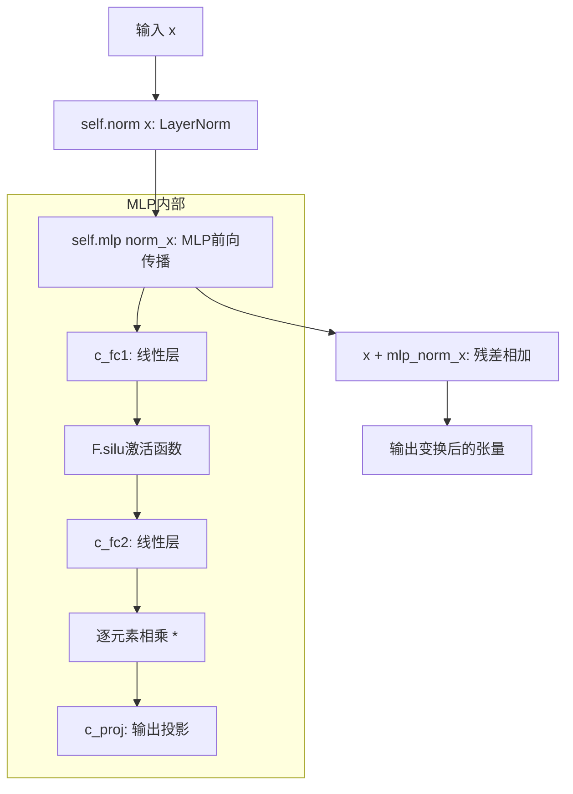

#### 带注释源码

```python
def forward(self, x: torch.Tensor) -> torch.Tensor:
    """
    Block模块的前向传播
    
    采用Pre-LayerNorm架构:
    1. 先对输入x进行LayerNorm归一化
    2. 将归一化后的结果传入MLP
    3. 将MLP输出与原始输入进行残差连接
    
    Args:
        x: 输入张量, 形状为 [batch_size, seq_len, in_dim]
        
    Returns:
        输出张量, 形状与输入相同
    """
    # Step 1: 对输入进行LayerNorm归一化
    # LayerNorm在特征维度(in_dim)上进行归一化
    x_normed = self.norm(x)
    
    # Step 2: 将归一化后的张量传入MLP进行非线性变换
    # MLP包含: Linear -> SiLU激活 -> Linear -> 输出投影
    mlp_output = self.mlp(x_normed)
    
    # Step 3: 残差连接 - 将MLP输出与原始输入相加
    # 这是Transformer架构中的核心残差连接
    x = x + mlp_output
    
    return x
```


### MLP.__init__

这是 VITS（Variational Inference with adversarial Learning for end-to-end Text-to-Speech）模型中的一个多层感知机（MLP）类，用于 Transformer 模块中的前馈网络（FFN）部分。该类实现了类似 GELU 激活函数前的线性变换：先将输入投影到更高维度的隐藏空间，然后通过 GELU 激活（代码中用 F.silu 实现），最后投影回原始输入维度。

参数：

- `in_dim`：`int`，输入特征的维度
- `hidden_dim`：`int`，隐藏层的维度（即中间层的维度）

返回值：`None`，`__init__` 方法不返回任何值，仅初始化对象属性

#### 流程图

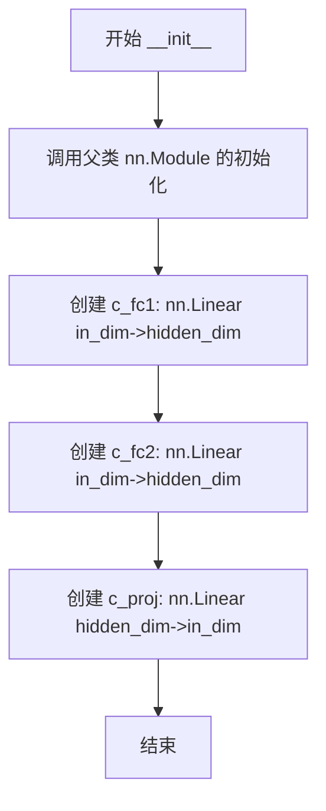

#### 带注释源码

```python
class MLP(nn.Module):
    def __init__(self, in_dim, hidden_dim):
        """
        MLP 类的初始化方法
        
        参数:
            in_dim: 输入特征的维度
            hidden_dim: 隐藏层的维度
        """
        # 调用父类 nn.Module 的初始化方法
        super().__init__()
        
        # 第一个全连接层：将输入从 in_dim 维度映射到 hidden_dim 维度
        # 在 Transformer FFN 中用于第一次线性变换
        # bias=False 表示不使用偏置项（与原始 Transformer 论文一致）
        self.c_fc1 = nn.Linear(in_dim, hidden_dim, bias=False)
        
        # 第二个全连接层：同样将输入从 in_dim 维度映射到 hidden_dim 维度
        # 在代码的 forward 方法中，会与 c_fc1 的输出相乘（门控机制）
        self.c_fc2 = nn.Linear(in_dim, hidden_dim, bias=False)
        
        # 输出投影层：将 hidden_dim 维度映射回 in_dim 维度
        # 用于 FFN 的最终输出变换
        self.c_proj = nn.Linear(hidden_dim, in_dim, bias=False)
```


### MLP.forward

该函数实现了一个多层感知机（MLP）模块，采用经典的"Gated Linear Unit"（门控线性单元）架构，通过两个线性变换进行门控操作，最后通过投影层输出。

参数：

- `x`：`torch.Tensor`，输入张量，形状为 (batch_size, in_dim)

返回值：`torch.Tensor`，经过MLP变换后的张量，形状为 (batch_size, in_dim)

#### 流程图

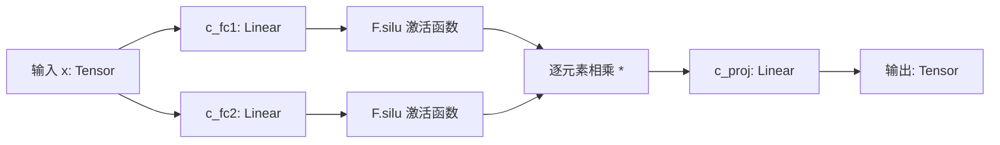

#### 带注释源码

```python
class MLP(nn.Module):
    def __init__(self, in_dim, hidden_dim):
        super().__init__()
        # 第一个全连接层：将输入维度映射到隐藏维度（无偏置）
        self.c_fc1 = nn.Linear(in_dim, hidden_dim, bias=False)
        # 第二个全连接层：同样将输入维度映射到隐藏维度（无偏置），用于门控
        self.c_fc2 = nn.Linear(in_dim, hidden_dim, bias=False)
        # 输出投影层：将隐藏维度映射回输入维度（无偏置）
        self.c_proj = nn.Linear(hidden_dim, in_dim, bias=False)

    def forward(self, x: torch.Tensor):
        # 第一步：使用 Swish/SiLU 激活函数处理两个线性变换的结果
        # Swish(x) = x * sigmoid(x)，这里通过 F.silu 实现
        x = F.silu(self.c_fc1(x)) * self.c_fc2(x)
        
        # 第二步：通过投影层将隐藏维度映射回输入维度
        x = self.c_proj(x)
        
        # 返回变换后的张量
        return x
```


### `TextEncoder.__init__`

该方法是 `TextEncoder` 类的构造函数，负责初始化文本编码器的所有组件，包括词嵌入、音调嵌入、语言嵌入、BERT投影、情感向量量化网络、特征处理网络以及核心注意力编码器。

参数：

- `n_vocab`：`int`，词汇表大小，指定文本标记的总数
- `out_channels`：`int`，输出通道数，用于控制编码后特征的维度
- `hidden_channels`：`int`，隐藏层通道数，控制嵌入和中间层维度
- `filter_channels`：`int`，滤波器通道数，用于注意力机制中的前馈网络
- `n_heads`：`int`，注意力头数量
- `n_layers`：`int`，编码器层数
- `kernel_size`：`int`，卷积核大小
- `p_dropout`：`float`，Dropout 概率
- `gin_channels`：`int`（可选，默认为 0），说话人条件通道数

返回值：无（`__init__` 方法返回 `None`）

#### 流程图

```mermaid
flowchart TD
    A[开始 __init__] --> B[调用 super().__init__]
    B --> C[保存配置参数]
    C --> D[创建词嵌入层 self.emb]
    D --> E[创建音调嵌入层 self.tone_emb]
    E --> F[创建语言嵌入层 self.language_emb]
    F --> G[创建BERT投影层 self.bert_proj 和 self.bert_pre_proj]
    G --> H[创建情感输入特征网络 self.in_feature_net]
    H --> I[创建情感向量量化层 self.emo_vq]
    I --> J[创建情感输出特征网络 self.out_feature_net]
    J --> K[创建注意力编码器 self.encoder]
    K --> L[创建输出投影层 self.proj]
    L --> M[结束 __init__]
```

#### 带注释源码

```python
def __init__(
    self,
    n_vocab,
    out_channels,
    hidden_channels,
    filter_channels,
    n_heads,
    n_layers,
    kernel_size,
    p_dropout,
    gin_channels=0,
):
    """
    初始化文本编码器
    
    参数:
        n_vocab: 词汇表大小
        out_channels: 输出通道数
        hidden_channels: 隐藏通道数
        filter_channels: 滤波器通道数
        n_heads: 注意力头数
        n_layers: 编码器层数
        kernel_size: 卷积核大小
        p_dropout: Dropout概率
        gin_channels: 说话人条件通道数
    """
    super().__init__()  # 调用nn.Module的初始化方法
    
    # 保存配置参数到实例属性
    self.n_vocab = n_vocab
    self.out_channels = out_channels
    self.hidden_channels = hidden_channels
    self.filter_channels = filter_channels
    self.n_heads = n_heads
    self.n_layers = n_layers
    self.kernel_size = kernel_size
    self.p_dropout = p_dropout
    self.gin_channels = gin_channels
    
    # 创建词嵌入层，使用正态分布初始化
    self.emb = nn.Embedding(len(symbols), hidden_channels)
    nn.init.normal_(self.emb.weight, 0.0, hidden_channels**-0.5)
    
    # 创建音调嵌入层，用于编码音调信息
    self.tone_emb = nn.Embedding(num_tones, hidden_channels)
    nn.init.normal_(self.tone_emb.weight, 0.0, hidden_channels**-0.5)
    
    # 创建语言嵌入层，用于编码语言信息
    self.language_emb = nn.Embedding(num_languages, hidden_channels)
    nn.init.normal_(self.language_emb.weight, 0.0, hidden_channels**-0.5)
    
    # BERT特征投影层: 1024维 -> hidden_channels维
    self.bert_proj = nn.Conv1d(1024, hidden_channels, 1)
    # BERT特征预处理投影层: 2048维 -> 1024维
    self.bert_pre_proj = nn.Conv1d(2048, 1024, 1)
    
    # 情感特征输入处理网络
    self.in_feature_net = nn.Sequential(
        nn.Linear(512, 1028, bias=False),  # 512 -> 1028维
        nn.GELU(),                          # GELU激活函数
        nn.LayerNorm(1028),                 # 层归一化
        *[Block(1028, 512) for _ in range(1)],  # Transformer块
        nn.Linear(1028, 512, bias=False),  # 1028 -> 512维
    )
    
    # 情感向量量化层 (Vector Quantization)
    self.emo_vq = VectorQuantize(
        dim=512,
        codebook_size=64,           # 码本大小
        codebook_dim=32,            # 码本维度
        commitment_weight=0.1,      # 承诺损失权重
        decay=0.85,                 # 指数移动平均衰减
        heads=32,                   # 多头数量
        kmeans_iters=20,           # K-means迭代次数
        separate_codebook_per_head=True,  # 每个头独立码本
        stochastic_sample_codes=True,     # 随机采样
        threshold_ema_dead_code=2,        # 死码阈值
    )
    
    # 情感特征输出投影层: 512 -> hidden_channels维
    self.out_feature_net = nn.Linear(512, hidden_channels)
    
    # 注意力编码器 (基于FFT的Transformer编码器)
    self.encoder = attentions_onnx.Encoder(
        hidden_channels,
        filter_channels,
        n_heads,
        n_layers,
        kernel_size,
        p_dropout,
        gin_channels=self.gin_channels,
    )
    
    # 输出投影层: hidden_channels -> out_channels*2 (用于生成mean和logscale)
    self.proj = nn.Conv1d(hidden_channels, out_channels * 2, 1)
```


### `TextEncoder.forward`

该方法是VITS2文本编码器的核心前向传播函数，负责将输入的文本序列（包含文本嵌入、音调、语言特征、BERT特征和情感特征）编码为隐层表示，并输出用于后续流模型（Flow）和时长预测的统计参数（均值和日志方差）。

参数：

- `x`：`torch.LongTensor`，输入的文本token序列，形状为 [batch, seq_len]
- `x_lengths`：`torch.Tensor`，文本序列的实际长度（虽然代码中未直接使用，但作为接口参数保留）
- `tone`：`torch.Tensor`，音调特征序列，形状为 [batch, seq_len]
- `language`：`torch.Tensor`，语言特征序列，形状为 [batch, seq_len]
- `bert`：`torch.Tensor`，BERT提取的上下文embedding，形状为 [seq_len, 1024] 或 [batch, seq_len, 1024]
- `emo`：`torch.Tensor`，情感特征向量，形状为 [512] 或 [batch, 512]
- `g`：`torch.Tensor`（可选），说话人embedding条件输入，形状为 [batch, gin_channels, 1]

返回值：`Tuple[torch.Tensor, torch.Tensor, torch.Tensor, torch.Tensor]`，返回一个包含四个元素的元组：
- `x`：`torch.Tensor`，encoder输出的隐层表示，形状为 [batch, hidden_channels, seq_len]
- `m`：`torch.Tensor`，flow模块需要的均值参数，形状为 [batch, out_channels, seq_len]
- `logs`：`torch.Tensor`，flow模块需要的日志方差参数，形状为 [batch, out_channels, seq_len]
- `x_mask`：`torch.Tensor`，用于mask的有效位置标记，形状为 [1, batch, seq_len]

#### 流程图

```mermaid
flowchart TD
    A[输入: x, tone, language, bert, emo, g] --> B[创建x_mask全1 mask]
    B --> C[处理BERT特征: bert_pre_proj -> bert_proj]
    C --> D[处理情感特征: in_feature_net -> emo_vq -> out_feature_net]
    D --> E[文本嵌入叠加: emb + tone_emb + language_emb + bert_emb + emo_emb]
    E --> F[乘以 sqrt(hidden_channels) 进行缩放]
    F --> G[维度变换: [batch, seq_len, hidden] -> [batch, hidden, seq_len]]
    G --> H[通过Encoder编码: encoder(x * x_mask, x_mask, g)]
    H --> I[投影并乘以mask: proj(x) * x_mask]
    I --> J[沿通道维度分割: split to m and logs]
    J --> K[输出: x, m, logs, x_mask]
```

#### 带注释源码

```python
def forward(self, x, x_lengths, tone, language, bert, emo, g=None):
    # 创建一个与x形状相同的全1 mask，维度扩展为 [1, batch, seq_len]
    # 用于后续对padding位置进行mask
    x_mask = torch.ones_like(x).unsqueeze(0)
    
    # 对BERT特征进行处理：先转置再投影到hidden_channels维度
    # bert: [seq_len, 1024] -> [1, seq_len, 1024] -> [1, 1024, seq_len] -> [1, hidden_channels, seq_len]
    bert_emb = self.bert_proj(
        self.bert_pre_proj(bert.transpose(0, 1).unsqueeze(0))
    ).transpose(1, 2)
    
    # 情感特征通过特征网络处理
    # emo: [512] -> [1, 512] -> in_feature_net -> [1, 1028] -> VectorQuantize -> [1, 512]
    emo_emb = self.in_feature_net(emo)
    emo_emb, _, _ = self.emo_vq(emo_emb.unsqueeze(1))
    emo_emb = self.out_feature_net(emo_emb)
    
    # 将文本token嵌入、音调嵌入、语言嵌入、BERT嵌入和情感嵌入相加
    # 并乘以 sqrt(hidden_channels) 进行缩放（类似于Attention缩放）
    x = (
        self.emb(x)
        + self.tone_emb(tone)
        + self.language_emb(language)
        + bert_emb
        + emo_emb
    ) * math.sqrt(
        self.hidden_channels
    )  # [b, t, h]
    
    # 维度变换：将 [batch, seq_len, hidden] 变为 [batch, hidden, seq_len]
    # 以适配Conv1d和Transformer Encoder的输入格式
    x = torch.transpose(x, 1, -1)  # [b, h, t]
    
    # 将mask转换为与x相同的数据类型
    x_mask = x_mask.to(x.dtype)

    # 通过Transformer Encoder进行编码，可选地加入说话人条件g
    x = self.encoder(x * x_mask, x_mask, g=g)
    
    # 投影到输出通道，并乘以mask去除padding位置的影响
    stats = self.proj(x) * x_mask

    # 沿通道维度分割为均值m和对数标准差logs
    m, logs = torch.split(stats, self.out_channels, dim=1)
    
    # 返回编码输出、均值、对数标准差和mask
    return x, m, logs, x_mask
```


### `ResidualCouplingBlock.__init__`

该方法是 `ResidualCouplingBlock` 类的初始化函数，用于构建基于残差耦合层的流模型（Flow-based Model），通过堆叠多个残差耦合层和翻转层来实现双向流变换，支持条件输入（gin_channels），默认包含4个流层。

参数：

- `self`：隐式参数，类实例本身，无需传入。
- `channels`：`int`，输入输出特征通道数，决定数据的维度。
- `hidden_channels`：`int`，隐藏层通道数，用于残差耦合层的中间计算。
- `kernel_size`：`int`，卷积核大小，决定卷积操作的感受野。
- `dilation_rate`：`int`，膨胀率，用于卷积层的膨胀卷积，增加模型感受野而不增加参数量。
- `n_layers`：`int`，残差耦合层的内部层数，决定每个耦合层的深度。
- `n_flows`：`int`，流层数量（默认为4），决定残差耦合层与翻转层的堆叠次数。
- `gin_channels`：`int`，条件输入的通道数（默认为0），用于说话人特征等条件信息的注入。

返回值：无（`__init__` 方法返回 `None`），该方法仅初始化对象属性和子模块。

#### 流程图

```mermaid
graph TD
    A[开始 __init__] --> B[调用父类 nn.Module 的初始化]
    B --> C[保存配置参数: channels, hidden_channels, kernel_size, dilation_rate, n_layers, n_flows, gin_channels]
    C --> D[初始化 nn.ModuleList 用于存储流层]
    D --> E{循环 i 从 0 到 n_flows - 1}
    E -->|是| F[创建 ResidualCouplingLayer 并添加到 flows]
    F --> G[创建 Flip 层并添加到 flows]
    G --> E
    E -->|否| H[结束 __init__]
```

#### 带注释源码

```python
def __init__(
    self,
    channels,          # int: 输入输出特征通道数
    hidden_channels,   # int: 隐藏层通道数
    kernel_size,       # int: 卷积核大小
    dilation_rate,     # int: 膨胀率
    n_layers,          # int: 残差耦合层内部层数
    n_flows=4,         # int: 流层数量（默认为4）
    gin_channels=0,    # int: 条件输入通道数（默认为0，表示无条件输入）
):
    # 调用父类 nn.Module 的初始化方法，注册所有子模块
    super().__init__()
    
    # 保存模型配置参数到实例属性
    self.channels = channels
    self.hidden_channels = hidden_channels
    self.kernel_size = kernel_size
    self.dilation_rate = dilation_rate
    self.n_layers = n_layers
    self.n_flows = n_flows
    self.gin_channels = gin_channels

    # 初始化 nn.ModuleList 用于存储多个流层（残差耦合层 + 翻转层）
    self.flows = nn.ModuleList()
    
    # 循环创建 n_flows 个流结构
    for i in range(n_flows):
        # 创建一个残差耦合层，包含指定的通道数、隐藏通道、核大小、膨胀率、层数
        # mean_only=True 表示仅预测均值，不预测方差
        self.flows.append(
            modules.ResidualCouplingLayer(
                channels,
                hidden_channels,
                kernel_size,
                dilation_rate,
                n_layers,
                gin_channels=gin_channels,
                mean_only=True,
            )
        )
        # 添加一个翻转层，用于在流模型中交换维度顺序
        self.flows.append(modules.Flip())
```


### `ResidualCouplingBlock.forward`

该方法实现了残差耦合块的前向传播，通过顺序或逆序遍历多个流层（ResidualCouplingLayer 和 Flip）来完成数据的前向变换或逆向重构。当 `reverse=False` 时执行前向流（常用于训练），当 `reverse=True` 时执行逆向流（常用于推理生成）。

参数：

- `x`：`torch.Tensor`，输入张量，形状为 `[B, channels, T]`，其中 B 是批次大小，T 是时间步长
- `x_mask`：`torch.Tensor`，可选的时间掩码，形状为 `[1, 1, T]`，用于遮盖填充区域
- `g`：`torch.Tensor`，可选的说话人嵌入或全局条件，形状为 `[B, gin_channels, 1]`，用于条件化流变换
- `reverse`：`bool`，布尔标志，指定数据流方向；`False` 执行前向流（训练模式），`True` 执行逆向流（推理/生成模式）

返回值：`torch.Tensor`，变换后的张量，形状与输入 `x` 相同 `[B, channels, T]`

#### 流程图

```mermaid
flowchart TD
    A[开始 forward] --> B{reverse == True?}
    B -->|Yes| C[使用 reversed(self.flows) 逆序遍历流层]
    B -->|No| D[使用 self.flows 顺序遍历流层]
    C --> E[flow = flows[i]]
    D --> F[flow = flows[i]]
    E --> G[x = flow(x, x_mask, g=g, reverse=reverse)]
    F --> G
    G --> H{还有更多流层?}
    H -->|Yes| E
    H -->|No| I[返回变换后的 x]
```

#### 带注释源码

```python
def forward(self, x, x_mask, g=None, reverse=True):
    """
    ResidualCouplingBlock 的前向传播方法
    
    参数:
        x: 输入张量 [B, channels, T]
        x_mask: 时间掩码 [1, 1, T]
        g: 全局条件/说话人嵌入 [B, gin_channels, 1]
        reverse: 是否执行逆向流（推理模式）
    
    返回:
        变换后的张量 [B, channels, T]
    """
    # 判断执行前向流还是逆向流
    if not reverse:
        # 前向流模式（训练）：按顺序遍历所有流层
        for flow in self.flows:
            # 每个流层执行变换，返回 (变换后的x, 隐式输出的日志行列式)
            # 这里使用 _ 忽略日志行列式的返回值
            x, _ = flow(x, x_mask, g=g, reverse=reverse)
    else:
        # 逆向流模式（推理/生成）：逆序遍历流层
        for flow in reversed(self.flows):
            # 执行逆向变换
            x = flow(x, x_mask, g=g, reverse=reverse)
    
    return x
```


### `PosteriorEncoder.__init__`

这是 VITS（Variational Inference with adversarial learning for end-to-end Text-to-Speech）模型中的后验编码器初始化方法，用于将输入的频谱特征编码到潜在空间。

参数：

- `self`：隐式参数，PyTorch 模型实例本身
- `in_channels`：`int`，输入特征的通道数（即频谱维度）
- `out_channels`：`int`，输出潜在变量的通道数
- `hidden_channels`：`int`，隐藏层的通道数
- `kernel_size`：`int`，卷积核大小
- `dilation_rate`：`int`，卷积膨胀率
- `n_layers`：`int`，网络层数
- `gin_channels`：`int`，说话人条件信息的通道数，默认为 0

返回值：`None`，该方法为构造函数，不返回任何值

#### 流程图

```mermaid
flowchart TD
    A[开始 __init__] --> B[调用 super().__init__()]
    B --> C[保存属性: in_channels, out_channels, hidden_channels, kernel_size, dilation_rate, n_layers, gin_channels]
    C --> D[创建 self.pre: nn.Conv1d in_channels → hidden_channels]
    D --> E[创建 self.enc: modules.WN 残差网络]
    E --> F[创建 self.proj: nn.Conv1d hidden_channels → out_channels * 2]
    F --> G[结束 __init__]
```

#### 带注释源码

```python
class PosteriorEncoder(nn.Module):
    def __init__(
        self,
        in_channels,      # 输入特征的通道数（如梅尔频谱的维度）
        out_channels,     # 输出潜在变量的通道数
        hidden_channels,  # 隐藏层通道数
        kernel_size,      # 卷积核大小
        dilation_rate,    # 膨胀率，用于扩大感受野
        n_layers,          # WN 残差块的层数
        gin_channels=0,   # 说话人嵌入通道数（可选，用于条件生成）
    ):
        # 调用父类 nn.Module 的初始化方法
        super().__init__()
        
        # 保存模型配置参数
        self.in_channels = in_channels
        self.out_channels = out_channels
        self.hidden_channels = hidden_channels
        self.kernel_size = kernel_size
        self.dilation_rate = dilation_rate
        self.n_layers = n_layers
        self.gin_channels = gin_channels

        # 输入投影层：将输入特征映射到隐藏空间
        self.pre = nn.Conv1d(in_channels, hidden_channels, 1)
        
        # WaveNet 残差网络：主要的特征编码器
        # 使用膨胀卷积捕获长期依赖关系
        self.enc = modules.WN(
            hidden_channels,
            kernel_size,
            dilation_rate,
            n_layers,
            gin_channels=gin_channels,
        )
        
        # 输出投影层：将隐藏特征映射到潜在分布参数
        # 输出通道数为 out_channels * 2，用于分别表示均值和log方差
        self.proj = nn.Conv1d(hidden_channels, out_channels * 2, 1)
```


### `PosteriorEncoder.forward`

该方法实现了后验编码器的前向传播，将输入的频谱特征转换为潜在变量。在训练阶段，它通过重参数化技巧（reparameterization trick）从高斯分布中采样潜在变量z，并返回潜在变量z、均值m、对数标准差logs以及时间掩码x_mask，供后续流模型（flow-based model）使用。

参数：

- `x`：`torch.Tensor`，输入的频谱特征，形状为 [batch, in_channels, time_steps]
- `x_lengths`：`torch.Tensor`，输入序列的实际长度，形状为 [batch]
- `g`：`torch.Tensor` 或 `None`，说话人条件向量（speaker embedding），形状为 [batch, gin_channels, 1]，默认为 None

返回值：`tuple`，包含四个元素：
- `z`：`torch.Tensor`，重参数化后的潜在变量，形状为 [batch, out_channels, time_steps]
- `m`：`torch.Tensor`，均值，形状为 [batch, out_channels, time_steps]
- `logs`：`torch.Tensor`，对数标准差，形状为 [batch, out_channels, time_steps]
- `x_mask`：`torch.Tensor`，时间维度的掩码，形状为 [batch, 1, time_steps]

#### 流程图

```mermaid
graph TD
    A[输入 x, x_lengths, g] --> B[生成序列掩码 x_mask]
    B --> C[Pre投影: x = preConv x * x_mask]
    C --> D[WN编码器: x = enc x, x_mask, g]
    D --> E[Proj投影: stats = proj x * x_mask]
    E --> F[分割stats: m, logs = split stats]
    F --> G[重参数化采样: z = m + randn × exp logs]
    G --> H[应用掩码: z = z * x_mask]
    H --> I[输出 z, m, logs, x_mask]
```

#### 带注释源码

```python
def forward(self, x, x_lengths, g=None):
    # 生成序列掩码
    # 使用 sequence_mask 将实际长度转换为二进制掩码
    # x.size(2) 获取时间步数，unsqueeze(1) 将掩码扩展到 [batch, 1, time]
    x_mask = torch.unsqueeze(commons.sequence_mask(x_lengths, x.size(2)), 1).to(
        x.dtype
    )
    
    # 步骤1：输入投影
    # 将输入特征从 in_channels 维度映射到 hidden_channels 维度
    # 并应用掩码屏蔽填充区域
    x = self.pre(x) * x_mask
    
    # 步骤2：WN（WaveNet）编码
    # 通过残差块和注意力机制进行深层特征提取
    # g 是说话人条件向量，用于调节生成过程
    x = self.enc(x, x_mask, g=g)
    
    # 步骤3：投影到统计量
    # 将隐藏特征映射到输出通道的2倍（均值+对数标准差）
    stats = self.proj(x) * x_mask
    
    # 步骤4：分割均值和对数标准差
    # 在通道维度分割，得到均值 m 和对数标准差 logs
    m, logs = torch.split(stats, self.out_channels, dim=1)
    
    # 步骤5：重参数化采样
    # 从 N(m, exp(logs)^2) 中采样：z = m + σ * ε
    # 其中 ε ~ N(0, 1)，使用 randn_like 生成与 m 相同形状的随机噪声
    z = (m + torch.randn_like(m) * torch.exp(logs)) * x_mask
    
    # 返回：潜在变量z、均值m、对数标准差logs、掩码x_mask
    return z, m, logs, x_mask
```


### `Generator.__init__`

这是VITS语音合成模型的声码器（Generator）初始化方法，负责将中间特征转换为音频波形。

参数：

- `initial_channel`：`int`，输入特征通道数
- `resblock`：`str`，残差块类型标识符（"1"为ResBlock1，否则为ResBlock2）
- `resblock_kernel_sizes`：`list`，残差块卷积核大小列表
- `resblock_dilation_sizes`：`list`，残差块膨胀系数列表
- `upsample_rates`：`list`，上采样倍率列表
- `upsample_initial_channel`：`int`，初始上采样通道数
- `upsample_kernel_sizes`：`list`，上采样卷积核大小列表
- `gin_channels`：`int`，说话人嵌入通道数（可选，默认0）

返回值：`None`，构造函数无返回值

#### 流程图

```mermaid
flowchart TD
    A[开始初始化] --> B[设置num_kernels和num_upsamples]
    B --> C[创建初始卷积层conv_pre]
    C --> D{resblock == '1'?}
    D -->|是| E[使用ResBlock1]
    D -->|否| F[使用ResBlock2]
    E --> G[创建上采样模块列表ups]
    F --> G
    G --> H[遍历upsample_rates和upsample_kernel_sizes]
    H --> I[添加weight_norm的ConvTranspose1d]
    I --> J[创建残差块模块列表resblocks]
    J --> K[遍历上采样层数量]
    K --> L[计算通道数并添加残差块]
    L --> M[创建输出卷积层conv_post]
    M --> N[应用权重初始化]
    N --> O{gin_channels > 0?}
    O -->|是| P[创建条件卷积层cond]
    O -->|否| Q[初始化完成]
    P --> Q
```

#### 带注释源码

```python
def __init__(
    self,
    initial_channel,          # int: 输入特征通道数
    resblock,                  # str: 残差块类型 ('1' -> ResBlock1, 其它 -> ResBlock2)
    resblock_kernel_sizes,     # list: 残差块卷积核大小列表
    resblock_dilation_sizes,   # list: 残差块膨胀系数列表
    upsample_rates,            # list: 上采样倍率列表
    upsample_initial_channel,  # int: 初始上采样通道数
    upsample_kernel_sizes,     # list: 上采样卷积核大小列表
    gin_channels=0,            # int: 说话人嵌入通道数（可选，默认0）
):
    super(Generator, self).__init__()
    
    # 保存残差块数量和上采样阶段数量
    self.num_kernels = len(resblock_kernel_sizes)
    self.num_upsamples = len(upsample_rates)
    
    # 创建初始卷积层: 将初始通道数转换为上采样初始通道数
    self.conv_pre = Conv1d(
        initial_channel, upsample_initial_channel, 7, 1, padding=3
    )
    
    # 根据resblock参数选择残差块类型
    resblock = modules.ResBlock1 if resblock == "1" else modules.ResBlock2

    # 创建上采样模块列表 (使用转置卷积进行上采样)
    self.ups = nn.ModuleList()
    for i, (u, k) in enumerate(zip(upsample_rates, upsample_kernel_sizes)):
        self.ups.append(
            weight_norm(
                ConvTranspose1d(
                    upsample_initial_channel // (2**i),  # 输入通道数逐级减半
                    upsample_initial_channel // (2 ** (i + 1)),  # 输出通道数
                    k,  # 卷积核大小
                    u,  # 上采样倍率
                    padding=(k - u) // 2,  #  padding计算
                )
            )
        )

    # 创建残差块模块列表
    self.resblocks = nn.ModuleList()
    for i in range(len(self.ups)):
        ch = upsample_initial_channel // (2 ** (i + 1))  # 计算当前通道数
        for j, (k, d) in enumerate(
            zip(resblock_kernel_sizes, resblock_dilation_sizes)
        ):
            self.resblocks.append(resblock(ch, k, d))  # 添加残差块

    # 创建输出卷积层: 将最终通道数转换为单通道波形
    self.conv_post = Conv1d(ch, 1, 7, 1, padding=3, bias=False)
    
    # 对所有上采样层应用权重初始化
    self.ups.apply(init_weights)

    # 如果有说话人嵌入，创建条件卷积层进行融合
    if gin_channels != 0:
        self.cond = nn.Conv1d(gin_channels, upsample_initial_channel, 1)
```


### `Generator.forward`

该方法是VITS（Variational Inference with adversarial learning for end-to-end Text-to-Speech）声码器Generator的核心前向传播方法，负责将中间潜表征（latent representation）上采样转换为最终的音频波形。方法首先对输入进行预处理卷积，然后通过多级上采样循环，每级包含LeakyReLU激活、转置卷积上采样和多个残差块的并行处理与结果融合，最后通过后处理卷积和Tanh激活输出归一化的波形数据。

参数：

- `x`：`torch.Tensor`，输入的中间潜表征，形状为 [batch, channels, time]，通常来自流模型（flow）或后验编码器（posterior encoder）的输出
- `g`：`Optional[torch.Tensor]`=None，可选的说话人嵌入或全局条件信息，形状为 [batch, gin_channels, 1]，用于说话人相关的条件生成

返回值：`torch.Tensor`，生成的音频波形，形状为 [batch, 1, time']，其中time'是上采样后的时间步长，值域在[-1, 1]之间

#### 流程图

```mermaid
flowchart TD
    A[输入 x: 潜表征] --> B[conv_pre: 初始卷积]
    B --> C{条件信息 g 是否存在?}
    C -->|是| D[cond: 条件卷积<br/>x = x + cond(g)]
    C -->|否| E[跳过条件融合]
    D --> E
    E --> F[循环: i = 0 to num_upsamples-1]
    F --> G[LeakyReLU 激活]
    G --> H[ups[i]: 转置卷积上采样]
    H --> I[内循环: j = 0 to num_kernels-1]
    I --> J[resblocks[i*num_kernels+j]: 残差块处理]
    J --> K{所有残差块处理完毕?}
    K -->|否| I
    K --> L[xs / num_kernels: 融合多残差块输出]
    F --> M{所有上采样层处理完毕?}
    M -->|否| F
    M --> N[LeakyReLU 激活]
    N --> O[conv_post: 后处理卷积]
    O --> P[Tanh 激活]
    P --> Q[输出: 波形 tensor]
```

#### 带注释源码

```python
def forward(self, x, g=None):
    """
    Generator的前向传播方法，将潜表征上采样为音频波形
    
    参数:
        x: 输入张量，形状为 [batch, channels, time]
        g: 可选的说话人条件，形状为 [batch, gin_channels, 1]
    
    返回:
        生成的波形，形状为 [batch, 1, time']
    """
    # 第一步：初始卷积预处理
    # 将输入的通道数转换为上采样初始通道数
    x = self.conv_pre(x)
    
    # 第二步：条件信息融合（如果提供了说话人嵌入）
    if g is not None:
        # 通过条件卷积将说话人信息添加到特征中
        x = x + self.cond(g)
    
    # 第三步：多级上采样循环
    # 遍历每个上采样层
    for i in range(self.num_upsamples):
        # 使用LeakyReLU激活，斜率由modules.LRELU_SLOPE定义
        x = F.leaky_relu(x, modules.LRELU_SLOPE)
        
        # 第i个转置卷积上采样层
        x = self.ups[i](x)
        
        # 初始化多残差块融合的累加器
        xs = None
        
        # 遍历当前上采样层的所有残差核
        for j in range(self.num_kernels):
            if xs is None:
                # 第一个残差块的结果作为初始值
                xs = self.resblocks[i * self.num_kernels + j](x)
            else:
                # 后续残差块结果累加（多核融合策略）
                xs += self.resblocks[i * self.num_kernels + j](x)
        
        # 多核输出求平均，实现多核融合
        x = xs / self.num_kernels
    
    # 第四步：最终处理
    # 最后的LeakyReLU激活
    x = F.leaky_relu(x)
    
    # 后处理卷积，将通道数转换为1（单声道输出）
    x = self.conv_post(x)
    
    # Tanh激活，将输出值域限制在[-1, 1]
    x = torch.tanh(x)
    
    return x
```


### `Generator.remove_weight_norm`

该方法用于移除 Generator 模型中所有上采样层和残差块的权重归一化（Weight Normalization），通常在模型导出或推理阶段调用，以恢复原始权重以便后续处理。

参数：该方法无显式参数（除隐式 `self`）

返回值：无返回值（`None`）

#### 流程图

```mermaid
flowchart TD
    A[开始 remove_weight_norm] --> B[打印 'Removing weight norm...']
    B --> C[遍历 self.ups 列表]
    C --> D{ups 中还有未处理的层?}
    D -->|是| E[对当前层调用 remove_weight_norm]
    E --> D
    D -->|否| F[遍历 self.resblocks 列表]
    F --> G{resblocks 中还有未处理的层?}
    G -->|是| H[对当前层调用 remove_weight_norm]
    H --> G
    G -->|否| I[结束]
```

#### 带注释源码

```python
def remove_weight_norm(self):
    """
    移除 Generator 模型中所有层的权重归一化
    
    该方法执行以下操作：
    1. 打印移除权重归一化的提示信息
    2. 遍历所有上采样层 (self.ups)，逐个移除权重归一化
    3. 遍历所有残差块 (self.resblocks)，逐个移除权重归一化
    
    注意：此操作会修改模型权重，使其从权重归一化状态恢复到原始状态
    """
    print("Removing weight norm...")
    
    # 遍历上采样层列表，移除每层的权重归一化
    # self.ups 包含 ConvTranspose1d 上采样层，使用 weight_norm 包装
    for layer in self.ups:
        remove_weight_norm(layer)
    
    # 遍历残差块列表，移除每层的权重归一化
    # self.resblocks 包含 ResBlock1 或 ResBlock2 类型的残差块
    for layer in self.resblocks:
        layer.remove_weight_norm()
```


### `DiscriminatorP.__init__`

该方法是 VITS（Variational Inference with adversarial learning for end-to-end Text-to-Speech）模型中多周期判别器（Multi-Period Discriminator）的核心组件 `DiscriminatorP` 的初始化函数，负责构建一个基于二维卷积的子判别器，用于在特定周期下判别音频真伪。

参数：

- `period`：`int`，判别器的周期值，用于将一维音频信号转换为二维表示（时间步长被划分为多个周期）
- `kernel_size`：`int`，卷积核大小，默认为 5
- `stride`：`int`，卷积步长，默认为 3
- `use_spectral_norm`：`bool`，是否使用谱归一化，默认为 False

返回值：`None`，该方法仅初始化对象属性，不返回任何值

#### 流程图

```mermaid
flowchart TD
    A[开始 __init__] --> B[调用父类初始化]
    B --> C[保存 period 参数到 self.period]
    C --> D[保存 use_spectral_norm 到 self.use_spectral_norm]
    D --> E{use_spectral_norm?}
    E -->|True| F[使用 spectral_norm 归一化函数]
    E -->|False| G[使用 weight_norm 归一化函数]
    F --> H[构建 ModuleList 包含5个卷积层]
    G --> H
    H --> I[添加最后一个卷积层 conv_post]
    I --> J[结束 __init__]
```

#### 带注释源码

```python
def __init__(self, period, kernel_size=5, stride=3, use_spectral_norm=False):
    """
    初始化 DiscriminatorP 判别器
    
    参数:
        period: int, 周期值，用于将音频划分为多个时间片
        kernel_size: int, 卷积核大小
        stride: int, 卷积步长
        use_spectral_norm: bool, 是否使用谱归一化
    """
    # 调用父类 nn.Module 的初始化方法
    super(DiscriminatorP, self).__init__()
    
    # 保存周期参数，用于后续 forward 中reshape数据
    self.period = period
    
    # 保存是否使用谱归一化的标志
    self.use_spectral_norm = use_spectral_norm
    
    # 根据 use_spectral_norm 选择归一化函数
    # 谱归一化通常用于GAN中稳定训练
    norm_f = weight_norm if use_spectral_norm is False else spectral_norm
    
    # 构建卷积层列表，包含5个二维卷积层
    # 通道数变化: 1 -> 32 -> 128 -> 512 -> 1024 -> 1024
    self.convs = nn.ModuleList(
        [
            # 第一层卷积: 输入1通道，输出32通道
            norm_f(
                Conv2d(
                    1,                      # in_channels
                    32,                     # out_channels
                    (kernel_size, 1),       # kernel_size
                    (stride, 1),            # stride
                    padding=(get_padding(kernel_size, 1), 0),  # padding保持时间维度
                )
            ),
            # 第二层卷积: 32 -> 128
            norm_f(
                Conv2d(
                    32,
                    128,
                    (kernel_size, 1),
                    (stride, 1),
                    padding=(get_padding(kernel_size, 1), 0),
                )
            ),
            # 第三层卷积: 128 -> 512
            norm_f(
                Conv2d(
                    128,
                    512,
                    (kernel_size, 1),
                    (stride, 1),
                    padding=(get_padding(kernel_size, 1), 0),
                )
            ),
            # 第四层卷积: 512 -> 1024
            norm_f(
                Conv2d(
                    512,
                    1024,
                    (kernel_size, 1),
                    (stride, 1),
                    padding=(get_padding(kernel_size, 1), 0),
                )
            ),
            # 第五层卷积: 1024 -> 1024，步长为1（不再下采样）
            norm_f(
                Conv2d(
                    1024,
                    1024,
                    (kernel_size, 1),
                    1,                      # stride=1，不再下采样
                    padding=(get_padding(kernel_size, 1), 0),
                )
            ),
        ]
    )
    
    # 最终输出层: 1024 -> 1，生成判别分数
    self.conv_post = norm_f(Conv2d(1024, 1, (3, 1), 1, padding=(1, 0)))
```


### `DiscriminatorP.forward`

该方法是 VITS（Variational Inference with adversarial learning for Inverse Text-to-Speech）模型中周期性判别器的核心前向传播逻辑，负责将音频特征按指定周期重塑为 2D 形式，并通过一系列卷积层提取特征，最终输出用于对抗训练的预测概率和特征图。

参数：

- `x`：`torch.Tensor`，输入的音频特征张量，形状为 (batch, channels, time)

返回值：`tuple`，包含两个元素：

- 第一个元素为 `torch.Tensor`，展平后的最终输出，形状为 (batch, -1)
- 第二个元素为 `list`，包含每层卷积后的特征图列表，用于特征匹配损失计算

#### 流程图

```mermaid
flowchart TD
    A[输入 x: 1D音频特征] --> B{时间步长 t 是否能被 period 整除?}
    B -->|否| C[计算填充长度 n_pad = period - t % period]
    B -->|是| D[直接进行下一步]
    C --> E[使用反射填充 x = F.pad x, n_pad]
    D --> F[将 x 重塑为 2D: view b, c, t//period, period]
    F --> G[遍历 convs 列表中的每一层卷积]
    G --> H[应用卷积: x = layer x]
    H --> I[应用 LeakyReLU 激活: x = F.leaky_relu x, LRELU_SLOPE]
    I --> J[保存特征图: fmap.append x]
    J --> K{是否还有更多卷积层?}
    K -->|是| G
    K -->|否| L[应用最后的卷积: x = conv_post x]
    L --> M[保存最终特征图: fmap.append x]
    M --> N[展平输出: x = torch.flatten x, 1, -1]
    N --> O[返回 x 和 fmap]
```

#### 带注释源码

```python
def forward(self, x):
    """
    周期性判别器的前向传播
    
    参数:
        x: 输入音频特征，形状为 (batch, channels, time)
    
    返回:
        tuple: (output, fmap)
            - output: 展平后的输出，用于对抗损失计算
            - fmap: 特征图列表，用于特征匹配损失
    """
    fmap = []

    # ========== 步骤1: 1D 到 2D 的转换 ==========
    # 获取输入的形状信息
    b, c, t = x.shape
    
    # 检查时间维度是否能够被 period 整除
    if t % self.period != 0:  # 如果不能整除，需要填充
        # 计算需要填充的长度，使总时间长度能被 period 整除
        n_pad = self.period - (t % self.period)
        # 使用反射填充，保持信号的连续性
        x = F.pad(x, (0, n_pad), "reflect")
        t = t + n_pad
    
    # 将 1D 信号重塑为 2D 形式
    # 形状从 (b, c, t) 变为 (b, c, t//period, period)
    # 这样可以将时间轴上的特征按周期组织成"图像"
    x = x.view(b, c, t // self.period, self.period)

    # ========== 步骤2: 逐层卷积特征提取 ==========
    # 遍历所有卷积层进行特征提取
    for layer in self.convs:
        x = layer(x)  # 应用卷积
        x = F.leaky_relu(x, modules.LRELU_SLOPE)  # LeakyReLU 激活
        fmap.append(x)  # 保存中间特征图
    
    # ========== 步骤3: 最终输出层 ==========
    x = self.conv_post(x)  # 最终卷积层
    fmap.append(x)  # 保存最终特征图
    
    # ========== 步骤4: 输出处理 ==========
    # 将输出展平，从 (batch, channels, H, W) 变为 (batch, -1)
    x = torch.flatten(x, 1, -1)

    return x, fmap
```


### `DiscriminatorS.__init__`

这是DiscriminatorS（用于音频判别的时序判别器）的构造函数，初始化判别器的网络结构，包括6个一维卷积层和一个输出卷积层，用于对音频特征进行多层卷积处理以提取判别特征。

参数：

- `self`：`DiscriminatorS`，类的实例本身
- `use_spectral_norm`：`bool`，是否使用谱归一化（spectral_norm），默认为False；若为True则使用谱归一化代替权重归一化

返回值：`None`，无返回值，仅初始化对象属性

#### 流程图

```mermaid
graph TD
    A[开始 __init__] --> B[调用父类nn.Module的初始化]
    B --> C{use_spectral_norm?}
    C -->|True| D[norm_f = spectral_norm]
    C -->|False| E[norm_f = weight_norm]
    D --> F[创建卷积层列表 self.convs]
    E --> F
    F --> G[创建输出卷积层 self.conv_post]
    G --> H[结束]
```

#### 带注释源码

```python
def __init__(self, use_spectral_norm=False):
    """
    初始化DiscriminatorS（时序判别器）
    
    参数:
        use_spectral_norm (bool): 是否使用谱归一化，默认为False。
                                 True时使用spectral_norm，False时使用weight_norm
    """
    # 调用父类nn.Module的构造函数，完成PyTorch模块的初始化
    super(DiscriminatorS, self).__init__()
    
    # 根据use_spectral_norm参数选择归一化方法
    # spectral_norm用于稳定GAN训练中的判别器训练
    norm_f = weight_norm if use_spectral_norm is False else spectral_norm
    
    # 创建6个一维卷积层组成的ModuleList
    # 这些卷积层逐层提取音频特征，通道数从1增加到1024
    # groups参数用于实现分组卷积，减少计算量并增加模型容量
    self.convs = nn.ModuleList(
        [
            norm_f(Conv1d(1, 16, 15, 1, padding=7)),         # 第1层: 1->16通道，核大小15
            norm_f(Conv1d(16, 64, 41, 4, groups=4, padding=20)), # 第2层: 16->64，分组卷积
            norm_f(Conv1d(64, 256, 41, 4, groups=16, padding=20)), # 第3层: 64->256
            norm_f(Conv1d(256, 1024, 41, 4, groups=64, padding=20)), # 第4层: 256->1024
            norm_f(Conv1d(1024, 1024, 41, 4, groups=256, padding=20)), # 第5层: 保持1024
            norm_f(Conv1d(1024, 1024, 5, 1, padding=2)),     # 第6层: 小核卷积
        ]
    )
    
    # 创建最终的输出卷积层，将1024通道映射到1通道
    # 用于输出判别分数
    self.conv_post = norm_f(Conv1d(1024, 1, 3, 1, padding=1))
```


### DiscriminatorS.forward

该方法是 VITS（Variational Inference with adversarial learning for end-to-end Text-to-Speech）语音合成模型中判别器的核心前向传播逻辑，实现了对音频波形的单尺度判别，通过多层一维卷积提取波形特征并输出判别概率及中间层特征图，用于对抗训练。

参数：

- `x`：`torch.Tensor`，输入的音频波形张量，形状为 `[batch, channels, time]`，通常为单通道音频（channels=1）

返回值：`tuple[torch.Tensor, list[torch.Tensor]]`，返回一个元组，包含：

- `x`：`torch.Tensor`，展平后的判别输出，形状为 `[batch, -1]`
- `fmap`：`list[torch.Tensor]]`，各层输出的特征图列表，用于特征匹配损失计算

#### 流程图

```mermaid
flowchart TD
    A[输入波形 x] --> B[第1层卷积 + LeakyReLU]
    B --> C[第2层卷积 + LeakyReLU]
    C --> D[第3层卷积 + LeakyReLU]
    D --> E[第4层卷积 + LeakyReLU]
    E --> F[第5层卷积 + LeakyReLU]
    F --> G[第6层卷积 + LeakyReLU]
    G --> H[输出层卷积]
    H --> I[特征图列表 + 展平输出]
    I --> J[返回 (output, fmap)]
```

#### 带注释源码

```
def forward(self, x):
    """
    DiscriminatorS 的前向传播
    对输入音频波形进行多层卷积特征提取，输出判别结果和中间特征图
    
    参数:
        x: 输入波形张量 [batch, 1, time]
    
    返回:
        x: 展平后的判别输出
        fmap: 各层特征图列表，用于特征匹配
    """
    fmap = []  # 用于存储每层的输出特征图

    # 遍历6个卷积层进行特征提取
    for layer in self.convs:
        x = layer(x)  # 一维卷积变换
        x = F.leaky_relu(x, modules.LRELU_SLOPE)  # LeakyReLU激活，斜率0.2
        fmap.append(x)  # 保存当前层特征图

    # 最终输出层卷积
    x = self.conv_post(x)
    fmap.append(x)  # 保存最后一层特征图

    # 展平张量以用于后续损失计算
    x = torch.flatten(x, 1, -1)

    return x, fmap
```


### `MultiPeriodDiscriminator.__init__`

该方法是 VITS（Variational Inference with adversarial learning for end-to-end Text-to-Speech）语音合成模型中多周期鉴别器的初始化函数，用于构建一个包含多个不同周期鉴别器的鉴别器集合，以实现对抗训练。

参数：

- `use_spectral_norm`：`bool`，是否使用谱归一化（Spectral Normalization）来稳定训练过程

返回值：`None`，该方法为构造函数，不返回任何值

#### 流程图

```mermaid
flowchart TD
    A[开始 __init__] --> B[调用父类 nn.Module 的初始化]
    C[定义 periods 列表: [2, 3, 5, 7, 11]]
    D[创建 DiscriminatorS 实例<br/>use_spectral_norm=use_spectral_norm]
    E[使用列表推导式创建多个 DiscriminatorP 实例<br/>周期分别为 2, 3, 5, 7, 11]
    F[将所有鉴别器添加到 nn.ModuleList]
    G[结束]
    
    B --> C
    C --> D
    D --> E
    E --> F
    F --> G
```

#### 带注释源码

```
def __init__(self, use_spectral_norm=False):
    # 调用父类 nn.Module 的初始化方法
    super(MultiPeriodDiscriminator, self).__init__()
    
    # 定义要使用的周期列表，用于创建不同周期的鉴别器
    # 这些周期值代表了时间维度上的不同划分方式
    periods = [2, 3, 5, 7, 11]
    
    # 首先创建一个单尺度鉴别器 DiscriminatorS
    # 该鉴别器不使用周期划分，处理完整的时序信号
    discs = [DiscriminatorS(use_spectral_norm=use_spectral_norm)]
    
    # 遍历 periods 列表，为每个周期值创建一个周期鉴别器 DiscriminatorP
    # DiscriminatorP 会将输入按照指定周期重塑为 2D 形式
    # 这种多周期设计可以让鉴别器从不同时间尺度捕获音频特征
    discs = discs + [
        DiscriminatorP(i, use_spectral_norm=use_spectral_norm) for i in periods
    ]
    
    # 将所有鉴别器封装到 nn.ModuleList 中
    # ModuleList 会将所有子模块注册到当前模块中
    # 这样所有鉴别器的参数都会包含在模型状态字典中
    self.discriminators = nn.ModuleList(discs)
```


### `MultiPeriodDiscriminator.forward`

该方法是VITS（Variational Inference with adversarial learning for inverse problems and text-to-speech）模型中多周期判别器的核心前向传播函数，通过多个不同周期的判别器（1个串行判别器DiscriminatorS和5个周期判别器DiscriminatorP）对真实音频和生成音频进行多尺度对抗训练，从而提升生成音频的质量。

参数：

- `y`：`torch.Tensor`，真实（ground truth）音频波形，形状为 `[batch, channels, time]`
- `y_hat`：`torch.Tensor`，生成（预测）音频波形，形状为 `[batch, channels, time]`

返回值：`Tuple[List[torch.Tensor], List[torch.Tensor], List[List[torch.Tensor]], List[List[torch.Tensor]]]`，包含四个列表：真实音频的判别输出、生成音频的判别输出、真实音频的特征图列表、生成音频的特征图列表

#### 流程图

```mermaid
flowchart TD
    A[输入: y真实音频, y_hat生成音频] --> B[初始化空列表: y_d_rs, y_d_gs, fmap_rs, fmap_gs]
    B --> C{遍历所有判别器}
    C -->|第i个判别器 d| D[调用 d.forward y 获得 y_d_r, fmap_r]
    D --> E[调用 d.forward y_hat 获得 y_d_g, fmap_g]
    E --> F[追加 y_d_r 到 y_d_rs]
    F --> G[追加 y_d_g 到 y_d_gs]
    G --> H[追加 fmap_r 到 fmap_rs]
    H --> I[追加 fmap_g 到 fmap_gs]
    I --> C
    C -->|判别器遍历完毕| J[返回: y_d_rs, y_d_gs, fmap_rs, fmap_gs]
```

#### 带注释源码

```python
def forward(self, y, y_hat):
    """
    多周期判别器前向传播
    
    参数:
        y: 真实音频 tensor, shape [batch, channels, time]
        y_hat: 生成音频 tensor, shape [batch, channels, time]
    
    返回:
        tuple: (y_d_rs, y_d_gs, fmap_rs, fmap_gs)
            - y_d_rs: 真实音频在各判别器的输出
            - y_d_gs: 生成音频在各判别器的输出  
            - fmap_rs: 真实音频在各判别器的特征图
            - fmap_gs: 生成音频在各判别器的特征图
    """
    # 存储每个判别器对真实音频的判别输出
    y_d_rs = []
    # 存储每个判别器对生成音频的判别输出
    y_d_gs = []
    # 存储每个判别器对真实音频的特征图
    fmap_rs = []
    # 存储每个判别器对生成音频的特征图
    fmap_gs = []
    
    # 遍历所有判别器（1个DiscriminatorS + 5个DiscriminatorP）
    for i, d in enumerate(self.discriminators):
        # 对真实音频进行判别，得到输出和特征图
        y_d_r, fmap_r = d(y)
        # 对生成音频进行判别，得到输出和特征图
        y_d_g, fmap_g = d(y_hat)
        
        # 收集真实音频的判别结果
        y_d_rs.append(y_d_r)
        # 收集生成音频的判别结果
        y_d_gs.append(y_d_g)
        # 收集真实音频的特征图
        fmap_rs.append(fmap_r)
        # 收集生成音频的特征图
        fmap_gs.append(fmap_g)
    
    # 返回所有判别结果用于计算对抗损失
    return y_d_rs, y_d_gs, fmap_rs, fmap_gs
```


### WavLMDiscriminator.__init__

描述：WavLMDiscriminator类的初始化方法，用于构建基于WavLM特征的音频鉴别器网络结构，包含卷积层堆栈和后处理层，支持谱归一化操作。

参数：

- `slm_hidden`：`int`，WavLM隐藏层维度，默认为768
- `slm_layers`：`int`，WavLM层数，默认为13
- `initial_channel`：`int`，初始通道数，默认为64
- `use_spectral_norm`：`bool`，是否使用谱归一化，默认为False

返回值：`None`，无返回值，仅初始化对象属性

#### 流程图

```mermaid
flowchart TD
    A[开始 __init__] --> B{use_spectral_norm?}
    B -->|True| C[使用 spectral_norm]
    B -->|False| D[使用 weight_norm]
    C --> E[norm_f = spectral_norm]
    D --> E
    E --> F[创建预卷积层 self.pre]
    E --> G[创建卷积层列表 self.convs]
    E --> H[创建后卷积层 self.conv_post]
    I[结束 __init__]
    F --> I
    G --> I
    H --> I
```

#### 带注释源码

```
def __init__(
    self, slm_hidden=768, slm_layers=13, initial_channel=64, use_spectral_norm=False
):
    # 调用父类nn.Module的初始化方法
    super(WavLMDiscriminator, self).__init__()
    
    # 根据use_spectral_norm参数选择归一化方法：
    # 如果使用谱归一化则用spectral_norm，否则用weight_norm
    norm_f = weight_norm if use_spectral_norm == False else spectral_norm
    
    # 预卷积层：将WavLM特征映射到初始通道数
    # 输入维度：slm_hidden * slm_layers（例如：768 * 13 = 9984）
    # 输出维度：initial_channel（例如：64）
    self.pre = norm_f(
        Conv1d(slm_hidden * slm_layers, initial_channel, 1, 1, padding=0)
    )

    # 卷积层列表，包含3个卷积层进行特征提取
    self.convs = nn.ModuleList(
        [
            # 第1个卷积层：initial_channel -> initial_channel * 2
            norm_f(
                nn.Conv1d(
                    initial_channel, initial_channel * 2, kernel_size=5, padding=2
                )
            ),
            # 第2个卷积层：initial_channel * 2 -> initial_channel * 4
            norm_f(
                nn.Conv1d(
                    initial_channel * 2,
                    initial_channel * 4,
                    kernel_size=5,
                    padding=2,
                )
            ),
            # 第3个卷积层：initial_channel * 4 -> initial_channel * 4（保持维度）
            norm_f(
                nn.Conv1d(initial_channel * 4, initial_channel * 4, 5, 1, padding=2)
            ),
        ]
    )

    # 后卷积层：将特征映射到输出维度1（用于鉴别器的输出）
    self.conv_post = norm_f(Conv1d(initial_channel * 4, 1, 3, 1, padding=1))
```


### `WavLMDiscriminator.forward`

该方法是WavLM判别器的前向传播过程，接收WavLM模型提取的多层隐藏状态特征，通过一系列卷积层进行特征映射和逐层激活，最终输出一个扁平化的判别分数向量，用于区分真实音频和生成音频的判别任务。

参数：

- `x`：`torch.Tensor`，输入张量，形状为 `[batch, slm_hidden * slm_layers, time]`，即WavLM模型输出的多层隐藏状态特征的拼接结果

返回值：`torch.Tensor`，形状为 `[batch, -1]` 的扁平化向量，表示判别器对输入特征的判别分数

#### 流程图

```mermaid
flowchart TD
    A[输入 x: WavLM特征] --> B[pre卷积层]
    B --> C[初始化特征图列表 fmap]
    C --> D{遍历 convs 卷积层}
    D -->|当前层 l| E[l(x) 卷积操作]
    E --> F[Leaky ReLU激活]
    F --> G[fmap.append(x)]
    G --> D
    D --> H[conv_post卷积层]
    H --> I[torch.flatten展平]
    I --> J[返回判别分数]
```

#### 带注释源码

```
def forward(self, x):
    # 输入x: [batch, slm_hidden * slm_layers, time]
    # 例如: [batch, 768*13=9984, time]
    
    # 步骤1: 初始卷积降维
    # 将高维特征压缩到initial_channel维度
    x = self.pre(x)  # [batch, initial_channel, time]
    
    # 步骤2: 初始化特征图列表，用于保存中间层输出
    fmap = []
    
    # 步骤3: 遍历三个卷积层进行特征提取
    # 每层结构: Conv1d -> LeakyReLU
    for l in self.convs:
        x = l(x)  # 卷积变换
        x = F.leaky_relu(x, modules.LRELU_SLOPE)  # 激活函数，斜率0.2
        fmap.append(x)  # 保存特征图
    
    # 步骤4: 最终卷积层输出单一通道的判别特征
    x = self.conv_post(x)  # [batch, 1, time']
    
    # 步骤5: 展平所有时间步和特征维度
    # 输出形状: [batch, total_features]
    x = torch.flatten(x, 1, -1)
    
    return x  # 返回判别分数向量
```


### ReferenceEncoder.__init__

该方法是 `ReferenceEncoder` 类的初始化方法，用于构建一个参考编码器（Reference Encoder），该编码器通过一系列二维卷积层和GRU网络从频谱图（mel-spectrograms）中提取说话人特征嵌入。

参数：

- `self`：隐式参数，表示类的实例本身
- `spec_channels`：`int`，频谱图的通道数（即梅尔频谱的维度数）
- `gin_channels`：`int`（默认值=0），说话人嵌入的通道数，用于指定输出特征的维度

返回值：无（`__init__` 方法不返回任何值）

#### 流程图

```mermaid
flowchart TD
    A[开始 __init__] --> B[调用父类 nn.Module 的初始化]
    C[设置 spec_channels 属性] --> D[定义 ref_enc_filters = [32, 32, 64, 64, 128, 128]]
    D --> E[计算卷积层数量 K = 6]
    E --> F[构建 filters 列表 [1, 32, 32, 64, 64, 128, 128]]
    F --> G[循环创建 K 个二维卷积层并应用权重归一化]
    G --> H[将卷积层封装为 nn.ModuleList 并赋值给 self.convs]
    I[调用 calculate_channels 计算输出通道数] --> J[创建 GRU 层并赋值给 self.gru]
    J --> K[创建线性投影层并赋值给 self.proj]
    K --> L[结束 __init__]
```

#### 带注释源码

```python
def __init__(self, spec_channels, gin_channels=0):
    """
    初始化 ReferenceEncoder

    参数:
        spec_channels (int): 频谱图通道数（梅尔频谱维度）
        gin_channels (int, optional): 说话人嵌入通道数，默认为0
    """
    # 调用父类 nn.Module 的初始化方法
    super().__init__()
    
    # 保存频谱图通道数到实例属性
    self.spec_channels = spec_channels
    
    # 定义参考编码器的卷积滤波器数量列表
    # 每一层通道数翻倍: 1 -> 32 -> 32 -> 64 -> 64 -> 128 -> 128
    ref_enc_filters = [32, 32, 64, 64, 128, 128]
    
    # 获取卷积层数量
    K = len(ref_enc_filters)
    
    # 构建滤波器通道数列表，首元素为1（单通道输入）
    filters = [1] + ref_enc_filters
    
    # 创建 K 个二维卷积层列表
    # 每个卷积层: kernel_size=(3,3), stride=(2,2), padding=(1,1)
    # 作用: 逐步降采样频谱图的空间维度，同时增加通道数
    convs = [
        weight_norm(  # 应用权重归一化以稳定训练
            nn.Conv2d(
                in_channels=filters[i],       # 输入通道数
                out_channels=filters[i + 1],   # 输出通道数
                kernel_size=(3, 3),            # 3x3 卷积核
                stride=(2, 2),                 # 2x2 步长，用于降采样
                padding=(1, 1),               # 1x1 填充，保持尺寸
            )
        )
        for i in range(K)  # 循环 K 次创建卷积层
    ]
    
    # 将卷积层列表封装为 nn.ModuleList
    # ModuleList 会将所有卷积层注册为模块的子模块
    self.convs = nn.ModuleList(convs)
    
    # 计算经过 K 次卷积后的输出通道数
    # 用于确定 GRU 的输入维度
    out_channels = self.calculate_channels(spec_channels, 3, 2, 1, K)
    
    # 创建双向 GRU 层
    # input_size: GRU 输入特征维度 = 最后一层卷积输出通道 * 计算出的输出通道数
    # hidden_size: 隐藏状态维度 = 256 // 2 = 128（双向所以除以2）
    # batch_first: True 表示输入输出格式为 (batch, seq, features)
    self.gru = nn.GRU(
        input_size=ref_enc_filters[-1] * out_channels,  # 128 * out_channels
        hidden_size=256 // 2,                            # 128
        batch_first=True,
    )
    
    # 创建线性投影层
    # 将 GRU 输出的 128 维特征投影到 gin_channels 维
    # 用于作为说话人条件嵌入
    self.proj = nn.Linear(128, gin_channels)
```


### `ReferenceEncoder.forward`

该方法实现了一个基于卷积和GRU的参考编码器，用于从输入的梅尔频谱图中提取说话人相关的参考嵌入向量。通过多层二维卷积进行特征提取，再经由GRU序列建模，最后投影到指定维度的说话人嵌入空间。

参数：

- `inputs`：`torch.Tensor`，输入的梅尔频谱图，形状为 [N, Ty/r, n_mels*r]，其中 N 为批量大小，Ty 为时间步数，n_mels 为梅尔频段数
- `mask`：`torch.Tensor` 或 `None`，可选的mask矩阵，用于处理变长序列（当前实现中未使用）

返回值：`torch.Tensor`，形状为 [N, gin_channels] 的参考嵌入向量，表示说话人的参考编码

#### 流程图

```mermaid
graph TD
    A[输入: inputs<br/>Shape: N, Ty/r, n_mels*r] --> B[reshape to N, 1, Ty, n_mels]
    B --> C[Conv2d + ReLU 循环 K 次]
    C --> D[逐步降低时间维度和频率维度]
    D --> E[transpose: N, T, 128, n_mels//2^K]
    E --> F[reshape: N, T, 128*n_mels//2^K]
    F --> G[GRU 序列建模]
    G --> H[投影到 gin_channels 维度]
    H --> I[输出: N, gin_channels]
    
    subgraph "Conv2d 堆叠"
    C1[Conv2d 32 channels<br/>stride=2] --> C2[Conv2d 32 channels<br/>stride=2]
    C2 --> C3[Conv2d 64 channels<br/>stride=2]
    C3 --> C4[Conv2d 64 channels<br/>stride=2]
    C4 --> C5[Conv2d 128 channels<br/>stride=2]
    C5 --> C6[Conv2d 128 channels<br/>stride=2]
    end
    
    subgraph "GRU"
    G1[GRU input<br/>128*out_channels] --> G2[hidden_size=128<br/>bidirectional=False]
    end
```

#### 带注释源码

```python
def forward(self, inputs, mask=None):
    """
    Reference编码器的前向传播
    
    参数:
        inputs: 输入的梅尔频谱图 [N, Ty/r, n_mels*r]
        mask: 可选的mask (当前未使用)
    
    返回:
        说话人参考嵌入向量 [N, gin_channels]
    """
    # 获取批量大小
    N = inputs.size(0)
    
    # 将输入reshape为2D卷积所需的4D张量 [N, 1, Ty, n_mels]
    # 将时间维度和频率维度分离
    out = inputs.view(N, 1, -1, self.spec_channels)
    
    # 遍历所有卷积层进行特征提取
    # ref_enc_filters = [32, 32, 64, 64, 128, 128], K = 6
    # 每层stride=2，时间和频率维度各减半
    for conv in self.convs:
        out = conv(out)           # Conv2d 特征提取
        out = F.relu(out)         # ReLU 激活
    
    # 此时的out形状: [N, 128, Ty//2^K, n_mels//2^K]
    # 维度变换: [N, 128, T, F] -> [N, T, 128, F]
    # 为GRU输入做准备
    out = out.transpose(1, 2)     # [N, Ty//2^K, 128, n_mels//2^K]
    
    # 获取处理后的时间步数
    T = out.size(1)
    N = out.size(0)
    
    # 将4D张量reshape为3D: [N, T, 128*n_mels//2^K]
    # 将频率维度和通道维度合并
    out = out.contiguous().view(N, T, -1)
    
    # GRU 前向传播
    # input_size: ref_enc_filters[-1] * out_channels = 128 * out_channels
    # hidden_size: 256 // 2 = 128
    # batch_first=True: 输入输出张量第一维为批量大小
    self.gru.flatten_parameters()  # 优化GPU内存和计算效率
    memory, out = self.gru(out)    # out形状: [1, N, 128]
    
    # 投影到说话人嵌入空间
    # 输入: [1, N, 128] -> squeeze(0) -> [N, 128]
    # 输出: [N, gin_channels]
    return self.proj(out.squeeze(0))
```


### `ReferenceEncoder.calculate_channels`

该方法用于计算卷积神经网络中经过多次卷积操作后的输出通道数（长度），常用于确定 ReferenceEncoder 中 GRU 层的输入维度。

参数：

- `L`：`int`，输入特征的长度或维度（如频谱通道数）
- `kernel_size`：`int`，卷积核大小
- `stride`：`int`，卷积步长
- `pad`：`int`，卷积填充大小
- `n_convs`：`int`，卷积层的数量

返回值：`int`，经过 n_convs 次卷积操作后的输出长度

#### 流程图

```mermaid
flowchart TD
    A[开始: calculate_channels] --> B[初始化: L_input = L]
    B --> C{循环 i < n_convs?}
    C -->|是| D[计算: L = (L - kernel_size + 2 \* pad) // stride + 1]
    D --> C
    C -->|否| E[返回 L]
    E --> F[结束]
```

#### 带注释源码

```python
def calculate_channels(self, L, kernel_size, stride, pad, n_convs):
    """
    计算卷积操作后的输出维度
    
    参数:
        L: int - 输入特征的长度/维度
        kernel_size: int - 卷积核大小
        stride: int - 卷积步长
        pad: int - 填充大小
        n_convs: int - 卷积层数量
    
    返回:
        int - 经过n_convs次卷积后的输出长度
    """
    # 遍历每一层卷积，应用卷积输出尺寸计算公式
    # 输出尺寸 = (输入尺寸 - 卷积核尺寸 + 2*填充) // 步长 + 1
    for i in range(n_convs):
        L = (L - kernel_size + 2 * pad) // stride + 1
    return L
```


### `SynthesizerTrn.__init__`

这是VITS（Variational Inference with adversarial learning for end-to-end Text-to-Speech）模型的训练合成器初始化方法，负责构建完整的TTS神经网络架构，包括文本编码器、持续时间预测器、流模型、后验编码器和声码器生成器等核心组件。

参数：

- `n_vocab`：`int`，词汇表大小，表示文本符号的数量
- `spec_channels`：`int`，频谱通道数，用于后验编码器和参考编码器
- `segment_size`：`int`，分段大小，用于训练时的音频分段
- `inter_channels`：`int`，中间通道数，用于各模块之间的特征维度
- `hidden_channels`：`int`，隐藏通道数，Transformer和流模型的隐藏层维度
- `filter_channels`：`int`，滤波器通道数，注意力机制中的过滤通道
- `n_heads`：`int`，注意力头数，Transformer多头注意力的头数
- `n_layers`：`int`，层数，文本编码器的Transformer层数
- `kernel_size`：`int`，卷积核大小，用于卷积层的卷积核尺寸
- `p_dropout`：`float`，dropout概率，用于防止过拟合
- `resblock`：`str`，残差块类型，选择"1"或"2"类型的残差块
- `resblock_kernel_sizes`：`list`，残差块卷积核大小列表
- `resblock_dilation_sizes`：`list`，残差块膨胀系数列表
- `upsample_rates`：`list`，上采样率列表，用于声码器上采样
- `upsample_initial_channel`：`int`，上采样初始通道数
- `upsample_kernel_sizes`：`list`，上采样卷积核大小列表
- `n_speakers`：`int`，说话者数量，默认为256
- `gin_channels`：`int`，说话者嵌入通道数，默认为256
- `use_sdp`：`bool`，是否使用随机持续时间预测器，默认为True
- `n_flow_layer`：`int`，流层数量，默认为4
- `n_layers_trans_flow`：`int`，Transformer流层数，默认为6
- `flow_share_parameter`：`bool`，是否共享流参数，默认为False
- `use_transformer_flow`：`bool`，是否使用Transformer流，默认为True
- `**kwargs`：`dict`，其他可选关键字参数

返回值：`None`，该方法为构造函数，不返回任何值

#### 流程图

```mermaid
flowchart TD
    A[开始初始化 SynthesizerTrn] --> B[保存基础配置参数]
    B --> C{gin_channels > 0<br/>且 use_spk_conditioned_encoder?}
    C -->|Yes| D[设置 enc_gin_channels = gin_channels]
    C -->|No| E[enc_gin_channels 未定义]
    D --> F[初始化 TextEncoder enc_p]
    E --> F
    F --> G[初始化 Generator dec]
    G --> H[初始化 PosteriorEncoder enc_q]
    H --> I{use_transformer_flow?}
    I -->|Yes| J[初始化 TransformerCouplingBlock flow]
    I -->|No| K[初始化 ResidualCouplingBlock flow]
    J --> L[初始化 StochasticDurationPredictor sdp]
    K --> L
    L --> M[初始化 DurationPredictor dp]
    M --> N{n_speakers >= 1?}
    N -->|Yes| O[初始化说话者嵌入 emb_g]
    N -->|No| P[初始化 ReferenceEncoder ref_enc]
    O --> Q[初始化完成]
    P --> Q
```

#### 带注释源码

```python
def __init__(
    self,
    n_vocab,                    # 词汇表大小
    spec_channels,              # 频谱通道数
    segment_size,               # 训练分段大小
    inter_channels,             # 中间特征通道
    hidden_channels,            # 隐藏层通道数
    filter_channels,            # 滤波器通道数
    n_heads,                    # 注意力头数
    n_layers,                   # 编码器层数
    kernel_size,                # 卷积核大小
    p_dropout,                  # Dropout概率
    resblock,                   # 残差块类型
    resblock_kernel_sizes,      # 残差块卷积核尺寸列表
    resblock_dilation_sizes,   # 残差块膨胀系数列表
    upsample_rates,             # 上采样率列表
    upsample_initial_channel,  # 上采样初始通道数
    upsample_kernel_sizes,      # 上采样卷积核尺寸列表
    n_speakers=256,             # 说话者数量
    gin_channels=256,           # 说话者嵌入通道数
    use_sdp=True,               # 是否使用随机持续时间预测
    n_flow_layer=4,             # 流模型层数
    n_layers_trans_flow=6,      # Transformer流层数
    flow_share_parameter=False, # 是否共享流参数
    use_transformer_flow=True, # 是否使用Transformer流
    **kwargs,                   # 其他可选参数
):
    super().__init__()
    
    # ===== 保存基础配置参数 =====
    self.n_vocab = n_vocab
    self.spec_channels = spec_channels
    self.inter_channels = inter_channels
    self.hidden_channels = hidden_channels
    self.filter_channels = filter_channels
    self.n_heads = n_heads
    self.n_layers = n_layers
    self.kernel_size = kernel_size
    self.p_dropout = p_dropout
    self.resblock = resblock
    self.resblock_kernel_sizes = resblock_kernel_sizes
    self.resblock_dilation_sizes = resblock_dilation_sizes
    self.upsample_rates = upsample_rates
    self.upsample_initial_channel = upsample_initial_channel
    self.upsample_kernel_sizes = upsample_kernel_sizes
    self.segment_size = segment_size
    self.n_speakers = n_speakers
    self.gin_channels = gin_channels
    self.n_layers_trans_flow = n_layers_trans_flow
    
    # ===== 解析可选配置参数 =====
    self.use_spk_conditioned_encoder = kwargs.get("use_spk_conditioned_encoder", True)
    self.use_sdp = use_sdp
    self.use_noise_scaled_mas = kwargs.get("use_noise_scaled_mas", False)
    self.mas_noise_scale_initial = kwargs.get("mas_noise_scale_initial", 0.01)
    self.noise_scale_delta = kwargs.get("noise_scale_delta", 2e-6)
    self.current_mas_noise_scale = self.mas_noise_scale_initial
    
    # ===== 设置说话者条件编码通道 =====
    if self.use_spk_conditioned_encoder and gin_channels > 0:
        self.enc_gin_channels = gin_channels
    
    # ===== 初始化文本编码器 (TextEncoder) =====
    # 负责将文本符号转换为隐藏表示
    self.enc_p = TextEncoder(
        n_vocab,
        inter_channels,
        hidden_channels,
        filter_channels,
        n_heads,
        n_layers,
        kernel_size,
        p_dropout,
        gin_channels=self.enc_gin_channels,  # 条件嵌入
    )
    
    # ===== 初始化声码器生成器 (Generator) =====
    # 将潜在表示转换为音频波形
    self.dec = Generator(
        inter_channels,
        resblock,
        resblock_kernel_sizes,
        resblock_dilation_sizes,
        upsample_rates,
        upsample_initial_channel,
        upsample_kernel_sizes,
        gin_channels=gin_channels,
    )
    
    # ===== 初始化后验编码器 (PosteriorEncoder) =====
    # 将频谱特征编码为潜在表示
    self.enc_q = PosteriorEncoder(
        spec_channels,
        inter_channels,
        hidden_channels,
        5,  # kernel_size
        1,  # dilation_rate
        16, # n_layers
        gin_channels=gin_channels,
    )
    
    # ===== 初始化流模型 (Flow) =====
    # 用于潜在空间的归一化流变换
    if use_transformer_flow:
        # 使用Transformer耦合块 (VITS2架构)
        self.flow = TransformerCouplingBlock(
            inter_channels,
            hidden_channels,
            filter_channels,
            n_heads,
            n_layers_trans_flow,
            5,      # kernel_size
            p_dropout,
            n_flow_layer,
            gin_channels=gin_channels,
            share_parameter=flow_share_parameter,
        )
    else:
        # 使用残差耦合块 (VITS1架构)
        self.flow = ResidualCouplingBlock(
            inter_channels,
            hidden_channels,
            5,      # kernel_size
            1,      # dilation_rate
            n_flow_layer,
            gin_channels=gin_channels,
        )
    
    # ===== 初始化持续时间预测器 =====
    # 随机持续时间预测器 (Stochastic Duration Predictor)
    self.sdp = StochasticDurationPredictor(
        hidden_channels, 192, 3, 0.5, 4, gin_channels=gin_channels
    )
    
    # 标准持续时间预测器 (Duration Predictor)
    self.dp = DurationPredictor(
        hidden_channels, 256, 3, 0.5, gin_channels=gin_channels
    )
    
    # ===== 初始化说话者表示模块 =====
    if n_speakers >= 1:
        # 使用可学习的说话者嵌入
        self.emb_g = nn.Embedding(n_speakers, gin_channels)
    else:
        # 使用参考编码器从音频提取说话者特征
        self.ref_enc = ReferenceEncoder(spec_channels, gin_channels)
```


### `SynthesizerTrn.export_onnx`

该方法是 VITS（Variational Inference with adversarial Learning for end-to-end Text-to-Speech）语音合成模型的导出功能，用于将模型的各个组件（文本编码器、时长预测器、流模型、解码器等）导出为 ONNX 格式，以实现高效的推理部署。

参数：

- `self`：`SynthesizerTrn`，VITS 语音合成模型实例本身
- `path`：`str`，导出 ONNX 模型的目标路径目录名称
- `max_len`：`int` 或 `None`，可选参数，生成音频的最大长度限制，默认为 None
- `sdp_ratio`：`float`，随机时长预测器（SDP）的混合比例，0 表示完全使用确定性时长预测器，1 表示完全使用 SDP，默认为 0
- `y`：`torch.Tensor` 或 `None`，可选参数，参考音频张量（当不使用说话人嵌入时使用），默认为 None

返回值：`None`，该方法无返回值（执行模型导出和推理过程）

#### 流程图

```mermaid
flowchart TD
    A[开始 export_onnx] --> B[设置噪声参数<br/>noise_scale=0.667<br/>length_scale=1<br/>noise_scale_w=0.8]
    B --> C[创建输入张量<br/>x: 文本ID序列<br/>tone: 音调<br/>language: 语言<br/>x_lengths: 序列长度<br/>sid: 说话人ID<br/>bert: BERT嵌入<br/>emo: 情感嵌入]
    C --> D{self.n_speakers > 0?}
    D -->|Yes| E[获取说话人嵌入<br/>g = emb_g(sid)]
    D -->|No| F[使用参考编码器<br/>g = ref_enc(y)]
    E --> G[导出 emb_g ONNX模型]
    F --> H[导出 enc_p ONNX模型]
    G --> I[执行文本编码<br/>x, m_p, logs_p, x_mask = enc_p(...)]
    H --> I
    I --> J[创建随机噪声输入<br/>zinput = randn * noise_scale_w]
    J --> K[导出 sdp ONNX模型]
    K --> L[导出 dp ONNX模型]
    L --> M[混合时长预测<br/>logw = sdp*ratio + dp*(1-ratio)]
    M --> N[计算对齐注意力<br/>w = exp(logw)*x_mask*length_scale<br/>attn = generate_path(w, mask)]
    N --> O[矩阵运算<br/>m_p = attn * m_p<br/>logs_p = attn * logs_p]
    O --> P[采样潜在变量<br/>z_p = m_p + randn * exp(logs_p) * noise_scale]
    P --> Q[导出 flow ONNX模型]
    Q --> R[执行流模型逆变换<br/>z = flow(z_p, y_mask, reverse=True)]
    R --> S[截取长度<br/>z_in = z * y_mask[:, :, :max_len]
    S --> T[导出 dec ONNX模型]
    T --> U[生成波形<br/>o = dec(z_in, g)]
    U --> V[结束]
```

#### 带注释源码

```python
def export_onnx(
    self,
    path,
    max_len=None,
    sdp_ratio=0,
    y=None,
):
    """
    导出 VITS 模型各组件为 ONNX 格式并执行推理
    
    参数:
        path: 导出路径目录名
        max_len: 最大生成长度
        sdp_ratio: SDP 混合比例
        y: 参考音频张量（可选）
    """
    # === 1. 设置推理参数 ===
    noise_scale = 0.667       # 潜在变量采样噪声比例
    length_scale = 1          # 长度缩放因子
    noise_scale_w = 0.8      # 时长预测噪声比例

    # === 2. 构造固定输入张量（用于导出和推理） ===
    # 文本 ID 序列（硬编码的示例输入）
    x = (
        torch.LongTensor(
            [0, 97, 0, 8, 0, 78, 0, 8, 0, 76, 0, 37, 0, 40, 0, 97, 
             0, 8, 0, 23, 0, 8, 0, 74, 0, 26, 0, 104, 0]
        )
        .unsqueeze(0)  # 添加 batch 维度: [1, 28]
        .cpu()
    )
    
    # 音调序列（全零）
    tone = torch.zeros_like(x).cpu()
    
    # 语言序列（全零）
    language = torch.zeros_like(x).cpu()
    
    # 文本长度
    x_lengths = torch.LongTensor([x.shape[1]]).cpu()
    
    # 说话人 ID
    sid = torch.LongTensor([0]).cpu()
    
    # BERT 文本嵌入 [seq_len, 1024]
    bert = torch.randn(size=(x.shape[1], 1024)).cpu()
    
    # 情感嵌入 [512, 1]
    emo = torch.randn(512, 1)

    # === 3. 说话人条件处理 ===
    if self.n_speakers > 0:
        # 获取说话人嵌入向量 g: [b, h, 1]
        g = self.emb_g(sid).unsqueeze(-1)
        
        # 导出说话人嵌入层 ONNX
        torch.onnx.export(
            self.emb_g,
            (sid),
            f"onnx/{path}/{path}_emb.onnx",
            input_names=["sid"],
            output_names=["g"],
            verbose=True,
        )
    else:
        # 使用参考编码器处理参考音频
        g = self.ref_enc(y.transpose(1, 2)).unsqueeze(-1)

    # === 4. 导出文本编码器 ===
    torch.onnx.export(
        self.enc_p,
        (x, x_lengths, tone, language, bert, emo, g),
        f"onnx/{path}/{path}_enc_p.onnx",
        input_names=["x", "x_lengths", "t", "language", "bert_0", "emo", "g"],
        output_names=["xout", "m_p", "logs_p", "x_mask"],
        dynamic_axes={
            "x": [0, 1], "t": [0, 1], "language": [0, 1],
            "bert_0": [0], "xout": [0, 2], "m_p": [0, 2],
            "logs_p": [0, 2], "x_mask": [0, 2],
        },
        verbose=True,
        opset_version=16,
    )

    # === 5. 文本编码前向传播 ===
    # 输出: x: [b, h, t], m_p: [b, h, t], logs_p: [b, h, t], x_mask: [b, 1, t]
    x, m_p, logs_p, x_mask = self.enc_p(x, x_lengths, tone, language, bert, emo, g)

    # === 6. 准备时长预测输入 ===
    # 创建随机噪声输入用于 SDP
    zinput = (
        torch.randn(x.size(0), 2, x.size(2))  # [b, 2, t]
        .to(device=x.device, dtype=x.dtype)
        * noise_scale_w
    )

    # === 7. 导出随机时长预测器 (SDP) ===
    torch.onnx.export(
        self.sdp,
        (x, x_mask, zinput, g),
        f"onnx/{path}/{path}_sdp.onnx",
        input_names=["x", "x_mask", "zin", "g"],
        output_names=["logw"],
        dynamic_axes={"x": [0, 2], "x_mask": [0, 2], "zin": [0, 2], "logw": [0, 2]},
        verbose=True,
    )

    # === 8. 导出确定性时长预测器 (DP) ===
    torch.onnx.export(
        self.dp,
        (x, x_mask, g),
        f"onnx/{path}/{path}_dp.onnx",
        input_names=["x", "x_mask", "g"],
        output_names=["logw"],
        dynamic_axes={"x": [0, 2], "x_mask": [0, 2], "logw": [0, 2]},
        verbose=True,
    )

    # === 9. 混合时长预测 ===
    # logw = SDP结果 * 比例 + DP结果 * (1 - 比例)
    logw = self.sdp(x, x_mask, zinput, g=g) * (sdp_ratio) + self.dp(
        x, x_mask, g=g
    ) * (1 - sdp_ratio)
    
    # === 10. 计算对齐和注意力掩码 ===
    w = torch.exp(logw) * x_mask * length_scale        # 展宽的时长
    w_ceil = torch.ceil(w)                              # 上取整得到整数时长
    y_lengths = torch.clamp_min(torch.sum(w_ceil, [1, 2]), 1).long()  # 输出序列长度
    y_mask = torch.unsqueeze(commons.sequence_mask(y_lengths, None), 1).to(
        x_mask.dtype
    )  # 输出掩码 [b, 1, t']
    
    # 注意力掩码: [b, 1, t, t']
    attn_mask = torch.unsqueeze(x_mask, 2) * torch.unsqueeze(y_mask, -1)
    
    # 生成对齐路径: [b, 1, t', t]
    attn = commons.generate_path(w_ceil, attn_mask)

    # === 11. 潜在变量变换 ===
    # 将 m_p, logs_p 从 [b, h, t] 扩展到 [b, h, t'] 使用对齐信息
    m_p = torch.matmul(attn.squeeze(1), m_p.transpose(1, 2)).transpose(
        1, 2
    )  # [b, t', t] @ [b, t, d] -> [b, d, t']
    logs_p = torch.matmul(attn.squeeze(1), logs_p.transpose(1, 2)).transpose(
        1, 2
    )  # 同样变换 logs_p

    # 采样潜在变量 z_p
    z_p = m_p + torch.randn_like(m_p) * torch.exp(logs_p) * noise_scale

    # === 12. 导出流模型 (Flow) ===
    torch.onnx.export(
        self.flow,
        (z_p, y_mask, g),
        f"onnx/{path}/{path}_flow.onnx",
        input_names=["z_p", "y_mask", "g"],
        output_names=["z"],
        dynamic_axes={"z_p": [0, 2], "y_mask": [0, 2], "z": [0, 2]},
        verbose=True,
    )

    # === 13. 流模型逆变换 ===
    # z = flow(z_p, reverse=True) 将先验潜在变量转换为后验
    z = self.flow(z_p, y_mask, g=g, reverse=True)
    
    # 截取指定最大长度
    z_in = (z * y_mask)[:, :, :max_len]

    # === 14. 导出解码器 (Generator/Decoder) ===
    torch.onnx.export(
        self.dec,
        (z_in, g),
        f"onnx/{path}/{path}_dec.onnx",
        input_names=["z_in", "g"],
        output_names=["o"],
        dynamic_axes={"z_in": [0, 2], "o": [0, 2]},
        verbose=True,
    )

    # === 15. 生成最终波形 ===
    # o = dec(z_in, g) 将潜在变量解码为音频波形
    o = self.dec((z * y_mask)[:, :, :max_len], g=g)
```

## 关键组件


### DurationDiscriminator

时长判别器，用于判别真实的音素时长与预测的音素时长，辅助训练时长预测器。

### TransformerCouplingBlock

基于Transformer的耦合块，使用自注意力机制进行流式变换，支持多流耦合和参数共享。

### StochasticDurationPredictor

随机时长预测器，基于流模型预测音素时长的概率分布，支持可变时长生成。

### DurationPredictor

确定性时长预测器，使用卷积神经网络直接预测音素时长。

### TextEncoder

文本编码器，将文本符号、音调、语言特征、BERT嵌入和情感嵌入进行融合编码，输出隐表示。

### ResidualCouplingBlock

残差耦合块，基于WaveNet残差层进行流式变换，用于隐表示的先验分布建模。

### PosteriorEncoder

后验编码器，将频谱特征编码为隐表示，输出均值和日志方差，用于训练时采样。

### Generator

声码器生成器，基于转置卷积和残差块将隐表示上采样为音频波形。

### DiscriminatorP

周期判别器，以指定周期对波形进行二维卷积处理，用于GAN判别。

### DiscriminatorS

流判别器，使用一维卷积对波形进行多层特征提取，用于GAN判别。

### MultiPeriodDiscriminator

多周期判别器，组合多个周期判别器和一个流判别器，提升判别能力。

### WavLMDiscriminator

WavLM判别器，用于对WavLM特征进行判别，辅助训练。

### ReferenceEncoder

参考编码器，通过卷积和GRU从频谱中提取说话人风格特征。

### SynthesizerTrn

主合成器模型，整合文本编码器、时长预测器、流模型、声码器等组件，实现端到端文本到语音合成。

## 问题及建议


### 已知问题

-   **硬编码的魔法数字**：StochasticDurationPredictor 中 `filter_channels = in_channels` 带有注释 "it needs to be removed from future version"，这是一个已知的需要重构的技术债务
-   **未使用的类定义**：`Bottleneck` 类被定义但在整个代码中未被使用，属于死代码
-   **不一致的命名规范**：代码混合使用了驼峰命名法（如 `DurationDiscriminator`）和下划线命名法（如 `discriminators`），命名风格不统一
- **重复代码模式**：DurationDiscriminator 和 DurationPredictor 存在相似的卷积、归一化、激活结构，可以提取公共基类
- **内存优化不足**：多处使用 `F.leaky_relu`、`torch.relu` 等激活函数时未使用 `inplace=True` 参数，会增加内存消耗
- **梯度分离过度使用**：多处使用 `torch.detach()` 可能影响梯度流动的连续性，需要评估是否真正需要分离
- **注释掉的代码**：`ReferenceEncoder` 中有注释掉的权重归一化代码 `# self.wns = nn.ModuleList(...)`，应及时清理
- **ONNX导出方法硬编码**：`SynthesizerTrn.export_onnx` 方法中包含大量硬编码的示例输入数据，这些应该作为参数传入或使用更优雅的初始化方式
- **维度变化不透明**：`TextEncoder` 中 `bert_pre_proj(2048->1024)` 和 `bert_proj(1024->hidden_channels)` 的两级投影设计意图不清晰，缺乏注释说明
- **条件分支的魔法数字**：`MultiPeriodDiscriminator` 中 periods `[2, 3, 5, 7, 11]` 是硬编码的，应作为配置参数

### 优化建议

-   移除 `filter_channels = in_channels` 的硬编码，改为使用配置参数
-   删除未使用的 `Bottleneck` 类，或将其功能转移到实际使用的模块中
-   将激活函数改为 inplace 模式（如 `F.leaky_relu(x, modules.LRELU_SLOPE, inplace=True)`）以减少内存占用
-   提取 DurationDiscriminator 和 DurationPredictor 的公共逻辑到基类中
-   清理 `ReferenceEncoder` 中注释掉的代码
-   将 periods 等魔法数字提取为类或模块级常量
-   为 `bert_pre_proj` 和 `bert_proj` 的维度变换添加详细注释，说明其设计意图
-   重构 `export_onnx` 方法，将硬编码的示例输入改为方法参数或配置
-   评估 `torch.detach()` 的使用场景，确认是否真正需要阻断梯度
-   统一代码风格，要么全部使用驼峰命名，要么全部使用下划线命名


## 其它


### 1. 设计目标与约束

本代码实现了一个完整的VITS（Variational Inference with adversarial Learning for end-to-end Text-to-Speech）端到端语音合成系统，核心目标是将文本转换为自然流畅的语音。设计约束包括：支持多语言（通过language_emb实现）、多音调（通过tone_emb实现）、多说话人（通过gin_channels和emb_g实现）；模型需要兼顾生成质量和推理速度；支持ONNX导出以便部署；声码器部分采用HiFi-GAN架构以保证高保真音频生成。

### 2. 错误处理与异常设计

代码中的错误处理主要体现在以下几个方面：1) 梯度分离：forward方法中多处使用torch.detach()对输入进行截断梯度处理，如DurationDiscriminator.forward中x = torch.detach(x)，防止判别器的梯度流向生成器；2) 序列掩码处理：使用commons.sequence_mask生成掩码，避免填充值对计算的影响；3) 长度检查：DiscriminatorP中对不足周期长度的序列进行padding处理；4) 设备管理：通过.to(x.device, dtype=x.dtype)确保张量设备一致性。潜在改进：可增加对输入维度的校验、异常输入的容错处理、以及训练中断点续训的保存/加载机制。

### 3. 数据流与状态机

整体数据流如下：输入文本序列x → TextEncoder编码 → 输出隐表示x和分布参数(m, logs) → DurationPredictor/StochasticDurationPredictor预测持续时间 → 生成对齐矩阵attn → 将文本级特征扩展到音频级 → PosteriorEncoder编码真实频谱 → Flow变换（TransformerCouplingBlock或ResidualCouplingBlock） → Generator声码器生成音频 → MultiPeriodDiscriminator进行对抗训练。状态机主要体现在：1) Flow的正向/逆向变换（reverse参数控制）；2) 训练/推理模式的切换（如export_onnx中的推理逻辑）；3) 持续时间预测中噪声尺度的动态调整（current_mas_noise_scale）。

### 4. 外部依赖与接口契约

主要外部依赖包括：1) commons模块：提供init_weights、get_padding、sequence_mask、generate_path等工具函数；2) modules模块：提供LayerNorm、DDSConv、TransformerCouplingLayer、ResidualCouplingLayer、Log、ElementwiseAffine、ConvFlow、Flip、WN、ResBlock1、ResBlock2、LRELU_SLOPE等组件；3) attentions_onnx模块：提供FFT、Encoder等注意力机制实现；4) torch和torch.nn模块：PyTorch基础框架；5) math模块：数学运算；6) .text模块：提供symbols、num_tones、num_languages等文本相关常量。接口契约：所有Encoder/Decoder类接受(x, x_mask, g=None)形式的输入；Flow类接受reverse参数控制变换方向；判别器返回(prediction, fmap)元组；生成器返回原始音频波形。

### 5. 配置参数与超参数

核心超参数包括：1) TextEncoder: hidden_channels(默认256-512)、filter_channels、n_heads、n_layers、kernel_size、p_dropout；2) Generator: upsample_rates通常[8,8,2,2]、resblock_kernel_sizes[3,7,11]、resblock_dilation_sizes[[1,3,5],[1,3,5],[1,3,5]]；3) Flow: n_flows默认4、n_layers_trans_flow默认6；4) Discriminator: periods=[2,3,5,7,11]用于MultiPeriodDiscriminator；5) 训练相关：noise_scale=0.667、length_scale=1、noise_scale_w=0.8、sdp_ratio控制随机/确定性持续时间预测的混合比例。这些参数直接影响模型容量、生成质量和推理速度。

### 6. 模块划分与职责

代码模块划分为：1) 编码器模块：TextEncoder负责文本到隐表示的转换，包含embedding层、Transformer encoder、特征投影；2) 持续时间预测模块：DurationPredictor（确定性）和StochasticDurationPredictor（随机）负责预测每个音素的持续时间；3) 流模型模块：TransformerCouplingBlock/ResidualCouplingBlock负责在隐空间进行分布变换；4) 后验编码器：PosteriorEncoder将频谱特征编码到隐空间；5) 声码器模块：Generator(HiFi-GAN架构)将隐表示转换为音频波形；6) 判别器模块：MultiPeriodDiscriminator（含DiscriminatorP和DiscriminatorS）和WavLMDiscriminator负责对抗训练；7) 参考编码器：ReferenceEncoder从频谱中提取说话人风格特征。各模块通过隐表示传递形成端到端pipeline。

### 7. 关键算法实现细节

1) 对齐路径生成：使用commons.generate_path基于预测的持续时间生成软对齐矩阵attn；2) 变分推断：TextEncoder输出(m, logs)，采样z = m + std * noise，其中std = torch.exp(logs)；3) Flow变换：采用耦合层(Coupling Layer)结构，配合仿射变换(affine transformation)和神经网络参数化；4) 声码器：HiFi-GAN的多周期多尺度判别器架构，使用weight_norm/spectral_norm；5) 量化：TextEncoder中使用VectorQuantize对情感特征进行向量量化；6) 特征融合：TextEncoder中融合了文本embedding、tone_embedding、language_embedding、bert特征和emo_vq特征。算法核心在于通过对抗训练同时优化生成质量和分布匹配。

### 8. 性能优化与训练策略

性能优化点：1) 模型使用torch.detach()进行梯度阻断以优化判别器训练；2) GRU使用flatten_parameters()加速GPU计算；3) 声码器中resblocks采用分组计算策略；4) Flow支持参数共享(share_parameter)以减少参数量。训练策略：1) 使用指数移动平均(EMA)的变分推断；2) 多周期判别器增强高频细节捕捉；3) WavLM判别器利用预训练WavLM特征提升判别能力；4) 支持条件生成(gin_channels)和无条件生成(ReferenceEncoder)；5) 支持噪声尺度的动态调整(use_noise_scaled_mas)以平衡训练稳定性与生成多样性。

### 9. 版本特性与扩展性

代码实现了VITS2的关键特性：1) TransformerCouplingBlock替代传统ResidualCouplingBlock以增强建模能力；2) 支持Transformer Flow(use_transformer_flow参数)；3) 集成WavLM判别器提升说话人相似度；4) 情感向量量化(emo_vq)实现情感控制。扩展性设计：1) 支持外部BERT特征输入(bert参数)；2) 支持情感embedding输入(emo参数)；3) 可配置的说话人嵌入(emb_g)或参考编码器(RefEnc)；4) 完整的ONNX导出接口支持多模块独立部署；5) 预留kwargs支持自定义参数传入。

### 10. 部署与推理注意事项

推理时的关键注意事项：1) 需要预先计算或加载symbols、num_tones、num_languages等字典信息；2) 推理时通常使用sdp_ratio=0（确定性持续时间）或sdp_ratio=1（随机持续时间）；3) 声码器推理时需调用remove_weight_norm()移除权重归一化以提升推理速度；4) ONNX导出时需注意opset_version>=16以支持最新算子；5) 批量推理时需处理变长序列的padding和mask；6) 内存优化：推理时可按需裁剪y_mask避免不必要的计算。模型推理流程为：enc_p → sdp/dp → generate_path → flow → dec。


    