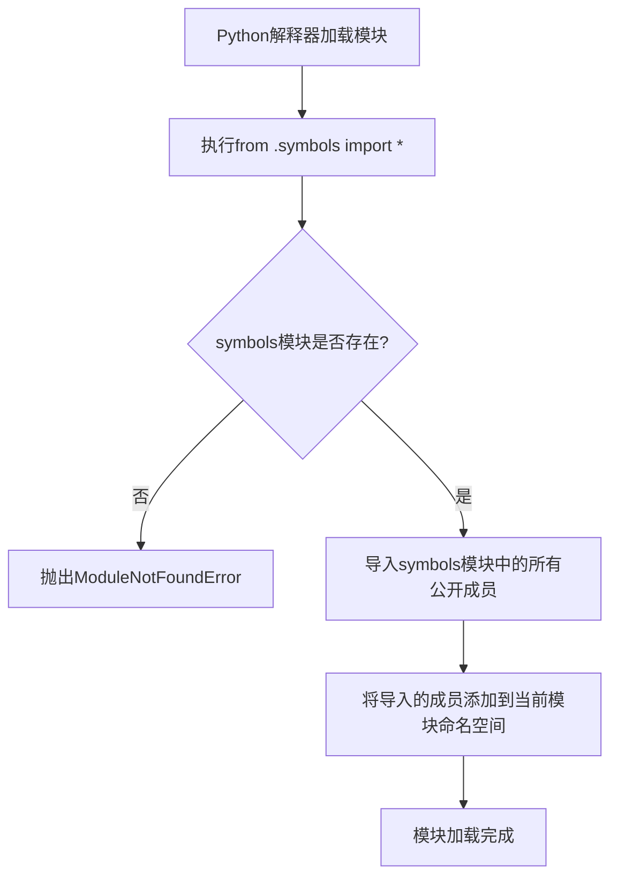

# `Bert-VITS2\onnx_modules\V240\text\__init__.py` 详细设计文档

这是一个包初始化文件，通过相对导入语句从同目录下的symbols模块导入所有公开的符号（类、函数、变量等），使得这些符号可以在包级别直接访问。具体导入的内容取决于symbols模块的定义，但当前代码仅包含导入语句本身。

## 整体流程



## 类结构

```
无类定义（当前文件仅包含导入语句）
```

## 全局变量及字段


### `symbols模块内容未知`
    
无法确定symbols模块中定义的具体变量，因为未提供symbols模块代码

类型：`unknown`
    


    

## 全局函数及方法


# 设计文档生成结果

## 说明

您提供的代码仅有以下内容：

```python
from .symbols import *
```

这是一条导入语句，用于从当前包的 `symbols` 模块导入所有非下划线开头的全局函数/变量。但**并未提供 `symbols` 模块的实际源代码**。

因此，我无法从中提取具体的函数或方法来生成详细设计文档。

---

## 需要的信息

请提供以下内容之一：

1. **`symbols.py` 模块的实际源代码**，或者
2. **您希望分析的具体的函数名称**（如果该函数在项目的其他文件中）

---

## 预期文档结构（当有实际代码时）

当您提供具体代码后，我将按照以下格式生成文档：

```markdown
### `{函数名}`

{描述}

参数：
- `{参数名称}`：`{参数类型}`，{参数描述}
- ...

返回值：`{返回值类型}`，{返回值描述}

#### 流程图

```mermaid
{流程图}
```

#### 带注释源码

```
{带注释的源码}
```

---
```

请您补充 `symbols.py` 模块的代码或明确需要分析的具体函数，谢谢！

## 关键组件


### 导入语句 (Import Statement)

该代码仅包含一个通配符导入语句，从同包下的 `symbols` 模块导入所有符号。由于只提供了导入语句，无法分析其具体实现、类结构、方法细节或张量索引、惰性加载、反量化、量化策略等组件信息。


## 问题及建议


### 已知问题

-   使用了 `from .symbols import *` 通配符导入，导致命名空间污染，无法明确识别实际导入的符号及其来源
-   导入的符号（函数、类、变量）具体内容未知，代码可读性和可维护性差
-   潜在的循环依赖风险（若 symbols 模块也导入当前模块）
-   缺乏对 symbols 模块的显式依赖声明
-   无法通过静态分析确定当前模块的真实依赖

### 优化建议

-   替换为显式导入，如 `from .symbols import SymbolA, SymbolB`，明确列出需要的符号
-   如需导入大量符号，考虑使用别名导入 `import symbols as sym` 并通过 `symbols.SymbolA` 调用
-   在模块开头添加注释说明 symbols 模块的主要用途和导入的符号集合
-   若 symbols 模块较大，考虑拆分或重构，遵循单一职责原则
-   使用 IDE 或工具（如 pylint、pyflakes）检查未使用的导入和循环依赖


## 其它


### 项目概述

本模块为Python包初始化文件，通过相对导入语句从同目录下的symbols模块导入所有公开成员（使用`*`通配符导入）。该代码的核心功能是重导出symbols模块中定义的所有符号，使当前包的使用者可以直接访问这些符号而无需了解其具体来源。

### 整体运行流程

该代码不包含任何可执行逻辑，仅在模块被import时触发Python的导入机制。运行时，Python解释器会首先定位并加载symbols模块，然后将其所有公开属性（不以下划线开头的成员）绑定到当前命名空间。整个过程是Python导入系统的标准行为，不涉及额外的业务逻辑或状态管理。

### 关键组件信息

由于代码仅包含一条导入语句，不存在类定义、方法实现或全局变量。该模块的存在主要是为了提供模块级别的公共API接口，将symbols模块的内部实现与对外接口进行解耦。

### 潜在的技术债务或优化空间

1. 使用`from .symbols import *`可能导致命名空间污染，无法明确控制哪些符号被导出，建议显式列出需要导出的符号名称
2. 缺少对symbols模块可用性的错误处理，若symbols模块不存在或导入失败将抛出ModuleNotFoundError
3. 没有文档字符串说明该模块的用途和导出内容，不符合良好的Python文档规范

### 设计目标与约束

本模块的设计目标是提供一个简洁的公共接口层，将symbols模块的实现细节封装在内部包中。约束条件包括：必须作为Python包（包含`__init__.py`文件）的一部分存在，且同目录下必须存在有效的symbols模块。由于采用`*`导入，无法精确控制导出列表，这与显式导出的最佳实践相悖。

### 错误处理与异常设计

当前代码没有显式的错误处理机制。若symbols模块不存在，Python将抛出`ModuleNotFoundError`异常；若symbols模块存在但导入失败，将抛出相应的导入相关异常。建议添加try-except块处理ImportError情况，并向使用者提供有意义的错误信息。

### 外部依赖与接口契约

该模块依赖同包下的symbols模块，属于内部依赖关系。接口契约方面，使用者可以预期访问到symbols模块中所有非下划线开头的属性，但具体属性列表取决于symbols模块的实现，属于隐式接口契约。

### 模块文档规范建议

建议添加模块级文档字符串（docstring），至少应包含以下信息：模块用途说明、导出的主要符号列表（可使用`__all__`变量显式定义）、使用示例和版本信息。这将显著提升代码的可维护性和使用者的开发体验。


    