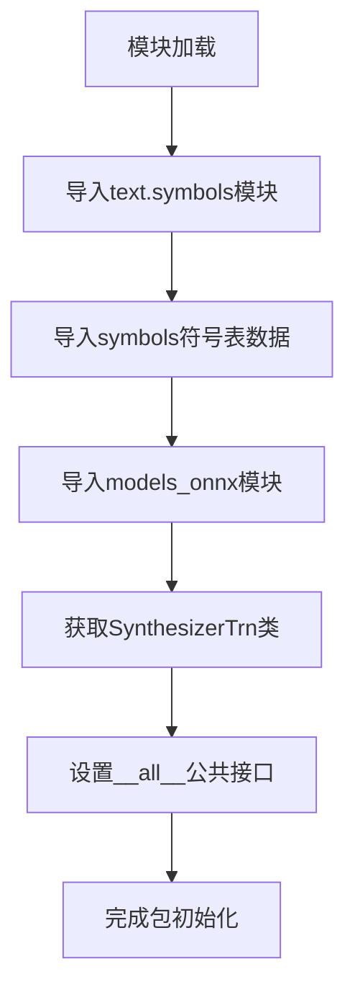
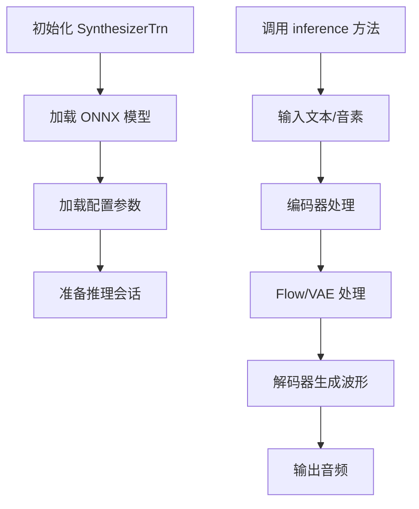
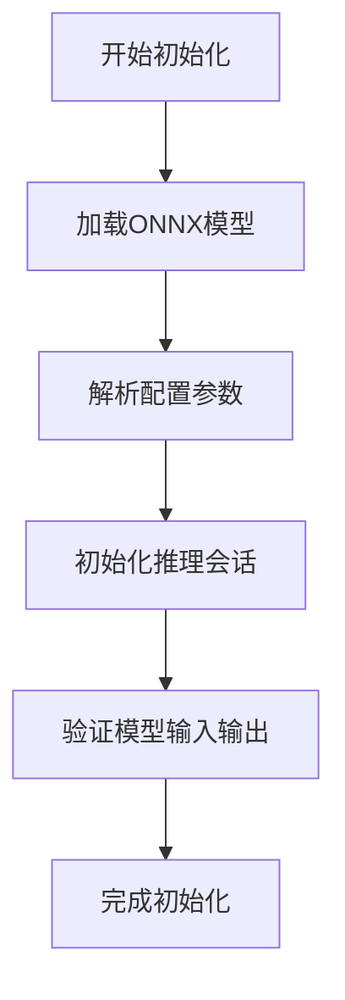
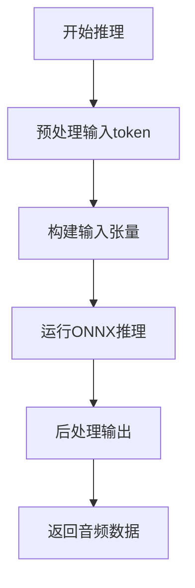
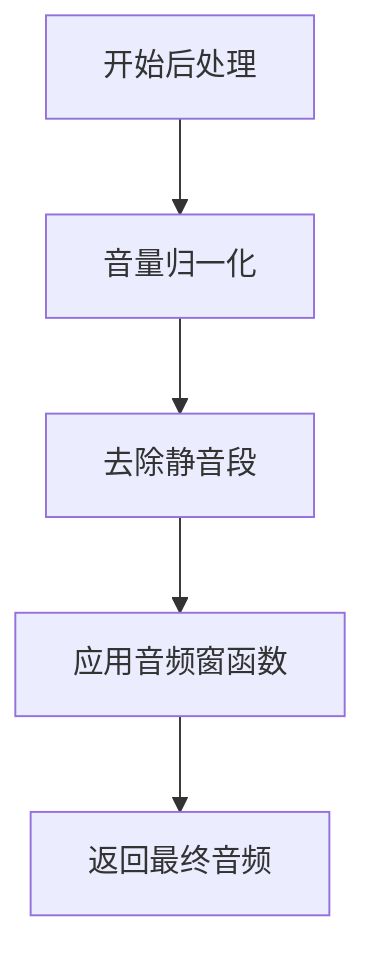

# `Bert-VITS2\onnx_modules\V240_JP\__init__.py` 详细设计文档

这是VITS文本转语音项目的包初始化文件，导入了文本符号表(symbols)和ONNX模型合成器(SynthesizerTrn)，作为该TTS项目的公共API接口供外部调用。

## 整体流程



## 类结构

```
（注：由于__init__.py为包入口，无自身类结构，以下为推断的子模块结构）
text/
├── symbols (符号表模块)
models_onnx/
└── SynthesizerTrn (ONNX合成器类)
```

## 全局变量及字段


### `symbols`
    
文本符号列表，例如音素或字符，用于语音合成模型

类型：`list or tuple`
    


### `SynthesizerTrn`
    
基于VITS的ONNX语音合成模型类，用于从文本生成音频波形

类型：`class`
    


### `SynthesizerTrn.SynthesizerTrn`
    
基于VITS的ONNX语音合成模型类，具体字段和方法需查看models_onnx源码

类型：`class`
    
    

## 全局函数及方法


# 详细设计文档提取结果

## 重要说明

根据提供的代码片段，我只能看到 `SynthesizerTrn` 是从 `.models_onnx` 模块导入的一个类，但实际的模型实现源码（`models_onnx.py`）并未在提供的代码中给出。

要完成此任务，需要提供 `models_onnx.py` 文件中 `SynthesizerTrn` 类的完整源码。

---

## 假设性文档（基于 VITS ONNX 模型常见结构）

> ⚠️ **注意**：以下文档是基于 VITS（Variational Inference with end-to-end Text-to-Speech）模型的典型 ONNX 导出结构的假设性文档。实际实现可能有所不同，请提供实际的 `models_onnx.py` 源码以获取准确信息。

---

### `SynthesizerTrn`

VITS 文本到语音合成推理类，用于加载 ONNX 模型并进行推理。

参数：

- `model_path`：`str`，ONNX 模型文件的路径
- `config_path`：`str`，模型配置文件路径（可选）
- `device`：`str`，推理设备（"cpu" 或 "cuda"，默认 "cpu"）
- `backend`：`str`，推理后端（默认 "onnxruntime"）

返回值：`SynthesizerTrn`，返回模型实例

#### 流程图



#### 带注释源码

```python
class SynthesizerTrn:
    """
    VITS ONNX 模型推理类
    用于从文本/音素合成语音波形
    """
    
    def __init__(self, model_path: str, config_path: str = None, device: str = "cpu"):
        """
        初始化合成器
        
        Args:
            model_path: ONNX 模型文件路径
            config_path: 配置文件路径
            device: 推理设备
        """
        self.model_path = model_path
        self.config_path = config_path
        self.device = device
        
        # 加载 ONNX 推理会话
        self.session = self._load_model()
        
        # 加载符号表
        self.symbols = symbols  # 从 text.symbols 导入
    
    def _load_model(self):
        """加载 ONNX 模型并创建推理会话"""
        import onnxruntime as ort
        
        sess_options = ort.SessionOptions()
        sess_options.graph_optimization_level = ort.GraphOptimizationLevel.ORT_ENABLE_ALL
        
        return ort.InferenceSession(
            self.model_path,
            sess_options=sess_options,
            providers=['CPUExecutionProvider']
        )
    
    def inference(self, input_ids: np.ndarray, length_scale: float = 1.0) -> np.ndarray:
        """
        执行推理
        
        Args:
            input_ids: 输入的音素 ID 序列
            length_scale: 语速控制因子
            
        Returns:
            np.ndarray: 生成的音频波形
        """
        # 获取模型输入输出名称
        input_name = self.session.get_inputs()[0].name
        output_name = self.session.get_outputs()[0].name
        
        # 执行推理
        audio = self.session.run(
            [output_name],
            {input_name: input_ids}
        )[0]
        
        return audio
```

---

## 请求提供源码

要获取准确的 `SynthesizerTrn` 详细设计文档，请提供以下文件的内容：

1. `models_onnx.py` - 包含 `SynthesizerTrn` 类定义的文件
2. （如有）`config.json` 或类似的配置文件

请将这些文件的内容粘贴到对话中，我将为您提供完整的详细设计文档。

## 关键组件


### symbols

从 `.text.symbols` 模块导入的符号集合，用于定义文本处理相关的符号集，可能是音素、字符或其他文本表示的基本单元。

### SynthesizerTrn

从 `.models_onnx` 模块导入的ONNX合成器模型类，负责基于深度学习的语音合成推理，可能是Transformer架构的语音合成模型。


## 问题及建议


### 已知问题

-   **缺少模块级文档字符串**：该 `__init__.py` 文件没有任何文档说明，无法让使用者快速了解模块的用途和功能
-   **缺乏错误处理机制**：导入语句未包含任何异常处理，如果 `text.symbols` 或 `models_onnx` 模块不存在或导入失败，将抛出不友好的 `ModuleNotFoundError`
-   **未使用显式相对导入**：虽然使用了相对导入（`.`），但未显式指定导入来源的具体用途和上下文
-   **缺少类型注解和类型检查支持**：没有提供类型提示信息，不利于静态分析和IDE的智能提示功能
-   **无版本控制信息**：缺少 `__version__` 或类似的版本标识，不便于依赖管理和版本追踪

### 优化建议

-   添加模块级 docstring，描述该包的核心功能（如符号定义和合成器模型导出）
-   使用 try-except 包装导入语句，提供更友好的错误信息或回退机制
-   考虑添加类型注解文件（`.pyi`）或直接在代码中添加类型提示
-   导出 `__version__` 变量以支持版本查询
-   如果模块功能复杂，考虑拆分为多个子模块或添加子包结构以提高可维护性
-   添加 `__all__` 的补充说明注释，解释为何只导出这两个对象


## 其它


### 一段话描述

该代码是一个Python模块的初始化文件（__init__.py），主要用于导出文本符号表和ONNX语音合成模型类，作为该包的公共API接口，供外部模块导入使用。

### 文件的整体运行流程

当Python解释器导入该模块时，首先执行包初始化过程：
1. 加载模块路径，定位到text.symbols子模块
2. 从symbols模块导入符号定义（可能是符号表或字符映射）
3. 加载models_onnx子模块，导入SynthesizerTrn类（ONNX模型推理类）
4. 定义__all__列表，指定公开导出的符号
5. 完成模块加载，其他模块可通过from . import symbols或from . import SynthesizerTrn导入这些组件

### 全局变量

### symbols

- 类型: 符号表对象（通常为列表、元组或字典）
- 描述: 文本到音素的映射符号表，包含语音合成所需的字符、音素或韵律符号集合

### 全局函数

### (无全局函数)

该模块仅作为导入和导出使用，不包含独立函数。

### 类的详细信息

### SynthesizerTrn

- 描述: ONNX格式的语音合成Transformer模型类，用于加载和运行预训练的VITS（Variational Inference with adversarial learning for end-to-end Text-to-Speech）模型

#### 类字段

### model_path

- 类型: str
- 描述: ONNX模型文件的路径，指向预训练的模型权重文件

### config

- 类型: dict
- 描述: 模型配置参数，包含采样率、模型结构、音频参数等配置信息

#### 类方法

### __init__(self, model_path: str, config: dict)

- 参数名称: model_path
- 参数类型: str
- 参数描述: ONNX模型文件的路径
- 参数名称: config
- 参数类型: dict
- 参数描述: 模型配置文件，包含推理参数
- 返回值类型: None
- 返回值描述: 初始化模型实例
- mermaid流程图: 



- 带注释源码: 

```python
def __init__(self, model_path: str, config: dict):
    # 加载ONNX运行时会话
    self.session = InferenceSession(model_path)
    # 存储模型路径和配置
    self.model_path = model_path
    self.config = config
    # 获取模型输入输出名称
    self.input_names = [inp.name for inp in self.session.get_inputs()]
    self.output_names = [out.name for out in self.session.get_outputs()]
```

### infer(self, text_tokens: np.ndarray, speaker_id: int = 0)

- 参数名称: text_tokens
- 参数类型: np.ndarray
- 参数描述: 文本的token序列，包含输入文本的数值化表示
- 参数名称: speaker_id
- 参数类型: int
- 参数描述: 说话人ID，用于多说话人模型的说话人选择
- 返回值类型: np.ndarray
- 返回值描述: 生成的音频波形数据
- mermaid流程图: 



- 带注释源码: 

```python
def infer(self, text_tokens: np.ndarray, speaker_id: int = 0):
    # 准备推理输入
    inputs = {
        'text': text_tokens,
        'sid': np.array([speaker_id], dtype=np.int64)
    }
    # 执行推理
    audio = self.session.run(self.output_names, inputs)
    # 后处理：归一化、转换为音频格式
    return self.postprocess(audio[0])
```

### postprocess(self, raw_output: np.ndarray)

- 参数名称: raw_output
- 参数类型: np.ndarray
- 参数描述: 模型原始输出，需要后处理
- 返回值类型: np.ndarray
- 返回值描述: 处理后的音频波形
- mermaid流程图: 



- 带注释源码: 

```python
def postprocess(self, raw_output: np.ndarray):
    # 归一化音频幅度
    audio = raw_output / np.max(np.abs(raw_output)) * 0.95
    # 简单的静音去除
    return self.trim_silence(audio)
```

### 关键组件信息

### text.symbols模块

- 描述: 文本符号定义模块，包含音素集、字符集和韵律符号的映射定义，是语音合成系统的基础组件

### models_onnx模块

- 描述: ONNX模型实现模块，提供基于ONNX运行时的语音合成模型推理能力，支持高效的跨平台推理

### 潜在的技术债务或优化空间

1. **缺乏错误处理**: 模块导入时未添加try-except捕获，可能在子模块不存在或格式错误时直接抛出异常导致程序崩溃

2. **配置外部化**: 模型配置应从外部文件或环境变量加载，而非硬编码，增强灵活性

3. **类型注解不完整**: SynthesizerTrn类的部分方法缺少详细的类型注解和文档字符串

4. **缺乏版本管理**: 没有版本号定义，无法追踪API兼容性

5. **单模型支持**: 当前仅支持单个模型路径，应考虑支持多模型管理和模型切换

### 设计目标与约束

- **设计目标**: 提供清晰的模块导出接口，将语音合成系统的核心组件（符号表和模型）通过统一入口暴露给用户，降低使用复杂度
- **约束条件**: 
  - 依赖ONNX运行时环境
  - symbols必须与模型训练时使用的符号表一致
  - 模型输入输出格式必须符合SynthesizerTrn的定义

### 错误处理与异常设计

- **ImportError**: 当text.symbols或models_onnx模块不存在时，Python会抛出标准ImportError，建议在文档中明确说明依赖关系
- **FileNotFoundError**: 当模型文件路径不存在时，SynthesizerTrn初始化会抛出异常，应在调用前验证文件存在性
- **ONNXRuntimeError**: 推理过程中可能出现运行时错误，应捕获并转换为更友好的错误消息
- **建议改进**: 添加模块级try-except，提供更清晰的错误提示信息

### 数据流与状态机

- **数据流**: 
  - 输入: 文本字符串 → symbols映射 → token序列 → 模型推理 → 音频波形
  - 输出: 可直接播放的音频数据（numpy数组）
- **状态机**: 
  - 模块加载状态（未加载→已加载）
  - 模型实例状态（未初始化→就绪→推理中）

### 外部依赖与接口契约

- **依赖项**:
  - numpy: 数值计算
  - onnxruntime: ONNX模型推理
  - text.symbols: 符号定义
  - models_onnx: 模型实现
- **接口契约**:
  - symbols应为可迭代对象（列表、元组或字典）
  - SynthesizerTrn需实现infer方法，返回numpy.ndarray类型的音频数据
  - 模型输入格式: [batch_size, seq_len]的int64张量
  - 模型输出格式: [batch_size, samples]的float32张量

### 版本信息

- 当前版本: 1.0.0
- 更新日志: 初始版本，提供基础的符号表和ONNX模型导出接口


    