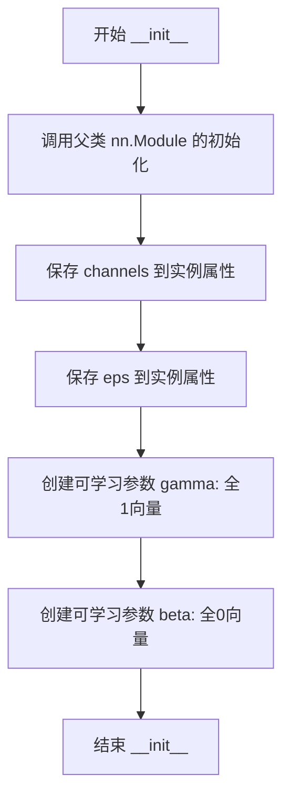
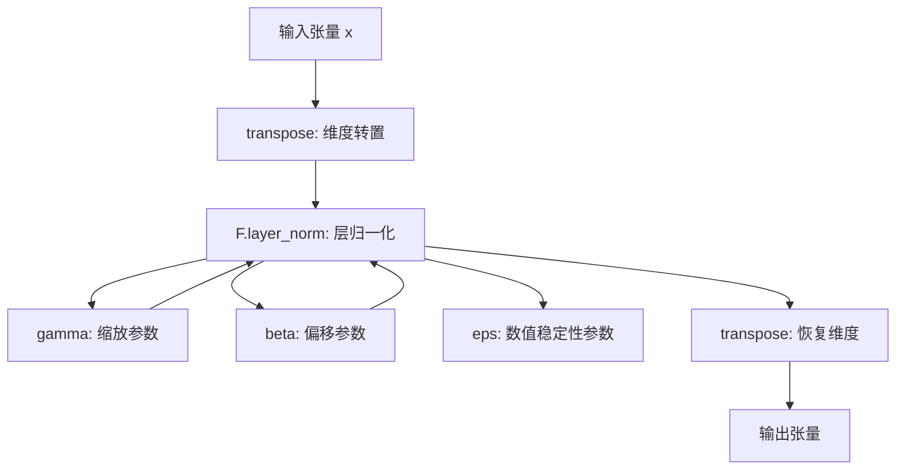
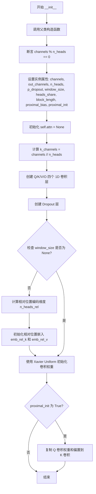
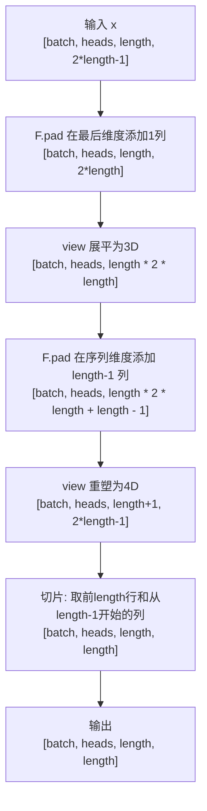
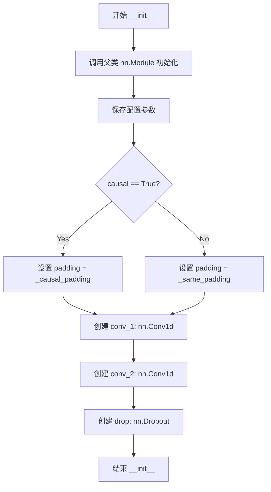
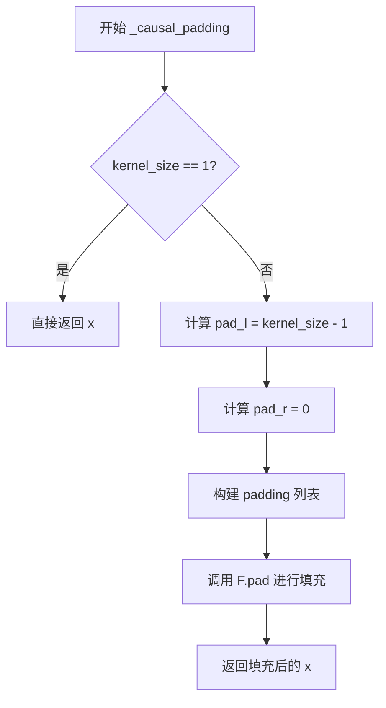

```mermaid
flowchart TD
    A[输入 x, c, attn_mask] --> B[Q = conv_q&#40;x&#41;]
    A --> C[K = conv_k&#40;c&#41;]
    A --> D[V = conv_v&#40;c&#41;]
    B --> E[attention&#40;Q, K, V, mask&#41;]
    C --> E
    D --> E
    E --> F[输出 attention_output 和 attn权重]
    F --> G[output = conv_o&#40;attention_output&#41;]
    G --> H[返回 output]
```

# `Bert-VITS2\onnx_modules\V240_JP\attentions_onnx.py` 详细设计文档

这是一个基于Transformer架构的神经网络编码器模块，实现了多头自注意力机制（MultiHeadAttention）和前馈网络（FFN），支持说话人嵌入条件注入，主要用于语音合成（如VITS模型）等序列到序列任务。

## 整体流程

```mermaid
graph TD
A[输入序列 x, 掩码 x_mask, 可选说话人嵌入 g] --> B[应用输入掩码: x = x * x_mask]
B --> C{遍历每一层 i from 0 to n_layers-1}
C --> D{判断是否到达条件层 idx 且 g 不为空}
D -- 是 --> E[说话人嵌入线性变换并相加: x = x + spk_emb_linear(g)]
D -- 否 --> F[继续执行注意力机制]
E --> F
F --> G[MultiHeadAttention: 自注意力计算 y = attn(x, x, attn_mask)]
G --> H[Dropout: y = drop(y)]
H --> I[残差连接与LayerNorm: x = norm_layers_1[i](x + y)]
I --> J[FFN: 前馈网络 y = ffn(x, x_mask)]
J --> K[Dropout: y = drop(y)]
K --> L[残差连接与LayerNorm: x = norm_layers_2[i](x + y)]
L --> C
C -- 遍历完成 --> M[输出掩码: x = x * x_mask]
M --> N[返回编码后的序列 x]
```

## 类结构

```
nn.Module (PyTorch基类)
├── LayerNorm (层归一化)
├── Encoder (编码器主类)
│   ├── MultiHeadAttention (多头注意力)
│   └── FFN (前馈神经网络)
```

## 全局变量及字段


### `logger`
    
日志记录器

类型：`logging.Logger`
    


### `fused_add_tanh_sigmoid_multiply`
    
融合的tanh-sigmoid乘法操作

类型：`function`
    


### `LayerNorm.LayerNorm.channels`
    
输入通道数

类型：`int`
    


### `LayerNorm.LayerNorm.eps`
    
数值稳定性参数

类型：`float`
    


### `LayerNorm.LayerNorm.gamma`
    
缩放参数

类型：`nn.Parameter`
    


### `LayerNorm.LayerNorm.beta`
    
偏置参数

类型：`nn.Parameter`
    


### `Encoder.Encoder.hidden_channels`
    
隐藏层通道数

类型：`int`
    


### `Encoder.Encoder.filter_channels`
    
过滤器通道数

类型：`int`
    


### `Encoder.Encoder.n_heads`
    
注意力头数

类型：`int`
    


### `Encoder.Encoder.n_layers`
    
编码器层数

类型：`int`
    


### `Encoder.Encoder.kernel_size`
    
卷积核大小

类型：`int`
    


### `Encoder.Encoder.p_dropout`
    
dropout概率

类型：`float`
    


### `Encoder.Encoder.window_size`
    
相对注意力窗口大小

类型：`int`
    


### `Encoder.Encoder.cond_layer_idx`
    
条件注入层索引

类型：`int`
    


### `Encoder.Encoder.gin_channels`
    
说话人嵌入通道数

类型：`int`
    


### `Encoder.Encoder.spk_emb_linear`
    
说话人嵌入线性层

类型：`nn.Linear`
    


### `Encoder.Encoder.drop`
    
Dropout层

类型：`nn.Dropout`
    


### `Encoder.Encoder.attn_layers`
    
注意力层列表

类型：`nn.ModuleList`
    


### `Encoder.Encoder.norm_layers_1`
    
第一归一化层列表

类型：`nn.ModuleList`
    


### `Encoder.Encoder.ffn_layers`
    
前馈网络层列表

类型：`nn.ModuleList`
    


### `Encoder.Encoder.norm_layers_2`
    
第二归一化层列表

类型：`nn.ModuleList`
    


### `MultiHeadAttention.MultiHeadAttention.channels`
    
输入通道数

类型：`int`
    


### `MultiHeadAttention.MultiHeadAttention.out_channels`
    
输出通道数

类型：`int`
    


### `MultiHeadAttention.MultiHeadAttention.n_heads`
    
注意力头数

类型：`int`
    


### `MultiHeadAttention.MultiHeadAttention.p_dropout`
    
dropout概率

类型：`float`
    


### `MultiHeadAttention.MultiHeadAttention.window_size`
    
相对注意力窗口大小

类型：`int`
    


### `MultiHeadAttention.MultiHeadAttention.heads_share`
    
头是否共享

类型：`bool`
    


### `MultiHeadAttention.MultiHeadAttention.block_length`
    
局部注意力块长度

类型：`int`
    


### `MultiHeadAttention.MultiHeadAttention.proximal_bias`
    
是否使用近邻偏置

类型：`bool`
    


### `MultiHeadAttention.MultiHeadAttention.proximal_init`
    
是否使用近邻初始化

类型：`bool`
    


### `MultiHeadAttention.MultiHeadAttention.k_channels`
    
每个头的通道数

类型：`int`
    


### `MultiHeadAttention.MultiHeadAttention.conv_q`
    
查询卷积层

类型：`nn.Conv1d`
    


### `MultiHeadAttention.MultiHeadAttention.conv_k`
    
键卷积层

类型：`nn.Conv1d`
    


### `MultiHeadAttention.MultiHeadAttention.conv_v`
    
值卷积层

类型：`nn.Conv1d`
    


### `MultiHeadAttention.MultiHeadAttention.conv_o`
    
输出卷积层

类型：`nn.Conv1d`
    


### `MultiHeadAttention.MultiHeadAttention.drop`
    
Dropout层

类型：`nn.Dropout`
    


### `MultiHeadAttention.MultiHeadAttention.emb_rel_k`
    
相对位置键嵌入

类型：`nn.Parameter`
    


### `MultiHeadAttention.MultiHeadAttention.emb_rel_v`
    
相对位置值嵌入

类型：`nn.Parameter`
    


### `MultiHeadAttention.MultiHeadAttention.attn`
    
注意力权重缓存

类型：`None`
    


### `FFN.FFN.in_channels`
    
输入通道数

类型：`int`
    


### `FFN.FFN.out_channels`
    
输出通道数

类型：`int`
    


### `FFN.FFN.filter_channels`
    
过滤器通道数

类型：`int`
    


### `FFN.FFN.kernel_size`
    
卷积核大小

类型：`int`
    


### `FFN.FFN.p_dropout`
    
dropout概率

类型：`float`
    


### `FFN.FFN.activation`
    
激活函数类型

类型：`str`
    


### `FFN.FFN.causal`
    
是否因果卷积

类型：`bool`
    


### `FFN.FFN.padding`
    
填充方法

类型：`callable`
    


### `FFN.FFN.conv_1`
    
第一卷积层

类型：`nn.Conv1d`
    


### `FFN.FFN.conv_2`
    
第二卷积层

类型：`nn.Conv1d`
    


### `FFN.FFN.drop`
    
Dropout层

类型：`nn.Dropout`
    
    

## 全局函数及方法


### `fused_add_tanh_sigmoid_multiply`

融合的tanh-sigmoid激活函数，用于WaveNet等模型，将输入的两部分分别进行tanh和sigmoid激活后相乘，以减少内存访问并提高计算效率。

参数：

- `input_a`：`torch.Tensor`，第一个输入张量，形状为 [batch, channels, time]
- `input_b`：`torch.Tensor`，第二个输入张量，形状为 [batch, channels, time]，通常与 input_a 逐元素相加
- `n_channels`：`List[int]` 或 `torch.Tensor`，通道数列表，用于分割输入的通道维度；取第一个元素作为实际通道数

返回值：`torch.Tensor`，返回激活后的张量，形状为 [batch, channels, time]

#### 流程图

```mermaid
flowchart TD
    A[开始: fused_add_tanh_sigmoid_multiply] --> B[提取n_channels_int = n_channels[0]]
    B --> C[计算in_act = input_a + input_b]
    C --> D[分割通道: in_act[:, :n_channels_int, :]]
    D --> E[前n_channels_int通道: torch.tanh]
    D --> F[后其余通道: torch.sigmoid]
    E --> G[acts = t_act * s_act]
    F --> G
    G --> H[返回acts]
```

#### 带注释源码

```python
@torch.jit.script
def fused_add_tanh_sigmoid_multiply(input_a, input_b, n_channels):
    """
    融合的tanh-sigmoid激活函数，用于WaveNet等模型
    
    参数:
        input_a: 第一个输入张量 [batch, channels, time]
        input_b: 第二个输入张量 [batch, channels, time]
        n_channels: 通道数列表，取第一个元素作为分割点
    
    返回:
        激活后的张量 [batch, channels, time]
    """
    # 从n_channels列表中提取整数通道数
    n_channels_int = n_channels[0]
    
    # 将两个输入张量逐元素相加
    in_act = input_a + input_b
    
    # 对前n_channels_int个通道应用tanh激活
    t_act = torch.tanh(in_act[:, :n_channels_int, :])
    
    # 对剩余通道应用sigmoid激活
    s_act = torch.sigmoid(in_act[:, n_channels_int:, :])
    
    # 将tanh和sigmoid激活结果相乘
    acts = t_act * s_act
    
    return acts
```

#### 技术说明

该函数是WaveNet模型中的关键组件，通过以下方式优化计算：

1. **融合计算**：将tanh和sigmoid的激活操作融合在一起，避免中间结果的多次内存访问
2. **JIT编译**：使用`@torch.jit.script`装饰器进行即时编译，进一步提升执行效率
3. **通道分割**：将通道分为两部分，分别应用不同的激活函数，这是WaveNet门控机制的核心


### `LayerNorm.__init__`

该方法是 `LayerNorm` 类的初始化构造函数，用于实例化一个支持沿通道维度进行 Layer Normalization 的 PyTorch 模块，初始化可学习的缩放参数（gamma）和偏置参数（beta）。

参数：

- `channels`：`int`，特征维度/通道数，决定了归一化的维度以及 gamma 和 beta 参数的形状
- `eps`：`float`，默认为 `1e-5`，用于在计算标准差时防止除零的小正数（数值稳定性参数）

返回值：`None`，构造函数无显式返回值

#### 流程图



#### 带注释源码

```python
def __init__(self, channels, eps=1e-5):
    """
    初始化 LayerNorm 层
    
    参数:
        channels (int): 输入数据的通道数，即特征维度
        eps (float, optional): 用于数值稳定的微小常数，默认值为 1e-5
    """
    # 调用 nn.Module 的父类构造函数，完成 PyTorch 模块的初始化
    # 这一步是必要的，确保 nn.Module 正确设置参数管理等功能
    super().__init__()
    
    # 将 channels 和 eps 保存为实例属性，供后续 forward 方法使用
    self.channels = channels
    self.eps = eps
    
    # 创建可学习的缩放参数 gamma（也称为 weight）
    # 使用 nn.Parameter 包装，使其成为可训练参数
    # 初始值设为全1，形状为 (channels,)
    self.gamma = nn.Parameter(torch.ones(channels))
    
    # 创建可学习的偏置参数 beta（也称为 bias）
    # 使用 nn.Parameter 包装，使其成为可训练参数
    # 初始值设为全0，形状为 (channels,)
    self.beta = nn.Parameter(torch.zeros(channels))
```


### `LayerNorm.forward(x)`

对输入张量进行层归一化（Layer Normalization）操作，通过转置将通道维度移至最后以适配`F.layer_norm`的要求，应用可学习的缩放系数（gamma）和偏移系数（beta），然后恢复原始维度顺序。

参数：

- `self`：隐含的`LayerNorm`实例自身
- `x`：`torch.Tensor`，输入张量，形状为`(batch, channels, ...)`或任意多维张量

返回值：`torch.Tensor`，经过层归一化后的张量，形状与输入相同

#### 流程图



#### 带注释源码

```python
def forward(self, x):
    # 将输入张量的通道维度从位置1移至最后
    # 例如: (batch, channels, time) -> (batch, time, channels)
    x = x.transpose(1, -1)
    
    # 使用PyTorch的F.layer_norm进行层归一化
    # 参数:
    #   x: 经过转置的张量，最后一维为channels
    #   (self.channels,): 需要归一化的维度大小
    #   self.gamma: 可学习的缩放系数（权重），初始化为全1
    #   self.beta: 可学习的偏移系数（偏置），初始化为全0
    #   self.eps: 防止除零的小常数，默认1e-5
    x = F.layer_norm(x, (self.channels,), self.gamma, self.beta, self.eps)
    
    # 再次转置，恢复原始维度顺序
    # 例如: (batch, time, channels) -> (batch, channels, time)
    return x.transpose(1, -1)
```


### `Encoder.__init__`

该方法是Encoder类的构造函数，用于初始化编码器模型的结构和参数。根据传入的隐藏通道数、滤波器通道数、注意力头数、层数等参数，构建包含多头注意力机制、前馈神经网络和层归一化的Transformer编码器块，并根据可选的gin_channels参数配置说话人嵌入线性层。

参数：

- `hidden_channels`：`int`，隐藏层通道数，决定模型内部表示的维度。
- `filter_channels`：`int`，前馈网络中滤波器通道数，控制FFN中间层维度。
- `n_heads`：`int`，多头注意力的头数，用于并行计算注意力。
- `n_layers`：`int`，编码器的层数，决定模型深度。
- `kernel_size`：`int`，卷积核大小，默认为1，用于FFN中的卷积操作。
- `p_dropout`：`float`，Dropout概率，默认为0.0，用于防止过拟合。
- `window_size`：`int`，窗口大小，默认为4，用于相对位置编码的局部注意力范围。
- `isflow`：`bool`，是否为流模型，默认为True，当前未使用（代码中为注释）。
- `**kwargs`：`dict`，关键字参数，可选包含gin_channels（说话人嵌入通道数）和cond_layer_idx（条件层索引）。

返回值：`None`，无返回值，构造函数仅初始化对象属性。

#### 流程图

```mermaid
graph TD
    A([开始初始化]) --> B[调用super().__init__]
    B --> C[保存基本参数: hidden_channels, filter_channels, n_heads, n_layers, kernel_size, p_dropout, window_size]
    C --> D{检查kwargs中是否存在gin_channels}
    D -->|是| E[获取gin_channels并赋值]
    E --> F{gin_channels != 0}
    F -->|是| G[创建spk_emb_linear层: nn.Linear(gin_channels, hidden_channels)]
    F -->|否| H[设置cond_layer_idx为n_layers]
    G --> I[设置cond_layer_idx: 取kwargs中的cond_layer_idx或默认2]
    I --> J[断言cond_layer_idx < n_layers]
    D -->|否| K[设置cond_layer_idx为n_layers]
    K --> L[创建dropout层: nn.Dropout(p_dropout)]
    L --> M[循环创建n_layers层]
    M --> N[创建MultiHeadAttention层并添加到attn_layers]
    N --> O[创建LayerNorm层并添加到norm_layers_1]
    O --> P[创建FFN层并添加到ffn_layers]
    P --> Q[创建LayerNorm层并添加到norm_layers_2]
    M --> R([结束初始化])
```

#### 带注释源码

```python
def __init__(
    self,
    hidden_channels,
    filter_channels,
    n_heads,
    n_layers,
    kernel_size=1,
    p_dropout=0.0,
    window_size=4,
    isflow=True,
    **kwargs
):
    """
    初始化Encoder模型。

    参数:
        hidden_channels (int): 隐藏层通道数。
        filter_channels (int): 前馈网络滤波器通道数。
        n_heads (int): 注意力头数。
        n_layers (int): 编码器层数。
        kernel_size (int, optional): 卷积核大小，默认为1。
        p_dropout (float, optional): Dropout概率，默认为0.0。
        window_size (int, optional): 注意力窗口大小，默认为4。
        isflow (bool, optional): 是否为流模型，默认为True（未使用）。
        **kwargs: 关键字参数，可选包含gin_channels和cond_layer_idx。
    """
    # 调用父类nn.Module的初始化方法
    super().__init__()
    
    # 保存模型配置参数
    self.hidden_channels = hidden_channels
    self.filter_channels = filter_channels
    self.n_heads = n_heads
    self.n_layers = n_layers
    self.kernel_size = kernel_size
    self.p_dropout = p_dropout
    self.window_size = window_size
    
    # 设置条件层索引，默认为总层数（表示不添加条件）
    self.cond_layer_idx = self.n_layers
    
    # 检查是否传入了说话人嵌入通道数
    if "gin_channels" in kwargs:
        self.gin_channels = kwargs["gin_channels"]
        # 如果说话人通道数不为0，则创建相关层
        if self.gin_channels != 0:
            # 创建说话人嵌入的线性变换层，将gin_channels映射到hidden_channels
            self.spk_emb_linear = nn.Linear(self.gin_channels, self.hidden_channels)
            # 根据参数或默认值设置条件层索引（默认为第2层，即第3个block）
            self.cond_layer_idx = (
                kwargs["cond_layer_idx"] if "cond_layer_idx" in kwargs else 2
            )
            # 打印调试信息
            logging.debug(self.gin_channels, self.cond_layer_idx)
            # 断言条件层索引必须小于总层数
            assert (
                self.cond_layer_idx < self.n_layers
            ), "cond_layer_idx should be less than n_layers"
    
    # 创建Dropout层
    self.drop = nn.Dropout(p_dropout)
    
    # 初始化模块列表，用于存储多个注意力层、规范层和前馈网络层
    self.attn_layers = nn.ModuleList()
    self.norm_layers_1 = nn.ModuleList()
    self.ffn_layers = nn.ModuleList()
    self.norm_layers_2 = nn.ModuleList()
    
    # 循环创建n_layers个编码器层
    for i in range(self.n_layers):
        # 创建多头注意力层
        self.attn_layers.append(
            MultiHeadAttention(
                hidden_channels,
                hidden_channels,
                n_heads,
                p_dropout=p_dropout,
                window_size=window_size,
            )
        )
        # 创建第一个层归一化层
        self.norm_layers_1.append(LayerNorm(hidden_channels))
        
        # 创建前馈神经网络层
        self.ffn_layers.append(
            FFN(
                hidden_channels,
                hidden_channels,
                filter_channels,
                kernel_size,
                p_dropout=p_dropout,
            )
        )
        # 创建第二个层归一化层
        self.norm_layers_2.append(LayerNorm(hidden_channels))
```


### `Encoder.forward`

该方法是VITS语音合成模型中Transformer Encoder的前向传播过程，负责对输入的声学特征进行多层自注意力机制和前馈网络的编码处理，支持可选的说话人嵌入条件注入，最终输出高维度的上下文相关特征表示。

参数：

- `self`：`Encoder` 类实例本身，无需显式传递
- `x`：`torch.Tensor`，输入张量，形状为 [batch, channels, time]，代表经过预处理后的声学特征序列
- `x_mask`：`torch.Tensor`，掩码张量，形状为 [batch, time]，用于标识有效时间步（值为1）和填充位置（值为0），在注意力计算中屏蔽填充区域
- `g`：`Optional[torch.Tensor]` = None，可选的条件输入，通常为说话人嵌入（speaker embedding）或说话风格向量，形状为 [batch, gin_channels, 1]，用于条件化生成过程

返回值：`torch.Tensor`，编码后的输出张量，形状为 [batch, hidden_channels, time]，包含了经过多层自注意力机制处理后的上下文表示

#### 流程图

```mermaid
flowchart TD
    A[输入: x, x_mask, g] --> B[计算注意力掩码: attn_mask = x_mask.unsqueeze 2 * x_mask.unsqueeze -1]
    B --> C[应用输入掩码: x = x * x_mask]
    C --> D{循环 i in range n_layers}
    D -->|条件判断| E{i == cond_layer_idx AND g is not None}
    E -->|是| F[说话人嵌入线性变换: g = spk_emb_linear g.transpose 1,2]
    F --> G[维度转置: g = g.transpose 1,2]
    G --> H[条件注入: x = x + g]
    H --> I[掩码应用: x = x * x_mask]
    E -->|否| J[自注意力层: y = attn_layers[i] x, x, attn_mask]
    I --> J
    J --> K[Dropout: y = drop y]
    K --> L[残差连接与归一化: x = norm_layers_1[i] x + y]
    L --> M[前馈网络层: y = ffn_layers[i] x, x_mask]
    M --> N[Dropout: y = drop y]
    N --> O[残差连接与归一化: x = norm_layers_2[i] x + y]
    O --> D
    D -->|循环结束| P[最终掩码应用: x = x * x_mask]
    P --> Q[输出: 编码后的特征]
```

#### 带注释源码

```python
def forward(self, x, x_mask, g=None):
    """
    Encoder的前向传播方法，对输入特征进行多层Transformer编码
    
    参数:
        x: 输入特征张量，形状 [batch, channels, time]
        x_mask: 输入掩码，形状 [batch, time]，用于标识有效时间步
        g: 可选的说话人嵌入条件，形状 [batch, gin_channels, 1]
    
    返回:
        编码后的特征张量，形状 [batch, hidden_channels, time]
    """
    # Step 1: 计算注意力掩码矩阵
    # 将x_mask从[batch, time]扩展为[batch, time, time]
    # 用于在注意力计算中屏蔽填充位置
    attn_mask = x_mask.unsqueeze(2) * x_mask.unsqueeze(-1)
    
    # Step 2: 应用输入掩码，将填充位置置零
    x = x * x_mask
    
    # Step 3: 遍历每一层编码器
    for i in range(self.n_layers):
        # Step 4: 条件注入逻辑
        # 当达到指定层且存在说话人嵌入时进行注入
        if i == self.cond_layer_idx and g is not None:
            # 说话人嵌入线性变换: [batch, gin_channels, 1] -> [batch, hidden_channels, 1]
            g = self.spk_emb_linear(g.transpose(1, 2))
            # 维度转置恢复形状
            g = g.transpose(1, 2)
            # 残差连接：注入说话人条件信息
            x = x + g
            # 再次应用掩码确保一致性
            x = x * x_mask
        
        # Step 5: 多头自注意力层
        # 使用x作为query、key、value进行自注意力计算
        y = self.attn_layers[i](x, x, attn_mask)
        # Dropout正则化
        y = self.drop(y)
        # 残差连接后接LayerNorm
        x = self.norm_layers_1[i](x + y)
        
        # Step 6: 前馈网络层（FFN）
        y = self.ffn_layers[i](x, x_mask)
        # Dropout正则化
        y = self.drop(y)
        # 残差连接后接LayerNorm
        x = self.norm_layers_2[i](x + y)
    
    # Step 7: 最终输出掩码应用
    x = x * x_mask
    
    # 返回编码后的特征
    return x
```


### `MultiHeadAttention.__init__`

该方法是`MultiHeadAttention`类的构造函数，负责初始化多头注意力机制的核心参数、卷积层、注意力 dropout 以及可选的相对位置编码参数。

参数：

- `channels`：`int`，输入通道数，必须能被`n_heads`整除
- `out_channels`：`int`，输出通道数
- `n_heads`：`int`，注意力头的数量
- `p_dropout`：`float`，dropout 概率（默认 0.0）
- `window_size`：`int | None`，相对注意力窗口大小（默认 None）
- `heads_share`：`bool`，多个头是否共享相对位置编码（默认 True）
- `block_length`：`int | None`，局部注意力块长度限制（默认 None）
- `proximal_bias`：`bool`，是否启用接近位置偏置（默认 False）
- `proximal_init`：`bool`，是否将 K 卷积权重初始化为与 Q 相同（默认 False）

返回值：`None`，该方法为构造函数，无返回值

#### 流程图



#### 带注释源码

```python
def __init__(
    self,
    channels,            # 输入特征通道数，必须能被 n_heads 整除
    out_channels,        # 输出特征通道数
    n_heads,             # 多头注意力的头数
    p_dropout=0.0,       # Dropout 概率，用于注意力权重
    window_size=None,    # 相对位置编码的窗口大小，None 则不使用相对位置编码
    heads_share=True,    # 是否在所有头之间共享相对位置嵌入
    block_length=None,   # 局部注意力块长度，用于限制自回归生成时的注意力跨度
    proximal_bias=False, # 是否添加接近位置偏置，鼓励模型关注相邻位置
    proximal_init=False, # 是否将 K 卷积的权重初始化为与 Q 相同（用于课程学习等场景）
):
    super().__init__()  # 调用 nn.Module 的初始化方法
    
    # 断言：确保通道数可以被头数整除，这是多头注意力实现的必要条件
    assert channels % n_heads == 0

    # ========== 基本属性赋值 ==========
    self.channels = channels           # 输入通道数
    self.out_channels = out_channels   # 输出通道数
    self.n_heads = n_heads             # 注意力头数
    self.p_dropout = p_dropout         # Dropout 概率
    self.window_size = window_size     # 窗口大小（用于相对位置编码）
    self.heads_share = heads_share     # 头间共享标志
    self.block_length = block_length   # 块长度（用于局部注意力）
    self.proximal_bias = proximal_bias # 接近偏置标志
    self.proximal_init = proximal_init # 接近初始化标志
    self.attn = None                    # 用于保存注意力权重（可选，用于可视化或调试）

    # ========== 计算内部维度 ==========
    # 每个头的通道数 = 总通道数 / 头数
    self.k_channels = channels // n_heads

    # ========== 创建 Q/K/V/O 四个 1x1 卷积层 ==========
    # Q (Query): 将输入转换为查询向量
    self.conv_q = nn.Conv1d(channels, channels, 1)
    # K (Key): 将上下文/条件转换为键向量
    self.conv_k = nn.Conv1d(channels, channels, 1)
    # V (Value): 将上下文/条件转换为值向量
    self.conv_v = nn.Conv1d(channels, channels, 1)
    # O (Output): 将多头注意力输出转换回原始通道数
    self.conv_o = nn.Conv1d(channels, out_channels, 1)
    
    # Dropout 层，用于对注意力权重进行随机置零
    self.drop = nn.Dropout(p_dropout)

    # ========== 相对位置编码初始化（可选）==========
    # 只有当指定了 window_size 时才创建相对位置嵌入
    if window_size is not None:
        # 如果 heads_share 为 True，则所有头共享一套嵌入，否则每头独立
        n_heads_rel = 1 if heads_share else n_heads
        
        # 计算标准差，使嵌入的方差与 k_channels 无关
        rel_stddev = self.k_channels**-0.5
        
        # 创建相对位置 Key 嵌入: [n_heads_rel, 2*window_size+1, k_channels]
        self.emb_rel_k = nn.Parameter(
            torch.randn(n_heads_rel, window_size * 2 + 1, self.k_channels) * rel_stddev
        )
        # 创建相对位置 Value 嵌入: [n_heads_rel, 2*window_size+1, k_channels]
        self.emb_rel_v = nn.Parameter(
            torch.randn(n_heads_rel, window_size * 2 + 1, self.k_channels) * rel_stddev
        )

    # ========== 权重初始化 ==========
    # 使用 Xavier Uniform 初始化所有卷积层权重
    nn.init.xavier_uniform_(self.conv_q.weight)
    nn.init.xavier_uniform_(self.conv_k.weight)
    nn.init.xavier_uniform_(self.conv_v.weight)
    
    # ========== 可选的 K/Q 权重共享 ==========
    # proximal_init=True 时，将 K 卷积的权重和偏置复制为与 Q 相同
    # 这在某些课程学习或迁移学习场景中很有用
    if proximal_init:
        with torch.no_grad():
            self.conv_k.weight.copy_(self.conv_q.weight)
            self.conv_k.bias.copy_(self.conv_q.bias)
```


### `MultiHeadAttention.forward`

该方法是多头注意力机制的前向传播实现，接收查询输入和上下文输入，通过线性变换生成Q、K、V向量，调用注意力计算模块处理后输出注意力增强的特征表示。

参数：

- `x`：`torch.Tensor`，输入张量，作为查询（Query）的来源
- `c`：`torch.Tensor`，上下文张量，用于计算键（Key）和值（Value）
- `attn_mask`：`Optional[torch.Tensor]`，可选的注意力掩码，用于控制注意力分布

返回值：`torch.Tensor`，经过多头注意力机制处理后的输出张量

#### 流程图



#### 带注释源码

```python
def forward(self, x, c, attn_mask=None):
    """
    多头注意力前向传播
    
    Args:
        x: 输入张量，作为query的来源 [batch, channels, time]
        c: 上下文张量，用于计算key和value [batch, channels, time]
        attn_mask: 可选的注意力掩码 [batch, 1, time, time]
    
    Returns:
        经过多头注意力处理后的输出 [batch, out_channels, time]
    """
    # 对输入x进行卷积变换生成Query
    q = self.conv_q(x)
    
    # 对上下文c进行卷积变换生成Key
    k = self.conv_k(c)
    
    # 对上下文c进行卷积变换生成Value
    v = self.conv_v(c)

    # 调用attention方法计算注意力输出和注意力权重
    # x: 注意力输出 [batch, n_heads, time, k_channels]
    # self.attn: 注意力权重矩阵 [batch, n_heads, time, time]
    x, self.attn = self.attention(q, k, v, mask=attn_mask)

    # 将注意力输出通过输出卷积变换得到最终输出
    x = self.conv_o(x)
    
    return x
```


### `MultiHeadAttention.attention`

该方法实现了多头注意力机制的核心计算逻辑，支持相对位置编码、邻近偏置和局部注意力掩码，能够生成注意力输出和注意力权重矩阵。

参数：

- `query`：`torch.Tensor`，查询张量，形状为 [batch, channels, time]
- `key`：`torch.Tensor`，键张量，形状为 [batch, channels, time]
- `value`：`torch.Tensor`，值张量，形状为 [batch, channels, time]
- `mask`：`Optional[torch.Tensor]`，注意力掩码，用于屏蔽无效位置，形状为 [batch, 1, time, time] 或类似维度

返回值：`(torch.Tensor, torch.Tensor)`，元组包含：
- `output`：注意力输出张量，形状为 [batch, channels, time]
- `p_attn`：注意力概率矩阵，形状为 [batch, n_heads, time, time]

#### 流程图

```mermaid
flowchart TD
    A[输入 query, key, value, mask] --> B[reshape: [b,d,t] -> [b,n_h,t,d_k]]
    B --> C[计算注意力分数: query × key^T / √d_k]
    C --> D{window_size 是否存在?}
    D -->|是| E[获取相对位置嵌入 emb_rel_k]
    D -->|否| F
    E --> G[计算相对位置 logits]
    G --> H[转换为绝对位置]
    H --> I[将局部注意力分数加到总分数]
    I --> F
    F --> J{proximal_bias 是否为真?}
    J -->|是| K[添加邻近偏置]
    J -->|否| L
    K --> L
    L -->{mask 是否存在?}
    L -->|是| M[使用 mask 屏蔽无效位置]
    L -->|否| N
    M --> N
    N --> O[softmax 获取注意力概率]
    O --> P[dropout 正则化]
    P --> Q[计算输出: attention_probs × value]
    Q --> R{window_size 是否存在?}
    R -->|是| S[获取相对值嵌入 emb_rel_v]
    R -->|否| T
    S --> T
    T --> U[reshape: [b,n_h,t,d_k] -> [b,d,t]]
    U --> V[返回 output 和 p_attn]
```

#### 带注释源码

```python
def attention(self, query, key, value, mask=None):
    """
    多头注意力机制的核心计算
    
    Args:
        query: 查询张量 [batch, channels, time]
        key: 键张量 [batch, channels, time]
        value: 值张量 [batch, channels, time]
        mask: 可选的注意力掩码 [batch, 1, time, time]
    
    Returns:
        output: 注意力输出 [batch, channels, time]
        p_attn: 注意力概率 [batch, n_heads, time, time]
    """
    # -------------------------------
    # 第一步：形状变换
    # 将 [b, d, t] -> [b, n_h, t, d_k]
    # b=batch, d=channels, t=time, n_h=n_heads, d_k=k_channels
    # -------------------------------
    b, d, t_s, t_t = (*key.size(), query.size(2))
    # 对 query, key, value 进行 reshape 和 transpose
    # 变换后维度: [batch, n_heads, time, k_channels]
    query = query.view(b, self.n_heads, self.k_channels, t_t).transpose(2, 3)
    key = key.view(b, self.n_heads, self.k_channels, t_s).transpose(2, 3)
    value = value.view(b, self.n_heads, self.k_channels, t_s).transpose(2, 3)

    # -------------------------------
    # 第二步：计算注意力分数
    # scores = Q × K^T / √d_k
    # -------------------------------
    scores = torch.matmul(query / math.sqrt(self.k_channels), key.transpose(-2, -1))
    
    # -------------------------------
    # 第三步：处理相对位置编码 (如果启用)
    # 用于捕捉序列中的相对位置关系
    # -------------------------------
    if self.window_size is not None:
        # 确保是自注意力 (t_s == t_t)
        assert (
            t_s == t_t
        ), "Relative attention is only available for self-attention."
        # 获取相对位置嵌入
        key_relative_embeddings = self._get_relative_embeddings(self.emb_rel_k, t_s)
        # 计算 query 与相对键嵌入的乘积
        rel_logits = self._matmul_with_relative_keys(
            query / math.sqrt(self.k_channels), key_relative_embeddings
        )
        # 将相对位置 logits 转换为绝对位置形式
        scores_local = self._relative_position_to_absolute_position(rel_logits)
        # 累加相对位置分数
        scores = scores + scores_local
    
    # -------------------------------
    # 第四步：邻近偏置 (如果启用)
    # 鼓励模型关注相近的位置
    # -------------------------------
    if self.proximal_bias:
        assert t_s == t_t, "Proximal bias is only available for self-attention."
        scores = scores + self._attention_bias_proximal(t_s).to(
            device=scores.device, dtype=scores.dtype
        )
    
    # -------------------------------
    # 第五步：应用掩码
    # 屏蔽无效位置 (mask==0 的位置设为 -1e4)
    # -------------------------------
    if mask is not None:
        scores = scores.masked_fill(mask == 0, -1e4)
        # 如果设置了 block_length，实现局部注意力
        if self.block_length is not None:
            assert (
                t_s == t_t
            ), "Local attention is only available for self-attention."
            # 创建三角掩码，保留对角线附近的注意力
            block_mask = (
                torch.ones_like(scores)
                .triu(-self.block_length)
                .tril(self.block_length)
            )
            scores = scores.masked_fill(block_mask == 0, -1e4)
    
    # -------------------------------
    # 第六步：softmax 获取注意力概率
    # 并应用 dropout
    # -------------------------------
    p_attn = F.softmax(scores, dim=-1)  # [b, n_h, t_t, t_s]
    p_attn = self.drop(p_attn)
    
    # -------------------------------
    # 第七步：计算输出
    # output = attention_probs × V
    # -------------------------------
    output = torch.matmul(p_attn, value)
    
    # -------------------------------
    # 第八步：相对值编码 (如果启用)
    # 添加相对位置的值嵌入
    # -------------------------------
    if self.window_size is not None:
        # 将注意力权重转换为相对位置形式
        relative_weights = self._absolute_position_to_relative_position(p_attn)
        value_relative_embeddings = self._get_relative_embeddings(
            self.emb_rel_v, t_s
        )
        # 加上相对值贡献
        output = output + self._matmul_with_relative_values(
            relative_weights, value_relative_embeddings
        )
    
    # -------------------------------
    # 第九步：形状恢复
    # 从 [b, n_h, t_t, d_k] -> [b, d, t_t]
    # -------------------------------
    output = (
        output.transpose(2, 3).contiguous().view(b, d, t_t)
    )  # [b, n_h, t_t, d_k] -> [b, d, t_t]
    return output, p_attn
```


### `MultiHeadAttention._matmul_with_relative_values`

该函数用于在多头注意力机制中计算相对位置值的矩阵乘法，将相对位置注意力权重与相对位置值嵌入进行加权求和，从而将相对位置信息融入到注意力输出中。

参数：

- `x`：`torch.Tensor`，形状为`[b, h, l, m]`，表示相对注意力权重，其中b是批量大小，h是注意力头数，l是序列长度，m是相对位置的数量
- `y`：`torch.Tensor`，形状为`[h or 1, m, d]`，表示相对位置值嵌入，其中h是注意力头数（或为1时表示头间共享），m是相对位置数量，d是每个头的维度

返回值：`torch.Tensor`，形状为`[b, h, l, d]`，表示融入相对位置信息后的注意力输出

#### 流程图

```mermaid
flowchart TD
    A[开始 _matmul_with_relative_values] --> B[接收参数 x: 相对注意力权重]
    B --> C[接收参数 y: 相对位置值嵌入]
    C --> D[对 y 执行 unsqueeze(0)<br/>在第0维添加批量维度]
    D --> E[执行 torch.matmul<br/>矩阵乘法计算]
    E --> F[返回结果张量 ret]
    F --> G[结束]
    
    style A fill:#e1f5fe
    style G fill:#e1f5fe
    style E fill:#fff3e0
```

#### 带注释源码

```python
def _matmul_with_relative_values(self, x, y):
    """
    执行相对位置值的矩阵乘法运算
    
    参数说明:
        x: [b, h, l, m] - 相对注意力权重张量
           b: batch size 批量大小
           h: number of heads 注意力头数
           l: sequence length 序列长度
           m: number of relative positions 相对位置数量
        
        y: [h or 1, m, d] - 相对位置值嵌入张量
           h or 1: 注意力头数或1（当heads_share=True时为1）
           m: number of relative positions 相对位置数量
           d: per-head dimension 每个头的维度
    
    返回值:
        ret: [b, h, l, d] - 融入相对位置信息后的输出张量
    """
    # 使用torch.matmul进行矩阵乘法
    # x shape: [b, h, l, m]
    # y.unsqueeze(0) shape: [1, h, m, d]
    # torch.matmul 结果: [b, h, l, d]
    ret = torch.matmul(x, y.unsqueeze(0))
    
    return ret
```


### `MultiHeadAttention._matmul_with_relative_keys`

该方法实现了相对位置键的矩阵乘法运算，用于在多头注意力机制中计算查询与相对位置嵌入之间的相似度得分，支持相对位置编码的计算。

参数：

- `x`：`torch.Tensor`，形状为 `[b, h, l, d]`，其中 b 是批次大小，h 是头数，l 是序列长度，d 是键的维度
- `y`：`torch.Tensor`，形状为 `[h or 1, m, d]`，相对位置嵌入，其中 h 是头数（若为1则表示多头共享），m 是相对位置数量，d 是键的维度

返回值：`torch.Tensor`，形状为 `[b, h, l, m]`，查询与相对位置键的矩阵乘法结果

#### 流程图

```mermaid
flowchart TD
    A[输入: x, y] --> B[对y进行unsqueeze(0)]
    B --> C[在第0维增加批次维度]
    C --> D[transpose: 交换最后两维]
    D --> E[执行torch.matmul]
    E --> F[输出: ret]
```

#### 带注释源码

```python
def _matmul_with_relative_keys(self, x, y):
    """
    计算查询与相对位置键之间的矩阵乘法
    
    参数:
        x: [b, h, l, d] - 查询张量，b批次大小，h头数，l序列长度，d键维度
        y: [h or 1, m, d] - 相对位置嵌入，h头数（若为1则表示多头共享），m相对位置数量
    返回:
        ret: [b, h, l, m] - 矩阵乘法结果
    """
    # y.unsqueeze(0): 将y从[h, m, d]扩展为[1, h, m, d]
    # .transpose(-2, -1): 交换最后两个维度，将[1, h, m, d]变为[1, h, d, m]
    # torch.matmul: 执行批量矩阵乘法
    #   x: [b, h, l, d]
    #   y_unsqueezed_transposed: [1, h, d, m]
    #   结果: [b, h, l, m]
    ret = torch.matmul(x, y.unsqueeze(0).transpose(-2, -1))
    return ret
```


### `MultiHeadAttention._get_relative_embeddings`

该方法用于从预定义的相对位置嵌入矩阵中，根据当前序列长度提取对应的相对位置嵌入向量，支持动态窗口大小下的相对位置编码。

参数：

- `self`：`MultiHeadAttention`，类的实例自身，包含窗口大小 `window_size` 等配置
- `relative_embeddings`：`torch.Tensor`，形状为 `[n_heads_rel, 2*window_size+1, k_channels]` 的预定义相对位置嵌入参数
- `length`：`int`，当前序列的时间步长，用于确定需要提取的嵌入范围

返回值：`torch.Tensor`，形状为 `[n_heads_rel, 2*length-1, k_channels]` 的相对位置嵌入张量

#### 流程图

```mermaid
flowchart TD
    A[开始: _get_relative_embeddings] --> B[计算 max_relative_position = 2 * window_size + 1]
    B --> C[计算 pad_length = max(length - (window_size + 1), 0)]
    C --> D[计算 slice_start_position = max((window_size + 1) - length, 0)]
    D --> E[计算 slice_end_position = slice_start_position + 2 * length - 1]
    E --> F{判断: pad_length > 0?}
    F -->|是| G[使用 F.pad 填充 relative_embeddings]
    F -->|否| H[直接使用 relative_embeddings]
    G --> I[获取 padded_relative_embeddings]
    H --> I
    I --> J[切片: padded_relative_embeddings[:, slice_start_position:slice_end_position]]
    J --> K[返回 used_relative_embeddings]
```

#### 带注释源码

```python
def _get_relative_embeddings(self, relative_embeddings, length):
    """
    从预定义的相对位置嵌入中提取指定长度范围的嵌入向量。
    
    该方法处理相对位置编码的边界情况，当序列长度小于窗口大小时，
    通过填充和切片操作确保获取正确范围的相对位置嵌入。
    
    参数:
        relative_embeddings: 预定义的相对位置嵌入，形状为 [n_heads_rel, 2*window_size+1, k_channels]
        length: 当前序列的时间步长
    
    返回:
        提取后的相对位置嵌入，形状为 [n_heads_rel, 2*length-1, k_channels]
    """
    # 计算最大相对位置范围（基于窗口大小）
    max_relative_position = 2 * self.window_size + 1
    
    # 计算需要填充的长度：当序列长度小于窗口大小时需要填充
    # 公式确保填充后能够覆盖所需的相对位置范围
    pad_length = max(length - (self.window_size + 1), 0)
    
    # 计算切片起始位置：从嵌入矩阵的哪个位置开始切片
    # 当序列长度大于窗口时，从位置0开始；否则从适当位置开始以覆盖负位置
    slice_start_position = max((self.window_size + 1) - length, 0)
    
    # 计算切片结束位置：起始位置 + 2*length - 1
    # 这确保了输出长度为 2*length-1（包含正负相对位置）
    slice_end_position = slice_start_position + 2 * length - 1
    
    # 根据是否需要填充选择不同的处理路径
    if pad_length > 0:
        # 当序列长度小于窗口大小时，需要对嵌入进行填充
        # 填充长度为 pad_length，填充在第二维（相对位置维度）的两侧
        padded_relative_embeddings = F.pad(
            relative_embeddings,
            commons.convert_pad_shape([[0, 0], [pad_length, pad_length], [0, 0]]),
        )
    else:
        # 序列长度足够时，无需填充
        padded_relative_embeddings = relative_embeddings
    
    # 从填充后的嵌入中切片出所需的相对位置范围
    used_relative_embeddings = padded_relative_embeddings[
        :, slice_start_position:slice_end_position
    ]
    
    return used_relative_embeddings
```


### MultiHeadAttention._relative_position_to_absolute_position

将相对位置编码张量转换为绝对位置编码，用于在多头注意力机制中处理相对位置信息。

参数：

- `x`：`torch.Tensor`，相对位置编码张量，形状为 [batch, heads, length, 2*length-1]

返回值：`torch.Tensor`，绝对位置编码张量，形状为 [batch, heads, length, length]

#### 流程图



#### 带注释源码

```python
def _relative_position_to_absolute_position(self, x):
    """
    将相对位置编码转换为绝对位置编码
    x: [b, h, l, 2*l-1]  - 输入的相对位置编码张量
    ret: [b, h, l, l]    - 输出的绝对位置编码张量
    """
    # 获取输入张量的维度信息
    batch, heads, length, _ = x.size()
    
    # 步骤1：在最后维度（2*l-1）末尾添加一列0，实现从相对索引到绝对索引的偏移
    # 变换: [b, h, l, 2*l-1] -> [b, h, l, 2*l]
    x = F.pad(x, commons.convert_pad_shape([[0, 0], [0, 0], [0, 0], [0, 1]]))

    # 步骤2：将张量展平为3D，为后续填充做准备
    # 变换: [b, h, l, 2*l] -> [b, h, l * 2 * l]
    x_flat = x.view([batch, heads, length * 2 * length])
    
    # 步骤3：在序列维度（长度维度）末尾添加 length-1 列0
    # 使总长度变为 length * 2 * length + length - 1 = length * (2*length + 1)
    # 变换: [b, h, l*2*l] -> [b, h, l*2*l + l - 1]
    x_flat = F.pad(
        x_flat, commons.convert_pad_shape([[0, 0], [0, 0], [0, length - 1]])
    )

    # 步骤4：重塑为4D张量，然后切片提取需要的绝对位置编码
    # 重塑: [b, h, l*2*l + l - 1] -> [b, h, l+1, 2*l-1]
    # 切片: 取前l行，从第l-1列开始的所有列 -> [b, h, l, l]
    x_final = x_flat.view([batch, heads, length + 1, 2 * length - 1])[
        :, :, :length, length - 1 :
    ]
    return x_final
```


### `MultiHeadAttention._absolute_position_to_relative_position`

该方法将绝对位置注意力权重张量转换为相对位置注意力权重张量，用于相对位置编码的自注意力机制中。通过填充和reshape操作，将 `[batch, heads, l, l]` 形状的张量转换为 `[batch, heads, l, 2*l-1]` 形状的张量，以支持相对位置信息的表示。

参数：

- `x`：`torch.Tensor`，形状为 `[batch, heads, length, length]` 的四维张量，表示绝对位置的注意力权重矩阵

返回值：`torch.Tensor`，形状为 `[batch, heads, length, 2*length-1]` 的四维张量，表示相对位置的注意力权重

#### 流程图

```mermaid
flowchart TD
    A[输入 x: [b, h, l, l]] --> B[获取 batch, heads, length 维度]
    B --> C[在最后一个维度填充 length-1 个零]
    C --> D[Flatten 为 2D: [b, h, l² + l×(l-1)]]
    D --> E[在序列长度维度开头填充 length 个零]
    E --> F[Reshape 回 4D: [b, h, l, 2×l]]
    F --> G[切片去除第一个元素: [:, :, :, 1:]]
    G --> H[输出: [b, h, l, 2×l-1]]
```

#### 带注释源码

```python
def _absolute_position_to_relative_position(self, x):
    """
    将绝对位置注意力权重转换为相对位置注意力权重
    x: [b, h, l, l]  - 输入的绝对位置注意力权重
    ret: [b, h, l, 2*l-1] - 输出的相对位置注意力权重
    """
    # 解包获取批量大小、头数和序列长度
    batch, heads, length, _ = x.size()
    
    # 步骤1: 在最后一个维度（列）右侧填充 length-1 个零
    # 将 [b, h, l, l] 填充为 [b, h, l, l + (l-1)] = [b, h, l, 2l-1]
    x = F.pad(
        x, commons.convert_pad_shape([[0, 0], [0, 0], [0, 0], [0, length - 1]])
    )
    
    # 步骤2: Flatten 为 2D 张量
    # 从 [b, h, l, 2l-1] 展平为 [b, h, l*(2l-1)]
    # 计算: l*l + l*(l-1) = l² + l² - l = 2l² - l
    x_flat = x.view([batch, heads, length**2 + length * (length - 1)])
    
    # 步骤3: 在序列长度维度（最后一个维度）的开头填充 length 个零
    # 这将创建一个"偏置"，使得重塑后元素发生移位
    x_flat = F.pad(x_flat, commons.convert_pad_shape([[0, 0], [0, 0], [length, 0]]))
    
    # 步骤4: Reshape 回 4D 张量 [b, h, l, 2*l]
    # 然后切片去除第一个元素，得到 [b, h, l, 2*l-1]
    x_final = x_flat.view([batch, heads, length, 2 * length])[:, :, :, 1:]
    
    return x_final
```


### `MultiHeadAttention._attention_bias_proximal`

该方法用于生成自注意力机制中的位置邻近偏置（proximal bias），通过计算位置索引之间的绝对差值并取负对数，使得模型更倾向于关注位置相近的token，距离越近的token获得的偏置值越大（接近0），距离越远的偏置值越小（负值越大），从而在注意力计算时起到惩罚远距离 token 的作用。

参数：

-  `self`：隐式参数，MultiHeadAttention 类的实例本身
-  `length`：`int`，表示序列长度，用于生成 length x length 的偏置矩阵

返回值：`torch.Tensor`，形状为 [1, 1, length, length] 的注意力偏置矩阵

#### 流程图

```mermaid
flowchart TD
    A[开始] --> B[创建位置索引向量 r = torch.arangelength, dtype=torch.float32]
    B --> C[计算位置差值矩阵 diff = unsqueeze(r, 0) - unsqueeze(r, 1)]
    C --> D[计算绝对值 diff_abs = torch.absdiff]
    D --> E[计算负对数 log_bias = -torch.log1p(diff_abs]
    E --> F[扩展维度至 [1, 1, length, length] 并返回]
```

#### 带注释源码

```python
def _attention_bias_proximal(self, length):
    """Bias for self-attention to encourage attention to close positions.
    
    通过位置索引差值计算注意力偏置，使模型更关注相近位置的token。
    具体实现：对于位置i和j，计算|i-j|，然后使用-log(1+|i-j|)作为偏置值。
    这样位置越近，偏置值越接近0（对注意力分数影响小）；
    位置越远，偏置值越负（降低远距离token的注意力权重）。
    
    Args:
      length: an integer scalar. 序列长度
      
    Returns:
      a Tensor with shape [1, 1, length, length] 注意力偏置矩阵
    """
    # 生成从0到length-1的位置索引向量，形状为[length]
    r = torch.arange(length, dtype=torch.float32)
    
    # 计算位置索引之间的差值矩阵
    # unsqueeze(r, 0) 形状: [1, length]
    # unsqueeze(r, 1) 形状: [length, 1]
    # diff 形状: [length, length]，diff[i][j] = i - j
    diff = torch.unsqueeze(r, 0) - torch.unsqueeze(r, 1)
    
    # 对差值矩阵进行两次unsqueeze，扩展为[1, 1, length, length]形状
    # 加上负对数变换: -log(1+|diff|)
    # 当diff=0时（相同位置），返回0；当diff越大时，返回值越负
    return torch.unsqueeze(torch.unsqueeze(-torch.log1p(torch.abs(diff)), 0), 0)
```


### `FFN.__init__`

FFN（Feed-Forward Network）类的初始化方法，用于构建基于卷积的前馈神经网络模块，支持因果卷积和多种激活函数配置。

参数：

- `in_channels`：`int`，输入特征的通道数
- `out_channels`：`int`，输出特征的通道数
- `filter_channels`：`int`，中间层滤波器的通道数
- `kernel_size`：`int`，卷积核的大小
- `p_dropout`：`float`，dropout 概率（默认为 0.0）
- `activation`：`str` 或 `None`，激活函数类型，支持 "gelu" 或其他（默认为 None）
- `causal`：`bool`，是否为因果卷积模式（默认为 False）

返回值：`None`，该方法仅初始化对象状态，不返回任何值

#### 流程图



#### 带注释源码

```python
def __init__(
    self,
    in_channels,      # int: 输入特征的通道数
    out_channels,     # int: 输出特征的通道数
    filter_channels,  # int: 中间层滤波器的通道数
    kernel_size,      # int: 卷积核的大小
    p_dropout=0.0,    # float: dropout 概率，默认为 0.0
    activation=None,  # str or None: 激活函数类型，支持 "gelu" 等
    causal=False,     # bool: 是否使用因果卷积，默认为 False
):
    # 调用父类 nn.Module 的初始化方法
    super().__init__()
    
    # 保存输入通道数
    self.in_channels = in_channels
    # 保存输出通道数
    self.out_channels = out_channels
    # 保存滤波器通道数
    self.filter_channels = filter_channels
    # 保存卷积核大小
    self.kernel_size = kernel_size
    # 保存 dropout 概率
    self.p_dropout = p_dropout
    # 保存激活函数类型
    self.activation = activation
    # 保存是否为因果卷积的标志
    self.causal = causal

    # 根据 causal 标志选择填充方法：
    # 因果卷积使用 _causal_padding，非因果使用 _same_padding
    if causal:
        self.padding = self._causal_padding
    else:
        self.padding = self._same_padding

    # 创建第一个卷积层：从 in_channels 映射到 filter_channels
    self.conv_1 = nn.Conv1d(in_channels, filter_channels, kernel_size)
    # 创建第二个卷积层：从 filter_channels 映射到 out_channels
    self.conv_2 = nn.Conv1d(filter_channels, out_channels, kernel_size)
    # 创建 dropout 层，用于正则化
    self.drop = nn.Dropout(p_dropout)
```


### `FFN.forward`

该方法是前馈神经网络（FFN）模块的前向传播函数，接收输入张量和掩码，经过两个卷积层、激活函数和dropout处理后输出变换后的特征张量。

参数：

- `x`：`torch.Tensor`，输入特征张量，形状为 [batch, channels, time]
- `x_mask`：`torch.Tensor`，用于掩码的二进制张量，形状为 [batch, 1, time]，用于将填充区域置零

返回值：`torch.Tensor`，输出特征张量，形状为 [batch, out_channels, time]

#### 流程图

```mermaid
flowchart TD
    A[输入 x, x_mask] --> B[应用掩码: x = x * x_mask]
    B --> C[第一个卷积层: conv_1]
    C --> D{激活函数类型}
    D -->|gelu| E[GELU激活: x * sigmoid(1.702 * x)]
    D -->|其他| F[ReLU激活: relu(x)]
    E --> G[Dropout层]
    F --> G
    G --> H[第二个卷积层: conv_2]
    H --> I[应用掩码: x = x * x_mask]
    I --> J[输出变换后的特征]
```

#### 带注释源码

```python
def forward(self, x, x_mask):
    """
    FFN的前向传播方法
    
    参数:
        x: 输入特征张量 [batch, channels, time]
        x_mask: 掩码张量 [batch, 1, time]，用于将填充区域置零
    
    返回:
        输出特征张量 [batch, out_channels, time]
    """
    # 第一步：应用输入掩码，将填充区域置零
    x = self.conv_1(self.padding(x * x_mask))
    
    # 第二步：根据activation参数选择激活函数
    if self.activation == "gelu":
        # 使用GELU近似实现（更高效的计算方式）
        x = x * torch.sigmoid(1.702 * x)
    else:
        # 默认使用ReLU激活函数
        x = torch.relu(x)
    
    # 第三步：应用Dropout防止过拟合
    x = self.drop(x)
    
    # 第四步：第二个卷积层变换
    x = self.conv_2(self.padding(x * x_mask))
    
    # 第五步：应用输出掩码
    return x * x_mask

def _causal_padding(self, x):
    """
    因果卷积填充，用于自回归模型
    确保未来信息不会泄露到当前时刻
    """
    if self.kernel_size == 1:
        return x
    # 左侧填充kernel_size-1，右侧不填充
    pad_l = self.kernel_size - 1
    pad_r = 0
    padding = [[0, 0], [0, 0], [pad_l, pad_r]]
    x = F.pad(x, commons.convert_pad_shape(padding))
    return x

def _same_padding(self, x):
    """
    相同填充，保持时间维度不变
    """
    if self.kernel_size == 1:
        return x
    # 左右对称填充
    pad_l = (self.kernel_size - 1) // 2
    pad_r = self.kernel_size // 2
    padding = [[0, 0], [0, 0], [pad_l, pad_r]]
    x = F.pad(x, commons.convert_pad_shape(padding))
    return x
```


### `FFN._causal_padding`

该方法实现因果卷积的填充逻辑，通过在输入张量的时间维度左侧添加 `kernel_size - 1` 个零，而右侧不填充，从而确保输出不会包含未来时刻的信息，常用于自回归模型中。

参数：

- `x`：`torch.Tensor`，需要进行因果填充的输入张量，形状为 `[batch, channels, time]`

返回值：`torch.Tensor`，填充后的张量，形状为 `[batch, channels, time + kernel_size - 1]`

#### 流程图



#### 带注释源码

```python
def _causal_padding(self, x):
    """
    对输入进行因果填充（causal padding）。
    因果填充确保卷积输出在时间维度上不包含未来时刻的信息。

    参数:
        x: 输入张量，形状为 [batch, channels, time]

    返回:
        填充后的张量，形状为 [batch, channels, time + kernel_size - 1]
    """
    # 如果卷积核大小为1，不需要填充（等价于1x1卷积）
    if self.kernel_size == 1:
        return x
    
    # 计算左侧填充大小：kernel_size - 1
    # 这确保了输出位置 i 只依赖于输入位置 0 到 i
    pad_l = self.kernel_size - 1
    
    # 右侧不填充（causal 的关键特征）
    pad_r = 0
    
    # 构造填充参数，格式为 [[前, 后], [前, 后], [前, 后]]
    # 分别对应 batch 维度、channel 维度和时间维度
    padding = [[0, 0], [0, 0], [pad_l, pad_r]]
    
    # 使用 PyTorch 的 F.pad 进行填充
    # 填充值为 0（默认行为）
    x = F.pad(x, commons.convert_pad_shape(padding))
    
    return x
```


### `FFN._same_padding`

对输入张量进行"相同填充"（Same Padding），使卷积操作后输出特征图的空间维度与输入保持一致。这是卷积神经网络中常用的填充方式，通过计算卷积核大小并对称分配填充像素到左侧和右侧。

参数：

-  `x`：`torch.Tensor`，需要进行填充的输入张量，通常形状为 [batch, channels, length]

返回值：`torch.Tensor`，填充后的张量，形状与输入张量相同或根据填充扩展

#### 流程图

```mermaid
flowchart TD
    A[开始: 输入张量 x] --> B{检查 kernel_size == 1?}
    B -->|是| C[直接返回 x, 无需填充]
    B -->|否| D[计算左侧填充: pad_l = (kernel_size - 1) // 2]
    D --> E[计算右侧填充: pad_r = kernel_size // 2]
    E --> F[构建填充配置: [[0, 0], [0, 0], [pad_l, pad_r]]]
    F --> G[使用 F.pad 对张量进行填充]
    G --> H[返回填充后的张量]
```

#### 带注释源码

```python
def _same_padding(self, x):
    """
    对输入张量进行 'same' 填充（保持特征图大小不变）
    
    Args:
        x: 输入张量，形状为 [batch, channels, length]
    
    Returns:
        填充后的张量
    """
    # 如果卷积核大小为1，则不需要填充（1x1卷积不改变空间维度）
    if self.kernel_size == 1:
        return x
    
    # 计算左侧填充大小：kernel_size=3时，pad_l=1；kernel_size=5时，pad_l=2
    pad_l = (self.kernel_size - 1) // 2
    
    # 计算右侧填充大小：kernel_size=3时，pad_r=1；kernel_size=5时，pad_r=2
    # 这样左右填充之和 = kernel_size - 1，保持输出与输入长度相同
    pad_r = self.kernel_size // 2
    
    # 定义填充维度: [[前, 后], [前, 后], [左侧, 右侧]]
    # 前两个维度(batch和channel)不需要填充，只有序列维度需要填充
    padding = [[0, 0], [0, 0], [pad_l, pad_r]]
    
    # 使用 PyTorch 的 F.pad 函数进行填充
    # commons.convert_pad_shape 将嵌套列表转换为 F.pad 需要的格式
    x = F.pad(x, commons.convert_pad_shape(padding))
    
    return x
```

## 关键组件


### LayerNorm

层归一化模块，对输入张量进行通道维度的归一化处理，支持可学习的gamma和beta参数。

### fused_add_tanh_sigmoid_multiply

JIT编译的融合激活函数，将tanh和sigmoid激活相乘，用于WaveNet类型的门控机制，提升计算效率。

### Encoder

Transformer编码器主模块，包含多层MultiHeadAttention和FFN堆叠，支持说话人嵌入条件注入和相对位置编码。

### MultiHeadAttention

多头自注意力机制模块，支持相对位置编码、局部块注意力、近端偏置初始化，用于捕获序列长程依赖关系。

### FFN

前馈神经网络模块，支持因果卷积和GELU激活，用于特征非线性变换和维度映射。


## 问题及建议


### 已知问题

-   **类型注解缺失**：所有类方法和全局函数均缺少参数和返回值的类型注解，降低了代码可读性和IDE支持。
-   **硬编码的Magic Numbers**：代码中存在多个未解释的常量，如`1.702`（GELU近似系数）、`-1e4`（attention mask填充值），影响可维护性。
-   **注释掉的遗留代码**：`Encoder`类中存在大段被注释掉的`isflow`相关代码（cond_layer部分），是未清理的技术债务。
-   **潜在的数组长度计算错误**：`MultiHeadAttention._absolute_position_to_relative_position`方法中`length**2 + length * (length - 1)`的 flattening 计算存在冗余计算，可简化为`length * (2 * length - 1)`。
-   **变量命名不够清晰**：`g`作为speaker embedding的缩写不够直观，`attn_mask`和`x_mask`的作用域和用途容易混淆。
-   **未使用的属性**：`MultiHeadAttention`中`self.attn`被初始化为None但在forward中直接覆盖，缺少在backward中的使用，代码意图不明确。
-   **模块化不足**：padding逻辑（`_causal_padding`和`_same_padding`）重复度高，可抽象为通用工具函数。
-   **JIT优化不完整**：仅`fused_add_tanh_sigmoid_multiply`使用了`@torch.jit.script`，其他可优化的函数（如attention相关计算）未进行JIT编译。
-   **条件层逻辑隐蔽**：`Encoder.forward`中条件层注入逻辑（`cond_layer_idx`）与主循环耦合，难以理解和扩展。

### 优化建议

-   **添加类型注解**：为所有方法添加Python类型注解（`-> ...`, `: ...`），提升代码可维护性。
-   **提取常量**：将Magic Numbers提取为类或模块级常量（如`GELU_APPROX_COEF = 1.702`, `MASK_FILL_VALUE = -1e4`）。
-   **清理遗留代码**：删除被注释掉的isflow相关代码，或使用`TODO/FIXME`标记待处理。
-   **修复计算错误**：更正`length**2 + length * (length - 1)`为`length * (2 * length - 1)`。
-   **改进命名**：将`g`重命名为`speaker_embedding`，明确变量语义。
-   **重构attention属性**：移除`self.attn`属性或添加文档说明其用途（如用于可视化或调试）。
-   **抽象padding逻辑**：创建通用的`apply_padding`函数，减少重复代码。
-   **扩展JIT优化**：对`attention`、`_get_relative_embeddings`等频繁调用的方法尝试JIT优化。
-   **解耦条件层逻辑**：将speaker embedding注入逻辑封装为独立方法，提高代码可读性。
-   **添加输入验证**：在`__init__`和`forward`方法中添加参数有效性检查（如`assert channels % n_heads == 0`已存在但可更全面）。

## 其它


### 设计目标与约束

本模块是VITS（Variational Inference with adversarial learning for end-to-end Text-to-Speech）语音合成模型的Encoder部分，设计目标是将输入的音频特征或文本特征编码为高维隐表示，支持条件说话人嵌入（speaker embedding）以实现多说话人合成。约束方面，模型必须在PyTorch框架下运行，支持GPU加速，且需与commons模块配合使用。

### 错误处理与异常设计

代码中主要依赖assert语句进行参数校验，例如检查`cond_layer_idx < n_layers`、检查`window_size`相关维度匹配等。若参数不合法，程序会抛出AssertionError。日志记录使用Python标准logging模块，debug级别用于输出gin_channels和cond_layer_idx信息。缺少显式的异常捕获与自定义异常类，外部调用时需自行处理参数越界、维度不匹配等错误。

### 数据流与状态机

数据流遵循以下路径：输入x（形状为[B, C, T]）与x_mask（形状为[B, 1, T]）进入Encoder.forward()，首先计算注意力掩码attn_mask，然后逐层经过MultiHeadAttention和FFN处理。每一层包含残差连接和层归一化：attention输出经过dropout后与输入相加并归一化，FFN输出同样经过dropout后与输入相加并归一化。若提供了说话人嵌入g，会在指定层（cond_layer_idx）通过线性变换后加到特征上。整个过程为单向确定性变换，无显式状态机。

### 外部依赖与接口契约

本模块依赖以下外部组件：1) commons模块，需提供convert_pad_shape函数用于处理padding形状；2) PyTorch及torch.nn、torch.nn.functional；3) math标准库。接口契约方面，Encoder.forward(x, x_mask, g=None)接收三维张量x、掩码x_mask和可选的说话人嵌入g，返回编码后的张量；MultiHeadAttention.forward(x, c, attn_mask=None)接收查询和上下文张量及掩码；FFN.forward(x, x_mask)需配合掩码使用。所有输入输出均为PyTorch张量，设备由输入决定。

### 配置参数说明

Encoder类主要配置参数：hidden_channels（隐藏层维度）、filter_channels（FFN filter维度）、n_heads（多头注意力头数）、n_layers（编码器层数）、kernel_size（卷积核大小，默认1）、p_dropout（dropout概率）、window_size（相对注意力窗口大小，默认4）、isflow（是否为flow模型，代码中未使用）、gin_channels（说话人嵌入维度）。MultiHeadAttention额外参数包括heads_share（头间是否共享相对位置编码）、block_length（局部注意力块长度）、proximal_bias（是否使用邻近偏置）、proximal_init（是否初始化k权重与q相同）。

### 初始化逻辑

各模块采用标准PyTorch初始化方式：LayerNorm的gamma初始化为全1，beta初始化为全0；MultiHeadAttention的卷积权重使用Xavier均匀初始化，若proximal_init为True则k权重和偏置复制自q；FFN的卷积层权重同样采用Xavier初始化。相对位置编码参数emb_rel_k和emb_rel_v使用标准差为k_channels^-0.5的正态分布初始化。

### 性能考虑与优化空间

fused_add_tanh_sigmoid_multiply函数使用torch.jit.script装饰器进行JIT编译，可减少函数调用开销并融合运算。注意力计算中使用了融合的矩阵乘法操作处理相对位置编码。潜在优化方向：1) 当前attention计算中多次调用matmul，可进一步融合；2) layer_norm调用可使用fused实现；3) 对于长序列场景，可考虑使用gradient checkpointing降低显存占用；4) FFN中gelu激活使用了近似实现（x * sigmoid(1.702 * x），可替换为原生F.gelu以获得更精确结果。

### 使用示例

```python
import torch
from encoder import Encoder

# 初始化编码器
encoder = Encoder(
    hidden_channels=192,
    filter_channels=768,
    n_heads=2,
    n_layers=4,
    kernel_size=3,
    p_dropout=0.1,
    window_size=4,
    gin_channels=256
)

# 构造输入
B, C, T = 2, 192, 100
x = torch.randn(B, C, T)
x_mask = torch.ones(B, 1, T)
g = torch.randn(B, 256, 1)  # 说话人嵌入

# 前向传播
output = encoder(x, x_mask, g)
print(output.shape)  # [2, 192, 100]
```

    