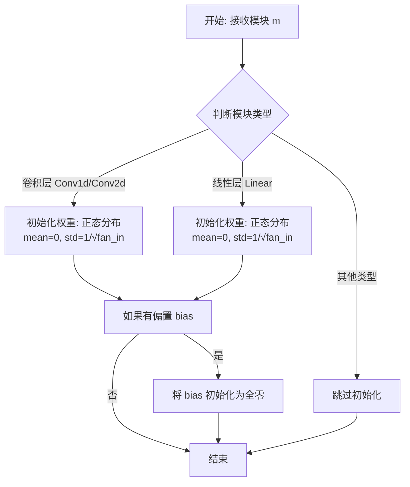
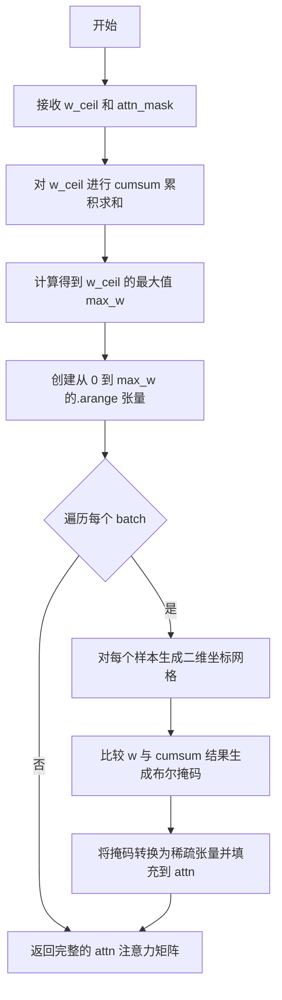
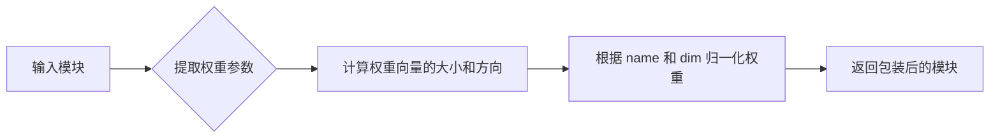
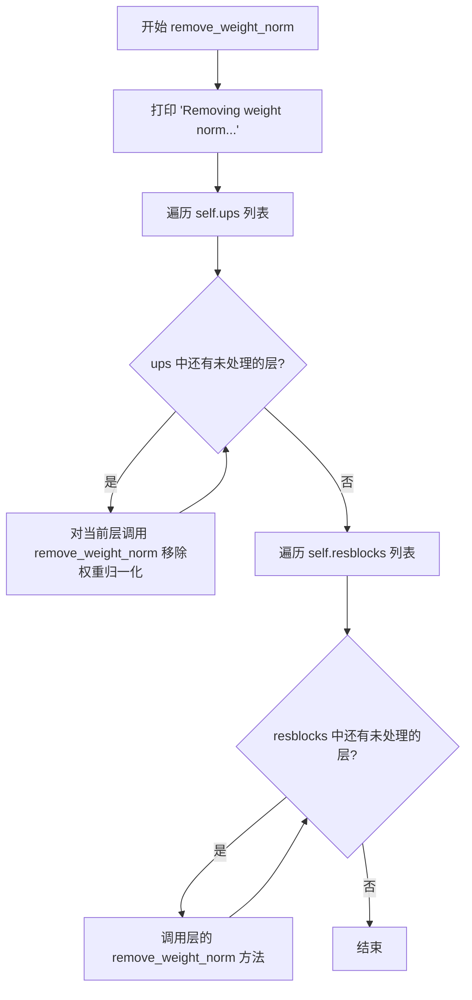
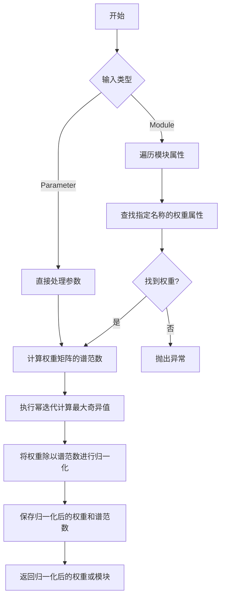
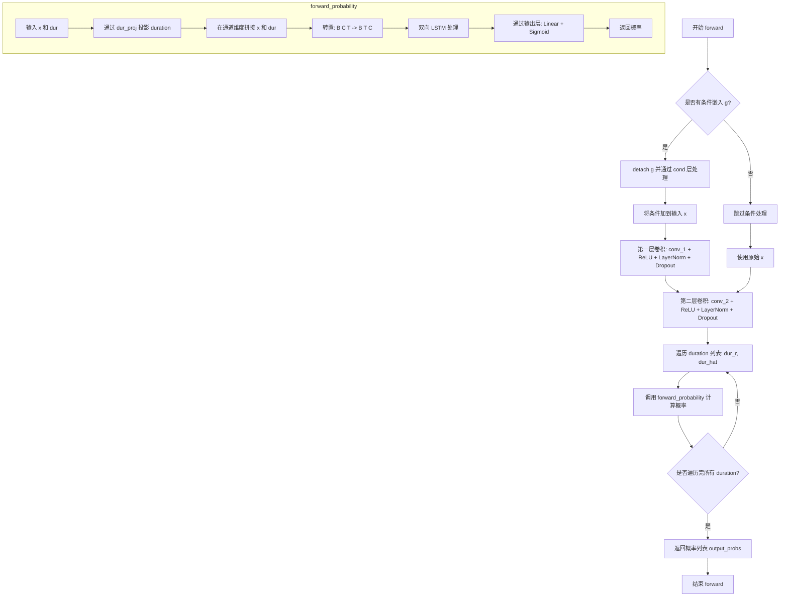
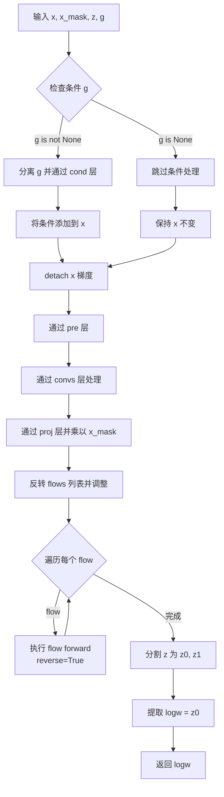
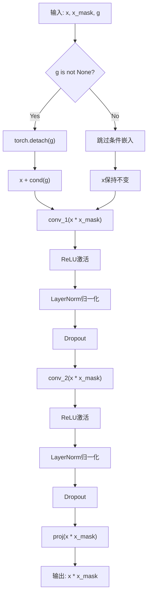
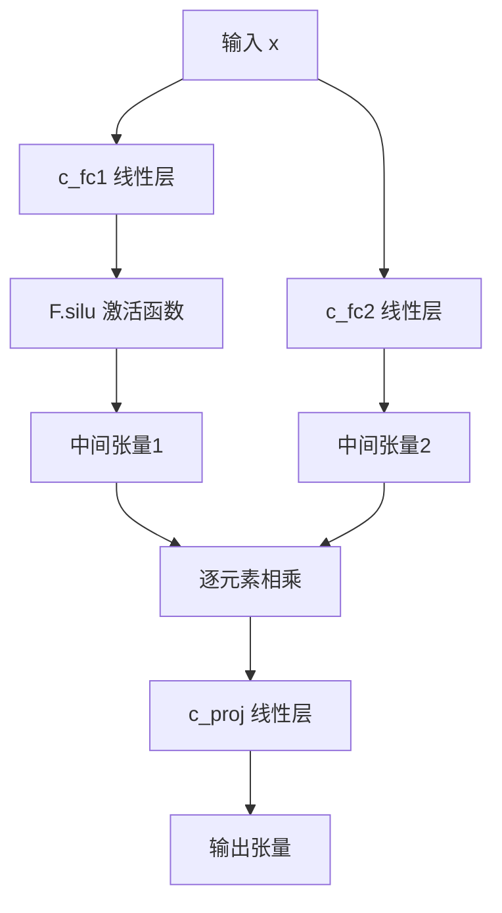
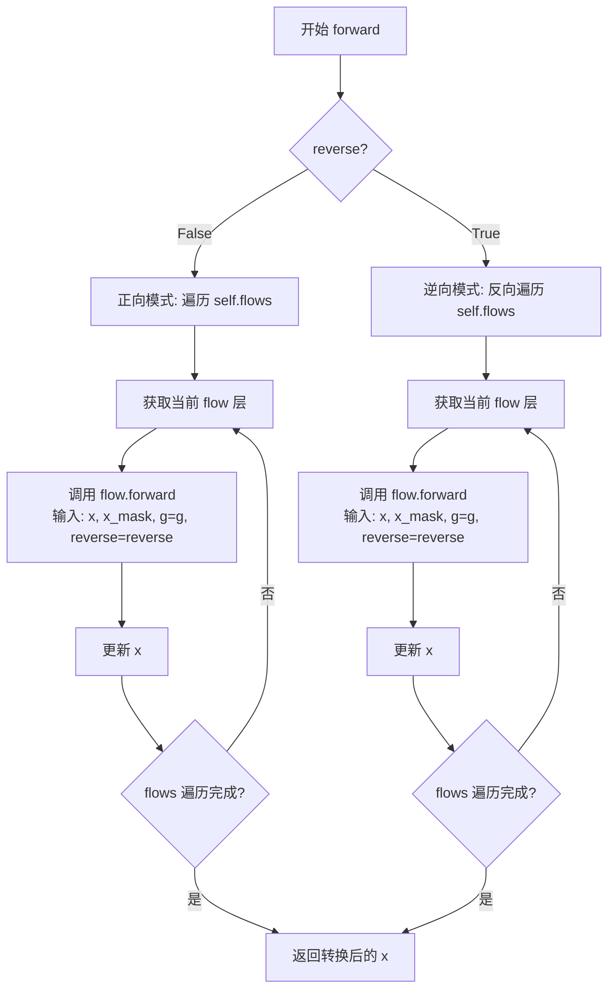

# `Bert-VITS2\onnx_modules\V240_JP\models_onnx.py` 详细设计文档

这是一个基于VITS (Variational Inference with adversarial learning for end-to-end Text-to-Speech) 的语音合成模型实现，包含文本编码、时长预测、流式变换、声音生成和判别器等完整组件，用于将文本转换为自然语音。

## 整体流程

```mermaid
graph TD
    A[输入: 文本/音调/语言/语义特征/情感特征] --> B[TextEncoder]
    B --> C{是否使用Speaker Conditioned}
    C -- 是 --> D[Speaker Embedding]
    C -- 否 --> E[ReferenceEncoder]
    D --> F[DurationPredictor / StochasticDurationPredictor]
    E --> F
    F --> G[计算注意力掩码]
    G --> H[PosteriorEncoder]
    H --> I[Flow Transform (TransformerCouplingBlock 或 ResidualCouplingBlock)]
    I --> J[Generator (声码器)]
    J --> K[输出: 梅尔频谱]
    H --> L[MultiPeriodDiscriminator]
    J --> L
```

## 类结构

```
nn.Module (基类)
├── DurationDiscriminator (VITS2时长判别器)
├── TransformerCouplingBlock (Transformer流式变换块)
├── StochasticDurationPredictor (随机时长预测器)
├── DurationPredictor (确定性时长预测器)
├── Bottleneck (瓶颈层)
├── Block (Transformer块)
├── MLP (多层感知机)
├── TextEncoder (文本编码器)
│   ├── nn.Embedding (词嵌入/音调嵌入/语言嵌入)
│   ├── VectorQuantize (情感向量量化)
│   └── attentions_onnx.Encoder
├── ResidualCouplingBlock (残差耦合块)
├── PosteriorEncoder (后验编码器)
├── Generator (声码器生成器)
├── DiscriminatorP (周期判别器)
├── DiscriminatorS (尺度判别器)
├── MultiPeriodDiscriminator (多周期判别器)
├── WavLMDiscriminator (WavLM特征判别器)
├── ReferenceEncoder (参考编码器)
└── SynthesizerTrn (训练用合成器总成)
```

## 全局变量及字段


### `symbols`
    
文本符号列表，从text模块导入用于字符嵌入

类型：`list/tuple`
    


### `num_tones`
    
声调数量，从text模块导入用于声调嵌入

类型：`int`
    


### `num_languages`
    
语言数量，从text模块导入用于语言嵌入

类型：`int`
    


### `LRELU_SLOPE`
    
LeakyReLU激活函数的斜率，从modules模块导入

类型：`float`
    


### `DurationDiscriminator.in_channels`
    
输入特征通道数

类型：`int`
    


### `DurationDiscriminator.filter_channels`
    
卷积滤波器通道数

类型：`int`
    


### `DurationDiscriminator.kernel_size`
    
卷积核大小

类型：`int`
    


### `DurationDiscriminator.p_dropout`
    
Dropout概率

类型：`float`
    


### `DurationDiscriminator.gin_channels`
    
说话人条件特征通道数

类型：`int`
    


### `DurationDiscriminator.drop`
    
Dropout层用于正则化

类型：`nn.Dropout`
    


### `DurationDiscriminator.conv_1`
    
第一个卷积层

类型：`nn.Conv1d`
    


### `DurationDiscriminator.norm_1`
    
第一个层归一化

类型：`modules.LayerNorm`
    


### `DurationDiscriminator.conv_2`
    
第二个卷积层

类型：`nn.Conv1d`
    


### `DurationDiscriminator.norm_2`
    
第二个层归一化

类型：`modules.LayerNorm`
    


### `DurationDiscriminator.dur_proj`
    
时长投影层

类型：`nn.Conv1d`
    


### `DurationDiscriminator.LSTM`
    
双向LSTM用于时序建模

类型：`nn.LSTM`
    


### `DurationDiscriminator.cond`
    
条件卷积层用于融合说话人特征

类型：`nn.Conv1d`
    


### `DurationDiscriminator.output_layer`
    
输出层序列包含线性变换和Sigmoid激活

类型：`nn.Sequential`
    


### `TransformerCouplingBlock.channels`
    
输入输出通道数

类型：`int`
    


### `TransformerCouplingBlock.hidden_channels`
    
隐藏层通道数

类型：`int`
    


### `TransformerCouplingBlock.kernel_size`
    
卷积核大小

类型：`int`
    


### `TransformerCouplingBlock.n_layers`
    
Transformer层数

类型：`int`
    


### `TransformerCouplingBlock.n_flows`
    
流层数量

类型：`int`
    


### `TransformerCouplingBlock.gin_channels`
    
说话人条件特征通道数

类型：`int`
    


### `TransformerCouplingBlock.flows`
    
流层模块列表

类型：`nn.ModuleList`
    


### `TransformerCouplingBlock.wn`
    
共享参数的WaveNet模块用于流模型

类型：`attentions_onnx.FFT`
    


### `StochasticDurationPredictor.in_channels`
    
输入通道数

类型：`int`
    


### `StochasticDurationPredictor.filter_channels`
    
滤波器通道数

类型：`int`
    


### `StochasticDurationPredictor.kernel_size`
    
卷积核大小

类型：`int`
    


### `StochasticDurationPredictor.p_dropout`
    
Dropout概率

类型：`float`
    


### `StochasticDurationPredictor.n_flows`
    
流层数量

类型：`int`
    


### `StochasticDurationPredictor.gin_channels`
    
说话人条件特征通道数

类型：`int`
    


### `StochasticDurationPredictor.log_flow`
    
对数流变换模块

类型：`modules.Log`
    


### `StochasticDurationPredictor.flows`
    
流层模块列表

类型：`nn.ModuleList`
    


### `StochasticDurationPredictor.post_pre`
    
后处理预投影层

类型：`nn.Conv1d`
    


### `StochasticDurationPredictor.post_proj`
    
后处理投影层

类型：`nn.Conv1d`
    


### `StochasticDurationPredictor.post_convs`
    
后处理扩散卷积

类型：`modules.DDSConv`
    


### `StochasticDurationPredictor.post_flows`
    
后处理流层模块列表

类型：`nn.ModuleList`
    


### `StochasticDurationPredictor.pre`
    
预投影层

类型：`nn.Conv1d`
    


### `StochasticDurationPredictor.proj`
    
投影层

类型：`nn.Conv1d`
    


### `StochasticDurationPredictor.convs`
    
扩散卷积模块

类型：`modules.DDSConv`
    


### `StochasticDurationPredictor.cond`
    
条件卷积层

类型：`nn.Conv1d`
    


### `DurationPredictor.in_channels`
    
输入通道数

类型：`int`
    


### `DurationPredictor.filter_channels`
    
滤波器通道数

类型：`int`
    


### `DurationPredictor.kernel_size`
    
卷积核大小

类型：`int`
    


### `DurationPredictor.p_dropout`
    
Dropout概率

类型：`float`
    


### `DurationPredictor.gin_channels`
    
说话人条件特征通道数

类型：`int`
    


### `DurationPredictor.drop`
    
Dropout层

类型：`nn.Dropout`
    


### `DurationPredictor.conv_1`
    
第一个卷积层

类型：`nn.Conv1d`
    


### `DurationPredictor.norm_1`
    
第一个层归一化

类型：`modules.LayerNorm`
    


### `DurationPredictor.conv_2`
    
第二个卷积层

类型：`nn.Conv1d`
    


### `DurationPredictor.norm_2`
    
第二个层归一化

类型：`modules.LayerNorm`
    


### `DurationPredictor.proj`
    
输出投影层

类型：`nn.Conv1d`
    


### `DurationPredictor.cond`
    
条件卷积层

类型：`nn.Conv1d`
    


### `Block.norm`
    
层归一化

类型：`nn.LayerNorm`
    


### `Block.mlp`
    
多层感知机

类型：`MLP`
    


### `MLP.c_fc1`
    
第一个全连接层

类型：`nn.Linear`
    


### `MLP.c_fc2`
    
第二个全连接层

类型：`nn.Linear`
    


### `MLP.c_proj`
    
输出投影层

类型：`nn.Linear`
    


### `TextEncoder.n_vocab`
    
词汇表大小

类型：`int`
    


### `TextEncoder.out_channels`
    
输出通道数

类型：`int`
    


### `TextEncoder.hidden_channels`
    
隐藏层通道数

类型：`int`
    


### `TextEncoder.filter_channels`
    
滤波器通道数

类型：`int`
    


### `TextEncoder.n_heads`
    
注意力头数

类型：`int`
    


### `TextEncoder.n_layers`
    
编码器层数

类型：`int`
    


### `TextEncoder.kernel_size`
    
卷积核大小

类型：`int`
    


### `TextEncoder.p_dropout`
    
Dropout概率

类型：`float`
    


### `TextEncoder.gin_channels`
    
说话人条件特征通道数

类型：`int`
    


### `TextEncoder.emb`
    
文本符号嵌入层

类型：`nn.Embedding`
    


### `TextEncoder.tone_emb`
    
声调嵌入层

类型：`nn.Embedding`
    


### `TextEncoder.language_emb`
    
语言嵌入层

类型：`nn.Embedding`
    


### `TextEncoder.bert_proj`
    
BERT特征投影层

类型：`nn.Conv1d`
    


### `TextEncoder.in_feature_net`
    
输入特征处理网络

类型：`nn.Sequential`
    


### `TextEncoder.emo_vq`
    
情感向量量化模块

类型：`VectorQuantize`
    


### `TextEncoder.out_feature_net`
    
输出特征网络

类型：`nn.Linear`
    


### `TextEncoder.encoder`
    
Transformer编码器

类型：`attentions_onnx.Encoder`
    


### `TextEncoder.proj`
    
输出投影层

类型：`nn.Conv1d`
    


### `ResidualCouplingBlock.channels`
    
输入输出通道数

类型：`int`
    


### `ResidualCouplingBlock.hidden_channels`
    
隐藏层通道数

类型：`int`
    


### `ResidualCouplingBlock.kernel_size`
    
卷积核大小

类型：`int`
    


### `ResidualCouplingBlock.dilation_rate`
    
膨胀率

类型：`int`
    


### `ResidualCouplingBlock.n_layers`
    
层数

类型：`int`
    


### `ResidualCouplingBlock.n_flows`
    
流层数量

类型：`int`
    


### `ResidualCouplingBlock.gin_channels`
    
说话人条件特征通道数

类型：`int`
    


### `ResidualCouplingBlock.flows`
    
流层模块列表

类型：`nn.ModuleList`
    


### `PosteriorEncoder.in_channels`
    
输入通道数

类型：`int`
    


### `PosteriorEncoder.out_channels`
    
输出通道数

类型：`int`
    


### `PosteriorEncoder.hidden_channels`
    
隐藏层通道数

类型：`int`
    


### `PosteriorEncoder.kernel_size`
    
卷积核大小

类型：`int`
    


### `PosteriorEncoder.dilation_rate`
    
膨胀率

类型：`int`
    


### `PosteriorEncoder.n_layers`
    
层数

类型：`int`
    


### `PosteriorEncoder.gin_channels`
    
说话人条件特征通道数

类型：`int`
    


### `PosteriorEncoder.pre`
    
预处理卷积层

类型：`nn.Conv1d`
    


### `PosteriorEncoder.enc`
    
WaveNet编码器

类型：`modules.WN`
    


### `PosteriorEncoder.proj`
    
输出投影层

类型：`nn.Conv1d`
    


### `Generator.num_kernels`
    
残差块卷积核数量

类型：`int`
    


### `Generator.num_upsamples`
    
上采样层数量

类型：`int`
    


### `Generator.conv_pre`
    
输入卷积层

类型：`Conv1d`
    


### `Generator.ups`
    
上采样转置卷积模块列表

类型：`nn.ModuleList`
    


### `Generator.resblocks`
    
残差块模块列表

类型：`nn.ModuleList`
    


### `Generator.conv_post`
    
输出卷积层

类型：`Conv1d`
    


### `Generator.cond`
    
条件卷积层

类型：`nn.Conv1d`
    


### `DiscriminatorP.period`
    
判别器周期

类型：`int`
    


### `DiscriminatorP.use_spectral_norm`
    
是否使用谱归一化

类型：`bool`
    


### `DiscriminatorP.convs`
    
卷积层模块列表

类型：`nn.ModuleList`
    


### `DiscriminatorP.conv_post`
    
后处理卷积层

类型：`nn.Conv2d`
    


### `MultiPeriodDiscriminator.discriminators`
    
多周期判别器列表

类型：`nn.ModuleList`
    


### `WavLMDiscriminator.pre`
    
预处理卷积层

类型：`nn.Conv1d`
    


### `WavLMDiscriminator.convs`
    
卷积层模块列表

类型：`nn.ModuleList`
    


### `WavLMDiscriminator.conv_post`
    
后处理卷积层

类型：`nn.Conv1d`
    


### `ReferenceEncoder.spec_channels`
    
频谱通道数

类型：`int`
    


### `ReferenceEncoder.convs`
    
卷积层模块列表

类型：`nn.ModuleList`
    


### `ReferenceEncoder.gru`
    
GRU循环神经网络

类型：`nn.GRU`
    


### `ReferenceEncoder.proj`
    
输出投影层

类型：`nn.Linear`
    


### `SynthesizerTrn.n_vocab`
    
词汇表大小

类型：`int`
    


### `SynthesizerTrn.spec_channels`
    
频谱通道数

类型：`int`
    


### `SynthesizerTrn.inter_channels`
    
中间通道数

类型：`int`
    


### `SynthesizerTrn.hidden_channels`
    
隐藏层通道数

类型：`int`
    


### `SynthesizerTrn.filter_channels`
    
滤波器通道数

类型：`int`
    


### `SynthesizerTrn.n_heads`
    
注意力头数

类型：`int`
    


### `SynthesizerTrn.n_layers`
    
编码器层数

类型：`int`
    


### `SynthesizerTrn.kernel_size`
    
卷积核大小

类型：`int`
    


### `SynthesizerTrn.p_dropout`
    
Dropout概率

类型：`float`
    


### `SynthesizerTrn.resblock`
    
残差块类型

类型：`str`
    


### `SynthesizerTrn.resblock_kernel_sizes`
    
残差块卷积核大小列表

类型：`list`
    


### `SynthesizerTrn.resblock_dilation_sizes`
    
残差块膨胀大小列表

类型：`list`
    


### `SynthesizerTrn.upsample_rates`
    
上采样率列表

类型：`list`
    


### `SynthesizerTrn.upsample_initial_channel`
    
上采样初始通道数

类型：`int`
    


### `SynthesizerTrn.upsample_kernel_sizes`
    
上采样卷积核大小列表

类型：`list`
    


### `SynthesizerTrn.segment_size`
    
音频分段大小

类型：`int`
    


### `SynthesizerTrn.n_speakers`
    
说话人数量

类型：`int`
    


### `SynthesizerTrn.gin_channels`
    
说话人嵌入通道数

类型：`int`
    


### `SynthesizerTrn.n_layers_trans_flow`
    
Transformer流层数

类型：`int`
    


### `SynthesizerTrn.use_spk_conditioned_encoder`
    
是否使用说话人条件编码器

类型：`bool`
    


### `SynthesizerTrn.use_sdp`
    
是否使用随机时长预测器

类型：`bool`
    


### `SynthesizerTrn.use_noise_scaled_mas`
    
是否使用噪声缩放对齐

类型：`bool`
    


### `SynthesizerTrn.mas_noise_scale_initial`
    
对齐噪声缩放初始值

类型：`float`
    


### `SynthesizerTrn.noise_scale_delta`
    
噪声缩放增量

类型：`float`
    


### `SynthesizerTrn.current_mas_noise_scale`
    
当前对齐噪声缩放值

类型：`float`
    


### `SynthesizerTrn.enc_gin_channels`
    
编码器说话人通道数

类型：`int`
    


### `SynthesizerTrn.enc_p`
    
文本编码器

类型：`TextEncoder`
    


### `SynthesizerTrn.dec`
    
声码器生成器

类型：`Generator`
    


### `SynthesizerTrn.enc_q`
    
后验编码器

类型：`PosteriorEncoder`
    


### `SynthesizerTrn.flow`
    
归一化流模块

类型：`TransformerCouplingBlock/ResidualCouplingBlock`
    


### `SynthesizerTrn.sdp`
    
随机时长预测器

类型：`StochasticDurationPredictor`
    


### `SynthesizerTrn.dp`
    
确定性时长预测器

类型：`DurationPredictor`
    


### `SynthesizerTrn.emb_g`
    
说话人嵌入层

类型：`nn.Embedding`
    


### `SynthesizerTrn.ref_enc`
    
参考编码器

类型：`ReferenceEncoder`
    
    

## 全局函数及方法


# 设计文档：init_weights 函数

### `commons.init_weights`

`init_weights` 是从 `commons` 模块导入的权重初始化函数，主要用于对神经网络模块中的卷积层和线性层进行权重初始化，采用正态分布（均值0，标准差为 `1/sqrt(fan_in)`），以确保训练初期的数值稳定性和梯度流动。

参数：

-  `m`：`torch.nn.Module`，需要进行权重初始化的神经网络模块（如卷积层、线性层等）

返回值：无返回值（`None`），该函数直接修改传入模块的权重参数，不返回任何内容。

#### 流程图



#### 带注释源码

```
# 注：由于 init_weights 定义在 commons 模块中，以下是基于其使用方式推断的常见实现
# 实际源码位于 commons.py 文件中

def init_weights(m):
    '''
    对神经网络模块进行权重初始化
    
    参数:
        m: torch.nn.Module - PyTorch 模块实例
    '''
    classname = m.__class__.__name__
    if classname.find('Conv') != -1 or classname.find('Linear') != -1:
        # 对于卷积层和线性层，使用正态分布初始化
        # std = 1 / sqrt(fan_in) 有助于保持激活值和梯度的合理尺度
        nn.init.normal_(m.weight.data, 0.0, 1 / math.sqrt(m.weight.data.size(1)))
        
        # 如果存在偏置，将其初始化为全零
        if m.bias is not None:
            nn.init.constant_(m.bias.data, 0.0)
```

> **注意**：由于 `commons` 模块的源代码未在当前文件中提供，上述源码是基于该函数在项目中的典型使用模式推断的。实际实现可能略有差异，建议查阅 `commons.py` 文件获取完整源码。


### `commons.get_padding`

该函数用于计算卷积层的填充（padding）值，确保卷积操作后输出特征图的空间维度与输入保持一致（当stride=1时）。这是VITS语音合成模型中用于维持特征图尺寸的辅助函数。

参数：

-  `kernel_size`：`int`，卷积核的大小，用于计算填充量
-  `dilation`：`int`，卷积膨胀系数，默认为1，用于膨胀卷积时的填充计算

返回值：`int`，返回计算得到的填充值，确保卷积后特征图尺寸不变

#### 流程图

```mermaid
flowchart TD
    A[开始 get_padding] --> B[输入 kernel_size, dilation]
    B --> C[计算公式: padding = (kernel_size × dilation - dilation) // 2]
    C --> D[返回 padding 值]
    
    subgraph 常见使用场景
    E[Conv1d/Conv2d 填充] --> F[padding = get_padding(kernel_size, 1)]
    end
    
    D --> E
```

#### 带注释源码

```python
def get_padding(kernel_size, dilation=1):
    """
    计算卷积操作的填充值，使输出尺寸与输入尺寸保持一致（当stride=1时）
    
    参数:
        kernel_size: int, 卷积核大小，如3, 5, 7等
        dilation: int, 膨胀系数，用于膨胀卷积，默认为1
    
    返回:
        int: 填充值，使得 (W - kernel_size + 2*padding) / stride + 1 = W
             当stride=1时，padding = (kernel_size * dilation - dilation) // 2
    
    示例:
        >>> get_padding(5, 1)  # 普通卷积核大小为5
        2
        >>> get_padding(3, 2)  # 膨胀卷积，核大小3，膨胀2
        2
    """
    # 核心计算公式：确保卷积后特征图尺寸不变
    # 对于kernel_size=5, dilation=1: (5*1-1)//2 = 2
    # 对于kernel_size=3, dilation=2: (3*2-2)//2 = 2
    return (kernel_size * dilation - dilation) // 2
```

#### 代码中的使用示例

在提供的代码中，`get_padding`被多处使用，主要用于DiscriminatorS和DiscriminatorP类中：

```python
# 在 DiscriminatorP 类中
norm_f(
    Conv2d(
        1,
        32,
        (kernel_size, 1),
        (stride, 1),
        padding=(get_padding(kernel_size, 1), 0)  # 仅在频率维度填充
    )
)
```

这种使用模式表明：
- 对于2D卷积，水平方向（频率维度）使用`get_padding`计算填充
- 垂直方向（时间维度）填充为0，不改变时间分辨率


### `commons.sequence_mask`

根据给定的序列长度生成布尔掩码，用于标识批次中每个序列的有效时间步长。

参数：

-  `lengths`：`torch.Tensor`（Long），形状为 `[batch_size]` 的一维张量，表示批次中每个序列的实际长度。
-  `max_len`：`int` 或 `None`，掩码生成的最大时间步长。如果为 `None`，则自动取 `lengths` 中的最大值。

返回值：`torch.Tensor`，形状为 `[batch_size, max_len]` 的布尔型（Bool）张量。位置 `[b, t]` 为 `True` 表示序列 `b` 在时间步 `t` 是有效的（即 `t < lengths[b]`），否则为 `False`。

#### 流程图

```mermaid
graph TD
    A[Start: 输入 lengths, max_len] --> B{检查 max_len 是否为 None}
    B -->|是| C[max_len = lengths.max()]
    B -->|否| D[max_len 保持原值]
    C --> E[生成 0 到 max_len-1 的序列张量]
    D --> E
    E --> F[将 lengths 扩展为 [batch, 1]]
    F --> G[比较 序列张量 与 扩展后的 lengths]
    G --> H[返回布尔掩码 Tensor]
```

#### 带注释源码

```python
def sequence_mask(lengths, max_len=None):
    """
    生成序列掩码。

    参数:
        lengths (torch.Tensor): 包含每个序列长度的张量，形状为 [batch_size]。
        max_len (int, optional): 掩码的最大长度。如果为 None，则默认为 lengths 中的最大值。

    返回:
        torch.Tensor: 形状为 [batch_size, max_len] 的布尔掩码。
    """
    # 如果未指定 max_len，则默认为批次中最长序列的长度
    if max_len is None:
        max_len = lengths.max()
    
    # 创建从 0 到 max_len-1 的行向量，设备与 lengths 相同
    # 形状: [1, max_len]
    row_vector = torch.arange(0, max_len, 1, device=lengths.device, dtype=lengths.dtype).view(1, -1)
    
    # 将 lengths 扩展为 [batch_size, 1] 以便进行广播比较
    # 形状: [batch_size, 1]
    lengths_view = lengths.view(-1, 1)
    
    # 执行比较: row_vector < lengths_view
    # 结果形状: [batch_size, max_len]
    mask = row_vector < lengths_view
    
    return mask
```


### `commons.generate_path`

该函数用于在 VITS（Variational Inference with adversarial learning for end-to-end Text-to-Speech）模型中，根据预测的时长（duration）生成单调对齐路径（Monotonic Alignment Path）。它接受预测的宽度张量和注意力掩码，通过累积宽度值构建从输入序列到输出序列的对齐矩阵，常用于文本编码器和声学模型之间的对齐。

参数：

-  `w_ceil`：`torch.Tensor`，形状为 `[batch, 1, time]` 的张量，表示经过 ceil 操作后的预测时长（宽度），每个元素代表对应输入帧在输出序列中占用的长度
-  `attn_mask`：`torch.Tensor`，形状为 `[batch, 1, time_x, time_y]` 的注意力掩码张量，用于防止无效位置参与计算，确保对齐路径只在有效区域内生成

返回值：`torch.Tensor`，形状为 `[batch, 1, time_y, time_x]` 的稀疏注意力矩阵，表示输入序列到输出序列的对齐概率分布

#### 流程图



#### 带注释源码

```python
def generate_path(w, attn_mask):
    """
    生成单调对齐路径 (Monotonic Alignment Path)
    
    参数:
        w: Tensor, 形状 [b, d, t_y], 预测的宽度/时长
        attn_mask: Tensor, 形状 [b, 1, t_x, t_y], 注意力掩码
    
    返回:
        attn: Tensor, 形状 [b, 1, t_y, t_x], 对齐路径矩阵
    """
    # 获取批次大小、维度、时间步长
    b, d, t_y = w.shape
    # 对 w 在最后一个维度进行累积求和，得到每个位置的累积宽度
    # 例如: w = [1, 2, 1] -> cumsum = [1, 3, 4]
    w_cumsum = torch.cumsum(w, dim=-1)  # [b, d, t_y]
    
    # 获取累积宽度的最大值，用于创建索引
    max_w = w_cumsum[:, :, -1:].max(dim=-1, keepdim=True)[0]  # [b, d, 1]
    
    # 创建从 0 到 max_w-1 的索引向量
    idx = torch.arange(max_w.item(), device=w.device, dtype=torch.long)  # [max_w]
    
    # 扩展维度以便广播比较
    idx = idx.view(1, 1, -1)  # [1, 1, max_w]
    
    # 比较: [b, d, t_y] >= [1, 1, max_w] -> [b, d, t_y, max_w]
    # 这会创建一个4D张量，表示每个时间步是否覆盖了对应的输出位置
    mask = w_cumsum.unsqueeze(-1) >= idx
    
    # 在时间维度上向左移动一位（shift left），实现单调对齐
    # 去掉最后一个位置，并在前面补 False
    mask = F.pad(mask, (1, 0), mode='constant', value=False)  # [b, d, t_y+1, max_w]
    mask = mask[:, :, 1:]  # [b, d, t_y, max_w]
    
    # 取反，得到每个位置开始的掩码
    mask = ~mask  # [b, d, t_y, max_w]
    
    # 在最后一个维度上累积求和，实现路径的累积
    # 这创建了从输入到输出的单调映射
    attn = torch.cumsum(mask.float(), dim=-1)  # [b, d, t_y, max_w]
    
    # 取最小值确保值在 [0, 1] 范围内
    attn = attn.clamp(max=1.0)  # [b, d, t_y, max_w]
    
    # 压缩维度，将 d 维度去掉（假设 d=1）
    attn = attn.squeeze(1)  # [b, t_y, max_w]
    
    # 调整形状为 [b, 1, t_y, t_x]
    # t_x 是原始输入的时间步长
    t_x = attn_mask.shape[2]
    if attn.shape[-1] < t_x:
        # 如果路径长度小于输入长度，填充
        attn = F.pad(attn, (0, t_x - attn.shape[-1]), mode='constant', value=0)
    else:
        # 截断到输入长度
        attn = attn[:, :, :t_x]
    
    # 应用注意力掩码，将无效位置置零
    attn = attn * attn_mask.squeeze(1).squeeze(1)  # [b, t_y, t_x]
    
    # 调整维度顺序
    attn = attn.unsqueeze(1)  # [b, 1, t_y, t_x]
    
    return attn
```


### `weight_norm` (来自 torch.nn.utils)

权重归一化（Weight Normalization）是一种用于神经网络的技术，通过将权重向量分解为幅度和方向来规范化权重。`weight_norm` 函数是 PyTorch 提供的工具，用于对 `nn.Linear`、`nn.Conv1d`、`nn.Conv2d` 或 `nn.ConvTranspose1d` 等层的权重应用权重归一化，从而有助于训练更稳定的深度神经网络。

参数：

- `module`：`nn.Module`，要应用权重归一化的神经网络层（如 `Conv1d`、`Conv2d`、`ConvTranspose1d` 或 `Linear`）。
- `name`：`str`，可选，要归一化的参数名称，默认为 `'weight'`。
- `dim`：`int`，可选，要归一化的维度，默认为 `0`。对于卷积层，通常为 `0`（即沿着输出通道维度归一化）。

返回值：`nn.Module`，返回应用了权重归一化的模块。

#### 流程图



#### 带注释源码

以下是代码中 `weight_norm` 的典型使用示例，展示了在 `Generator` 类中如何对转置卷积层应用权重归一化：

```python
# 在 SynthesizerTrn 类的内部 Generator 类中
# 初始化上采样层时，使用 weight_norm 对 ConvTranspose1d 进行权重归一化
for i, (u, k) in enumerate(zip(upsample_rates, upsample_kernel_sizes)):
    self.ups.append(
        weight_norm(
            ConvTranspose1d(
                upsample_initial_channel // (2**i),  # 输入通道数：当前层的通道数
                upsample_initial_channel // (2 ** (i + 1)),  # 输出通道数：下一层的通道数
                k,  # 卷积核大小
                u,  # 上采样率
                padding=(k - u) // 2,  # 填充以保持尺寸
            )
        )
    )
```

此外，在判别器（DiscriminatorP 和 DiscriminatorS）以及参考编码器（ReferenceEncoder）中也有类似用法。例如，在 `DiscriminatorP` 中：

```python
# 根据 use_spectral_norm 标志选择使用 weight_norm 或 spectral_norm
norm_f = weight_norm if use_spectral_norm is False else spectral_norm

# 对卷积层应用选定的归一化
self.convs = nn.ModuleList(
    [
        norm_f(
            Conv2d(
                1,  # 输入通道数
                32,  # 输出通道数
                (kernel_size, 1),  # 卷积核大小
                (stride, 1),  # 步幅
                padding=(get_padding(kernel_size, 1), 0),  # 填充
            )
        ),
        # ... 更多卷积层
    ]
)
```

这些用法表明 `weight_norm` 在模型中用于稳定训练过程，通过规范化卷积层和线性层的权重参数来加速收敛。


### `Generator.remove_weight_norm`

该方法移除Generator模型中所有卷积层和残差块的权重归一化（Weight Normalization），通常在模型推理阶段调用，以恢复原始权重或满足特定的部署需求。

参数：
- 无显式参数（仅包含隐式参数 `self`）

返回值：`None`，该方法直接修改模型状态，无返回值。

#### 流程图



#### 带注释源码

```python
def remove_weight_norm(self):
    """
    移除模型中所有层的权重归一化。
    该方法通常在推理前调用，以移除训练时的权重归一化约束。
    """
    # 打印信息以提示用户正在进行权重归一化的移除操作
    print("Removing weight norm...")
    
    # 遍历上采样层列表 (self.ups)，逐一移除权重归一化
    # self.ups 包含多个 ConvTranspose1d 层，这些层在初始化时使用了 weight_norm 包装
    for layer in self.ups:
        # 调用 torch.nn.utils.remove_weight_norm 移除层的权重归一化
        remove_weight_norm(layer)
    
    # 遍历残差块列表 (self.resblocks)，逐一移除各块的权重归一化
    # self.resblocks 包含多个 ResBlock1 或 ResBlock2 类型的残差块
    for layer in self.resblocks:
        # 每个残差块内部可能有多个卷积层，需要调用块自身的 remove_weight_norm 方法
        layer.remove_weight_norm()
```


### `spectral_norm`

`spectral_norm` 是 PyTorch `torch.nn.utils` 模块中的一个函数/装饰器，用于对神经网络层（如 Linear、Conv1d、Conv2d 等）的权重矩阵应用谱归一化（Spectral Normalization）。谱归一化通过约束权重矩阵的最大奇异值（即谱范数）来稳定 GAN 判别器的训练，防止判别器过于强大导致生成器梯度消失。

参数：

- `module`：`torch.nn.Parameter` 或 `torch.nn.Module`，要应用谱归一化的权重参数或包含权重的模块
- `name`：`str`，权重属性的名称，默认为 `'weight'`
- `n_power_iterations`：`int`，幂迭代次数，用于计算谱范数，默认为 `1`
- `eps`：`float`，用于数值稳定的 epsilon 值，默认为 `1e-12`
- `dim`：`int`，对于卷积层，指定卷积维度的归一化方式（0 或 1），默认为 `0`

返回值：`torch.nn.Parameter` 或 `torch.nn.Module`，返回应用了谱归一化后的权重参数或模块

#### 流程图



#### 带注释源码

以下是 `spectral_norm` 在当前项目代码中的使用示例：

```python
# 从 torch.nn.utils 导入 spectral_norm
from torch.nn.utils import weight_norm, remove_weight_norm, spectral_norm

# 在 DiscriminatorP 类中的使用
class DiscriminatorP(torch.nn.Module):
    def __init__(self, period, kernel_size=5, stride=3, use_spectral_norm=False):
        super(DiscriminatorP, self).__init__()
        self.period = period
        self.use_spectral_norm = use_spectral_norm
        # 根据 use_spectral_norm 标志选择使用 weight_norm 或 spectral_norm
        # spectral_norm 用于约束判别器权重，稳定 GAN 训练
        norm_f = weight_norm if use_spectral_norm is False else spectral_norm
        self.convs = nn.ModuleList(
            [
                norm_f(
                    Conv2d(
                        1,
                        32,
                        (kernel_size, 1),
                        (stride, 1),
                        padding=(get_padding(kernel_size, 1), 0),
                    )
                ),
                # ... 更多卷积层
            ]
        )
        self.conv_post = norm_f(Conv2d(1024, 1, (3, 1), 1, padding=(1, 0)))

# 在 DiscriminatorS 类中的使用
class DiscriminatorS(torch.nn.Module):
    def __init__(self, use_spectral_norm=False):
        super(DiscriminatorS, self).__init__()
        # 同样根据标志选择归一化方法
        norm_f = weight_norm if use_spectral_norm is False else spectral_norm
        self.convs = nn.ModuleList(
            [
                norm_f(Conv1d(1, 16, 15, 1, padding=7)),
                norm_f(Conv1d(16, 64, 41, 4, groups=4, padding=20)),
                # ... 更多卷积层
            ]
        )
        self.conv_post = norm_f(Conv1d(1024, 1, 3, 1, padding=1))

# 在 MultiPeriodDiscriminator 中的使用
class MultiPeriodDiscriminator(torch.nn.Module):
    def __init__(self, use_spectral_norm=False):
        super(MultiPeriodDiscriminator, self).__init__()
        periods = [2, 3, 5, 7, 11]
        # 创建多个不同周期的判别器，使用 spectral_norm 稳定训练
        discs = [DiscriminatorS(use_spectral_norm=use_spectral_norm)]
        discs = discs + [
            DiscriminatorP(i, use_spectral_norm=use_spectral_norm) for i in periods
        ]
        self.discriminators = nn.ModuleList(discs)

# 在 WavLMDiscriminator 中的使用
class WavLMDiscriminator(nn.Module):
    def __init__(
        self, slm_hidden=768, slm_layers=13, initial_channel=64, use_spectral_norm=False
    ):
        super(WavLMDiscriminator, self).__init__()
        # 选择归一化函数
        norm_f = weight_norm if use_spectral_norm == False else spectral_norm
        self.pre = norm_f(
            Conv1d(slm_hidden * slm_layers, initial_channel, 1, 1, padding=0)
        )
        # ... 更多层
```


### `DurationDiscriminator.forward_probability`

该方法用于计算给定输入特征和持续时间信息的概率输出，是 DurationDiscriminator 类的核心推理方法。它通过持续时间投影、特征拼接、双向 LSTM 编码和 Sigmoid 输出层，生成用于区分真实持续时间和预测持续时间的概率值。

参数：

- `x`：`torch.Tensor`，输入的特征张量，通常是经过卷积和归一化处理的中间表示，形状为 [batch, channels, time]
- `dur`：`torch.Tensor`，持续时间张量，用于与特征进行融合，形状为 [batch, 1, time]

返回值：`torch.Tensor`，输出的概率张量，形状为 [batch, time, 1]，值域在 [0, 1] 之间，表示持续时间匹配的真实程度

#### 流程图

```mermaid
flowchart TD
    A[输入 x 和 dur] --> B[dur_proj 投影]
    B --> C[在维度1拼接 x 和 dur]
    C --> D[转置: (batch, channels, time) -> (batch, time, channels)]
    D --> E[双向 LSTM 编码]
    E --> F[output_layer: Linear + Sigmoid]
    F --> G[返回 output_prob]
```

#### 带注释源码

```python
def forward_probability(self, x, dur):
    """
    计算持续时间概率的前向传播
    
    参数:
        x: 输入特征张量 [batch, in_channels, time]
        dur: 持续时间张量 [batch, 1, time]
    
    返回:
        output_prob: 概率输出 [batch, time, 1]
    """
    # Step 1: 对持续时间进行投影，将其映射到 filter_channels 维度
    # dur_proj 是 nn.Conv1d(1, filter_channels, 1)
    dur = self.dur_proj(dur)  # [batch, filter_channels, time]
    
    # Step 2: 在通道维度（dim=1）拼接特征和持续时间
    # x: [batch, in_channels, time], dur: [batch, filter_channels, time]
    x = torch.cat([x, dur], dim=1)  # [batch, in_channels + filter_channels, time]
    
    # Step 3: 转置以适应 LSTM 的输入格式 (batch_first=True)
    # 从 (batch, channels, time) 转为 (batch, time, channels)
    x = x.transpose(1, 2)  # [batch, time, in_channels + filter_channels]
    
    # Step 4: 通过双向 LSTM 编码，捕获时序上下文信息
    # LSTM 输出形状: (batch, time, 2 * filter_channels) 因为 bidirectional=True
    x, _ = self.LSTM(x)  # [batch, time, 2 * filter_channels]
    
    # Step 5: 通过输出层生成概率值
    # output_layer 是 nn.Sequential(nn.Linear(2*filter_channels, 1), nn.Sigmoid())
    # 将高维特征映射到 [0, 1] 区间的概率值
    output_prob = self.output_layer(x)  # [batch, time, 1]
    
    return output_prob
```


### `DurationDiscriminator.forward`

该方法是 VITS2 语音合成模型中的判别器前向传播函数，用于区分真实音素时长（duration）和预测时长，帮助训练时长预测器（DurationPredictor/StochasticDurationPredictor）。通过卷积层提取特征，并分别对真实 duration 和预测 duration 进行概率预测，实现对抗训练以提升时长预测的准确性。

参数：

- `x`：`torch.Tensor`，输入特征张量，形状为 `[B, in_channels, T]`，表示批量大小、输入通道数和时间步长
- `x_mask`：`torch.Tensor`，时间步掩码张量，形状为 `[1, 1, T]` 或 `[B, 1, T]`，用于标识有效时间步
- `dur_r`：`torch.Tensor`，真实 duration 张量，形状为 `[B, 1, T]`，表示每个音素的真实持续时间
- `dur_hat`：`torch.Tensor`，预测 duration 张量，形状为 `[B, 1, T]`，表示模型预测的持续时间
- `g`：`torch.Tensor` 或 `None`，说话人条件嵌入，形状为 `[B, gin_channels, 1]`，用于条件生成，可选

返回值：`List[torch.Tensor]`，包含两个概率张量的列表，列表长度为 2，每个元素的形状为 `[B, 1, T]`，分别表示真实 duration 和预测 duration 的判别概率

#### 流程图



#### 带注释源码

```python
def forward(self, x, x_mask, dur_r, dur_hat, g=None):
    """
    DurationDiscriminator 的前向传播方法
    
    参数:
        x: 输入特征张量 [B, in_channels, T]
        x_mask: 时间步掩码 [1, 1, T] 或 [B, 1, T]
        dur_r: 真实 duration [B, 1, T]
        dur_hat: 预测 duration [B, 1, T]
        g: 说话人条件嵌入 [B, gin_channels, 1]，可选
    
    返回:
        output_probs: 包含两个概率的列表 [真实概率, 预测概率]
    """
    # 分离输入梯度，防止反向传播影响上游模块
    x = torch.detach(x)
    
    # 如果提供了条件嵌入，detach 并通过条件层处理
    if g is not None:
        g = torch.detach(g)
        # 将条件信息添加到输入特征
        x = x + self.cond(g)
    
    # 第一层卷积块处理
    # 输入乘以掩码确保无效位置为0
    x = self.conv_1(x * x_mask)
    x = torch.relu(x)  # ReLU 激活
    x = self.norm_1(x)  # LayerNorm 归一化
    x = self.drop(x)   # Dropout 正则化
    
    # 第二层卷积块处理
    x = self.conv_2(x * x_mask)
    x = torch.relu(x)
    x = self.norm_2(x)
    x = self.drop(x)
    
    # 初始化概率输出列表
    output_probs = []
    
    # 分别对真实 duration 和预测 duration 计算判别概率
    for dur in [dur_r, dur_hat]:
        # 调用辅助方法计算每个 duration 的概率
        output_prob = self.forward_probability(x, dur)
        output_probs.append(output_prob)
    
    # 返回 [真实duration概率, 预测duration概率]
    return output_probs


def forward_probability(self, x, dur):
    """
    计算给定 duration 的判别概率
    
    参数:
        x: 特征张量 [B, filter_channels, T]
        dur: duration 张量 [B, 1, T]
    
    返回:
        output_prob: 判别概率 [B, 1, T]
    """
    # 将 duration 投影到与特征相同的维度空间
    dur = self.dur_proj(dur)  # [B, filter_channels, T]
    
    # 在通道维度拼接特征和 duration
    x = torch.cat([x, dur], dim=1)  # [B, 2*filter_channels, T]
    
    # 转置为 LSTM 所需格式: [B, C, T] -> [B, T, C]
    x = x.transpose(1, 2)
    
    # 双向 LSTM 处理序列
    x, _ = self.LSTM(x)  # [B, T, 2*filter_channels]
    
    # 输出层: 线性变换 + Sigmoid 激活到 [0,1]
    output_prob = self.output_layer(x)  # [B, T, 1]
    
    return output_prob
```


### `TransformerCouplingBlock.forward`

该方法是 VITS2 语音合成模型中 Transformer 耦合块的前向传播函数，负责在归一化流 (Normalizing Flow) 框架下对潜在表征进行可逆变换，支持前向 (forward) 和逆向 (inverse) 两种传播模式，用于建模音频潜在变量的分布变换。

参数：

- `x`：`torch.Tensor`，输入的张量，通常为经过先验编码器处理的潜在表征，形状为 [batch, channels, time]
- `x_mask`：`torch.Tensor`，时间维度上的掩码，用于指示有效时间步，防止填充位置参与计算，形状为 [batch, 1, time]
- `g`：`torch.Tensor`（可选），说话人/条件embedding，用于条件化流变换，形状为 [batch, gin_channels, 1]，默认为 None
- `reverse`：`bool`，布尔标志，指示流动方向。为 True 时执行逆向变换（从先验分布采样），为 False 时执行前向变换（计算log-likelihood），默认为 True

返回值：`torch.Tensor`，经过流变换后的张量，形状与输入 x 相同 [batch, channels, time]

#### 流程图

```mermaid
flowchart TD
    A[输入 x, x_mask, g, reverse] --> B{reverse == True?}
    B -->|Yes| C[reversed_flows = reversed(self.flows)]
    B -->|No| D[flows = self.flows]
    C --> E[for flow in reversed_flows]
    D --> F[for flow in self.flows]
    E --> G[flow_forward_result = flow<br/>x, x_mask, g=g<br/>reverse=reverse]
    F --> G
    G --> H[x = flow_forward_result]
    H --> I{遍历完成?}
    I -->|No| E
    I -->|Yes| J[返回变换后的 x]
```

#### 带注释源码

```python
def forward(self, x, x_mask, g=None, reverse=True):
    """
    Transformer耦合块的前向传播方法
    
    参数:
        x: 输入张量 [batch, channels, time]
        x_mask: 时间掩码 [batch, 1, time]
        g: 说话人条件embedding [batch, gin_channels, 1]，可选
        reverse: 流向标志，True为逆向(采样)，False为前向(密度估计)
    
    返回:
        x: 变换后的张量 [batch, channels, time]
    """
    # 判断执行前向流还是逆向流
    if not reverse:
        # 前向模式: 按顺序遍历所有流层
        # 用于训练时计算log-likelihood
        for flow in self.flows:
            # 每个flow层执行可逆变换
            # 返回变换后的x和log-determinant(此处用_丢弃)
            x, _ = flow(x, x_mask, g=g, reverse=reverse)
    else:
        # 逆向模式: 反向遍历流层
        # 用于推理时从先验分布采样
        for flow in reversed(self.flows):
            # 执行逆向变换
            x = flow(x, x_mask, g=g, reverse=reverse)
    
    # 返回变换后的潜在变量
    return x
```


### `StochasticDurationPredictor.forward`

该方法实现了随机持续时间预测器的前向传播，通过流模型（Flow-based Model）对输入特征进行处理，预测音素的对数持续时间（logw），用于控制语音合成的时长。

参数：

- `x`：`torch.Tensor`，输入特征张量，形状为 [batch, in_channels, time]，来自文本编码器的输出
- `x_mask`：`torch.Tensor`，时间步掩码，形状为 [batch, 1, time]，用于屏蔽填充区域
- `z`：`torch.Tensor`，潜在噪声张量，形状为 [batch, 2, time]，作为流模型的输入
- `g`：`torch.Tensor` 或 `None`，说话人条件嵌入，形状为 [batch, gin_channels, 1]，可选

返回值：`torch.Tensor`，预测的对数持续时间（logw），形状为 [batch, 1, time]

#### 流程图



#### 带注释源码

```python
def forward(self, x, x_mask, z, g=None):
    """
    Stochastic Duration Predictor 的前向传播
    
    参数:
        x: 输入特征 [batch, in_channels, time]
        x_mask: 时间掩码 [batch, 1, time]
        z: 潜在变量/噪声 [batch, 2, time]
        g: 说话人条件 [batch, gin_channels, 1], 可选
    
    返回:
        logw: 预测的对数持续时间 [batch, 1, time]
    """
    # 分离输入梯度，防止梯度回传到文本编码器
    x = torch.detach(x)
    
    # 初始特征投影
    x = self.pre(x)  # [batch, filter_channels, time]
    
    # 如果提供了说话人条件，则添加条件信息
    if g is not None:
        g = torch.detach(g)  # 同样分离条件的梯度
        x = x + self.cond(g)  # 使用 1x1 卷积添加条件
    
    # 通过 DDSConv 层进行处理（膨胀卷积+注意力机制）
    x = self.convs(x, x_mask)  # [batch, filter_channels, time]
    
    # 最终投影并应用掩码
    x = self.proj(x) * x_mask  # [batch, filter_channels, time]
    
    # 获取流模型列表并反转（从后往前执行）
    flows = list(reversed(self.flows))
    # 移除无用的流（取前n-2个 + 最后一个）
    flows = flows[:-2] + [flows[-1]]
    
    # 依次通过每个流模型进行逆向变换
    # reverse=True 表示从噪声生成潜在表示
    for flow in flows:
        z = flow(z, x_mask, g=x, reverse=True)
    
    # 将潜在变量分割为两部分
    # z0 用于持续时间预测，z1 保留
    z0, z1 = torch.split(z, [1, 1], 1)
    
    # 提取对数持续时间
    logw = z0  # [batch, 1, time]
    
    return logw
```


### `DurationPredictor.forward`

该方法是 DurationPredictor 类的前向传播函数，负责预测语音合成中音素的持续时间（duration）。它接收文本编码器输出的隐藏状态序列，通过两层卷积神经网络提取特征，并利用可选的说话人条件信息（speaker embedding）来增强预测精度，最终输出每个音素的持续时间预测值。

参数：

- `x`：`torch.Tensor`，形状为 `[batch, in_channels, time]`，文本编码器输出的隐藏状态序列
- `x_mask`：`torch.Tensor`，形状为 `[batch, 1, time]`，时间步的掩码，用于标记有效位置（防止填充干扰）
- `g`：`torch.Tensor` 或 `None`，形状为 `[batch, gin_channels, 1]`，可选的说话人嵌入向量，用于条件化预测

返回值：`torch.Tensor`，形状为 `[batch, 1, time]`，预测的持续时间对数（log duration），需要经过 exp 变换得到实际持续时间

#### 流程图



#### 带注释源码

```python
def forward(self, x, x_mask, g=None):
    """
    DurationPredictor的前向传播函数
    
    参数:
        x: 输入张量 [batch, in_channels, time]
        x_mask: 时间步掩码 [batch, 1, time]
        g: 可选的说话人嵌入 [batch, gin_channels, 1]
    
    返回:
        预测的持续时间对数 [batch, 1, time]
    """
    # 分离输入梯度，防止梯度回流到文本编码器
    x = torch.detach(x)
    
    # 如果提供了说话人嵌入，则将其添加到输入特征中
    if g is not None:
        g = torch.detach(g)  # 分离说话人嵌入的梯度
        x = x + self.cond(g)  # 通过条件投影层融合说话人信息
    
    # 第一个卷积块：特征提取
    x = self.conv_1(x * x_mask)  # [batch, filter_channels, time]
    x = torch.relu(x)            # ReLU激活，增加非线性
    x = self.norm_1(x)           # LayerNorm归一化，稳定训练
    x = self.drop(x)             # Dropout，防止过拟合
    
    # 第二个卷积块：进一步特征提取
    x = self.conv_2(x * x_mask)  # [batch, filter_channels, time]
    x = torch.relu(x)             # ReLU激活
    x = self.norm_2(x)           # LayerNorm归一化
    x = self.drop(x)             # Dropout
    
    # 输出层：将特征映射到持续时间预测
    x = self.proj(x * x_mask)     # [batch, 1, time]，投影到单个时间维
    
    # 应用时间掩码，确保填充区域输出为0
    return x * x_mask
```


### `Block.forward`

该函数实现了一个标准的 Pre-LayerNorm Transformer Block，通过 LayerNorm 归一化输入，再经过 MLP 变换后与原始输入进行残差连接，实现特征的非线性变换与梯度流传递。

参数：

- `x`：`torch.Tensor`，输入张量，形状为 `[batch_size, seq_len, hidden_dim]`

返回值：`torch.Tensor`，输出张量，形状与输入相同，为经过残差连接后的特征表示

#### 流程图

```mermaid
flowchart TD
    A[输入 x: torch.Tensor] --> B[LayerNorm 归一化: self.norm]
    B --> C[MLP 变换: self.mlp]
    C --> D[残差连接: x + MLP(norm(x))]
    D --> E[输出 x: torch.Tensor]
```

#### 带注释源码

```python
def forward(self, x: torch.Tensor) -> torch.Tensor:
    """
    Block 的前向传播方法，实现 Pre-LayerNorm 结构的残差块
    
    参数:
        x: 输入张量，形状为 [batch_size, seq_len, hidden_dim]
    
    返回:
        经过残差连接后的输出张量，形状与输入相同
    """
    # Step 1: 对输入进行 LayerNorm 归一化
    # Step 2: 将归一化后的结果传入 MLP 进行非线性变换
    # Step 3: 将 MLP 的输出与原始输入相加（残差连接）
    # Step 4: 返回残差连接后的结果
    x = x + self.mlp(self.norm(x))
    return x
```


### MLP.forward

该函数实现了一个多层感知机（MLP）模块，采用 GELU 激活函数的变体（SiLU）进行非线性变换，通过两个线性层分别生成门控信号和变换信号，相乘后经输出投影层得到最终输出。

参数：

- `x`：`torch.Tensor`，输入张量，形状为 `[batch_size, ..., in_dim]`

返回值：`torch.Tensor`，经过 MLP 前向传播后的张量，形状与输入 `x` 的形状相同

#### 流程图



#### 带注释源码

```python
def forward(self, x: torch.Tensor):
    # 第一个全连接层：将输入从 in_dim 投影到 hidden_dim
    # 不使用偏置 (bias=False)
    x = F.silu(self.c_fc1(x)) * self.c_fc2(x)
    # F.silu 是 SiLU 激活函数 (Sigmoid Linear Unit)，即 x * sigmoid(x)
    # 与第二个全连接层的输出逐元素相乘，实现门控机制 (Gating Mechanism)
    # 类似于 GLU (Gated Linear Unit) 的变体
    
    # 输出投影层：将 hidden_dim 投影回 in_dim
    # 不使用偏置 (bias=False)
    x = self.c_proj(x)
    
    # 返回变换后的张量，形状与输入相同
    return x
```


### `TextEncoder.forward`

该方法是 TextEncoder 类的前向传播函数，负责将输入的文本token、音调、语言特征、BERT embeddings 和情感 embeddings 编码为隐层表示，并输出用于后续流模型（flow）的均值和 logs（log standard deviation）。

参数：

- `x`：`torch.LongTensor`，输入的文本 token ID 序列，形状为 [batch, seq_len]
- `x_lengths`：`torch.LongTensor`，输入序列的实际长度，形状为 [batch]
- `tone`：`torch.LongTensor`，音调（tone）特征，形状为 [batch, seq_len]，用于表示文本的音调信息
- `language`：`torch.LongTensor`，语言（language）特征，形状为 [batch, seq_len]，用于表示文本的语言信息
- `bert`：`torch.Tensor`，BERT 输出的 embeddings，形状为 [batch, seq_len, 1024]，用于提供丰富的上下文语义信息
- `emo`：`torch.Tensor`，情感（emotion）特征，形状为 [batch, 512, 1]，用于编码情感信息并经过 VectorQuantize 处理
- `g`：`torch.Tensor`（可选），说话人/条件 embeddings，形状为 [batch, gin_channels, 1]，用于条件生成

返回值：`Tuple[torch.Tensor, torch.Tensor, torch.Tensor, torch.Tensor]`，返回一个包含四个元素的元组：

- `x`：`torch.Tensor`，encoder 输出的隐层表示，形状为 [batch, hidden_channels, seq_len]
- `m`：`torch.Tensor`，flow 所需的均值（mean），形状为 [batch, out_channels, seq_len]
- `logs`：`torch.Tensor`，flow 所需的对数标准差（log standard deviation），形状为 [batch, out_channels, seq_len]
- `x_mask`：`torch.Tensor`，用于掩码的 mask，形状为 [1, batch, seq_len]

#### 流程图

```mermaid
flowchart TD
    A[输入: x, x_lengths, tone, language, bert, emo, g?] --> B[创建 x_mask]
    B --> C[处理 BERT embedding: bert_proj + transpose]
    C --> D[处理 Emotion embedding: in_feature_net + emo_vq + out_feature_net]
    D --> E[Token Embedding: emb + tone_emb + language_emb]
    E --> F[融合所有 Embeddings]
    F --> G[乘以 sqrt(hidden_channels) 缩放]
    G --> H[transpose: [batch, seq, hidden] -> [batch, hidden, seq]]
    H --> I[Encoder 处理: encoder with x_mask and g]
    I --> J[投影: proj + x_mask]
    J --> K[split: m, logs]
    K --> L[返回: x, m, logs, x_mask]
```

#### 带注释源码

```python
def forward(self, x, x_lengths, tone, language, bert, emo, g=None):
    """
    TextEncoder 前向传播
    
    参数:
        x: 输入文本 token IDs, shape [batch, seq_len]
        x_lengths: 文本序列实际长度, shape [batch]
        tone: 音调特征, shape [batch, seq_len]
        language: 语言特征, shape [batch, seq_len]
        bert: BERT embeddings, shape [batch, seq_len, 1024]
        emo: 情感特征, shape [batch, 512, 1]
        g: 说话人条件 embedding, shape [batch, gin_channels, 1], 可选
    
    返回:
        x: encoder 隐层输出, shape [batch, hidden_channels, seq_len]
        m: 均值, shape [batch, out_channels, seq_len]
        logs: 对数标准差, shape [batch, out_channels, seq_len]
        x_mask: 序列 mask, shape [1, batch, seq_len]
    """
    # 步骤1: 创建初始 mask (全1, 表示所有位置有效)
    x_mask = torch.ones_like(x).unsqueeze(0)  # [1, batch, seq_len]
    
    # 步骤2: 处理 BERT embedding
    # 将 BERT 输出 (seq_len, batch, 1024) -> (1, batch, 1024, seq_len) -> (batch, hidden, seq_len)
    bert_emb = self.bert_proj(bert.transpose(0, 1).unsqueeze(0)).transpose(1, 2)
    
    # 步骤3: 处理 Emotion embedding
    # 输入 emo: [batch, 512, 1] -> transpose: [512, batch, 1] -> in_feature_net -> vq -> out_feature_net
    emo_emb = self.in_feature_net(emo.transpose(0, 1))  # [512, batch, 1028] -> [512, batch, 512]
    emo_emb, _, _ = self.emo_vq(emo_emb.unsqueeze(1))  # VectorQuantize 处理
    emo_emb = self.out_feature_net(emo_emb)  # 映射到 hidden_channels 维度
    
    # 步骤4: 构建组合 embedding
    # 融合 token embedding, tone embedding, language embedding, bert 和 emo
    x = (
        self.emb(x)           # token embedding: [batch, seq_len, hidden]
        + self.tone_emb(tone)       # tone embedding: [batch, seq_len, hidden]
        + self.language_emb(language)  # language embedding: [batch, seq_len, hidden]
        + bert_emb             # [batch, hidden, seq_len] -> broadcast to [batch, seq_len, hidden]
        + emo_emb              # [batch, hidden, seq_len] -> broadcast
    ) * math.sqrt(self.hidden_channels)  # 缩放因子
    
    # 步骤5: 维度转换
    # [batch, seq_len, hidden] -> [batch, hidden, seq_len]
    x = torch.transpose(x, 1, -1)
    x_mask = x_mask.to(x.dtype)  # 转换为与 x 相同的 dtype
    
    # 步骤6: 通过 Transformer Encoder
    # 应用 mask 并传入说话人条件 g
    x = self.encoder(x * x_mask, x_mask, g=g)
    
    # 步骤7: 投影到输出空间
    stats = self.proj(x) * x_mask  # [batch, out_channels * 2, seq_len]
    
    # 步骤8: 分离均值和 logs
    # m 用于 mean, logs 用于 log standard deviation (用于后续流模型的噪声参数化)
    m, logs = torch.split(stats, self.out_channels, dim=1)
    
    return x, m, logs, x_mask
```


### `ResidualCouplingBlock.forward`

该方法实现了残差耦合块的转发逻辑，用于在归一化流（Normalizing Flow）中执行前向或逆向转换。根据`reverse`参数决定是进行前向转换（训练时）还是逆向转换（推理时），通过交替应用残差耦合层和翻转层来实现双射变换。

参数：

- `x`：`torch.Tensor`，输入张量，形状为 `[B, channels, T]`，其中 B 是批量大小，T 是时间步数，表示需要转换的潜在表示
- `x_mask`：`torch.Tensor`，时间步掩码，形状为 `[1, 1, T]` 或 `[B, 1, T]`，用于遮盖填充区域，确保填充部分不参与计算
- `g`：`torch.Tensor` 或 `None`，可选的说话人嵌入或全局条件，形状为 `[B, gin_channels, 1]`，用于条件化转换过程
- `reverse`：`bool`，布尔标志，默认为 `True`。当为 `False` 时执行前向转换（训练模式），当为 `True` 时执行逆向转换（推理/采样模式）

返回值：`torch.Tensor`，转换后的张量，形状与输入 `x` 相同 `[B, channels, T]`

#### 流程图



#### 带注释源码

```python
def forward(self, x, x_mask, g=None, reverse=True):
    """
    执行残差耦合块的前向或逆向转换。
    
    参数:
        x: 输入张量 [B, channels, T]
        x_mask: 时间步掩码 [B, 1, T] 或 [1, 1, T]
        g: 可选的全局条件/说话人嵌入 [B, gin_channels, 1]
        reverse: 布尔标志，True 表示逆向转换（推理），False 表示前向转换（训练）
    
    返回:
        转换后的张量 [B, channels, T]
    """
    # 如果不是逆向模式（训练阶段）
    if not reverse:
        # 按顺序遍历所有流层（耦合层 + 翻转层）
        for flow in self.flows:
            # 执行前向转换，flow 返回 (x, _) 元组
            # 这里的 _ 通常是日志行列式雅可比行列（log det）
            x, _ = flow(x, x_mask, g=g, reverse=reverse)
    else:
        # 逆向模式（推理/采样阶段）
        # 反向遍历流层以执行逆变换
        for flow in reversed(self.flows):
            # 执行逆向转换，只返回变换后的 x
            x = flow(x, x_mask, g=g, reverse=reverse)
    
    # 返回转换后的潜在表示
    return x
```


### `PosteriorEncoder.forward`

该方法是VITS2语音合成模型中后验编码器的核心前向传播函数，负责将声谱图编码为潜在表示，并结合高斯噪声采样生成用于流模型的正态分布变量。

参数：

- `x`：`torch.Tensor`，输入的声谱图张量，形状为 [batch, in_channels, time_steps]
- `x_lengths`：`torch.Tensor`，声谱图的实际长度，用于生成时间掩码
- `g`：`torch.Tensor` 或 `None`，可选的说话人条件嵌入，形状为 [batch, gin_channels, 1]

返回值：`Tuple[torch.Tensor, torch.Tensor, torch.Tensor, torch.Tensor]`，返回一个包含四个元素的元组：
- `z`：`torch.Tensor`，采样后的潜在变量，形状为 [batch, out_channels, time_steps]
- `m`：`torch.Tensor`，均值向量，形状为 [batch, out_channels, time_steps]
- `logs`：`torch.Tensor`，对数标准差向量，形状为 [batch, out_channels, time_steps]
- `x_mask`：`torch.Tensor`，时间掩码，形状为 [batch, 1, time_steps]

#### 流程图

```mermaid
flowchart TD
    A[输入 x, x_lengths, g] --> B[生成时间掩码 x_mask]
    B --> C[预处理: pre卷积 + 掩码]
    C --> D[WN编码器: enc卷积 + 掩码 + 条件嵌入]
    D --> E[投影: proj卷积 + 掩码]
    E --> F[分割统计量: m均值, logs对数标准差]
    F --> G[重参数化采样: z = m + noise * exp(logs)]
    G --> H[应用掩码]
    H --> I[输出 z, m, logs, x_mask]
```

#### 带注释源码

```python
def forward(self, x, x_lengths, g=None):
    # 使用sequence_mask根据实际长度生成二值掩码，形状为[batch, 1, time_steps]
    # 确保掩码与输入x的数据类型一致，以支持混合精度训练
    x_mask = torch.unsqueeze(commons.sequence_mask(x_lengths, x.size(2)), 1).to(
        x.dtype
    )
    
    # 预处理卷积：将输入通道映射到隐藏通道
    # 乘以x_mask将padding部分置零，防止无效特征污染编码结果
    x = self.pre(x) * x_mask
    
    # WN编码器：使用WaveNet风格的膨胀卷积进行深层特征提取
    # 支持可选的说话人条件嵌入g用于说话人相关的编码
    x = self.enc(x, x_mask, g=g)
    
    # 投影层：将隐藏特征映射到输出统计量（均值和对数标准差）
    # 输出通道数为out_channels * 2，用于分别输出m和logs
    stats = self.proj(x) * x_mask
    
    # 沿通道维度分割得到均值m和对数标准差logs
    # 训练时使用重参数化技巧实现可导的随机采样
    m, logs = torch.split(stats, self.out_channels, dim=1)
    
    # 重参数化采样：z = m + sigma * epsilon
    # 其中sigma = exp(logs)，epsilon ~ N(0, I)
    # 这里的噪声与m形状相同，实现随机采样
    z = (m + torch.randn_like(m) * torch.exp(logs)) * x_mask
    
    # 返回采样结果、均值、对数标准差和掩码
    # z用于后续流模型的变换
    # m和logs用于损失计算（如KL散度）
    # x_mask用于下游模块的masked操作
    return z, m, logs, x_mask
```


### `Generator.forward`

该方法是 VITS（Variational Inference with adversarial learning for end-to-end Text-to-Speech）声码器生成器的核心前向传播逻辑，负责将中间表示（latent representation）上采样转换为音频波形。

参数：
- `x`：`torch.Tensor`，输入的张量，通常是来自流模型（flow）或后验编码器（PosteriorEncoder）的潜在表示，形状为 `[batch, channels, time]`。
- `g`：`Optional[torch.Tensor]`，说话人嵌入（speaker embedding）或其他条件信息，通过 `nn.Conv1d` 投影后与主特征相加，形状为 `[batch, gin_channels, 1]`。默认为 `None`。

返回值：`torch.Tensor`，生成的音频波形，形状为 `[batch, 1, time']`，其中 `time'` 是上采样后的时间步长，值域在 `[-1, 1]` 之间（经过 `tanh` 激活）。

#### 流程图

```mermaid
flowchart TD
    A[输入 x] --> B[conv_pre: 初始卷积]
    B --> C{是否有条件输入 g?}
    C -->|是| D[cond: 条件卷积]
    C -->|否| E[进入上采样循环]
    D --> E
    E --> F[LeakyReLU 激活]
    F --> G[ups[i]: 第 i 个上采样转置卷积]
    G --> H[遍历所有 resblocks]
    H --> I[累加 resblock 输出]
    I --> J[取平均]
    J --> K{是否还有下一个上采样层?}
    K -->|是| E
    K -->|否| L[LeakyReLU 激活]
    L --> M[conv_post: 最终卷积]
    M --> N[tanh 激活]
    N --> O[输出音频波形]
```

#### 带注释源码

```python
def forward(self, x, g=None):
    """
    前向传播：将潜在表示上采样为音频波形
    
    参数:
        x (torch.Tensor): 输入张量，形状为 [batch, initial_channel, time]
        g (torch.Tensor, optional): 条件输入（说话人嵌入），形状为 [batch, gin_channels, 1]
    
    返回:
        torch.Tensor: 生成的音频波形，形状为 [batch, 1, time']
    """
    # 1. 初始卷积：将输入通道数转换为上采样初始通道数
    x = self.conv_pre(x)
    
    # 2. 条件注入：如果提供了说话人嵌入 g，则将其通过卷积后加到主特征上
    if g is not None:
        x = x + self.cond(g)

    # 3. 上采样循环：遍历每个上采样率
    for i in range(self.num_upsamples):
        # LeakyReLU 激活（使用 LRELU_SLOPE 斜率）
        x = F.leaky_relu(x, modules.LRELU_SLOPE)
        
        # 第 i 个上采样转置卷积
        x = self.ups[i](x)
        
        # 4. 残差块处理：每个上采样层后应用多个残差块
        xs = None
        for j in range(self.num_kernels):
            if xs is None:
                xs = self.resblocks[i * self.num_kernels + j](x)
            else:
                # 累加所有残差块的输出（类似并行多分支）
                xs += self.resblocks[i * self.num_kernels + j](x)
        
        # 取平均值（多残差块融合）
        x = xs / self.num_kernels
    
    # 5. 最终处理：激活 -> 卷积 -> tanh
    x = F.leaky_relu(x)
    x = self.conv_post(x)
    x = torch.tanh(x)

    return x
```


### `Generator.remove_weight_norm`

该方法用于从Generator模型的上采样层和残差块中移除权重归一化（Weight Normalization），通常在模型导出推理或进行特定部署时调用，以消除训练时使用的权重归一化约束，使模型能够以原始权重运行。

参数：

- `self`：`Generator`，Generator类的实例方法，包含模型的上采样层(`self.ups`)和残差块(`self.resblocks`)

返回值：`None`，无返回值（该方法直接修改模型状态）

#### 流程图

```mermaid
flowchart TD
    A([开始 remove_weight_norm]) --> B[打印 "Removing weight norm..."]
    B --> C[遍历 self.ups 中的每一层]
    C --> D{ups中还有未处理的层?}
    D -->|是| E[对当前层调用 remove_weight_norm]
    E --> C
    D -->|否| F[遍历 self.resblocks 中的每一层]
    F --> G{resblocks中还有未处理的层?}
    G -->|是| H[调用 layer.remove_weight_norm]
    H --> F
    G -->|否| I([结束])
```

#### 带注释源码

```python
def remove_weight_norm(self):
    """
    移除Generator模型中所有权重归一化层。
    此方法通常在模型推理或导出前调用，以移除weight_norm包装，
    使模型使用原始卷积/转置卷积权重。
    """
    # 打印日志信息，标识开始移除权重归一化
    print("Removing weight norm...")
    
    # 遍历所有上采样层（转置卷积层），移除权重归一化
    # self.ups 是 nn.ModuleList，包含多个 weight_norm 包装的 ConvTranspose1d
    for layer in self.ups:
        remove_weight_norm(layer)
    
    # 遍历所有残差块，调用各残差块的移除权重归一化方法
    # self.resblocks 是 nn.ModuleList，包含多个 ResidualCouplingLayer 或自定义残差块
    for layer in self.resblocks:
        layer.remove_weight_norm()
```


### `DiscriminatorP.forward`

该方法是 VITS（Variational Inference with adversarial learning for end-to-end Text-to-Speech）模型中周期性判别器的前向传播函数，负责将音频波形映射到判别分数并输出中间特征图，用于对抗训练中判别器的损失计算。

参数：

- `x`：`torch.Tensor`，输入的音频波形，形状为 `(batch, channels, time)`，通常为单通道音频特征

返回值：`Tuple[torch.Tensor, List[torch.Tensor]]`，返回两个值：
  - 第一个是展平后的判别输出，形状为 `(batch, -1)`
  - 第二个是所有卷积层（包括最后的输出层）产生的特征图列表，用于特征匹配损失

#### 流程图

```mermaid
flowchart TD
    A[输入 x: (batch, channels, time)] --> B{检查时间维度是否被period整除}
    B -->|否| C[使用反射填充补齐时间维度]
    B -->|是| D[直接reshape]
    C --> D
    D --> E[Reshape为4D: (batch, channels, time//period, period)]
    E --> F[遍历convs卷积层列表]
    F -->|对每个卷积层| G[执行卷积]
    G --> H[LeakyReLU激活]
    H --> I[保存特征图到fmap列表]
    I --> F
    F --> J[执行conv_post卷积]
    J --> K[保存最后一层特征图]
    K --> L[Flatten展平输出]
    L --> M[返回输出和特征图列表]
```

#### 带注释源码

```python
def forward(self, x):
    """
    周期性判别器的前向传播
    
    参数:
        x: 输入音频特征，形状为 (batch, channels, time)
        
    返回:
        x: 展平后的判别输出
        fmap: 所有卷积层的特征图列表
    """
    fmap = []

    # 1d to 2d: 将1D音频转换为2D表示（周期维度）
    b, c, t = x.shape  # batch, channels, time
    
    # 如果时间维度不能被period整除，则在末尾进行反射填充
    if t % self.period != 0:  # pad first
        n_pad = self.period - (t % self.period)  # 计算需要填充的长度
        x = F.pad(x, (0, n_pad), "reflect")      # 在时间维度末尾反射填充
        t = t + n_pad                             # 更新时间长度
    
    # 将音频reshape为 (batch, channels, time//period, period)
    # 每一行代表一个周期的音频片段
    x = x.view(b, c, t // self.period, self.period)

    # 依次通过5个卷积层
    for layer in self.convs:
        x = layer(x)                              # 卷积操作
        x = F.leaky_relu(x, modules.LRELU_SLOPE) # LeakyReLU激活
        fmap.append(x)                            # 保存中间特征图
    
    # 最后一层卷积输出层
    x = self.conv_post(x)
    fmap.append(x)                                # 保存最后一层特征图
    
    # 展平为1D向量
    x = torch.flatten(x, 1, -1)

    return x, fmap
```


### `DiscriminatorS.forward`

该方法实现了一个用于音频信号的真假判别器，通过一维卷积层级联对输入音频进行特征提取和映射，最终输出判别 logits 和中间层特征图。

参数：

- `x`：`torch.Tensor`，输入的音频张量，形状为 `(batch, channels, time)`，通常为单通道梅尔频谱或波形数据

返回值：`Tuple[torch.Tensor, List[torch.Tensor]]`，返回一个元组，包含：
  - `x`：`torch.Tensor`，展平后的判别 logits，形状为 `(batch, -1)`
  - `fmap`：特征图列表，每个元素为对应卷积层的输出张量，用于特征匹配等损失计算

#### 流程图

```mermaid
flowchart TD
    A["输入 x<br/>(batch, 1, time)"] --> B[遍历 convs 卷积层列表]
    B --> C{"conv_i in convs"}
    C -->|每次迭代| D["x = conv_i(x)"]
    D --> E["x = F.leaky_relu(x)"]
    E --> F["fmap.append(x)"]
    F --> C
    C -->|遍历完成| G["x = conv_post(x)"]
    G --> H["fmap.append(x)"]
    H --> I["x = torch.flatten(x, 1, -1)"]
    I --> J["return x, fmap"]
```

#### 带注释源码

```python
def forward(self, x):
    """
    DiscriminatorS 的前向传播
    对输入音频进行多层卷积，输出判别 logits 和中间特征图
    
    参数:
        x: 输入张量, 形状为 (batch, channels, time)
        
    返回:
        x: 展平后的 logits
        fmap: 特征图列表
    """
    fmap = []  # 用于存储每层的特征图

    # 依次通过 6 个卷积层
    # convs[0]: Conv1d(1, 16, 15, 1, padding=7)     # 初始特征提取
    # convs[1]: Conv1d(16, 64, 41, 4, groups=4, padding=20)    # 逐渐扩大感受野
    # convs[2]: Conv1d(64, 256, 41, 4, groups=16, padding=20)
    # convs[3]: Conv1d(256, 1024, 41, 4, groups=64, padding=20)
    # convs[4]: Conv1d(1024, 1024, 41, 4, groups=256, padding=20)
    # convs[5]: Conv1d(1024, 1024, 5, 1, padding=2)  # 细粒度特征
    for layer in self.convs:
        x = layer(x)                    # 应用卷积
        x = F.leaky_relu(x, modules.LRELU_SLOPE)  # Leaky ReLU 激活
        fmap.append(x)                  # 保存特征图用于后续损失计算

    # 最终输出层，将特征映射到单个值
    x = self.conv_post(x)               # Conv1d(1024, 1, 3, 1, padding=1)
    fmap.append(x)

    # 展平以便后续全连接处理
    x = torch.flatten(x, 1, -1)

    return x, fmap
```


### `MultiPeriodDiscriminator.forward`

该方法是 VITS2 语音合成模型中的多周期判别器的前向传播函数，用于对真实音频和生成音频进行多周期多尺度的判别，帮助生成器学习产生更真实的音频。

参数：

- `y`：`torch.Tensor`，真实（ground truth）音频波形，形状为 [batch, channels, time]
- `y_hat`：`torch.Tensor`，生成（合成）音频波形，形状为 [batch, channels, time]

返回值：`Tuple[List[torch.Tensor], List[torch.Tensor], List[List[torch.Tensor]], List[List[torch.Tensor]]]`，包含四个列表：
- `y_d_rs`：真实音频在各个判别器上的输出
- `y_d_gs`：生成音频在各个判别器上的输出
- `fmap_rs`：真实音频在各个判别器中间层的特征图
- `fmap_gs`：生成音频在各个判别器中间层的特征图

#### 流程图

```mermaid
flowchart TD
    A[开始 forward] --> B[初始化空列表 y_d_rs, y_d_gs, fmap_rs, fmap_gs]
    B --> C[遍历所有判别器 d]
    C --> D[对真实音频 y 调用判别器 d]
    D --> E[对生成音频 y_hat 调用判别器 d]
    E --> F[分别收集输出和特征图]
    F --> C
    C --> G{判别器遍历完成?}
    G -->|是| H[返回所有收集的结果]
    G -->|否| C
    H --> I[结束 forward]
```

#### 带注释源码

```python
def forward(self, y, y_hat):
    """
    多周期判别器的前向传播
    对真实音频和生成音频分别通过所有判别器，收集输出和特征图用于对抗训练
    
    参数:
        y: 真实音频 tensor, shape [batch, channels, time]
        y_hat: 生成件生成的音频 tensor, shape [batch, channels, time]
    
    返回:
        元组 (y_d_rs, y_d_gs, fmap_rs, fmap_gs)
        - y_d_rs: 真实音频在各判别器的输出列表
        - y_d_gs: 生成音频在各判别器的输出列表
        - fmap_rs: 真实音频在各判别器的特征图列表
        - fmap_gs: 生成音频在各判别器的特征图列表
    """
    # 存储真实音频的判别输出
    y_d_rs = []
    # 存储生成音频的判别输出
    y_d_gs = []
    # 存储真实音频的特征图
    fmap_rs = []
    # 存储生成音频的特征图
    fmap_gs = []
    
    # 遍历所有判别器（1个DiscriminatorS + 5个DiscriminatorP）
    for i, d in enumerate(self.discriminators):
        # 对真实音频进行判别，得到输出和特征图
        y_d_r, fmap_r = d(y)
        # 对生成音频进行判别，得到输出和特征图
        y_d_g, fmap_g = d(y_hat)
        
        # 收集真实音频的判别结果
        y_d_rs.append(y_d_r)
        # 收集生成音频的判别结果
        y_d_gs.append(y_d_g)
        # 收集真实音频的特征图
        fmap_rs.append(fmap_r)
        # 收集生成音频的特征图
        fmap_gs.append(fmap_g)
    
    # 返回所有判别结果和特征图
    return y_d_rs, y_d_gs, fmap_rs, fmap_gs
```


### `WavLMDiscriminator.forward`

WavLMDiscriminator的前向传播方法，对WavLM的输出特征进行多尺度卷积处理，输出用于判别真假的特征向量。

参数：

- `self`：`WavLMDiscriminator`，WavLM判别器实例本身
- `x`：`torch.Tensor`，输入张量，形状为 [batch, slm_hidden * slm_layers, time]，即WavLM特征

返回值：`torch.Tensor`，形状为 [batch, 1]，经过展平处理后的判别特征

#### 流程图

```mermaid
graph TD
    A[输入 x: WavLM特征] --> B[pre卷积层]
    B --> C[LeakyReLU激活]
    C --> D[遍历convs卷积层列表]
    D --> E{是否还有卷积层}
    E -->|是| F[当前卷积层]
    F --> G[LeakyReLU激活]
    G --> H[保存特征图到fmap]
    H --> D
    E -->|否| I[conv_post卷积层]
    I --> J[flatten展平]
    J --> K[输出判别特征]
```

#### 带注释源码

```python
def forward(self, x):
    """
    前向传播，对WavLM特征进行卷积处理并输出判别特征
    
    Args:
        x: 输入张量，形状为 [batch, slm_hidden * slm_layers, time]
           即 WavLM 输出的特征序列
    
    Returns:
        torch.Tensor: 形状为 [batch, 1]，展平后的判别特征向量
    """
    # 初始卷积层：将高维特征压缩到初始通道数
    x = self.pre(x)

    # 用于存储中间特征图，用于特征匹配等损失计算
    fmap = []
    
    # 依次通过三个卷积层，每个卷积层后使用LeakyReLU激活
    for l in self.convs:
        x = l(x)  # 卷积操作
        x = F.leaky_relu(x, modules.LRELU_SLOPE)  # LeakyReLU激活
        fmap.append(x)  # 保存特征图
    
    # 最终卷积层，将通道数降为1
    x = self.conv_post(x)
    
    # 展平张量，从 [batch, 1, time] 变为 [batch, time]
    x = torch.flatten(x, 1, -1)

    return x
```


### ReferenceEncoder.forward

该方法实现了一个基于卷积和GRU的参考编码器，用于从mel频谱图中提取说话人特征表示。它通过多层卷积结构对输入进行下采样，然后通过双向GRU进一步处理，最后投影到目标说话人嵌入空间。

参数：
- `inputs`：`torch.Tensor`，输入的mel频谱图，形状为[N, Ty/r, n_mels*r]，其中N为批量大小，Ty/r为时间步长，n_mels*r为频率维度
- `mask`：`torch.Tensor`或`None`，可选的mask，用于掩盖填充部分（当前实现中未使用）

返回值：`torch.Tensor`，形状为[N, gin_channels]，即批量大小乘以说话人嵌入维度

#### 流程图

```mermaid
graph TD
    A[inputs: mel spectrogram] --> B[View reshape: N, 1, Ty, n_freqs]
    B --> C{遍历卷积层}
    C -->|每个卷积层| D[Conv2d卷积]
    D --> E[ReLU激活]
    E --> C
    C -->|完成| F[Transpose: N, Ty//2^K, 128, n_mels//2^K]
    F --> G[View reshape: N, Ty//2^K, 128*n_mels//2^K]
    G --> H[GRU处理]
    H --> I[提取GRU输出]
    I --> J[Linear投影到gin_channels维度]
    J --> K[输出: N, gin_channels]
```

#### 带注释源码

```python
def forward(self, inputs, mask=None):
    """
    前向传播过程
    
    参数:
        inputs: 输入的mel频谱图 [N, Ty/r, n_mels*r]
        mask: 可选的mask (当前未使用)
    
    返回:
        说话人嵌入向量 [N, gin_channels]
    """
    # 获取批量大小
    N = inputs.size(0)
    
    # 将输入reshape为4D张量 [N, 1, Ty, n_freqs]
    # 这里将2D的mel频谱图视为1通道的图像
    out = inputs.view(N, 1, -1, self.spec_channels)
    
    # 遍历所有卷积层进行特征提取
    for conv in self.convs:
        out = conv(out)       # Conv2d下采样
        # out = wn(out)        # 可选的weight norm (已注释)
        out = F.relu(out)     # 激活函数
    
    # 此时out形状为 [N, 128, Ty//2^K, n_mels//2^K]
    # 转置为 [N, Ty//2^K, 128, n_mels//2^K]
    out = out.transpose(1, 2)
    
    # 获取时间步长和批量大小
    T = out.size(1)
    N = out.size(0)
    
    # 将张量reshape为3D [N, Ty//2^K, 128*n_mels//2^K]
    # 合并最后两个维度为GRU输入特征
    out = out.contiguous().view(N, T, -1)
    
    # 优化GRU参数以提高效率
    self.gru.flatten_parameters()
    
    # GRU前向传播
    # memory为隐藏状态, out为输出 [1, N, 128]
    memory, out = self.gru(out)
    
    # 压缩GRU输出的第一维, 然后通过线性层投影到目标维度
    # out.squeeze(0)形状为[N, 128]
    # self.proj将其转换为[N, gin_channels]
    return self.proj(out.squeeze(0))
```


### `ReferenceEncoder.calculate_channels`

该方法用于计算经过多次卷积操作后特征图的通道数（宽度），常用于确定 ReferenceEncoder 中 GRU 层的输入维度。

参数：

- `L`：`int`，输入特征图的长度（维度），表示当前层的输入尺寸
- `kernel_size`：`int`，卷积核的大小，用于计算卷积后的输出尺寸
- `stride`：`int`，卷积的步长，用于计算卷积后的输出尺寸
- `pad`：`int`，卷积的填充大小，用于计算卷积后的输出尺寸
- `n_convs`：`int`，卷积层的数量，指定需要计算多少次卷积操作

返回值：`int`，经过 n_convs 次卷积操作后输出特征图的通道数（长度）

#### 流程图

```mermaid
flowchart TD
    A[开始: 输入 L, kernel_size, stride, pad, n_convs] --> B{i < n_convs?}
    B -->|是| C[L = (L - kernel_size + 2 \* pad) // stride + 1]
    C --> D[i = i + 1]
    D --> B
    B -->|否| E[返回 L]
```

#### 带注释源码

```python
def calculate_channels(self, L, kernel_size, stride, pad, n_convs):
    """
    计算经过多次卷积后特征图的尺寸
    
    参数:
        L: int - 输入特征图的长度/宽度
        kernel_size: int - 卷积核大小
        stride: int - 卷积步长
        pad: int - 填充大小
        n_convs: int - 卷积层数量
    返回:
        int - 经过n_convs次卷积后的输出长度
    """
    # 遍历每一层卷积，应用标准的卷积输出尺寸计算公式
    # 输出尺寸 = (输入尺寸 - 卷积核尺寸 + 2*填充) // 步长 + 1
    for i in range(n_convs):
        L = (L - kernel_size + 2 * pad) // stride + 1
    return L
```


### `SynthesizerTrn.export_onnx`

该方法是 `SynthesizerTrn` 类的核心导出方法，用于将 VITS（Variational Inference with adversarial learning for end-to-end Text-to-Speech）模型的各个子模块（文本编码器、时长预测器、流动模型、解码器）分别导出为 ONNX 格式。它通过构建计算图并执行一次完整的前向传播来生成 ONNX 文件，同时计算注意力掩码（Attention Mask）等中间变量以供后续模块使用。

参数：

-  `self`：`SynthesizerTrn` 模型实例本身。
-  `path`：`str`，用于构建 ONNX 文件保存路径的模型名称（如 `{path}_enc_p.onnx`）。
-  `max_len`：`Optional[int]`，生成音频的最大长度限制，截断解码器输入。
-  `sdp_ratio`：`float`，随机时长预测器（Stochastic Duration Predictor, SDP）与确定性时长预测器（Duration Predictor, DP）之间的混合比率（0~1）。
-  `y`：`Optional[Tensor]`，参考音频张量，当模型不包含预定义说话人嵌入（`n_speakers <= 0`）时使用，用于通过参考编码器（ReferenceEncoder）提取说话人特征。

返回值：`None`。该函数主要执行文件导出操作（副作用），不返回任何模型权重或张量。

#### 流程图

```mermaid
graph TD
    A([Start export_onnx]) --> B[初始化虚拟输入<br/>x, tone, language, bert, emo, sid]
    B --> C{检查 n_speakers > 0?}
    C -- Yes --> D[获取说话人嵌入 g <br/>通过 emb_g]
    C -- No --> E[获取说话人嵌入 g <br/>通过 ref_enc(y)]
    D --> F[导出并运行 TextEncoder enc_p]
    E --> F
    F --> G[生成 zinput 噪声]
    G --> H[导出并运行 DurationPredictors <br/>sdp & dp]
    H --> I[计算对齐矩阵 attn <br/>w, y_lengths, y_mask]
    I --> J[展开先验分布 m_p, logs_p <br/>得到 z_p]
    J --> K[导出并运行 Flow <br/>transform z_p to z]
    K --> L[根据 max_len 截断 z]
    L --> M[导出并运行 Generator Dec]
    M --> Z([End])
```

#### 带注释源码

```python
    def export_onnx(
        self,
        path,
        max_len=None,
        sdp_ratio=0,
        y=None,
    ):
        # 1. 设置推理时的超参数（硬编码）
        noise_scale = 0.667
        length_scale = 1
        noise_scale_w = 0.8

        # 2. 创建虚拟输入数据 (Dummy Inputs)
        # 这些数据仅用于构建计算图，不影响实际权重
        x = (
            torch.LongTensor(
                [
                    0,
                    97,
                    0,
                    8,
                    0,
                    78,
                    0,
                    8,
                    0,
                    76,
                    0,
                    37,
                    0,
                    40,
                    0,
                    97,
                    0,
                    8,
                    0,
                    23,
                    0,
                    8,
                    0,
                    74,
                    0,
                    26,
                    0,
                    104,
                    0,
                ]
            )
            .unsqueeze(0)
            .cpu()
        )
        tone = torch.zeros_like(x).cpu()
        language = torch.zeros_like(x).cpu()
        x_lengths = torch.LongTensor([x.shape[1]]).cpu()
        sid = torch.LongTensor([0]).cpu()
        bert = torch.randn(size=(x.shape[1], 1024)).cpu()
        emo = torch.randn(512, 1)

        # 3. 处理说话人条件 (Speaker Conditioning)
        if self.n_speakers > 0:
            # 如果是多人模型，使用 Embedding 表获取说话人向量
            g = self.emb_g(sid).unsqueeze(-1)  # [b, h, 1]
            # 导出 Embedding 层
            torch.onnx.export(
                self.emb_g,
                (sid),
                f"onnx/{path}/{path}_emb.onnx",
                input_names=["sid"],
                output_names=["g"],
                verbose=True,
            )
        else:
            # 如果是单人或使用参考编码，从参考音频提取说话人特征
            g = self.ref_enc(y.transpose(1, 2)).unsqueeze(-1)

        # 4. 导出并运行文本编码器 (Text Encoder)
        # 导出 enc_p 的计算图
        torch.onnx.export(
            self.enc_p,
            (x, x_lengths, tone, language, bert, emo, g),
            f"onnx/{path}/{path}_enc_p.onnx",
            input_names=[
                "x",
                "x_lengths",
                "t",
                "language",
                "bert_0",
                "emo",
                "g",
            ],
            output_names=["xout", "m_p", "logs_p", "x_mask"],
            dynamic_axes={
                "x": [0, 1],
                "t": [0, 1],
                "language": [0, 1],
                "bert_0": [0],
                "xout": [0, 2],
                "m_p": [0, 2],
                "logs_p": [0, 2],
                "x_mask": [0, 2],
            },
            verbose=True,
            opset_version=16,
        )

        # 实际运行 enc_p 获取中间输出，用于后续流程
        x, m_p, logs_p, x_mask = self.enc_p(x, x_lengths, tone, language, bert, emo, g)

        # 5. 准备时长预测输入与导出预测器
        # 随机噪声输入用于 SDP
        zinput = (
            torch.randn(x.size(0), 2, x.size(2)).to(device=x.device, dtype=x.dtype)
            * noise_scale_w
        )
        
        # 导出 SDP (Stochastic Duration Predictor)
        torch.onnx.export(
            self.sdp,
            (x, x_mask, zinput, g),
            f"onnx/{path}/{path}_sdp.onnx",
            input_names=["x", "x_mask", "zin", "g"],
            output_names=["logw"],
            dynamic_axes={"x": [0, 2], "x_mask": [0, 2], "zin": [0, 2], "logw": [0, 2]},
            verbose=True,
        )
        
        # 导出 DP (Duration Predictor)
        torch.onnx.export(
            self.dp,
            (x, x_mask, g),
            f"onnx/{path}/{path}_dp.onnx",
            input_names=["x", "x_mask", "g"],
            output_names=["logw"],
            dynamic_axes={"x": [0, 2], "x_mask": [0, 2], "logw": [0, 2]},
            verbose=True,
        )

        # 6. 执行时长预测与对齐路径生成
        # 混合 SDP 和 DP 的结果
        logw = self.sdp(x, x_mask, zinput, g=g) * (sdp_ratio) + self.dp(
            x, x_mask, g=g
        ) * (1 - sdp_ratio)
        
        # 计算软对齐 (Soft Alignment)
        w = torch.exp(logw) * x_mask * length_scale
        w_ceil = torch.ceil(w)
        y_lengths = torch.clamp_min(torch.sum(w_ceil, [1, 2]), 1).long()
        y_mask = torch.unsqueeze(commons.sequence_mask(y_lengths, None), 1).to(
            x_mask.dtype
        )
        attn_mask = torch.unsqueeze(x_mask, 2) * torch.unsqueeze(y_mask, -1)
        attn = commons.generate_path(w_ceil, attn_mask)

        # 7. 先验分布的展开与导出 Flow
        # 使用 attention mask 将文本侧的信息扩展到音频侧
        m_p = torch.matmul(attn.squeeze(1), m_p.transpose(1, 2)).transpose(
            1, 2
        )  # [b, t', t], [b, t, d] -> [b, d, t']
        logs_p = torch.matmul(attn.squeeze(1), logs_p.transpose(1, 2)).transpose(
            1, 2
        )  # [b, t', t], [b, t, d] -> [b, d, t']

        # 采样 z_p
        z_p = m_p + torch.randn_like(m_p) * torch.exp(logs_p) * noise_scale
        
        # 导出 Normalizing Flow
        torch.onnx.export(
            self.flow,
            (z_p, y_mask, g),
            f"onnx/{path}/{path}_flow.onnx",
            input_names=["z_p", "y_mask", "g"],
            output_names=["z"],
            dynamic_axes={"z_p": [0, 2], "y_mask": [0, 2], "z": [0, 2]},
            verbose=True,
        )

        # 运行 Flow (反向过程)
        z = self.flow(z_p, y_mask, g=g, reverse=True)
        
        # 8. 截断与导出解码器
        z_in = (z * y_mask)[:, :, :max_len]

        torch.onnx.export(
            self.dec,
            (z_in, g),
            f"onnx/{path}/{path}_dec.onnx",
            input_names=["z_in", "g"],
            output_names=["o"],
            dynamic_axes={"z_in": [0, 2], "o": [0, 2]},
            verbose=True,
        )
        
        # 运行最终解码器生成音频
        o = self.dec((z * y_mask)[:, :, :max_len], g=g)
```

## 关键组件


### 张量索引与惰性加载

该模块包含多个支持动态张量索引的关键类，其中TextEncoder通过bert_proj和in_feature_net实现BERT和情感特征的延迟加载，VectorQuantize使用stochastic_sample_codes实现惰性采样。DurationPredictor和StochasticDurationPredictor通过流式计算支持序列的动态长度处理。

### 反量化支持

PosteriorEncoder中的z = (m + torch.randn_like(m) * torch.exp(logs)) * x_mask实现了从高斯分布采样，支持变分推断的反量化过程。TransformerCouplingBlock和ResidualCouplingBlock通过flow-based模型实现可逆的密度估计和样本生成。

### 量化策略

代码中使用VectorQuantize进行向量量化，codebook_size=256且codebook_dim=16，使用separate_codebook_per_head=True实现分组量化。commitment_weight=0.1和threshold_ema_dead_code=2确保量化过程的稳定性和码本利用率。

### 流式变换器

TransformerCouplingBlock使用n_layers_trans_flow=6层变换器耦合层，配合n_flows=4个流操作，支持share_parameter=True的参数共享机制。DDSConv和ConvFlow模块实现卷积流式变换。

### 时长预测器

DurationDiscriminator使用双向LSTM结合卷积网络进行时长判别，forward_probability方法计算真实时长和预测时长的概率分布。StochasticDurationPredictor使用4个流式变换进行随机时长建模。

### 多判别器架构

MultiPeriodDiscriminator组合5个不同周期(2,3,5,7,11)的判别器和1个尺度判别器，DiscriminatorP使用2D卷积处理周期化特征，DiscriminatorS使用分组卷积捕获不同尺度的特征。

### 声码器生成器

Generator使用ConvTranspose1d进行转置卷积上采样，配合ResBlock1/ResBlock2残差块实现HiFiGAN风格的上采样网络，支持remove_weight_norm方法进行推理优化。

### 文本编码与嵌入

TextEncoder整合三种嵌入：词嵌入(emb)、声调嵌入(tone_emb)和语言嵌入(language_emb)，通过bert_proj将1024维BERT特征投影到隐藏空间，并与emo_vq量化的情感特征融合。

### 参考编码器

ReferenceEncoder使用6层2D卷积提取频谱特征，通过GRU获取时序依赖性，最终投影到说话人嵌入空间。适用于无监督说话人特征提取场景。

### ONNX导出支持

SynthesizerTrn.export_onnx方法支持完整的ONNX模型导出，包含enc_p、sdp、dp、flow、dec五个子模块，支持动态轴定义和opset_version=16。


## 问题及建议


### 已知问题

-   **已标记的技术债务未清理**：`StochasticDurationPredictor`中`filter_channels = in_channels`注释标明"it needs to be removed from future version"，但至今未移除
-   **未使用的类定义**：`Bottleneck`、`Block`、`MLP`三个类定义后未被任何地方调用，属于死代码
- **硬编码的魔数**：`MultiPeriodDiscriminator`中`periods = [2, 3, 5, 7, 11]`、参考编码器中`ref_enc_filters = [32, 32, 64, 64, 128, 128]`等参数未抽取为配置常量
- **ONNX导出函数包含硬编码测试数据**：`export_onnx`方法中包含硬编码的输入张量（如`x = torch.LongTensor([0, 97, ...]`)，这些测试数据不应存在于生产代码中
- **类型注解严重缺失**：整个代码库几乎没有Python类型注解，影响代码可维护性和IDE支持
- **变量名遮蔽问题**：`ReferenceEncoder.forward`方法中`N = inputs.size(0)`后，又在循环内部重新定义`N = out.size(0)`，导致外层变量被遮蔽
- **注释代码未清理**：`TextEncoder`中存在被注释掉的`self.bert_pre_proj`行和注释掉的`nn.GELU()/nn.LayerNorm(512)`代码块
- **VectorQuantize参数可能不合理**：`TextEncoder`中`heads=32`且`separate_codebook_per_head=True`导致实际codebook数量达到32*256=8192，内存占用巨大但实际用途存疑

### 优化建议

-   移除`StochasticDurationPredictor`中的冗余赋值语句及注释掉的代码
-   删除未使用的`Bottleneck`、`Block`、`MLP`类定义
-   将超参数提取为配置文件或`__init__`参数，提升模型构造灵活性
-   重构`export_onnx`方法，将测试数据改为方法参数或使用mock对象
-   为关键方法添加类型注解，特别是`forward`函数的输入输出类型
-   修复变量名遮蔽问题，将内部循环变量改为`T_out`等不同名称
-   审查`VectorQuantize`配置，根据实际需求调整`codebook_size`和`heads`参数
-   统一代码风格，补充docstring说明各模块功能及输入输出shape

## 其它


### 设计目标与约束

**设计目标**：实现一个端到端的文本到语音（TTS）合成系统，基于VITS（Variational Inference with adversarial learning for end-to-end Text-to-Speech）架构，支持多语言、多音调和情感合成。

**核心约束**：
- 输入：文本符号（phonemes）、语调、语言标识、BERT语义特征、情感特征
- 输出：原始音频波形
- 模型采用变分推断+对抗学习的混合训练策略
- 支持说话人嵌入和参考编码器两种说话人条件化方式

### 错误处理与异常设计

**输入验证**：
- 文本张量x需为LongTensor类型，形状为[B, T]
- 长度张量x_lengths需与x的第二维匹配
- BERT特征需为[1024]维，emo特征需为[512]维

**边界情况处理**：
- Generator中音频长度不为period整数倍时进行反射填充
- 持续时间预测为0时使用clamp_min确保至少为1
- 注意力掩码生成时处理序列长度不匹配情况

**ONNX导出异常**：
- 使用opset_version=16确保兼容性
- 动态轴定义处理变长序列

### 数据流与状态机

**训练阶段数据流**：
1. TextEncoder处理文本序列→编码隐向量x，预测均值m_p和对数标准差logs_p
2. DurationPredictor/StochasticDurationPredictor预测phoneme持续时间
3. 基于持续时间生成对齐矩阵attn
4. PosteriorEncoder编码真实音频→z, m_q, logs_q
5. Flow模块（TransformerCouplingBlock/ResidualCouplingBlock）将z_p转换为z
6. Generator将z上采样生成音频
7. 判别器评估生成音频质量

**推理阶段数据流**：
1. 文本编码→持续时间预测→扩展序列
2. Flow逆向变换采样z
3. Generator声码生成最终音频

### 外部依赖与接口契约

**核心依赖**：
- torch>=1.9.0：深度学习框架
- commons：工具函数（sequence_mask, generate_path, init_weights, get_padding）
- modules：模型组件（LayerNorm, WN, ResBlock1/2, TransformerCouplingLayer等）
- attentions_onnx：注意力机制实现
- vector_quantize_pytorch：VectorQuantize用于情感特征的量化
- torch.nn.Conv1d/Conv2d/ConvTranspose1d：卷积操作
- torch.nn.utils.weight_norm/spectral_norm：归一化

**模块接口**：
- TextEncoder.forward(x, x_lengths, tone, language, bert, emo, g) → (x, m, logs, x_mask)
- Generator.forward(x, g) → waveform
- PosteriorEncoder.forward(x, x_lengths, g) → (z, m, logs, x_mask)
- SynthesizerTrn.export_onnx(...)：导出各子模块为ONNX格式

### 性能考量与资源需求

**计算复杂度**：
- Generator包含多个转置卷积上采样层，复杂度与upsample_rates指数相关
- TransformerCouplingBlock使用多头注意力，复杂度O(n²d)
- DiscriminatorP使用多周期判别器，增加计算开销

**内存占用**：
- VectorQuantize的codebook_size=256, heads=32需较大显存
- 声码器上采样通道数可达数千，需合理分配显存

**优化建议**：
- 推理时可移除weight_norm以减少计算
- Flow模块支持share_parameter减少参数量

### 训练策略与超参数

**优化器配置**：
- 使用AdamW优化器（典型配置：lr=2e-4, betas=(0.8, 0.99)）
- 判别器和生成器使用不同的学习率

**损失函数**：
- 重建损失：L1/MSE用于音频波形重建
- KL散度：用于变分推断
- 对抗损失：多周期/多尺度判别器
- 持续时间损失：预测持续时间与真实值的差异

**学习率调度**：
- 使用指数衰减或余弦退火

### 版本演进与兼容性

**VITS2特性**：
- DurationDiscriminator：新增用于持续时间判别的LSTM模块
- TransformerCouplingBlock：替代传统ResidualCouplingBlock
- 支持更复杂的流模型架构

**历史兼容性**：
- use_transformer_flow开关保持向后兼容
- 支持旧版ResidualCouplingBlock作为fallback

### 可视化与调试

**中间输出检查点**：
- x_mask：文本序列掩码
- attn：对齐矩阵注意力
- z/z_p：流隐变量
- m/logs：均值和对数标准差

**调试标志**：
- remove_weight_norm()：用于推理优化
- eval()/train()模式切换

### 配置与扩展性

**模型配置参数**：
- n_vocab：词汇表大小
- hidden_channels：隐层维度
- filter_channels：卷积滤波器通道
- n_heads/n_layers：注意力头数和层数
- upsample_rates：上采样率列表

**扩展接口**：
- 支持自定义ResBlock实现
- 支持flow_share_parameter减少内存
- 支持use_spk_conditioned_encoder开关

    