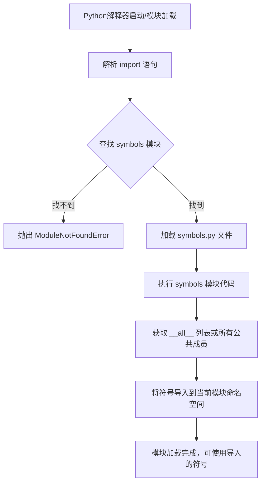

# `Bert-VITS2\onnx_modules\V240_JP\text\__init__.py` 详细设计文档

这是一个Python模块文件，通过相对导入（from .symbols import *）从当前包的symbols模块导入所有公开的符号（类、函数、变量、常量等）。该导入方式使得当前模块可以直接使用symbols模块中定义的所有公共成员，而无需使用模块名前缀。这通常见于包的__init__.py文件中，用于重导出符号，或者在需要使用symbols模块定义的常量、枚举或工具函数的模块中。

## 整体流程



## 类结构

```
该文件为简单导入文件，无自定义类层次结构
实际层级结构取决于 symbols 模块的内容
如果 symbols.py 存在且包含类，则结构如下：
symbols 模块
  ├── 可能有类定义
  ├── 可能有函数定义
  └── 可能有常量/变量定义
```

## 全局变量及字段


    

## 全局函数及方法


## 关键组件


### 核心功能概述

该代码是一个模块导入语句，通过相对导入的方式从当前包的 symbols 模块导入所有公开成员（使用 `*` 通配符），这通常用于暴露模块内部定义的符号常量和类型，供外部模块使用。

### 文件运行流程

1. Python 解释器执行该导入语句
2. 查找当前包下的 symbols 模块
3. 加载 symbols 模块并获取其所有公开成员（不含下划线前缀的名称）
4. 将这些成员导入到当前命名空间，供后续代码使用

### 关键组件信息

由于提供的代码仅为一个导入语句，无法直接确定具体的类和方法。以下是基于 Python 模块导入机制的通用组件分析：

#### symbols 模块（推断）

**描述**：当前包中的符号定义模块，可能包含量化相关的常量、枚举类型或张量索引定义。根据用户提到的"张量索引与惰性加载、反量化支持、量化策略"，该模块可能定义了与量化张量操作相关的符号常量。

#### 导入机制组件

| 组件名称 | 描述 |
|---------|------|
| `*` 通配符导入 | 导入 symbols 模块中所有公开成员（非下划线开头） |
| 相对导入 (`.`) | 从当前包导入模块的语法 |

### 潜在技术债务与优化空间

1. **使用 `*` 通配符导入**：这种导入方式可能导致命名空间污染，不清楚具体导入了哪些符号，建议明确列出需要导入的符号名称
2. **缺少文档注释**：当前文件没有模块级文档字符串，建议添加模块功能说明
3. **symbols 模块依赖未知**：无法确定 symbols 模块的具体内容，若该模块有重大变更会影响当前模块

### 其它项目

- **设计约束**：遵循 Python 包的相对导入规范
- **外部依赖**：依赖于同包下的 symbols 模块存在
- **错误处理**：若 symbols 模块不存在或导入失败会抛出 ModuleNotFoundError


## 问题及建议


### 已知问题

-   使用 `import *` 通配符导入，导致命名空间污染，无法明确知道从 symbols 模块导入了哪些符号
-   缺少 `__all__` 列表来显式定义公共 API，削弱了模块的封装性和可维护性
-   代码过于简洁，缺少模块级别的文档字符串（docstring）说明该模块的用途
-   潜在的循环导入风险，如果 symbols 模块反向导入了当前模块，会导致导入错误
-   无法进行静态类型检查，因为导入的符号类型未知

### 优化建议

-   改用显式导入：明确列出需要导入的符号，如 `from .symbols import SymbolA, SymbolB`
-   在 symbols 模块中定义 `__all__` 列表，列出允许导出的公共接口
-   为当前模块添加模块级文档字符串，说明其功能和职责
-   如果确实需要导入大量符号，考虑使用模块别名：`import symbols as sym`，然后通过 `sym.SymbolName` 访问
-   使用类型注解或类型检查工具（如 mypy）时，应优先使用显式导入以支持静态分析


## 其它


### 设计目标与约束

本模块旨在通过通配符导入方式，将symbols模块中定义的所有公共符号（symbols）引入当前命名空间，以供模块内部使用。设计约束包括：1）必须确保symbols模块已正确安装或存在于项目依赖中；2）使用*导入时需确保symbols模块的__all__属性正确定义，以控制导入的符号范围；3）应避免循环导入问题，确保symbols模块不依赖当前模块。

### 错误处理与异常设计

本模块的错误处理主要涉及ImportError和ModuleNotFoundError。当symbols模块不存在或无法导入时，Python解释器将抛出ModuleNotFoundError；若symbols模块存在但导入过程中发生错误，则抛出ImportError。建议在模块级别添加try-except块捕获导入错误，并提供清晰的错误信息，以便开发者定位问题。

### 外部依赖与接口契约

本模块依赖于symbols模块的完整性和稳定性。外部接口契约包括：1）symbols模块必须存在于相同的Python包结构中；2）symbols模块应正确定义__all__列表以明确导出符号；3）导入的符号应遵循项目编码规范。建议通过单元测试验证symbols模块的可用性和符号完整性。

### 性能考虑

通配符导入在模块首次被导入时执行，此时会触发symbols模块的完整加载和所有符号的解析。对于大型symbols模块，可能存在一定的初始化性能开销。建议在性能敏感场景下使用显式导入方式（如from .symbols import SymbolA, SymbolB），以减少不必要的符号加载。

### 可测试性

由于本模块仅为导入语句，测试重点应放在验证symbols模块的正确性和可用性上。建议编写集成测试，确保symbols模块的所有导出符号符合预期。测试策略包括：1）验证symbols模块可正常导入；2）检查导入符号的数量和名称；3）验证关键符号的类型和属性。

### 安全性考虑

使用from .symbols import *方式存在命名空间污染风险，可能导入意料之外的符号。建议在symbols模块中明确定义__all__列表，仅导出必要的公共符号。同时，应避免在symbols模块中定义以双下划线开头的私有符号，以防止名称修饰冲突。

### 配置管理

本模块不涉及运行时配置，所有配置通过symbols模块的实现完成。建议在项目配置文件中记录symbols模块的版本依赖关系，确保不同模块版本间的兼容性。

### 版本控制与变更记录

变更记录应包括：1）symbols模块的结构变更（如新增、删除或重命名符号）；2）__all__列表的修改；3）符号类型或接口的变更。建议使用语义化版本号管理symbols模块的发布。

### 监控与日志

由于模块仅为导入语句，运行时无需日志记录。若需监控导入行为，可在模块初始化时添加调试日志，记录symbols模块的加载状态和导入符号列表。建议使用Python的logging模块进行统一的日志管理。

### 命名规范与编码标准

本模块应遵循PEP 8编码规范和项目特定的命名约定。symbols模块的命名应清晰表达其功能，建议使用名词复数形式（如symbols、constants、enums）命名模块。


    