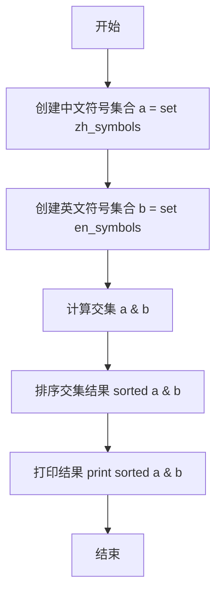

# `Bert-VITS2\onnx_modules\V240_JP\text\symbols.py` 详细设计文档

该代码定义了中文、日文、英文三种语言的音素（phoneme）符号集，并通过合并、排序、去重等操作生成统一的符号表，同时建立了语言ID映射和音调（tone）起始位置映射，用于多语言语音合成或识别系统中的符号索引转换。

## 整体流程

```mermaid
graph TD
    A[开始] --> B[定义标点符号集 punctuation]
    B --> C[定义pu_symbols = punctuation + [SP, UNK]]
    C --> D[定义中文音素符号集 zh_symbols]
    D --> E[定义中文音调数量 num_zh_tones = 6]
    E --> F[定义日文音素符号集 ja_symbols]
    F --> G[定义日文音调数量 num_ja_tones = 2]
    G --> H[定义英文音素符号集 en_symbols]
    H --> I[定义英文音调数量 num_en_tones = 4]
    I --> J[合并所有符号: normal_symbols = sorted(set(zh + ja + en))]
    J --> K[生成完整符号表: symbols = [pad] + normal_symbols + pu_symbols]
    K --> L[计算静音音素索引: sil_phonemes_ids]
    L --> M[计算总音调数: num_tones = 6 + 2 + 4 = 12]
    M --> N[定义语言ID映射: language_id_map = {ZH:0, JP:1, EN:2}]
    N --> O[定义语言音调起始位置映射: language_tone_start_map]
    O --> P{if __name__ == '__main__'}
    P -- 是 --> Q[测试: 计算zh_symbols与en_symbols的交集并排序输出]
    P -- 否 --> R[结束]
```

## 类结构

```
无类层次结构
该文件为模块级脚本，仅包含全局变量和函数
```

## 全局变量及字段


### `punctuation`
    
标点符号列表（! ? … , . ' -）

类型：`list[str]`
    


### `pu_symbols`
    
标点符号与特殊符号列表（punctuation + SP + UNK）

类型：`list[str]`
    


### `pad`
    
填充符号（'_'）用于序列padding

类型：`str`
    


### `zh_symbols`
    
中文音素符号列表（pinyin音节）

类型：`list[str]`
    


### `num_zh_tones`
    
中文音调数量（6，包含轻声）

类型：`int`
    


### `ja_symbols`
    
日文音素符号列表（罗马字音节）

类型：`list[str]`
    


### `num_ja_tones`
    
日文音调数量（2）

类型：`int`
    


### `en_symbols`
    
英文音素符号列表（CMU音素）

类型：`list[str]`
    


### `num_en_tones`
    
英文音调数量（4）

类型：`int`
    


### `normal_symbols`
    
合并后的标准符号集（已排序去重）

类型：`list[str]`
    


### `symbols`
    
完整符号表（pad + normal_symbols + pu_symbols）

类型：`list[str]`
    


### `sil_phonemes_ids`
    
静音音素的符号索引列表

类型：`list[int]`
    


### `num_tones`
    
总音调数量（12）

类型：`int`
    


### `language_id_map`
    
语言名称到ID的映射（ZH:0, JP:1, EN:2）

类型：`dict[str, int]`
    


### `num_languages`
    
语言数量（3）

类型：`int`
    


### `language_tone_start_map`
    
各语言音调索引起始位置映射

类型：`dict[str, int]`
    


    

## 全局函数及方法


### 代码概述

该Python脚本文件定义了多语言（中文、日文、英文）的音素（phonemes）符号表、音调数量，并统一整合为通用的符号集，同时建立了语言ID映射和音调起始索引映射关系，用于后续语音合成或语音识别系统中的多语言支持。

---

## 1. 核心功能概述

该代码是一个多语言音素符号表配置文件，定义了中文、日文、英文三种语言的音素符号集合、特殊符号（标点符号等）、各语言的音调数量，并生成统一的符号索引表和语言相关映射，为多语言语音处理系统提供基础数据支撑。

---

## 2. 文件整体运行流程

```
┌─────────────────────────────────────────┐
│           开始执行                        │
└─────────────────┬───────────────────────┘
                  ▼
┌─────────────────────────────────────────┐
│  定义标点符号列表 (punctuation)           │
└─────────────────┬───────────────────────┘
                  ▼
┌─────────────────────────────────────────┐
│  定义中文音素符号列表 (zh_symbols)        │
└─────────────────�─┬───────────────────────┘
                  ▼
┌─────────────────────────────────────────┐
│  定义日文音素符号列表 (ja_symbols)        │
└─────────────────┬───────────────────────┘
                  ▼
┌─────────────────────────────────────────┐
│  定义英文音素符号列表 (en_symbols)        │
└─────────────────┬───────────────────────┘
                  ▼
┌─────────────────────────────────────────┐
│  合并并去重所有符号 (normal_symbols)      │
└─────────────────┬───────────────────────┘
                  ▼
┌─────────────────────────────────────────┐
│  构建完整符号表 (symbols)                 │
└─────────────────┬───────────────────────┘
                  ▼
┌─────────────────────────────────────────┐
│  生成静音音素ID列表                       │
│  (sil_phonemes_ids)                      │
└─────────────────┬───────────────────────┘
                  ▼
┌─────────────────────────────────────────┐
│  计算总音调数量 (num_tones)               │
└─────────────────┬───────────────────────┘
                  ▼
┌─────────────────────────────────────────┐
│  定义语言ID映射 (language_id_map)         │
└─────────────────┬───────────────────────┘
                  ▼
┌─────────────────────────────────────────┐
│  定义语言音调起始索引映射                  │
│  (language_tone_start_map)              │
└─────────────────┬───────────────────────┘
                  ▼
┌─────────────────────────────────────────┐
│  if __name__ == "__main__":             │
│  - 求中文与英文符号集合的交集             │
│  - 打印交集结果                          │
└─────────────────┬───────────────────────┘
                  ▼
┌─────────────────────────────────────────┐
│           执行结束                        │
└─────────────────────────────────────────┘
```

---

## 3. 全局变量详细信息

### 3.1 标点符号相关

| 变量名称 | 类型 | 描述 |
|---------|------|------|
| `punctuation` | `list[str]` | 基础标点符号列表，包含感叹号、问号、省略号、逗号、句号、单引号、连字符 |
| `pu_symbols` | `list[str]` | 完整标点符号列表，包含基础标点加上"SP"（空格）和"UNK"（未知） |
| `pad` | `str` | 填充符号，用于序列对齐，值为下划线"_" |

### 3.2 中文音素符号

| 变量名称 | 类型 | 描述 |
|---------|------|------|
| `zh_symbols` | `list[str]` | 中文音素符号列表，包含声母、韵母、声调等87个符号 |
| `num_zh_tones` | `int` | 中文音调数量，值为6（包括轻声） |

### 3.3 日文音素符号

| 变量名称 | 类型 | 描述 |
|---------|------|------|
| `ja_symbols` | `list[str]` | 日文音素符号列表，包含清音、浊音、促音等46个符号 |
| `num_ja_tones` | `int` | 日文音调数量，值为2 |

### 3.4 英文音素符号

| 变量名称 | 类型 | 描述 |
|---------|------|------|
| `en_symbols` | `list[str]` | 英文音素符号列表（ARPABET格式），包含39个音素符号 |
| `num_en_tones` | `int` | 英文音调数量，值为4 |

### 3.5 合并后的符号表

| 变量名称 | 类型 | 描述 |
|---------|------|------|
| `normal_symbols` | `list[str]` | 合并去重后的所有语言音素符号列表（已排序） |
| `symbols` | `list[str]` | 完整符号表，包含填充符 + 常规符号 + 标点符号 |
| `sil_phonemes_ids` | `list[int]` | 静音/标点符号在符号表中的索引ID列表 |

### 3.6 语言映射相关

| 变量名称 | 类型 | 描述 |
|---------|------|------|
| `num_tones` | `int` | 所有语言的音调总数（6 + 2 + 4 = 12） |
| `language_id_map` | `dict[str, int]` | 语言名称到ID的映射：ZH=0, JP=1, EN=2 |
| `num_languages` | `int` | 支持的语言数量，值为3 |
| `language_tone_start_map` | `dict[str, int]` | 各语言音调起始索引映射，用于音调ID的偏移计算 |

---

## 4. 关键组件信息

| 组件名称 | 描述 |
|---------|------|
| **符号表 (symbols)** | 统一的音素符号索引表，是语音处理系统的核心查找表 |
| **语言映射 (language_id_map)** | 提供语言到数值的映射，用于模型输入的语言标识 |
| **音调起始映射 (language_tone_start_map)** | 用于将相对音调ID转换为绝对音调ID的偏移量 |
| **静音音素ID (sil_phonemes_ids)** | 标识句子边界和停顿位置的音素索引 |

---

## 5. 潜在的技术债务或优化空间

1. **硬编码问题**：所有符号和映射关系都是硬编码在代码中，建议迁移到配置文件（如JSON/YAML）或数据库，以便于维护和扩展新语言。

2. **缺少验证机制**：代码未验证符号列表中是否存在重复项或冲突，虽然使用了`set()`去重，但应该在初始化时增加完整性校验。

3. **音素覆盖不完整**：
   - 英文符号表中存在大小写混合（如"aa" vs "V"），可能导致大小写敏感问题
   - 日文符号表可能缺少长音符号的系统性处理

4. **main块逻辑不清晰**：`if __name__ == "__main__"`块中的交集计算功能与整体模块职责不符，建议移除或移至独立的工具脚本。

5. **文档缺失**：缺少模块级文档字符串（docstring），建议添加详细的模块说明。

6. **魔法数字**：代码中存在多处硬编码数值（如起始索引0、6、8等），应定义为常量并添加注释说明计算逻辑。

---

## 6. 其它项目

### 6.1 设计目标与约束

- **目标**：为多语言语音合成系统提供统一的音素符号表和语言/音调映射
- **约束**：符号表必须包含填充符（PAD）、静音符（SP）、未知符（UNK），且索引0预留给填充符
- **兼容性**：符号表按字母顺序排序，确保不同运行环境的输出一致性

### 6.2 错误处理与异常设计

- 当前代码未实现错误处理机制
- 建议增加：
  - 符号表为空时的异常抛出
  - 语言映射键不存在时的默认值处理
  - 符号索引越界保护

### 6.3 数据流与状态机

- 该文件为**配置型模块**，不涉及运行时状态管理
- 数据流为单向：定义符号 → 合并去重 → 构建映射表 → 供外部调用

### 6.4 外部依赖与接口契约

- **无外部依赖**：仅使用Python标准库（`sorted`, `set`）
- **接口契约**：
  - `symbols`列表索引0必须为填充符`_`
  - `language_id_map`必须包含ZH、JP、EN三种语言
  - `language_tone_start_map`的值必须与各语言音调数量对应

---

## 7. 用户自定义函数/方法

**注意**：该代码文件中**不存在任何用户自定义函数或类**，所有内容均为全局变量定义和配置初始化。代码仅在`if __name__ == "__main__"`块中包含一段测试代码，用于打印中文和英文符号集的交集。

---

## 8. 总结

该代码是一个轻量级的多语言音素符号表配置模块，设计简洁但缺乏扩展性和健壮性验证。在实际语音处理项目中，建议将其重构为独立的配置文件或封装为配置类，以提升可维护性和可测试性。


### `__main__` (模块级别执行块)

该代码块为主程序入口，演示了如何使用 `sorted()`, `set()`, `&`（集合交集运算）和 `print()` 四个Python内置函数来找出中文和英文音素符号集合中的交集元素。

参数： 无

返回值： 无（仅执行打印操作）

#### 流程图



#### 带注释源码

```
# 模块级别执行块 - 仅在直接运行此文件时执行
if __name__ == "__main__":
    # 使用 set() 内置函数将中文符号列表转换为集合（去重）
    a = set(zh_symbols)
    # 使用 set() 内置函数将英文符号列表转换为集合（去重）
    b = set(en_symbols)
    # 使用 & 运算符计算两个集合的交集，使用 sorted() 内置函数排序结果
    # 使用 print() 内置函数输出结果
    print(sorted(a & b))
    # 输出结果为: ['a', 'e', 'i', 'n', 'o', 'u'] - 中英文都有的音素符号
```

---

### 补充：全局变量与符号系统概览

该代码文件定义了一个多语言音素符号系统，包含以下全局组件：

| 组件名称 | 类型 | 描述 |
|---------|------|------|
| `punctuation` | list | 标点符号列表 |
| `pu_symbols` | list | 标点符号+特殊符号（SP未知字符+UNK） |
| `zh_symbols` | list | 中文音素符号列表 |
| `ja_symbols` | list | 日文音素符号列表 |
| `en_symbols` | list | 英文音素符号列表（ARPAbet格式） |
| `normal_symbols` | list | 合并去重排序后的音素符号 |
| `symbols` | list | 完整符号表（包含pad填充符） |
| `sil_phonemes_ids` | list | 静音/标点符号的索引ID列表 |
| `language_id_map` | dict | 语言名称到ID的映射 |
| `language_tone_start_map` | dict | 各语言音调起始索引映射 |

---

### 技术债务与优化建议

1. **硬编码问题**：符号集合和语言映射以硬编码方式定义，建议提取为配置文件
2. **重复定义**：`num_tones` 未在代码中直接使用但已计算
3. **魔法数字**：语言ID和音调数量建议定义为常量类
4. **缺少文档注释**：符号列表缺乏注释说明其来源和用途
5. **可扩展性**：新增语言需要手动更新多个列表和映射，建议设计为插件式架构


## 关键组件


### 音素符号集合定义

定义了中文、日语、英语三种语言的音素符号列表（zh_symbols、ja_symbols、en_symbols），包含各语言的发音单元，如元音、辅音等，用于多语言语音合成系统的音素建模。

### 标点符号与特殊符号

定义了标点符号列表（punctuation）以及特殊符号（pu_symbols），包括"SP"（空格）和"UNK"（未知），用于处理文本中的标点及未识别字符。

### 统一符号索引映射

通过symbols列表将所有语言的音素符号、标点符号和特殊符号整合为统一索引，并通过sil_phonemes_ids记录静音音素的索引位置，实现跨语言的统一符号编码。

### 语言标识与映射

定义了language_id_map将语言缩写映射为ID（ZH=0, JP=1, EN=2），以及language_tone_start_map记录各语言音调的起始编号，用于多语言系统的语言识别与音调处理。

### 音调数量统计

定义了各语言的音调数量（num_zh_tones=6, num_ja_tones=2, num_en_tones=4）和总音调数量（num_tones），用于语音合成中的语调控制。


## 问题及建议


### 已知问题

- **硬编码问题**：所有符号集合、音调数量和语言映射都是硬编码的，缺乏灵活性，难以扩展到新语言或动态配置
- **Magic Numbers**：num_zh_tones=6、num_ja_tones=2、num_en_tones=4 等数值没有注释说明其含义，后续维护困难
- **符号重叠未处理**：中文和英文符号存在重叠（如 "a", "i", "u" 等），直接使用 sorted(set()) 合并可能导致音素映射冲突
- **缺乏错误处理**：symbols.index(i) 在符号不存在时会抛出 ValueError，没有容错机制
- **全局变量过多**：大量全局变量（symbols、sil_phonemes_ids、language_id_map 等）散落在模块级别，难以测试和维护
- **代码组织混乱**：测试代码（if __name__ == "__main__"）与配置代码混在一起，应分离到独立测试模块

### 优化建议

- **抽象配置结构**：使用类或配置文件来管理不同语言的符号和参数，将硬编码值提取为可配置项
- **添加文档注释**：为每个语言符号集、音调数量和映射关系添加注释说明
- **处理符号冲突**：在合并符号前检测冲突，为不同语言的相同符号添加语言前缀或后缀以区分
- **增加错误处理**：对 symbols.index() 操作添加异常捕获，或使用 dict.get() 提供默认值
- **模块化重构**：将符号定义、语言映射逻辑和工具函数分离到独立模块或类中，提高可测试性
- **统一命名规范**：保持命名风格一致，如统一使用 snake_case
- **分离测试代码**：将 if __name__ == "__main__" 中的测试代码移至独立的测试文件

## 其它


### 设计目标与约束

本模块的设计目标是提供一个统一的多语言音素符号映射系统，支持中文、日文和英文三种语言的音素表示，并为其分配唯一的ID和音调范围。约束条件包括：1) 符号集必须包含所有语言的全部音素；2) 符号ID必须保持唯一性；3) 语言ID和音调范围必须连续且不冲突；4) 必须支持填充符号和未知符号的处理。

### 错误处理与异常设计

本代码为纯数据定义模块，不涉及运行时错误处理。若后续扩展需添加符号查询功能，应处理以下异常情况：1) 查找不存在的符号时返回-1或抛出KeyError；2) 语言ID不在有效范围内时抛出ValueError；3) 符号集为空时抛出RuntimeError。所有异常应包含清晰的错误信息以便调试。

### 数据流与状态机

数据流分为三个主要阶段：首先是符号定义阶段，定义中文、日文、英文的音素符号列表；其次是符号整合阶段，通过set去重并与标点符号集合合并生成统一符号表；最后是ID映射阶段，为每种语言计算音调起始位置和语言ID映射。整个过程为单向流动，无状态回退。

### 外部依赖与接口契约

本模块无外部依赖，仅使用Python内置的set、sorted函数。接口契约包括：symbols列表第一个元素必须为填充符"_"；sil_phonemes_ids必须包含所有标点符号的索引；language_id_map的键必须与language_tone_start_map的键保持一致；num_tones必须等于三种语言音调数之和。任何使用本模块的代码必须遵守上述契约。

### 性能考虑

当前实现使用sorted(set(...))进行去重排序，时间复杂度为O(n log n)。对于有限的符号集规模，性能可接受。建议：1) 如需频繁查询符号ID，可预计算符号到ID的映射字典；2) 如符号集固定，可将symbols列表改为不可变的tuple以节省内存；3) 主函数中的集合交集运算可考虑缓存结果以避免重复计算。

### 安全性考虑

本模块为纯数据定义模块，不涉及用户输入处理或外部资源访问，无明显安全风险。但需注意：1) 符号定义来源于外部输入时需进行校验；2) 避免符号列表被恶意篡改导致ID映射错误；3) 未来扩展时应防止通过符号注入绕过验证逻辑。

### 可维护性与扩展性

可维护性方面：1) 符号定义按语言分组，清晰易读；2) 使用有意义的变量命名；3) 添加必要的注释说明符号来源。可扩展性方面：1) 新增语言只需在对应位置添加符号列表和音调数；2) 更新language_id_map和language_tone_start_map即可；3) 建议提取为配置文件或数据库存储以提高灵活性。

### 测试策略

建议测试用例包括：1) 验证symbols列表中无重复元素；2) 验证sil_phonemes_ids包含所有pu_symbols的正确索引；3) 验证language_tone_start_map的连续性和正确性；4) 验证num_tones等于各语言音调数之和；5) 验证主函数中交集计算结果的正确性；6) 验证符号ID查询的时间复杂度是否满足要求。

### 版本兼容性

当前代码兼容Python 3.6+版本，因使用了类型注解（虽然本代码中未显式使用）和f-string（如有）。建议：1) 避免使用Python 3.10+的match-case语法；2) 如需兼容Python 2.7，需将print函数调用改为print语句；3) 考虑使用typing模块添加类型注解以提高代码可读性和IDE支持。

    