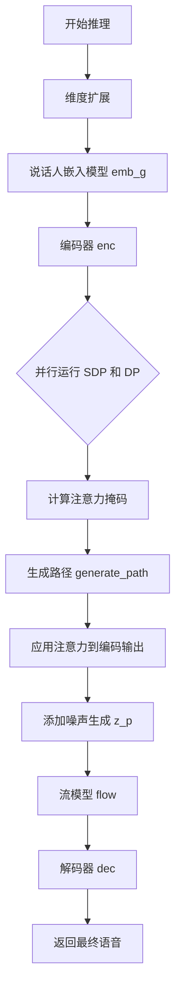
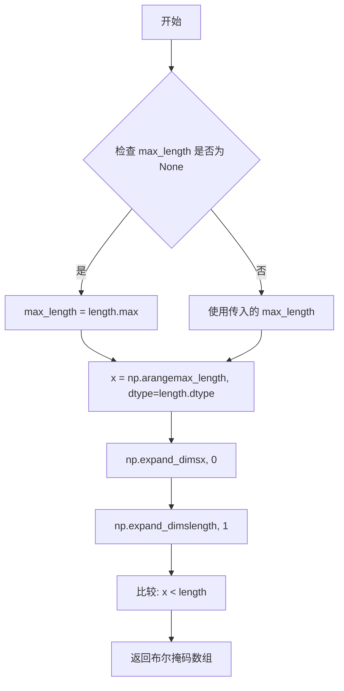
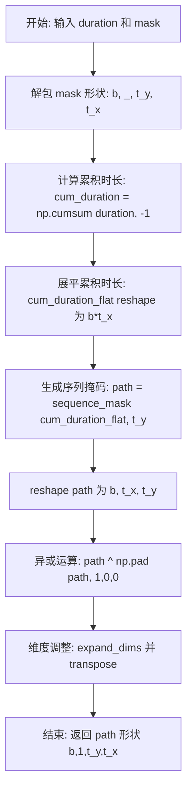
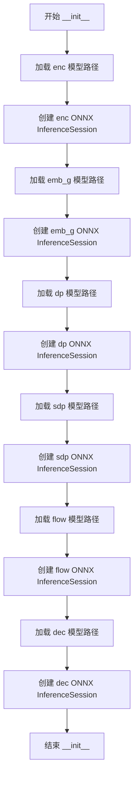
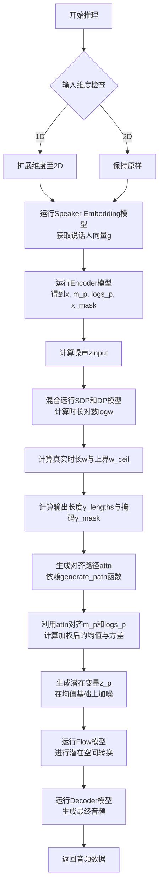

# `Bert-VITS2\onnx_modules\V240_OnnxInference\__init__.py` 详细设计文档

该代码实现了一个基于ONNX Runtime的文本到语音(TTS)推理管道，通过串联6个ONNX模型（编码器、说话人嵌入、时长预测器、随机时长预测器、流模型、解码器），将文本特征、韵律特征和情感特征转换为最终的语音波形。

## 整体流程



## 类结构

```
OnnxInferenceSession (主推理类)
└── __init__: 初始化6个ONNX会话
└── __call__: 执行完整TTS推理流程
```

## 全局变量及字段


### `np`
    
数值计算库，用于数组操作和数学运算

类型：`numpy库`
    


### `ort`
    
ONNX模型推理库，用于加载和运行ONNX模型

类型：`onnxruntime库`
    


### `convert_pad_shape`
    
将填充形状列表翻转并展平为一维列表

类型：`function`
    


### `sequence_mask`
    
根据序列长度生成布尔掩码矩阵

类型：`function`
    


### `generate_path`
    
根据时长和掩码生成注意力路径矩阵

类型：`function`
    


### `layer`
    
临时存储翻转后的填充形状

类型：`list`
    


### `pad_shape`
    
展平后的填充形状

类型：`list`
    


### `x`
    
序列掩码比较数组或编码后的序列特征

类型：`numpy.ndarray`
    


### `b`
    
batch大小

类型：`int`
    


### `t_y`
    
输出时间步

类型：`int`
    


### `t_x`
    
输入时间步

类型：`int`
    


### `cum_duration`
    
累积时长

类型：`numpy.ndarray`
    


### `cum_duration_flat`
    
展平的累积时长

类型：`numpy.ndarray`
    


### `path`
    
生成的路径矩阵

类型：`numpy.ndarray`
    


### `g`
    
说话人嵌入向量

类型：`numpy.ndarray`
    


### `enc_rtn`
    
编码器输出列表

类型：`list`
    


### `m_p`
    
均值预测

类型：`numpy.ndarray`
    


### `logs_p`
    
日志方差预测

类型：`numpy.ndarray`
    


### `x_mask`
    
序列掩码

类型：`numpy.ndarray`
    


### `zinput`
    
随机噪声输入

类型：`numpy.ndarray`
    


### `logw`
    
时长对数

类型：`numpy.ndarray`
    


### `w`
    
时长

类型：`numpy.ndarray`
    


### `w_ceil`
    
向上取整的时长

类型：`numpy.ndarray`
    


### `y_lengths`
    
输出序列长度

类型：`numpy.ndarray`
    


### `y_mask`
    
输出序列掩码

类型：`numpy.ndarray`
    


### `attn_mask`
    
注意力掩码

类型：`numpy.ndarray`
    


### `attn`
    
注意力矩阵

类型：`numpy.ndarray`
    


### `z_p`
    
加噪后的潜在向量

类型：`numpy.ndarray`
    


### `z`
    
流模型输出

类型：`numpy.ndarray`
    


### `OnnxInferenceSession.enc`
    
编码器模型会话

类型：`ort.InferenceSession`
    


### `OnnxInferenceSession.emb_g`
    
说话人嵌入模型会话

类型：`ort.InferenceSession`
    


### `OnnxInferenceSession.dp`
    
时长预测器模型会话

类型：`ort.InferenceSession`
    


### `OnnxInferenceSession.sdp`
    
随机时长预测器模型会话

类型：`ort.InferenceSession`
    


### `OnnxInferenceSession.flow`
    
流模型会话

类型：`ort.InferenceSession`
    


### `OnnxInferenceSession.dec`
    
解码器模型会话

类型：`ort.InferenceSession`
    
    

## 全局函数及方法


### `convert_pad_shape`

该函数用于将嵌套的填充形状格式转换为扁平化的一维列表。它首先将输入的嵌套列表进行翻转，然后展开为单个列表，这在处理需要特定顺序的填充参数时非常有用。

参数：

- `pad_shape`：`List[List[int]]`，嵌套的填充形状列表，例如 `[[1, 2], [3, 4]]`

返回值：`List[int]`，扁平化后的填充形状列表

#### 流程图

```mermaid
flowchart TD
    A[开始: pad_shape] --> B[翻转列表: layer = pad_shape[::-1]]
    B --> C[展平嵌套列表: item for sublist in layer for item in sublist]
    C --> D[返回扁平化列表]
    
    A1[输入示例: [[1, 2], [3, 4]]] --> B
    B1[翻转后: [[3, 4], [1, 2]]] --> C
    D --> D1[输出: [3, 4, 1, 2]]
```

#### 带注释源码

```python
def convert_pad_shape(pad_shape):
    """
    将嵌套的填充形状格式转换为扁平化的一维列表
    
    参数:
        pad_shape: 嵌套的填充形状列表，如 [[1, 2], [3, 4]]
        
    返回:
        扁平化后的列表，如 [3, 4, 1, 2]
    """
    # 第一步：翻转列表顺序
    # 例如：[[1, 2], [3, 4]] -> [[3, 4], [1, 2]]
    layer = pad_shape[::-1]
    
    # 第二步：展平嵌套列表
    # 使用列表推导式将嵌套结构展开为单个列表
    # 例如：[[3, 4], [1, 2]] -> [3, 4, 1, 2]
    pad_shape = [item for sublist in layer for item in sublist]
    
    # 返回展平后的列表
    return pad_shape
```


### `sequence_mask`

生成序列掩码，用于根据输入的序列长度生成布尔掩码数组，常用于变长序列处理中。

参数：

- `length`：`numpy.ndarray`，一维数组，表示序列的实际长度
- `max_length`：`int` 或 `None`，可选参数，表示掩码的最大长度。如果为 `None`，则使用 `length` 中的最大值

返回值：`numpy.ndarray`，二维布尔数组，形状为 `(1, max_length)` 或 `(batch_size, max_length)`，用于标识有效位置

#### 流程图



#### 带注释源码

```python
def sequence_mask(length, max_length=None):
    """
    生成序列掩码
    
    参数:
        length: numpy.ndarray, 一维数组，表示每个序列的实际长度
        max_length: int 或 None，掩码的最大长度，默认使用 length 中的最大值
    
    返回:
        numpy.ndarray, 布尔类型数组，表示有效位置的掩码
    """
    # 如果未指定最大长度，则使用 length 数组中的最大值
    if max_length is None:
        max_length = length.max()
    
    # 生成从 0 到 max_length-1 的数组，数据类型与 length 保持一致
    x = np.arange(max_length, dtype=length.dtype)
    
    # 使用广播机制比较：
    # x 扩展为 (1, max_length)，length 扩展为 (n, 1)
    # 结果是 (n, max_length) 的布尔数组，表示每个位置是否在对应序列长度内
    return np.expand_dims(x, 0) < np.expand_dims(length, 1)
```


### `generate_path`

根据给定的时长向量（duration）和掩码（mask）生成注意力路径（attention path），用于在语音合成中建立输入序列与输出序列之间的对齐关系。

参数：

- `duration`：`numpy.ndarray`，形状为 `[b, 1, t_x]`，表示每个输入时间步的持续时长（b 为批次大小，t_x 为输入时间步数）
- `mask`：`numpy.ndarray`，形状为 `[b, 1, t_y, t_x]`，表示注意力掩码（t_y 为输出时间步数）

返回值：`numpy.ndarray`，形状为 `[b, 1, t_y, t_x]`，表示生成的注意力路径矩阵

#### 流程图



#### 带注释源码

```python
def generate_path(duration, mask):
    """
    根据时长生成注意力路径
    
    参数:
        duration: [b, 1, t_x] - 每帧的持续时间
        mask: [b, 1, t_y, t_x] - 注意力掩码
    
    返回:
        path: [b, 1, t_y, t_x] - 注意力路径矩阵
    """
    
    # 从 mask 中提取批次大小和维度信息
    # mask 形状: [b, 1, t_y, t_x]
    b, _, t_y, t_x = mask.shape
    
    # 计算累积持续时间
    # 对 duration 在最后一个维度进行累加
    # 结果形状: [b, 1, t_x]
    cum_duration = np.cumsum(duration, -1)
    
    # 展平累积时长以便后续处理
    # 形状从 [b, 1, t_x] 变为 [b * t_x]
    cum_duration_flat = cum_duration.reshape(b * t_x)
    
    # 使用序列掩码生成初始路径
    # sequence_mask 生成 [b*t_x, t_y] 的布尔矩阵
    # 表示每个位置是否在累积时长范围内
    path = sequence_mask(cum_duration_flat, t_y)
    
    # 重新 reshape 回批次维度
    # 形状: [b, t_x, t_y]
    path = path.reshape(b, t_x, t_y)
    
    # 通过异或操作计算边界
    # np.pad 在第二个维度前添加一行 0
    # 然后通过异或得到相邻帧的边界差异
    # 形状仍为 [b, t_x, t_y]
    path = path ^ np.pad(path, ((0, 0), (1, 0), (0, 0)))[:, :-1]
    
    # 调整维度顺序以匹配输出格式
    # 先在第一个维度插入新轴: [b, 1, t_x, t_y]
    # 再转置为: [b, 1, t_y, t_x]
    path = np.expand_dims(path, 1).transpose(0, 1, 3, 2)
    
    # 返回最终的注意力路径
    return path
```

#### 设计说明

该函数实现了 VITS 等语音合成模型中的 **单调对齐路径（Monotonic Alignment Path）** 生成逻辑：

1. **累积时长计算**：将离散的持续时间转换为累积范围
2. **边界检测**：通过异或操作识别相邻时间步之间的边界变化
3. **维度变换**：确保输出与注意力机制的维度约定一致（`[batch, 1, target_len, source_len]`）

#### 潜在优化空间

1. **向量化程度**：当前实现存在多次 reshape 操作，可考虑融合减少中间变量
2. **数值精度**：mask 参数未做数值范围校验，需确保输入合法
3. **函数依赖**：`sequence_mask` 函数未在此文件中定义，依赖外部导入，需确保其存在


### `OnnxInferenceSession.__init__`

初始化 ONNX 推理会话，加载多个 ONNX 模型（编码器、全局嵌入、持续时间预测器、流模型和解码器）并创建对应的 ONNX Runtime 推理会话。

参数：

- `path`：`Dict[str, str]`，字典类型，包含多个 ONNX 模型文件路径，键名为 "enc"、"emb_g"、"dp"、"sdp"、"flow"、"dec"，分别对应编码器、全局嵌入、判别器、随机持续时间预测器、流模型和解码器的模型路径
- `Providers`：`List[str]`，可选参数，默认值为 `["CPUExecutionProvider"]`，指定 ONNX Runtime 的执行提供者列表，用于指定在哪些设备上运行推理

返回值：`None`，无返回值，用于初始化对象状态

#### 流程图



#### 带注释源码

```python
def __init__(self, path, Providers=["CPUExecutionProvider"]):
    """
    初始化 ONNX 推理会话，加载多个 ONNX 模型并创建推理会话
    
    参数:
        path: 字典，包含6个ONNX模型路径，键名为 enc/emb_g/dp/sdp/flow/dec
        Providers: 执行提供者列表，默认使用CPU执行
    
    返回值:
        无（__init__方法）
    """
    # 创建编码器(Encoder)的ONNX推理会话，加载path["enc"]指定的模型
    self.enc = ort.InferenceSession(path["enc"], providers=Providers)
    
    # 创建全局嵌入(Embedding Global)的ONNX推理会话
    self.emb_g = ort.InferenceSession(path["emb_g"], providers=Providers)
    
    # 创建持续时间预测器(Duration Predictor)的ONNX推理会话
    self.dp = ort.InferenceSession(path["dp"], providers=Providers)
    
    # 创建随机持续时间预测器(Stochastic Duration Predictor)的ONNX推理会话
    self.sdp = ort.InferenceSession(path["sdp"], providers=Providers)
    
    # 创建归一化流(Normalizing Flow)模型的ONNX推理会话
    self.flow = ort.InferenceSession(path["flow"], providers=Providers)
    
    # 创建解码器(Decoder)的ONNX推理会话
    self.dec = ort.InferenceSession(path["dec"], providers=Providers)
```


### `OnnxInferenceSession.__call__`

执行TTS（文本到语音）推理主流程的核心方法。该方法接收文本、音调、语言、BERT和情感特征向量以及说话人ID，依次通过嵌入模型、编码器、时长预测器、流模型（Flow）和解码器模型，生成最终的音频波形。

#### 参数

- `seq`：`numpy.ndarray` (int64)，输入文本的token序列。
- `tone`：`numpy.ndarray` (int64)，输入文本的音调（韵律）序列。
- `language`：`numpy.ndarray` (int64)，输入文本的语言标识序列。
- `bert_zh`：`numpy.ndarray` (float32)，中文BERT上下文嵌入特征。
- `emo`：`numpy.ndarray` (float32)，情感嵌入特征。
- `sid`：`numpy.ndarray` (int64)，说话人ID向量。
- `seed`：`int` (可选，默认114514)，随机数种子，用于控制推理过程中的随机性。
- `seq_noise_scale`：`float` (可选，默认0.8)，序列潜在空间的噪声缩放比例。
- `sdp_noise_scale`：`float` (可选，默认0.6)，随机时长预测器的噪声缩放比例。
- `length_scale`：`float` (可选，默认1.0)，输出音频长度的缩放因子。
- `sdp_ratio`：`float` (可选，默认0.0)，随机时长预测器(SDP)与确定性时长预测器(DP)的混合比例（0.0为全DP，1.0为全SDP）。

#### 返回值

- `numpy.ndarray` (float32)，生成的音频波形数据。

#### 流程图



#### 带注释源码

```python
def __call__(
    self,
    seq,
    tone,
    language,
    bert_zh,
    emo,
    sid,
    seed=114514,
    seq_noise_scale=0.8,
    sdp_noise_scale=0.6,
    length_scale=1.0,
    sdp_ratio=0.0,
):
    # 1. 输入预处理：确保batch维度存在
    if seq.ndim == 1:
        seq = np.expand_dims(seq, 0)
    if tone.ndim == 1:
        tone = np.expand_dims(tone, 0)
    if language.ndim == 1:
        language = np.expand_dims(language, 0)
    
    # 断言检查输入维度是否符合Encoder要求 (Batch, Time)
    assert (seq.ndim == 2, tone.ndim == 2, language.ndim == 2)
    
    # 2. 获取说话人向量 (Speaker Embedding)
    # 将sid转换为int64并运行emb_g模型
    g = self.emb_g.run(
        None,
        {
            "sid": sid.astype(np.int64),
        },
    )[0]
    # 扩展维度以匹配后续计算: (B, D) -> (B, D, 1)
    g = np.expand_dims(g, -1)
    
    # 3. 运行编码器 (Encoder)
    # 输入包括文本token、音调、语言、以及BERT和情感特征
    enc_rtn = self.enc.run(
        None,
        {
            "x": seq.astype(np.int64),
            "t": tone.astype(np.int64),
            "language": language.astype(np.int64),
            "bert_0": bert_zh.astype(np.float32),
            "emo": emo.astype(np.float32),
            "g": g.astype(np.float32),
        },
    )
    # 解包编码器输出：隐藏状态x, 均值m_p, log方差logs_p, 掩码x_mask
    x, m_p, logs_p, x_mask = enc_rtn[0], enc_rtn[1], enc_rtn[2], enc_rtn[3]
    
    # 4. 时长预测与对齐 (Duration Prediction & Alignment)
    # 设置随机种子以控制噪声生成
    np.random.seed(seed)
    # 生成随机噪声输入用于随机时长预测 (SDP)
    zinput = np.random.randn(x.shape[0], 2, x.shape[2]) * sdp_noise_scale
    
    # 分别运行SDP和DP模型，计算时长对数 (logw)
    # sdp_ratio 控制两者的混合比例
    logw = self.sdp.run(
        None, {"x": x, "x_mask": x_mask, "zin": zinput.astype(np.float32), "g": g}
    )[0] * (sdp_ratio) + self.dp.run(None, {"x": x, "x_mask": x_mask, "g": g})[
        0
    ] * (
        1 - sdp_ratio
    )
    
    # 将对数时长转换为时长：exp(logw) * mask * length_scale
    w = np.exp(logw) * x_mask * length_scale
    # 向上取整得到每个token占据的帧数
    w_ceil = np.ceil(w)
    
    # 计算输出序列的总长度 (Y的长度)
    y_lengths = np.clip(np.sum(w_ceil, (1, 2)), a_min=1.0, a_max=100000).astype(
        np.int64
    )
    # 生成输出序列的mask
    y_mask = np.expand_dims(sequence_mask(y_lengths, None), 1)
    # 构建注意力掩码：用于generate_path
    attn_mask = np.expand_dims(x_mask, 2) * np.expand_dims(y_mask, -1)
    
    # 生成对齐路径矩阵 (Attention Path)
    attn = generate_path(w_ceil, attn_mask)
    
    # 5. 特征对齐与潜在变量生成
    # 使用对齐矩阵attn对Encoder输出的均值(m_p)和方差(logs_p)进行插值
    # 将时间维度从t_x (文本) 对齐到 t' (音频)
    m_p = np.matmul(attn.squeeze(1), m_p.transpose(0, 2, 1)).transpose(
        0, 2, 1
    )  # [b, t', t], [b, t, d] -> [b, d, t']
    logs_p = np.matmul(attn.squeeze(1), logs_p.transpose(0, 2, 1)).transpose(
        0, 2, 1
    )
    
    # 在均值基础上添加高斯噪声，生成Flow模型的输入潜在变量 z_p
    z_p = (
        m_p
        + np.random.randn(m_p.shape[0], m_p.shape[1], m_p.shape[2])
        * np.exp(logs_p)
        * seq_noise_scale
    )
    
    # 6. 运行流模型 (Flow)
    # 进行潜在空间的转换，通常用于提升音频质量或控制情感
    z = self.flow.run(
        None,
        {
            "z_p": z_p.astype(np.float32),
            "y_mask": y_mask.astype(np.float32),
            "g": g,
        },
    )[0]
    
    # 7. 运行解码器 (Decoder)
    # 将转换后的潜在变量z解码为最终的音频波形
    return self.dec.run(None, {"z_in": z.astype(np.float32), "g": g})[0]
```


## 关键组件


### 张量索引与形状变换

代码中多处使用NumPy进行张量形状变换和索引操作，包括`np.expand_dims`扩展维度、`transpose`转置、`squeeze`压缩维度、`reshape`重塑形状等，用于处理批量数据和适配ONNX模型的输入输出格式。

### 序列掩码生成 (sequence_mask)

生成用于指示有效序列位置的布尔掩码，通过比较时间索引与序列长度来创建，用于后续注意力机制和填充处理。

### 路径生成算法 (generate_path)

根据持续时间（duration）矩阵和掩码生成对齐路径，实现从输入序列到输出序列的映射关系，用于TTS中的单调对齐计算。

### OnnxInferenceSession 类

核心推理类，负责加载和运行6个ONNX模型（encoder、embedding、duration predictor、stochastic duration predictor、flow、decoder），实现完整的语音合成推理流程。

### 多模型协同推理

代码同时管理6个ONNX会话（enc, emb_g, dp, sdp, flow, dec），按顺序执行encoder -> duration prediction -> flow transformation -> decoder的流水线。

### 随机噪声注入

在SDP（随机持续时间预测）阶段使用`np.random.randn`生成噪声向量，并在潜空间注入噪声实现随机性和多样性。

### 动态形状处理

对输入的1D序列自动扩展为2D（batch维度），并通过`np.clip`和`np.ceil`动态计算输出长度，实现变长语音合成。

### 注意力路径生成

使用`generate_path`生成对齐矩阵，通过矩阵乘法`np.matmul`将输入特征沿时间维度对齐到输出，实现duration-aware的特征传播。

### 潜空间变换 (Flow)

使用flow模型对带噪声的持续时间预测结果进行变换，学习潜在空间的先验分布。

### 条件注入机制

所有模型都接收全局条件`g`（speaker embedding），通过`bert_zh`（中文BERT特征）、`emo`（情感特征）、`sid`（说话人ID）等条件实现多说话人和多情感合成。


## 问题及建议


### 已知问题

-   **全局随机状态污染**：使用 `np.random.seed(seed)` 会修改全局随机状态，可能影响同一进程中其他代码的随机数生成
-   **硬编码的魔法数字**：存在多个硬编码值如 `seed=114514`、`a_max=100000`、`sdp_noise_scale=0.8`、`sdp_ratio=0.0` 等，缺乏配置化设计
- **冗余的数组类型转换**：多处重复使用 `.astype(np.int64)` 和 `.astype(np.float32)` 进行类型转换，如 `seq.astype(np.int64)` 在 `enc.run` 调用前后可能产生不必要的内存拷贝
- **缺乏输入验证**：未对 ONNX 模型路径的有效性、输入数组的形状兼容性、sid 的合法性等进行验证，可能导致运行时错误
- **ONNX Runtime 缺少优化配置**：InferenceSession 未配置任何会话选项（如 `graph_optimization_level`、`enable_mem_pattern` 等），默认配置可能不是最优性能
- **中间数组内存占用**：`enc_rtn` 包含多个中间输出（x, m_p, logs_p, x_mask），部分后续可能不再需要但仍占用内存
- **断言信息不完整**：`assert (seq.ndim == 2, tone.ndim == 2, language.ndim == 2)` 使用元组语法，断言失败时信息不明确
- **缺乏资源管理**：未实现上下文管理器协议或显式的资源释放方法，ONNX session 可能不会正确释放
- **变量命名可读性不足**：如 `enc_rtn`、`zinput`、`z_p`、`w_ceil` 等命名不够直观，增加维护成本

### 优化建议

-   **使用独立的随机数生成器**：用 `np.random.Generator` 或 `np.random.default_rng(seed)` 替代全局 seed，避免污染全局状态
-   **配置化参数管理**：将硬编码的默认值提取为配置类或配置字典，支持运行时传入自定义值
-   **减少类型转换**：在数据进入函数前确保类型正确，避免在推理过程中多次转换；可考虑使用 views 替代 copies
-   **添加输入验证**：在 `__call__` 方法开头增加输入验证逻辑，检查模型文件存在性、输入维度兼容性、数值范围等
-   **配置 ONNX Runtime 会话选项**：如 `sess_options.graph_optimization_level = ort.GraphOptimizationLevel.ORT_ENABLE_ALL`、`sess_options.enable_mem_pattern = True` 等
- **优化断言写法**：改为 `assert seq.ndim == 2 and tone.ndim == 2 and language.ndim == 2, f"Invalid dimensions..."`
- **实现上下文管理器**：为 `OnnxInferenceSession` 添加 `__enter__` 和 `__exit__` 方法，支持 `with` 语法
- **延迟加载非必要中间变量**：仅在需要时计算 `z_p` 等中间变量，或使用生成器模式减少峰值内存
- **增加类型注解和文档**：为函数参数和返回值添加类型提示，为核心函数添加 docstring 说明
- **考虑批处理优化**：当前实现对单批次做了优化（`np.expand_dims`），但可考虑显式批处理接口以支持更大批次推理


## 其它


### 设计目标与约束

本代码旨在实现一个基于ONNX Runtime的文本转语音（TTS）推理框架，核心目标是将文本序列（包含音调、语言特征、语义信息、情感向量和说话人ID）转换为最终的音频波形。设计约束包括：1) 必须使用ONNX Runtime作为推理引擎以保证跨平台兼容性；2) 模型输入输出必须遵循固定的张量形状约定；3) 所有数值计算使用NumPy进行预处理，后端推理委托给ONNX模型；4) 音频生成过程中涉及随机噪声注入，需支持可重现的随机种子设置。

### 错误处理与异常设计

代码采用以下错误处理策略：1) 输入维度检查：在`__call__`方法中强制将一维输入扩展为二维（batch维度），并在扩展后使用assert验证ndim均为2；2) 张量类型转换：所有输入在送入ONNX Runtime前显式转换为`np.int64`或`np.float32`；3) ONNX模型执行错误：若模型文件路径不存在或ONNX模型结构不匹配，`ort.InferenceSession`和`run`方法将抛出原生异常，调用方需自行捕获；4) 数值异常：`np.clip`设置上下界防止溢出，`sequence_mask`处理max_length为None的边界情况。

### 数据流与状态机

整体数据流如下：输入序列经过embedding层生成说话人向量g → encoder处理文本/音调/语言/bert/情感特征输出隐状态x、均值m_p、对数方差logs_p及掩码x_mask → duration predictor (dp)和stochastic duration predictor (sdp)预测音素时长 → 基于时长生成对齐路径attn → 将attn应用于m_p和logs_p得到扩展后的均值和对数方差 → 注入噪声生成先验分布z_p → flow模型进行分布变换 → decoder将z转换为最终音频。状态机方面，代码为无状态设计（stateless），每次调用独立执行完整推理流程，不维护内部状态缓存。

### 外部依赖与接口契约

主要外部依赖包括：1) `numpy>=1.19`：用于所有数值计算、数组操作、随机数生成；2) `onnxruntime`：作为ONNX模型推理引擎，支持CPU/GPU多设备执行。接口契约方面：`OnnxInferenceSession`构造函数接收模型路径字典（键名为"enc"、"emb_g"、"dp"、"sdp"、"flow"、"dec"），`__call__`方法接收8个必需参数（seq、tone、language、bert_zh、emo、sid）和5个可选参数（seed、seq_noise_scale、sdp_noise_scale、length_scale、sdp_ratio），返回值类型为`np.ndarray`，形状通常为[batch, 1, time_steps]或[batch, time_steps]。

### 配置与参数说明

关键配置参数说明：1) `Providers`：默认仅使用CPUExecutionProvider，生产环境可添加"CUDAExecutionProvider"以加速；2) `seed`：默认114514，用于控制噪声生成的随机种子以实现可重现性；3) `seq_noise_scale`：0.8，控制encoder输出噪声强度；4) `sdp_ratio`：0.0，控制stochastic duration predictor与deterministic duration predictor的混合比例，0为全dp，1为全sdp；5) `length_scale`：1.0，控制输出音频长度缩放因子。

### 使用示例与限制

典型调用示例：首先构造模型路径字典 `path = {"enc": "enc.onnx", "emb_g": "emb_g.onnx", ...}`，然后实例化 `session = OnnxInferenceSession(path)`，最后调用 `audio = session(seq, tone, language, bert_zh, emo, sid)`。限制与注意事项：1) 所有ONNX模型必须提前导出为onnx格式；2) 输入序列长度受限于模型训练时的最大上下文长度；3) `y_lengths`被clip到[1, 100000]范围，超长音频可能被截断；4) 随机种子仅控制推理阶段的噪声生成，不影响模型内部参数。

### 性能考虑与优化建议

性能瓶颈主要集中在：1) 多次ONNX模型调用（6次run）带来的调度开销；2) NumPy与ONNX Runtime之间的数据传输；3) Python解释器开销。优化建议：1) 使用`onnxruntime.GraphOptimizationLevel.ORT_ENABLE_ALL`启用全部图优化；2) 将多个连续的小型ONNX操作合并减少调用次数；3) 使用`session_options.graph_optimization_level`配置；4) 对批量推理场景预先分配NumPy数组内存避免频繁分配。

### 安全性考虑

代码安全性考量：1) 模型路径未做合法性校验，需确保path字典中的路径可信；2) 未对输入数值范围进行校验，恶意构造的超大张量可能导致内存溢出；3) ONNX Runtime默认不启用安全扫描，建议在受控环境中运行；4) 无内置输入 sanitization，用户需自行确保输入数据类型和范围正确。

    