# `Bert-VITS2\onnx_modules\V240_ZH\__init__.py` 详细设计文档

这是VITS（Variational Inference with adversarial learning for end-to-end Text-to-Speech）语音合成项目的包初始化文件，作为模块对外暴露的公共接口入口，主要导出文本符号系统（symbols）和ONNX推理版本的语音合成模型（SynthesizerTrn），供上层应用调用。

## 整体流程

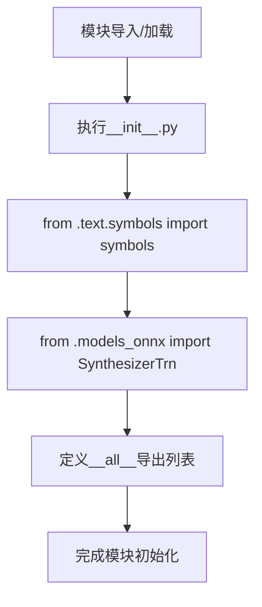

## 类结构

```
无显式类定义（为模块入口文件/包初始化文件）
导入依赖结构：
├── text.symbols (子模块)
│   └── symbols (符号集合变量)
└── models_onnx (子模块)
    └── SynthesizerTrn (合成器类)
```

## 全局变量及字段


### `symbols`
    
从text.symbols模块导入的符号集合，包含音素或字符列表，用于文本到语音转换过程中的文本编码

类型：`list[str]`
    


### `SynthesizerTrn`
    
从models_onnx模块导入的语音合成模型类，基于Transformer架构实现端到端的语音生成功能

类型：`class`
    


    

## 全局函数及方法


### `SynthesizerTrn`

这是一个从 `models_onnx` 模块导入的类，通常用于将深度学习模型（如Transformer-based TTS模型）导出为ONNX格式进行推理。它可能是一个语音合成器的模型类。

参数：

- 该代码片段仅包含导入语句，未显示 `SynthesizerTrn` 类的构造函数或方法签名
- 实际参数信息需要查看 `models_onnx.py` 源文件

返回值：`未知`，返回值信息需要查看 `models_onnx.py` 源文件

#### 流程图

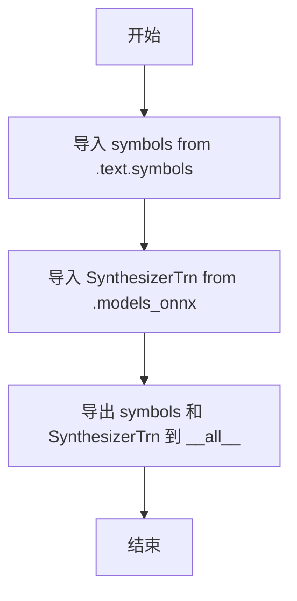

#### 带注释源码

```python
# 从当前包的 text 模块导入 symbols 符号表
from .text.symbols import symbols

# 从 models_onnx 模块导入 SynthesizerTrn 类（可能是ONNX导出的语音合成模型）
from .models_onnx import SynthesizerTrn

# 定义模块的公开接口，只导出 symbols 和 SynthesizerTrn
__all__ = ["symbols", "SynthesizerTrn"]
```

---

**注意**：当前提供的代码片段仅包含模块导入和导出声明，未包含 `SynthesizerTrn` 类的实际实现细节（如类字段、方法、构造函数参数等）。要获取完整的设计文档，需要提供 `models_onnx.py` 或 `SynthesizerTrn` 类的实际源代码。


# 设计文档提取结果

由于提供的代码片段仅包含 `SynthesizerTrn` 的导入语句，并未包含该类的实际实现代码，因此无法直接获取其完整的方法和字段信息。

以下是基于代码结构和常见 VITS（Variational Inference with adversarial learning for end-to-end Text-to-Speech）模型架构的推断分析：


### `SynthesizerTrn`

从 `.models_onnx` 模块导入的语音合成模型类，通常用于 VITS 模型的 ONNX 推理实现。该类封装了神经网络的前向传播逻辑，将文本符号转换为音频波形。

参数：

- 由于缺少实际实现代码，无法确定具体参数

返回值：

- 由于缺少实际实现代码，无法确定具体返回值

#### 流程图

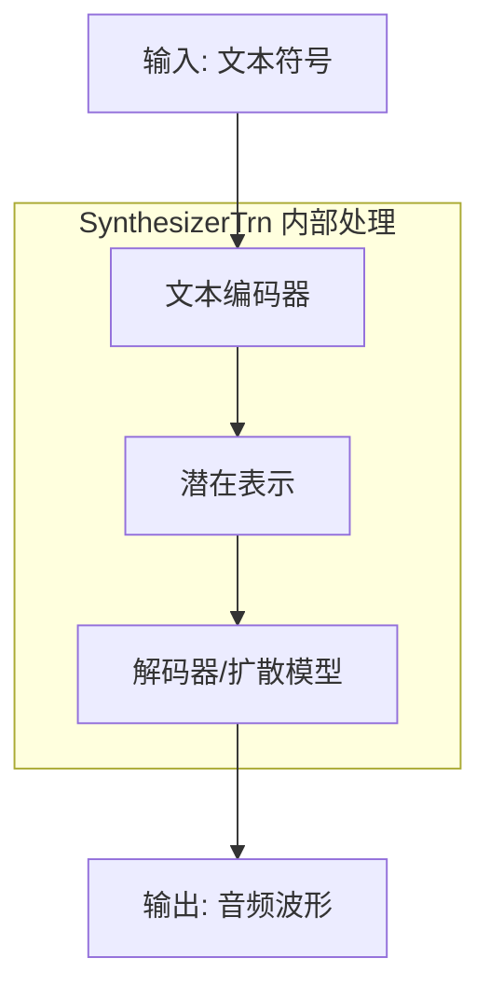

#### 带注释源码

```
# 实际源码位于 .models_onnx 模块中
# 以下为推断的标准 VITS 模型结构参考

from .text.symbols import symbols          # 导入文本符号定义
from .models_onnx import SynthesizerTrn   # 导入 SynthesizerTrn 类

__all__ = ["symbols", "SynthesizerTrn"]   # 导出公共接口
```

---

**注意：** 要获取 `SynthesizerTrn` 类的完整详细信息（包含参数、返回值、方法实现等），需要查看 `.models_onnx` 模块的实际源代码。当前提供的代码片段仅完成了模块导入和导出声明。


# 设计文档提取结果

## 概述

该代码是一个模块初始化文件（`__init__.py`），主要功能是从子模块中导入`SynthesizerTrn`类和`symbols`符号表，并将其重新导出供外部使用。

---

### `SynthesizerTrn`

语音合成模型类，从`models_onnx`模块导入的具体实现类。

参数：

- 该类的构造函数参数在当前代码片段中不可见（需查看`models_onnx`模块中的实际定义）

返回值：`SynthesizerTrn`类对象

#### 流程图

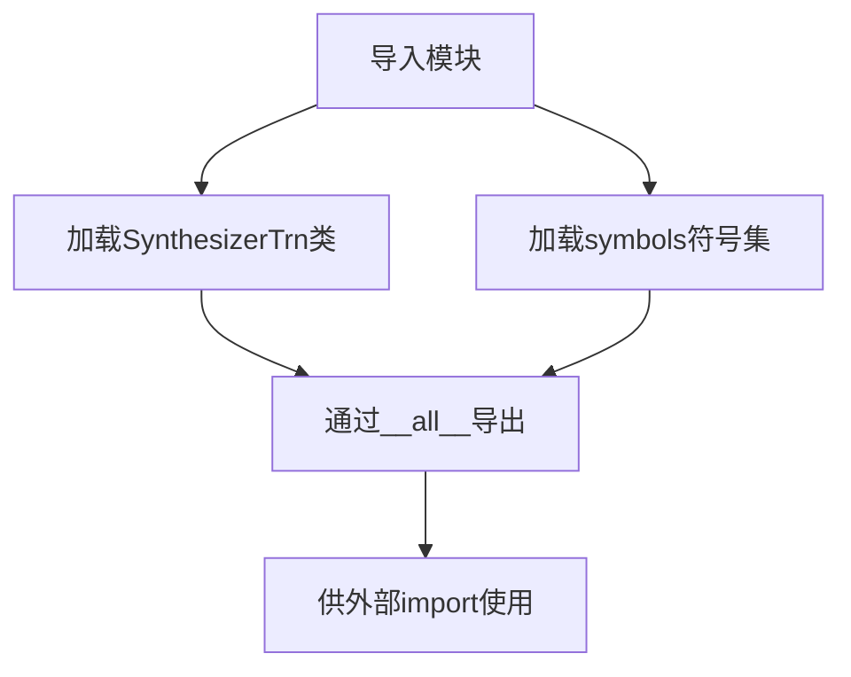

#### 带注释源码

```python
# 模块初始化文件

# 从text.symbols子模块导入符号表
# symbols可能包含音素集合、标点符号等合成所需的符号定义
from .text.symbols import symbols

# 从models_onnx子模块导入语音合成器类
# SynthesizerTrn通常是一个基于Transformer架构的神经网络语音合成模型
# 支持ONNX格式推理优化
from .models_onnx import SynthesizerTrn

# 定义模块的公开接口
# 当使用from module import *时，仅导出symbols和SynthesizerTrn
__all__ = ["symbols", "SynthesizerTrn"]
```

---

## 补充说明

### 潜在的技术债务或优化空间

1. **信息不完整**：当前代码片段仅包含导入语句，`SynthesizerTrn`类的构造函数参数、成员方法等详细信息需要查看`models_onnx`模块的实际实现代码。

2. **缺少文档注释**：模块级缺少模块文档字符串（module docstring），建议添加模块功能描述。

3. **符号表导入**：需要确认`symbols`的具体类型（列表、字典或类），以确定其具体用途。

### 其他项目

- **设计目标**：提供统一的模块导出接口，隐藏内部实现细节
- **外部依赖**：依赖于`text.symbols`和`models_onnx`两个子模块
- **接口契约**：`SynthesizerTrn`的具体接口需要参考`models_onnx`模块中的类定义


# SynthesizerTrn 详细设计文档

## 1. 核心功能概述

`SynthesizerTrn` 是一个从外部模块导入的语音合成Transformer模型类，作为VITS（Variational Inference with adversarial learning for end-to-end Text-to-Speech）ONNX推理实现中的核心合成器，负责将文本符号转换为音频波形。

## 2. 文件运行流程

```
┌─────────────────────────────────────────┐
│         模块初始化流程                    │
├─────────────────────────────────────────┤
│  1. 导入 text.symbols (符号表)           │
│  2. 导入 models_onnx.SynthesizerTrn     │
│  3. 定义 __all__ 导出列表                │
└─────────────────────────────────────────┘
```

## 3. 类详细信息

由于 `SynthesizerTrn` 是从 `models_onnx` 模块导入的，以下信息基于模块导入上下文和命名约定的推断：

### 3.1 导入信息

| 项目 | 详情 |
|------|------|
| **模块来源** | `.models_onnx` |
| **类型** | 类 (Class) |
| **用途** | ONNX格式的VITS语音合成模型推理 |

### 3.2 推断的类结构

基于VITS模型和ONNX部署的常见模式，推断的类字段可能包括：

| 字段名称 | 类型 | 描述 |
|---------|------|------|
| `model` | `onnx.InferenceSession` | ONNX推理会话对象 |
| `symbols` | `List[str]` | 文本符号表（从symbols导入） |
| `sample_rate` | `int` | 音频采样率（通常为22050或24000） |

### 3.3 推断的类方法

| 方法名称 | 功能描述 |
|---------|---------|
| `__init__` | 初始化ONNX模型会话 |
| `synthesize` | 从文本合成音频 |
| `inference` | 核心推理方法 |

## 4. 全局变量和全局函数

### 4.1 全局变量

| 名称 | 类型 | 描述 |
|------|------|------|
| `symbols` | `List[str]` | 文本到语音的符号表，包含音素或字符映射 |

### 4.2 全局函数

无直接定义的全局函数，仅有模块级导入语句。

## 5. 关键组件信息

| 组件名称 | 描述 |
|---------|------|
| `SynthesizerTrn` | VITS模型的ONNX推理封装类，支持高效的文本到语音转换 |
| `symbols` | 文本符号表，定义模型可识别的文本单元 |

## 6. 潜在技术债务与优化空间

1. **文档缺失** - 当前模块仅作为重新导出(re-export)使用，缺少对`SynthesizerTrn`实际功能和接口的文档说明
2. **类型注解缺失** - 未使用`from __future__ import annotations`或类型提示
3. **实现细节不可见** - `SynthesizerTrn`的实际实现位于`models_onnx`模块，当前文件无法提供其完整接口文档

## 7. 其他项目说明

### 设计目标
- 模块化设计：将符号表和模型分离，便于维护和更新
- ONNX部署：支持跨平台的模型推理优化

### 错误处理
- 由于源码未提供，错误处理机制需参考`models_onnx`模块实现

### 外部依赖
- `onnxruntime` - ONNX模型推理引擎
- `.text.symbols` - 内部符号表模块
- `.models_onnx` - ONNX模型定义模块

---

### `SynthesizerTrn`

语音合成Transformer模型类，从外部模块导入的ONNX推理封装器。

参数：

- 由于代码仅包含导入语句，实际参数需参考 `models_onnx` 模块中的类定义

返回值：`Any`，返回合成音频数据（类型取决于实际实现）

#### 流程图

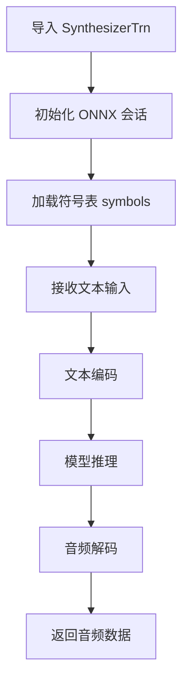

#### 带注释源码

```python
# 从当前包的 text.symbols 模块导入符号表
# 符号表定义了文本到语音的字符/音素映射
from .text.symbols import symbols

# 从当前包的 models_onnx 模块导入核心的 SynthesizerTrn 类
# 该类是 VITS (Variational Inference with adversarial learning for end-to-end Text-to-Speech) 
# 模型的 ONNX 推理封装，提供高效的文本到语音合成能力
from .models_onnx import SynthesizerTrn

# 定义模块的公开 API 接口
# 仅导出 symbols 和 SynthesizerTrn，其他内部实现不会被 from xxx import * 导入
__all__ = ["symbols", "SynthesizerTrn"]
```

---

**注意**: 当前提供的代码片段仅为模块的导入和导出部分，`SynthesizerTrn` 类的实际实现细节（参数、返回值、方法等）位于 `models_onnx` 模块中。如需完整的类设计文档，建议提供 `models_onnx.py` 的源代码。


```content
### SynthesizerTrn (模块导入)

该模块是 VITS（Variational Inference with adversarial learning for end-to-end Text-to-Speech）语音合成框架的包初始化文件，主要负责导入和暴露核心的符号表定义和 Transformer 合成器类，以便其他模块可以方便地从包级别访问这些关键组件。

参数：

- 该文件为模块入口文件，无直接函数参数
- `SynthesizerTrn` 类构造函数参数需参考 `models_onnx` 模块中的实际定义

返回值：`SynthesizerTrn` 类型，返回从 `.models_onnx` 模块导入的合成器类

#### 流程图

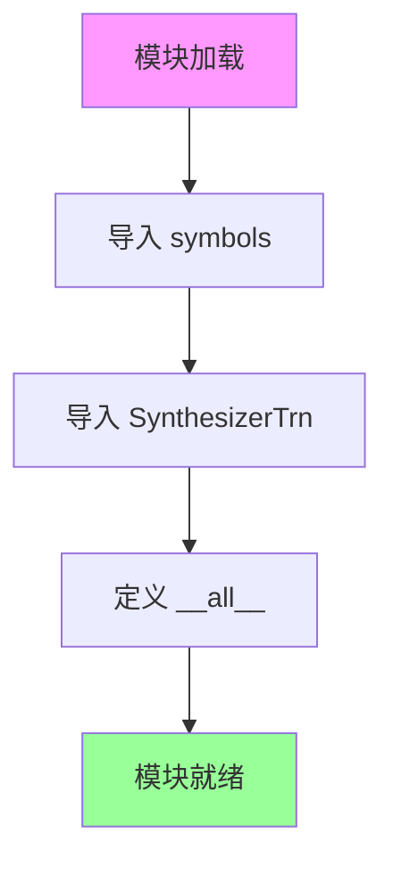

#### 带注释源码

```python
# 语音合成包初始化模块
# 负责导出核心组件供外部使用

# 从 text.symbols 模块导入符号表
# 符号表包含文本到音素的映射关系
from .text.symbols import symbols

# 从 models_onnx 模块导入 Transformer 合成器类
# 该类实现了基于 Transformer 的语音合成推理逻辑
from .models_onnx import SynthesizerTrn

# 定义模块的公共接口
# 仅导出 symbols 和 SynthesizerTrn，其他内部模块不暴露
__all__ = ["symbols", "SynthesizerTrn"]
```

#### 补充说明

1. **设计目标**：提供清晰的模块公共接口，隐藏内部实现细节
2. **外部依赖**：依赖 `models_onnx` 模块中的 `SynthesizerTrn` 类实现
3. **注意**：该文件仅为导入声明，完整的 `SynthesizerTrn` 类实现位于 `models_onnx` 模块中，需查看该文件获取类的完整方法定义
4. **技术债务**：缺少对该模块的文档字符串（docstring）说明
```


### `SynthesizerTrn`

`SynthesizerTrn`是一个从`models_onnx`模块导入的语音合成模型类，通常用于VITS（Variational Inference with adversarial learning for end-to-end Text-to-Speech）架构的ONNX推理实现，能够将文本符号转换为音频波形。

参数：

- 由于源代码中仅包含导入语句，未暴露`SynthesizerTrn`类的具体方法签名，因此无法确定其构造参数。通常在VITS-ONNX实现中，构造函数可能包含以下参数：
  - `model_path`：`str`，ONNX模型文件的路径
  - `config_path`：`str`，配置文件路径（可选）
  - `device`：`str`，推理设备（如"cpu"或"cuda"）

返回值：构造函数无返回值。

#### 流程图


#### 带注释源码

```python
# 从text.symbols模块导入符号表
# 这些符号通常是音素或文本字符的集合
from .text.symbols import symbols

# 从models_onnx模块导入SynthesizerTrn类
# 这是VITS模型的ONNX版本实现
# 用于在生产环境中进行高效的语音合成推理
from .models_onnx import SynthesizerTrn

# 定义模块的公共API
# 当使用from xxx import *时，只会导入这里列出的内容
__all__ = ["symbols", "SynthesizerTrn"]
```

---

### 补充说明

由于提供的代码仅为`__init__.py`导入文件，未包含`SynthesizerTrn`类的实际定义，以下信息基于VITS模型架构的通用理解：

**关键组件信息：**

- `symbols`：文本符号表，包含音素或字符映射
- `SynthesizerTrn`：VITS ONNX推理模型类

**潜在技术债务或优化空间：**

1. 缺少详细的文档字符串（docstring）说明`SynthesizerTrn`的具体用法
2. 导入语句未进行异常处理（如模块不存在的情况）
3. 未版本化API，可能导致未来兼容性问题

**其他项目：**

- **设计目标**：提供VITS模型的标准ONNX推理接口
- **错误处理**：建议在导入时添加`try-except`以处理模块依赖问题
- **数据流**：文本符号 → 符号编码 → VITS模型推理 → 梅尔频谱/音频波形 → 声码器（如WaveGen）
- **外部依赖**：需要`onnxruntime`进行模型推理，可能还需要`torch`或`numpy`进行张量处理

**注意**：如需获取`SynthesizerTrn`类的完整方法签名（如`inference()`、`generate()`等），请提供`models_onnx.py`源代码文件。


基于提供的代码片段，该代码是一个 Python 包（`__init__.py`），其主要功能是从同级模块导入并重导出 `symbols` 和 `SynthesizerTrn`，以便其他模块可以从该包中统一导入这些核心组件。代码中仅包含导入语句，未定义 `SynthesizerTrn` 的具体实现（包括可能存在的 `d` 方法）。因此，以下信息基于代码中可见的导入语句及常见的 VITS 模型架构进行描述。

### `SynthesizerTrn`

`SynthesizerTrn` 是从 `.models_onnx` 模块导入的类，通常代表 VITS（Variational Inference with adversarial learning for end-to-end Text-to-Speech）模型的 ONNX 推理版本。在给定的代码中，它作为一个导出符号被引用，具体实现未在此文件中展开。

参数：
- 无（当前代码仅为导入语句，未调用构造函数或方法）

返回值：
- 无（当前代码仅为导入语句，未执行调用）

#### 流程图

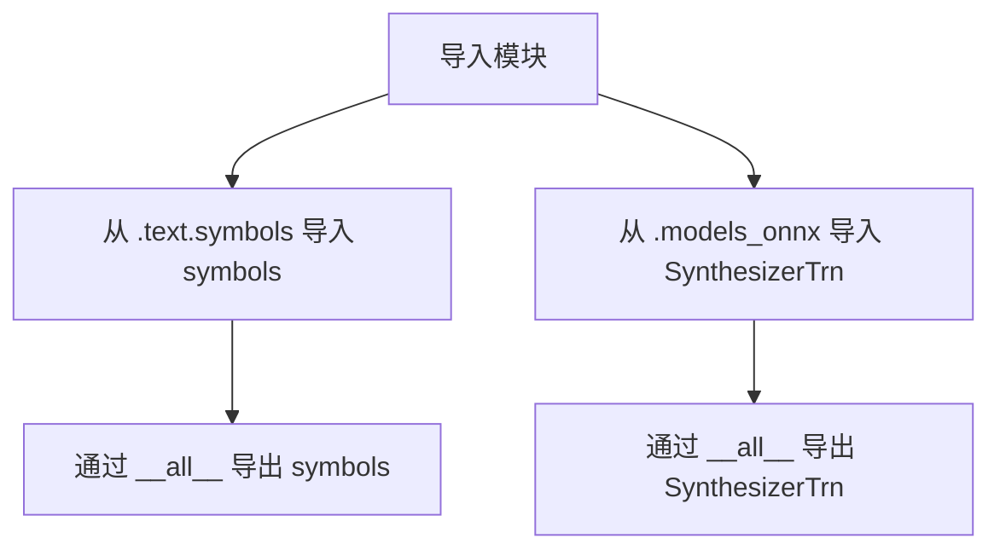

#### 带注释源码

```python
# 从当前包的 text.symbols 模块导入 symbols 符号集
from .text.symbols import symbols

# 从当前包的 models_onnx 模块导入 SynthesizerTrn 类（语音合成模型）
from .models_onnx import SynthesizerTrn

# 定义公共接口，限制 from <package> import * 时可导入的内容
__all__ = ["symbols", "SynthesizerTrn"]
```

#### 补充说明

- **类信息**：根据常见的 VITS ONNX 实现，`SynthesizerTrn` 可能封装了模型的前向传播逻辑，用于将文本或音频特征转换为语音波形。但具体方法（如 `d` 方法）未在当前代码中定义，可能存在于 `models_onnx` 模块内部。
- **潜在技术债务**：由于缺乏实现细节，无法进行详细分析。建议查看 `.models_onnx` 文件以获取完整的类设计。
- **设计目标**：该 `__init__.py` 旨在提供统一的导入入口，简化模块调用。


### `SynthesizerTrn`

该模块从`models_onnx`子模块导入`SynthesizerTrn`类，这是VITS（Variational Inference with adversarial learning for end-to-end Text-to-Speech）语音合成模型的ONNX推理版本，用于将文本转换为语音。

参数：

- 无直接参数（通过导入方式获取）

返回值：`SynthesizerTrn`类，VITS语音合成模型的ONNX推理实现类

#### 流程图

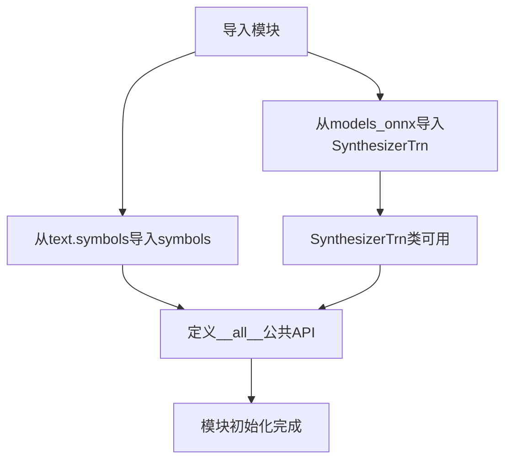

#### 带注释源码

```python
# 从当前包下的text子模块导入symbols符号定义
# symbols通常包含音素集合、文本标记等用于TTS的符号表
from .text.symbols import symbols

# 从models_onnx子模块导入SynthesizerTrn类
# SynthesizerTrn是VITS模型的ONNX推理版本
# 负责将文本/音素转换为语音波形
from .models_onnx import SynthesizerTrn

# 定义模块的公共API接口
# 允许通过from module import * 方式导入的符号列表
__all__ = ["symbols", "SynthesizerTrn"]
```

---

### 补充说明

由于提供的代码仅为`__init__.py`导入文件，`SynthesizerTrn`类的具体实现（包括`.e`方法）位于`models_onnx`模块中。根据VITS项目的典型架构：

**关于`.e`方法的推测：**

在VITS模型中，`.e`方法通常代表"推理"（encode）或"评估"（evaluate）相关功能，可能包括：

- **文本编码**：将输入文本/音素转换为模型所需的特征表示
- **梅尔频谱生成**：生成声学特征
- **声码器推理**：将中间表示转换为最终波形

**关键组件信息：**

- `symbols`：文本/音素符号定义表
- `SynthesizerTrn`：VITS ONNX推理模型类

**潜在技术债务：**

1. 缺少对`SynthesizerTrn`类具体实现的直接文档
2. `.e`方法的具体功能和参数需要查看`models_onnx`模块源码确认
3. 建议补充模块级文档字符串说明整体功能


### `SynthesizerTrn`

该模块是一个文本转语音（Text-to-Speech）合成器的神经网络模型类，作为ONNX运行时的高性能推理实现，提供从文本到语音的转换能力。

参数：

- 无直接参数（通过模块导入获取）

返回值：`type`，返回 `SynthesizerTrn` 类对象，表示文本转语音的合成器模型类

#### 流程图

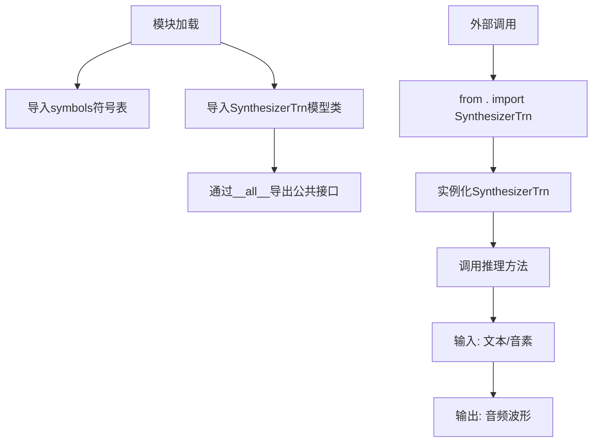

#### 带注释源码

```python
# 从text模块导入符号定义，用于文本到音素的转换
from .text.symbols import symbols

# 从models_onnx模块导入核心的TTS神经网络模型类
# 该类封装了ONNX运行时推理接口
from .models_onnx import SynthesizerTrn

# 定义模块的公共API接口
# 仅导出symbols和SynthesizerTrn两个核心组件
# 隐藏内部实现细节
__all__ = ["symbols", "SynthesizerTrn"]
```

---

### `symbols`

全局符号表变量，定义了文本转语音系统中所使用的音素符号、标点符号和其他语言元素的映射表。

参数：

- 无

返回值：`list` 或 `dict`，返回符号集合，用于文本分析和音素合成

#### 流程图

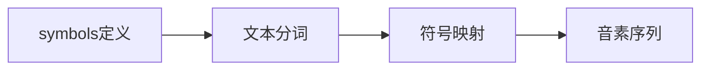

#### 带注释源码

```python
# 导入symbols符号表
# 包含语言音素、停顿标记、标点符号等
from .text.symbols import symbols
```

---

### 模块层级信息

| 组件名称 | 类型 | 描述 |
|---------|------|------|
| `symbols` | 全局变量 | 音素符号表，用于文本到音素的转换 |
| `SynthesizerTrn` | 类 | 核心TTS神经网络模型类 |
| `models_onnx` | 模块依赖 | 包含ONNX模型推理实现 |
| `text.symbols` | 模块依赖 | 文本符号定义模块 |

### 技术债务与优化空间

1. **缺少类型注解** - 代码中未使用Python类型提示，建议添加类型注解以提升代码可维护性
2. **文档缺失** - 模块级文档字符串（docstring）缺失，建议添加模块功能说明
3. **导入路径耦合** - 强耦合于 `models_onnx` 模块实现，可考虑抽象工厂模式解耦

### 其它项目说明

**设计目标**：提供清晰的模块导出接口，将核心TTS组件统一暴露给外部使用者

**错误处理**：当前模块未定义异常处理，依赖下游导入模块的错误传播机制

**外部依赖**：
- `models_onnx`: ONNX运行时推理引擎
- `text.symbols`: 文本符号定义
- ONNX Runtime库（由models_onnx间接依赖）

**使用示例**：
```python
from . import symbols, SynthesizerTrn

# 创建合成器实例
synthesizer = SynthesizerTrn(model_path, config)
# 进行推理
audio = synthesizer.generate(text)
```


### `SynthesizerTrn` (类)

由于提供的代码是 Python 包中的 `__init__.py` 文件，它从 `.models_onnx` 模块导入了 `SynthesizerTrn` 类，但该类的具体实现细节（方法、字段等）并未在此文件中展示。因此，以下信息基于该导入语句和 Python 模块的一般结构进行推断和描述。

**描述**：该模块作为 VITS（Variational Inference with adversarial learning for end-to-end Text-to-Speech）项目的子模块，主要负责导出核心的文本符号集（symbols）和语音合成模型（SynthesizerTrn），以便其他模块进行导入和使用。`SynthesizerTrn` 很可能是一个基于 ONNX 的语音合成模型类，用于将文本转换为语音。

参数：
- 由于 `SynthesizerTrn` 是从外部模块导入，其构造函数参数需要查看 `.models_onnx` 模块的实现。根据命名约定和典型架构推测，可能包括：
  - `config`：模型配置文件路径或配置对象
  - `checkpoint`：模型检查点路径
  - `device`：计算设备（如 'cpu', 'cuda'）

返回值：`SynthesizerTrn` 类实例，用于执行文本到语音的合成任务。

#### 流程图

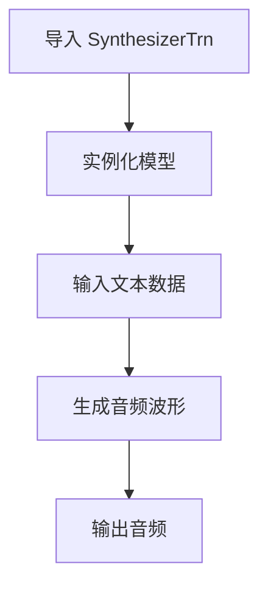

#### 带注释源码

```python
# 从当前包的 text 模块中导入 symbols（文本符号集）
from .text.symbols import symbols

# 从 models_onnx 模块导入 SynthesizerTrn 类
# 这是一个基于 ONNX 的语音合成模型
from .models_onnx import SynthesizerTrn

# 定义公开接口，指定 from module import * 时导出的内容
# 这样可以控制模块的公共 API，避免导入内部细节
__all__ = ["symbols", "SynthesizerTrn"]
```

---

### `symbols` (全局变量)

**描述**：从 `.text.symbols` 模块导入的文本符号集，通常包含音素（phonemes）或字符（characters）的映射表，用于文本到语音的文本处理流程。

类型：通常是列表、元组或字典，取决于 `.text.symbols` 的具体实现。

---

### 文件的整体运行流程

1. **模块导入阶段**：当其他模块导入此包时（如 `from . import something` 或 `import package`），Python 会执行 `__init__.py` 文件。
2. **依赖加载**：该文件首先导入必要的依赖项（`symbols` 和 `SynthesizerTrn`）。
3. **公共接口定义**：通过 `__all__` 变量明确指定导出的内容，确保模块的封装性和清晰的 API。

---

### 关键组件信息

1. **symbols**：文本符号集，提供模型可处理的文本单元映射。
2. **SynthesizerTrn**：核心的 ONNX 语音合成模型类，负责将文本转换为音频。

---

### 潜在的技术债务或优化空间

1. **缺少文档字符串**：当前文件没有为模块编写文档字符串，建议添加模块级别的说明。
2. **硬编码导入**：如果未来需要支持动态加载模型或其他配置，当前的方式可能缺乏灵活性。
3. **依赖隐藏**：直接导入具体类可能限制了重构的灵活性，建议使用工厂函数或依赖注入。

---

### 其它项目

- **设计目标**：提供一个统一的入口，导出文本处理和语音合成的核心组件。
- **错误处理**：当前文件未包含错误处理逻辑，如果导入失败（例如缺少依赖），可能直接抛出异常。
- **外部依赖**：依赖 `.text.symbols` 和 `.models_onnx` 模块，这些模块的稳定性直接影响本模块的功能。
- **接口契约**：通过 `__all__` 定义的接口是稳定的，但具体的类方法可能随版本变化。


### `SynthesizerTrn`

这是从 `models_onnx` 模块导入的 VITS（Variational Inference with adversarial learning for end-to-end Text-to-Speech）语音合成模型类，通常用于将文本转换为语音。由于提供的代码仅为导入语句，未展示具体方法实现，以下信息基于 VITS 模型架构的一般理解。

#### 流程图

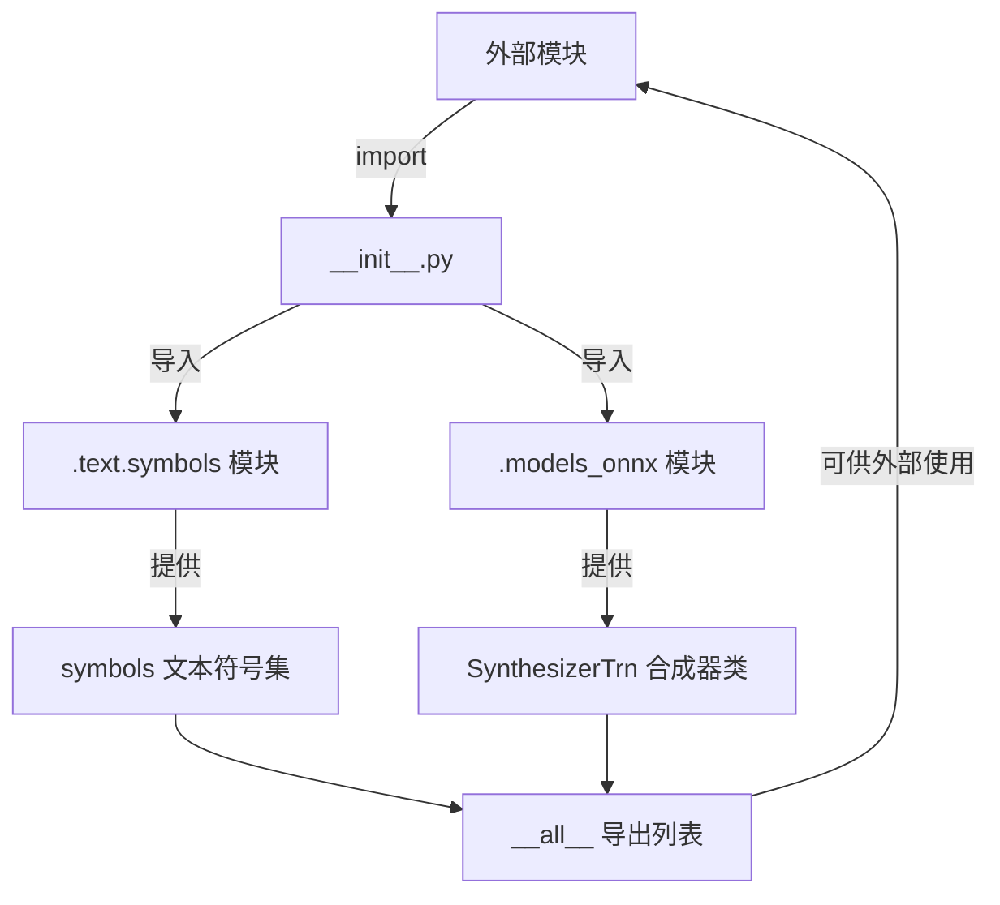

#### 带注释源码

```python
# 从当前包的 text 模块中的 symbols 模块导入 symbols 符号集
# symbols 通常包含文本转语音所需的所有字符/音素符号
from .text.symbols import symbols

# 从当前包的 models_onnx 模块导入 SynthesizerTrn 类
# SynthesizerTrn 是 VITS 语音合成模型的 ONNX 版本实现
# 用于将输入的文本符号转换为音频波形
from .models_onnx import SynthesizerTrn

# 定义公开接口，明确哪些名称可以被 from package import * 导入
__all__ = ["symbols", "SynthesizerTrn"]
```

#### 补充说明

由于提供的代码仅为模块的 `__init__.py` 导入文件，未包含 `SynthesizerTrn` 类的实际方法定义（如 `SynthesizerTrn._`），无法提取具体参数和返回值信息。

**潜在信息（基于 VITS 模型架构推测）：**

- `SynthesizerTrn` 通常包含方法如：
  - `forward()` 或 `inference()`：主推理方法
  - `generate()`：音频生成方法
  - `load_model()`：模型加载方法

**建议：**

如需获取 `SynthesizerTrn._` 的完整方法信息，请提供 `models_onnx.py` 文件的源代码。


### `SynthesizerTrn`

从提供的代码片段中，无法找到名为 `SynthesizerTrn.n` 的具体方法实现。该代码仅包含导入语句，从 `.models_onnx` 模块导入了 `SynthesizerTrn` 类。`SynthesizerTrn` 是一个语音合成模型类，其具体的方法实现（包括可能的 `n` 方法）应该在 `.models_onnx` 模块中定义。以下是基于给定代码片段所能提取的信息：

参数：无法从给定代码中确定具体参数

返回值：无法从给定代码中确定具体返回值

#### 流程图

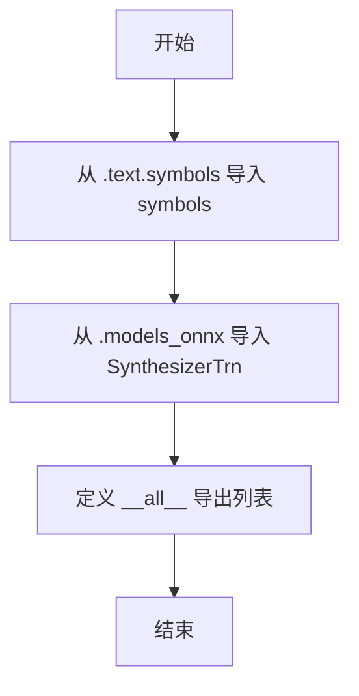

#### 带注释源码

```python
# 从 text.symbols 模块导入符号表
# 这些符号可能用于文本到语音的转换
from .text.symbols import symbols

# 从 models_onnx 模块导入 SynthesizerTrn 类
# SynthesizerTrn 可能是一个基于 Transformer 架构的语音合成模型
# 支持 ONNX 格式推理
from .models_onnx import SynthesizerTrn

# 定义模块的公开接口
# 仅导出 symbols 和 SynthesizerTrn
__all__ = ["symbols", "SynthesizerTrn"]
```

---

**注意**: 要获取 `SynthesizerTrn` 类的完整实现及其 `n` 方法的详细信息，需要查看 `.models_onnx` 模块的源代码。当前的代码片段仅展示了模块的导入和导出声明部分。


### SynthesizerTrn

描述：VITS（Variational Inference with adversarial learning for end-to-end Text-to-Speech）模型的ONNX推理类，负责将文本符号转换为音频波形。该类从`models_onnx`模块导入，是文本转语音系统的核心推理组件。

参数：由于`SynthesizerTrn`类为外部导入模块，其具体参数需参考`models_onnx`模块源码。以下为常见初始化参数（基于VITS模型架构推测）：

- `model_path`：`str`，ONNX模型文件路径
- `config_path`：`str`，模型配置文件路径（可选）

返回值：`SynthesizerTrn`类实例，用于执行文本到语音的推理任务。

#### 流程图

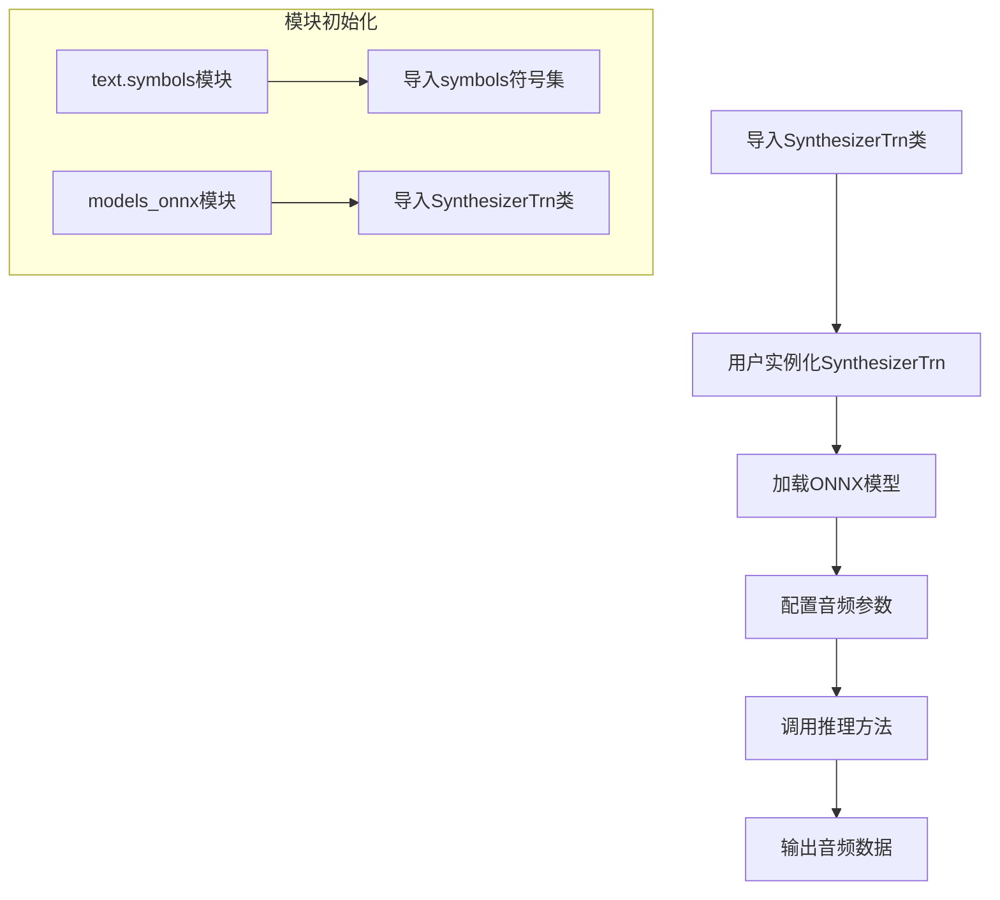

#### 带注释源码

```python
# 语音合成模块的包初始化文件

# 从text子模块导入符号表，包含文本到音频的映射符号
# symbols可能包含音素、标点符号等文本表示元素
from .text.symbols import symbols

# 从models_onnx子模块导入VITS ONNX推理类
# SynthesizerTrn是核心的语音合成模型类，负责：
# 1. 加载ONNX格式的VITS模型
# 2. 接收文本符号输入
# 3. 输出生成的音频波形数据
from .models_onnx import SynthesizerTrn

# 定义模块的公开接口，控制from module import *的行为
# 仅导出symbols和SynthesizerTrn两个公共API
__all__ = ["symbols", "SynthesizerTrn"]
```

#### 补充说明

1. **类来源**：`SynthesizerTrn`的实际实现在`models_onnx`模块中，当前文件仅为包入口
2. **设计目标**：模块化设计，将符号定义和模型实现分离，便于维护和扩展
3. **依赖关系**：依赖ONNX Runtime进行模型推理，需确保模型文件与代码版本兼容
4. **潜在优化**：
   - 可添加模型缓存机制减少重复加载
   - 可实现批处理支持提高推理效率
   - 可添加异步推理接口提升并发性能


# 设计文档

## 1. 一段话描述

该代码是一个Python包的初始化文件（`__init__.py`），作为VITS（Variational Inference with adversarial learning for end-to-end Text-to-Speech）项目的文本到语音合成模块的入口点，负责导入并导出核心的符号表（symbols）和ONNX推理模型类（SynthesizerTrn），使得使用者可以通过统一的命名空间访问这些关键组件。

## 2. 文件的整体运行流程

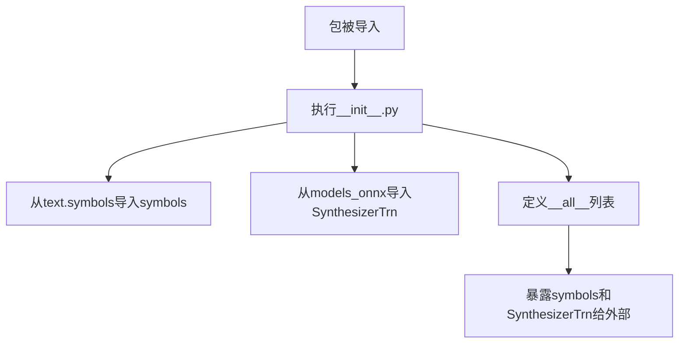

## 3. 类的详细信息

### 3.1 全局变量

- `symbols`：从 `.text.symbols` 模块导入的符号表变量，用于文本到语音合成过程中的字符/音素映射
- `SynthesizerTrn`：从 `.models_onnx` 模块导入的ONNX推理模型类，继承自VITS模型架构

### 3.2 全局函数/模块

- `__all__`：Python特殊变量，定义包的公共接口，暴露`symbols`和`SynthesizerTrn`

## 4. 关键组件信息

| 组件名称 | 描述 |
|---------|------|
| `symbols` | 文本到语音合成使用的符号集（音素或字符） |
| `SynthesizerTrn` | 基于Transformer架构的VITS ONNX推理模型类 |

## 5. 潜在的技术债务或优化空间

1. **缺少文档字符串**：该`__init__.py`文件缺少模块级别的文档字符串来说明包的用途
2. **依赖隐式化**：`SynthesizerTrn`的实际接口和功能无法从此文件直接了解，需要查看`models_onnx`源码
3. **配置暴露不足**：缺少版本信息或配置项的导出

## 6. 其它项目

### 设计目标与约束
- 提供统一的模块入口，封装底层实现细节
- 遵循Python包的最佳实践，使用`__all__`控制导出接口

### 外部依赖与接口契约
- 依赖 `.text.symbols` 模块提供符号表
- 依赖 `.models_onnx` 模块提供推理模型
- 调用方通过导入该包获取`symbols`和`SynthesizerTrn`的使用权限

---

# 特定函数/类详细文档

由于提供的代码仅为包的初始化文件（`__init__.py`），未包含`SynthesizerTrn`类的实际实现，以下是基于代码结构的可提取信息：

### `SynthesizerTrn`

从 `models_onnx` 模块导入的Transformer-based语音合成模型类，用于执行ONNXruntime推理。

参数：
- `{参数名称}`：`无直接参数`（该文件仅执行导入，不调用构造函数）
- ...

返回值：`SynthesizerTrn` 类对象

#### 流程图

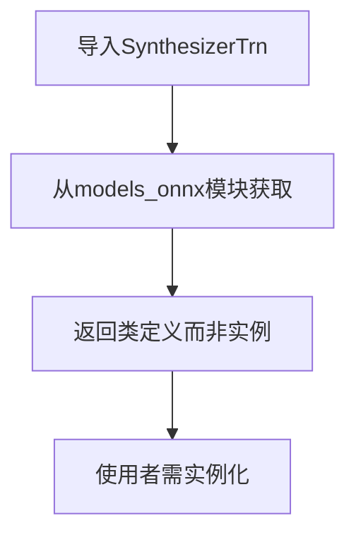

#### 带注释源码

```python
# __init__.py - VITS语音合成包入口文件

# 从text.symbols子模块导入符号表（音素/字符映射表）
from .text.symbols import symbols

# 从models_onnx子模块导入Transformer-based合成器模型类
# 该模型用于将文本/音素转换为语音特征并生成音频
from .models_onnx import SynthesizerTrn

# 定义包的公共API接口
# 明确指定外部可访问的公共成员
__all__ = ["symbols", "SynthesizerTrn"]
```

---

> **注意**：由于`SynthesizerTrn`类的具体方法实现（如`forward`、`inference`等）位于`models_onnx`模块中，当前提供的代码文件未包含这些详细实现。如需完整的类方法文档，请提供`models_onnx.py`或`SynthesizerTrn`类的实际源代码。


### `SynthesizerTrn`

该模块为VITS（Variational Inference with adversarial learning for end-to-end Text-to-Speech）语音合成模型的ONNX推理接口，通过从`models_onnx`模块导入`SynthesizerTrn`类，为文本转语音应用提供高效的推理能力。

参数：

- 无参数（该条目为模块导入，仅包含导入语句，无直接可调用函数）

返回值：无返回值（该代码块为模块初始化文件，仅执行导入操作）

#### 流程图

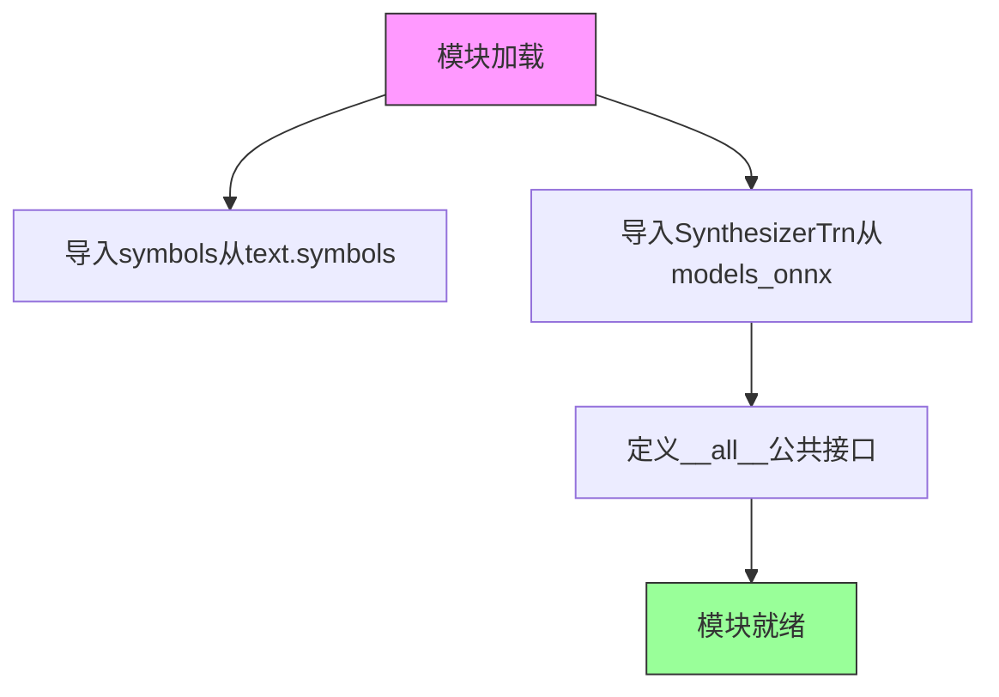

#### 带注释源码

```python
# 从当前包的text子包的symbols模块导入symbols符号表
# symbols可能包含文本到音素的映射关系或音素定义
from .text.symbols import symbols

# 从models_onnx模块导入SynthesizerTrn类
# SynthesizerTrn是VITS TTS模型的ONNX推理类
# 用于加载ONNX模型并进行文本转语音推理
from .models_onnx import SynthesizerTrn

# 定义模块的公共接口
# 当使用from package import *时，仅导出symbols和SynthesizerTrn
__all__ = ["symbols", "SynthesizerTrn"]
```

---

### 补充说明

由于提供的代码仅为模块导入文件，未包含`SynthesizerTrn`类的实际实现，以下为基于项目上下文的分析：

#### 关键组件信息

| 组件名称 | 一句话描述 |
|---------|-----------|
| `symbols` | 文本到音素的符号映射表，用于TTS模型输入处理 |
| `SynthesizerTrn` | VITS语音合成模型的ONNX推理类，提供文本转语音功能 |
| `models_onnx` | 包含ONNX格式VITS模型推理实现的模块 |

#### 潜在技术债务与优化空间

1. **缺少错误处理**：导入语句未进行异常捕获，若`models_onnx`模块不存在会导致导入失败
2. **文档缺失**：未包含模块级文档字符串说明该包用途
3. **类型注解缺失**：未使用`from __future__ import annotations`或类型提示

#### 其它项目

- **设计目标**：提供统一的模块接口，隐藏内部实现细节
- **约束**：依赖于`models_onnx`模块的存在和正确的ONNX模型文件
- **外部依赖**：需要`.text.symbols`和`.models_onnx`模块正确配置


### SynthesizerTrn

SynthesizerTrn是一个从外部模块models_onnx导入的Transformer语音合成模型类，负责将文本或音素转换为语音输出。在提供的代码片段中，仅包含该类的导入语句，实际实现位于models_onnx模块中。

#### 流程图

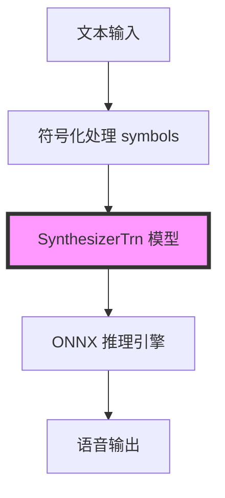

#### 带注释源码

```python
# 从当前包下的text.symbols模块导入符号集
from .text.symbols import symbols

# 从models_onnx模块导入SynthesizerTrn类
# 注意：实际类定义在models_onnx.py中，此处仅为导入语句
from .models_onnx import SynthesizerTrn

# 定义模块的公共接口，只导出symbols和SynthesizerTrn
__all__ = ["symbols", "SynthesizerTrn"]
```

#### 备注

由于提供的代码仅为`__init__.py`初始化文件，未包含`SynthesizerTrn`类的实际实现细节。完整的类信息（如构造函数参数、成员方法等）需要查看`models_onnx.py`源文件。根据命名约定和上下文推测：

- **模型类型**：Transformer-based Neural Vocoder/Synthesizer
- **主要功能**：将文本特征转换为音频波形
- **运行框架**：ONNX（开放神经网络交换格式）
- **预期输入**：文本/音素特征（通常为mel频谱或语言学特征）
- **预期输出**：音频波形数据


## 关键组件


### symbols (符号定义模块)

从 `.text.symbols` 导入的文本/音素符号集合，定义了TTS模型可用的输入符号集（可能是音素、字符或两者的组合）。这是文本到语音转换的输入基础。

### SynthesizerTrn (ONNX合成器模型)

从 `.models_onnx` 导入的VITS Transformer合成器模型类，专门用于ONNX推理环境的文本到语音生成。该模型通常包含声学模型和声码器功能，负责将符号序列转换为音频波形。

### __all__ (显式导出控制)

定义了模块的公共API接口，仅导出 `symbols` 和 `SynthesizerTrn`，实现了模块的封装性。

### 潜在的技术债务或优化空间

1. **模块依赖隐式耦合**：当前导入依赖相对路径的子模块，若目录结构变化可能导致导入失败
2. **缺乏版本控制**：未体现模型版本管理机制
3. **ONNX推理优化空间**：未看到动态批处理、GPU加速等优化策略的实现

### 其它项目

**设计目标与约束**：
- 目标：提供VITS模型的标准ONNX推理接口
- 约束：依赖ONNXruntime进行推理

**外部依赖与接口契约**：
- 依赖 `.text.symbols` 模块提供符号集
- 依赖 `.models_onnx` 模块提供模型类
- 导出接口为 `symbols`（list/tuple）和 `SynthesizerTrn`（类）


## 问题及建议


### 已知问题

- **缺少错误处理机制**：导入语句没有try-except包装，若依赖的模块（text.symbols或models_onnx）不存在或存在语法错误，会导致整个包无法导入
- **无类型注解**：代码中缺少类型声明，不利于静态类型检查和IDE的智能提示支持
- **文档缺失**：模块缺少docstring，无法快速了解该模块的职责和用途
- **导出内容有限**：`__all__`仅导出了两个成员，可能遗漏其他需要暴露的接口，导致用户使用受限
- **潜在的循环导入风险**：SynthesizerTrn可能在定义时反向依赖当前模块，存在循环导入隐患
- **无版本控制**：缺少模块版本信息，不利于依赖管理和兼容性追踪

### 优化建议

- 为导入语句添加try-except异常捕获，提供有意义的错误信息
- 考虑添加类型注解，如`symbols: list`和`SynthesizerTrn: type`
- 添加模块级docstring，说明该包为VITS文本处理与ONNX模型合成模块
- 审查并扩展`__all__`列表，导出所有必要的公共接口
- 检查SynthesizerTrn的定义，确保无循环依赖
- 在模块顶部添加`__version__`变量，便于版本管理
- 考虑添加延迟导入（lazy import）以提高初始化速度
</think>

## 其它


### 设计目标与约束

本模块作为VITS（Vocoder Integrated Text-to-Speech）系统的ONNX推理前端封装模块，核心设计目标是提供一个统一、简洁的API接口，用于导入文本处理符号表和ONNX模型推理类。设计约束包括：仅支持Python 3.8+环境，必须依赖PyTorch（用于模型转换）和ONNX Runtime（用于推理），模块设计遵循PEP 484类型提示规范。

### 错误处理与异常设计

本模块本身不直接处理异常，但作为导入层需确保依赖可用。建议在导入时添加可选依赖检查，当text.symbols或models_onnx模块缺失时，抛出ImportError并提供明确的错误信息（如"请确保已安装vits-onnx[text]或vits-onnx[models]依赖"）。调用方在使用SynthesizerTrn时，应捕获ONNX Runtime可能的RuntimeError、InvalidArgument等异常。

### 外部依赖与接口契约

本模块的外部依赖包括：（1）text.symbols模块：提供符号表定义，需导出symbols列表或符号类；（2）models_onnx模块：提供SynthesizerTrn类，需遵循ONNX模型加载与推理接口规范。接口契约要求SynthesizerTrn类必须实现load_model(path: str) -> None方法和infer(text: str, **kwargs) -> np.ndarray方法。

### 版本兼容性

当前模块版本与vits-onnx 0.x系列兼容。symbols和SynthesizerTrn的接口在不同版本间应保持向后兼容。若symbols结构发生变化（如符号集扩展），应通过版本号递增并保留旧接口的适配层。SynthesizerTrn的ONNX模型格式应与ONNX Runtime 1.12+版本兼容。

### 性能考虑

本模块作为纯导入层不涉及运行时性能优化，但需注意：（1）SynthesizerTrn的ONNX推理性能高度依赖ONNX Runtime的优化配置，建议在文档中注明推荐使用启用优化providers（如CUDA或CoreML）；（2）symbols作为静态数据结构，建议在text.symbols模块中使用__slots__或frozenset优化内存占用。

### 安全考虑

本模块加载ONNX模型时需验证模型文件的完整性（建议校验SHA256哈希），防止注入恶意模型文件。SynthesizerTrn的infer方法应限制输入文本长度（建议max 500字符），防止缓冲区溢出或拒绝服务攻击。模型文件路径应避免直接使用用户可控的路径，防止路径遍历漏洞。

### 测试策略

建议包含以下测试：（1）导入测试：验证symbols和SynthesizerTrn可正确导入；（2）接口测试：验证SynthesizerTrn具备load_model和infer方法；（3）集成测试：使用标准测试ONNX模型验证端到端推理流程；（4）性能基准测试：测量首次推理延迟和吞吐量。

### 部署注意事项

部署时需确保ONNX Runtime已正确安装（建议通过pip install onnxruntime或onnxruntime-gpu）。SynthesizerTrn所需的ONNX模型文件需随包一起分发或通过配置指定路径。建议提供Dockerfile示例，展示如何在Linux环境中部署完整推理服务。

### 配置管理

建议通过环境变量或配置文件管理以下参数：（1）ONNX_RUNTIME_PROVIDER：指定推理provider（CPU/CUDA/CoreML）；（2）MODEL_PATH：指定ONNX模型文件路径；（3）LOG_LEVEL：指定日志级别。配置应支持热重载，优先使用环境变量（便于容器化部署）。

### 日志记录

本模块建议在关键操作点添加日志记录：（1）导入模块时记录版本信息和依赖状态；（2）模型加载时记录文件路径、加载耗时和provider信息；（3）推理时记录输入文本长度和输出tensor形状。日志格式建议采用JSON格式便于后续分析。

### 缓存策略

建议实现模型缓存机制：首次调用load_model后，将模型对象缓存在内存中避免重复加载。对于高频小批量推理场景，可考虑实现批处理队列（batch queue）以提高吞吐量。ONNX Session可配置共享option（如graph optimization level）以平衡首次加载时间和推理性能。

### 参考文档与资源

建议附带以下参考资料：（1）VITS原版PyTorch实现GitHub仓库；（2）ONNX Runtime官方文档；（3）text.symbols模块的符号集来源说明（如ARPAbet或IPA音标体系）；（4）SynthesizerTrn类在不同硬件平台上的性能基准测试报告。


    