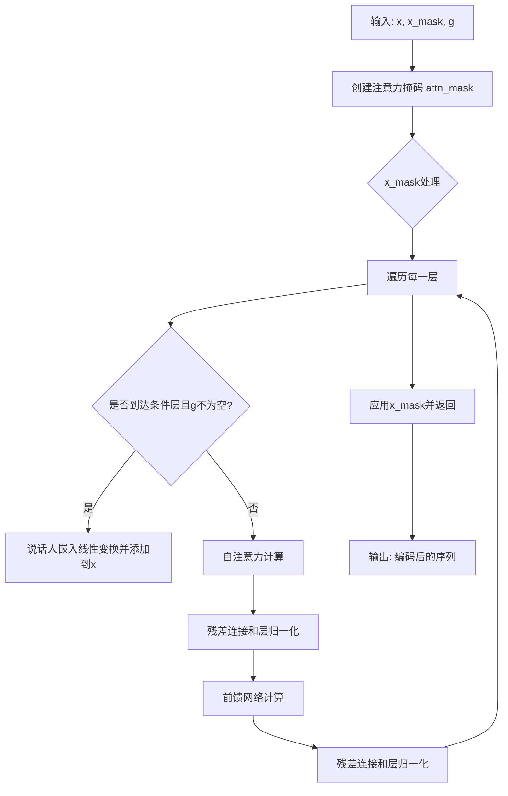
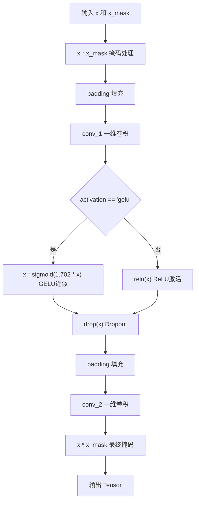
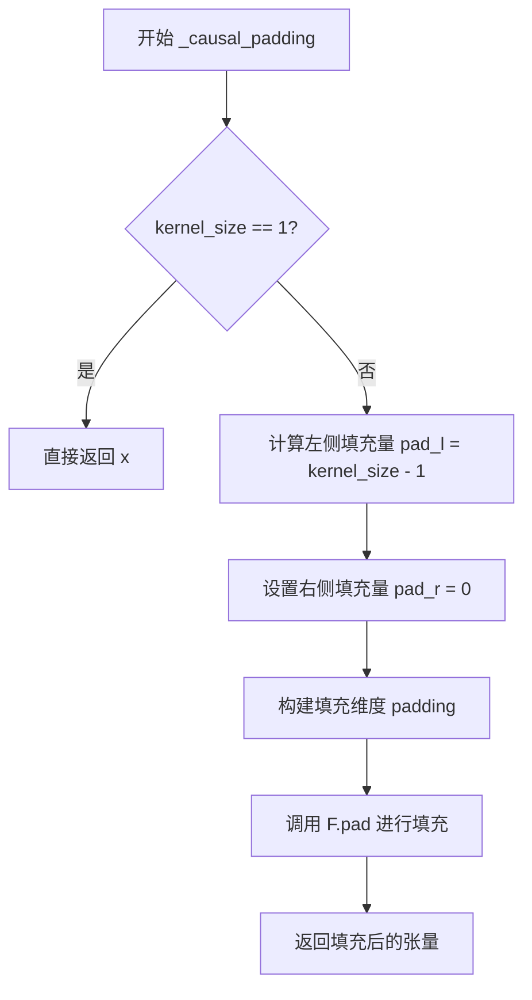

# `Bert-VITS2\onnx_modules\V240_ZH\attentions_onnx.py` 详细设计文档

这是一个Transformer风格的Encoder实现，用于语音/音频处理模型（如VITS），支持多头自注意力机制、前馈神经网络、相对位置编码和说话人嵌入条件化。

## 整体流程



## 类结构

```
nn.Module (PyTorch基类)
├── LayerNorm (层归一化)
├── Encoder (Transformer编码器)
│   ├── MultiHeadAttention (多头注意力)
│   │   ├── _matmul_with_relative_values
│   │   ├── _matmul_with_relative_keys
│   │   ├── _get_relative_embeddings
│   │   ├── _relative_position_to_absolute_position
│   │   ├── _absolute_position_to_relative_position
│   │   └── _attention_bias_proximal
│   └── FFN (前馈神经网络)
│       ├── _causal_padding
│       └── _same_padding
```

## 全局变量及字段


### `logger`
    
模块级日志记录器，用于记录调试和运行信息

类型：`logging.Logger`
    


### `math`
    
Python标准数学库，提供数学运算函数

类型：`module`
    


### `torch`
    
PyTorch主库，深度学习框架

类型：`module`
    


### `nn`
    
PyTorch神经网络模块，提供层和模型构建工具

类型：`module`
    


### `F`
    
PyTorch函数式API，提供激活函数等操作

类型：`module`
    


### `commons`
    
通用工具模块，提供辅助函数如形状转换

类型：`module`
    


### `logging`
    
Python日志模块，用于配置日志记录

类型：`module`
    


### `fused_add_tanh_sigmoid_multiply`
    
融合的tanh-sigmoid乘法函数，用于WaveNet激活

类型：`function`
    


### `LayerNorm.LayerNorm.channels`
    
输入特征通道数

类型：`int`
    


### `LayerNorm.LayerNorm.eps`
    
数值稳定性epsilon，防止除零

类型：`float`
    


### `LayerNorm.LayerNorm.gamma`
    
可学习的缩放参数

类型：`nn.Parameter`
    


### `LayerNorm.LayerNorm.beta`
    
可学习的偏移参数

类型：`nn.Parameter`
    


### `Encoder.Encoder.hidden_channels`
    
隐藏层特征通道数

类型：`int`
    


### `Encoder.Encoder.filter_channels`
    
前馈网络过滤器通道数

类型：`int`
    


### `Encoder.Encoder.n_heads`
    
多头注意力头数

类型：`int`
    


### `Encoder.Encoder.n_layers`
    
编码器层数

类型：`int`
    


### `Encoder.Encoder.kernel_size`
    
卷积核大小

类型：`int`
    


### `Encoder.Encoder.p_dropout`
    
Dropout概率

类型：`float`
    


### `Encoder.Encoder.window_size`
    
局部注意力窗口大小

类型：`int`
    


### `Encoder.Encoder.cond_layer_idx`
    
条件嵌入添加的层索引

类型：`int`
    


### `Encoder.Encoder.gin_channels`
    
说话人嵌入通道数

类型：`int`
    


### `Encoder.Encoder.spk_emb_linear`
    
说话人嵌入投影线性层

类型：`nn.Linear`
    


### `Encoder.Encoder.drop`
    
Dropout层

类型：`nn.Dropout`
    


### `Encoder.Encoder.attn_layers`
    
多头注意力层列表

类型：`nn.ModuleList`
    


### `Encoder.Encoder.norm_layers_1`
    
注意力后归一化层列表

类型：`nn.ModuleList`
    


### `Encoder.Encoder.ffn_layers`
    
前馈网络层列表

类型：`nn.ModuleList`
    


### `Encoder.Encoder.norm_layers_2`
    
前馈网络后归一化层列表

类型：`nn.ModuleList`
    


### `MultiHeadAttention.MultiHeadAttention.channels`
    
输入通道数

类型：`int`
    


### `MultiHeadAttention.MultiHeadAttention.out_channels`
    
输出通道数

类型：`int`
    


### `MultiHeadAttention.MultiHeadAttention.n_heads`
    
注意力头数

类型：`int`
    


### `MultiHeadAttention.MultiHeadAttention.p_dropout`
    
Dropout概率

类型：`float`
    


### `MultiHeadAttention.MultiHeadAttention.window_size`
    
相对位置编码窗口大小

类型：`int`
    


### `MultiHeadAttention.MultiHeadAttention.heads_share`
    
是否在头之间共享相对位置嵌入

类型：`bool`
    


### `MultiHeadAttention.MultiHeadAttention.block_length`
    
局部注意力块长度

类型：`int`
    


### `MultiHeadAttention.MultiHeadAttention.proximal_bias`
    
是否使用接近偏置

类型：`bool`
    


### `MultiHeadAttention.MultiHeadAttention.proximal_init`
    
是否使用接近初始化

类型：`bool`
    


### `MultiHeadAttention.MultiHeadAttention.k_channels`
    
每个头的通道数

类型：`int`
    


### `MultiHeadAttention.MultiHeadAttention.conv_q`
    
查询投影卷积层

类型：`nn.Conv1d`
    


### `MultiHeadAttention.MultiHeadAttention.conv_k`
    
键投影卷积层

类型：`nn.Conv1d`
    


### `MultiHeadAttention.MultiHeadAttention.conv_v`
    
值投影卷积层

类型：`nn.Conv1d`
    


### `MultiHeadAttention.MultiHeadAttention.conv_o`
    
输出投影卷积层

类型：`nn.Conv1d`
    


### `MultiHeadAttention.MultiHeadAttention.drop`
    
Dropout层

类型：`nn.Dropout`
    


### `MultiHeadAttention.MultiHeadAttention.emb_rel_k`
    
键的相对位置嵌入

类型：`nn.Parameter`
    


### `MultiHeadAttention.MultiHeadAttention.emb_rel_v`
    
值的相对位置嵌入

类型：`nn.Parameter`
    


### `MultiHeadAttention.MultiHeadAttention.attn`
    
注意力权重缓存

类型：`Tensor`
    


### `FFN.FFN.in_channels`
    
输入通道数

类型：`int`
    


### `FFN.FFN.out_channels`
    
输出通道数

类型：`int`
    


### `FFN.FFN.filter_channels`
    
中间层过滤器通道数

类型：`int`
    


### `FFN.FFN.kernel_size`
    
卷积核大小

类型：`int`
    


### `FFN.FFN.p_dropout`
    
Dropout概率

类型：`float`
    


### `FFN.FFN.activation`
    
激活函数类型

类型：`str`
    


### `FFN.FFN.causal`
    
是否为因果卷积

类型：`bool`
    


### `FFN.FFN.padding`
    
填充函数

类型：`Callable`
    


### `FFN.FFN.conv_1`
    
第一卷积层

类型：`nn.Conv1d`
    


### `FFN.FFN.conv_2`
    
第二卷积层

类型：`nn.Conv1d`
    


### `FFN.FFN.drop`
    
Dropout层

类型：`nn.Dropout`
    
    

## 全局函数及方法


### `fused_add_tanh_sigmoid_multiply`

融合的tanh-sigmoid激活函数，用于WaveNet等模型，通过将加法、tanh、sigmoid和乘法操作融合为一个高效的CUDA核，减少内存访问并提高计算效率。

参数：

- `input_a`：`Tensor`，第一个输入张量，通常为前一层的激活输出
- `input_b`：`Tensor`，第二个输入张量，通常为残差连接或条件输入
- `n_channels`：`Tensor`，通道数（整数值），用于将激活分成两半分别进行tanh和sigmoid运算

返回值：`Tensor`，返回融合激活后的输出张量，形状与输入相同

#### 流程图

```mermaid
flowchart TD
    A[input_a, input_b, n_channels] --> B[将input_a和input_b相加<br/>in_act = input_a + input_b]
    B --> C[按通道数分割激活<br/>t_act = tanh(in_act[:, :n_channels_int, :])<br/>s_act = sigmoid(in_act[:, n_channels_int:, :])]
    C --> D[将tanh和sigmoid结果相乘<br/>acts = t_act * s_act]
    D --> E[返回acts]
```

#### 带注释源码

```python
@torch.jit.script  # 使用TorchScript编译以优化执行效率
def fused_add_tanh_sigmoid_multiply(input_a, input_b, n_channels):
    """
    融合的tanh-sigmoid激活函数，用于WaveNet等模型
    
    该函数将多个操作融合为一个CUDA核：
    1. 输入相加
    2. 通道分割
    3. tanh激活
    4. sigmoid激活
    5. 逐元素乘法
    
    这种融合方式可以减少GPU内存访问和提高计算吞吐量。
    """
    # 将n_channels从Tensor转换为Python整数值
    # n_channels[0]表示获取第一个元素的值
    n_channels_int = n_channels[0]
    
    # 步骤1：将两个输入张量按元素相加
    # 这是残差连接中的典型操作
    in_act = input_a + input_b
    
    # 步骤2：对前半部分通道应用tanh激活
    # in_act[:, :n_channels_int, :] 选择batch中所有样本、所有时间步的前n_channels个通道
    t_act = torch.tanh(in_act[:, :n_channels_int, :])
    
    # 步骤3：对后半部分通道应用sigmoid激活
    # in_act[:, n_channels_int:, :] 选择剩余的通道
    s_act = torch.sigmoid(in_act[:, n_channels_int:, :])
    
    # 步骤4：将tanh和sigmoid的输出按元素相乘
    # 这模拟了门控机制，类似于LSTM中的门控
    acts = t_act * s_act
    
    # 返回融合激活后的结果
    return acts
```

---

#### 关键技术细节

| 特性 | 描述 |
|------|------|
| **优化技术** | TorchScript JIT编译，CUDA算子融合 |
| **通道分割** | 将通道数一分为二，前半做tanh，后半做sigmoid |
| **应用场景** | WaveNet、Glow-TTS等基于流的声码器 |
| **计算优势** | 减少中间结果内存占用，融合多个kernel为一次kernel launch |


### `LayerNorm.forward`

该方法实现了层归一化（Layer Normalization），对输入张量的通道维度进行归一化处理，通过学习得到的缩放参数 gamma 和偏移参数 beta 对归一化结果进行线性变换。

参数：

- `x`：`Tensor`，输入张量，形状为 (batch, channels, time) 或类似的多维张量

返回值：`Tensor`，返回归一化后的张量，形状与输入相同

#### 流程图

```mermaid
flowchart TD
    A[开始: 输入张量 x] --> B[transpose: 维度转置]
    B --> C[调用 F.layer_norm]
    C --> D[输入: 转置后的张量]
    D --> E[参数: channels, gamma, beta, eps]
    E --> F[计算均值和方差]
    F --> G[归一化: (x - mean) / sqrt(var + eps)]
    G --> H[缩放和平移: y = gamma * x + beta]
    H --> I[返回归一化后的张量]
    I --> J[transpose: 维度还原]
    J --> K[结束: 输出张量]
```

#### 带注释源码

```python
def forward(self, x):
    """
    Layer Normalization 的前向传播
    
    实现的特殊处理：
    - 由于 PyTorch 的 F.layer_norm 只对最后一个维度进行归一化
    - 而我们的通道维度在第二个位置 (batch, channels, time)
    - 所以需要先转置，将通道维度移到最后一个位置
    - 归一化后再转置回来
    
    参数:
        x: 输入张量，形状为 (batch, channels, time) 或类似多维张量
        
    返回:
        归一化后的张量，形状与输入相同
    """
    # 第一次转置：将通道维度从位置1移到最后
    # 例如: (batch, channels, time) -> (batch, time, channels)
    x = x.transpose(1, -1)
    
    # 使用 PyTorch 的 layer_norm 函数进行归一化
    # 参数:
    #   - x: 输入张量（已转置）
    #   - (self.channels,): 归一化的维度大小
    #   - self.gamma: 可学习的缩放参数（gamma），初始为全1
    #   - self.beta: 可学习的偏移参数（beta），初始为全0
    #   - self.eps: 防止除零的小常数，默认1e-5
    x = F.layer_norm(x, (self.channels,), self.gamma, self.beta, self.eps)
    
    # 第二次转置：将维度恢复到原始位置
    # 例如: (batch, time, channels) -> (batch, channels, time)
    return x.transpose(1, -1)
```


### `Encoder.forward`

该方法是 VITS2/VITS 模型中 Encoder 模型的前向传播函数，负责将输入的音频特征序列通过多层自注意力（MultiHeadAttention）和前馈网络（FFN）进行编码，支持在指定层注入说话人嵌入（speaker embedding）以实现说话人条件化。

参数：

- `x`：`Tensor`，输入的音频特征序列，形状为 `[batch, channels, time]` 或 `[batch, time, channels]`，通常为经过预处理后的 mel 频谱或音高特征
- `x_mask`：`Tensor`，用于标识有效时间步的掩码，形状为 `[batch, time]`，值为 0 或 1，用于在变长序列处理中屏蔽填充区域
- `g`：`Tensor`，可选的说话人嵌入向量，形状为 `[batch, gin_channels]`，当不为 None 时会在指定层（cond_layer_idx）通过线性变换后加入到特征中，实现说话人条件化

返回值：`Tensor`，编码后的特征序列，形状与输入 `x` 相同，经过多层自注意力和前馈网络处理后的高维表示

#### 流程图

```mermaid
flowchart TD
    A[输入 x, x_mask, g] --> B[计算注意力掩码 attn_mask = x_mask.unsqueeze2 * x_mask.unsqueeze-1]
    B --> C[x = x * x_mask 初始掩码]
    C --> D{遍历每一层 i from 0 to n_layers-1}
    D --> E{i == cond_layer_idx and g is not None?}
    E -->|Yes| F[g = spk_emb_linear.gtranspose: transpose: 1, 2]
    F --> G[x = x + g 融入说话人嵌入]
    G --> H[x = x * x_mask]
    H --> I[自注意力层: y = attn_layers[i].forwardx, x, attn_mask]
    I --> J[y = drop.y Dropout]
    J --> K[x = norm_layers_1[i].forwardx + y LayerNorm]
    K --> L[前馈网络层: y = ffn_layers[i].forwardx, x_mask]
    L --> M[y = drop.y Dropout]
    M --> N[x = norm_layers_2[i].forwardx + y LayerNorm]
    E -->|No| I
    N --> O{下一层?}
    O -->|Yes| D
    O -->|No| P[x = x * x_mask 最终掩码]
    P --> Q[返回编码后的 x]
```

#### 带注释源码

```python
def forward(self, x, x_mask, g=None):
    """
    Encoder 的前向传播函数
    
    参数:
        x: 输入特征张量 [batch, channels, time] 或 [batch, time, channels]
        x_mask: 时间步掩码 [batch, time]，1表示有效，0表示填充
        g: 可选的说话人嵌入 [batch, gin_channels]
    
    返回:
        编码后的特征张量，形状与输入x相同
    """
    # ------------------------------------------------------------------
    # 步骤1: 计算注意力掩码（attention mask）
    # 将 x_mask 扩展为二维掩码矩阵，用于自注意力计算
    # x_mask.unsqueeze(2) -> [batch, time, 1]
    # x_mask.unsqueeze(-1) -> [batch, 1, time]
    # 相乘后得到 [batch, time, time] 的掩码矩阵
    # ------------------------------------------------------------------
    attn_mask = x_mask.unsqueeze(2) * x_mask.unsqueeze(-1)
    
    # ------------------------------------------------------------------
    # 步骤2: 初始掩码处理
    # 将输入特征与掩码相乘，将填充位置置零
    # ------------------------------------------------------------------
    x = x * x_mask
    
    # ------------------------------------------------------------------
    # 步骤3: 遍历每一层 Transformer 编码器层
    # 每一层包含: 自注意力(MultiHeadAttention) + 前馈网络(FFN)
    # 采用残差连接(Residual Connection)和层归一化(LayerNorm)
    # ------------------------------------------------------------------
    for i in range(self.n_layers):
        # --------------------------------------------------------------
        # 条件嵌入层: 在指定层融入说话人嵌入
        # cond_layer_idx 默认值为 2（VITS2 论文建议）
        # --------------------------------------------------------------
        if i == self.cond_layer_idx and g is not None:
            # 说话人嵌入线性变换: [batch, gin_channels] -> [batch, hidden_channels]
            g = self.spk_emb_linear(g.transpose(1, 2))  # [b, t, g] -> [b, g, t] 转置
            g = g.transpose(1, 2)  # 转置回 [b, hidden_channels, t]
            
            # 将说话人嵌入加到当前特征上（残差连接）
            x = x + g
            
            # 再次掩码，防止说话人嵌入影响填充位置
            x = x * x_mask
        
        # --------------------------------------------------------------
        # 自注意力子层
        # 输入: x, x, attn_mask (Query, Key, Value 都使用 x)
        # 输出: 注意力加权后的特征
        # --------------------------------------------------------------
        y = self.attn_layers[i](x, x, attn_mask)
        
        # Dropout 正则化
        y = self.drop(y)
        
        # 残差连接 + LayerNorm: x = norm(x + y)
        x = self.norm_layers_1[i](x + y)
        
        # --------------------------------------------------------------
        # 前馈网络子层(FFN)
        # 两层卷积: Conv1d -> Activation -> Conv1d
        # --------------------------------------------------------------
        y = self.ffn_layers[i](x, x_mask)
        
        # Dropout 正则化
        y = self.drop(y)
        
        # 残差连接 + LayerNorm: x = norm(x + y)
        x = self.norm_layers_2[i](x + y)
    
    # ------------------------------------------------------------------
    # 步骤4: 最终输出掩码处理
    # 确保输出特征中填充位置为零
    # ------------------------------------------------------------------
    x = x * x_mask
    
    return x
```


### `MultiHeadAttention.forward`

该方法实现了多头注意力机制，接收输入序列x和上下文序列c，通过线性变换生成Query、Key、Value，计算注意力分数并应用掩码，最后输出经过多头注意力加权后的特征表示。

参数：

- `x`：`Tensor`，输入序列张量，通常作为Query的来源，形状为 [batch, channels, time]
- `c`：`Tensor`，上下文序列张量，作为Key和Value的来源，形状为 [batch, channels, time]
- `attn_mask`：`Tensor`，可选的注意力掩码，用于屏蔽特定位置的注意力，形状为 [batch, time, time]

返回值：`Tensor`，经过多头注意力计算后的输出张量，形状为 [batch, out_channels, time]

#### 流程图

```mermaid
flowchart TD
    A[输入 x, c, attn_mask] --> B[conv_q: x → Q]
    A --> C[conv_k: c → K]
    A --> D[conv_v: c → V]
    B --> E[attention函数]
    C --> E
    D --> E
    E --> F{计算注意力分数}
    F --> G[Q × K^T / sqrt(d_k)]
    G --> H{检查window_size}
    H -->|是| I[相对位置编码]
    H -->|否| J{检查proximal_bias}
    I --> J
    J -->|是| K[近邻偏置]
    J -->|否| L{检查attn_mask}
    K --> L
    L -->|有掩码| M[masked_fill应用掩码]
    L -->|无掩码| N[softmax归一化]
    M --> N
    N --> O[加权Value]
    O --> P{检查window_size}
    P -->|是| Q[相对位置值加权]
    P -->|否| R[输出reshape]
    Q --> R
    R --> S[conv_o: 输出投影]
    S --> T[返回输出Tensor]
```

#### 带注释源码

```python
def forward(self, x, c, attn_mask=None):
    """
    多头注意力前向传播
    
    参数:
        x: 输入序列，用于生成Query [batch, channels, time]
        c: 上下文序列，用于生成Key和Value [batch, channels, time]
        attn_mask: 可选的注意力掩码 [batch, time, time]
    
    返回:
        经过注意力机制处理的输出张量 [batch, out_channels, time]
    """
    # 1. 线性变换生成Q、K、V
    #    使用三个1D卷积将输入通道转换为多头注意力所需的维度
    q = self.conv_q(x)  # [batch, channels, time] -> [batch, channels, time]
    k = self.conv_k(c)  # 同样对上下文进行变换
    v = self.conv_v(c)  # 同样对上下文进行变换

    # 2. 调用attention函数计算注意力输出和注意力权重
    #    self.attn 保存注意力权重用于可视化或后续分析
    x, self.attn = self.attention(q, k, v, mask=attn_mask)

    # 3. 输出投影
    #    将多头注意力的输出通道数转换为目标输出通道数
    x = self.conv_o(x)  # [batch, channels, time] -> [batch, out_channels, time]
    return x
```


### `MultiHeadAttention.attention`

该方法实现了多头注意力机制的核心计算逻辑，接收query、key、value张量以及可选的mask，计算注意力权重并返回加权的输出值和注意力矩阵。支持相对位置编码、邻近偏置和局部块注意力等高级特性。

参数：

- `query`：`Tensor`，查询张量，形状为 [batch, channels, time]
- `key`：`Tensor`，键张量，形状为 [batch, channels, time]
- `value`：`Tensor`，值张量，形状为 [batch, channels, time]
- `mask`：`Tensor=None`，可选的注意力掩码，形状为 [batch, 1, time, time]，用于屏蔽某些位置的注意力

返回值：`Tuple[Tensor, Tensor]`，第一个为加权的输出张量 [batch, channels, time]，第二个为注意力权重矩阵 [batch, n_heads, query_time, key_time]

#### 流程图

```mermaid
flowchart TD
    A[开始 attention] --> B[reshape query/key/value]
    B --> C[batch, n_heads, k_channels, time]
    C --> D[计算原始注意力分数: query × key^T / sqrt(k_channels)]
    D --> E{是否使用相对位置编码?}
    E -->|是| F[计算相对位置logits]
    F --> G[将相对位置logits转换为绝对位置]
    G --> H[叠加到原始分数]
    H --> I
    E -->|否| I
    I --> J{是否使用proximal_bias?}
    J -->|是| K[添加邻近位置偏置]
    K --> L
    J -->|否| L
    L --> M{是否提供mask?}
    M -->|是| N[masked_fill将mask为0的位置设为-1e4]
    N --> O
    M -->|否| O
    O --> P{是否使用局部块注意力?}
    P -->|是| Q[创建块掩码: triu + tril]
    Q --> R[masked_fill块外位置设为-1e4]
    R --> S
    P -->|否| S
    S --> T[Softmax归一化]
    T --> U[Dropout]
    U --> V[计算输出: attention × value]
    V --> W{使用相对位置编码?}
    W -->|是| X[计算相对注意力权重]
    X --> Y[获取value相对位置嵌入]
    Y --> Z[叠加相对值到输出]
    Z --> AA
    W -->|否| AA
    AA --> BB[reshape输出: [batch, channels, time]]
    BB --> CC[返回 output, p_attn]
```

#### 带注释源码

```python
def attention(self, query, key, value, mask=None):
    # 将query/key/value从[b, d, t] reshape为[b, n_h, t, d_k]
    # b=batch, d=channels, t=time, n_h=n_heads, d_k=k_channels
    b, d, t_s, t_t = (*key.size(), query.size(2))
    query = query.view(b, self.n_heads, self.k_channels, t_t).transpose(2, 3)
    key = key.view(b, self.n_heads, self.k_channels, t_s).transpose(2, 3)
    value = value.view(b, self.n_heads, self.k_channels, t_s).transpose(2, 3)

    # 计算注意力分数: query × key^T / sqrt(d_k)，缩放点积注意力
    scores = torch.matmul(query / math.sqrt(self.k_channels), key.transpose(-2, -1))
    
    # 如果使用相对位置编码（window_size不为None）
    if self.window_size is not None:
        # 验证必须是自注意力（序列长度相同）
        assert (
            t_s == t_t
        ), "Relative attention is only available for self-attention."
        # 获取相对位置嵌入
        key_relative_embeddings = self._get_relative_embeddings(self.emb_rel_k, t_s)
        # 计算query与相对key的乘法
        rel_logits = self._matmul_with_relative_keys(
            query / math.sqrt(self.k_channels), key_relative_embeddings
        )
        # 将相对位置logits转换为绝对位置表示
        scores_local = self._relative_position_to_absolute_position(rel_logits)
        # 叠加相对位置注意力分数
        scores = scores + scores_local
    
    # 如果使用邻近偏置（鼓励关注邻近位置）
    if self.proximal_bias:
        assert t_s == t_t, "Proximal bias is only available for self-attention."
        # 添加基于距离的log偏置
        scores = scores + self._attention_bias_proximal(t_s).to(
            device=scores.device, dtype=scores.dtype
        )
    
    # 应用mask（如果提供）
    if mask is not None:
        # 将mask为0的位置设为极小值，使其在softmax后接近0
        scores = scores.masked_fill(mask == 0, -1e4)
        # 如果使用局部块注意力（限制注意力跨度）
        if self.block_length is not None:
            assert (
                t_s == t_t
            ), "Local attention is only available for self-attention."
            # 创建块对角掩码：上三角和下三角组合
            block_mask = (
                torch.ones_like(scores)
                .triu(-self.block_length)
                .tril(self.block_length)
            )
            scores = scores.masked_fill(block_mask == 0, -1e4)
    
    # softmax归一化得到注意力权重 [b, n_h, t_t, t_s]
    p_attn = F.softmax(scores, dim=-1)
    # dropout正则化
    p_attn = self.drop(p_attn)
    
    # 计算输出：注意力权重 × value
    output = torch.matmul(p_attn, value)
    
    # 如果使用相对位置编码，还需要加上value的相对位置信息
    if self.window_size is not None:
        # 将注意力权重转换为相对位置表示
        relative_weights = self._absolute_position_to_relative_position(p_attn)
        # 获取value的相对位置嵌入
        value_relative_embeddings = self._get_relative_embeddings(
            self.emb_rel_v, t_s
        )
        # 叠加相对value
        output = output + self._matmul_with_relative_values(
            relative_weights, value_relative_embeddings
        )
    
    # 最终reshape: [b, n_h, t_t, d_k] -> [b, d, t_t]
    output = (
        output.transpose(2, 3).contiguous().view(b, d, t_t)
    )
    return output, p_attn
```

#### 关键组件信息

| 组件名称 | 一句话描述 |
|---------|-----------|
| `k_channels` | 每个注意力头的通道数，等于总通道数除以头数 |
| `conv_q/k/v/o` | 用于生成query、key、value和输出的1D卷积层 |
| `emb_rel_k/v` | 相对位置编码的可学习嵌入表 |
| `attn` | 保存上一次计算的注意力权重，用于可视化或调试 |
| `window_size` | 相对注意力窗口大小，控制感受野 |
| `block_length` | 局部块注意力的大小限制 |

#### 潜在的技术债务或优化空间

1. **重复计算**：query和key在除法缩放时重复计算了`1/sqrt(k_channels)`，可以预先计算该缩放因子
2. **Mask处理效率**：多次调用`masked_fill`会产生中间张量，可以考虑合并操作或使用更高效的索引方式
3. **相对位置编码**：`_get_relative_embeddings`方法中包含条件分支和Pad操作，可在forward前预处理
4. **内存占用**：注意力矩阵`p_attn`的形状为`[batch, n_heads, t, t]`，长序列时会占用大量显存，可考虑分块计算或使用闪光注意力(Flash Attention)
5. **硬编码缩放因子**：-1e4的mask填充值是硬编码的，可考虑作为可配置参数

#### 其它项目

**设计目标与约束**：
- 支持自注意力(t_s == t_t)和交叉注意力(t_s != t_t)
- 兼容相对位置编码和绝对位置编码
- 通过window_size和block_length支持局部注意力

**错误处理与异常设计**：
- 使用assert语句验证自注意力约束条件
- 相对位置编码仅在自注意力时可用
- proximal_bias仅在自注意力时可用
- 局部块注意力仅在自注意力时可用

**数据流与状态机**：
- 输入：经过卷积投影的query/key/value
- 处理流程：reshape → 计算分数 → 应用偏置 → 应用mask → softmax → 加权求和 → reshape
- 输出：加权的value向量和注意力权重矩阵
- 状态：保存attn权重供外部访问

**外部依赖与接口契约**：
- 依赖`torch`和`torch.nn.functional`
- `forward`方法调用`attention`方法，两者接口相似但attention返回tuple
- 依赖`commons.convert_pad_shape`处理padding形状
- 返回的p_attn可供可视化或分析注意力模式


### `MultiHeadAttention._matmul_with_relative_values`

该方法用于计算相对位置注意力机制中的值（values）部分。它接收相对注意力权重和相对位置的值嵌入，通过矩阵乘法将两者结合，生成带有相对位置偏移信息的注意力输出张量。

参数：

- `x`：`Tensor`，形状为 `[b, h, l, m]`，其中 b 表示 batch size，h 表示头数，l 表示序列长度，m 表示相对位置范围（2*window_size+1），代表相对注意力权重矩阵
- `y`：`Tensor`，形状为 `[h or 1, m, d]`，其中 h 或 1 表示头数（当 heads_share=True 时为 1，否则为 n_heads），m 表示相对位置范围，d 表示每个头的通道数（k_channels），代表可学习的相对位置值嵌入

返回值：`Tensor`，形状为 `[b, h, l, d]`，包含相对位置信息的注意力输出

#### 流程图

```mermaid
flowchart TD
    A[开始: _matmul_with_relative_values] --> B[输入 x: 相对注意力权重 b, h, l, m]
    B --> C[输入 y: 相对位置值嵌入 h_or_1, m, d]
    C --> D{y.unsqueeze(0) - 扩展维度}
    D --> E[在第0维添加批次维度]
    E --> F[形状变换: h_or_1, m, d → 1, h_or_1, m, d]
    F --> G[torch.matmul: 矩阵乘法]
    G --> H[x @ y.unsqueeze(0)]
    H --> I[计算结果 ret: b, h, l, d]
    I --> J[返回 ret]
```

#### 带注释源码

```python
def _matmul_with_relative_values(self, x, y):
    """
    执行相对位置注意力机制中的值（value）矩阵乘法运算
    
    参数:
        x: 相对注意力权重张量，形状 [batch_size, n_heads, query_len, relative_position_range]
           即 [b, h, l, m]，其中:
           - b: batch size（批次大小）
           - h: 注意力头数
           - l: 查询序列长度
           - m: 相对位置范围（通常为 2*window_size+1）
        y: 相对位置的值嵌入张量，形状 [n_heads or 1, relative_position_range, k_channels]
           即 [h or 1, m, d]，其中:
           - h or 1: 头数（当 heads_share=True 时为1，否则为 n_heads）
           - m: 相对位置范围
           - d: 每个头的通道数（k_channels = channels // n_heads）
    
    返回值:
        ret: 相对位置注意力输出张量，形状 [batch_size, n_heads, query_len, k_channels]
             即 [b, h, l, d]
    
    作用说明:
        此方法是相对位置编码注意力机制的核心组成部分。在计算注意力时：
        1. 标准的注意力机制只考虑 query 和 key 之间的相似度
        2. 相对位置注意力额外考虑了查询和键之间的相对位置偏移
        3. y 存储了每个相对位置偏移对应的可学习值向量
        4. x 是已经计算好的相对位置权重（通过 _absolute_position_to_relative_position 得到）
        5. 该方法将相对位置权重与对应的值向量相乘，得到最终的注意力贡献
    """
    # 使用 torch.matmul 进行矩阵乘法
    # x 形状: [b, h, l, m]
    # y.unsqueeze(0) 形状: [1, h_or_1, m, d]
    # 注意: 当 heads_share=True 时，y 的第一维为1，会自动广播到 h
    # 矩阵乘法规则: [b, h, l, m] @ [1, h, m, d] → [b, h, l, d]
    ret = torch.matmul(x, y.unsqueeze(0))
    
    # 返回结果，形状为 [b, h, l, d]
    return ret
```


### `MultiHeadAttention._matmul_with_relative_keys`

该方法实现了相对位置编码中的键（keys）矩阵乘法运算，用于在多头注意力机制中计算查询与相对位置嵌入键之间的注意力分数。

参数：

- `x`：`Tensor`，形状为 `[b, h, l, d]`，其中 b 是批次大小，h 是头数，l 是序列长度，d 是每个头的维度。表示经过缩放的查询（query）张量。
- `y`：`Tensor`，形状为 `[h or 1, m, d]`，其中 h 是头数（或共享时为 1），m 是相对位置的范围（通常为 2*window_size+1），d 是每个头的维度。表示相对位置编码的键嵌入。

返回值：`Tensor`，形状为 `[b, h, l, m]`，返回查询与相对位置键的矩阵乘法结果，用于后续计算相对位置注意力分数。

#### 流程图

```mermaid
flowchart TD
    A[输入 x: Tensor<br/>形状 [b, h, l, d]] --> B[输入 y: Tensor<br/>形状 [h or 1, m, d]]
    B --> C[对 y 进行 unsqueeze(0)<br/>形状变为 [1, h or 1, m, d]]
    C --> D[对 y 进行 transpose(-2, -1)<br/>形状变为 [1, h or 1, d, m]]
    D --> E[torch.matmul(x, y_transposed)<br/>[b, h, l, d] × [1, h or 1, d, m]]
    E --> F[广播机制处理<br/>输出形状 [b, h, l, m]]
    F --> G[返回: Tensor<br/>形状 [b, h, l, m]]
```

#### 带注释源码

```python
def _matmul_with_relative_keys(self, x, y):
    """
    计算查询与相对位置键之间的矩阵乘法
    
    参数:
        x: [b, h, l, d] - 经过缩放的查询张量
           b=批次大小, h=头数, l=序列长度, d=每头维度
        y: [h or 1, m, d] - 相对位置编码的键嵌入
           h=头数(heads_share=True时为1), m=相对位置范围, d=每头维度
    返回:
        ret: [b, h, l, m] - 矩阵乘法结果
    """
    # 对 y 在第 0 维度增加一个批次维度，用于广播
    # y 形状: [h, m, d] -> [1, h, m, d]
    # 如果 y 形状本身是 [1, m, d]，则保持 [1, m, d]
    ret = torch.matmul(x, y.unsqueeze(0).transpose(-2, -1))
    # 解释:
    # 1. y.unsqueeze(0): 在最前面插入批次维度，形状从 [h, m, d] 变为 [1, h, m, d]
    # 2. .transpose(-2, -1): 交换最后两个维度，将 [1, h, m, d] 变为 [1, h, d, m]
    # 3. torch.matmul(x, y_transposed): 
    #    x 形状 [b, h, l, d] 与 y_transposed 形状 [1, h, d, m] 进行矩阵乘法
    #    结果通过广播机制得到形状 [b, h, l, m]
    return ret
```

#### 技术说明

该方法是相对位置注意力机制的核心组件，其工作原理如下：

1. **输入准备**：查询张量 `x` 来自注意力计算的中间结果，已经除以 `sqrt(k_channels)` 进行缩放；`y` 是预定义的相对位置嵌入矩阵。

2. **维度变换**：通过 `unsqueeze(0)` 为 `y` 添加批次维度以支持广播，通过 `transpose(-2, -1)` 将键维度移到最后，以便进行矩阵乘法。

3. **矩阵乘法**：使用 `torch.matmul` 计算查询与相对位置键的相似度，结果形状 `[b, h, l, m]` 表示每个批次、每个头、每个序列位置对每个相对位置偏移的注意力分数。


### `MultiHeadAttention._get_relative_embeddings`

该方法用于获取相对位置嵌入（relative position embeddings），根据当前序列长度从预定义的相对嵌入中提取或填充相应的嵌入向量，以支持相对位置注意力机制。

参数：

- `relative_embeddings`：`Tensor`，形状为 `[n_heads_rel, 2*window_size+1, k_channels]` 的相对位置嵌入参数，包含窗口大小范围内的相对位置编码
- `length`：`int`，当前序列的时间步长，用于确定需要提取的嵌入范围

返回值：`Tensor`，形状为 `[n_heads_rel, 2*length-1, k_channels]` 的相对位置嵌入 tensor，用于后续相对位置注意力计算

#### 流程图

```mermaid
flowchart TD
    A[开始] --> B[计算 max_relative_position = 2 * window_size + 1]
    B --> C[计算 pad_length = max(length - window_size - 1, 0)]
    C --> D[计算 slice_start_position = max(window_size + 1 - length, 0)]
    D --> E[计算 slice_end_position = slice_start_position + 2*length - 1]
    E --> F{pad_length > 0?}
    F -->|是| G[使用 F.pad 填充 relative_embeddings 两侧]
    F -->|否| H[直接使用原始 relative_embeddings]
    G --> I[得到 padded_relative_embeddings]
    H --> I
    I --> J[切片: padded_relative_embeddings[:, slice_start_position:slice_end_position]]
    J --> K[返回 used_relative_embeddings]
```

#### 带注释源码

```python
def _get_relative_embeddings(self, relative_embeddings, length):
    """获取用于当前序列长度的相对位置嵌入
    
    Args:
        relative_embeddings: 预定义的相对位置嵌入，形状为 [n_heads_rel, 2*window_size+1, k_channels]
        length: 当前序列的时间步长
    
    Returns:
        切片后的相对嵌入，形状为 [n_heads_rel, 2*length-1, k_channels]
    """
    # 计算最大相对位置范围（窗口大小相关的固定范围）
    max_relative_position = 2 * self.window_size + 1
    
    # 计算需要的填充长度：当序列长度超过window_size+1时需要padding
    # 公式确保在序列长度小于等于window_size+1时不需要padding
    pad_length = max(length - (self.window_size + 1), 0)
    
    # 计算切片起始位置：当序列长度小于window_size+1时，需要从embedding中截取对应部分
    # 这确保了即使序列较短也能获取正确的相对位置编码
    slice_start_position = max((self.window_size + 1) - length, 0)
    
    # 计算切片结束位置：总共需要 2*length-1 个位置编码
    # 对应从 -(length-1) 到 +(length-1) 的相对位置范围
    slice_end_position = slice_start_position + 2 * length - 1
    
    # 根据是否需要填充选择不同的处理路径
    if pad_length > 0:
        # 需要填充时，在第二个维度（相对位置维度）的两侧各填充 pad_length 个位置
        # 使用 commons.convert_pad_shape 将填充参数转换为适配 F.pad 的格式
        padded_relative_embeddings = F.pad(
            relative_embeddings,
            commons.convert_pad_shape([[0, 0], [pad_length, pad_length], [0, 0]]),
        )
    else:
        # 不需要填充时，直接使用原始的相对嵌入
        padded_relative_embeddings = relative_embeddings
    
    # 从填充后的嵌入中切片出需要使用的相对位置编码
    # 结果形状为 [n_heads_rel, 2*length-1, k_channels]
    used_relative_embeddings = padded_relative_embeddings[
        :, slice_start_position:slice_end_position
    ]
    return used_relative_embeddings
```


### `MultiHeadAttention._relative_position_to_absolute_position`

该方法用于将相对位置编码（Relative Position Encoding）转换为绝对位置编码（Absolute Position Encoding）。在Transformer的多头注意力机制中，相对位置编码能够捕捉序列元素之间的相对距离信息，但在计算注意力分数时需要转换为绝对位置索引。该方法通过填充（padding）、形状重塑（reshape）和切片操作，将形状为`[batch, heads, length, 2*length-1]`的相对位置张量转换为形状为`[batch, heads, length, length]`的绝对位置张量。

参数：

- `self`：MultiHeadAttention类的实例，包含多头注意力的配置参数
- `x`：`torch.Tensor`，形状为`[batch, heads, length, 2*length-1]`的相对位置编码张量，其中batch为批量大小，heads为注意力头数，length为序列长度，2*length-1为相对位置的可能范围

返回值：`torch.Tensor`，形状为`[batch, heads, length, length]`的绝对位置编码张量，表示每个位置对其他所有位置的绝对位置关系

#### 流程图

```mermaid
flowchart TD
    A[输入 x: batch×heads×length×2*length-1] --> B[获取张量维度: batch, heads, length, _]
    B --> C[在最后维度填充1列零<br/>F.pad with [0,1] on dim=-1]
    C --> D[展平为2D张量<br/>view to batch×heads×length*2*length]
    D --> E[在末尾填充length-1个零<br/>F.pad with [0, length-1] on last dim]
    E --> F[重塑为4D张量<br/>view to batch×heads×length+1×2*length-1]
    F --> G[切片提取有效区域<br/>:length, length-1:]
    G --> H[输出: batch×heads×length×length]
```

#### 带注释源码

```python
def _relative_position_to_absolute_position(self, x):
    """
    将相对位置编码转换为绝对位置编码
    
    输入参数:
        x: 张量，形状为 [batch, heads, length, 2*length-1]
           表示batch个样本、heads个注意力头、length长度的序列，
           以及每个位置相对于其他所有位置的编码（范围为2*length-1）
    
    返回值:
        ret: 张量，形状为 [batch, heads, length, length]
             表示每个位置相对于其他所有位置的绝对位置编码
    
    转换原理:
        相对位置编码通过在键值对之间添加相对位置偏差来工作。
        为了在注意力计算中使用，需要将相对位置索引转换为绝对位置索引。
        这通过以下步骤实现：
        1. 在最后一维添加填充以便于后续的reshape操作
        2. 将张量展平并进行额外的填充
        3. 重塑张量并切片出正确的绝对位置编码
    """
    # 获取输入张量的维度信息
    batch, heads, length, _ = x.size()
    
    # 步骤1: 在最后一维（相对位置维度）的末尾添加1列零
    # 形状从 [b, h, l, 2*l-1] 变为 [b, h, l, 2*l]
    # 这样可以使得后续操作更方便地处理边界情况
    x = F.pad(x, commons.convert_pad_shape([[0, 0], [0, 0], [0, 0], [0, 1]]))
    
    # 步骤2: 展平张量以便进行矩阵操作
    # 形状从 [b, h, l, 2*l] 变为 [b, h, l*2*l]
    x_flat = x.view([batch, heads, length * 2 * length])
    
    # 在末尾添加填充，使长度从 l*2*l 增加到 l*2*l + (l-1)
    # 这样可以使总长度符合 (length+1) * (2*length-1) 的模式
    x_flat = F.pad(
        x_flat, commons.convert_pad_shape([[0, 0], [0, 0], [0, length - 1]])
    )
    
    # 步骤3: 重塑为 [b, h, l+1, 2*l-1] 的形状
    # 然后切片：取前length行，从length-1列开始到末尾
    # 最终得到形状 [b, h, l, l] 的绝对位置编码
    x_final = x_flat.view([batch, heads, length + 1, 2 * length - 1])[
        :, :, :length, length - 1 :
    ]
    
    return x_final
```


### `MultiHeadAttention._absolute_position_to_relative_position`

将绝对位置注意力权重转换为相对位置注意力权重，用于相对位置编码。在注意力机制中，该方法将形状为 `[batch, heads, length, length]` 的绝对位置注意力矩阵转换为形状为 `[batch, heads, length, 2*length-1]` 的相对位置表示，以支持相对位置编码。

参数：

- `self`：隐含参数，`MultiHeadAttention` 实例，类的实例方法本身
- `x`：`Tensor`，输入张量，形状为 `[batch, heads, length, length]`，表示绝对位置注意力权重

返回值：`Tensor`，输出张量，形状为 `[batch, heads, length, 2*length-1]`，表示相对位置注意力权重

#### 流程图

```mermaid
flowchart TD
    A[开始] --> B[输入 x: Tensor, shape [b, h, l, l]]
    B --> C[提取 batch, heads, length]
    C --> D[在最后维度 pad length-1 个零]
    D --> E[展平为 x_flat]
    E --> F[在开头 pad length 个零]
    F --> G[reshape 为 [b, h, l, 2*l]]
    G --> H[切片去除第一个通道]
    H --> I[输出: Tensor, shape [b, h, l, 2*l-1]]
    I --> J[结束]
```

#### 带注释源码

```python
def _absolute_position_to_relative_position(self, x):
    """
    将绝对位置注意力权重转换为相对位置注意力权重。

    参数:
        x (Tensor): 输入张量，形状为 [batch, heads, length, length]

    返回:
        Tensor: 输出张量，形状为 [batch, heads, length, 2*length-1]
    """
    # 获取输入张量的维度信息
    batch, heads, length, _ = x.size()

    # 步骤1：沿最后一个维度（列）填充 length-1 个零
    # 填充后形状从 [b, h, l, l] 变为 [b, h, l, l+length-1]
    x = F.pad(
        x, commons.convert_pad_shape([[0, 0], [0, 0], [0, 0], [0, length - 1]])
    )

    # 步骤2：展平张量以进行后续处理
    # 展平后形状变为 [b, h, l*l + l*(length-1)] = [b, h, l*(2*l-1)]
    x_flat = x.view([batch, heads, length**2 + length * (length - 1)])

    # 步骤3：在展平后的张量开头填充 length 个零
    # 这一步是为了在reshape时产生偏移，从而实现绝对位置到相对位置的转换
    # 填充后形状变为 [b, h, l*(2*l-1) + length]
    x_flat = F.pad(x_flat, commons.convert_pad_shape([[0, 0], [0, 0], [length, 0]]))

    # 步骤4：reshape 回 [b, h, l, 2*l] 并切片去除第一个通道
    # 最终形状为 [b, h, l, 2*l-1]
    x_final = x_flat.view([batch, heads, length, 2 * length])[:, :, :, 1:]
    return x_final
```


### `MultiHeadAttention._attention_bias_proximal`

该方法计算自注意力的接近偏置（proximal bias），通过根据位置距离施加惩罚来鼓励模型关注相近的位置。这是Transformer中相对位置编码的一种变体，旨在增强局部注意力的表达能力。

参数：

- `self`：类实例本身的隐式引用
- `length`：`int`，整数标量，表示序列长度

返回值：`Tensor`，形状为 `[1, 1, length, length]` 的注意力偏置矩阵，矩阵元素值表示位置间距离的对数惩罚

#### 流程图

```mermaid
flowchart TD
    A[开始] --> B[创建位置向量 r = torch.arange length]
    B --> C[计算位置差分 diff = r unsqueeze 0 - r unsqueeze 1]
    C --> D[计算绝对值并取对数惩罚 abs diff 后取 -log1p]
    D --> E[扩展维度至 [1, 1, length, length]]
    E --> F[返回偏置张量]
```

#### 带注释源码

```python
def _attention_bias_proximal(self, length):
    """Bias for self-attention to encourage attention to close positions.
    
    该方法创建一个偏置矩阵，对序列中远离当前位置的注意力分数施加惩罚。
    通过 -log(1 + |diff|) 函数，距离越远的两个位置，其惩罚值越大，
    从而鼓励模型更多地关注相近位置的信息。
    
    Args:
      length: an integer scalar. 序列的长度，决定了注意力矩阵的维度。
      
    Returns:
      a Tensor with shape [1, 1, length, length]
      返回一个四维张量，第一维和第二维均为1，用于广播到注意力分数矩阵。
      矩阵中每个元素值代表对应位置对之间的接近度惩罚。
    """
    # 创建从0到length-1的位置索引向量，dtype为float32以支持后续计算
    r = torch.arange(length, dtype=torch.float32)
    
    # 计算所有位置对之间的距离矩阵
    # unsqueeze(0) 将 r 变成行向量 [1, length]
    # unsqueeze(1) 将 r 变成列向量 [length, 1]
    # 相减后得到 [length, length] 的差分矩阵
    # diff[i][j] = i - j，表示位置i和位置j的距离
    diff = torch.unsqueeze(r, 0) - torch.unsqueeze(r, 1)
    
    # 对距离取绝对值，然后使用 -log(1 + |diff|) 计算惩罚
    # 当 |diff| = 0 时，-log(1+0) = 0，鼓励注意力关注自身/相近位置
    # 当 |diff| 增大时，惩罚值增大，抑制对远距离位置的注意力
    # torch.unsqueeze 两次将结果扩展为 [1, 1, length, length]
    # 以便在多头注意力计算时广播到 [batch, heads, length, length] 形状
    return torch.unsqueeze(torch.unsqueeze(-torch.log1p(torch.abs(diff)), 0), 0)
```


### `FFN.forward`

该方法实现了前馈神经网络（Feed-Forward Network）模块的前向传播，通过两层一维卷积、激活函数和Dropout对输入进行非线性变换，并利用掩码进行序列长度控制。

参数：

- `x`：`torch.Tensor`，输入张量，形状为 `[batch, channels, time]`，代表特征序列
- `x_mask`：`torch.Tensor`，掩码张量，形状为 `[batch, time]`，用于标记有效时间步，值为0表示该位置被mask

返回值：`torch.Tensor`，输出张量，形状为 `[batch, out_channels, time]`，经过FFN变换后的特征序列

#### 流程图



#### 带注释源码

```python
def forward(self, x, x_mask):
    """
    FFN 模块的前向传播方法
    
    Args:
        x: 输入张量 [batch, channels, time]
        x_mask: 输入掩码 [batch, time]
    
    Returns:
        输出张量 [batch, out_channels, time]
    """
    # 第一次卷积前处理：应用掩码并填充
    # x * x_mask 将无效时间步置零
    x = self.conv_1(self.padding(x * x_mask))
    
    # 激活函数选择：根据配置使用GELU或ReLU
    if self.activation == "gelu":
        # 使用近似GELU：x * sigmoid(1.702 * x)
        # 相比标准GELU计算更快，精度损失较小
        x = x * torch.sigmoid(1.702 * x)
    else:
        # 默认使用ReLU激活
        x = torch.relu(x)
    
    # Dropout正则化
    x = self.drop(x)
    
    # 第二次卷积：投影回输出维度
    # 同样需要padding和掩码处理
    x = self.conv_2(self.padding(x * x_mask))
    
    # 最终输出掩码应用，确保无效位置为0
    return x * x_mask


def _causal_padding(self, x):
    """
    因果填充方法：确保当前时间步只看到之前的信息
    
    Args:
        x: 输入张量
    
    Returns:
        填充后的张量
    """
    # 核大小为1时无需填充
    if self.kernel_size == 1:
        return x
    
    # 左侧填充 kernel_size - 1，右侧不填充
    # 这种方式保证卷积输出不包含未来信息
    pad_l = self.kernel_size - 1
    pad_r = 0
    padding = [[0, 0], [0, 0], [pad_l, pad_r]]
    x = F.pad(x, commons.convert_pad_shape(padding))
    return x


def _same_padding(self, x):
    """
    对称填充方法：保持时间维度长度不变
    
    Args:
        x: 输入张量
    
    Returns:
        填充后的张量
    """
    # 核大小为1时无需填充
    if self.kernel_size == 1:
        return x
    
    # 计算左右对称填充
    pad_l = (self.kernel_size - 1) // 2
    pad_r = self.kernel_size // 2
    padding = [[0, 0], [0, 0], [pad_l, pad_r]]
    x = F.pad(x, commons.convert_pad_shape(padding))
    return x
```


### `FFN._causal_padding`

对输入张量进行因果填充（causal padding），即在序列时间维度的左侧（开头）添加填充，右侧不填充，以确保输出在位置 t 只依赖于位置 0 到 t 的输入，常用于因果卷积（causal convolution）场景。

参数：

- `x`：`Tensor`，需要进行填充的输入张量，通常为三维张量，形状为 `[batch, channels, time]`。

返回值：`Tensor`，完成因果填充后的张量，形状为 `[batch, channels, time + kernel_size - 1]`（当 kernel_size > 1 时）。

#### 流程图



#### 带注释源码

```
def _causal_padding(self, x):
    """对输入张量进行因果填充（左侧填充），用于因果卷积。
    
    Args:
        x: 输入张量，形状为 [batch, channels, time]
    
    Returns:
        Tensor: 填充后的张量
    """
    # 如果卷积核大小为1，不需要填充（1x1卷积不改变时间维度）
    if self.kernel_size == 1:
        return x
    
    # 计算左侧填充量：kernel_size - 1，确保输出不依赖未来时刻
    pad_l = self.kernel_size - 1
    # 右侧填充量为0（因果卷积的核心：右侧不填充）
    pad_r = 0
    
    # 定义填充维度：[batch维度, channel维度, 时间维度]
    # batch和channel维度不填充，时间维度左侧填充pad_l，右侧填充pad_r
    padding = [[0, 0], [0, 0], [pad_l, pad_r]]
    
    # 使用PyTorch的F.pad函数进行填充
    # commons.convert_pad_shape将padding转换为F.pad需要的格式
    x = F.pad(x, commons.convert_pad_shape(padding))
    
    # 返回填充后的张量
    return x
```


### `FFN._same_padding`

该方法用于在卷积前对输入进行"相同填充"（Same Padding），通过计算左右两侧的填充量，使卷积输出与输入保持相同的空间维度。

参数：

- `x`：`Tensor`，输入的张量，通常是经过掩码处理后的特征序列

返回值：`Tensor`，填充后的张量，形状经过调整以保持卷积后输出与输入尺寸一致

#### 流程图

```mermaid
flowchart TD
    A[开始] --> B{kernel_size == 1?}
    B -->|是| C[直接返回输入x]
    B -->|否| D[计算左侧填充: pad_l = (kernel_size - 1) // 2]
    D --> E[计算右侧填充: pad_r = kernel_size // 2]
    E --> F[构建填充参数: [[0, 0], [0, 0], [pad_l, pad_r]]]
    F --> G[使用F.pad进行填充]
    G --> H[返回填充后的张量]
```

#### 带注释源码

```python
def _same_padding(self, x):
    """
    对输入进行Same Padding（相同填充），使卷积后输出尺寸与输入尺寸相同。
    
    Args:
        x (Tensor): 输入张量，形状为 [batch, channels, time]
    
    Returns:
        Tensor: 填充后的张量
    """
    # 如果卷积核大小为1，不需要填充（1x1卷积不改变空间维度）
    if self.kernel_size == 1:
        return x
    
    # 计算左侧填充量：对于奇数核大小，左侧填充 (kernel_size-1)//2
    # 例如 kernel_size=3 时，pad_l = 1
    pad_l = (self.kernel_size - 1) // 2
    
    # 计算右侧填充量：对于奇数核大小，右侧填充 kernel_size//2
    # 例如 kernel_size=3 时，pad_r = 1
    pad_r = self.kernel_size // 2
    
    # 构建填充形状列表，格式为 [[前后填充], [上下填充], [左右填充]]
    # 对于时间维度（dim=2），应用左右填充
    padding = [[0, 0], [0, 0], [pad_l, pad_r]]
    
    # 使用PyTorch的F.pad进行填充
    # commons.convert_pad_shape 将填充列表转换为F.pad接受的格式
    x = F.pad(x, commons.convert_pad_shape(padding))
    
    return x
```

## 关键组件


### LayerNorm

层归一化模块，对输入张量的通道维度进行归一化处理，支持可学习的gamma和beta参数。

### fused_add_tanh_sigmoid_multiply

融合的tanh-sigmoid乘法函数，用于WaveNet等模型中的激活函数计算，通过JIT编译优化性能，将tanh和sigmoid操作融合以减少内存访问。

### Encoder

编码器模块，包含多层多头注意力机制和前馈网络，支持说话人嵌入条件注入，用于将输入特征编码为隐藏表示。

### MultiHeadAttention

多头注意力机制模块，支持相对位置编码、局部块注意力、近似偏置等高级特性，用于捕获序列中的长距离依赖关系。

### FFN

前馈神经网络模块，采用卷积结构实现，支持因果和非因果padding，用于在注意力层之后进行特征变换。

### 说话人嵌入条件注入机制

通过gin_channels参数接收说话人嵌入，经过线性变换后添加到指定层的输入，实现条件生成。

### 相对位置编码

在MultiHeadAttention中实现相对位置编码，通过emb_rel_k和emb_rel_v参数学习相对位置嵌入，增强模型对局部关系的建模能力。

### 局部块注意力

通过block_length参数实现局部块约束的注意力计算，限制每个位置只能关注特定范围内的其他位置。


## 问题及建议


### 已知问题

- **硬编码值问题**: `fused_add_tanh_sigmoid_multiply` 函数中 `n_channels_int = n_channels[0]` 假设 n_channels 是列表/张量，这种参数设计不直观；GELU 激活函数近似使用硬编码系数 `1.702`
- **注释代码未清理**: `Encoder.__init__` 中存在大段被注释掉的代码（关于 isflow 和 cond_layer），影响代码可读性
- **Encoder 条件层索引初始化逻辑错误**: `self.cond_layer_idx = self.n_layers` 在检查 kwargs 之前就被设置，可能导致条件层索引计算错误
- **MultiHeadAttention 状态存储**: `self.attn` 被存储但从未在类外部使用，造成不必要的内存占用
- **维度变换效率问题**: `LayerNorm.forward` 中对输入进行了两次 transpose 操作（`x.transpose(1, -1)`），增加不必要的计算开销
- **参数初始化不一致**: 仅对 Q、K、V 的卷积核使用 Xavier 初始化，偏置未显式初始化，而其他层依赖默认初始化
- **相对位置编码边界处理复杂**: `_get_relative_embeddings` 方法使用复杂的 Pad+Slice 逻辑，容易引入边界 bug

### 优化建议

- 移除 `Encoder` 中的注释代码，或使用配置类管理条件层参数
- 修正 `cond_layer_idx` 的初始化逻辑，在检查 kwargs 后设置默认值
- 考虑将 `self.attn` 改为局部变量或可选输出，避免不必要的状态存储
- 优化 `LayerNorm` 实现，可直接使用 `F.layer_norm` 而无需转置（需调整 channels 维度位置）
- 统一参数初始化策略，使用 `nn.init` 对所有可训练参数进行显式初始化
- 简化相对位置编码逻辑，考虑使用 PyTorch 内置的 `nn.functional.pad` 和更清晰的索引操作

## 其它


### 设计目标与约束

本模块是VITS（Variational Inference with adversarial learning for end-to-end Text-to-Speech）语音合成框架中的核心编码器组件，负责将输入的音频特征转换为高维隐表示。设计目标包括：支持可变长度的输入序列处理、支持说话人嵌入条件化、采用相对位置编码的多头注意力机制实现自回归/非自回归特征提取、前馈网络支持因果卷积与GELU激活。约束条件包括：hidden_channels必须能被n_heads整除、window_size用于控制相对注意力范围、gin_channels为0时禁用说话人条件化。

### 错误处理与异常设计

代码中的断言检查包括：channels必须能被n_heads整除、相对位置编码仅支持自注意力（t_s==t_t）、局部注意力块长度限制、proximal_bias仅支持自注意力、cond_layer_idx必须小于n_layers。异常处理方式采用assert语句进行运行时检查，条件不满足时抛出AssertionError。日志记录使用logging模块，debug级别输出条件层的gin_channels和cond_layer_idx信息。

### 数据流与状态机

数据流转流程：输入x（形状:[B, C, T]）→ 乘以x_mask进行掩码 → 遍历每一层 → 注意力层计算自注意力 → 残差连接与层归一化 → FFN前馈网络 → 残差连接与层归名化 → 当到达cond_layer_idx层时嵌入说话人向量g → 最终输出乘以x_mask。状态机主要体现为每一层的顺序执行，无分支状态转换。注意力计算中的mask状态：attn_mask由x_mask外积生成、block_mask实现局部注意力、proximal_bias添加邻近位置偏向。

### 外部依赖与接口契约

主要依赖库包括：PyTorch（torch.nn, torch.nn.functional）、数学库（math）、commons工具模块（convert_pad_shape函数）。接口契约：Encoder.forward(x, x_mask, g=None)接受x:[B, C, T]、x_mask:[B, 1, T]、g:[B, gin_channels]可选，返回x:[B, hidden_channels, T]。MultiHeadAttention.forward(x, c, attn_mask=None)接受查询x:[B, C, T_q]、键值c:[B, C, T_k]、attn_mask可选，返回x:[B, out_channels, T_q]。FFN.forward(x, x_mask)接受x:[B, C, T]、x_mask:[B, 1, T]，返回x:[B, out_channels, T]。

### 性能优化考虑

fused_add_tanh_sigmoid_multiply使用@torch.jit.script装饰器实现JIT编译优化。多头注意力中query/key/value使用view和transpose重塑而非reshape，减少内存分配。相对位置编码通过参数化共享减少计算量。LayerNorm在通道维度最后进行转置处理以适应F.layer_norm的API要求。FFN支持causal卷积模式用于自回归模型。

### 配置参数说明

Encoder核心参数：hidden_channels（隐层维度）、filter_channels（FFN滤波维度）、n_heads（注意力头数）、n_layers（编码器层数）、kernel_size（卷积核大小）、p_dropout（dropout概率）、window_size（相对位置窗口大小）、isflow（流模型标记，当前注释）、gin_channels（说话人嵌入维度）、cond_layer_idx（条件嵌入层索引）。MultiHeadAttention特有参数：heads_share（头间共享相对位置编码）、block_length（局部注意力块长度）、proximal_bias（邻近偏向）、proximal_init（K/Q权重初始化相同）。FFN特有参数：activation（激活函数类型支持gelu/relu）、causal（因果卷积标记）。

### 数学公式说明

层归一化：y = (x - E[x]) / sqrt(Var[x] + eps) * gamma + beta，其中gamma和beta为可学习参数。融合激活：acts = tanh(in_act[:n_channels]) * sigmoid(in_act[n_channels:])，实现Gated Linear Unit (GLU)机制。相对位置注意力分数：scores_local通过_matmul_with_relative_keys计算，权重矩阵包含2*window_size+1个相对位置。邻近偏向：-log1p(|i-j|)鼓励模型关注邻近位置。自注意力：softmax(Q*K^T/sqrt(d_k))*V。

### 版本兼容性说明

代码中注释掉的isflow相关条件分支表明曾支持RealNVP/Glow等标准化流模型。cond_layer_idx参数体现了从VITS到VITS2的演进，VITS2默认在第3个块（索引2）注入条件。proximal_init选项支持Transformer-XL的初始化方式。kernel_size=1的卷积实际为线性变换，用于FFN的通道投影。

    