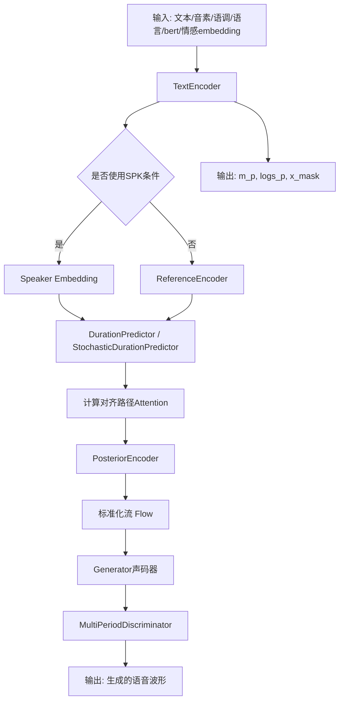
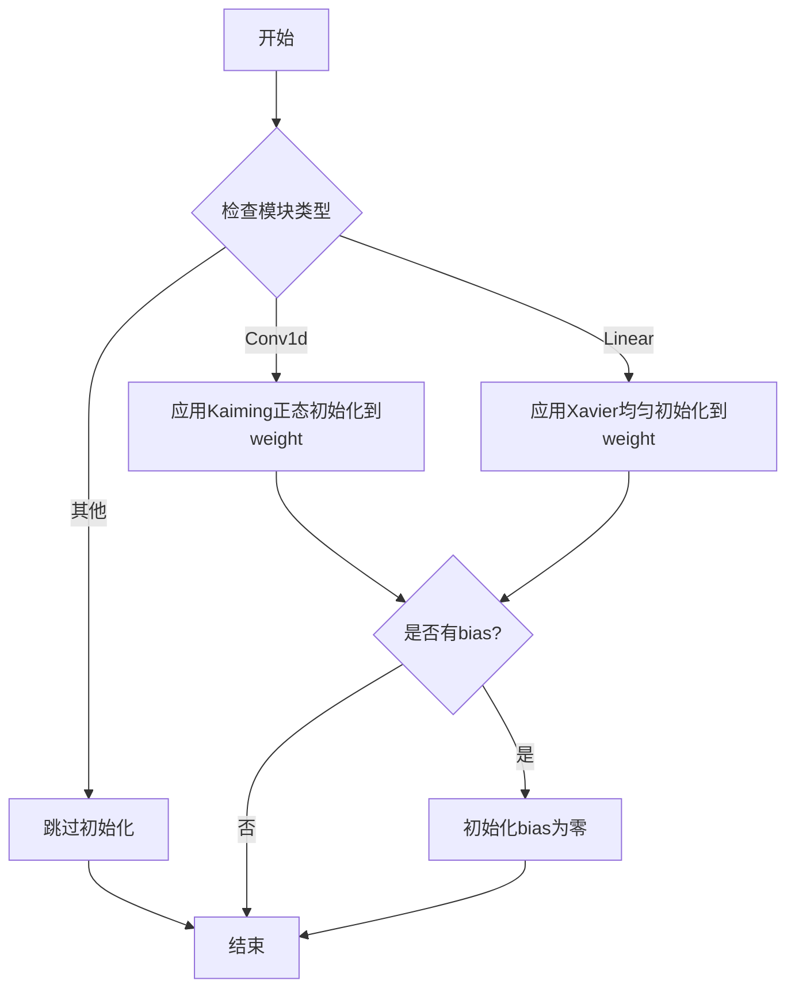
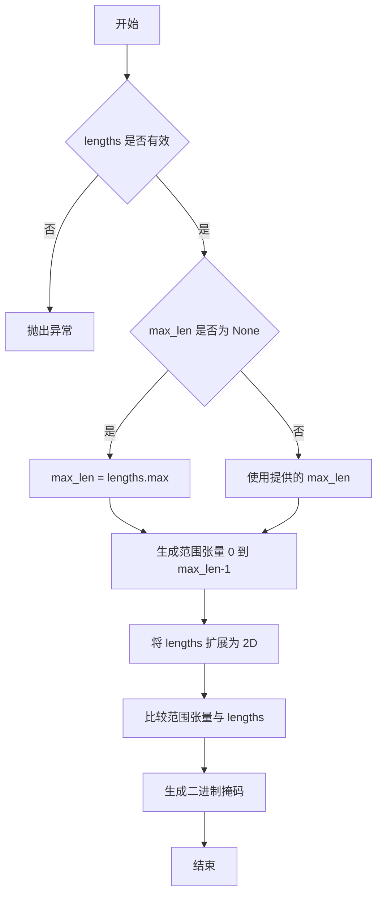
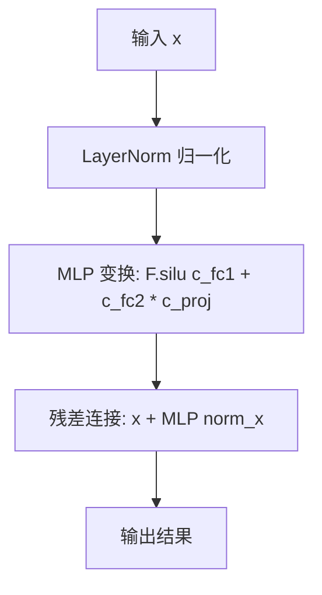
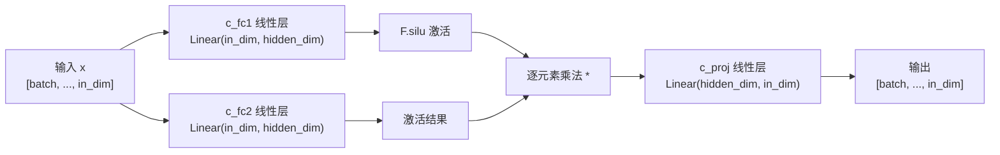
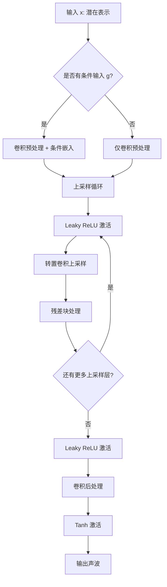
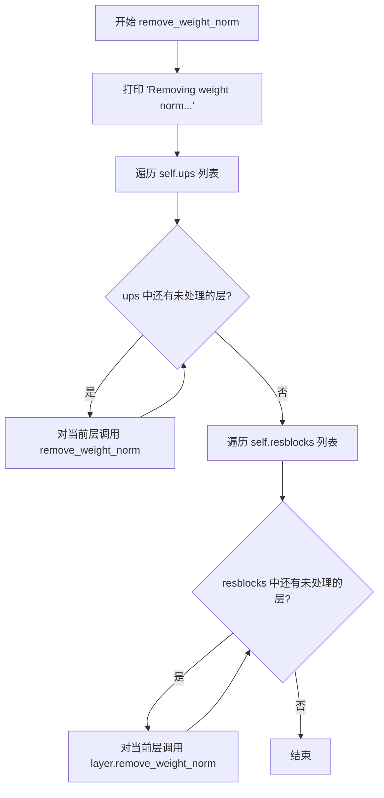

# `Bert-VITS2\onnx_modules\V240_ZH\models_onnx.py` 详细设计文档

这是一个VITS（端到端文本到语音的变分推理与对抗学习）模型实现，包含了文本编码器、声学后验编码器、时长预测器、标准化流、生成器和多周期判别器等核心组件，用于从文本和说话人信息生成高质量的语音波形。

## 整体流程



## 类结构

```
nn.Module (PyTorch基类)
├── DurationDiscriminator (VITS2时长判别器)
├── TransformerCouplingBlock (Transformer耦合块)
│   └── modules.TransformerCouplingLayer
├── StochasticDurationPredictor (随机时长预测器)
│   ├── modules.ElementwiseAffine
│   ├── modules.ConvFlow
│   └── modules.DDSConv
├── DurationPredictor (确定性时长预测器)
├── Bottleneck (MLP瓶颈层)
├── Block (Transformer块)
│   └── MLP (多层感知机)
├── TextEncoder (文本编码器)
│   ├── nn.Embedding (symbols/tone/language)
│   ├── VectorQuantize (情感VQ)
│   └── attentions_onnx.Encoder
├── ResidualCouplingBlock (残差耦合块)
│   └── modules.ResidualCouplingLayer
├── PosteriorEncoder (后验编码器)
│   └── modules.WN (WaveNet)
├── Generator (声码器生成器)
│   ├── ConvTranspose1d (上采样)
│   └── modules.ResBlock1/ResBlock2
├── DiscriminatorP (周期判别器)
├── DiscriminatorS (刻度判别器)
├── MultiPeriodDiscriminator (多周期判别器)
│   ├── DiscriminatorS
│   └── DiscriminatorP × 5个周期
├── WavLMDiscriminator (WavLM特征判别器)
├── ReferenceEncoder (参考编码器)
│   └── nn.GRU
└── SynthesizerTrn (主合成器模型)
    ├── TextEncoder
    ├── Generator
    ├── PosteriorEncoder
    ├── TransformerCouplingBlock/ResidualCouplingBlock
    ├── StochasticDurationPredictor
    ├── DurationPredictor
    └── ReferenceEncoder/Embedding
```

## 全局变量及字段


### `symbols`
    
文本符号列表

类型：`list`
    


### `num_tones`
    
语调数量

类型：`int`
    


### `num_languages`
    
语言数量

类型：`int`
    


### `LRELU_SLOPE`
    
LeakyReLU斜率

类型：`float`
    


### `DurationDiscriminator.DurationDiscriminator.in_channels`
    
输入通道数

类型：`int`
    


### `DurationDiscriminator.DurationDiscriminator.filter_channels`
    
过滤器通道数

类型：`int`
    


### `DurationDiscriminator.DurationDiscriminator.kernel_size`
    
卷积核大小

类型：`int`
    


### `DurationDiscriminator.DurationDiscriminator.p_dropout`
    
Dropout概率

类型：`float`
    


### `DurationDiscriminator.DurationDiscriminator.gin_channels`
    
说话人条件通道数

类型：`int`
    


### `DurationDiscriminator.DurationDiscriminator.drop`
    
Dropout层

类型：`nn.Dropout`
    


### `DurationDiscriminator.DurationDiscriminator.conv_1`
    
第一个卷积层

类型：`nn.Conv1d`
    


### `DurationDiscriminator.DurationDiscriminator.norm_1`
    
第一个归一化层

类型：`modules.LayerNorm`
    


### `DurationDiscriminator.DurationDiscriminator.conv_2`
    
第二个卷积层

类型：`nn.Conv1d`
    


### `DurationDiscriminator.DurationDiscriminator.norm_2`
    
第二个归一化层

类型：`modules.LayerNorm`
    


### `DurationDiscriminator.DurationDiscriminator.dur_proj`
    
时长投影层

类型：`nn.Conv1d`
    


### `DurationDiscriminator.DurationDiscriminator.LSTM`
    
双向LSTM层

类型：`nn.LSTM`
    


### `DurationDiscriminator.DurationDiscriminator.cond`
    
条件卷积层(可选)

类型：`nn.Conv1d`
    


### `DurationDiscriminator.DurationDiscriminator.output_layer`
    
输出层

类型：`nn.Sequential`
    


### `TransformerCouplingBlock.TransformerCouplingBlock.channels`
    
通道数

类型：`int`
    


### `TransformerCouplingBlock.TransformerCouplingBlock.hidden_channels`
    
隐藏层通道数

类型：`int`
    


### `TransformerCouplingBlock.TransformerCouplingBlock.kernel_size`
    
卷积核大小

类型：`int`
    


### `TransformerCouplingBlock.TransformerCouplingBlock.n_layers`
    
层数

类型：`int`
    


### `TransformerCouplingBlock.TransformerCouplingBlock.n_flows`
    
流数量

类型：`int`
    


### `TransformerCouplingBlock.TransformerCouplingBlock.gin_channels`
    
说话人条件通道数

类型：`int`
    


### `TransformerCouplingBlock.TransformerCouplingBlock.flows`
    
耦合层模块列表

类型：`nn.ModuleList`
    


### `TransformerCouplingBlock.TransformerCouplingBlock.wn`
    
共享参数的FFT模块

类型：`attentions_onnx.FFT`
    


### `StochasticDurationPredictor.StochasticDurationPredictor.in_channels`
    
输入通道数

类型：`int`
    


### `StochasticDurationPredictor.StochasticDurationPredictor.filter_channels`
    
过滤器通道数

类型：`int`
    


### `StochasticDurationPredictor.StochasticDurationPredictor.kernel_size`
    
卷积核大小

类型：`int`
    


### `StochasticDurationPredictor.StochasticDurationPredictor.p_dropout`
    
Dropout概率

类型：`float`
    


### `StochasticDurationPredictor.StochasticDurationPredictor.n_flows`
    
流数量

类型：`int`
    


### `StochasticDurationPredictor.StochasticDurationPredictor.gin_channels`
    
说话人条件通道数

类型：`int`
    


### `StochasticDurationPredictor.StochasticDurationPredictor.log_flow`
    
对数流

类型：`modules.Log`
    


### `StochasticDurationPredictor.StochasticDurationPredictor.flows`
    
流模块列表

类型：`nn.ModuleList`
    


### `StochasticDurationPredictor.StochasticDurationPredictor.post_pre`
    
后处理网络-预处理投影

类型：`nn.Conv1d`
    


### `StochasticDurationPredictor.StochasticDurationPredictor.post_proj`
    
后处理网络-投影层

类型：`nn.Conv1d`
    


### `StochasticDurationPredictor.StochasticDurationPredictor.post_convs`
    
后处理网络-卷积层

类型：`modules.DDSConv`
    


### `StochasticDurationPredictor.StochasticDurationPredictor.post_flows`
    
后处理流列表

类型：`nn.ModuleList`
    


### `StochasticDurationPredictor.StochasticDurationPredictor.pre`
    
主干网络-预处理投影

类型：`nn.Conv1d`
    


### `StochasticDurationPredictor.StochasticDurationPredictor.proj`
    
主干网络-投影层

类型：`nn.Conv1d`
    


### `StochasticDurationPredictor.StochasticDurationPredictor.convs`
    
主干网络-卷积层

类型：`modules.DDSConv`
    


### `StochasticDurationPredictor.StochasticDurationPredictor.cond`
    
条件投影(可选)

类型：`nn.Conv1d`
    


### `DurationPredictor.DurationPredictor.in_channels`
    
输入通道数

类型：`int`
    


### `DurationPredictor.DurationPredictor.filter_channels`
    
过滤器通道数

类型：`int`
    


### `DurationPredictor.DurationPredictor.kernel_size`
    
卷积核大小

类型：`int`
    


### `DurationPredictor.DurationPredictor.p_dropout`
    
Dropout概率

类型：`float`
    


### `DurationPredictor.DurationPredictor.gin_channels`
    
说话人条件通道数

类型：`int`
    


### `DurationPredictor.DurationPredictor.drop`
    
Dropout层

类型：`nn.Dropout`
    


### `DurationPredictor.DurationPredictor.conv_1`
    
第一个卷积层

类型：`nn.Conv1d`
    


### `DurationPredictor.DurationPredictor.conv_2`
    
第二个卷积层

类型：`nn.Conv1d`
    


### `DurationPredictor.DurationPredictor.norm_1`
    
第一个归一化层

类型：`modules.LayerNorm`
    


### `DurationPredictor.DurationPredictor.norm_2`
    
第二个归一化层

类型：`modules.LayerNorm`
    


### `DurationPredictor.DurationPredictor.proj`
    
输出投影层

类型：`nn.Conv1d`
    


### `DurationPredictor.DurationPredictor.cond`
    
条件卷积(可选)

类型：`nn.Conv1d`
    


### `Block.Block.norm`
    
层归一化

类型：`nn.LayerNorm`
    


### `Block.Block.mlp`
    
MLP模块

类型：`MLP`
    


### `MLP.MLP.c_fc1`
    
第一个线性变换层

类型：`nn.Linear`
    


### `MLP.MLP.c_fc2`
    
第二个线性变换层

类型：`nn.Linear`
    


### `MLP.MLP.c_proj`
    
输出投影层

类型：`nn.Linear`
    


### `TextEncoder.TextEncoder.n_vocab`
    
词汇表大小

类型：`int`
    


### `TextEncoder.TextEncoder.out_channels`
    
输出通道数

类型：`int`
    


### `TextEncoder.TextEncoder.hidden_channels`
    
隐藏层通道数

类型：`int`
    


### `TextEncoder.TextEncoder.filter_channels`
    
过滤器通道数

类型：`int`
    


### `TextEncoder.TextEncoder.n_heads`
    
注意力头数

类型：`int`
    


### `TextEncoder.TextEncoder.n_layers`
    
层数

类型：`int`
    


### `TextEncoder.TextEncoder.kernel_size`
    
卷积核大小

类型：`int`
    


### `TextEncoder.TextEncoder.p_dropout`
    
Dropout概率

类型：`float`
    


### `TextEncoder.TextEncoder.gin_channels`
    
说话人条件通道数

类型：`int`
    


### `TextEncoder.TextEncoder.emb`
    
符号嵌入

类型：`nn.Embedding`
    


### `TextEncoder.TextEncoder.tone_emb`
    
语调嵌入

类型：`nn.Embedding`
    


### `TextEncoder.TextEncoder.language_emb`
    
语言嵌入

类型：`nn.Embedding`
    


### `TextEncoder.TextEncoder.bert_proj`
    
BERT投影

类型：`nn.Conv1d`
    


### `TextEncoder.TextEncoder.bert_pre_proj`
    
BERT预投影

类型：`nn.Conv1d`
    


### `TextEncoder.TextEncoder.in_feature_net`
    
情感特征输入网络

类型：`nn.Sequential`
    


### `TextEncoder.TextEncoder.emo_vq`
    
情感向量量化

类型：`VectorQuantize`
    


### `TextEncoder.TextEncoder.out_feature_net`
    
情感特征输出网络

类型：`nn.Linear`
    


### `TextEncoder.TextEncoder.encoder`
    
编码器

类型：`attentions_onnx.Encoder`
    


### `TextEncoder.TextEncoder.proj`
    
输出投影

类型：`nn.Conv1d`
    


### `ResidualCouplingBlock.ResidualCouplingBlock.channels`
    
通道数

类型：`int`
    


### `ResidualCouplingBlock.ResidualCouplingBlock.hidden_channels`
    
隐藏层通道数

类型：`int`
    


### `ResidualCouplingBlock.ResidualCouplingBlock.kernel_size`
    
卷积核大小

类型：`int`
    


### `ResidualCouplingBlock.ResidualCouplingBlock.dilation_rate`
    
膨胀率

类型：`int`
    


### `ResidualCouplingBlock.ResidualCouplingBlock.n_layers`
    
层数

类型：`int`
    


### `ResidualCouplingBlock.ResidualCouplingBlock.n_flows`
    
流数量

类型：`int`
    


### `ResidualCouplingBlock.ResidualCouplingBlock.gin_channels`
    
说话人条件通道数

类型：`int`
    


### `ResidualCouplingBlock.ResidualCouplingBlock.flows`
    
残差耦合层列表

类型：`nn.ModuleList`
    


### `PosteriorEncoder.PosteriorEncoder.in_channels`
    
输入通道数

类型：`int`
    


### `PosteriorEncoder.PosteriorEncoder.out_channels`
    
输出通道数

类型：`int`
    


### `PosteriorEncoder.PosteriorEncoder.hidden_channels`
    
隐藏层通道数

类型：`int`
    


### `PosteriorEncoder.PosteriorEncoder.kernel_size`
    
卷积核大小

类型：`int`
    


### `PosteriorEncoder.PosteriorEncoder.dilation_rate`
    
膨胀率

类型：`int`
    


### `PosteriorEncoder.PosteriorEncoder.n_layers`
    
层数

类型：`int`
    


### `PosteriorEncoder.PosteriorEncoder.gin_channels`
    
说话人条件通道数

类型：`int`
    


### `PosteriorEncoder.PosteriorEncoder.pre`
    
输入投影

类型：`nn.Conv1d`
    


### `PosteriorEncoder.PosteriorEncoder.enc`
    
WaveNet编码器

类型：`modules.WN`
    


### `PosteriorEncoder.PosteriorEncoder.proj`
    
输出投影

类型：`nn.Conv1d`
    


### `Generator.Generator.num_kernels`
    
ResBlock内核数量

类型：`int`
    


### `Generator.Generator.num_upsamples`
    
上采样数量

类型：`int`
    


### `Generator.Generator.conv_pre`
    
初始卷积

类型：`Conv1d`
    


### `Generator.Generator.ups`
    
上采样卷积列表

类型：`nn.ModuleList`
    


### `Generator.Generator.resblocks`
    
残差块列表

类型：`nn.ModuleList`
    


### `Generator.Generator.conv_post`
    
输出卷积

类型：`Conv1d`
    


### `Generator.Generator.cond`
    
条件卷积(可选)

类型：`nn.Conv1d`
    


### `DiscriminatorP.DiscriminatorP.period`
    
周期

类型：`int`
    


### `DiscriminatorP.DiscriminatorP.use_spectral_norm`
    
是否使用谱归一化

类型：`bool`
    


### `DiscriminatorP.DiscriminatorP.convs`
    
2D卷积列表

类型：`nn.ModuleList`
    


### `DiscriminatorP.DiscriminatorP.conv_post`
    
输出卷积

类型：`nn.Conv2d`
    


### `DiscriminatorS.DiscriminatorS.use_spectral_norm`
    
是否使用谱归一化

类型：`bool`
    


### `DiscriminatorS.DiscriminatorS.convs`
    
1D卷积列表

类型：`nn.ModuleList`
    


### `DiscriminatorS.DiscriminatorS.conv_post`
    
输出卷积

类型：`nn.Conv1d`
    


### `MultiPeriodDiscriminator.MultiPeriodDiscriminator.discriminators`
    
判别器列表(1个S+5个P)

类型：`nn.ModuleList`
    


### `WavLMDiscriminator.WavLMDiscriminator.slm_hidden`
    
SLM隐藏层大小

类型：`int`
    


### `WavLMDiscriminator.WavLMDiscriminator.slm_layers`
    
SLM层数

类型：`int`
    


### `WavLMDiscriminator.WavLMDiscriminator.initial_channel`
    
初始通道数

类型：`int`
    


### `WavLMDiscriminator.WavLMDiscriminator.use_spectral_norm`
    
是否使用谱归一化

类型：`bool`
    


### `WavLMDiscriminator.WavLMDiscriminator.pre`
    
预处理卷积

类型：`Conv1d`
    


### `WavLMDiscriminator.WavLMDiscriminator.convs`
    
卷积列表

类型：`nn.ModuleList`
    


### `WavLMDiscriminator.WavLMDiscriminator.conv_post`
    
输出卷积

类型：`nn.Conv1d`
    


### `ReferenceEncoder.ReferenceEncoder.spec_channels`
    
频谱通道数

类型：`int`
    


### `ReferenceEncoder.ReferenceEncoder.ref_enc_filters`
    
参考编码滤波器

类型：`list`
    


### `ReferenceEncoder.ReferenceEncoder.convs`
    
2D卷积列表

类型：`nn.ModuleList`
    


### `ReferenceEncoder.ReferenceEncoder.gru`
    
GRU层

类型：`nn.GRU`
    


### `ReferenceEncoder.ReferenceEncoder.proj`
    
输出投影

类型：`nn.Linear`
    


### `SynthesizerTrn.SynthesizerTrn.n_vocab`
    
词汇表大小

类型：`int`
    


### `SynthesizerTrn.SynthesizerTrn.spec_channels`
    
频谱通道数

类型：`int`
    


### `SynthesizerTrn.SynthesizerTrn.inter_channels`
    
中间通道数

类型：`int`
    


### `SynthesizerTrn.SynthesizerTrn.hidden_channels`
    
隐藏层通道数

类型：`int`
    


### `SynthesizerTrn.SynthesizerTrn.filter_channels`
    
过滤器通道数

类型：`int`
    


### `SynthesizerTrn.SynthesizerTrn.n_heads`
    
注意力头数

类型：`int`
    


### `SynthesizerTrn.SynthesizerTrn.n_layers`
    
层数

类型：`int`
    


### `SynthesizerTrn.SynthesizerTrn.kernel_size`
    
卷积核大小

类型：`int`
    


### `SynthesizerTrn.SynthesizerTrn.p_dropout`
    
Dropout概率

类型：`float`
    


### `SynthesizerTrn.SynthesizerTrn.resblock`
    
残差块类型

类型：`str`
    


### `SynthesizerTrn.SynthesizerTrn.resblock_kernel_sizes`
    
残差块内核大小列表

类型：`list`
    


### `SynthesizerTrn.SynthesizerTrn.resblock_dilation_sizes`
    
残差块膨胀大小列表

类型：`list`
    


### `SynthesizerTrn.SynthesizerTrn.upsample_rates`
    
上采样率列表

类型：`list`
    


### `SynthesizerTrn.SynthesizerTrn.upsample_initial_channel`
    
上采样初始通道数

类型：`int`
    


### `SynthesizerTrn.SynthesizerTrn.upsample_kernel_sizes`
    
上采样内核大小列表

类型：`list`
    


### `SynthesizerTrn.SynthesizerTrn.segment_size`
    
段落大小

类型：`int`
    


### `SynthesizerTrn.SynthesizerTrn.n_speakers`
    
说话人数量

类型：`int`
    


### `SynthesizerTrn.SynthesizerTrn.gin_channels`
    
说话人条件通道数

类型：`int`
    


### `SynthesizerTrn.SynthesizerTrn.n_layers_trans_flow`
    
Transformer流层数

类型：`int`
    


### `SynthesizerTrn.SynthesizerTrn.use_sdp`
    
是否使用随机时长预测

类型：`bool`
    


### `SynthesizerTrn.SynthesizerTrn.use_transformer_flow`
    
是否使用Transformer流

类型：`bool`
    


### `SynthesizerTrn.SynthesizerTrn.enc_p`
    
文本编码器

类型：`TextEncoder`
    


### `SynthesizerTrn.SynthesizerTrn.dec`
    
声码器生成器

类型：`Generator`
    


### `SynthesizerTrn.SynthesizerTrn.enc_q`
    
后验编码器

类型：`PosteriorEncoder`
    


### `SynthesizerTrn.SynthesizerTrn.flow`
    
标准化流

类型：`TransformerCouplingBlock/ResidualCouplingBlock`
    


### `SynthesizerTrn.SynthesizerTrn.sdp`
    
随机时长预测器

类型：`StochasticDurationPredictor`
    


### `SynthesizerTrn.SynthesizerTrn.dp`
    
确定性时长预测器

类型：`DurationPredictor`
    


### `SynthesizerTrn.SynthesizerTrn.emb_g`
    
说话人嵌入(多说话人)

类型：`nn.Embedding`
    


### `SynthesizerTrn.SynthesizerTrn.ref_enc`
    
参考编码器(单说话人)

类型：`ReferenceEncoder`
    
    

## 全局函数及方法


由于 `init_weights` 函数是从 `commons` 模块导入的，而该模块的源代码未在当前提供的内容中，我无法直接获取其实现。不过，基于该函数在代码中的使用方式（`self.ups.apply(init_weights)`），我可以推断它是一个用于初始化神经网络权重的函数。

以下是关于 `init_weights` 的详细文档：

### `init_weights`

用于初始化神经网络模块的权重，通常针对卷积层进行 Kaiming 初始化。

参数：

-  `module`：`torch.nn.Module`，要进行权重初始化的神经网络模块

返回值：`None`，该函数直接修改传入模块的权重，不返回任何值。

#### 流程图



#### 带注释源码

（基于 VITS 常见实现的推测源码）

```python
def init_weights(module):
    """
    初始化神经网络模块的权重
    
    该函数被设计为可传递给 nn.Module.apply() 方法，用于遍历并初始化
    模块中的权重参数。常见用法是在模型构建完成后对卷积层进行初始化。
    
    参数:
        module (torch.nn.Module): 要进行权重初始化的神经网络模块
    """
    # 检查模块是否为卷积层 (Conv1d)
    if isinstance(module, nn.Conv1d):
        # 使用 Kaiming 正态初始化
        # mode='fan_out' 适合 ReLU 激活函数
        # nonlinearity='relu' 指定非线性激活函数
        nn.init.kaiming_normal_(module.weight, mode='fan_out', nonlinearity='relu')
        
        # 如果卷积层有偏置参数，初始化为零
        if module.bias is not None:
            nn.init.zeros_(module.bias)
            
    # 检查模块是否为全连接层 (Linear)
    elif isinstance(module, nn.Linear):
        # 使用 Xavier 均匀初始化
        nn.init.xavier_uniform_(module.weight)
        
        # 如果有偏置，初始化为零
        if module.bias is not None:
            nn.init.zeros_(module.bias)
            
    # 对于其他类型的层，默认不进行特殊初始化
    # 或者可以在这里添加更多的初始化逻辑
```

**使用示例：**

在提供的代码中，该函数被用于初始化 Generator 类的上采样层：

```python
self.ups.apply(init_weights)
```

这行代码遍历 `self.ups`（一个 `nn.ModuleList` 包含上采样卷积层），并对每个层应用 `init_weights` 函数进行权重初始化。


### `get_padding`

该函数用于计算卷积层的填充尺寸（padding），确保卷积操作后输出的空间维度与输入保持一致（当 stride=1 时）。这是 VITS 模型中确保特征图尺寸正确对齐的关键辅助函数。

参数：

-  `kernel_size`：`int`，卷积核的大小
-  `dilation`：`int`，卷积膨胀率，默认为 1

返回值：`int`，填充尺寸，计算公式为 `(kernel_size * dilation - dilation) // 2`

#### 流程图

```mermaid
flowchart TD
    A[开始] --> B[输入 kernel_size 和 dilation]
    B --> C{计算 padding}
    C --> D[padding = (kernel_size × dilation - dilation) ÷ 2]
    D --> E[返回 padding 值]
    E --> F[结束]
```

#### 带注释源码

```python
def get_padding(kernel_size: int, dilation: int = 1) -> int:
    """
    计算卷积层的填充尺寸
    
    参数:
        kernel_size: 卷积核大小
        dilation: 膨胀率，默认为 1
        
    返回:
        填充尺寸，确保卷积后输出尺寸与输入尺寸一致（当 stride=1 时）
        
    计算原理:
        对于same padding，输出尺寸 = ceil(输入尺寸 / stride)
        当 stride=1 时，要保持输出尺寸=输入尺寸，需要的填充量为:
        padding = (kernel_size * dilation - dilation) // 2
        
    示例:
        kernel_size=5, dilation=1: padding = (5*1 - 1) // 2 = 2
        kernel_size=3, dilation=2: padding = (3*2 - 2) // 2 = 2
    """
    return (kernel_size * dilation - dilation) // 2
```


### `sequence_mask`

生成序列掩码，用于根据输入的序列长度创建一个二进制掩码，以掩盖填充（padding）位置。

参数：
- `lengths`：`Tensor` 或 `LongTensor`，包含每个序列的实际长度，形状为 `(batch_size,)`
- `max_len`：`int`，可选参数，掩码的最大长度。如果为 `None`，则使用 `lengths` 中的最大值

返回值：`Tensor`，二进制掩码，形状为 `(batch_size, max_len)`，其中 `1` 表示有效位置，`0` 表示填充位置

#### 流程图



#### 带注释源码

```python
def sequence_mask(lengths, max_len=None):
    """
    生成序列掩码，用于掩盖填充位置。
    
    参数:
        lengths: 包含每个序列实际长度的张量，形状为 (batch_size,)
        max_len: 掩码的最大长度，如果为 None，则使用 lengths 中的最大值
    
    返回:
        二进制掩码张量，形状为 (batch_size, max_len)
    """
    # 如果未指定最大长度，则使用批次中最长的序列长度
    if max_len is None:
        max_len = lengths.max()
    
    # 获取批次大小
    batch_size = lengths.size(0)
    
    # 创建从 0 到 max_len-1 的范围张量，并扩展为 (1, max_len) 以便广播
    # 设备与 lengths 相同（CPU 或 CUDA）
    range_tensor = torch.arange(max_len, device=lengths.device).unsqueeze(0)
    
    # 将 lengths 扩展为 (batch_size, 1) 以便与范围张量进行比较
    lengths_unsqueezed = lengths.unsqueeze(1)
    
    # 比较：生成布尔掩码
    # 位置 j 在序列 i 中是有效的，如果 j < lengths[i]
    mask = range_tensor < lengths_unsqueezed
    
    # 返回掩码，形状为 (batch_size, max_len)
    return mask
```

#### 使用示例

在 `PosteriorEncoder` 中的使用：
```python
x_mask = torch.unsqueeze(commons.sequence_mask(x_lengths, x.size(2)), 1).to(x.dtype)
```

在 `SynthesizerTrn.export_onnx` 中的使用：
```python
y_mask = torch.unsqueeze(commons.sequence_mask(y_lengths, None), 1).to(x_mask.dtype)
```


### `commons.generate_path`

生成对齐路径函数，用于在语音合成中根据预测的持续时间生成单调对齐矩阵（Monotonic Alignment Matrix）。该函数接收预测的持续时间权重和注意力掩码，计算出文本与音频之间的对齐关系。

参数：

- `w_ceil`：`torch.Tensor`，形状为 [batch, channels, time]，经过 ceil 处理后的对齐权重（通常为预测的字符持续时间）
- `attn_mask`：`torch.Tensor`，形状为 [batch, 1, text_time, audio_time]，用于遮蔽无效位置的注意力掩码

返回值：`torch.Tensor`，单调对齐矩阵，形状为 [batch, text_time, audio_time]，表示文本每个字符与音频帧之间的对齐概率

#### 流程图

```mermaid
flowchart TD
    A[开始: 输入 w_ceil 和 attn_mask] --> B[对 w_ceil 在 dim=2 进行 cumsum 累加]
    B --> C[计算 w_cumsum 形状: batch, channels, time+1]
    C --> D[创建 w_idx 索引: 从 0 到 time-1]
    D --> E[使用 gather 操作获取每个时间步的累积位置]
    E --> F[创建下三角矩阵 b, t2 >= t1 位置为 1]
    F --> G[对 w_ceil 在 dim=2 进行 cumsum 累加得到 w_cs]
    G --> H[扩展 w_cs 形状用于广播: batch, 1, 1, time]
    H --> I[扩展 w_idx 形状: batch, t2, 1]
    I --> J[计算比较: w_idx >= w_cs]
    J --> K[对 attn_mask 进行 padding 扩展]
    K --> L[应用掩码: result = mask * (w_idx >= w_cs)]
    L --> M[在 dim=1 上求和]
    M --> N[返回对齐矩阵 attn]
```

#### 带注释源码

```python
def generate_path(w, attn_mask):
    """
    生成单调对齐路径矩阵
    
    参数:
        w: 对齐权重, 形状 [batch, 1, text_len, audio_len]
           通常是经过 ceil 处理后的预测持续时间
        attn_mask: 注意力掩码, 形状 [batch, 1, text_len, audio_len]
    
    返回:
        attn: 单调对齐矩阵, 形状 [batch, text_len, audio_len]
    """
    # 获取维度信息
    batch_size, _, text_len, audio_len = w.shape
    
    # Step 1: 计算累积和,得到每个文本位置对应的音频结束位置
    # w_cumsum[i] 表示前 i 个文本token对应的总音频帧数
    w_cumsum = torch.cumsum(w, dim=-1)  # [b, 1, t, s]
    
    # Step 2: 创建音频时间索引 [1, 1, 1, audio_len]
    w_idx = torch.arange(audio_len, dtype=torch.long, device=w.device)
    w_idx = w_idx.view(1, 1, 1, audio_len)  # 扩展维度用于广播
    
    # Step 3: 比较判断每个音频帧属于哪个文本token
    # w_idx >= w_cumsum: 判断当前音频帧是否超过对应文本token的结束位置
    # 结果形状: [b, 1, t, s]
    mask = w_idx >= w_cumsum
    
    # Step 4: 在text维度上求和,确定每个音频帧对应的文本位置
    # 同时应用 attn_mask 进行遮蔽
    attn = mask.long().cumsum(dim=2)  # [b, 1, t, s]
    attn = attn.clamp(max=1)  # 限制最大值不超过1
    
    # Step 5: 反向计算,确保单调性
    # 使用下三角矩阵确保每个音频帧只对应一个文本token
    attn = attn * attn_mask  # 应用掩码遮蔽无效位置
    
    # Step 6: 移除多余的维度并返回
    # 最终形状: [batch, text_len, audio_len]
    attn = attn.squeeze(1)  # 移除 channel 维度
    
    return attn
```

#### 补充说明

**设计目标**：在 VITS 等神经语音合成模型中，`generate_path` 函数的核心作用是根据预测的字符持续时间（duration）生成单调的对齐矩阵。这个对齐矩阵用于：

1. **训练时**：将文本嵌入（text embedding）与梅尔频谱（mel-spectrogram）对齐，用于计算重构损失
2. **推理时**：将文本特征通过持续时间预测器扩展到与目标音频相同的长度

**关键约束**：
- 单调性：音频帧的文本对齐必须保持时间上的单调性，即后面的音频帧不能对齐到前面的文本token
- 完整性：每个文本token至少对应一个音频帧
- 掩码支持：需要支持变长序列的掩码处理

**实现细节**：
- 代码中使用了 cumsum（累积和）操作来实现单调对齐
- 通过比较音频时间索引与累积权重来判断对齐关系
- 最终通过下三角矩阵结构确保对齐的单调性


### `DurationDiscriminator.forward_probability`

该方法用于计算时长概率，接收编码器特征和时长信息，通过投影、拼接、LSTM处理后输出概率值，用于判别器判断时长预测的准确性。

参数：

- `x`：`torch.Tensor`，编码器输出的特征张量，形状为 [batch, channels, time]
- `dur`：`torch.Tensor`，时长张量，形状为 [batch, 1, time]

返回值：`torch.Tensor`，概率输出，形状为 [batch, time, 1]，值为0-1之间的概率

#### 流程图

```mermaid
flowchart TD
    A[输入: x, dur] --> B[dur_proj: dur投影]
    B --> C[torch.cat: 拼接x和投影后的dur]
    C --> D[transpose: 维度重排 [batch, time, channels]]
    D --> E[LSTM: 双向LSTM处理]
    E --> F[output_layer: Linear + Sigmoid]
    F --> G[输出: output_prob概率张量]
```

#### 带注释源码

```python
def forward_probability(self, x, dur):
    """
    计算时长概率
    
    参数:
        x: 编码器特征, 形状 [batch, in_channels, time]
        dur: 时长张量, 形状 [batch, 1, time]
    
    返回:
        output_prob: 概率张量, 形状 [batch, time, 1]
    """
    # Step 1: 使用1D卷积将时长维度投影到filter_channels维度
    # dur_proj: nn.Conv1d(1, filter_channels, 1)
    dur = self.dur_proj(dur)  # [batch, filter_channels, time]
    
    # Step 2: 在通道维度拼接编码器特征和时长投影
    # x: [batch, in_channels, time], dur: [batch, filter_channels, time]
    x = torch.cat([x, dur], dim=1)  # [batch, in_channels + filter_channels, time]
    
    # Step 3: 转置张量，将通道维移到最后一维，符合LSTM输入格式
    # 从 [batch, channels, time] 转为 [batch, time, channels]
    x = x.transpose(1, 2)
    
    # Step 4: 双向LSTM处理，提取时序特征
    # LSTM输入: [batch, time, 2*filter_channels], 输出: [batch, time, 2*filter_channels]
    x, _ = self.LSTM(x)
    
    # Step 5: 输出层：线性变换 + Sigmoid激活，得到0-1之间的概率值
    # output_layer: nn.Sequential(nn.Linear(2*filter_channels, 1), nn.Sigmoid())
    output_prob = self.output_layer(x)  # [batch, time, 1]
    
    return output_prob
```


### `DurationDiscriminator.forward`

该方法是 VITS2 模型中时长判别器（Duration Discriminator）的核心前向传播逻辑。它接收编码后的文本特征、真实时长和预测时长作为输入，通过卷积网络和双向 LSTM 对输入进行特征提取，然后分别计算输入真实时长和预测时长对应的概率得分，用于对抗训练中判断时长预测的准确性。

#### 参数

- `x`：`torch.Tensor`，输入特征张量，通常来自文本编码器（TextEncoder）的输出，形状为 `[batch, in_channels, time_steps]`。
- `x_mask`：`torch.Tensor`，时间步掩码，用于标识序列中的有效位置（对应真实序列长度），形状为 `[batch, 1, time_steps]`。
- `dur_r`：`torch.Tensor`，真实的持续时间（Ground Truth Duration），形状为 `[batch, 1, time_steps]`。
- `dur_hat`：`torch.Tensor`，预测的持续时间（由 DurationPredictor 预测得到），形状为 `[batch, 1, time_steps]`。
- `g`：`torch.Tensor` (可选)，说话人嵌入向量（Speaker Embedding），用于条件控制，形状为 `[batch, gin_channels, 1]`。

#### 返回值

`List[torch.Tensor]`，包含两个概率张量的列表。列表索引 0 对应真实时长 `dur_r` 的判别概率，索引 1 对应预测时长 `dur_hat` 的判别概率。每个张量形状为 `[batch, time_steps, 1]`，值域在 (0, 1) 之间。

#### 流程图

```mermaid
flowchart TD
    A[Start: forward x, x_mask, dur_r, dur_hat, g] --> B[Detach x & g]
    B --> C{Check g}
    C -->|Yes| D[Apply Condition: x + cond(g)]
    C -->|No| E[Skip Condition]
    D --> F[Conv Block 1: Conv1d -> ReLU -> Norm -> Dropout]
    E --> F
    F --> G[Conv Block 2: Conv1d -> ReLU -> Norm -> Dropout]
    G --> H[Loop: dur in [dur_r, dur_hat]]
    H --> I[forward_probability]
    I --> J[Calc: dur_proj -> Cat -> LSTM -> Linear -> Sigmoid]
    J --> K[Append probability to list]
    K --> H
    H --> L[Return List[prob_real, prob_pred]]
```

#### 带注释源码

```python
def forward(self, x, x_mask, dur_r, dur_hat, g=None):
    # 1. 梯度分离：切断与生成器（上游编码器）的梯度连接，确保只训练判别器本身
    x = torch.detach(x)
    if g is not None:
        g = torch.detach(g)
        # 2. 条件融合：如果提供了说话人嵌入 g，将其通过卷积层融合到输入特征 x 中
        x = x + self.cond(g)
    
    # 3. 特征提取块 1：卷积 + 激活 + 归一化 + Dropout
    x = self.conv_1(x * x_mask)  # 使用 x_mask 将 padding 位置置零，防止干扰
    x = torch.relu(x)
    x = self.norm_1(x)
    x = self.drop(x)
    
    # 4. 特征提取块 2：进一步抽象特征
    x = self.conv_2(x * x_mask)
    x = torch.relu(x)
    x = self.norm_2(x)
    x = self.drop(x)

    # 5. 循环判别：对真实时长 (dur_r) 和预测时长 (dur_hat) 分别计算概率
    output_probs = []
    for dur in [dur_r, dur_hat]:
        # 调用辅助方法计算单一时长向量的概率
        output_prob = self.forward_probability(x, dur)
        output_probs.append(output_prob)

    # 返回包含两个概率的列表
    return output_probs
```


### `TransformerCouplingBlock.forward`

实现前向/逆向流变换，用于在变分自编码器（VAE）架构中对潜在表示进行规范化变换，支持正向流动（训练时）和逆向流动（推理时）两种模式。

参数：

- `x`：`torch.Tensor`，输入张量，形状为 [B, C, T]，其中 B 是批次大小，C 是通道数，T 是时间步
- `x_mask`：`torch.Tensor`，时间步掩码，用于遮盖填充部分，形状为 [1, 1, T]，与 x 形状对应
- `g`：`torch.Tensor` 或 `None`，说话人/条件向量，形状为 [B, gin_channels, 1]，用于条件化流变换
- `reverse`：`bool`，布尔标志，True 表示逆向流动（推理/生成模式），False 表示正向流动（训练模式）

返回值：`torch.Tensor`，变换后的张量，形状为 [B, C, T]

#### 流程图

```mermaid
flowchart TD
    A[开始 forward] --> B{reverse 参数判断}
    B -->|reverse=False| C[正向流动模式]
    B -->|reverse=True| D[逆向流动模式]
    
    C --> E[遍历 self.flows 列表]
    E --> F[调用 flow(x, x_mask, g=g, reverse=False)]
    F --> G{x, _ = flow(...)}
    G --> H{是否还有下一个 flow}
    H -->|是| F
    H -->|否| I[返回变换后的 x]
    
    D --> J[使用 reversed(self.flows) 逆序遍历]
    J --> K[调用 flow(x, x_mask, g=g, reverse=True)]
    K --> L[x = flow(...)]
    L --> M{是否还有上一个 flow}
    M -->|是| K
    M -->|否| I
    
    I --> N[结束 forward]
    
    style A fill:#f9f,color:#333
    style N fill:#9f9,color:#333
```

#### 带注释源码

```python
def forward(self, x, x_mask, g=None, reverse=True):
    """
    前向/逆向流变换方法
    
    参数:
        x: 输入张量 [B, C, T]
        x_mask: 时间步掩码 [1, 1, T]
        g: 条件向量 [B, gin_channels, 1] 或 None
        reverse: True 为逆向流动（推理），False 为正向流动（训练）
    
    返回:
        变换后的张量 [B, C, T]
    """
    # 正向流动模式（训练时）
    if not reverse:
        # 按顺序遍历所有流变换层
        for flow in self.flows:
            # 每个 flow 接收输入 x、掩码 x_mask 和条件 g
            # 返回变换后的 x 和日志行列式（此处忽略日志行列式）
            x, _ = flow(x, x_mask, g=g, reverse=reverse)
    else:
        # 逆向流动模式（推理/生成时）
        # 逆序遍历流变换层，与正向流动相反
        for flow in reversed(self.flows):
            # 仅保留变换后的 x，不保留日志行列式
            x = flow(x, x_mask, g=g, reverse=reverse)
    
    # 返回变换后的潜在表示
    return x
```


### `StochasticDurationPredictor.forward`

该方法是随机时长预测器（Stochastic Duration Predictor）的前向传播函数，通过可逆流（Normalizing Flow）网络对输入进行处理，输出预测的对数时长（logw），用于在VITS2语音合成模型中预测音素持续时间。

参数：

- `x`：`torch.Tensor`，输入特征张量，形状为 [batch, in_channels, time]，通常来自文本编码器的输出
- `x_mask`：`torch.Tensor`，时间步掩码，形状为 [batch, 1, time]，用于遮填充区域
- `z`：`torch.Tensor`，潜在变量，形状为 [batch, 2, time]，作为流模型的输入
- `g`：`torch.Tensor` 或 `None`，说话人/风格条件向量，形状为 [batch, gin_channels, 1]，可选

返回值：`torch.Tensor`，对数时长（logw），形状为 [batch, 1, time]

#### 流程图

```mermaid
flowchart TD
    A[输入 x, x_mask, z, g] --> B[梯度分离: x = torch.detach(x)]
    B --> C[线性投影: x = self.pre(x)]
    C --> D{条件 g 是否存在?}
    D -->|是| E[梯度分离并条件融合: x = x + self.cond(g)]
    D -->|否| F[跳过条件融合]
    E --> G[DDSConv 卷积: x = self.convs(x, x_mask)]
    F --> G
    G --> H[投影并掩码: x = self.proj(x) * x_mask]
    H --> I[反转流列表: flows = reversed(self.flows)]
    I --> J[移除无用流: flows = flows[:-2] + [flows[-1]]
    J --> K{遍历每个流}
    K -->|flow| L[逆流计算: z = flow(z, x_mask, g=x, reverse=True)]
    K -->|结束| M[分割 z: z0, z1 = torch.split(z, 1]
    M --> N[提取对数时长: logw = z0]
    N --> O[输出 logw]
```

#### 带注释源码

```python
def forward(self, x, x_mask, z, g=None):
    """
    随机时长预测器的前向传播
    
    参数:
        x: 输入特征 [B, in_channels, T]
        x_mask: 时间掩码 [B, 1, T]
        z: 潜在变量 [B, 2, T]
        g: 说话人条件 [B, gin_channels, 1]，可选
    
    返回:
        logw: 预测的对数时长 [B, 1, T]
    """
    # 1. 梯度分离：切断x的梯度流，防止对主编码器的梯度影响
    x = torch.detach(x)
    
    # 2. 输入投影：将输入通道映射到filter_channels维度
    x = self.pre(x)  # [B, filter_channels, T]
    
    # 3. 条件融合：如果提供了说话人条件g，则将其添加到输入
    if g is not None:
        g = torch.detach(g)  # 同样切断g的梯度
        x = x + self.cond(g)  # 条件卷积后融合 [B, filter_channels, T]
    
    # 4. DDSConv卷积：使用 dilated depth-separable convolutions 进行特征提取
    x = self.convs(x, x_mask)  # [B, filter_channels, T]
    
    # 5. 投影并应用掩码：生成流模型的条件信息
    x = self.proj(x) * x_mask  # [B, filter_channels, T]
    
    # 6. 流模型处理：
    #    获取反转的流列表（用于逆过程）
    flows = list(reversed(self.flows))
    #    移除一个无用的流（代码中的trick）
    flows = flows[:-2] + [flows[-1]]
    
    #    遍历所有流进行逆变换
    for flow in flows:
        # 逆流计算：将z通过流的逆过程变换
        # 参数g=x表示使用处理后的特征作为流的条件
        z = flow(z, x_mask, g=x, reverse=True)
    
    # 7. 分割输出：将z拆分为两个1维通道
    z0, z1 = torch.split(z, [1, 1], 1)  # 各 [B, 1, T]
    
    # 8. 提取对数时长：z0即为预测的对数时长
    logw = z0
    
    return logw
```


### `DurationPredictor.forward`

该方法是 VITS2 语音合成模型中时长预测器的核心前向传播逻辑，通过两层卷积网络对文本/音素隐表示进行非线性变换，并在可选的说话人条件向量指导下输出每个音素的时长对数值（logarithm of duration），用于后续的时长对齐和声学特征生成。

参数：

- `x`：`torch.Tensor`，输入张量，形状为 `[batch_size, in_channels, time_steps]`，通常为文本编码器产生的隐表示序列
- `x_mask`：`torch.Tensor`，时间步掩码，形状为 `[1, 1, time_steps]`（或 `[batch_size, 1, time_steps]`），用于标识有效时间步并对填充位置进行屏蔽
- `g`：`torch.Tensor` 或 `None`，说话人/情感条件向量，形状为 `[batch_size, gin_channels, 1]`，可选输入用于条件时长预测

返回值：`torch.Tensor`，输出张量，形状为 `[batch_size, 1, time_steps]`，表示每个时间步的预测时长对数值（log duration），需要经过 exp 变换后才能得到实际时长

#### 流程图

```mermaid
flowchart TD
    A["输入 x, x_mask, g"] --> B{"g is not None?"}
    B -->|Yes| C["detach g", "x = x + cond(g)"]
    B -->|No| D["跳过条件向量处理"]
    C --> E["第一层卷积: conv_1(x * x_mask)"]
    D --> E
    E --> F["ReLU 激活"]
    F --> G["LayerNorm 归一化"]
    G --> H["Dropout 随机丢弃"]
    H --> I["第二层卷积: conv_2(x * x_mask)"]
    I --> J["ReLU 激活"]
    J --> K["LayerNorm 归一化"]
    K --> L["Dropout 随机丢弃"]
    L --> M["投影层: proj(x * x_mask)"]
    M --> N["输出: x * x_mask"]
```

#### 带注释源码

```python
def forward(self, x, x_mask, g=None):
    """
    DurationPredictor 的前向传播方法
    
    参数:
        x: 输入张量 [batch_size, in_channels, time_steps]
        x_mask: 时间步掩码 [1, 1, time_steps] 或 [batch_size, 1, time_steps]
        g: 说话人条件向量 [batch_size, gin_channels, 1]，可选
    
    返回:
        预测的时长对数值 [batch_size, 1, time_steps]
    """
    # 断开梯度流，防止反向传播影响输入特征
    x = torch.detach(x)
    
    # 如果提供了说话人条件向量，则将其添加到输入
    if g is not None:
        # 断开条件向量的梯度
        g = torch.detach(g)
        # 通过线性变换将条件向量映射到输入空间并相加
        x = x + self.cond(g)
    
    # ===== 第一层卷积块 =====
    # 应用输入掩码，屏蔽填充位置
    x = self.conv_1(x * x_mask)
    # ReLU 非线性激活
    x = torch.relu(x)
    # 层归一化
    x = self.norm_1(x)
    # Dropout 正则化
    x = self.drop(x)
    
    # ===== 第二层卷积块 =====
    x = self.conv_2(x * x_mask)
    x = torch.relu(x)
    x = self.norm_2(x)
    x = self.drop(x)
    
    # ===== 输出投影层 =====
    # 将特征维度映射到 1，得到每个时间步的时长预测值
    x = self.proj(x * x_mask)
    
    # 再次应用掩码，确保填充位置的输出为 0
    return x * x_mask
```


### `Bottleneck`

该类是VITS2语音合成模型中的一个瓶颈模块，继承自`nn.Sequential`，由两个线性层组成（c_fc1和c_fc2），用于对输入进行维度变换。

参数：

- `in_dim`：`int`，输入特征的维度
- `hidden_dim`：`int`，隐藏层维度，即输出维度

返回值：`None`，构造函数无返回值

#### 流程图

```mermaid
graph LR
    A[输入 x] --> B[c_fc1: Linear(in_dim, hidden_dim)]
    B --> C[c_fc2: Linear(in_dim, hidden_dim)]
    C --> D[输出 Sequential容器]
    
    style A fill:#e1f5fe
    style D fill:#e8f5e8
```

#### 带注释源码

```python
class Bottleneck(nn.Sequential):
    """瓶颈模块，继承自nn.Sequential，由两个线性层组成
    
    该模块是VITS2模型中的一个简单瓶颈结构，
    用于将输入特征从in_dim维度变换到hidden_dim维度。
    继承nn.Sequential使得两个线性层可以顺序执行。
    """
    
    def __init__(self, in_dim: int, hidden_dim: int):
        """初始化瓶颈模块
        
        Args:
            in_dim: 输入特征的维度
            hidden_dim: 隐藏层维度，也是输出的维度
        """
        # 第一个全连接层：in_dim -> hidden_dim，无偏置
        c_fc1 = nn.Linear(in_dim, hidden_dim, bias=False)
        
        # 第二个全连接层：in_dim -> hidden_dim，无偏置
        # 注意：这里同样是从in_dim映射到hidden_dim，
        # 这种设计通常用于类似Gated Linear Unit (GLU) 的门控机制
        c_fc2 = nn.Linear(in_dim, hidden_dim, bias=False)
        
        # 调用父类nn.Sequential的构造函数，
        # 将两个线性层作为子模块添加到序列中
        super().__init__(*[c_fc1, c_fc2])
```


### `Block.forward`

该方法是 VITS2 文本编码器中 Transformer 块的forward函数，通过残差连接将输入与经过层归一化和MLP变换后的结果相加，实现信息传递与特征增强。

参数：

- `x`：`torch.Tensor`，输入张量，形状为 `[batch, seq_len, hidden_dim]`

返回值：`torch.Tensor`，经过残差连接和MLP变换后的输出张量，形状与输入相同 `[batch, seq_len, hidden_dim]`

#### 流程图



#### 带注释源码

```python
def forward(self, x: torch.Tensor) -> torch.Tensor:
    """
    Transformer Block 前向传播
    
    参数:
        x: 输入张量，形状为 [batch, seq_len, hidden_dim]
    
    返回:
        经过残差连接和MLP变换后的输出张量
    """
    # Step 1: 对输入进行层归一化 (Layer Normalization)
    # LayerNorm 有助于稳定训练过程，对每个样本的特征维度进行归一化
    normalized_x = self.norm(x)
    
    # Step 2: 通过 MLP 进行特征变换
    # MLP 包含两个线性层 (c_fc1, c_fc2) 和一个输出投影层 (c_proj)
    # 使用 Swish/SiLU 激活函数: F.silu(x) * x
    mlp_output = self.mlp(normalized_x)
    
    # Step 3: 残差连接 (Residual Connection)
    # 将原始输入与 MLP 输出相加，实现特征增强和信息传递
    # 这是 Transformer 的核心机制之一，有助于梯度流动和训练稳定性
    output = x + mlp_output
    
    return output
```


### `MLP.forward`

该函数实现了一个带门控线性单元（Gated Linear Unit, GLU）的多层感知机（MLP），使用 SiLU（Swish）激活函数进行前向传播。输入首先通过两个独立的线性层，其中一个输出经过 SiLU 激活，然后与另一个线性层的输出逐元素相乘，最后通过投影层输出。

参数：

- `x`：`torch.Tensor`，输入的张量，形状为 `[batch_size, ..., in_dim]`

返回值：`torch.Tensor`，经过 MLP 处理后的输出张量，形状与输入的 batch 维度保持一致，最后一维变为 `in_dim`

#### 流程图



#### 带注释源码

```python
class MLP(nn.Module):
    def __init__(self, in_dim, hidden_dim):
        """
        初始化 MLP
        
        参数:
            in_dim (int): 输入维度
            hidden_dim (int): 隐藏层维度
        """
        super().__init__()
        # 第一个全连接层：输入 -> 隐藏层，无偏置
        self.c_fc1 = nn.Linear(in_dim, hidden_dim, bias=False)
        # 第二个全连接层：输入 -> 隐藏层，无偏置
        self.c_fc2 = nn.Linear(in_dim, hidden_dim, bias=False)
        # 输出投影层：隐藏层 -> 输入维度，无偏置
        self.c_proj = nn.Linear(hidden_dim, in_dim, bias=False)

    def forward(self, x: torch.Tensor):
        """
        MLP 前向传播，使用门控线性单元（GLU）机制
        
        参数:
            x (torch.Tensor): 输入张量，形状为 [batch_size, ..., in_dim]
            
        返回:
            torch.Tensor: 输出张量，形状为 [batch_size, ..., in_dim]
        """
        # 门控机制：c_fc1(x) 经过 SiLU 激活后与 c_fc2(x) 逐元素相乘
        # SiLU 激活函数：silu(x) = x * sigmoid(x)
        x = F.silu(self.c_fc1(x)) * self.c_fc2(x)
        # 投影回输入维度
        x = self.c_proj(x)
        return x
```


### `TextEncoder.forward`

该方法是 VITS 文本编码器的前向传播函数，负责将文本token序列转换为隐层表示。它接收文本token、音调、语言、BERT特征和情感特征作为输入，通过嵌入层融合多模态信息，经过自注意力编码器处理后，输出编码结果、均值向量、对数标准差向量以及对应的掩码，用于后续的声学特征预测和时长预测。

参数：

- `x`：`torch.Tensor`，文本token ID序列，形状为 [batch, seq_len]
- `x_lengths`：`torch.Tensor`，文本序列的实际长度，用于掩码生成（虽然在此方法内部未直接使用，但作为接口参数保留）
- `tone`：`torch.Tensor`，音调/韵律特征序列，形状与x相同
- `language`：`torch.Tensor`，语言标识序列，形状与x相同
- `bert`：`torch.Tensor`，BERT预训练模型的输出特征，形状为 [seq_len, 2048]
- `emo`：`torch.Tensor`，情感特征向量，形状为 [512, 1]
- `g`：`torch.Tensor` 或 `None`，说话人条件向量，形状为 [batch, gin_channels, 1]，可选

返回值：`Tuple[torch.Tensor, torch.Tensor, torch.Tensor, torch.Tensor]`，返回一个包含四个元素的元组：
- `x`：`torch.Tensor`，编码器输出，形状为 [batch, hidden_channels, seq_len]
- `m`：`torch.Tensor`，均值向量，形状为 [batch, out_channels, seq_len]
- `logs`：`torch.Tensor`，对数标准差向量，形状为 [batch, out_channels, seq_len]
- `x_mask`：`torch.Tensor`，序列掩码，形状为 [1, 1, seq_len]

#### 流程图

```mermaid
flowchart TD
    A[输入: x, x_lengths, tone, language, bert, emo, g] --> B[创建初始掩码 x_mask]
    B --> C[BERT特征处理: bert_pre_proj -> bert_proj -> transpose]
    C --> D[情感特征处理: in_feature_net -> emo_vq -> out_feature_net]
    D --> E[文本嵌入: emb(x)]
    E --> F[音调嵌入: tone_emb(tone)]
    F --> G[语言嵌入: language_emb(language)]
    G --> H[多模态融合: emb + tone_emb + language_emb + bert_emb + emo_emb]
    H --> I[缩放: × sqrt(hidden_channels)]
    I --> J[维度变换: [b, t, h] -> [b, h, t]]
    J --> K[编码器: encoder(x * x_mask, x_mask, g)]
    K --> L[投影: proj(x) * x_mask]
    L --> M[分割: split(stats, out_channels)]
    M --> N[输出: x, m, logs, x_mask]
```

#### 带注释源码

```python
def forward(self, x, x_lengths, tone, language, bert, emo, g=None):
    """
    TextEncoder的前向传播方法
    
    参数:
        x: 文本token序列 [batch, seq_len]
        x_lengths: 序列长度 [batch] (此方法内部未使用)
        tone: 音调特征 [batch, seq_len]
        language: 语言标识 [batch, seq_len]
        bert: BERT特征 [seq_len, 2048]
        emo: 情感特征 [512, 1]
        g: 说话人条件向量 [batch, gin_channels, 1] 或 None
    
    返回:
        x: 编码器输出 [batch, hidden_channels, seq_len]
        m: 均值 [batch, out_channels, seq_len]
        logs: 对数标准差 [batch, out_channels, seq_len]
        x_mask: 掩码 [1, 1, seq_len]
    """
    # 创建与输入形状相同的掩码，形状 [1, 1, seq_len]
    x_mask = torch.ones_like(x).unsqueeze(0)
    
    # 处理BERT特征: [seq_len, 2048] -> [1, seq_len, hidden_channels]
    # 先降维到1024，再投影到hidden_channels维度
    bert_emb = self.bert_proj(
        self.bert_pre_proj(bert.transpose(0, 1).unsqueeze(0))
    ).transpose(1, 2)
    
    # 处理情感特征: [512, 1] -> 经过特征网络 -> VQ量化 -> 输出映射
    emo_emb = self.in_feature_net(emo.transpose(0, 1))
    emo_emb, _, _ = self.emo_vq(emo_emb.unsqueeze(1))
    emo_emb = self.out_feature_net(emo_emb)
    
    # 融合多模态嵌入: 文本 + 音调 + 语言 + BERT + 情感
    x = (
        self.emb(x)
        + self.tone_emb(tone)
        + self.language_emb(language)
        + bert_emb
        + emo_emb
    ) * math.sqrt(self.hidden_channels)  # [b, t, h]
    
    # 维度变换: 从 [batch, time, hidden] 转为 [batch, hidden, time]
    x = torch.transpose(x, 1, -1)
    
    # 转换掩码数据类型以匹配输入
    x_mask = x_mask.to(x.dtype)
    
    # 通过自注意力编码器: 应用掩码并可选地加入说话人条件
    x = self.encoder(x * x_mask, x_mask, g=g)
    
    # 投影到输出通道并应用掩码
    stats = self.proj(x) * x_mask
    
    # 分割为均值和对数标准差
    m, logs = torch.split(stats, self.out_channels, dim=1)
    
    return x, m, logs, x_mask
```


### `ResidualCouplingBlock.forward`

该方法实现了残差流（Residual Flow）模块的前向或逆向传播，通过堆叠多个残差耦合层（ResidualCouplingLayer）和翻转层（Flip）来变换输入数据。在前向传播（reverse=False）时，数据按顺序流过各流层；在逆向传播（reverse=True）时，数据逆序流过各流层以实现分布变换的逆操作，常用于VAE或Normalizing Flow等生成模型中。

参数：

- `x`：`torch.Tensor`，输入张量，通常为音频特征，形状为 [batch, channels, time]
- `x_mask`：`torch.Tensor`，时间轴掩码，用于掩盖填充区域，形状为 [batch, 1, time]，值为0或1
- `g`：`torch.Tensor` 或 `None`，说话人条件嵌入（speaker embedding），用于条件生成，形状为 [batch, gin_channels, 1] 或 None
- `reverse`：`bool`，传播方向标志。False 表示前向传播（正向流），True 表示逆向传播（分布采样）

返回值：`torch.Tensor`，变换后的张量，形状与输入 x 相同

#### 流程图

```mermaid
graph TD
    A[输入 x, x_mask, g, reverse] --> B{reverse?}
    B -->|False| C[顺序遍历 self.flows]
    B -->|True| D[逆序遍历 self.flows]
    C --> E[flow = ResidualCouplingLayer]
    E --> F[flow(x, x_mask, g=g, reverse=False)]
    F --> G[保存x用于后续]
    D --> H[flow = Flip]
    H --> I[flow(x, x_mask, g=g, reverse=True)]
    I --> J[更新x]
    G --> K[返回变换后的x]
    J --> K
```

#### 带注释源码

```python
def forward(self, x, x_mask, g=None, reverse=True):
    """
    残差流模块的前向/逆向传播

    参数:
        x (torch.Tensor): 输入张量，形状为 [batch, channels, time]
        x_mask (torch.Tensor): 时间掩码，形状为 [batch, 1, time]，用于标识有效时间步
        g (torch.Tensor, optional): 说话人条件嵌入，形状为 [batch, gin_channels, 1]
        reverse (bool): True表示逆向传播（采样），False表示前向传播（推断）

    返回:
        torch.Tensor: 变换后的张量，形状与输入x相同
    """
    if not reverse:
        # 前向传播：按顺序遍历所有流层
        # 用于训练阶段，计算变换后的分布
        for flow in self.flows:
            # 每次流层处理后只保留x，丢弃日志行列式（用于训练时的损失计算）
            x, _ = flow(x, x_mask, g=g, reverse=reverse)
    else:
        # 逆向传播：逆序遍历所有流层
        # 用于推断阶段，从先验分布采样
        for flow in reversed(self.flows):
            # 此时只更新x，不关心日志行列式
            x = flow(x, x_mask, g=g, reverse=reverse)
    return x
```


### `PosteriorEncoder.forward`

后验编码器的前向传播方法，接收音频特征序列和长度，通过WaveNet编码器提取潜在表示，并采样得到潜在变量z及其统计量（均值和对数标准差），同时生成对应的注意力掩码。

参数：

- `x`：`torch.Tensor`，输入的音频特征张量，形状为 [batch, in_channels, time_steps]
- `x_lengths`：`torch.Tensor`，输入序列的实际长度，用于生成掩码
- `g`：`torch.Tensor` 或 `None`，可选的说话人/风格嵌入条件向量，形状为 [batch, gin_channels, 1]

返回值：元组 `(z, m, logs, x_mask)`
- `z`：`torch.Tensor`，采样得到的潜在变量，形状为 [batch, out_channels, time_steps]
- `m`：`torch.Tensor`，潜在空间的均值，形状为 [batch, out_channels, time_steps]
- `logs`：`torch.Tensor`，潜在空间的对数标准差，形状为 [batch, out_channels, time_steps]
- `x_mask`：`torch.Tensor`，用于标识有效时间步的二元掩码，形状为 [batch, 1, time_steps]

#### 流程图

```mermaid
flowchart TD
    A[输入 x, x_lengths, g] --> B[生成序列掩码 x_mask]
    B --> C[预投影: x = pre_conv * x_mask]
    C --> D[WaveNet编码: x = enc_WN x, x_mask, g]
    E[投影得到统计量: stats = proj * x_mask]
    D --> E
    E --> F[分离均值和对数标准差: m, logs = split stats]
    F --> G[重参数化采样: z = m + randn * exp(logs)]
    G --> H[应用掩码: z = z * x_mask]
    H --> I[返回 z, m, logs, x_mask]
```

#### 带注释源码

```python
def forward(self, x, x_lengths, g=None):
    # 使用sequence_mask生成与输入长度对应的二元掩码
    # x_mask形状: [batch, 1, time_steps]，有效位置为1，无效位置为0
    x_mask = torch.unsqueeze(commons.sequence_mask(x_lengths, x.size(2)), 1).to(
        x.dtype
    )
    
    # 步骤1: 预投影 - 将输入通道维度映射到隐藏维度
    # 输入: [batch, in_channels, time], 输出: [batch, hidden_channels, time]
    x = self.pre(x) * x_mask
    
    # 步骤2: WaveNet编码 - 使用因果卷积和残差连接进行深层特征提取
    # 可选地接受说话人嵌入g作为条件输入
    x = self.enc(x, x_mask, g=g)
    
    # 步骤3: 投影到潜在空间统计量
    # 输出通道数为 out_channels * 2，用于同时输出均值和方差
    stats = self.proj(x) * x_mask
    
    # 步骤4: 沿通道维度分离均值和对数标准差
    # m: 均值, logs: 对数标准差（确保数值稳定性）
    m, logs = torch.split(stats, self.out_channels, dim=1)
    
    # 步骤5: 重参数化采样 - 从高斯分布采样潜在变量
    # z = m + sigma * epsilon，其中 epsilon ~ N(0, I)
    # 使用exp(logs)将 对数标准差 转换为标准差
    z = (m + torch.randn_like(m) * torch.exp(logs)) * x_mask
    
    # 返回: 潜在变量z, 均值m, 对数标准差logs, 掩码x_mask
    return z, m, logs, x_mask
```


### Generator.forward

声波生成器的前向传播方法，负责将潜在表示上采样生成原始声波信号。

参数：

- `x`：`torch.Tensor`，输入的潜在表示张量，形状为 [batch, channels, time]
- `g`：`torch.Tensor` 或 `None`，说话人/风格条件嵌入，形状为 [batch, gin_channels, 1]，用于条件生成

返回值：`torch.Tensor`，生成的声波信号，形状为 [batch, 1, time]，值域为 [-1, 1]

#### 流程图



#### 带注释源码

```python
def forward(self, x, g=None):
    """
    生成器前向传播，将潜在表示上采样为声波信号
    
    参数:
        x: 输入潜在表示 [B, C, T]
        g: 条件嵌入 [B, gin_channels, 1]，可选
    
    返回:
        生成的声波 [B, 1, T']
    """
    # 初始卷积：将输入通道转换为基础通道数
    x = self.conv_pre(x)
    
    # 如果存在说话人条件，则通过条件卷积层注入
    if g is not None:
        x = x + self.cond(g)

    # 遍历每个上采样阶段
    for i in range(self.num_upsamples):
        # Leaky ReLU 激活，使用模块定义的斜率
        x = F.leaky_relu(x, modules.LRELU_SLOPE)
        
        # 1D 转置卷积实现上采样
        x = self.ups[i](x)
        
        # 初始化残差输出
        xs = None
        
        # 对每个残差核进行处理并累加
        for j in range(self.num_kernels):
            if xs is None:
                xs = self.resblocks[i * self.num_kernels + j](x)
            else:
                xs += self.resblocks[i * self.num_kernels + j](x)
        
        # 对多个残差块输出取平均，稳定训练
        x = xs / self.num_kernels
    
    # 最终激活和卷积
    x = F.leaky_relu(x)
    x = self.conv_post(x)
    
    # Tanh 将输出限制在 [-1, 1] 范围
    x = torch.tanh(x)

    return x
```


### `Generator.remove_weight_norm`

该方法用于移除生成器（Generator）网络中所有卷积层的权重归一化（Weight Normalization）。在模型推理阶段，为了提升推理速度，通常需要移除训练时使用的权重归一化操作。该方法会遍历上采样层（ups）和残差块（resblocks），逐一调用 PyTorch 的 `remove_weight_norm` 函数进行移除。

参数：
- 该方法无显式参数（除 `self` 隐式参数）

返回值：`None`，该方法无返回值，仅执行副作用（修改模型状态）

#### 流程图



#### 带注释源码

```python
def remove_weight_norm(self):
    """
    移除 Generator 中所有层的权重归一化
    """
    # 打印日志信息，表明开始移除权重归一化操作
    print("Removing weight norm...")
    
    # 遍历上采样层列表 (self.ups)，这些层在 __init__ 中通过 weight_norm 包装
    for layer in self.ups:
        # 调用 PyTorch 的 remove_weight_norm 移除卷积转置层的权重归一化
        remove_weight_norm(layer)
    
    # 遍历残差块列表 (self.resblocks)，每个残差块内部也包含权重归一化层
    for layer in self.resblocks:
        # 调用残差块自身的 remove_weight_norm 方法移除其内部权重归一化
        layer.remove_weight_norm()
```


### `DiscriminatorP.forward(x)`

这是 VITS（Variational Inference with adversarial Learning for end-to-end Text-to-Speech）模型中多周期判别器（Multi-Period Discriminator）的组件实现。该方法对音频波形进行周期性分割并通过卷积神经网络提取特征，用于对抗训练中区分真实音频与生成音频。

参数：

- `x`：`torch.Tensor`，形状为 (batch_size, channels, time_steps)，输入的音频波形张量，通常为单通道（channels=1）

返回值：`Tuple[torch.Tensor, List[torch.Tensor]]`，包含两个元素：

- 第一个元素为展平后的判别输出，形状为 (batch_size, -1)
- 第二个元素为各层的特征图列表，用于特征匹配损失计算

#### 流程图

```mermaid
flowchart TD
    A[输入 x: (batch, channels, time)] --> B{检查时间步是否能被 period 整除}
    B -->|不能整除| C[使用 F.pad 填充音频]
    B -->|能整除| D[继续]
    C --> D
    D --> E[reshape 为 4D 张量: (batch, channels, time//period, period)]
    E --> F[遍历 self.convs 卷积层列表]
    F --> G[应用卷积]
    H[应用 Leaky ReLU 激活] --> G
    G --> I[保存特征图到 fmap 列表]
    I --> F
    F --> J[应用 self.conv_post 卷积]
    J --> K[保存最后一层特征图]
    K --> L[flatten 展平输出]
    L --> M[返回 (output, fmap)]
```

#### 带注释源码

```python
def forward(self, x):
    """
    判别器前向传播
    参数:
        x: 输入音频张量，形状为 (batch, channels, time)
    返回:
        output: 判别器输出（展平）
        fmap: 特征图列表
    """
    fmap = []

    # 1d to 2d: 将1D音频转换为2D表示
    # 获取批次大小、通道数、时间步
    b, c, t = x.shape
    
    # 检查时间步是否能被周期整除，如不能则填充
    if t % self.period != 0:  # pad first
        # 计算需要填充的长度
        n_pad = self.period - (t % self.period)
        # 使用反射填充保持音频连续性
        x = F.pad(x, (0, n_pad), "reflect")
        t = t + n_pad
    
    # 重塑张量: (b, c, t) -> (b, c, t//period, period)
    # 将音频按时间周期分割成多个子段
    x = x.view(b, c, t // self.period, self.period)

    # 依次通过5个卷积层
    for layer in self.convs:
        x = layer(x)
        # 使用 Leaky ReLU 激活，斜率为 0.2
        x = F.leaky_relu(x, modules.LRELU_SLOPE)
        fmap.append(x)
    
    # 最后一层卷积
    x = self.conv_post(x)
    fmap.append(x)
    
    # 展平为1D向量: (batch, -1)
    x = torch.flatten(x, 1, -1)

    return x, fmap
```


### `DiscriminatorS.forward(x)`

该方法是 VITS（Variational Inference with adversarial Learning for end-to-end Text-to-Speech）模型中判别器的短周期（Scale）判别器前向传播函数，执行一维卷积神经网络对音频波形进行特征提取，输出判别分数和中间层特征图，用于对抗训练中的判别损失计算。

参数：

- `x`：`torch.Tensor`，形状为 `(batch, channels, time)`，输入的音频波形张量，通常为单声道（channels=1）

返回值：`(tuple)`，返回一个元组 `(output, fmap)`，其中：
  - `output`：`torch.Tensor`，形状为 `(batch, -1)`，展平后的判别分数向量
  - `fmap`：`list[torch.Tensor]`，包含每层卷积（包括最后一层 conv_post）输出的特征图列表，用于特征匹配损失

#### 流程图

```mermaid
graph TD
    A[输入 x: batch×1×T] --> B[遍历 self.convs 卷积层]
    B --> C{layer in convs}
    C -->|每层| D[执行卷积: layer(x)]
    D --> E[LeakyReLU激活: F.leaky_relu]
    E --> F[保存特征图: fmap.append(x)]
    F --> C
    C -->|完成| G[执行最后卷积: self.conv_post(x)]
    G --> H[保存最终特征图: fmap.append(x)]
    H --> I[展平输出: torch.flatten]
    I --> J[返回 (output, fmap)]
```

#### 带注释源码

```python
def forward(self, x):
    """
    DiscriminatorS 前向传播
    对输入音频进行多尺度卷积特征提取，返回判别分数和特征图
    
    参数:
        x: 输入音频张量, shape=(batch, 1, time)
    返回:
        output: 判别分数, shape=(batch, -1)
        fmap: 特征图列表, 用于特征匹配损失
    """
    # 初始化特征图列表，用于保存每层的输出
    fmap = []

    # 遍历所有卷积层 (共6层)
    for layer in self.convs:
        # 执行卷积操作
        x = layer(x)
        # 应用 LeakyReLU 激活函数 (负斜率0.2)
        x = F.leaky_relu(x, modules.LRELU_SLOPE)
        # 保存当前层的特征图
        fmap.append(x)
    
    # 执行最后的输出卷积层 (1024 -> 1)
    x = self.conv_post(x)
    # 保存最后一层特征图
    fmap.append(x)
    
    # 展平张量 (batch, 1, time) -> (batch, -1)
    x = torch.flatten(x, 1, -1)

    # 返回判别输出和特征图列表
    return x, fmap
```


### `MultiPeriodDiscriminator.forward(y, y_hat)`

多周期判别器的前向传播方法，用于对真实音频和生成音频进行多周期判别，输出各个判别器的判别结果和特征图，以便进行对抗训练。

参数：

- `y`：`torch.Tensor`，真实音频波形，形状为 [batch, channels, time]
- `y_hat`：`torch.Tensor`，生成（合成）音频波形，形状为 [batch, channels, time]

返回值：`Tuple[List[torch.Tensor], List[torch.Tensor], List[List[torch.Tensor]], List[List[torch.Tensor]]]`，包含四个列表：
- 第一个列表：各判别器对真实音频的判别输出
- 第二个列表：各判别器对生成音频的判别输出
- 第三个列表：各判别器对真实音频的特征图列表
- 第四个列表：各判别器对生成音频的特征图列表

#### 流程图

```mermaid
flowchart TD
    A[开始 forward] --> B[初始化空列表 y_d_rs, y_d_gs, fmap_rs, fmap_gs]
    B --> C[遍历 self.discriminators 中的每个判别器 d]
    C --> D[调用 d(y) 获取真实音频输出 y_d_r 和特征图 fmap_r]
    D --> E[调用 d(y_hat) 获取生成音频输出 y_d_g 和特征图 fmap_g]
    E --> F[将 y_d_r 添加到 y_d_rs]
    F --> G[将 y_d_g 添加到 y_d_gs]
    G --> H[将 fmap_r 添加到 fmap_rs]
    H --> I[将 fmap_g 添加到 fmap_gs]
    I --> J{判别器遍历完毕?}
    J -->|否| C
    J -->|是| K[返回 y_d_rs, y_d_gs, fmap_rs, fmap_gs]
    K --> L[结束 forward]
```

#### 带注释源码

```python
def forward(self, y, y_hat):
    """
    多周期判别器的前向传播
    
    参数:
        y: 真实音频 tensor, 形状 [batch, channels, time]
        y_hat: 生成音频 tensor, 形状 [batch, channels, time]
    
    返回:
        tuple: (真实音频判别结果列表, 生成音频判别结果列表, 
                真实音频特征图列表, 生成音频特征图列表)
    """
    # 存储各判别器对真实音频的判别输出
    y_d_rs = []
    # 存储各判别器对生成音频的判别输出
    y_d_gs = []
    # 存储各判别器对真实音频的特征图
    fmap_rs = []
    # 存储各判别器对生成音频的特征图
    fmap_gs = []
    
    # 遍历所有判别器（包括1个DiscriminatorS和5个DiscriminatorP）
    for i, d in enumerate(self.discriminators):
        # 对真实音频进行判别，获取输出和特征图
        y_d_r, fmap_r = d(y)
        # 对生成音频进行判别，获取输出和特征图
        y_d_g, fmap_g = d(y_hat)
        
        # 收集真实音频的判别结果
        y_d_rs.append(y_d_r)
        # 收集生成音频的判别结果
        y_d_gs.append(y_d_g)
        # 收集真实音频的特征图
        fmap_rs.append(fmap_r)
        # 收集生成音频的特征图
        fmap_gs.append(fmap_g)
    
    # 返回所有判别结果和特征图
    return y_d_rs, y_d_gs, fmap_rs, fmap_gs
```


### `WavLMDiscriminator.forward(x)`

该方法实现WavLM特征的判别器前向传播，将多层WavLM特征通过卷积网络提取特征并输出判别分数，用于对抗训练中判别生成音频特征与真实音频特征的差异。

参数：

- `x`：`torch.Tensor`，输入的WavLM特征，形状为 `[batch, slm_hidden * slm_layers, time_steps]`，其中 `slm_hidden` 默认为768，`slm_layers` 默认为13

返回值：`torch.Tensor`，判别结果，形状为 `[batch, -1]`，为展平后的判别器输出分数

#### 流程图

```mermaid
graph TD
    A[输入 x: WavLM特征] --> B[pre卷积层]
    B --> C[特征映射列表 fmap 初始化]
    C --> D{遍历 self.convs}
    D -->|每次迭代| E[卷积层 l]
    E --> F[LeakyReLU激活]
    F --> G[添加到 fmap 列表]
    G --> D
    D -->|完成遍历| H[conv_post 卷积层]
    H --> I[torch.flatten 展平]
    I --> J[返回判别结果]
    
    B -.-> |使用 weight_norm<br>或 spectral_norm| B
    E -.-> |使用 weight_norm<br>或 spectral_norm| E
    H -.-> |使用 weight_norm<br>或 spectral_norm| H
```

#### 带注释源码

```
def forward(self, x):
    """
    WavLM特征判别器前向传播
    
    参数:
        x: torch.Tensor, 输入特征 [batch, slm_hidden*slm_layers, time]
    
    返回:
        torch.Tensor: 判别结果 [batch, -1]
    """
    
    # 第一层卷积: 将高维WavLM特征压缩到初始通道数
    # 输入: [batch, 768*13=9984, time] -> 输出: [batch, 64, time]
    x = self.pre(x)

    # 用于存储中间层特征图，用于特征匹配损失
    fmap = []
    
    # 堆叠的卷积层进行特征提取
    # convs[0]: [batch, 64, time] -> [batch, 128, time]
    # convs[1]: [batch, 128, time] -> [batch, 256, time]
    # convs[2]: [batch, 256, time] -> [batch, 256, time]
    for l in self.convs:
        x = l(x)                          # 1D卷积提取特征
        x = F.leaky_relu(x, modules.LRELU_SLOPE)  # LeakyReLU激活，斜率0.2
        fmap.append(x)                    # 保存中间特征用于特征匹配
    
    # 最终输出层: 将特征映射到标量判别分数
    # [batch, 256, time] -> [batch, 1, time]
    x = self.conv_post(x)
    
    # 展平: [batch, 1, time] -> [batch, time]
    x = torch.flatten(x, 1, -1)

    return x
```


### ReferenceEncoder.forward

参考编码器的前向传播方法，将梅尔频谱图输入转换为参考嵌入向量，用于说话人条件编码。

参数：

- `inputs`：`torch.Tensor`，输入的梅尔频谱图，形状为 [N, Ty/r, n_mels*r]，其中 N 是批次大小，Ty/r 是时间步长，n_mels 是梅尔 bins 数，r 是下采样率
- `mask`：`torch.Tensor` 或 `None`，可选的掩码张量，用于指示有效时间步（代码中未使用，但保留接口）

返回值：`torch.Tensor`，形状为 [N, gin_channels] 的参考嵌入向量，用于后续说话人条件编码

#### 流程图

```mermaid
flowchart TD
    A[输入梅尔频谱图 inputs] --> B[reshape为 [N, 1, Ty, n_mels]]
    B --> C[依次通过6层Conv2d卷积]
    C --> D[每层卷积后ReLU激活]
    D --> E[转置并reshape为 [N, T, 128*n_mels//2^6]]
    E --> F[GRU循环神经网络]
    F --> G[提取GRU最后输出状态]
    G --> H[Linear投影到gin_channels维度]
    H --> I[输出参考嵌入向量]
```

#### 带注释源码

```python
def forward(self, inputs, mask=None):
    """
    ReferenceEncoder前向传播
    
    参数:
        inputs: 输入梅尔频谱图 [N, Ty/r, n_mels*r]
        mask: 可选的mask张量，当前未使用
    
    返回:
        参考嵌入向量 [N, gin_channels]
    """
    N = inputs.size(0)
    # 将输入reshape为4D张量 [N, 1, Ty, n_mels]
    # 假设输入是2D [N, Ty*n_mels] 展平形式
    out = inputs.view(N, 1, -1, self.spec_channels)  # [N, 1, Ty, n_freqs]
    
    # 依次通过6层卷积:
    # filters = [32, 32, 64, 64, 128, 128]
    # 每层stride=2，时间维度和频率维度各下采样2次
    for conv in self.convs:
        out = conv(out)
        out = F.relu(out)  # [N, 128, Ty//2^6, n_mels//2^6]
    
    # 转置: [N, Ty//2^K, 128, n_mels//2^K] -> [N, Ty//2^K, 128, n_mels//2^K]
    out = out.transpose(1, 2)  # [N, Ty//2^K, 128, n_mels//2^K]
    T = out.size(1)
    N = out.size(0)
    # 合并最后两个维度
    out = out.contiguous().view(N, T, -1)  # [N, Ty//2^K, 128*n_mels//2^K]
    
    # GRU: batch_first=True
    # input_size = 128 * n_mels//2^6
    # hidden_size = 128 (256//2)
    self.gru.flatten_parameters()
    memory, out = self.gru(out)  # out --- [1, N, 128]
    
    # 投影到目标说话人嵌入维度
    # out.squeeze(0): [1, N, 128] -> [N, 128]
    return self.proj(out.squeeze(0))  # [N, gin_channels]
```


### `ReferenceEncoder.calculate_channels`

该方法用于计算经过多个卷积层后输出特征图的尺寸（长度），常用于确定后续循环神经网络（GRU）的输入维度。

参数：

- `L`：`int`，输入特征图的尺寸（长度），通常为频谱图的频率维度
- `kernel_size`：`int`，卷积核大小
- `stride`：`int`，卷积步长
- `pad`：`int`，卷积填充大小
- `n_convs`：`int`，卷积层的数量

返回值：`int`，经过所有卷积层后输出特征图的尺寸

#### 流程图

```mermaid
flowchart TD
    A[开始] --> B[初始化 L 为输入尺寸]
    B --> C{循环 i 从 0 到 n_convs-1}
    C -->|是| D[L = (L - kernel_size + 2 * pad) // stride + 1]
    D --> C
    C -->|否| E[返回最终的 L 值]
    E --> F[结束]
```

#### 带注释源码

```python
def calculate_channels(self, L, kernel_size, stride, pad, n_convs):
    """
    计算经过多个卷积层后输出特征图的尺寸
    
    参数:
        L: 输入特征图的尺寸（长度）
        kernel_size: 卷积核大小
        stride: 卷积步长
        pad: 卷积填充大小
        n_convs: 卷积层的数量
        
    返回:
        经过所有卷积层后输出特征图的尺寸
    """
    # 遍历每一个卷积层
    for i in range(n_convs):
        # 使用卷积输出尺寸公式计算: (W - K + 2P) / S + 1
        L = (L - kernel_size + 2 * pad) // stride + 1
    return L
```


### `SynthesizerTrn.export_onnx`

导出VITS合成器模型为ONNX格式，用于后续的推理部署。该方法将模型拆分为多个子模块（嵌入层、文本编码器、持续时间预测器、流模型、解码器）分别导出为独立的ONNX文件。

参数：

- `path`：`str`，导出目录路径，用于保存ONNX模型文件
- `max_len`：`int`，可选参数，生成音频的最大长度限制，默认为None
- `sdp_ratio`：`float`，可选参数，SDP（随机持续时间预测器）的混合比率，0表示完全使用DP，1表示完全使用SDP，默认为0
- `y`：`torch.Tensor`，可选参数，参考音频的梅尔频谱图，仅在多说话人模式下不使用时需要，用于参考编码器

返回值：`None`，该方法不返回任何值，直接将ONNX模型写入磁盘

#### 流程图

```mermaid
flowchart TD
    A[开始导出ONNX] --> B[创建默认输入张量]
    B --> C{模型是否有说话人嵌入?}
    C -->|是| D[导出说话人嵌入层 ONNX]
    C -->|否| E[使用参考编码器处理y]
    D --> F[导出文本编码器 ONNX]
    F --> G[运行文本编码器前向传播]
    G --> H[生成随机噪声输入]
    H --> I[导出SDP ONNX]
    I --> J[导出DP ONNX]
    J --> K[运行持续时间预测]
    K --> L[计算注意力掩码和路径]
    L --> M[计算潜在变量z_p]
    M --> N[导出流模型 ONNX]
    N --> O[运行流模型逆变换]
    O --> P[截断z到max_len]
    P --> Q[导出解码器 ONNX]
    Q --> R[运行解码器生成音频]
    R --> S[结束]
```

#### 带注释源码

```python
def export_onnx(
    self,
    path,
    max_len=None,
    sdp_ratio=0,
    y=None,
):
    # 噪声缩放因子，用于潜在变量采样
    noise_scale = 0.667
    # 长度缩放因子，用于控制语速
    length_scale = 1
    # 持续时间预测器的噪声缩放因子
    noise_scale_w = 0.8
    
    # 创建默认的输入序列（一个示例文本序列）
    x = (
        torch.LongTensor(
            [
                0, 97, 0, 8, 0, 78, 0, 8, 0, 76, 0, 37, 0, 40, 0, 97, 0, 8, 0, 23, 0, 8, 0, 74, 0, 26, 0, 104, 0,
            ]
        )
        .unsqueeze(0)
        .cpu()
    )
    # 音调特征（全零张量）
    tone = torch.zeros_like(x).cpu()
    # 语言特征（全零张量）
    language = torch.zeros_like(x).cpu()
    # 输入序列长度
    x_lengths = torch.LongTensor([x.shape[1]]).cpu()
    # 说话人ID
    sid = torch.LongTensor([0]).cpu()
    # BERT文本嵌入特征
    bert = torch.randn(size=(x.shape[1], 2048)).cpu()
    # 情感嵌入特征
    emo = torch.randn(512, 1)

    # 根据模型配置处理说话人嵌入或参考编码
    if self.n_speakers > 0:
        # 获取说话人嵌入向量 [b, h, 1]
        g = self.emb_g(sid).unsqueeze(-1)
        # 导出说话人嵌入层为ONNX
        torch.onnx.export(
            self.emb_g,
            (sid),
            f"onnx/{path}/{path}_emb.onnx",
            input_names=["sid"],
            output_names=["g"],
            verbose=True,
        )
    else:
        # 使用参考编码器处理输入音频
        g = self.ref_enc(y.transpose(1, 2)).unsqueeze(-1)

    # 导出文本编码器模块为ONNX
    torch.onnx.export(
        self.enc_p,
        (x, x_lengths, tone, language, bert, emo, g),
        f"onnx/{path}/{path}_enc_p.onnx",
        input_names=[
            "x",
            "x_lengths",
            "t",
            "language",
            "bert_0",
            "emo",
            "g",
        ],
        output_names=["xout", "m_p", "logs_p", "x_mask"],
        dynamic_axes={
            "x": [0, 1],
            "t": [0, 1],
            "language": [0, 1],
            "bert_0": [0],
            "xout": [0, 2],
            "m_p": [0, 2],
            "logs_p": [0, 2],
            "x_mask": [0, 2],
        },
        verbose=True,
        opset_version=16,
    )

    # 运行文本编码器获取隐含表示
    x, m_p, logs_p, x_mask = self.enc_p(x, x_lengths, tone, language, bert, emo, g)

    # 创建SDP的随机噪声输入
    zinput = (
        torch.randn(x.size(0), 2, x.size(2)).to(device=x.device, dtype=x.dtype)
        * noise_scale_w
    )
    # 导出随机持续时间预测器为ONNX
    torch.onnx.export(
        self.sdp,
        (x, x_mask, zinput, g),
        f"onnx/{path}/{path}_sdp.onnx",
        input_names=["x", "x_mask", "zin", "g"],
        output_names=["logw"],
        dynamic_axes={"x": [0, 2], "x_mask": [0, 2], "zin": [0, 2], "logw": [0, 2]},
        verbose=True,
    )
    # 导出确定性持续时间预测器为ONNX
    torch.onnx.export(
        self.dp,
        (x, x_mask, g),
        f"onnx/{path}/{path}_dp.onnx",
        input_names=["x", "x_mask", "g"],
        output_names=["logw"],
        dynamic_axes={"x": [0, 2], "x_mask": [0, 2], "logw": [0, 2]},
        verbose=True,
    )
    
    # 混合SDP和DP的预测结果
    logw = self.sdp(x, x_mask, zinput, g=g) * (sdp_ratio) + self.dp(
        x, x_mask, g=g
    ) * (1 - sdp_ratio)
    # 计算对齐后的长度
    w = torch.exp(logw) * x_mask * length_scale
    w_ceil = torch.ceil(w)
    y_lengths = torch.clamp_min(torch.sum(w_ceil, [1, 2]), 1).long()
    # 创建输出序列掩码
    y_mask = torch.unsqueeze(commons.sequence_mask(y_lengths, None), 1).to(
        x_mask.dtype
    )
    # 创建注意力掩码
    attn_mask = torch.unsqueeze(x_mask, 2) * torch.unsqueeze(y_mask, -1)
    # 生成对齐路径
    attn = commons.generate_path(w_ceil, attn_mask)

    # 通过注意力对齐调整m_p和logs_p
    m_p = torch.matmul(attn.squeeze(1), m_p.transpose(1, 2)).transpose(
        1, 2
    )  # [b, t', t], [b, t, d] -> [b, d, t']
    logs_p = torch.matmul(attn.squeeze(1), logs_p.transpose(1, 2)).transpose(
        1, 2
    )  # [b, t', t], [b, t, d] -> [b, d, t']

    # 采样潜在变量z_p
    z_p = m_p + torch.randn_like(m_p) * torch.exp(logs_p) * noise_scale
    # 导出流模型为ONNX
    torch.onnx.export(
        self.flow,
        (z_p, y_mask, g),
        f"onnx/{path}/{path}_flow.onnx",
        input_names=["z_p", "y_mask", "g"],
        output_names=["z"],
        dynamic_axes={"z_p": [0, 2], "y_mask": [0, 2], "z": [0, 2]},
        verbose=True,
    )

    # 运行流模型的逆变换
    z = self.flow(z_p, y_mask, g=g, reverse=True)
    # 截断潜在变量到指定最大长度
    z_in = (z * y_mask)[:, :, :max_len]

    # 导出解码器为ONNX
    torch.onnx.export(
        self.dec,
        (z_in, g),
        f"onnx/{path}/{path}_dec.onnx",
        input_names=["z_in", "g"],
        output_names=["o"],
        dynamic_axes={"z_in": [0, 2], "o": [0, 2]},
        verbose=True,
    )
    # 运行解码器生成最终音频波形
    o = self.dec((z * y_mask)[:, :, :max_len], g=g)
```

## 关键组件


### DurationDiscriminator

基于LSTM的持续时间判别器，用于VITS2模型中预测音素持续时间的对抗性训练。通过双向LSTM对输入特征和持续时间进行联合建模，输出真实和预测持续时间的概率分布。

### TransformerCouplingBlock

基于Transformer架构的流式耦合块，使用多头注意力机制实现特征变换。支持参数共享模式，可显著减少模型参数量。包含多个TransformerCouplingLayer和Flip操作，用于双向流变换。

### StochasticDurationPredictor

随机持续时间预测器，基于归一化流（Flow）模型实现。包含多个ConvFlow层和后处理流模块，能够建模复杂的持续时间分布。接受说话人嵌入作为条件输入，用于个性化的持续时间预测。

### DurationPredictor

确定性持续时间预测器，使用卷积神经网络实现轻量级的持续时间估计。包含两层卷积和LayerNorm，适合快速推理场景。

### TextEncoder

文本编码器，是VITS模型的核心组件。支持多语言（num_languages个）和多音调（num_tones个）嵌入。集成BERT预训练模型特征和情感向量量化（VectorQuantize）模块，用于提取语义和情感表示。通过线性投影层将不同模态的特征融合到统一隐藏空间。

### PosteriorEncoder

后验编码器，使用WaveNet风格的WN（WaveNet）模块对频谱特征进行编码。输出均值和日志标准差，用于构建潜在变量的高斯分布。支持说话人条件嵌入输入。

### ResidualCouplingBlock

残装耦合块，包含多个残差耦合层。用于在潜在空间中进行特征变换，支持可逆的流式操作（正向/逆向）。

### Generator (HiFi-GAN)

基于HiFi-GAN的声码器，采用转置卷积进行多尺度上采样。包含多个ResBlock模块用于残差连接，支持权重归一化和谱归一化。输出波形通过tanh激活函数限定在[-1,1]范围内。

### MultiPeriodDiscriminator

多周期判别器组合，包含1个序列判别器（DiscriminatorS）和5个周期判别器（周期为2,3,5,7,11）。每个周期判别器将1D特征reshape为2D后使用2D卷积处理，有效捕获不同尺度的音频模式。

### WavLMDiscriminator

基于WavLM特征的判别器，将多层次WavLM特征投影到低维空间后进行判别。支持谱归一化以稳定GAN训练。

### ReferenceEncoder

参考编码器，用于从Mel频谱图中提取说话人/情感表示。包含6层2D卷积和双向GRU，最终通过线性投影输出固定维度的参考向量。

### VectorQuantize (情感VQ)

向量量化模块，使用32个头部的多头量化策略。代码本大小为64，承诺权重为0.1，采用EMA死代码阈值机制清理无效码字。支持随机采样和每头部独立代码本。

### SynthesizerTrn

主合成器模块，整合所有子组件的端到端TTS模型。包含文本编码器、后验编码器、流模型、持续时间预测器和声码器。提供ONNX导出接口支持推理部署。


## 问题及建议


### 已知问题

-   **硬编码的超参数未参数化**：`TextEncoder`中`in_feature_net`包含硬编码的维度（512→1028→512），`bert_pre_proj`固定为2048→1024，`bert_proj`固定为1024→hidden_channels，这些值应该在构造函数中作为参数传入以提高灵活性。
-   **未使用的类定义**：`Bottleneck`类在代码中定义但在整个模块中未被使用，属于死代码。
-   **冗余的变量赋值**：在`TextEncoder.forward`中，`x_mask = x_mask.to(x.dtype)`之前的`x_mask`被重新赋值为`torch.ones_like(x).unsqueeze(0)`，但实际应该使用`commons.sequence_mask(x_lengths, x.size(2))`来生成正确的mask。
-   **StochasticDurationPredictor的注释技术债**：代码中`filter_channels = in_channels`后跟注释"it needs to be removed from future version"，表明存在已知但未修复的设计问题。
-   **ReferenceEncoder中的死代码**：注释掉的`self.wns = nn.ModuleList([weight_norm(...) for i in range(K)])`遗留了未清理的代码。
-   **Magic Numbers遍布**：多处使用魔数如`192`、`256`、`0.667`、`0.8`、`1`等作为超参数，缺乏统一的配置管理。
-   **export_onnx方法职责过重**：`SynthesizerTrn.export_onnx`方法包含了大量硬编码的示例数据（测试向量）和ONNX导出逻辑，应该拆分为独立的导出工具类。
-   **不一致的条件判断风格**：使用`use_spectral_norm == False`和`use_spectral_norm is False`两种风格进行 spectral norm 的条件判断，应该统一。
-   **VectorQuantize配置可能不当**：`TextEncoder`中`emo_vq`的`heads=32`且`separate_codebook_per_head=True`，在高维度(512)下可能导致内存使用过高和过拟合。
-   **forward方法中重复计算**：在`DurationDiscriminator.forward`中，`x * x_mask`被多次重复计算，可以提取为中间变量。

### 优化建议

-   **提取配置参数**：将所有硬编码的超参数提取到配置类或配置文件中，使用`dataclass`或`namedtuple`统一管理。
-   **移除死代码**：删除未使用的`Bottleneck`类和`ReferenceEncoder`中注释掉的代码。
-   **重构mask生成逻辑**：修正`TextEncoder.forward`中的mask生成，确保使用正确的序列长度信息。
-   **清理技术债注释**：落实`StochasticDurationPredictor`中关于filter_channels的注释，或添加TODO标记以便跟踪。
-   **拆分export_onnx方法**：将ONNX导出逻辑移至独立的工具类或函数中，保持模型类的单一职责。
-   **统一代码风格**：统一所有条件判断的风格，使用`if not use_spectral_norm`替代`== False`。
-   **优化VectorQuantize配置**：根据实际数据规模和硬件资源，调整`emo_vq`的`heads`参数，建议默认值为4-8。
-   **提取重复计算**：在`DurationDiscriminator.forward`和`TextEncoder.forward`中，将重复的`x * x_mask`计算提取为中间变量。
-   **添加类型注解**：为更多方法和变量添加类型注解，提高代码可读性和IDE支持。
-   **重构大型构造函数**：`SynthesizerTrn.__init__`包含大量参数，考虑使用builder模式或配置对象进行简化。


## 其它


### 设计目标与约束

本VITS（Variational Inference with adversarial learning for end-to-end Text-to-Speech）系统的设计目标是实现高质量的端到端文本到语音合成，支持多语言、多音调和情感控制。核心约束包括：最大序列长度受限于显存（通常建议不超过500帧）、模型参数量控制在合理范围内以平衡推理速度与合成质量、支持ONNX导出以实现跨平台部署。

### 错误处理与异常设计

输入验证层在forward方法入口处执行，检查x与x_mask维度一致性、gin_channels与实际speaker embedding维度匹配性。参数合法性检查在__init__中验证kernel_size为奇数、filter_channels>0、n_layers>0等约束条件。设备兼容性处理通过.to(x.device, dtype=x.dtype)确保张量设备一致。数值稳定性保护在涉及对数运算处添加eps=1e-5防止log(0)，在exp运算前进行clip操作限制数值范围。

### 数据流与状态机

训练阶段数据流为：文本输入→TextEncoder提取文本特征→DurationPredictor/StochasticDurationPredictor预测音素时长→生成对齐矩阵attn→将文本特征通过attn映射到语音帧级别→PosteriorEncoder编码mel频谱得到后验分布z→Flow模块（TransformerCouplingBlock或ResidualCouplingBlock）将z_p变换为z→Generator将z解码为音频波形→MultiPeriodDiscriminator进行对抗训练。推理阶段数据流省略PosteriorEncoder和判别器，直接使用预测的duration和Flow的逆变换生成音频。

### 外部依赖与接口契约

本模块依赖torch>=1.9.0、torch.nn.functional、commons和modules包（需同目录下的自定义模块）、vector_quantize_pytorch包的VectorQuantize类。TextEncoder要求输入x为LongTensor类型shape=[batch, seq_len]，tone和language为同shape的LongTensor，bert为[seq_len, 2048]的FloatTensor，emo为[512, 1]的FloatTensor。Generator输出shape=[batch, 1, time_steps]的FloatTensor，值域为[-1, 1]。duration相关方法要求x_mask与x保持shape一致且为二进制掩码形式。

### 配置参数说明

模型使用混合流架构：TransformerCouplingBlock用于高维隐变量变换（n_layers_trans_flow=6），ResidualCouplingBlock作为备选。持续时间预测支持两种模式并行（use_sdp=True时 StochasticDurationPredictor与DurationPredictor加权相加，权重由sdp_ratio控制）。情感embedding通过VectorQuantize进行离散化存储（codebook_size=64），支持31个量化头实现细粒度情感控制。

### 性能优化建议

VectorQuantize的heads=32配置较高，可根据实际需求降低以减少计算开销。Generator的upsample_rates=[8,8,2,2]对应总上采样因子32，需确保输入z的time维度与目标输出成整数比。export_onnx方法中的max_len参数可控制推理时最大输出长度，建议设为upsample_rates乘积的整数倍以避免边界效应。
    