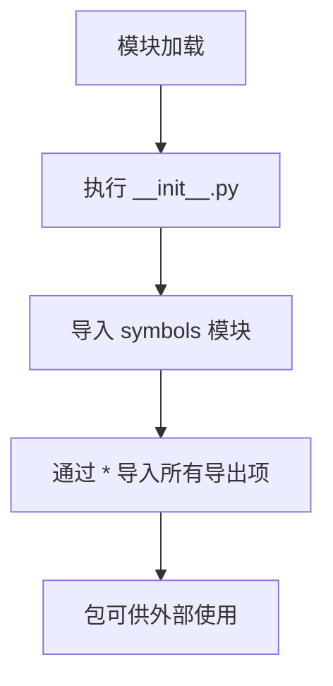

# `Bert-VITS2\onnx_modules\V240_ZH\text\__init__.py` 详细设计文档

这是一个Python包的入口文件，通过相对导入从同目录下的symbols模块导入所有公开接口（类、函数、变量），作为包的初始化和统一导出层。

## 整体流程



## 类结构

```
该文件仅为入口文件，无类定义
实际类结构需查看 symbols 模块
```

## 全局变量及字段


    

## 全局函数及方法


## 关键组件


### 核心功能概述

该代码是一个Python包模块的导入语句，通过相对导入从同包的symbols模块中导入所有符号定义，为当前模块提供符号常量和函数的访问能力。

### 文件运行流程

该代码在模块加载时执行，Python解释器会首先定位当前包（由`__init__.py`或包目录定义），然后导入symbols模块的所有导出内容，使当前命名空间可以访问这些符号。

### 模块组成信息

由于该文件仅包含导入语句，未定义类、函数或变量，因此无法提供详细的类方法、字段或全局函数信息。实际的符号定义位于symbols模块中。

### 关键组件信息

#### 符号模块导入机制

- **描述**: 通过`from .symbols import *`实现的相对导入机制，用于从同包模块获取符号定义

### 潜在技术债务与优化空间

1. **导入膨胀**: 使用`import *`会导致命名空间污染，无法明确知道导入了哪些符号，建议显式导入需要的符号
2. **可维护性差**: 难以追踪符号的实际来源，建议使用显式的导入列表
3. **静态分析困难**: 自动化工具难以分析`import *`的内容依赖

### 其它说明

由于提供的代码仅为导入语句，缺少实际的实现代码，无法完成以下部分的详细文档：
- 类的详细信息（字段、方法）
- 完整的函数签名和实现
- 张量索引、惰性加载、反量化、量化策略等具体功能的文档
- 错误处理设计
- 数据流与状态机

建议提供symbols模块的实际代码内容以完成详细设计文档。


## 问题及建议


### 已知问题

-   使用 `from .symbols import *` 通配符导入会导致命名空间污染，无法明确知道从 symbols 模块导入了哪些符号，破坏代码的可读性和可维护性
-   缺少 `__all__` 变量定义，无法明确控制公开 API 的导出，外部使用者不清楚哪些是可用的公共接口
-   缺少模块级文档字符串，无法了解该模块的设计意图和功能职责
-   完全没有类型提示信息，降低了代码的静态分析能力和 IDE 智能提示支持
-   对 symbols 模块形成了强耦合依赖，symbols 模块的任何变更都可能直接影响到该模块的导入行为
-   没有错误处理机制，如果 symbols 模块不存在或导入失败，错误信息不够明确

### 优化建议

-   改为显式导入需要的符号，例如 `from .symbols import SymbolA, SymbolB`，避免通配符导入
-   在模块开头定义 `__all__` 列表，明确列出允许导出的公共接口，如 `__all__ = ['SymbolA', 'SymbolB']`
-   添加模块级文档字符串，说明该模块的功能和用途
-   考虑添加类型注解以提升代码质量
-   添加 try-except 错误处理，提高模块的健壮性
-   如果 symbols 模块内容较多，考虑重构为更细粒度的导入结构


## 其它


### 设计目标与约束

该模块的主要目标是通过通配符导入（from .symbols import *）将symbols模块中定义的所有公共符号（symbols）引入当前命名空间，以便在其他模块中直接使用这些符号而无需前缀。该设计遵循Python的模块化编程规范，实现模块间的符号共享。约束条件包括：symbols模块必须存在且可访问；导入的符号应为公开符号（不以单下划线前缀开头）；Python版本需支持相对导入语法（Python 3.x）。

### 错误处理与异常设计

该导入语句可能触发的异常情况包括：ModuleNotFoundError（当symbols模块不存在时）、ImportError（当symbols模块存在但无法加载时）、SyntaxError（相对导入在不支持的上下文中使用）。由于仅包含导入语句，异常处理应由调用方或上层模块负责。建议在try-except块中包装对此模块的导入操作，以便优雅地处理导入失败情况。

### 外部依赖与接口契约

该模块依赖于symbols子模块的存在。接口契约规定：symbols模块应定义至少一个公开的符号（类、函数、变量或常量）供外部使用；symbols模块的公共API应保持稳定，避免破坏性变更；若symbols模块导出大量符号，建议在symbols模块中显式定义__all__列表以控制导入行为。

### 模块关系图

该模块在包结构中处于子模块位置，与其他模块的关系如下：主包（__init__.py或其他模块）可能导入当前模块；当前模块依赖symbols子模块；使用该模块的代码将通过导入链间接使用symbols中定义的符号。无符号的情况下，该模块可能作为包结构的占位符或用于未来扩展。

### 使用场景

该导入模式适用于以下场景：在包内部创建便捷导入路径，将子模块的公共接口提升到当前模块层级；实现模块级的命名空间组织；为外部提供统一的访问入口。当symbols模块包含大量相关符号且需要统一导出时，此模式可简化导入语句。

### 性能考虑

该导入语句在模块首次被导入时执行一次，后续对模块的引用将使用缓存的模块对象。使用from .symbols import *可能会导入不必要的符号，影响内存占用和导入速度。建议在symbols模块中明确定义__all__列表以限制导入范围，或考虑使用显式导入（from .symbols import SymbolA, SymbolB）以提高可读性和性能。

### 安全性考虑

使用通配符导入（import *）可能导入未知名称，增加命名空间污染风险。恶意或错误的symbols模块定义可能覆盖内置函数或重要变量。建议在symbols模块中使用__all__显式声明允许导入的符号，或在调用方使用显式导入以提高代码可预测性和安全性。

### 可测试性

该模块本身不包含可测试逻辑，其测试应针对symbols模块进行。若symbols模块包含可测试的符号，测试文件可通过导入当前模块或直接导入symbols模块来访问这些符号进行单元测试。测试策略应关注symbols模块中各符号的功能正确性。

### 兼容性说明

该相对导入语法要求代码在Python 3包结构中运行，不适用于Python 2（Python 2中使用相对导入需使用from . import symbols语法或显式包名）。确保部署环境使用Python 3.3+以支持隐式命名空间包特性，或确保包中包含__init__.py文件以支持传统包结构。

### 版本历史与变更记录

当前版本为初始版本，代码仅包含基础的相对导入语句。后续可能的变更包括：根据业务需求在symbols模块中添加具体符号定义；根据Python版本兼容性要求调整导入语法；为支持更精细的导入控制，可能将通配符导入替换为显式导入。

    