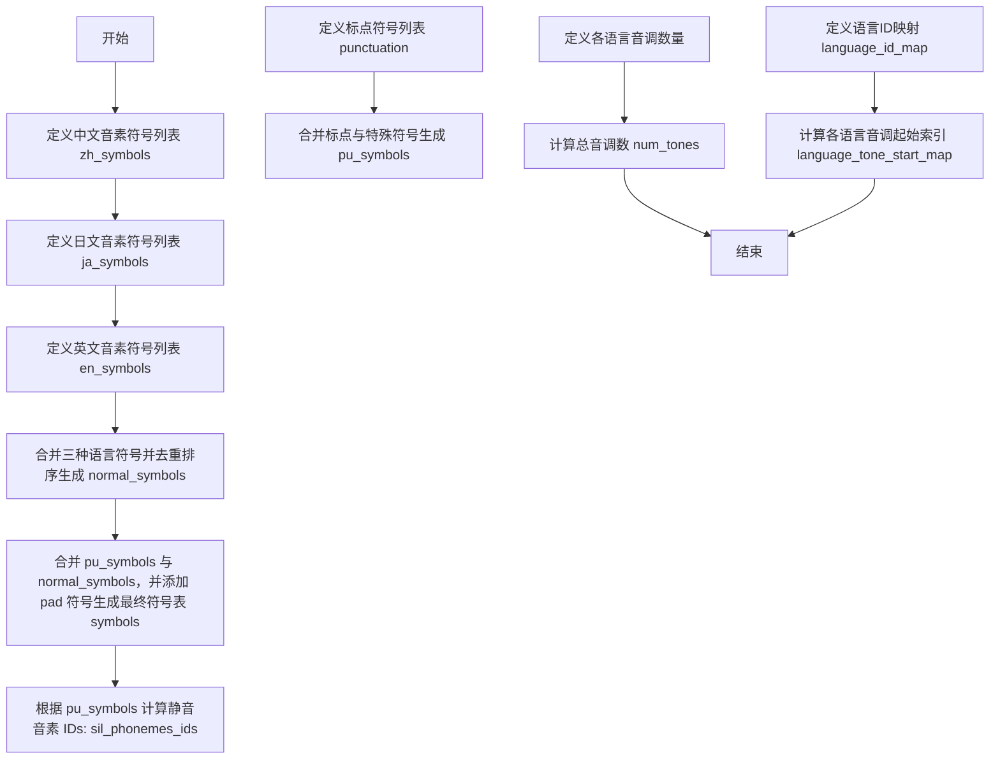

# `Bert-VITS2\onnx_modules\V240_ZH\text\symbols.py` 详细设计文档

本代码定义了用于语音合成或识别系统的统一音素符号表（phoneme symbols），整合了中文（ZH）、日文（JP）和英文（EN）三种语言的音素集合、标点符号及特殊标记（如填充符和未知符），并提供了语言ID映射、音调数量统计及音调起始索引映射，为多语言语音处理模型提供基础数据支持。

## 整体流程



## 类结构

```
无类层次结构（数据初始化脚本）
```

## 全局变量及字段


### `punctuation`
    
List of punctuation symbols used in phoneme processing

类型：`list[str]`
    


### `pu_symbols`
    
List of punctuation symbols plus special symbols SP (space) and UNK (unknown)

类型：`list[str]`
    


### `pad`
    
Padding symbol used for sequence alignment in model input

类型：`str`
    


### `zh_symbols`
    
List of Chinese pinyin phoneme symbols

类型：`list[str]`
    


### `num_zh_tones`
    
Number of tonal categories in Chinese (including neutral tone)

类型：`int`
    


### `ja_symbols`
    
List of Japanese phoneme symbols (romaji based)

类型：`list[str]`
    


### `num_ja_tones`
    
Number of tonal categories in Japanese (2: accented and unaccented)

类型：`int`
    


### `en_symbols`
    
List of English ARPABET phoneme symbols

类型：`list[str]`
    


### `num_en_tones`
    
Number of tonal categories in English (stress-based)

类型：`int`
    


### `normal_symbols`
    
Deduplicated and sorted combination of Chinese, Japanese and English phoneme symbols

类型：`list[str]`
    


### `symbols`
    
Complete phoneme symbol list including pad, normal symbols and punctuation symbols

类型：`list[str]`
    


### `sil_phonemes_ids`
    
List of indices corresponding to silence/punctuation phonemes in the symbols list

类型：`list[int]`
    


### `num_tones`
    
Total number of tonal categories across all supported languages

类型：`int`
    


### `language_id_map`
    
Mapping from language codes (ZH, JP, EN) to integer language IDs

类型：`dict[str, int]`
    


### `num_languages`
    
Total number of supported languages in the system

类型：`int`
    


### `language_tone_start_map`
    
Mapping indicating the starting tone index for each language in the combined tone space

类型：`dict[str, int]`
    


    

## 全局函数及方法


## 关键组件


### 音素符号表定义模块

该代码模块定义了用于多语言语音合成的音素符号系统，通过整合中文、日文和英文的音素符号，建立统一的符号索引表和语言声调映射关系，为后续语音处理提供基础数据支撑。

### 文件整体运行流程

1. 定义标点符号和特殊符号集合
2. 分别定义中文、日文、英文的音素符号列表及对应声调数量
3. 合并去重所有语言符号并添加填充符和特殊符号
4. 生成静音音素的索引列表
5. 计算总声调数量并建立语言ID和声调起始位置的映射表
6. 主程序测试部分用于查找中英文符号交集

### 关键组件信息

#### punctuation / pu_symbols

标点符号列表，包含句号、逗号、问号等常见符号；pu_symbols在此基础上增加了SP（空格）和UNK（未知）两个特殊标记。

#### zh_symbols / num_zh_tones

中文音素符号列表，包含61个汉语拼音音素；num_zh_tones表示中文拥有6个声调级别。

#### ja_symbols / num_ja_tones

日文音素符号列表，包含43个假名音素；num_ja_tones表示日文拥有2种音调类型。

#### en_symbols / num_en_tones

英文音素符号列表，包含39个国际音标(IPA)音素；num_en_tones表示英文拥有4种重音类型。

#### normal_symbols / symbols

通过sorted(set())合并三大语言符号并去重排序的统一符号集；symbols在normal_symbols基础上添加pad（填充符）作为首元素，形成完整的词汇表。

#### sil_phonemes_ids

静音音素在symbols中的索引位置列表，用于语音合成中的停顿处理。

#### language_id_map / num_languages

语言标识符到整数ID的映射字典（ZH:0, JP:1, EN:2）；num_languages表示支持的语言种类总数。

#### language_tone_start_map

每种语言声调索引的起始偏移量映射，用于在统一的音素序列中区分不同语言的声调。

### 潜在技术债务与优化空间

1. **硬编码维护问题**：所有符号列表以字面量形式硬编码，当需要扩展语言支持或修改符号集时需要直接修改源码
2. **缺少数据验证**：未对符号唯一性、索引连续性等关键属性进行运行时校验
3. **主程序逻辑不清晰**：if __name__ == "__main__"块中的交集测试代码与模块核心功能无关，应分离至独立测试文件
4. **缺乏类型注解**：变量和函数缺少类型提示，影响代码可读性和IDE支持
5. **扩展性受限**：语言和符号的定义方式难以支持运行时动态添加新语言或自定义音素

### 其它项目

#### 设计目标与约束

本模块作为语音合成系统的数据定义层，核心目标是为不同语言提供统一且无重叠的音素符号表。设计约束包括：符号索引的连续性（用于向量映射）、声调系统的独立性（避免语言间声调冲突）、以及填充符必须位于索引0位置（符合padding约定）。

#### 错误处理与异常设计

当前实现缺少显式错误处理机制。建议增加：符号重复检测（通过set验证）、索引越界保护（生成sil_phonemes_ids时）、language_id_map键值存在性校验等防御性编程实践。

#### 数据流与状态机

数据流为单向流动：语言特定符号列表 → 合并去重 → 完整符号表 → 索引映射表。无状态机设计，纯数据转换模块。

#### 外部依赖与接口契约

该模块为纯Python实现，无外部依赖。接口契约包括：symbols列表第一个元素必须为pad字符串、language_id_map必须包含ZH/JP/EN三个键、sil_phonemes_ids返回的索引必须有效且可迭代。


## 问题及建议


### 已知问题

-   **全局变量过度使用**：所有变量（如`punctuation`、`zh_symbols`等）均为全局变量，缺乏封装，导致命名空间污染和可维护性差。
-   **硬编码值缺乏解释**：音调数量（如`num_zh_tones = 6`）和语言映射等硬编码值未提供注释或文档说明，增加后续理解和修改难度。
-   **代码缺乏文档**：模块、类、函数均无文档字符串（docstring），难以理解其用途和设计意图。
-   **调试代码混入生产代码**：`if __name__ == "__main__":`块中的逻辑仅用于调试测试，不应存在于最终代码中，或应移至测试模块。
-   **可扩展性差**：添加新语言或符号需要手动修改多处（如`language_id_map`、`language_tone_start_map`等），违背了开闭原则。
-   **无错误处理**：计算`sil_phonemes_ids`时使用`index`方法，若符号不存在会直接抛出`ValueError`，缺乏容错机制。
-   **符号集合冗余**：不同语言符号列表存在重复（如"a"、"i"等），虽然后续合并，但原始数据存在冗余，且合并逻辑依赖于运行时计算。

### 优化建议

-   **封装为配置类或模块**：将语言相关配置封装到配置类或专用模块中，通过类属性或函数参数传递，减少全局变量。
-   **引入配置文件**：使用JSON、YAML或Python配置文件管理语言、符号和音调数量，便于扩展和维护。
-   **添加文档字符串**：为模块、类、函数添加详细的文档字符串，说明用途、参数、返回值和示例。
-   **分离调试代码**：移除`if __name__ == "__main__"`块中的调试代码，或将其移至单独的测试文件。
-   **动态语言映射**：设计数据驱动的架构，通过读取配置自动生成语言映射和音调起始索引，提高可扩展性。
-   **增强错误处理**：在计算索引时添加异常处理，例如使用`try-except`或先检查符号是否存在。
-   **优化符号合并**：在定义阶段就考虑共享符号，减少运行时重复计算，并使用枚举或常量类管理符号。


## 其它


### 设计目标与约束

本模块作为多语言语音合成系统的音素符号定义层，核心目标是统一管理中文、日文、英文三种语言的音素符号集合，并提供语言ID映射和音调起始位置计算功能。设计约束包括：保持符号列表的有序性和唯一性，确保各语言符号集无冲突，支持动态扩展新语言或符号，需与上游声学模型和下游拼接模块保持符号ID一致性。

### 错误处理与异常设计

由于本模块主要包含数据定义而非运行时逻辑，错误处理场景相对有限。主要风险点包括：符号列表中存在重复元素（通过set去重处理）、语言ID映射键值不匹配（依赖Python字典的KeyError）、符号索引越界（symbols列表访问时）。当前实现未包含显式的异常捕获机制，建议在调用sil_phonemes_ids或language_tone_start_map等计算结果前增加断言检查，确保索引有效性。

### 数据流与状态机

本模块的数据流为单向流动：自上而下分为三层——第一层为原始符号定义（punctuation、zh_symbols、ja_symbols、en_symbols），第二层为合并去重后的normal_symbols，第三层为最终输出symbols列表（含pad填充符）和派生计算结果（sil_phonemes_ids、language_tone_start_map）。无状态机设计，所有计算均为确定性函数，无副作用。

### 外部依赖与接口契约

本模块无外部第三方依赖，仅使用Python标准库（set、sorted、len、list.index）。接口契约包括：symbols列表索引0位置必须为填充符pad（"_"），language_id_map的键必须为标准语言代码（"ZH"/"JP"/"EN"），sil_phonemes_ids返回的ID列表必须全部落在pu_symbols范围内，language_tone_start_map提供各语言音调ID的起始偏移量，供下游模块计算绝对音调ID。

### 性能考虑

当前实现为纯数据定义模块，无运行时性能瓶颈。潜在优化点：若symbols列表访问频繁（如在推理循环中），可将symbols转换为dict以实现O(1)查找而非当前的O(n)列表查找；若后续扩展至数十种语言，可考虑将静态计算结果（sil_phonemes_ids、language_tone_start_map）预计算后持久化，避免每次导入时重新计算。

### 安全性考虑

本模块为数据定义文件，不涉及用户输入处理、网络通信或文件I/O，安全性风险较低。但需注意：symbols列表内容来自硬编码定义，若来源不可控需增加输入校验；symbols中的"UNK"符号用于处理未知情况，需确保下游模型能正确处理该特殊标记。

### 配置管理

当前配置采用代码内硬编码方式管理，适合静态场景。若需动态配置，建议将符号定义迁移至JSON/YAML配置文件，通过配置驱动支持不同语言组合的灵活切换。当前配置项包括：punctuation（标点符号集）、各语言符号列表、各语言音调数量、语言ID映射关系。

### 版本兼容性

本模块使用纯Python标准库，无版本兼容性问题。但需注意：Python 3.6及以下版本中字典保持插入顺序未强制保证（3.7+已明确），若在旧版本环境运行且依赖language_id_map的顺序，需改用collections.OrderedDict或显式维护有序列表。

### 测试策略

建议补充以下测试用例：验证symbols[0]等于pad值"_"，验证normal_symbols无重复元素（len(set(normal_symbols)) == len(normal_symbols)），验证所有语言符号均已包含在symbols中（set(zh_symbols+ja_symbols+en_symbols) ⊆ set(symbols)），验证sil_phonemes_ids中的所有ID均指向pu_symbols中的符号，验证language_tone_start_map中相邻语言的音调范围无重叠。

### 部署相关

本模块作为基础配置层，通常打包为共享库或工具模块部署。部署要点：确保symbols列表长度与训练时一致（否则会导致模型输入维度不匹配），建议在部署包中包含版本号或哈希值校验，确保推理环境与训练环境的符号表完全一致，避免因符号顺序差异导致输出异常。


    