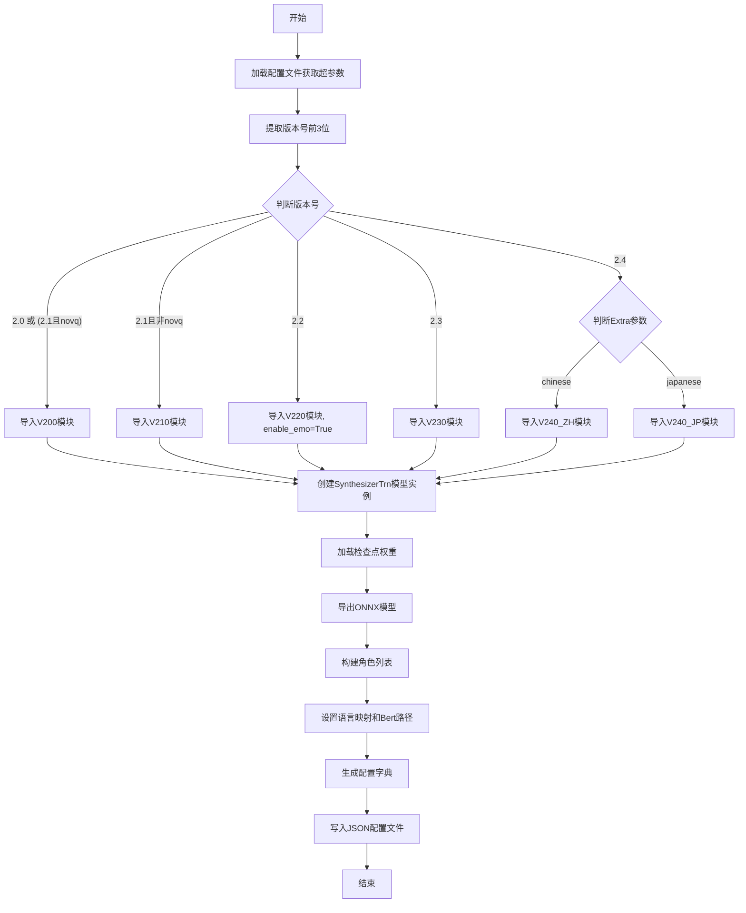
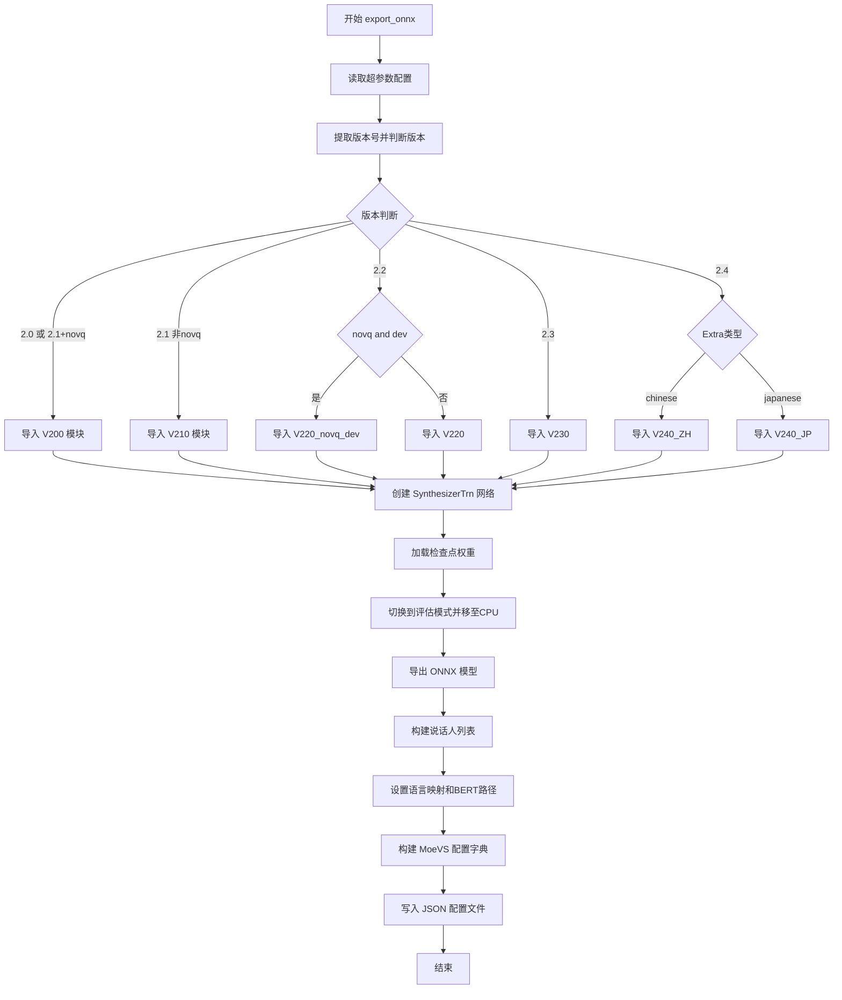

# `Bert-VITS2\onnx_modules\__init__.py` 详细设计文档

这是一个BertVITS2模型的ONNX导出工具，根据不同版本号动态加载对应的模型架构（V200-V240），加载预训练检查点，将模型导出为ONNX格式，并生成配套的JSON配置文件。

## 整体流程



## 类结构

```
无显式类定义（脚本级代码）
导出的模块层次:
├── V200 (SynthesizerTrn, symbols)
├── V210 (SynthesizerTrn, symbols)
├── V220 (SynthesizerTrn, symbols)
├── V220_novq_dev (SynthesizerTrn, symbols)
├── V230 (SynthesizerTrn, symbols)
├── V240_ZH (SynthesizerTrn, symbols)
└── V240_JP (SynthesizerTrn, symbols)
```

## 全局变量及字段


### `hps`
    
从配置文件加载的超参数配置对象，包含模型、数据和训练相关参数

类型：`超参数配置对象 (Hps/dict)`
    


### `version`
    
版本号字符串，取自hps.version的前3位，用于判断模型版本

类型：`str`
    


### `enable_emo`
    
情感模型启用标志，决定是否启用情感相关功能

类型：`bool`
    


### `BertPaths`
    
BERT模型路径列表，包含不同语言对应的预训练模型路径

类型：`List[str]`
    


### `net_g`
    
VITS声学模型生成器网络实例，负责音频合成

类型：`SynthesizerTrn (生成器网络模型)`
    


### `spklist`
    
说话人名称列表，从spk2id字典键中提取的所有可用说话人

类型：`List[str]`
    


### `LangDict`
    
语言映射字典，定义ZH/JP/EN三种语言对应的语言ID和韵律ID

类型：`Dict[str, List[int]]`
    


### `BertSize`
    
BERT模型维度，通常为1024或2048，根据模型类型决定

类型：`int`
    


### `MoeVSConf`
    
ONNX导出配置字典，包含模型导出所需的所有配置信息

类型：`Dict[str, Any]`
    


    

## 全局函数及方法


### `export_onnx`

该函数是RVC（Retrieval-based Voice Conversion）模型的ONNX导出主导出函数，根据版本号动态加载对应的模型类（V200/V210/V220/V230/V240），将训练好的Pytorch模型转换为ONNX格式，并生成配套的配置文件（JSON），用于后续推理部署。

#### 参数

- `export_path`：`str`，导出路径，指定ONNX模型和配置文件的输出文件名（不含扩展名）
- `model_path`：`str`，模型路径，训练好的Pytorch检查点文件路径（.pth文件）
- `config_path`：`str`，配置文件路径，超参数配置文件路径（.yaml或.json）
- `novq`：`bool`，是否禁用向量量化，True表示使用非VQ模型（适用于V2.0/V2.1/V2.2）
- `dev`：`bool`，是否为开发模式，True表示使用开发版本模型（仅V2.2生效）
- `Extra`：`str`，额外语言参数，指定语言类型（"chinese"或"japanese"，仅V2.4生效）

#### 返回值

`None`，函数通过文件输出（ONNX模型 + JSON配置）而非返回值传递结果

#### 流程图

```mermaid
flowchart TD
    A[开始 export_onnx] --> B[加载配置文件 get_hparams_from_file]
    B --> C[提取版本号 version = hps.version[0:3]]
    C --> D{版本判断}
    D -->|2.0 或 2.1+novq| E[导入 V200 模块]
    D -->|2.1 非novq| F[导入 V210 模块]
    D -->|2.2+novq+dev| G[导入 V220_novq_dev 模块]
    D -->|2.2 其他| H[导入 V220 模块]
    D -->|2.3| I[导入 V230 模块]
    D -->|2.4| J[导入 V240_ZH 或 V240_JP 模块]
    E --> K[实例化 SynthesizerTrn 模型]
    F --> K
    G --> K
    H --> K
    I --> K
    J --> K
    K --> L[net_g.eval 设为评估模式]
    L --> M[load_checkpoint 加载模型权重]
    M --> N[net_g.cpu 移至CPU]
    N --> O[net_g.export_onnx 导出ONNX模型]
    O --> P[遍历 spk2id 构建说话人列表]
    P --> Q[构建 MoeVSConf 配置字典]
    Q --> R{版本是否为2.4}
    R -->|是| S[根据Extra设置BertPaths和BertSize]
    R -->|否| T[使用默认配置]
    S --> U[写入JSON配置文件]
    T --> U
    U --> V[结束]
```

#### 带注释源码

```python
def export_onnx(export_path, model_path, config_path, novq, dev, Extra):
    """
    导出RVC模型为ONNX格式并生成配置文件
    
    参数:
        export_path: 导出路径（不含扩展名）
        model_path: 模型检查点路径
        config_path: 超参数配置文件路径
        novq: 是否禁用向量量化
        dev: 是否为开发模式
        Extra: 额外语言参数（chinese/japanese）
    """
    # 步骤1: 从配置文件加载超参数
    hps = get_hparams_from_file(config_path)
    
    # 步骤2: 提取版本号（取前3位，如"2.0", "2.1"等）
    version = hps.version[0:3]
    
    # 步骤3: 初始化情绪标记和BERT模型路径列表
    enable_emo = False  # 是否启用情绪模型
    BertPaths = [
        "chinese-roberta-wwm-ext-large",    # 中文BERT
        "deberta-v2-large-japanese",         # 日文BERT
        "bert-base-japanese-v3",             # 日文BERT备选
    ]
    
    # 步骤4: 根据版本号动态导入对应的模型类
    if version == "2.0" or (version == "2.1" and novq):
        # V2.0或V2.1(无VQ)版本
        from .V200 import SynthesizerTrn, symbols
    elif version == "2.1" and (not novq):
        # V2.1(有VQ)版本
        from .V210 import SynthesizerTrn, symbols
    elif version == "2.2":
        # V2.2版本支持情绪嵌入
        enable_emo = True
        if novq and dev:
            # V2.2开发版（无VQ）
            from .V220_novq_dev import SynthesizerTrn, symbols
        else:
            # V2.2正式版
            from .V220 import SynthesizerTrn, symbols
    elif version == "2.3":
        # V2.3版本，修改日文BERT路径
        from .V230 import SynthesizerTrn, symbols
        BertPaths[1] = "deberta-v2-large-japanese-char-wwm"
    elif version == "2.4":
        # V2.4版本支持中日语种
        enable_emo = True
        if Extra == "chinese":
            from .V240_ZH import SynthesizerTrn, symbols
        if Extra == "japanese":
            from .V240_JP import SynthesizerTrn, symbols
    
    # 步骤5: 实例化合成器模型
    net_g = SynthesizerTrn(
        len(symbols),                              # 音素符号数量
        hps.data.filter_length // 2 + 1,           # 频谱维度
        hps.train.segment_size // hps.data.hop_length,  # 音频帧数
        n_speakers=hps.data.n_speakers,            # 说话人数量
        **hps.model,                               # 模型超参数
    )
    
    # 步骤6: 设置评估模式并加载预训练权重
    _ = net_g.eval()  # 设为评估模式（禁用dropout等）
    _ = load_checkpoint(model_path, net_g, None, skip_optimizer=True)
    
    # 步骤7: 移至CPU并导出ONNX模型
    net_g.cpu()  # 移至CPU（ONNX导出需要在CPU上进行）
    net_g.export_onnx(export_path)
    
    # 步骤8: 构建说话人列表
    spklist = []
    for key in hps.data.spk2id.keys():
        spklist.append(key)
    
    # 步骤9: 构建语言映射字典
    LangDict = {"ZH": [0, 0], "JP": [1, 6], "EN": [2, 8]}
    BertSize = 1024
    
    # 步骤10: V2.4版本特殊配置
    if version == "2.4":
        # 根据语言选择BERT模型和维度
        BertPaths = (
            ["Erlangshen-MegatronBert-1.3B-Chinese"]
            if Extra == "chinese"
            else ["deberta-v2-large-japanese-char-wwm"]
        )
        if Extra == "chinese":
            BertSize = 2048  # 中文大模型使用2048维
    
    # 步骤11: 构建ONNX推理配置字典
    MoeVSConf = {
        "Folder": f"{export_path}",
        "Name": f"{export_path}",
        "Type": "BertVits",
        "Symbol": symbols,
        "Cleaner": "",
        "Rate": hps.data.sampling_rate,
        "CharaMix": True,
        "Characters": spklist,
        "LanguageMap": LangDict,
        "Dict": "BasicDict",
        "BertPath": BertPaths,
        "Clap": ("clap-htsat-fused" if enable_emo else False),
        "BertSize": BertSize,
    }
    
    # 步骤12: 写入JSON配置文件到onnx目录
    with open(f"onnx/{export_path}.json", "w") as MoeVsConfFile:
        json.dump(MoeVSConf, MoeVsConfFile, indent=4)
```


### `export_onnx`

该函数是RVC（Retrieval-based Voice Conversion）模型的ONNX导出工具，根据配置版本号动态加载对应的模型模块（V200/V210/V220/V230/V240），加载预训练权重后将模型导出为ONNX格式，并生成配套的JSON配置文件供MoeVS使用。

参数：

- `export_path`：`str`，导出ONNX文件的路径前缀
- `model_path`：`str`，预训练模型检查点文件路径
- `config_path`：`str`，超参数配置文件路径
- `novq`：`bool`，是否使用无量化版本的模型
- `dev`：`bool`，是否为开发版本（仅2.2版本有效）
- `Extra`：`str`，额外配置，指定语言类型（如"chinese"或"japanese"）

返回值：`None`，该函数无返回值，主要通过文件IO导出模型和配置

#### 流程图



#### 带注释源码

```python
from utils import get_hparams_from_file, load_checkpoint
import json


def export_onnx(export_path, model_path, config_path, novq, dev, Extra):
    # 1. 从配置文件加载超参数
    hps = get_hparams_from_file(config_path)
    
    # 2. 提取版本号（取前3位，如"2.0", "2.1", "2.2"等）
    version = hps.version[0:3]
    
    # 3. 初始化情感增强标志和BERT模型路径列表
    enable_emo = False
    BertPaths = [
        "chinese-roberta-wwm-ext-large",
        "deberta-v2-large-japanese",
        "bert-base-japanese-v3",
    ]
    
    # 4. 根据版本号动态导入对应的模型模块
    if version == "2.0" or (version == "2.1" and novq):
        # 版本2.0或2.1无量化版本：使用V200模块
        from .V200 import SynthesizerTrn, symbols
    elif version == "2.1" and (not novq):
        # 版本2.1有量化版本：使用V210模块
        from .V210 import SynthesizerTrn, symbols
    elif version == "2.2":
        # 版本2.2：启用情感增强，根据novq和dev标志选择模块
        enable_emo = True
        if novq and dev:
            from .V220_novq_dev import SynthesizerTrn, symbols
        else:
            from .V220 import SynthesizerTrn, symbols
    elif version == "2.3":
        # 版本2.3：使用V230模块，更新日文BERT路径
        from .V230 import SynthesizerTrn, symbols
        BertPaths[1] = "deberta-v2-large-japanese-char-wwm"
    elif version == "2.4":
        # 版本2.4：启用情感增强，根据语言类型选择模块
        enable_emo = True
        if Extra == "chinese":
            from .V240_ZH import SynthesizerTrn, symbols
        if Extra == "japanese":
            from .V240_JP import SynthesizerTrn, symbols
    
    # 5. 创建SynthesizerTrn生成器网络实例
    net_g = SynthesizerTrn(
        len(symbols),                           # 音素符号数量
        hps.data.filter_length // 2 + 1,       # 频谱维度
        hps.train.segment_size // hps.data.hop_length,  # 音频帧数
        n_speakers=hps.data.n_speakers,        # 说话人数量
        **hps.model,                           # 展开模型配置参数
    )
    
    # 6. 设置为评估模式并加载预训练权重
    _ = net_g.eval()
    _ = load_checkpoint(model_path, net_g, None, skip_optimizer=True)
    
    # 7. 将模型移至CPU并导出ONNX格式
    net_g.cpu()
    net_g.export_onnx(export_path)
    
    # 8. 从配置中提取所有说话人ID构建列表
    spklist = []
    for key in hps.data.spk2id.keys():
        spklist.append(key)
    
    # 9. 定义语言映射字典（语言代号 -> [某种ID, 某种ID]）
    LangDict = {"ZH": [0, 0], "JP": [1, 6], "EN": [2, 8]}
    BertSize = 1024
    
    # 10. 针对2.4版本特殊处理BERT路径和尺寸
    if version == "2.4":
        BertPaths = (
            ["Erlangshen-MegatronBert-1.3B-Chinese"]
            if Extra == "chinese"
            else ["deberta-v2-large-japanese-char-wwm"]
        )
        if Extra == "chinese":
            BertSize = 2048
    
    # 11. 构建MoeVS完整配置字典
    MoeVSConf = {
        "Folder": f"{export_path}",              # 导出文件夹路径
        "Name": f"{export_path}",                # 模型名称
        "Type": "BertVits",                      # 模型类型
        "Symbol": symbols,                       # 音素符号表
        "Cleaner": "",                           # 文本清理器（空）
        "Rate": hps.data.sampling_rate,         # 采样率
        "CharaMix": True,                        # 是否启用角色混合
        "Characters": spklist,                   # 角色/说话人列表
        "LanguageMap": LangDict,                # 语言映射
        "Dict": "BasicDict",                     # 词典类型
        "BertPath": BertPaths,                   # BERT模型路径
        "Clap": ("clap-htsat-fused" if enable_emo else False),  # 情感分类模型
        "BertSize": BertSize,                   # BERT隐藏层尺寸
    }
    
    # 12. 将配置写入JSON文件（保存到onnx目录下）
    with open(f"onnx/{export_path}.json", "w") as MoeVsConfFile:
        json.dump(MoeVSConf, MoeVsConfFile, indent=4)
```

## 关键组件


### 版本检测与模型选择

根据version参数（2.0/2.1/2.2/2.3/2.4）和novq、dev、Extra标志动态导入对应的模型实现类（V200/V210/V220/V220_novq_dev/V230/V240_ZH/V240_JP），支持不同版本的VITS模型架构差异化管理。

### BERT路径管理

根据模型版本和语言类型（Extra参数：chinese/japanese）动态配置BERT预训练模型路径列表（BertPaths），支持chinese-roberta-wwm-ext-large、deberta-v2-large-japanese等多种BERT模型，并为2.4版本中文模型配置Erlangshen-MegatronBert-1.3B。

### 情绪增强控制

通过enable_emo标志控制是否启用情绪增强功能，在版本2.0/2.2/2.4中根据novq和dev参数决定是否加载支持情绪嵌入的模型变体，2.4版本中文模型配置Clap为"clap-htsat-fused"。

### 模型实例化与检查点加载

使用hps配置参数创建SynthesizerTrn模型实例，传入音素符号数量、滤波器长度、segment_size、speaker数量等关键参数，通过load_checkpoint函数加载预训练权重并设置为评估模式。

### ONNX导出引擎

调用net_g.export_onnx方法将PyTorch模型转换为ONNX格式，支持跨框架部署，包含完整的推理图结构和算子映射。

### 说话人列表构建

遍历hps.data.spk2id字典提取所有说话人名称，构建spklist列表用于后续配置文件生成，支持多说话人模型的身份映射。

### 配置文件生成

构建MoeVSConf字典，包含模型名称、符号集、采样率、说话人列表、语言映射、BERT路径、BERT维度等关键配置信息，并序列化为JSON文件保存到onnx目录。

### 张量索引与惰性加载

模型采用惰性加载策略，仅在版本检测后按需导入对应模块，通过load_checkpoint实现检查点的条件加载，避免全量模型预加载带来的内存开销。

### 量化策略支持

通过novq参数支持无量化（novq）模式选择，区分v1/v2/v3量化策略路径，2.1版本明确区分novq和量化版本，2.2版本支持novq_dev开发模式。


## 问题及建议


### 已知问题

-   **版本号比较逻辑脆弱**：`version = hps.version[0:3]` 使用字符串切片比较版本号，当版本号为 "2.10" 或更高版本时会出错，会被错误截取为 "2.1"
-   **魔法数字和硬编码值**：BertPaths列表、BertSize (1024/2048)、LangDict字典中的值均为硬编码，缺少配置文件或常量定义
-   **动态导入缺乏错误处理**：多个条件分支中的 `from .Vxxx import` 导入语句如果失败，错误信息不够明确，难以定位问题
-   **路径遍历风险**：`f"{export_path}"` 和 `f"onnx/{export_path}.json"` 直接使用用户传入的路径，未进行安全校验，可能存在路径遍历漏洞
-   **缺少输入验证**：未验证 config_path、model_path、export_path 是否存在或有效
- **配置构建逻辑分散**：MoeVSConf 字典的多个字段分散在不同代码块中构建，后续维护困难
- **异常处理缺失**：整个导出流程没有任何 try-except 包裹，任意一步失败都会导致程序崩溃
- **全局状态修改**：BertPaths 列表被直接修改（赋值和append操作），违反了函数式编程原则

### 优化建议

-   **重构版本比较逻辑**：使用正则表达式或版本号解析库（如 `packaging.version`）进行语义化版本比较
-   **提取配置常量**：将 BertPaths、LangDict、BertSize 等配置抽离为独立的配置文件或常量类
-   **添加路径验证**：在文件操作前验证路径有效性，防止路径遍历攻击
-   **增加异常处理**：为关键步骤（加载配置、加载模型、导出ONNX、写入JSON）添加 try-except 块并记录详细错误信息
-   **解耦配置构建**：将 MoeVSConf 的构建逻辑封装为独立函数或类，提高可维护性
-   **模块化导入逻辑**：将版本与模块的映射关系抽取为字典或配置表，避免大量的 if-elif 分支
-   **添加类型注解和文档字符串**：为函数参数和返回值添加类型提示，编写清晰的文档说明
-   **考虑配置化设计**：将不同版本的特性差异（是否支持emo、是否需要novq等）通过配置文件管理，减少代码中的条件分支


## 其它


### 设计目标与约束

将VITS语音合成模型导出为ONNX格式，支持多版本（2.0-2.4）和多语言（中文、日文、英文）的模型转换，生成MoeVS框架所需的配置文件。约束条件：依赖特定版本的模型实现（V200/V210/V220/V230/V240），需要对应的checkpoint文件和配置文件。

### 错误处理与异常设计

导入模块失败时抛出ImportError并提示版本号不匹配；文件读写失败时抛出IOError；模型加载失败时传播load_checkpoint的异常；版本号不匹配时程序直接退出（无显式异常处理）。

### 数据流与状态机

输入：config_path（配置文件路径）、model_path（模型权重路径）、export_path（导出路径）、novq（是否无量化）、dev（是否为开发版本）、Extra（语言类型）。输出：ONNX模型文件、JSON配置文件。主状态机：根据version分支选择不同模型实现，根据Extra选择语言变体。

### 外部依赖与接口契约

依赖get_hparams_from_file加载配置、load_checkpoint加载权重、各版本模型类（SynthesizerTrn）、symbols符号集。输出JSON配置文件遵循MoeVS规范，包含Folder、Name、Type、Symbol、Rate、Characters、LanguageMap、BertPath、Clap、BertSize等字段。

### 版本兼容性说明

2.0版本仅支持novq模式；2.1版本根据novq标志选择实现；2.2版本支持emo，novq+dev组合有独立实现；2.3版本仅支持日语BERT路径替换；2.4版本支持中日语分离，启用emo，选用不同BERT模型（中文Erlangshen-MegatronBert-1.3B，日语deberta-v2-large-japanese-char-wwm）。

### 性能考虑与优化空间

模型导出后立即移至CPU（net_g.cpu()）以节省显存；使用eval()模式禁用Dropout；skip_optimizer=True跳过优化器状态以减小导出文件体积。建议：可添加批量导出支持、异步写入配置文件、版本兼容性检查日志。

### 安全性考虑

直接使用f字符串拼接export_path至JSON字段存在路径注入风险（虽然此处为内部工具）；配置文件明文存储无加密；模型文件路径未做规范化检查。

### 部署注意事项

需确保utils模块（get_hparams_from_file、load_checkpoint）可用；需要预先安装对应版本的模型实现模块（.V200/.V210等）；导出目录onnx/需预先创建或依赖写入时的自动创建；Clap模型（enable_emo为True时）需要额外下载。

### 测试策略建议

单元测试：验证各版本分支的模块导入、配置文件生成内容、版本号解析逻辑。集成测试：使用真实模型文件进行完整导出流程，验证生成的ONNX文件可加载推理。


    