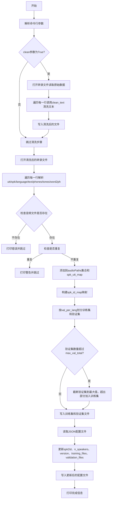
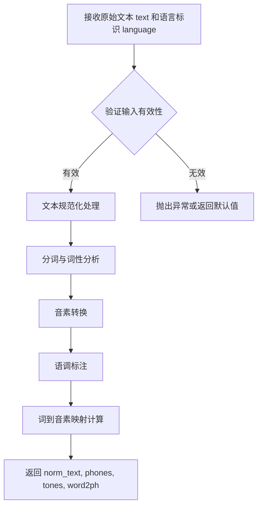
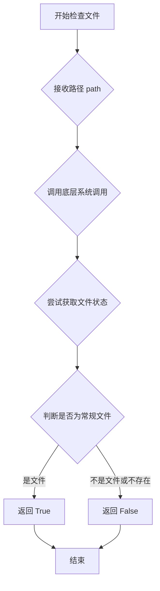
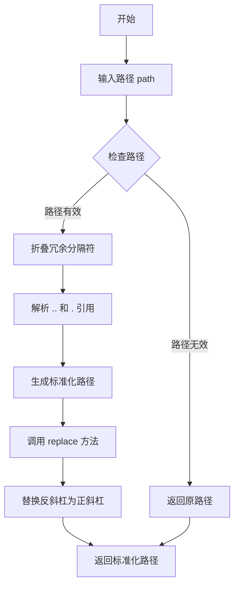
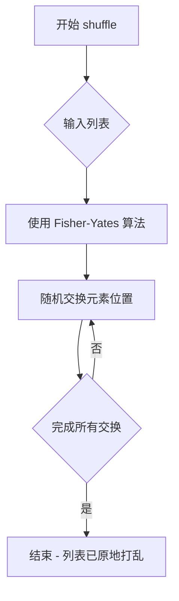
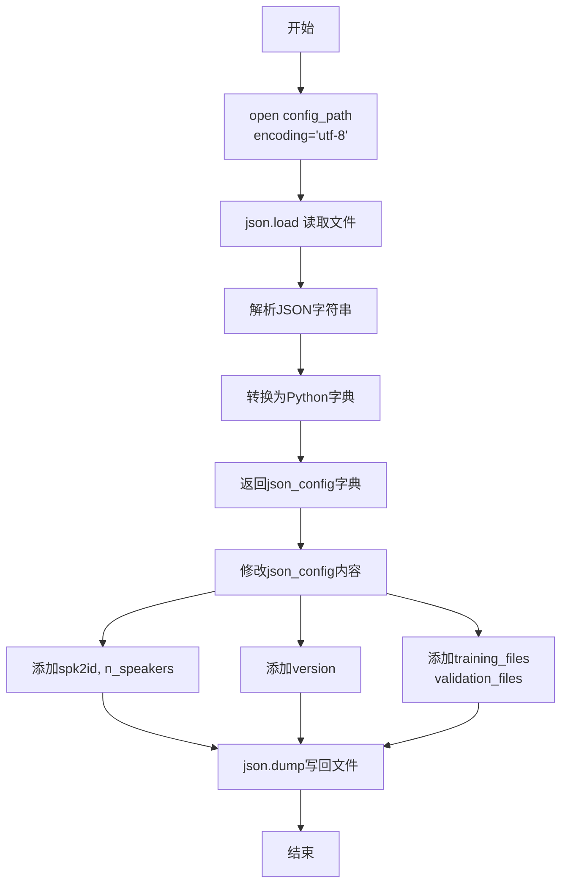
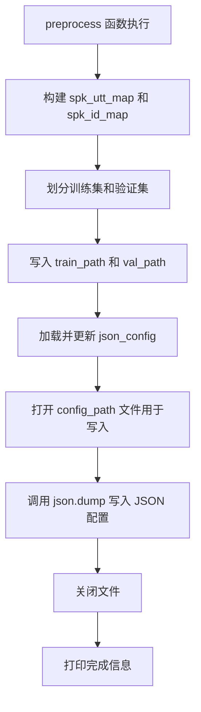

# `Bert-VITS2\preprocess_text.py` 详细设计文档

该脚本是文本转语音(TTS)系统的数据预处理模块，用于读取转录文件、清洗文本、按语言和说话人分组样本、划分训练集和验证集，并生成训练配置文件。

## 整体流程



## 类结构

```
此脚本为过程式代码，无类层次结构
主要包含一个命令行入口函数 preprocess()
依赖外部模块: text.cleaner (文本清洗), config (配置), infer (版本获取)
```

## 全局变量及字段


### `preprocess_text_config`
    
从config模块导入的预处理配置对象，包含各种路径和参数配置

类型：`object`
    


### `transcription_path`
    
转录文件路径，指向包含原始转录数据的文件

类型：`str`
    


### `cleaned_path`
    
清洗后文件路径，用于存储文本清洗后的结果

类型：`Optional[str]`
    


### `train_path`
    
训练集输出路径，指定训练数据文件的保存位置

类型：`str`
    


### `val_path`
    
验证集输出路径，指定验证数据文件的保存位置

类型：`str`
    


### `config_path`
    
配置文件路径，指向JSON格式的配置文件

类型：`str`
    


### `val_per_lang`
    
每语言验证集数量，从每种语言中选取的验证样本数

类型：`int`
    


### `max_val_total`
    
最大验证集总数，限制验证集的总样本数

类型：`int`
    


### `clean`
    
是否执行清洗的布尔标志，指示是否对文本进行清洗处理

类型：`bool`
    


### `yml_config`
    
YAML配置文件路径，保留参数以兼容CLI接口

类型：`str`
    


### `audioPaths`
    
已处理音频路径集合，用于去重和验证音频文件存在性

类型：`set`
    


### `countSame`
    
重复音频计数，统计重复出现的音频文本对数量

类型：`int`
    


### `countNotFound`
    
未找到音频计数，统计不存在的音频文件数量

类型：`int`
    


### `spk_utt_map`
    
说话人到utterances列表的映射，按语言分组存储每个说话人的所有 utterances

类型：`defaultdict(list)`
    


### `spk_id_map`
    
说话人名称到ID的映射，为每个唯一说话人分配递增的ID

类型：`dict`
    


### `current_sid`
    
当前说话人ID计数器，用于分配新的说话人ID

类型：`int`
    


### `train_list`
    
训练集列表，存储用于训练的数据行

类型：`list`
    


### `val_list`
    
验证集列表，存储用于验证的数据行

类型：`list`
    


### `json_config`
    
JSON配置字典，加载并修改后的配置文件内容

类型：`dict`
    


    

## 全局函数及方法


### `preprocess`

这是语音合成数据预处理的核心命令行函数，负责将转录文本转换为训练集和验证集。该函数完成以下任务：如果启用清理模式，则调用`clean_text`对文本进行规范化处理（生成音素、语调、词到音素映射）；读取转录文件并过滤重复或不存在的音频文件；按说话者划分训练集和验证集；将划分结果写入文件并更新配置文件中的说话者ID映射。

参数：

- `transcription_path`：`str`，原始转录文件路径，包含utt|spk|language|text格式的数据
- `cleaned_path`：`Optional[str]`，清理后的转录文件路径，默认为转录路径加".cleaned"后缀
- `train_path`：`str`，训练集输出路径
- `val_path`：`str`，验证集输出路径
- `config_path`：`str`，JSON配置文件路径，用于存储数据集元信息
- `val_per_lang`：`int`，每个语言/说话者保留的验证集样本数量
- `max_val_total`：`int`，验证集最大总数，超过时将多余样本并入训练集
- `clean`：`bool`，是否执行文本清理操作
- `yml_config`：`str`，YAML配置文件路径（保留参数，暂未使用）

返回值：`None`，该函数通过命令行执行，不返回值

#### 流程图

```mermaid
flowchart TD
    A[开始] --> B{clean参数为True?}
    B -->|是| C[打开转录文件和清理输出文件]
    C --> D[逐行读取转录数据]
    D --> E[调用clean_text规范文本]
    E --> F[写入规范化后的数据到cleaned文件]
    F --> G{还有更多行?}
    G -->|是| D
    G -->|否| H[关闭文件]
    B -->|否| I[cleaned_path = transcription_path]
    H --> I
    I --> J[打开cleaned转录文件]
    J --> K[初始化speaker-utt映射和speaker-ID映射]
    K --> L[逐行读取cleaned数据]
    L --> M[解析utt|spk|language|text|phones|tones|word2ph]
    M --> N{音频文件不存在?}
    N -->|是| O[打印错误并跳过]
    N -->|否| P{utt重复?}
    P -->|是| Q[打印警告并跳过]
    P -->|否| R[添加utt到audioPaths集合]
    R --> S[将line添加到spk_utt_map对应language的列表]
    S --> T{speaker不在spk_id_map中?}
    T -->|是| U[分配新的speaker ID]
    T -->|否| V{还有更多行?}
    U --> V
    V -->|是| L
    V -->|否| W[打乱每个speaker的utt列表]
    W --> X[划分val_list和train_list]
    X --> Y{val_list数量超过max_val_total?}
    Y -->|是| Z[将超出的样本移入train_list]
    Y -->|否| AA[写入train_path文件]
    AA --> AB[写入val_path文件]
    AB --> AC[读取config_path的JSON配置]
    AC --> AD[更新spk2id和n_speakers]
    AD --> AE[更新version和数据集文件路径]
    AE --> AF[保存JSON配置]
    AF --> AG[打印完成信息]
    AG --> AH[结束]
```

#### 带注释源码

```python
# 导入必要的模块
import json
from collections import defaultdict
from random import shuffle
from typing import Optional
import os

from tqdm import tqdm  # 进度条库
import click  # CLI命令行接口库
from text.cleaner import clean_text  # 文本清理函数
from config import config  # 配置对象
from infer import latest_version  # 获取最新版本号

# 从配置对象中获取预处理文本配置
preprocess_text_config = config.preprocess_text_config


# 使用click装饰器定义命令行接口
@click.command()
@click.option(
    "--transcription-path",
    default=preprocess_text_config.transcription_path,
    type=click.Path(exists=True, file_okay=True, dir_okay=False),
)
@click.option("--cleaned-path", default=preprocess_text_config.cleaned_path)
@click.option("--train-path", default=preprocess_text_config.train_path)
@click.option("--val-path", default=preprocess_text_config.val_path)
@click.option(
    "--config-path",
    default=preprocess_text_config.config_path,
    type=click.Path(exists=True, file_okay=True, dir_okay=False),
)
@click.option("--val-per-lang", default=preprocess_text_config.val_per_lang)
@click.option("--max-val-total", default=preprocess_text_config.max_val_total)
@click.option("--clean/--no-clean", default=preprocess_text_config.clean)
@click.option("-y", "--yml_config")
def preprocess(
    transcription_path: str,
    cleaned_path: Optional[str],
    train_path: str,
    val_path: str,
    config_path: str,
    val_per_lang: int,
    max_val_total: int,
    clean: bool,
    yml_config: str,  # 这个不要删
):
    """
    预处理函数：将转录文本转换为训练集和验证集
    
    处理流程：
    1. 如果clean=True，清理文本并生成cleaned文件
    2. 读取cleaned文件，构建speaker-utterance映射
    3. 过滤重复音频和不存在音频
    4. 划分训练集和验证集
    5. 保存结果文件并更新配置文件
    """
    
    # 处理cleaned_path为空的情况
    if cleaned_path == "" or cleaned_path is None:
        cleaned_path = transcription_path + ".cleaned"

    # 步骤1：文本清理（如果启用）
    if clean:
        # 以写入模式打开清理后的文件
        with open(cleaned_path, "w", encoding="utf-8") as out_file:
            # 以读取模式打开原始转录文件
            with open(transcription_path, "r", encoding="utf-8") as trans_file:
                lines = trans_file.readlines()
                # 遍历每一行，使用tqdm显示进度
                if len(lines) != 0:
                    for line in tqdm(lines):
                        try:
                            # 解析行数据：utt|spk|language|text
                            utt, spk, language, text = line.strip().split("|")
                            # 调用clean_text进行文本规范化
                            # 返回：norm_text（规范化文本）, phones（音素）, tones（语调）, word2ph（词到音素映射）
                            norm_text, phones, tones, word2ph = clean_text(
                                text, language
                            )
                            # 写入规范化后的数据，格式：utt|spk|language|text|phones|tones|word2ph
                            out_file.write(
                                "{}|{}|{}|{}|{}|{}|{}\n".format(
                                    utt,
                                    spk,
                                    language,
                                    norm_text,
                                    " ".join(phones),
                                    " ".join([str(i) for i in tones]),
                                    " ".join([str(i) for i in word2ph]),
                                )
                            )
                        except Exception as e:
                            # 发生错误时打印原始行和错误信息
                            print(line)
                            print(f"生成训练集和验证集时发生错误！, 详细信息:\n{e}")

    # 使用cleaned文件作为后续处理的输入
    transcription_path = cleaned_path
    
    # 步骤2：构建speaker-utterance映射
    spk_utt_map = defaultdict(list)  # 按language分组存储utterances
    spk_id_map = {}  # speaker名称到ID的映射
    current_sid = 0  # 当前speaker ID计数器

    # 读取cleaned文件并过滤无效数据
    with open(transcription_path, "r", encoding="utf-8") as f:
        audioPaths = set()  # 用于检测重复音频
        countSame = 0  # 重复音频计数
        countNotFound = 0  # 未找到音频计数
        
        # 逐行处理：格式为utt|spk|language|text|phones|tones|word2ph
        for line in f.readlines():
            utt, spk, language, text, phones, tones, word2ph = line.strip().split("|")
            
            # 过滤：检查音频路径是否重复
            if utt in audioPaths:
                # 过滤数据集错误：相同的音频匹配多个文本，导致后续bert出问题
                print(f"重复音频文本：{line}")
                countSame += 1
                continue
            
            # 过滤：检查音频文件是否存在
            if not os.path.isfile(utt):
                # 过滤数据集错误：不存在对应音频
                print(f"没有找到对应的音频：{utt}")
                countNotFound += 1
                continue
            
            # 记录有效的音频路径
            audioPaths.add(utt)
            
            # 按language分组存储utterance
            spk_utt_map[language].append(line)
            
            # 为speaker分配ID（如果尚未分配）
            if spk not in spk_id_map.keys():
                spk_id_map[spk] = current_sid
                current_sid += 1
        
        # 打印统计信息
        print(f"总重复音频数：{countSame}，总未找到的音频数:{countNotFound}")

    # 步骤3：划分训练集和验证集
    train_list = []
    val_list = []

    # 按speaker打乱并划分数据
    for spk, utts in spk_utt_map.items():
        shuffle(utts)
        val_list += utts[:val_per_lang]  # 每个speaker取前val_per_lang条作为验证集
        train_list += utts[val_per_lang:]  # 剩余的作为训练集

    # 打乱验证集顺序
    shuffle(val_list)
    
    # 限制验证集最大数量
    if len(val_list) > max_val_total:
        train_list += val_list[max_val_total:]  # 超出的部分并入训练集
        val_list = val_list[:max_val_total]  # 截断验证集

    # 步骤4：写入训练集和验证集文件
    with open(train_path, "w", encoding="utf-8") as f:
        for line in train_list:
            f.write(line)

    with open(val_path, "w", encoding="utf-8") as f:
        for line in val_list:
            f.write(line)

    # 步骤5：更新配置文件
    json_config = json.load(open(config_path, encoding="utf-8"))
    
    # 更新speaker相关配置
    json_config["data"]["spk2id"] = spk_id_map
    json_config["data"]["n_speakers"] = len(spk_id_map)
    
    # 更新版本和数据集路径
    json_config["version"] = latest_version
    json_config["data"]["training_files"] = os.path.normpath(train_path).replace(
        "\\", "/"
    )
    json_config["data"]["validation_files"] = os.path.normpath(val_path).replace(
        "\\", "/"
    )
    
    # 保存更新后的配置
    with open(config_path, "w", encoding="utf-8") as f:
        json.dump(json_config, f, indent=2, ensure_ascii=False)
    
    print("训练集和验证集生成完成！")


# 主程序入口
if __name__ == "__main__":
    preprocess()
```


### `clean_text`

外部导入的文本清洗函数，来自 `text.cleaner` 模块。该函数接收原始文本和语言标识，对文本进行规范化处理，生成音素序列、语调标注以及词到音素的映射关 系。

参数：

- `text`：`str`，待清洗的原始文本内容
- `language`：`str`，语言标识（如 "zh"、"en" 等）

返回值：

- `norm_text`：`str`，规范化处理后的文本
- `phones`：`list[str]`，音素序列列表
- `tones`：`list[int]`，语调标注列表
- `word2ph`：`list[int]`，词到音素的映射关系列表

#### 流程图



#### 带注释源码

```python
# 由于 clean_text 是从外部模块 text.cleaner 导入的，
# 此处展示其在 preprocess 函数中的调用方式

# 调用示例（来自 preprocess 函数第 52-55 行）：
norm_text, phones, tones, word2ph = clean_text(
    text, language  # 传入原始文本和语言标识进行清洗
)

# 返回值说明：
# norm_text: 规范化后的文本（如去除特殊字符、统一格式等）
# phones: 音素列表，如 ["a", "i", "u"]
# tones: 语调列表，如 [1, 2, 3]（对应声调）
# word2ph: 词到音素的映射，用于对齐
```


### `os.path.isfile`

检查指定路径是否是一个已存在的常规文件（不是目录或符号链接指向的非文件对象）。

参数：

- `path`：`str` 或 `Path`，要检查的文件路径，可以是字符串或 `pathlib.Path` 对象

返回值：`bool`，如果路径是一个已存在的常规文件则返回 `True`，否则返回 `False`

#### 流程图



#### 带注释源码

```python
# os.path.isfile 的实际实现位于 Python 标准库的 ntpath.py（Windows）或 posixpath.py（Unix）
# 下面是其核心逻辑的简化版本：

def isfile(path):
    """
    检查指定路径是否为已存在的常规文件
    
    参数:
        path: str 或 Path 对象，要检查的文件路径
        
    返回:
        bool: 如果 path 是一个已存在的常规文件返回 True，否则返回 False
    """
    try:
        # 使用 os.stat() 获取文件状态信息
        # 注意：isfile 内部会调用 stat() 并检查是否不是目录
        # 如果文件不存在或路径指向的是目录，则会抛出 FileNotFoundError 或 IsADirectoryError
        st = os.stat(path)
    except (OSError, ValueError):
        # OSError: 文件不存在或权限不足
        # ValueError: 路径格式无效
        return False
    else:
        # 检查 stat_result 是否表示常规文件（非目录、非链接等）
        # stat.S_ISREG(st.st_mode) 用于判断是否为常规文件
        return stat.S_ISREG(st.st_mode)
```

#### 在项目代码中的调用示例

```python
# 第 86 行在 provided code
if not os.path.isfile(utt):
    # 过滤数据集错误：不存在对应音频
    print(f"没有找到对应的音频：{utt}")
    countNotFound += 1
    continue
```

---

#### 关键组件信息

- **os.path.isfile**：用于验证音频文件是否真实存在于文件系统中，作为数据预处理阶段的过滤机制，避免训练时因文件缺失导致错误。

#### 潜在技术债务或优化空间

1. **频繁的文件系统调用**：在循环中逐个检查文件是否存在，当数据集规模较大时效率较低。可考虑使用并行 I/O 或批量预加载文件列表。
2. **未区分符号链接和实体文件**：当前实现会跟随符号链接，若希望区分对待，可考虑使用 `os.path.islink` 组合判断。
3. **硬编码的错误处理**：仅打印警告后跳过，未记录详细的失败日志供后续分析。


### `os.path.normpath`

`os.path.normpath` 是 Python 标准库 `os.path` 模块中的一个函数，用于规范化指定路径。该函数通过折叠冗余分隔符和上级目录引用（如 ".."）来生成标准化的路径表示。在本代码中，该函数用于确保训练文件和验证文件路径在不同操作系统（特别是 Windows 和 Unix-like 系统）间保持一致的格式，并通过 `.replace("\\", "/")` 将反斜杠替换为正斜杠，以适配跨平台需求。

参数：

- `path`：`str`，需要规范化的文件路径（在本代码中为 `train_path` 或 `val_path`）

返回值：`str`，返回规范化后的路径字符串（已替换为正斜杠格式）

#### 流程图



#### 带注释源码

```python
# os.path.normpath 函数使用示例（来自代码第130-133行）

# 对训练文件路径进行规范化处理
# normpath 会将路径中的冗余分隔符折叠，并解析 .. 和 . 引用
# 然后使用 replace 将反斜杠替换为正斜杠，确保跨平台兼容性
json_config["data"]["training_files"] = os.path.normpath(train_path).replace(
    "\\", "/"
)

# 对验证文件路径进行相同的规范化处理
json_config["data"]["validation_files"] = os.path.normpath(val_path).replace(
    "\\", "/"
)
```

#### 完整函数签名（参考 Python 官方文档）

```python
os.path.normpath(path)
```

**参数详解：**

- `path`：表示文件系统路径的字符串或类似路径的对象

**返回值：**

- 返回规范化后的路径字符串。规范化操作包括：
  - 将多个连续的分隔符折叠为单个分隔符
  - 解析 `.`（当前目录）和 `..`（父目录）引用
  - 在 POSIX 系统上保持原样
  - 在 Windows 系统上，将所有斜杠转换为反斜杠

**在本项目中的作用：**

1. 确保配置文件中的路径格式统一
2. 解决 Windows 和 Unix 系统路径分隔符不一致的问题
3. 配合 `.replace("\\", "/")` 将路径统一为正斜杠格式，增强跨平台兼容性


### `shuffle`

`shuffle` 函数是 Python 标准库 `random` 模块中的函数，在本代码中用于将每个说话者的音频文本列表随机打乱，以实现训练集和验证集的随机划分。

参数：

- `utts`：`list`，需要打乱的列表（这里是每个说话者的音频文本列表）

返回值：`None`，该函数为原地操作，不返回新列表，直接修改原列表顺序

#### 流程图



#### 带注释源码

```python
# 从 random 模块导入 shuffle 函数
from random import shuffle

# 在代码中第81行的使用示例：
for spk, utts in spk_utt_map.items():
    shuffle(utts)  # 将每个说话者的音频文本列表随机打乱
    val_list += utts[:val_per_lang]      # 取前 val_per_lang 条作为验证集
    train_list += utts[val_per_lang:]     # 剩余的作为训练集

# shuffle 函数说明：
# - 函数签名: shuffle(x, random=None)
# - 参数 x: 需要打乱的列表（原地修改，不返回新列表）
# - 参数 random: 可选的随机函数，默认使用 random() 
# - 返回值: None（原地修改）
# - 使用 Fisher-Yates 洗牌算法实现
```


### `json.load`

从JSON文件中加载数据并解析为Python对象（通常是字典）。

参数：

- `fp`：`file object`，通过`open()`打开的JSON文件对象

返回值：`dict`，JSON文件解析后的Python字典对象

#### 流程图



#### 带注释源码

```python
# 读取JSON配置文件
# open(config_path, encoding='utf-8'): 打开配置文件路径，返回文件对象
# json.load(): 读取文件对象并解析JSON内容为Python字典
json_config = json.load(open(config_path, encoding="utf-8"))

# 后续使用示例：
# 添加说话人ID映射到配置
json_config["data"]["spk2id"] = spk_id_map
# 添加说话人数量
json_config["data"]["n_speakers"] = len(spk_id_map)
# 添加训练版本号
json_config["version"] = latest_version
# 添加训练和验证文件路径（标准化路径分隔符）
json_config["data"]["training_files"] = os.path.normpath(train_path).replace("\\", "/")
json_config["data"]["validation_files"] = os.path.normpath(val_path).replace("\\", "/")

# 将修改后的配置写回原文件
with open(config_path, "w", encoding="utf-8") as f:
    json.dump(json_config, f, indent=2, ensure_ascii=False)
```


### `preprocess.json_dump`

描述：使用 `json.dump` 将处理后的配置数据（包含说话人映射、数据集路径等）写入配置文件，以格式化 JSON 格式保存，供后续训练使用。

参数：

- `json_config`：`dict`，包含处理后的配置信息，包括 `spk2id`（说话人到ID的映射）、`n_speakers`（说话人数量）、`version`（训练版本）、`training_files`（训练文件路径）、`validation_files`（验证文件路径）
- `f`：`file object`，已打开的用于写入的文件对象（通过 `open(config_path, "w", encoding="utf-8")` 打开）
- `indent`：`int`，设置为 2，表示使用 2 个空格缩进，使 JSON 文件格式化更易读
- `ensure_ascii`：`bool`，设置为 `False`，允许写入非 ASCII 字符（如中文），保持字符编码

返回值：`None`，该函数直接将数据写入文件，不返回任何值

#### 流程图



#### 带注释源码

```python
# 打开配置文件路径，以写入模式打开，指定 UTF-8 编码
with open(config_path, "w", encoding="utf-8") as f:
    # 使用 json.dump 将更新后的配置写入文件
    # 参数说明：
    #   json_config: 要写入的字典对象
    #   f: 文件对象
    #   indent=2: 使用 2 空格缩进格式化
    #   ensure_ascii=False: 允许非 ASCII 字符直接写入
    json.dump(json_config, f, indent=2, ensure_ascii=False)
```

## 关键组件


### 文本清洗模块 (clean_text)

该组件负责将原始文本转换为标准化文本、音素序列、韵律标记和词到音素的映射关系，是TTS预处理的核心步骤，通过`text.cleaner`模块的`clean_text`函数实现，支持多语言文本规范化处理。

### 说话人-音频映射管理 (spk_utt_map & spk_id_map)

该组件使用`defaultdict`存储按语言分组的说话人-utterance映射关系，同时维护说话人ID映射表，用于后续模型训练中的说话人嵌入和动态插值。

### 数据验证与过滤机制

该组件在数据加载阶段进行双重验证：检查重复音频（防止同一音频匹配多个文本导致BERT处理异常）和验证音频文件是否存在（过滤数据集错误），确保训练数据的完整性和一致性。

### 训练/验证集划分策略

该组件实现基于说话人的数据集划分逻辑，按指定数量（val_per_lang）从每个说话人的数据中抽取验证集，并可选限制验证集总量（max_val_total），通过随机打乱（shuffle）保证数据分布的随机性。

### 配置文件更新与管理

该组件负责将数据处理结果（说话人映射表、数据集路径、版本信息）写入JSON配置文件，供后续训练流程使用，支持路径标准化（跨平台路径分隔符统一）。

### 命令行接口 (Click CLI)

该组件使用Click框架定义预处理流程的可配置参数，包括文件路径、验证集策略、清洗开关等，通过装饰器模式实现灵活的命令行参数配置和默认值管理。


## 问题及建议


### 已知问题

- **异常处理过于宽泛**：使用 `except Exception as e` 捕获所有异常，缺乏针对性的异常处理策略，难以精准定位特定错误类型
- **文件操作资源未完全释放**：`json.load(open(config_path, encoding="utf-8"))` 未使用上下文管理器，可能导致文件句柄泄漏
- **代码重复**：写入训练集和验证集文件的逻辑完全重复，未封装为函数复用
- **魔法数字与硬编码**：分隔符 `"|"` 在多处重复出现，且某些处理逻辑缺乏清晰的常量定义
- **内存效率问题**：一次性将所有行读入内存 (`lines = trans_file.readlines()`)，大文件场景可能导致内存溢出
- **日志记录不规范**：使用 `print` 进行日志输出，缺乏统一的日志级别管理，不便于生产环境调试
- **函数职责过重**：`preprocess` 函数承担了数据清洗、分割、写入、配置更新等多项职责，违反单一职责原则
- **数据验证缺失**：对输入文件格式、字段数量、类型等缺乏前置校验，错误信息延迟到运行时才暴露
- **类型注解不完整**：函数内部变量缺乏类型注解，降低了代码可维护性和 IDE 辅助能力

### 优化建议

- **细化异常处理**：针对不同错误类型（如文件不存在、格式错误、数据缺失）分别捕获并处理，提供具体的错误上下文
- **统一资源管理**：所有文件操作均使用 `with` 语句，确保资源正确释放
- **提取公共逻辑**：将文件写入、路径规范化、JSON 配置更新等重复逻辑封装为独立函数
- **引入常量定义**：将分隔符、默认值等提取为模块级常量或配置项
- **使用生成器或分块处理**：对于大文件场景，改用流式处理或分块读取，降低内存占用
- **采用日志模块**：替换 `print` 为 `logging` 模块，支持分级日志和结构化输出
- **拆分函数职责**：将 `preprocess` 函数拆分为 `clean_text`、`split_dataset`、`write_files`、`update_config` 等独立函数
- **增加输入校验**：在处理前验证文件格式、字段完整性、必要文件是否存在等前置条件
- **完善类型注解**：为关键变量添加类型注解，提升代码可读性和类型安全
- **移除调试残留代码**：清理注释掉的调试代码和临时注释（如 `# 这个不要删`）

## 其它


### 设计目标与约束

本模块的设计目标是实现一个自动化的文本预处理流程，将原始转录文本转换为训练所需的格式，主要包括文本规范化、音频-文本对应关系验证、数据集分割（训练集/验证集）以及配置文件更新。核心约束包括：1）输入的转录文件必须符合特定的管道分隔格式（utt|spk|language|text）；2）音频文件必须存在于指定路径；3）验证集大小受max_val_total和val_per_lang双重约束；4）所有路径处理需兼容Windows和Linux文件系统。

### 错误处理与异常设计

代码采用try-except块捕获文本清洗过程中的异常，遇到错误时打印原行内容和错误详情后继续处理；文件不存在和重复音频通过条件判断进行过滤并打印警告信息；JSON配置文件加载失败会导致整个流程终止。异常处理粒度较粗，建议对不同类型的错误（文件IO错误、数据格式错误、配置错误）进行分类处理并记录到日志文件。

### 数据流与状态机

整体数据流分为四个阶段：第一阶段为文本清洗阶段（clean=True时执行），读取原始转录文件并调用clean_text函数生成规范化文本、音素序列、语调序列和词音素对齐；第二阶段为数据验证阶段，遍历清洗后的文本行，验证音频文件存在性并过滤重复项，同时按语言构建说话人-音频映射；第三阶段为数据集分割阶段，按语言分组后随机抽取val_per_lang条样本进入验证集，剩余进入训练集，并强制验证集不超过max_val_total上限；第四阶段为配置更新阶段，将说话人映射、版本信息和文件路径写入JSON配置文件。

### 外部依赖与接口契约

主要外部依赖包括：click库用于CLI命令定义和参数解析；tqdm用于显示文本处理进度条；text.cleaner模块的clean_text函数（需自行实现或从项目引入）；config模块的配置管理对象；infer模块的latest_version变量。输入文件格式要求为管道分隔的文本文件，每行包含7个字段（utt|spk|language|text|phones|tones|word2ph，清洗前为4个字段）；输出生成三个文件：清洗后的文本文件、训练集列表、验证集列表，以及更新后的JSON配置文件。

### 性能考虑与优化空间

当前实现的主要性能瓶颈包括：逐行读取文件并进行字符串split操作，建议使用pandas或polars进行向量化处理；文本清洗过程为串行执行，可考虑多进程并行化；验证音频文件存在性使用os.path.isfile逐个检查，大规模数据集时可使用multiprocessing.Pool或asyncio异步IO；内存中维护audioPaths集合可能导致内存占用过高，对于超大规模数据集可考虑使用sqlite或磁盘缓存。此外，代码中多次使用strip()和split("|")进行字符串处理，可提取为工具函数减少重复代码。

### 配置管理与参数说明

主要配置参数包括：transcription_path指定原始转录文件路径；cleaned_path指定清洗后文本输出路径，默认为转录文件名加.cleaned后缀；train_path和val_path分别指定训练集和验证集的输出路径；config_path指定待更新的JSON配置文件路径；val_per_lang指定每个语言/说话人的验证集样本数量；max_val_total指定验证集总样本数上限；clean布尔标志控制是否执行文本清洗步骤；yml_config参数保留用于配置继承但未实际使用。

### 输入输出格式规范

输入转录文件格式（清洗前）：每行为utt|speaker|language|text，其中utt为音频文件路径（用于后续验证），speaker为说话人标识，language为语言代码，text为原始文本。输入转录文件格式（清洗后）：每行为utt|speaker|language|norm_text|phones|tones|word2ph，其中norm_text为规范化后的文本，phones为空格分隔的音素序列，tones为空格分隔的语调序列，word2ph为空格分隔的词到音素对齐索引。输出配置文件在data字段下新增spk2id（说话人到ID映射）、n_speakers（说话人总数）、training_files（训练集路径）、validation_files（验证集路径），以及version字段记录数据版本。

### 安全性考虑

代码在文件操作中使用utf-8编码避免字符编码问题；文件路径通过os.path.normpath和replace进行跨平台规范化；未对输入路径进行恶意路径遍历检查（如../../../etc/passwd），建议添加路径规范化验证；配置文件更新采用覆盖模式而非追加，建议添加备份机制；命令行参数未进行长度和格式校验，可能存在注入风险。

### 兼容性考虑

代码使用Python标准库和常见第三方库，兼容Python 3.8及以上版本；文件路径处理使用os.path和replace方法处理Windows反斜杠和Linux正斜杠的转换；JSON配置文件读写使用utf-8编码，确保中文字符正确处理；random.shuffle使用Mersenne Twister算法，结果具有确定性（设置相同种子），但跨Python版本可能存在差异。

### 测试策略建议

建议添加单元测试覆盖：1）文本格式解析的正确性验证；2）不同语言代码的处理；3）边界条件（空文件、单条记录、超大文件）；4）音频文件不存在和重复情况的过滤逻辑；5）数据集分割比例的准确性；6）配置文件更新内容的完整性。集成测试应覆盖完整的预处理流程，使用模拟的转录文件和音频目录进行端到端验证。

### 部署与运行指南

运行方式：python preprocess.py --transcription-path /path/to/transcription.txt --train-path /path/to/train.txt --val-path /path/to/val.txt --config-path /path/to/config.json。依赖安装：pip install click tqdm。常见问题：若提示ModuleNotFoundError，需确保text.cleaner模块和config模块在Python路径中；若验证集为空，检查val_per_lang参数设置是否大于0且转录文件包含足够样本；若音频文件未找到，确认utt字段指向的音频文件路径正确且可访问。


    