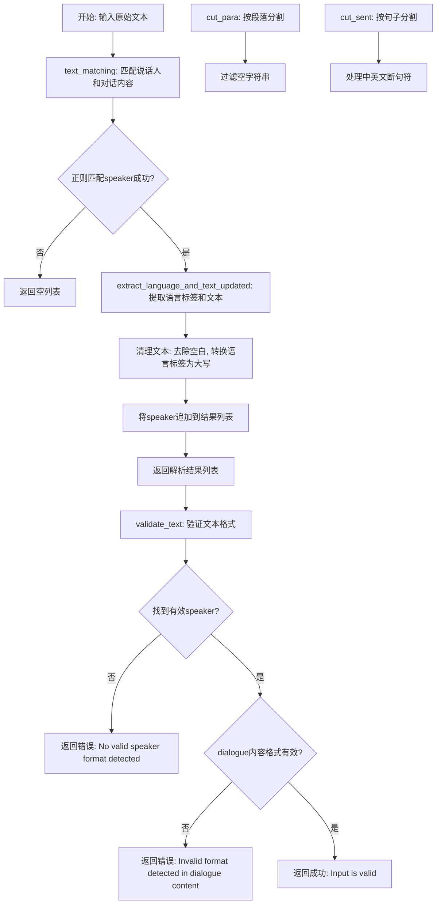
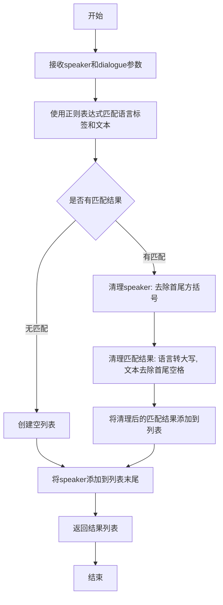
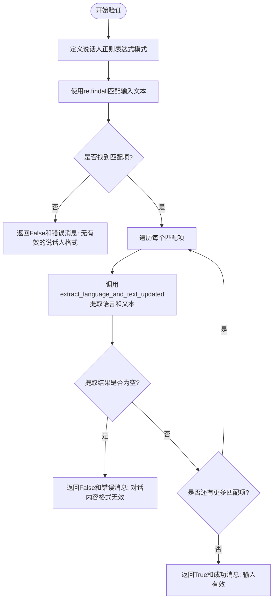
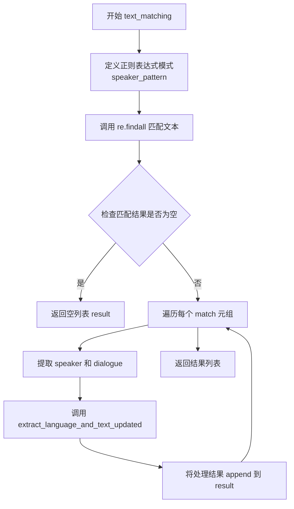
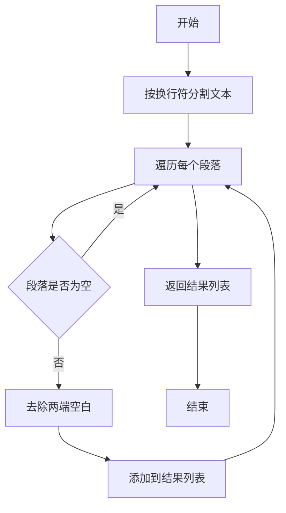
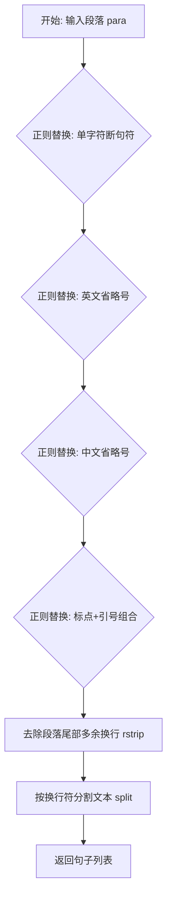

# `Bert-VITS2\re_matching.py` 详细设计文档

该代码是一个多语言对话文本解析和验证工具，通过正则表达式提取文本中说话人和其对应的多语言标签内容，支持文本格式验证、段落分割和句子断句，适用于处理包含多语言标签的对话数据。

## 整体流程



## 类结构

```
无类结构 (纯函数模块)
└── 全局函数集合
    ├── extract_language_and_text_updated
    ├── validate_text
    ├── text_matching
    ├── cut_para
    └── cut_sent
```

## 全局变量及字段


### `pattern_language_text`
    
模块级正则表达式，用于匹配对话中的语言标签及其后面的文本内容

类型：`str`
    


### `pattern_speaker`
    
模块级正则表达式，用于匹配说话人格式，包括方括号中的说话人标识和后续的对话内容

类型：`str`
    


### `speaker_pattern`
    
模块级正则表达式，用于匹配说话人及其对应的对话内容，支持多说话人场景

类型：`str`
    


    

## 全局函数及方法


### `extract_language_and_text_updated`

该函数用于从给定的对话内容中提取语言标签及其对应的文本，并返回包含所有语言-文本对以及说话人的列表。函数使用正则表达式匹配 `<语言>` 标签格式的内容，支持多种语言的识别与提取。

参数：

- `speaker`：`str`，说话人的标识，通常格式为 `[说话人1]`
- `dialogue`：`str`，包含语言标签的对话内容，例如 `<zh>你好吗？<jp>元気ですか？`

返回值：`list`，返回清洗后的语言-文本对列表，每个元素为元组 `(语言代码大写, 文本内容)`，列表最后一个元素为说话人名称

#### 流程图



#### 带注释源码

```python
def extract_language_and_text_updated(speaker, dialogue):
    # 使用正则表达式匹配<语言>标签和其后的文本
    # 模式说明: <(\S+?)> 匹配非空白字符组成的语言代码(如zh, jp等)
    # ([^<]+) 匹配到下一个<之前的所有文本内容
    # re.DOTALL标志使.能匹配包括换行符在内的所有字符
    pattern_language_text = r"<(\S+?)>([^<]+)"
    matches = re.findall(pattern_language_text, dialogue, re.DOTALL)
    
    # 清理speaker: 去除首尾的方括号,例如[说话人1] -> 说话人1
    speaker = speaker[1:-1]
    
    # 清理文本: 将语言代码转为大写,并去除文本两边的空白字符
    matches_cleaned = [(lang.upper(), text.strip()) for lang, text in matches]
    
    # 将说话人添加到结果列表的末尾
    matches_cleaned.append(speaker)
    
    # 返回格式: [(语言代码, 对话内容), ..., 说话人]
    return matches_cleaned
```


### `validate_text`

该函数用于验证输入文本的格式是否符合预定义的说话人及对话内容规范，通过正则表达式匹配说话人标签（如`[说话人1]`）及其后续的语言标签和文本内容，确保输入文本遵循正确的格式结构。

参数：

- `input_text`：`str`，需要验证的输入文本，包含说话人标签和对话内容

返回值：`tuple[bool, str]`，返回布尔值和消息元组。第一个元素为`True`表示验证通过，`False`表示验证失败；第二个元素为描述性消息，验证失败时说明具体错误原因，验证成功时确认输入有效。

#### 流程图



#### 带注释源码

```python
def validate_text(input_text):
    # 验证说话人的正则表达式
    # 匹配规则: [说话人标签] 后跟一个或多个 <语言标签>文本 内容
    # (\[\S+?\])  - 捕获说话人标签，如 [说话人1]
    # ((?:\s*<\S+?>[^<\[\]]+?)+) - 捕获对话内容，包含语言标签和对应文本
    pattern_speaker = r"(\[\S+?\])((?:\s*<\S+?>[^<\[\]]+?)+)"

    # 使用re.DOTALL标志使.匹配包括换行符在内的所有字符
    matches = re.findall(pattern_speaker, input_text, re.DOTALL)

    # 对每个匹配到的说话人内容进行进一步验证
    for _, dialogue in matches:
        # 调用辅助函数提取语言标签和文本内容
        language_text_matches = extract_language_and_text_updated(_, dialogue)
        # 如果提取结果为空，说明格式不符合规范
        if not language_text_matches:
            return (
                False,
                "Error: Invalid format detected in dialogue content. Please check your input.",
            )

    # 如果输入的文本中没有找到任何匹配项
    if not matches:
        return (
            False,
            "Error: No valid speaker format detected. Please check your input.",
        )

    # 所有验证通过
    return True, "Input is valid."
```


### `text_matching`

该函数是文本解析模块的核心入口函数，通过正则表达式从输入文本中提取说话人和对应的对话内容，识别语言标签并清理文本格式，最终返回结构化的对话数据列表。

参数：

- `text`：`str`，待匹配的原始文本，包含多个说话人及其对话内容

返回值：`list`，返回嵌套列表结构，每个元素为包含语言标识和对应文本的元组列表，最后附加说话人信息

#### 流程图



#### 带注释源码

```python
def text_matching(text: str) -> list:
    """
    从文本中提取说话人和对话内容
    
    参数:
        text: str - 输入的原始文本，包含多个说话人及其对话内容
        
    返回:
        list - 结构化的对话数据列表
    """
    # 定义匹配说话人的正则表达式模式
    # \[\S+?]  匹配方括号中的说话人名称，如 [说话人1]
    # (.+?)     非贪婪匹配对话内容
    # (?=\[\S+?]|$) 前瞻断言，匹配到下一个说话人或文本结束
    speaker_pattern = r"(\[\S+?\])(.+?)(?=\[\S+?\]|$)"
    
    # 使用 DOTALL 标志使 . 匹配包括换行符在内的所有字符
    matches = re.findall(speaker_pattern, text, re.DOTALL)
    
    # 初始化结果列表
    result = []
    
    # 遍历每个匹配到的说话人-对话对
    for speaker, dialogue in matches:
        # 调用辅助函数提取语言和文本信息
        # 将提取结果添加到结果列表中
        result.append(extract_language_and_text_updated(speaker, dialogue))
    
    # 返回处理后的结果列表
    return result
```


### `cut_para`

该函数用于将输入的文本按换行符分割成多个段落，并过滤掉空字符串，返回一个包含有效段落的列表。

参数：

- `text`：`str`，需要处理的原始文本字符串

返回值：`list`，返回分割并清理后的段落列表

#### 流程图



#### 带注释源码

```
def cut_para(text):
    """
    将文本按段落分割，去除空段落
    
    参数:
        text: 需要处理的原始文本
        
    返回:
        分割后的段落列表
    """
    # 步骤1: 使用正则表达式按换行符分割文本
    # re.split("[\n]", text) 会将文本按照换行符进行分割
    splitted_para = re.split("[\n]", text)
    
    # 步骤2: 遍历分割后的段落列表
    # 对每个段落进行两步处理:
    #   - strip(): 去除段落两端的空白字符（包括空格、制表符、换行符等）
    #   - if sentence.strip(): 过滤掉处理后为空的段落
    # 最终返回一个只包含有效段落的列表
    splitted_para = [
        sentence.strip() for sentence in splitted_para if sentence.strip()
    ]
    
    # 返回处理后的段落列表
    return splitted_para
```


### `cut_sent`

#### 描述

该函数主要用于文本预处理中的**分句**工作。它接收一个完整的段落字符串（通常包含中文或中英文混合文本），利用正则表达式识别特定的句末标点符号（如句号、问号、感叹号、省略号等）以及标点与引号的组合，在这些位置插入换行符 `\n`，最后通过换行符将段落拆分为一个包含多个句子的列表。

#### 参数

- `para`：`str`，需要分句的原始段落文本。

#### 返回值

- `list`，返回拆分后的句子列表，列表中的每个元素都是一个字符串（句子）。

#### 流程图



#### 带注释源码

```python
def cut_sent(para):
    # 1. 匹配句末单字符断句符（如 。 ！ ； ？ ?），在其后插入换行符
    #    逻辑：匹配标点(组1) 和 非引号字符(组2)，替换为 标点+换行+字符
    para = re.sub("([。！;？\?])([^”’])", r"\1\n\2", para)
    
    # 2. 匹配英文省略号 (...)，在其后插入换行符
    #    逻辑：匹配6个点(组1) 和 非引号字符(组2)
    para = re.sub("(\.{6})([^”’])", r"\1\n\2", para)
    
    # 3. 匹配中文省略号 (…)，在其后插入换行符
    #    逻辑：匹配2个中文省略号(组1) 和 非引号字符(组2)
    para = re.sub("(\…{2})([^”’])", r"\1\n\2", para)
    
    # 4. 处理句末标点紧跟引号的情况，在引号后换行，避免将引号单独留在行尾
    #    逻辑：匹配 句末标点+前引号(组1) 和 非标点字符(组2)
    para = re.sub("([。！？\?][”’])([^，。！？\?])", r"\1\n\2", para)
    
    # 5. 清理尾部：如果段尾有多余的换行符，去除它
    para = para.rstrip()
    
    # 6. 最终处理：使用换行符分割字符串，返回列表
    return para.split("\n")
```


## 关键组件


### 语言标签解析组件

从对话文本中提取语言标签（如\<zh\>、\<jp\>）及其对应的文本内容，使用正则表达式匹配并清理数据。

### 说话人识别组件

从输入文本中识别说话人标识（\[\S+?\]格式），并将其与后续的对话内容关联起来。

### 文本验证组件

验证输入文本是否符合预定义的格式规范，检查说话人格式和语言标签的合法性。

### 段落分割组件

按换行符将文本分割成段落，并过滤掉空字符串。

### 句子分割组件

根据中文和英文的句末标点符号（。！？?.;…）将段落进一步分割成句子。


## 问题及建议


### 已知问题

-   **正则表达式重复编译**：所有函数内的正则表达式模式（如`pattern_language_text`、`pattern_speaker`、`speaker_pattern`）在每次调用时都会重新编译，应该提取为模块级常量以提高性能
-   **类型注解不完整**：`extract_language_and_text_updated`函数缺少返回类型注解；`cut_para`和`cut_sent`函数完全缺少类型注解
-   **命名不一致**：函数名`extract_language_and_text_updated`带有"updated"后缀，表明是更新版本，但这种命名方式不够清晰且可能暗示存在旧版本代码
-   **文档字符串缺失**：所有函数都没有docstring，无法快速了解函数功能、参数和返回值含义
-   **魔法字符串和正则模式**：正则表达式模式散落在代码各处，没有常量统一管理，不利于维护和修改
-   **错误处理方式不统一**：`validate_text`返回布尔值和错误消息元组，而`cut_sent`和`cut_para`在输入为空时可能返回空列表但无明确说明
-   **正则表达式逻辑重复**：`pattern_speaker = r"(\[\S+?\])(.+?)(?=\[\S+?\]|$)"`在`validate_text`和`text_matching`中重复使用，应提取为共享常量
-   **变量名不够描述性**：如`splitted_para`、`para`等变量名可以更具描述性；`_`作为循环变量在`validate_text`中的使用虽然常见但不够清晰
-   **潜在的边界问题**：`extract_language_and_text_updated`中使用`[^<]+`匹配文本，如果文本中包含`<`字符可能导致匹配错误；`speaker = speaker[1:-1]`假设输入始终有方括号，但未做验证

### 优化建议

-   将所有正则表达式模式提取到模块顶部作为预编译常量，使用`re.compile()`预编译以提升性能
-   为所有函数添加完整的类型注解和docstring，说明参数、返回值和功能
-   统一错误处理方式，考虑使用自定义异常类或标准错误处理模式
-   将重复的`pattern_speaker`正则表达式提取为共享常量
-   改进变量命名使其更具描述性，如`splitted_para`改为`sentences`，`para`改为`paragraph`
-   添加对边界条件的处理和输入验证，如检查空输入、格式异常等
-   考虑将`extract_language_and_text_updated`重命名为更清晰的名称，如`extract_language_text_pairs`
-   添加单元测试覆盖各种边界情况和典型用例


## 其它


### 设计目标与约束

本代码是一个文本解析与验证工具，主要用于处理包含说话人标记和多语言标签的对话文本。设计目标包括：1）支持从文本中提取说话人及其对应的多语言内容；2）验证输入文本格式是否符合预定义的说话人-对话结构；3）提供段落分割和句子断句功能。约束条件：依赖Python标准库re模块，不支持自定义语言标签扩展，假设输入文本遵循特定的标签格式（如`<zh>`、`<jp>`等）。

### 错误处理与异常设计

代码采用返回值元组形式进行错误处理，而非抛出异常。`validate_text`函数返回`(bool, str)`元组，第一个元素表示验证是否通过，第二个元素为成功消息或错误描述。主要错误场景包括：1）无效的说话人格式；2）对话内容中存在无效的语言标签格式；3）输入文本中未检测到任何匹配项。建议改进：可考虑引入自定义异常类（如`TextParsingError`）以提供更丰富的错误上下文信息。

### 数据流与状态机

数据流处理流程如下：1）原始文本输入 → `text_matching()`进行说话人-对话匹配 → `extract_language_and_text_updated()`提取语言标签和文本；2）验证流程：`validate_text()` → 正则匹配说话人格式 → 遍历每个对话内容调用提取函数验证格式有效性 → 返回验证结果。状态机转换：初始状态 → 说话人匹配状态 → 对话解析状态 → 验证完成状态/错误状态。

### 外部依赖与接口契约

外部依赖：仅依赖Python标准库`re`模块（正则表达式）。接口契约说明：1）`extract_language_and_text_updated(speaker, dialogue)`接收说话人字符串和对话内容字符串，返回清洗后的语言-文本对列表并在末尾追加说话人；2）`validate_text(input_text)`接收原始文本，返回`(bool, str)`元组；3）`text_matching(text)`接收原始文本，返回解析后的嵌套列表；4）`cut_para(text)`和`cut_sent(para)`分别处理段落和句子分割，返回字符串列表。所有函数均不修改输入参数。

### 性能考虑

当前实现使用`re.findall`进行正则匹配，对于大规模文本处理可能存在性能瓶颈。潜在性能问题：1）正则表达式可能存在过度匹配；2）`re.DOTALL`标志会增加匹配开销；3）多次调用`strip()`和列表推导式。建议：对于高频调用场景，可考虑预编译正则表达式模式（`re.compile()`），减少重复编译开销。

### 安全性考虑

代码处理文本输入时无直接安全风险，但需注意：1）正则表达式拒绝服务（ReDoS）风险——当前正则表达式结构较简单，风险较低，但复杂输入（如超长连续字符）可能导致回溯；2）输入验证——`validate_text`已实现基础格式验证，建议添加输入长度限制以防止内存溢出。

### 测试策略

建议测试用例覆盖：1）有效输入：标准格式的说话人和多语言标签；2）无效输入：缺失说话人标签、格式错误的语言标签、空输入；3）边界情况：多语言标签连续、标签与文本混合、特殊字符处理；4）性能测试：大段文本处理时间。可使用`pytest`框架编写单元测试和集成测试。

### 版本兼容性

代码仅使用Python 3标准库，无第三方依赖，兼容Python 3.6+版本。建议在代码头部添加`from __future__ import annotations`以提升类型注解的向前兼容性。

### 配置管理

当前代码无外部配置依赖，正则表达式模式硬编码在函数内部。建议改进：可将正则表达式模式提取为模块级常量或配置文件，提高可维护性和可测试性。

### 可扩展性设计

语言标签扩展：当前仅支持`<语言代码>`格式的标签，若需支持自定义标签（如`<zh-CN>`），需修改`extract_language_and_text_updated`中的正则表达式。说话人格式扩展：当前仅支持`[说话人]`格式，可通过修改正则表达式支持其他格式（如`<speaker>`）。

    