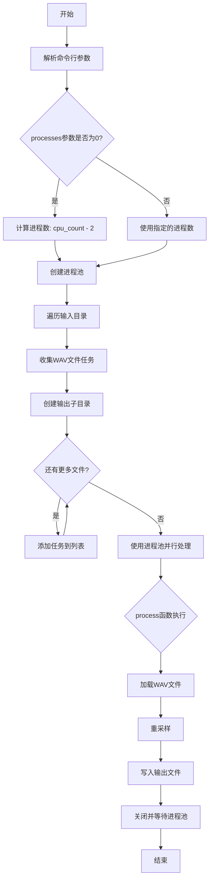
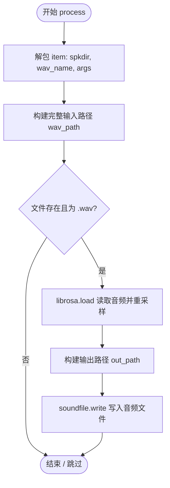

# `Bert-VITS2\resample.py` 详细设计文档

一个音频重采样工具，通过多进程并行处理，将输入目录中的所有WAV文件从原始采样率转换为指定采样率，并保存到输出目录。该工具使用librosa进行音频加载和重采样，soundfile进行音频写入，支持命令行参数配置采样率、输入输出路径和进程数。

## 整体流程



## 类结构

```
无类定义 (脚本程序)
仅有全局函数和变量
```

## 全局变量及字段


### `config`
    
从config模块导入的配置对象，包含重采样配置信息（如采样率、输入输出目录）

类型：`配置对象 (config.Config)`
    


### `tasks`
    
存储待处理WAV文件任务的列表，每个任务包含说话人目录、文件名和命令行参数

类型：`列表 (List[Tuple[str, str, argparse.Namespace]])`
    


### `args`
    
命令行参数解析结果，包含采样率、输入输出目录和进程数等参数

类型：`命名空间 (argparse.Namespace)`
    


### `processes`
    
进程池的进程数量，根据CPU核心数自动计算或由用户指定

类型：`整数 (int)`
    


### `pool`
    
multiprocessing进程池对象，用于并行处理音频重采样任务

类型：`multiprocessing.pool.Pool`
    


    

## 全局函数及方法


### `process`

该函数是音频重采样任务的核心处理单元，作为多进程池的工作节点（Worker）。它接收一个包含说话人目录、WAV文件名及全局配置的元组，验证文件有效性后，利用 `librosa` 读取并重采样音频，最后通过 `soundfile` 将处理后的音频写入目标目录。

参数：

-  `item`：`Tuple[str, str, argparse.Namespace]`，任务元组，包含以下三个元素：
    - `spkdir`：`str`，说话人子目录名称。
    - `wav_name`：`str`，WAV 音频文件名。
    - `args`：`argparse.Namespace`，命令行参数对象，包含输入目录 (`in_dir`)、输出目录 (`out_dir`) 和目标采样率 (`sr`)。

返回值：`NoneType`，无返回值。该函数执行副作用（文件读写），不返回处理结果。

#### 流程图



#### 带注释源码

```python
def process(item):
    """
    处理单个WAV文件的重采样逻辑。
    
    参数:
        item (tuple): 包含 (spkdir, wav_name, args) 的元组。
    """
    # 1. 解包任务参数
    spkdir, wav_name, args = item
    
    # 2. 构造输入文件的完整路径
    # 格式: {in_dir}/{spkdir}/{wav_name}
    wav_path = os.path.join(args.in_dir, spkdir, wav_name)
    
    # 3. 检查文件是否存在且格式正确
    # 仅处理存在的 .wav 文件，避免处理其他格式或不存在的文件
    if os.path.exists(wav_path) and wav_path.lower().endswith(".wav"):
        # 4. 使用 librosa 加载音频
        # sr=args.sr 指定目标采样率，librosa 会自动进行重采样
        wav, sr = librosa.load(wav_path, sr=args.sr)
        
        # 5. 构造输出文件的完整路径
        # 保持目录结构: {out_dir}/{spkdir}/{wav_name}
        out_path = os.path.join(args.out_dir, spkdir, wav_name)
        
        # 6. 写入重采样后的音频
        # 使用 soundfile 写入，采样率默认为加载后的采样率 sr
        soundfile.write(out_path, wav, sr)
```

#### 潜在的技术债务或优化空间

*   **缺乏异常处理**：当前实现仅使用 `os.path.exists` 进行初步检查。如果在读取或写入过程中发生错误（如文件损坏、磁盘空间不足、权限问题），进程可能会崩溃，导致整个多进程任务中断。建议添加 `try-except` 块捕获异常并记录日志，以确保单个文件的错误不会影响整体批处理任务的执行。
*   **I/O 效率**：虽然使用了 `multiprocessing` 进行 CPU 密集型重采样，但读写阶段（尤其是写入）可能受磁盘 I/O 限制。在 SSD 或高速存储上性能更优，但对于机械硬盘可能是瓶颈。

## 关键组件


### 音频加载模块 (librosa.load)

使用 librosa 库加载 WAV 音频文件，并进行重采样到指定的采样率

### 音频写入模块 (soundfile.write)

使用 soundfile 库将重采样后的音频写入到目标目录，保持相同的文件名结构

### 多进程并行处理池 (multiprocessing.Pool)

创建进程池实现音频文件的并行处理，通过 imap_unordered 提高处理效率

### 目录遍历模块 (os.walk)

递归遍历输入目录，收集所有 WAV 文件及其对应的说话人目录结构

### 命令行参数解析 (argparse)

支持自定义采样率、输入输出目录和进程数，其中进程数默认为 CPU 核心数减2

### 进度条模块 (tqdm)

可视化显示音频重采样的处理进度

### 配置管理 (config)

从 config 模块读取默认的重采样配置参数，包括采样率、输入输出路径


## 问题及建议


### 已知问题

-   **缺乏错误处理机制**：`process` 函数中没有任何 try-except 块，文件读取或写入失败时会导致整个多进程池崩溃
-   **内存占用风险**：`tasks` 列表将所有任务一次性加载到内存中，当处理大规模音频文件时可能导致内存溢出
-   **重复目录检查**：在循环内部每次都调用 `os.path.isdir()` 和 `os.makedirs()` 检查目录是否存在，效率较低
-   **进度条不准确**：使用 `imap_unordered` 时，`tqdm` 无法准确显示总体进度，因为任务完成顺序不确定
-   **参数序列化开销**：将整个 `args` 对象传递给每个子进程，增加了进程间通信的开销
-   **缺乏输入验证**：没有验证采样率是否合法、目录路径是否正确、文件是否可读等
-   **配置依赖脆弱**：假设 `config.resample_config` 必然存在，缺少相关容错处理
-   **采样率参数未使用**：`librosa.load` 的 sr 参数直接使用，但未对目标采样率进行校验

### 优化建议

-   在 `process` 函数中添加 try-except 异常捕获，记录失败文件并继续处理其他文件
-   使用生成器模式替代一次性加载所有任务，或改用 `pool.imap` 分批处理
-   预先遍历目录结构创建所有必要的输出目录，避免循环内重复检查
-   考虑使用 `pool.imap` 配合 `total` 参数以获得更准确的进度显示
-   仅传递必要的参数（如路径、采样率）而非整个 args 对象，减少序列化开销
-   添加输入参数校验逻辑，确保采样率为正数、目录存在且可访问
-   在启动前检查配置对象是否存在，提供合理的默认值或错误提示
-   对音频文件进行格式预检查，过滤掉不支持的文件后再加入任务队列

## 其它


### 设计目标与约束

该代码旨在实现一个批量音频重采样工具，支持将指定目录下的WAV音频文件统一重采样为目标采样率，并输出到目标目录。设计约束包括：仅支持WAV格式、输入输出目录结构需保持一致、依赖librosa和soundfile库进行音频处理、采用多进程并行提升处理效率。

### 错误处理与异常设计

代码中主要通过os.path.exists判断文件是否存在，os.path.isdir判断目录是否有效。process函数中未捕获librosa.load和soundfile.write可能抛出的异常（如文件损坏、权限问题、磁盘空间不足等），建议增加try-except捕获IOError、RuntimeError等异常并记录日志，避免单个文件处理失败导致整个任务中断。

### 数据流与状态机

程序数据流如下：命令行参数解析 → 遍历输入目录构建任务列表 → 创建进程池 → 为每个WAV文件分配process任务 → 多进程执行音频加载与重写 → 汇总完成。无复杂状态机，主要为线性流程。

### 外部依赖与接口契约

依赖库包括：os（路径操作）、argparse（命令行解析）、librosa（音频加载与重采样）、soundfile（音频写入）、multiprocessing（多进程池）、tqdm（进度条）、config（配置模块）。config模块需提供resample_config对象，包含sampling_rate、in_dir、out_dir三个属性。

### 性能考量

代码通过multiprocessing.Pool实现多进程并行处理，默认为cpu_count()-2个进程。librosa.load默认进行重采样，sr参数指定目标采样率。潜在优化点包括：使用共享内存减少数据传输、预创建输出目录结构避免重复检查、批量提交任务减少调度开销。

### 安全性考虑

代码未对输入路径进行安全校验（如路径遍历攻击），建议对spk_dir进行规范化处理。进程池使用后正确调用close和join释放资源。输入输出目录默认从config读取，建议增加目录存在性校验和写入权限检查。

### 配置管理

通过argparse接收命令行参数，覆盖config模块中的默认配置。支持参数：--sr（采样率）、--in_dir（输入目录）、--out_dir（输出目录）、--processes（进程数，0表示自动）。config模块需定义resample_config类并实例化供调用。

### 日志与监控

使用tqdm显示进度条，print输出任务完成信息。建议增加更详细的日志记录，包括处理成功/失败文件数量、耗时统计、异常信息等，便于问题排查和性能分析。

### 测试策略

建议测试场景包括：空目录处理、单文件处理、大量文件批处理、嵌套目录结构处理、无效输入路径、磁盘空间不足、权限拒绝等异常情况。

### 部署要求

部署环境需安装Python 3.x及上述依赖库。建议在多核CPU机器上运行以发挥多进程优势。输入目录需预先准备WAV文件，输出目录会自动创建。

### 使用示例

```bash
python resample.py --sr 16000 --in_dir /data/audio --out_dir /data/resampled --processes 4
```

该命令将以16000Hz采样率重采样/data/audio目录下的所有WAV文件，输出到/data/resampled目录，使用4个进程。


    