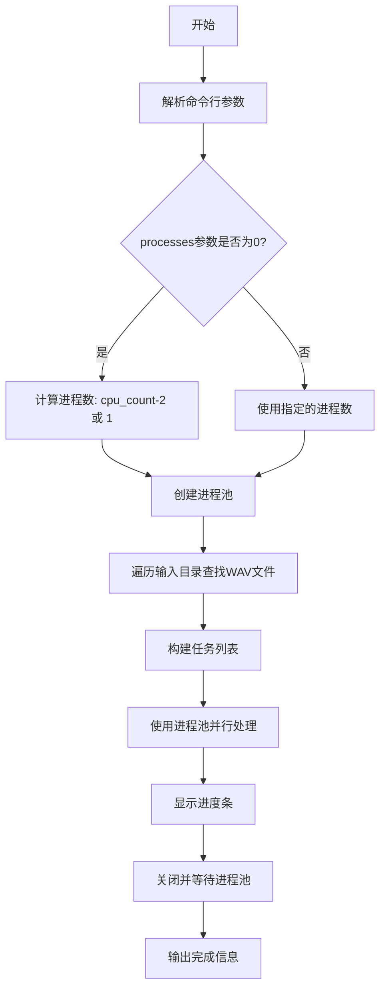
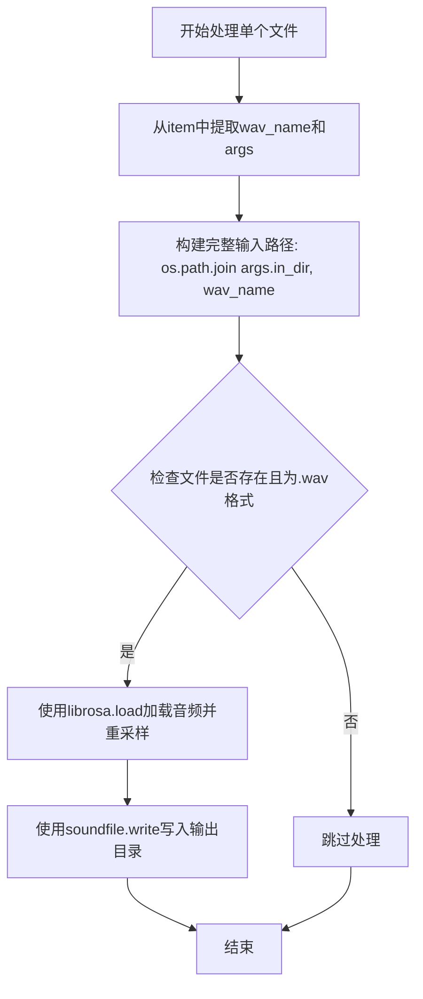
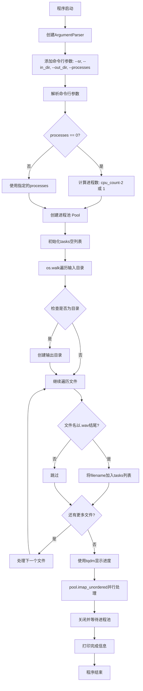

# `Bert-VITS2\resample_legacy.py` 详细设计文档

这是一个音频重采样工具，通过命令行指定采样率、输入输出目录，使用多进程并行将WAV音频文件重采样并保存到目标目录。

## 整体流程



## 类结构

```
该文件为脚本文件，无类定义，采用面向过程编程
```

## 全局变量及字段


### `os`
    
Python标准库，提供操作系统相关功能如路径操作、文件检查等

类型：`module`
    


### `argparse`
    
Python标准库，用于解析命令行参数

类型：`module`
    


### `librosa`
    
音频分析库，用于加载和处理音频文件

类型：`module`
    


### `Pool`
    
multiprocessing模块中的进程池类，用于并行处理任务

类型：`class`
    


### `cpu_count`
    
multiprocessing模块函数，返回系统CPU核心数

类型：`function`
    


### `soundfile`
    
音频文件读写库，用于保存音频数据到文件

类型：`module`
    


### `tqdm`
    
进度条库，用于显示循环处理的进度

类型：`module`
    


### `config`
    
项目配置对象，包含重采样配置如采样率、输入输出目录等

类型：`object`
    


### `parser`
    
argparse命令行解析器对象

类型：`ArgumentParser`
    


### `args`
    
解析后的命令行参数命名空间对象

类型：`Namespace`
    


### `processes`
    
用于并行处理的进程数量

类型：`int`
    


### `pool`
    
multiprocessing进程池实例

类型：`Pool`
    


### `tasks`
    
待处理的音频文件任务列表，每个元素为(文件名, 参数)的元组

类型：`list`
    


### `dirpath`
    
os.walk遍历时的当前目录路径

类型：`str`
    


### `filenames`
    
os.walk返回的当前目录下的文件名列表

类型：`list`
    


### `filename`
    
单个音频文件的名称

类型：`str`
    


### `wav_name`
    
WAV音频文件的名称

类型：`str`
    


### `wav_path`
    
WAV音频文件的完整路径

类型：`str`
    


### `wav`
    
librosa加载的音频数据数组

类型：`ndarray`
    


### `sr`
    
音频采样率

类型：`int`
    


    

## 全局函数及方法


### `process`

该函数是音频重采样任务的工作单元，接收一个包含 wav 文件名和命令行参数的元组，检查文件存在性和格式，调用 librosa 加载并按指定采样率重采样音频，最后使用 soundfile 将重采样后的音频写入目标目录。

参数：

-  `item`：`tuple`，包含 wav 文件名和命令行参数的元组，格式为 `(wav_name, args)`

返回值：`None`，无返回值，通过写入文件完成音频处理

#### 流程图

```mermaid
flowchart TD
    A[开始: process(item)] --> B[解包 item 获取 wav_name 和 args]
    B --> C[构建 wav_path = os.path.join(args.in_dir, wav_name)]
    C --> D{检查文件是否存在且为 .wav 格式}
    D -->|否| E[跳过当前文件]
    D -->|是| F[使用 librosa.load 加载音频并重采样]
    F --> G[使用 soundfile.write 写入重采样后的音频]
    E --> H[结束]
    G --> H
```

#### 带注释源码

```python
def process(item):
    """
    处理单个音频文件：加载、重采样并保存
    
    参数:
        item: tuple, 包含 (wav_name, args) 的元组
              - wav_name: str, wav 文件名
              - args: argparse.Namespace, 命令行参数对象
    """
    # 从元组中解包获取 wav 文件名和参数对象
    wav_name, args = item
    
    # 构建输入文件的完整路径：拼接输入目录和文件名
    wav_path = os.path.join(args.in_dir, wav_name)
    
    # 检查文件是否存在且以 .wav 结尾（忽略大小写）
    if os.path.exists(wav_path) and wav_path.lower().endswith(".wav"):
        # 使用 librosa 加载音频并按指定采样率重采样
        # 返回: wav - 音频数据数组, sr - 实际采样率
        wav, sr = librosa.load(wav_path, sr=args.sr)
        
        # 将重采样后的音频写入输出目录，保留原文件名
        soundfile.write(os.path.join(args.out_dir, wav_name), wav, sr)
```

---

#### 关联信息

**关键组件信息：**

| 组件名称 | 一句话描述 |
|----------|------------|
| `librosa.load` | 音频加载与重采样核心函数 |
| `soundfile.write` | 音频文件写入函数 |
| `os.path.exists` | 文件系统路径存在性检查 |

**潜在技术债务或优化空间：**

1. **错误处理缺失**：函数未对文件读取/写入异常进行捕获和处理，可能导致进程崩溃
2. **重复文件检查**：主循环和子进程都进行 `.wav` 格式检查，存在冗余
3. **输出目录检查位置不当**：`os.makedirs` 放在 `os.walk` 循环内，每次遍历都可能触发检查
4. **无返回值机制**：调用方无法获知处理成功或失败状态，不便于错误追踪

**外部依赖与接口契约：**

| 依赖 | 版本/说明 |
|------|-----------|
| `librosa` | 音频处理库 |
| `soundfile` | 音频文件 I/O |
| `tqdm` | 进度条显示 |
| `config` | 自定义配置模块，需包含 `resample_config` 配置类 |


### `process(item)`

该函数负责加载单个WAV音频文件，使用librosa进行重采样，并将重采样后的音频写入输出目录。

参数：

-  `item`：`tuple`，包含文件名和命令行参数 args 的元组 `(wav_name, args)`

返回值：`None`，无返回值（直接写入文件）

#### 流程图



#### 带注释源码

```python
def process(item):
    """
    处理单个WAV文件：加载、重采样并保存
    
    参数:
        item: tuple, (wav_name, args) 元组
              - wav_name: str, WAV文件名
              - args: Namespace, 命令行参数对象
    """
    # 从元组中解包文件名和参数
    wav_name, args = item
    
    # 拼接完整的输入文件路径
    wav_path = os.path.join(args.in_dir, wav_name)
    
    # 检查文件是否存在且以.wav结尾（不区分大小写）
    if os.path.exists(wav_path) and wav_path.lower().endswith(".wav"):
        # 使用librosa加载音频并重采样到指定采样率
        # 返回: wav - 音频数据, sr - 实际采样率
        wav, sr = librosa.load(wav_path, sr=args.sr)
        
        # 将重采样后的音频写入输出目录，保持原始文件名
        soundfile.write(os.path.join(args.out_dir, wav_name), wav, sr)
```

---

### `__main__`（主程序入口）

主程序入口负责命令行参数解析、目录遍历、任务分发和多进程池管理，实现批量音频重采样任务。

参数：

-  无直接参数（通过 `argparse` 从命令行获取）

返回值：`None`，程序结束打印完成信息

#### 流程图



#### 带注释源码

```python
if __name__ == "__main__":
    """
    主程序入口：
    1. 解析命令行参数
    2. 扫描输入目录下的所有WAV文件
    3. 使用多进程池并行处理重采样
    """
    
    # 创建命令行参数解析器
    parser = argparse.ArgumentParser()
    
    # 添加采样率参数（默认从config读取）
    parser.add_argument(
        "--sr",
        type=int,
        default=config.resample_config.sampling_rate,
        help="sampling rate",
    )
    
    # 添加输入目录参数
    parser.add_argument(
        "--in_dir",
        type=str,
        default=config.resample_config.in_dir,
        help="path to source dir",
    )
    
    # 添加输出目录参数
    parser.add_argument(
        "--out_dir",
        type=str,
        default=config.resample_config.out_dir,
        help="path to target dir",
    )
    
    # 添加进程数参数（0表示自动计算）
    parser.add_argument(
        "--processes",
        type=int,
        default=0,
        help="cpu_processes",
    )
    
    # 解析已知参数，忽略未知参数（兼容性考虑）
    args, _ = parser.parse_known_args()
    
    # 自动计算进程数：
    # - 如果用户指定了processes，使用用户值
    # - 否则自动使用 cpu_count - 2（保留2个核心），最少使用1个进程
    if args.processes == 0:
        processes = cpu_count() - 2 if cpu_count() > 4 else 1
    else:
        processes = args.processes
    
    # 创建进程池
    pool = Pool(processes=processes)
    
    # 初始化任务列表
    tasks = []
    
    # 遍历输入目录，收集所有WAV文件任务
    for dirpath, _, filenames in os.walk(args.in_dir):
        # 确保输出目录存在
        if not os.path.isdir(args.out_dir):
            os.makedirs(args.out_dir, exist_ok=True)
        
        # 筛选WAV文件并添加到任务列表
        for filename in filenames:
            if filename.lower().endswith(".wav"):
                tasks.append((filename, args))
    
    # 使用imap_unordered并行处理任务，tqdm显示进度
    for _ in tqdm(
        pool.imap_unordered(process, tasks),
    ):
        pass  # 不需要处理结果，只需等待完成
    
    # 关闭进程池
    pool.close()
    pool.join()
    
    # 打印完成信息
    print("音频重采样完毕!")
```

---

### 全局变量与导入模块

#### 导入模块

| 模块名 | 描述 |
|--------|------|
| `os` | 操作系统接口，用于路径操作和目录遍历 |
| `argparse` | 命令行参数解析库 |
| `librosa` | 音频分析库，用于加载和重采样音频 |
| `multiprocessing.Pool` | 多进程池，用于并行处理 |
| `cpu_count` | 获取CPU核心数 |
| `soundfile` | 音频文件读写库 |
| `tqdm` | 进度条显示库 |
| `config` | 项目配置文件（自定义模块） |

#### 全局变量

| 变量名 | 类型 | 描述 |
|--------|------|------|
| `parser` | `argparse.ArgumentParser` | 命令行参数解析器对象 |
| `args` | `argparse.Namespace` | 解析后的命令行参数命名空间 |
| `processes` | `int` | 实际使用的进程数量 |
| `pool` | `multiprocessing.Pool` | 多进程池对象 |
| `tasks` | `list` | 待处理的任务列表，每个元素为 `(filename, args)` 元组 |

---

### 关键组件信息

| 组件名称 | 描述 |
|----------|------|
| `process(item)` | 单文件处理函数，负责加载、重采样、写入WAV文件 |
| 多进程池 (Pool) | 基于multiprocessing的进程池，实现并行音频处理 |
| tqdm进度条 | 实时显示处理进度，提升用户体验 |
| ArgumentParser | 命令行参数解析，支持采样率、目录、进程数配置 |

---

### 潜在技术债务与优化空间

1. **缺少错误处理**：当前 `process` 函数没有异常捕获，若单个文件处理失败会导致整个任务中断
2. **内存效率**：librosa.load 默认加载整个音频到内存，大文件可能导致内存问题
3. **进度显示不准确**：`imap_unordered` 的进度条无法准确反映总任务数，需配合 `total` 参数
4. **目录遍历效率**：每次遍历都检查输出目录是否存在，可优化到循环外
5. **缺少日志记录**：无详细日志输出，难以追踪失败文件
6. **硬编码逻辑**：自动计算进程数的逻辑（cpu_count > 4）硬编码，可配置化
7. **文件覆盖问题**：若输出文件已存在会直接覆盖，缺乏确认机制

---

### 其它项目

#### 设计目标与约束
- **目标**：批量将WAV音频文件重采样为指定采样率，支持多进程并行加速
- **约束**：输入输出均为WAV格式，依赖librosa和soundfile库

#### 错误处理与异常设计
- 当前无异常处理机制，建议添加 try-except 捕获文件读写异常
- 建议添加跳过失败文件并记录日志的功能

#### 数据流与状态机
- 数据流：输入目录 → 遍历扫描 → 任务队列 → 多进程处理 → 输出目录
- 状态：初始化 → 扫描 → 处理中 → 完成

#### 外部依赖与接口契约
- 依赖 `config.resample_config` 配置对象，需要包含 `sampling_rate`、`in_dir`、`out_dir` 属性
- 命令行参数：`--sr`（采样率）、`--in_dir`（输入目录）、`--out_dir`（输出目录）、`--processes`（进程数）


## 关键组件


### 音频加载与重采样组件

使用 librosa.load 加载 WAV 文件并根据指定采样率进行重采样，返回重采样后的音频数据和时间域采样率

### 多进程并行处理组件

使用 multiprocessing.Pool 创建进程池，通过 pool.imap_unordered 并行处理多个音频文件，提升处理效率

### 音频保存组件

使用 soundfile.write 将重采样后的音频数据写入目标路径，保持指定的采样率

### 命令行参数解析组件

使用 argparse 解析 --sr、--in_dir、--out_dir、--processes 等命令行参数，支持自定义采样率、输入输出目录和进程数

### 目录遍历与任务生成组件

使用 os.walk 递归遍历输入目录，收集所有 WAV 文件并生成待处理任务列表

### 进度显示组件

使用 tqdm 显示并行处理进度，提供可视化的任务完成状态

### 配置管理组件

从 config 模块导入配置信息，提供默认的采样率、输入输出目录等参数

### 进程数自动计算组件

根据 CPU 核心数自动计算最佳进程数，默认为 cpu_count() - 2，确保系统资源合理利用


## 问题及建议


### 已知问题

- **错误处理缺失**：`process`函数中没有任何异常捕获机制，一旦单个文件处理失败（如文件损坏、权限问题、磁盘空间不足等），整个多进程任务会中断，且错误信息不明确。
- **资源管理不当**：输出目录创建逻辑位于遍历循环内部，导致每次遍历子目录时都会重复检查和创建，应该移到循环外部以提高效率。
- **内存效率低下**：`tasks`列表会一次性将所有文件路径加载到内存中，当处理大规模数据集时会造成内存占用过高；`librosa.load`默认未启用内存映射，对于大文件会占用大量内存。
- **多进程参数序列化风险**：`args`对象被传递给子进程，如果配置对象包含不可序列化的组件（如文件句柄、数据库连接等），可能在某些环境下导致Pickle序列化失败。
- **进度监控不完善**：`tqdm`迭代器未正确配置以显示进度百分比和预估剩余时间，且无法区分成功与失败的任务。
- **配置硬编码与魔数**：`processes = cpu_count() - 2 if cpu_count() > 4 else 1`中的`-2`是魔法数字，缺乏注释说明，且配置依赖外部`config`模块，代码自包含性差。
- **路径处理安全隐患**：直接使用`os.path.join`拼接用户提供的路径，未进行路径规范化或遍历攻击（如符号链接）检查。
- **类型注解和文档缺失**：代码没有类型提示和文档字符串，可维护性和可读性较差。

### 优化建议

- 在`process`函数中添加try-except块，捕获`librosa.exceptions.LibrosaError`和`soundfile.SoundFileError`等特定异常，记录失败文件并继续处理其他文件，实现容错机制。
- 将`os.makedirs`调用移至循环外部，并在循环开始前一次性创建输出目录。
- 考虑使用生成器模式替代一次性加载`tasks`列表，或设置批量处理（chunksize）以平衡内存使用和进程调度效率；对于大文件启用`memmap=True`参数。
- 确保传递给子进程的`args`对象仅包含可序列化的基本数据类型，避免传递复杂对象引用。
- 配置`tqdm`显示进度百分比、已完成/总数、预估时间等详细信息，并记录处理失败的文件列表。
- 将`-2`等魔法数字提取为可配置参数或常量，并添加明确注释说明其设计意图。
- 使用`pathlib.Path`替代`os.path`进行路径操作，并添加路径安全检查防止目录遍历攻击。
- 为核心函数添加类型注解和docstring，提升代码可读性和IDE支持。

## 其它


### 设计目标与约束

设计目标：实现一个高效的音频批量重采样工具，支持将指定目录下的所有WAV文件重采样到目标采样率，并支持多进程并行处理以提升性能。约束：输入输出路径必须为有效目录，重采样仅支持WAV格式文件，采样率必须为正整数。

### 错误处理与异常设计

文件级异常处理：process函数中通过os.path.exists检查文件是否存在，使用wav_path.lower().endswith(".wav")确保只处理WAV文件。目录级异常处理：在遍历输入目录前检查输出目录是否存在，不存在则创建。进程级异常：multiprocessing的Pool会自动传播子进程异常，但当前代码未显式捕获处理。参数异常：argparse提供默认值和help信息，parse_known_args允许未知参数。

### 数据流与状态机

主流程状态机：1)初始化参数→2)计算进程数→3)遍历目录收集任务→4)创建进程池→5)分发任务→6)等待完成→7)输出完成信息。数据流：命令行参数→任务列表(tasks)→进程池→各worker进程→文件读写。任务队列：tasks列表存储(filename, args)元组，通过pool.imap_unordered分发给worker。

### 外部依赖与接口契约

依赖库：librosa(音频加载与重采样)、soundfile(音频写入)、tqdm(进度条)、multiprocessing(多进程)、argparse(命令行解析)、config(配置模块)。接口契约：config.resample_config需包含sampling_rate、in_dir、out_dir三个属性；命令行参数--sr、--in_dir、--out_dir、--processes均为可选参数。

### 性能考虑与优化空间

当前实现使用multiprocessing.Pool实现多进程并行，imap_unordered提高吞吐量。优化空间：1)使用ProcessPoolExecutor替代Pool；2)添加任务批量提交减少进程间通信开销；3)增加异常任务重试机制；4)对大文件使用内存映射；5)可考虑使用线程池替代进程池减少内存复制。

### 安全性考虑

路径安全：使用os.path.join拼接路径防止路径注入。文件安全：先检查文件存在性再处理，避免处理不存在的文件。输出目录安全：使用exist_ok=True防止并发创建目录异常。

### 配置管理

通过config模块的resample_config对象管理配置，命令行参数可覆盖默认值。配置项包括采样率sampling_rate、输入目录in_dir、输出目录out_dir。CPU进程数根据系统CPU核心数自动计算，默认使用cpu_count()-2。

### 并发模型

采用生产者-消费者模型：主进程作为生产者遍历目录收集任务，worker进程作为消费者处理重采样任务。使用imap_unordered实现无序返回，提高整体吞吐量。进程数默认为cpu_count()-2(当CPU>4时)，最少为1。

### 资源管理

进程池资源：使用pool.close()和pool.join()确保进程池正确关闭。文件资源：librosa.load和soundfile.write自动管理文件句柄。内存资源：每个worker独立内存空间，避免内存泄漏。进度条资源：tqdm自动管理进度条刷新。

### 日志与监控

当前仅使用tqdm显示进度条和print输出完成信息。缺少详细日志记录，可添加：1)每个文件的处理状态(成功/失败)；2)处理耗时统计；3)错误详细信息记录；4)可配置日志级别。

    