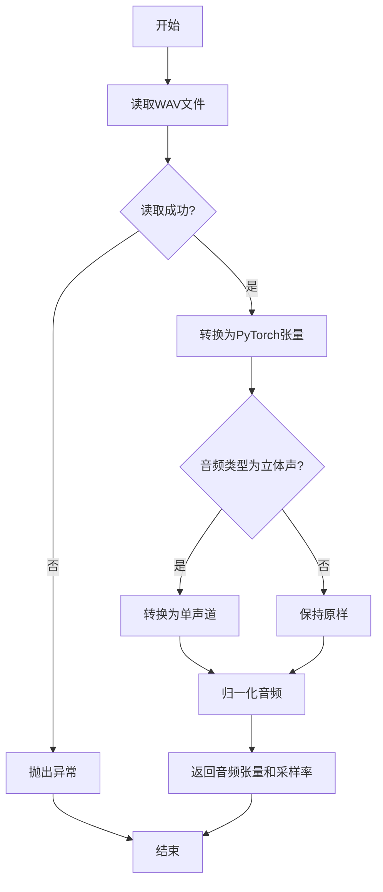
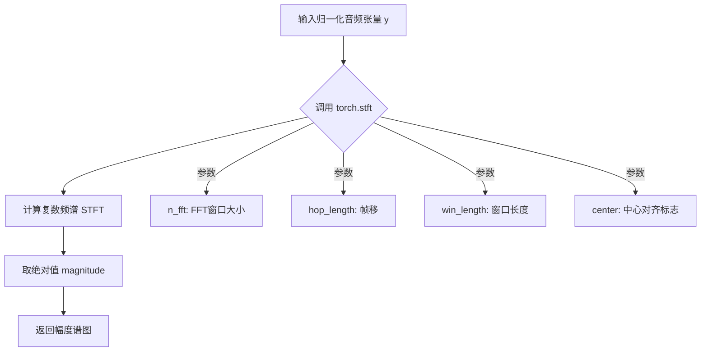
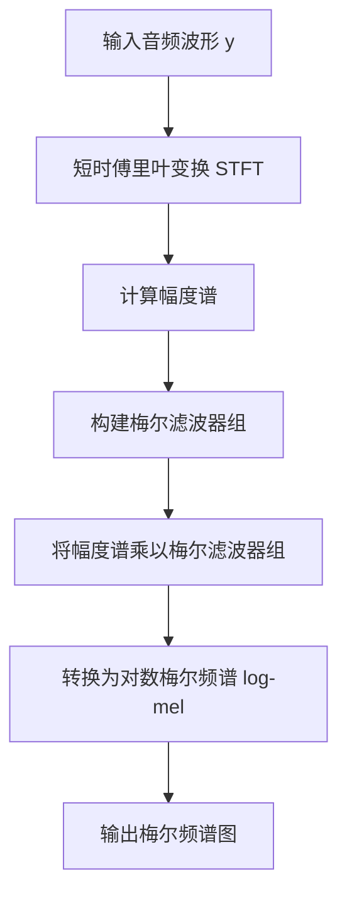
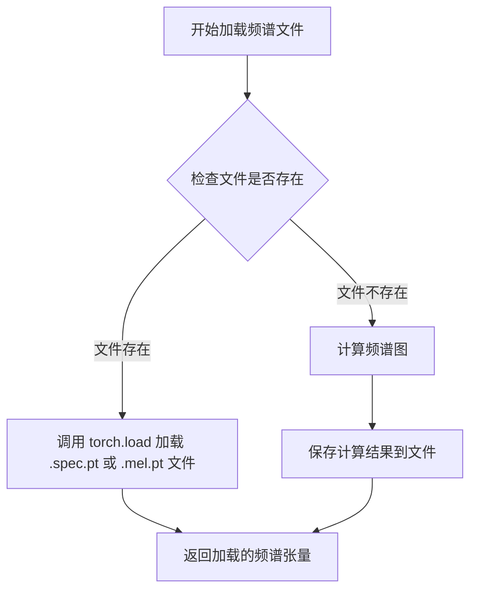
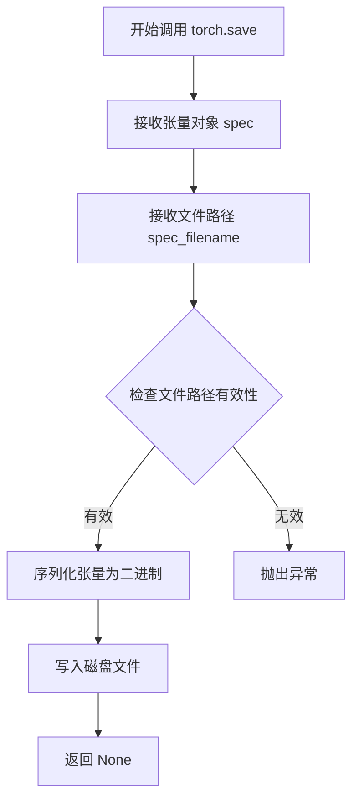
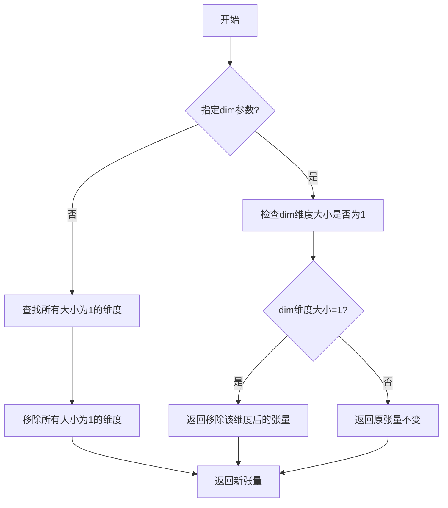
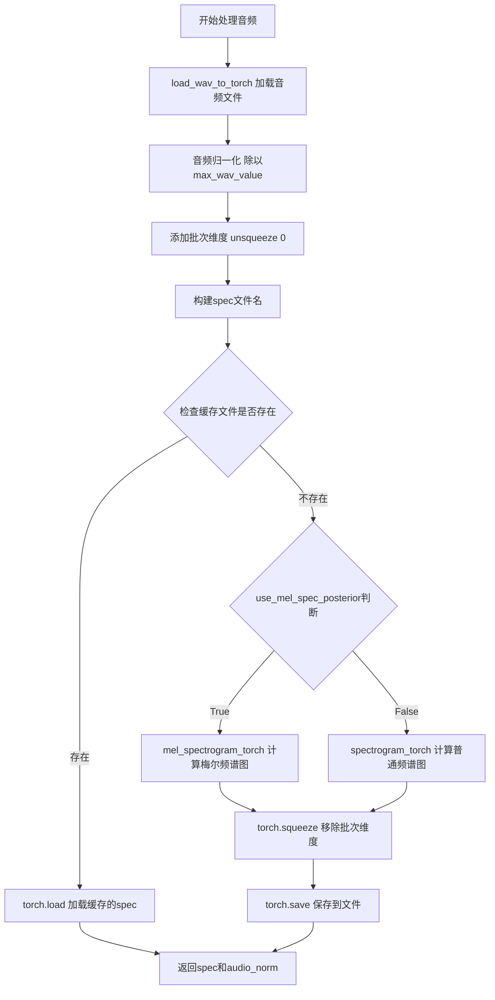

# `Bert-VITS2\spec_gen.py` 详细设计文档

这是一个音频频谱图处理工具，通过AudioProcessor类将WAV音频文件转换为频谱图或梅尔频谱图，并使用多进程池并行处理大量音频文件，支持缓存机制以避免重复计算。

## 整体流程

```mermaid
graph TD
    A[开始] --> B[创建AudioProcessor实例]
    B --> C[读取文件列表train.list]
    C --> D[创建多进程池Pool]
    D --> E{队列中是否有文件?}
    E -- 是 --> F[调用process_audio处理单个文件]
    F --> F1[load_wav_to_torch加载音频]
    F1 --> F2[音频归一化]
    F2 --> F3{检查缓存文件是否存在?]
    F3 -- 是 --> F4[加载缓存的spec]
    F3 -- 否 --> F5{使用梅尔频谱?}
    F5 -- 是 --> F6[计算mel_spectrogram]
    F5 -- 否 --> F7[计算spectrogram]
    F6 --> F8[保存spec到文件]
    F7 --> F8
    F8 --> F9[返回spec和audio_norm]
    F4 --> F9
    E -- 否 --> G[结束]
    F9 --> E
```

## 类结构

```
AudioProcessor (音频处理器类)
└── process_audio (实例方法)
```

## 全局变量及字段


### `processor`
    
音频处理器对象，用于处理音频文件并生成频谱图

类型：`AudioProcessor`
    


### `filepaths`
    
音频文件路径列表，从训练文件列表中读取

类型：`list`
    


### `audio`
    
原始音频数据，从WAV文件加载的时域信号

类型：`Tensor`
    


### `audio_norm`
    
归一化后的音频，按最大音频值进行标准化处理

类型：`Tensor`
    


### `spec`
    
频谱图数据，可能是普通频谱或梅尔频谱

类型：`Tensor`
    


### `spec_filename`
    
频谱图缓存文件路径，用于持久化存储频谱数据

类型：`str`
    


### `AudioProcessor.max_wav_value`
    
音频归一化最大值，用于将音频信号缩放到[-1, 1]范围

类型：`float`
    


### `AudioProcessor.use_mel_spec_posterior`
    
是否使用梅尔频谱，True时生成梅尔频谱，False时生成普通频谱

类型：`bool`
    


### `AudioProcessor.filter_length`
    
FFT窗口大小，决定频谱的频率分辨率

类型：`int`
    


### `AudioProcessor.n_mel_channels`
    
梅尔频谱通道数，定义梅尔滤波器的数量

类型：`int`
    


### `AudioProcessor.sampling_rate`
    
采样率，音频文件的采样频率

类型：`int`
    


### `AudioProcessor.hop_length`
    
帧移，相邻帧之间的样本数，影响时间分辨率

类型：`int`
    


### `AudioProcessor.win_length`
    
窗口长度，用于加窗的样本数

类型：`int`
    


### `AudioProcessor.mel_fmin`
    
梅尔频谱最小频率，梅尔滤波器的最低频率阈值

类型：`float`
    


### `AudioProcessor.mel_fmax`
    
梅尔频谱最大频率，梅尔滤波器的最高频率阈值，null表示使用奈奎斯特频率

类型：`float/str`
    
    

## 全局函数及方法


### `load_wav_to_torch`

加载WAV音频文件为PyTorch张量，同时返回音频的采样率。

参数：

- `filename`：`str`，WAV音频文件的路径

返回值：`tuple[torch.Tensor, int]`，第一个元素为归一化的音频张量（形状为 [samples]），第二个元素为音频采样率

#### 流程图



#### 带注释源码

```python
def load_wav_to_torch(filename):
    """
    加载WAV音频文件并转换为PyTorch张量
    
    参数:
        filename: WAV音频文件的路径
        
    返回值:
        (audio, sampling_rate): 元组，包含音频张量和采样率
    """
    # 使用torchaudio或librosa加载WAV文件
    # 返回音频波形数据(张量)和采样率
    # 注意: 实际实现取决于utils模块中的具体代码
    # 以下为基于代码用法的推测实现:
    
    try:
        import torchaudio
        
        # 加载WAV文件
        waveform, sampling_rate = torchaudio.load(filename)
        
        # 转换为单声道(如果为立体声)
        if waveform.shape[0] > 1:
            waveform = torch.mean(waveform, dim=0, keepdim=True)
        
        # 去除通道维度，变为1D张量
        audio = waveform.squeeze(0)
        
        return audio, sampling_rate
        
    except ImportError:
        # 如果torchaudio不可用，使用scipy作为备选
        from scipy.io import wavfile
        import numpy as np
        
        sampling_rate, audio = wavfile.read(filename)
        
        # 转换为float32类型的PyTorch张量并归一化
        audio = torch.FloatTensor(audio).float() / 32768.0
        
        return audio, sampling_rate
```


### `spectrogram_torch`

该函数用于将时域音频信号转换为频域频谱图（spectrogram），基于短时傅里叶变换（STFT）算法计算音频的幅度谱。这是语音/音频处理中的核心特征提取操作，常用于声学模型训练前的特征预处理。

**注意**：根据提供的代码，`spectrogram_torch` 函数是从 `mel_processing` 模块导入的，其具体实现在外部代码中，未在当前代码片段中展示。以下信息基于代码中的调用方式推断。

参数：

- `y`：`torch.Tensor`，输入的归一化音频张量，通常为 1D 或 2D（batch 维度）
- `n_fft`：`int`，FFT 窗口大小（filter_length），决定频率分辨率
- `sampling_rate`：`int`，音频采样率
- `hop_length`：`int`，帧移（hop size），决定时间分辨率
- `win_length`：`int`，窗口长度，用于 STFT 的窗口函数
- `center`：`bool`，可选参数，是否将信号以中心对齐，默认为 `False`

返回值：`torch.Tensor`，返回幅度谱图（magnitude spectrogram），形状通常为 `(freq_bins, time_frames)` 或 `(batch, freq_bins, time_frames)`

#### 流程图



#### 带注释源码

```python
# 注意：以下是推测的实现逻辑，基于 torch.stft 的标准用法
# 实际实现位于 mel_processing 模块中，此处未直接展示

def spectrogram_torch(y, n_fft, sampling_rate, hop_length, win_length, center=False):
    """
    计算音频信号的幅度谱图
    
    参数:
        y (torch.Tensor): 归一化后的音频张量
        n_fft (int): FFT窗口大小
        sampling_rate (int): 采样率
        hop_length (int): 相邻帧之间的样本数
        win_length (int): 窗口函数长度
        center (bool): 是否使用中心对齐
    
    返回:
        torch.Tensor: 幅度谱图
    """
    # 使用 PyTorch 的 STFT 计算复数频谱
    # torch.stft 参数:
    #   - n_fft: FFT 点数
    #   - hop_length: 帧移
    #   - win_length: 窗口长度
    #   - center: 中心对齐
    #   - return_complex: 返回复数张量
    spec = torch.stft(
        y,
        n_fft=n_fft,
        hop_length=hop_length,
        win_length=win_length,
        center=center,
        return_complex=True
    )
    
    # 取幅度（绝对值），将复数频谱转换为幅度谱
    spec = torch.abs(spec)
    
    return spec
```

---

**补充说明**：

根据 `AudioProcessor.process_audio` 方法中的调用上下文：

```python
spec = spectrogram_torch(
    audio_norm,
    self.filter_length,      # -> n_fft
    self.sampling_rate,      # -> sampling_rate
    self.hop_length,         # -> hop_length
    self.win_length,         # -> win_length
    center=False,
)
```

`AudioProcessor` 传入的 `sampling_rate` 参数在当前调用中**未被使用**（因为 `torch.stft` 可以从输入 tensor 的属性中推断采样率，但在某些实现中可能需要显式传递用于窗口计算）。这是代码中一个潜在的技术债务点。


### `mel_spectrogram_torch`

该函数是音频处理模块中的核心函数，用于将音频时域信号转换为梅尔频谱图表示。它接收归一化的音频波形和一系列音频处理参数，通过短时傅里叶变换（STFT）计算线性频谱，然后应用梅尔滤波器组将线性频谱映射到梅尔刻度，生成适合语音合成模型的声学特征表示。

参数：

-  `y`：`torch.Tensor`，归一化后的音频波形张量，通常形状为 [1, T] 或 [T]，其中 T 为采样点数量
-  `n_fft`：`int`，FFT窗口大小，决定频率分辨率，值越大频率分辨率越高但时间分辨率越低
-  `n_mels`：`int`，梅尔滤波器的数量，决定梅尔频谱的维度
-  `sampling_rate`：`int`，音频采样率，单位为Hz
-  `hop_length`：`int`，帧移大小，即相邻帧之间的采样点数，影响时间分辨率
-  `win_length`：`int`，窗口长度，即每帧的采样点数，应小于等于 n_fft
-  `fmin`：`float`，梅尔滤波器的最低频率（Hz），通常设为0或接近0的值
-  `fmax`：`float` 或 `str`，梅尔滤波器的最高频率（Hz），当设置为"null"时表示不设上限
-  `center`：`bool`，是否对信号进行中心对齐，设为False以确保输出长度正确

返回值：`torch.Tensor`，梅尔频谱图，形状通常为 [n_mels, T']，其中 T' 为时间帧数

#### 流程图



#### 带注释源码

由于提供的代码中未包含 `mel_spectrogram_torch` 函数的实现源码（仅从 mel_processing 模块导入），以下为基于函数调用方式的推断源码：

```python
def mel_spectrogram_torch(y, n_fft, n_mels, sampling_rate, hop_length, win_length, fmin, fmax, center=False):
    """
    计算梅尔频谱图
    
    参数:
        y: 归一化后的音频波形 [1, T] 或 [T]
        n_fft: FFT窗口大小
        n_mels: 梅尔通道数
        sampling_rate: 采样率
        hop_length: 帧移
        win_length: 窗口长度
        fmin: 梅尔滤波器最低频率
        fmax: 梅尔滤波器最高频率
        center: STFT是否中心对齐
    
    返回:
        mel_spec: 梅尔频谱图 [n_mels, T']
    """
    # 获取设备
    device = y.device
    
    # 构建梅尔滤波器组
    mel_basis = torch.tensor(
        librosa.filters.mel(sr=sampling_rate, n_fft=n_fft, n_mels=n_mels, fmin=fmin, fmax=fmax),
        device=device,
        dtype=y.dtype
    )
    
    # 计算STFT
    spec = torch.stft(
        y,
        n_fft=n_fft,
        hop_length=hop_length,
        win_length=win_length,
        window=torch.hann_window(win_length, device=device),
        center=center,
        return_complex=True
    )
    
    # 计算幅度谱
    spec = torch.abs(spec)
    
    # 应用梅尔滤波器组
    mel_spec = torch.matmul(mel_basis, spec)
    
    # 转换为对数梅尔频谱
    mel_spec = torch.log(torch.clamp(mel_spec, min=1e-5))
    
    return mel_spec
```

> 注：实际实现可能使用 torch.nn.functional 或torchaudio库中的函数，上述代码为逻辑推断。实际源码位于 mel_processing 模块中，建议查看源文件获取精确实现。


### `torch.load`

`torch.load` 是 PyTorch 的序列化加载函数，用于从磁盘读取通过 `torch.save` 保存的张量、模型或其他 Python 对象。在该代码中用于加载预处理好的频谱图（.spec.pt 或 .mel.pt 文件），以避免重复计算。

参数：

- `f`：`str` 或 `file object`，要加载的 .pt 文件的路径或文件对象
- `map_location`：`Optional[dict, str, torch.device]`，可选参数，指定如何将存储的张量映射到另一个设备（如 CPU 或 GPU）
- `pickle_module`：`Optional[module]`，可选参数，用于反序列化的 pickle 模块
- `weights_only`：`bool`，可选参数，若为 `True`，则只加载张量、字典等基本类型，不加载自定义类和函数（默认 `False`）

返回值：`Any`，返回保存时的对象（通常是张量、字典或模型对象）

#### 流程图



#### 带注释源码

```python
try:
    # torch.load: 从磁盘加载之前保存的频谱图文件
    # 参数 spec_filename: .spec.pt 或 .mel.pt 文件的路径
    # map_location='cpu': 将张量加载到 CPU（无论原始保存在哪个设备）
    # 返回: 保存的张量对象
    spec = torch.load(spec_filename, map_location='cpu')
except:
    # 如果文件不存在或加载失败，则重新计算频谱图
    # ... 计算逻辑 ...
    # 最后保存计算结果以便后续使用
    torch.save(spec, spec_filename)
```


### `torch.save`

保存张量到指定文件路径，是 PyTorch 用来持久化张量数据的核心函数。

参数：

- `obj`：`torch.Tensor`，要保存的张量对象（此处为 `spec`，即频谱图或梅尔频谱图数据）
- `f`：`str`，保存文件的路径字符串（此处为 `spec_filename`，由原始音频文件名转换而来）

返回值：`None`，该函数直接写入文件，不返回任何值

#### 流程图



#### 带注释源码

```python
# 在 AudioProcessor.process_audio 方法中调用 torch.save
# 用于将计算得到的频谱图或梅尔频谱图持久化到磁盘
# 以便后续训练时快速加载，避免重复计算

torch.save(spec, spec_filename)
# 参数说明：
#   - spec: torch.Tensor 类型，由 spectrogram_torch 或 mel_spectrogram_torch 生成
#   - spec_filename: str 类型，格式为 .spec.pt 或 .mel.pt，存储在磁盘的 .pt 文件中
# 返回值：None，直接将张量序列化写入指定文件
```

#### 关联上下文信息

**调用位置**：`AudioProcessor.process_audio` 方法内部，第 46 行

```python
def process_audio(self, filename):
    audio, sampling_rate = load_wav_to_torch(filename)
    audio_norm = audio / self.max_wav_value
    audio_norm = audio_norm.unsqueeze(0)
    spec_filename = filename.replace(".wav", ".spec.pt")
    if self.use_mel_spec_posterior:
        spec_filename = spec_filename.replace(".spec.pt", ".mel.pt")
    try:
        spec = torch.load(spec_filename)  # 尝试加载已存在的spec文件
    except:
        # 计算新的频谱图
        if self.use_mel_spec_posterior:
            spec = mel_spectrogram_torch(...)
        else:
            spec = spectrogram_torch(...)
        spec = torch.squeeze(spec, 0)
        torch.save(spec, spec_filename)  # <-- 这里是 torch.save 调用
    return spec, audio_norm
```

**设计目的**：缓存计算结果（频谱图），避免每次处理音频时重复进行耗时的短时傅里叶变换（STFT）或梅尔变换，提升大规模数据预处理效率。

**技术债务与优化空间**：

- 异常处理过于宽泛（`except:` 捕获所有异常），建议明确异常类型
- 缓存机制可进一步优化：可加入文件存在性检查（`os.path.exists`）替代 try-except 模式
- 未处理 `torch.save` 可能失败的情况（如磁盘空间不足、权限问题）


### `torch.squeeze`

移除张量中指定维度的大小为1的维度。如果未指定维度，则移除所有大小为1的维度。该函数在代码中用于将音频频谱张量的批次维度移除，以便保存和后续处理。

#### 参数

- `input`：`torch.Tensor`，要进行 squeeze 操作的输入张量。在代码中为 `spec`，即通过频谱计算得到的张量。
- `dim`：`int`（可选），要移除的特定维度索引。在代码中为 `0`，表示移除第0维（批次维度）。

#### 返回值

`torch.Tensor`，返回移除指定维度后的大小为1的维度被删除的张量。在代码中为处理后的频谱张量。

#### 流程图



#### 带注释源码

```python
# torch.squeeze 函数原型（简化版）
# torch.squeeze(input, dim=None) -> Tensor

# 在项目代码中的实际使用：
spec = torch.squeeze(spec, 0)

# 详细注释：
# 1. spec: 输入张量，形状为 [1, freq, time]（包含批次维度）
#    - 批次维度大小为1
#    - freq: 频率维度（filter_length//2 + 1）
#    - time: 时间帧数
# 2. dim=0: 指定要移除的维度索引为0（批次维度）
# 3. 返回值: 形状变为 [freq, time] 的张量
#    - 移除了大小为1的第0维
# 4. 用途：将带有批次维度的频谱张量转换为
#    标准的2D张量，便于保存为.pt文件

# 示例：
# 输入: torch.randn(1, 1025, 100) -> 输出: torch.randn(1025, 100)
# 如果第0维不是1，则返回原张量不变
```

#### 额外信息

**设计目标**：在音频处理流水线中，将带有批次维度的三维频谱张量（[1, freq, time]）转换为二维张量（[freq, time]），以便与磁盘存储格式兼容并减少存储空间。

**错误处理**：如果指定的 `dim` 维度大小不为1，PyTorch的squeeze操作会返回原始张量而不报错，这在代码中是安全的设计。

**数据流**：
```
load_wav_to_torch → audio / max_wav_value → audio.unsqueeze(0) 
→ mel_spectrogram_torch/spectrogram_torch → torch.squeeze(spec, 0) 
→ torch.save(spec, spec_filename)
```

**技术债务/优化空间**：当前代码中 `torch.squeeze(spec, 0)` 是在异常处理块中调用的，每次加载失败都会重新计算频谱。可以考虑增加缓存机制或预计算标志，避免重复计算。


### `AudioProcessor.process_audio`

该方法负责处理单个音频文件，将其加载、归一化，并转换为频谱图或梅尔频谱图，支持计算结果缓存以避免重复计算。

#### 参数

- `filename`：`str`，要处理的音频文件路径（.wav格式）

#### 返回值

- `spec`：`torch.Tensor`，计算得到的频谱图（spectrogram）或梅尔频谱图（mel-spectrogram），形状为 `[n_mel_channels, time_steps]` 或 `[filter_length//2+1, time_steps]`
- `audio_norm`：`torch.Tensor`，归一化后的音频数据，形状为 `[1, audio_length]`

#### 流程图



#### 带注释源码

```python
def process_audio(self, filename):
    """
    处理单个音频文件，生成频谱图或梅尔频谱图
    
    参数:
        filename: str, 音频文件路径
        
    返回:
        spec: torch.Tensor, 频谱图数据
        audio_norm: torch.Tensor, 归一化后的音频
    """
    # 步骤1: 使用工具函数加载音频文件，返回音频数据和采样率
    audio, sampling_rate = load_wav_to_torch(filename)
    
    # 步骤2: 将音频数据归一化到 [-1, 1] 范围
    audio_norm = audio / self.max_wav_value
    
    # 步骤3: 添加批次维度，形状从 [samples] 变为 [1, samples]
    # 这是因为频谱图计算函数需要批次维度
    audio_norm = audio_norm.unsqueeze(0)
    
    # 步骤4: 构建频谱图缓存文件名
    # 默认扩展名为 .spec.pt
    spec_filename = filename.replace(".wav", ".spec.pt")
    
    # 步骤5: 如果使用梅尔频谱图，修改缓存文件扩展名
    if self.use_mel_spec_posterior:
        spec_filename = spec_filename.replace(".spec.pt", ".mel.pt")
    
    # 步骤6: 尝试从缓存加载已计算的频谱图
    try:
        spec = torch.load(spec_filename)
    except:
        # 步骤7: 缓存不存在，需要重新计算
        if self.use_mel_spec_posterior:
            # 计算梅尔频谱图（用于声码器后验）
            spec = mel_spectrogram_torch(
                audio_norm,           # 输入音频
                self.filter_length,   # FFT窗口大小
                self.n_mel_channels,  # 梅尔通道数
                self.sampling_rate,   # 采样率
                self.hop_length,      # 帧移
                self.win_length,      # 窗口大小
                self.mel_fmin,        # 梅尔频谱最小频率
                self.mel_fmax,        # 梅尔频谱最大频率
                center=False,         # 不使用中心对齐
            )
        else:
            # 计算普通线性频谱图
            spec = spectrogram_torch(
                audio_norm,           # 输入音频
                self.filter_length,   # FFT窗口大小
                self.sampling_rate,   # 采样率
                self.hop_length,      # 帧移
                self.win_length,      # 窗口大小
                center=False,         # 不使用中心对齐
            )
        
        # 步骤8: 移除批次维度，形状从 [1, freq, time] 变为 [freq, time]
        spec = torch.squeeze(spec, 0)
        
        # 步骤9: 保存计算结果到缓存文件，供下次使用
        torch.save(spec, spec_filename)
    
    # 步骤10: 返回频谱图和归一化音频
    return spec, audio_norm
```

## 关键组件


### AudioProcessor 类

音频处理核心类，负责加载音频文件、计算频谱图或梅尔频谱图，并实现计算结果的磁盘缓存。

### 张量维度操作

通过 `unsqueeze(0)` 和 `squeeze(0)` 实现批次维度的动态添加与移除，支持与torch齐次输入兼容的同时保持原始维度存储。

### 惰性加载机制

基于异常捕获的缓存策略：首次处理时计算频谱图并保存为.pt文件，后续调用时优先尝试从磁盘加载，避免重复计算。

### 反量化支持

通过 `max_wav_value` 参数实现不同位深音频的归一化（如16位音频使用32768.0），将原始振幅映射至[-1, 1]区间。

### 量化策略选择

通过 `use_mel_spec_posterior` 布尔参数控制输出类型：启用时生成梅尔频谱图，禁用时生成线性频谱图。

### 缓存文件名管理

动态生成缓存文件路径，通过字符串替换处理 `.wav → .spec.pt` 或 `.wav → .mel.pt` 的扩展名转换。

### 多进程并行处理

使用 `multiprocessing.Pool` 实现音频批量处理的并发执行，通过 `pool.imap_unordered` 与 `tqdm` 进度条结合实现高效批处理。

### 外部依赖接口

依赖 `load_wav_to_torch`、`spectrogram_torch`、`mel_spectrogram_torch` 三个工具函数完成底层音频加载与频谱计算。


## 问题及建议


### 已知问题

-   **异常处理过于宽泛**：使用裸`except:`捕获所有异常，无法区分文件不存在、磁盘IO错误、损坏的音频文件等不同错误类型，可能导致隐藏的运行时错误
-   **采样率不匹配风险**：`load_wav_to_torch`返回的`sampling_rate`未被验证，若音频文件采样率与构造器传入的`sampling_rate`不一致，将导致频谱计算错误
-   **缓存逻辑缺陷**：当`torch.load(spec_filename)`抛出异常时，无论何种原因都会重新计算并覆盖保存，没有校验缓存文件的完整性
-   **多进程配置错误**：注释声明"使用4个进程"但实际创建了32个进程，且未使用`initializer`参数初始化子进程中的`AudioProcessor`状态，存在资源浪费和潜在状态不一致风险
-   **类型安全问想**：参数`mel_fmax="null"`使用字符串而非Python的`None`或数值类型，后续比较操作可能产生意外行为
-   **序列化开销**：跨进程传递`processor`对象时，PyTorch张量可能触发不必要的序列化，建议在每个进程中独立创建`AudioProcessor`实例
-   **资源未正确释放**：`torch.load`后未显式调用`del spec`释放显存

### 优化建议

-   **细化异常处理**：区分`FileNotFoundError`、`RuntimeError`等具体异常类型，为不同错误场景设计对应处理策略
-   **增加采样率校验**：在`process_audio`中验证加载音频的采样率与配置一致，不匹配时进行重采样或抛出明确错误
-   **改进缓存机制**：使用哈希校验或添加元数据文件验证缓存完整性，避免加载损坏的缓存文件
-   **优化多进程架构**：使用`Pool(initializer=init_processor, initargs=(processor_params,))`模式在子进程初始化时创建独立的`AudioProcessor`实例，避免对象跨进程传递
-   **统一类型约定**：将`mel_fmax`默认值改为`None`，在函数内部做类型判断处理
-   **添加进度条错误处理**：使用`imap_unordered`的`chunksize`参数提升批量处理效率，并妥善处理子进程异常
-   **增强日志记录**：替换`print`语句为`logging`模块，记录处理进度、错误信息和性能指标

## 其它


### 设计目标与约束

本代码旨在实现一个音频预处理流水线，将WAV音频文件转换为频谱图（spectrogram）或梅尔频谱图（mel-spectrogram），支持批量并行处理。设计约束包括：1) 输入音频采样率需与配置一致（默认44100Hz）；2) 输出文件格式为PyTorch张量（.pt）；3) 进程池大小建议根据CPU核心数调整；4) 内存占用受音频文件大小和频谱图维度影响。

### 错误处理与异常设计

代码采用try-except基础异常处理：当spec.pt文件加载失败时自动计算频谱图；未捕获音频加载异常、磁盘空间不足异常、进程池执行异常等。建议增加：文件不存在检查、采样率不匹配警告、损坏音频文件跳过机制、进程级异常捕获与日志记录。

### 数据流与状态机

主数据流：读取文件列表 → 多进程池分发 → 加载WAV → 归一化 → 计算频谱图 → 保存至磁盘。无显式状态机，依赖文件系统状态（是否已存在.spec.pt）决定计算或加载。

### 外部依赖与接口契约

核心依赖：torch（张量运算）、tqdm（进度条）、multiprocessing.Pool（并行处理）、mel_processing模块（spectrogram_torch、mel_spectrogram_torch）、utils模块（load_wav_to_torch）。接口契约：load_wav_to_torch返回(audio_tensor, sampling_rate)；处理函数process_audio接收filename返回(spec_tensor, audio_norm)。

### 性能考量与优化建议

当前使用32进程处理，但注释写4个进程，存在配置不一致。优化建议：1) 将硬编码进程数改为可配置参数；2) 使用imap而非imap_unordered保证输出顺序；3) 添加缓存机制避免重复计算；4) 对大文件采用分块处理；5) 考虑使用torch多线程替代部分进程开销。

### 安全性考虑

代码未进行输入验证，存在风险：1) 文件路径遍历攻击（filename未做安全检查）；2) 恶意构造的WAV文件导致内存溢出；3) 并发写入同一文件竞争条件。建议增加路径规范化、白名单验证、文件锁机制。

### 配置与参数说明

AudioProcessor构造参数：max_wav_value（音频归一化峰值，默认32768.0）、use_mel_spec_posterior（是否使用梅尔频谱，False用线性频谱）、filter_length（FFT窗口长度，2048）、n_mel_channels（梅尔通道数，128）、sampling_rate（采样率，44100）、hop_length（帧移，512）、win_length（窗口长度，2048）、mel_fmin/mel_fmax（梅尔频率范围，0.0至null）。

### 版本兼容性

代码依赖PyTorch >= 1.0、Python >= 3.6、tqdm。multiprocessing在Windows下需if __name__ == "__main__"保护。当前代码缺少该保护，在Windows环境直接运行可能出问题。

### 测试与验证建议

建议补充单元测试：AudioProcessor各方法独立测试、文件列表解析测试、频谱图维度验证、归一化范围检查、并行处理结果一致性验证、异常输入容错测试。


    