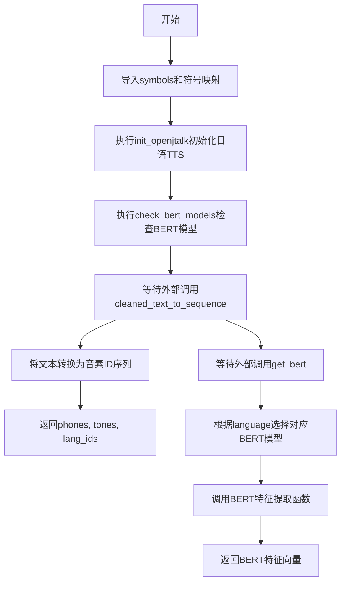
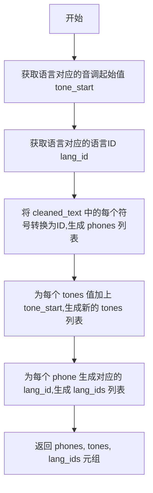
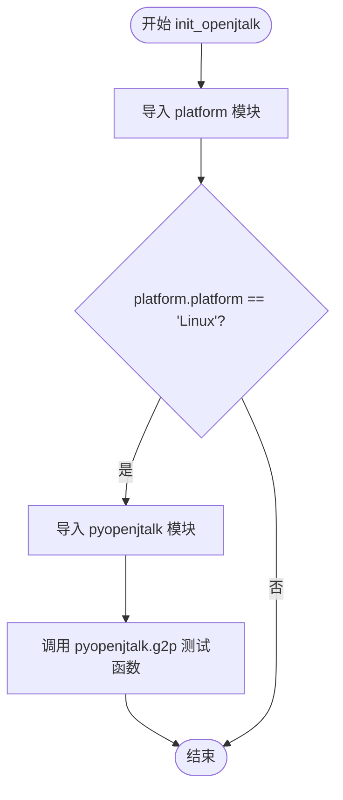

# `Bert-VITS2\text\__init__.py` 详细设计文档

该模块是文本到语音(TTS)系统的核心预处理模块，负责将文本转换为音素序列、提取BERT特征以及管理多语言（中文、英文、日文）的语言处理功能。

## 整体流程



## 类结构

```
无类定义（基于函数的模块）
└── 全局函数模块
    ├── cleaned_text_to_sequence
    ├── get_bert
    ├── check_bert_models
    └── init_openjtalk
```

## 全局变量及字段


### `_symbol_to_id`
    
将文本符号映射到对应ID索引的字典，用于文本到音素的转换

类型：`dict[str, int]`
    


### `symbols`
    
从text.symbols模块导入的符号列表，包含所有支持的文本符号

类型：`list[str]`
    


### `language_tone_start_map`
    
语言到音调起始值的映射字典，用于为不同语言设置音调基准

类型：`dict[str, int]`
    


### `language_id_map`
    
语言名称到语言ID的映射字典，用于标识输入文本的语言类型

类型：`dict[str, int]`
    


### `lang_bert_func_map`
    
语言到BERT特征提取函数的映射字典，根据语言类型选择对应的BERT模型处理函数

类型：`dict[str, Callable]`
    


    

## 全局函数及方法


### `cleaned_text_to_sequence`

将已清洗的文本（符号序列）、音调和语言信息转换为对应的符号ID序列、音调序列和语言ID序列，供后续语音合成模型使用。

**参数：**

- `cleaned_text`：`list[str]`，已清洗的文本符号列表，每个元素为符号（如声母、韵母、停顿等）
- `tones`：`list[int]`，与符号对应的音调值列表
- `language`：`str`，语言标识（如 "ZH"、"EN"、"JP"）

**返回值：** `tuple[list[int], list[int], list[int]]`，返回一个包含三个列表的元组：
- `phones`：符号对应的ID序列
- `tones`：调整后的音调序列（已加上语言对应的起始音调值）
- `lang_ids`：与符号序列等长的语言ID列表

#### 流程图



#### 带注释源码

```python
from text.symbols import *

# 全局变量：从 symbols 列表构建符号到ID的映射字典
# symbols 定义了所有可能的文本符号（音素、停顿等）
_symbol_to_id = {s: i for i, s in enumerate(symbols)}


def cleaned_text_to_sequence(cleaned_text, tones, language):
    """将清洗后的文本字符串转换为对应的符号ID序列
    
    该函数是文本到语音合成流程中的关键环节，负责：
    1. 将文本符号转换为模型可处理的数字ID
    2. 根据语言调整音调值的起始偏移
    3. 为所有符号标注语言ID，便于多语言合成
    
    Args:
      cleaned_text: 已清洗的文本符号列表
      tones: 与符号对应的原始音调值列表
      language: 语言标识符，用于确定音调偏移和语言ID
      
    Returns:
      包含 phones, tones, lang_ids 的元组，供后续模型使用
    """
    # 第一步：符号到ID的转换
    # 使用全局映射 _symbol_to_id 将每个文本符号转换为对应的整数ID
    phones = [_symbol_to_id[symbol] for symbol in cleaned_text]
    
    # 第二步：音调调整
    # 根据语言获取音调起始值（不同语言有不同的音调系统）
    # 然后将原始音调值加上起始值，得到实际使用的音调
    tone_start = language_tone_start_map[language]
    tones = [i + tone_start for i in tones]
    
    # 第三步：语言ID生成
    # 获取当前语言对应的语言ID
    lang_id = language_id_map[language]
    # 为每个符号生成对应的语言ID（用于多语言支持）
    lang_ids = [lang_id for i in phones]
    
    # 返回三个序列：音素ID、音调、语言ID
    return phones, tones, lang_ids
```


### `get_bert`

该函数是一个多语言BERT特征提取的路由函数，根据传入的语言参数（ZH/EN/JP）动态选择对应的中文、英文或日文BERT模型，将规范化文本转换为相应的BERT特征向量，支持可选的风格文本控制。

参数：

- `norm_text`：`str`，规范化后的输入文本
- `word2ph`：`list` 或 `dict`，词语到音素的映射关系，用于对齐BERT特征与音素
- `language`：`str`，语言标识，值为"ZH"（中文）、"EN"（英文）或"JP"（日文）
- `device`：`str` 或 `torch.device`，计算设备（如"cuda"或"cpu"）
- `style_text`：`str`，可选参数，用于风格迁移的参考文本，默认为None
- `style_weight`：`float`，可选参数，风格融合的权重值，默认为0.7

返回值：`tensor`，BERT模型输出的特征向量，通常为形状 `[seq_len, hidden_dim]` 的张量

#### 流程图

```mermaid
flowchart TD
    A[开始 get_bert] --> B[根据 language 参数<br/>选择对应的 BERT 函数]
    B --> C{language == "ZH"?
    C -->|是| D[使用 zh_bert<br/>中文BERT特征提取]
    C -->|否| E{language == "EN"?
    E -->|是| F[使用 en_bert<br/>英文BERT特征提取]
    E -->|否| G[使用 jp_bert<br/>日文BERT特征提取]
    D --> H[调用选定的BERT函数<br/>传入 norm_text, word2ph, device<br/>style_text, style_weight]
    F --> H
    G --> H
    H --> I[返回 BERT 特征向量]
```

#### 带注释源码

```python
def get_bert(norm_text, word2ph, language, device, style_text=None, style_weight=0.7):
    """
    根据语言类型选择对应的BERT模型进行特征提取
    
    参数:
        norm_text: str, 规范化后的输入文本
        word2ph: list/dict, 词语到音素的映射关系
        language: str, 语言标识 ("ZH", "EN", "JP")
        device: str/device, 计算设备
        style_text: str, 可选的风格文本用于控制生成风格
        style_weight: float, 风格融合权重，默认0.7
    
    返回:
        bert: tensor, BERT特征向量
    """
    # 动态导入各语言的BERT特征提取函数
    # 中文BERT提取器
    from .chinese_bert import get_bert_feature as zh_bert
    # 英文BERT提取器（模拟实现）
    from .english_bert_mock import get_bert_feature as en_bert
    # 日文BERT提取器
    from .japanese_bert import get_bert_feature as jp_bert

    # 建立语言到BERT函数的映射字典
    # ZH -> 中文BERT, EN -> 英文BERT, JP -> 日文BERT
    lang_bert_func_map = {"ZH": zh_bert, "EN": en_bert, "JP": jp_bert}
    
    # 根据language参数从映射字典中获取对应的BERT处理函数
    # 并调用该函数进行特征提取
    bert = lang_bert_func_map[language](
        norm_text, word2ph, device, style_text, style_weight
    )
    
    # 返回提取的BERT特征向量
    return bert
```


### `check_bert_models`

该函数用于检查并验证BERT模型文件是否已正确下载到本地目录。它通过读取配置文件中的模型仓库信息，调用`_check_bert`函数来确保所需的BERT模型文件完整可用，如果配置了openi镜像源则先进行登录认证。

参数： 无

返回值：`None`，无返回值（该函数执行副作用操作，不返回任何值）

#### 流程图

```mermaid
flowchart TD
    A[开始 check_bert_models] --> B[导入模块: json, Path]
    --> C[导入: config, bert_utils._check_bert]
    --> D{config.mirror == 'openi'?}
    -->|是| E[导入 openi 模块]
    --> F{config.openi_token 存在?}
    -->|是| G[使用 token 登录 openi]
    -->|否| H[无 token 登录 openi]
    --> I[打开 ./bert/bert_models.json 文件]
    -->|否| I
    --> J[解析 JSON 获取 models 字典]
    --> K{遍历 models 中的每个模型}
    --> L[构造 local_path: ./bert/{k}]
    --> M[调用 _check_bert 验证模型]
    --> N{模型遍历完成?}
    -->|否| K
    -->|是| O[结束]
```

#### 带注释源码

```python
def check_bert_models():
    """检查并验证BERT模型文件是否已正确下载到本地.
    
    该函数执行以下操作:
    1. 如果配置使用openi镜像源,则登录openi
    2. 读取bert_models.json配置文件
    3. 遍历配置中的每个模型,调用_check_bert验证模型文件完整性
    """
    # 导入标准库:json用于解析模型配置文件,Path用于路径操作
    import json
    from pathlib import Path

    # 导入项目配置模块和BERT工具函数
    from config import config
    from .bert_utils import _check_bert

    # 检查是否配置了openi镜像源(OpenI是中国镜像源)
    if config.mirror.lower() == "openi":
        # 动态导入openi模块
        import openi

        # 如果配置了token则使用token登录,否则无token登录
        kwargs = {"token": config.openi_token} if config.openi_token else {}
        openi.login(**kwargs)

    # 打开BERT模型配置文件读取模型信息
    with open("./bert/bert_models.json", "r") as fp:
        models = json.load(fp)
        # 遍历每个模型配置(k:模型名称, v:包含repo_id和files的字典)
        for k, v in models.items():
            # 构造本地模型路径: ./bert/{模型名}
            local_path = Path("./bert").joinpath(k)
            # 调用_check_bert检查模型文件是否存在且完整
            # v["repo_id"]: 模型在远程仓库的ID
            # v["files"]: 模型需要下载的文件列表
            # local_path: 本地存储路径
            _check_bert(v["repo_id"], v["files"], local_path)
```


### `init_openjtalk`

该函数用于在 Linux 系统上初始化 OpenJTalk 日语文本转语音引擎。它通过检测当前平台是否为 Linux 来条件性地导入并初始化 pyopenjtalk 模块，并执行一次测试转换以确保引擎正常工作。

参数：

- 无参数

返回值：`None`，该函数不返回任何值，仅执行初始化操作

#### 流程图



#### 带注释源码

```python
def init_openjtalk():
    """初始化 OpenJTalk 日语语音合成引擎。
    
    该函数仅在 Linux 平台上执行初始化操作。
    通过检测操作系统平台，决定是否加载 pyopenjtalk 库。
    """
    import platform  # 导入平台检测模块，用于判断当前操作系统
    
    # 判断当前平台是否为 Linux 系统
    if platform.platform() == "Linux":
        # Linux 平台：导入 OpenJTalk 的 Python 绑定库
        import pyopenjtalk
        
        # 执行一次测试转换，验证 pyopenjtalk 功能正常
        # 输入测试文本："こんにちは，世界。"（你好，世界。）
        pyopenjtalk.g2p("こんにちは，世界。")
```

## 关键组件


### 符号映射系统

负责将文本符号转换为对应的数字ID，是TTS文本处理的基础组件。

### 文本到序列转换模块

将清理后的文本转换为音素序列、音调序列和语言ID序列，支持多语言处理。

### 多语言BERT特征提取

根据语言类型动态调用对应的BERT模型（中文、英文、日文）提取文本特征。

### BERT模型检查与下载

检查本地BERT模型是否存在，不存在则从远程仓库下载，支持镜像源配置。

### OpenJTalk初始化

在Linux平台初始化日语文本转语音的OpenJTalk引擎。

### 语言映射配置

从text.symbols模块导入的语言相关配置，包含语言ID映射和音调起始位置映射。


## 问题及建议


### 已知问题

-   **模块级执行副作用**：在模块导入时直接调用 `init_openjtalk()` 和 `check_bert_models()`，导致模块加载缓慢，且初始化失败会使整个模块无法导入
-   **硬编码路径问题**：BERT模型路径 `./bert/bert_models.json` 和 `./bert` 硬编码，缺乏灵活的配置管理
-   **文档注释与实现不匹配**：`cleaned_text_to_sequence` 函数的文档注释描述参数为 `text`，但实际函数签名为 `cleaned_text, tones, language`
-   **未定义全局变量**：代码使用了 `language_tone_start_map` 和 `language_id_map`，但这两个变量未在该代码文件中定义，依赖导入
-   **缺乏异常处理**：`check_bert_models()` 中文件读取、模型检查等操作均无异常捕获机制，可能导致程序崩溃
-   **平台判断不严谨**：`platform.platform() == "Linux"` 判断方式不够健壮，应使用 `platform.system()` 或 `sys.platform`
-   **条件导入冗余**：`get_bert` 函数内部进行条件导入，每次调用都会执行导入逻辑，应提升至模块顶部或缓存
-   **重复映射逻辑**：`lang_ids` 列表推导式使用 `[lang_id for i in phones]` 其中 `i` 未使用，可以简化为 `[lang_id] * len(phones)`
-   **配置访问风险**：`config.mirror.lower()` 直接访问配置，若 `config` 或 `mirror` 属性不存在会抛出 AttributeError

### 优化建议

-   **延迟初始化**：将 `init_openjtalk()` 和 `check_bert_models()` 的调用改为按需执行或提供显式的初始化函数，而非模块导入时自动执行
-   **配置外部化**：将路径、配置参数提取到配置文件或环境变量中，使用 `pathlib.Path` 处理路径并提供默认值
-   **补充文档和类型注解**：修正文档注释，添加类型注解提升代码可读性和 IDE 支持
-   **添加异常处理**：为文件操作、网络请求、平台特定功能添加 try-except 包裹，提供降级方案或友好错误提示
-   **优化平台判断**：使用 `platform.system() == "Linux"` 或 `sys.platform.startswith('linux')` 提高可移植性
-   **重构导入策略**：将 BERT 函数导入移至模块顶部或实现单次导入缓存机制
-   **简化列表推导**：将 `[lang_id for i in phones]` 改为 `[lang_id] * len(phones)`
-   **防御性编程**：使用 `getattr(config, 'mirror', '').lower()` 或 hasattr 检查配置属性存在性

## 其它


### 设计目标与约束

本代码模块主要服务于文本转语音（TTS）系统，负责将清洗后的文本转换为音素序列，并提取对应的BERT特征用于语音合成。设计目标包括：支持多语言（中文、英语、日语）的文本处理，提供统一的语言无关接口，以及自动管理BERT模型的本地化部署。性能约束方面，文本转序列操作应在毫秒级完成，BERT特征提取可接受较高延迟（通常在数百毫秒到数秒），内存占用应控制在合理范围内以适应服务端部署场景。

### 错误处理与异常设计

代码中的错误处理主要体现在以下几个方面：语言参数验证方面，`cleaned_text_to_sequence`函数依赖全局变量`language_tone_start_map`和`language_id_map`，若传入未支持的语言代码将触发KeyError；`get_bert`函数通过字典`lang_bert_func_map`映射语言到对应的BERT处理函数，不支持的语言将抛出KeyError。模型检查方面，`check_bert_models`函数使用try-except捕获文件读取异常，若`bert_models.json`不存在或格式错误将导致流程中断。平台依赖方面，`init_openjtalk`函数仅在Linux平台执行，Windows和macOS平台会静默跳过初始化。导入错误方面，`get_bert`函数采用延迟导入策略，若特定语言的BERT模块缺失会在调用时才抛出ImportError。建议增加参数校验、统一的异常类定义、以及详细的错误日志记录机制。

### 数据流与状态机

数据流主要分为两条路径：主流程为cleaned_text（清洗后的文本字符串）→符号转ID映射（_symbol_to_id）→phones序列（音素ID列表）→添加语调偏移→返回phones、tones、lang_ids三元组。辅助流程为norm_text（规范化文本）→根据language选择对应BERT模型→提取BERT特征向量→返回bert特征。主流程无状态保持，为纯函数式转换；辅助流程涉及模型加载状态，首次调用后模型常驻内存。模块初始化时会依次执行init_openjtalk()（单次）和check_bert_models()（单次），确保运行时环境就绪。

### 外部依赖与接口契约

核心外部依赖包括：text.symbols模块（提供symbols列表、language_tone_start_map字典、language_id_map字典）、config配置对象（提供mirror和openi_token属性）、bert_utils模块（提供_check_bert函数）、各语言BERT模块（chinese_bert、english_bert_mock、japanese_bert，均提供get_bert_feature函数）、pyopenjtalk（Linux平台日语发音处理）、openi（可选，模型镜像源）、json/pathlib标准库。接口契约方面，cleaned_text_to_sequence接受cleaned_text（字符串列表）、tones（整数列表）、language（字符串）三参数，返回三元组（phones列表、tones列表、lang_ids列表）；get_bert接受norm_text（字符串）、word2ph（字典）、language（字符串）、device（字符串）、style_text（可选字符串）、style_weight（可选浮点数，默认0.7），返回BERT特征张量；check_bert_models和init_openjtalk无参数无返回值。

### 关键组件信息

_symbol_to_id：符号到ID的映射字典，由text.symbols模块的symbols列表生成，用于将音素符号转换为整数索引。language_tone_start_map：语言对应的语调起始值映射字典，定义各语言的基调起始编号。language_id_map：语言到语言ID的映射字典，为每种语言分配唯一标识符。lang_bert_func_map：语言到BERT处理函数的运行时映射字典，动态关联ZH/EN/JP与对应的特征提取实现。

### 潜在的技术债务与优化空间

模块级初始化代码（init_openjtalk()和check_bert_models()）在导入时立即执行，不利于依赖注入和测试，建议改为显式初始化函数或使用懒加载机制。错误处理缺失健壮性，未对输入参数类型和取值范围进行校验，异常信息不够友好。cleaned_text_to_sequence函数中的list comprehension可以优化为生成器以减少内存占用。get_bert函数采用延迟导入但每次调用都会查找字典，建议将函数引用缓存以减少查找开销。BERT模型检查逻辑硬编码了模型配置文件路径，缺乏灵活性。代码缺乏单元测试覆盖，关键转换逻辑和异常分支未经验证。文档注释不完整，部分参数描述与实际参数名不匹配（如text参数实际为cleaned_text）。

    