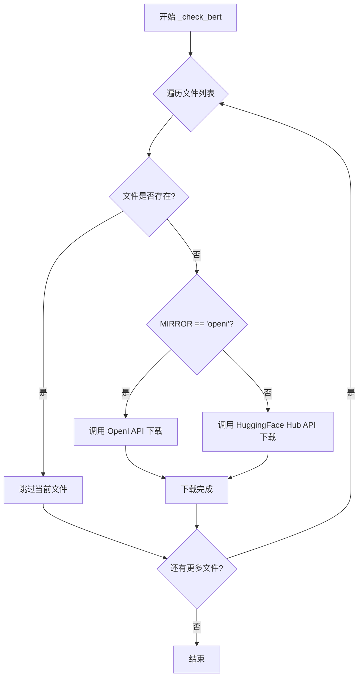
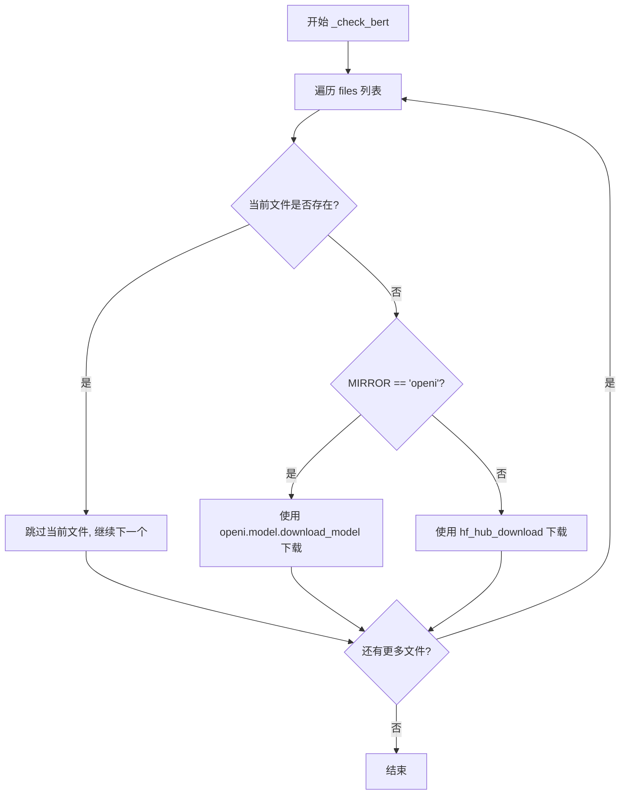

# `Bert-VITS2\text\bert_utils.py` 详细设计文档

该模块提供BERT模型文件的检查和下载功能，支持HuggingFace Hub和OpenI镜像两种下载源，通过MIRROR配置切换，支持断点续传和本地缓存管理。

## 整体流程



## 类结构

```
模块级函数 (无类结构)
└── _check_bert (模型检查下载函数)
```

## 全局变量及字段


### `MIRROR`
    
镜像源配置，从config获取，用于决定模型下载时使用的镜像源

类型：`str`
    


    

## 全局函数及方法


### `_check_bert`

检查并下载BERT模型文件，遍历指定文件列表，对缺失的文件根据MIRROR配置选择从OpenI镜像或HuggingFace Hub下载。

参数：

- `repo_id`：`str`，HuggingFace仓库ID，格式为"username/repo_name"
- `files`：`List[str]`，需要检查和下载的文件名列表
- `local_path`：`str`，本地存储路径，用于存放下载的模型文件

返回值：`None`，该函数无返回值，直接操作文件系统

#### 流程图



#### 带注释源码

```python
from pathlib import Path

# 导入HuggingFace Hub下载工具
from huggingface_hub import hf_hub_download

# 导入配置模块，获取镜像配置
from config import config

# 全局变量：镜像源配置，从配置中读取
MIRROR: str = config.mirror


def _check_bert(repo_id, files, local_path):
    """
    检查并下载BERT模型文件
    
    参数:
        repo_id: HuggingFace仓库ID
        files: 需要检查的文件列表
        local_path: 本地存储路径
    """
    # 遍历所有需要检查的文件
    for file in files:
        # 拼接完整本地路径并检查文件是否存在
        if not Path(local_path).joinpath(file).exists():
            # 判断是否使用OpenI镜像
            if MIRROR.lower() == "openi":
                # 导入OpenI模块进行镜像下载
                import openi
                
                # 从OpenI镜像站下载模型
                # repo_id分割取最后一部分作为模型名
                openi.model.download_model(
                    "Stardust_minus/Bert-VITS2",  # 固定的基础仓库名
                    repo_id.split("/")[-1],       # 从repo_id提取模型名
                    "./bert"                       # 下载保存目录
                )
            else:
                # 使用HuggingFace Hub官方渠道下载
                # local_dir_use_symlinks=False 表示不使用符号链接，直接复制文件
                hf_hub_download(
                    repo_id,                       # 仓库ID
                    file,                          # 要下载的文件名
                    local_dir=local_path,          # 本地保存目录
                    local_dir_use_symlinks=False   # 禁用符号链接
                )
```

#### 关键组件信息

| 组件名称 | 一句话描述 |
|---------|-----------|
| `hf_hub_download` | HuggingFace官方提供的模型文件下载工具，支持指定本地目录 |
| `Path(local_path).joinpath(file)` | 拼接并检查本地文件完整路径 |
| `MIRROR` 全局配置 | 控制模型下载来源，支持OpenI镜像和官方Hub切换 |

#### 潜在技术债务与优化空间

1. **硬编码模型路径**: `openi.model.download_model` 中硬编码了 `"Stardust_minus/Bert-VITS2"` 和 `"./bert"`，应提取为配置参数
2. **缺少错误处理**: 未对下载失败、网络异常、权限问题等进行捕获和处理
3. **参数类型不明确**: 函数签名中缺少类型注解，建议添加 `files: List[str]`, `local_path: str`, `repo_id: str`
4. **重复导入问题**: `import openi` 放在条件分支内，每次下载都会执行，建议提升到函数顶部或模块级别
5. **无返回值导致调用方无法得知下载结果**: 建议返回下载状态或失败文件列表
6. **未验证下载完整性**: 下载后未校验文件完整性或大小

#### 其它项目

**设计目标与约束**:
- 支持多文件检查与按需下载，避免重复下载已存在的文件
- 支持双源下载：HuggingFace官方Hub和OpenI镜像站

**错误处理与异常设计**:
- 当前实现无任何异常捕获，网络失败或磁盘空间不足时会导致程序中断

**数据流**:
```
输入: repo_id, files, local_path
处理: 文件存在性检查 → 选择下载源 → 执行下载
输出: 无直接返回值，副作用为文件下载到本地
```

**外部依赖与接口契约**:
- 依赖 `huggingface_hub` 库的 `hf_hub_download` 函数
- 依赖 `openi` 库（可选，仅当MIRROR为openi时使用）
- 依赖 `config` 模块的 `mirror` 配置项
- 假设 `files` 中的文件名与远程仓库中的文件名完全一致


## 关键组件


### 镜像配置与切换机制

通过MIRROR全局变量控制模型下载源，支持HuggingFace Hub和OpenI镜像两种下载路径，实现下载源的灵活切换

### 文件存在性检查

_check_bert函数遍历文件列表，使用Path.joinpath().exists()检查本地文件是否已存在，避免重复下载

### HuggingFace Hub下载器

使用huggingface_hub库的hf_hub_download函数从官方Hub下载模型文件，配置local_dir_use_symlinks=False确保文件实际下载到本地

### OpenI镜像下载器

当MIRROR设置为"openi"时，调用openi.model.download_model从镜像站下载，repo_id被分割处理以提取模型名称

### 模型路径处理

通过Path对象构建本地路径，结合repo_id和files参数实现模型文件的精确管理与下载


## 问题及建议


### 已知问题

-   **函数命名与实际功能不符**：函数名为 `_check_bert` 但实际功能是下载文件，而非"检查"
-   **硬编码问题**：模型名称 `"Stardust_minus/Bert-VITS2"` 和路径 `"./bert"` 被硬编码在函数内部，降低了复用性
-   **镜像下载逻辑不一致**：当使用 openi 镜像时，每次调用都会重新下载整个模型，而不是只下载缺失的文件；HuggingFace 方式则会检查文件是否存在后再下载
-   **缺少错误处理**：下载操作没有 try-except 包裹，网络异常、磁盘空间不足等情况会导致程序崩溃
-   **缺少类型注解**：函数参数 `repo_id`、`files`、`local_path` 缺少类型注解
-   **repo_id 解析脆弱**：`repo_id.split("/")[-1]` 假设 repo_id 格式正确，但没有验证，格式错误时会产生难以追踪的 bug
-   **日志缺失**：没有任何日志记录，难以排查下载失败或重复下载的问题
- **顶层导入 openi**：虽然代码中已将 import 放在 if 块内，但更佳实践是在文件顶部统一导入（或使用 lazy import）
- **路径处理不规范**：使用相对路径 `"./bert"` 可能导致工作目录不同时的行为不一致

### 优化建议

-   **重构函数命名**：将函数重命名为 `_download_bert_model` 或 `_ensure_bert_model_available`，使其准确反映功能
-   **提取硬编码值**：将模型名称和默认路径作为函数参数或配置项传入，提高复用性
-   **统一下载逻辑**：无论使用哪种镜像，都应该先检查文件是否已存在，再决定是否需要下载
-   **添加异常处理**：使用 try-except 包裹下载逻辑，捕获网络错误、IO 错误等，并提供友好的错误信息和重试机制
-   **添加类型注解**：为所有函数参数和返回值添加类型注解，提升代码可读性和 IDE 支持
-   **增强 repo_id 解析安全性**：使用更安全的方式解析 repo_id，或添加格式验证
-   **添加日志记录**：使用 logging 模块记录下载开始、成功、失败等关键信息
-   **优化导入策略**：将 openi 的导入移至文件顶部（如果确实需要），或使用 `importlib` 实现真正的 lazy import
-   **考虑使用绝对路径或配置路径**：使用 `Path` 处理相对路径，确保路径解析的一致性


## 其它


### 设计目标与约束

本模块旨在实现BERT模型的自动下载与缓存管理，确保模型文件在本地缺失时能够自动从远程仓库（支持HuggingFace Hub或OpenI镜像）下载。设计约束包括：仅支持HuggingFace格式的BERT模型仓库；需要网络连接；本地存储空间充足；遵循目标平台的文件夹结构约定。

### 错误处理与异常设计

网络异常处理：当网络连接失败时，函数静默返回而不抛出异常，可能导致后续推理任务因模型文件缺失而失败，建议增加重试机制和明确错误日志。文件路径异常：未检查local_path是否为有效路径或是否有写入权限。镜像源异常：当MIRROR设置为非预期值时，会直接调用hf_hub_download而非走镜像逻辑。

### 外部依赖与接口契约

主要外部依赖包括：pathlib.Path（标准库）、huggingface_hub库（提供hf_hub_download函数）、config模块（提供mirror配置）、openi库（仅在MIRROR为openi时使用）。函数_check_bert的输入参数repo_id应为"username/repo"格式，files应为文件名字符串列表，local_path应为本地目录路径字符串。调用方需保证local_path目录已创建或具有创建权限。

### 配置管理

通过全局变量MIRROR从config模块读取当前配置的镜像源，支持的值包括"openi"（使用OpenI镜像）或其他值（使用HuggingFace Hub）。建议增加配置验证逻辑，确保MIRROR值为合法选项。

### 平台兼容性考虑

文件路径处理使用pathlib.Path，具有良好的跨平台兼容性。hf_hub_download的local_dir_use_symlinks=False参数在Windows和Linux上行为一致，均采用复制而非符号链接。

### 性能考虑

当前实现为串行下载多个文件，未利用并发下载加速。建议：对于大模型文件，可考虑并行下载；可增加文件大小校验避免重复下载；可实现下载进度回调提升用户体验。

### 安全性考虑

代码直接从远程仓库下载可执行模型文件，存在供应链攻击风险。建议：增加文件完整性校验（如SHA256）；支持配置可信仓库白名单；下载前验证repo_id格式防止路径遍历攻击。

### 测试策略建议

建议增加以下测试用例：正常下载流程测试（mock hf_hub_download）；镜像源切换测试；文件已存在时的跳过逻辑测试；网络异常场景测试；repo_id格式验证测试。

### 改进建议

当前代码存在以下技术债务：函数无返回值，调用方无法得知下载结果；未记录下载日志，难以排查问题；缺少超时控制，可能导致长时间阻塞；未处理磁盘空间不足场景。建议重构为：返回下载状态或抛出明确异常；集成日志框架；添加下载超时配置；增加磁盘空间检查。

    