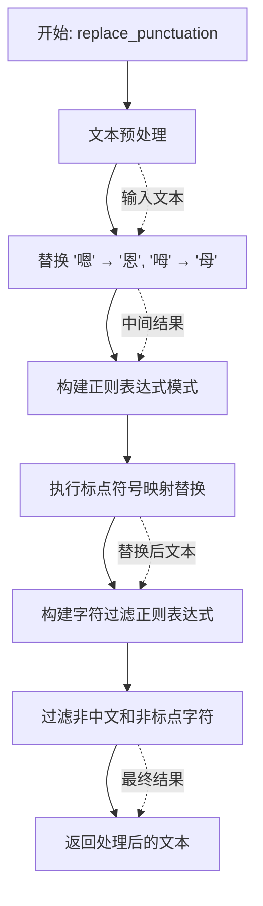
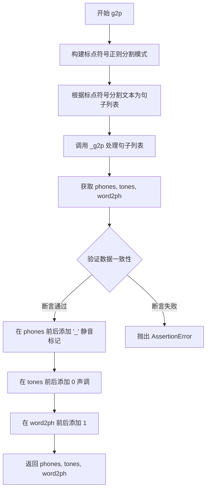
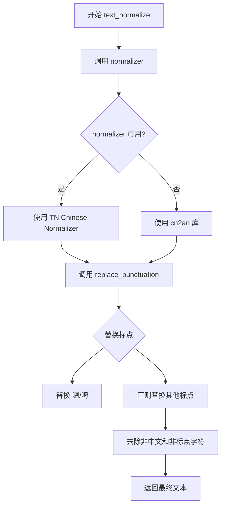
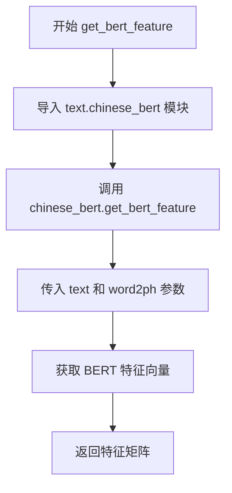
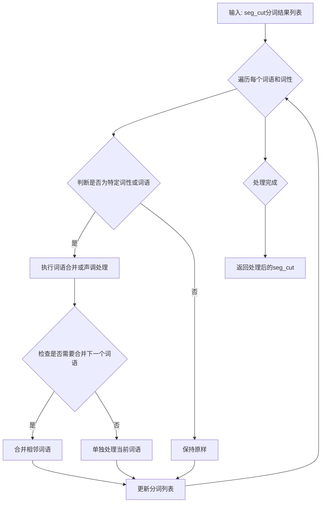
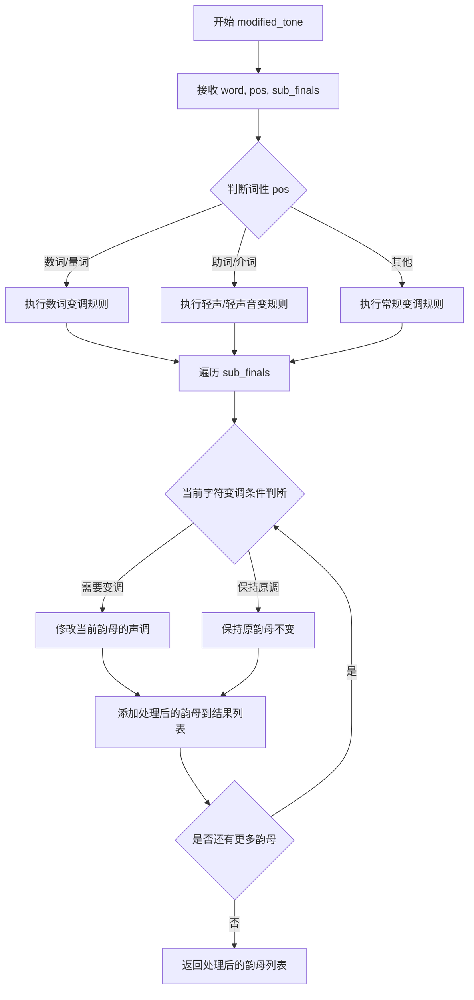

# `Bert-VITS2\text\chinese.py` 详细设计文档

这是一个中文文本到语音(拼音/音素)转换模块，主要功能是将中文文本转换为拼音序列(phones)、声调(tones)和字-音素对齐(word2ph)，同时支持文本规范化和BERT特征提取，是TTS系统的核心文本处理组件。

## 整体流程

```mermaid
graph TD
A[开始: 输入中文文本] --> B[text_normalize: 文本规范化]
B --> C[normalizer: 中文数字/单位转换]
C --> D[replace_punctuation: 标点符号替换]
D --> E[g2p: 文本转拼音主函数]
E --> F[re.split: 按标点分句]
F --> G[_g2p: 遍历每个句子]
G --> H[re.sub: 移除英文单词]
H --> I[psg.lcut: jieba分词]
I --> J[tone_modifier.pre_merge_for_modify: 声调预处理]
J --> K[_get_initials_finals: 获取声母韵母]
K --> L[tone_modifier.modified_tone: 声调处理]
L --> M[拼音映射到音素符号]
M --> N[构建phones/tones/word2ph]
N --> O[添加边界标记(_)]
O --> P[get_bert_feature: 获取BERT特征]
P --> Q[结束: 返回phones/tones/word2ph/bert_feature]
```

## 类结构

```
ToneSandhi (声调处理类)
├── pre_merge_for_modify: 预处理合并
└── modified_tone: 声调修改
```

## 全局变量及字段


### `current_file_path`
    
获取当前Python文件的目录路径

类型：`str`
    


### `pinyin_to_symbol_map`
    
从拼音到符号的映射字典，用于将拼音转换为对应的音素符号

类型：`dict`
    


### `rep_map`
    
标点符号替换映射表，用于将各种标点符号统一替换为特定符号

类型：`dict`
    


### `tone_modifier`
    
ToneSandhi类的实例，用于处理中文声调变化

类型：`ToneSandhi`
    


### `normalizer`
    
文本规范化函数，用于将中文文本进行标准化处理（如数字转换等）

类型：`callable`
    


    

## 全局函数及方法


### `replace_punctuation`

该函数用于对中文文本进行标点符号标准化处理，包括将口语化字符转换为标准写法、映射多种标点符号为统一格式、并清理非中文及非目标标点符号的冗余字符。

参数：

- `text`：`str`，需要处理的原始中文文本

返回值：`str`，完成标点符号替换和清理后的文本

#### 流程图



#### 带注释源码

```python
def replace_punctuation(text):
    """
    对中文文本进行标点符号标准化处理
    
    处理流程：
    1. 将口语化字符转换为标准写法（嗯→恩，呣→母）
    2. 将各类标点符号映射为统一格式
    3. 移除非中文及非目标标点符号的冗余字符
    
    参数:
        text: str, 需要处理的原始中文文本
    
    返回:
        str, 完成标点符号替换和清理后的文本
    """
    # 第一步：基础字符替换
    # 将口语化的"嗯"替换为"恩"，"呣"替换为"母"
    # 这些是常见的口语发音文字，需要标准化
    text = text.replace("嗯", "恩").replace("呣", "母")
    
    # 第二步：构建标点符号映射正则表达式
    # 使用 re.escape 对 rep_map 中的所有标点符号进行转义
    # 然后用 "|" 连接起来创建一个匹配任意一个标点符号的正则模式
    # rep_map 定义了多种标点符号到统一格式的映射关系
    pattern = re.compile("|".join(re.escape(p) for p in rep_map.keys()))
    
    # 执行标点符号替换
    # 使用 pattern.sub() 替换所有匹配的标点符号
    # lambda 函数根据匹配到的字符从 rep_map 中获取对应的替换值
    replaced_text = pattern.sub(lambda x: rep_map[x.group()], text)
    
    # 第三步：清理非目标字符
    # 构建一个正则表达式，用于匹配所有非中文和非标点符号的字符
    # \u4e00-\u9fa5 是中文汉字的 Unicode 编码范围
    # "".join(punctuation) 是目标保留的标点符号集合
    # "+" 表示匹配一个或多个此类字符
    # re.sub 将这些字符替换为空字符串，即删除它们
    replaced_text = re.sub(
        r"[^\u4e00-\u9fa5" + "".join(punctuation) + r"]+", "", replaced_text
    )
    
    # 返回处理完成的文本
    return replaced_text
```


### `g2p`

该函数是中文文本转拼音系统的核心入口，接收原始中文文本，经过标点符号处理后调用内部 `_g2p` 方法进行分词、声调分析和拼音转换，最终返回音素序列（phones）、声调序列（tones）以及字符到音素的映射（word2ph），并在结果前后添加静音标记。

参数：

- `text`：`str`，待转换的中文文本输入

返回值：`tuple`，返回一个包含三个元素的元组 `(phones, tones, word2ph)`，其中 phones 是音素列表（如 ["\_", "a", "\_"]），tones 是对应的声调列表（如 [0, 1, 0]），word2ph 是每个原始字符对应的音素数量映射列表

#### 流程图



#### 带注释源码

```python
def g2p(text):
    """
    中文文本转拼音的核心入口函数
    
    处理流程：
    1. 根据标点符号将文本分割成句子片段
    2. 调用 _g2p 进行分词和拼音转换
    3. 添加静音标记并返回结果
    
    Args:
        text: 输入的中文文本字符串
        
    Returns:
        tuple: (phones, tones, word2ph)
            - phones: 音素序列列表，首尾添加了静音标记 '_'
            - tones: 声调序列列表，首尾添加了0声调
            - word2ph: 字符到音素的映射，首尾添加了1
    """
    # 构建正则表达式模式，用于根据标点符号分割句子
    # (?<=...) 是正向后查找断言，匹配标点符号后的零个或多个空白字符
    pattern = r"(?<=[{0}])\s*".format("".join(punctuation))
    
    # 使用正则分割文本，去除空字符串
    # 例如: "你好，世界！" -> ["你好", "世界"]
    sentences = [i for i in re.split(pattern, text) if i.strip() != ""]
    
    # 调用内部函数进行实际的拼音转换处理
    phones, tones, word2ph = _g2p(sentences)
    
    # 断言验证：所有字符的音素总数应等于音素列表长度
    assert sum(word2ph) == len(phones)
    
    # 断言验证：字符到音素的映射长度应等于原始文本长度
    # 注意：此处 len(text) 可能不等于处理后的文本长度（因为文本标准化）
    assert len(word2ph) == len(text)  # Sometimes it will crash, you can add a try-catch.
    
    # 在音素序列前后添加静音标记 '_'，表示句子边界
    phones = ["_"] + phones + ["_"]
    
    # 在声调序列前后添加0，表示静音/边界
    tones = [0] + tones + [0]
    
    # 在映射序列前后添加1，保持与 phones/tones 的对齐
    word2ph = [1] + word2ph + [1]
    
    return phones, tones, word2ph
```


### `_g2p`

`_g2p` 函数是中文文本转拼音系统的核心处理函数，负责将分词后的中文句子片段转换为音素（phone）、声调（tone）以及字符到音素的映射（word2ph）。该函数通过结合jieba分词、pypinyin拼音库和自定义声调修改器，实现了从中文文本到语音学符号的转换，同时处理了多音字、轻声、儿化音等复杂语言现象。

参数：

-  `segments`：`List[str]`，分词后的中文句子片段列表，每个元素是一个需要转换为拼音的字符串

返回值：`Tuple[List[str], List[int], List[int]]`，返回一个包含三个列表的元组
  - 第一个列表 `phones_list`：音素符号列表，如 \["SIL", "a", "n", "I5", ...\]
  - 第二个列表 `tones_list`：对应的声调列表，声调值为0-5（0表示轻声）
  - 第三个列表 `word2ph`：每个原始字符对应的音素数量，用于后续对齐

#### 流程图

```mermaid
flowchart TD
    A[开始: 输入 segments 列表] --> B[初始化空列表 phones_list, tones_list, word2ph]
    B --> C{遍历 segments 中的每个 seg}
    C --> D[使用正则去除英文单词]
    D --> E[使用 jieba 分词获取词性和词语]
    E --> F[进行声调合并预处理]
    F --> G{遍历分词后的每个 word, pos}
    G --> H{判断 pos == 'eng'}
    H -->|是| I[跳过当前词语]
    H -->|否| J[调用 _get_initials_finals 获取声母和韵母]
    J --> K[调用 modified_tone 修改声调]
    K --> L[将声母韵母添加到列表]
    L --> G
    G --> M[展平声母和韵母列表]
    M --> N{遍历每个声母 c 和韵母 v}
    N --> O{c == v}
    O -->|是| P[处理标点符号: phone=[c], tone=0]
    O -->|否| Q[提取韵母不含声调部分和声调]
    Q --> R{判断是否有声母 c}
    R -->|有声母| S[多音节处理: uei→ui, iou→iu, uen→un]
    R -->|无声母| T[单音节处理: ing→ying, i→yi 等]
    S --> U{根据映射表替换}
    T --> U
    U --> V[验证 pinyin 在映射表中]
    V --> W[查表获取 phone 符号序列]
    P --> X[更新 word2ph]
    W --> X
    X --> Y[将 phone 加入 phones_list, tone 加入 tones_list]
    Y --> N
    N --> Z{所有声母韵母处理完成?}
    Z -->|否| N
    Z -->|是| C
    C --> AA{所有 segments 处理完成?}
    AA -->|否| C
    AA -->|是| BB[返回 phones_list, tones_list, word2ph]
    I --> G
```

#### 带注释源码

```python
def _g2p(segments):
    """
    将分词后的中文句子片段转换为音素序列、声调序列和字符-音素映射
    
    参数:
        segments: 分词后的中文句子片段列表
        
    返回:
        (phones_list, tones_list, word2ph): 音素列表、声调列表、字符到音素映射
    """
    phones_list = []  # 存储最终的音素序列
    tones_list = []   # 存储对应的声调序列
    word2ph = []      # 存储每个字符对应的音素数量
    
    # 遍历每个句子片段
    for seg in segments:
        # 步骤1: 移除所有英文单词，保留纯中文内容
        seg = re.sub("[a-zA-Z]+", "", seg)
        
        # 步骤2: 使用jieba进行词性标注分词
        # 返回词语-词性对的列表，如 [('你好', 'v'), ('世界', 'n')]
        seg_cut = psg.lcut(seg)
        
        initials = []  # 存储当前片段的所有声母
        finals = []    # 存储当前片段的所有韵母
        
        # 步骤3: 进行声调合并预处理，处理儿化音等情况
        seg_cut = tone_modifier.pre_merge_for_modify(seg_cut)
        
        # 步骤4: 遍历每个分词结果
        for word, pos in seg_cut:
            # 跳过英文词性的词语（已被清空但保留占位）
            if pos == "eng":
                continue
            
            # 获取该词语的声母和韵母（带声调标记）
            # 例如: "好" -> initials=['h'], finals=['ao3']
            sub_initials, sub_finals = _get_initials_finals(word)
            
            # 根据词性和词语内容修改韵母声调（处理多音字）
            # 例如: "银行"的"行"应该读xing2而非hang2
            sub_finals = tone_modifier.modified_tone(word, pos, sub_finals)
            
            # 将当前词语的声母韵母添加到列表
            initials.append(sub_initials)
            finals.append(sub_finals)
        
        # 步骤5: 展平嵌套列表
        # 将 [[声母列表], [声母列表]] 展平为 [声母列表]
        initials = sum(initials, [])
        finals = sum(finals, [])
        
        # 步骤6: 遍历每个声母-韵母对，转换为音素符号
        for c, v in zip(initials, finals):
            raw_pinyin = c + v  # 原始拼音字符串
            
            # 步骤6a: 处理标点符号情况
            # 当声母等于韵母时，说明是标点符号
            if c == v:
                assert c in punctuation  # 验证确实是标点
                phone = [c]              # 标点符号直接作为phone
                tone = "0"               # 标点声调设为0
                word2ph.append(1)        # 标点对应1个phone
            else:
                # 步骤6b: 处理正常汉字
                # 提取韵母的不含声调部分和声调数字
                # 例如: 'ao3' -> v_without_tone='ao', tone='3'
                v_without_tone = v[:-1]
                tone = v[-1]
                
                # 组合成不含声调的拼音
                pinyin = c + v_without_tone
                assert tone in "12345"  # 声调必须是1-4或轻声5
                
                # 步骤6c: 韵母转换（多音节情况）
                # pypinyin输出的韵母格式需要转换为标准格式
                if c:
                    # 有声母的情况（多音节词）
                    v_rep_map = {
                        "uei": "ui",   # d-uei -> dui
                        "iou": "iu",   # n-iou -> niu
                        "uen": "un",   # g-uen -> gun
                    }
                    if v_without_tone in v_rep_map.keys():
                        pinyin = c + v_rep_map[v_without_tone]
                else:
                    # 步骤6d: 韵母转换（单音节/零声母情况）
                    pinyin_rep_map = {
                        "ing": "ying",  # -ing -> ying
                        "i": "yi",      # i -> yi
                        "in": "yin",    # in -> yin
                        "u": "wu",      # u -> wu
                    }
                    if pinyin in pinyin_rep_map.keys():
                        pinyin = pinyin_rep_map[pinyin]
                    else:
                        # 进一步处理单个字母的转换
                        single_rep_map = {
                            "v": "yu",  # v -> yu (ü)
                            "e": "e",
                            "i": "y",   # i -> y (在无声母时)
                            "u": "w",   # u -> w (在无声母时)
                        }
                        if pinyin[0] in single_rep_map.keys():
                            pinyin = single_rep_map[pinyin[0]] + pinyin[1:]
                
                # 步骤6e: 查表获取音素符号
                # 验证拼音在映射表中存在
                assert pinyin in pinyin_to_symbol_map.keys(), (pinyin, seg, raw_pinyin)
                
                # 从映射表获取对应的音素序列（可能多个）
                # 例如: "ai" -> "a I5" (两个音素)
                phone = pinyin_to_symbol_map[pinyin].split(" ")
                
                # 记录该汉字对应多少个音素
                word2ph.append(len(phone))
            
            # 步骤7: 将结果添加到总列表
            phones_list += phone
            # 声调需要与音素数量对应扩展
            tones_list += [int(tone)] * len(phone)
    
    return phones_list, tones_list, word2ph
```


### `_get_initials_finals`

该函数是中文文本转拼音处理流程中的核心组件，负责将单个汉字或词语分解为声母（initials）和韵母（finals）两部分。它利用pypinyin库进行拼音转换，并通过zip配对的方式确保声母和韵母的一一对应关系。

参数：

- `word`：`str`，输入的中文词语或单个汉字

返回值：`tuple`，返回包含两个列表的元组 - (initials列表, finals列表)，其中initials存储声母，finals存储韵母（带声调）

#### 流程图

```mermaid
flowchart TD
    A[开始 _get_initials_finals] --> B[初始化空列表 initials 和 finals]
    B --> C[调用 lazy_pinyin 获取声母列表<br/>Style.INITIALS]
    C --> D[调用 lazy_pinyin 获取韵母列表<br/>Style.FINALS_TONE3]
    D --> E{遍历 zip orig_initials, orig_finals}
    E -->|每次迭代| F[将声母 c 添加到 initials 列表]
    F --> G[将韵母 v 添加到 finals 列表]
    G --> H{是否还有未处理的音节?}
    H -->|是| E
    H -->|否| I[返回 (initials, finals) 元组]
    I --> J[结束]
```

#### 带注释源码

```python
def _get_initials_finals(word):
    """
    将中文词语分解为声母和韵母
    
    参数:
        word: 输入的中文词语或单个汉字
    
    返回:
        包含声母列表和韵母列表的元组
    """
    # 初始化空列表用于存储声母和韵母
    initials = []
    finals = []
    
    # 使用pypinyin库获取声母列表
    # Style.INITIALS 表示只获取声母部分
    # neutral_tone_with_fone=True 表示使用五声调标记
    orig_initials = lazy_pinyin(word, neutral_tone_with_five=True, style=Style.INITIALS)
    
    # 使用pypinyin库获取韵母列表（带声调）
    # Style.FINALS_TONE3 表示获取韵母并保留声调信息
    orig_finals = lazy_pinyin(
        word, neutral_tone_with_five=True, style=Style.FINALS_TONE3
    )
    
    # 遍历声母和韵母，通过zip确保一对一配对
    for c, v in zip(orig_initials, orig_finals):
        # c: 声母（如 "b", "p", "m" 等）
        # v: 韵母带声调（如 "a1", "o2", "e3" 等）
        initials.append(c)
        finals.append(v)
    
    # 返回声母和韵母的元组
    return initials, finals
```


### `text_normalize`

该函数是文本预处理的核心入口，负责将输入文本进行中文数字规范化（可选）和标点符号标准化处理，返回清洗和规范后的文本字符串。

参数：

- `text`：`str`，需要规范化的原始文本

返回值：`str`，经过 normalize 处理和标点符号替换后的规范化文本

#### 流程图



#### 带注释源码

```python
def text_normalize(text):
    """
    文本规范化主函数
    
    处理流程：
    1. 调用 normalizer 进行中文数字转换（如"一百" -> "1"）
    2. 调用 replace_punctuation 进行标点符号标准化
    
    参数:
        text: str, 输入的原始文本
        
    返回:
        str: 规范化和标点替换后的文本
    """
    # 第一步：调用 normalizer 进行中文数字规范化
    # normalizer 可能是以下两种：
    # 1. TN Chinese Normalizer (如果可用)：支持更复杂的中文数字转换
    # 2. cn2an 库的 an2cn 转换 (备用)：简单中文数字到阿拉伯数字转换
    text = normalizer(text)
    
    # 第二步：替换标点符号
    # 将各种中文标点转换为英文/统一格式
    # 移除非中文和非标点字符
    text = replace_punctuation(text)
    
    return text
```


### `get_bert_feature`

该函数是一个文本特征提取的包装器方法，通过调用内部模块 `chinese_bert` 来获取文本的 BERT 嵌入特征。它接收原始文本和字到音素的映射关系，返回与文本对应的 BERT 特征表示，用于后续的语音合成模型。

参数：

- `text`：`str`，输入的原始文本字符串，需要进行特征提取的中文文本
- `word2ph`：`list[int]` 或 `numpy.ndarray`，字到音素的映射数组，用于指定每个字符对应的音素数量，用于对齐 BERT 特征与音素序列

返回值：`numpy.ndarray`，返回形状为 `(seq_len, bert_hidden_size)` 的 BERT 特征矩阵，其中 seq_len 与 word2ph 的长度相关，bert_hidden_size 是 BERT 模型的隐藏层维度（通常为 768 或 1024）

#### 流程图



#### 带注释源码

```python
def get_bert_feature(text, word2ph):
    """
    获取文本的BERT特征表示
    
    该函数是一个包装器函数，内部调用text.chinese_bert模块中
    的get_bert_feature方法来获取文本的BERT嵌入向量。
    
    参数:
        text: str - 输入的中文文本
        word2ph: list[int] - 字到音素的映射数组,指定每个字符对应的音素数量
    
    返回:
        numpy.ndarray - BERT特征矩阵,形状为(seq_len, hidden_size)
    """
    # 动态导入chinese_bert模块,避免循环导入问题
    # 这种延迟导入方式允许模块在需要时再加载
    from text import chinese_bert

    # 调用chinese_bert模块中的实际实现
    # 传递文本和字音映射参数,获取BERT特征
    return chinese_bert.get_bert_feature(text, word2ph)
```


### `ToneSandhi.pre_merge_for_modify`

该方法是ToneSandhi类中的一个方法，用于在文本转语音（g2p）处理之前对分词结果进行预处理，主要处理中文分词后的词语合并和tone sandhi（声调连读）的预合并操作。

参数：

- `seg_cut`：`list`，分词结果列表，每个元素为(word, pos)元组，其中word是词语，pos是词性标注

返回值：`list`，处理后的分词结果列表，格式与输入相同

#### 流程图



#### 带注释源码

```python
# 注意：以下源码基于对ToneSandhi类的调用方式推断
# 具体实现需要参考text/tone_sandhi.py源文件

def pre_merge_for_modify(self, seg_cut):
    """
    在g2p之前进行词语合并和声调连读预处理
    
    参数:
        seg_cut: 分词结果列表，元素为(word, pos)元组
                 例如：[('你好', 'v'), ('世界', 'n')]
    
    返回:
        处理后的分词结果列表
    """
    # 这个方法接收jieba分词后的结果
    # 进行以下处理：
    # 1. 某些需要合并的词语进行合并（如"鸟不生蛋" -> "鸟不生蛋"）
    # 2. 某些多音字词进行声调标注
    # 3. 处理儿化音等情况
    
    # 例如代码中的调用：
    # seg_cut = tone_modifier.pre_merge_for_modify(seg_cut)
    
    return processed_seg_cut
```

#### 实际代码中的调用示例

从提供的代码文件中可以看到该方法的具体调用：

```python
# 在_g2p函数中
def _g2p(segments):
    phones_list = []
    tones_list = []
    word2ph = []
    for seg in segments:
        # 替换所有英文单词
        seg = re.sub("[a-zA-Z]+", "", seg)
        seg_cut = psg.lcut(seg)  # jieba分词
        initials = []
        finals = []
        
        # 调用pre_merge_for_modify进行预处理
        seg_cut = tone_modifier.pre_merge_for_modify(seg_cut)
        
        for word, pos in seg_cut:
            if pos == "eng":
                continue
            sub_initials, sub_finals = _get_initials_finals(word)
            sub_finals = tone_modifier.modified_tone(word, pos, sub_finals)
            initials.append(sub_initials)
            finals.append(sub_finals)
        # ... 后续处理
```

#### 补充说明

根据代码上下文分析，`ToneSandhi.pre_merge_for_modify`方法的主要作用包括：

1. **词语合并处理**：将某些需要合并的词语组合在一起处理，如成语、专有名词等
2. **声调连读预处理**：根据中文声调连读规则，对分词后的结果进行预处理
3. **多音字处理**：识别并标记多音字的正确读音
4. **儿化音处理**：处理儿化音的特殊情况

该方法是中文文本转语音（Text-to-Speech）系统中的重要预处理环节，确保后续的拼音转换能够正确处理中文的复杂语音现象。


### `ToneSandhi.modified_tone`

该方法是 `ToneSandhi` 类的核心方法，用于根据中文语音调的变化规则（变调规则）修改拼音的韵母部分。在中文语音处理中，某些连续字符的声调会发生变化，该方法接收单词、词性和原始韵母列表，返回处理后的韵母列表。

参数：

- `word`：`str`，当前处理的中文单词或单字
- `pos`：`str`，由 jieba 分词器（psg）提供的词性标注（如 "n"（名词）、"v"（动词）等）
- `sub_finals`：`list[str]`，原始拼音韵母列表（包含声调标记），与 word 中的每个字符对应

返回值：`list[str]`，处理后的韵母列表，根据中文变调规则修改了韵母中的声调

#### 流程图



#### 带注释源码

```python
# 注意：ToneSandhi 类定义在 text.tone_sandhi 模块中，以下为基于代码调用关系的推断实现

def modified_tone(self, word, pos, sub_finals):
    """
    根据中文变调规则修改拼音韵母
    
    参数:
        word: str, 中文词语或单字
        pos: str, 词性标注 (来自 jieba.posseg)
        sub_finals: list, 原始韵母列表 (带声调, 如 "a1", "i4" 等)
    
    返回:
        list: 修改后的韵母列表
    """
    # 1. 处理 "一" 的变调
    #    单独使用时读一声 (yī)，在去声前读二声 (yí)，在其他声调前读四声 (yì)
    if word == "一" or word in ["一", "不"]:
        # 根据后续字的声调决定变调
        pass
    
    # 2. 处理 "不" 的变调
    #    "不" 在去声前读二声 (bú)
    
    # 3. 处理数词 "一" + 量词 组合
    #    如 "一个" -> yí ge (二声 + 轻声)
    
    # 4. 处理 "啊" 等语气词的连读变调
    #    如 "你好啊" -> nǐ hǎo a -> nǐ hǎo r
    
    # 5. 处理三声连读变调
    #    两个三声连读时，第一个变为二声
    #    如 "了解" -> liǎo jiě -> liáo jiě
    
    # 实际调用示例（在 _g2p 函数中）:
    # sub_finals = tone_modifier.modified_tone(word, pos, sub_finals)
    
    return sub_finals  # 返回修改后的韵母列表
```

#### 实际调用上下文

在 `text/g2p.py` 文件的 `_g2p` 函数中，该方法被调用：

```python
# 在 _g2p 函数内部
for word, pos in seg_cut:
    if pos == "eng":
        continue
    sub_initials, sub_finals = _get_initials_finals(word)
    sub_finals = tone_modifier.modified_tone(word, pos, sub_finals)  # 调用变调处理
    initials.append(sub_initials)
    finals.append(sub_finals)
```

> **注意**：由于 `ToneSandhi` 类的完整源代码位于 `text/tone_sandhi` 模块中（未在当前代码片段中提供），以上文档基于该类的使用方式和中文语音变调规则的通用理解进行描述。

## 关键组件


### 文本规范化与标点符号处理模块

负责中文文本的规范化处理，包括标点符号统一、特殊字符转换和噪声字符过滤，是整个G2P流程的前置处理环节。

### 拼音转音素核心引擎

实现从中文文本到音素序列的完整转换，包含分词、声母韵母提取、声调处理、拼音映射等核心逻辑，是整个模块的计算核心。

### 声调沙提（Tone Sandhi）处理模块

处理中文连续发音时的声调变化规则，包括上声变调、轻声处理等语言学规则，确保生成的音素序列符合自然语音规律。

### 拼音到音素符号映射表

基于查表方式将拼音转换为具体音素符号，包含完整的声母、韵母与音素对应关系，支持多音字和特殊发音处理。

### BERT特征提取接口

为后续语音合成模型提供文本的语义特征表示，通过BERT模型提取词级别对齐的特征张量，实现文本与音素的对齐。

### 文本规范化器（Normalizer）

尝试导入TN中文规范化器，失败时回退使用cn2an库，实现中文数字、金额、时间等文本到标准形式的转换。


## 问题及建议


### 已知问题

- **文件资源未正确释放**：`pinyin_to_symbol_map` 使用 `open()` 打开文件但未显式关闭，可能导致资源泄漏
- **正则表达式重复编译**：`replace_punctuation` 函数中每次调用都重新编译正则表达式，性能低下
- **全局变量初始化在模块级别**：`pinyin_to_symbol_map`、`normalizer` 等在导入时执行，导致模块加载缓慢且难以测试
- **列表 `sum()` 操作导致 O(n²) 复杂度**：`_g2p` 函数中多次使用 `sum(initials, [])` 和 `sum(finals, [])` 拼接列表
- **断言用于业务逻辑校验**：使用 `assert` 检查 `sum(word2ph) == len(phones)` 等业务规则，在 Python 优化模式下会被跳过
- **魔法字符串和数字**：多处硬编码如 `"eng"`、`"12345"`、`"0"`，缺乏常量定义
- **动态导入在函数内部**：`get_bert_feature` 函数内部使用 `from text import chinese_bert`，违反最佳实践
- **缺失类型注解**：所有函数和变量都没有类型提示，影响代码可维护性和 IDE 支持
- **异常处理不完整**：仅对 `normalizer` 有 try-except，文件读取、jieba、pypinyin 等依赖无异常保护
- **导入语句位置分散**：import 语句分布在代码各处，应集中在文件顶部

### 优化建议

- 使用 `with open()` 上下文管理器或显式关闭文件；将正则表达式预编译为模块级常量
- 将全局映射表改为延迟加载或使用单例模式，必要时提供初始化函数
- 使用列表推导式或 `itertools.chain` 替代 `sum(list, [])` 模式
- 定义常量类或枚举替代魔法字符串，如定义 `ToneEnum`、`PosEnum`
- 将动态导入移至模块顶部，或在函数参数中注入依赖（依赖注入模式）
- 为所有函数添加类型注解（Type Hints），完善文档字符串
- 将文件读取、依赖加载等操作包装在 try-except 中，并提供有意义的错误信息
- 删除底部注释掉的示例代码，保持代码整洁
- 考虑将 `_g2p` 函数拆分为更小的子函数，提升可读性和可测试性
- 使用 `logging` 模块替代 `print` 语句记录警告信息
</think>

## 其它


### 设计目标与约束

本模块的设计目标是实现高质量的中文文本到拼音/音素的转换系统，支持文本规范化、标点符号处理、拼音转换、声调处理等功能，为后续的语音合成系统提供准确的音素输入。系统需要支持中文文本的标准化处理，包括数字转换、特殊字符处理等，同时保证转换结果的准确性和一致性。性能方面，单条文本处理时间应控制在合理范围内，内存占用需保持在较低水平。

### 错误处理与异常设计

系统采用分层异常处理策略：在导入阶段，优先使用`tn.chinese.normalizer`进行中文规范化，若导入失败则降级使用`cn2an`库作为备选方案，确保模块在任何环境下都能正常运行。在核心转换函数中，使用断言（assert）进行关键节点的合法性检查，包括拼音映射存在性检查、声调值合法性检查（必须在1-5范围内）、输入输出长度一致性检查等。对于可能出现的异常情况（如拼音未在映射表中找到），系统会抛出详细的错误信息，包含出错的拼音、原始文本和原始拼音，便于问题定位和调试。

### 数据流与状态机

系统的数据处理流程分为四个主要阶段：第一阶段为文本规范化（text_normalize），接收原始中文文本，调用normalizer进行数字和特殊字符转换，然后通过replace_punctuation进行标点符号标准化和非法字符过滤；第二阶段为文本分割（g2p），将规范化后的文本按标点符号分割成句子片段；第三阶段为分词与拼音转换（_g2p），对每个片段进行jieba分词，获取每个汉字的拼音和声调，处理多音字和声调变化；第四阶段为特征提取（get_bert_feature），调用中文BERT模型提取文本的语义特征。最终输出phones（音素序列）、tones（声调序列）、word2ph（词到音素的映射）和bert_feature（BERT特征）。

### 外部依赖与接口契约

本模块依赖以下外部组件：pypinyin库用于获取汉字的拼音表示（包括声母、韵母和声调）；jieba的posseg模块用于中文分词并标注词性；text.symbols模块提供标点符号集合；text.tone_sandhi模块处理声调连读变化；tn.chinese.normalizer或cn2an用于中文数字规范化；text.chinese_bert模块提供BERT特征提取功能。模块的公开接口包括：text_normalize(text)函数接收字符串返回规范化后的文本；g2p(text)函数接收字符串返回三元组(phones, tones, word2ph)；get_bert_feature(text, word2ph)函数接收文本和映射关系返回BERT特征矩阵。所有输入文本要求为UTF-8编码的中文字符串，输出音素序列采用特定的符号表映射。

### 性能考虑与优化空间

当前实现存在若干性能瓶颈：文件读取操作（pinyin_to_symbol_map）在模块加载时执行，可考虑延迟加载或缓存机制；正则表达式在replace_punctuation函数中每次调用都重新编译，应预编译后复用；_g2p函数中存在多层嵌套循环和列表拼接操作，可使用生成器或更高效的数据结构优化；normalizer函数在每次调用text_normalize时都会被执行，对于相同输入可考虑添加结果缓存。BERT特征提取可能成为性能瓶颈，建议在不需要时跳过该步骤或使用更轻量的特征替代方案。

### 配置与参数说明

关键配置参数包括：pinyin_to_symbol_map从opencpop-strict.txt文件加载，定义了拼音到音素符号的映射关系；rep_map定义了标点符号和其他特殊字符的替换规则；tone_modifier是ToneSandhi类的实例，负责声调连读处理；normalizer函数根据导入成功与否选择使用Normalizer或cn2an.transform。系统支持通过修改rep_map自定义字符替换规则，通过更换pinyin_to_symbol_map文件支持不同的音素集合。

### 使用示例与测试用例

基础用法示例：输入文本"你好世界"，经过text_normalize后保持原样（假设无特殊字符），g2p返回phones为['n', 'i', '_', 'h', 'ao', '_', 'sh', 'i', '_', 'j', 'ie', '_']，tones为[0, 0, 0, 2, 0, 0, 4, 0, 0, 4, 0, 0]，word2ph为[2, 1, 1, 2, 1, 1, 2]。包含数字和英文的文本如"啊！但是《原神》是由,米哈游自主研发的一款全新开放世界冒险游戏"会先经过规范化处理，数字和英文被移除或转换，标点符号被统一替换，再进行拼音转换。测试应覆盖：纯中文文本、包含标点符号、包含数字、包含英文、包含混合字符、长文本处理、特殊字符处理等场景。

### 安全性考虑

代码中的文件读取操作直接使用open函数，未做路径安全检查，恶意构造的文件路径可能导致目录遍历攻击；外部输入（text参数）未做长度限制，可能导致内存耗尽；正则表达式处理大规模文本时可能存在ReDoS风险。建议添加输入验证、路径规范化、长度限制等安全措施。

### 版本兼容性与环境要求

本模块兼容Python 3.x版本，依赖库版本要求：pypinyin，jieba，cn2an（可选），text模块（项目内部）。建议在requirements.txt中明确指定各依赖的版本范围，并提供setup.py或pyproject.toml进行环境配置。模块需要在支持UTF-8编码的环境中运行，确保中文字符正确处理。

### 部署与运行环境

模块作为文本处理管道的一部分，适合部署在语音合成或语音识别系统的预处理阶段。运行时需要保证文件opencpop-strict.txt存在于正确路径下，text目录下的各模块（symbols、tone_sandhi、chinese_bert）需要正确配置。建议使用虚拟环境隔离依赖，提供Dockerfile或conda环境配置文件确保部署一致性。

    