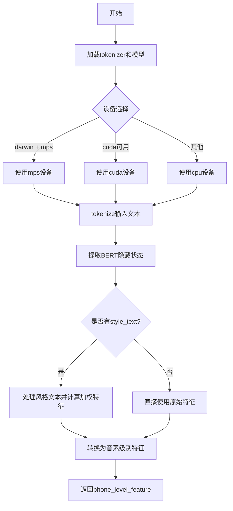

# `Bert-VITS2\text\chinese_bert.py` 详细设计文档

该代码实现了一个基于中文RoBERTa-wwm-ext-large预训练模型的特征提取工具，能够将文本转换为词级别和音素级别的深度学习特征，支持可选的风格迁移功能。

## 整体流程



## 类结构

```
无类层次结构 (基于函数的模块化设计)
```

## 全局变量及字段


### `LOCAL_PATH`
    
本地预训练BERT模型的路径，指向中文 RoBERTa-wwm-ext-large 模型目录

类型：`str`
    


### `tokenizer`
    
已加载的分词器实例，用于将文本转换为模型输入的 token ids

类型：`transformers.AutoTokenizer`
    


### `models`
    
缓存已加载BERT模型的字典，键为设备字符串（如 'cpu'、'cuda'、'mps'），值为对应设备的模型实例

类型：`dict[str, transformers.AutoModelForMaskedLM]`
    


    

## 全局函数及方法


### `get_bert_feature`

该函数使用预训练的中文RoBERTa-wwm-ext-large模型提取文本的词级别语义特征，并将词级别特征按音素映射表（word2ph）展开为音素级别的特征，支持可选的风格文本特征融合，用于语音合成等场景。

参数：

- `text`：`str`，需要提取特征的输入文本
- `word2ph`：`list[int]` 或类似序列，每个词对应到音素（phone）的数量，用于将词级别特征展开为音素级别特征
- `device`：`str`，计算设备，默认为`config.bert_gen_config.device`，支持cuda/cpu/mps
- `style_text`：`str | None`，可选的风格参考文本，用于特征融合，如果为None则不使用风格融合
- `style_weight`：`float`，风格融合权重，默认为0.7，范围[0,1]，值越大风格特征影响越大

返回值：`torch.Tensor`，形状为(特征维度, 音素数量)的转置张量，即`(hidden_size, total_phones)`

#### 流程图

```mermaid
flowchart TD
    A[开始 get_bert_feature] --> B{检查平台和设备}
    B --> C{platform == darwin<br/>且MPS可用<br/>且device == cpu?}
    C -->|是| D[设置device = mps]
    C -->|否| E{device为空?}
    D --> F
    E -->|是| G[设置device = cuda]
    E -->|否| F[保持device不变]
    G --> F
    
    F --> H{device在models中?}
    H -->|否| I[加载模型并缓存到models[device]]
    H -->|是| J[获取缓存模型]
    I --> J
    
    J --> K[tokenizer编码text]
    K --> L[将输入tensor移动到device]
    L --> M[执行模型前向传播<br/>output_hidden_states=True]
    M --> N[提取hidden_states[-3:-2]<br/>拼接最后维度并转置]
    
    N --> O{style_text不为空?}
    O -->|是| P[编码style_text]
    O -->|否| R
    
    P --> Q[执行风格文本前向传播<br/>提取风格特征均值]
    Q --> R{assert len(word2ph) == len(text) + 2}
    
    R --> S[遍历每个词索引i]
    S --> T{有风格文本?}
    T -->|是| U[计算融合特征<br/>res[i]*(1-w) + style_mean*w]
    T -->|否| V[直接重复res[i]]
    U --> W[将特征重复word2ph[i]次]
    V --> W
    
    W --> X[将所有特征拼接]
    X --> Y[转置返回]
    Z[结束]
    
    Y --> Z
```

#### 带注释源码

```python
import sys

import torch
from transformers import AutoModelForMaskedLM, AutoTokenizer

from config import config

# 模型本地路径，预训练中文Roberta模型
LOCAL_PATH = "./bert/chinese-roberta-wwm-ext-large"

# 全局tokenizer实例，整个模块共享
tokenizer = AutoTokenizer.from_pretrained(LOCAL_PATH)

# 模型缓存字典，键为device字符串，值为加载到对应设备的模型
# 避免重复加载模型，提高推理效率
models = dict()


def get_bert_feature(
    text,
    word2ph,
    device=config.bert_gen_config.device,
    style_text=None,
    style_weight=0.7,
):
    """
    使用预训练BERT模型提取文本特征，并展开为音素级别特征
    
    参数:
        text: 输入文本字符串
        word2ph: 词到音素的映射列表，表示每个词对应多少个音素帧
        device: 计算设备，默认为配置中的设备
        style_text: 可选的风格文本，用于特征风格迁移
        style_weight: 风格融合权重，0.7表示70%风格特征+30%内容特征
    
    返回:
        torch.Tensor: 音素级别的特征张量，形状为(特征维度, 音素数量)
    """
    # Apple Silicon (M系列芯片) 特殊处理：优先使用MPS加速
    if (
        sys.platform == "darwin"  # macOS系统
        and torch.backends.mps.is_available()  # MPS加速可用
        and device == "cpu"  # 默认配置为cpu时
    ):
        device = "mps"  # 自动切换到MPS设备
    
    # 设备参数为空时，默认使用CUDA
    if not device:
        device = "cuda"
    
    # 模型缓存机制：按设备缓存模型实例
    if device not in models.keys():
        # 首次使用该设备时加载模型并移动到对应设备
        models[device] = AutoModelForMaskedLM.from_pretrained(LOCAL_PATH).to(device)
    
    # 推理阶段关闭梯度计算，节省显存和计算资源
    with torch.no_grad():
        # 对输入文本进行tokenize编码
        inputs = tokenizer(text, return_tensors="pt")
        
        # 将所有输入tensor移动到指定设备
        for i in inputs:
            inputs[i] = inputs[i].to(device)
        
        # 执行模型前向传播，获取所有隐藏状态
        # output_hidden_states=True 返回所有层的隐藏状态
        res = models[device](**inputs, output_hidden_states=True)
        
        # 提取倒数第3层的隐藏状态 [-3:-2] 取倒数第3层
        # torch.cat(..., -1) 在最后一维拼接，得到词级别的特征表示
        # [0] 取batch第一个样本，.cpu() 移回CPU
        res = torch.cat(res["hidden_states"][-3:-2], -1)[0].cpu()
        
        # 风格特征提取（可选）
        if style_text:
            # 对风格文本进行编码
            style_inputs = tokenizer(style_text, return_tensors="pt")
            for i in style_inputs:
                style_inputs[i] = style_inputs[i].to(device)
            
            # 获取风格文本的特征表示
            style_res = models[device](**style_inputs, output_hidden_states=True)
            style_res = torch.cat(style_res["hidden_states"][-3:-2], -1)[0].cpu()
            
            # 计算风格特征的均值，得到一个全局风格向量
            style_res_mean = style_res.mean(0)
    
    # 验证word2ph长度与文本长度匹配（考虑BOS和EOS token）
    # BERT tokenizer会在序列前后添加[CLS]和[SEP]，所以+2
    assert len(word2ph) == len(text) + 2
    
    word2phone = word2ph
    phone_level_feature = []
    
    # 将词级别特征展开为音素级别特征
    for i in range(len(word2phone)):
        if style_text:
            # 风格融合：内容特征 * (1-权重) + 风格特征 * 权重
            # repeat(word2phone[i], 1) 将当前词的特征重复对应音素次数
            repeat_feature = (
                res[i].repeat(word2phone[i], 1) * (1 - style_weight)
                + style_res_mean.repeat(word2phone[i], 1) * style_weight
            )
        else:
            # 无风格文本时，直接重复词特征
            repeat_feature = res[i].repeat(word2phone[i], 1)
        
        phone_level_feature.append(repeat_feature)
    
    # 沿音素维度（dim=0）拼接所有特征
    phone_level_feature = torch.cat(phone_level_feature, dim=0)
    
    # 转置返回：使特征维度在前，音素维度在后
    # 最终形状: (hidden_size, total_phones)
    return phone_level_feature.T
```

## 关键组件


### 设备检测与自动选择

检测并自动选择最佳计算设备（CPU/MPS/CUDA），支持macOS MPS加速的自动启用

### 模型惰性加载与缓存

使用字典缓存不同设备的BERT模型，避免重复加载，支持多设备管理

### 张量索引与层选择

通过`res["hidden_states"][-3:-2]`索引获取特定Transformer层输出，用于特征提取

### 风格迁移支持

通过style_text和style_weight参数实现文本风格特征迁移，使用加权融合生成目标风格特征

### 词级到音级特征扩展

根据word2phone映射将词级特征扩展为音级（phone-level）特征，处理变长音素序列

### BERT特征提取管道

完整的特征提取流程：文本分词→模型推理→隐藏层选择→特征拼接→维度变换


## 问题及建议


### 已知问题

- **全局状态管理不当**：`models`字典作为全局变量长期持有模型实例，缺乏清理机制，可能导致显存/内存持续增长
- **设备处理逻辑缺陷**：MPS设备检测逻辑存在错误，当`device == "cpu"`时才会检查MPS，但检查后直接覆盖原device值，导致非CPU请求也会被意外改写为MPS
- **变量作用域错误**：当`style_text`为`None`时，`style_res_mean`变量未定义但在后续可能被引用（虽然逻辑上不会执行，但存在潜在bug）
- **类型注解缺失**：函数参数和返回值均无类型注解，不利于静态分析和IDE支持
- **配置硬编码**：LOCAL_PATH路径和风格权重默认值直接写在代码中，降低了可配置性
- **测试代码混入模块**：if __name__ == "__main__"块中包含与主功能无关的测试代码，不符合模块化设计原则
- **资源未释放**：模型加载到不同设备后没有对应的释放或销毁机制
- **错误处理不足**：缺少对tokenizer失败、模型加载异常、输入长度超限等情况的捕获和处理

### 优化建议

- **重构设备管理逻辑**：将设备选择逻辑抽取为独立函数，明确各平台的优先级（cuda > mps > cpu），避免条件判断错误
- **添加模型缓存策略**：实现LRU缓存或定时清理机制，防止模型实例无限累积
- **完善类型注解**：为所有函数参数、返回值添加类型提示，提升代码可维护性
- **解耦配置与代码**：将LOCAL_PATH、默认值等配置项移至config模块，统一管理
- **重构函数职责**：将特征提取与风格迁移逻辑分离为独立函数，降低函数复杂度
- **添加异常处理**：对tokenizer.encode、model.forward等可能失败的操作添加try-except包装
- **清理测试代码**：将__main__块中的测试逻辑移至独立测试文件或删除
- **引入资源管理上下文**：使用contextlib实现模型资源的上下文管理器，确保资源正确释放

## 其它


### 设计目标与约束

本模块的设计目标是实现一个高效的BERT特征提取工具，用于将文本特征转换为音素级别的特征，以支持文本到语音（TTS）系统的需求。核心约束包括：1) 必须使用中文RoBERTa-wwm-ext-large预训练模型；2) 需要支持词级别到音素级别的特征映射；3) 支持可选的风格迁移功能；4) 需要在CPU、CUDA和MPS三种设备上正常运行；5) 模型需要缓存以避免重复加载。

### 错误处理与异常设计

代码中的错误处理主要包括：1) 设备自动检测与回退机制，当CUDA不可用时回退到CPU，macOS下MPS可用时自动切换；2) 使用assertion验证word2ph长度与文本长度+2是否匹配；3) 未对tokenizer和model加载失败进行处理；4) 未对输入文本合法性进行校验；5) 未对style_text参数为空字符串的情况进行特殊处理。建议增加：模型加载失败异常、输入验证异常、显存不足处理、设备初始化失败处理等。

### 数据流与状态机

数据流如下：1) 输入原始文本text和词到音素的映射word2ph；2) tokenizer将文本转换为input_ids和attention_mask；3) 模型 forward 计算得到hidden_states；4) 提取倒数第三层的hidden state；5) 如果存在style_text，则计算风格特征；6) 根据word2ph将词级别特征重复扩展为音素级别；7) 拼接所有音素级别特征并转置输出。状态机方面：模型缓存状态（models字典）、设备状态（device变量）、tokenizer状态（全局单例）。

### 外部依赖与接口契约

外部依赖包括：1) torch库 - 张量计算；2) transformers库 - BERT模型和tokenizer加载；3) config模块 - 配置参数读取；4) 本地模型文件 "./bert/chinese-roberta-wwm-ext-large"。接口契约：get_bert_feature函数接收text(str)、word2ph(list)、device(str，默认值来自config)、style_text(str或None)、style_weight(float，默认0.7)，返回torch.Tensor类型的phone_level_feature，形状为(特征维度, 音素数量)。

### 性能考虑与优化策略

当前性能优化点：1) 使用torch.no_grad()禁用梯度计算；2) 模型缓存避免重复加载；3) 使用.to(device)进行设备传输。潜在优化空间：1) 可以使用batch处理多个文本；2) 可以使用model.eval()固定dropout；3) 可以预分配tensor空间避免动态扩展；4) 可以使用torch.compile加速；5) 可以考虑使用ONNX或TensorRT优化推理；6) 风格特征可以缓存而非每次计算。

### 安全性考虑

当前代码安全性问题：1) 模型路径LOCAL_PATH硬编码，存在路径注入风险；2) 未对输入text进行长度限制，可能导致显存溢出；3) 未对word2ph元素进行范围校验；4) config模块的导入未做异常处理；5) 模型文件未做完整性校验。建议增加：输入长度限制、路径安全校验、模型文件哈希验证、敏感信息脱敏等安全措施。

### 配置管理

当前配置管理：1) device从config.bert_gen_config.device获取；2) 模型路径LOCAL_PATH为常量；3) 风格权重style_weight为函数参数。改进建议：1) 模型路径应可配置；2) 设备应支持环境变量覆盖；3) 应有默认配置与自定义配置分层；4) 配置变更应支持热重载。

### 测试策略

建议测试用例：1) 基本功能测试 - 正常文本输入验证输出形状；2) 设备兼容性测试 - 覆盖CPU、CUDA、MPS三种设备；3) 边界条件测试 - 空文本、单字符、超长文本；4) 风格迁移测试 - 带style_text和不带style_text的对比；5) 性能测试 - 吞吐量、延迟、显存占用；6) 异常测试 - 模型加载失败、invalid input、device错误等。

### 部署注意事项

部署时需注意：1) 模型文件需预先下载并放置在指定路径；2) 需要确保transformers和torch版本兼容性；3) macOS MPS支持需要PyTorch 1.12+；4) GPU显存需求约3-4GB；5) 生产环境应设置model.eval()；6) 建议使用Docker容器化部署并锁定依赖版本；7) 需要配置适当的日志级别；8) 应监控模型推理时间和资源使用情况。

### 版本兼容性

当前代码依赖：1) Python版本未指定；2) torch - 需支持MPS后端（建议1.12+）；3) transformers - 需支持AutoModelForMaskedLM和AutoTokenizer（建议4.0+）；4) config模块需与代码协同版本。建议在requirements.txt中明确指定版本范围，并进行跨版本测试。

### 监控与日志

建议增加的监控与日志：1) 模型加载时间日志；2) 首次推理预热日志；3) 设备选择日志；4) 输入输出形状日志（debug级别）；5) 推理耗时指标；6) GPU显存使用监控；7) 错误堆栈日志；8) 风格迁移启用状态日志。当前代码仅有基本的print输出用于调试，缺乏结构化日志。

### 资源管理

资源管理要点：1) 模型缓存使用全局字典models管理，生命周期与应用一致；2) Tensor使用后应及时释放，代码中已使用no_grad但未显式del；3) 设备切换时旧模型可能占用显存；4) 建议增加显存监控和自动清理机制；5) 长时间运行应定期清理缓存的模型；6) 建议使用context manager管理临时tensor。

### 并发与线程安全

当前代码的并发考量：1) 全局models字典非线程安全，多线程访问需加锁；2) tokenizer全局单例在多线程环境下应该是安全的（transformers库已处理）；3) 模型推理可以并行但需要为每个线程或任务创建独立模型实例；4) 建议使用线程锁保护models字典的读写操作；5) 考虑使用threading.local()为每个线程维护独立状态。

### 错误恢复机制

建议实现的错误恢复：1) 模型加载失败时尝试重新下载或使用备用模型；2) 设备初始化失败时自动降级；3) 推理OOM时尝试减少batch size或使用CPU；4) style_text处理失败时回退到不使用风格迁移；5) 实现重试机制和熔断器模式；6) 保持配置的热更新能力以支持动态调整；7) 建立健康检查接口监控服务状态。

    