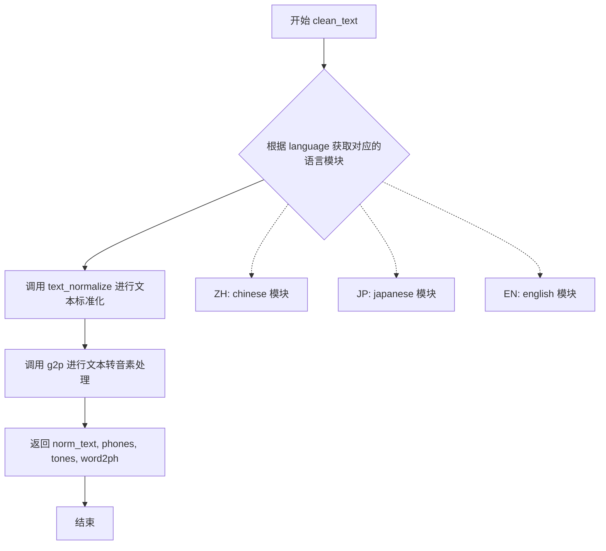
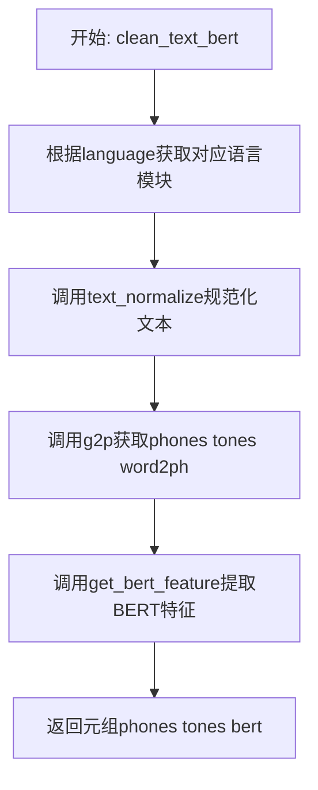
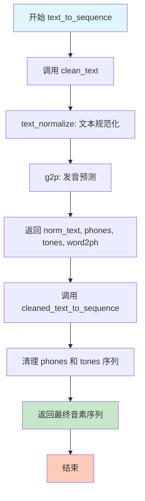

# `Bert-VITS2\text\cleaner.py` 详细设计文档

该代码是一个多语言文本处理模块，通过语言代码映射到对应的语言处理模块（如中文、日文、英文），实现文本标准化、音素转换、词到音素映射，并可选地提取 BERT 特征，最终将处理后的音素和声调转换为序列。

## 整体流程

```mermaid
graph TD
    A[text_to_sequence] --> B[clean_text]
    B --> C[language_module_map[language]]
    C --> D[language_module.text_normalize]
    D --> E[language_module.g2p]
    E --> F[cleaned_text_to_sequence]
    F --> G[返回序列]
    A2[clean_text_bert] --> B2[clean_text]
    B2 --> C2[language_module.get_bert_feature]
    C2 --> G2[返回 phones, tones, bert]
```

## 类结构

```
无类结构
```

## 全局变量及字段


### `language_module_map`
    
A mapping from language codes to their corresponding text processing modules (ZH->chinese, JP->japanese, EN->english)

类型：`dict[str, types.ModuleType]`
    


    

## 全局函数及方法


### `clean_text`

该函数是文本处理的核心入口，根据指定的语言代码选择对应的语言处理模块，完成文本标准化、文本转音素（Grapheme-to-Phoneme）处理，并返回标准化文本、音素序列、语调序列以及词音素映射关系。

参数：

- `text`：`str`，待处理的原始文本输入
- `language`：`str`，语言代码，用于选择对应的语言模块（如 "ZH" 代表中文、"JP" 代表日文、"EN" 代表英文）

返回值：`tuple`，包含四个元素的元组

- `norm_text`：`str`，经过语言模块规范化处理后的文本
- `phones`：`list`，从规范化文本转换得到的音素序列列表
- `tones`：`list`，与音素对应的语调序列列表
- `word2ph`：`dict`，词到音素的映射字典，记录每个词对应的音素数量

#### 流程图



#### 带注释源码

```python
def clean_text(text, language):
    """
    文本清洗与音素转换的主函数
    
    Args:
        text: 待处理的原始文本字符串
        language: 语言代码，决定使用哪个语言模块进行处理
    
    Returns:
        tuple: (norm_text, phones, tones, word2ph)
            - norm_text: 标准化后的文本
            - phones: 音素序列列表
            - tones: 语调序列列表
            - word2ph: 词到音素的映射字典
    """
    # 根据语言代码从映射表中获取对应的语言处理模块
    # ZH -> chinese, JP -> japanese, EN -> english
    language_module = language_module_map[language]
    
    # 第一步：调用语言模块的文本标准化方法
    # 将原始文本转换为规范化格式（如数字转汉字、全角转半角等）
    norm_text = language_module.text_normalize(text)
    
    # 第二步：调用语言模块的 G2P (Grapheme-to-Phoneme) 方法
    # 将规范化文本转换为音素序列，同时生成语调和词音素映射
    phones, tones, word2ph = language_module.g2p(norm_text)
    
    # 返回处理结果：标准化文本、音素、语调、词音素映射
    return norm_text, phones, tones, word2ph
```


### `clean_text_bert`

该函数接收文本和语言代码，首先通过对应的语言模块对文本进行规范化处理，随后执行字素到音素的转换（g2p）获取音素、音调和词素到音素的映射关系，最后利用预训练的BERT模型提取文本的语义特征，最终返回音素序列、音调序列和BERT特征向量。

参数：

- `text`：`str`，需要处理的原始文本输入
- `language`：`str`，语言代码，支持"ZH"（中文）、"JP"（日文）、"EN"（英文）

返回值：`tuple`，包含三个元素 — `(phones, tones, bert)`，其中phones为音素序列列表，tones为对应的声调列表，bert为BERT模型提取的文本语义特征向量

#### 流程图



#### 带注释源码

```python
def clean_text_bert(text, language):
    """
    处理文本以获取音素序列、声调序列和BERT特征
    
    参数:
        text: str - 输入的原始文本
        language: str - 语言代码，如"ZH", "JP", "EN"
    
    返回:
        tuple: (phones, tones, bert) 音素序列、声调序列和BERT特征
    """
    # 根据语言代码从映射表中获取对应的语言处理模块
    language_module = language_module_map[language]
    
    # 调用语言模块的文本规范化方法，将文本标准化（如全角转半角、繁简转换等）
    norm_text = language_module.text_normalize(text)
    
    # 调用语言模块的g2p（grapheme-to-phoneme）方法，将规范化的文本转换为音素序列
    # 返回：phones-音素序列, tones-声调序列, word2ph-词到音素的映射关系
    phones, tones, word2ph = language_module.g2p(norm_text)
    
    # 调用语言模块的BERT特征提取方法，获取文本的语义embedding
    # 参数：规范化后的文本、词到音素的映射（用于对齐）
    bert = language_module.get_bert_feature(norm_text, word2ph)
    
    # 返回音素序列、声调序列和BERT特征
    return phones, tones, bert
```


### `text_to_sequence`

该函数是文本到音素序列转换的核心入口，接收原始文本和语言代码，经过文本规范化、发音预测和序列清理三个阶段，最终输出可用于语音合成的音素序列。

参数：

- `text`：`str`，需要转换的原始文本输入
- `language`：`str`，语言代码，支持 "ZH"（中文）、"JP"（日文）、"EN"（英文）

返回值：`list` 或 `tuple`，经过清理后的音素序列，可直接用于语音合成模型

#### 流程图



#### 带注释源码

```python
def text_to_sequence(text, language):
    """
    将输入文本转换为音素序列的核心函数
    
    参数:
        text: str - 原始输入文本
        language: str - 语言代码，"ZH"/"JP"/"EN"
    
    返回:
        清理后的音素序列，用于语音合成
    """
    # 第一步：调用 clean_text 进行文本规范化和发音预测
    # 返回规范化文本、音素数组、语调数组、词到音素的映射
    norm_text, phones, tones, word2ph = clean_text(text, language)
    
    # 第二步：调用 cleaned_text_to_sequence 对音素和语调进行最终清理
    # 清理操作包括去除静音标记、特殊字符处理、序列格式标准化等
    return cleaned_text_to_sequence(phones, tones, language)
```

## 关键组件


### 语言模块映射 (language_module_map)

一个字典对象，将语言代码映射到对应的语言处理模块，支持中文（ZH）、日文（JP）和英文（EN）三种语言的处理模块。

### 文本清洗函数 (clean_text)

核心文本预处理函数，执行文本规范化、字素到音素转换（g2p），返回规范化文本、音素序列、声调和词音素映射。

### BERT特征提取函数 (clean_text_bert)

在clean_text基础上增加了BERT特征提取功能，返回音素序列、声调和BERT嵌入特征，用于后续的TTS模型输入。

### 文本到序列转换函数 (text_to_sequence)

公开的主要接口函数，将输入文本转换为模型可用的音素序列索引，整合了文本清洗和序列转换的完整流程。

### 语言处理模块接口

各语言模块需实现的三个核心接口：text_normalize（文本规范化）、g2p（字素到音素转换）、get_bert_feature（BERT特征提取）。


## 问题及建议


### 已知问题

- **异常处理缺失**：若传入的 language 参数不在映射字典 keys 中，会直接抛出 KeyError 导致程序崩溃
- **代码重复**：clean_text 与 clean_text_bert 函数存在大量重复逻辑（获取 language_module、调用 text_normalize 和 g2p），违反 DRY 原则
- **硬编码语言映射**：language_module_map 作为全局可变变量，缺乏扩展性，新增语言需修改源码
- **类型注解缺失**：函数参数和返回值均无类型声明，降低代码可维护性和 IDE 友好度
- **日志记录缺失**：文本处理过程中无任何日志，无法追溯问题或监控运行状态
- **单元测试覆盖不足**：__main__ 块为空，缺少对边界条件的测试用例（如空字符串、非法语言码）
- **命名歧义**：word2ph 变量名语义不明确，猜测为 word-to-phoneme 但未加注释说明

### 优化建议

- 为 clean_text、clean_text_bert、text_to_sequence 添加 try-except 捕获 KeyError 并抛出自定义异常或返回默认值
- 抽取公共逻辑（如获取 language_module、规范化文本、g2p 转换）为私有辅助函数，减少重复代码
- 引入 Type Hints（typing.Optional、typing.Dict 等）明确参数和返回值类型
- 将 language_module_map 改为只读映射或通过配置中心/插件机制动态注册，支持热更新
- 在关键路径添加 logging 模块日志，记录输入文本语言、处理结果等调试信息
- 完善 __main__ 块，添加基础测试用例覆盖正常流程与异常分支，或使用 pytest 编写独立测试文件
- 为变量添加类型注解和必要注释（如 word2ph: List[int] # word to phoneme alignment）

## 其它


### 设计目标与约束

本模块旨在为多语言文本转语音（TTS）系统提供统一的文本预处理接口，支持中文（ZH）、日文（JP）和英文（EN）三种语言的文本规范化、语音合成和BERT特征提取。设计约束包括：语言模块需实现统一的text_normalize、g2p和get_bert_feature接口；所有输入文本需符合UTF-8编码；支持的语言类型由language_module_map预定义，不支持动态扩展语言。

### 错误处理与异常设计

当传入不支持的语言代码时，language_module_map查询会抛出KeyError，建议在入口处增加语言合法性校验并抛出自定义LanguageNotSupportedError。language_module内部方法调用失败时应向上传播原始异常，便于调用方定位问题。cleaned_text_to_sequence若返回空序列应记录警告日志。

### 数据流与状态机

数据流分为三条路径：clean_text路径（文本→规范化→G2P→返回规范化文本、音素、声调、词音对应）；clean_text_bert路径（文本→规范化→G2P→BERT特征提取→返回音素、声调、BERT特征）；text_to_sequence路径（调用clean_text后转换为整数序列）。无状态机设计，纯函数式转换。

### 外部依赖与接口契约

本模块依赖三个外部语言模块（chinese、japanese、english），每个模块需提供text_normalize(text: str) -> str、g2p(text: str) -> (list, list, list)、get_bert_feature(text: str, word2ph: list) -> ndarray三个方法。cleaned_text_to_sequence来自text模块，输入为phones(list)、tones(list)、language(str)，输出为int序列。

### 性能要求与约束

文本规范化应在100ms内完成（单句长度≤500字符）；G2P转换应在200ms内完成；BERT特征提取建议异步执行或采用缓存机制避免重复计算；模块初始化时应预加载language_module_map以避免运行时动态导入开销。

### 安全性考虑

输入文本需进行基础 sanitization 防止注入攻击；BERT模型加载需确保模型文件完整性校验；敏感文本处理应支持脱敏模式可选；模块日志不应记录原始文本内容，应记录脱敏后的哈希值或长度统计。

### 可扩展性设计

当前通过language_module_map硬编码支持三种语言，可重构为插件式架构支持运行时注册新语言模块。BERT特征提取为可选功能，当语言模块不支持时应返回None而非抛出异常。word2ph字段设计支持多音字消歧，未来可接入词典服务增强准确性。

### 配置管理

语言模块路径支持通过环境变量或配置文件自定义；BERT模型路径、特征维度等超参数需外部配置化；日志级别和输出格式可通过配置调整；建议引入pydantic或dataclass定义配置结构。

### 测试策略

单元测试覆盖三种语言的规范化、G2P和序列转换；边界测试包括空字符串、超长文本、特殊字符、混合语言输入；Mock language_module测试核心路由逻辑；性能基准测试确保各环节满足SLA要求；回归测试确保语言模块升级后输出一致性。

### 版本控制和变更管理

本模块版本号遵循语义化版本（SemVer），当前版本0.1.0；language_module接口为契约，变更需走版本升级流程；重大变更需更新CHANGELOG并通知下游消费者；建议使用feature flag控制新语言模块的启用。


    