# `Bert-VITS2\text\english.py` 详细设计文档

这是一个文本转语音（TTS）前端处理模块，主要功能是将输入的文本字符串转换为音素序列（phonemes）、声调（tones）以及词素到音素的对应关系（word2ph），并集成了BERT特征提取接口。

## 整体流程

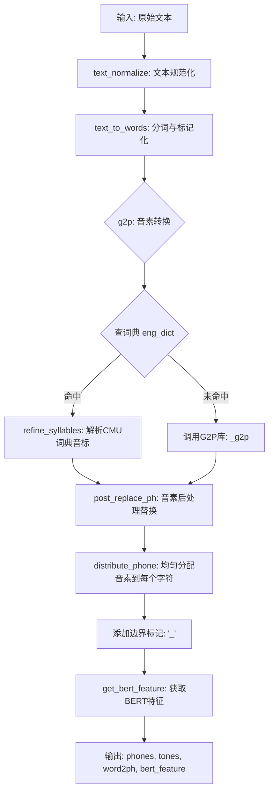

## 类结构

```
Global Functions (模块级)
├── post_replace_ph (符号替换)
├── replace_punctuation (标点正则替换)
├── read_dict (读取CMU词典)
├── cache_dict (缓存词典)
├── get_dict (获取词典)
├── refine_ph (音素与声调精修)
├── refine_syllables (音节精修)
├── normalize_numbers (数字与货币规范化)
├── text_normalize (主规范化流程)
├── distribute_phone (音素分配算法)
├── sep_text (简单分词)
├── text_to_words (基于Tokenizer的智能分词)
├── g2p (核心功能: 文本转音素)
└── get_bert_feature (BERT特征提取)
```

## 全局变量及字段


### `CMU_DICT_PATH`
    
CMU发音字典文件路径，指向cmudict.rep文件

类型：`str`
    


### `CACHE_PATH`
    
CMU字典的pickle缓存文件路径，用于加速加载

类型：`str`
    


### `_g2p`
    
g2p_en库的G2p类实例，用于英文文本到音素的转换

类型：`G2p`
    


### `LOCAL_PATH`
    
Deberta-v3-large模型的本地路径

类型：`str`
    


### `tokenizer`
    
HuggingFace的Deberta分词器实例，用于文本分词

类型：`DebertaV2Tokenizer`
    


### `arpa`
    
ARPA音素符号集合，用于验证和处理音素

类型：`set`
    


### `rep_map`
    
标点符号Unicode替换映射表，用于文本标准化

类型：`dict`
    


### `eng_dict`
    
英文单词到音素列表的映射字典，从CMU字典加载

类型：`dict`
    


### `_inflect`
    
inflect引擎实例，用于英文数字和序数词到文字的转换

类型：`inflect.engine`
    


### `_comma_number_re`
    
匹配带逗号的数字的正则表达式

类型：`re.Pattern`
    


### `_decimal_number_re`
    
匹配小数的正则表达式

类型：`re.Pattern`
    


### `_pounds_re`
    
匹配英镑金额的正则表达式

类型：`re.Pattern`
    


### `_dollars_re`
    
匹配美元金额的正则表达式

类型：`re.Pattern`
    


### `_ordinal_re`
    
匹配英文序数词的正则表达式

类型：`re.Pattern`
    


### `_number_re`
    
匹配阿拉伯数字的正则表达式

类型：`re.Pattern`
    


### `_abbreviations`
    
英文缩写词到完整形式替换的正则表达式列表

类型：`list`
    


### `_lazy_ipa`
    
IPA音标到懒发音替换的正则表达式列表（第一组）

类型：`list`
    


### `_lazy_ipa2`
    
IPA音标到懒发音替换的正则表达式列表（第二组）

类型：`list`
    


### `_ipa_to_ipa2`
    
IPA音标到IPA2替换的正则表达式列表

类型：`list`
    


    

## 全局函数及方法


### `post_replace_ph`

该函数用于将输入的音素（phoneme）进行后处理替换，包括标点符号转换和无效音素的规范化，是文本转音素流程中的清理环节。

参数：

-  `ph`：`str`，输入的音素或标点符号

返回值：`str`，处理后的音素或标点符号

#### 流程图

```mermaid
flowchart TD
    A[开始: 输入音素 ph] --> B{ph 是否在 rep_map 中?}
    B -->|是| C[将 ph 替换为 rep_map[ph]]
    C --> D{替换后 ph 是否在 symbols 中?}
    B -->|否| D
    D -->|是| E[返回 ph]
    D -->|否| F[将 ph 设为 'UNK']
    E --> G[结束]
    F --> G
```

#### 带注释源码

```python
def post_replace_ph(ph):
    """
    对输入的音素进行后处理替换
    
    处理流程：
    1. 首先将特殊标点符号映射为标准符号
    2. 检查是否在符号表中，是则返回，否则返回 UNK
    
    参数:
        ph: 输入的音素或标点符号
    
    返回:
        处理后的音素或标点符号，如果是未知符号则返回 'UNK'
    """
    # 定义需要替换的标点符号映射表
    # 包括中文标点转英文标点、换行符转句号、小写v转大写V等
    rep_map = {
        "：": ",",    # 中文冒号转英文逗号
        "；": ",",    # 中文分号转英文逗号
        "，": ",",    # 中文逗号转英文逗号
        "。": ".",    # 中文句号转英文句号
        "！": "!",    # 中文感叹号转英文感叹号
        "？": "?",    # 中文问号转英文问号
        "\n": ".",   # 换行符转句号
        "·": ",",    # 中间点转逗号
        "、": ",",    # 顿号转逗号
        "…": "...",  # 省略号转三个点
        "···": "...", # 三个点转三个点
        "*****": "...", # 日文省略号转三个点
        "v": "V",    # 小写v转大写V（可能是ARPA音素格式要求）
    }
    
    # 第一步：如果音素在映射表中，进行替换
    if ph in rep_map.keys():
        ph = rep_map[ph]
    
    # 第二步：检查替换后的音素是否在符号表中
    # symbols 是从 text.symbols 导入的有效音素符号集合
    if ph in symbols:
        return ph
    
    # 第三步：如果不在符号表中，返回 UNK（未知符号）
    if ph not in symbols:
        ph = "UNK"
    
    return ph
```


### replace_punctuation

将文本中的标点符号替换为统一的符号。

参数：

- `text`：`str`，需要进行标点替换的原始文本

返回值：`str`，替换标点后的文本

#### 流程图

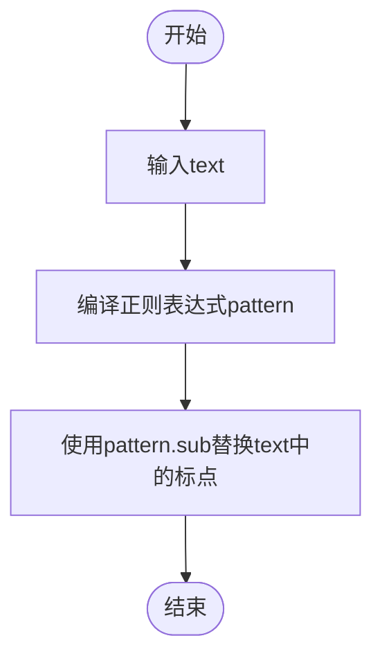

#### 带注释源码

```python
def replace_punctuation(text):
    # 编译正则表达式，匹配rep_map中的所有标点符号
    # rep_map是一个字典，包含了源标点符号到目标标点符号的映射关系
    # re.escape用于转义特殊字符，"|".join用于构建匹配任意一个标点的正则表达式
    pattern = re.compile("|".join(re.escape(p) for p in rep_map.keys()))

    # 使用sub方法替换文本中匹配的标点符号
    # lambda函数根据匹配到的标点符号返回rep_map中对应的目标符号
    replaced_text = pattern.sub(lambda x: rep_map[x.group()], text)

    # 注释掉的代码：原本用于删除非特定字符（包括日文、中文、某些符号等）
    # 但目前被注释掉，不执行
    # replaced_text = re.sub(
    #     r"[^\u3040-\u309F\u30A0-\u30FF\u4E00-\u9FFF\u3400-\u4DBF\u3005"
    #     + "".join(punctuation)
    #     + r"]+",
    #     "",
    #     replaced_text,
    # )

    return replaced_text
```


### `read_dict`

该函数用于从CMU发音词典文件（cmudict.rep）中读取发音字典，将每个单词及其对应的发音音素解析为嵌套列表结构并返回。

参数： 无

返回值： `dict`，返回字典，键为单词（字符串），值为该单词的发音音节列表（列表的列表，每个内层列表代表一个音节，包含多个音素字符串）

#### 流程图

```mermaid
flowchart TD
    A[开始] --> B[初始化空字典 g2p_dict]
    B --> C[设置起始行 start_line = 49]
    C --> D[打开 CMU_DICT_PATH 文件]
    D --> E[读取第一行, 初始化 line_index = 1]
    E --> F{文件是否结束?}
    F -- 否 --> G{line_index >= start_line?}
    G -- 否 --> H[line_index + 1, 读取下一行]
    H --> F
    G -- 是 --> I[去除行首尾空格]
    I --> J[按双空格分割行: word_split]
    J --> K[提取单词 word = word_split[0]]
    K --> L[按 ' - ' 分割发音部分: syllable_split]
    L --> M[初始化 g2p_dict[word] 为空列表]
    M --> N{遍历每个音节 syllable}
    N -- 是 --> O[按空格分割音节: phone_split]
    O --> P[将 phone_split 添加到 g2p_dict[word]]
    P --> N
    N -- 否 --> Q[line_index + 1, 读取下一行]
    Q --> F
    F -- 是 --> R[返回 g2p_dict]
    R --> S[结束]
```

#### 带注释源码

```python
def read_dict():
    """
    从CMU发音词典文件读取发音字典
    返回格式: {word: [[phoneme1, phoneme2], [phoneme3, ...], ...]}
    """
    g2p_dict = {}  # 初始化空字典用于存储发音映射
    start_line = 49  # CMU词典文件前49行为注释部分，从第50行开始为实际数据
    
    # 打开CMU发音词典文件
    with open(CMU_DICT_PATH) as f:
        line = f.readline()  # 读取第一行
        line_index = 1  # 初始化行索引计数器
        
        # 遍历文件所有行
        while line:
            # 只处理第49行之后的数据行（跳过文件头部的注释）
            if line_index >= start_line:
                line = line.strip()  # 去除首尾空白字符
                
                # 使用双空格分割单词和发音部分
                # CMU词典格式: "WORD  PH O N E M E"
                word_split = line.split("  ")
                word = word_split[0]  # 提取单词部分
                
                # 按 " - " 分割多个音节
                # 示例: "AH0 S - T R IY1" 表示两个音节
                syllable_split = word_split[1].split(" - ")
                g2p_dict[word] = []  # 初始化该单词的音节列表
                
                # 遍历每个音节
                for syllable in syllable_split:
                    # 按空格分割音节中的各个音素
                    # 示例: "AH0 S" -> ["AH0", "S"]
                    phone_split = syllable.split(" ")
                    # 将音素列表添加到字典中
                    g2p_dict[word].append(phone_split)
            
            # 更新行索引并读取下一行
            line_index = line_index + 1
            line = f.readline()
    
    # 返回完整的发音字典
    return g2p_dict
```


### `cache_dict`

该函数用于将字典数据序列化并缓存到指定的文件路径中，以便后续快速加载，无需重新读取和解析原始数据源。

参数：

- `g2p_dict`：`dict`，需要缓存的字典对象，通常是包含单词到音素映射的字典
- `file_path`：`str` 或 `os.PathLike`，缓存文件的保存路径

返回值：`None`，无返回值，仅执行文件写入操作

#### 流程图

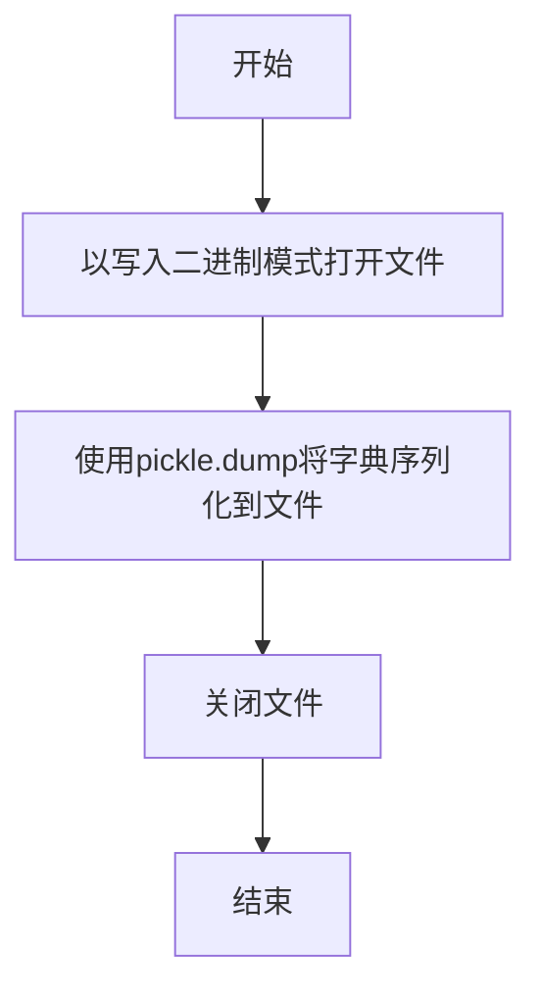

#### 带注释源码

```python
def cache_dict(g2p_dict, file_path):
    """
    将字典数据序列化为pickle文件进行缓存
    
    参数:
        g2p_dict: 需要缓存的字典对象
        file_path: 缓存文件的保存路径
    
    返回:
        None
    """
    # 以二进制写入模式打开文件
    with open(file_path, "wb") as pickle_file:
        # 将字典对象序列化并写入文件
        pickle.dump(g2p_dict, pickle_file)
    # with语句自动处理文件关闭
```


### `get_dict`

该函数用于获取CMU发音词典（g2p_dict），通过检查缓存文件是否存在来决定是从缓存加载还是从源文件读取并缓存，以优化重复访问时的性能。

参数：  
无

返回值：`dict`，返回CMU发音词典的字典对象，键为单词，值为对应的音素列表。

#### 流程图

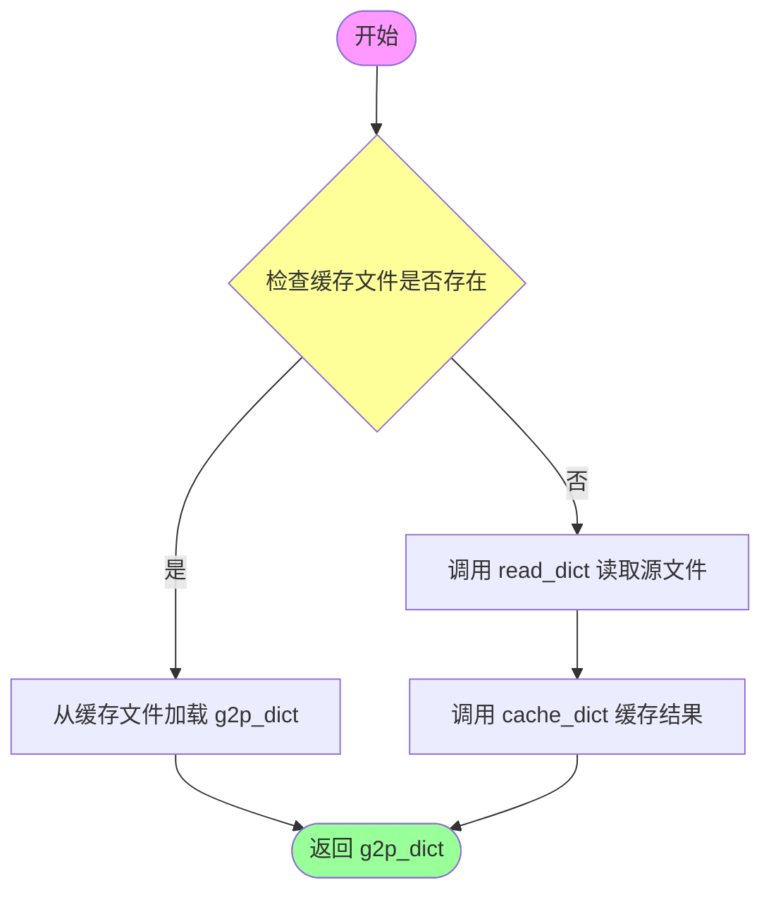

#### 带注释源码

```python
def get_dict():
    """
    获取CMU发音词典（g2p_dict）
    
    优先从缓存文件读取，如果缓存不存在则从源文件读取并生成缓存
    以优化重复访问时的性能
    
    Returns:
        dict: CMU发音词典，键为单词（字符串），值为音素列表的列表
              例如: {'HELLO': [['HH', 'AH', 'L', 'OW1']]}
    """
    # 检查缓存文件是否存在
    if os.path.exists(CACHE_PATH):
        # 缓存存在，直接从pickle文件加载字典
        with open(CACHE_PATH, "rb") as pickle_file:
            g2p_dict = pickle.load(pickle_file)
    else:
        # 缓存不存在，从CMU源文件读取字典
        g2p_dict = read_dict()
        # 将读取的字典缓存到pickle文件，供后续使用
        cache_dict(g2p_dict, CACHE_PATH)

    # 返回构建好的发音词典
    return g2p_dict
```


### `refine_ph`

该函数负责将音素（phoneme）字符串进行细化处理，提取其中的声调信息，并将音素转换为小写格式。如果音素字符串以数字结尾，则提取该数字作为声调（数值+1），否则默认声调为3。

参数：

- `phn`：`str`，输入的音素字符串，可能包含末尾的数字表示声调（如"AH0"表示声调0）

返回值：`tuple`，返回一个包含两个元素的元组 `(phn, tone)`
- 第一个元素 `phn`：`str`，处理后的音素（小写形式）
- 第二个元素 `tone`：`int`，提取的声调值（1-4之间的整数，默认值为3）

#### 流程图

```mermaid
flowchart TD
    A[开始 refine_ph] --> B{检查 phn 是否以数字结尾}
    B -->|是| C[提取末尾数字]
    C --> D[tone = int[数字] + 1]
    D --> E[phn = phn[:-1] 去掉数字部分]
    B -->|否| F[tone = 3]
    E --> G[phn = phn.lower 转为小写]
    F --> G
    G --> H[返回 tuple: (phn, tone)]
    H --> I[结束]
```

#### 带注释源码

```python
def refine_ph(phn):
    """
    细化音素（refine phoneme）函数
    
    将音素字符串中的声调信息提取出来，并将音素转换为小写。
    声调通过数字后缀表示，函数会将数字+1作为最终的声调值。
    例如：'AH0' -> ('ah', 1), 'EY2' -> ('ey', 3)
    
    Args:
        phn: 音素字符串，可能以数字结尾表示声调
        
    Returns:
        tuple: (处理后的音素字符串, 声调值)
    """
    # 初始化声调为0
    tone = 0
    
    # 使用正则表达式检查音素是否以数字结尾
    if re.search(r"\d$", phn):
        # 提取末尾数字并转换为声调（数字+1）
        tone = int(phn[-1]) + 1
        # 移除末尾的数字部分
        phn = phn[:-1]
    else:
        # 没有数字后缀时，默认声调为3
        tone = 3
    
    # 将音素转换为小写格式
    return phn.lower(), tone
```


### `refine_syllables`

该函数用于将音节列表转换为音素列表和对应的声调列表，遍历每个音节中的音素，调用`refine_ph`函数对每个音素进行标准化处理（提取声调并转换为小写音素），最终返回处理后的音素序列和声调序列。

参数：

- `syllables`：`List[List[str]]`，输入的音节列表，每个元素是一个音节（字符串列表），通常来自CMU发音词典

返回值：`(List[str], List[int])`，返回一个元组，包含两个列表——第一个是处理后的音素列表（小写形式），第二个是对应的声调列表

#### 流程图

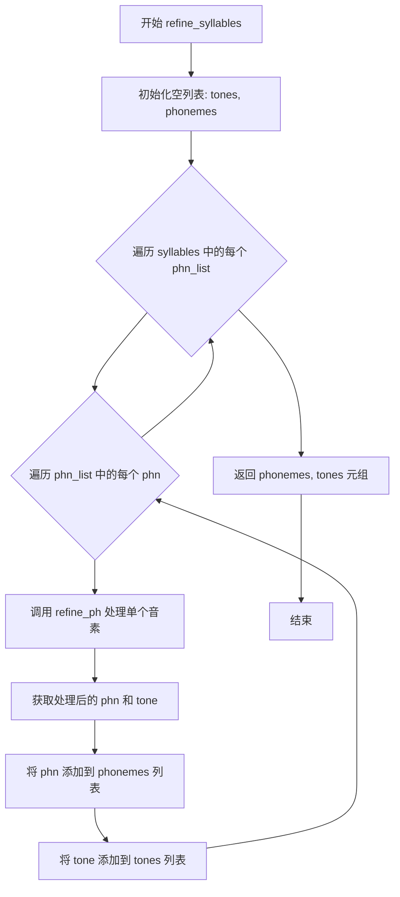

#### 带注释源码

```python
def refine_syllables(syllables):
    """
    将音节列表转换为音素列表和对应的声调列表
    
    参数:
        syllables: 音节列表，每个元素是一个包含音素的列表
                  来自CMU词典，例如 [['AH0', ' ', 'L'], ['AY1', ' ', 'T']] 
                  表示 "HELLO" 的发音
    
    返回:
        (phonemes, tones): 元组
            - phonemes: 处理后的音素列表（小写形式）
            - tones: 对应的声调列表
    """
    # 初始化声调列表，用于存储每个音素的声调值
    tones = []
    # 初始化音素列表，用于存储处理后的音素
    phonemes = []
    
    # 遍历输入的每个音节（每个音节是一个音素列表）
    for phn_list in syllables:
        # 遍历当前音节中的每个音素
        for i in range(len(phn_list)):
            # 获取当前音素
            phn = phn_list[i]
            
            # 调用 refine_ph 函数处理音素：
            # 1. 如果音素以数字结尾（表示声调），提取声调值（数字+1）
            # 2. 如果没有数字，默认声调为3
            # 3. 将音素转换为小写形式
            phn, tone = refine_ph(phn)
            
            # 将处理后的音素添加到音素列表
            phonemes.append(phn)
            # 将对应的声调添加到声调列表
            tones.append(tone)
    
    # 返回音素列表和声调列表
    return phonemes, tones
```


### `_expand_dollars`

该函数是一个用于扩展美元金额表达式的私有辅助函数，接收正则表达式匹配对象，将美元金额（如 "$10.50"）转换为文字描述（如 "10 dollars, 50 cents"），用于文本到语音系统的数字规范化处理。

参数：

-  `m`：`re.Match`，正则表达式匹配对象，包含从文本中提取的美元金额字符串（如 "$10.50" 中的 "10.50"）

返回值：`str`，金额的数字形式文字描述（如 "10 dollars, 50 cents"）

#### 流程图

```mermaid
flowchart TD
    A[开始: 接收匹配对象 m] --> B[提取匹配组1: match = m.group(1)]
    B --> C[按.分割字符串: parts = match.split('.']
    C --> D{parts长度 > 2?}
    D -->|是| E[返回 match + ' dollars']
    D -->|否| F[提取美元部分: dollars = int(parts[0]) if parts[0] else 0]
    F --> G[提取美分部分: cents = int(parts[1]) if len(parts) > 1 and parts[1] else 0]
    G --> H{dollars > 0 且 cents > 0?}
    H -->|是| I[确定单位: dollar_unit/dollar或dollars, cent_unit/cent或cents]
    I --> J[返回格式化字符串: dollars dollar_unit, cents cent_unit]
    H -->|否| K{dollars > 0?}
    K -->|是| L[确定美元单位: dollar/dollars]
    L --> M[返回格式化字符串: dollars dollar_unit]
    K -->|否| N{cents > 0?}
    N -->|是| O[确定美分单位: cent/cents]
    O --> P[返回格式化字符串: cents cent_unit]
    N -->|否| Q[返回 'zero dollars']
    Q --> R[结束]
    J --> R
    M --> R
    P --> R
```

#### 带注释源码

```python
def _expand_dollars(m):
    """
    将正则匹配到的美元金额字符串扩展为文字描述。
    例如: "$10.50" -> "10 dollars, 50 cents"
    
    参数:
        m: re.Match对象，包含美元金额的匹配组
        
    返回:
        str: 金额的文字描述形式
    """
    # 从正则匹配中提取第一个捕获组（即金额数字部分，不包含$符号）
    match = m.group(1)
    
    # 按小数点分割为美元部分和美分部分
    parts = match.split(".")
    
    # 如果有多于两个部分，说明格式异常（非标准金额格式）
    if len(parts) > 2:
        # 异常情况：直接返回原字符串加上"dollars"
        return match + " dollars"
    
    # 提取美元整数部分，如果为空则默认为0
    dollars = int(parts[0]) if parts[0] else 0
    
    # 提取美分部分（如果有的话），长度为0则默认为0
    cents = int(parts[1]) if len(parts) > 1 and parts[1] else 0
    
    # 情况1: 既有美元又有美分（如 $10.50）
    if dollars and cents:
        # 单数形式用dollar/cent，复数形式用dollars/cents
        dollar_unit = "dollar" if dollars == 1 else "dollars"
        cent_unit = "cent" if cents == 1 else "cents"
        # 返回格式: "10 dollars, 50 cents"
        return "%s %s, %s %s" % (dollars, dollar_unit, cents, cent_unit)
    
    # 情况2: 仅有美元，无美分（如 $10）
    elif dollars:
        dollar_unit = "dollar" if dollars == 1 else "dollars"
        # 返回格式: "10 dollars"
        return "%s %s" % (dollars, dollar_unit)
    
    # 情况3: 仅有美分，无美元（如 $0.50）
    elif cents:
        cent_unit = "cent" if cents == 1 else "cents"
        # 返回格式: "50 cents"
        return "%s %s" % (cents, cent_unit)
    
    # 情况4: 零金额（如 $0 或 $0.00）
    else:
        return "zero dollars"
```


### `_remove_commas`

该函数是一个正则表达式替换的辅助函数，用于在数字规范化过程中移除数字中的千位分隔符（逗号）。它接受一个正则表达式匹配对象作为输入，提取第一个捕获组并删除其中的所有逗号，然后返回处理后的字符串。

参数：

- `m`：`re.Match`，正则表达式匹配对象，包含需要处理的数字字符串（可能包含逗号）

返回值：`str`，返回移除逗号后的数字字符串

#### 流程图

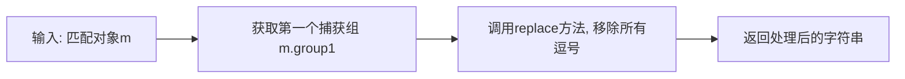

#### 带注释源码

```python
def _remove_commas(m):
    """
    正则表达式替换的回调函数,用于移除数字中的千位分隔符(逗号)
    
    该函数作为re.sub的替换函数使用,配合_comma_number_re正则表达式
    将带有逗号的数字(如1,234)转换为不带逗号的格式(如1234)
    
    参数:
        m: re.Match对象,正则表达式匹配结果
        
    返回:
        str: 移除逗号后的数字字符串
    """
    # 获取正则表达式中第一个捕获组(即数字部分,不包括前后字符)
    # group(1)对应正则表达式 r"([0-9][0-9\,]+[0-9])" 中的圆括号部分
    # 使用replace方法将所有逗号替换为空字符串
    return m.group(1).replace(",", "")
```


### `_expand_ordinal`

该函数是文本规范化模块中的一个辅助函数，主要用于将正则表达式匹配到的英文序数词（如"1st"、"2nd"、"3rd"等）转换为对应的英文单词形式（如"first"、"second"、"third"）。它被`normalize_numbers`函数中的`_ordinal_re`正则表达式调用，作为替换函数使用。

参数：

-  `m`：`re.Match`，由正则表达式`_ordinal_re`匹配到的序数词Match对象

返回值：`str`，转换后的英文单词形式

#### 流程图

```mermaid
flowchart TD
    A[开始: 接收Match对象m] --> B[调用m.group&#40;0&#41;获取匹配的序数字符串]
    B --> C[调用_inflect.number_to_words&#40;&#41;转换为单词]
    C --> D[返回转换后的字符串]
    
    style A fill:#f9f,stroke:#333
    style D fill:#9f9,stroke:#333
```

#### 带注释源码

```python
def _expand_ordinal(m):
    """
    将正则匹配到的序数词转换为英文单词形式
    
    参数:
        m: re.Match对象，包含匹配到的序数词（如'1st', '2nd', '3rd'）
    
    返回:
        str: 对应的英文序数词单词形式（如'first', 'second', 'third'）
    """
    # 使用inflect引擎将数字序数词转换为完整的英文单词形式
    # 例如: '1st' -> 'first', '2nd' -> 'second', '3rd' -> 'third'
    return _inflect.number_to_words(m.group(0))
```

---

#### 关联信息

**使用场景**：
该函数在`normalize_numbers`函数中被`_ordinal_re`正则表达式调用：

```python
_ordinal_re = re.compile(r"[0-9]+(st|nd|rd|th)")

def normalize_numbers(text):
    # ... 其他处理 ...
    text = re.sub(_ordinal_re, _expand_ordinal, text)  # 替换序数词为单词
    # ...
```

**依赖项**：
- `_inflect`: inflect.engine() 实例，用于数字到单词的转换
- `_ordinal_re`: 定义在文件顶部的正则表达式 `re.compile(r"[0-9]+(st|nd|rd|th)")`

**示例**：
| 输入 | 输出 |
|------|------|
| "1st" | "first" |
| "2nd" | "second" |
| "3rd" | "third" |
| "21st" | "twenty-first" |
| "100th" | "one hundredth" |


### `_expand_number`

该函数是文本规范化模块的核心组件，负责将阿拉伯数字转换为对应的英文单词表示。主要用于文本转语音（Text-to-Speech）系统中，确保数字以人类可读的口语形式表达。函数针对1000-3000区间的年份和整百数值进行了特殊优化处理，其余数字则通过inflect库进行通用转换。

参数：

- `m`：`re.Match`，正则表达式匹配对象，包含待转换的数字字符串

返回值：`str`，数字的英文单词表示形式

#### 流程图

```mermaid
flowchart TD
    A[开始: 接收正则匹配对象 m] --> B[提取数字: num = int(m.group(0))]
    B --> C{num 范围检查}
    C -->|1000 < num < 3000| D{num == 2000?}
    D -->|是| E[返回 'two thousand']
    D -->|否| F{2000 < num < 2010?}
    F -->|是| G[返回 'two thousand ' + _inflect.number_to_words(num % 100)]
    F -->|否| H{num % 100 == 0?}
    H -->|是| I[返回 _inflect.number_to_words(num // 100) + ' hundred']
    H -->|否| J[返回 _inflect.number_to_words<br/>num, andword='', zero='oh', group=2<br/>并替换 ', ' 为 ' ']
    C -->|其他| K[返回 _inflect.number_to_words<br/>num, andword='']
    E --> L[结束]
    G --> L
    I --> L
    J --> L
    K --> L
```

#### 带注释源码

```python
def _expand_number(m):
    """
    将正则匹配到的数字转换为英文单词表达
    特殊处理1000-3000区间的数字（如年份、整百数等）
    
    参数:
        m: re.Match对象，正则表达式匹配到的数字字符串
        
    返回:
        str: 数字对应的英文单词表示
    """
    # 从匹配对象中提取数字字符串并转换为整数
    num = int(m.group(0))
    
    # 特殊处理1000-3000区间（主要覆盖常见年份和整百数）
    if num > 1000 and num < 3000:
        # 2000年直接返回"two thousand"
        if num == 2000:
            return "two thousand"
        # 2001-2009年处理（如2005返回"two thousand five"）
        elif num > 2000 and num < 2010:
            return "two thousand " + _inflect.number_to_words(num % 100)
        # 整百数处理（如1500返回"fifteen hundred"）
        elif num % 100 == 0:
            return _inflect.number_to_words(num // 100) + " hundred"
        # 其他1000-3000之间的数字，用inflect转换
        # andword='' 移除"and"，zero='oh'将0读作"oh"，group=2分组处理
        else:
            return _inflect.number_to_words(
                num, andword="", zero="oh", group=2
            ).replace(", ", " ")
    else:
        # 超出1000-3000范围的数字直接用inflect转换
        # andword='' 移除千以下的"and"连接词
        return _inflect.number_to_words(num, andword="")
```


### `_expand_decimal_point`

该函数是正则表达式替换回调函数，用于将文本中的小数格式（如"3.14"）转换为英文口语表达形式（如"3 point 14"），属于数字规范化处理流程的一部分。

参数：

- `m`：`re.Match` 对象，正则表达式匹配对象，包含待处理的小数匹配信息

返回值：`str`，将小数点替换为英文" point "后的字符串

#### 流程图

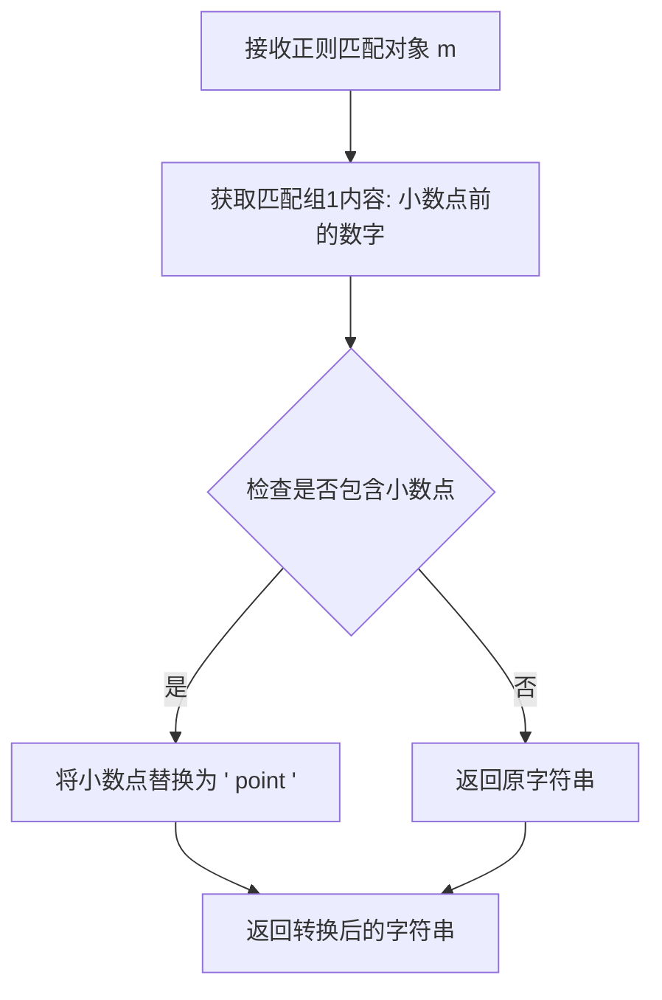

#### 带注释源码

```python
def _expand_decimal_point(m):
    """
    正则表达式替换回调函数：将小数转换为英文口语表达
    
    该函数作为re.sub()的替换函数使用，将匹配到的小数（如3.14）
    转换为英文读法（3 point 14），便于文本转语音（TTS）系统处理。
    
    参数:
        m: re.Match对象，正则表达式匹配结果，包含需要处理的小数
    
    返回:
        str: 转换后的英文表达形式
    """
    # m.group(1) 获取正则表达式中第一个捕获组的内容
    # 对于模式 r"([0-9]+\.[0-9]+)"，group(1) 是小数点前的整数部分
    # .replace(".", " point ") 将小数点替换为英文 " point "
    return m.group(1).replace(".", " point ")
```


### `normalize_numbers`

该函数是文本规范化工具，用于将文本中的数字、货币金额、序数词等转换为可读的单词形式，以便后续的语音合成处理。

参数：

-  `text`：`str`，需要进行数字规范化的原始文本

返回值：`str`，规范化后的文本，其中数字、货币金额、序数词等已转换为单词形式

#### 流程图

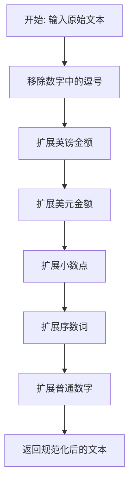

#### 带注释源码

```python
def normalize_numbers(text):
    """
    将文本中的数字转换为可读的单词形式
    
    该函数依次执行以下转换:
    1. 移除数字中的逗号分隔符
    2. 将英镑金额转换为单词形式
    3. 将美元金额转换为单词形式
    4. 将小数转换为单词形式
    5. 将序数词转换为单词形式
    6. 将普通数字转换为单词形式
    
    参数:
        text (str): 需要规范化的原始文本
        
    返回:
        str: 规范化后的文本
    """
    # 移除数字中的逗号，例如 "1,000" -> "1000"
    text = re.sub(_comma_number_re, _remove_commas, text)
    
    # 扩展英镑金额，例如 "£100" -> "100 pounds"
    text = re.sub(_pounds_re, r"\1 pounds", text)
    
    # 扩展美元金额，例如 "$10.50" -> "10 dollars, 50 cents"
    text = re.sub(_dollars_re, _expand_dollars, text)
    
    # 扩展小数点，例如 "3.14" -> "3 point 14"
    text = re.sub(_decimal_number_re, _expand_decimal_point, text)
    
    # 扩展序数词，例如 "1st" -> "first"
    text = re.sub(_ordinal_re, _expand_ordinal, text)
    
    # 扩展普通数字，例如 "42" -> "forty two"
    text = re.sub(_number_re, _expand_number, text)
    
    return text
```


### `text_normalize`

该函数是文本规范化处理的核心入口，负责将输入文本转换为适合语音合成的规范化格式。它依次调用数字规范化、标点符号替换，并在标点符号后添加空格以确保正确的分词效果。

参数：

- `text`：`str`，需要规范化的原始输入文本

返回值：`str`，规范化处理后的文本

#### 流程图

```mermaid
flowchart TD
    A[开始: text_normalize] --> B[调用 normalize_numbers]
    B --> C[调用 replace_punctuation]
    C --> D[正则处理: 在标点后添加空格]
    D --> E[返回规范化后的文本]
    
    B -.-> B1[将数字转换为文字形式<br/>如: 100 → one hundred]
    C -.-> C1[标点符号统一替换<br/>如: ， → ,]
    D -.-> D1[匹配模式: [,;.\?\!] 后接 [\w]<br/>处理结果: 'Hello.World' → 'Hello. World']
```

#### 带注释源码

```
def text_normalize(text):
    """
    文本规范化主函数
    
    处理流程:
    1. 数字规范化 - 将阿拉伯数字转换为英文单词
    2. 标点符号替换 - 统一全角/半角标点
    3. 标点后空格处理 - 确保标点与下一单词间有空格
    
    Args:
        text: 输入的原始文本字符串
        
    Returns:
        规范化处理后的文本字符串
    """
    
    # 步骤1: 规范化数字
    # 调用 normalize_numbers 函数将数字转换为英文单词形式
    # 例如: "1999年" → "one thousand nine hundred ninety-nine年"
    #       "$50" → "fifty dollars"
    text = normalize_numbers(text)
    
    # 步骤2: 替换标点符号
    # 调用 replace_punctuation 函数进行全角到半角、中文标点到英文标点的转换
    # 例如: "，" → ","  "。" → "."  "！" → "!"
    #       "《" → "'"  "【" → "'"
    text = replace_punctuation(text)
    
    # 步骤3: 标点符号后添加空格
    # 使用正则表达式在标点符号(,;.?!)后添加空格
    # 确保标点与下一个单词之间有空格分隔
    # 正则解释: ([,;.\?\!]) 捕获标点符号, ([\w]) 捕获单词字符
    # 替换为: \1 \2 即标点 + 空格 + 单词
    text = re.sub(r"([,;.\?\!])([\w])", r"\1 \2", text)
    
    return text
```


### `distribute_phone`

该函数实现了一个贪心算法，用于将音素均匀分配到单词中。它计算每个单词应该分配多少个音素，使得分配结果尽可能均衡。

参数：

- `n_phone`：`int`，需要分配的音素总数
- `n_word`：`int`，目标单词的总数

返回值：`list[int]`，返回每个单词分配的音素数量列表

#### 流程图

```mermaid
graph TD
    A[开始] --> B[初始化 phones_per_word = [0] * n_word]
    B --> C{迭代次数 < n_phone?}
    C -->|是| D[找到 phones_per_word 中的最小值]
    D --> E[获取最小值的索引位置]
    E --> F[将该索引位置的计数值 +1]
    F --> C
    C -->|否| G[返回 phones_per_word 列表]
    G --> H[结束]
```

#### 带注释源码

```python
def distribute_phone(n_phone, n_word):
    """
    将音素均匀分配到每个单词中
    
    该函数使用贪心算法，依次将每个音素分配给当前拥有最少音素的单词，
    以实现尽可能均衡的分配结果。
    
    参数:
        n_phone (int): 需要分配的音素总数
        n_word (int): 目标单词的总数
    
    返回:
        list[int]: 每个单词应分配的音素数量列表
    """
    
    # 创建一个长度为 n_word 的列表，初始值全为 0
    # 这个列表用于记录每个单词当前已分配的音素数量
    phones_per_word = [0] * n_word
    
    # 遍历每一个需要分配的音素
    for task in range(n_phone):
        # 找到当前所有单词中最小的音素分配数量
        # 这是贪心策略的核心：始终将音素分配给最空闲的单词
        min_tasks = min(phones_per_word)
        
        # 获取最小值第一次出现的索引位置
        # 如果有多个单词音素数量相同，选择第一个
        min_index = phones_per_word.index(min_tasks)
        
        # 将该单词的音素计数加 1
        phones_per_word[min_index] += 1
    
    # 返回最终每个单词的音素分配结果
    return phones_per_word
```


### `sep_text`

该函数用于将输入的文本字符串按照标点符号（包括逗号、分号、句号、问号、感叹号）和空白字符（包括空格、制表符等）进行分割，并过滤掉分割后产生的空字符串，最终返回由分割后的单词/符号组成的列表。在文本转语音（Text-to-Speech）流程中，该函数负责将原始文本初步分词为离散的语言单元，供后续的G2P（Grapheme-to-Phoneme）音素转换模块使用。

参数：

- `text`：`str`，待分割的文本字符串

返回值：`List[str]`，由分割后的单词和标点符号组成的列表（已过滤空字符串）

#### 流程图

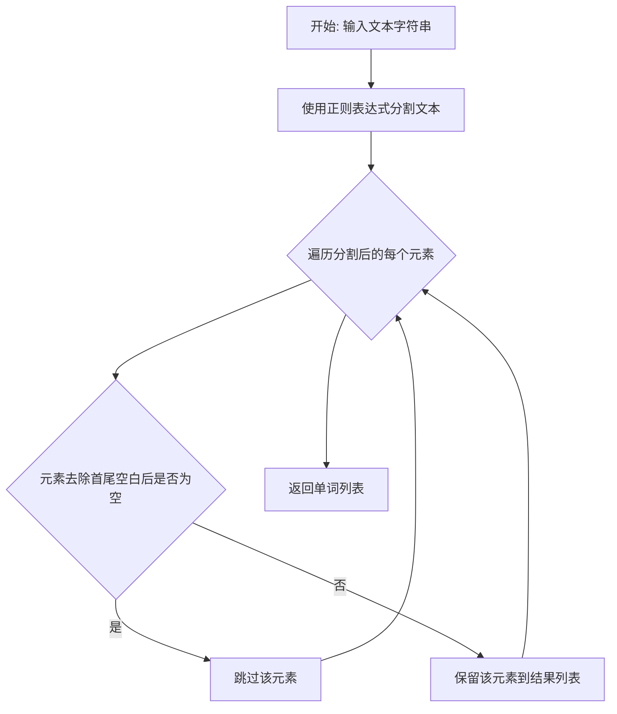

#### 带注释源码

```python
def sep_text(text):
    """
    将文本按照标点符号和空白字符进行分割，并过滤空字符串
    
    参数:
        text: 待分割的文本字符串
    
    返回:
        分割后的单词/标点符号列表（不含空字符串）
    """
    # 使用正则表达式分割文本，捕获分割符
    # 正则表达式说明:
    #   [,;.\?\!\s+] 匹配以下字符之一:
    #     ,  逗号
    #     ;  分号
    #     .  句号
    #     ?  问号
    #     !  感叹号
    #     \s+  一个或多个空白字符（空格、Tab、换行等）
    # 使用括号捕获分割符，所以分割符会作为列表元素保留
    words = re.split(r"([,;.\?\!\s+])", text)
    
    # 过滤掉空字符串（去除首尾空白后为空串的元素）
    # 这一步确保返回的列表中不包含空字符串
    words = [word for word in words if word.strip() != ""]
    
    # 返回处理后的单词列表
    return words
```

---

**使用示例**：

```python
# 输入: "Hello, world! How are you?"
# 输出: ['Hello', ',', 'world', '!', 'How', 'are', 'you', '?']

result = sep_text("Hello, world! How are you?")
print(result)  # ['Hello', ',', 'world', '!', 'How', 'are', 'you', '?']
```

**注意事项**：

1. 该函数会保留分割符（标点符号），因此返回的列表中包含原始文本的所有组成部分
2. 连续的空白字符会被视为一个分割符处理
3. 该函数目前未被`g2p`函数直接使用（代码中有注释`# words = sep_text(text)`），实际使用的是`text_to_words`函数，该函数利用BERT分词器进行更精细的分词


### `text_to_words`

该函数利用 DebertaV2Tokenizer 对输入文本进行分词处理，并通过分析 token 的前缀标记（"▁"）和标点符号关系，将连续的 token 组合成单词列表，最终返回一个二维列表结构，其中每个子列表代表一个单词（可能包含多个子 token）。

参数：

-  `text`：`str`，待处理的输入文本

返回值：`list`，二维列表，每个子列表表示一个"单词"及其包含的所有 token，格式为 `[[token1, token2, ...], [token3], ...]`

#### 流程图

```mermaid
flowchart TD
    A[开始: text_to_words] --> B[tokenizer.tokenize<br/>对文本进行分词]
    B --> C[初始化空列表 words]
    C --> D{idx &lt; len<br/>tokens?}
    D -->|是| E{当前 token t<br/>是否以 '▁' 开头?}
    E -->|是| F[words.append<br/>[t[1:]]]
    E -->|否| G{t in<br/>punctuation?}
    G -->|是| H{idx 是否为<br/>最后一个 token?}
    H -->|是| I[words.append<br/>[f'{t}']]
    H -->|否| J{下一个 token 不以<br/>'▁' 开头且不是标点?}
    J -->|是| K{idx == 0?}
    K -->|是| L[words.append<br/>[]]
    K -->|否| M[words[-1].append<br/>f'{t}']
    J -->|否| N[words.append<br/>[f'{t}']]
    G -->|否| O{idx == 0?}
    O -->|是| P[words.append<br/>[]]
    O -->|否| Q[words[-1].append<br/>f'{t}']
    F --> R[idx += 1]
    I --> R
    M --> R
    N --> R
    P --> R
    Q --> R
    D -->|否| S[返回 words]
```

#### 带注释源码

```python
def text_to_words(text):
    """
    将输入文本分词后按照特定规则组合成单词列表
    
    该函数使用 DebertaV2Tokenizer 对文本进行分词，然后根据 token 的
    前缀标记 '▁'（表示新单词的开始）和标点符号的关系，将 token 组合成
    单词的二维列表结构。
    
    参数:
        text: str, 待处理的输入文本
    
    返回:
        list: 二维列表，每个子列表代表一个单词及其包含的所有子 token
    """
    # 使用 DebertaV2Tokenizer 对文本进行分词
    # tokenizer 是全局变量，在模块加载时初始化
    tokens = tokenizer.tokenize(text)
    
    # 初始化用于存储结果的二维列表
    words = []
    
    # 遍历所有 token
    for idx, t in enumerate(tokens):
        # 检查 token 是否以 '▁' 开头（Deberta 分词器的新单词标记）
        if t.startswith("▁"):
            # 如果是新单词的开始，将 token（去掉前缀标记）添加到 words
            words.append([t[1:]])
        else:
            # 处理不以 '▁' 开头的 token
            # 首先检查当前 token 是否为标点符号
            if t in punctuation:
                # 判断是否为最后一个 token
                if idx == len(tokens) - 1:
                    # 最后一个 token，直接作为独立单词添加
                    words.append([f"{t}"])
                else:
                    # 不是最后一个 token，需要查看下一个 token 的情况
                    # 如果下一个 token 不是新单词开始且也不是标点
                    if (
                        not tokens[idx + 1].startswith("▁")
                        and tokens[idx + 1] not in punctuation
                    ):
                        # 这种情况下将标点附加到前一个单词
                        if idx == 0:
                            # 如果是第一个 token 且不符合上述条件，创建空列表
                            words.append([])
                        # 将标点附加到当前最后一个单词
                        words[-1].append(f"{t}")
                    else:
                        # 否则将标点作为独立单词
                        words.append([f"{t}"])
            else:
                # 非标点且不以 '▁' 开头的情况（单词中间的部分）
                if idx == 0:
                    # 如果是第一个 token，创建新的单词列表
                    words.append([])
                # 将 token 附加到当前最后一个单词
                words[-1].append(f"{t}")
    
    return words
```


### `g2p`

该函数是文本转语音（Text-to-Speech）系统的核心组件，负责将输入的文本字符串转换为音素序列（phonemes）、声调序列（tones）以及词素到音素的映射（word2ph）。函数首先使用BERT分词器对文本进行分词，然后对每个单词查询CMU英语词典，若词典中不存在则调用g2p_en库进行推断，最终返回处理后的音素数组、声调数组和词素-音素对应关系数组。

参数：

- `text`：`str`，需要进行语音合成的原始文本输入

返回值：`tuple`，包含三个元素的元组
- `phones`：`list[str]`，音素序列列表，首尾添加了静音标记"_"
- `tones`：`list[int]`，声调序列列表，与phones一一对应，首尾为0
- `word2ph`：`list[int]`，词素到音素的映射关系，表示每个词素对应的音素数量

#### 流程图

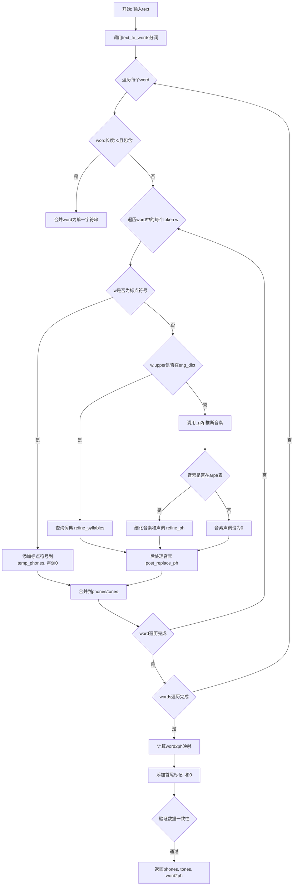

#### 带注释源码

```python
def g2p(text):
    """
    将输入文本转换为音素序列、声调序列和词素到音素的映射关系
    
    参数:
        text (str): 输入的文本字符串
        
    返回:
        tuple: (phones, tones, word2ph) 三个列表的元组
    """
    phones = []          # 存储最终音素序列
    tones = []           # 存储最终声调序列
    phone_len = []       # 存储每个词的音素数量
    
    # 使用BERT分词器进行分词，返回嵌套列表结构
    words = text_to_words(text)

    # 遍历每个词（或词组）
    for word in words:
        temp_phones, temp_tones = [], []   # 临时存储当前词的音素和声调
        
        # 处理包含撇号的词，将其合并为一个字符串
        if len(word) > 1:
            if "'" in word:
                word = ["".join(word)]
        
        # 遍历当前词中的每个token
        for w in word:
            # 如果是标点符号，直接添加并设置声调为0
            if w in punctuation:
                temp_phones.append(w)
                temp_tones.append(0)
                continue
            
            # 检查单词是否在CMU英语词典中
            if w.upper() in eng_dict:
                # 从词典获取音素并细化处理
                phns, tns = refine_syllables(eng_dict[w.upper()])
                # 对每个音素进行后处理替换
                temp_phones += [post_replace_ph(i) for i in phns]
                temp_tones += tns
            else:
                # 词典中不存在，使用g2p_en库进行推断
                # 过滤掉空格
                phone_list = list(filter(lambda p: p != " ", _g2p(w)))
                phns = []
                tns = []
                for ph in phone_list:
                    # 检查音素是否为ARPA音素
                    if ph in arpa:
                        # 细化音素，提取声调
                        ph, tn = refine_ph(ph)
                        phns.append(ph)
                        tns.append(tn)
                    else:
                        # 非ARPA音素，声调设为0
                        phns.append(ph)
                        tns.append(0)
                # 后处理音素并添加到结果
                temp_phones += [post_replace_ph(i) for i in phns]
                temp_tones += tns
        
        # 将当前词的音素和声调添加到总结果
        phones += temp_phones
        tones += temp_tones
        phone_len.append(len(temp_phones))

    # 计算word2ph映射关系：将音素数量分配到每个词素
    word2ph = []
    for token, pl in zip(words, phone_len):
        word_len = len(token)  # 词素长度
        # 将音素均匀分配到各个词素
        aaa = distribute_phone(pl, word_len)
        word2ph += aaa

    # 添加句子边界标记（静音标记）
    phones = ["_"] + phones + ["_"]
    tones = [0] + tones + [0"]
    word2ph = [1] + word2ph + [1"]
    
    # 验证数据一致性
    assert len(phones) == len(tones), text
    assert len(phones) == sum(word2ph), text

    return phones, tones, word2ph
```


### `get_bert_feature`

该函数是一个对`text.english_bert_mock.get_bert_feature`的包装函数，用于获取文本的BERT特征表示。它接收原始文本和字到音素的映射关系作为输入，然后委托给`english_bert_mock`模块来完成实际的BERT特征提取工作。

参数：

- `text`：`str`，原始输入文本，用于BERT特征提取
- `word2ph`：`list[int]`，字到音素个数的映射数组，表示每个字符/词对应多少个音素单元，用于特征对齐

返回值：`任意`，返回由`english_bert_mock.get_bert_feature`生成的BERT特征向量，具体类型取决于mock实现的返回类型（通常为numpy数组或torch tensor）

#### 流程图

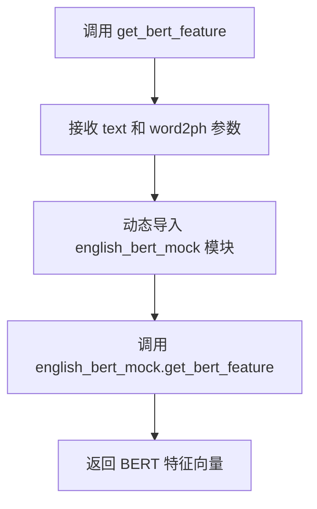

#### 带注释源码

```python
def get_bert_feature(text, word2ph):
    """
    获取文本的BERT特征表示。
    
    该函数是对text.english_bert_mock.get_bert_feature的包装器，
    用于将文本转换为BERT模型生成的特征向量。
    
    参数:
        text (str): 原始输入文本，用于BERT特征提取
        word2ph (list[int]): 字到音素个数的映射数组，
                            表示每个字符/词对应多少个音素单元，
                            用于特征对齐
    
    返回:
        任意类型: 由english_bert_mock.get_bert_feature返回的
                 BERT特征向量，具体类型取决于实现
    """
    # 动态导入english_bert_mock模块，避免循环依赖
    from text import english_bert_mock

    # 委托给english_bert_mock模块完成实际的BERT特征提取
    # 传递原始文本和字到音素的映射关系
    return english_bert_mock.get_bert_feature(text, word2ph)
```

## 关键组件


### 音素字典加载与缓存模块

负责加载CMU发音词典，并提供缓存机制以加速后续读取。包含`read_dict()`读取原始词典文件，`cache_dict()`将词典序列化到磁盘，`get_dict()`首先检查缓存文件是否存在，若存在则直接加载，否则读取并缓存。

### 文本规范化模块

将文本中的数字、货币符号、序数词等转换为英文单词形式。包含`normalize_numbers()`主函数，以及`_expand_dollars()`、`_expand_ordinal()`、`_expand_number()`等辅助函数，使用正则表达式匹配并替换数字模式。

### 标点符号处理模块

将各种语言的标点符号统一替换为英文标点。包含`replace_punctuation()`使用正则表达式批量替换，`post_replace_ph()`对单个音素进行标点后处理，支持中文、 日文、俄文等多种标点的映射。

### Grapheme-to-Phoneme (G2P) 转换模块

将文本转换为音素序列，支持词典查询和基于g2p_en库的回退机制。`g2p()`函数为核心入口，调用`text_to_words()`分词，查询`eng_dict`词典或使用`_g2p()`库生成音素，并返回音素、语调、声调信息。

### 音素细化模块

处理音素的语调标注，从音素末尾提取数字作为语调标记。`refine_ph()`提取并转换语调数字，`refine_syllables()`遍历音素列表统一处理，返回标准化音素和对应语调值。

### 惰性IPA映射模块

提供多种IPA（国际音标）变体映射规则，用于不同的语音合成场景。包含`_lazy_ipa`、`_lazy_ipa2`、`_ipa_to_ipa2`三个正则表达式列表，支持r、θ、ð等音素的简化或规范化表示。

### BERT特征提取模块

调用BERT模型提取文本的词级嵌入特征。`get_bert_feature()`函数接收文本和词到音素的映射关系，返回用于后续声学模型的高维特征表示。

### 文本分词模块

使用Deberta分词器进行文本切分，并处理BPE子词的合并逻辑。`text_to_words()`函数将分词结果按空格和标点重新组合为词单元，`sep_text()`提供简单的标点分隔功能。

### 音素-词对齐模块

将音素序列均匀或均衡地分配到每个词。`distribute_phone()`采用贪心算法确保每个词分配的音素数尽可能均衡，返回每个词的音素数量列表。

### 缩写词展开模块

将常见缩写词（如Mr、Dr、St等）展开为完整形式。`_abbreviations`列表存储正则表达式和对应展开词，在文本规范化过程中优先匹配并替换。


## 问题及建议


### 已知问题

1. **全局初始化开销**：模块级别初始化了`_g2p = G2p()`和`tokenizer = DebertaV2Tokenizer.from_pretrained(LOCAL_PATH)`，这些重量级对象在导入时就会加载，即使未被使用，增加启动时间和内存占用。

2. **硬编码的字典起始行**：`read_dict()`函数中`start_line = 49`是硬编码的，如果CMU字典文件格式变化会导致功能失效，缺乏容错机制。

3. **重复的映射表**：`rep_map`和`post_replace_ph`函数内部定义的`rep_map`存在重复定义，维护成本高且容易产生不一致。

4. **缺失错误处理**：文件读写操作（`open(CMU_DICT_PATH)`、`open(CACHE_PATH, "rb")`等）缺乏try-except保护，文件不存在或损坏时会直接崩溃。

5. **正则表达式重复编译**：模块加载时预编译了大量正则表达式（`_comma_number_re`、`_decimal_number_re`等），但如果`normalize_numbers`从未被调用，这些编译开销是多余的。

6. **魔法数字和字符串**：如`start_line = 49`、`tone = 3`（默认调）等缺乏注释说明，后续维护困难。

7. **`g2p()`函数复杂度高**：该函数承担了过多职责（分词、查字典、G2P转换、音素后处理、调值分配等），超过200行，难以测试和维护。

8. **缓存失效机制不完善**：`get_dict()`仅检查缓存文件是否存在，未考虑原字典文件更新后缓存未同步的情况。

9. **类型注解缺失**：所有函数都缺乏类型注解，降低了代码的可读性和IDE支持。

10. **未使用的导入和代码**：`sep_text()`函数在`g2p()`中被注释掉但保留；`symbols`和`punctuation`的导入方式不统一。

11. **`_inflect`全局实例**：模块级别的`_inflect = inflect.engine()`初始化，但仅在`normalize_numbers`相关函数中使用，应延迟初始化。

12. **字符串拼接低效**：`_expand_number()`中大量使用`+`进行字符串拼接，在循环中效率较低。

13. **依赖外部路径**：`LOCAL_PATH = "./bert/deberta-v3-large"`使用相对路径，在不同工作目录下可能找不到模型。

### 优化建议

1. **延迟初始化**：将`_g2p`、`tokenizer`、`_inflect`等重量级对象改为在函数首次调用时初始化，或使用懒加载模式。

2. **配置外置**：将`start_line = 49`、路径配置等常量提取到配置文件或环境变量中，增加灵活性。

3. **统一映射表**：合并`rep_map`，避免重复定义，或将`post_replace_ph`中的局部`rep_map`提取为模块级常量。

4. **添加错误处理**：为所有文件操作添加try-except，捕获`FileNotFoundError`、`IOError`等异常，提供有意义的错误信息或降级处理。

5. **按需编译正则**：将正则表达式编译移入使用它们的函数内部，或使用`re.compile`配合缓存装饰器。

6. **重构`g2p()`函数**：拆分为多个单一职责的子函数（如`tokenize_text()`、`lookup_dictionary()`、`apply_g2p()`等），每个函数不超过50行。

7. **缓存机制改进**：在缓存文件名中加入原字典文件的MD5或时间戳，检测到原文件更新时自动重新生成缓存。

8. **添加类型注解**：为所有函数参数和返回值添加类型注解，提升代码可维护性。

9. **路径处理优化**：使用`os.path.abspath()`或`pathlib.Path`处理路径，确保跨平台兼容性。

10. **使用StringIO或列表join**：在需要大量字符串拼接的场景（如`_expand_number()`）使用列表存储后`join()`，或使用`io.StringIO`。

11. **清理死代码**：删除`sep_text()`等未使用的函数和`__main__`中的调试代码。

12. **提取魔法数字**：为`tone = 3`、`start_line = 49`等常量定义有意义的名称并添加注释。


## 其它


### 设计目标与约束

**设计目标**：实现一个英文文本到音素序列的转换系统，支持文本标准化、数字转换、标点符号处理、CMU词典查询、G2P转换，并生成与BERT特征对齐的音素序列。

**约束条件**：
- 依赖CMU发音词典文件(cmudict.rep)存在
- 需要预训练的Deberta-v3-large模型文件
- 仅支持英文文本处理
- 需要保证输出音素序列与word2ph对齐

### 错误处理与异常设计

**文件缺失处理**：
- CMU词典文件不存在时程序会抛出FileNotFoundError
- 缓存文件不存在时自动重新读取原始词典并生成缓存

**断言验证**：
- g2p函数输出时验证`len(phones) == len(tones)`
- 验证`len(phones) == sum(word2ph)`

**未知字符处理**：
- 不在symbols中的音素替换为"UNK"
- 不在CMU词典中的单词使用g2p_en库进行预测

### 数据流与状态机

**主数据流**：
```
输入文本 
  ↓
text_normalize() - 数字标准化、标点替换
  ↓
text_to_words() - BERT分词
  ↓
g2p() - 对每个word进行G2P转换
  ↓
输出: phones, tones, word2ph
```

**G2P转换状态机**：
```
word处理流程:
  1. 检查是否为标点符号 → 直接添加
  2. 检查是否在eng_dict中 → 使用CMU词典
  3. 否则 → 使用g2p_en库预测
  4. refine_syllables() - 提取音素和声调
  5. post_replace_ph() - 音素后处理
```

### 外部依赖与接口契约

**外部库依赖**：
- `g2p_en.G2p`: 英文Grapheme-to-Phoneme转换
- `transformers.DebertaV2Tokenizer`: BERT分词器
- `inflect.engine`: 数字到英文单词转换
- `pickle`: 词典缓存序列化

**文件依赖**：
- `./bert/deberta-v3-large`: BERT模型目录
- `./cmudict.rep`: CMU发音词典
- `./cmudict_cache.pickle`: 词典缓存文件

**接口契约**：
- `g2p(text)` -> `(list[str], list[int], list[int])`: 返回(音素列表, 声调列表, 每个字符对应的音素数量)
- `get_bert_feature(text, word2ph)` -> 返回BERT特征（调用方未知，需外部提供）

### 边界条件处理

1. **空文本输入**: 返回`["_"], [0], [1]`
2. **纯标点符号**: 保留标点，声调设为0
3. **数字处理**: 转换为英文单词后进行G2P
4. **缩写词处理**: 使用inflect库和缩写词典展开
5. **连续标点**: 通过text_to_words()中的逻辑处理标点与token的连接

### 缓存机制设计

**词典缓存**：
- 首次运行时读取CMU词典并序列化为pickle文件
- 后续运行直接加载缓存文件
- 缓存路径: `./cmudict_cache.pickle`

### 性能优化空间

1. **词典加载优化**: 可考虑延迟加载，仅在首次需要时加载
2. **正则表达式预编译**: 部分正则表达式可在模块级预编译
3. **批量处理**: 支持批量文本转换以减少tokenizer初始化开销
4. **内存优化**: 大文本处理时避免一次性加载所有数据

### 代码可维护性建议

1. **硬编码路径**: LOCAL_PATH和CMU_DICT_PATH应可配置
2. **魔法数字**: start_line=49应定义为常量并注释说明来源
3. **模块拆分**: 可拆分为text_normalizer、g2p_converter、dict_manager等子模块
4. **日志记录**: 缺少日志记录，难以调试和监控
5. **类型注解**: 建议添加函数参数和返回值的类型注解

### 安全性考虑

1. **文件路径遍历**: 使用os.path.join防止路径注入
2. **正则表达式DoS**: re.compile的pattern来源可控，风险较低
3. **pickle安全**: 加载缓存文件时如需在不可信环境使用，建议使用更安全的序列化格式

    