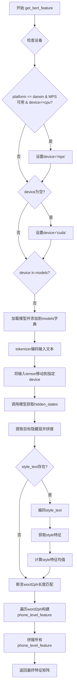
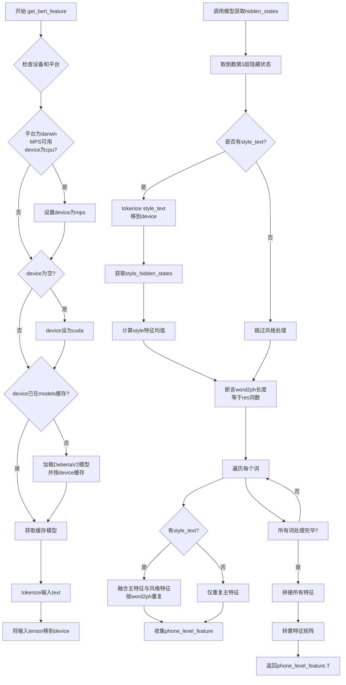

# `Bert-VITS2\text\english_bert_mock.py` 详细设计文档

该代码是一个基于Deberta-V3-Large预训练模型的文本特征提取模块，支持词级特征到音素级特征的映射，并提供可选的风格迁移功能。主要用于语音合成或文本转语音场景中提取文本的深层语义特征。

## 整体流程



## 类结构

```
无类定义（脚本文件）
└── get_bert_feature (全局函数)
```

## 全局变量及字段


### `LOCAL_PATH`
    
Deberta-v3-large模型的本地路径

类型：`str`
    


### `tokenizer`
    
Deberta分词器实例，用于对文本进行tokenize

类型：`DebertaV2Tokenizer`
    


### `models`
    
模型缓存字典，键为设备类型，值为加载到对应设备的模型实例

类型：`dict`
    


### `text`
    
输入文本，待提取特征的源文本

类型：`str`
    


### `word2ph`
    
词到音素的映射，指定每个词对应多少个音素

类型：`list/tensor`
    


### `device`
    
计算设备，指定模型运行的硬件设备（cpu/cuda/mps）

类型：`str`
    


### `style_text`
    
风格参考文本，用于风格迁移的可选输入

类型：`str, optional`
    


### `style_weight`
    
风格融合权重，控制原文本特征与风格特征的比例

类型：`float`
    


### `inputs`
    
tokenized输入，包含token_ids和attention_mask等张量

类型：`dict`
    


### `res`
    
主文本特征，从模型隐藏状态中提取的文本表示

类型：`tensor`
    


### `style_inputs`
    
风格文本tokenized输入，风格文本的tokenize结果

类型：`dict`
    


### `style_res`
    
风格文本特征，从模型提取的风格文本表示

类型：`tensor`
    


### `style_res_mean`
    
风格特征均值，对风格文本特征进行平均池化

类型：`tensor`
    


### `phone_level_feature`
    
音素级特征列表，存储每个音素的特征向量

类型：`list`
    


### `repeat_feature`
    
重复后的特征，根据word2ph映射扩展的词级别特征

类型：`tensor`
    


    

## 全局函数及方法


### `get_bert_feature`

该函数使用 Deberta-V2 大型语言模型从输入文本中提取深度语义特征，并将词级特征根据音素映射（word2ph）转换为音素级别的特征矩阵，支持可选的风格文本融合以实现声音风格的迁移。

#### 参数

- `text`：`str`，待处理的输入文本，用于提取语义特征
- `word2ph`：`list[int]` 或 `torch.Tensor`，词到音素的映射列表，指定每个词对应多少个音素，用于将词级特征扩展为音素级特征
- `device`：`str`，计算设备，默认为 `config.bert_gen_config.device`，支持 cpu/cuda/mps
- `style_text`：`str | None`，可选的风格参考文本，用于提取目标说话人的音色特征，默认为 None
- `style_weight`：`float`，风格特征融合权重，范围 0-1，值越大风格特征占比越高，默认 0.7

#### 返回值

`torch.Tensor`，返回形状为 (特征维度, 音素总数) 的转置特征矩阵，用于后续音素级别的声学特征生成

#### 流程图



#### 带注释源码

```python
def get_bert_feature(
    text,                          # 输入文本字符串
    word2ph,                       # 词到音素数量的映射列表
    device=config.bert_gen_config.device,  # 计算设备（cpu/cuda/mps）
    style_text=None,               # 可选的风格文本用于风格迁移
    style_weight=0.7,              # 风格融合权重 (0-1)
):
    # 平台兼容处理：在MacOS上如果MPS可用且device为cpu，则使用MPS加速
    if (
        sys.platform == "darwin"
        and torch.backends.mps.is_available()
        and device == "cpu"
    ):
        device = "mps"
    
    # 设备后备逻辑：如果未指定设备则默认使用CUDA
    if not device:
        device = "cuda"
    
    # 模型缓存：按设备缓存模型实例，避免重复加载
    if device not in models.keys():
        models[device] = DebertaV2Model.from_pretrained(LOCAL_PATH).to(device)
    
    # 推理阶段：关闭梯度计算以节省显存和计算资源
    with torch.no_grad():
        # 对输入文本进行tokenize，转换为模型输入格式
        inputs = tokenizer(text, return_tensors="pt")
        
        # 将所有输入tensor移动到指定计算设备
        for i in inputs:
            inputs[i] = inputs[i].to(device)
        
        # 前向传播：获取Deberta模型的所有隐藏状态
        res = models[device](**inputs, output_hidden_states=True)
        
        # 特征提取：取倒数第3层的隐藏状态（-3:-2取倒数第3层）
        # 并在最后一个维度拼接，生成词级特征向量
        res = torch.cat(res["hidden_states"][-3:-2], -1)[0].cpu()
        
        # 风格特征提取（可选）
        if style_text:
            # 对风格文本进行相同的tokenize处理
            style_inputs = tokenizer(style_text, return_tensors="pt")
            for i in style_inputs:
                style_inputs[i] = style_inputs[i].to(device)
            
            # 获取风格文本的隐藏状态表示
            style_res = models[device](**style_inputs, output_hidden_states=True)
            style_res = torch.cat(style_res["hidden_states"][-3:-2], -1)[0].cpu()
            
            # 计算风格特征的均值（对所有词求平均）
            style_res_mean = style_res.mean(0)
    
    # 校验：确保word2ph长度与词级特征维度匹配
    assert len(word2ph) == res.shape[0], (text, res.shape[0], len(word2ph))
    
    word2phone = word2ph  # 词到音素的映射
    phone_level_feature = []  # 存储音素级别的特征
    
    # 词级到音素级的特征扩展
    for i in range(len(word2phone)):
        if style_text:
            # 特征融合：主特征 × (1-style_weight) + 风格特征 × style_weight
            # 然后按该词对应的音素数量重复扩展
            repeat_feature = (
                res[i].repeat(word2phone[i], 1) * (1 - style_weight)
                + style_res_mean.repeat(word2phone[i], 1) * style_weight
            )
        else:
            # 无风格文本时，直接按音素数量重复词级特征
            repeat_feature = res[i].repeat(word2phone[i], 1)
        
        # 收集每个词的音素级特征
        phone_level_feature.append(repeat_feature)
    
    # 拼接所有词的音素级特征：(num_phones, feature_dim)
    phone_level_feature = torch.cat(phone_level_feature, dim=0)
    
    # 转置返回：(feature_dim, num_phones) 便于后续处理
    return phone_level_feature.T
```

## 关键组件


### 张量索引与惰性加载

代码实现了模型实例的惰性加载机制，models字典作为缓存容器，按设备类型存储已加载的模型实例，避免重复加载相同设备的模型。模型在首次按特定设备调用get_bert_feature时才完成加载并缓存。

### 设备自动选择逻辑

代码包含完整的设备优先级自动选择逻辑：优先检测MPS加速（macOS平台），其次检测CUDA可用性，最后回退到CPU设备。该机制通过sys.platform == "darwin"、torch.backends.mps.is_available()和torch.cuda.is_available()的顺序判断实现。

### 文本特征提取管道

通过DebertaV2Model.from_pretrained加载预训练模型，使用tokenizer将输入文本转换为token ids，再转换为PyTorch张量并迁移到目标设备。模型输出hidden_states，取倒数第三层作为特征输出，通过torch.cat在最后一维拼接形成最终特征表示。

### 样式风格迁移支持

代码实现了可选的样式风格迁移功能，当style_text参数非空时，会对样式文本进行独立编码并计算平均特征表示，然后根据style_weight权重（默认0.7）将原始特征与样式特征进行线性插值融合，实现声音风格的迁移控制。

### 字素到音素映射机制

word2ph参数控制特征的时间步扩展，通过repeat操作将每个token的表示重复相应的次数，实现从词级别特征到音素级别特征的映射。最终通过torch.cat沿时间维度拼接所有扩展后的特征，并转置返回符合后续处理流程的张量形状。

### 量化策略

代码未实现任何量化策略，模型以完整的FP32精度加载和运行。对于大规模部署场景，可考虑引入动态量化或静态量化以降低内存占用和推理延迟。


## 问题及建议


### 已知问题

-   **全局可变状态（models字典）**：使用全局字典缓存不同device的模型实例，非线程安全，且没有清理机制，长时间运行会导致内存持续增长
-   **设备选择逻辑缺陷**：当`device=="cpu"`且MPS可用时才切换到"mps"，逻辑反直觉，应在任意cpu配置时检查MPS可用性
-   **Tokenizer全局加载**：tokenizer在模块级别加载，但可能并非所有场景都需要，可能导致不必要的内存占用
- **缺乏错误处理**：模型加载和推理过程没有任何try-except保护，失败时会直接抛出异常
- **Assert用于业务逻辑验证**：使用assert验证`len(word2ph) == res.shape[0]`，在Python优化模式下(-O)会被跳过，导致验证失效
- **重复计算style_res_mean**：如果style_text存在，每次调用都会计算style_res_mean，没有缓存机制
- **无批处理支持**：仅支持单文本处理，无法批量提取特征，性能较低
- **隐式依赖magic numbers**：使用`res["hidden_states"][-3:-2]`提取特定层，依赖模型内部实现细节，缺乏文档说明
- **潜在未定义变量风险**：当style_text为真但为空字符串时，style_res_mean变量可能未被定义就使用
- **硬编码路径和配置**：LOCAL_PATH硬编码，config模块的导入假设其存在

### 优化建议

-   **引入模型缓存管理**：实现LRU缓存或设置最大缓存数量限制，定期清理不活跃的模型实例
-   **重构设备选择逻辑**：将MPS检查独立出来，根据优先级(cpu > mps > cuda)自动选择可用设备
-   **延迟加载tokenizer**：将tokenizer初始化移入函数内部或使用懒加载模式
-   **添加异常处理**：为模型加载和推理添加try-except，捕获并合理处理可能的异常
-   **替换assert为显式验证**：使用if-raise模式替代assert进行参数验证，提高代码健壮性
-   **支持批处理**：重构函数接受文本列表输入，批量推理以提升吞吐量
-   **提取magic numbers**：将层索引(-3:-2)定义为常量或配置参数，添加注释说明其含义
-   **输入校验**：在函数入口增加对style_text的空值检查，避免潜在未定义变量问题
-   **配置外部化**：将LOCAL_PATH等硬编码值移至config模块集中管理


## 其它


### 设计目标与约束

该模块的设计目标是将文本转换为音素级别的特征向量，支持词到音素的映射（word2ph），并可选地集成风格迁移功能。约束条件包括：设备优先使用GPU（cuda），若不可用则回退至MPS（Apple Silicon）或CPU；模型仅支持Deberta-v3-large架构；输入文本长度受限于模型最大长度（512 tokens）；风格迁移的style_weight参数范围为[0,1]。

### 错误处理与异常设计

模块包含以下错误处理机制：设备自动检测与回退（cuda→mps→cpu）；输入长度校验通过assert语句确保word2ph长度与模型输出维度一致；模型加载异常未显式捕获，由调用方处理；tokenizer加载失败时抛出异常；GPU内存不足时可能导致OOM。建议增加更详细的异常信息捕获、统一的异常基类定义、以及资源释放的上下文管理器支持。

### 数据流与状态机

数据流如下：输入原始文本→tokenizer分词→转换为PyTorch张量→移至目标设备→调用DebertaV2Model前向传播→提取指定层隐藏状态（倒数第三层）→拼接为特征向量→若启用风格迁移则计算style_res_mean→根据word2ph进行特征重复扩展→拼接为音素级别特征→转置输出。状态机包含：模型加载状态（lazy load，按设备缓存）、设备状态（动态切换）、风格迁移开关状态。

### 外部依赖与接口契约

核心依赖包括：torch（>=1.9.0）、transformers（>=4.20.0）、DebertaV2Model与DebertaV2Tokenizer。输入接口：text（str，原始文本）、word2ph（list[int]，每个词对应的音素数量）、device（str，可选，默认从配置读取）、style_text（str|None，可选）、style_weight（float，可选，默认0.7）。输出接口：phone_level_feature（torch.Tensor，形状为[特征维度, 音素总数]）。LOCAL_PATH指向本地预训练模型目录./bert/deberta-v3-large。

### 性能考虑与优化空间

性能优化方向：模型缓存机制已实现但可增加LRU淘汰策略；推理时可启用torch.compile加速；特征提取结果可缓存以避免重复计算；style_res_mean计算可预计算并缓存；word2ph循环可使用列表推导式优化；设备转换可批量处理减少开销。建议添加批处理支持以提升吞吐量，考虑使用torch.inference_mode()替代no_grad()以提升性能。

### 资源管理与生命周期

模型按设备缓存于全局字典models中，生命周期与进程相同。潜在问题：设备切换时旧模型显存未释放；多进程场景下需考虑资源隔离。优化建议：增加显存监控与自动清理机制；支持模型热卸载；提供显式cleanup接口。

### 版本兼容性与平台适配

平台适配：支持Linux/Windows（cuda/cpu）、macOS（mps/cpu）。torch版本需>=1.9.0以支持MPS；transformers版本需支持DebertaV2Model。Python版本建议>=3.8。模型文件需提前下载至LOCAL_PATH，否则from_pretrained会触发HuggingFace下载。

### 测试策略建议

单元测试：验证不同设备（cpu/cuda/mps）下的输出形状一致性；测试word2ph映射正确性；测试风格迁移开关功能；测试边界条件（空文本、单字符、超长文本）。集成测试：端到端验证特征提取流程；内存泄漏检测；多线程并发安全性。

### 配置管理与参数说明

config.bert_gen_config.device为默认设备来源。LOCAL_PATH为模型路径常量，建议移至配置文件中管理。style_weight参数控制风格特征混合比例，0.0表示纯内容特征，1.0表示纯风格特征，0.7为经验默认值。

### 监控与日志建议

建议增加日志记录：模型加载完成、设备切换、输入文本长度、输出张量形状、风格迁移启用状态。性能监控：首次推理延迟（模型预热）、平均推理时间、显存使用量。可集成Python标准logging模块替代print类调试输出。


    