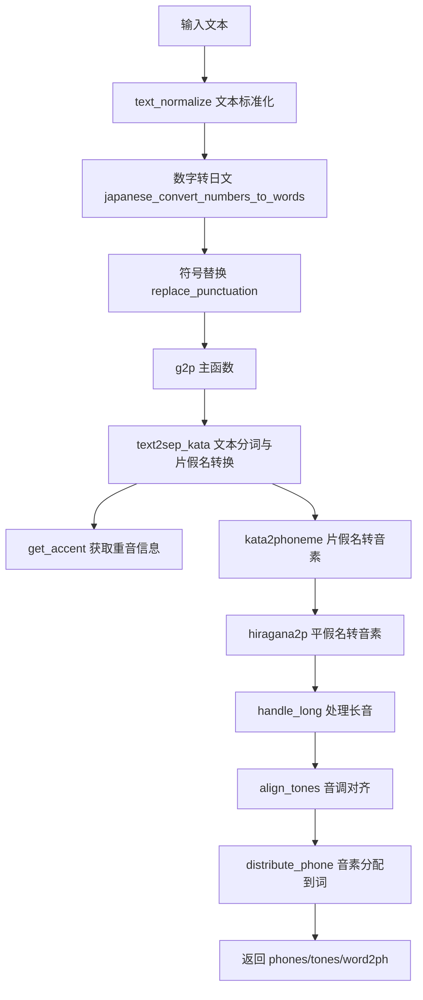
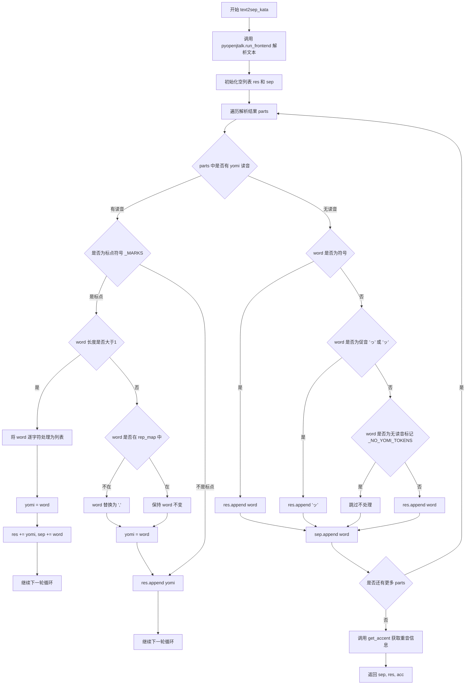
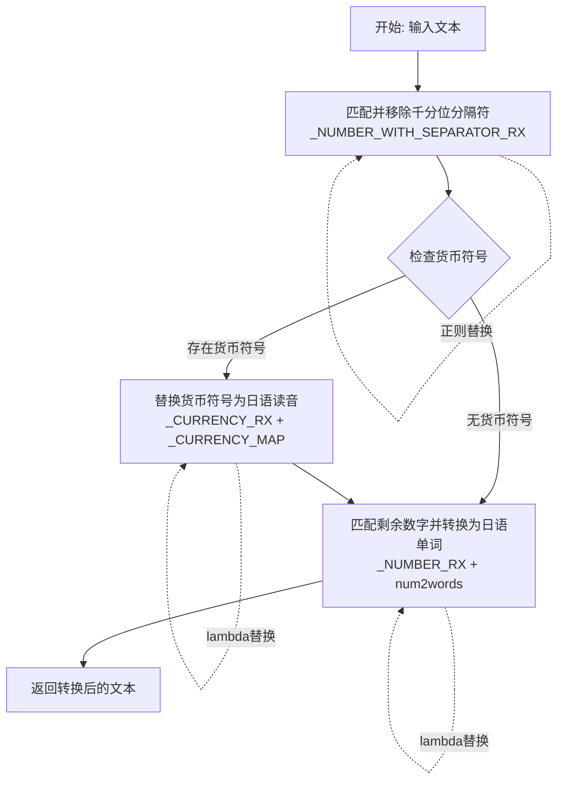
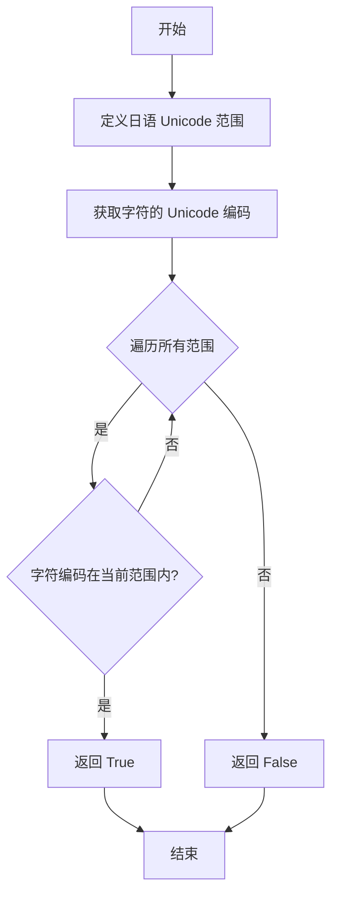
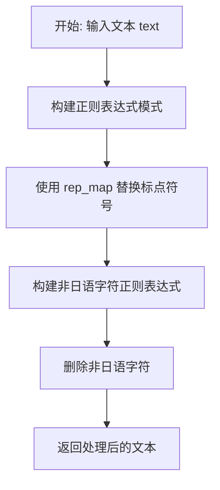
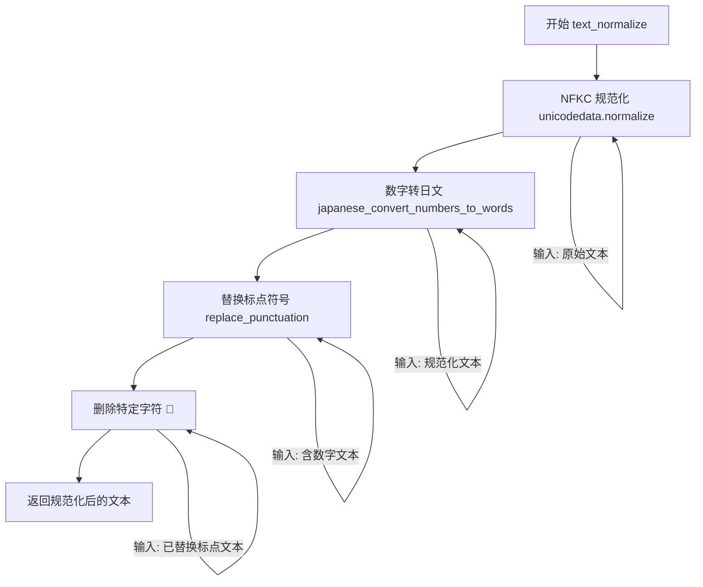
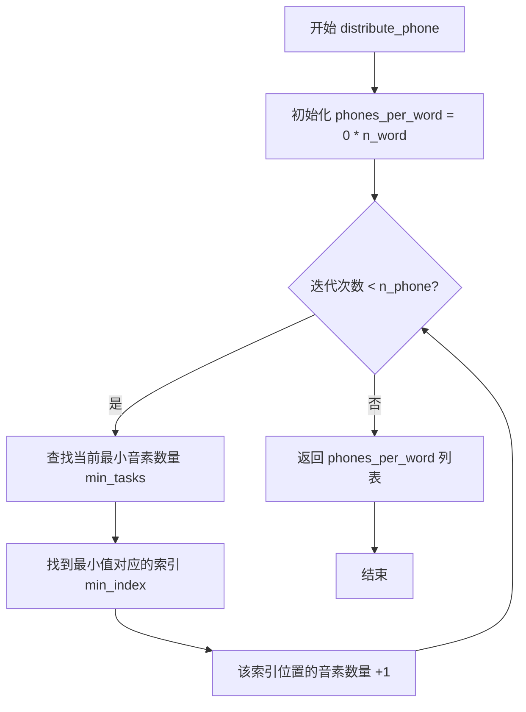

# `Bert-VITS2\text\japanese.py` 详细设计文档

该代码是一个日语文本到音素（phoneme）的转换系统，兼容Julius语音识别工具。它通过pyopenjtalk进行文本分析，使用自定义映射表将平假名/片假名转换为音素表示，同时处理数字、字母、符号的日文化转换，并计算重音（accent）信息，最终输出音素序列、音调序列和词-音素对齐关系。

## 整体流程



## 类结构

```
该文件为模块化脚本，无明确的类层次结构
全局函数: hiragana2p, kata2phoneme, text2sep_kata, get_accent, japanese_convert_numbers_to_words...
└─ 核心流程: text_normalize → g2p → (text2sep_kata + get_accent + kata2phoneme + handle_long + align_tones + distribute_phone)
```

## 全局变量及字段


### `hiragana_map`
    
Mapping of hiragana characters to their phonetic representations compatible with Julius speech recognition

类型：`dict`
    


### `_SYMBOL_TOKENS`
    
Set of Japanese symbol tokens such as punctuation marks (、, 。, ！？)

类型：`set`
    


### `_NO_YOMI_TOKENS`
    
Set of tokens that have no yomi (reading) in Japanese text processing

类型：`set`
    


### `_MARKS`
    
Compiled regex pattern for matching non-Japanese characters and symbols to filter out

类型：`re.Pattern`
    


### `_ALPHASYMBOL_YOMI`
    
Dictionary mapping alphabetic characters and symbols to their Japanese pronunciation

类型：`dict`
    


### `_NUMBER_WITH_SEPARATOR_RX`
    
Compiled regex pattern for matching numbers with thousand separators (e.g., 1,000)

类型：`re.Pattern`
    


### `_CURRENCY_MAP`
    
Dictionary mapping currency symbols to their Japanese word representations

类型：`dict`
    


### `_CURRENCY_RX`
    
Compiled regex pattern for matching currency amounts with symbols

类型：`re.Pattern`
    


### `_NUMBER_RX`
    
Compiled regex pattern for matching numeric values including decimals

类型：`re.Pattern`
    


### `rep_map`
    
Dictionary for mapping Japanese punctuation to ASCII equivalents

类型：`dict`
    


### `tokenizer`
    
Japanese BERT tokenizer (DeBERTa-v2-large) for tokenization tasks

类型：`transformers.tokenization_utils_base.PreTrainedTokenizer`
    


    

## 全局函数及方法


### `hiragana2p`

将日文平假名文本转换为音素表示，支持与Julius语音识别工具兼容的音素输出，同时处理长音、特殊假名（如ゔ）和促音等特殊情况。

参数：

- `txt`：`str`，待转换的日文平假名文本输入

返回值：`str`，转换后的音素字符串

#### 流程图

```mermaid
flowchart TD
    A[开始: 输入平假名字符串] --> B[初始化空结果列表result和skip计数器]
    C{遍历字符串索引i从0到len-1}
    C --> D{检查skip > 0?}
    D -->|是| E[skip减1, 跳过后续处理]
    D -->|否| F[从长度3到1遍历]
    F --> G{txt[i:i+length]在hiragana_map中?}
    G -->|是| H[从hiragana_map获取对应音素]
    H --> I[追加到result, 设置skip=length-1, 跳出循环]
    G -->|否| J[继续下一个length]
    J --> F
    E --> C
    C --> K[将result连接成字符串并去除首尾空格]
    K --> L[替换 ':+' 为 ':']
    L --> M[使用正则表达式处理长音符号]
    M --> N{匹配 pattern=(\w)(:*)}
    N --> O[将长音符号展开为重复的元音]
    M --> P[将 'N' 替换为 'n' 表示促音]
    P --> Q[返回最终音素字符串]
```

#### 带注释源码

```python
def hiragana2p(txt: str) -> str:
    """
    Modification of `jaconv.hiragana2julius`.
    - avoid using `:`, instead, `あーーー` -> `a a a a`.
    - avoid converting `o u` to `o o` (because the input is already actual `yomi`).
    - avoid using `N` for `ん` (for compatibility)
    - use `v` for `ゔ` related text.
    - add bare `ゃ` `ゅ` `ょ` to `y a` `y u` `y o` (for compatibility).
    """

    result = []  # 存储转换后的音素列表
    skip = 0     # 跳过计数，用于处理多字符匹配后的索引跳过
    
    # 遍历输入字符串的每个字符位置
    for i in range(len(txt)):
        if skip:  # 如果需要跳过（已匹配到多字符），则跳过当前索引
            skip -= 1
            continue

        # 从最长3个字符开始尝试匹配，优先匹配最长模式
        for length in range(3, 0, -1):
            # 获取当前位置开始的子串
            substring = txt[i : i + length]
            if substring in hiragana_map:
                # 找到匹配，追加对应的音素表示
                result.append(hiragana_map[substring])
                # 设置跳过计数（已处理length个字符，下一个开始于i+length）
                skip = length - 1
                break

    # 将音素列表连接成字符串
    txt = "".join(result)
    # 去除首尾空白字符
    txt = txt.strip()
    # 处理连续的加号和冒号，替换为单个冒号
    txt = txt.replace(":+", ":")

    # 这里是jaconv.hiragana2julius的核心处理结束点
    # 接下来的代码处理长音符号的展开
    # 例如：'k a::' -> 'k a a a'，冒号数量决定重复次数
    
    # 定义正则模式：匹配一个字母字符和其后任意数量的冒号
    pattern = r"(\w)(:*)"
    # 替换函数：字母 + (空格 + 字母) * 冒号数量
    replacement = lambda m: m.group(1) + (" " + m.group(1)) * len(m.group(2))

    # 应用长音展开替换
    txt = re.sub(pattern, replacement, txt)
    # 将促音标记'N'替换为小写'n'以保持兼容性
    txt = txt.replace("N", "n")  # 促音のNをnに変換
    
    return txt
```

---

### 全局变量 `hiragana_map`

平假名到音素表示的映射字典，包含约500+条映射规则，覆盖了所有平假名字符（包括浊音、半浊音、拗音、长音等）到对应音素字符串的转换。

参数：

- 无（全局变量）

返回值：

- `dict`，键为平假名字符串，值为音素表示字符串

#### 带注释源码

```python
# Mapping of hiragana to phonetic representation
hiragana_map = {
    # 特殊浊音组合（う゛系列）
    "う゛ぁ": " v a",
    "う゛ぃ": " v i",
    "う゛ぇ": " v e",
    "う゛ぉ": " v o",
    "う゛ゅ": " by u",
    "ぅ゛": " v u",
    
    # ゔ（清化浊音）系列
    "ゔぁ": " v a",
    "ゔぃ": " v i",
    "ゔぇ": " v e",
    "ゔぉ": " v o",
    "ゔゅ": " by u",
    
    # 2字符组成的转换规则（重复元音/长音）
    "あぁ": " a a",
    "いぃ": " i i",
    "いぇ": " i e",
    "いゃ": " y a",
    "うぅ": " u:",
    "えぇ": " e e",
    "おぉ": " o:",
    # ... (更多2字符组合)
    
    # 1字符的基础转换规则
    "あ": " a",
    "い": " i",
    "う": " u",
    "ゔ": " v u",  # ゔ的处理
    "え": " e",
    "お": " o",
    # ... (所有基础假名)
    
    # 特殊符号和长音
    "ー": ":",
    "〜": ":",
    "−": ":",
    "-": ":",
    
    # 小写假名（ぁぃぅぇぉ等）
    "ぁ": " a",
    "ぃ": " i",
    "ぅ": " u",
    "ぇ": " e",
    "ぉ": " o",
    
    # 单独处理拗音（ゃゅょ）
    "ゃ": " y a",
    "ゅ": " y u",
    "ょ": " y o",
}
```


### `kata2phoneme`

将片假名文本转换为对应的音素表示，是日语文本转语音（Text-to-Speech）流程中的核心转换函数。

参数：

- `text`：`str`，输入的片假名文本字符串

返回值：`list[str]`，返回由音素符号组成的列表

#### 流程图

```mermaid
flowchart TD
    A[开始: 输入片假名文本] --> B{文本是否仅为长音符号'ー'}
    B -->|是| C[返回列表 ['ー']]
    B -->|否| D{文本是否以'ー'开头}
    D -->|是| E[返回 ['ー'] + 递归调用kata2phoneme处理剩余文本]
    D -->|否| F{文本是否匹配标记正则_MARKS}
    F -->|是| G[将该标记添加到结果列表]
    G --> H[文本前移一位]
    H --> F
    F -->|否| I{文本是否以'ー'开头且prev不为空}
    I -->|是| J[添加prev的最后一个音素]
    I -->|否| K[使用jaconv.kata2hira转换<br/>调用hiragana2p转换为音素<br/>按空格分割并添加到结果]
    J --> L[文本前移一位]
    L --> I
    K --> M[返回结果列表]
```

#### 带注释源码

```python
def kata2phoneme(text: str) -> str:
    """Convert katakana text to phonemes.
    
    将片假名文本转换为音素序列。
    处理长音符号、标点标记，并依赖hiragana2p进行实际转换。
    """
    # 去除首尾空白
    text = text.strip()
    
    # 特殊情况：如果文本仅是长音符号'ー'，直接返回
    if text == "ー":
        return ["ー"]
    
    # 特殊情况：如果文本以'ー'开头，递归处理剩余部分
    # 例如 'ーabc' -> ['ー'] + kata2phoneme('abc')
    elif text.startswith("ー"):
        return ["ー"] + kata2phoneme(text[1:])
    
    # 初始化结果列表和前一个音素记录
    res = []
    prev = None
    
    # 主循环：逐字符处理文本
    while text:
        # 检查文本开头是否匹配标记正则（标点符号等非日语字符）
        if re.match(_MARKS, text):
            # 将标记字符添加到结果
            res.append(text)
            # 移动到下一个字符
            text = text[1:]
            continue
        
        # 处理长音符号'ー'（在非开头位置）
        if text.startswith("ー"):
            # 如果有前一个音素，使用其最后一个音素
            if prev:
                res.append(prev[-1])
            # 继续处理剩余文本
            text = text[1:]
            continue
        
        # 主要转换逻辑：
        # 1. 使用jaconv.kata2hira将片假名转为平假名
        # 2. 使用hiragana2p将平假名转为音素
        # 3. 按空格分割为音素列表
        res += hiragana2p(jaconv.kata2hira(text)).split(" ")
        break
    
    # 返回音素列表
    return res
```


### `text2sep_kata`

该函数是日语文本到语音音素转换的核心预处理函数，通过 pyopenjtalk 解析日语文本，提取词语、假名读音和重音信息，并进行标点符号和特殊字符的替换处理，最终返回分词结果、假名读音序列和重音标记。

参数：

- `text`：`str`，输入的日语文本字符串

返回值：`tuple`，包含三个元素：
- `sep`：分词后的文本列表
- `res`：处理后的假名/读音列表  
- `get_accent(parsed)`：重音信息列表，由 get_accent 函数返回

#### 流程图



#### 带注释源码

```python
def text2sep_kata(text: str):
    """
    将日语文本解析为分离的假名序列和重音信息。
    
    该函数是日语语音合成前端处理的核心，负责：
    1. 使用 pyopenjtalk 进行文本解析和分词
    2. 处理标点符号和特殊字符
    3. 提取词语的假名读音
    4. 计算重音位置信息
    
    Args:
        text: 输入的日语文本字符串
        
    Returns:
        tuple: (sep, res, acc) 元组
            - sep: 分词后的原始文本列表
            - res: 处理后的假名/读音列表
            - acc: 重音信息列表，由 get_accent 函数生成
    """
    # 使用 pyopenjtalk 的 run_frontend 方法解析文本
    # 返回包含每个词的 string (原文本) 和 pron (假名读音) 的列表
    parsed = pyopenjtalk.run_frontend(text)
    
    # res: 存储处理后的假名/读音结果
    # sep: 存储分词后的原始文本
    res = []
    sep = []
    
    # 遍历解析后的每个词语单元
    for parts in parsed:
        # parts["string"]: 原始词语文本
        # parts["pron"]: 该词语的假名发音，将单引号替换为空
        word, yomi = replace_punctuation(parts["string"]), parts["pron"].replace(
            "'", ""
        )
        
        # 如果存在假名读音
        if yomi:
            # 检查是否为标点符号或其他非假名字符（使用正则匹配）
            if re.match(_MARKS, yomi):
                # 如果原文本长度大于1，进行特殊处理
                if len(word) > 1:
                    # 将每个字符分别进行标点符号替换
                    word = [replace_punctuation(i) for i in list(word)]
                    yomi = word  # 读音使用处理后的字符列表
                    res += yomi
                    sep += word
                    continue  # 跳过后续处理，继续下一轮
                
                # 如果词语不在替换映射表中，替换为逗号
                elif word not in rep_map.keys() and word not in rep_map.values():
                    word = ","
                
                # 读音使用处理后的词语
                yomi = word
            
            # 将处理后的读音添加到结果列表
            res.append(yomi)
        
        # 如果没有假名读音（可能是特殊符号或无法识别的词）
        else:
            # 处理标点符号类符号
            if word in _SYMBOL_TOKENS:
                res.append(word)
            
            # 处理促音（っ/ッ）
            elif word in ("っ", "ッ"):
                res.append("ッ")
            
            # 处理无读音标记的符号（如括号、引号等）
            elif word in _NO_YOMI_TOKENS:
                pass  # 跳过，不添加到结果中
            
            # 其他情况，将原词语添加到结果
            else:
                res.append(word)
        
        # 将原词语添加到分词列表
        sep.append(word)
    
    # 调用 get_accent 函数获取重音信息并返回结果
    return sep, res, get_accent(parsed)
```


### `get_accent`

该函数用于从文本解析结果中提取音素（phoneme）和对应的重音（accent）信息，通过解析 pyopenjtalk 生成的音素标签，识别音节的声调变化（升调、降调或平调），最终返回音素与其重音类型的配对列表。

参数：

- `parsed`：`list`，由 `pyopenjtalk.run_frontend(text)` 返回的文本解析结果，包含词汇和发音信息

返回值：`list[tuple[str, int]]`，返回音素与其重音类型的配对列表，其中整数值表示重音类型：`-1` 表示降调，`1` 表示升调，`0` 表示平调

#### 流程图

```mermaid
flowchart TD
    A[开始: 传入 parsed] --> B[调用 pyopenjtalk.make_label 生成标签]
    B --> C[初始化空列表: phonemes, accents]
    C --> D[遍历 labels]
    D --> E{当前索引 < len(labels)?}
    E -->|是| F[提取当前 label 的 phoneme]
    F --> G{phoneme 不是 'sil' 或 'pau'?}
    G -->|是| H[添加 phoneme 到 phonemes 列表]
    G -->|否| I[跳过当前迭代]
    H --> J[提取 /A:...+ 中的 a1 值]
    J --> K[提取 +...+ 中的 a2 值]
    K --> L{下一个 label 的 phoneme 是 'sil' 或 'pau'?}
    L -->|是| M[a2_next = -1]
    L -->|否| N[a2_next = 下一个 label 的 a2]
    M --> O{判断重音类型}
    N --> O
    O --> P{a1 == 0 且 a2_next == a2 + 1?}
    P -->|是| Q[accents.append -1 降调]
    P -->|否| R{a2 == 1 且 a2_next == 2?}
    R -->|是| S[accents.append 1 升调]
    R -->|否| T[accents.append 0 平调]
    Q --> U[返回 zip(phonemes, accents)]
    S --> U
    T --> U
    I --> D
    E -->|否| U
    U --> V[结束]
```

#### 带注释源码

```python
def get_accent(parsed):
    """
    从 pyopenjtalk 解析结果中提取音素和重音信息。

    参数:
        parsed: pyopenjtalk.run_frontend 返回的解析结果列表

    返回:
        音素与重音类型的配对列表，例如 [('a', 0), ('i', 1), ('u', -1), ...]
        -1 表示降调（Falling），1 表示升调（Rising），0 表示平调（Flat）
    """
    # 使用 pyopenjtalk 将解析结果转换为音素标签序列
    labels = pyopenjtalk.make_label(parsed)

    # 存储提取的音素和对应的重音类型
    phonemes = []
    accents = []

    # 遍历每个音素标签
    for n, label in enumerate(labels):
        # 使用正则表达式提取音素部分，格式为 -phoneme+
        # 例如: "k@+1+1" -> 提取 "k@"
        phoneme = re.search(r"\-([^\+]*)\+", label).group(1)

        # 跳过静音标记（sil）和停顿（pau）
        if phoneme not in ["sil", "pau"]:
            # 将闭塞音 "cl" 替换为 "q"（促音），并转为小写
            phonemes.append(phoneme.replace("cl", "q").lower())
        else:
            # 跳过静音或停顿标记
            continue

        # 提取重音核位置 /A:a1+
        # a1 表示当前音素相对于词首的重音核位置
        a1 = int(re.search(r"/A:(\-?[0-9]+)\+", label).group(1))

        # 提取当前音素在词中的位置 +a2+
        a2 = int(re.search(r"\+(\d+)\+", label).group(1))

        # 检查下一个音素是否是静音或停顿
        next_phoneme = re.search(r"\-([^\+]*)\+", labels[n + 1]).group(1)
        if next_phoneme in ["sil", "pau"]:
            # 如果下一个是静音/停顿，设置 a2_next 为 -1（词尾）
            a2_next = -1
        else:
            # 否则提取下一个音素的位置
            a2_next = int(re.search(r"\+(\d+)\+", labels[n + 1]).group(1))

        # 判断重音变化类型
        # 降调（Falling）：当前音素是重音核（a1=0）且下一个音素是后一个位置（a2_next = a2 + 1）
        if a1 == 0 and a2_next == a2 + 1:
            accents.append(-1)
        # 升调（Rising）：当前音素在位置1，且下一个音素在位置2
        elif a2 == 1 and a2_next == 2:
            accents.append(1)
        else:
            # 平调（Flat）：其他情况
            accents.append(0)

    # 返回音素和重音类型的配对列表
    return list(zip(phonemes, accents))
```


### `japanese_convert_numbers_to_words`

该函数是日语文本预处理管道中的数字转换模块，核心功能是将输入的日语文本中的阿拉伯数字（包括带千分位分隔符的数字和货币符号结合的数字）转换为其对应的日语单词读音形式（如"123"转换为"百二十三"），以便后续的语音合成处理能够正确读出数字内容。

参数：

- `text`：`str`，待转换的日语文本字符串，可能包含阿拉伯数字、货币符号（如$、¥、€、£）以及千分位逗号

返回值：`str`，转换后的日语文本字符串，数字已被替换为对应的日语单词读音形式

#### 流程图



#### 带注释源码

```python
def japanese_convert_numbers_to_words(text: str) -> str:
    """
    将日语文本中的数字转换为日语单词读音形式
    
    处理流程：
    1. 移除千分位分隔符（逗号）
    2. 处理货币符号（日元、美元、欧元、英镑）
    3. 将剩余数字转换为日语单词
    
    参数:
        text: 输入的日语文本字符串
        
    返回:
        转换后的日语文本字符串
    """
    # 第一步：移除千分位分隔符
    # 使用正则表达式匹配形如 "1,234" 的模式，并移除逗号
    # _NUMBER_WITH_SEPARATOR_RX = re.compile("[0-9]{1,3}(,[0-9]{3})+")
    res = _NUMBER_WITH_SEPARATOR_RX.sub(lambda m: m[0].replace(",", ""), text)
    
    # 第二步：处理货币符号
    # 匹配货币符号后跟数字的模式，如 "$100", "¥500"
    # _CURRENCY_RX = re.compile(r"([$¥£€])([0-9.]*[0-9])")
    # _CURRENCY_MAP = {"$": "ドル", "¥": "円", "£": "ポンド", "€": "ユーロ"}
    # 将货币符号转换为日语读音，数字保留
    res = _CURRENCY_RX.sub(lambda m: m[2] + _CURRENCY_MAP.get(m[1], m[1]), res)
    
    # 第三步：将剩余数字转换为日语单词
    # 匹配任意数字（包括小数）
    # _NUMBER_RX = re.compile(r"[0-9]+(\.[0-9]+)?")
    # 使用 num2words 库将数字转换为日语读音
    res = _NUMBER_RX.sub(lambda m: num2words(m[0], lang="ja"), res)
    
    return res
```

---

### 相关全局变量

- `_NUMBER_WITH_SEPARATOR_RX`：`re.Pattern`，正则表达式，用于匹配带千分位逗号的数字（如`1,234`、`100,000`），模式为`[0-9]{1,3}(,[0-9]{3})+`

- `_CURRENCY_MAP`：`dict`，货币符号到日语读音的映射字典，包含`$`→`ドル`（美元）、`¥`→`円`（日元）、`£`→`ポンド`（英镑）、`€`→`ユーロ`（欧元）

- `_CURRENCY_RX`：`re.Pattern`，正则表达式，用于匹配货币符号紧跟数字的模式，捕获组1为货币符号，捕获组2为数字部分

- `_NUMBER_RX`：`re.Pattern`，正则表达式，用于匹配普通数字（整数或小数），模式为`[0-9]+(\.[0-9]+)?`

- `num2words`：外部依赖函数，来自`num2words`库，核心功能是将阿拉伯数字转换为指定语言的单词读音文本，此处指定`lang="ja"`参数以获得日语读音输出


### `japanese_convert_alpha_symbols_to_words`

将输入文本中的字母、符号转换为对应的日语读音词（如 "a" -> "エー", "%" -> "パーセント"）。

参数：

- `text`：`str`，需要转换的文本，包含字母、数字、符号等字符

返回值：`str`，转换后的文本，原始字符被替换为其日语读音形式

#### 流程图

```mermaid
flowchart TD
    A[开始] --> B[输入文本 text]
    B --> C[text.lower 小写转换]
    C --> D[遍历每个字符 ch]
    D --> E{检查 ch 是否在 _ALPHASYMBOL_YOMI 映射表中}
    E -->|是| F[获取映射值 _ALPHASYMBOL_YOMI[ch]]
    E -->|否| G[保留原字符 ch]
    F --> H[将转换结果添加到结果列表]
    G --> H
    H --> I{是否还有下一个字符}
    I -->|是| D
    I -->|否| J[''.join 拼接所有转换后的字符]
    J --> K[返回转换后的字符串]
```

#### 带注释源码

```python
def japanese_convert_alpha_symbols_to_words(text: str) -> str:
    """
    将文本中的字母和符号转换为日语读音词
    例如: "hello" -> "エイチイーエルエルオー"
          "%" -> "パーセント"
    
    参数:
        text: str, 需要转换的输入文本
    
    返回:
        str, 转换后的文本，字符被替换为日语读音形式
    """
    # 使用列表推导式遍历文本中的每个字符
    # 对字符进行小写转换后查找映射表
    # 如果字符在映射表中，返回对应的日语读音；否则保留原字符
    return "".join([_ALPHASYMBOL_YOMI.get(ch, ch) for ch in text.lower()])
```


### `is_japanese_character`

该函数用于检查输入的字符是否为日语字符（包括平假名、片假名、汉字等），通过判断字符的 Unicode 编码是否落在预定义的日语 Unicode 范围内来实现。

参数：

- `char`：`str`，需要检查的单个字符

返回值：`bool`，如果字符属于日语字符范围返回 `True`，否则返回 `False`

#### 流程图



#### 带注释源码

```python
def is_japanese_character(char):
    """
    检查输入字符是否为日语字符（平假名、片假名、汉字等）。
    
    参数:
        char (str): 需要检查的单个字符
        
    返回:
        bool: 如果字符属于日语字符返回 True，否则返回 False
    """
    # 定义日语文字系统的 Unicode 范围
    japanese_ranges = [
        (0x3040, 0x309F),  # 平假名 (Hiragana)
        (0x30A0, 0x30FF),  # 片假名 (Katakana)
        (0x4E00, 0x9FFF),  # 汉字 (CJK Unified Ideographs)
        (0x3400, 0x4DBF),  # 汉字扩展 A (CJK Unified Ideographs Extension A)
        (0x20000, 0x2A6DF),  # 汉字扩展 B (CJK Unified Ideographs Extension B)
        # 可以根据需要添加其他汉字扩展范围
    ]

    # 将字符的 Unicode 编码转换为整数
    char_code = ord(char)

    # 检查字符是否在任何一个日语范围内
    for start, end in japanese_ranges:
        if start <= char_code <= end:
            return True

    return False
```


### `replace_punctuation`

该函数用于将日语文本中的特定标点符号替换为标准符号，并删除非日语字符（仅保留平假名、片假名、汉字等日语字符和定义的标点符号）。

参数：

- `text`：`str`，需要处理的日语文本

返回值：`str`，处理后的文本（已替换标点符号并删除了非日语字符）

#### 流程图



#### 带注释源码

```python
def replace_punctuation(text):
    """
    替换文本中的标点符号并删除非日语字符
    
    处理流程：
    1. 将文本中的特定标点符号（如中文标点）替换为标准符号
    2. 删除非日语字符，仅保留平假名、片假名、汉字等
    """
    # 步骤1：构建正则表达式模式，匹配 rep_map 中的所有标点符号
    # rep_map 包含各种需要替换的标点符号映射，如 "：" -> ",", "。" -> "."
    pattern = re.compile("|".join(re.escape(p) for p in rep_map.keys()))

    # 使用映射表替换文本中的标点符号
    # lambda 函数根据匹配到的字符查找对应的替换值
    replaced_text = pattern.sub(lambda x: rep_map[x.group()], text)

    # 步骤2：删除非日语字符
    # 保留的字符范围：
    # - \u3040-\u309F: 平假名
    # - \u30A0-\u30FF: 片假名
    # - \u4E00-\u9FFF: 汉字 (CJK Unified Ideographs)
    # - \u3400-\u4DBF: 汉字扩展 A
    # - \u3005: 长音符号 (ー)
    # - punctuation: 从 text 模块导入的标点符号列表
    replaced_text = re.sub(
        r"[^\u3040-\u309F\u30A0-\u30FF\u4E00-\u9FFF\u3400-\u4DBF\u3005"
        + "".join(punctuation)
        + r"]+",
        "",
        replaced_text,
    )

    # 返回处理后的文本
    return replaced_text
```


### `text_normalize`

该函数是日语文本规范化的核心处理函数，负责将输入的原始日语文本进行一系列标准化处理，包括 Unicode NFKC 规范化、数字转日文单词、标点符号替换以及特定字符的移除，最终输出符合语音合成要求的规范化文本。

参数：

-  `text`：`str`，需要处理的原始日语文本输入

返回值：`str`，经过规范化处理后的日语文本

#### 流程图



#### 带注释源码

```python
def text_normalize(text):
    """
    日语文本规范化函数
    
    处理流程：
    1. Unicode NFKC 规范化 - 统一字符表示形式
    2. 数字转日文单词 - 将阿拉伯数字转换为日文读法
    3. 标点符号替换 - 将日文标点转换为英文/统一格式
    4. 删除特定字符 - 移除浊点记号等不需要的字符
    
    Args:
        text: 需要处理的原始日语文本
        
    Returns:
        str: 规范化处理后的日语文本
    """
    # 步骤1: Unicode NFKC 规范化
    # 将文本转换为 NFKC 形式，统一全角/半角、兼容字符等
    res = unicodedata.normalize("NFKC", text)
    
    # 步骤2: 将数字转换为日文单词读法
    # 例如 "123" -> "百二十三" 或 "いち に さん"
    res = japanese_convert_numbers_to_words(res)
    
    # 注意: 此处原本有注释掉的日文字符过滤逻辑
    # res = "".join([i for i in res if is_japanese_character(i)])
    
    # 步骤3: 替换标点符号
    # 将日文标点符号（如 "，" "。" "！"）替换为英文/统一格式
    # 使用 replace_punctuation 函数进行映射替换
    res = replace_punctuation(res)
    
    # 步骤4: 删除特定字符 "゙"（浊点记号）
    # 移除文本中孤立的浊点符号
    res = res.replace("゙", "")
    
    # 返回规范化后的文本
    return res
```


### `distribute_phone`

该函数用于将音素（phone）均匀分配到各个单词中，确保每个单词获得的音素数量尽可能平衡。它采用贪心策略，每次将下一个音素分配给当前音素数量最少的单词。

参数：

- `n_phone`：`int`，需要分配的音素总数
- `n_word`：`int`，目标单词数量，用于决定分配的目标数量

返回值：`List[int]`，返回每个单词分配到的音素数量列表

#### 流程图



#### 带注释源码

```python
def distribute_phone(n_phone, n_word):
    """
    将 n_phone 个音素均匀分配到 n_word 个单词中。
    
    采用贪心策略：每次将下一个音素分配给当前拥有最少音素的单词，
    从而实现尽可能均匀的分配。
    
    参数:
        n_phone: int, 需要分配的音素总数
        n_word: int, 目标单词数量
    
    返回:
        List[int], 每个单词分配到的音素数量列表
    """
    # 初始化一个长度为 n_word 的列表，所有值为 0
    # 表示每个单词初始分配的音素数量
    phones_per_word = [0] * n_word
    
    # 遍历每个需要分配的音素
    for task in range(n_phone):
        # 找到当前音素数量最少的值
        min_tasks = min(phones_per_word)
        
        # 找到该最小值对应的第一个索引位置
        # 如果有多个相同的最小值，选择第一个（index 方法返回第一个匹配项）
        min_index = phones_per_word.index(min_tasks)
        
        # 将该单词的音素数量加 1
        phones_per_word[min_index] += 1
    
    # 返回最终分配结果
    return phones_per_word
```

#### 示例说明

```python
# 示例：将 5 个音素分配到 2 个单词
# 初始: [0, 0]
# 第1次: min=0, index=0 -> [1, 0]
# 第2次: min=0, index=1 -> [1, 1]
# 第3次: min=1, index=0 -> [2, 1]
# 第4次: min=1, index=1 -> [2, 2]
# 第5次: min=2, index=0 -> [3, 2]
# 结果: [3, 2]

result = distribute_phone(5, 2)
print(result)  # 输出: [3, 2]
```


### `handle_long`

该函数用于处理日语语音合成中的长音符号"ー"，将其替换为实际的前一个元音音素，确保语音合成的准确性。

参数：

-  `sep_phonemes`：`List[List[str]]`，二维列表，包含分割后的片假名转换而来的音素列表，每个内层列表代表一个词或字符的音素序列

返回值：`List[List[str]]`，返回处理后的音素列表，其中所有"ー"符号都已被替换为对应的元音音素

#### 流程图

```mermaid
flowchart TD
    A[开始 handle_long] --> B[遍历 sep_phonemes 列表]
    B --> C{当前索引 i < 列表长度?}
    C -->|是| D{sep_phonemes[i][0] == 'ー'?}
    C -->|否| I[返回 sep_phonemes]
    D -->|是| E[sep_phonemes[i][0] = sep_phonemes[i-1][-1]]
    D -->|否| F{'ー' in sep_phonemes[i]?}
    E --> F
    F -->|是| G[遍历 sep_phonemes[i] 中的每个元素]
    F -->|否| C
    G --> H{sep_phonemes[i][j] == 'ー'?}
    H -->|是| J[sep_phonemes[i][j] = sep_phonemes[i][j-1][-1]]
    H -->|否| K[j + 1]
    J --> K
    K --> L{遍历完成?}
    L -->|否| G
    L -->|是| C
```

#### 带注释源码

```python
def handle_long(sep_phonemes):
    """
    处理日语长音符号 'ー'，将其替换为前一个元音音素。
    
    该函数遍历音素列表，对于每个包含长音符号的词，
    将 'ー' 替换为该词前一个音素的最后一个字符（元音）。
    对于词首的长音符号，则使用前一词的最后一个音素。
    
    参数:
        sep_phonemes: 二维列表，每个元素是一个词的音素列表
                      例如: [['k', 'a'], ['k', 'u'], ['n', 'i'], ['t', 'i'], ['h', 'a']]
    
    返回:
        处理后的音素列表，长音符号已替换为对应的元音
    """
    # 外层循环：遍历每一个词/字符的音素列表
    for i in range(len(sep_phonemes)):
        # 情况1：处理词首的长音符号 'ー'
        # 如果当前词的首个音素是 'ー'，则替换为前一词的最后一个音素
        # 例如: ['ー', 'k', 'a'] -> ['a', 'k', 'a']（假设前一词以 'a' 结尾）
        if sep_phonemes[i][0] == "ー":
            sep_phonemes[i][0] = sep_phonemes[i - 1][-1]
        
        # 情况2：处理词内的长音符号 'ー'
        # 检查当前词的音素列表中是否包含 'ー'
        if "ー" in sep_phonemes[i]:
            # 遍历当前词中的每个音素
            for j in range(len(sep_phonemes[i])):
                # 如果当前音素是 'ー'，替换为前一音素的最后一个字符
                # 例如: ['k', 'u', 'ー'] -> ['k', 'u', 'u']（长音延续前一个元音）
                if sep_phonemes[i][j] == "ー":
                    sep_phonemes[i][j] = sep_phonemes[i][j - 1][-1]
    
    # 返回处理完成的音素列表
    return sep_phonemes
```


### `align_tones`

该函数用于将音素（phonemes）与声调（tones/accent）进行对齐。根据 Julius 音素分割结果，为每个音素分配对应的声调标签（0表示非重音，1表示重音）。

参数：

- `phones`：List[List[str]]，二维列表，外层列表每个元素代表一个词，内层列表包含该词对应的音素序列
- `tones`：List[Tuple[str, int]]，音素与声调的元组列表，每个元组包含(音素, 声调值)，声调值通常为0（非重音）、-1（降调）或正数（升调位置）

返回值：`List[int]`，返回展平后的一维声调标签列表，值为0或1

#### 流程图

```mermaid
flowchart TD
    A[开始 align_tones] --> B[初始化结果列表 res = [] ]
    B --> C[遍历 phones 中的每个词 pho]
    C --> D[创建临时数组 temp = [0] * len(pho)]
    D --> E[遍历当前词中的每个音素 p, 索引 idx]
    E --> F{tones 列表是否为空?}
    F -->|是| G[break 跳出循环]
    F -->|否| H{p 是否等于 tones[0][0]?}
    H -->|否| E
    H -->|是| I[将 tones[0][1] 赋值给 temp[idx]]
    I --> J{idx > 0?}
    J -->|是| K[temp[idx] += temp[idx - 1]]
    J -->|否| L[tones.pop(0) 移除已匹配的声调]
    K --> L
    L --> M[temp = [0] + temp]
    M --> N[temp = temp[:-1]]
    N --> O{temp 中是否有 -1?}
    O -->|是| P[temp = [i + 1 for i in temp]]
    O -->|否| Q[res.append(temp)]
    P --> Q
    Q --> R{是否还有未处理的词?}
    R -->|是| C
    R -->|否| S[res = 展平为一位列表]
    S --> T[断言: 所有值在 0-1 之间]
    T --> U[返回结果列表]
```

#### 带注释源码

```python
def align_tones(phones, tones):
    """
    将音素序列与声调标签进行对齐
    
    参数:
        phones: 二维列表，每个子列表代表一个词，包含该词的音素序列
        tones: 音素-声调元组列表，如 [('a', 0), ('i', 1), ...]
    
    返回:
        展平后的一维声调标签列表，值为 0 或 1
    """
    res = []
    
    # 遍历每个词（每个词由多个音素组成）
    for pho in phones:
        # 初始化临时数组，长度为当前词的音素数量，初始值为0
        temp = [0] * len(pho)
        
        # 遍历当前词中的每个音素
        for idx, p in enumerate(pho):
            # 如果声调列表已空，停止匹配
            if len(tones) == 0:
                break
            
            # 匹配当前音素与声调列表的第一个元素
            if p == tones[0][0]:
                # 声调值: -1表示降调, 0表示非重音, 正数表示重音位置
                temp[idx] = tones[0][1]
                
                # 如果不是第一个音素，累加前一个音素的声调值
                # 用于处理音调变化（升调/降调）
                if idx > 0:
                    temp[idx] += temp[idx - 1]
                
                # 移除已匹配的声调信息
                tones.pop(0)
        
        # 在开头添加0，移除末尾元素（处理边界情况）
        temp = [0] + temp
        temp = temp[:-1]
        
        # 处理降调标记：将-1转换为正数（升调处理）
        # 原始声调值为-1表示该音素是降调起点
        if -1 in temp:
            temp = [i + 1 for i in temp]
        
        # 将处理后的临时数组添加到结果列表
        res.append(temp)
    
    # 展平二维结果列表为一维列表
    res = [i for j in res for i in j]
    
    # 断言：确保所有声调值都在有效范围内 [0, 1]
    assert not any([i < 0 for i in res]) and not any([i > 1 for i in res])
    
    return res
```


### `rearrange_tones`

该函数用于重排音调（tones）数据，根据音调的变化模式和对应的音素（phones）信息，将原始音调序列转换为新的表示形式，主要用于日语语音合成中的声调处理。

参数：

- `tones`：`list`，输入的音调序列，每个元素表示一个音节的声调值（0、1、-1等）
- `phones`：`list`，输入的音素序列，每个元素对应一个音素

返回值：`list`，重排后的音调序列，包含0、1、2、3等值，表示不同的声调模式

#### 流程图

```mermaid
flowchart TD
    A[开始] --> B[初始化结果列表res,长度为tones长度]
    B --> C{遍历tones序列}
    C --> D{i == 0?}
    D -->|是| E{tones[i]不在punctuation中?}
    D -->|否| F{tones[i] == prev?}
    E -->|是| G[res[i] = 1]
    E -->|否| H[res[i] = 0]
    G --> I[更新prev = tones[i]]
    H --> I
    F -->|是| J{phones[i]在punctuation中?}
    F -->|否| K{tones[i] > prev?}
    J -->|是| L[res[i] = 0]
    J -->|否| M[res[i] = 1]
    L --> I
    M --> I
    K -->|是| N[res[i] = 2]
    K -->|否| O{tones[i] < prev?}
    N --> I
    O -->|是| P[res[i-1] = 3, res[i] = 1]
    O -->|否| I
    P --> I
    I --> Q{循环结束?}
    Q -->|否| C
    Q -->|是| R[返回res]
    R --> S[结束]
```

#### 带注释源码

```python
def rearrange_tones(tones, phones):
    """
    重排音调数据
    
    根据音调的变化模式和标点符号信息，将原始音调序列转换为
    0/1/2/3四种状态的序列：
    - 0: 无声调变化或休止
    - 1: 起始或持续
    - 2: 上升声调
    - 3: 下降声调
    
    注意：此函数存在潜在bug - prev变量未在循环前初始化
    """
    # 初始化结果列表，长度与tones相同，初始值为0
    res = [0] * len(tones)
    
    # 遍历音调序列
    for i in range(len(tones)):
        # 处理第一个音调
        if i == 0:
            # 如果第一个音调不是标点符号，设置为1（起始位置）
            if tones[i] not in punctuation:
                res[i] = 1
        # 如果当前音调等于前一个音调（保持不变）
        elif tones[i] == prev:
            # 如果对应音素是标点符号，设置为0
            if phones[i] in punctuation:
                res[i] = 0
            else:
                # 否则设置为1（持续状态）
                res[i] = 1
        # 如果当前音调大于前一个音调（上升声调）
        elif tones[i] > prev:
            res[i] = 2
        # 如果当前音调小于前一个音调（下降声调）
        elif tones[i] < prev:
            # 前一个位置标记为3（下降点），当前位置标记为1
            res[i - 1] = 3
            res[i] = 1
        
        # 更新prev为当前音调值，供下一次迭代使用
        prev = tones[i]
    
    return res
```


### `g2p`

该函数是文本到语音（Text-to-Speech）处理流程中的核心组件，负责将规范化后的日语文本转换为音素序列、语调标注以及词素到音素的映射关系。它整合了文本分词、假名转换、长音处理和音调对齐等多个处理步骤。

参数：

-  `norm_text`：`str`，已规范化的日语文本（经过 `text_normalize` 函数处理）

返回值：

-  `phones`：`list[str]`，音素列表，首尾包含填充符号 `"_"`
-  `tones`：`list[int]`，语调标注列表，与音素对应（0表示平坦，1表示上升，2表示下降，-1表示特殊标记）
-  `word2ph`：`list[int]`，词素到音素的映射数组，表示每个词素对应的音素数量

#### 流程图

```mermaid
flowchart TD
    A[开始: g2p] --> B[调用 text2sep_kata 分离文本]
    B --> C[遍历分离的文本进行分词]
    C --> D{标点符号?}
    D -->|是| E[直接作为token]
    D -->|否| F[使用tokenizer分词]
    E --> G[合并到 sep_tokenized]
    F --> G
    G --> H[调用 kata2phoneme 转换假名为音素]
    H --> I[调用 handle_long 处理长音]
    I --> J[断言验证所有音素在symbols中]
    J --> K[调用 align_tones 对齐音调]
    K --> L[遍历tokenized和phonemes计算映射]
    L --> M[构建完整音素序列<br/>phones = ['_'] + phonemes + ['_']]
    M --> N[构建语调序列<br/>tones = [0] + aligned_tones + [0]]
    N --> O[构建词素映射<br/>word2ph = [1] + distributed + [1]]
    O --> P[断言 phones 和 tones 长度一致]
    P --> Q[返回 phones, tones, word2ph]
```

#### 带注释源码

```python
def g2p(norm_text):
    """
    将规范化日语文本转换为音素序列、语调标注和词素-音素映射
    
    处理流程：
    1. 使用 pyopenjtalk 进行文本分词（分离假名、汉字、标点）
    2. 使用 BERT tokenizer 对文本进行分词
    3. 将假名转换为音素序列
    4. 处理长音符号
    5. 对齐音调信息
    6. 计算词素到音素的分布映射
    
    参数:
        norm_text: str, 已规范化的日语文本（经过text_normalize处理）
        
    返回:
        tuple: (phones, tones, word2ph)
            - phones: 音素列表，首尾包含silence标记"_"
            - tones: 语调标注列表，与phones对应
            - word2ph: 词素到音素的映射数组
    """
    # Step 1: 使用 pyopenjtalk 进行文本分离分析
    # 返回: sep_text(分离的文本), sep_kata(假名序列), acc(音调信息)
    sep_text, sep_kata, acc = text2sep_kata(norm_text)
    
    # Step 2: 对分离后的文本进行 BERT tokenize
    # sep_tokenized: 二维列表，每个原始词元对应的token列表
    sep_tokenized = []
    for i in sep_text:
        if i not in punctuation:
            # 非标点符号使用 BERT tokenizer 分词
            sep_tokenized.append(tokenizer.tokenize(i))
        else:
            # 标点符号直接作为单一 token
            sep_tokenized.append([i])
    
    # Step 3: 将假名序列转换为音素序列
    # kata2phoneme 将每个假名转换为对应的音素表示
    sep_phonemes = handle_long([kata2phoneme(i) for i in sep_kata])
    
    # 异常处理：验证所有生成的音素都在预定义的 symbols 集中
    # MeCab 不认识的生僻词会导致音素不在 symbols 中
    for i in sep_phonemes:
        for j in i:
            assert j in symbols, (sep_text, sep_kata, sep_phonemes)
    
    # Step 4: 将音调信息与音素序列对齐
    tones = align_tones(sep_phonemes, acc)
    
    # Step 5: 计算词素到音素的分布映射
    # 将音素均匀分布到各个词素上
    word2ph = []
    for token, phoneme in zip(sep_tokenized, sep_phonemes):
        phone_len = len(phoneme)  # 音素数量
        word_len = len(token)     # 词素数量
        
        # 使用 distribute_phone 将音素分配到词素
        aaa = distribute_phone(phone_len, word_len)
        word2ph += aaa
    
    # Step 6: 构建完整的输出序列
    # 首尾添加 silence 标记
    phones = ["_"] + [j for i in sep_phonemes for j in i] + ["_"]
    # 首尾添加起始/结束语调标记 0
    tones = [0] + tones + [0]
    word2ph = [1] + word2ph + [1]
    
    # 验证 phones 和 tones 长度一致
    assert len(phones) == len(tones)
    
    return phones, tones, word2ph
```

## 关键组件


### hiragana_map

平假名到语音表示的映射字典，包含超过300个平假名到音素的映射规则，包括单字符、双字符转换规则，以及特殊符号、长音符号的处理。

### hiragana2p()

将平假名文本转换为音素序列的函数，通过最长匹配方式遍历hiragana_map进行转换，并处理长音符号将其展开为重复的元音。

### kata2phoneme()

将片假名文本转换为音素列表的函数，内部调用jaconv.kata2hira转换为平假名，再调用hiragana2p进行转换，处理长音符号"ー"。

### text2sep_kata()

使用pyopenjtalk进行文本解析的主要函数，将输入文本分解为单词和假名形式，返回分离的假名列表、音素列表和重音信息。

### get_accent()

从pyopenjtalk生成的标签中提取重音信息的函数，通过正则表达式解析标签中的音素和重音模式，返回音素-重音元组列表。

### japanese_convert_numbers_to_words()

将阿拉伯数字转换为日语单词的函数，支持带分隔符的数字、货币符号（$、¥、£、€）以及小数的转换，使用num2words库进行转换。

### japanese_convert_alpha_symbols_to_words()

将英文字母和符号转换为日语读音的函数，通过_ALPHASYMBOL_YOMI字典进行映射，例如"a"转换为"エー"。

### is_japanese_character()

判断单个字符是否属于日语字符系统的函数，检查Unicode编码是否在平假名、片假名、汉字（CJK统一表意文字）范围内。

### replace_punctuation()

标点符号替换函数，使用rep_map字典将各种语言的标点符号统一转换为标准符号，并过滤掉非日语字符。

### text_normalize()

文本标准化主函数，依次执行NFKC规范化、数字转换、标点符号替换，以及删除浊音符号"゙"。

### distribute_phone()

将音素均匀分配到每个单词的函数，使用贪心算法将n个音素分配到n个单词，使每个单词获得的音素数量尽可能均匀。

### handle_long()

处理长音符号"ー"的函数，将"ー"替换为前一个假名的最后一个音素，处理单词内和单词间的长音。

### align_tones()

将重音信息与音素序列对齐的函数，通过匹配音素名称将重音值分配给对应的音素位置，处理重音的累积和偏移。

### rearrange_tones()

根据重音变化模式重新排列重音值的函数，生成用于训练的tone标签（0-3分别表示不同重音模式）。

### g2p()

图转音（Grapheme-to-Phoneme）主函数，整合text2sep_kata、kata2phoneme、align_tones等函数，完成从原始文本到音素序列、重音序列、词素对齐的完整转换流程。

### tokenizer

基于DeBERTa-v2-large-japanese-char-wwm模型的AutoTokenizer，用于对输入文本进行分词，为后续音素对齐提供词边界信息。


## 问题及建议


### 已知问题

-   **硬编码的模型路径**: `tokenizer = AutoTokenizer.from_pretrained("./bert/deberta-v2-large-japanese-char-wwm")` 使用相对路径，在不同部署环境下可能导致模型加载失败
-   **重复加载分词器**: 模块级别和 `__main__` 中分别加载了分词器，且路径略有不同（`deberta-v2-large-japanese-char-wwm` vs `deberta-v2-large-japanese`），会导致资源浪费和潜在的不一致
-   **`align_tones` 函数中使用 `list.pop(0)` 导致 O(n²) 复杂度**: 在循环中对列表使用 `pop(0)` 操作时间复杂度为 O(n)，对于长文本会产生严重性能问题
-   **缺少异常处理**: 对 `pyopenjtalk.run_frontend()`、`tokenizer.tokenize()` 等外部库调用没有 try-except 保护，异常会直接中断程序
-   **使用断言进行业务校验**: `assert j in symbols` 和 `assert len(phones) == len(tones)` 等断言在生产环境中（python -O）会被跳过，失去校验作用
-   **hiragana_map 字典过于庞大**: 近 300 行的映射字典难以维护，且部分映射存在冗余（如 "う゛" 和 "ゔ" 的重复定义）
-   **正则表达式重复编译**: `_MARKS` 等正则表达式在多处使用，虽然已定义为模块级变量，但仍有改进空间
-   **kata2phoneme 递归调用风险**: `return ["ー"] + kata2phoneme(text[1:])` 递归调用可能在大段连续长音符号时导致栈溢出
-   **类型注解不完整**: `hiragana2p`、`kata2phoneme`、`text2sep_kata` 等函数缺少返回值类型注解
-   **全局状态依赖**: 函数内部依赖外部定义的 `rep_map`、`punctuation`、`symbols` 等全局变量，难以测试和复用

### 优化建议

-   **移除硬编码路径**: 将模型路径改为配置参数或环境变量，使用 `os.getenv()` 或配置文件管理
-   **统一分词器加载**: 保留一份分词器实例，使用单例模式或依赖注入
-   **优化 align_tones 算法**: 使用双端队列（deque）替代 list 的 pop 操作，或使用索引遍历代替修改原列表
-   **添加异常处理**: 对所有外部库调用添加 try-except，定义自定义异常类处理特定错误场景
-   **用真实校验替代断言**: 将断言改为显式的条件判断和异常抛出，使用 `ValueError` 或自定义异常
-   **拆分 hiragana_map**: 按音节类型（清音、浊音、半浊音、长音、促音等）分类组织，或考虑使用配置文件/YAML 管理
-   **预编译正则表达式**: 确保所有正则表达式在模块加载时只编译一次，并添加详细注释说明用途
-   **尾递归优化或改写为循环**: 将 kata2phoneme 的递归改为迭代实现，避免栈溢出风险
-   **完善类型注解**: 为所有公开函数添加完整的类型注解，提升代码可读性和 IDE 支持
-   **消除全局状态**: 将依赖的全局变量作为函数参数传入，或封装为配置类，提高函数的可测试性

## 其它


### 设计目标与约束

本代码的核心设计目标是将日语文本转换为音素表示（phonemes），生成的音素序列需兼容Julius语音识别工具的要求。主要约束包括：1）输入文本需为日语文本或包含日语字符的混合文本；2）输出音素需符合Julius工具的音素集定义；3）需要保留原始文本的语调信息（accent）；4）处理流程需支持批量文本转换。代码设计遵循模块化原则，将文本规范化、词素分析、音素转换、语调处理分离为独立函数。

### 错误处理与异常设计

代码中的异常处理主要包括：1）assert语句验证：在g2p函数中使用assert验证生成的音素是否在预定义的symbols集合中，用于捕获MeCab无法识别的生僻词；2）空值处理：在align_tones函数中检查tones列表是否为空；3）类型检查：正则匹配和字符串操作中隐含的类型假设，输入应为字符串类型。主要技术债务是异常处理不够完善，缺少对非法输入（如None、空字符串）的显式处理和友好的错误提示。

### 数据流与状态机

整体数据流为：输入原始文本 → text_normalize()进行Unicode规范化和数字/标点转换 → g2p()主函数 → text2sep_kata()调用pyopenjtalk进行词素分析 → kata2phoneme()将片假名转为音素 → handle_long()处理长音 → align_tones()对齐语调 → distribute_phone()分配音素到词 → 输出(phones, tones, word2ph)三元组。状态转换主要体现在文本处理阶段：原始文本 → 规范化文本 → 分词结果 → 音素序列 → 带调音素序列。

### 外部依赖与接口契约

主要外部依赖包括：1）pyopenjtalk：日语词素分析和语调提取；2）jaconv：片假名与平假名转换；3）transformers (AutoTokenizer)：BERT分词器，用于word2ph对齐；4）num2words：数字转日文单词；5）text模块（punctuation, symbols）：项目内部定义的标点符号和音素符号集合。输入接口为text_normalize()和g2p()函数，接受str类型文本；输出接口为g2p()函数，返回(phones: List[str], tones: List[int], word2ph: List[int])三元组。

### 性能考虑与优化空间

代码中存在以下性能瓶颈和优化空间：1）hiragana_map字典查找采用线性遍历（3字符→2字符→1字符），可考虑使用前缀树(Trie)优化；2）text2sep_kata函数中多次调用replace_punctuation，存在重复正则编译开销；3）AutoTokenizer的加载未做缓存，每次调用都会重新加载；4）正则表达式在循环中重复使用，应预先编译。主要优化方向包括：缓存 tokenizer 实例、预编译正则表达式、考虑使用更高效的数据结构存储hiragana映射。

### 配置与参数说明

关键配置参数包括：1）hiragana_map字典：平假名到音素的映射规则表，涵盖单字符、双字符、三字符的转换规则；2）_MARKS正则：识别非日语字符的模式；3）_SYMBOL_TOKENS和_NO_YOMI_TOKENS：特殊符号集合，用于标点处理；4）_ALPHASYMBOL_YOMI：字母符号转日文读音的映射；5）_CURRENCY_MAP：货币符号到日文的映射；6）rep_map：标点符号替换映射表。Tokenizer路径配置为本地路径"./bert/deberta-v2-large-japanese-char-wwm"和"./bert/deberta-v2-large-japanese"。

### 安全性考虑

代码安全性方面主要关注：1）AutoTokenizer从本地路径加载，需确保路径安全且不被恶意篡改；2）re.escape处理标点符号映射，防止正则表达式注入；3）文件读取操作仅限于预定义路径，无用户可控的文件路径输入。当前未发现明显安全风险，但建议增加输入验证和路径安全检查。

### 测试策略建议

建议补充的测试用例包括：1）边界测试：空字符串、纯标点、纯数字、混合语言输入；2）长文本测试：验证大批量文本处理的性能和正确性；3）特殊字符测试：生僻汉字、繁体字、Emoji等；4）长音处理测试：连续长音字符"ー"的转换；5）促音测试："っ"、"ッ"的处理；6）音调测试：不同语调位置的准确性验证；7）回归测试：确保修改后的输出与历史版本一致。


    