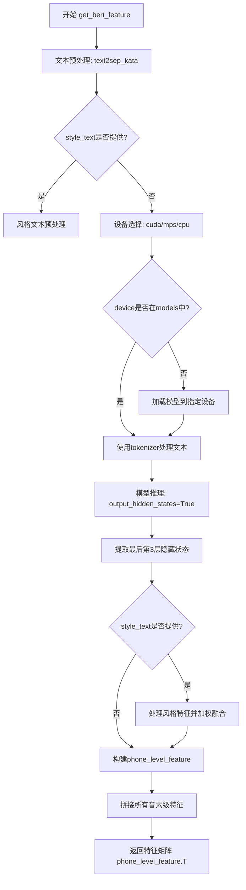
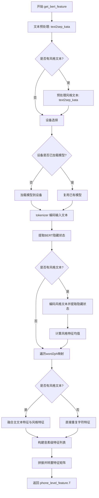
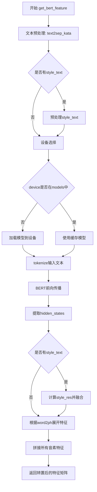

# `Bert-VITS2\text\japanese_bert.py` 详细设计文档

该代码使用DeBERTa日文字符模型提取文本特征向量，支持词级到音素级的特征映射，并可选地融入风格文本的特征，用于语音合成等任务。

## 整体流程



## 类结构

```
模块级
├── tokenizer (AutoTokenizer)
├── models (模型缓存字典)
└── get_bert_feature (全局函数)
```

## 全局变量及字段


### `LOCAL_PATH`
    
预训练DeBERTa v2大型日语字符模型的本地路径，用于加载模型和tokenizer

类型：`str`
    


### `tokenizer`
    
用于将输入文本分词为模型所需tensor格式的tokenizer实例，基于LOCAL_PATH对应的预训练模型

类型：`transformers.AutoTokenizer`
    


### `models`
    
缓存不同设备上已加载模型的字典，键为设备字符串(如'cpu'/'cuda'/'mps')，值为对应的AutoModelForMaskedLM模型实例

类型：`dict`
    


    

## 全局函数及方法


### `get_bert_feature`

该函数使用预训练的日语BERT模型（deberta-v2-large-japanese-char-wwm）将输入文本转换为BERT特征向量，支持可选的风格迁移功能，可根据word2ph映射将字符级别的特征扩展到音素级别，适用于语音合成等场景。

#### 参数

- `text`：`str`，需要提取特征的日语文本
- `word2ph`：`list` 或 `torch.Tensor`，文本字符到音素数量的映射数组，用于将字符级特征扩展到音素级
- `device`：`str`，计算设备，默认为 `config.bert_gen_config.device`（可选值：cuda/mps/cpu）
- `style_text`：`str | None`，可选的风格参考文本，用于风格迁移（可选）
- `style_weight`：`float`，风格融合权重，默认为 `0.7`，值越大风格特征占比越高

#### 返回值

`torch.Tensor`，返回转置后的音素级别特征矩阵，形状为 `[特征维度, 音素数量]`

#### 流程图



#### 带注释源码

```python
def get_bert_feature(
    text,                              # 输入的日语文本字符串
    word2ph,                          # 文本到音素数量的映射列表
    device=config.bert_gen_config.device,  # 计算设备，默认为配置中的设备
    style_text=None,                  # 可选的风格参考文本
    style_weight=0.7,                 # 风格融合权重，范围0-1
):
    # Step 1: 将输入文本转换为分离的片假名表示
    # text2sep_kata 返回元组，取第一个元素
    text = "".join(text2sep_kata(text)[0])
    
    # Step 2: 如果提供了风格文本，同样进行预处理
    if style_text:
        style_text = "".join(text2sep_kata(style_text)[0])
    
    # Step 3: 设备选择逻辑
    # 检测macOS平台是否可用MPS加速
    if (
        sys.platform == "darwin"
        and torch.backends.mps.is_available()
        and device == "cpu"
    ):
        device = "mps"  # 优先使用MPS设备
    if not device:
        device = "cuda"  # 默认使用CUDA
    
    # Step 4: 模型管理 - 按设备缓存模型实例
    # 避免重复加载模型，提高性能
    if device not in models.keys():
        models[device] = AutoModelForMaskedLM.from_pretrained(LOCAL_PATH).to(device)
    
    # Step 5: 提取输入文本的BERT特征
    with torch.no_grad():  # 禁用梯度计算以节省显存
        inputs = tokenizer(text, return_tensors="pt")  # tokenize为pytorch张量
        # 将所有输入张量移动到指定设备
        for i in inputs:
            inputs[i] = inputs[i].to(device)
        
        # 调用模型获取隐藏状态
        res = models[device](**inputs, output_hidden_states=True)
        # 提取倒数第3层的隐藏状态（-3:-2 选取倒数第3层）
        # torch.cat 在最后一维拼接，reshape为 [seq_len, hidden_dim]
        res = torch.cat(res["hidden_states"][-3:-2], -1)[0].cpu()
        
        # Step 6: 如果提供了风格文本，提取风格特征
        if style_text:
            style_inputs = tokenizer(style_text, return_tensors="pt")
            for i in style_inputs:
                style_inputs[i] = style_inputs[i].to(device)
            
            style_res = models[device](**style_inputs, output_hidden_states=True)
            style_res = torch.cat(style_res["hidden_states"][-3:-2], -1)[0].cpu()
            # 计算风格特征的均值向量
            style_res_mean = style_res.mean(0)

    # Step 7: 验证word2ph长度与文本长度匹配
    # 预留2个位置给特殊token（[CLS]和[SEP]）
    assert len(word2ph) == len(text) + 2
    
    word2phone = word2ph
    phone_level_feature = []
    
    # Step 8: 将字符级特征映射到音素级特征
    for i in range(len(word2phone)):
        if style_text:
            # 风格融合：主特征 * (1-weight) + 风格特征 * weight
            repeat_feature = (
                res[i].repeat(word2phone[i], 1) * (1 - style_weight)
                + style_res_mean.repeat(word2phone[i], 1) * style_weight
            )
        else:
            # 无风格文本时，直接重复字符特征
            repeat_feature = res[i].repeat(word2phone[i], 1)
        
        phone_level_feature.append(repeat_feature)

    # Step 9: 拼接所有音素级特征并转置
    # 最终形状: [特征维度, 音素数量]
    phone_level_feature = torch.cat(phone_level_feature, dim=0)

    return phone_level_feature.T
```

---

#### 关键组件信息

| 组件名称 | 描述 |
|---------|------|
| `LOCAL_PATH` | BERT模型本地路径 "./bert/deberta-v2-large-japanese-char-wwm" |
| `tokenizer` | Hugging Face分词器实例，用于文本编码 |
| `models` | 字典，按设备缓存已加载的BERT模型实例 |
| `text2sep_kata` | 文本预处理函数，将日文文本转换为分离的片假名 |

#### 潜在技术债务与优化空间

1. **模型缓存策略**：当前按设备缓存模型，若频繁切换设备可能导致显存碎片，建议增加模型缓存上限控制
2. **设备判断逻辑**：MPS设备判断嵌套在函数内部，可提取为独立的设备选择工具函数
3. **风格特征计算**：style_res_mean 在每轮调用时重新计算，若多次调用可考虑缓存
4. **硬编码层数**：`-3:-2` 隐藏层索引硬编码，建议提取为配置参数
5. **缺少错误处理**：模型加载失败、tokenizer异常等情况缺少try-except保护
6. **word2ph断言**：仅做长度断言，未校验数据类型和非负性

#### 其它说明

- **设计约束**：依赖Hugging Face Transformers库，需确保模型文件已下载至LOCAL_PATH
- **错误处理**：使用assert进行参数校验，模型加载失败会抛出异常
- **数据流**：text → token_ids → BERT hidden states → 字符级特征 → 音素级特征 → 输出
- **外部依赖**：`config`模块、`text.japanese.text2sep_kata`函数

## 关键组件


### 核心功能概述

该代码是一个日语BERT特征提取模块，基于DeBERTa-v2-large-japanese-char-wwm预训练模型，通过tokenizer将日语文本转换为词向量表示，并根据word2ph映射表将词级特征展开为音素级特征，支持风格迁移（style_text）功能，可用于文本转语音（TTS）任务。

### 文件运行流程

1. 初始化阶段：导入依赖库和配置，加载预训练的tokenizer
2. 首次调用get_bert_feature时：根据设备类型（MPS/CUDA/CPU）加载对应的模型到指定设备
3. 文本处理阶段：将输入文本通过text2sep_kata转换为分离的片假名
4. 特征提取阶段：将处理后的文本tokenize后输入BERT模型，获取最后一层隐藏状态
5. 风格融合阶段（如有style_text）：提取风格文本特征并与原文本特征加权融合
6. 音素映射阶段：根据word2ph将词级特征展开为音素级特征，最终返回转置后的特征矩阵

### 类与全局变量详细信息

#### 全局变量

**tokenizer**

- 类型: AutoTokenizer
- 描述: 预训练的日语DeBERTa分词器，用于将文本转换为模型输入token

**models**

- 类型: Dict[str, torch.nn.Module]
- 描述: 模型缓存字典，按设备名称（cpu/mps/cuda）缓存已加载的模型实例，避免重复加载

**LOCAL_PATH**

- 类型: str
- 描述: 预训练模型本地路径，指向DeBERTa-v2-large-japanese-char-wwm模型目录

### 函数详细信息

#### get_bert_feature

- 参数:
  - text (str): 输入的日语文本字符串
  - word2ph (List[int]): 词到音素的映射列表，表示每个词对应多少个音素
  - device (str, optional): 计算设备，默认为config.bert_gen_config.device
  - style_text (str, optional): 风格参考文本，用于风格迁移，默认为None
  - style_weight (float, optional): 风格融合权重，默认为0.7
- 返回值类型: torch.Tensor
- 返回值描述: 返回音素级别的特征矩阵，形状为(特征维度, 音素数量)

**Mermaid流程图**



**带注释源码**

```python
def get_bert_feature(
    text,
    word2ph,
    device=config.bert_gen_config.device,
    style_text=None,
    style_weight=0.7,
):
    # 使用text2sep_kata将文本转换为分离的片假名，并合并为连续字符串
    text = "".join(text2sep_kata(text)[0])
    
    # 如果存在风格文本，同样进行片假名转换处理
    if style_text:
        style_text = "".join(text2sep_kata(style_text)[0])
    
    # 设备选择逻辑：在macOS上优先使用MPS加速
    if (
        sys.platform == "darwin"
        and torch.backends.mps.is_available()
        and device == "cpu"
    ):
        device = "mps"
    
    # 如果未指定设备，默认使用CUDA
    if not device:
        device = "cuda"
    
    # 按设备缓存模型实例，避免重复加载
    if device not in models.keys():
        models[device] = AutoModelForMaskedLM.from_pretrained(LOCAL_PATH).to(device)
    
    # 禁用梯度计算以提升推理性能
    with torch.no_grad():
        # 对主文本进行tokenize并移动到指定设备
        inputs = tokenizer(text, return_tensors="pt")
        for i in inputs:
            inputs[i] = inputs[i].to(device)
        
        # 执行模型推理，获取所有隐藏状态
        res = models[device](**inputs, output_hidden_states=True)
        
        # 提取倒数第三层的隐藏状态（-3:-2取倒数第三层），并拼接为2D张量
        res = torch.cat(res["hidden_states"][-3:-2], -1)[0].cpu()
        
        # 如果存在风格文本，提取风格特征
        if style_text:
            style_inputs = tokenizer(style_text, return_tensors="pt")
            for i in style_inputs:
                style_inputs[i] = style_inputs[i].to(device)
            style_res = models[device](**style_inputs, output_hidden_states=True)
            style_res = torch.cat(style_res["hidden_states"][-3:-2], -1)[0].cpu()
            # 计算风格特征的平均值
            style_res_mean = style_res.mean(0)

    # 验证word2ph长度与文本长度（加2个token：CLS和SEP）匹配
    assert len(word2ph) == len(text) + 2
    word2phone = word2ph
    phone_level_feature = []
    
    # 遍历每个词，将词级特征展开为音素级特征
    for i in range(len(word2phone)):
        if style_text:
            # 使用风格权重融合主特征和风格特征，然后重复扩展
            repeat_feature = (
                res[i].repeat(word2phone[i], 1) * (1 - style_weight)
                + style_res_mean.repeat(word2phone[i], 1) * style_weight
            )
        else:
            # 直接重复词级特征到音素级
            repeat_feature = res[i].repeat(word2phone[i], 1)
        phone_level_feature.append(repeat_feature)

    # 拼接所有音素级特征
    phone_level_feature = torch.cat(phone_level_feature, dim=0)

    return phone_level_feature.T
```

### 关键组件信息

#### 张量索引与惰性加载

模型采用惰性加载策略，仅在首次调用时按设备加载模型到内存，通过`models`字典缓存已加载的模型实例，避免重复加载带来的性能开销。特征提取使用`torch.cat(res["hidden_states"][-3:-2], -1)`选择倒数第三层隐藏状态。

#### 反量化支持

虽然代码本身未直接实现反量化，但通过`torch.no_grad()`上下文管理器禁用梯度计算，间接实现了推理阶段的内存优化。

#### 量化策略

代码未包含量化相关实现，仅依赖预训练模型本身的权重格式，未来可考虑添加动态量化以进一步降低内存占用。

### 潜在技术债务与优化空间

1. **模型缓存机制不完善**: 使用普通字典存储模型，缺乏线程安全保护，多线程场景下可能触发竞态条件
2. **硬编码的模型路径**: LOCAL_PATH为固定路径，应移至config配置或支持环境变量注入
3. **错误处理缺失**: 缺少对tokenize失败、模型加载异常、设备不支持等情况的捕获与处理
4. **内存管理不当**: 风格特征`style_res_mean`在不使用时仍保留在GPU内存中，应显式释放
5. **缺少批处理支持**: 当前仅支持单文本处理，可扩展为批量处理提升吞吐量
6. **特征层硬编码**: `-3:-2`为magic number，应提取为配置参数

### 其它项目

#### 设计目标与约束

- **设计目标**: 为TTS系统提供高质量的日语BERT声学特征，支持风格迁移
- **约束条件**: 依赖特定预训练模型（deberta-v2-large-japanese-char-wwm），需保证模型文件存在

#### 错误处理与异常设计

- 仅包含长度断言`assert len(word2ph) == len(text) + 2`，缺乏系统性异常处理
- 建议添加：模型加载失败时降级到CPU、tokenize空文本时返回零张量、设备不支持时给出明确提示

#### 数据流与状态机

- 输入：原始日语文本 + 词音素映射表
- 中间态：token化后的tensor、模型隐藏状态、风格特征均值
- 输出：音素级特征矩阵（形状：特征维度×音素数）

#### 外部依赖与接口契约

- **transformers库**: 依赖AutoModelForMaskedLM和AutoTokenizer加载预训练模型
- **config模块**: 依赖config.bert_gen_config.device获取默认设备配置
- **text.japanese模块**: 依赖text2sep_kata函数进行日语文本预处理


## 问题及建议


### 已知问题

- **模型缓存逻辑缺陷**：当 `device` 参数变化时会重复加载模型，而非复用已加载的模型；且全局 `models` 字典缺少清理机制，长期运行会导致内存泄漏
- **变量作用域风险**：`style_res_mean` 仅在 `style_text` 存在时被定义，若后续代码意外使用该变量会引发 `NameError`
- **缺少输入校验**：未对 `text`、`style_text` 为空或 `word2ph` 长度异常进行捕获，断言失败信息不够友好
- **Tokenizer 参数硬编码**：`tokenizer` 调用时未设置 `padding`、`truncation`、`max_length` 等参数，长文本可能抛出异常
- **MPS 设备判断条件冗余**：当 `device` 显式传 `"cpu"` 时才尝试切换到 `"mps"`，逻辑不够直观，且未考虑其他平台兼容性
- **魔法数字与隐含假设**：`res["hidden_states"][-3:-2]` 的选取和 `output_hidden_states=True` 缺乏注释说明，后续维护困难
- **全局状态管理混乱**：`tokenizer` 和 `models` 作为全局变量，跨模块导入时可能出现初始化顺序问题
- **配置依赖不透明**：依赖 `config.bert_gen_config.device`，但代码中未体现配置来源，若配置缺失会导致属性错误

### 优化建议

- 引入模型单例模式或连接池，统一管理模型生命周期；添加 `models.clear()` 或按需卸载机制
- 对所有分支路径的变量进行预初始化，或使用 `Optional` 类型注解并添加空值检查
- 在函数入口添加 `text` 和 `word2ph` 的类型与长度校验，提供明确的错误提示
- 为 `tokenizer` 添加 `padding=True`、`truncation=True`、`max_length=512` 等参数，提升鲁棒性
- 简化设备选择逻辑，直接使用 `torch.cuda.is_available()` 和 `torch.backends.mps.is_available()` 判断，并支持配置优先
- 将 `-3:-2` 等关键参数提取为常量或配置项，添加文档注释说明选择依据
- 将 `tokenizer` 和 `models` 封装为类或依赖注入，避免全局状态导致的潜在冲突
- 明确 `config` 模块的导入来源，确保配置对象存在必要属性，建议添加类型注解和默认值 fallback

## 其它


### 设计目标与约束

本模块的核心设计目标是将日语文本转换为BERT模型产生的语义特征向量，用于后续的语音合成或文本处理任务。约束条件包括：1) 必须使用deberta-v2-large-japanese-char-wwm预训练模型；2) 支持设备灵活配置（cpu/cuda/mps）；3) 必须与text2sep_kata函数配合处理日文文本；4) word2ph参数长度必须等于文本长度加2（包含起始和结束标记）。

### 错误处理与异常设计

代码中的异常处理主要包括：1) assert语句验证word2ph长度与文本长度加2的一致性，不一致时抛出AssertionError；2) 模型加载失败时transformers库会抛出异常；3) tokenizer失败时会产生异常；4) 设备不支持时的隐式处理（自动切换）。建议增加：设备不可用时的明确异常抛出、模型加载失败的重试机制、输入文本有效性校验。

### 数据流与状态机

数据流如下：输入text和word2ph → text2sep_kata处理日文 → tokenizer分词 → 模型推理 → hidden_states提取 → 特征重复扩展 → 特征拼接返回。当存在style_text时，额外进行style特征提取并加权融合。状态机表现为：模型缓存状态（models字典）、设备状态管理、style_text是否存在的分支处理。

### 外部依赖与接口契约

外部依赖包括：1) torch库 - 张量计算；2) transformers库 - BERT模型加载；3) config模块 - 配置参数；4) text.japanese模块 - 日文文本处理函数text2sep_kata。接口契约：get_bert_feature(text: str, word2ph: List[int], device: str, style_text: Optional[str], style_weight: float) → torch.Tensor，返回形状为(特征维度, 帧数)的张量。

### 性能考虑与优化建议

当前实现存在以下性能问题：1) 模型在每次调用时检查device是否在models中，可移至函数外部初始化；2) style_text存在时重复计算style_res_mean，可缓存；3) 循环中逐个处理phoneme特征效率较低，可向量化；4) cpu()调用可考虑使用pin_memory加速数据传输。建议优化：使用模型缓存预热、特征计算向量化、考虑使用@torch.no_grad()装饰器。

### 安全性考虑

代码安全性风险较低，主要关注点：1) LOCAL_PATH路径遍历风险 - 建议验证路径合法性；2) 模型文件来源可信度 - 应确保从可信源加载；3) 输入文本长度无限制 - 可能导致内存问题，建议添加最大长度限制；4) device参数未做验证 - 建议添加设备可用性检查。

### 测试策略

建议添加以下测试用例：1) 基础功能测试 - 验证正常文本输入返回正确形状特征；2) 设备测试 - 验证cpu/cuda/mps各设备正常运行；3) style_text测试 - 验证样式迁移功能正确工作；4) 边界测试 - 空文本、特殊字符、超长文本；5) 性能测试 - 批量处理延迟和内存占用；6) 兼容性测试 - 不同版本的transformers库。

### 部署注意事项

部署时需注意：1) 模型文件本地缓存 - 需要预先下载deberta-v2-large-japanese-char-wwm到LOCAL_PATH；2) 首次加载耗时较长 - 建议实现模型预加载和预热；3) 内存占用 - 大模型约1GB显存，需根据设备配置合理设置batch_size；4) 多进程环境下的模型缓存 - 需考虑进程间共享或独立加载；5) MPS设备限制 - 仅支持macOS且需M1/M2芯片。

    