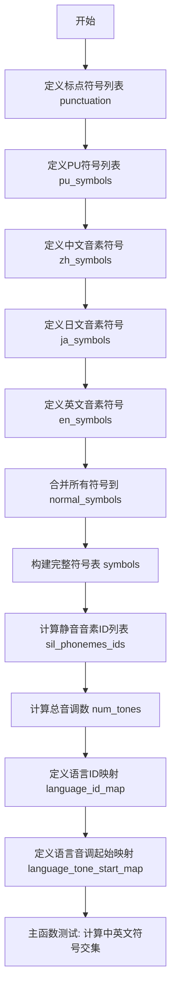
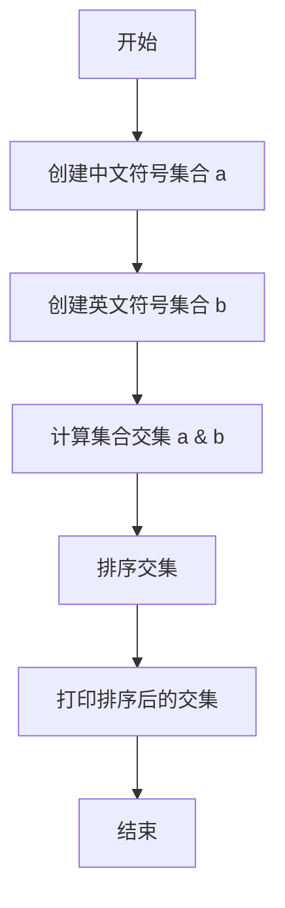

# `Bert-VITS2\text\symbols.py` 详细设计文档

该文件定义了多语言语音合成系统的音素符号表和语言映射配置，包含中文、日文和英文的音素符号集合，以及语言ID、音调数量的映射关系，用于支撑跨语言的语音合成功能。

## 整体流程



## 类结构

```
无类定义 (纯配置模块)
├── 全局变量区
│   ├── 标点符号配置
│   ├── 中文音素配置
│   ├── 日文音素配置
│   ├── 英文音素配置
│   └── 语言映射配置
└── 主函数入口
```

## 全局变量及字段


### `punctuation`
    
标点符号列表，包含常见的英文标点符号

类型：`List[str]`
    


### `pu_symbols`
    
标点符号和特殊符号列表，包含punctuation加上SP和UNK

类型：`List[str]`
    


### `pad`
    
填充符标记，用于序列padding操作

类型：`str`
    


### `zh_symbols`
    
中文音素符号列表，包含所有可能的中文音节

类型：`List[str]`
    


### `num_zh_tones`
    
中文音调数量，值为6

类型：`int`
    


### `ja_symbols`
    
日文音素符号列表，包含所有可能的日语音节

类型：`List[str]`
    


### `num_ja_tones`
    
日文音调数量，值为2

类型：`int`
    


### `en_symbols`
    
英文音素符号列表，包含所有可能的英语音素（ARPAbet）

类型：`List[str]`
    


### `num_en_tones`
    
英文音调数量，值为4

类型：`int`
    


### `normal_symbols`
    
归一化符号列表，去重排序后的中英日符号集合

类型：`List[str]`
    


### `symbols`
    
完整符号列表，包含pad、normal_symbols和pu_symbols

类型：`List[str]`
    


### `sil_phonemes_ids`
    
静音音素的索引列表，对应pu_symbols在symbols中的位置

类型：`List[int]`
    


### `num_tones`
    
总音调数量，为中英日音调数量之和

类型：`int`
    


### `language_id_map`
    
语言标识映射，将ZH/JP/EN映射到0/1/2

类型：`Dict[str, int]`
    


### `num_languages`
    
支持的语言数量，值为3

类型：`int`
    


### `language_tone_start_map`
    
各语言音调起始索引映射，用于多语言音调处理

类型：`Dict[str, int]`
    


    

## 全局函数及方法


### `__main__`

这是程序的入口点，当脚本直接运行时执行。它计算中文符号集合和英文符号集合的交集，排序后打印出共有符号。

参数：
- 无

返回值：
- 无

#### 流程图



#### 带注释源码

```python
if __name__ == "__main__":
    # 将中文符号列表转换为集合，去除重复项
    a = set(zh_symbols)
    # 将英文符号列表转换为集合，去除重复项
    b = set(en_symbols)
    # 计算两个集合的交集，排序后打印共有符号
    print(sorted(a & b))
```

## 关键组件


### 标点符号与特殊符号定义

定义了标点符号列表和特殊符号（SP未知符号），用于处理文本中的标点情况和未识别字符。

### 中文音素符号集

包含完整的汉语拼音音素符号列表，包括声母、韵母及其组合，共定义6个声调。

### 日文音素符号集

包含日语假名和罗马字发音符号列表，涵盖清音、浊音、拗音等，共定义2个声调。

### 英文音素符号集

包含CMU音素字典的英语发音符号列表，涵盖元音和辅音，共定义4个声调。

### 符号合并与索引机制

将中文、日文、英文符号集合并去重后，加上填充符构建完整符号表，并提供sil_phonemes_ids用于快速查找静音音素索引。

### 音调数量管理

通过num_zh_tones、num_ja_tones、num_en_tones分别管理各语言声调数量，num_tones存储总声调数。

### 语言映射系统

通过language_id_map将语言简写映射为ID，language_tone_start_map定义各语言声调在统一声调空间中的起始位置。


## 问题及建议


### 已知问题

- **硬编码语言配置**：语言ID映射、音调数量等采用硬编码方式，新增语言需修改多处代码，扩展性差
- **magic number 缺乏注释**：`num_zh_tones = 6`、`num_ja_tones = 2`、`num_en_tones = 4` 等数值无任何注释说明其含义
- **模块级计算开销**：`sil_phonemes_ids` 在模块导入时即执行列表推导式计算，增加导入时间
- **数据分散无结构**：符号定义、音调数量、语言映射等信息分散在不同列表中，缺乏统一的数据结构组织
- **调试代码混入主代码**：`if __name__ == "__main__":` 块中的测试代码不应存在于生产模块中
- **未使用常量管理**：语言相关配置应使用枚举或数据类管理，而非简单字典和变量
- **符号合并效率**：通过 `set()` 去重的方式对于大型列表有一定性能开销，可考虑预先验证输入数据

### 优化建议

- 将语言相关配置封装为数据类或配置对象，提高可维护性和扩展性
- 为所有 magic number 添加文档注释说明其含义和来源
- 延迟计算 `sil_phonemes_ids`，或在需要时通过函数动态获取
- 将符号、音调等数据组织为结构化的配置对象，便于管理和扩展
- 移除或重构 `if __name__ == "__main__":` 块中的调试代码
- 考虑使用 `Enum` 或 `dataclass` 替代字典定义语言ID映射
- 验证输入数据唯一性，或使用预去重的符号列表避免运行时去重开销

## 其它


### 设计目标与约束

本模块的设计目标是构建一个统一的多语言音素符号系统，支持中文（ZH）、日文（JP）和英文（EN）三种语言的语音处理。约束包括：1）所有符号必须唯一且可排序；2）语言ID必须从0开始连续编号；3）音调编号必须按语言顺序连续排列；4）特殊符号（填充符、未知符）必须统一管理。

### 错误处理与异常设计

本模块为纯数据定义模块，不涉及运行时错误处理。潜在错误包括：1）符号重复定义会导致集合去重后顺序不确定；2）语言标识符拼写错误会导致映射失败；3）音调起始位置计算错误会导致语言ID冲突。若发生错误，应在模块加载时通过断言或异常提示开发者检查符号定义。

### 数据流与状态机

数据流：语言符号定义 → 集合去重 → 排序 → 合并特殊符号 → 生成符号索引映射 → 计算语言音调范围。状态机不适用本模块，因其为无状态的配置初始化过程。

### 外部依赖与接口契约

外部依赖：无（纯标准库实现）。接口契约：1）symbols列表的第一个元素必须为填充符（pad）；2）language_id_map的键必须为{"ZH", "JP", "EN"}；3）language_tone_start_map的键必须与language_id_map一致；4）sil_phonemes_ids必须为pu_symbols中所有符号在symbols中的索引位置。

### 性能考虑与优化空间

性能：符号去重和排序的时间复杂度为O(n log n)，其中n为所有符号总数，当前规模下可忽略。优化空间：1）可将符号表持久化为配置文件，运行时动态加载；2）对于超大规模符号集，可使用哈希表替代列表索引以提高查询效率；3）可添加符号到ID的预计算缓存。

### 兼容性考虑

兼容性：1）Python 3.6+保证字典有序；2）符号定义遵循Unicode标准；3）不同语言符号集可能存在交集（如"a"在三种语言中都存在），已通过集合去重处理；4）未来添加新语言时需同步更新language_id_map、language_tone_start_map和num_tones。

### 使用示例与调用流程

调用流程：1）导入symbols、language_id_map等变量；2）使用symbols.index(symbol)获取音素ID；3）使用language_id_map["ZH"]获取语言ID；4）根据language_tone_start_map计算特定语言的音调范围。示例：获取中文"a"音素的ID → symbols.index("a")，获取日文音调数量 → num_ja_tones。

### 测试策略

测试用例：1）验证symbols首个元素为pad；2）验证所有语言符号无重复（除交集外）；3）验证language_tone_start_map计算的音调范围无重叠；4）验证sil_phonemes_ids中所有ID在symbols范围内；5）验证num_tones等于各语言音调之和；6）运行__main__中的交集测试验证中英文符号重叠情况。

### 版本历史与变更记录

初始版本（v1.0）：支持中文、日文、英文三种语言的音素符号定义，包含语言ID映射和音调起始位置计算功能。

### 维护注意事项

维护注意事项：1）添加新语言时需在language_id_map、language_tone_start_map中同步更新；2）修改符号集后需重新验证sil_phonemes_ids的准确性；3）建议使用版本号管理符号集的变更；4）保持symbols的排序一致性以确保跨环境的可复现性。

    