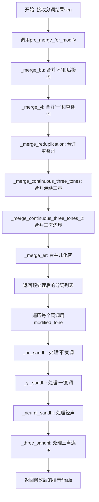
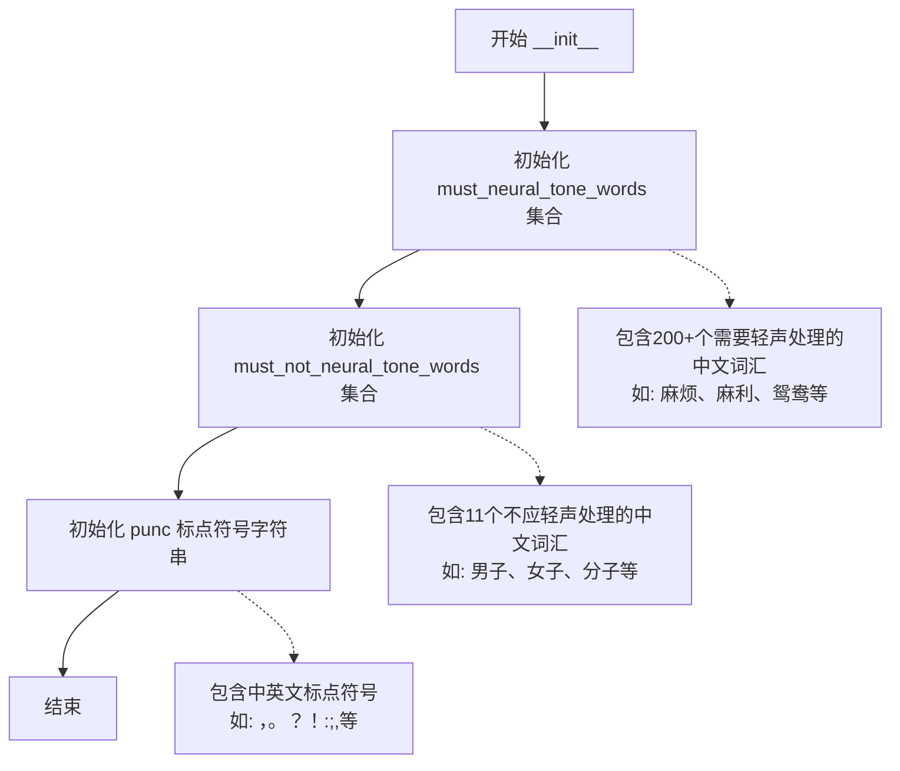
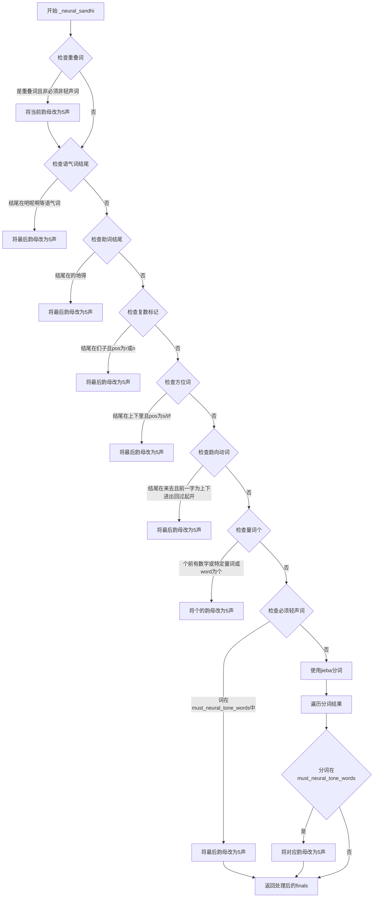
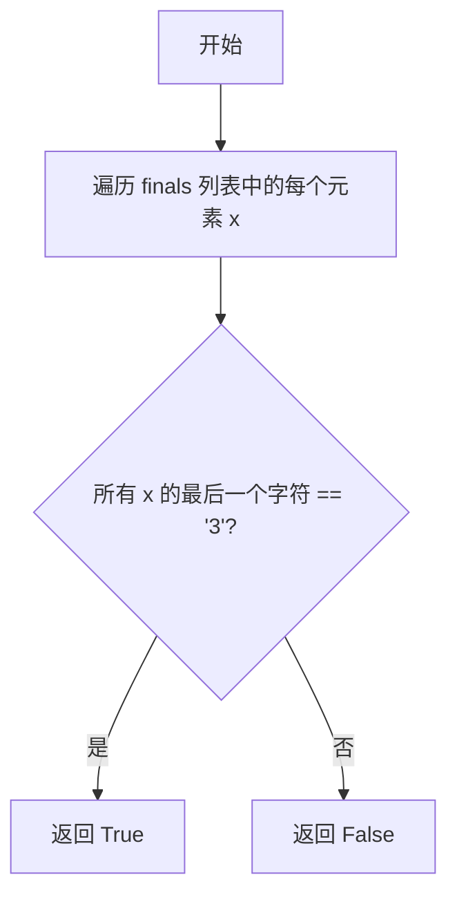
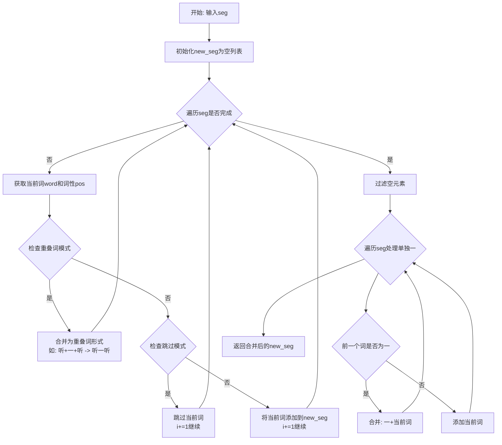
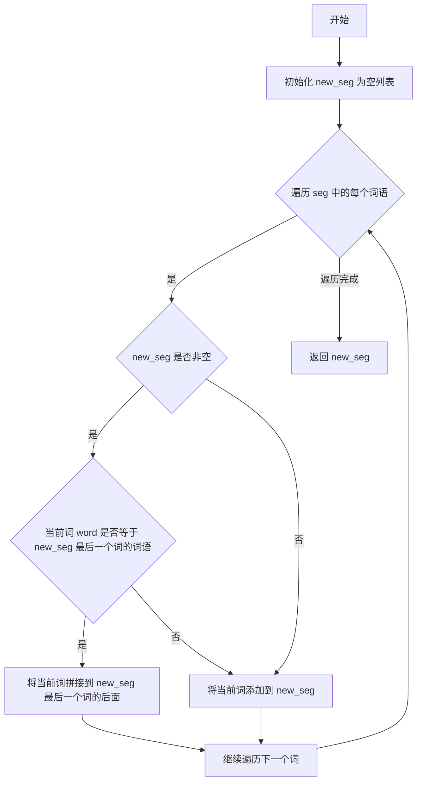
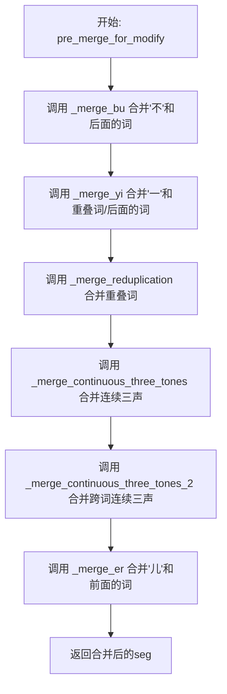

# `Bert-VITS2\text\tone_sandhi.py` 详细设计文档

这是一个中文声调变调处理模块，主要实现汉语拼音的变调规则处理，包括轻声、'不'变调、'一'变调、三声连读变调、儿化音合并和重叠词处理等功能，通过jieba分词和pypinyin获取拼音后按照规则修改声调。

## 整体流程



## 类结构

```
ToneSandhi (声调变调处理类)
└── 静态规则集合
    ├── must_neural_tone_words (必须读轻声的词语)
    ├── must_not_neural_tone_words (不能读轻声的词语)
    └── punc (标点符号集合)
```

## 全局变量及字段


### `ToneSandhi.must_neural_tone_words`
    
必须读作轻声的词语集合，包含约400+个常用词

类型：`Dict[str, str]`
    


### `ToneSandhi.must_not_neural_tone_words`
    
不能读作轻声的词语集合，如'男子'、'电子'等

类型：`Dict[str, str]`
    


### `ToneSandhi.punc`
    
中文标点符号集合

类型：`str`
    
    

## 全局函数及方法


### `ToneSandhi.__init__`

这是 `ToneSandhi` 类的构造函数，用于初始化处理中文声调连读变调所需的词表和标点符号集合。

参数：

- `self`：隐式参数，当前实例对象

返回值：`None`，构造函数无返回值，仅初始化实例属性

#### 流程图



#### 带注释源码

```python
def __init__(self):
    # 初始化必须处理为轻声的词语集合
    # 这些词语在中文中习惯读作轻声，如"麻烦"、"麻利"、"鸳鸯"等
    # 用于后续声调处理时判断是否需要将最后一个音节改为轻声
    self.must_neural_tone_words = {
        "麻烦", "麻利", "鸳鸯", "高粱", "骨头", "骆驼", "马虎", "首饰",
        "馒头", "馄饨", "风筝", "难为", "队伍", "阔气", "闺女", "门道",
        "锄头", "铺盖", "铃铛", "铁匠", "钥匙", "里脊", "里头", "部分",
        "那么", "道士", "造化", "迷糊", "连累", "这么", "这个", "运气",
        # ... 共200+个词汇
    }
    
    # 初始化不应处理为轻声的词语集合
    # 这些词语虽然形式上可能符合轻声规则，但实际发音不应变轻声
    # 如"男子"、"女子"、"分子"等
    self.must_not_neural_tone_words = {
        "男子", "女子", "分子", "原子", "量子", "莲子", "石子", "瓜子",
        "电子", "人人", "虎虎",
    }
    
    # 初始化标点符号集合，用于后续判断"一"后面是否为标点符号
    # 如果"一"后面是标点符号，则仍读一声
    self.punc = "：，；。？！""''':,;.?!"
```


### `ToneSandhi._neural_sandhi`

该函数是中文语音变调处理模块的核心方法，主要负责处理中文词语的轻声（neutral tone）变调规则。根据词语的词性、结尾字符以及特定词汇列表，将拼音韵母的声调调整为轻声（标记为"5"）。

参数：

- `word`：`str`，待处理的中文词语
- `pos`：`str`，jieba分词后的词性标注（如"n"名词、"v"动词、"a"形容词等）
- `finals`：`List[str]`，原始拼音韵母列表，每个元素为带声调的韵母字符串（如"ia1"、"i3"）

返回值：`List[str]`，处理后的拼音韵母列表，轻声音节将声调调整为"5"

#### 流程图



#### 带注释源码

```python
def _neural_sandhi(self, word: str, pos: str, finals: List[str]) -> List[str]:
    """
    处理中文词语的轻声变调规则
    
    参数:
        word: 待处理的中文词语
        pos: 词性标注 (n=名词, v=动词, a=形容词, s=方位词等)
        finals: 拼音韵母列表，每个元素为带声调的字符串
    
    返回:
        处理后的拼音韵母列表
    """
    
    # ========== 处理重叠词 (reduplication words) ==========
    # 例如: 奶奶(n.), 试试(v.), 旺旺(a.)
    # 规则: 重叠词的后一个字读轻声
    for j, item in enumerate(word):
        if (
            j - 1 >= 0  # 确保不是第一个字符
            and item == word[j - 1]  # 当前字符与前一字符相同（重叠）
            and pos[0] in {"n", "v", "a"}  # 词性为名词、动词或形容词
            and word not in self.must_not_neural_tone_words  # 不在必须不读轻声的列表中
        ):
            # 将声调改为5（轻声）
            finals[j] = finals[j][:-1] + "5"
    
    # ========== 处理语气词结尾 ==========
    # 例如: 走吧, 怎么办呢, 啊, 呐, 噻, 嘛, 吖, 嗨, 哦, 哒, 额, 哩, 哟, 喽, 耶, 喔, 诶
    ge_idx = word.find("个")
    if len(word) >= 1 and word[-1] in "吧呢啊呐噻嘛吖嗨呐哦哒额滴哩哟喽啰耶喔诶":
        finals[-1] = finals[-1][:-1] + "5"
    
    # ========== 处理助词 "的/地/得" ==========
    elif len(word) >= 1 and word[-1] in "的地得":
        finals[-1] = finals[-1][:-1] + "5"
    
    # ========== 处理复数标记 "们" 和名词/代词后缀 "子" ==========
    # 例如: 我们, 孩子们 (但排除: 男子, 女子, 分子等)
    elif (
        len(word) > 1
        and word[-1] in "们子"
        and pos in {"r", "n"}  # 代词(r)或名词(n)
        and word not in self.must_not_neural_tone_words
    ):
        finals[-1] = finals[-1][:-1] + "5"
    
    # ========== 处理方位词 ==========
    # 例如: 桌上, 地下, 家里
    elif len(word) > 1 and word[-1] in "上下里" and pos in {"s", "l", "f"}:
        finals[-1] = finals[-1][:-1] + "5"
    
    # ========== 处理趋向动词 ==========
    # 例如: 上来, 下去, 进来, 出去, 回来, 过去, 起来, 过来, 开来
    elif len(word) > 1 and word[-1] in "来去" and word[-2] in "上下进出回过起开":
        finals[-1] = finals[-1][:-1] + "5"
    
    # ========== 处理量词 "个" ==========
    # 个做量词时读轻声，例如: 一个, 两个, 几个, 这个, 那个
    elif (
        ge_idx >= 1
        and (
            word[ge_idx - 1].isnumeric()  # 数字: 1个, 2个
            or word[ge_idx - 1] in "几有两半多各整每做是"  # 指示代词/量词
        )
    ) or word == "个":
        finals[ge_idx] = finals[ge_idx][:-1] + "5"
    
    # ========== 处理必须读轻声的词汇 ==========
    # 从预定义的必须读轻声词语列表中查找
    else:
        if (
            word in self.must_neural_tone_words
            or word[-2:] in self.must_neural_tone_words  # 检查词的后两个字
        ):
            finals[-1] = finals[-1][:-1] + "5"
    
    # ========== 使用jieba分词处理复合词 ==========
    # 将词语分成两部分分别处理
    word_list = self._split_word(word)
    
    # 根据分词结果分割韵母列表
    finals_list = [finals[: len(word_list[0])], finals[len(word_list[0]) :]]
    
    # 遍历分词后的各部分，检查是否在必须轻声词列表中
    for i, word in enumerate(word_list):
        # conventional neutral in Chinese (常规轻声词)
        if (
            word in self.must_neural_tone_words
            or word[-2:] in self.must_neural_tone_words
        ):
            finals_list[i][-1] = finals_list[i][-1][:-1] + "5"
    
    # 合并处理后的韵母列表
    finals = sum(finals_list, [])
    return finals
```


### `ToneSandhi._bu_sandhi`

该函数用于处理中文声调变化中的"不"字变调规则，包括将"不"在去声（第四声）前变为第二声，以及将三字词中间位置的"不"变为轻声。

参数：

- `word`：`str`，输入的中文词语
- `finals`：`List[str]`，词语的拼音韵母列表（每个元素为带声调的拼音，如"bu4"）

返回值：`List[str]`，处理后的拼音韵母列表

#### 流程图

```mermaid
flowchart TD
    A[开始 _bu_sandhi] --> B{word长度是否为3且word[1]是否为'不'}
    B -->|是| C[将finals[1]的声调改为5<br>例如: bu4 → bu5]
    B -->|否| D[遍历word中的每个字符]
    D --> E{当前字符是否为'不'且下一个字符存在且下一个韵母声调为4}
    E -->|是| F[将当前'不'的声调改为2<br>例如: bu4 → bu2]
    E -->|否| G[继续遍历]
    D --> H[遍历完成]
    C --> I[返回处理后的finals列表]
    F --> I
    G --> H
    H --> I
```

#### 带注释源码

```python
def _bu_sandhi(self, word: str, finals: List[str]) -> List[str]:
    """
    处理"不"字的声调变化规则
    
    规则1: 三字词中间位置的"不"读轻声(5)
        例如: "看不懂" 中的 "不" 变为 bu5
    规则2: "不"在去声(第4声)前变为第2声
        例如: "不怕" 中的 "不" 变为 bu2
    
    Args:
        word: 输入的中文词语
        finals: 词语的拼音韵母列表,每个元素为带声调的拼音(如'bu4')
    
    Returns:
        处理后的拼音韵母列表
    """
    # 处理三字词中间位置的"不"读轻声的情况
    # 例如: "看不懂" -> finals从[bu4, dong4]变为[bu5, dong4]
    if len(word) == 3 and word[1] == "不":
        # 将"不"的声调从4改为5(轻声)
        finals[1] = finals[1][:-1] + "5"
    else:
        # 遍历词语中的每个字符,查找"不"字
        for i, char in enumerate(word):
            # "不"在去声(第4声)前应该变为第2声
            # 例如: "不怕" -> "不怕"中"不"读bu2
            if char == "不" and i + 1 < len(word) and finals[i + 1][-1] == "4":
                # 将"不"的声调从4改为2
                finals[i] = finals[i][:-1] + "2"
    
    return finals
```


### `ToneSandhi._yi_sandhi`

该方法用于处理中文声调中的"一"变调规则。根据"一"在词中的位置和后续字符的声调，将其调整为正确的声调（一声、二声、四声或轻声）。

参数：

- `word`：`str`，需要处理变调的汉字词语
- `finals`：`List[str]`，词语中每个字符的拼音韵母（带声调），如 `['yi1', 'tian1']`

返回值：`List[str]`，变调处理后的拼音韵母列表

#### 流程图

```mermaid
flowchart TD
    A[开始: _yi_sandhi] --> B{word中是否包含"一"}
    B -->|否| C[返回原始finals]
    B -->|是| D{word是否为数字序列}
    D -->|是| C
    D -->|否| E{word长度为3且"一"在中间<br/>且首尾字符相同}
    E -->|是| F[将"一"改为轻声yi5<br/>finals[1] = finals[1][:-1] + '5']
    E -->|否| G{word是否以"第一"开头}
    G -->|是| H[将"一"改为一声yi1<br/>finals[1] = finals[1][:-1] + '1']
    G -->|否| I[遍历word中的每个"一"]
    I --> J{后续字符是否存在}
    J -->|否| L[返回处理后的finals]
    J -->|是| K{后续字符声调是否为4}
    K -->|是| M[将"一"改为二声yi2<br/>finals[i] = finals[i][:-1] + '2']
    K -->|否| N{后续字符是否为标点}
    N -->|是| L
    N -->|否| O[将"一"改为四声yi4<br/>finals[i] = finals[i][:-1] + '4']
    M --> L
    O --> L
    F --> L
    H --> L
```

#### 带注释源码

```python
def _yi_sandhi(self, word: str, finals: List[str]) -> List[str]:
    # 场景1: "一"在数字序列中，如"二零零"、"一零一"等
    # 数字序列中的"一"不变调，返回原始finals
    if word.find("一") != -1 and all(
        [item.isnumeric() for item in word if item != "一"]
    ):
        return finals
    
    # 场景2: "一"在重叠词中间，如"看一看"、"想一想"
    # 重叠词中间的"一"读轻声yi5
    elif len(word) == 3 and word[1] == "一" and word[0] == word[-1]:
        finals[1] = finals[1][:-1] + "5"
    
    # 场景3: "一"作为序数词的一部分，如"第一"、"第十"
    # 序数词中的"一"读一声yi1
    elif word.startswith("第一"):
        finals[1] = finals[1][:-1] + "1"
    
    # 场景4: 一般情况，根据后续字符的声调决定变调
    else:
        for i, char in enumerate(word):
            if char == "一" and i + 1 < len(word):
                # "一"在第四声(去声)前读第二声yi2，如"一段"、"一夜"
                if finals[i + 1][-1] == "4":
                    finals[i] = finals[i][:-1] + "2"
                # "一"在非第四声前读第四声yi4，如"一天"、"一年"
                else:
                    # 如果"一"后面是标点符号，仍读原声(一声)
                    if word[i + 1] not in self.punc:
                        finals[i] = finals[i][:-1] + "4"
    
    return finals
```


### ToneSandhi._split_word

该方法用于将一个词语分割成两个子词。它使用结巴分词器的搜索模式进行粗粒度切分，然后根据子词在原词中的位置将其拆分为两部分返回。

参数：

- `word`：`str`，需要分割的词语

返回值：`List[str]`，包含两个子词的列表，通常是 [前缀部分, 后缀部分] 或 [较短的子词, 剩余部分]

#### 流程图

```mermaid
flowchart TD
    A[开始] --> B[调用 jieba.cut_for_search 切分词语]
    B --> C[将子词按长度升序排序]
    C --> D[获取最短的子词 first_subword]
    D --> E[查找 first_subword 在原词中的位置 first_begin_idx]
    E --> F{first_begin_idx == 0?}
    F -->|是| G[second_subword = word[len(first_subword):]]
    G --> H[new_word_list = [first_subword, second_subword]]
    F -->|否| I[second_subword = word[: -len(first_subword)]]
    I --> H
    H --> J[返回 new_word_list]
    J --> K[结束]
```

#### 带注释源码

```python
def _split_word(self, word: str) -> List[str]:
    """
    将词语分割成两个子词
    
    该方法使用结巴分词的搜索模式进行粗粒度切分，
    然后根据子词在原词中的位置将其拆分为两部分返回。
    主要用于处理复合词或多音节词的分割，以便后续进行声调处理。
    
    参数:
        word: str, 需要分割的词语，如 "蒙古包"、"老虎" 等复合词
        
    返回:
        List[str]: 包含两个子词的列表
            - 如果最短子词在开头: [最短子词, 剩余部分]
            - 如果最短子词在结尾: [剩余部分, 最短子词]
    """
    # 使用结巴分词的搜索模式进行切分，返回所有可能的切分结果
    # 例如: "蒙古包" 可能返回 ["蒙古", "蒙古包", "包"]
    word_list = jieba.cut_for_search(word)
    word_list = sorted(word_list, key=lambda i: len(i), reverse=False)
    
    # 获取最短的子词（通常是词根或常用单字）
    first_subword = word_list[0]
    
    # 查找该最短子词在原词中的起始位置
    first_begin_idx = word.find(first_subword)
    
    # 根据最短子词的位置决定分割方式
    if first_begin_idx == 0:
        # 最短子词在开头，说明它是前缀
        # second_subword 为剩余的后缀部分
        second_subword = word[len(first_subword):]
        new_word_list = [first_subword, second_subword]
    else:
        # 最短子词在结尾或中间，说明它是后缀
        # second_subword 为前缀部分
        second_subword = word[: -len(first_subword)]
        new_word_list = [second_subword, first_subword]
    
    return new_word_list
```


### ToneSandhi._three_sandhi

该方法是ToneSandhi类的核心方法之一，专门用于处理中文语音中的三声连读变调现象（Third Tone Sandhi）。当两个或多个三声音节连续出现时，根据普通话规则，第一个三声音节需要变为二声。该方法根据词长和音节分布情况，应用不同的变调规则，包括双音节词、三音节词和四字成语的特殊处理。

参数：
- `word`：`str`，待处理的中文词语
- `finals`：`List[str]`，词语的拼音韵母列表，每个元素包含声调和韵母信息（如"ia1"、"i3"等）

返回值：`List[str]`，处理后的拼音韵母列表，三声已根据规则变调为二声

#### 流程图

```mermaid
flowchart TD
    A[开始 _three_sandhi] --> B{词长度 == 2?}
    B -->|是| C{所有音节都是三声?}
    C -->|是| D[将第一个音节改为二声]
    C -->|否| E[不修改]
    D --> Z[返回 finals]
    E --> Z
    B -->|否| F{词长度 == 3?}
    F -->|是| G[使用 _split_word 分割词]
    G --> H{所有音节都是三声?}
    H -->|是| I{第一个子词长度 == 2?}
    I -->|是| J[将前两个音节都改为二声]
    I -->|否| K[将第二个子词的音节改为二声]
    H -->|否| L[分解 finals_list 为两个子列表]
    L --> M{第一个子列表全为三声且长度为2?}
    M -->|是| N[将该子列表第一个音节改为二声]
    M -->|否| O{第二个子列表不是全三声<br/>且第一个音节是三声<br/>且第一个子列表最后一个音节是三声?}
    O -->|是| P[将第一个子列表最后一个音节改为二声]
    O -->|否| Q[不修改]
    N --> R[合并子列表]
    P --> R
    Q --> R
    R --> Z
    F -->|否| S{词长度 == 4?}
    S -->|是| T[将 finals 分为两组 [0:2] 和 [2:]]
    T --> U[遍历两组]
    U --> V{该组所有音节都是三声?}
    V -->|是| W[将该组第一个音节改为二声]
    V -->|否| X[不修改]
    W --> Y[合并结果]
    X --> Y
    Y --> Z
    S -->|否| Z
```

#### 带注释源码

```python
def _three_sandhi(self, word: str, finals: List[str]) -> List[str]:
    """
    处理三声连读变调（Third Tone Sandhi）
    
    三声连读规则：
    - 两个三声音节相连，第一个变为二声
    - 三个或四个音节根据词的结构和位置进行变调
    
    参数:
        word: 中文词语
        finals: 拼音韵母列表，如 ['ia1', 'i3']
    
    返回:
        处理后的拼音韵母列表
    """
    
    # 情况1：双音节词（2个字）
    # 如果词长度为2，且所有音节都是三声，将第一个音节改为二声
    # 例如："蒙古" -> 两个三声连读，第一个变二声
    if len(word) == 2 and self._all_tone_three(finals):
        finals[0] = finals[0][:-1] + "2"  # 将 '3' 替换为 '2'
    
    # 情况2：三音节词（3个字）
    elif len(word) == 3:
        # 使用 _split_word 将词语分割为两个子词
        # 例如："蒙古包" -> ['蒙古', '包']
        word_list = self._split_word(word)
        
        if self._all_tone_three(finals):
            # 如果所有音节都是三声
            # 模式A：双音节 + 单音节（如"蒙古/包"）
            # 两个三声相连，需要变调
            if len(word_list[0]) == 2:
                finals[0] = finals[0][:-1] + "2"
                finals[1] = finals[1][:-1] + "2"
            
            # 模式B：单音节 + 双音节（如"纸/老虎"）
            # 只有后两个音节是三声连读
            elif len(word_list[0]) == 1:
                finals[1] = finals[1][:-1] + "2"
        
        else:
            # 不是所有音节都是三声，需要更细致的分析
            # 将 finals 按子词长度分割
            # 例如：finals = ['a', 'i', 'u']，word_list[0] = '好'（1个字）
            # 则 finals_list = [['a'], ['i', 'u']]
            finals_list = [finals[: len(word_list[0])], finals[len(word_list[0]) :]]
            
            if len(finals_list) == 2:
                for i, sub in enumerate(finals_list):
                    # 情况1：某个子词全部是三声且长度为2
                    # 例如："所有/人" -> "所"和"有"都是三声
                    if self._all_tone_three(sub) and len(sub) == 2:
                        finals_list[i][0] = finals_list[i][0][:-1] + "2"
                    
                    # 情况2：第二个子词不是全三声，但满足特定模式
                    # 例如："好/喜欢" -> "好"是三声，"喜欢"的"喜"是三声
                    elif (
                        i == 1  # 第二个子词
                        and not self._all_tone_three(sub)  # 不是全三声
                        and finals_list[i][0][-1] == "3"  # 第一个音节是三声
                        and finals_list[0][-1][-1] == "3"  # 前一个子词最后一个音节是三声
                    ):
                        # 将前一个子词的最后一个音节改为二声
                        finals_list[0][-1] = finals_list[0][-1][:-1] + "2"
                    
                    # 合并子列表
                    finals = sum(finals_list, [])
    
    # 情况3：四字成语（4个字）
    # 将成语分为两个双音节词处理
    elif len(word) == 4:
        # 将 finals 分成两组：[前两个字, 后两个字]
        # 例如："蒙古草原" -> ['ia1', '3'], ['ao3', '3']
        finals_list = [finals[:2], finals[2:]]
        finals = []
        
        for sub in finals_list:
            # 如果该部分所有音节都是三声，将第一个音节改为二声
            # 例如："蒙古"（都是三声）-> "蒙"变二声
            if self._all_tone_three(sub):
                sub[0] = sub[0][:-1] + "2"
            finals += sub
    
    return finals
```

#### 辅助方法：_all_tone_three

```python
def _all_tone_three(self, finals: List[str]) -> bool:
    """
    检查是否所有音节都是三声
    
    参数:
        finals: 拼音韵母列表
    
    返回:
        如果所有音节都是三声返回True，否则返回False
    """
    return all(x[-1] == "3" for x in finals)
```

#### 辅助方法：_split_word

```python
def _split_word(self, word: str) -> List[str]:
    """
    使用结巴分词将词语分割为两个子词
    用于处理三音节词的情况，确定哪个部分是双音节词
    """
    word_list = jieba.cut_for_search(word)
    # 按长度升序排列，短词在前
    word_list = sorted(word_list, key=lambda i: len(i), reverse=False)
    first_subword = word_list[0]
    first_begin_idx = word.find(first_subword)
    
    if first_begin_idx == 0:
        # 子词在开头，如"蒙古/包"
        second_subword = word[len(first_subword):]
        new_word_list = [first_subword, second_subword]
    else:
        # 子词在结尾，如"纸/老虎"
        second_subword = word[:-len(first_subword)]
        new_word_list = [second_subword, first_subword]
    
    return new_word_list
```


### `ToneSandhi._all_tone_three`

这是一个辅助方法，用于检查拼音韵母列表（finals）中的所有韵母是否都是第三声（tone 3）。它通过遍历列表并检查每个元素的最后一个字符是否为"3"来判断。

参数：

- `finals`：`List[str]`，拼音韵母列表，每个元素是带声调的韵母字符串（如 "ia1", "i3" 等）

返回值：`bool`，如果所有韵母都是第三声则返回 `True`，否则返回 `False`

#### 流程图



#### 带注释源码

```python
def _all_tone_three(self, finals: List[str]) -> bool:
    """
    检查拼音韵母列表是否全部为第三声
    
    参数:
        finals: List[str] - 拼音韵母列表，每个元素是带声调的韵母字符串
                例如: ['ia1', 'i3'] 表示 ['ia1'不是第三声, 'i3'是第三声]
    
    返回:
        bool - 如果所有韵母都是第三声返回True，否则返回False
    """
    # 使用 all() 遍历所有元素，检查每个元素的最后一个字符是否等于 "3"
    # x[-1] 获取最后一个字符，"3" 表示第三声
    return all(x[-1] == "3" for x in finals)
```


### ToneSandhi._merge_bu

该函数用于将分词结果中的"不"与后续词语合并，避免jieba分词后"不"单独出现导致的声调错误。

参数：

- `seg`：`List[Tuple[str, str]]`，分词结果列表，每个元素为(词, 词性)的元组

返回值：`List[Tuple[str, str]]`，合并"不"后的新分词列表

#### 流程图

```mermaid
flowchart TD
    A[开始] --> B[初始化 new_seg = [], last_word = '']
    B --> C{遍历 seg 中每个 word, pos}
    C -->|是| D{last_word == '不'}
    D -->|是| E[word = last_word + word]
    D -->|否| F{word != '不'}
    E --> F
    F -->|是| G[new_seg.append((word, pos))]
    F -->|否| H[不添加]
    G --> I[last_word = word]
    H --> I
    I --> J{遍历未结束?}
    J -->|是| C
    J -->|否| K{last_word == '不'}
    K -->|是| L[new_seg.append(('不', 'd'))]
    K -->|否| M[返回 new_seg]
    L --> M
```

#### 带注释源码

```python
# 合并"不"和其后面的词
# 如果不合并，"不"有时会单独出现（根据jieba分词结果），可能导致声调错误
def _merge_bu(self, seg: List[Tuple[str, str]]) -> List[Tuple[str, str]]:
    # 存储合并后的分词结果
    new_seg = []
    # 记录上一个处理的词
    last_word = ""
    
    # 遍历分词结果中的每个词和词性
    for word, pos in seg:
        # 如果上一个词是"不"，则与当前词合并
        if last_word == "不":
            word = last_word + word
        
        # 只有当词不是"不"时才添加到结果中
        if word != "不":
            new_seg.append((word, pos))
        
        # 更新 last_word 为当前词（保存当前词用于下一次迭代）
        last_word = word[:]
    
    # 处理末尾的"不"（如果最后一个词是"不"，将其作为副词"d"添加）
    if last_word == "不":
        new_seg.append((last_word, "d"))
        last_word = ""
    
    return new_seg
```


### `ToneSandhi._merge_yi`

该方法用于处理中文文本中"一"的合并操作，主要包含两个功能：1）将重叠词中间的"一"与前后词合并（如"听"、"一"、"听"合并为"听一听"）；2）将单独的"一"与其后面的词合并，以避免jieba分词导致"一"单独出现而引发的声调错误。

参数：

- `seg`：`List[Tuple[str, str]]`，分词后的词列表，每个元素为(word, pos)元组，其中word是词语，pos是词性标注

返回值：`List[Tuple[str, str]]`，合并处理后的新词列表

#### 流程图



#### 带注释源码

```python
def _merge_yi(self, seg: List[Tuple[str, str]]) -> List[Tuple[str, str]]:
    """
    合并"一"与重叠词或其后方的词
    
    function 1: 合并"一"和左右重叠词，如 "听","一","听" ->"听一听"
    function 2: 合并单独的"一"和其后面的词
    如果不合并，"一"有时会单独出现，可能导致声调错误
    
    参数:
        seg: 分词列表，元素为(word, pos)元组，如 [('听', 'v'), ('一', 'm'), ('听', 'v')]
    
    返回:
        合并后的分词列表，如 [['听一听', 'v']]
    """
    # 错误: [] * len(seg) 创建的是空列表，应该用 list() 或 []
    new_seg = [] * len(seg)  # 初始化结果列表
    
    # ====== function 1: 处理重叠词中的"一" ======
    i = 0
    while i < len(seg):
        word, pos = seg[i]
        
        # 检查是否满足重叠词模式:
        # - 当前词是"一"
        # - 前面有词
        # - 后面有词
        # - 前后的词相同
        # - 前一个词的词性是动词(v)
        if (
            i - 1 >= 0
            and word == "一"
            and i + 1 < len(seg)
            and seg[i - 1][0] == seg[i + 1][0]
            and seg[i - 1][1] == "v"
        ):
            # 合并为重叠词: 词+一+词 (如: 听一听)
            new_seg[i - 1][0] = new_seg[i - 1][0] + "一" + new_seg[i - 1][0]
            i += 2  # 跳过已处理的两个元素
        else:
            # 检查是否应该跳过当前词(避免重复处理)
            # 模式: 前两个词是 词+一，当前词与第一个词相同且是动词
            if (
                i - 2 >= 0
                and seg[i - 1][0] == "一"
                and seg[i - 2][0] == word
                and pos == "v"
            ):
                continue  # 跳过，不添加到new_seg
            else:
                # 正常添加当前词
                new_seg.append([word, pos])
            i += 1
    
    # 过滤空元素
    seg = [i for i in new_seg if len(i) > 0]
    new_seg = []
    
    # ====== function 2: 处理单独的"一"与其后面的词合并 ======
    for i, (word, pos) in enumerate(seg):
        if new_seg and new_seg[-1][0] == "一":
            # 如果前一个词是"一"，则合并: 一 + 当前词
            new_seg[-1][0] = new_seg[-1][0] + word
        else:
            # 否则正常添加
            new_seg.append([word, pos])
    
    return new_seg
```


### `ToneSandhi._merge_continuous_three_tones`

该函数用于合并连续两个都是第三声的词语，主要处理三声连读变调的情况。当相邻的两个词都是第三声时，会将它们合并为一个词，以避免分词导致的变调错误。

参数：

- `self`：ToneSandhi 类实例本身
- `seg`：`List[Tuple[str, str]]`，分词后的词语列表，每个元素为 (词语, 词性) 的元组

返回值：`List[Tuple[str, str]]`，合并后的词语列表

#### 流程图

```mermaid
flowchart TD
    A[开始: _merge_continuous_three_tones] --> B[初始化空列表 new_seg]
    B --> C[为seg中每个词语获取拼音韵母finals]
    C --> D[初始化 merge_last 标记数组]
    D --> E{遍历 seg 中的每个词语 i}
    E --> F{判断是否满足合并条件}
    F -->|是| G{判断前一词语是否为叠词且总长度≤3}
    G -->|是| H[将当前词语合并到前一词语]
    G -->|否| I[将当前词语作为新元素添加到 new_seg]
    F -->|否| I
    H --> J[标记 merge_last[i] = True]
    I --> K{是否还有未遍历的词语}
    K -->|是| E
    K -->|否| L[返回 new_seg]
```

#### 带注释源码

```python
def _merge_continuous_three_tones(
    self, seg: List[Tuple[str, str]]
) -> List[Tuple[str, str]]:
    """
    合并连续两个都是第三声的词语。
    用于处理三声连读变调，当相邻的两个词都是第三声时，
    将它们合并为一个词，以避免分词导致的变调错误。
    
    参数:
        seg: 分词后的词语列表，每个元素为 (词语, 词性) 的元组
    返回:
        合并后的词语列表
    """
    # 初始化结果列表
    new_seg = []
    
    # 使用 lazy_pinyin 获取每个词语的拼音韵母（带声调）
    # neutral_tone_with_five=True 表示轻声用5表示
    # Style.FINALS_TONE3 表示返回韵母格式
    sub_finals_list = [
        lazy_pinyin(word, neutral_tone_with_five=True, style=Style.FINALS_TONE3)
        for (word, pos) in seg
    ]
    
    # 断言确保拼音列表与原始分词列表长度一致
    assert len(sub_finals_list) == len(seg)
    
    # 标记数组，记录哪些词语已经被合并过
    merge_last = [False] * len(seg)
    
    # 遍历每个词语
    for i, (word, pos) in enumerate(seg):
        # 检查是否满足合并条件：
        # 1. 不是第一个词语 (i - 1 >= 0)
        # 2. 前一个词语的韵母全是第三声
        # 3. 当前词语的韵母全是第三声
        # 4. 前一个词语没有被合并过
        if (
            i - 1 >= 0
            and self._all_tone_three(sub_finals_list[i - 1])
            and self._all_tone_three(sub_finals_list[i])
            and not merge_last[i - 1]
        ):
            # 如果前一词语是叠词，不合并，因为叠词需要做 neutral 变调处理
            # 并且检查两词语总长度不超过3个字符
            if (
                not self._is_reduplication(seg[i - 1][0])
                and len(seg[i - 1][0]) + len(seg[i][0]) <= 3
            ):
                # 将当前词语合并到前一个词语
                new_seg[-1][0] = new_seg[-1][0] + seg[i][0]
                # 标记当前词语已被合并
                merge_last[i] = True
            else:
                new_seg.append([word, pos])
        else:
            new_seg.append([word, pos])

    return new_seg
```


### `ToneSandhi._merge_continuous_three_tones_2`

该函数用于合并汉字分词结果中相邻的、满足特定三声连读条件的词元。当上一个词的最后一个字和当前词的第一个字都是三声时，且满足长度和重叠条件，则将它们合并为一个词，以实现汉语三声连读（变调）规则的正确处理。

参数：

- `self`：`ToneSandhi` 类实例，隐式参数
- `seg`：`List[Tuple[str, str]]`，分词后的词元列表，每个元素为 (词, 词性) 元组

返回值：`List[Tuple[str, str]]`，合并后的词元列表

#### 流程图

```mermaid
flowchart TD
    A[开始: 输入 seg 词元列表] --> B[使用 lazy_pinyin 获取每个词的三声拼音 finals]
    B --> C[初始化 merge_last 标记数组]
    C --> D{遍历词元 i = 0 到 len-1}
    D --> E{检查条件: i>0 且 前词末字声调=3 且 当前词首字声调=3 且 前词未被合并}
    E -->|否| F[不合并，直接添加当前词到 new_seg]
    E -->|是| G{检查: 前词非叠词 且 两词总长度≤3}
    G -->|否| F
    G -->|是| H[将当前词合并到前词末尾，设置 merge_last[i]=True]
    H --> I{遍历是否结束}
    F --> I
    I -->|未结束| D
    I -->|已结束| J[返回 new_seg]
```

#### 带注释源码

```python
def _merge_continuous_three_tones_2(
    self, seg: List[Tuple[str, str]]
) -> List[Tuple[str, str]]:
    """
    合并满足特定三声连读条件的相邻词元。
    当连续两个三声音节相邻时，在符合条件的情况下合并为一个词，
    以模拟汉语中的三声连读变调现象（如"蒙古包"中"蒙古"合为一词）。
    
    参数:
        seg: 分词后的词元列表，每个元素为 (词语, 词性) 元组
    
    返回:
        合并处理后的词元列表
    """
    new_seg = []  # 存储合并后的新分词结果
    
    # 获取每个词的三声音调拼音表示
    # neutral_tone_with_five=True 表示用5表示轻声
    # Style.FINALS_TONE3 只获取韵母+声调
    sub_finals_list = [
        lazy_pinyin(word, neutral_tone_with_five=True, style=Style.FINALS_TONE3)
        for (word, pos) in seg
    ]
    
    # 断言确保拼音结果数量与输入词元数量一致
    assert len(sub_finals_list) == len(seg)
    
    # 标记数组：记录每个位置是否已被合并（避免重复合并）
    merge_last = [False] * len(seg)
    
    # 遍历每个词元
    for i, (word, pos) in enumerate(seg):
        # 检查是否满足三声连读合并条件：
        # 1. 不是第一个词 (i - 1 >= 0)
        # 2. 前一个词的最后一个字是三声 (sub_finals_list[i - 1][-1][-1] == "3")
        # 3. 当前词的第一个字是三声 (sub_finals_list[i][0][-1] == "3")
        # 4. 前一个词未被合并过 (not merge_last[i - 1])
        if (
            i - 1 >= 0
            and sub_finals_list[i - 1][-1][-1] == "3"
            and sub_finals_list[i][0][-1] == "3"
            and not merge_last[i - 1]
        ):
            # 如果前一个词是叠词（如"奶奶"），不合并
            # 因为叠词需要单独进行 _neural_sandhi 处理
            # 且两词总长度不超过3个字符时才合并
            if (
                not self._is_reduplication(seg[i - 1][0])
                and len(seg[i - 1][0]) + len(seg[i][0]) <= 3
            ):
                # 将当前词合并到前一个词的末尾
                new_seg[-1][0] = new_seg[-1][0] + seg[i][0]
                merge_last[i] = True  # 标记当前词已被合并
            else:
                new_seg.append([word, pos])  # 不满足合并条件，正常添加
        else:
            new_seg.append([word, pos])  # 不满足三声连读条件，正常添加
    
    return new_seg
```


### `ToneSandhi._merge_er`

该函数用于合并汉语中的"儿"化词，将"儿"字与其前面的词语合并为一个词条，以避免在后续的声调处理中产生错误。

参数：

- `self`：ToneSandhi 类实例，包含必要的词典和方法
- `seg`：`List[Tuple[str, str]]`，分词后的词语列表，每个元素为 (词语, 词性) 的元组

返回值：`List[Tuple[str, str]]`，合并"儿"化后的词语列表，每个元素为 [词语, 词性] 的列表

#### 流程图

```mermaid
flowchart TD
    A[开始] --> B[初始化 new_seg 为空列表]
    B --> C[遍历 seg 中的每个词条 i, (word, pos)]
    C --> D{条件判断: i - 1 >= 0 且 word == "儿" 且 seg[i-1][0] != "#"}
    D -->|是| E[new_seg[-1][0] = new_seg[-1][0] + seg[i][0]<br/>将"儿"合并到前一个词末尾]
    D -->|否| F[new_seg.append([word, pos])<br/>将当前词条添加到 new_seg]
    E --> G{遍历是否结束}
    F --> G
    G -->|否| C
    G -->|是| H[返回 new_seg]
```

#### 带注释源码

```python
def _merge_er(self, seg: List[Tuple[str, str]]) -> List[Tuple[str, str]]:
    """
    合并"儿"化词，将"儿"字与前面的词语合并
    
    参数:
        seg: 分词后的词语列表，每个元素为 (词语, 词性) 的元组
             例如: [('女儿', 'n'), ('儿', 'n')]
    返回:
        合并"儿"化后的词语列表
             例如: [['女儿', 'n']]
    """
    new_seg = []  # 初始化结果列表
    for i, (word, pos) in enumerate(seg):  # 遍历输入的每个词条
        # 判断条件：存在前一个词 且 当前词是"儿" 且 前一个词不是"#"(占位符)
        if i - 1 >= 0 and word == "儿" and seg[i - 1][0] != "#":
            # 将"儿"合并到前一个词的末尾
            new_seg[-1][0] = new_seg[-1][0] + seg[i][0]
        else:
            # 否则，将当前词条作为新元素添加到结果列表
            new_seg.append([word, pos])
    return new_seg  # 返回合并后的结果
```


### `ToneSandhi._merge_reduplication`

该方法用于合并重复出现的词语，将相邻的相同词语拼接成叠词形式，例如将 ["奶奶", "n"] 单独保留，而将 [("看", "v"), ("看", "v")] 合并为 [("看看", "v")]，以便于后续进行声调处理。

参数：

- `seg`：`List[Tuple[str, str]]`，输入的分词结果列表，每个元素为(词语, 词性)的元组

返回值：`List[Tuple[str, str]]`，合并重复词后的分词结果列表

#### 流程图



#### 带注释源码

```python
def _merge_reduplication(self, seg: List[Tuple[str, str]]) -> List[Tuple[str, str]]:
    """
    合并重复词（叠词）
    例如：输入 [('看', 'v'), ('看', 'v')] -> 输出 [('看看', 'v')]
    """
    new_seg = []  # 用于存储合并后的结果
    for i, (word, pos) in enumerate(seg):  # 遍历输入的分词列表
        # 如果结果列表非空，且当前词语与前一个词语相同
        if new_seg and word == new_seg[-1][0]:
            # 将当前词语拼接到前一个词语后面，形成叠词
            new_seg[-1][0] = new_seg[-1][0] + seg[i][0]
        else:
            # 否则，将当前词语作为新元素添加到结果列表
            new_seg.append([word, pos])
    return new_seg  # 返回合并后的分词结果
```


### `ToneSandhi._is_reduplication`

该函数用于判断给定的词语是否为叠词（即两个相同字符组成的词，如"奶奶"、"叔叔"等），是语音语调处理中的辅助判断函数。

参数：

- `word`：`str`，需要检查是否为叠词的词语

返回值：`bool`，如果词语是叠词返回 `True`，否则返回 `False`

#### 流程图

```mermaid
flowchart TD
    A[开始] --> B{len(word) == 2?}
    B -->|否| C[返回 False]
    B -->|是| D{word[0] == word[1]?}
    D -->|否| C
    D -->|是| E[返回 True]
```

#### 带注释源码

```python
def _is_reduplication(self, word: str) -> bool:
    """
    判断词语是否为叠词（重复词）
    
    叠词定义：长度为2且两个字符相同的词，如"奶奶"、"叔叔"、"哥哥"等
    用于在连续三声合并时判断是否需要进行特殊处理
    
    参数:
        word: str，输入的词语
    
    返回:
        bool，如果是叠词返回True，否则返回False
    """
    # 检查词语长度是否为2
    # 检查第一个字符和第二个字符是否相同
    # 只有同时满足长度=2且两个字相同才是叠词
    return len(word) == 2 and word[0] == word[1]
```


### `ToneSandhi.pre_merge_for_modify`

该方法用于在词性标注和拼音转换之前，对分词结果进行预处理合并操作。主要目的是解决由于jieba分词导致的"不"、"一"、"儿"等字可能被错误切分的问题，从而避免后续拼音标注发生变调错误。

参数：

- `seg`：`List[Tuple[str, str]]`，分词后的词语列表，每个元素为(词语, 词性)元组

返回值：`List[Tuple[str, str]]`，合并处理后的词语列表

#### 流程图



#### 带注释源码

```python
def pre_merge_for_modify(self, seg: List[Tuple[str, str]]) -> List[Tuple[str, str]]:
    """
    对分词结果进行预处理合并，解决jieba分词可能导致的变调错误
    
    参数:
        seg: 分词后的词语列表，每个元素为(词语, 词性)元组
    返回:
        合并处理后的词语列表
    """
    # 步骤1: 合并"不"和其后面的词语
    # 例如：['不', '好'] -> ['不好']
    # 原因：如果不合并，"不"可能单独出现导致变调错误
    seg = self._merge_bu(seg)
    
    # 步骤2: 合并"一"和重叠词/后面的词语
    # 功能1：合并重叠词中间的"一"，例如：'听','一','听' -> '听一听'
    # 功能2：合并单独的"一"和后面的词语，例如：'一','下' -> '一下'
    try:
        seg = self._merge_yi(seg)
    except:
        # 捕获异常避免合并失败导致整个流程中断
        print("_merge_yi failed")
    
    # 步骤3: 合并连续重复的词语
    # 例如：['看', '看'] -> ['看看']
    seg = self._merge_reduplication(seg)
    
    # 步骤4: 合并连续三声的词语（全三声词）
    # 例如：['蒙古', '包'] -> ['蒙古包']
    seg = self._merge_continuous_three_tones(seg)
    
    # 步骤5: 合并跨词边界的连续三声（前一词尾和后一词首都是三声）
    # 例如：['好', '喜欢'] -> ['好喜欢']
    seg = self._merge_continuous_three_tones_2(seg)
    
    # 步骤6: 合并"儿"和前面的词语
    # 例如：'孩','儿' -> '孩儿'
    seg = self._merge_er(seg)
    
    # 返回合并后的结果
    return seg
```

#### 相关全局变量和类字段信息

| 名称 | 类型 | 描述 |
|------|------|------|
| `must_neural_tone_words` | `set` | 必须读作轻声的词语集合 |
| `must_not_neural_tone_words` | `set` | 不应读作轻声的词语集合 |
| `punc` | `str` | 中文标点符号字符串 |

#### 依赖的内部方法

| 方法名 | 功能描述 |
|--------|----------|
| `_merge_bu` | 合并"不"和其后的词语 |
| `_merge_yi` | 合并"一"和重叠词或后面的词语 |
| `_merge_reduplication` | 合并连续重复的词语 |
| `_merge_continuous_three_tones` | 合并连续三声（全三声词） |
| `_merge_continuous_three_tones_2` | 合并跨词边界连续三声 |
| `_merge_er` | 合并"儿"和前面的词语 |

#### 技术债务与优化空间

1. **异常处理不当**：`_merge_yi`方法使用空except捕获所有异常，建议具体化异常类型或至少记录日志
2. **缺乏单元测试**：该方法涉及多个合并规则，缺少针对各边界条件的测试用例
3. **合并顺序固定**：当前合并顺序硬编码，如需调整合并策略灵活性不足
4. **重复计算**：部分方法如`_merge_continuous_three_tones`和`_merge_continuous_three_tones_2`都调用了`lazy_pinyin`，可以考虑缓存结果


### `ToneSandhi.modified_tone`

该方法是ToneSandhi类的核心入口函数，接收汉字词语、词性标注和拼音韵母，通过依次调用"不"变调处理、"一"变调处理、轻声处理和三声连读变调处理四个规则，对拼音韵母进行系统性声调修正，最终返回符合汉语声调规则的拼音韵母列表。

参数：

- `self`：ToneSandhi类实例本身
- `word`：`str`，待处理的汉字词语
- `pos`：`str`，jieba分词给出的词性标注（如"n"名词、"v"动词等）
- `finals`：`List[str]`，汉字对应的原始拼音韵母列表（每个元素如"a1"、"i3"表示带声调的韵母）

返回值：`List[str]`，返回经过声调规则处理后的拼音韵母列表

#### 流程图

```mermaid
flowchart TD
    A[开始 modified_tone] --> B[调用 _bu_sandhi 处理"不"变调]
    B --> C[调用 _yi_sandhi 处理"一"变调]
    C --> D[调用 _neural_sandhi 处理轻声规则]
    D --> E[调用 _three_sandhi 处理三声连读]
    E --> F[返回处理后的 finals]
    
    B -->|修改 finals[1]| B
    C -->|修改 finals[i]| C
    D -->|修改 finals 末尾| D
    E -->|修改对应位置 finals| E
```

#### 带注释源码

```python
def modified_tone(self, word: str, pos: str, finals: List[str]) -> List[str]:
    """
    ToneSandhi 类的核心入口方法，对输入的汉字词语应用声调变调规则
    
    处理流程：
    1. _bu_sandhi: 处理"不"字的变调规则（如"不怕"中"不"读二声）
    2. _yi_sandhi: 处理"一"字的变调规则（如"一段"中"一"读二声，"一天"中"一"读四声）
    3. _neural_sandhi: 处理轻声规则（如"石头"、"尾巴"等词语的最后一个字读轻声）
    4. _three_sandhi: 处理三声连读变调规则（如"蒙古包"中两个三声变二声）
    
    参数:
        word: str - 汉字词语，如"不要"
        pos: str - 词性标注，如"v"（动词）
        finals: List[str] - 原始拼音韵母列表，如["bu4","yao4"]
    
    返回:
        List[str] - 处理后的拼音韵母列表，如["bu2","yao4"]
    """
    
    # 步骤1：处理"不"字的变调
    # 规则：
    # - "不"在去声（4声）前读二声，如"不怕"、"不要"
    # - 特殊情况如"来不及"中"不"读原声
    finals = self._bu_sandhi(word, finals)
    
    # 步骤2：处理"一"字的变调
    # 规则：
    # - "一"在去声（4声）前读二声，如"一段"
    # - "一"在非去声前读四声，如"一天"、"一般"
    # - "一"在重叠词中间读五声（轻声），如"看一看"
    # - "一"在序数词中读一声，如"第一"
    finals = self._yi_sandhi(word, finals)
    
    # 步骤3：处理轻声（Neural Tone）规则
    # 规则：
    # - 叠词（AA式）第二个字读轻声，如"奶奶"、"试试"
    # - 语气词（吧、呢、啊等）读轻声
    # - 特定词汇整体读轻声（must_neural_tone_words集合中的词）
    # - "的、地、得"读轻声
    # - "们、子"作为名词/代词后缀时读轻声
    finals = self._neural_sandhi(word, pos, finals)
    
    # 步骤4：处理三声连读变调
    # 规则：
    # - 两个三声音节相连，前一个变二声，如"蒙古"
    # - 三个三声音节相连，前两个变二声，如"蒙古包"
    finals = self._three_sandhi(word, finals)
    
    # 返回最终处理后的拼音韵母列表
    return finals
```

## 关键组件


### ToneSandhi 类

中文文本声调预处理核心类，负责处理中文声调连读（tone sandhi）规则，包括轻声、不、一、三声连读等

### must_neural_tone_words

必读轻声词列表，包含数百个在特定语境下必须读作轻声的汉语词汇，如"麻烦"、"高粱"、"馒头"等

### must_not_neural_tone_words

不读轻声词列表，包含特殊情况下的词汇，如"男子"、"女子"、"分子"等重叠词

### _neural_sandhi 方法

处理轻声变化的逻辑，根据词性、词尾特征将某些音节调整为轻声（5声），包括重叠词、语气词、结构助词、方位词等场景

### _bu_sandhi 方法

处理"不"字的声调变化规则，当"不"在四声字前读二声，其他情况保持原声调或根据词组合并调整

### _yi_sandhi 方法

处理"一"字的声调变化规则，包括序数词、连续数字、重叠词等不同语境下的声调选择（一声、二声、四声或轻声）

### _three_sandhi 方法

处理三声连读变调规则，当两个或三个三声音节连续时，前一个音节变为二声

### _split_word 方法

使用jieba分词工具将词语进一步切分为子词，处理复合词的分词逻辑

### _merge_bu 方法

合并"不"与后续词语，防止"不"被错误地单独分词导致声调处理错误

### _merge_yi 方法

合并"一"与重叠词或后续词语，处理"听一听"类词汇和单独"一"的合并

### _merge_continuous_three_tones 方法

合并连续三声音节，根据声调分布将连续三声词进行适当合并处理

### _merge_er 方法

处理儿化音合并，将"儿"字与前一个字结合

### _merge_reduplication 方法

合并重复出现的词素，处理叠词情况

### pre_merge_for_modify 方法

预处理流水线，依次执行各类合并操作，为后续声调修改做准备

### modified_tone 方法

主处理流程，按顺序调用各声调处理方法：先处理"不"和"一"，再处理轻声，最后处理三声连读


## 问题及建议


### 已知问题

-   **硬编码的词典数据**：`must_neural_tone_words` 和 `must_not_neural_tone_words` 是巨大的硬编码字典，数据应从外部配置文件或数据库加载，且其中存在数据质量问题（如"胡萝"为不完整词汇，可能是"胡萝卜"的截断）
-   **异常处理不当**：`_merge_yi` 方法中使用裸 `except:` 捕获所有异常，仅打印消息而非进行适当处理，掩盖了真实错误
-   **代码重复**：`_merge_continuous_three_tones` 和 `_merge_continuous_three_tones_2` 方法存在大量重复逻辑，可合并或抽象
-   **潜在的逻辑错误**：`_merge_yi` 方法中 `new_seg = [] * len(seg)` 不会创建预期长度的列表，应为 `[[] for _ in range(len(seg))]`
-   **魔法数字和字符串**：音调数字（"1", "2", "3", "4", "5"）和语气词字符串作为硬编码值散布在代码中，缺乏常量定义
-   **文档缺失**：缺少类级别的文档注释，方法注释也不够完整，例如 `finals` 变量的含义不明确
-   **类型标注不完整**：部分方法缺少返回类型标注，如 `_split_word`、`_merge_bu` 等
-   **分词逻辑潜在问题**：`_split_word` 方法依赖 jieba 分词结果，若分词错误会导致后续处理失败

### 优化建议

-   将 `must_neural_tone_words` 和 `must_not_neural_tone_words` 迁移至外部配置文件（如 JSON/YAML），并修正数据错误
-   将硬编码的音调数字和语气词提取为类常量或配置文件，提高可维护性
-   改进异常处理，使用具体异常类型并添加适当的错误恢复或日志记录
-   重构 `_merge_continuous_three_tones` 和 `_merge_continuous_three_tones_2`，抽取公共逻辑
-   修复 `_merge_yi` 中的列表初始化逻辑错误
-   添加完整的类型注解和文档字符串，提升代码可读性
-   增加单元测试覆盖，特别是边界条件和异常场景
-   考虑将 jieba 分词作为可选依赖，添加降级处理逻辑

## 其它


### 设计目标与约束

本模块旨在实现中文拼音声调变化的自动化处理，支持轻声、三声连读、不和一的变调规则。设计约束包括：仅处理中文文本输入，要求输入的word参数为有效中文字符串，pos参数遵循jieba分词词性标注规范，finals参数为带声调的拼音韵母列表。模块不处理非中文字符和数字，对混合语言文本的处理能力有限。

### 错误处理与异常设计

模块采用异常捕获与默认值处理相结合的策略。在_merge_yi方法中，使用try-except捕获可能的索引错误，失败时打印错误信息并返回原分割结果。_split_word方法假设jieba分词结果非空，若输入word无法被分词可能导致异常。整体上，模块对异常输入的容错能力较弱，建议在调用前对输入进行合法性校验。所有返回finals的方法默认返回原始finals列表，不抛出异常。

### 数据流与状态机

数据处理流程为：首先接收分词后的文本序列(词, 词性对列表)，经过pre_merge_for_modify方法进行预处理合并，包括合并"不"字、合并"一"字、处理重叠词、合并连续三声、处理儿化音等步骤。处理完成后，对每个词调用modified_tone方法，依次执行Bu变调、Yi变调、轻声变调和三声变调。状态机转换依赖于词性(pos)、韵母(finals)和词汇本身(词是否在must_neural_tone_words中等)的组合条件。

### 外部依赖与接口契约

本模块依赖三个外部库：jieba用于中文分词，pypinyin库提供lazy_pinyin函数获取拼音和Style.FINALS_TONE3获取韵母。接口契约要求：word参数为中文字符串，pos参数为jieba词性标注字符串，finals参数为pypinyin生成的带声调韵母列表(如['ia1','i3'])，返回值均为修改后的finals列表。模块不保存外部状态，每次调用独立。

### 性能考虑

模块中_split_word方法每次调用都执行jieba分词操作，可能成为性能瓶颈。must_neural_tone_words字典包含超过600个条目，采用字典查找O(1)复杂度。多次使用sum(finals_list, [])进行列表展平，可考虑使用itertools.chain替代。当前实现未进行缓存优化，重复处理相同词汇时效率可提升。

### 安全考虑

本模块仅处理内存中的字符串数据，不涉及文件操作、网络请求或用户输入验证，无明显安全风险。但需注意：must_neural_tone_words和must_not_neural_tone_words字典数据来源于代码硬编码，若数据源不可信需重新评估。

### 测试策略

建议测试用例覆盖：正常三声连读词组(如"蒙古包")、轻声词汇(如"石头")、"不"字变调(如"不怕")、"一"字变调(如"一天")、儿化音合并、重叠词处理、数字序列中的"一"、序数词"第一"、量词"个"在不同语境下的处理。

### 配置说明

模块无显式配置接口，关键规则通过类属性must_neural_tone_words和must_not_neural_tone_words硬编码。如需扩展变调规则，可直接修改这两个集合。标点符号集定义在self.punc属性中。

### 使用示例

```python
ts = ToneSandhi()
# 分词示例
seg = [("蒙古", "n"), ("包", "n")]
# 获取拼音韵母
from pypinyin import lazy_pinyin, Style
finals = lazy_pinyin("蒙古包", neutral_tone_with_five=True, style=Style.FINALS_TONE3)
# 处理变调
seg = ts.pre_merge_for_modify(seg)
for word, pos in seg:
    finals = lazy_pinyin(word, neutral_tone_with_five=True, style=Style.FINALS_TONE3)
    finals = ts.modified_tone(word, pos, finals)
```

### 版本历史与变更记录

当前版本为初始版本，源自PaddlePaddle开源项目。代码中包含详细的注释说明各方法的功能和处理逻辑。后续可考虑将硬编码的词汇集合外部化，支持用户自定义规则。


    