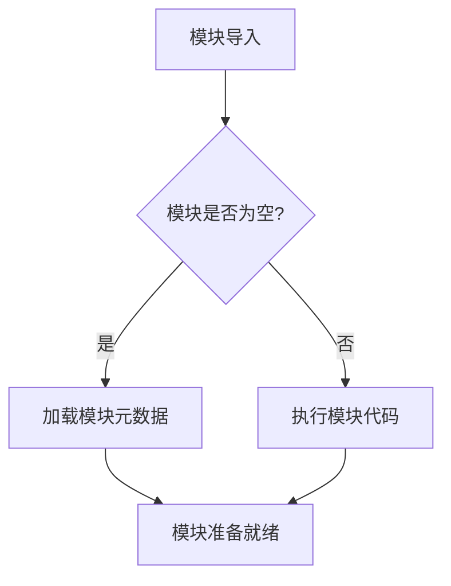

# `Bert-VITS2\tools\__init__.py` 详细设计文档

这是一个Python工具包模块的占位文件，仅包含模块级别的文档字符串'工具包'，目前没有任何具体的类、函数或变量定义，是一个空白的工具包初始化文件。

## 整体流程



## 类结构

```

```

## 全局变量及字段


    

## 全局函数及方法


## 关键组件


### 代码分析结果

提供的源代码仅包含一个空的模块文档字符串 `"""工具包"""`，没有实际的代码实现。因此无法识别具体的类、方法、函数、变量或关键组件。

### 核心功能

无（代码为空）

### 关键组件

无（代码为空）

### 潜在优化空间

无（代码为空）


## 问题及建议


### 已知问题

-   代码几乎为空，仅包含一个空的文档字符串模块声明
-   没有任何实际的类、方法、函数或变量定义
-   缺乏具体的功能实现，无法提供任何实际工具能力
-   没有定义任何接口或API，无法被其他模块调用

### 优化建议

-   明确该工具包的具体用途和功能定位
-   根据功能需求实现具体的工具类或函数
-   添加必要的模块导入和依赖项
-   考虑实现常用的工具函数（如文件操作、数据处理、字符串处理等）
-   添加适当的错误处理和异常设计
-   考虑添加单元测试以确保工具的可靠性
-   定义清晰的模块接口和导出列表（__all__）


## 其它


### 设计目标与约束

**设计目标**：本工具包旨在提供一套可复用的基础工具函数和类，供其他模块调用，以减少重复代码开发，提高代码复用性和项目开发效率。

**设计约束**：
- 保持工具函数的通用性和独立性，避免与业务逻辑耦合
- 遵循Python代码规范，采用清晰的命名约定
- 保持轻量级依赖，尽量减少外部库依赖

### 错误处理与异常设计

由于当前代码仅包含模块文档字符串，未定义具体的异常类或错误处理机制。建议在后续开发中考虑：
- 为工具函数定义具体的异常类型，如`ToolError`基类及其子类
- 在函数文档字符串中明确标注可能抛出的异常类型
- 提供有意义的错误信息，便于调试和问题定位

### 数据流与状态机

当前模块为工具包，无状态机设计。数据流主要体现在：
- 输入：外部调用者传入的参数
- 处理：工具函数内部的逻辑处理
- 输出：返回值或修改后的对象

### 外部依赖与接口契约

当前模块无外部依赖。若后续添加工具函数，应：
- 明确标注所需第三方库及其版本要求
- 在函数文档中说明输入参数的有效范围和类型要求
- 说明返回值的数据结构和可能的风险

### 性能考虑

由于代码未提供具体实现，无法进行性能分析。建议在后续开发中：
- 对性能敏感的函数进行性能测试
- 避免不必要的循环和嵌套
- 考虑使用缓存或生成器处理大数据集

### 安全性考虑

当前模块无安全相关实现。建议在后续开发中：
- 对外部输入进行严格的参数校验
- 避免使用eval或exec等危险函数
- 处理敏感信息时注意数据脱敏和加密

### 版本历史与变更记录

| 版本 | 日期 | 变更内容 |
|------|------|----------|
| 1.0.0 | 当前 | 初始版本，仅包含模块文档字符串 |

### 部署与运维

本工具包作为基础工具库，可通过pip安装或直接引用源码方式集成到主项目中。建议：
- 打包为可分发格式上传至私有仓库
- 持续集成测试确保兼容性
- 保持版本语义化控制


    