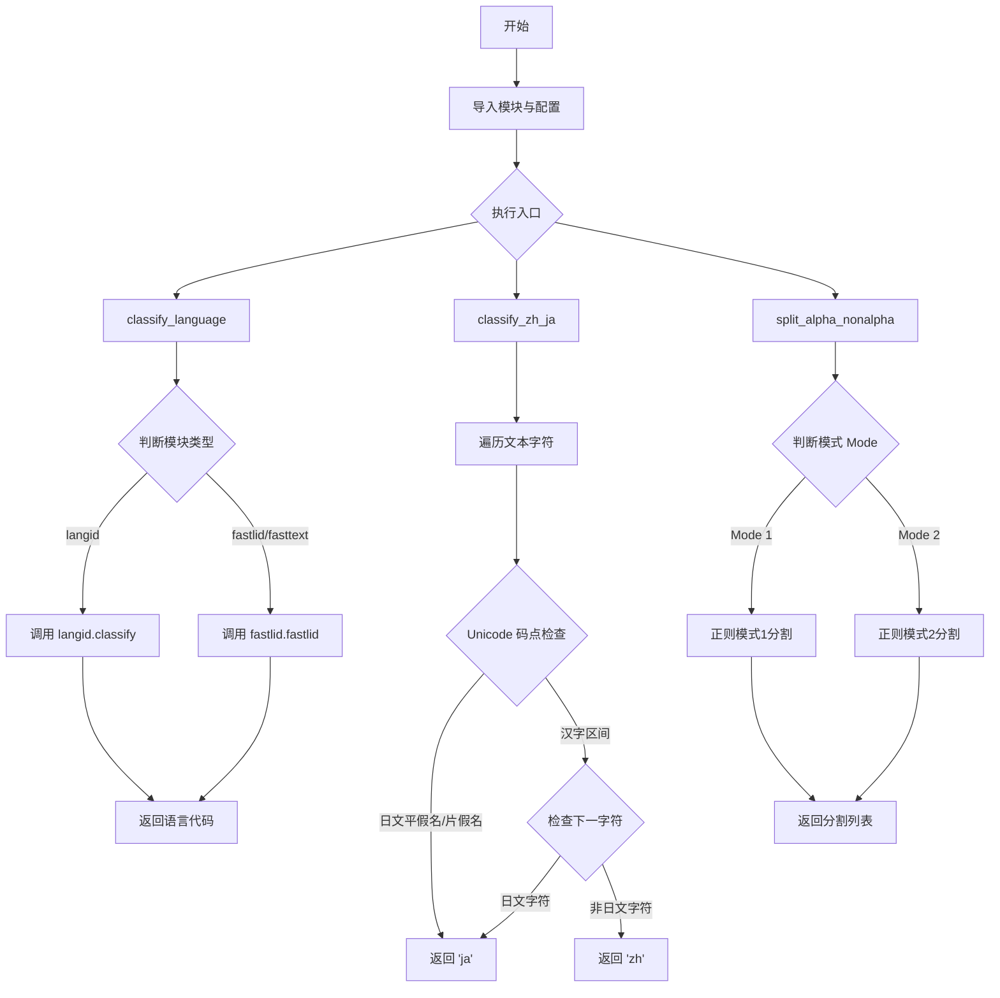
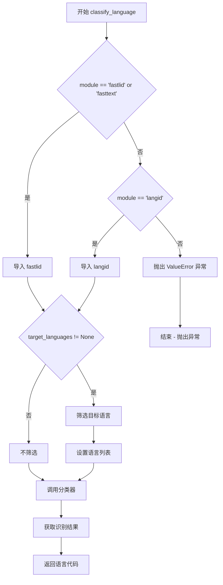
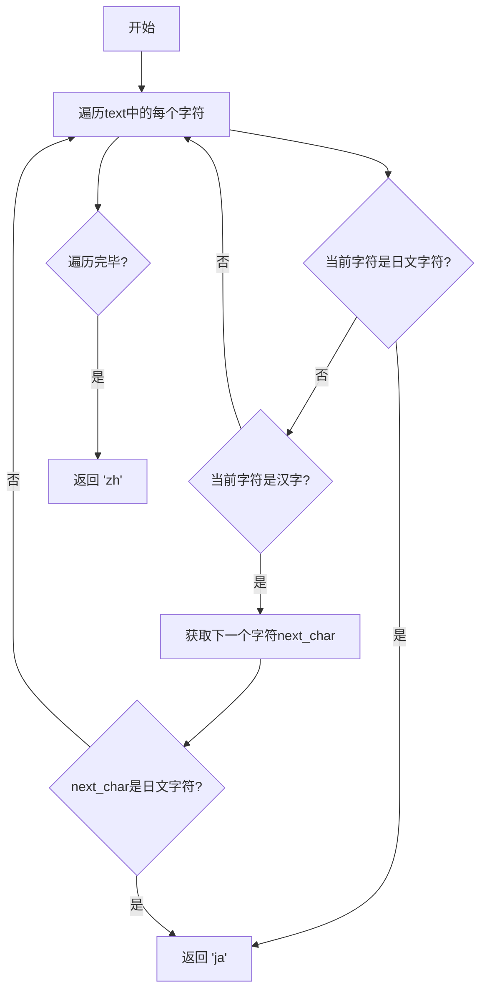
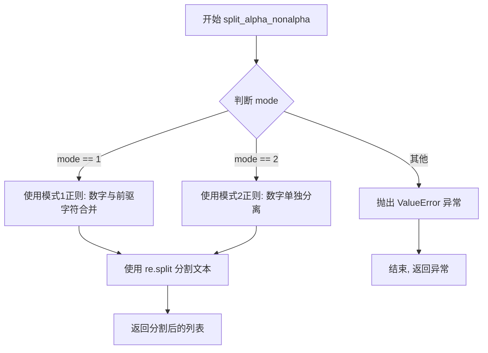

# `Bert-VITS2\tools\classify_language.py` 详细设计文档

这是一个文本处理工具模块，主要用于语言识别（支持 langid、fastlid 和 fasttext 库）和基于脚本的文本分割。该模块封装了多种语言识别算法，并提供了启发式规则区分中文与日文，以及使用正则表达式对混合文本（如中文、英文、数字混合）进行分词的工具函数。

## 整体流程



## 类结构

```
Module: language_processor (Procedural)
├── classify_language (语言识别函数)
├── classify_zh_ja (中日文区分函数)
└── split_alpha_nonalpha (文本分割函数)
```

## 全局变量及字段


### `LANGUAGE_IDENTIFICATION_LIBRARY`
    
语言识别库的名称，从配置中获取或默认为'langid'

类型：`str`
    


### `module`
    
将语言识别库名称转换为小写后的模块名

类型：`str`
    


### `langid_languages`
    
langid库支持的语言代码列表，包含约130种语言代码

类型：`list[str]`
    


    

## 全局函数及方法


### `classify_language`

该函数用于根据文本内容自动识别语言类型，支持通过配置选择使用 `fastlid`、`fasttext` 或 `langid` 三种语言识别库，并可指定目标语言列表进行筛选。

**参数：**

- `text`：`str`，需要进行语言分类的输入文本
- `target_languages`：`list`，可选参数，目标语言列表，用于限制识别库只返回列表中的语言，默认为 `None`

**返回值：** `str`，返回识别出的语言代码（如 "en", "zh", "ja" 等）

#### 流程图



#### 带注释源码

```python
def classify_language(text: str, target_languages: list = None) -> str:
    """
    根据配置的库对输入文本进行语言识别
    
    Args:
        text: 待识别的文本字符串
        target_languages: 可选的语言代码列表，用于限制识别范围
    
    Returns:
        识别出的语言代码字符串
    """
    
    # 判断使用的语言识别库
    if module == "fastlid" or module == "fasttext":
        # 动态导入 fastlid 库
        from fastlid import fastlid, supported_langs

        classifier = fastlid  # 设置分类器为 fastlid
        if target_languages != None:
            # 筛选出支持的目标语言
            target_languages = [
                lang for lang in target_languages if lang in supported_langs
            ]
            # 设置 fastlid 的语言范围
            fastlid.set_languages = target_languages
            
    elif module == "langid":
        # 动态导入 langid 库
        import langid

        classifier = langid.classify  # 设置分类器为 langid.classify
        if target_languages != None:
            # 筛选出支持的目标语言
            target_languages = [
                lang for lang in target_languages if lang in langid_languages
            ]
            # 设置 langid 的语言范围
            langid.set_languages(target_languages)
            
    else:
        # 如果配置的库不在支持列表中，抛出异常
        raise ValueError(f"Wrong module {module}")

    # 调用分类器获取识别结果，返回语言代码
    lang = classifier(text)[0]

    return lang
```


### `classify_zh_ja`

该函数通过检测文本中的Unicode字符范围来区分中文和日文。如果文本包含日文字符（平假名或片假名），则返回"ja"；如果文本中包含汉字且紧跟其后的字符也是日文字符，则也返回"ja"；否则返回"zh"。

参数：

-  `text`：`str`，需要分类的文本字符串

返回值：`str`，返回语言标识符，"zh"表示中文，"ja"表示日文

#### 流程图



#### 带注释源码

```python
def classify_zh_ja(text: str) -> str:
    """
    通过Unicode编码范围检测文本是中文还是日文
    
    参数:
        text: str, 输入的文本字符串
    
    返回:
        str: 'zh' 表示中文, 'ja' 表示日文
    """
    # 遍历文本中的每个字符及其索引
    for idx, char in enumerate(text):
        # 获取当前字符的Unicode码点值
        unicode_val = ord(char)

        # 检测日语字符 (平假名: 0x3040-0x309F, 片假名: 0x30A0-0x30FF)
        if 0x3040 <= unicode_val <= 0x309F or 0x30A0 <= unicode_val <= 0x30FF:
            # 如果发现日文字符，直接返回 'ja'
            return "ja"

        # 检测汉字字符 (CJK统一汉字: 0x4E00-0x9FFF)
        if 0x4E00 <= unicode_val <= 0x9FFF:
            # 检查周围的字符，判断是否是日文中的汉字
            # 获取下一个字符，如果不存在则设为None
            next_char = text[idx + 1] if idx + 1 < len(text) else None

            # 如果存在下一个字符且该字符是日文字符
            if next_char and (
                0x3040 <= ord(next_char) <= 0x309F or 0x30A0 <= ord(next_char) <= 0x30FF
            ):
                # 日文常使用汉字，所以需要结合上下文判断
                return "ja"

    # 遍历完所有字符未发现日文特征，返回中文标识
    return "zh"
```


### `split_alpha_nonalpha`

该函数用于将包含中文、日语、拉丁字母和数字的文本按照字符类型进行智能分割，支持两种分割模式（mode=1和mode=2），常用于多语言文本处理或TTS模型的文本预处理。

参数：

- `text`：`str`，需要分割的原始文本
- `mode`：`int`，可选，默认值为1。分割模式：mode=1保留数字与相邻字符在一起，mode=2将数字与相邻字符分开

返回值：`list[str]`，分割后的文本片段列表

#### 流程图



#### 带注释源码

```python
def split_alpha_nonalpha(text, mode=1):
    """
    根据字符类型（中文、日语、拉丁字母、数字）分割文本
    
    参数:
        text: str, 输入的混合语言文本
        mode: int, 分割模式 (1: 数字与前驱字符合并, 2: 数字单独分离)
    
    返回:
        list: 分割后的文本片段列表
    """
    # Mode 1: 数字与前面的中文字符/日语字符/空格合并
    # 使用正向后顾(?<=)和前瞻(?=)零宽断言在字符类型交界处标记分割点
    if mode == 1:
        pattern = r"(?<=[\u4e00-\u9fff\u3040-\u30FF\d\s])(?=[\p{Latin}])|(?<=[\p{Latin}\s])(?=[\u4e00-\u9fff\u3040-\u30FF\d])"
    
    # Mode 2: 数字单独分离出来，不与相邻字符合并
    elif mode == 2:
        pattern = r"(?<=[\u4e00-\u9fff\u3040-\u30FF\s])(?=[\p{Latin}\d])|(?<=[\p{Latin}\d\s])(?=[\u4e00-\u9fff\u3040-\u30FF])"
    
    # 不支持的模式则抛出异常
    else:
        raise ValueError("Invalid mode. Supported modes are 1 and 2.")

    # 使用正则表达式的split方法在标记位置分割文本
    # 返回分割后的字符串列表
    return re.split(pattern, text)
```

## 关键组件


### 语言识别库配置模块

动态加载配置的语言识别库（langid/fastlid/fasttext），并在导入失败时使用默认的 langid 库。

### 支持语言列表

包含 95 种语言代码的列表，用于验证目标语言是否被 langid 库支持。

### 语言分类函数 classify_language()

根据配置的模块动态调用不同的语言识别库（fastlid/fasttext 或 langid）进行文本语言分类，并支持过滤目标语言列表。

### 中日文区分函数 classify_zh_ja()

通过 Unicode 码点范围检测文本中的日语字符（平假名、片假名）和汉字字符，根据上下文区分中文和日语。

### 混合文本分割函数 split_alpha_nonalpha()

使用正则表达式零宽断言在中文/日文字符与拉丁字母/数字之间进行分割，支持两种模式处理不同的混合文本场景。


## 问题及建议


### 已知问题

-   **裸 except 子句隐藏错误**：第6-8行使用 `except:` 而非具体异常类型，会捕获所有异常（包括 KeyboardInterrupt），掩盖真正的导入错误
-   **模块级副作用**：`classify_language` 函数内部动态导入库并修改全局状态（`set_languages`），导致每次调用都可能执行副作用，难以测试和调试
-   **重复代码逻辑**：`target_languages` 过滤逻辑在 `fastlid` 和 `langid` 两个分支中重复，可提取为独立函数
-   **错误的 API 调用**：第41行 `fastlid.set_languages = target_languages` 应该是函数调用而非赋值，若 `fastlid` 库不存在对应属性会导致难以追踪的问题
-   **`classify_zh_ja` 算法简陋**：基于单个字符遍历的检测逻辑无法处理词边界、多音字歧义（如"日本"可指日本或"日本"这个文本），且混合文本（如"今天去Tokyo"）会误判
-   **硬编码语言列表**：`langid_languages` 手动维护了完整的语言代码列表，应从 `langid` 库动态获取以保持同步
- **全局可变状态**：`module` 变量在模块加载时固定，后续无法通过配置动态切换识别库
- **测试代码未分离**：主模块包含 `if __name__ == "__main__"` 演示代码，生产环境中不应包含

### 优化建议

- 将 `except:` 改为 `except ImportError:`
- 重构 `classify_language`，将库初始化延迟到模块级别或使用单例模式/依赖注入
- 提取 `target_languages` 过滤逻辑为独立函数，如 `_filter_supported_languages()`
- 确认 `fastlid` 库 API 并修正 `set_languages` 调用方式
- 考虑使用更可靠的中日文混合文本识别算法，或使用专门的 NLP 库（如 `jieba` + 规则）
- 使用 `langid.langid.get_language_model().languages` 或库提供的接口动态获取支持的语言列表
- 移除 `if __name__ == "__main__"` 中的演示代码，移至独立的测试文件
- 添加完整的类型注解（目前仅部分参数有类型提示）
- 考虑将正则表达式模式预编译以提升 `split_alpha_nonalpha` 性能

## 其它


### 设计目标与约束

本模块旨在实现多语言文本分类与中日语识别功能，支持灵活的语言库配置，提供统一的语言分类接口，同时处理混合语言文本的分词需求。核心约束包括：仅支持langid和fastlid/fasttext两种语言识别库，中日语识别基于Unicode区间判断，分词功能支持两种模式以适应不同场景。

### 错误处理与异常设计

模块涉及三类异常：配置导入异常（config模块不存在时使用默认langid库）、语言库不支持异常（module非langid/fastlid/fasttext时抛出ValueError）、分词模式异常（mode非1或2时抛出ValueError）。目标语言过滤时静默移除不支持的语言代码，不抛出异常。classify_language函数依赖外部库，异常传播由调用方处理。

### 数据流与状态机

主数据流：输入文本→语言分类判断→调用对应库函数→返回语言代码。classify_zh_ja采用单次遍历状态机，检测到日文字符立即返回"ja"，检测到汉字后前瞻下一字符判断是否混排。split_alpha_nonalpha基于正则零宽断言实现无分割符切分，mode参数决定数字与文字的分组策略。模块初始化时完成语言库加载和语言列表配置，运行时状态仅包含module和langid_languages。

### 外部依赖与接口契约

外部依赖：regex库（正则处理）、config.webui_config.language_identification_library（配置项，可选）、langid库或fastlid库（运行时动态导入）。导出接口：classify_language(text, target_languages)接收字符串和可选语言列表，返回语言代码字符串；classify_zh_ja(text)接收字符串返回"zh"或"ja"；split_alpha_nonalpha(text, mode)接收字符串和模式整数，返回字符串列表。所有函数在输入为空字符串时行为未定义，classify_language在无有效语言时返回空字符串。

### 性能考虑

classify_zh_ja使用单次字符遍历，时间复杂度O(n)。split_alpha_nonalpha的正则编译发生在函数调用时，高频调用场景可考虑预编译。langid_languages为静态列表，查询使用列表推导式过滤，时间复杂度O(n)。模块级别的import langid在首次调用classify_language时执行，后续调用无额外开销。

### 安全性考虑

模块未直接处理用户输入验证，classify_language和split_alpha_不执行sanitization。目标语言过滤仅做列表存在性检查，无注入风险。动态导入依赖module变量，module来源为配置或默认值"langid"，需确保配置层面对module取值进行约束。

### 可维护性与扩展性

语言库切换采用运行时动态导入，支持新增语言识别库但需遵循现有接口契约（callable(text)→(lang, prob)）。中日语识别硬编码Unicode区间，扩展到其他语言需新增专用函数。分词模式扩展需修改split_alpha_nonalpha的pattern分支。langid_languages列表手动维护，存在与实际库不同步风险。

### 测试策略建议

单元测试应覆盖：classify_language对langid和fastlid两种模式的输入输出验证、target_languages过滤有效性、异常module值触发ValueError；classify_zh_ja的纯中文、纯日文、中日混合、Unicode边界字符测试；split_alpha_nonalpha两种模式的分词正确性、空字符串和特殊字符处理；配置异常场景下的默认库回退。

### 版本兼容性与依赖管理

regex库版本需支持\p{Latin} Unicode属性，Python版本需支持f-string（3.6+）。langid_languages列表对应langid 2.x版本语言码，fastlid需单独安装。module变量lower()处理确保大小写不敏感。建议在requirements.txt或pyproject.toml中声明：regex、langid、fastlid（可选）。

### 配置管理与部署

LANGUAGE_IDENTIFICATION_LIBRARY通过config.webui_config读取，部署时需确保config模块存在或config.py中定义webui_config.language_identification_library默认值。生产环境建议显式指定库而非依赖隐式异常回退。模块无状态，部署为独立包或内嵌均可。


    