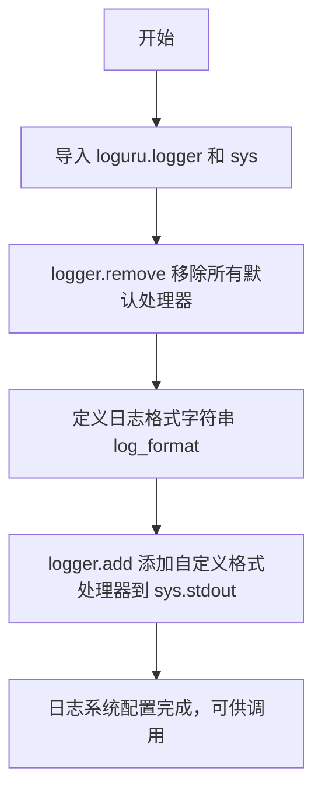
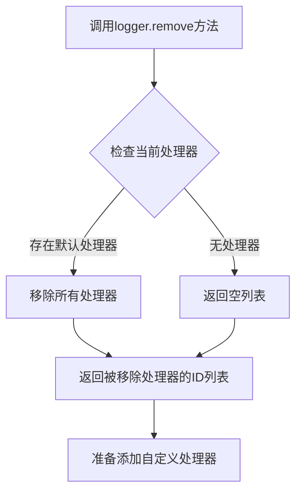
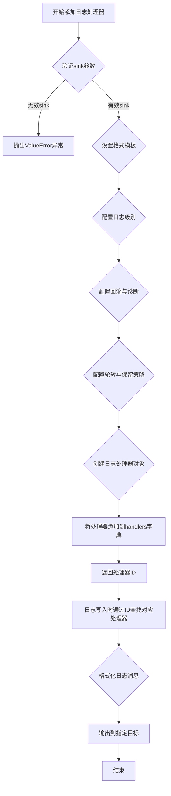

# `Bert-VITS2\tools\log.py` 详细设计文档

这是一个日志器封装模块，使用 loguru 库配置自定义格式的日志输出，移除默认处理器并添加带颜色和时间戳的标准输出处理器。

## 整体流程



## 类结构

```
无类层次结构 (模块级配置代码)
```

## 全局变量及字段


### `logger`
    
loguru日志记录器实例，提供日志记录功能

类型：`loguru.logger`
    


### `sys`
    
Python标准库sys模块，用于访问标准输出等系统功能

类型：`module`
    


### `log_format`
    
自定义日志格式字符串，包含时间、级别、文件名、行号和消息

类型：`str`
    


    

## 全局函数及方法


### `logger.remove()`

移除Loguru日志记录器中所有默认添加的处理器，以便后续可以添加自定义的处理器。

参数：

- （无参数）

返回值：`List[int]`，返回被移除的处理器ID列表，如果没有处理器被移除则返回空列表。

#### 流程图



#### 带注释源码

```python
# 移除所有默认的处理器
logger.remove()
```


### `logger.add`

该函数是 Loguru 日志库的核心方法，用于添加自定义日志处理器到日志系统，支持配置日志输出目标、格式模板、错误回溯和诊断功能，将日志信息格式化后输出到指定目标（标准输出或文件）。

参数：

- `sink`：输出目标，可以是文件路径、文件对象或可调用对象
- `format`：日志格式字符串，定义日志的输出样式，默认值为 `<green>{time:YYYY-MM-DD HH:mm:ss.SSS}</green> | <level>{level: <8}</level> | <cyan>{name}</cyan>:<cyan>{function}</cyan>:<cyan>{line}</cyan> - <level>{message}</level>`
- `level`：日志级别，指定该处理器处理的最低日志级别，默认为 0（TRACE 级别）
- `rotation`：日志轮转条件，可以是时间间隔（如 `"00:00"`）或文件大小（如 `"10 MB"`）
- `retention`：日志保留策略，可以是时间跨度（如 `"1 week"`）或最大日志文件数量
- `compression`：日志压缩格式，支持 `"zip"`、`.gz"` 等
- `backtrace`：`bool` 类型，是否启用错误回溯显示，默认为 `False`
- `diagnose`：`bool` 类型，是否启用诊断信息显示，默认为 `True`
- `colorize`：`bool` 类型，是否启用彩色输出，默认为 `False`（终端支持时自动启用）
- `serialize`：`bool` 类型，是否将日志序列化为 JSON 格式，默认为 `False`
- `async_`：`bool` 类型，是否异步写入日志，默认为 `False`
- `bufferize`：`bool` 类型，是否启用缓冲，默认为 `False`
- `backpressure`：`bool` 类型，是否启用背压机制，默认为 `False`
- `enqueue`：`bool` 类型，是否将日志写入队列，默认为 `False`

返回值：`int`，返回该日志处理器的唯一标识 ID，用于后续通过 `logger.remove()` 方法移除该处理器。

#### 流程图



#### 带注释源码

```python
# 导入Loguru日志库
from loguru import logger
# 导入系统模块用于获取标准输出
import sys

# 移除所有默认的处理器，避免重复输出
logger.remove()

# 定义自定义日志格式模板
# <g>...</g>: 使用绿色显示时间
# {time:MM-DD HH:mm:ss}: 格式化时间为月-日 时:分:秒
# <lvl>...</lvl>: 日志级别
# {level:<9}: 日志级别左对齐，宽度9
# {file}: 日志产生的文件名
# {line}: 日志产生的行号
# {message}: 日志消息内容
log_format = (
    "<g>{time:MM-DD HH:mm:ss}</g> <lvl>{level:<9}</lvl>| {file}:{line} | {message}"
)

# 添加日志处理器到标准输出
# 参数说明：
# - sys.stdout: 输出目标为标准输出
# - format: 使用自定义格式模板
# - backtrace=True: 启用错误回溯，显示完整的异常堆栈信息
# - diagnose=True: 启用诊断信息，显示更详细的错误上下文
logger.add(sys.stdout, format=log_format, backtrace=True, diagnose=True)
```

#### 关键组件信息

| 组件名称 | 描述 |
|---------|------|
| `log_format` | 日志格式模板字符串，定义日志的输出样式和布局 |
| `sys.stdout` | 标准输出流，作为日志的输出目标 |
| `backtrace` | 错误回溯开关，控制是否显示完整的异常堆栈信息 |
| `diagnose` | 诊断开关，控制是否显示详细的错误上下文信息 |

#### 潜在的技术债务或优化空间

1. **硬编码配置问题**：日志格式、输出目标等配置硬编码在代码中，缺乏灵活性，建议通过配置文件或环境变量管理
2. **缺少日志级别控制**：未显式设置日志级别，默认可能输出过多调试信息，建议根据环境配置不同级别
3. **未实现日志轮转**：当前配置未设置日志文件轮转机制，生产环境可能导致日志文件过大
4. **单一输出目标**：仅配置了标准输出，未配置文件输出，生产环境通常需要同时输出到文件和控制台
5. **缺乏错误处理**：未对 `logger.add()` 的返回值进行保存和管理，后续无法精确移除特定处理器

#### 其它项目

**设计目标与约束**：
- 目标：统一日志输出格式，提供可读性强的日志信息
- 约束：依赖 Loguru 库，需要确保该库已安装

**错误处理与异常设计**：
- Loguru 库本身已封装完善的异常处理机制
- 建议对重要日志操作添加 try-except 保护

**数据流与状态机**：
- 日志数据流：应用程序 → Logger → Handler → Formatter → Output
- 状态：初始化 → 配置处理器 → 运行时日志输出 → 处理器管理

**外部依赖与接口契约**：
- 依赖：`loguru` 库（需通过 `pip install loguru` 安装）
- 接口：遵循 Loguru 官方定义的 `logger.add()` 方法签名

## 关键组件


### 一段话描述

该代码是一个轻量级的日志封装模块，通过配置loguru库的日志格式和输出处理器，将日志以结构化的方式输出到标准输出，支持时间戳、日志级别、文件名和行号等信息显示。

### 文件的整体运行流程

1. 导入loguru和sys模块
2. 移除logger的默认处理器
3. 定义自定义日志格式字符串
4. 将配置好的格式添加到标准输出流

### 全局变量和全局函数详细信息

#### 全局变量

| 名称 | 类型 | 描述 |
|------|------|------|
| logger | Logger | loguru库提供的日志记录器单例 |
| sys | module | Python标准库的系统模块，用于访问标准输出 |
| log_format | str | 自定义日志格式字符串，包含时间、级别、文件和消息 |

#### 全局函数

无独立函数，所有配置均在模块顶层执行。

### 关键组件信息

### 日志格式化器 (log_format)

定义了日志输出的格式模板，包含时间戳（MM-DD HH:mm:ss）、日志级别（9字符左对齐）、文件名和行号、消息内容，使用颜色标签<g>和<lvl>增强可读性。

### 标准输出处理器

将配置好的日志格式绑定到sys.stdout，实现日志向标准输出流打印，支持backtrace和diagnose增强调试能力。

### 日志记录器 (logger)

loguru库提供的全局日志单例，移除默认处理器后作为配置入口使用。

### 潜在的技术债务或优化空间

1. **缺乏日志级别控制**：未提供运行时动态调整日志级别的接口，生产环境需要支持DEBUG/INFO/WARNING/ERROR等级别过滤
2. **硬编码配置**：日志格式和输出目标直接写死，缺乏从配置文件或环境变量读取的灵活性
3. **无日志文件输出**：仅输出到stdout，线上环境通常需要同时输出到文件并支持日志轮转
4. **缺少模块标识**：日志格式中未包含模块名或业务标识，多模块场景下难以追踪日志来源

### 其它项目

#### 设计目标与约束
- 目标：提供统一美观的日志输出格式
- 约束：依赖loguru第三方库，需确保项目已安装

#### 错误处理与异常设计
- 本模块无异常处理逻辑，loguru自身具备良好的异常捕获机制

#### 外部依赖与接口契约
- 依赖：loguru>=0.5.0
- 接口：直接使用logger.info()/debug()/warning()/error()等方法即可，无需额外调用初始化函数


## 问题及建议


### 已知问题

-   **硬编码配置缺乏灵活性**：日志格式、输出目标、backtrace、diagnose等参数均被硬编码，无法通过外部配置动态调整，违反了可配置性原则
-   **日志级别未明确设置**：未显式设置日志级别，默认行为依赖loguru的内部逻辑，可能导致不同环境下日志输出不一致
-   **缺少文件输出配置**：仅配置了标准输出（stdout），生产环境通常需要持久化的文件日志，当前实现无法满足
-   **缺少日志轮转机制**：没有配置日志轮转（rotation）、 retention、compression等策略，长期运行可能导致日志文件过大
-   **重复初始化风险**：模块每次被导入时都会执行logger.add()，虽然调用了logger.remove()移除了默认处理器，但可能造成自定义handler重复添加
-   **性能开销未考虑**：backtrace=True和diagnose=True全局启用，会增加内存和CPU开销，在生产环境可能影响性能
-   **缺乏类型注解**：代码未使用类型注解，降低了代码的可读性和IDE支持
-   **单一输出目标限制**：当前仅支持stdout，缺少多目标输出（如同时输出到控制台和文件、不同级别分别输出到不同文件等）

### 优化建议

-   将日志配置抽象为可配置的参数，支持通过环境变量或配置文件传入
-   明确设置日志级别（如logger.level("INFO")），确保行为可预期
-   提供可选的文件输出配置，支持日志轮转、保留策略等
-   实现单例模式或使用缓存机制防止重复初始化handler
-   在生产环境默认关闭backtrace和diagnose，提供开关按需启用
-   添加类型注解提升代码质量
-   支持多handler输出，可配置不同级别输出到不同目标
-   提供统一的日志实例导出，避免直接使用loguru模块
-   考虑添加日志过滤能力，支持自定义过滤规则
-   封装为独立的Logger类，支持更灵活的扩展


## 其它


### 一段话描述

本模块是对loguru日志库的轻量级封装，通过移除默认处理器并添加自定义格式的stdout处理器，实现统一的项目日志配置。

### 文件整体运行流程

1. 模块导入时执行初始化代码
2. 移除loguru默认的所有日志处理器
3. 定义日志输出格式模板（包含时间、日志级别、文件名、行号、消息）
4. 将配置好的处理器添加到标准输出流

### 全局变量信息

| 名称 | 类型 | 描述 |
|------|------|------|
| logger | Logger | loguru库提供的日志记录器实例 |
| log_format | str | 日志输出格式模板字符串 |

### 全局函数信息

本模块无自定义全局函数，所有操作均在模块加载时执行。

### 关键组件信息

| 组件名称 | 描述 |
|----------|------|
| logger | loguru日志记录器核心对象，提供debug/info/warning/error等日志方法 |
| log_format | 日志格式定义，包含时间、级别、文件位置、消息等占位符 |
| sys.stdout | 日志输出的目标流（标准输出） |

### 潜在的技术债务或优化空间

1. **硬编码配置**：日志格式和输出目标均硬编码，缺乏灵活性
2. **缺少日志级别控制**：未设置默认日志级别，可能输出过多日志
3. **无文件输出**：仅输出到stdout，生产环境通常需要同时输出到文件
4. **无配置接口**：无法通过参数动态配置日志行为
5. **无错误处理**：模块初始化失败时缺乏错误捕获机制

### 设计目标与约束

- **设计目标**：统一项目日志格式，提供开箱即用的日志配置
- **约束**：依赖loguru库，仅输出到标准输出

### 错误处理与异常设计

- 依赖loguru自身的异常处理机制
- 添加了backtrace=True和diagnose=True以提供详细的错误堆栈信息

### 外部依赖与接口契约

- **依赖**：loguru库（第三方）、sys模块（标准库）
- **接口契约**：导入后可直接使用logger对象进行日志记录

### 使用示例

```python
from logger import logger

logger.info("这是一条信息日志")
logger.warning("这是一条警告日志")
logger.error("这是一条错误日志")
```

### 日志格式说明

| 占位符 | 含义 |
|--------|------|
| {time:MM-DD HH:mm:ss} | 月-日 时:分:秒格式的时间 |
| {level:<9} | 左对齐的日志级别名称（宽度9） |
| {file} | 输出日志的文件名 |
| {line} | 输出日志的行号 |
| {message} | 日志消息内容 |
| <g> | 绿色文本（终端颜色） |
| <lvl> | 日志级别颜色 |


    